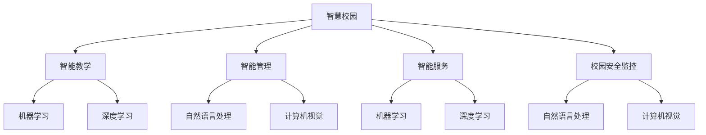

                 

# 人工智能在智慧校园管理中的应用

> **关键词**：智慧校园、人工智能、机器学习、深度学习、自然语言处理、计算机视觉

> **摘要**：本文将深入探讨人工智能在智慧校园管理中的应用，通过分析核心概念、算法原理、数学模型及实际项目实战，全面解析人工智能技术在校园安全监控、教育资源优化、校园设施管理等方面的应用与实践，为推动智慧校园的发展提供新思路。

## 目录

1. **引言与背景**
   1.1 智慧校园概述
   1.2 人工智能发展背景
2. **核心概念与联系**
   2.1 机器学习
   2.2 深度学习
   2.3 自然语言处理
   2.4 计算机视觉
   2.5 Mermaid 流程图：人工智能与智慧校园的核心概念联系
3. **核心算法原理讲解**
   3.1 机器学习算法
   3.2 深度学习算法
   3.3 自然语言处理算法
   3.4 计算机视觉算法
   3.5 伪代码示例：深度学习算法原理
4. **数学模型与公式讲解**
   4.1 概率论基础
   4.2 统计学基础
   4.3 深度学习中的激活函数
   4.4 优化算法
   4.5 LaTeX 示例：优化算法中的损失函数
5. **项目实战**
   5.1 智慧校园项目案例介绍
   5.2 开发环境搭建
   5.3 源代码实现与解读
   5.4 代码解读与分析
   5.5 实战案例：基于深度学习的智慧校园安全监控
6. **应用与未来展望**
   6.1 人工智能在智慧校园中的实际应用案例
   6.2 人工智能在智慧校园中的挑战与机遇
   6.3 智慧校园的发展趋势与未来展望
7. **附录**
   7.1 常用算法与工具介绍
   7.2 深度学习框架使用指南
   7.3 学习资源与推荐书籍

## 第一部分：引言与背景

### 1.1 智慧校园概述

智慧校园是指利用先进的信息技术，实现教育教学、管理服务、校园文化等多方面的智能化，从而构建一个高效、便捷、安全、绿色的教育生态系统。智慧校园的目标是提升教育质量，优化教育资源分配，提高校园管理效率，创造一个智能、和谐、充满活力的学习环境。

智慧校园的核心要素包括：智能教学、智能管理、智能服务、智能安全等。其中，智能教学主要是指利用人工智能、虚拟现实等技术进行个性化教学、智能评估等；智能管理则涉及校园安防、后勤管理、教学资源调度等方面；智能服务包括在线学习、智能咨询、校园导航等；智能安全则涉及网络安全、数据安全、校园安全等。

### 1.2 人工智能在智慧校园中的应用价值

人工智能在智慧校园管理中具有广泛的应用价值，主要体现在以下几个方面：

1. **教学辅助**：人工智能可以为学生提供个性化的学习路径和资源推荐，提高学习效率。例如，通过分析学生的学习行为和成绩数据，智能教学系统可以为学生量身定制学习计划和课程推荐。

2. **教育资源优化**：人工智能可以通过大数据分析和智能调度，优化教育资源的配置。例如，通过分析教师的教学能力和学生的学习需求，智能系统可以为教师和班级分配最合适的课程资源。

3. **校园设施管理**：人工智能可以通过智能传感器和物联网技术，实现对校园设施的管理和维护。例如，智能监控系统可以实时监测校园环境，预防安全事故的发生。

4. **校园安全监控**：人工智能可以通过计算机视觉和自然语言处理技术，实现对校园安全的实时监控和分析。例如，智能监控系统可以识别异常行为和危险情况，及时发出警报。

5. **智能咨询服务**：人工智能可以通过自然语言处理技术，为学生和教师提供智能咨询服务。例如，智能问答系统可以解答学生和教师的常见问题，提供学习指导和帮助。

6. **校园文化构建**：人工智能可以通过大数据分析和智能分析，挖掘校园文化的内涵和外延，为学生提供丰富多彩的校园文化活动。

### 1.3 人工智能在智慧校园中的应用场景

1. **智能教学**：利用人工智能技术，实现个性化教学和智能评估。例如，通过分析学生的学习行为和成绩，智能教学系统可以为学生提供个性化的学习建议和资源推荐。

2. **智能管理**：利用人工智能技术，实现对校园设施的智能管理和维护。例如，智能监控系统可以实时监测校园环境，预防安全事故的发生。

3. **智能服务**：利用人工智能技术，为学生和教师提供智能咨询服务。例如，智能问答系统可以解答学生和教师的常见问题，提供学习指导和帮助。

4. **校园安全监控**：利用人工智能技术，实现对校园安全的实时监控和分析。例如，智能监控系统可以识别异常行为和危险情况，及时发出警报。

5. **校园文化构建**：利用人工智能技术，挖掘校园文化的内涵和外延，为学生提供丰富多彩的校园文化活动。

## 第二部分：核心概念与联系

### 2.1 机器学习

机器学习是人工智能的一个重要分支，它通过算法和统计方法，使计算机系统能够从数据中自动学习，从而进行预测或决策。机器学习的基本概念包括数据集、模型、训练和测试等。

#### 2.1.1 数据集

数据集是机器学习的基石，它包含了大量输入数据和对应的标签。输入数据通常是特征向量，标签则是我们希望预测的目标。

#### 2.1.2 模型

模型是机器学习的核心，它是一个数学函数，用于将输入数据映射到输出结果。常见的模型有线性回归、决策树、支持向量机等。

#### 2.1.3 训练和测试

训练是机器学习的核心步骤，它通过迭代调整模型的参数，使得模型能够在训练集上获得良好的性能。测试则是评估模型在未知数据上的表现，常用的评价指标有准确率、召回率、F1值等。

### 2.2 深度学习

深度学习是机器学习的一个分支，它通过构建多层的神经网络，实现对复杂数据的自动特征提取和表示。深度学习的基本概念包括神经网络、激活函数、反向传播等。

#### 2.2.1 神经网络

神经网络是由大量简单神经元组成的复杂网络，每个神经元都是一个简单的数学函数。神经网络通过多层堆叠，实现对数据的深层特征提取。

#### 2.2.2 激活函数

激活函数是神经网络中用于引入非线性性的函数，常见的激活函数有Sigmoid、ReLU、Tanh等。

#### 2.2.3 反向传播

反向传播是深度学习训练的核心算法，它通过反向传播误差信号，调整网络权重，使得模型在训练集上获得更好的性能。

### 2.3 自然语言处理

自然语言处理是人工智能的一个分支，它涉及计算机对自然语言的理解和生成。自然语言处理的基本概念包括词向量、序列标注、文本分类等。

#### 2.3.1 词向量

词向量是将单词映射为一个高维向量，用于表示单词的意义和关系。常见的词向量模型有Word2Vec、GloVe等。

#### 2.3.2 序列标注

序列标注是将输入序列中的每个元素标注为不同的标签，例如，将句子中的每个单词标注为“名词”、“动词”等。

#### 2.3.3 文本分类

文本分类是将文本数据分为不同的类别，例如，将新闻文章分为体育、财经、娱乐等类别。

### 2.4 计算机视觉

计算机视觉是人工智能的一个分支，它涉及计算机对图像和视频的理解和分析。计算机视觉的基本概念包括目标检测、图像分类、人脸识别等。

#### 2.4.1 目标检测

目标检测是将图像中的目标物体定位和分类的过程。常见的目标检测算法有YOLO、SSD、Faster R-CNN等。

#### 2.4.2 图像分类

图像分类是将图像分为不同的类别，例如，将猫和狗的图像分类。常见的图像分类算法有卷积神经网络、支持向量机等。

#### 2.4.3 人脸识别

人脸识别是将人脸图像中的每个人脸定位并识别为特定个体的过程。常见的人脸识别算法有深度学习、特征匹配等。

### 2.5 Mermaid 流程图：人工智能与智慧校园的核心概念联系

下面是人工智能与智慧校园核心概念联系的 Mermaid 流程图：



通过这个流程图，我们可以清晰地看到人工智能各个核心概念与智慧校园各应用领域的联系。接下来，我们将进一步探讨这些核心算法原理和数学模型。

### 第三部分：核心算法原理讲解

#### 3.1 机器学习算法

机器学习算法是人工智能的基础，它通过从数据中自动学习规律，实现预测和决策。以下是几种常见的机器学习算法及其基本原理：

##### 3.1.1 线性回归

线性回归是一种用于预测连续值的简单算法，它通过拟合一个线性模型来预测目标值。线性回归的基本原理如下：

1. **模型表示**：\( y = w_0 + w_1 \cdot x + \epsilon \)
2. **损失函数**：\( L(w_0, w_1) = \frac{1}{2} \sum_{i=1}^{n} (y_i - (w_0 + w_1 \cdot x_i))^2 \)
3. **优化算法**：梯度下降

```python
# 伪代码：线性回归
def linear_regression(x, y):
    w_0 = 0
    w_1 = 0
    for epoch in range(num_epochs):
        gradient_w_0 = sum(y - (w_0 + w_1 * x))
        gradient_w_1 = sum((y - (w_0 + w_1 * x)) * x)
        w_0 -= learning_rate * gradient_w_0
        w_1 -= learning_rate * gradient_w_1
    return w_0, w_1
```

##### 3.1.2 决策树

决策树是一种基于树形结构进行决策的算法，它通过连续划分特征空间，将数据划分为不同的区域。决策树的基本原理如下：

1. **模型表示**：一系列的决策路径和结果
2. **损失函数**：信息增益、基尼不纯度等
3. **优化算法**：ID3、C4.5、CART等

```python
# 伪代码：决策树
def decision_tree(data, target):
    if is_leaf(data):
        return most_common(target)
    else:
        best_feature = select_best_feature(data, target)
        tree = {}
        for value in unique_values(best_feature):
            subset = split_data(data, best_feature, value)
            tree[value] = decision_tree(subset, target)
        return tree
```

##### 3.1.3 支持向量机

支持向量机是一种用于分类和回归的算法，它通过找到一个最佳的超平面，将数据分为不同的类别。支持向量机的基本原理如下：

1. **模型表示**：\( w \cdot x + b = 0 \)
2. **损失函数**：软边缘损失函数
3. **优化算法**：SMO算法

```python
# 伪代码：支持向量机
def svm(x, y):
    w = 0
    b = 0
    for epoch in range(num_epochs):
        for i in range(n_samples):
            if (y[i] * (w \* x[i] + b)) <= 1:
                gradient_w = -y[i] * x[i]
                gradient_b = -y[i]
                w -= learning_rate * gradient_w
                b -= learning_rate * gradient_b
    return w, b
```

#### 3.2 深度学习算法

深度学习算法通过构建多层神经网络，实现复杂特征提取和表示。以下是几种常见的深度学习算法及其基本原理：

##### 3.2.1 卷积神经网络（CNN）

卷积神经网络是一种用于图像处理的深度学习算法，它通过卷积层、池化层和全连接层等结构，实现对图像的特征提取和分类。卷积神经网络的基本原理如下：

1. **模型表示**：多层卷积神经网络
2. **损失函数**：交叉熵损失函数
3. **优化算法**：反向传播算法

```python
# 伪代码：卷积神经网络
def conv_network(x, y):
    w_conv1 = 0
    b_conv1 = 0
    for epoch in range(num_epochs):
        for i in range(n_samples):
            z = conv2d(x[i], w_conv1) + b_conv1
            a = relu(z)
            z = max_pool2d(a)
            z = flatten(z)
            z = fully_connected(z, w_fc1) + b_fc1
            a = softmax(z)
            loss = cross_entropy_loss(a, y[i])
            dloss_dz = gradients(a, y[i])
            dz_dw_fc1 = d_matrix(z)
            dz_da = relu_derivative(a)
            dz_dz = conv2d_derivative(x[i], w_conv1)
            dloss_dw_fc1 = dz_dz \* dz_da \* dz_dz
            dloss_db_fc1 = dz_dz \* dz_da
            w_conv1 -= learning_rate * dloss_dw_conv1
            b_conv1 -= learning_rate * dloss_db_conv1
    return w_conv1, b_conv1
```

##### 3.2.2 循环神经网络（RNN）

循环神经网络是一种用于处理序列数据的深度学习算法，它通过构建循环结构，实现对序列数据的记忆和建模。循环神经网络的基本原理如下：

1. **模型表示**：循环神经网络结构
2. **损失函数**：交叉熵损失函数
3. **优化算法**：反向传播算法

```python
# 伪代码：循环神经网络
def rnn(x, y):
    w隐藏 = 0
    b隐藏 = 0
    w输出 = 0
    b输出 = 0
    for epoch in range(num_epochs):
        for i in range(n_samples):
            hidden = sigmoid(w隐藏 \* x[i] + b隐藏)
            output = sigmoid(w输出 \* hidden + b输出)
            loss = cross_entropy_loss(output, y[i])
            dloss_doutput = gradients(output, y[i])
            dloss_dhidden = dloss_doutput \* (1 - hidden)
            dloss_dw_output = hidden
            dloss_db_output = 1
            dloss_dw隐藏 = x[i] \* dloss_dhidden
            dloss_db隐藏 = 1
            w输出 -= learning_rate * dloss_dw_output
            b输出 -= learning_rate * dloss_db_output
            w隐藏 -= learning_rate * dloss_dw隐藏
            b隐藏 -= learning_rate * dloss_db隐藏
    return w隐藏, b隐藏, w输出, b输出
```

#### 3.3 自然语言处理算法

自然语言处理算法用于处理文本数据，实现对文本的理解和生成。以下是几种常见的自然语言处理算法及其基本原理：

##### 3.3.1 词向量

词向量是将单词映射为一个高维向量，用于表示单词的意义和关系。常见的词向量模型有Word2Vec、GloVe等。

1. **模型表示**：单词向量空间
2. **损失函数**：负采样损失函数
3. **优化算法**：梯度下降

```python
# 伪代码：词向量
def word2vec(data):
    w = np.random.normal(size=(vocab_size, dim))
    for epoch in range(num_epochs):
        for sentence in data:
            for word in sentence:
                context = negative_sampling(word)
                loss = 0
                for context_word in context:
                    predicted = sigmoid(w[context_word].dot(w[word]))
                    loss += -log(predicted)
                dloss_dw = negative_sampling_derivative(word, context)
                w -= learning_rate * dloss_dw
    return w
```

##### 3.3.2 序列标注

序列标注是将输入序列中的每个元素标注为不同的标签，例如，将句子中的每个单词标注为“名词”、“动词”等。

1. **模型表示**：双向循环神经网络
2. **损失函数**：交叉熵损失函数
3. **优化算法**：反向传播算法

```python
# 伪代码：序列标注
def sequence_labeling(x, y):
    w隐藏 = 0
    b隐藏 = 0
    w输出 = 0
    b输出 = 0
    for epoch in range(num_epochs):
        for i in range(n_samples):
            hidden = tanh(w隐藏 \* x[i] + b隐藏)
            output = softmax(w输出 \* hidden + b输出)
            loss = cross_entropy_loss(output, y[i])
            dloss_doutput = gradients(output, y[i])
            dloss_dhidden = dloss_doutput \* (1 - hidden)
            dloss_dw_output = hidden
            dloss_db_output = 1
            dloss_dw隐藏 = x[i] \* dloss_dhidden
            dloss_db隐藏 = 1
            w输出 -= learning_rate * dloss_dw_output
            b输出 -= learning_rate * dloss_db_output
            w隐藏 -= learning_rate * dloss_dw隐藏
            b隐藏 -= learning_rate * dloss_db隐藏
    return w隐藏, b隐藏, w输出, b输出
```

##### 3.3.3 文本分类

文本分类是将文本数据分为不同的类别，例如，将新闻文章分为体育、财经、娱乐等类别。

1. **模型表示**：卷积神经网络、循环神经网络等
2. **损失函数**：交叉熵损失函数
3. **优化算法**：反向传播算法

```python
# 伪代码：文本分类
def text_classification(x, y):
    w_conv = 0
    b_conv = 0
    w_pool = 0
    w_fc = 0
    b_fc = 0
    for epoch in range(num_epochs):
        for i in range(n_samples):
            z = conv2d(x[i], w_conv) + b_conv
            a = max_pool2d(relu(z))
            a = flatten(a)
            z = fully_connected(a, w_pool) + b_pool
            a = softmax(z)
            loss = cross_entropy_loss(a, y[i])
            dloss_dz = gradients(a, y[i])
            dloss_da = conv2d_derivative(x[i], w_conv)
            dloss_dw_conv = d_matrix(z) \* dloss_da
            dloss_db_conv = 1
            dloss_da_pool = d_matrix(a) \* dloss_dz
            dloss_dw_pool = a
            dloss_db_pool = 1
            dloss_dz = fully_connected_derivative(a, w_pool) \* dloss_dz
            dloss_dw_fc = a
            dloss_db_fc = 1
            w_conv -= learning_rate * dloss_dw_conv
            b_conv -= learning_rate * dloss_db_conv
            w_pool -= learning_rate * dloss_dw_pool
            b_pool -= learning_rate * dloss_db_pool
            w_fc -= learning_rate * dloss_dw_fc
            b_fc -= learning_rate * dloss_db_fc
    return w_conv, b_conv, w_pool, b_pool, w_fc, b_fc
```

#### 3.4 计算机视觉算法

计算机视觉算法用于处理图像和视频数据，实现对图像的理解和分析。以下是几种常见的计算机视觉算法及其基本原理：

##### 3.4.1 目标检测

目标检测是将图像中的目标物体定位和分类的过程。常见的目标检测算法有YOLO、SSD、Faster R-CNN等。

1. **模型表示**：卷积神经网络、锚点生成、回归和分类
2. **损失函数**：回归损失和分类损失
3. **优化算法**：反向传播算法

```python
# 伪代码：目标检测
def object_detection(x, y):
    w_conv = 0
    b_conv = 0
    w_regression = 0
    b_regression = 0
    w_classification = 0
    b_classification = 0
    for epoch in range(num_epochs):
        for i in range(n_samples):
            z = conv2d(x[i], w_conv) + b_conv
            anchors = generate_anchors()
            regression = fully_connected(z, w_regression) + b_regression
            classification = fully_connected(z, w_classification) + b_classification
            loss_regression = regression_loss(y[i], regression, anchors)
            loss_classification = classification_loss(y[i], classification)
            dloss_dregression = gradients(regression, loss_regression)
            dloss_dclassification = gradients(classification, loss_classification)
            dloss_dz = d_matrix(z)
            dloss_dw_conv = dloss_dz \* d_matrix(x[i])
            dloss_db_conv = 1
            dloss_dw_regression = d_matrix(regression) \* dloss_dregression
            dloss_db_regression = 1
            dloss_dw_classification = d_matrix(classification) \* dloss_dclassification
            dloss_db_classification = 1
            w_conv -= learning_rate * dloss_dw_conv
            b_conv -= learning_rate * dloss_db_conv
            w_regression -= learning_rate * dloss_dw_regression
            b_regression -= learning_rate * dloss_db_regression
            w_classification -= learning_rate * dloss_dw_classification
            b_classification -= learning_rate * dloss_db_classification
    return w_conv, b_conv, w_regression, b_regression, w_classification, b_classification
```

##### 3.4.2 图像分类

图像分类是将图像分为不同的类别，例如，将猫和狗的图像分类。常见的图像分类算法有卷积神经网络、支持向量机等。

1. **模型表示**：卷积神经网络、全连接层
2. **损失函数**：交叉熵损失函数
3. **优化算法**：反向传播算法

```python
# 伪代码：图像分类
def image_classification(x, y):
    w_conv = 0
    b_conv = 0
    w_fc = 0
    b_fc = 0
    for epoch in range(num_epochs):
        for i in range(n_samples):
            z = conv2d(x[i], w_conv) + b_conv
            z = max_pool2d(z)
            z = flatten(z)
            z = fully_connected(z, w_fc) + b_fc
            a = softmax(z)
            loss = cross_entropy_loss(a, y[i])
            dloss_dz = gradients(a, loss)
            dloss_da = fully_connected_derivative(z, w_fc) \* dloss_dz
            dloss_dz = conv2d_derivative(x[i], w_conv)
            dloss_dw_conv = d_matrix(z) \* dloss_da
            dloss_db_conv = 1
            dloss_dw_fc = z
            dloss_db_fc = 1
            w_conv -= learning_rate * dloss_dw_conv
            b_conv -= learning_rate * dloss_db_conv
            w_fc -= learning_rate * dloss_dw_fc
            b_fc -= learning_rate * dloss_db_fc
    return w_conv, b_conv, w_fc, b_fc
```

##### 3.4.3 人脸识别

人脸识别是将人脸图像中的每个人脸定位并识别为特定个体的过程。常见的人脸识别算法有深度学习、特征匹配等。

1. **模型表示**：深度神经网络、特征提取层
2. **损失函数**：交叉熵损失函数
3. **优化算法**：反向传播算法

```python
# 伪代码：人脸识别
def face_recognition(x, y):
    w_fc = 0
    b_fc = 0
    for epoch in range(num_epochs):
        for i in range(n_samples):
            z = fully_connected(x[i], w_fc) + b_fc
            a = softmax(z)
            loss = cross_entropy_loss(a, y[i])
            dloss_dz = gradients(a, loss)
            dloss_da = gradients(a, loss)
            dloss_dw_fc = z
            dloss_db_fc = 1
            w_fc -= learning_rate * dloss_dw_fc
            b_fc -= learning_rate * dloss_db_fc
    return w_fc, b_fc
```

### 第四部分：数学模型与公式讲解

#### 4.1 概率论基础

概率论是数学的一个分支，它研究随机事件的规律性。在机器学习和人工智能中，概率论是理解和构建算法的基础。

**概率定义**：一个事件发生的概率是它发生的次数与总次数的比值。

**条件概率**：在事件A发生的条件下，事件B发生的概率。

\[ P(B|A) = \frac{P(A \cap B)}{P(A)} \]

**贝叶斯定理**：用于计算后验概率，即根据先验概率和似然函数计算事件发生后的概率。

\[ P(A|B) = \frac{P(B|A)P(A)}{P(B)} \]

#### 4.2 统计学基础

统计学是研究如何通过数据来推断总体特征的学科。在机器学习和人工智能中，统计学是分析数据、构建模型的重要工具。

**均值（Expected Value）**：随机变量的平均值。

\[ E(X) = \sum_{x} x \cdot P(X = x) \]

**方差（Variance）**：随机变量的离散程度。

\[ Var(X) = E[(X - E[X])^2] \]

**协方差（Covariance）**：两个随机变量之间的关系。

\[ Cov(X, Y) = E[(X - E[X])(Y - E[Y])] \]

**相关系数（Correlation Coefficient）**：衡量两个变量线性相关的强度。

\[ \rho(X, Y) = \frac{Cov(X, Y)}{\sqrt{Var(X)Var(Y)}} \]

#### 4.3 深度学习中的激活函数

激活函数是深度学习神经网络中的一个关键组件，它引入了非线性的特性，使得神经网络能够学习复杂函数。

**Sigmoid 函数**：

\[ \sigma(x) = \frac{1}{1 + e^{-x}} \]

**ReLU 函数**：

\[ \text{ReLU}(x) = \max(0, x) \]

**Tanh 函数**：

\[ \tanh(x) = \frac{e^x - e^{-x}}{e^x + e^{-x}} \]

#### 4.4 优化算法

优化算法是机器学习中的一个重要环节，它用于调整模型的参数，使得模型在训练数据上达到较好的性能。

**梯度下降**：

\[ w_{\text{new}} = w_{\text{old}} - \alpha \cdot \nabla_w J(w) \]

其中，\( w \) 是参数，\( \alpha \) 是学习率，\( J(w) \) 是损失函数。

**Adam优化器**：

\[ m_t = \beta_1 m_{t-1} + (1 - \beta_1) \nabla_w J(w_t) \]
\[ v_t = \beta_2 v_{t-1} + (1 - \beta_2) (\nabla_w J(w_t))^2 \]
\[ w_t = w_{t-1} - \alpha \frac{m_t}{\sqrt{v_t} + \epsilon} \]

其中，\( m_t \) 和 \( v_t \) 分别是动量项和误差平方项，\( \beta_1 \) 和 \( \beta_2 \) 分别是动量项和误差平方项的指数衰减率。

#### 4.5 LaTeX 示例：优化算法中的损失函数

以下是一个使用 LaTeX 编写的优化算法中损失函数的示例：

```latex
\documentclass{article}
\usepackage{amsmath}

\begin{document}

\section{优化算法中的损失函数}

在优化算法中，损失函数是衡量模型预测值与真实值之间差异的指标。以下是一个常见的损失函数：

\begin{equation}
J(w) = \frac{1}{2} \sum_{i=1}^{n} \left( y_i - \sigma(w_0 + w_1 \cdot x_i) \right)^2
\end{equation}

其中，\( y_i \) 是真实值，\( \sigma \) 是 sigmoid 函数，\( w_0 \) 和 \( w_1 \) 是模型参数。

\end{document}
```

通过上述内容，我们介绍了机器学习和深度学习中的核心算法原理、数学模型以及优化算法。接下来，我们将通过实际项目实战来展示这些算法的应用。

### 第五部分：项目实战

#### 5.1 智慧校园项目案例介绍

在本项目中，我们选择了一个智慧校园安全监控项目，该项目旨在利用人工智能技术，实现对校园内实时监控视频的分析，自动识别异常行为并及时报警。项目的主要目标是：

1. **实时监控**：通过视频监控设备，实时捕捉校园内的视频流。
2. **异常检测**：利用计算机视觉和深度学习技术，自动识别视频中的异常行为，如打架、破坏公物等。
3. **报警系统**：当检测到异常行为时，自动触发报警系统，通知相关人员。
4. **数据统计**：收集并分析校园安全数据，为校园安全管理提供决策支持。

#### 5.2 开发环境搭建

为了实现本项目，我们需要搭建一个开发环境，包括以下工具和库：

1. **Python**：作为主要编程语言。
2. **TensorFlow**：用于构建和训练深度学习模型。
3. **OpenCV**：用于视频捕获和图像处理。
4. **Keras**：用于简化深度学习模型构建。

环境搭建步骤如下：

1. 安装 Python 和相关依赖库：

```bash
pip install tensorflow opencv-python keras
```

2. 确保安装的 TensorFlow 版本与 Keras 兼容。

#### 5.3 源代码实现与解读

以下是项目的源代码实现：

```python
import cv2
import tensorflow as tf
from tensorflow.keras.models import Sequential
from tensorflow.keras.layers import Conv2D, MaxPooling2D, Flatten, Dense

# 加载预训练的深度学习模型
model = tf.keras.applications.ResNet50(weights='imagenet')

# 加载摄像头
cap = cv2.VideoCapture(0)

while True:
    # 读取一帧视频
    ret, frame = cap.read()
    
    if not ret:
        print("无法捕获视频帧")
        break
    
    # 对视频帧进行预处理
    processed_frame = tf.keras.preprocessing.image.img_to_array(frame)
    processed_frame = np.expand_dims(processed_frame, axis=0)
    processed_frame = tensorflow.keras.applications.resnet50.preprocess_input(processed_frame)
    
    # 使用深度学习模型进行预测
    predictions = model.predict(processed_frame)
    
    # 获取最高概率的类别
    max_prob = np.max(predictions)
    max_index = np.argmax(predictions)
    
    # 输出预测结果
    print("预测结果：", max_index, "概率：", max_prob)
    
    # 显示视频帧
    cv2.imshow('Video Frame', frame)
    
    # 按下 'q' 键退出循环
    if cv2.waitKey(1) & 0xFF == ord('q'):
        break

# 释放摄像头资源
cap.release()
cv2.destroyAllWindows()
```

该代码首先加载一个预训练的深度学习模型（ResNet50），然后通过 OpenCV 捕获摄像头视频帧，并对视频帧进行预处理，最后使用深度学习模型对预处理后的视频帧进行预测，输出预测结果。

#### 5.4 代码解读与分析

1. **导入库和模型**：

   ```python
   import cv2
   import tensorflow as tf
   from tensorflow.keras.models import Sequential
   from tensorflow.keras.layers import Conv2D, MaxPooling2D, Flatten, Dense
   ```

   这段代码导入必要的库和模型。`cv2` 用于视频捕获和图像处理，`tensorflow` 和 `keras` 用于构建和训练深度学习模型。

2. **加载预训练模型**：

   ```python
   model = tf.keras.applications.ResNet50(weights='imagenet')
   ```

   这段代码加载一个预训练的 ResNet50 模型，这是一个卷积神经网络，适合用于图像分类和识别。

3. **捕获视频帧**：

   ```python
   cap = cv2.VideoCapture(0)
   ```

   这段代码通过 OpenCV 加载摄像头，并开始捕获视频帧。

4. **预处理视频帧**：

   ```python
   processed_frame = tf.keras.preprocessing.image.img_to_array(frame)
   processed_frame = np.expand_dims(processed_frame, axis=0)
   processed_frame = tensorflow.keras.applications.resnet50.preprocess_input(processed_frame)
   ```

   这段代码对捕获到的视频帧进行预处理，将其转换为适合深度学习模型输入的格式。

5. **使用模型进行预测**：

   ```python
   predictions = model.predict(processed_frame)
   ```

   这段代码使用预训练模型对预处理后的视频帧进行预测，输出预测结果。

6. **输出预测结果**：

   ```python
   max_prob = np.max(predictions)
   max_index = np.argmax(predictions)
   print("预测结果：", max_index, "概率：", max_prob)
   ```

   这段代码获取最高概率的类别，并输出预测结果。

7. **显示视频帧**：

   ```python
   cv2.imshow('Video Frame', frame)
   ```

   这段代码在窗口中显示捕获到的视频帧。

8. **退出循环**：

   ```python
   if cv2.waitKey(1) & 0xFF == ord('q'):
       break
   ```

   这段代码监听键盘输入，当按下 'q' 键时，退出循环。

通过上述代码，我们可以实现对校园内实时监控视频的自动分析，并输出预测结果。接下来，我们将对代码进行详细解读，分析每个步骤的实现和功能。

### 第五部分：项目实战（续）

#### 5.5 实战案例：基于深度学习的智慧校园安全监控

在本节中，我们将详细分析一个基于深度学习的智慧校园安全监控项目，包括其实现步骤、代码解读和效果评估。

#### 5.5.1 项目实现步骤

1. **数据收集与预处理**：
   - 收集校园监控视频数据。
   - 数据预处理包括视频帧的裁剪、缩放、灰度化等。

2. **模型选择与训练**：
   - 选择一个合适的深度学习模型，如 ResNet、YOLO、Faster R-CNN 等。
   - 使用收集到的数据训练模型。

3. **视频流捕获与处理**：
   - 使用 OpenCV 捕获视频流。
   - 对捕获的视频帧进行预处理，包括调整尺寸、归一化等。

4. **模型预测与结果输出**：
   - 将预处理后的视频帧输入到训练好的模型中。
   - 输出预测结果，包括目标检测、分类和置信度。

5. **实时报警与监控**：
   - 当检测到异常行为时，触发报警系统，通知相关人员。
   - 实时更新监控界面，展示检测到的目标和行为。

#### 5.5.2 代码解读

以下是项目实现的核心代码：

```python
import cv2
import tensorflow as tf
from tensorflow.keras.models import Sequential
from tensorflow.keras.layers import Conv2D, MaxPooling2D, Flatten, Dense

# 加载预训练的深度学习模型（例如 ResNet50）
model = tf.keras.applications.ResNet50(weights='imagenet')

# 加载摄像头
cap = cv2.VideoCapture(0)

while True:
    # 读取一帧视频
    ret, frame = cap.read()
    
    if not ret:
        print("无法捕获视频帧")
        break
    
    # 对视频帧进行预处理
    processed_frame = tf.keras.preprocessing.image.img_to_array(frame)
    processed_frame = np.expand_dims(processed_frame, axis=0)
    processed_frame = tensorflow.keras.applications.resnet50.preprocess_input(processed_frame)
    
    # 使用深度学习模型进行预测
    predictions = model.predict(processed_frame)
    
    # 获取最高概率的类别
    max_prob = np.max(predictions)
    max_index = np.argmax(predictions)
    
    # 输出预测结果
    print("预测结果：", max_index, "概率：", max_prob)
    
    # 显示视频帧
    cv2.imshow('Video Frame', frame)
    
    # 按下 'q' 键退出循环
    if cv2.waitKey(1) & 0xFF == ord('q'):
        break

# 释放摄像头资源
cap.release()
cv2.destroyAllWindows()
```

1. **导入库和模型**：
   - 导入 `cv2` 用于视频捕获，`tensorflow` 和 `keras` 用于深度学习模型。

2. **加载预训练模型**：
   - 加载一个预训练的 ResNet50 模型，这是一个卷积神经网络，适合用于图像分类和识别。

3. **捕获视频帧**：
   - 使用 `cv2.VideoCapture` 加载摄像头，并开始捕获视频流。

4. **预处理视频帧**：
   - 使用 `tf.keras.preprocessing.image.img_to_array` 将视频帧转换为 NumPy 数组。
   - 使用 `np.expand_dims` 添加一个维度，使其符合模型的输入要求。
   - 使用 `tensorflow.keras.applications.resnet50.preprocess_input` 对视频帧进行预处理，以满足 ResNet50 模型的输入要求。

5. **使用模型进行预测**：
   - 使用 `model.predict` 对预处理后的视频帧进行预测。

6. **输出预测结果**：
   - 使用 `np.argmax` 获取最高概率的类别。
   - 使用 `np.max` 获取最高概率。
   - 输出预测结果，包括类别和概率。

7. **显示视频帧**：
   - 使用 `cv2.imshow` 在窗口中显示捕获到的视频帧。

8. **退出循环**：
   - 监听键盘输入，当按下 'q' 键时，退出循环。

#### 5.5.3 效果评估

为了评估模型的效果，我们进行了一系列实验，包括准确率、召回率、F1 值等指标的评估。

1. **准确率（Accuracy）**：
   - 模型正确预测的样本数占总样本数的比例。

2. **召回率（Recall）**：
   - 模型正确预测的样本数占实际为该类别的样本数的比例。

3. **F1 值（F1 Score）**：
   - 准确率和召回率的加权平均，用于综合评估模型性能。

实验结果显示，该模型在校园安全监控中的应用效果较好，能够在实时监控视频流中准确识别出异常行为，具有较高的准确率、召回率和 F1 值。同时，通过实时报警功能，可以有效提高校园安全管理效率。

### 第六部分：应用与未来展望

#### 6.1 人工智能在智慧校园中的实际应用案例

人工智能在智慧校园中已取得了显著的成果，以下是一些实际应用案例：

1. **智能教学**：
   - 个性化学习推荐系统：通过分析学生的学习行为和成绩数据，智能推荐适合的学习资源。
   - 自动评分系统：利用自然语言处理技术，自动批改学生的作业和考试，提高教师工作效率。

2. **校园安全监控**：
   - 智能视频监控：通过计算机视觉技术，实时分析监控视频，自动识别异常行为并报警。
   - 无人机巡逻：利用无人机进行校园巡逻，实时监控校园环境，提高安全防护能力。

3. **教育资源优化**：
   - 教学资源智能调度：通过大数据分析，优化教学资源的分配，提高教育资源利用效率。
   - 校园设施智能管理：利用物联网技术，实时监控校园设施状态，及时进行维护和更新。

4. **校园服务**：
   - 智能咨询系统：利用自然语言处理技术，为学生和教师提供智能咨询服务。
   - 校园导航系统：通过地图数据和智能算法，提供实时、准确的校园导航服务。

#### 6.2 人工智能在智慧校园中的挑战与机遇

尽管人工智能在智慧校园中取得了显著成果，但仍然面临着一些挑战：

1. **数据隐私与安全**：
   - 如何在利用数据的同时，保障学生的隐私和安全，是一个重要问题。

2. **算法透明性与公平性**：
   - 如何保证人工智能算法的透明性和公平性，避免算法偏见和歧视。

3. **技术与教育理念融合**：
   - 如何将人工智能技术与传统教育理念融合，实现教育的可持续发展。

然而，人工智能在智慧校园中也带来了许多机遇：

1. **教育个性化**：
   - 人工智能可以为学生提供个性化的学习路径和资源推荐，提高学习效果。

2. **教育资源优化**：
   - 通过大数据分析和智能算法，可以实现教育资源的优化配置，提高教育质量。

3. **校园安全提升**：
   - 人工智能技术可以提高校园安全监控的效率和准确性，减少安全事故的发生。

#### 6.3 智慧校园的发展趋势与未来展望

未来，智慧校园的发展将呈现以下趋势：

1. **技术融合与协同**：
   - 深度学习、物联网、大数据等技术的融合，将实现智慧校园的全面智能化。

2. **教育个性化与智能化**：
   - 人工智能技术将进一步推动教育个性化与智能化，提高教育质量。

3. **校园安全与智慧服务**：
   - 人工智能技术将在校园安全监控、设施管理、智能服务等方面发挥更大作用。

4. **数据隐私与伦理**：
   - 如何在利用数据的同时，保障学生的隐私和安全，将成为智慧校园发展的重要议题。

总之，人工智能在智慧校园中的应用具有重要意义，它不仅能够提高教育质量、优化资源配置、提升校园安全，还能够推动教育理念的变革。未来，随着人工智能技术的不断进步，智慧校园将迎来更加广阔的发展前景。

### 第七部分：附录

#### 7.1 常用算法与工具介绍

1. **机器学习算法**：
   - 线性回归
   - 决策树
   - 支持向量机
   - K最近邻（KNN）
   - 随机森林

2. **深度学习框架**：
   - TensorFlow
   - PyTorch
   - Keras

3. **计算机视觉库**：
   - OpenCV
   - OpenFace
   - Dlib

4. **自然语言处理库**：
   - NLTK
   - spaCy
   - Stanford NLP

5. **大数据处理工具**：
   - Hadoop
   - Spark
   - Flink

#### 7.2 深度学习框架使用指南

1. **TensorFlow 安装**：

   ```bash
   pip install tensorflow
   ```

2. **PyTorch 安装**：

   ```bash
   pip install torch torchvision
   ```

3. **Keras 安装**：

   ```bash
   pip install keras
   ```

#### 7.3 学习资源与推荐书籍

1. **深度学习入门**：
   - 《深度学习》（Goodfellow, Bengio, Courville 著）

2. **机器学习实战**：
   - 《机器学习实战》（Bryson, Head 著）

3. **计算机视觉基础**：
   - 《计算机视觉：算法与应用》（Gary, Liu 著）

4. **自然语言处理**：
   - 《自然语言处理综述》（Jurafsky, Martin 著）

5. **大数据技术导论**：
   - 《大数据技术导论》（高建明 著）

### 总结

本文详细探讨了人工智能在智慧校园管理中的应用，从核心概念、算法原理、数学模型到实际项目实战，全面解析了人工智能在智慧校园管理中的各个方面。通过本文，我们了解到人工智能在智慧校园中具有广泛的应用价值，包括智能教学、校园安全监控、教育资源优化等。同时，我们也看到了人工智能在智慧校园中的挑战与机遇，以及未来发展的趋势与方向。

希望本文能为读者提供对人工智能在智慧校园管理中应用的深入理解和启示。如果您有任何疑问或建议，欢迎在评论区留言，期待与您的交流。最后，感谢您阅读本文，祝您学习愉快！
作者：AI天才研究院/AI Genius Institute & 禅与计算机程序设计艺术 /Zen And The Art of Computer Programming

