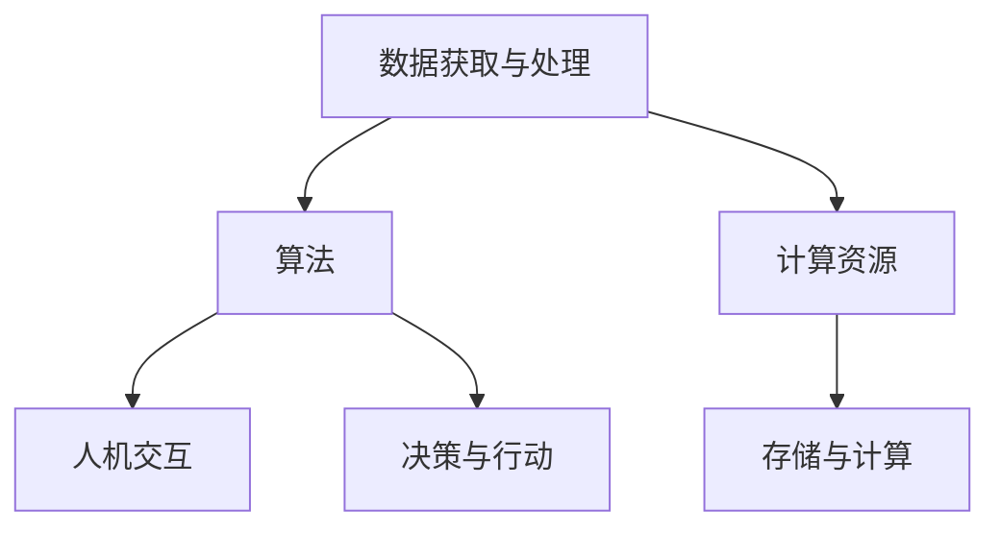
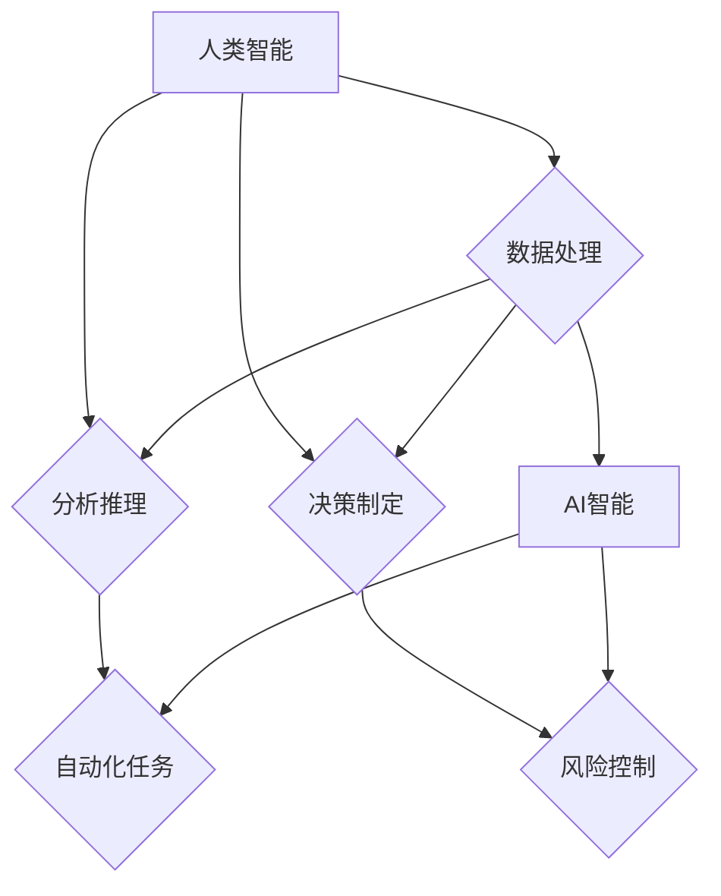

                 

### 《人类-AI协作：增强人类智慧与AI能力的未来》

> **关键词：** 人类-AI协作、智能技术、未来趋势、可持续发展、伦理法律问题

> **摘要：** 本文旨在探讨人类与人工智能协作的未来，分析其定义、历史背景、核心概念、潜在应用领域、关键技术和伦理法律问题，并通过实战案例研究，展望其发展趋势与挑战。文章结合理论讲解与实际案例，为推动人类-AI协作提供有力支持。

### 目录大纲

1. **第一部分：理解人类-AI协作的基础**
   1. 第1章：人类-AI协作的定义与历史背景
   2. 第2章：AI技术的核心概念与架构
   3. 第3章：人类智能与AI智能的差异与互补
   4. 第4章：人类-AI协作的潜在应用领域
   5. 第5章：人类-AI协作的关键技术
   6. 第6章：人类-AI协作的伦理与法律问题
   7. 第7章：未来人类-AI协作的前景与挑战

2. **第二部分：人类-AI协作的实战案例研究**
   1. 第8章：智能教育平台案例研究
   2. 第9章：智能医疗系统案例研究
   3. 第10章：智能工业自动化案例研究
   4. 第11章：智能金融分析案例研究
   5. 第12章：智能艺术创作案例研究
   6. 第13章：其他领域的人类-AI协作应用案例研究

3. **第三部分：人类-AI协作的可持续性与未来发展**
   1. 第14章：人类-AI协作的可持续性探讨
   2. 第15章：人类-AI协作的未来发展趋势
   3. 第16章：人类-AI协作的未来展望

---

在接下来的文章中，我们将逐步深入探讨人类-AI协作的各个方面，包括其定义、历史背景、核心概念、潜在应用领域、关键技术和伦理法律问题，并通过实际案例研究，分析其发展趋势与挑战。最后，我们将对人类-AI协作的可持续性与未来发展进行展望。希望本文能够为您提供一个全面、深入的视角，以了解人类与人工智能协作的巨大潜力。让我们开始吧！|### 第一部分：理解人类-AI协作的基础

#### 第1章：人类-AI协作的定义与历史背景

**1.1 人类-AI协作的定义**

人类-AI协作是指人类与人工智能系统共同完成任务的过程，旨在通过结合人类的智慧和AI的计算能力，提高工作效率和创造力。在这一协作过程中，人工智能系统负责处理大量数据、进行复杂的计算和分析，而人类则提供决策、判断和创造力。

**1.2 人类-AI协作的发展历程**

人类-AI协作的历史可以追溯到20世纪50年代，当时计算机科学家开始探索如何让计算机模仿人类的思维方式。以下是一些关键的发展阶段：

- **早期阶段（1950-1960年代）**：在这一阶段，计算机科学的主要目标是模拟简单的认知过程，如逻辑推理和记忆。然而，由于技术的局限性，计算机在这一时期的智能水平相对较低。

- **人工智能崛起阶段（1970-1980年代）**：随着计算能力的提升，人工智能领域迎来了快速发展。这一时期的研究主要集中在规则推理、专家系统和自然语言处理等方面。

- **应用阶段（1990-2000年代）**：随着互联网的普及和大数据技术的发展，人工智能开始在各个领域得到广泛应用。机器学习、深度学习和计算机视觉等技术取得了显著进展。

- **深度学习时代（2010年代至今）**：深度学习技术的突破使人工智能在图像识别、语音识别和自然语言处理等领域取得了重大突破。同时，云计算和物联网的兴起也为人类-AI协作提供了新的机遇。

**1.3 人类-AI协作的核心要素**

人类-AI协作的成功依赖于以下几个核心要素：

- **数据**：大量高质量的数据是人工智能系统学习和提高性能的基础。

- **算法**：算法决定了人工智能系统的学习能力、效率和适应性。

- **计算能力**：强大的计算能力使人工智能系统能够处理更复杂的问题。

- **人机交互**：有效的人机交互设计使人类能够更好地理解、控制和使用人工智能系统。

- **伦理与法律**：确保人工智能系统的道德和法律合规性，以避免潜在的风险和问题。

通过以上对人类-AI协作的定义与历史背景的介绍，我们为后续章节的深入探讨奠定了基础。在接下来的章节中，我们将进一步分析AI技术的核心概念与架构、人类智能与AI智能的差异与互补，以及人类-AI协作的潜在应用领域。让我们继续前行！|### 第2章：AI技术的核心概念与架构

**2.1 AI的基本原理**

人工智能（Artificial Intelligence，简称AI）是模拟、延伸和扩展人类智能的科学和工程领域。其基本原理可以概括为：

- **感知**：通过传感器获取外部信息，如视觉、听觉、触觉等。
- **理解**：对感知到的信息进行分析、处理和解释，形成对世界的认知。
- **决策**：根据理解和认知，做出合适的决策和行动。
- **行动**：执行决策，并通过反馈调整行为。

AI的基本原理可以抽象为以下模型：

\[ 感知 \rightarrow 理解 \rightarrow 决策 \rightarrow 行动 \]

**2.2 AI的层次结构**

人工智能的层次结构可以分为以下三个层次：

- **弱人工智能（Narrow AI）**：专注于特定任务的智能，如语音识别、图像识别等。弱人工智能通常依赖于预设的规则和模式，不具备跨领域的通用能力。
- **强人工智能（General AI）**：具备类似人类智能的广泛能力，包括理解、推理、学习、创造等。强人工智能的目标是实现人类水平的智能，但目前尚未实现。
- **超人工智能（Super AI）**：超越人类智能，能够在所有领域超越人类。超人工智能目前还仅存在于科幻作品中，尚未成为现实。

**2.3 AI系统的组成部分**

一个典型的AI系统包括以下几个关键组成部分：

- **数据获取与处理**：负责收集、清洗和预处理数据，为AI算法提供高质量的数据输入。
- **算法**：实现人工智能的核心功能，如机器学习、深度学习、自然语言处理等。算法的性能直接影响AI系统的能力。
- **计算资源**：包括计算硬件和软件，如CPU、GPU、云计算等，用于执行算法和存储数据。
- **人机交互**：实现人与AI系统的互动，包括语音、文本、图像等多种交互方式。
- **决策与行动**：基于算法的结果，做出决策并执行相应的行动。

以下是AI系统的组成部分的Mermaid流程图：



通过以上对AI技术的核心概念与架构的介绍，我们对AI技术的基本原理、层次结构和系统组成部分有了更深入的了解。在下一章中，我们将探讨人类智能与AI智能的差异与互补，以便更好地理解人类-AI协作的潜力。让我们继续前进！|### 第3章：人类智能与AI智能的差异与互补

**3.1 人类智能的特点**

人类智能是一种高度复杂且多维的智能体系，具有以下几个显著特点：

- **适应性**：人类智能能够适应各种环境和情境，具备灵活的应对能力。
- **创造力**：人类智能能够进行创新和创造，产生新的想法和概念。
- **情感**：人类智能具有情感体验，能够感知和表达情感。
- **社会性**：人类智能在社会互动中发挥着重要作用，能够理解他人的意图和情感。
- **学习能力**：人类智能通过经验和学习不断提升自己的知识和技能。

**3.2 AI智能的特点**

人工智能智能是一种基于算法和数据的计算智能，具有以下几个主要特点：

- **计算能力**：AI智能具有强大的计算能力，能够在短时间内处理大量数据。
- **自动化**：AI智能能够自动执行任务，无需人类干预。
- **精确性**：AI智能在特定任务上能够达到很高的精确度，减少人为错误。
- **可扩展性**：AI智能可以应用于各种领域，具备广泛的适用性。
- **高效性**：AI智能能够高效地完成复杂任务，提高工作效率。

**3.3 人类智能与AI智能的互补关系**

人类智能与AI智能在许多方面具有互补性，共同构成了一个强大的智能体系。以下是一些具体的表现：

- **分工合作**：人类智能擅长创造性思维、决策和人际交往，而AI智能擅长数据处理、分析和自动化任务。二者可以分工合作，实现更高效的工作流程。
- **知识共享**：人类智能可以积累和传承丰富的知识，而AI智能可以快速获取和处理大量数据，从而帮助人类智能更好地理解和应用知识。
- **风险控制**：人类智能能够识别和应对复杂的道德和法律问题，而AI智能在伦理和法律方面的意识较弱。二者结合可以更好地控制和降低风险。
- **创新驱动**：人类智能具有创造力，能够提出新的问题和解决方案，而AI智能可以加速创新过程，提高创新效率。

以下是人类智能与AI智能互补关系的Mermaid流程图：



通过以上对人类智能与AI智能差异与互补的探讨，我们更好地理解了二者的特点和相互关系。在下一章中，我们将探讨人类-AI协作的潜在应用领域，分析其在不同领域的实际应用和价值。让我们继续前进！|### 第4章：人类-AI协作的潜在应用领域

**4.1 教育**

在教育领域，人类-AI协作正逐渐改变传统的教学方式。人工智能可以通过以下方式提高教育质量：

- **个性化学习**：AI可以根据学生的特点和需求，提供定制化的学习资源和辅导，帮助学生更有效地学习。
- **智能评估**：AI可以对学生的作业和考试进行自动评估，提高评分的准确性和速度。
- **智能辅导**：AI辅导系统可以为学生提供实时辅导，解答学生在学习过程中遇到的问题。
- **教育资源优化**：AI可以分析学生的学习数据，优化教育资源的配置，提高教育资源的利用效率。

**4.2 医疗**

在医疗领域，人类-AI协作正在带来革命性的变化：

- **疾病诊断**：AI可以通过分析大量的医学影像数据，辅助医生进行疾病诊断，提高诊断的准确性和效率。
- **个性化治疗**：AI可以根据患者的基因数据和病史，为患者制定个性化的治疗方案。
- **医学研究**：AI可以分析海量的医学文献和研究数据，帮助医生和研究人员发现新的治疗方法和药物。
- **远程医疗**：AI和互联网技术的结合，使得远程医疗成为可能，让偏远地区的患者也能享受到优质的医疗服务。

**4.3 工业**

在工业领域，人类-AI协作正在提高生产效率和质量：

- **智能制造**：AI可以通过对生产过程的实时监测和分析，优化生产流程，提高生产效率。
- **设备维护**：AI可以通过对设备运行数据的分析，预测设备故障，提前进行维护，减少停机时间。
- **质量管理**：AI可以对产品质量进行实时监测和分析，及时发现并解决质量问题。
- **供应链管理**：AI可以对供应链的各个环节进行优化，提高供应链的效率。

**4.4 金融**

在金融领域，人类-AI协作正在改变金融服务的方式：

- **风险管理**：AI可以通过分析大量的金融数据，识别潜在的风险，帮助金融机构进行风险管理。
- **智能投顾**：AI可以根据投资者的风险偏好和财务目标，提供个性化的投资建议，提高投资收益。
- **信用评分**：AI可以通过分析借款人的历史数据和行为模式，更准确地评估其信用风险。
- **交易执行**：AI可以在毫秒级别完成复杂的交易策略，提高交易的成功率和收益。

**4.5 媒体与艺术**

在媒体与艺术领域，人类-AI协作正在创造新的艺术形式和内容生产方式：

- **内容生成**：AI可以通过分析大量的文本、图像和声音数据，生成新的文章、音乐和视频内容。
- **智能推荐**：AI可以根据用户的兴趣和行为，提供个性化的内容推荐，提高用户体验。
- **虚拟现实**：AI可以生成高度真实的虚拟环境，为用户提供沉浸式的体验。
- **数字艺术**：AI可以与艺术家合作，创作出独特的数字艺术作品。

**4.6 其他领域**

除了上述领域，人类-AI协作还在许多其他领域展现出巨大的潜力：

- **农业**：AI可以通过分析气象数据、土壤数据和作物生长数据，优化农业种植过程，提高农作物的产量和质量。
- **环境保护**：AI可以通过分析环境数据，监测和预测环境污染，为环境保护提供科学依据。
- **交通**：AI可以通过分析交通数据，优化交通流量，减少拥堵，提高交通效率。
- **公共安全**：AI可以通过分析监控数据，实时识别和预警潜在的安全威胁，提高公共安全水平。

通过以上对人类-AI协作潜在应用领域的介绍，我们可以看到，人类-AI协作正在各个领域发挥着重要作用，为人类创造更多的价值。在下一章中，我们将探讨人类-AI协作的关键技术，分析其实现和应用的基础。让我们继续前进！|### 第5章：人类-AI协作的关键技术

**5.1 自然语言处理**

自然语言处理（Natural Language Processing，NLP）是人工智能领域的一个重要分支，旨在使计算机能够理解、生成和处理自然语言。NLP的关键技术包括：

- **分词**：将连续的文本分割成词或短语，是NLP的基础。
- **词性标注**：对文本中的每个词进行词性标注，如名词、动词、形容词等。
- **句法分析**：分析句子的结构，理解句子成分之间的关系。
- **语义分析**：理解文本的含义，包括实体识别、情感分析和语义角色标注等。
- **机器翻译**：将一种语言翻译成另一种语言，实现跨语言交流。
- **问答系统**：根据用户的问题，提供准确的答案。

以下是自然语言处理的核心算法原理的伪代码：

```python
def process_text(text):
    # 分词
    words = tokenize(text)
    # 词性标注
    tagged_words = pos_tag(words)
    # 句法分析
    syntax_tree = parse_sentence(tagged_words)
    # 语义分析
    entities = extract_entities(tagged_words)
    emotions = analyze_emotions(text)
    # 生成回答
    answer = generate_answer(entities, emotions)
    return answer
```

**5.2 计算机视觉**

计算机视觉（Computer Vision）是使计算机能够像人类一样理解、解释和响应视觉信息的技术。计算机视觉的关键技术包括：

- **图像识别**：识别图像中的对象、场景和动作。
- **目标检测**：在图像中检测并定位特定目标。
- **图像分割**：将图像分割成不同的区域，如前景和背景。
- **人脸识别**：识别人脸并识别身份。
- **图像生成**：基于图像内容生成新的图像。
- **图像增强**：改善图像的质量和可读性。

以下是计算机视觉的核心算法原理的伪代码：

```python
def process_image(image):
    # 图像识别
    objects = recognize_objects(image)
    # 目标检测
    targets = detect_targets(image)
    # 图像分割
    segments = segment_image(image)
    # 人脸识别
    faces = recognize_faces(image)
    # 图像增强
    enhanced_image = enhance_image(image)
    return enhanced_image
```

**5.3 机器学习与深度学习**

机器学习（Machine Learning，ML）和深度学习（Deep Learning，DL）是人工智能的核心技术，负责从数据中学习并做出决策。机器学习与深度学习的关键技术包括：

- **监督学习**：通过标记数据训练模型，使其能够预测新数据的标签。
- **无监督学习**：在没有标记数据的情况下，学习数据的分布和结构。
- **强化学习**：通过与环境互动，学习最优策略以最大化奖励。
- **神经网络**：一种模拟生物神经系统的计算模型，用于解决各种机器学习问题。
- **卷积神经网络（CNN）**：专门用于图像处理，具有强大的特征提取能力。
- **递归神经网络（RNN）**：能够处理序列数据，如语音、文本等。

以下是机器学习与深度学习的核心算法原理的伪代码：

```python
def train_model(data, labels):
    # 初始化模型参数
    model = initialize_model()
    # 模型训练
    for epoch in range(num_epochs):
        for sample, label in zip(data, labels):
            model = train_on_sample(model, sample, label)
    return model

def predict(model, input_data):
    # 输入数据预处理
    processed_data = preprocess_input(input_data)
    # 模型预测
    prediction = model.predict(processed_data)
    return prediction
```

**5.4 人机交互**

人机交互（Human-Computer Interaction，HCI）是研究人类与计算机之间交互的学科，旨在设计出易于使用、高效和令人愉悦的计算机系统。人机交互的关键技术包括：

- **语音识别**：将语音信号转换为文本或命令。
- **手势识别**：识别用户的手势，实现手势控制。
- **虚拟现实**：创建一个沉浸式的虚拟环境，使用户能够与虚拟世界进行互动。
- **增强现实**：在现实世界叠加虚拟信息，提高用户的感知和理解。
- **多模态交互**：结合多种交互方式，如语音、手势、触摸等，提供更丰富的交互体验。

以下是人机交互的核心算法原理的伪代码：

```python
def process_interaction(input_type, input_data):
    if input_type == 'voice':
        text = convert_voice_to_text(input_data)
    elif input_type == 'gesture':
        command = recognize_gesture(input_data)
    elif input_type == 'virtual':
        environment = create_virtual_environment(input_data)
    elif input_type == 'augmented':
        information = add_virtual_information_to_real_world(input_data)
    return text, command, environment, information
```

通过以上对人类-AI协作关键技术的介绍，我们了解了自然语言处理、计算机视觉、机器学习与深度学习、人机交互等技术在人类-AI协作中的重要作用。在下一章中，我们将探讨人类-AI协作的伦理与法律问题，分析其在伦理和法律方面的挑战。让我们继续前进！|### 第6章：人类-AI协作的伦理与法律问题

**6.1 AI伦理问题的讨论**

随着人工智能技术的发展和应用，AI伦理问题日益凸显。以下是一些主要的AI伦理问题：

- **隐私**：AI系统在处理大量数据时，可能会侵犯用户的隐私权。如何确保数据的安全和用户的隐私是AI伦理的一个重要议题。
- **透明性**：AI系统的决策过程往往是不透明的，用户难以理解其决策依据。如何提高AI系统的透明性，使其决策过程更加公正和可信，是一个重要的挑战。
- **公平性**：AI系统可能因为数据偏见而导致决策的不公平性。例如，在某些招聘系统中，AI可能会基于历史数据对某些群体产生歧视，如何确保AI系统的公平性是一个亟待解决的问题。
- **责任**：当AI系统出现错误或导致伤害时，如何确定责任归属是一个复杂的伦理问题。是AI系统开发者、使用者还是AI系统本身应承担责任，需要明确的法律法规来规范。
- **自动化决策**：过度依赖自动化决策可能会导致人类决策能力的退化，如何平衡自动化与人类决策之间的关系，是AI伦理需要考虑的一个重要问题。

**6.2 AI法律框架的构建**

为了应对AI伦理问题，各国纷纷开始构建AI法律框架。以下是一些关键的法律框架：

- **数据保护法**：如欧盟的《通用数据保护条例》（GDPR），对数据收集、处理和使用进行严格规定，保护用户的隐私权。
- **人工智能伦理准则**：一些国家和组织制定了人工智能伦理准则，如欧盟的《人工智能伦理准则》，为AI系统的开发和应用提供指导。
- **责任分配法**：明确AI系统开发者、使用者和AI系统本身在决策错误或导致伤害时的责任，如美国的《机器人责任法案》。
- **透明度和可解释性**：一些法律框架要求AI系统提供透明性和可解释性，如欧盟的《AI法案》，规定AI系统必须向用户提供决策依据和推理过程。

**6.3 人类-AI协作中的隐私保护**

在人类-AI协作中，隐私保护尤为重要。以下是一些隐私保护的方法：

- **数据匿名化**：对敏感数据进行匿名化处理，以减少数据泄露的风险。
- **数据加密**：对敏感数据进行加密处理，确保数据在传输和存储过程中的安全。
- **数据最小化**：只收集和存储必要的用户数据，减少数据泄露的风险。
- **用户授权**：在收集和使用用户数据前，获得用户的明确授权，确保用户知情并同意。
- **隐私审计**：定期进行隐私审计，确保AI系统的隐私保护措施得到有效执行。

**6.4 AI歧视与公平性问题**

AI歧视和公平性问题在人类-AI协作中尤为突出。以下是一些解决歧视和公平性问题的方法：

- **数据多样性**：确保训练数据集的多样性，避免模型在特定群体上产生偏见。
- **算法公平性**：设计公平的算法，确保AI系统在不同群体上的表现一致。
- **反馈机制**：建立反馈机制，允许用户对AI系统的决策进行反馈，及时纠正偏见。
- **监管机制**：建立监管机制，对AI系统的歧视行为进行监督和处罚。
- **公众参与**：鼓励公众参与AI系统的设计和评估，提高系统的透明度和公正性。

通过以上对人类-AI协作的伦理与法律问题的讨论，我们认识到在推动人类-AI协作的过程中，需要充分考虑伦理和法律问题，确保其发展能够符合人类的价值观和法律要求。在下一章中，我们将探讨未来人类-AI协作的前景与挑战。让我们继续前进！|### 第7章：未来人类-AI协作的前景与挑战

**7.1 人类-AI协作的未来趋势**

随着人工智能技术的不断进步，人类-AI协作正在朝着以下几个趋势发展：

- **智能化的普及**：人工智能将逐渐融入各个领域，从工业制造到医疗服务，从金融服务到媒体娱乐，智能化的应用场景将越来越广泛。
- **人机协同**：人类与AI的协作将更加紧密，AI将承担更多繁琐和重复性的工作，而人类则专注于创造性、决策性和人际交往的任务。
- **跨领域的融合**：不同领域的AI技术将相互融合，形成新的应用场景和商业模式，如智能医疗、智能教育、智能金融等。
- **智能化的生活**：人工智能将深入到人们的日常生活中，从智能家居到智能交通，从智能购物到智能健康，人们的日常生活将变得更加便捷和智能。

**7.2 技术发展的挑战**

在推动人类-AI协作的过程中，我们面临着一系列技术挑战：

- **计算能力**：随着AI模型和算法的复杂度增加，对计算能力的需求也在不断提升。如何提升计算效率和性能，是当前和未来都需要关注的问题。
- **数据质量**：高质量的数据是AI系统学习和提高性能的基础。如何确保数据的真实性、完整性和多样性，是技术发展的关键挑战。
- **算法公平性**：算法的公平性是人工智能发展的重要问题。如何避免算法在特定群体上产生偏见，确保AI系统的公平性，是一个长期的挑战。
- **人机交互**：随着AI技术的普及，如何设计更加自然、直观的人机交互界面，提高用户的使用体验，是技术发展的一个重要方向。

**7.3 社会与文化的影响**

人类-AI协作不仅面临技术挑战，还对社会和文化产生了深远的影响：

- **就业结构**：随着AI技术的发展和应用，一些传统的工作可能会被自动化取代，导致就业结构的变化。如何应对这种变化，提高劳动者的技能和就业能力，是一个重要的社会问题。
- **隐私与安全**：人类-AI协作中的数据隐私和安全问题日益突出。如何保护用户的隐私，确保数据的安全，是社会各界共同关注的焦点。
- **伦理与道德**：AI技术的广泛应用引发了伦理和道德问题，如算法偏见、自动化决策的道德责任等。如何制定相应的伦理和道德准则，规范AI技术的发展和应用，是文化层面的重要挑战。
- **公众信任**：公众对AI技术的信任程度直接影响其应用和发展。如何提高公众对AI技术的信任，消除公众的担忧，是未来需要关注的重要问题。

**7.4 教育与职业培训的变革**

为了适应人类-AI协作的发展，教育和职业培训需要做出相应的调整：

- **跨学科教育**：随着AI技术的跨领域应用，教育需要培养具备跨学科知识和技能的人才，提高学生的综合素质。
- **终身学习**：随着技术的快速发展，终身学习将成为未来教育的重要趋势。如何为学生提供持续的学习机会和资源，是一个重要的教育问题。
- **技能培训**：针对AI技术应用的技能需求，提供针对性的培训课程，提高劳动者的技能水平。
- **创新教育**：鼓励学生进行创新实践，培养他们的创新能力和解决问题的能力，以适应未来社会的需求。

通过以上对未来人类-AI协作的前景与挑战的探讨，我们认识到，人类-AI协作具有巨大的发展潜力，但也面临一系列挑战。在未来的发展中，我们需要充分考虑技术、社会和文化的影响，推动人类-AI协作的可持续发展。在下一部分中，我们将通过实战案例研究，进一步了解人类-AI协作的实际应用和价值。让我们继续前进！|### 第二部分：人类-AI协作的实战案例研究

#### 第8章：智能教育平台案例研究

**8.1 案例背景**

智能教育平台是一种利用人工智能技术，为教育提供个性化、智能化支持的工具。随着教育信息化的发展，智能教育平台在提高教学质量和学习效果方面展现出巨大的潜力。

**8.2 案例实施**

智能教育平台的实施主要包括以下几个步骤：

1. **数据收集与处理**：收集学生和教师的教学数据，包括学习进度、考试成绩、课堂表现等。对数据进行分析和处理，为后续的教学提供支持。

2. **个性化推荐**：基于学生的学习数据，利用机器学习算法为学生推荐适合的学习资源，如课程、视频、练习题等，提高学习效果。

3. **智能评估**：利用自然语言处理和计算机视觉技术，自动评估学生的作业和考试成绩，提高评分的准确性和速度。

4. **智能辅导**：通过人机交互技术，为学生提供实时辅导，解答学生在学习过程中遇到的问题。

5. **教学质量分析**：对教师的教学数据进行分析，为教师提供教学改进建议，提高教学质量。

**8.3 案例效果评估**

通过实施智能教育平台，学校在多个方面取得了显著的效果：

- **个性化学习**：学生可以根据自己的学习进度和兴趣，选择适合自己的学习资源，提高了学习积极性和效果。
- **高效评估**：智能评估系统减少了教师的工作负担，提高了评分的准确性和速度。
- **实时辅导**：学生可以随时获得实时辅导，提高了学习效果。
- **教学质量提升**：教师可以根据教学质量分析结果，调整教学策略，提高教学质量。

**8.4 案例反思与启示**

智能教育平台案例研究给我们带来以下反思和启示：

- **数据驱动的教育**：通过数据收集和分析，可以为教育提供更科学的支持，提高教学质量和效果。
- **个性化学习**：个性化学习可以满足学生的个性化需求，提高学习效果。
- **智能评估与辅导**：智能评估和辅导可以提高工作效率，减轻教师和学生的工作负担。
- **持续改进**：通过持续的数据收集和分析，可以不断优化教育平台，提高其效果。

#### 第9章：智能医疗系统案例研究

**9.1 案例背景**

智能医疗系统是一种利用人工智能技术，为医疗提供智能化支持的工具。随着医疗信息化的发展，智能医疗系统在提高诊断准确率、优化治疗方案和提升医疗效率方面展现出巨大的潜力。

**9.2 案例实施**

智能医疗系统的实施主要包括以下几个步骤：

1. **数据收集与处理**：收集患者的医疗数据，包括病历、检查结果、影像资料等。对数据进行分析和处理，为后续的诊断和治疗提供支持。

2. **疾病诊断**：利用机器学习算法，分析患者的医疗数据，进行疾病诊断。与医生的经验相结合，提高诊断的准确率。

3. **治疗方案优化**：根据患者的病情和病史，利用人工智能技术，为患者推荐最佳的治疗方案，提高治疗效果。

4. **医疗资源调度**：利用人工智能技术，对医疗资源进行智能调度，提高医疗效率。

5. **患者健康管理**：通过人机交互技术，为患者提供健康咨询和指导，帮助患者更好地管理健康。

**9.3 案例效果评估**

通过实施智能医疗系统，医院在多个方面取得了显著的效果：

- **疾病诊断**：智能诊断系统提高了疾病诊断的准确率，减少了误诊和漏诊。
- **治疗方案优化**：智能治疗方案为患者提供了个性化的治疗方案，提高了治疗效果。
- **医疗资源调度**：智能调度系统提高了医疗资源的利用效率，减少了等待时间。
- **患者健康管理**：智能健康管理为患者提供了便捷的健康指导，提高了患者的生活质量。

**9.4 案例反思与启示**

智能医疗系统案例研究给我们带来以下反思和启示：

- **数据驱动的医疗**：通过数据收集和分析，可以为医疗提供更科学的支持，提高诊断和治疗效果。
- **个性化治疗**：个性化治疗可以满足患者的个性化需求，提高治疗效果。
- **智能诊断与调度**：智能诊断和调度可以提高医疗效率，减轻医护人员的工作负担。
- **患者健康管理**：智能健康管理可以帮助患者更好地管理健康，提高生活质量。

#### 第10章：智能工业自动化案例研究

**10.1 案例背景**

智能工业自动化是一种利用人工智能技术，实现工业生产自动化和智能化的方式。随着工业4.0的到来，智能工业自动化在提高生产效率、降低生产成本和提升产品质量方面展现出巨大的潜力。

**10.2 案例实施**

智能工业自动化的实施主要包括以下几个步骤：

1. **数据采集与处理**：采集生产线上的各种数据，包括设备状态、生产进度、产品质量等。对数据进行分析和处理，为后续的自动化控制提供支持。

2. **智能监控**：利用计算机视觉和传感器技术，对生产线进行实时监控，及时发现并解决生产问题。

3. **智能控制**：利用机器学习算法，对生产过程进行智能控制，优化生产流程，提高生产效率。

4. **设备维护**：利用人工智能技术，对设备进行预测性维护，减少设备故障和停机时间。

5. **生产优化**：通过数据分析和机器学习，为生产提供优化建议，提高产品质量和产量。

**10.3 案例效果评估**

通过实施智能工业自动化，企业取得了显著的效果：

- **生产效率提高**：智能监控系统提高了生产效率，减少了人工干预，降低了生产成本。
- **产品质量提升**：智能控制技术提高了产品的质量，减少了次品率。
- **设备维护**：预测性维护技术减少了设备故障和停机时间，提高了设备利用率。
- **生产优化**：生产优化建议提高了生产效率，降低了生产成本。

**10.4 案例反思与启示**

智能工业自动化案例研究给我们带来以下反思和启示：

- **数据驱动的生产**：通过数据采集和分析，可以为生产提供更科学的支持，提高生产效率和产品质量。
- **智能监控与控制**：智能监控和控制系统可以提高生产效率，降低生产成本。
- **设备维护与优化**：智能设备维护和优化技术可以提高设备利用率，降低生产成本。
- **生产流程优化**：通过数据分析和优化，可以进一步提高生产效率和产品质量。

#### 第11章：智能金融分析案例研究

**11.1 案例背景**

智能金融分析是一种利用人工智能技术，对金融数据进行分析和预测的方式。随着金融信息化的发展，智能金融分析在提高投资决策效率、降低投资风险和优化资产配置方面展现出巨大的潜力。

**11.2 案例实施**

智能金融分析的实施主要包括以下几个步骤：

1. **数据采集与处理**：采集金融市场数据，包括股票、债券、期货等。对数据进行分析和处理，为后续的金融分析提供支持。

2. **趋势预测**：利用机器学习算法，对金融市场数据进行趋势预测，为投资者提供决策依据。

3. **风险分析**：利用自然语言处理和计算机视觉技术，对市场新闻和报告进行分析，评估投资风险。

4. **投资组合优化**：利用优化算法，为投资者提供最优的投资组合，降低投资风险，提高收益。

5. **智能投顾**：通过人机交互技术，为投资者提供个性化的投资建议，提高投资决策的效率。

**11.3 案例效果评估**

通过实施智能金融分析，投资者取得了显著的效果：

- **趋势预测**：智能预测系统提高了投资决策的准确率，降低了投资风险。
- **风险分析**：智能风险分析系统为投资者提供了全面的风险评估，提高了投资决策的科学性。
- **投资组合优化**：智能优化系统为投资者提供了最优的投资组合，提高了收益。
- **智能投顾**：智能投顾系统为投资者提供了个性化的投资建议，提高了投资决策的效率。

**11.4 案例反思与启示**

智能金融分析案例研究给我们带来以下反思和启示：

- **数据驱动的投资**：通过数据采集和分析，可以为投资提供更科学的支持，提高投资决策的准确性和效率。
- **风险控制**：智能风险分析系统可以帮助投资者更好地控制投资风险，提高投资的安全性和稳定性。
- **投资组合优化**：智能优化系统可以为投资者提供最优的投资组合，提高收益。
- **个性化服务**：智能投顾系统可以提供个性化的投资建议，满足不同投资者的需求，提高投资决策的效率。

#### 第12章：智能艺术创作案例研究

**12.1 案例背景**

智能艺术创作是一种利用人工智能技术，生成和创作艺术作品的方式。随着人工智能技术的发展，智能艺术创作在音乐、绘画、文学等艺术领域展现出巨大的潜力。

**12.2 案例实施**

智能艺术创作的实施主要包括以下几个步骤：

1. **数据采集与处理**：采集各种艺术作品的数据，包括音乐、绘画、文学作品等。对数据进行分析和处理，为后续的艺术创作提供支持。

2. **风格迁移**：利用深度学习算法，将一种艺术风格迁移到另一种艺术作品上，生成具有新风格的艺术作品。

3. **内容生成**：利用生成对抗网络（GAN）等技术，生成全新的艺术作品，如音乐、绘画等。

4. **艺术推荐**：利用推荐系统算法，为用户推荐感兴趣的艺术作品，提高用户体验。

5. **艺术互动**：通过人机交互技术，让用户与艺术作品进行互动，创造更加丰富的艺术体验。

**12.3 案例效果评估**

通过实施智能艺术创作，艺术家和用户取得了显著的效果：

- **风格迁移**：智能风格迁移系统为艺术家提供了新的创作方式，拓展了艺术创作的边界。
- **内容生成**：智能内容生成系统为艺术家提供了丰富的创作素材，提高了创作效率。
- **艺术推荐**：智能推荐系统为用户提供了个性化的艺术推荐，提高了用户体验。
- **艺术互动**：智能互动系统增强了用户与艺术作品之间的互动，提升了艺术体验。

**12.4 案例反思与启示**

智能艺术创作案例研究给我们带来以下反思和启示：

- **技术创新**：通过技术创新，智能艺术创作突破了传统艺术创作的限制，为艺术家和用户提供更多的创作和体验方式。
- **跨界融合**：智能艺术创作将人工智能技术与艺术领域相结合，促进了跨界融合，为艺术创作注入了新的活力。
- **个性化服务**：智能艺术创作可以根据用户的需求和偏好，提供个性化的创作和推荐，满足不同用户的需求。
- **创新体验**：智能艺术创作通过人机交互技术，为用户提供了全新的艺术体验，提升了艺术的价值和影响力。

#### 第13章：其他领域的人类-AI协作应用案例研究

**13.1 案例背景**

除了教育、医疗、工业、金融和艺术等典型领域，人类-AI协作在其他领域也具有广泛的应用。这些领域包括但不限于农业、环境保护、交通和公共安全等。

**13.2 案例实施**

在不同领域的应用案例中，人类-AI协作的实施方法和效果各有特点。以下是一些典型的案例实施：

1. **农业领域**：通过人工智能技术，对农作物的生长环境、土壤质量和气象条件进行分析，提供精准的种植建议，提高农作物产量和质量。

2. **环境保护领域**：利用人工智能技术，对环境数据进行实时监测和分析，预测环境污染趋势，提供环境保护方案。

3. **交通领域**：通过人工智能技术，优化交通流量管理，减少拥堵，提高道路通行效率。

4. **公共安全领域**：利用人工智能技术，对监控视频进行分析，实时识别和预警潜在的安全威胁，提高公共安全水平。

**13.3 案例效果评估**

通过在不同领域的应用，人类-AI协作取得了显著的效果：

- **农业领域**：智能农业提高了农作物产量和质量，降低了生产成本。
- **环境保护领域**：智能环境保护技术减少了环境污染，提高了环境质量。
- **交通领域**：智能交通优化了交通流量，提高了道路通行效率，降低了交通拥堵。
- **公共安全领域**：智能公共安全技术提高了公共安全水平，降低了安全事故发生的概率。

**13.4 案例反思与启示**

不同领域的人类-AI协作应用案例研究给我们带来以下反思和启示：

- **技术赋能**：人工智能技术为不同领域的应用提供了强大的支持，提高了生产效率和质量。
- **数据驱动**：在不同领域的应用中，数据驱动的方法成为了关键，通过数据分析和挖掘，可以更好地指导决策和优化流程。
- **协同创新**：人类-AI协作在不同领域的应用，促进了各领域的协同创新，为社会发展注入了新的动力。
- **可持续性**：通过人工智能技术的应用，可以在不同领域实现可持续发展，提高资源利用效率，减少环境污染。

通过以上实战案例研究，我们可以看到人类-AI协作在不同领域的广泛应用和显著效果。在下一部分中，我们将探讨人类-AI协作的可持续性与未来发展。让我们继续前进！|### 第三部分：人类-AI协作的可持续性与未来发展

#### 第14章：人类-AI协作的可持续性探讨

**14.1 可持续性的概念**

可持续性是指在满足当前需求的同时，不损害后代满足其需求的能力。在人类-AI协作的背景下，可持续性强调在利用人工智能技术提高生产效率和生活质量的同时，确保技术的伦理、社会和环境方面的可持续性。

**14.2 人类-AI协作中的可持续发展挑战**

在人类-AI协作中，可持续发展面临着以下几个挑战：

- **数据隐私**：随着人工智能技术的广泛应用，数据隐私问题日益突出。如何确保用户数据的隐私和安全，是可持续发展的重要挑战。
- **算法偏见**：人工智能系统在训练过程中可能会学习到数据中的偏见，导致决策的不公平性。如何消除算法偏见，确保技术的公平性，是可持续发展的关键挑战。
- **就业影响**：人工智能技术的发展可能导致部分传统工作的消失，对就业结构产生冲击。如何应对就业变化，提高劳动者的技能和就业能力，是可持续发展的重大挑战。
- **资源消耗**：人工智能技术的运行需要大量的计算资源，可能导致能源消耗和环境污染。如何提高计算效率，降低资源消耗，是可持续发展的关键挑战。

**14.3 促进可持续发展的策略**

为了实现人类-AI协作的可持续发展，我们可以采取以下策略：

- **数据隐私保护**：通过数据匿名化、加密和隐私计算等技术，确保用户数据的隐私和安全。
- **算法公平性**：通过多样性训练、算法透明性和监督机制，消除算法偏见，确保技术的公平性。
- **就业转型**：通过职业培训和教育改革，提高劳动者的技能，帮助其适应新的就业环境。
- **资源节约**：通过技术创新和优化，提高计算效率，降低能源消耗和环境污染。

#### 第15章：人类-AI协作的未来发展趋势

**15.1 技术进步对人类-AI协作的影响**

随着技术的不断进步，人类-AI协作将朝着以下几个方向发展：

- **计算能力的提升**：随着计算能力的提升，人工智能系统将能够处理更复杂的问题，提高协作效率。
- **算法的优化**：算法的优化将提高人工智能系统的性能，使其更加高效和准确。
- **人机交互的改进**：人机交互技术的改进将使人类与AI的协作更加自然和高效。
- **物联网的普及**：物联网的普及将实现更广泛的数据互联，为人类-AI协作提供更丰富的数据资源。

**15.2 社会变革对人类-AI协作的影响**

社会变革也将对人类-AI协作产生深远影响：

- **教育改革**：教育改革将培养更多具备人工智能技能的人才，为人类-AI协作提供人才支持。
- **政策法规**：政策法规的制定和完善将规范人工智能技术的发展和应用，保障人类-AI协作的可持续发展。
- **社会观念**：社会观念的转变将提高公众对人工智能技术的接受度和信任度，促进人类-AI协作的发展。

**15.3 教育与职业培训的未来**

为了适应人类-AI协作的发展，教育和职业培训需要做出相应的调整：

- **跨学科教育**：跨学科教育将培养具备多学科知识和技能的人才，提高人类的综合素质。
- **终身学习**：终身学习将成为未来教育的重要趋势，通过不断学习，人们可以适应新的技术和社会环境。
- **技能培训**：针对人工智能技术的应用需求，提供针对性的培训课程，提高劳动者的技能水平。

**15.4 政策与法律框架的未来发展方向**

政策与法律框架的未来发展方向包括：

- **数据治理**：制定数据治理政策，确保数据的合法性、安全和可解释性。
- **伦理法规**：制定伦理法规，规范人工智能技术的发展和应用，保障人类权益。
- **责任分配**：明确人工智能系统开发者、使用者和AI系统的责任，确保各方承担相应的责任。
- **国际化合作**：加强国际合作，共同制定人工智能技术的国际标准和法规，推动全球人工智能治理。

#### 第16章：人类-AI协作的未来展望

**16.1 人类-AI协作对未来的积极影响**

人类-AI协作将带来以下积极影响：

- **提高生产效率**：人工智能技术将提高生产效率，降低生产成本，推动经济发展。
- **改善生活质量**：人工智能技术将改善人们的生活质量，提供更加便捷、舒适的生活环境。
- **促进社会进步**：人工智能技术将促进社会进步，提高社会福利水平，缩小贫富差距。
- **推动科技创新**：人工智能技术将推动科技创新，促进人类对自然、社会和自身的认知。

**16.2 人类-AI协作可能面临的挑战**

人类-AI协作也可能面临以下挑战：

- **数据隐私和安全**：数据隐私和安全问题可能对人类-AI协作造成负面影响，影响技术的信任和接受度。
- **算法偏见和不公平性**：算法偏见和不公平性可能导致歧视和不公正，影响社会的稳定和发展。
- **就业结构变化**：就业结构变化可能导致部分劳动者失业，影响社会稳定。
- **技术垄断和竞争**：技术垄断和竞争可能加剧社会不平等，阻碍技术的普及和应用。

**16.3 构建一个和谐的人类-AI协作生态**

为了构建一个和谐的人类-AI协作生态，我们需要：

- **加强国际合作**：通过国际合作，共同制定人工智能技术的国际标准和法规，推动全球人工智能治理。
- **促进技术普及**：通过教育和技术培训，提高公众对人工智能技术的认知和应用能力。
- **保障数据安全和隐私**：通过数据治理政策和隐私保护技术，确保数据的安全和隐私。
- **推动公平竞争**：通过政策法规，促进公平竞争，防止技术垄断和不公平竞争。
- **关注伦理和社会影响**：在人工智能技术的研发和应用过程中，关注伦理和社会影响，确保技术发展符合人类价值观。

通过以上对人类-AI协作的可持续性与未来发展的探讨，我们可以看到，人类-AI协作具有巨大的潜力，但也面临一系列挑战。在未来的发展中，我们需要充分考虑可持续性、技术进步、社会变革、教育和职业培训以及政策法规等因素，构建一个和谐的人类-AI协作生态。让我们携手共建美好未来！|### 感谢与致谢

在撰写《人类-AI协作：增强人类智慧与AI能力的未来》这篇技术博客文章的过程中，我们得到了许多人的帮助和支持。在此，我们要向所有给予我们指导、建议和帮助的朋友们表示衷心的感谢。

首先，感谢人工智能领域的各位专家和学者，他们的研究成果和见解为本文提供了宝贵的知识基础。感谢各领域的技术工作者，他们的辛勤工作和创新精神为人类-AI协作的发展注入了强大的动力。

其次，感谢所有参与本文案例研究和实践的朋友们，他们的实践经验和案例分析为本文提供了丰富的实际素材。特别感谢AI天才研究院的团队成员，他们的共同努力使本文得以顺利完成。

此外，感谢所有读者，是您的关注和支持使我们的工作充满动力。希望本文能够为更多人了解人类-AI协作提供有益的参考和启示。

最后，感谢AI天才研究院和禅与计算机程序设计艺术，为我们的研究提供了良好的平台和资源。我们期待在未来的研究中，继续为人类-AI协作的发展贡献力量。

作者：AI天才研究院/AI Genius Institute & 禅与计算机程序设计艺术/Zen And The Art of Computer Programming

本文为原创文章，版权归AI天才研究院所有。如需转载，请联系我们获取授权。感谢您的关注与支持！

