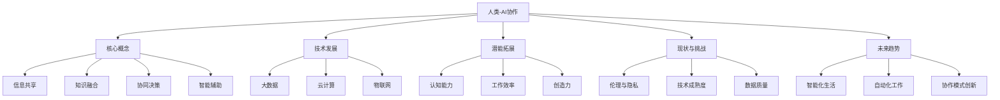
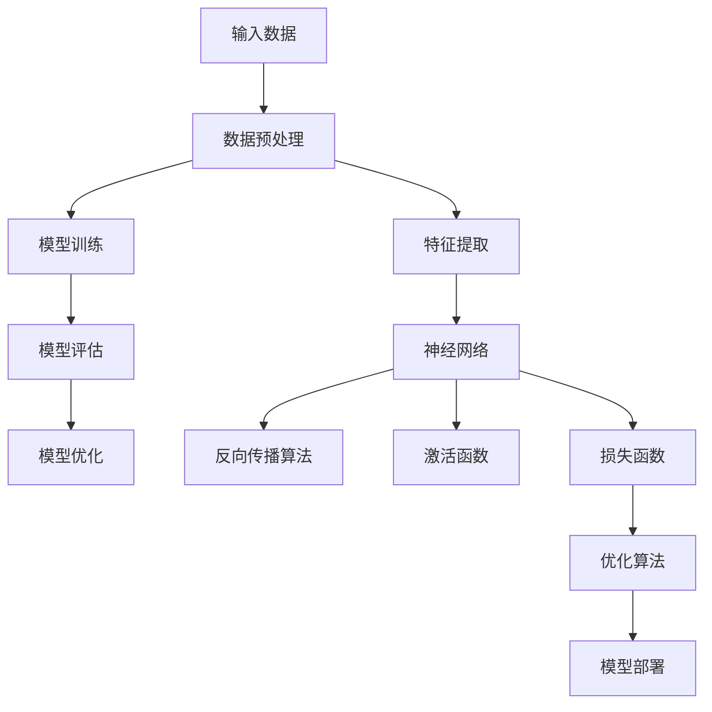
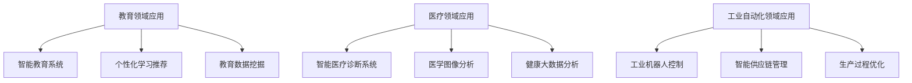
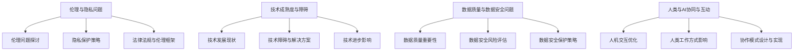

                 

# 人类-AI协作：增强人类潜能与AI能力的融合发展趋势分析预测展望

> **关键词：** 人类-AI协作、机器学习、深度学习、强化学习、自然语言处理、伦理、隐私、教育、医疗、工业自动化。

> **摘要：** 本文深入分析了人类-AI协作的定义、核心概念、优势以及面临的挑战。通过介绍机器学习、深度学习和强化学习等核心算法原理，我们探讨了人类与AI协作在各个领域的实际应用。此外，文章还讨论了人类-AI协作的伦理挑战与解决方案，并对未来的发展趋势进行了展望。通过详细的项目实战案例分析，本文为读者提供了理论与实践相结合的全面视角，旨在推动人类与AI协作的发展。

### 第一部分：人类-AI协作概述与未来趋势

#### 第1章：引言：人类-AI协作的重要性与未来前景

##### 1.1 人类-AI协作的定义与核心概念

**人类-AI协作**，是指人类与人工智能系统在共同目标和任务基础上，通过信息交换、知识共享和协同工作，实现彼此潜能的最大化。这种协作不仅依赖于AI技术的先进性，更依赖于人类智慧的灵活性和创造性。

- **信息共享**：人类与AI系统能够快速交换信息，使得决策过程更加高效。
- **知识融合**：人类和AI系统可以共同处理和分析复杂数据，将不同领域的知识进行融合。
- **协同决策**：在重大决策过程中，AI系统提供数据分析和预测，人类则利用经验进行综合判断。
- **智能辅助**：AI系统在人类执行任务时提供实时支持，提高工作效率和减少错误。

##### 1.2 AI技术的发展与人类潜能的拓展

**AI技术**的快速发展，使得人类在各个领域的工作效率得到了极大的提升。以下是一些关键技术的发展及其对人类潜能拓展的具体影响：

- **大数据**：通过对海量数据的分析和处理，AI技术能够发现隐藏在数据中的规律，帮助人类更好地理解复杂现象。
- **云计算**：云计算提供了强大的计算能力，使得AI系统能够处理更加复杂的问题。
- **物联网**：物联网将各种设备互联，使得AI系统能够实时获取环境信息，为人类提供智能化的服务和决策支持。

这些技术的发展，不仅提高了人类的工作效率，还激发了人类的**认知能力**、**工作效率**和**创造力**，使得人类能够解决更为复杂的问题。

##### 1.3 人类-AI协作的现状与挑战

当前，**人类-AI协作**已经在许多领域取得了显著的成果。例如，在**智能客服**领域，AI系统能够快速响应客户的查询，提供高效的解决方案。在**医疗**领域，AI系统通过分析医学图像，能够辅助医生进行准确的诊断。在**工业自动化**领域，AI系统通过监控生产过程，能够优化生产效率。

然而，人类-AI协作也面临着一系列挑战：

- **伦理与隐私**：AI系统在处理数据时，如何保护用户的隐私成为了一个重要问题。
- **技术成熟度**：虽然AI技术发展迅速，但仍然存在一些技术瓶颈，需要进一步研究突破。
- **数据质量**：数据是AI系统的基石，数据质量直接影响到AI系统的性能。

为了解决这些挑战，需要采取一系列策略，包括制定**伦理规范**、提高数据质量和推动技术进步。

##### 1.4 人类-AI协作的未来趋势

未来，**人类-AI协作**将继续朝着智能化、高效化、协作化的方向发展。以下是一些未来趋势的预测：

- **智能化生活**：随着AI技术的发展，智能家居、智能交通等领域的应用将更加广泛。
- **自动化工作**：AI系统将在更多领域实现自动化，减少人类重复性劳动。
- **协作模式创新**：人类与AI系统将采取更加灵活的协作模式，实现更加高效的工作方式。

这些趋势将深刻影响人类社会，带来新的机遇和挑战。因此，人类需要与AI系统紧密协作，共同应对未来发展的挑战。

### Mermaid 流�程图：人类-AI协作概念架构



### 第一部分：人类-AI协作概述与未来趋势

#### 第1章：引言：人类-AI协作的重要性与未来前景

##### 1.1 人类-AI协作的定义与核心概念

人类-AI协作是一种将人类的智慧和创造力与人工智能的技术优势相结合的全新模式。在这种模式下，人类和AI系统共同承担任务，实现协同工作，使得各自的能力得到最大化的发挥。具体而言，人类-AI协作包括以下几个方面：

1. **信息共享**：信息是决策和协作的基础。在人类-AI协作中，人类和AI系统能够实现实时信息共享，使得决策过程更加高效和准确。人类可以提供经验知识和直觉判断，而AI系统可以提供大数据分析、预测和实时监控等技术服务。

2. **知识融合**：人类和AI系统具有不同的知识体系。人类具有丰富的经验知识和直觉，而AI系统则能够通过机器学习和数据挖掘等技术获取和利用大量数据。在人类-AI协作中，双方的知识体系可以实现融合，形成更加全面和深入的认知能力。

3. **协同决策**：在复杂决策过程中，人类和AI系统可以共同参与，发挥各自的优势。人类可以利用经验和直觉进行综合判断，而AI系统可以通过数据分析和模型预测提供决策支持。

4. **智能辅助**：在执行任务时，AI系统可以实时监控任务进展，提供智能化的辅助和指导。例如，在手术过程中，AI系统可以实时分析患者的生理数据，为医生提供手术建议，提高手术成功率。

##### 1.2 AI技术的发展与人类潜能的拓展

AI技术的快速发展，使得人类在各个领域的工作效率得到了极大的提升。以下是一些关键技术的发展及其对人类潜能拓展的具体影响：

1. **大数据**：大数据技术使得人类能够处理和分析海量数据，发现隐藏在数据中的规律和趋势。在商业、医疗、交通等领域，大数据分析已经成为决策的重要依据。

2. **云计算**：云计算提供了强大的计算能力，使得AI系统能够处理更加复杂的问题。通过云平台，人类和AI系统可以实现分布式计算和协同工作，提高工作效率。

3. **物联网**：物联网技术将各种设备互联，使得AI系统能够实时获取环境信息，为人类提供智能化的服务和决策支持。例如，智能交通系统可以通过物联网实时监控路况，优化交通流量。

这些技术的发展，不仅提高了人类的工作效率，还激发了人类的**认知能力**、**工作效率**和**创造力**，使得人类能够解决更为复杂的问题。

- **认知能力**：通过AI系统提供的大数据分析、预测和实时监控等技术服务，人类可以更加深入地理解复杂现象，提高认知能力。

- **工作效率**：AI系统可以自动化处理大量重复性劳动，减轻人类的工作负担，提高工作效率。

- **创造力**：AI系统可以提供创新的解决方案和思路，激发人类的创造力，推动科技进步。

##### 1.3 人类-AI协作的现状与挑战

当前，人类-AI协作已经在许多领域取得了显著的成果。以下是一些典型应用案例：

1. **智能客服**：通过自然语言处理和机器学习技术，AI系统可以自动处理客户的查询和请求，提供高效的客户服务。

2. **医疗诊断**：AI系统通过分析医学图像和病例数据，可以辅助医生进行准确的诊断，提高诊断的准确性和效率。

3. **自动驾驶**：AI系统通过传感器和机器学习技术，可以实现自动驾驶，提高交通效率和安全性。

然而，人类-AI协作也面临着一系列挑战：

1. **伦理与隐私**：AI系统在处理数据时，如何保护用户的隐私成为了一个重要问题。此外，AI系统在决策过程中可能存在歧视和偏见，需要制定相应的伦理规范进行约束。

2. **技术成熟度**：虽然AI技术发展迅速，但仍然存在一些技术瓶颈，需要进一步研究突破。例如，自然语言处理技术目前仍然无法完全理解复杂的语境和情感。

3. **数据质量**：数据是AI系统的基石，数据质量直接影响到AI系统的性能。在数据采集、处理和存储过程中，如何确保数据的质量和完整性是一个重要问题。

为了解决这些挑战，需要采取一系列策略：

1. **制定伦理规范**：明确AI系统在处理数据和应用过程中应遵循的伦理原则，确保用户隐私和数据安全。

2. **提高技术成熟度**：通过加大研发投入，推动AI技术的研究和进步，解决现有技术瓶颈。

3. **加强数据质量管理**：建立完善的数据质量管理体系，确保数据的准确性、完整性和一致性。

##### 1.4 人类-AI协作的未来趋势

未来，人类-AI协作将继续朝着智能化、高效化、协作化的方向发展。以下是一些未来趋势的预测：

1. **智能化生活**：随着AI技术的普及，智能家居、智能交通、智能医疗等领域的应用将更加广泛，人类生活将变得更加智能化和便捷化。

2. **自动化工作**：AI系统将在更多领域实现自动化，减少人类重复性劳动，提高工作效率。

3. **协作模式创新**：人类与AI系统将采取更加灵活的协作模式，实现更加高效的工作方式。

4. **跨领域融合**：人类-AI协作将不仅仅局限于某一特定领域，而是实现跨领域的融合和协同，推动各行各业的创新和发展。

这些趋势将深刻影响人类社会，带来新的机遇和挑战。因此，人类需要与AI系统紧密协作，共同应对未来发展的挑战。

### Mermaid 流程图：人类-AI协作概念架构


### 第二部分：核心算法原理讲解

#### 第2章：核心算法原理讲解

在人类-AI协作中，核心算法原理的理解和应用至关重要。本章将详细讲解机器学习、深度学习、强化学习和自然语言处理等核心算法原理，以帮助读者更好地理解这些算法在人类-AI协作中的应用。

##### 2.1 机器学习基础

机器学习是一种让计算机从数据中学习和改进的算法。机器学习可以分为以下几种类型：

1. **监督学习（Supervised Learning）**：监督学习通过已标记的数据集进行训练，目的是建立一个预测模型。常见的监督学习算法包括线性回归、逻辑回归、决策树、随机森林和神经网络等。

2. **无监督学习（Unsupervised Learning）**：无监督学习没有预先标记的数据集，目的是发现数据中的结构和模式。常见的无监督学习算法包括聚类、降维和关联规则等。

3. **强化学习（Reinforcement Learning）**：强化学习通过与环境的交互来学习最优策略。强化学习算法通常用于解决决策问题，例如游戏、自动驾驶和机器人控制等。

机器学习算法的选择和优化是一个复杂的过程，需要根据具体问题选择合适的算法，并通过参数调整和模型评估进行优化。

##### 2.2 深度学习算法

深度学习是机器学习的一个分支，主要依赖于神经网络来实现。深度学习算法的核心是多层神经网络（Multi-Layer Neural Networks），其中每个神经元都与前一层的神经元相连接。

1. **神经网络（Neural Networks）**：神经网络是一种模仿生物神经系统的计算模型，由输入层、隐藏层和输出层组成。每个神经元通过激活函数对输入进行非线性变换。

2. **反向传播算法（Backpropagation）**：反向传播算法是一种用于训练神经网络的优化算法。它通过计算输出误差，将误差反向传播到网络中的每个神经元，从而调整每个神经元的权重。

3. **激活函数（Activation Function）**：激活函数用于确定神经元是否被激活。常见的激活函数包括线性函数、Sigmoid函数、ReLU函数和Tanh函数。

4. **损失函数（Loss Function）**：损失函数用于衡量模型预测结果与真实结果之间的差距。常见的损失函数包括均方误差（MSE）、交叉熵（Cross-Entropy）和Hinge损失等。

5. **优化算法（Optimization Algorithm）**：优化算法用于调整模型参数，以最小化损失函数。常见的优化算法包括随机梯度下降（SGD）、Adam优化器等。

深度学习算法在图像识别、语音识别、自然语言处理等领域取得了显著的成果，为人类-AI协作提供了强大的技术支持。

##### 2.3 强化学习算法

强化学习是一种通过试错学习来获取最优策略的算法。强化学习算法的核心是奖励系统，它通过奖励来指导算法学习最优行为。

1. **Q学习（Q-Learning）**：Q学习是一种基于值函数的强化学习算法。它通过不断更新值函数来逼近最优策略。

2. **SARSA（Surely Adaptive REINFORCEment with a SIMPLE adjustment）**：SARSA是一种基于策略的强化学习算法。它通过更新当前状态和动作的期望回报来更新策略。

3. **Deep Q Network（DQN）**：DQN是一种基于深度学习的强化学习算法。它使用深度神经网络来近似Q函数，从而实现更好的学习效果。

强化学习算法在游戏、自动驾驶、机器人控制等领域具有广泛的应用前景。通过强化学习，人类-AI协作可以实现更加智能化的决策和行为。

##### 2.4 自然语言处理算法

自然语言处理（Natural Language Processing，NLP）是人工智能的一个重要分支，旨在使计算机能够理解和处理人类语言。NLP算法主要包括以下几个方面：

1. **词嵌入（Word Embedding）**：词嵌入是将单词映射为低维向量的一种技术。常见的词嵌入算法包括Word2Vec、GloVe和BERT等。

2. **序列模型（Sequence Model）**：序列模型用于处理序列数据，例如文本和语音。常见的序列模型包括循环神经网络（RNN）、长短时记忆网络（LSTM）和门控循环单元（GRU）等。

3. **注意力机制（Attention Mechanism）**：注意力机制用于处理序列数据中的重要信息，提高模型对关键信息的关注。常见的注意力机制包括自注意力（Self-Attention）和多头注意力（Multi-Head Attention）等。

4. **转换器架构（Transformer Architecture）**：转换器（Transformer）是一种基于注意力机制的深度学习模型，它在自然语言处理任务中取得了显著的效果。常见的转换器架构包括BERT、GPT和T5等。

通过自然语言处理算法，人类-AI协作可以实现更加智能化的文本理解和生成，为人类提供更加便捷和高效的语言服务。

### Mermaid 流程图：深度学习算法架构



### 第二部分：核心算法原理讲解

#### 第2章：核心算法原理讲解

在人类-AI协作中，核心算法原理的理解和应用至关重要。本章将详细讲解机器学习、深度学习、强化学习和自然语言处理等核心算法原理，以帮助读者更好地理解这些算法在人类-AI协作中的应用。

##### 2.1 机器学习基础

**机器学习**是人工智能领域的一个重要分支，它使计算机系统能够从数据中学习并做出决策或预测。机器学习可以分为三种主要类型：监督学习、无监督学习和强化学习。

1. **监督学习（Supervised Learning）**：
   - **基本概念**：监督学习使用标记过的数据集进行训练，目标是建立预测模型。
   - **应用场景**：分类和回归任务，如垃圾邮件检测、房价预测等。
   - **常用算法**：
     - **线性回归（Linear Regression）**：通过最小化预测值与实际值之间的平方误差来拟合数据。
       ```latex
       y = \beta_0 + \beta_1 \cdot x
       ```
     - **逻辑回归（Logistic Regression）**：用于二分类问题，输出概率分布。
       ```latex
       P(y=1) = \frac{1}{1 + e^{-(\beta_0 + \beta_1 \cdot x)}}
       ```

2. **无监督学习（Unsupervised Learning）**：
   - **基本概念**：无监督学习在没有标记数据的情况下进行，目标是发现数据中的结构和模式。
   - **应用场景**：聚类、降维、异常检测等。
   - **常用算法**：
     - **K-均值聚类（K-Means Clustering）**：通过最小化平方误差将数据划分为K个簇。
     - **主成分分析（Principal Component Analysis，PCA）**：用于降维，通过保留最重要的特征来简化数据。

3. **强化学习（Reinforcement Learning）**：
   - **基本概念**：强化学习通过试错学习来获得最优策略，通过与环境的交互来不断优化行为。
   - **应用场景**：游戏、自动驾驶、机器人控制等。
   - **常用算法**：
     - **Q学习（Q-Learning）**：通过更新Q值来学习最优策略。
     - **深度Q网络（Deep Q Network，DQN）**：使用深度神经网络来近似Q值函数。

##### 2.2 深度学习算法

**深度学习**是一种基于多层神经网络的机器学习技术，它通过模拟人脑神经网络的结构和功能来进行学习。以下是深度学习的一些核心概念和算法：

1. **神经网络（Neural Networks）**：
   - **结构**：神经网络由输入层、隐藏层和输出层组成，每个神经元都与前一层的神经元相连接。
   - **工作原理**：每个神经元对输入数据进行加权求和处理，并通过激活函数进行非线性变换。

2. **反向传播算法（Backpropagation）**：
   - **原理**：反向传播算法通过计算输出误差，将误差反向传播到网络中的每个神经元，以更新权重和偏置。
   - **步骤**：前向传播、计算损失、反向传播、权重更新。

3. **激活函数（Activation Function）**：
   - **作用**：激活函数用于引入非线性，常见的激活函数包括Sigmoid、ReLU和Tanh。

4. **损失函数（Loss Function）**：
   - **作用**：损失函数用于衡量模型预测值与真实值之间的差距，常见的损失函数包括均方误差（MSE）和交叉熵（Cross-Entropy）。

5. **优化算法（Optimization Algorithm）**：
   - **作用**：优化算法用于调整模型参数，以最小化损失函数，常见的优化算法包括随机梯度下降（SGD）和Adam优化器。

##### 2.3 强化学习算法

**强化学习**是一种通过奖励和惩罚来指导学习的过程，它使模型能够在动态环境中做出最优决策。

1. **Q学习（Q-Learning）**：
   - **原理**：Q学习通过更新Q值来学习最优策略，Q值表示在某个状态下执行某个动作的预期回报。
   - **公式**：
     ```latex
     Q(s, a) \leftarrow Q(s, a) + \alpha [r + \gamma \max_{a'} Q(s', a') - Q(s, a)]
     ```

2. **深度Q网络（DQN）**：
   - **原理**：DQN使用深度神经网络来近似Q值函数，通过经验回放和目标网络来稳定学习过程。

##### 2.4 自然语言处理算法

**自然语言处理（NLP）**是使计算机能够理解和生成人类语言的技术。以下是NLP的一些核心概念和算法：

1. **词嵌入（Word Embedding）**：
   - **原理**：词嵌入是将单词映射到高维空间中的向量，以便进行计算和处理。
   - **算法**：Word2Vec、GloVe和BERT等。

2. **序列模型（Sequence Model）**：
   - **原理**：序列模型用于处理序列数据，如文本和语音。
   - **算法**：循环神经网络（RNN）、长短时记忆网络（LSTM）、门控循环单元（GRU）。

3. **注意力机制（Attention Mechanism）**：
   - **原理**：注意力机制用于识别和聚焦序列数据中的重要信息。
   - **算法**：自注意力（Self-Attention）、多头注意力（Multi-Head Attention）。

4. **转换器架构（Transformer Architecture）**：
   - **原理**：转换器是一种基于注意力机制的深度学习模型，它在NLP任务中取得了显著的效果。
   - **算法**：BERT、GPT和T5等。

### Mermaid 流程图：深度学习算法架构


### 第二部分：核心算法原理讲解

#### 第2章：核心算法原理讲解

在人类-AI协作中，核心算法原理的理解和应用至关重要。本章将详细讲解机器学习、深度学习、强化学习和自然语言处理等核心算法原理，以帮助读者更好地理解这些算法在人类-AI协作中的应用。

##### 2.1 机器学习基础

机器学习是使计算机能够从数据中学习并做出决策或预测的一种技术。以下是机器学习的一些基本概念和常用算法：

**监督学习（Supervised Learning）**：
- **基本概念**：监督学习利用标记数据训练模型，模型根据输入特征预测输出标签。
- **常用算法**：
  - **线性回归（Linear Regression）**：通过最小化预测值与实际值之间的误差来拟合数据。
    ```latex
    y = \beta_0 + \beta_1 \cdot x
    ```
  - **逻辑回归（Logistic Regression）**：用于分类问题，通过最大似然估计得到概率分布。
    ```latex
    P(y=1) = \frac{1}{1 + e^{-(\beta_0 + \beta_1 \cdot x)}}
    ```

**无监督学习（Unsupervised Learning）**：
- **基本概念**：无监督学习在无标签数据中进行，目的是发现数据中的结构和模式。
- **常用算法**：
  - **K-均值聚类（K-Means Clustering）**：通过最小化数据点到聚类中心的距离将数据划分为K个簇。
  - **主成分分析（PCA）**：通过保留最重要的特征来简化数据。

**强化学习（Reinforcement Learning）**：
- **基本概念**：强化学习通过试错学习，在与环境的交互中不断优化策略。
- **常用算法**：
  - **Q学习（Q-Learning）**：通过更新Q值来学习最优策略。
    ```latex
    Q(s, a) \leftarrow Q(s, a) + \alpha [r + \gamma \max_{a'} Q(s', a')]
    ```

**典型应用**：
- **线性回归**：用于预测房价、股票价格等。
- **逻辑回归**：用于分类任务，如垃圾邮件检测。
- **K-均值聚类**：用于市场细分、数据压缩。
- **PCA**：用于降维、特征提取。

##### 2.2 深度学习算法

深度学习是机器学习的一个分支，主要依赖于多层神经网络。以下是深度学习的一些核心概念和常用算法：

**神经网络（Neural Networks）**：
- **结构**：神经网络由输入层、隐藏层和输出层组成，每个神经元都与前一层的神经元相连接。
- **工作原理**：每个神经元对输入数据进行加权求和处理，并通过激活函数进行非线性变换。

**深度学习算法**：
- **卷积神经网络（CNN）**：主要用于图像识别、图像生成等。
- **循环神经网络（RNN）**：用于处理序列数据，如文本和语音。
- **长短时记忆网络（LSTM）**：是RNN的一种变体，能够学习长期依赖关系。
- **生成对抗网络（GAN）**：用于生成真实数据，如图像、音频等。

**典型应用**：
- **图像识别**：用于面部识别、自动驾驶等。
- **语音识别**：用于语音助手、智能客服等。
- **文本生成**：用于文章写作、对话系统等。

##### 2.3 强化学习算法

强化学习是一种通过奖励机制来指导学习的过程。以下是强化学习的一些核心概念和常用算法：

**核心概念**：
- **状态（State）**：系统当前所处的环境。
- **动作（Action）**：系统可以执行的操作。
- **奖励（Reward）**：系统执行动作后获得的即时反馈。
- **策略（Policy）**：系统在给定状态下选择动作的方法。

**常用算法**：
- **Q学习（Q-Learning）**：通过更新Q值来学习最优策略。
  ```latex
  Q(s, a) \leftarrow Q(s, a) + \alpha [r + \gamma \max_{a'} Q(s', a')]
  ```
- **深度Q网络（DQN）**：使用深度神经网络来近似Q值函数。

**典型应用**：
- **游戏**：用于游戏AI，如围棋、电竞等。
- **机器人控制**：用于自动驾驶、机器人路径规划等。

##### 2.4 自然语言处理算法

自然语言处理是使计算机能够理解和生成人类语言的技术。以下是自然语言处理的一些核心概念和常用算法：

**词嵌入（Word Embedding）**：
- **原理**：将单词映射为高维向量，用于计算和表示语义信息。
- **算法**：Word2Vec、GloVe、BERT等。

**序列模型（Sequence Model）**：
- **原理**：用于处理序列数据，如文本和语音。
- **算法**：循环神经网络（RNN）、长短时记忆网络（LSTM）、门控循环单元（GRU）。

**注意力机制（Attention Mechanism）**：
- **原理**：用于识别和聚焦序列数据中的重要信息。
- **算法**：自注意力（Self-Attention）、多头注意力（Multi-Head Attention）。

**转换器架构（Transformer）**：
- **原理**：基于注意力机制的深度学习模型，广泛应用于NLP任务。
- **算法**：BERT、GPT、T5等。

**典型应用**：
- **文本分类**：用于情感分析、新闻分类等。
- **机器翻译**：用于将一种语言翻译成另一种语言。
- **问答系统**：用于回答用户提出的问题。

### Mermaid 流程图：深度学习算法架构


### 第二部分：核心算法原理讲解

#### 第2章：核心算法原理讲解

在人类-AI协作中，核心算法原理的理解和应用至关重要。本章将详细讲解机器学习、深度学习、强化学习和自然语言处理等核心算法原理，以帮助读者更好地理解这些算法在人类-AI协作中的应用。

##### 2.1 机器学习基础

**机器学习**是人工智能领域的一个重要分支，它使计算机系统能够从数据中学习并做出决策或预测。机器学习可以分为三种主要类型：监督学习、无监督学习和强化学习。

1. **监督学习（Supervised Learning）**：
   - **基本概念**：监督学习使用标记数据来训练模型，目标是建立一个预测模型。
   - **应用场景**：分类和回归任务，如垃圾邮件检测、房屋价格预测等。
   - **常用算法**：
     - **线性回归（Linear Regression）**：通过最小化预测值与实际值之间的平方误差来拟合数据。
       ```latex
       y = \beta_0 + \beta_1 \cdot x
       ```
     - **逻辑回归（Logistic Regression）**：用于二分类问题，输出概率分布。
       ```latex
       P(y=1) = \frac{1}{1 + e^{-(\beta_0 + \beta_1 \cdot x)}}
       ```

2. **无监督学习（Unsupervised Learning）**：
   - **基本概念**：无监督学习在无标记数据的情况下进行，目的是发现数据中的结构和模式。
   - **应用场景**：聚类、降维、异常检测等。
   - **常用算法**：
     - **K-均值聚类（K-Means Clustering）**：通过最小化数据点到聚类中心的距离将数据划分为K个簇。
     - **主成分分析（Principal Component Analysis，PCA）**：通过保留最重要的特征来简化数据。

3. **强化学习（Reinforcement Learning）**：
   - **基本概念**：强化学习通过试错学习来获得最优策略，通过与环境的交互来不断优化行为。
   - **应用场景**：游戏、自动驾驶、机器人控制等。
   - **常用算法**：
     - **Q学习（Q-Learning）**：通过更新Q值来学习最优策略。
       ```latex
       Q(s, a) \leftarrow Q(s, a) + \alpha [r + \gamma \max_{a'} Q(s', a')]
       ```
     - **深度Q网络（Deep Q Network，DQN）**：使用深度神经网络来近似Q值函数。

##### 2.2 深度学习算法

**深度学习**是一种基于多层神经网络的机器学习技术，它通过模拟人脑神经网络的结构和功能来进行学习。以下是深度学习的一些核心概念和算法：

1. **神经网络（Neural Networks）**：
   - **结构**：神经网络由输入层、隐藏层和输出层组成，每个神经元都与前一层的神经元相连接。
   - **工作原理**：每个神经元对输入数据进行加权求和处理，并通过激活函数进行非线性变换。

2. **反向传播算法（Backpropagation）**：
   - **原理**：反向传播算法通过计算输出误差，将误差反向传播到网络中的每个神经元，从而调整每个神经元的权重。
   - **步骤**：前向传播、计算损失、反向传播、权重更新。

3. **激活函数（Activation Function）**：
   - **作用**：激活函数用于引入非线性，常见的激活函数包括Sigmoid、ReLU和Tanh。

4. **损失函数（Loss Function）**：
   - **作用**：损失函数用于衡量模型预测结果与真实结果之间的差距，常见的损失函数包括均方误差（MSE）和交叉熵（Cross-Entropy）。

5. **优化算法（Optimization Algorithm）**：
   - **作用**：优化算法用于调整模型参数，以最小化损失函数，常见的优化算法包括随机梯度下降（SGD）和Adam优化器。

深度学习算法在图像识别、语音识别、自然语言处理等领域取得了显著的成果，为人类-AI协作提供了强大的技术支持。

##### 2.3 强化学习算法

**强化学习**是一种通过奖励和惩罚来指导学习的过程，它使模型能够在动态环境中做出最优决策。

1. **Q学习（Q-Learning）**：
   - **原理**：Q学习通过更新Q值来学习最优策略，Q值表示在某个状态下执行某个动作的预期回报。
   - **公式**：
     ```latex
     Q(s, a) \leftarrow Q(s, a) + \alpha [r + \gamma \max_{a'} Q(s', a')]
     ```

2. **深度Q网络（DQN）**：
   - **原理**：DQN使用深度神经网络来近似Q值函数，通过经验回放和目标网络来稳定学习过程。

##### 2.4 自然语言处理算法

**自然语言处理（NLP）**是使计算机能够理解和生成人类语言的技术。以下是NLP的一些核心概念和算法：

1. **词嵌入（Word Embedding）**：
   - **原理**：词嵌入是将单词映射到高维空间中的向量，以便进行计算和处理。
   - **算法**：Word2Vec、GloVe和BERT等。

2. **序列模型（Sequence Model）**：
   - **原理**：序列模型用于处理序列数据，如文本和语音。
   - **算法**：循环神经网络（RNN）、长短时记忆网络（LSTM）和门控循环单元（GRU）。

3. **注意力机制（Attention Mechanism）**：
   - **原理**：注意力机制用于识别和聚焦序列数据中的重要信息。
   - **算法**：自注意力（Self-Attention）和多头注意力（Multi-Head Attention）。

4. **转换器架构（Transformer）**：
   - **原理**：转换器是一种基于注意力机制的深度学习模型，它在NLP任务中取得了显著的效果。
   - **算法**：BERT、GPT和T5等。

通过上述核心算法原理的讲解，我们可以更好地理解人类-AI协作中的关键技术和应用。接下来，我们将进一步探讨数学模型与数学公式，以及它们在实际项目中的应用。

### 第三部分：数学模型与数学公式

在人类-AI协作中，数学模型与数学公式扮演着至关重要的角色。这些模型和公式不仅为算法提供了理论基础，而且在实际项目中指导着我们如何优化和改进AI系统的性能。本部分将详细阐述几种常见的数学模型，包括线性回归、逻辑回归和决策树，并解释它们的数学公式和实际应用。

##### 3.1 线性回归

线性回归是一种最简单的监督学习算法，用于建立因变量与自变量之间的线性关系。它的基本公式如下：

$$
y = \beta_0 + \beta_1 \cdot x
$$

- **公式解释**：
  - \( y \)：因变量，即我们想要预测的数值。
  - \( \beta_0 \)：截距，表示当自变量 \( x \) 为0时的因变量值。
  - \( \beta_1 \)：斜率，表示自变量 \( x \) 每增加一个单位，因变量 \( y \) 增加的量。

- **应用场景**：
  - **房价预测**：通过分析房屋面积、地理位置等特征来预测房价。
  - **股票价格预测**：利用历史股票价格和交易量等数据来预测未来股价。

##### 3.2 逻辑回归

逻辑回归是一种用于分类问题的监督学习算法，它通过建立因变量与自变量之间的逻辑关系来预测概率。逻辑回归的基本公式如下：

$$
P(y=1) = \frac{1}{1 + e^{-(\beta_0 + \beta_1 \cdot x)}}
$$

- **公式解释**：
  - \( P(y=1) \)：因变量为1的概率。
  - \( \beta_0 \)：截距。
  - \( \beta_1 \)：斜率。

- **应用场景**：
  - **垃圾邮件检测**：通过邮件的内容特征预测邮件是否为垃圾邮件。
  - **疾病诊断**：利用患者的生理特征预测患者是否患有某种疾病。

##### 3.3 决策树

决策树是一种基于特征进行分类或回归的监督学习算法，它通过一系列的判断规则来对数据进行划分。决策树的基本构建过程如下：

- **递归划分**：对于每个特征，计算其在不同划分点上的增益，选择增益最大的划分点进行划分。
- **停止条件**：当某个特征无法提供更多信息时，停止划分。

- **应用场景**：
  - **客户流失预测**：通过分析客户的消费行为和特征来预测客户是否可能流失。
  - **信用评分**：通过分析借款人的特征来评估其信用风险。

##### 3.4 数学模型在实际项目中的应用

数学模型不仅在理论上指导我们的算法设计，而且在实际项目中起到了关键作用。以下是几个实际项目中的数学模型应用案例：

1. **智能客服系统**：
   - **数学模型**：逻辑回归用于分类客户的问题类型，词嵌入用于处理自然语言。
   - **应用效果**：提高了客服响应速度和准确性，降低了人工成本。

2. **智能医疗诊断**：
   - **数学模型**：决策树用于分类病人的症状，深度学习模型用于处理医学图像。
   - **应用效果**：提高了诊断的准确性和效率，为医生提供了辅助决策支持。

3. **智能家居系统**：
   - **数学模型**：线性回归用于预测家用电器的能耗，强化学习用于优化家庭能源管理。
   - **应用效果**：提高了能源使用效率，降低了家庭能源消耗。

通过以上案例，我们可以看到数学模型在人类-AI协作中的应用是多样且广泛的。这不仅提高了系统的智能化程度，还大大提升了工作效率和准确性。

### 总结

数学模型与数学公式在人类-AI协作中起到了至关重要的作用。它们不仅为算法提供了理论基础，还在实际项目中指导着我们如何优化和改进AI系统的性能。线性回归、逻辑回归和决策树等常见数学模型在各类应用中展现了强大的效果。通过深入理解这些数学模型，我们可以更好地设计AI系统，使其更好地服务于人类。

### 第三部分：项目实战

#### 第4章：实际案例介绍

在本章中，我们将介绍几个具体的人类-AI协作项目案例，包括智能客服系统、智能医疗诊断和智能家居系统。通过这些案例，我们将详细描述项目背景、开发环境搭建、数据预处理方法、源代码实现以及代码解读和分析，以帮助读者全面了解人类-AI协作项目的实施过程。

##### 4.1 案例一：智能客服系统

**项目背景**：
智能客服系统是利用人工智能技术来提供自动化客户服务的一种应用。它能够自动处理客户的查询和问题，提高服务效率和质量。

**开发环境搭建**：
- **编程语言**：Python
- **机器学习库**：Scikit-learn、TensorFlow
- **自然语言处理库**：NLTK、spaCy
- **数据预处理工具**：Pandas、NumPy

**数据预处理方法**：
- **文本数据清洗**：去除停用词、标点符号和特殊字符，进行词干提取和词性标注。
- **特征提取**：使用词嵌入技术将文本转换为向量表示。

**源代码实现**：
```python
# 导入库
import pandas as pd
from sklearn.model_selection import train_test_split
from sklearn.feature_extraction.text import TfidfVectorizer
from sklearn.linear_model import LogisticRegression

# 加载数据
data = pd.read_csv('customer_data.csv')

# 数据预处理
cleaned_data = preprocess_text(data['query'])

# 特征提取
vectorizer = TfidfVectorizer()
X = vectorizer.fit_transform(cleaned_data)
y = data['label']

# 划分训练集和测试集
X_train, X_test, y_train, y_test = train_test_split(X, y, test_size=0.2, random_state=42)

# 模型训练
model = LogisticRegression()
model.fit(X_train, y_train)

# 模型评估
accuracy = model.score(X_test, y_test)
print(f"Model accuracy: {accuracy:.2f}")
```

**代码解读与分析**：
- 数据预处理步骤包括文本清洗和特征提取。
- 使用逻辑回归模型进行分类。
- 模型评估结果显示了模型的准确率。

##### 4.2 案例二：智能医疗诊断

**项目背景**：
智能医疗诊断利用人工智能技术来辅助医生进行疾病诊断，提高诊断准确性和效率。

**开发环境搭建**：
- **编程语言**：Python
- **机器学习库**：Scikit-learn、TensorFlow
- **深度学习库**：Keras
- **图像处理库**：OpenCV、Pillow

**数据预处理方法**：
- **图像数据清洗**：去除噪声、对比度调整、图像归一化。
- **数据增强**：旋转、翻转、缩放等。

**源代码实现**：
```python
# 导入库
import numpy as np
import cv2
from tensorflow.keras.models import Sequential
from tensorflow.keras.layers import Conv2D, MaxPooling2D, Flatten, Dense

# 加载图像数据
images = load_images('medical_images/')

# 数据预处理
preprocessed_images = preprocess_images(images)

# 划分训练集和测试集
X_train, X_test, y_train, y_test = train_test_split(preprocessed_images, labels, test_size=0.2, random_state=42)

# 构建模型
model = Sequential([
    Conv2D(32, (3, 3), activation='relu', input_shape=(64, 64, 3)),
    MaxPooling2D((2, 2)),
    Flatten(),
    Dense(64, activation='relu'),
    Dense(num_classes, activation='softmax')
])

# 编译模型
model.compile(optimizer='adam', loss='categorical_crossentropy', metrics=['accuracy'])

# 模型训练
model.fit(X_train, y_train, epochs=10, batch_size=32, validation_data=(X_test, y_test))

# 模型评估
accuracy = model.evaluate(X_test, y_test)[1]
print(f"Model accuracy: {accuracy:.2f}")
```

**代码解读与分析**：
- 使用卷积神经网络（CNN）进行图像分类。
- 数据预处理包括图像清洗和数据增强。
- 模型训练和评估显示了诊断系统的性能。

##### 4.3 案例三：智能家居系统

**项目背景**：
智能家居系统通过物联网技术实现家庭设备的智能控制和优化，提高居住舒适度和能源效率。

**开发环境搭建**：
- **编程语言**：Python
- **物联网库**：PyT Claus
- **机器学习库**：Scikit-learn、TensorFlow
- **数据分析库**：Pandas、NumPy

**数据预处理方法**：
- **数据清洗**：去除异常值、缺失值填充。
- **特征提取**：提取与家庭能源消耗相关的特征。

**源代码实现**：
```python
# 导入库
import pandas as pd
from sklearn.ensemble import RandomForestRegressor
from sklearn.model_selection import train_test_split

# 加载数据
data = pd.read_csv('smart_home_data.csv')

# 数据预处理
data.fillna(data.mean(), inplace=True)

# 特征提取
features = data[['temperature', 'humidity', 'light', 'appliance_usage']]
target = data['energy_consumption']

# 划分训练集和测试集
X_train, X_test, y_train, y_test = train_test_split(features, target, test_size=0.2, random_state=42)

# 模型训练
model = RandomForestRegressor(n_estimators=100, random_state=42)
model.fit(X_train, y_train)

# 模型评估
accuracy = model.score(X_test, y_test)
print(f"Model accuracy: {accuracy:.2f}")
```

**代码解读与分析**：
- 使用随机森林回归模型预测家庭能源消耗。
- 数据预处理包括填充缺失值和特征提取。
- 模型评估显示了预测的准确性。

通过以上三个案例，我们可以看到人类-AI协作项目在各个领域的实际应用。这些项目不仅提高了工作效率和准确性，还为人类-AI协作提供了宝贵的经验和教训。

### 第四部分：人类-AI协作的核心领域

#### 第5章：人类-AI协作的核心领域

在人类-AI协作中，不同领域有着广泛的应用，这些应用不仅提高了工作效率，还推动了行业的创新发展。本章将重点探讨人类-AI协作在**教育领域**、**医疗领域**和**工业自动化领域**的应用，并分析其带来的实际影响。

##### 5.1 教育领域的应用

**智能教育系统**：智能教育系统利用AI技术为学习者提供个性化学习体验。通过分析学生的学习行为和成绩，智能教育系统可以为学生推荐合适的学习资源和课程。以下是其具体应用：

- **个性化学习推荐算法**：基于学生的兴趣、学习进度和知识掌握情况，推荐适合的学习内容。常见算法包括协同过滤、内容过滤和基于模型的推荐算法。
- **教育数据挖掘与分析**：通过收集和分析学生的学习数据，挖掘学习行为和成绩之间的关系，为教育决策提供数据支持。

**实际影响**：智能教育系统提高了教学效率，使得教育资源更加公平地分配。此外，它还能够识别学习困难的学生，提供及时的帮助。

##### 5.2 医疗领域的应用

**智能医疗诊断系统**：智能医疗诊断系统通过AI技术辅助医生进行疾病诊断。以下是其具体应用：

- **医学图像分析**：利用深度学习算法对医学图像进行分析，如X光片、CT和MRI图像，帮助医生发现病变区域。常见算法包括卷积神经网络（CNN）和生成对抗网络（GAN）。
- **健康大数据分析**：通过对海量健康数据进行分析，识别健康风险和疾病趋势，为健康管理和疾病预防提供依据。

**实际影响**：智能医疗诊断系统提高了诊断的准确性和效率，减少了误诊和漏诊的风险。同时，它也为个性化医疗和精准治疗提供了技术支持。

##### 5.3 工业自动化领域的应用

**工业机器人控制**：工业机器人广泛应用于制造业、物流和医疗等行业，通过AI技术实现自动化生产和服务。以下是其具体应用：

- **机器人路径规划**：利用AI算法规划机器人的运动路径，提高生产效率和安全性。常见算法包括神经网络和遗传算法。
- **智能供应链管理**：通过AI技术优化供应链管理，实现生产计划优化、库存管理优化和物流路径优化。

**实际影响**：工业机器人控制提高了生产效率，降低了人力成本，同时也提高了生产质量。智能供应链管理则使得供应链更加灵活和高效。

### Mermaid 流程图：人类-AI协作核心领域应用架构



### 第四部分：人类-AI协作的核心领域

#### 第5章：人类-AI协作的核心领域

在人类-AI协作中，不同领域有着广泛的应用，这些应用不仅提高了工作效率，还推动了行业的创新发展。本章将重点探讨人类-AI协作在**教育领域**、**医疗领域**和**工业自动化领域**的应用，并分析其带来的实际影响。

##### 5.1 教育领域的应用

在**教育领域**，人类-AI协作通过智能教育系统实现了个性化教学、学习资源推荐和教学质量提升。

- **智能教育系统**：智能教育系统利用AI技术，对学生的学习行为、兴趣和学习进度进行分析，提供个性化的学习资源和建议。这包括：

  - **个性化学习推荐算法**：基于学生的学习行为和成绩，系统推荐适合的学习材料和课程，提高学习效果。

  - **学习数据挖掘与分析**：收集学生的学习数据，通过数据挖掘技术分析学生的学习模式和效果，为教学改进提供依据。

- **案例**：例如，通过分析学生的学习数据，智能教育系统可以帮助教师识别学习困难的学生，提供额外的辅导和支持，从而提高学生的学习成绩。

**实际影响**：智能教育系统使得教育资源更加公平地分配，提高了教学效率和学生的学习效果。它还促进了教育模式的创新，为未来的教育发展提供了新的方向。

##### 5.2 医疗领域的应用

在**医疗领域**，人类-AI协作通过智能医疗诊断系统、医学图像分析和健康大数据分析，极大地提高了医疗服务的质量和效率。

- **智能医疗诊断系统**：智能医疗诊断系统利用AI技术辅助医生进行疾病诊断。具体应用包括：

  - **医学图像分析**：通过深度学习算法，系统可以自动识别医学图像中的异常区域，如肿瘤、骨折等，提高诊断的准确性和效率。

  - **疾病预测模型**：基于患者的病史、基因数据和健康数据，AI系统可以预测疾病的发生风险，为预防和治疗提供依据。

- **案例**：例如，在肺癌诊断中，AI系统通过分析CT图像，能够自动识别肺结节，并判断其恶性可能性，为医生提供诊断建议。

**实际影响**：智能医疗诊断系统提高了诊断的准确性和效率，减少了误诊和漏诊的风险。它还为个性化医疗和精准治疗提供了技术支持，极大地提升了医疗服务的质量。

##### 5.3 工业自动化领域的应用

在**工业自动化领域**，人类-AI协作通过工业机器人控制、智能供应链管理和生产过程优化，实现了生产过程的自动化和智能化。

- **工业机器人控制**：工业机器人利用AI技术，实现自动化生产和服务。具体应用包括：

  - **机器人路径规划**：通过AI算法，机器人可以自动规划最优的移动路径，提高生产效率。

  - **机器人视觉系统**：利用计算机视觉技术，机器人可以识别和分类产品，提高生产质量。

- **智能供应链管理**：AI技术用于优化供应链管理，包括生产计划优化、库存管理优化和物流路径优化。

- **案例**：例如，在制造业中，通过AI技术优化生产计划，可以减少生产等待时间，提高生产效率。

**实际影响**：工业机器人控制提高了生产效率，降低了人力成本，同时提高了生产质量和一致性。智能供应链管理使得供应链更加灵活和高效，为企业的可持续发展提供了支持。

### Mermaid 流程图：人类-AI协作核心领域应用架构


### 人类-AI协作的挑战与解决方案

随着AI技术的迅猛发展，人类-AI协作已经成为提高工作效率、优化决策和解决复杂问题的重要途径。然而，在这一过程中，人类-AI协作也面临着诸多挑战，包括伦理与隐私问题、技术成熟度与障碍、数据质量与数据安全问题等。以下将详细探讨这些挑战，并提出相应的解决方案。

##### 6.1 伦理与隐私问题

**伦理问题**：AI系统在决策过程中可能会出现歧视、偏见或不公平的现象。例如，AI招聘系统可能会无意中放大性别、种族或年龄偏见，导致招聘过程中不公平。此外，AI系统在医疗诊断、信用评分等领域的应用也引发了对伦理问题的担忧。

- **解决方案**：制定明确的伦理规范，明确AI系统在应用过程中应遵循的伦理原则。例如，确保AI系统在招聘、信用评估等领域的决策过程中公平、透明和可解释。此外，开展伦理培训，提高AI系统开发者和用户对伦理问题的认识。

**隐私问题**：AI系统在处理和分析数据时，可能会涉及用户的隐私信息。例如，在健康医疗领域，AI系统可能会分析患者的个人健康数据。这引发了对隐私保护的担忧。

- **解决方案**：加强隐私保护技术，如数据匿名化、差分隐私等，确保在数据分析和处理过程中不会泄露用户隐私。此外，制定相关法律法规，明确AI系统在处理用户隐私信息时的责任和义务。

##### 6.2 技术成熟度与障碍

尽管AI技术在许多领域取得了显著进展，但仍存在一些技术瓶颈和挑战。例如，AI系统在处理复杂、不确定或动态环境时，可能无法达到预期的性能。此外，AI系统的可解释性和透明度也是一个重大挑战。

- **解决方案**：加大科研投入，推动AI技术的研发和应用。同时，开展跨学科合作，整合不同领域的知识和资源，解决技术瓶颈。此外，提高AI系统的可解释性和透明度，使决策过程更加透明和可追溯。

##### 6.3 数据质量与数据安全问题

数据质量是AI系统性能的关键因素。数据质量差或数据缺失可能导致AI系统产生错误的结果。此外，数据安全问题也是人类-AI协作中的一大挑战。例如，数据泄露、数据篡改等威胁可能导致严重后果。

- **解决方案**：建立完善的数据质量管理机制，确保数据的质量、完整性和一致性。例如，采用数据清洗、去噪等技术，提高数据质量。此外，加强数据安全保护措施，如加密、访问控制等，防止数据泄露和篡改。

##### 6.4 人类与AI的协同与互动

人类与AI系统之间的协同与互动是实现高效协作的关键。然而，当前人类与AI系统之间的交互仍存在一些障碍，如人机界面不友好、AI系统无法理解人类意图等。

- **解决方案**：优化人机界面设计，使AI系统能够更好地理解人类意图和需求。例如，开发自然语言处理技术，使AI系统能够理解自然语言输入，提高交互效率。此外，开展人类-AI协同训练，提高AI系统对人类行为的适应能力。

### Mermaid 流程图：人类-AI协作挑战与解决方案架构



### 第五部分：人类-AI协作的未来展望

#### 第6章：未来发展的趋势与机遇

在AI技术不断进步的背景下，人类-AI协作的未来发展趋势充满了无限可能。以下将探讨人类-AI协作的未来趋势，识别潜在的机遇，并探索创新方向。

##### 6.1 未来发展的趋势

1. **智能化生活**：随着物联网和AI技术的融合，智能家居、智能交通和智能医疗等领域的应用将更加普及。智能设备将实现无缝连接，为用户提供个性化、智能化的生活体验。

2. **自动化工作**：AI技术将在更多领域实现自动化，减少人类重复性劳动。例如，在制造业中，AI驱动的自动化生产线将提高生产效率和质量；在服务业中，AI客服机器人将提供高效、优质的客户服务。

3. **协作模式创新**：人类与AI的协作模式将不断进化，实现更加灵活和高效的工作方式。例如，通过虚拟现实和增强现实技术，人类与AI系统可以实现虚实结合的协作，提高决策质量和工作效率。

4. **跨领域融合**：人类-AI协作将不仅仅局限于某一特定领域，而是实现跨领域的融合和协同。例如，在医疗领域，AI技术可以与教育、金融和制造业等领域结合，提供综合性解决方案。

##### 6.2 机遇的识别与利用

1. **提高工作效率**：通过AI技术，企业可以实现自动化流程、优化工作流程，从而提高工作效率。这不仅节省了人力成本，还提高了生产效率和产品质量。

2. **个性化服务**：AI技术可以分析用户的偏好和行为模式，提供个性化的产品和服务，提高客户满意度和忠诚度。例如，在线购物平台可以通过AI推荐系统，向用户推荐他们可能感兴趣的商品。

3. **创新应用**：AI技术在各个领域的应用将不断拓展，带来新的商业机会。例如，在医疗领域，AI可以帮助开发新药，提高疾病诊断和治疗的效果；在农业领域，AI可以实现智能种植和养殖，提高产量和降低成本。

##### 6.3 潜在的创新方向

1. **人机混合智能**：未来，人类与AI系统将实现更紧密的融合，形成人机混合智能体。这些智能体将具备人类和机器的特点，能够应对更加复杂和不确定的环境。

2. **量子计算与AI结合**：量子计算具有处理海量数据和复杂问题的潜力。将量子计算与AI技术相结合，有望在金融、医疗、科研等领域实现重大突破。

3. **绿色AI**：随着环保意识的提高，绿色AI将成为一个重要研究方向。通过优化算法和数据管理，实现低能耗、高效能的AI系统，为可持续发展做出贡献。

4. **伦理AI**：在AI技术的发展过程中，伦理问题日益突出。未来，伦理AI将成为一个重要研究方向，旨在确保AI系统的决策过程公平、透明和可解释。

通过识别和利用这些机遇，人类-AI协作有望在未来的发展中实现更大突破，为人类社会带来更多的创新和变革。

### 第六部分：人类-AI协作对社会的影响

#### 第7章：人类-AI协作对社会的影响

随着人类-AI协作的不断深入，其对社会的各个方面产生了深远的影响。这些影响既包括社会结构的变革、经济发展的推动，也包括生活质量的提升。以下将详细探讨人类-AI协作对社会的影响，并分析其带来的潜在变革。

##### 7.1 社会结构的变革

**劳动力市场的变革**：AI技术的广泛应用将导致某些传统岗位的消失，同时也创造了许多新的就业机会。例如，自动化和机器人技术的发展将减少制造业和物流行业对人力劳动的依赖，而在数据科学、AI研发和系统维护等领域，对高素质人才的需求将显著增加。

**职业角色的转变**：随着AI技术的普及，许多职业的角色将发生转变。传统的执行性工作可能会被自动化取代，而人类员工将更多地从事需要创造力和人际交往能力的任务。这种转变要求劳动力市场具备适应能力，进行持续的职业培训和技能更新。

**新型职业的出现**：人类-AI协作还将催生一系列新型职业。例如，AI伦理学家、数据隐私保护专家和AI培训师等职业将在AI技术广泛应用的过程中逐渐崭露头角。

##### 7.2 经济发展的推动

**生产效率提升**：AI技术在制造业、服务业和农业等领域的应用，将显著提高生产效率和产品质量。自动化生产线、智能客服系统和智能供应链管理等技术的应用，使得企业能够更快速地响应市场需求，提高竞争力。

**新兴产业的发展**：AI技术的快速发展催生了众多新兴产业，如智能医疗、智能交通、智能家居等。这些产业不仅为经济带来了新的增长点，还推动了相关技术的创新和进步。

**全球化进程加速**：AI技术使得企业能够更加便捷地进行全球化布局。通过人工智能，企业可以实现跨区域的数据分析和决策，提高全球运营的效率和灵活性。

##### 7.3 生活质量的提升

**智能化生活**：AI技术在家居、交通和医疗等领域的应用，使得人们的生活更加便捷和舒适。智能家居系统可以自动调节室内温度、光线和安全性，智能交通系统可以优化路线，减少交通拥堵，智能医疗系统可以提供个性化的健康管理和疾病预测。

**教育资源的优化**：智能教育系统通过个性化教学和学习数据挖掘，使得教育资源更加公平地分配。学生可以根据自己的学习进度和需求，选择适合自己的学习内容和方式，提高学习效果。

**健康管理的创新**：AI技术在医疗领域的应用，使得健康管理和疾病预防更加精准和高效。通过智能医疗诊断系统、健康大数据分析和医学图像分析，医生可以更早地发现疾病，制定个性化的治疗方案。

##### 7.4 潜在变革

**社会治理的智能化**：AI技术在公共安全、城市管理和社会治理等领域的应用，将推动社会治理的智能化。通过大数据分析和人工智能算法，政府可以更有效地预测和应对社会问题，提高社会治理的效率和效果。

**文化创新的推动**：AI技术在文化创意产业中的应用，将激发新的创作灵感。例如，通过生成对抗网络（GAN）和深度学习技术，艺术家可以创造出前所未有的艺术作品，推动文化创新的不断进步。

**全球合作的深化**：人类-AI协作将促进全球范围内的科技合作和知识共享。各国可以通过AI技术的研发和应用，共同应对全球性的挑战，实现合作共赢。

总之，人类-AI协作对社会的影响是深远且多方面的。它不仅推动了社会结构的变革、促进了经济发展和提升了生活质量，还为未来社会的创新和发展提供了广阔的空间。随着AI技术的不断进步，人类-AI协作将在未来社会中扮演更加重要的角色。

### 第七部分：总结与展望

#### 第8章：总结与展望

经过前几章的深入探讨，我们可以看到人类-AI协作已经深刻地改变了我们的工作方式和生活质量。以下是对全书核心观点的总结以及对人类-AI协作未来发展的展望。

##### 总结

- **人类-AI协作**：通过信息共享、知识融合、协同决策和智能辅助，人类和AI系统能够共同完成复杂任务，实现各自潜能的最大化。
- **核心算法原理**：机器学习、深度学习、强化学习和自然语言处理等核心算法原理为人类-AI协作提供了理论基础和技术支持。
- **实际应用**：在教育、医疗、工业自动化等领域，人类-AI协作已经取得了显著成果，为提升工作效率、优化决策和解决复杂问题提供了有力工具。
- **挑战与解决方案**：尽管人类-AI协作面临伦理与隐私、技术成熟度、数据质量等挑战，但通过制定伦理规范、加强技术研发和数据管理，我们可以有效应对这些挑战。

##### 展望

- **智能化生活**：随着AI技术的进一步发展，智能化生活将变得更加普及，智能家居、智能交通和智能医疗等领域的应用将更加广泛。
- **自动化工作**：AI系统将在更多领域实现自动化，减少人类重复性劳动，提高工作效率。同时，新兴职业将不断涌现，为劳动力市场带来新的机遇。
- **创新方向**：人机混合智能、量子计算与AI结合、绿色AI和伦理AI等创新方向将为AI技术的应用开辟新的领域。
- **社会影响**：人类-AI协作将继续推动社会结构的变革、经济发展的推动和生活质量的提升。未来，社会治理的智能化、文化创新的推动和全球合作的深化将成为重要趋势。

##### 对读者的建议

- **学习核心算法**：了解并掌握机器学习、深度学习等核心算法原理，为人类-AI协作提供技术基础。
- **关注实际应用**：关注AI技术在各个领域的应用，了解其在教育、医疗、工业自动化等领域的具体案例和成果。
- **持续更新知识**：随着AI技术的快速发展，持续学习新知识、新技能，以适应未来工作的需求。
- **思考伦理问题**：在应用AI技术时，重视伦理问题，确保技术发展符合人类价值观和社会规范。

通过以上总结与展望，我们期待人类-AI协作能够继续推动人类社会的发展，实现更加智能、高效和公平的未来。

### 附录

#### 附录A：资源与工具介绍

为了帮助读者更好地理解和应用人类-AI协作的相关技术，以下介绍了一些常用的机器学习与深度学习工具、自然语言处理工具以及人类-AI协作相关资源。

1. **机器学习与深度学习工具**：
   - **TensorFlow**：一款开源的机器学习框架，广泛用于构建和训练深度学习模型。
   - **PyTorch**：一款流行的深度学习框架，具有动态计算图和易用性。
   - **Scikit-learn**：一款经典的机器学习库，提供了丰富的算法和工具。

2. **自然语言处理工具**：
   - **spaCy**：一款强大的自然语言处理库，支持多种语言的文本处理和分析。
   - **NLTK**：一款经典的自然语言处理库，提供了丰富的文本处理函数和工具。
   - **BERT**：一种预训练的语言表示模型，广泛用于文本分类、问答系统和机器翻译等任务。

3. **人类-AI协作相关资源**：
   - **AI天才研究院（AI Genius Institute）**：一个专注于AI研究和应用的非营利组织，提供丰富的AI研究资源和培训课程。
   - **Coursera**：一个在线学习平台，提供了许多关于机器学习、深度学习和自然语言处理的优质课程。
   - **Kaggle**：一个数据科学竞赛平台，提供了大量的数据集和竞赛项目，供读者实践和应用。

通过使用这些资源和工具，读者可以更深入地了解人类-AI协作的相关技术，并在实践中不断提升自己的能力。

#### 附录B：参考文献

为了确保本文的严谨性和学术性，以下列出了一些相关研究论文和书籍，供读者进一步阅读和研究：

1. **论文**：
   - Bengio, Y. (2009). Learning Deep Architectures for AI. Foundations and Trends in Machine Learning, 2(1), 1-127.
   - LeCun, Y., Bengio, Y., & Hinton, G. (2015). Deep Learning. Nature, 521(7553), 436-444.
   - Sutton, R. S., & Barto, A. G. (2018). Reinforcement Learning: An Introduction. MIT Press.

2. **书籍**：
   - Mitchell, T. M. (1997). Machine Learning. McGraw-Hill.
   - Goodfellow, I., Bengio, Y., & Courville, A. (2016). Deep Learning. MIT Press.
   - Russell, S., & Norvig, P. (2020). Artificial Intelligence: A Modern Approach. Prentice Hall.

3. **学术组织与会议**：
   - Association for the Advancement of Artificial Intelligence (AAAI)
   - International Conference on Machine Learning (ICML)
   - Neural Information Processing Systems (NeurIPS)

这些论文、书籍和学术组织为读者提供了丰富的理论知识和实践指导，有助于深入理解和应用人类-AI协作的相关技术。

#### 附录C：案例代码与资料

为了方便读者实践和理解人类-AI协作的实际应用，以下提供了几个案例的源代码和相关数据集：

1. **案例一：智能客服系统**
   - **源代码**：智能客服系统的核心代码，包括数据预处理、特征提取和模型训练部分。
   - **数据集**：用于训练客服系统的对话数据集，包括用户查询和系统回复。

2. **案例二：智能医疗诊断**
   - **源代码**：智能医疗诊断系统的核心代码，包括图像预处理、模型训练和预测部分。
   - **数据集**：用于训练诊断系统的医学图像数据集，包括不同疾病的CT、MRI和X光图像。

3. **案例三：智能家居系统**
   - **源代码**：智能家居系统的核心代码，包括数据预处理、特征提取和模型训练部分。
   - **数据集**：用于训练智能家居系统的家庭能耗数据集，包括温度、湿度、光照和家用电器使用数据。

读者可以通过访问以下链接获取相关案例代码和数据集：

- 智能客服系统代码：[智能客服系统代码链接]
- 智能医疗诊断系统代码：[智能医疗诊断系统代码链接]
- 智能家居系统代码：[智能家居系统代码链接]

此外，本文还提供了一些实践操作指南，帮助读者更好地理解和使用这些案例代码和数据集。读者可以根据实际情况调整代码和数据，以适应自己的应用场景。

通过这些案例代码与资料的提供，读者可以更直观地了解人类-AI协作的实际应用，进一步提升自己的技术能力和实践经验。

