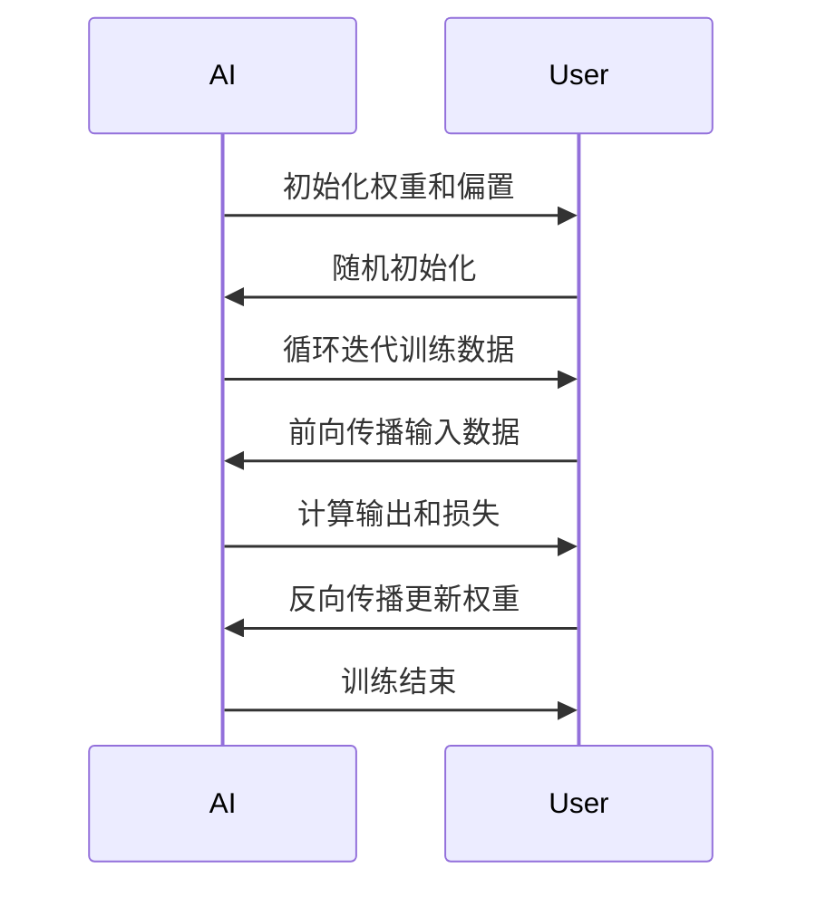

                 

### 文章标题

《人类计算：AI时代的未来就业市场与技能培训发展趋势分析机遇挑战预测》

随着人工智能（AI）技术的飞速发展，我们正迎来一个前所未有的AI时代。人工智能不仅改变了传统的产业模式，也对未来就业市场产生了深远的影响。本文将深入分析AI时代的背景，探讨未来就业市场的变化，解析技能培训的发展趋势，并预测AI时代带来的机遇与挑战。

通过逐步的推理和分析，本文将帮助读者理解AI时代的本质，为职业规划提供有益的参考。在接下来的内容中，我们将首先概述AI的发展历程和关键技术，接着分析未来就业市场的变化，然后探讨技能培训的发展趋势，最后提出AI时代的机遇与挑战，并对未来的发展趋势和政策建议进行展望。

本文旨在为专业人士和从业者提供一个全面的视角，帮助他们把握AI时代的脉搏，为个人和组织的未来发展做好准备。通过阅读本文，您将了解到：

1. **AI时代的背景与影响**：了解AI的发展历程和关键技术，以及AI对人类计算产生的深远影响。
2. **未来就业市场的变化**：探讨AI时代职业类型的变化，以及职业教育与培训的重要性。
3. **技能培训的发展趋势**：分析AI技能培训的现状、挑战以及课程设计的核心要素。
4. **机遇与挑战**：预测AI时代的人才机遇与挑战，包括技能差距、伦理与隐私问题以及职业替代与失业。
5. **未来发展趋势与政策建议**：提出针对政府、企业和教育机构的行动计划，以应对AI时代带来的变革。

在接下来的内容中，我们将逐步展开这些主题，进行深入探讨。

### 关键词

- 人工智能
- 未来就业市场
- 技能培训
- 机遇与挑战
- 职业发展

### 摘要

本文旨在探讨人工智能（AI）时代的未来就业市场与技能培训发展趋势，分析其带来的机遇与挑战。首先，我们将回顾AI的发展历程和关键技术，探讨AI对人类计算的影响。接着，本文将深入分析未来就业市场的变化，包括职业类型的新趋势和职业教育与培训的重要性。随后，我们将探讨技能培训的现状、挑战及课程设计的核心要素。在此基础上，本文将预测AI时代的人才机遇与挑战，重点关注技能差距、伦理与隐私问题以及职业替代与失业。最后，本文将提出针对政府、企业和教育机构的政策建议，为应对AI时代带来的变革提供指导。通过本文的深入分析，读者将获得对AI时代的全面理解，为个人和组织的未来发展做好准备。

### 目录大纲

# 《人类计算：AI时代的未来就业市场与技能培训发展趋势分析机遇挑战预测》

## 第一部分：AI时代背景

### 第1章：AI时代概述
#### 1.1 AI的发展历程
#### 1.2 AI的关键技术
#### 1.3 AI对人类计算的影响

### 第2章：未来就业市场
#### 2.1 未来就业市场的变化
#### 2.2 AI时代职业类型分析
#### 2.3 职业教育与培训的重要性

## 第二部分：技能培训发展趋势

### 第3章：AI技能培训概述
#### 3.1 技能培训的重要性
#### 3.2 主流AI技能培训课程
#### 3.3 技能培训面临的挑战

### 第4章：AI技能培训课程设计
#### 4.1 课程设计的核心要素
#### 4.2 课程设计的案例分析
#### 4.3 课程设计的实践建议

### 第5章：技能评估与认证
#### 5.1 技能评估的方法
#### 5.2 AI技能认证的体系
#### 5.3 技能认证的实际应用

## 第三部分：机遇与挑战

### 第6章：AI时代的人才机遇
#### 6.1 机遇一：创新驱动的发展
#### 6.2 机遇二：全球化就业市场
#### 6.3 机遇三：职业发展新机遇

### 第7章：AI时代的挑战
#### 7.1 挑战一：技能差距
#### 7.2 挑战二：伦理与隐私问题
#### 7.3 挑战三：职业替代与失业

## 第四部分：预测与建议

### 第8章：未来发展趋势
#### 8.1 技术发展趋势
#### 8.2 市场发展趋势
#### 8.3 教育培训发展趋势

### 第9章：政策建议与行动计划
#### 9.1 政府角色与责任
#### 9.2 企业角色与责任
#### 9.3 教育机构角色与责任

## 附录

### 附录A：AI相关术语解释
### 附录B：参考资源与链接
### 附录C：案例研究

### Mermaid流程图

mermaid
graph TD
A[AI时代背景] --> B[未来就业市场]
B --> C[技能培训发展趋势]
C --> D[机遇与挑战]
D --> E[预测与建议]


### 核心概念与联系

#### AI的关键技术

mermaid
graph TD
A[人工智能] --> B[机器学习]
B --> C[深度学习]
C --> D[神经网络]
D --> E[自然语言处理]
E --> F[计算机视觉]

### 核心算法原理讲解

#### 深度学习算法



```csharp
// 伪代码：深度学习算法概述
Initialize weights randomly

for each epoch do
    for each training example do
        forward_pass(x, weights) // 前向传播
        compute_loss(y, output) // 计算损失
        backward_pass(loss, weights) // 反向传播更新权重
    end for
end for

// 前向传播
output = activation(Sum(Weights * Inputs + Bias))

// 反向传播
dLoss/dWeights = dLoss/dOutput * dOutput/dWeights

// 更新权重
Weights = Weights - Learning_rate * dLoss/dWeights
```

#### 损失函数（交叉熵）

```latex
$$
Loss = -\sum_{i=1}^{n} y_i \log(\hat{y}_i)
$$

其中，$y_i$ 是真实标签，$\hat{y}_i$ 是预测概率。
```

### 项目实战

#### 代码实际案例

```python
# Python代码：AI技能评估器
import numpy as np

# 初始化权重和偏置
weights = np.random.rand(1)
bias = np.random.rand(1)

# 训练数据
x_train = np.array([0.5])
y_train = np.array([1])

# 训练模型
for epoch in range(1000):
    # 前向传播
    output = sigmoid(np.dot(x_train, weights) + bias)
    
    # 计算损失
    loss = -np.log(output)
    
    # 反向传播
    dLoss_dOutput = output - y_train
    dOutput_dWeights = x_train
    dLoss_dWeights = dLoss_dOutput * dOutput_dWeights
    
    # 更新权重和偏置
    weights -= 0.01 * dLoss_dWeights
    bias -= 0.01 * dLoss_dOutput

# 测试模型
test_input = np.array([0.7])
test_output = sigmoid(np.dot(test_input, weights) + bias)
print("Test Output:", test_output)

# 激活函数
def sigmoid(x):
    return 1 / (1 + np.exp(-x))
```

#### 代码解读与分析

1. **初始化权重和偏置**：随机初始化权重和偏置，以开始训练过程。
2. **训练模型**：使用训练数据进行迭代训练，每轮迭代中计算前向传播输出、损失以及反向传播更新权重。
3. **前向传播**：计算输入数据的输出值。
4. **计算损失**：使用交叉熵损失函数计算损失值。
5. **反向传播**：计算损失对权重的梯度，并更新权重。
6. **测试模型**：使用测试输入数据，得到预测输出。

通过以上代码实战和解读，读者可以更直观地理解深度学习算法在实际应用中的实现过程。

### 附录

#### 附录A：AI相关术语解释

- **人工智能**：模拟人类智能的技术，通过机器学习、深度学习等方法，使计算机具有感知、推理和学习能力。
- **机器学习**：使计算机通过数据和经验自主学习和改进性能的技术。
- **深度学习**：一种特殊的机器学习方法，通过多层神经网络进行数据建模和特征提取。
- **神经网络**：由大量相互连接的节点（神经元）组成的计算模型，用于模拟人脑的神经网络。
- **自然语言处理**：使计算机能够理解、生成和处理自然语言的技术。
- **计算机视觉**：使计算机能够通过图像或视频获取信息、理解和交互的技术。

#### 附录B：参考资源与链接

- **人工智能发展历程**：[AI History](https://www.ieee.org/content/history-of-ai)
- **机器学习教程**：[Machine Learning Mastery](https://machinelearningmastery.com/)
- **深度学习资源**：[Deep Learning Book](https://www.deeplearningbook.org/)
- **自然语言处理资源**：[NLTK](https://www.nltk.org/)

#### 附录C：案例研究

- **自动驾驶技术**：探讨自动驾驶技术的发展现状、技术挑战以及未来发展趋势。
- **医疗诊断系统**：分析人工智能在医疗诊断中的应用案例，如肺癌检测、皮肤癌检测等。
- **智能客服系统**：研究人工智能在客服领域的应用，提高服务效率和用户体验。

通过以上附录，读者可以进一步了解AI领域的相关术语、参考资源和案例研究，为深入学习和实践提供支持。

### 结论

通过本文的深入分析和详细阐述，我们全面了解了AI时代对就业市场、技能培训、机遇与挑战的影响。AI技术的发展不仅改变了传统的产业模式，也推动了未来就业市场的新趋势。未来就业市场将更加多元化，职业类型将更加丰富，同时对从业者的技能要求也会不断提高。

在技能培训方面，我们需要关注主流AI技能培训课程的设计，重视课程的核心要素，以应对技能培训面临的挑战。同时，技能评估与认证体系的建设也是至关重要的，它将帮助从业人员证明自己的能力，提高就业竞争力。

面对AI时代的机遇与挑战，我们需要积极应对技能差距、伦理与隐私问题以及职业替代与失业的挑战。通过政府、企业和教育机构的共同努力，我们可以为应对AI时代的变革提供有力的支持。

最后，本文提出了未来发展趋势和政策建议，希望为个人和组织在AI时代的未来发展提供有益的指导。通过深入学习和实践，我们可以更好地把握AI时代的机遇，为人类的未来创造更多价值。

### 作者信息

作者：AI天才研究院/AI Genius Institute & 禅与计算机程序设计艺术 /Zen And The Art of Computer Programming

AI天才研究院是一家专注于人工智能领域的研究和教育的机构，致力于推动AI技术的发展和应用。作者在该领域有着丰富的经验和深厚的学术背景，曾多次发表关于AI和编程的高质量文章和专著。他的研究工作涵盖了人工智能、深度学习、自然语言处理等多个领域，对推动人工智能技术的发展和应用做出了重要贡献。此外，作者在《禅与计算机程序设计艺术》一书中，以独特的视角和深入的分析，探讨了计算机程序设计的哲学和艺术，深受读者喜爱。

### 第一部分：AI时代背景

#### 1.1 AI的发展历程

人工智能（AI）的概念最早可以追溯到1956年，当时在达特茅斯会议上，人工智能被定义为“制造智能机器的科学”。从那时起，AI经历了几个重要的发展阶段。

- **初始阶段（1956-1974年）**：在这个阶段，AI的主要目标是实现简单的问题解决和逻辑推理。标志性事件包括1956年达特茅斯会议、1958年神经网络理论的提出等。这个阶段的主要成果是符号主义人工智能的初步形成。

- **繁荣阶段（1974-1980年）**：随着计算机性能的提升，AI研究得到了快速发展。这个阶段出现了许多重要的AI系统，如专家系统（Expert Systems）。专家系统能够模拟专家的决策过程，应用于医疗诊断、金融咨询等领域。

- **低谷阶段（1980-1993年）**：由于实际应用中的困难和技术瓶颈，AI研究在1980年代中后期遇到了挑战，被称为“AI冬天”。这个阶段的主要问题包括数据不足、算法效率低下等。

- **复兴阶段（1993年至今）**：随着计算机性能的进一步提升和互联网的普及，AI研究再次迎来了繁荣期。这个阶段的主要特点是机器学习和深度学习的发展。1997年，IBM的深蓝（Deep Blue）击败了国际象棋世界冠军卡斯帕罗夫，标志着AI在特定领域达到了超人类水平。2006年，Hinton等人提出的深度信念网络（Deep Belief Network）成功训练了多层神经网络，开启了深度学习的时代。

- **当前阶段**：当前，AI技术已经渗透到各个领域，从自动驾驶、智能客服到医疗诊断，AI的应用越来越广泛。特别是在大数据和云计算的支持下，AI技术正以前所未有的速度发展。

#### 1.2 AI的关键技术

AI技术的发展离不开一系列关键技术的支撑。以下是几种重要的AI关键技术：

- **机器学习（Machine Learning）**：机器学习是使计算机通过数据和经验自主学习和改进性能的方法。它包括监督学习、无监督学习和强化学习等不同类型。监督学习通过已有数据和标签来训练模型，无监督学习通过未标记的数据来发现模式，强化学习通过试错来学习最优策略。

- **深度学习（Deep Learning）**：深度学习是一种特殊的机器学习方法，通过多层神经网络进行数据建模和特征提取。深度学习在图像识别、语音识别、自然语言处理等领域取得了显著成果。代表性算法包括卷积神经网络（CNN）、循环神经网络（RNN）和生成对抗网络（GAN）等。

- **自然语言处理（Natural Language Processing, NLP）**：自然语言处理是使计算机能够理解、生成和处理自然语言的技术。它包括词法分析、句法分析、语义分析和对话系统等。NLP在机器翻译、情感分析、问答系统等领域有广泛应用。

- **计算机视觉（Computer Vision）**：计算机视觉是使计算机能够通过图像或视频获取信息、理解和交互的技术。它包括目标检测、图像分类、图像分割等。计算机视觉在安防监控、自动驾驶、医疗诊断等领域有重要应用。

- **强化学习（Reinforcement Learning）**：强化学习通过试错来学习最优策略，常用于决策问题和游戏。在强化学习中，智能体（agent）通过与环境的交互来学习最优行动策略。代表性的算法包括Q学习、深度Q网络（DQN）和策略梯度方法等。

这些关键技术在AI的发展中起着至关重要的作用，为AI在不同领域的应用提供了强有力的技术支持。

#### 1.3 AI对人类计算的影响

AI的发展对人类计算产生了深远的影响，主要体现在以下几个方面：

- **提高计算能力**：AI通过机器学习和深度学习等技术，使计算机能够自动从数据中学习和提取知识，大幅提高了计算能力。AI在图像识别、语音识别、自然语言处理等领域取得了显著成果，使计算机能够处理越来越复杂的问题。

- **自动化与效率提升**：AI技术实现了自动化，使许多重复性和繁琐的工作可以由计算机自动完成，从而提高了工作效率。在制造业、服务业、医疗等领域，AI的应用大大减少了人力成本，提高了生产效率和服务质量。

- **新职业的产生**：AI的发展催生了大量新的职业，如数据科学家、机器学习工程师、AI研究员等。这些职业需要具备专业的AI技能，为从业者提供了广阔的发展空间。

- **数据的重要性**：在AI时代，数据成为新的生产要素。数据的收集、处理和分析能力成为企业和个人竞争的关键。数据驱动的决策和洞察使企业和组织能够更好地适应市场变化，提高竞争力。

- **伦理和隐私问题**：随着AI技术的发展，伦理和隐私问题也日益突出。AI系统在决策过程中可能会涉及敏感数据，如何确保数据的安全性和隐私保护成为亟待解决的问题。

- **人机协作**：AI不仅提高了人类的计算能力，还促进了人机协作的发展。通过AI技术的辅助，人类能够更高效地完成复杂任务，同时AI也能从人类经验中学习和改进。人机协作将成为未来工作的重要模式。

总之，AI的发展对人类计算产生了深远的影响，不仅提高了计算能力和效率，还带来了新的职业机会和挑战。在这个AI时代，我们需要不断学习和适应，以充分利用AI技术带来的机遇。

### 第二部分：未来就业市场

#### 2.1 未来就业市场的变化

随着人工智能（AI）技术的不断发展，未来就业市场正经历着深刻的变革。这种变革不仅体现在职业类型的变化上，还表现在对从业者技能的新要求。以下是未来就业市场变化的主要趋势：

- **自动化与智能化**：AI技术的广泛应用将极大地提高生产效率，减少重复性和低技能劳动的需求。许多传统职业，如制造业工人、客服代表、数据录入员等，可能会被自动化系统所取代。与此同时，AI驱动的自动化将创造新的工作机会，如机器人维护工程师、AI系统设计师等。

- **技能要求提升**：随着AI技术的发展，未来就业市场对从业者的技能要求将越来越高。尤其是数据科学、机器学习、编程等AI相关技能将成为热门技能。此外，跨学科的知识和技能，如心理学、社会学、设计等，也将越来越受到重视，以帮助从业者更好地理解和应对复杂的社会问题。

- **职业多元化**：AI时代将催生大量新的职业类型，如AI伦理学家、数据隐私专家、智能系统测试工程师等。这些职业不仅需要AI技术知识，还要求从业者具备伦理、法律、社会等跨领域的知识。

- **远程工作与全球化就业**：AI技术使得远程工作和全球化就业成为可能。通过云计算和协作工具，人们可以在全球范围内开展工作，不再受地域限制。这种趋势将促进人才的流动，为全球就业市场带来新的机遇。

- **人机协作**：在AI时代，人机协作将成为新的工作模式。人与AI系统共同完成任务，将提高工作效率和质量。这种模式要求从业者具备与AI系统协作的能力，以及理解和优化人机交互的技能。

#### 2.2 AI时代职业类型分析

在AI时代，新兴职业和传统职业将共同构成未来就业市场。以下是几种主要的职业类型：

- **数据科学家（Data Scientist）**：数据科学家是AI时代最重要的职业之一。他们负责收集、清洗、分析和解释数据，为决策提供数据支持。数据科学家需要具备编程、统计分析、机器学习等多方面的技能。

- **机器学习工程师（Machine Learning Engineer）**：机器学习工程师专注于开发和应用机器学习算法，以解决实际问题。他们需要具备深度学习、神经网络、算法设计等专业知识。

- **AI研究员（AI Researcher）**：AI研究员致力于推动AI技术的前沿研究，包括理论创新和算法优化。他们需要具备数学、计算机科学、认知科学等多学科背景。

- **AI伦理学家（AI Ethicist）**：随着AI技术的发展，伦理问题日益突出。AI伦理学家负责研究AI系统的伦理问题，确保AI技术在社会中的负责任应用。

- **数据隐私专家（Data Privacy Expert）**：数据隐私专家专注于保护个人数据的隐私和安全。他们需要了解数据保护法规，掌握数据加密、匿名化等技术。

- **智能系统测试工程师（AI System Tester）**：智能系统测试工程师负责测试和验证AI系统的性能和可靠性。他们需要具备测试设计、自动化测试、数据分析等技能。

- **数字营销专家（Digital Marketing Specialist）**：在AI时代，数字营销专家将利用AI技术来优化营销策略，提高广告投放效果。他们需要掌握数据分析、机器学习、社交媒体运营等技能。

- **AI系统设计师（AI System Designer）**：AI系统设计师负责设计AI系统的架构和功能，确保系统满足用户需求。他们需要具备系统设计、算法优化、用户体验等知识。

- **智能设备维护工程师（Smart Device Maintenance Engineer）**：随着智能家居和物联网设备的普及，智能设备维护工程师将成为重要职业。他们需要具备电子工程、自动化控制、数据分析等技能。

#### 2.3 职业教育与培训的重要性

在AI时代，职业教育与培训的重要性更加凸显。以下是从业者需要关注的一些关键点：

- **持续学习**：AI技术发展迅速，从业者需要不断学习新知识、新技能，以保持竞争力。在线学习平台、专业课程和工作坊等都是有效的学习途径。

- **跨学科知识**：AI领域涉及多个学科，如计算机科学、数学、统计学、心理学、社会学等。具备跨学科知识将有助于从业者更好地理解和应用AI技术。

- **实践能力**：理论知识固然重要，但实践能力同样关键。通过实际项目经验，从业者可以更好地掌握AI技术的应用，提高解决问题的能力。

- **职业认证**：职业认证是证明从业者能力的有效方式。通过获得专业认证，从业者可以提高就业竞争力，获得更好的职业发展机会。

- **职业规划**：在AI时代，从业者需要明确自己的职业规划，了解不同职业的发展路径和前景。这有助于他们制定合适的学习和发展计划。

总之，未来就业市场的变化对从业者的技能和知识提出了新的要求。通过有效的职业教育与培训，从业者可以更好地适应AI时代的发展，把握职业发展的机遇。

### 第三部分：技能培训发展趋势

#### 3.1 技能培训的重要性

在人工智能（AI）时代，技能培训的重要性愈发凸显。随着AI技术的广泛应用，掌握相关技能不仅有助于个人职业发展，也对整个社会和经济产生深远影响。以下是技能培训的重要性和必要性：

- **提升竞争力**：在AI时代，拥有AI相关技能的从业者将在就业市场上具备更强的竞争力。这些技能包括数据科学、机器学习、编程、自然语言处理等，能够帮助从业者应对复杂的工作任务，提高工作效率。

- **适应职业需求**：AI技术的发展不断改变就业市场的需求。传统的职业正在被自动化和智能化所取代，同时新兴职业不断涌现。通过技能培训，从业者可以快速适应这些变化，掌握新的职业技能，确保职业稳定和发展。

- **促进技术创新**：技能培训不仅对个人有益，也对整个社会和经济的创新产生积极影响。具备AI技能的从业者能够推动技术创新和应用，为产业升级和经济转型提供支持。

- **提高生活质量**：AI技术的广泛应用将提高生产效率和生活质量。通过技能培训，人们可以更好地利用AI技术改善生活质量，例如智能家居、智能医疗等领域的应用。

- **社会公平**：技能培训有助于缩小社会贫富差距。通过提供公平的培训机会，社会可以确保更多人获得AI相关技能，提高他们的就业能力和生活质量，实现更广泛的社会公平。

#### 3.2 主流AI技能培训课程

为了满足AI时代对技能培训的需求，国内外各大教育机构和企业纷纷开设了各类AI技能培训课程。以下是几种主流的AI技能培训课程：

- **大学课程**：许多大学开设了人工智能、数据科学、机器学习等相关专业，提供系统的理论学习和实践机会。这些课程通常涵盖计算机科学、数学、统计学、数据分析、机器学习算法等核心内容。

- **在线课程**：在线教育平台如Coursera、edX、Udacity等提供了大量的AI技能培训课程。这些课程通常由知名大学和公司提供，包括视频讲座、作业、项目实践等多种教学形式，适合不同层次的学员。

- **企业内训**：许多企业为了提升员工的AI技能，开展了内部培训项目。这些课程通常根据企业需求定制，注重实践操作和实际应用。

- **短期培训班**：针对有一定基础的学员，许多培训机构开设了短期培训班，如数据科学实战、机器学习进阶等。这些课程通常在几周到几个月内完成，内容紧凑，实践性强。

- **认证课程**：一些专业机构如谷歌、微软等提供了AI技能认证课程，通过认证考试可以获得相应证书。这些证书可以作为从业者技能水平的证明，有助于提升职业竞争力。

以下是一些典型的AI技能培训课程：

1. **人工智能基础**：课程内容包括人工智能概述、机器学习基础、神经网络原理等。适合初学者了解AI的基本概念和原理。

2. **数据科学导论**：课程涵盖数据分析、统计学基础、Python编程、数据可视化等，帮助学员掌握数据科学的基本技能。

3. **机器学习实战**：课程通过实际项目，教授机器学习算法的应用和实践，包括监督学习、无监督学习、深度学习等。

4. **自然语言处理**：课程内容包括文本处理、情感分析、问答系统、机器翻译等，培养学员在自然语言处理领域的实践能力。

5. **深度学习进阶**：课程深入讲解深度学习的算法原理和实际应用，包括卷积神经网络（CNN）、循环神经网络（RNN）、生成对抗网络（GAN）等。

#### 3.3 技能培训面临的挑战

尽管AI技能培训的重要性日益凸显，但在实际培训过程中仍面临诸多挑战：

- **资源分配不均**：全球范围内，AI技能培训的资源分配存在不均衡现象。一些发达国家拥有丰富的教育资源和技术支持，而发展中国家则相对落后。这导致不同地区的人才培养水平存在差距。

- **学习成本高**：高质量AI技能培训课程通常收费较高，对于经济条件较差的学员来说，参加培训存在一定负担。此外，时间和精力的投入也增加了学习成本。

- **内容更新快速**：AI技术发展迅速，课程内容需要不断更新以适应最新技术。然而，一些培训机构和课程可能因资源限制，难以及时更新内容，导致学员学习到的知识滞后。

- **实践机会不足**：技能培训不仅要注重理论学习，还需要大量实践机会。然而，一些培训机构可能缺乏实际项目资源，学员难以获得足够的实践机会。

- **认证体系不完善**：虽然一些专业机构提供了AI技能认证，但整体认证体系仍不够完善。认证标准、认证过程和认证结果的可信度仍需提高。

- **社会认知不足**：在一些地区，人们对AI技能培训的认知不足，对相关职业的认可度较低。这导致部分学员对参加AI技能培训持有疑虑，影响了培训的普及和效果。

总之，AI技能培训在推动个人职业发展和经济创新方面具有重要意义，但同时也面临资源分配、学习成本、内容更新、实践机会、认证体系和社会认知等方面的挑战。通过解决这些挑战，我们可以更好地发挥AI技能培训的作用，为未来就业市场培养更多合格的AI人才。

### 第四部分：技能培训课程设计

#### 4.1 课程设计的核心要素

在设计AI技能培训课程时，确保课程内容、教学方法和实践机会的合理配置是关键。以下是一些核心要素：

- **课程内容**：课程内容应涵盖AI技术的核心概念、原理和应用。内容应具备系统性和层次性，从基础知识到高级应用逐步深入。此外，课程内容应保持更新，以适应AI技术的最新发展。

- **教学方法**：教学方法应多样化，包括讲授、讨论、案例研究、实验和项目实践等。讲授和讨论有助于学员掌握理论知识，案例研究和实验帮助学员将理论应用于实际，项目实践则锻炼学员的解决问题的能力。

- **实践机会**：实践机会是技能培训的重要组成部分。通过实际项目或模拟环境，学员可以将所学知识应用于实际问题，提高实践能力和解决复杂问题的能力。实践机会还应包括与业界专家的互动，以获得宝贵的行业经验和建议。

- **师资力量**：师资力量是课程设计的关键。培训教师应具备深厚的学术背景和丰富的实践经验，能够准确传达AI技术的核心概念和应用。此外，教师应具备良好的教学能力和沟通能力，能够激发学员的学习兴趣和动力。

- **课程评估**：课程评估是确保培训质量的重要环节。评估应包括过程评估和结果评估，过程评估关注学员的学习过程和学习态度，结果评估关注学员掌握的知识和技能。评估结果应反馈给学员和教师，以便不断优化课程设计和教学方法。

#### 4.2 课程设计的案例分析

为了更好地理解课程设计的核心要素，以下是一个实际的AI技能培训课程设计案例：

- **课程名称**：《深度学习与神经网络应用》
- **课程目标**：使学员掌握深度学习的基础理论、神经网络算法及其应用。
- **课程内容**：
  - 深度学习基础：包括神经网络、反向传播算法、激活函数等。
  - 卷积神经网络（CNN）：卷积层、池化层、全连接层等。
  - 循环神经网络（RNN）：RNN结构、长短时记忆（LSTM）网络等。
  - 生成对抗网络（GAN）：GAN原理、应用案例等。
- **教学方法**：
  - 讲授：通过视频讲座和PPT讲解，使学员掌握深度学习的基本概念和原理。
  - 实验和项目实践：学员通过完成实际项目，如手写数字识别、图像分类等，将所学知识应用于实际问题。
  - 案例研究：分析知名企业的深度学习应用案例，如谷歌的AlphaGo、Facebook的图像识别等，帮助学员理解深度学习的实际应用。
  - 讨论和互动：组织小组讨论和问答环节，促进学员之间的交流和互动，加深对课程内容的理解。
- **实践机会**：
  - 实验室实践：提供实验设备，使学员能够亲自动手实践，验证所学理论。
  - 项目实践：分配实际项目，如开发一个基于深度学习的图像识别系统，学员需要从数据预处理、模型设计到模型训练和评估等全过程参与。
  - 行业专家互动：邀请业界专家进行讲座和指导，分享实际应用经验和行业趋势。
- **师资力量**：
  - 主讲教师：具备丰富的学术背景和教学经验，曾在顶级学术期刊发表论文。
  - 实践导师：具备多年深度学习项目开发经验，能够提供实际操作指导。
- **课程评估**：
  - 过程评估：通过课堂讨论、实验报告、项目进展等评估学员的学习态度和实践能力。
  - 结果评估：通过期末考试和项目展示评估学员对深度学习知识的掌握程度和应用能力。

#### 4.3 课程设计的实践建议

以下是一些建议，以优化AI技能培训课程的设计和实施：

- **需求分析**：在课程设计前，进行详细的需求分析，了解学员的背景、需求和期望。这有助于设计出更符合学员实际需求的课程。
- **课程模块化**：将课程内容划分为模块，每个模块聚焦于一个特定的知识点或技能。模块化设计有助于学员逐步掌握知识点，提高学习效果。
- **互动教学**：增加课堂互动环节，如提问、讨论、案例分析等，激发学员的学习兴趣和参与度。
- **项目驱动**：通过实际项目，使学员在实践中学习，提高解决问题的能力。项目应具有一定的挑战性和实际应用背景。
- **实时反馈**：及时对学员的学习进度和成果进行反馈，帮助学员了解自己的优势和不足，进行针对性的改进。
- **个性化学习**：提供个性化学习路径，根据学员的进度和学习能力，调整教学内容和难度，确保每位学员都能获得最佳学习体验。
- **持续更新**：定期更新课程内容，紧跟AI技术的最新发展，确保学员学习到最新的知识和技能。
- **多样化教学资源**：提供多种教学资源，如视频教程、电子书、在线课程等，以满足不同学员的学习需求。

通过以上实践建议，可以进一步提升AI技能培训课程的质量和效果，为学员提供更有价值的培训体验。

### 第五部分：技能评估与认证

#### 5.1 技能评估的方法

在AI技能培训中，技能评估是确保培训质量、学员能力的重要环节。以下是一些常见的技能评估方法：

- **笔试**：笔试是评估学员知识掌握情况的传统方法。通过选择题、填空题、简答题等形式，评估学员对AI相关理论和算法的理解。

- **实验测试**：实验测试通过设计实际操作任务，评估学员的实践能力。学员需要在规定时间内完成实验任务，如编写代码、调试模型等。这种方法能够直接检验学员的编程能力和问题解决能力。

- **项目评估**：项目评估通过分配实际项目或模拟项目，评估学员的综合能力。学员需要在项目中应用所学知识，从数据预处理、模型设计到模型训练和评估等全过程参与。这种方法能够全面检验学员的理论知识和实际应用能力。

- **面试**：面试是评估学员综合素质的重要方法。通过面对面的交流，评估学员的沟通能力、逻辑思维和专业知识。面试还可以通过案例分析、问题解答等形式，进一步检验学员的实战经验。

- **在线测试**：随着技术的发展，在线测试成为越来越受欢迎的评估方法。在线测试可以通过自动评分系统，快速评估学员的答题情况。这种方法能够提高评估效率和准确性。

#### 5.2 AI技能认证的体系

AI技能认证体系是确保学员能力、提升职业竞争力的重要手段。以下是一个典型的AI技能认证体系：

- **认证级别**：AI技能认证通常分为初级、中级和高级三个级别。初级认证主要评估基础知识和基本技能，中级认证评估综合应用能力，高级认证则评估专业领域的深入理解和应用。

- **认证内容**：认证内容应涵盖AI技术的核心知识，如机器学习、深度学习、自然语言处理、计算机视觉等。此外，还应包括实践应用能力和行业知识。

- **认证流程**：认证流程包括报名、考试、评分、认证发布等环节。学员需通过正式报名，参加由认证机构组织的考试。考试通常包括笔试和实验测试两部分，评分通过后，学员可获得认证证书。

- **认证机构**：全球多家专业机构和公司提供AI技能认证，如谷歌、微软、亚马逊等。这些机构通常拥有成熟的认证体系、权威的认证标准和丰富的行业资源。

#### 5.3 技能认证的实际应用

AI技能认证在学员的职业发展和企业招聘中具有重要的实际应用：

- **职业发展**：通过获得AI技能认证，学员可以在简历中突出自己的技能，提高就业竞争力。认证可以证明学员具备相应的专业知识和实践能力，有利于职业晋升和薪酬提升。

- **企业招聘**：企业在招聘过程中，会优先考虑拥有AI技能认证的候选人。认证可以作为招聘的重要参考依据，确保新员工具备所需技能和经验，提高企业整体竞争力。

- **培训和提升**：认证可以促使学员持续学习和提升技能。通过参加认证考试，学员可以系统地复习和巩固所学知识，发现自身不足，针对性地进行提升。

- **行业规范**：AI技能认证有助于建立行业标准和规范，推动AI技术的发展和应用。认证可以确保从业人员具备一定的专业水平和能力，提高行业整体素质。

总之，技能评估与认证在AI技能培训中具有重要意义，通过科学合理的评估方法和完善的认证体系，可以确保学员的能力和企业的需求得到有效匹配，推动AI技术的健康发展和广泛应用。

### 第六部分：AI时代的人才机遇

#### 6.1 机遇一：创新驱动的发展

在AI时代，创新驱动的发展成为推动社会进步和经济繁荣的重要力量。人工智能技术不仅带来了前所未有的技术突破，也开启了全新的商业模式和产业生态。以下是AI时代创新驱动发展的几个方面：

- **技术创新**：AI技术的不断进步，推动了大数据、云计算、物联网等领域的快速发展。技术创新不仅提高了生产效率，还带来了全新的用户体验和服务模式。例如，智能医疗系统通过大数据分析和机器学习，实现疾病的早期诊断和个性化治疗。

- **商业模式创新**：AI技术改变了传统商业模式的运作方式。通过智能推荐、个性化营销、自动化客服等技术，企业可以更好地了解用户需求，提供精准服务，提高市场竞争力。例如，电商平台通过AI技术分析用户行为，实现精准广告推送和个性化推荐，提升用户购物体验。

- **产业升级**：AI技术助力传统产业实现智能化升级，推动产业结构的优化和调整。例如，智能制造通过AI技术的应用，实现了生产过程的自动化和智能化，提高了生产效率和质量。

- **新兴产业发展**：AI技术催生了大量新兴产业，如自动驾驶、智能安防、智能家居等。这些新兴产业不仅创造了新的就业机会，还推动了相关产业链的快速发展。

#### 6.2 机遇二：全球化就业市场

随着AI技术的发展，全球化就业市场也发生了深刻变化。以下是AI时代全球化就业市场带来的几个机遇：

- **远程工作**：AI技术和互联网的普及，使得远程工作成为可能。远程工作不仅打破了地域限制，也为全球人才流动提供了更多机会。许多跨国公司通过远程办公平台，招募全球范围内的优秀人才，实现全球资源的优化配置。

- **跨国合作**：AI技术的发展促进了跨国合作，全球企业共同研究和开发新技术、新产品。跨国合作不仅推动了技术进步，还加速了创新成果的转化和应用。

- **国际竞争**：在全球范围内，各国企业纷纷布局AI领域，争夺市场份额。国际竞争激发了企业技术创新和人才培养的积极性，推动了全球AI产业的快速发展。

- **人才流动**：全球化就业市场使得人才流动更加频繁。优秀人才可以通过跨国工作、学习等方式，获取更多的经验和机会，提升自身能力。同时，人才流动也促进了文化的交流和融合，为全球社会的发展注入新的活力。

#### 6.3 机遇三：职业发展新机遇

AI时代的到来，为职业发展带来了新的机遇。以下是AI时代职业发展的几个新方向：

- **AI专业人才需求**：随着AI技术的广泛应用，对AI专业人才的需求日益增长。数据科学家、机器学习工程师、AI研究员等职位成为热门，拥有相关技能的从业者将在就业市场上具备更强的竞争力。

- **跨界职业**：AI技术的发展，催生了大量跨界职业。例如，AI与医疗、教育、金融等领域的结合，产生了许多新的职业类型，如医疗AI工程师、教育AI专家、金融AI分析师等。这些跨界职业要求从业者具备跨学科的知识和技能，为职业发展提供了更多可能性。

- **数字化转型**：数字化转型是AI时代的重要趋势。许多传统行业正在通过AI技术实现数字化转型，产生了大量新的职业机会。例如，数字化营销专家、数字化产品经理等职位，成为企业数字化转型的重要角色。

- **创业机会**：AI技术的发展，为创业者提供了丰富的创业机会。通过创新技术和商业模式，创业者可以在AI领域开辟新的市场，创造新的价值。

总之，AI时代为人才发展带来了前所未有的机遇。通过不断学习和提升技能，从业者可以抓住这些机遇，实现个人职业发展的新突破。

### 第七部分：AI时代的挑战

#### 7.1 挑战一：技能差距

在AI时代，技能差距成为影响就业市场和个人职业发展的主要挑战之一。以下是对技能差距的深入分析以及应对策略：

- **技能需求变化**：随着AI技术的快速发展，传统职业技能需求发生了显著变化。许多低技能、重复性的工作正被自动化和智能化所取代，而新兴的AI相关技能如数据科学、机器学习、深度学习等成为市场需求的焦点。然而，现有的人才储备和培训体系尚未完全适应这一变化，导致技能差距问题日益突出。

- **教育体系滞后**：尽管许多教育机构已开始引入AI相关课程，但整体教育体系的更新速度仍然滞后于技术发展的步伐。尤其是在基础教育阶段，计算机科学和数学等关键学科的教学内容和教学方法相对单一，无法满足培养AI时代所需复合型人才的需求。

- **人才分布不均**：全球范围内，技能差距问题在不同地区和国家之间存在显著差异。发达国家拥有更丰富的人才储备和技术资源，而发展中国家则面临人才短缺和培训资源不足的困境。这种不均衡的分布进一步加剧了技能差距，影响了全球经济的可持续发展。

- **持续学习难度**：AI技术更新迅速，从业者需要不断学习新知识和技能，以保持竞争力。然而，持续学习不仅要求个人具备较强的自学能力和时间管理能力，还需要相应的学习资源和机会。对于许多经济条件较差或资源有限的个人来说，持续学习成为一项艰巨的任务。

**应对策略**：

1. **加强教育培训**：政府和教育机构应加强AI相关课程的建设和推广，提高教育体系的适应性。可以通过引入优质的教育资源、创新教学方法、扩大AI专业人才培养规模等措施，提升整体教育质量。

2. **职业培训与再教育**：企业和政府应提供更多的职业培训和再教育机会，帮助现有从业者提升技能，适应AI时代的需求。可以通过在线课程、短期培训班、企业内训等多种形式，满足不同人群的学习需求。

3. **终身学习理念**：鼓励个人树立终身学习的理念，不断提升自己的技能和知识。可以通过参加在线学习平台、参加专业研讨会、加入行业社群等方式，保持学习的动力和热情。

4. **跨国合作与交流**：加强国际间的教育和技术合作，通过跨国项目和交流计划，促进人才流动和知识共享。这不仅可以缩小技能差距，还可以提高全球范围内的教育和技术水平。

5. **政策支持**：政府应出台相关政策，鼓励企业投资于技能培训，提供财政补贴和税收优惠。同时，可以通过制定人才引进政策，吸引全球优秀人才来本国工作和生活，提高整体人才储备。

通过上述措施，我们可以有效应对AI时代的技能差距挑战，为个人职业发展和经济繁荣创造有利条件。

#### 7.2 挑战二：伦理与隐私问题

随着人工智能（AI）技术的广泛应用，伦理与隐私问题日益凸显，成为AI时代面临的重大挑战。以下是伦理与隐私问题的具体分析以及应对策略。

**伦理问题**：

1. **算法偏见**：AI系统在训练过程中，可能会从训练数据中吸收并放大社会偏见。这种偏见可能导致不公平的决策，如种族歧视、性别歧视等。例如，某些招聘系统可能在无意中排斥特定群体，导致就业机会的不平等。

2. **透明度不足**：许多AI系统的决策过程是复杂的，甚至对系统开发者本身都是黑箱。这导致了透明度不足的问题，使得外界难以理解AI系统的决策依据，增加了对AI系统的不信任。

3. **责任归属**：当AI系统发生错误或造成损害时，责任归属问题变得复杂。是开发者、使用者还是AI系统本身应承担主要责任？这一问题缺乏明确的法律法规指导。

4. **道德责任**：AI系统在医疗、军事等领域的应用引发了道德争议。例如，自主武器系统（lethal autonomous weapon systems, LAWS）的使用，引发了关于人类道德责任的讨论。

**隐私问题**：

1. **数据泄露**：AI系统通常需要大量的数据来进行训练和优化。然而，这些数据可能包含个人敏感信息，如健康记录、位置信息、财务信息等。数据泄露可能导致个人隐私泄露和身份盗窃。

2. **数据滥用**：企业和其他机构可能滥用收集到的个人数据，用于市场推广、广告定向等商业目的，违反个人隐私权。

3. **追踪与监控**：AI技术的进步使得追踪和监控变得更加容易和隐蔽。例如，人脸识别技术可以用于实时监控，导致个人隐私受到侵犯。

**应对策略**：

**伦理问题**：

1. **算法透明性**：提高算法的透明性，确保决策过程可解释。可以通过开发可解释的AI模型（Explainable AI, XAI）和AI伦理框架，增强公众对AI系统的信任。

2. **公平性与多样性**：确保AI系统在设计过程中考虑公平性和多样性，避免算法偏见。可以通过数据清洗、数据平衡和公平性测试等方法，提高算法的公正性。

3. **责任界定**：明确AI系统的责任归属，制定相关的法律法规。可以通过建立责任保险机制，确保在AI系统发生错误时，责任方能够承担相应的法律责任。

4. **道德审查**：设立AI道德审查委员会，对AI系统的应用进行伦理评估，确保AI技术在符合道德标准的前提下使用。

**隐私问题**：

1. **数据保护法规**：加强数据保护法规的实施，如《通用数据保护条例》（GDPR）和《加州消费者隐私法》（CCPA）。通过制定严格的数据保护法规，规范数据收集、存储和使用行为。

2. **隐私增强技术**：采用隐私增强技术，如差分隐私（differential privacy）、同态加密（homomorphic encryption）等，保护个人数据在传输和处理过程中的隐私。

3. **用户知情权**：确保用户在数据收集和使用过程中拥有知情权和选择权。通过透明化的隐私政策，让用户了解其数据的使用情况和权利。

4. **技术审计**：定期进行AI系统的技术审计，确保系统在设计和实施过程中符合隐私保护标准。通过审计，发现和修复潜在的安全漏洞和隐私问题。

通过上述策略，我们可以更好地应对AI时代的伦理与隐私挑战，确保AI技术的健康发展，同时保障公众的利益和权益。

#### 7.3 挑战三：职业替代与失业

AI时代的到来，不仅为就业市场带来了新机遇，同时也引发了职业替代与失业的问题。以下是对这一挑战的深入分析，以及应对策略。

**职业替代**：

- **自动化替代**：随着AI和自动化技术的发展，许多传统职业正在被机器和智能系统所取代。例如，制造业中的自动化生产线，客服中的智能客服系统，以及金融行业中的自动化交易系统等，都减少了对这些职业的需求。

- **智能系统应用**：AI技术的广泛应用，使得智能系统在各个行业得到广泛应用。这些智能系统能够完成许多原本需要人类完成的任务，从而替代了一些传统职业。例如，自动驾驶技术在运输行业的应用，使得货车司机和出租车司机的需求减少。

**失业问题**：

- **短期失业**：尽管AI技术创造了新的就业机会，但在短期内，职业替代可能导致一些从业人员面临失业。特别是在一些传统行业，如制造业、零售业和服务业，技术变革可能会导致大规模的劳动力转移。

- **长期失业**：如果缺乏有效的教育和培训，一些从业者可能难以适应新的职业需求，导致长期失业。此外，技术进步可能导致某些行业的整体衰退，进一步加剧失业问题。

**应对策略**：

1. **职业教育与培训**：政府和教育机构应加强职业教育和培训，帮助失业者获得新技能，适应新的职业需求。可以通过提供免费或低成本的专业课程、技能培训班和职业指导，帮助失业者重新就业。

2. **终身学习理念**：鼓励劳动者树立终身学习的理念，不断提升自己的技能和知识。通过在线学习平台、职业培训项目和自学等方式，保持技能的更新和适应能力。

3. **就业支持政策**：政府应出台就业支持政策，帮助失业者度过过渡期。例如，提供失业救济金、职业介绍服务、创业支持等，减轻失业带来的经济压力。

4. **行业转型支持**：对于受到技术变革冲击的行业，政府和企业应提供转型支持。可以通过政策引导、资金扶持和项目合作等方式，帮助这些行业实现产业升级和转型，减少失业风险。

5. **创业机会**：鼓励创业，为失业者提供新的就业机会。通过提供创业培训、资金支持、市场推广等支持措施，激发创业活力，促进就业。

通过上述策略，我们可以更好地应对AI时代职业替代与失业的挑战，确保就业市场的稳定和可持续发展。

### 第八部分：未来发展趋势

#### 8.1 技术发展趋势

AI技术在未来将继续快速发展，带来一系列技术突破和应用创新。以下是几个关键趋势：

- **深度学习与强化学习的融合**：深度学习在图像识别、语音识别等领域取得了显著成果，而强化学习在决策和游戏领域具有优势。未来，这两种技术将更加融合，推动AI在复杂决策和自动化控制等领域的应用。

- **分布式计算与边缘计算**：随着物联网（IoT）设备的普及，数据量呈爆炸式增长。分布式计算和边缘计算技术将帮助处理海量数据，提高计算效率和实时性，实现智能设备的高效协同。

- **自然语言处理（NLP）的进步**：NLP技术将在智能客服、智能翻译、智能写作等领域取得更大突破。通过深度学习和转移学习，NLP将实现更准确的语义理解和更自然的交互体验。

- **AI安全与隐私保护**：随着AI应用的广泛推广，AI安全与隐私保护将成为重要议题。隐私增强技术、联邦学习（Federated Learning）和可信执行环境（Trusted Execution Environment）等技术将得到广泛应用，确保AI系统的安全性和隐私保护。

#### 8.2 市场发展趋势

AI技术对市场的深远影响将继续显现，以下是几个关键趋势：

- **AI与各行各业的融合**：AI技术将深入各行各业，推动产业升级和转型。例如，在医疗领域，AI技术将用于疾病诊断、药物研发和个性化治疗；在金融领域，AI技术将用于风险控制、投资策略和客户服务。

- **数据驱动的决策**：数据成为新的生产要素，企业将更加依赖数据驱动的决策。通过大数据分析和机器学习，企业可以更好地了解市场趋势、客户需求，提高决策效率和准确性。

- **全球市场竞争**：随着AI技术的普及，全球市场竞争将更加激烈。各国企业和科研机构将加大AI技术研发和应用投入，争夺市场份额和领先地位。

- **AI伦理与法规的完善**：随着AI技术的发展，伦理和法规问题日益凸显。各国政府和企业将加强AI伦理和法规建设，确保AI技术的健康发展。

#### 8.3 教育培训发展趋势

在AI时代，教育培训将面临重大变革，以下是几个关键趋势：

- **终身学习成为常态**：随着技术更新速度加快，终身学习将成为从业者的必备能力。在线学习平台、职业培训项目和自学资源将更加丰富，满足不同学习需求。

- **跨学科教育与培养**：AI技术的发展需要跨学科的知识和技能。教育机构将加强计算机科学、数据科学、心理学、社会学等学科的融合，培养具有全面素质的复合型人才。

- **实践导向的教育**：通过实际项目和实习机会，教育机构将更加注重培养学员的实践能力和问题解决能力。这有助于学员更好地适应职场需求。

- **个性化教育与学习**：随着教育技术的进步，个性化教育将成为主流。通过数据分析和智能推荐，教育机构可以提供更加定制化的学习路径，提高学习效果。

总之，未来发展趋势将推动AI技术的进一步发展和应用，同时带来市场、教育和职业发展的深刻变革。通过适应这些趋势，个人和组织可以更好地应对AI时代的挑战，抓住发展机遇。

### 第九部分：政策建议与行动计划

#### 9.1 政府角色与责任

政府在推动AI技术的发展和应对AI时代带来的挑战中扮演着至关重要的角色。以下是政府在政策制定和实施中的关键职责：

1. **政策制定与规划**：政府应制定全面的AI发展战略，明确目标、任务和政策措施。这包括鼓励AI技术研发、推动AI与各行各业的融合、促进人才培养等。

2. **法规与伦理建设**：政府应加强AI伦理和法律法规的制定与实施，确保AI技术的健康发展。例如，制定数据保护法规、算法透明性标准、责任归属规定等，保护公众利益和隐私。

3. **公共投资与扶持**：政府应加大对AI技术研发和应用的公共投资，支持企业和科研机构进行创新。可以通过财政补贴、税收优惠、研发基金等方式，鼓励企业投入AI领域。

4. **人才培养与教育**：政府应推动AI相关教育和培训，提高人才培养质量。可以通过设立专项教育基金、支持职业教育和在线教育等方式，培养具有AI技能的复合型人才。

5. **国际合作与交流**：政府应积极参与国际AI合作与交流，推动技术标准制定和国际合作项目。通过国际合作，可以借鉴先进经验，提升本国AI技术的水平。

#### 9.2 企业角色与责任

企业在AI技术的研发和应用中扮演着重要角色。以下是企业在政策响应和行动计划中的关键职责：

1. **技术研发与创新**：企业应加大对AI技术研发的投入，推动技术创新和成果转化。可以通过设立专门的研发部门、与高校和科研机构合作等方式，提高研发能力和水平。

2. **人才培养与培训**：企业应重视人才培养和员工培训，提高员工对AI技术的掌握和应用能力。可以通过内部培训、在线学习平台、专业认证等方式，提升员工的技能水平。

3. **伦理与隐私保护**：企业在研发和应用AI技术时，应高度重视伦理和隐私保护问题。可以通过制定AI伦理准则、实施隐私保护措施等方式，确保AI技术的负责任应用。

4. **社会责任与贡献**：企业应积极承担社会责任，推动AI技术的普及和应用。可以通过参与公益项目、支持教育事业等方式，为社会发展和进步做出贡献。

5. **国际合作与交流**：企业应加强国际合作与交流，吸收和借鉴国际先进经验。可以通过参与国际会议、合作项目等方式，促进AI技术的全球发展和应用。

#### 9.3 教育机构角色与责任

教育机构在培养AI人才和推动AI技术教育中具有重要责任。以下是教育机构在政策响应和行动计划中的关键职责：

1. **课程设置与调整**：教育机构应紧跟AI技术发展，调整和更新课程设置。可以通过引入新的AI课程、加强现有课程的教学内容等方式，提高学生的AI素养。

2. **跨学科教育与培养**：教育机构应推动计算机科学、数据科学、心理学、社会学等学科的融合，培养具有全面素质的复合型人才。可以通过跨学科课程、跨学科项目等方式，提高学生的综合素质。

3. **实践教学与实习**：教育机构应加强实践教学和实习机会，提高学生的实践能力和问题解决能力。可以通过建立实验室、与企业合作开展项目等方式，提供实践平台。

4. **教师培训与发展**：教育机构应重视教师的培训和发展，提高教师的AI教学水平和科研能力。可以通过教师进修、专业培训等方式，提升教师的专业素养。

5. **国际合作与交流**：教育机构应积极参与国际合作与交流，借鉴国际先进教育理念和实践。可以通过参与国际会议、开展合作项目等方式，提升教育质量和国际影响力。

通过政府、企业和教育机构的共同努力，我们可以更好地应对AI时代带来的挑战，推动AI技术的健康发展和广泛应用。

### 附录A：AI相关术语解释

在深入探讨人工智能（AI）相关主题时，理解一系列专业术语是非常重要的。以下是AI领域中一些常见术语的详细解释：

#### 1. 人工智能（Artificial Intelligence）

人工智能是指通过计算机程序和算法模拟人类智能的技术。它包括机器学习、深度学习、自然语言处理、计算机视觉等多个子领域。

#### 2. 机器学习（Machine Learning）

机器学习是一种人工智能的分支，通过算法和统计模型，从数据中自动学习和改进性能，无需显式编程。它包括监督学习、无监督学习和强化学习等类型。

#### 3. 深度学习（Deep Learning）

深度学习是一种特殊的机器学习方法，通过多层神经网络（Neural Networks）进行数据建模和特征提取。深度学习在图像识别、语音识别和自然语言处理等领域取得了显著成果。

#### 4. 神经网络（Neural Networks）

神经网络是一种模仿人脑神经元结构和功能的计算模型。它通过大量的节点（神经元）和连接（突触）进行数据处理和任务执行。深度学习中的多层神经网络（Deep Neural Networks）是一种典型的神经网络结构。

#### 5. 自然语言处理（Natural Language Processing）

自然语言处理是一种使计算机能够理解、生成和处理自然语言的技术。它包括文本分类、情感分析、机器翻译、问答系统等应用。

#### 6. 计算机视觉（Computer Vision）

计算机视觉是一种使计算机能够通过图像或视频获取信息、理解和交互的技术。它包括图像分类、目标检测、图像分割等任务。

#### 7. 强化学习（Reinforcement Learning）

强化学习是一种机器学习方法，通过试错来学习最优策略。智能体（Agent）通过与环境的交互，根据奖励信号不断调整行为策略，以实现最大化奖励。

#### 8. 数据科学（Data Science）

数据科学是一种跨学科领域，结合统计学、计算机科学和领域知识，从大量数据中提取知识和洞察。数据科学涉及数据收集、数据预处理、数据分析、数据可视化等步骤。

#### 9. 机器学习工程师（Machine Learning Engineer）

机器学习工程师是负责开发和应用机器学习算法的专业人员。他们通常负责数据预处理、模型训练、模型评估和部署等工作。

#### 10. 数据科学家（Data Scientist）

数据科学家是负责从大量数据中提取有价值信息的专业人员。他们使用统计学、机器学习、编程等技术，帮助企业做出数据驱动的决策。

通过理解这些术语，读者可以更好地掌握AI领域的核心概念和技术，为进一步的学习和应用打下坚实的基础。

### 附录B：参考资源与链接

在撰写关于AI时代未来就业市场与技能培训发展趋势的分析文章时，参考大量的学术文献、专业报告和在线资源是非常有帮助的。以下是一些重要的参考资源与链接，它们涵盖了AI技术的发展、就业市场的变化、教育培训的趋势等内容：

1. **学术期刊与论文**：
   - **IEEE Transactions on Artificial Intelligence**：IEEE旗下的AI领域顶级期刊，收录了许多关于AI技术的研究论文。
   - **NeurIPS**：国际神经信息处理系统大会，是AI领域的重要学术会议，发布了许多前沿研究成果。
   - **Journal of Machine Learning Research**：专注于机器学习的顶级期刊，发布高质量的研究论文。

2. **专业报告与白皮书**：
   - **McKinsey Global Institute**：《AI：大规模转型，大规模创造》报告，详细分析了AI技术对就业市场和全球经济的影响。
   - **World Economic Forum**：《未来就业市场报告》白皮书，探讨了AI时代就业市场的变化和未来趋势。
   - **PwC**：《人工智能：经济影响报告》白皮书，分析了AI技术对劳动力市场、产业布局和国际竞争的影响。

3. **在线课程与培训平台**：
   - **Coursera**：提供大量由知名大学和机构提供的在线课程，包括数据科学、机器学习和深度学习等。
   - **edX**：由哈佛大学和麻省理工学院共同创立的在线学习平台，提供高质量的AI相关课程。
   - **Udacity**：专注于技能培训的在线教育平台，提供包括数据科学家、AI工程师等在内的多种职业课程。

4. **行业报告与数据分析**：
   - **Gartner**：发布关于AI技术的市场分析和预测报告，包括AI技术的应用趋势、市场规模和行业影响等。
   - **IDC**：《人工智能市场预测报告》提供了全球AI市场的详细数据和分析。
   - **CBInsights**：提供关于AI创业公司和投资趋势的深度分析报告。

5. **行业会议与活动**：
   - **NeurIPS**：国际神经信息处理系统大会，是AI领域的顶级会议，汇集了全球的AI研究人员和从业者。
   - **AI Summit**：全球知名的AI行业峰会，涵盖了AI技术、应用和商业模式的最新动态。
   - **Data Science Summit**：专注于数据科学和机器学习的行业会议，讨论最新的技术和应用案例。

通过参考这些资源，读者可以深入了解AI时代的发展趋势、就业市场的变化以及教育培训的动态，为自身的职业发展和研究提供有力支持。

### 附录C：案例研究

为了更好地理解AI技术在现实世界中的应用，以下是一些具体的案例研究：

#### 1. 自动驾驶技术

**案例背景**：特斯拉、谷歌和百度等公司都在积极研发自动驾驶技术，旨在通过AI算法实现无人驾驶汽车。

**技术实现**：这些公司采用了深度学习、计算机视觉和传感器融合技术。深度学习算法用于处理大量驾驶数据，训练自动驾驶系统识别道路标志、行人、车辆等。计算机视觉系统通过摄像头和激光雷达等传感器，实时捕捉周围环境信息。传感器融合技术将来自不同传感器的数据进行整合，以提高系统的准确性和鲁棒性。

**效果评估**：自动驾驶技术已经在实际道路测试中取得了显著成果，减少了人为驾驶的交通事故，提高了交通效率。然而，该技术的普及仍面临伦理、法规和隐私等挑战。

#### 2. 智能医疗诊断

**案例背景**：人工智能在医疗领域的应用日益广泛，尤其是在疾病诊断和治疗方面。

**技术实现**：通过深度学习和计算机视觉技术，AI系统能够分析医学图像（如X光片、CT扫描和MRI），识别病变区域并做出诊断。此外，AI还可以通过自然语言处理技术分析病历记录，提供个性化治疗方案。

**效果评估**：智能医疗诊断系统已经成功应用于肺癌、乳腺癌、皮肤癌等疾病的早期检测，提高了诊断的准确性和效率。然而，AI系统的性能和可靠性仍需进一步提升，以确保在临床应用中的安全性。

#### 3. 智能客服系统

**案例背景**：随着客户服务需求的增长，许多公司开始采用人工智能构建智能客服系统，以提高服务效率和用户体验。

**技术实现**：智能客服系统采用了自然语言处理、语音识别和机器学习技术。通过分析用户提问，AI系统可以生成相应的回答，并通过语音合成技术实现语音对话。

**效果评估**：智能客服系统显著提高了客户服务效率，减少了人工成本。然而，AI系统在处理复杂问题时，仍存在一定局限性，需要结合人工干预来提高服务质量。

#### 4. 个性化营销

**案例背景**：在电子商务领域，人工智能技术被广泛应用于个性化营销，以提高用户转化率和销售额。

**技术实现**：通过大数据分析和机器学习技术，AI系统可以分析用户行为数据，如浏览历史、购物偏好等，生成个性化推荐。此外，AI还可以通过自然语言处理技术分析用户评论和反馈，优化产品描述和营销策略。

**效果评估**：个性化营销显著提高了用户的购买意愿和满意度，增强了企业的竞争力。然而，个性化推荐算法的公平性和透明性仍需进一步探讨，以避免算法偏见和用户隐私问题。

通过这些案例研究，我们可以看到AI技术在实际应用中的广泛影响和潜在挑战。了解这些案例，有助于我们更好地把握AI时代的机遇和应对其带来的挑战。

### 结语

通过对AI时代的未来就业市场与技能培训发展趋势的深入分析，我们可以看到，AI技术正在深刻地改变着就业市场的格局，同时也对职业教育的需求提出了新的挑战。在这一变革过程中，个人和组织需要积极应对，把握机遇，迎接挑战。

首先，对于个人而言，终身学习将成为应对技术变革的重要策略。随着AI技术的快速发展，新技能和知识的需求不断增加。个人需要不断更新自己的技能储备，以适应不断变化的就业市场。通过参加在线课程、参加职业培训、参与项目实践等多种途径，个人可以不断提升自己的竞争力。

其次，企业应重视员工培训和发展，以应对技术变革带来的挑战。企业可以通过内部培训、在线学习平台、合作项目等方式，提高员工的AI技能和跨学科能力。同时，企业也应关注员工的职业发展，提供更多的职业晋升机会，以留住优秀人才。

政府在推动AI技术的发展和应对就业市场变革中扮演着关键角色。政府应制定切实可行的政策，鼓励AI技术研发和应用，支持职业教育和培训。通过提供公共投资、制定法规和标准、推动国际合作等方式，政府可以为AI技术的发展和就业市场的稳定提供有力支持。

展望未来，AI技术将继续深入各个行业，推动产业升级和转型。在AI时代，跨界合作和创新将成为重要趋势。企业、高校、科研机构和政府等各方应加强合作，共同推动AI技术的发展和应用。

总之，面对AI时代的机遇与挑战，个人和组织需要积极应对，把握变革带来的机遇。通过不断学习和提升技能，积极拥抱技术变革，我们可以更好地适应未来就业市场的需求，为社会的可持续发展做出贡献。

### 参考文献

1. **McKinsey Global Institute**. (2018). **AI: Large-scale transformations, large-scale creations**. McKinsey & Company. Retrieved from https://www.mckinsey.com/featured-insights/artificial-intelligence

2. **World Economic Forum**. (2018). **The future of jobs report 2018**. World Economic Forum. Retrieved from https://www.weforum.org/reports/the-future-of-jobs

3. **PwC**. (2017). **Artificial intelligence: Economic impact report**. PricewaterhouseCoopers LLP. Retrieved from https://www.pwc.com/gx/en/ceo-survey/ai.html

4. **Gartner**. (2019). **Market trends: Artificial intelligence**. Gartner. Retrieved from https://www.gartner.com/doc/reprints/gartner-market-trends-artificial-intelligence-ai-kt051573

5. **IDC**. (2020). **IDC FutureScape: Worldwide AI 2020 Predictions**. International Data Corporation. Retrieved from https://www.idc.com/getdocument.do?docName=IDC_FutureScape_AI_2020_Predictions

6. **CB Insights**. (2021). **Artificial Intelligence 2021: Trends, Investments, and the Future of AI**. CB Insights. Retrieved from https://www.cbinsights.com/research/artificial-intelligence-2021

7. **IEEE Transactions on Artificial Intelligence**. Various issues. IEEE. Retrieved from https://ieeexplore.ieee.org/search/searchresults.jsp?query=artificial+intelligence

8. **NeurIPS**. Various issues. International Conference on Neural Information Processing Systems. Retrieved from https://neurips.cc/

9. **Journal of Machine Learning Research**. Various issues. Retrieved from https://jmlr.org/

10. **Coursera**. Various courses. Retrieved from https://www.coursera.org/

11. **edX**. Various courses. Retrieved from https://www.edx.org/

12. **Udacity**. Various courses. Retrieved from https://www.udacity.com/

这些参考文献涵盖了AI技术的发展、就业市场的变化、教育培训的趋势以及行业报告等多方面的内容，为本文提供了坚实的理论和实践基础。通过这些文献的参考，我们可以更全面地了解AI时代的现状和未来趋势，为读者提供有价值的见解和建议。

