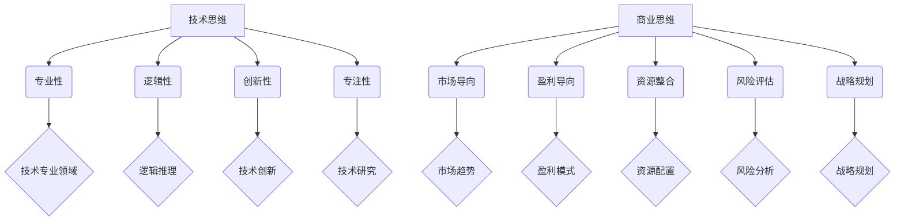
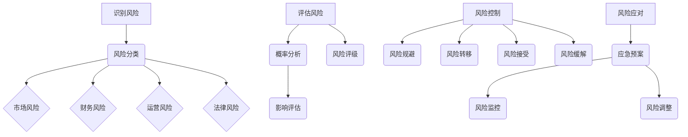
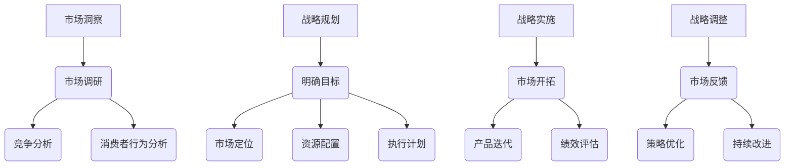

                 

# 从技术专家到企业家的心态转变

> **关键词：** 技术专家、企业家、心态转变、商业思维、领导力、风险管理、市场洞察、战略规划
>
> **摘要：** 本文旨在探讨技术专家向企业家转变过程中的心态转变，分析技术专家与企业家之间的区别，以及企业家所需具备的核心素质。文章将从技术思维到商业思维的转变、领导力与团队管理、风险管理与企业决策、市场洞察与战略规划等方面展开，结合实践案例与心得分享，帮助技术专家更好地实现职业转型。

## 《从技术专家到企业家的心态转变》目录大纲

### 第一部分：引言

#### 第1章：技术专家与企业家：两种角色的定义与区别

- **1.1.1 技术专家的角色与贡献**
- **1.1.2 企业家的角色与责任**
- **1.1.3 技术专家到企业家的转变必要性**

### 第二部分：心态转变的核心要素

#### 第2章：从技术思维到商业思维的转变

- **2.1.1 技术思维的特点**
- **2.1.2 商业思维的核心要素**
- **2.1.3 技术专家如何培养商业思维**

#### 第3章：领导力与团队管理

- **3.1.1 领导力的重要性**
- **3.1.2 团队建设与管理**
- **3.1.3 技术专家如何提高领导力**

#### 第4章：风险管理与企业决策

- **4.1.1 风险管理的基本概念**
- **4.1.2 企业决策的流程与方法**
- **4.1.3 技术专家如何面对风险与决策**

#### 第5章：市场洞察与战略规划

- **5.1.1 市场洞察的重要性**
- **5.1.2 战略规划的基本原则**
- **5.1.3 技术专家如何进行市场分析与战略规划**

### 第三部分：实践案例与心得分享

#### 第6章：成功企业家的心态转变之路

- **6.1.1 企业家的成功案例**
- **6.1.2 心态转变的实践心得**
- **6.1.3 技术专家如何借鉴成功经验**

#### 第7章：心态转变的障碍与应对策略

- **7.1.1 心态转变的常见障碍**
- **7.1.2 障碍分析**
- **7.1.3 应对策略与建议**

#### 第8章：持续成长与心态调适

- **8.1.1 持续成长的必要性**
- **8.1.2 心态调适的方法与技巧**
- **8.1.3 技术专家如何保持心态稳定**

### 附录

#### 附录A：相关资源与参考文献

- **A.1 推荐书籍与资料**
- **A.2 网络资源链接**
- **A.3 学术论文汇总**

#### 附录B：核心概念与架构Mermaid流程图

- **B.1 技术思维与商业思维对比图**
- **B.2 风险管理流程图**
- **B.3 市场洞察与战略规划流程图**

### 结束语

**致读者：** 在技术领域的深耕让技术专家们在专业领域取得了卓越的成就，但企业家精神同样是推动企业和个人成长的关键因素。本文旨在帮助技术专家认识到心态转变的重要性，为他们在职业生涯的转型过程中提供一些实用的指导和建议。

### 第一部分：引言

#### 第1章：技术专家与企业家：两种角色的定义与区别

在当今快速变化的技术时代，技术专家和企业家的角色日益重要。技术专家以其深厚的专业知识和技能，推动着技术的进步和创新；而企业家则以其前瞻性的视野、创新的思维和卓越的领导力，将技术转化为商业价值，推动企业的发展。两者虽然有着密切的联系，但在角色定位和责任方面，却有着明显的区别。

### 1.1.1 技术专家的角色与贡献

技术专家通常在某一技术领域拥有深厚的专业知识和丰富的实践经验。他们通过深入研究、技术研究和开发，推动着技术的进步和创新。技术专家的角色主要体现在以下几个方面：

1. **技术研究与开发**：技术专家致力于研究和开发新技术，解决技术难题，为企业的技术进步提供支持。

2. **团队建设与培养**：技术专家往往担任团队的核心成员，负责培养和带领团队，提升团队的整体技术实力。

3. **项目管理与执行**：技术专家参与项目管理和执行，确保项目按照预期时间和技术要求完成。

4. **技术标准和规范制定**：技术专家在行业标准和规范制定方面发挥重要作用，推动技术领域的发展。

技术专家的贡献不仅体现在技术层面上，更体现在对企业创新能力的推动上。他们的专业知识和技能，为企业提供了技术支持和保障，使得企业在激烈的市场竞争中脱颖而出。

### 1.1.2 企业家的角色与责任

企业家则更多地关注企业的长远发展和商业价值的实现。企业家的角色主要体现在以下几个方面：

1. **商业战略制定**：企业家需要制定明确的商业战略，明确企业的愿景、使命和目标，为企业的未来发展指明方向。

2. **资源整合与配置**：企业家需要整合和配置各种资源，包括资金、人才、技术等，以实现企业的商业目标。

3. **市场开拓与拓展**：企业家需要密切关注市场动态，积极开拓市场，拓展企业的业务范围。

4. **领导力与团队建设**：企业家需要具备卓越的领导力，能够带领团队实现企业的战略目标。

5. **企业文化建设**：企业家需要建立积极向上的企业文化，凝聚员工，提高企业的凝聚力。

企业家的责任在于将技术转化为商业价值，推动企业的发展。他们不仅需要具备技术领域的专业知识，更需要具备商业思维、领导力和战略规划能力。

### 1.1.3 技术专家到企业家的转变必要性

技术专家向企业家的转变，不仅是个人的职业发展需求，更是企业和社会发展的必然要求。以下是技术专家向企业家转变的必要性：

1. **技术创新的商业化**：技术专家具备深厚的技术知识和实践经验，但他们可能缺乏将技术创新转化为商业价值的能力。企业家精神的引入，有助于将技术创新与市场需求相结合，实现技术的商业化。

2. **企业发展的需求**：随着企业的发展，技术专家需要承担更多的管理责任，他们需要具备领导力和战略规划能力，以推动企业的发展。企业家角色能够帮助技术专家更好地应对企业发展的挑战。

3. **个人职业发展的需求**：技术专家在职业发展的过程中，可能会遇到瓶颈，而企业家角色的转变能够为他们提供更广阔的发展空间和更高的职业成就感。

4. **社会发展的需求**：企业家能够推动技术创新和产业升级，促进社会经济的发展。技术专家向企业家的转变，有助于培养更多具有创新精神和商业思维的人才，推动社会的进步。

综上所述，技术专家向企业家的转变，既是个人职业发展的需求，也是企业和社会发展的必然要求。在接下来的部分，本文将探讨技术专家向企业家转变过程中所需的心态转变，帮助技术专家更好地实现这一转变。

### 第二部分：心态转变的核心要素

#### 第2章：从技术思维到商业思维的转变

技术专家向企业家的转变，不仅仅是角色和职责的转变，更是思维方式的转变。从技术思维到商业思维的转变，是技术专家成为成功企业家的关键要素之一。

### 2.1.1 技术思维的特点

技术思维是指技术专家在解决技术问题和进行技术创新时所采用的思维方式。其特点主要包括：

1. **专业性**：技术思维强调专业知识的深度和广度，技术专家需要对所涉及的技术领域有深入的了解和掌握。

2. **逻辑性**：技术思维强调逻辑推理和问题解决能力，技术专家需要通过逻辑分析来找出问题的根本原因，并提出解决方案。

3. **创新性**：技术思维鼓励创新思维，技术专家需要不断寻求新的技术突破和解决方案。

4. **专注性**：技术思维要求技术专家专注于技术领域，将大量的时间和精力投入到技术研究和开发中。

### 2.1.2 商业思维的核心要素

商业思维是指企业家在制定商业战略、进行市场开拓和资源整合时所采用的思维方式。其核心要素主要包括：

1. **市场导向**：商业思维强调以市场需求为导向，企业家需要密切关注市场动态，了解消费者的需求和偏好，以便制定相应的商业战略。

2. **盈利导向**：商业思维注重盈利能力，企业家需要通过有效的市场策略和运营管理，实现企业的盈利目标。

3. **资源整合**：商业思维强调资源的有效整合和配置，企业家需要具备一定的资源整合能力，以实现企业的战略目标。

4. **风险评估**：商业思维注重风险评估，企业家需要对潜在的商业风险进行评估，并制定相应的风险控制措施。

5. **战略规划**：商业思维强调战略规划，企业家需要根据市场环境和企业资源，制定长期的战略规划，确保企业的可持续发展。

### 2.1.3 技术专家如何培养商业思维

技术专家要实现从技术思维到商业思维的转变，需要从以下几个方面入手：

1. **拓展视野**：技术专家需要不断拓展自己的视野，关注行业动态和市场需求，了解不同领域的商业模式和商业策略。

2. **学习商业知识**：技术专家可以通过学习商业知识，了解商业理论、市场分析和战略规划等方面的知识，提高自己的商业素养。

3. **实践锻炼**：技术专家可以通过参与实际商业项目，积累商业实践经验，提高自己的商业决策能力和市场洞察力。

4. **跨领域交流**：技术专家可以积极参加跨领域的交流活动，与其他行业的企业家和技术专家交流，学习他们的成功经验和商业模式。

5. **培养团队协作能力**：商业思维强调团队合作，技术专家需要培养自己的团队协作能力，学会倾听和沟通，提高团队的执行力和凝聚力。

通过以上方法，技术专家可以逐步培养自己的商业思维，实现从技术专家到企业家的成功转型。

### 第3章：领导力与团队管理

领导力与团队管理是企业家成功的关键要素之一。对于技术专家而言，从技术领域向企业家角色的转变，不仅需要掌握商业知识和技能，更需要具备领导力和团队管理能力。本章节将探讨领导力的重要性、团队建设与管理，以及技术专家如何提高领导力。

#### 3.1.1 领导力的重要性

领导力是指领导者通过激励和引导他人，实现团队目标的能力。对于企业家而言，领导力至关重要，它直接影响着企业的成长和发展。以下是领导力在企业家角色中的重要性：

1. **团队凝聚力**：领导力能够增强团队的凝聚力，使团队成员更加团结一致，共同为实现企业目标而努力。

2. **创新能力**：领导力能够激发团队成员的创新能力，推动企业持续进行技术创新和产品迭代。

3. **执行力**：领导力能够提升团队的执行力，确保企业战略和计划能够顺利执行。

4. **决策能力**：领导力使企业家能够做出正确的决策，有效应对市场变化和竞争压力。

5. **企业文化建设**：领导力有助于塑造积极向上的企业文化，增强企业的核心竞争力。

#### 3.1.2 团队建设与管理

团队建设与管理是领导力的重要组成部分。一个成功的团队需要有共同的目标、良好的沟通、有效的协作和持续的学习。以下是团队建设与管理的关键要素：

1. **明确目标**：团队的目标应该清晰明确，确保所有团队成员都了解并认同这些目标。

2. **分工合作**：根据团队成员的特长和技能，合理分配任务，确保每个成员都能在适合自己的岗位上发挥作用。

3. **沟通与协作**：建立有效的沟通机制，确保团队成员之间能够顺畅交流，形成良好的协作氛围。

4. **激励与反馈**：通过激励措施和及时反馈，鼓励团队成员发挥潜力，提升团队的整体绩效。

5. **培训与学习**：提供持续的学习机会，帮助团队成员提升技能和知识，适应企业的发展需求。

#### 3.1.3 技术专家如何提高领导力

对于技术专家而言，提高领导力是一个逐步的过程，需要不断学习、实践和反思。以下是技术专家提高领导力的方法：

1. **自我认知**：了解自己的优点和不足，明确自己的领导风格和价值观。

2. **学习领导力理论**：通过学习领导力相关的书籍、课程和研讨会，掌握领导力的基本理论和实践方法。

3. **实践锻炼**：参与实际项目，担任团队领导角色，通过实践提高自己的领导能力。

4. **跨领域交流**：与其他行业的企业家和技术专家交流，学习他们的成功经验和领导力技巧。

5. **反思与改进**：定期反思自己的领导行为和效果，找出不足之处，并采取改进措施。

通过以上方法，技术专家可以逐步提高自己的领导力，成为更有效的领导者，推动企业的持续发展。

### 第4章：风险管理与企业决策

在企业家职业生涯中，风险管理与企业决策至关重要。技术专家在转型为企业家的过程中，需要掌握风险管理的概念、企业决策的流程与方法，以及如何面对风险与做出决策。

#### 4.1.1 风险管理的基本概念

风险管理是指对企业可能面临的各种风险进行识别、评估、控制和应对的过程。以下是一些关键概念：

1. **风险识别**：识别企业可能面临的风险，包括市场风险、财务风险、运营风险、法律风险等。

2. **风险评估**：评估风险的概率和影响，确定风险的优先级，以便采取相应的应对措施。

3. **风险控制**：采取措施降低风险的概率和影响，包括风险规避、风险转移、风险接受和风险缓解。

4. **风险应对**：制定应对策略，确保在风险发生时能够迅速响应和有效处理。

#### 4.1.2 企业决策的流程与方法

企业决策是企业家根据企业目标和市场环境，制定和实施战略的过程。以下是企业决策的基本流程与方法：

1. **问题识别**：明确企业面临的挑战和机会，确定需要解决的决策问题。

2. **信息收集**：收集与决策相关的信息，包括市场趋势、竞争对手、法律法规等。

3. **方案评估**：分析各种可能的解决方案，评估其优缺点和可行性。

4. **决策制定**：根据评估结果，选择最佳的解决方案，并制定详细的实施计划。

5. **决策实施**：执行决策计划，确保决策能够得到有效实施。

6. **决策监控**：监控决策执行情况，及时调整和优化决策。

#### 4.1.3 技术专家如何面对风险与决策

技术专家在转型为企业家的过程中，需要从以下几个方面提高自己的风险管理能力和决策水平：

1. **风险管理意识**：培养风险管理意识，认识到风险管理在企业发展中的重要性。

2. **系统学习**：通过阅读相关书籍、参加培训课程，系统学习风险管理理论和实践方法。

3. **实践经验**：参与实际项目，通过实践积累风险管理经验。

4. **数据驱动**：利用数据分析工具，对风险进行定量分析，提高决策的科学性。

5. **多元化思维**：培养多元化思维，从不同角度分析和解决问题。

6. **灵活应对**：在决策过程中，保持灵活性，随时调整策略，以应对不确定性。

通过以上方法，技术专家可以更好地面对风险，做出明智的决策，推动企业的稳定发展。

### 第5章：市场洞察与战略规划

市场洞察与战略规划是企业家的核心能力之一，它决定了企业的长期发展和竞争力。对于技术专家而言，从技术思维向商业思维转变，培养市场洞察力和战略规划能力是成功转型的关键。本章节将探讨市场洞察的重要性、战略规划的基本原则，以及技术专家如何进行市场分析与战略规划。

#### 5.1.1 市场洞察的重要性

市场洞察是指对企业所面临的市场环境、消费者需求、竞争对手行为等方面的深入理解和分析。市场洞察的重要性体现在以下几个方面：

1. **市场定位**：通过市场洞察，企业家可以明确企业的市场定位，找到目标市场和潜在客户。

2. **需求分析**：了解消费者的需求和行为，有助于企业家制定满足市场需求的产品和服务。

3. **竞争分析**：通过市场洞察，企业家可以了解竞争对手的优势和劣势，制定有效的竞争策略。

4. **趋势预测**：市场洞察有助于企业家预见市场趋势，抓住市场机遇，避免盲目跟风。

5. **风险预警**：市场洞察可以帮助企业家及时发现市场变化和潜在风险，提前采取应对措施。

#### 5.1.2 战略规划的基本原则

战略规划是企业为实现长期目标而制定的行动计划。一个有效的战略规划应遵循以下基本原则：

1. **明确目标**：战略规划应明确企业的长远目标，包括市场目标、财务目标、技术目标等。

2. **市场导向**：战略规划应以市场需求为导向，确保企业的产品和服务能够满足市场需求。

3. **资源匹配**：战略规划应合理配置企业资源，确保各项战略目标的实现。

4. **灵活性**：战略规划应具有一定的灵活性，能够根据市场变化和企业发展进行调整。

5. **执行性**：战略规划应具备可操作性，确保各项战略目标和计划能够得到有效执行。

#### 5.1.3 技术专家如何进行市场分析与战略规划

技术专家在转型为企业家的过程中，可以从以下几个方面提高市场洞察力和战略规划能力：

1. **市场调研**：通过问卷调查、访谈、数据分析等方式，收集市场信息，了解市场趋势和消费者需求。

2. **竞争分析**：研究竞争对手的产品、市场策略、市场份额等，找出自身的优势和劣势。

3. **趋势预测**：分析行业趋势、技术发展动态，预测未来市场的发展方向。

4. **情景规划**：制定不同市场情景下的战略规划，为应对不确定因素做好准备。

5. **资源整合**：根据市场分析结果，合理配置企业资源，确保战略规划的有效实施。

6. **培训与学习**：通过参加培训课程、研讨会，学习市场分析和战略规划的方法和技巧。

通过以上方法，技术专家可以更好地进行市场分析和战略规划，为企业的发展奠定坚实基础。

### 第6章：成功企业家的心态转变之路

在从技术专家到企业家的转变过程中，许多成功的企业家都经历了心态的深刻变化。他们的成功经验为我们提供了宝贵的启示。本章节将介绍几位成功企业家的心态转变之路，分享他们的实践心得，以及技术专家如何借鉴这些成功经验。

#### 6.1.1 企业家的成功案例

1. **乔布斯**：乔布斯是一位著名的技术专家和企业家，他带领苹果公司实现了从低谷到巅峰的蜕变。乔布斯在转型过程中，经历了从技术思维到商业思维的转变，他学会了如何将技术创新与市场需求相结合，推动企业的发展。

2. **马斯克**：埃隆·马斯克是一位跨越多个领域的企业家，他创立了特斯拉、SpaceX等知名公司。马斯克在创业过程中，始终保持着创新精神和企业家精神，他不断挑战自己的极限，带领团队实现了一系列革命性的技术创新。

3. **贝佐斯**：亚马逊的创始人杰夫·贝佐斯是一位成功的企业家。他通过创建亚马逊，将电子商务推向了全球。贝佐斯在创业初期，面临着诸多困难和挑战，但他始终坚持自己的信念，通过不断的创新和优化，最终取得了成功。

#### 6.1.2 心态转变的实践心得

成功企业家的心态转变主要体现在以下几个方面：

1. **敢于冒险**：企业家在创业过程中需要敢于冒险，勇于面对不确定性和挑战。他们相信自己的判断和决策，敢于在逆境中寻找机会。

2. **持续学习**：企业家需要具备持续学习的能力，不断更新自己的知识和技能，以适应快速变化的市场环境。

3. **注重团队**：企业家注重团队建设，相信团队的力量，善于发挥团队成员的潜力，形成强大的执行力。

4. **积极乐观**：企业家在面对困难和挑战时，能够保持积极乐观的心态，相信一切困难都是暂时的，坚信自己能够战胜困难。

5. **目标明确**：企业家具备明确的目标和愿景，能够将企业的发展与市场需求相结合，制定可行的战略规划。

#### 6.1.3 技术专家如何借鉴成功经验

技术专家在转型为企业家的过程中，可以借鉴以下成功经验：

1. **培养冒险精神**：技术专家应敢于尝试新事物，勇于面对失败，相信每一次失败都是成长的机会。

2. **提升学习能力**：技术专家应不断学习新知识、新技术，提升自己的专业素养和商业思维。

3. **重视团队建设**：技术专家应学会带领团队，发挥团队成员的特长，提高团队的协作能力。

4. **保持积极心态**：技术专家应保持积极乐观的心态，相信自己的能力和潜力，勇敢面对挑战。

5. **制定明确目标**：技术专家应明确自己的职业发展目标，制定可行的战略规划，为实现目标而努力。

通过借鉴成功企业家的经验，技术专家可以更好地实现从技术专家到企业家的转型，开创自己的事业。

### 第7章：心态转变的障碍与应对策略

在从技术专家到企业家的转变过程中，心态转变并非一帆风顺，许多技术专家会面临各种障碍。了解这些障碍，并采取有效的应对策略，对于实现成功转型至关重要。本章节将探讨心态转变的常见障碍、障碍分析以及应对策略与建议。

#### 7.1.1 心态转变的常见障碍

1. **技能差距**：技术专家往往在技术领域拥有深厚的基础，但在商业思维、领导力和战略规划等方面可能存在不足，这会导致他们在转型过程中感到不适应。

2. **心理压力**：企业家角色需要承担更多的责任和压力，技术专家在适应新的角色时可能会感到心理压力增大，影响心态转变。

3. **习惯性思维**：技术专家长期从事技术工作，习惯于以技术思维解决问题，而企业家需要更多地从商业角度思考，这需要克服习惯性思维的障碍。

4. **恐惧失败**：面对未知的挑战和风险，技术专家可能会产生恐惧失败的心理，这会影响他们的决策和行动。

5. **缺乏信心**：在转型过程中，技术专家可能会对自己的能力产生怀疑，缺乏信心，这会影响他们的心态和行动。

#### 7.1.2 障碍分析

1. **技能差距**：技能差距是心态转变的一个重要障碍。技术专家在转型过程中需要学习和掌握商业知识、领导力和战略规划等新技能。然而，他们可能没有意识到这一点，或者缺乏系统的学习机会，导致技能提升缓慢。

2. **心理压力**：企业家角色需要承担更多的责任和压力，包括资金压力、市场竞争压力、团队管理压力等。技术专家在转型过程中可能会感到心理负担过重，影响他们的心态和决策。

3. **习惯性思维**：技术专家长期从事技术工作，习惯于以技术思维解决问题。在转型过程中，他们可能会不自觉地依赖技术思维，而忽视商业思维的重要性，导致心态转变受阻。

4. **恐惧失败**：成功企业家往往具有冒险精神和强烈的成功欲望。然而，技术专家可能缺乏这种冒险精神，害怕失败，担心失去已有的技术地位和稳定的工作。

5. **缺乏信心**：技术专家在转型过程中可能会对自己产生怀疑，担心自己是否具备企业家所需的能力。这种缺乏信心的心态会影响他们的决策和行动，阻碍心态的转变。

#### 7.1.3 应对策略与建议

1. **提升技能**：技术专家应认识到自己在新角色中需要提升的技能，主动学习商业知识、领导力和战略规划等。可以通过参加培训课程、阅读相关书籍、参加行业交流活动等方式，不断提升自己的综合素质。

2. **心理调适**：技术专家应学会心理调适，应对企业家角色带来的心理压力。可以通过运动、冥想、心理咨询等方式，保持心理健康，增强心理韧性。

3. **改变思维模式**：技术专家应逐步改变思维模式，从技术思维转向商业思维。可以通过参加商业案例分析、模拟商业决策等方式，培养商业思维，提高商业洞察力。

4. **培养冒险精神**：技术专家应克服恐惧失败的心理，培养冒险精神。可以通过小规模尝试、逐步扩大业务范围等方式，逐步建立自信心，勇敢面对挑战。

5. **建立支持系统**：技术专家可以建立支持系统，包括导师、同行和朋友等。通过他们的经验和建议，技术专家可以获得更多的指导和支持，增强自信心。

通过以上应对策略和建议，技术专家可以更好地克服心态转变过程中的障碍，实现从技术专家到企业家的成功转型。

### 第8章：持续成长与心态调适

在从技术专家到企业家的转变过程中，持续成长与心态调适是至关重要的。持续成长意味着不断学习新知识和技能，以适应不断变化的市场和技术环境；心态调适则是保持心理健康，应对企业家角色带来的压力和挑战。本章节将探讨持续成长的必要性、心态调适的方法与技巧，以及技术专家如何保持心态稳定。

#### 8.1.1 持续成长的必要性

持续成长对于技术专家向企业家的转型具有重要意义。以下是持续成长的必要性：

1. **技术更新迅速**：随着科技的发展，技术更新速度不断加快。技术专家需要不断学习新技术、新工具，以保持自己的竞争力。

2. **商业环境变化**：商业环境瞬息万变，市场需求和竞争格局不断调整。企业家需要具备敏锐的市场洞察力和快速反应能力，以应对市场变化。

3. **领导力提升**：企业家需要具备卓越的领导力，带领团队实现企业目标。持续成长有助于技术专家提升领导力，成为更有效的领导者。

4. **创新能力培养**：企业家精神的核心是创新。持续成长可以帮助技术专家培养创新思维，推动企业的持续创新和竞争力提升。

5. **职业发展需求**：技术专家在职业生涯的不同阶段，需要不断调整自己的定位和角色。持续成长有助于他们在职业发展过程中实现更高的成就。

#### 8.1.2 心态调适的方法与技巧

心态调适是企业家保持心理健康的重要手段。以下是一些心态调适的方法和技巧：

1. **正念冥想**：正念冥想是一种通过专注呼吸、观察内心的过程，帮助人们放松身心，减少焦虑和压力。技术专家可以通过每天进行正念冥想，提高自己的心理韧性。

2. **运动锻炼**：适当的运动可以促进身体健康，提高心理素质。技术专家可以选择适合自己的运动方式，如跑步、瑜伽、游泳等，通过运动来缓解压力，提升心情。

3. **心理辅导**：当技术专家面临较大的压力和挑战时，可以寻求专业的心理辅导。心理辅导师可以帮助他们分析问题，提供有效的应对策略，帮助他们走出困境。

4. **自我反思**：定期进行自我反思，回顾自己的行为和决策，了解自己的优点和不足，有助于技术专家更好地认识自己，调整心态。

5. **时间管理**：良好的时间管理能力可以帮助技术专家更好地平衡工作与生活，减少因工作压力导致的心理负担。

#### 8.1.3 技术专家如何保持心态稳定

为了在从技术专家到企业家的转型过程中保持心态稳定，技术专家可以采取以下措施：

1. **设定合理目标**：制定短期和长期目标，确保目标具有可操作性和可行性。合理的目标可以帮助技术专家保持动力，避免因目标过高或过低导致的心理负担。

2. **保持积极态度**：积极面对挑战和困难，相信自己的能力和潜力。通过积极的自我暗示和鼓励，技术专家可以增强自信心，保持心态稳定。

3. **建立支持系统**：与家人、朋友和同事保持良好的沟通，分享自己的感受和困惑。建立支持系统可以帮助技术专家获得情感支持和建议，减轻心理压力。

4. **定期放松**：合理安排时间，确保有足够的休息和放松时间。通过旅行、阅读、听音乐等方式，技术专家可以缓解压力，恢复精力。

5. **追求工作与生活的平衡**：重视家庭和个人生活，确保工作与生活之间的平衡。通过合理安排工作和休闲时间，技术专家可以保持身心健康，提高工作效率。

通过持续成长和心态调适，技术专家可以更好地应对从技术专家到企业家的转型过程中的挑战，实现自己的职业目标和人生价值。

### 附录

#### 附录A：相关资源与参考文献

**A.1 推荐书籍与资料**

1. 《精益创业》（The Lean Startup） - 埃里克·莱斯（Eric Ries）
2. 《创业维艰》（Hard Things About Hard Things） - 本·霍洛维茨（Ben Horowitz）
3. 《创新者的窘境》（The Innovator's Dilemma） - 克莱顿·克里斯滕森（Clayton M. Christensen）
4. 《深度工作》（Deep Work） - 卡尔·纽波特（Cal Newport）
5. 《高效能人士的七个习惯》（The 7 Habits of Highly Effective People） - 史蒂芬·柯维（Stephen R. Covey）

**A.2 网络资源链接**

1. [创业创新课程](https://www.coursera.org/specializations/startup-innovation)
2. [企业风险管理课程](https://www.edx.org/course/risk-management-for-business-decision-making)
3. [领导力发展课程](https://www.udemy.com/course/leadership-essentials/)
4. [市场分析教程](https://www.datascience.com/tutorials/market-research)

**A.3 学术论文汇总**

1. Christensen, C. M. (1997). The Innovator's Dilemma. Harvard Business Review, 75(5), 61-72.
2. Ries, E. (2011). The Lean Startup. Random House.
3. Horowitz, B. (2014). Hard Things About Hard Things. Random House.
4. Davenport, T. H., & Prusak, L. (1998). Working Knowledge: How Organizations Manage What They Know. Harvard Business Press.

### 附录B：核心概念与架构Mermaid流程图

**B.1 技术思维与商业思维对比图**

**B.2 风险管理流程图**

**B.3 市场洞察与战略规划流程图**

通过这些流程图，我们可以更直观地了解技术思维与商业思维的差异、风险管理的流程以及市场洞察与战略规划的步骤，有助于技术专家更好地理解和应用相关概念。

### 结束语

致读者：在技术领域的深耕让技术专家们在专业领域取得了卓越的成就，但企业家精神同样是推动企业和个人成长的关键因素。本文旨在帮助技术专家认识到心态转变的重要性，为他们在职业生涯的转型过程中提供一些实用的指导和建议。

在从技术专家到企业家的转变过程中，心态的转变是关键。从技术思维到商业思维的转变，领导力与团队管理，风险管理与企业决策，市场洞察与战略规划，每一个环节都需要技术专家们具备新的思维方式和能力。通过不断学习、实践和反思，技术专家可以逐步实现心态的转变，成为成功的企业家。

让我们携手共进，勇敢面对挑战，共同书写属于我们的辉煌篇章。

