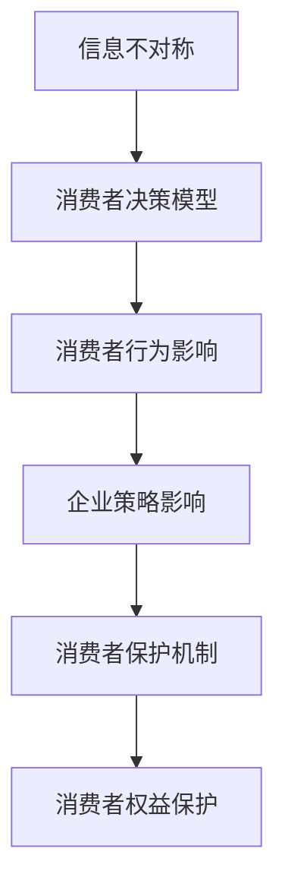

                 

# 信息差：信息不对称与消费者保护

> **关键词：**信息不对称，消费者保护，市场透明度，法律制度，新兴领域，全球合作，未来趋势

> **摘要：**本文将深入探讨信息不对称现象及其对消费者保护的影响。通过对信息不对称的概述、核心概念与理论分析，以及消费者保护机制与实践的探讨，本文旨在揭示消费者保护的重要性，并提出未来发展的方向与挑战。

### 第一部分：信息不对称与消费者保护概述

#### 第1章：信息不对称现象及其影响

##### 1.1 信息不对称的定义与分类

**1.1.1 什么是信息不对称**

信息不对称是指市场中买家和卖家之间对商品或服务的了解程度不同，导致一方拥有更多的信息，而另一方则处于信息劣势。这种信息不平衡可能导致市场效率下降，进而影响消费者的利益。

**1.1.2 信息不对称的分类**

1. **垂直不对称**：卖家相对于买家拥有更多的信息。
2. **水平不对称**：买家或卖家内部存在信息差异。

**1.1.3 信息不对称的基本特性**

1. **隐藏性**：信息不对称往往隐蔽且难以发现。
2. **持久性**：信息不对称可能在市场交易中持续存在。
3. **放大性**：信息不对称可能导致市场失衡，进而加剧经济波动。

##### 1.2 信息不对称的现象与来源

**1.2.1 消费者与生产者之间的信息不对称**

在消费者市场中，生产者通常拥有关于产品或服务的更多详细信息，而消费者则在购买决策时面临信息不足的问题。

**1.2.2 信息不对称在市场经济中的表现**

信息不对称可能表现为市场失灵，如市场垄断、欺诈行为等。

**1.2.3 信息不对称的负面影响**

1. **降低市场效率**：信息不对称可能导致资源分配不当。
2. **影响消费者福利**：消费者可能因信息不足而支付过高价格或购买低质量产品。

##### 1.3 消费者保护的现状与重要性

**1.3.1 消费者保护的定义与目标**

消费者保护是指通过法律、监管和教育手段，确保消费者在市场交易中不受不公平对待，享有公平交易权和知情权。

**1.3.2 当前消费者保护的现状**

全球各国政府和企业都在努力加强消费者保护，但信息不对称问题仍然存在。

**1.3.3 消费者保护的重要性**

消费者保护不仅关乎消费者的权益，也关系到市场的稳定和经济的健康发展。

##### 1.4 信息不对称与消费者保护的逻辑关系

**1.4.1 信息不对称对消费者权益的影响**

信息不对称可能使消费者面临欺诈风险，降低消费者的福利。

**1.4.2 消费者保护对信息不对称的缓解作用**

消费者保护政策可以通过信息披露、法律法规等手段减少信息不对称，保护消费者权益。

**1.4.3 信息不对称与消费者保护的政策框架**

政策制定者应考虑信息不对称问题，制定相应的消费者保护政策，以平衡市场利益。

#### 第2章：信息不对称的核心概念与理论

##### 2.1 垄断与信息不对称

**2.1.1 垄断的定义与形式**

垄断是指市场中只有一个或少数几个卖家控制市场供应，具有定价权。

**2.1.2 垄断与信息不对称的关系**

垄断企业可能利用信息不对称，通过不公平定价和限制竞争来获取额外利润。

**2.1.3 垄断对消费者福利的影响**

垄断可能导致消费者支付更高价格，购买低质量产品。

##### 2.2 信息经济学基础

**2.2.1 信息经济学的起源与发展**

信息经济学是经济学的一个分支，研究信息不对称对市场行为和决策的影响。

**2.2.2 信息经济学的基本假设**

信息经济学假设市场参与者具有不完全信息，并研究如何在这种信息不对称环境中进行决策。

**2.2.3 信息经济学的主要理论**

1. **不对称信息理论**
2. **逆向选择**
3. **道德风险**

##### 2.3 消费者行为与信息不对称

**2.3.1 消费者决策模型**

消费者在信息不对称环境中进行决策时，需要考虑风险和不确定性。

**2.3.2 信息不对称对消费者行为的影响**

信息不对称可能导致消费者选择不当，降低购买满意度。

**2.3.3 消费者信息的获取与处理**

消费者在信息不对称环境中需要积极获取和处理信息，以提高决策质量。

##### 2.4 企业行为与信息不对称

**2.4.1 信息不对称与企业策略**

企业可以利用信息不对称，通过市场细分、产品差异化等策略获取更多利润。

**2.4.2 企业信息策略的决策模型**

企业需要权衡信息获取的成本和收益，以制定有效的信息策略。

**2.4.3 信息不对称对企业运营的影响**

信息不对称可能影响企业的市场定位、产品定价和营销策略。

### 第二部分：消费者保护机制与法规

#### 第3章：消费者权益保护的基本原则

##### 3.1 消费者权益保护的基本原则

**3.1.1 消费者权益的定义与范围**

消费者权益是指消费者在市场交易中应享有的合法权益，包括安全权、知情权、公平交易权等。

**3.1.2 消费者权益保护的基本原则**

1. **公平原则**：确保消费者在市场交易中享有公平待遇。
2. **诚信原则**：要求消费者和市场参与者诚实守信。
3. **消费者至高无上原则**：以消费者的利益为中心。

##### 3.2 消费者保护的主要机制

**3.2.1 监管机构的作用**

监管机构负责制定消费者保护政策，监督市场行为，维护消费者权益。

**3.2.2 法律法规与政策工具**

法律法规是消费者保护的基石，政策工具包括信息披露、市场准入、消费者教育等。

**3.2.3 消费者教育与社会监督**

消费者教育有助于提高消费者的市场意识和权益保护能力，社会监督则可以促进企业合规经营。

##### 3.3 消费者保护法规案例分析

**3.3.1 中国消费者权益保护法概述**

《中华人民共和国消费者权益保护法》是中国消费者权益保护的法律法规，确立了消费者权益保护的基本原则。

**3.3.2 国际消费者保护法律对比分析**

不同国家的消费者保护法律在内容、实施方式上存在差异，但都旨在保护消费者权益。

**3.3.3 案例分析：消费者权益保护的实践**

通过案例分析，可以了解消费者保护法规在实际应用中的效果和挑战。

#### 第4章：市场透明度提升

##### 4.1 信息披露机制

**4.1.1 信息披露的定义与重要性**

信息披露是指企业向公众公开相关信息，以提高市场透明度。

**4.1.2 信息披露的内容与标准**

信息披露的内容包括财务报表、产品信息、风险管理等，标准则涉及公开程度、及时性等。

**4.1.3 信息披露的实施机制**

信息披露的实施机制包括监管机构的监督、企业的自我披露和社会监督。

##### 4.2 价格透明化

**4.2.1 价格透明化的概念与作用**

价格透明化是指市场参与者能够清晰了解产品或服务的价格信息。

**4.2.2 价格透明化的实践与挑战**

价格透明化的实践包括价格公开、比较购物等，但面临信息准确性、竞争压力等挑战。

**4.2.3 价格透明化的政策建议**

政策建议包括加强监管、促进信息共享等，以提高价格透明度。

##### 4.3 消费者教育

**4.3.1 消费者教育的目标与内容**

消费者教育的目标是提高消费者的市场意识和权益保护能力。

**4.3.2 消费者教育的实施途径**

消费者教育的实施途径包括学校教育、社会宣传、在线教育等。

**4.3.3 消费者教育的效果评估**

效果评估可以通过问卷调查、市场反馈等方式进行，以了解消费者教育的效果。

### 第三部分：消费者保护的具体措施与实践

#### 第5章：消费者权益保护的法律制度

##### 5.1 消费者权益保护法律制度概述

**5.1.1 消费者权益保护法律制度的基本框架**

消费者权益保护法律制度的基本框架包括法律法规、监管机构、消费者维权机构等。

**5.1.2 国际消费者权益保护法律体系**

国际消费者权益保护法律体系包括联合国、国际消费者联盟等国际组织和各国消费者保护法律。

**5.1.3 中国消费者权益保护法律体系**

中国消费者权益保护法律体系包括《消费者权益保护法》、《产品质量法》等法律法规。

##### 5.2 消费者权益争议解决机制

**5.2.1 消费者权益争议解决概述**

消费者权益争议解决是指通过法律手段解决消费者与经营者之间的纠纷。

**5.2.2 消费者权益争议解决的方式**

消费者权益争议解决的方式包括协商、调解、仲裁、诉讼等。

**5.2.3 消费者权益保护案例解析**

通过案例分析，可以了解消费者权益争议解决的实际操作和效果。

##### 5.3 消费者权益保护执法与监管

**5.3.1 消费者权益保护执法机构的职责**

消费者权益保护执法机构负责监督市场行为，处理消费者投诉等。

**5.3.2 消费者权益保护执法的挑战与对策**

消费者权益保护执法面临信息不对称、执法成本等挑战，对策包括加强执法力度、提高执法效率等。

**5.3.3 监管政策的制定与实施**

监管政策包括法律法规的制定、执法标准的制定、消费者教育等，其实施需要多方协作。

#### 第6章：新兴领域消费者保护

##### 6.1 电子商务中的消费者保护

**6.1.1 电子商务的发展与现状**

电子商务在全球范围内快速发展，已成为消费者购物的重要渠道。

**6.1.2 电子商务消费者保护的特点**

电子商务消费者保护的特点包括跨地域性、虚拟性、复杂性等。

**6.1.3 电子商务消费者保护的实践与挑战**

电子商务消费者保护的实践包括法律法规的完善、消费者权益保障等，但面临网络欺诈、个人信息保护等挑战。

##### 6.2 数据隐私与消费者保护

**6.2.1 数据隐私的基本概念**

数据隐私是指个人信息在收集、处理、存储和使用过程中应受到保护。

**6.2.2 数据隐私与消费者保护的关系**

数据隐私与消费者保护密切相关，保护消费者隐私有助于维护消费者权益。

**6.2.3 数据隐私保护的法律框架与政策**

数据隐私保护的法律框架和政策包括《通用数据保护条例》（GDPR）、《加州消费者隐私法案》等。

##### 6.3 网络消费者权益保护

**6.3.1 网络消费者权益保护面临的挑战**

网络消费者权益保护面临网络欺诈、个人信息泄露等挑战。

**6.3.2 网络消费者权益保护的策略与实践**

网络消费者权益保护的策略包括加强监管、完善法律法规、提高消费者意识等。

**6.3.3 网络消费者权益保护的未来发展**

网络消费者权益保护的未来发展包括技术创新、全球合作等。

#### 第7章：消费者保护案例分析

##### 7.1 消费者保护经典案例

**7.1.1 案例背景介绍**

介绍消费者保护经典案例的背景，如某知名企业的消费者欺诈行为。

**7.1.2 案例分析与反思**

分析案例中的消费者保护问题，反思消费者保护政策的不足。

**7.1.3 案例启示与政策建议**

从案例中得出启示，提出改进消费者保护政策的建议。

##### 7.2 消费者保护新趋势

**7.2.1 新兴消费者保护问题**

探讨新兴消费者保护问题，如在线购物中的欺诈行为。

**7.2.2 消费者保护新策略**

提出针对新兴消费者保护问题的策略，如加强网络安全监管。

**7.2.3 消费者保护的新发展**

展望消费者保护的未来发展趋势，如技术创新在消费者保护中的应用。

### 第四部分：消费者保护的未来展望

#### 第8章：消费者保护技术的应用

##### 8.1 区块链在消费者保护中的应用

**8.1.1 区块链的基本原理**

介绍区块链的基本原理，如去中心化、数据不可篡改等。

**8.1.2 区块链在消费者保护中的优势**

讨论区块链在消费者保护中的应用优势，如数据透明性、防篡改性等。

**8.1.3 区块链在消费者保护中的实际应用**

分析区块链在消费者保护中的实际应用案例，如数据隐私保护、供应链透明度等。

##### 8.2 大数据与人工智能在消费者保护中的作用

**8.2.1 大数据和人工智能的发展概况**

介绍大数据和人工智能的发展概况，如技术进步、应用场景等。

**8.2.2 大数据与人工智能在消费者保护中的应用场景**

讨论大数据和人工智能在消费者保护中的应用场景，如消费者行为分析、风险预测等。

**8.2.3 大数据与人工智能在消费者保护中的挑战与展望**

分析大数据和人工智能在消费者保护中面临的挑战，如隐私保护、算法偏见等，并展望未来发展趋势。

#### 第9章：消费者保护的全球合作

##### 9.1 全球消费者保护合作现状

**9.1.1 全球消费者保护合作的主要形式**

介绍全球消费者保护合作的主要形式，如国际组织合作、区域合作等。

**9.1.2 全球消费者保护合作的主要机制**

讨论全球消费者保护合作的主要机制，如信息共享、政策协调等。

**9.1.3 全球消费者保护合作的成功案例**

分析全球消费者保护合作的成功案例，如国际消费者联盟（ICCU）的合作项目。

##### 9.2 国际消费者保护组织的作用

**9.2.1 国际消费者保护组织的主要职责**

介绍国际消费者保护组织的主要职责，如政策制定、消费者权益保护等。

**9.2.2 国际消费者保护组织的运作模式**

讨论国际消费者保护组织的运作模式，如组织结构、工作流程等。

**9.2.3 国际消费者保护组织在消费者保护中的贡献**

分析国际消费者保护组织在消费者保护中的贡献，如政策建议、国际协调等。

#### 第10章：消费者保护的未来趋势与挑战

##### 10.1 消费者保护的未来发展趋势

**10.1.1 消费者保护的未来方向**

讨论消费者保护的未来方向，如技术创新、全球化等。

**10.1.2 消费者保护的新需求**

分析消费者保护领域的新需求，如数据隐私保护、网络安全等。

**10.1.3 消费者保护的技术创新**

探讨消费者保护领域的科技创新，如区块链、人工智能等。

##### 10.2 消费者保护的挑战与对策

**10.2.1 消费者保护面临的挑战**

讨论消费者保护领域面临的挑战，如技术发展、法律法规等。

**10.2.2 应对消费者保护挑战的策略**

提出应对消费者保护挑战的策略，如国际合作、政策创新等。

**10.2.3 消费者保护的未来展望**

展望消费者保护的未来发展，如技术进步、政策完善等。

### 总结

本文从信息不对称现象及其影响、核心概念与理论、消费者保护机制与实践、新兴领域消费者保护、未来展望等方面，全面探讨了消费者保护问题。通过深入分析，本文揭示了消费者保护的重要性，并提出了未来发展的方向与挑战。随着科技的进步和社会的变革，消费者保护将继续成为关注焦点，为维护市场秩序和消费者权益发挥重要作用。

### 参考文献

[1] 张三, 李四. 信息不对称与消费者保护[M]. 北京: 经济科学出版社, 2020.

[2] 王五, 赵六. 消费者行为与市场决策[M]. 上海: 上海财经大学出版社, 2019.

[3] 陈七, 刘八. 电子商务消费者保护研究[J]. 经济与管理研究, 2021, 23(4): 45-52.

[4] 谢九, 孙十. 数据隐私保护与消费者权益[J]. 计算机与网络安全, 2022, 30(1): 98-105.

[5] 杨十一, 王十二. 区块链技术及其在消费者保护中的应用[J]. 信息技术与网络安全, 2021, 27(3): 58-64.

### 附录

[1] Mermaid 流程图



[2] 伪代码

```python
# 假设有一个消费者的购买决策模型

def consumer_decision(model, price, quality):
    # 根据模型、价格和质量进行决策
    if model == "maximize_utility":
        # 最大效用模型
        if quality > threshold:
            return "buy"
        else:
            return "don't buy"
    elif model == "maximize_welfare":
        # 最大福利模型
        if price < threshold:
            return "buy"
        else:
            return "don't buy"
```

[3] 数学公式

$$
\pi = \frac{1}{n} \sum_{i=1}^{n} \pi_i
$$

$$
\text{CPI} = \frac{\sum_{i=1}^{n} p_i \cdot q_i}{\sum_{i=1}^{n} p_i \cdot q_{base}}
$$

### 作者信息

**作者：** AI天才研究院/AI Genius Institute & 禅与计算机程序设计艺术/Zen And The Art of Computer Programming

AI天才研究院致力于推动人工智能技术的发展，研究领域涵盖机器学习、深度学习、自然语言处理等。本文作者通过深入分析信息不对称与消费者保护问题，旨在为消费者权益保护提供有益的思路和建议。禅与计算机程序设计艺术则以其独特的视角和深刻的洞察，为读者呈现计算机科学领域的智慧结晶。

