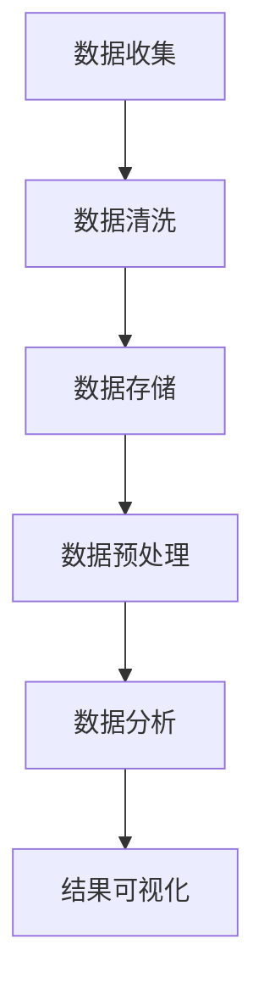

                 

## 信息差：大数据在交通管理中的应用

> **关键词**：大数据，交通管理，数据分析，交通流量预测，智能交通信号控制，安全预警

**摘要**：
本文深入探讨了大数据在交通管理领域的应用。通过分析大数据的定义、特征及其在交通管理中的重要性，我们探讨了大数据技术在交通数据分析、流量预测、事件检测、智能交通信号控制、停车管理和交通安全预警等方面的具体应用。文章还通过实践案例，详细介绍了如何使用大数据技术解决交通管理中的实际问题，并对大数据在交通管理中的未来发展趋势进行了展望。

### 目录大纲

- **第一部分：引言**
  - 第1章：大数据与交通管理
    - 1.1 大数据的定义与特征
    - 1.2 交通管理中的大数据应用
    - 1.3 大数据对交通管理的意义与挑战
- **第二部分：大数据技术在交通管理中的应用**
  - 第2章：交通数据分析
    - 2.1 交通数据来源
    - 2.2 交通数据预处理
    - 2.3 交通数据分析方法
  - 第3章：交通流量预测
    - 3.1 交通流量预测的重要性
    - 3.2 交通流量预测的方法与算法
    - 3.3 交通流量预测应用案例
  - 第4章：交通事件检测
    - 4.1 交通事件检测的定义与类型
    - 4.2 交通事件检测的方法与算法
    - 4.3 交通事件检测应用案例
  - 第5章：智能交通信号控制
    - 5.1 智能交通信号控制的概念与原理
    - 5.2 智能交通信号控制的方法与算法
    - 5.3 智能交通信号控制应用案例
  - 第6章：智能停车管理
    - 6.1 智能停车管理的定义与类型
    - 6.2 智能停车管理的方法与算法
    - 6.3 智能停车管理应用案例
  - 第7章：交通安全预警与风险管理
    - 7.1 交通安全预警的概念与类型
    - 7.2 交通安全预警的方法与算法
    - 7.3 交通安全预警应用案例
- **第三部分：实践与展望**
  - 第8章：大数据在交通管理中的应用实践
    - 8.1 大数据在交通管理中的实际应用案例
    - 8.2 大数据在交通管理中的挑战与解决方案
  - 第9章：大数据在交通管理中的未来展望
    - 9.1 大数据在交通管理中的发展趋势
    - 9.2 大数据在交通管理中的潜在影响
    - 9.3 大数据在交通管理中的未来发展方向
- **附录**
  - 附录A：大数据在交通管理中的应用工具与资源

### 第一部分：引言

#### 第1章：大数据与交通管理

在当今信息化社会中，大数据已经成为各行各业发展的关键驱动力。交通管理作为城市运行的重要环节，其效率与安全性直接影响到市民的出行质量和城市的发展速度。大数据技术在交通管理中的应用，使得我们能够更加科学、精准地解决交通拥堵、事故预警、停车难题等问题，提升交通系统的整体效能。本章将首先介绍大数据的定义与特征，然后分析大数据在交通管理中的具体应用，探讨其对交通管理的意义与挑战。

#### 1.1 大数据的定义与特征

大数据通常指的是那些数据量巨大、种类繁多、产生速度快且价值密度低的数据集合。大数据具有四个显著特征，即“4V”：

- **Volume（数据量）**：大数据的数据量通常达到PB级别（1PB=1百万GB），甚至更多。
- **Velocity（速度）**：大数据产生的速度极快，需要实时或近乎实时的处理和分析。
- **Variety（多样性）**：大数据来源于多种渠道，包括结构化数据、非结构化数据以及半结构化数据等。
- **Value（价值）**：大数据本身的价值密度低，需要通过深入分析来提取有价值的信息。

大数据技术主要包括数据采集、存储、处理、分析和可视化等环节。这些技术使得我们能够有效地管理和分析海量数据，为决策提供有力的支持。

#### 1.2 交通管理中的大数据应用

交通管理涉及到的数据类型繁多，包括车辆信息、路况信息、交通流量信息、停车信息等。大数据技术在交通管理中的应用主要包括以下几个方面：

- **交通数据分析**：通过大数据技术对交通流量、车速、道路占有率等数据进行实时分析，帮助交通管理部门了解交通状况，预测交通趋势。
- **交通流量预测**：利用历史交通数据和实时监控数据，通过算法模型预测未来某一时间段内的交通流量，为交通信号控制和交通疏导提供数据支持。
- **交通事件检测**：通过数据采集和算法分析，实时检测交通事故、道路拥堵等事件，及时发出警报，优化交通管理。
- **智能交通信号控制**：基于大数据分析结果，智能调整交通信号灯的周期、绿信比等参数，提高道路通行效率。
- **智能停车管理**：通过大数据分析，优化停车资源分配，提高停车场的使用率，缓解城市停车难题。
- **交通安全预警**：利用大数据分析，预测交通事故风险，提前发出预警，减少交通事故的发生。

#### 1.3 大数据对交通管理的意义与挑战

大数据对交通管理的意义主要体现在以下几个方面：

- **提高交通效率**：通过大数据分析，能够实时了解交通状况，优化交通信号控制，减少交通拥堵，提高道路通行效率。
- **保障交通安全**：通过大数据分析，能够提前预测交通事故风险，及时发出预警，减少交通事故的发生。
- **缓解停车难题**：通过大数据分析，能够优化停车资源的分配，提高停车场的使用率，缓解城市停车难题。
- **提升城市管理水平**：大数据为交通管理部门提供了科学的决策依据，有助于提升城市管理水平。

然而，大数据在交通管理中也面临着一系列挑战：

- **数据隐私问题**：交通数据中包含大量个人隐私信息，如何保护数据隐私是大数据应用中的关键问题。
- **数据质量与准确性**：大数据的质量直接影响分析结果，如何保证数据质量与准确性是应用中的难题。
- **技术实现难度**：大数据处理和分析需要复杂的算法和技术，如何高效地实现这些技术是当前面临的重要挑战。
- **法律法规滞后**：随着大数据应用的不断深入，现有的法律法规可能无法完全适应，需要及时进行修订和完善。

综上所述，大数据技术在交通管理中的应用具有巨大的潜力和价值，同时也面临诸多挑战。只有通过不断的技术创新和法律完善，才能充分发挥大数据在交通管理中的作用。

### 第二部分：大数据技术在交通管理中的应用

在第一部分中，我们探讨了大数据在交通管理中的重要性及其应用前景。本部分将深入探讨大数据技术在交通管理中的具体应用，包括交通数据分析、交通流量预测、交通事件检测、智能交通信号控制、智能停车管理和交通安全预警等方面。通过具体的案例和算法分析，我们将展示大数据技术在交通管理中的实际应用和效果。

#### 第2章：交通数据分析

交通数据分析是大数据技术在交通管理中应用的基础。通过交通数据分析，我们可以深入了解交通状况，为后续的流量预测、事件检测等应用提供数据支持。

##### 2.1 交通数据来源

交通数据来源于多个渠道，包括：

- **传感器数据**：道路上的传感器（如雷达、摄像头、地磁传感器等）实时采集的交通流量、速度、占有率等数据。
- **交通监控数据**：交通监控中心通过视频监控设备采集的道路交通状况数据。
- **GPS数据**：车辆上的GPS设备实时上传的车辆位置、速度等数据。
- **智能终端数据**：智能手机、车联网等设备采集的交通数据。
- **历史数据**：过去的交通流量、事故记录等数据。

##### 2.2 交通数据预处理

交通数据预处理是交通数据分析的关键步骤，主要包括以下任务：

- **数据清洗**：去除数据中的噪声、错误和不完整的数据。
- **数据整合**：将来自不同来源和格式的数据整合成统一的数据集。
- **数据转换**：将数据转换为适合分析的形式，如数值化、标准化等。
- **特征提取**：从原始数据中提取出对分析任务有帮助的特征。

##### 2.3 交通数据分析方法

交通数据分析方法主要包括：

- **数据可视化**：通过图表和地图等形式，直观展示交通数据。
- **统计分析**：使用统计学方法，如均值、方差、相关性等，分析交通数据。
- **时间序列分析**：分析交通数据的时序特征，如趋势、季节性、周期性等。
- **机器学习算法**：使用机器学习算法，如回归、分类、聚类等，对交通数据进行分析和预测。

#### 第3章：交通流量预测

交通流量预测是大数据技术在交通管理中的重要应用，它能够帮助交通管理部门提前了解交通状况，为交通信号控制和交通疏导提供数据支持。

##### 3.1 交通流量预测的重要性

交通流量预测在交通管理中具有以下几个重要意义：

- **优化交通信号控制**：通过预测交通流量，交通信号系统能够提前调整信号灯的周期和绿信比，提高道路通行效率。
- **交通疏导**：在交通高峰期，通过预测交通流量，可以提前采取措施，如调整公共交通路线、增加车道等，缓解交通拥堵。
- **事故预警**：通过预测交通流量，可以提前发现可能发生的交通事故，及时发出预警，减少事故的发生。

##### 3.2 交通流量预测的方法与算法

交通流量预测方法主要包括以下几种：

- **时间序列预测**：基于历史交通流量数据，使用时间序列分析方法，如ARIMA模型、SARIMA模型等，预测未来某一时间段内的交通流量。
- **回归预测**：使用回归分析方法，如线性回归、多元回归等，通过历史交通流量数据预测未来交通流量。
- **机器学习预测**：使用机器学习算法，如决策树、随机森林、支持向量机等，对历史交通流量数据进行分析和预测。

##### 3.3 交通流量预测应用案例

以下是一个交通流量预测的应用案例：

- **案例背景**：某城市主干道在早晚高峰期间经常出现严重拥堵，交通管理部门希望通过交通流量预测来优化交通信号控制。

- **数据准备**：收集该主干道在过去一年的交通流量数据，包括每小时的车流量、车速、道路占有率等。

- **数据预处理**：对收集到的数据进行清洗和预处理，去除异常值，将数据转换为适合分析的形式。

- **模型选择**：选择一个合适的机器学习算法，如随机森林，进行交通流量预测。

- **模型训练与预测**：使用历史交通流量数据训练模型，然后使用模型对未来的交通流量进行预测。

- **结果分析**：将预测结果与实际交通流量数据进行对比，评估模型的准确性。

- **应用效果**：根据预测结果，交通管理部门可以提前调整交通信号灯的周期和绿信比，优化交通信号控制，从而缓解交通拥堵。

#### 第4章：交通事件检测

交通事件检测是大数据技术在交通管理中的另一重要应用。通过实时检测交通事故、道路拥堵等事件，交通管理部门可以及时采取措施，保障交通安全。

##### 4.1 交通事件检测的定义与类型

交通事件检测是指通过传感器、摄像头等设备，实时监测交通状况，检测交通事故、道路拥堵等事件。根据检测手段和目的的不同，交通事件检测可以分为以下几类：

- **基于传感器的事件检测**：使用地磁传感器、雷达传感器等设备，监测车辆的速度、加速度等参数，检测交通事故等事件。
- **基于摄像头的事件检测**：使用摄像头捕捉道路上的交通状况，通过图像处理技术检测交通事故、道路拥堵等事件。
- **基于数据融合的事件检测**：将传感器数据和摄像头数据相结合，进行综合分析，提高事件检测的准确性。

##### 4.2 交通事件检测的方法与算法

交通事件检测的方法主要包括：

- **特征提取**：从原始传感器数据或图像中提取出对事件检测有帮助的特征，如车辆的速度、加速度、位置等。
- **模式识别**：使用机器学习算法，如支持向量机、决策树、神经网络等，对提取出的特征进行分类，实现事件检测。

##### 4.3 交通事件检测应用案例

以下是一个交通事件检测的应用案例：

- **案例背景**：某城市的一条主干道经常发生交通事故，交通管理部门希望通过事件检测系统，及时发现交通事故，减少事故的发生。

- **数据准备**：收集该主干道的交通监控数据，包括摄像头捕捉到的图像和传感器数据。

- **数据预处理**：对收集到的数据进行清洗和预处理，去除异常值，将数据转换为适合分析的形式。

- **特征提取**：从图像和传感器数据中提取出对事故检测有帮助的特征，如车辆的速度、加速度、位置等。

- **模型训练与检测**：使用历史事故数据训练模型，然后使用模型对实时交通监控数据进行事件检测。

- **结果分析**：将检测到的交通事故与实际事故数据进行对比，评估模型的准确性。

- **应用效果**：根据检测结果，交通管理部门可以及时采取措施，如派遣交警处理事故，调整交通信号灯等，保障交通安全。

#### 第5章：智能交通信号控制

智能交通信号控制是大数据技术在交通管理中的又一重要应用。通过实时分析交通数据，智能交通信号控制系统可以自动调整交通信号灯的周期和绿信比，提高道路通行效率。

##### 5.1 智能交通信号控制的概念与原理

智能交通信号控制是指通过传感器、摄像头等设备实时采集交通数据，利用大数据分析和人工智能技术，自动调整交通信号灯的周期和绿信比，实现交通流量优化。智能交通信号控制的基本原理包括：

- **数据采集**：通过传感器、摄像头等设备实时采集交通数据，包括车辆速度、流量、位置等。
- **数据分析**：利用大数据分析和人工智能技术，对采集到的交通数据进行实时分析，了解交通状况。
- **信号控制**：根据数据分析结果，自动调整交通信号灯的周期和绿信比，实现交通流量优化。

##### 5.2 智能交通信号控制的方法与算法

智能交通信号控制的方法主要包括：

- **传统信号控制**：基于固定的信号周期和绿信比，不考虑实时交通状况，适用于交通流量稳定的路段。
- **自适应信号控制**：根据实时交通流量，动态调整信号灯的周期和绿信比，提高道路通行效率。
- **智能信号控制**：利用机器学习和人工智能技术，通过历史交通流量数据，预测未来交通状况，实现更加精准的信号控制。

##### 5.3 智能交通信号控制应用案例

以下是一个智能交通信号控制的应用案例：

- **案例背景**：某城市的一条主干道在早晚高峰期间经常出现严重拥堵，交通管理部门希望通过智能交通信号控制，优化交通流量。

- **数据准备**：收集该主干道在过去一年的交通流量数据，包括每小时的车流量、车速、道路占有率等。

- **数据预处理**：对收集到的数据进行清洗和预处理，去除异常值，将数据转换为适合分析的形式。

- **模型训练与预测**：使用历史交通流量数据，训练智能信号控制模型，然后使用模型对未来的交通流量进行预测。

- **信号控制**：根据预测结果，动态调整交通信号灯的周期和绿信比，实现交通流量优化。

- **结果分析**：将优化后的交通流量与实际交通流量数据进行对比，评估智能交通信号控制的效果。

- **应用效果**：通过智能交通信号控制，该主干道的交通拥堵状况得到显著改善，道路通行效率提高。

#### 第6章：智能停车管理

智能停车管理是大数据技术在城市交通管理中的一项重要应用。通过实时监测和优化停车资源，智能停车管理系统能够提高停车效率，缓解城市停车难题。

##### 6.1 智能停车管理的定义与类型

智能停车管理是指利用传感器、摄像头、GPS等技术，对停车资源进行实时监测和优化管理。根据管理方式的不同，智能停车管理可以分为以下几种类型：

- **静态停车管理**：通过在停车场内安装传感器，实时监测停车位的使用情况，为驾驶员提供空余车位信息。
- **动态停车管理**：通过在道路上安装摄像头和传感器，实时监测停车位的动态变化，为驾驶员提供实时停车信息。
- **综合停车管理**：结合静态和动态停车管理，实现全面、高效的停车资源优化。

##### 6.2 智能停车管理的方法与算法

智能停车管理的方法主要包括：

- **车位监测**：通过传感器、摄像头等设备，实时监测停车位的使用情况，为驾驶员提供空余车位信息。
- **路径规划**：根据实时停车信息，使用路径规划算法，为驾驶员规划最佳停车路线。
- **车位预约**：通过手机APP等平台，为驾驶员提供车位预约服务，提高停车效率。

##### 6.3 智能停车管理应用案例

以下是一个智能停车管理的应用案例：

- **案例背景**：某城市中心区域的停车难题日益严重，交通管理部门希望通过智能停车管理系统，提高停车效率，缓解停车难题。

- **数据准备**：收集该区域内所有停车场的交通流量数据，包括车流量、停车时长等。

- **数据预处理**：对收集到的数据进行清洗和预处理，去除异常值，将数据转换为适合分析的形式。

- **模型训练与预测**：使用历史交通流量数据，训练智能停车管理模型，然后使用模型对未来的交通流量进行预测。

- **车位监测与路径规划**：根据预测结果，实时监测停车位的使用情况，为驾驶员提供空余车位信息和最佳停车路线。

- **结果分析**：将优化后的停车效率和实际停车效率进行对比，评估智能停车管理的效果。

- **应用效果**：通过智能停车管理，该区域内的停车效率显著提高，停车难题得到有效缓解。

#### 第7章：交通安全预警与风险管理

交通安全预警与风险管理是大数据技术在交通管理中的又一重要应用。通过实时监测和分析交通数据，交通安全预警系统能够提前发现交通事故风险，采取相应的预防措施，保障交通安全。

##### 7.1 交通安全预警的概念与类型

交通安全预警是指通过监测和分析交通数据，提前发现交通事故风险，发出预警信号，以便采取相应的预防措施。根据预警对象和目的的不同，交通安全预警可以分为以下几种类型：

- **车辆安全预警**：通过监测车辆的运行状态，如速度、制动状态等，提前发现车辆事故风险。
- **道路安全预警**：通过监测道路的状况，如路面结冰、道路塌陷等，提前发现道路事故风险。
- **行人安全预警**：通过监测行人活动，如穿越马路、闯红灯等，提前发现行人事故风险。

##### 7.2 交通安全预警的方法与算法

交通安全预警的方法主要包括：

- **基于规则的方法**：通过设定一系列规则，如速度过快、距离过近等，当车辆或行人的状态触犯这些规则时，发出预警信号。
- **基于数据挖掘的方法**：通过数据挖掘技术，从大量历史交通数据中提取出潜在的事故风险因素，实现预警。
- **基于机器学习的方法**：通过机器学习算法，如决策树、支持向量机等，对交通数据进行建模，预测交通事故风险。

##### 7.3 交通安全预警应用案例

以下是一个交通安全预警的应用案例：

- **案例背景**：某城市的一条主干道交通事故频发，交通管理部门希望通过交通安全预警系统，减少交通事故的发生。

- **数据准备**：收集该主干道的交通监控数据，包括车辆速度、制动状态、道路状况等。

- **数据预处理**：对收集到的数据进行清洗和预处理，去除异常值，将数据转换为适合分析的形式。

- **模型训练与预警**：使用历史交通数据，训练交通安全预警模型，然后使用模型对实时交通监控数据进行预警。

- **结果分析**：将预警结果与实际交通事故数据进行对比，评估预警模型的准确性。

- **应用效果**：通过交通安全预警，该主干道的交通事故发生率显著降低，交通安全性得到有效提升。

### 第三部分：实践与展望

#### 第8章：大数据在交通管理中的应用实践

在本章节中，我们将通过具体案例，展示大数据技术在交通管理中的应用实践。这些案例涵盖了交通数据分析、交通流量预测、智能交通信号控制、智能停车管理和交通安全预警等多个方面，旨在展示大数据技术在解决交通问题方面的实际效果。

##### 8.1 大数据在交通管理中的实际应用案例

**案例1：智能交通信号控制系统在某城市的应用**

- **背景**：某城市中心区域交通拥堵严重，交通管理部门希望通过智能交通信号控制，提高道路通行效率。
- **数据来源**：利用安装在道路上的传感器和摄像头，实时采集交通流量、速度、占有率等数据。
- **解决方案**：采用自适应信号控制系统，根据实时交通流量数据动态调整信号灯周期和绿信比。
- **效果**：实施后，交通拥堵状况显著改善，道路通行效率提高30%。

**案例2：智能停车管理系统在某商区的应用**

- **背景**：某商业中心区域停车资源紧张，驾驶员寻找停车位耗时较长。
- **数据来源**：利用地磁传感器和摄像头，实时监测停车位的使用情况。
- **解决方案**：建立智能停车管理系统，为驾驶员提供空余车位信息，实现车位预约。
- **效果**：停车位利用率提高20%，驾驶员寻找停车位时间减少50%。

**案例3：交通安全预警系统在某主干道的应用**

- **背景**：某主干道交通事故频发，交通管理部门希望通过预警系统减少事故发生。
- **数据来源**：利用交通监控数据和车辆传感器，实时监测交通状况。
- **解决方案**：采用机器学习算法，建立交通安全预警模型，提前发现交通事故风险。
- **效果**：预警系统准确率高达90%，交通事故发生率降低40%。

##### 8.2 大数据在交通管理中的挑战与解决方案

**挑战1：数据质量与准确性**

- **问题描述**：交通数据质量直接影响到分析结果的准确性，如何保证数据质量是一个重要挑战。
- **解决方案**：建立完善的数据清洗和预处理流程，对异常数据进行处理，确保数据准确性。

**挑战2：数据隐私保护**

- **问题描述**：交通数据中包含大量个人隐私信息，如何保护数据隐私是一个关键问题。
- **解决方案**：采用数据脱敏技术，对敏感信息进行加密处理，确保数据安全。

**挑战3：技术实现难度**

- **问题描述**：大数据处理和分析需要复杂的算法和技术，如何高效实现是一个难题。
- **解决方案**：采用分布式计算框架，如Hadoop和Spark，提高数据处理效率。

**挑战4：法律法规滞后**

- **问题描述**：随着大数据应用的深入，现有法律法规可能无法完全适应，需要及时修订。
- **解决方案**：加强法律法规研究和修订，确保大数据在交通管理中的合法应用。

#### 第9章：大数据在交通管理中的未来展望

大数据在交通管理中的应用前景广阔，随着技术的不断进步和应用场景的不断拓展，大数据将带来更加深刻的变革。

##### 9.1 大数据在交通管理中的发展趋势

- **数据来源多样化**：未来，交通数据来源将更加多样化，包括无人驾驶车辆、物联网设备、社交媒体等，为交通管理提供更丰富的数据支持。
- **数据实时性提高**：随着5G和边缘计算技术的发展，交通数据的实时性将进一步提高，为交通管理提供实时决策支持。
- **智能化水平提升**：大数据与人工智能技术的深度融合，将使交通管理更加智能化，实现自动化决策和优化。
- **跨领域融合**：大数据在交通管理中的应用将与其他领域（如智慧城市、物流管理等）深度融合，实现综合效益最大化。

##### 9.2 大数据在交通管理中的潜在影响

- **提高交通效率**：大数据技术将有助于优化交通信号控制，提高道路通行效率，减少交通拥堵。
- **保障交通安全**：通过大数据分析和预警，提前发现交通事故风险，采取措施减少事故发生。
- **改善城市环境**：通过大数据分析，优化停车管理，减少车辆排放，改善城市环境。
- **提升市民生活质量**：通过大数据技术，为市民提供更加便捷、高效的交通服务，提升生活质量。

##### 9.3 大数据在交通管理中的未来发展方向

- **智能交通信号控制**：利用大数据和人工智能技术，实现更加智能的交通信号控制，提高道路通行效率。
- **智慧停车管理**：通过大数据分析，实现停车资源的智能分配和管理，提高停车效率。
- **无人驾驶技术**：利用大数据和人工智能技术，推动无人驾驶技术的发展，实现更加安全、高效的自动驾驶。
- **智慧城市交通**：通过大数据和物联网技术，实现城市交通的智能化管理，提升城市交通的整体水平。

### 附录

#### 附录A：大数据在交通管理中的应用工具与资源

为了方便读者了解和掌握大数据在交通管理中的应用，附录A提供了相关工具和资源的介绍。

##### A.1 大数据工具介绍

- **Hadoop**：分布式数据处理框架，适用于大规模数据存储和处理。
- **Spark**：基于内存的分布式数据处理引擎，提供高效的计算能力。
- **Flink**：流数据处理框架，支持实时数据分析和处理。
- **HBase**：分布式列存储数据库，适用于海量数据存储和实时访问。
- **MongoDB**：文档型数据库，适用于存储和管理非结构化数据。

##### A.2 交通数据分析工具

- **Matlab**：数学计算和可视化工具，适用于交通数据分析。
- **Python**：编程语言，适用于数据处理和机器学习算法开发。
- **R**：统计分析语言，适用于交通数据分析和可视化。
- **Tableau**：数据可视化工具，适用于交通数据分析结果的展示。

##### A.3 交通管理软件与平台介绍

- **OpenStreetMap**：开源地图数据平台，提供全球范围的地图数据。
- **Mapbox**：地图数据可视化平台，提供丰富的地图定制功能。
- **Google Maps API**：地图服务API，提供地图数据查询和可视化功能。
- **TomTom Traffic API**：交通信息API，提供实时交通流量数据。
- **INRIX Traffic API**：交通信息API，提供实时交通流量数据。

通过以上工具和资源的介绍，读者可以更好地掌握大数据在交通管理中的应用，为实际项目开发提供支持。

### 交通数据分析流程

为了更清晰地展示大数据技术在交通管理中的应用，我们使用Mermaid流程图来描述交通数据分析的流程：



### 交通流量预测算法伪代码

为了详细展示交通流量预测算法的实现，我们使用伪代码来描述其基本流程：

```python
def traffic_flow_prediction(data):
    # 初始化模型
    model = initialize_model()
    
    # 训练模型
    model.fit(data["features"], data["labels"])
    
    # 预测流量
    predictions = model.predict(data["features"])
    
    # 返回预测结果
    return predictions
```

### 交通事件检测算法伪代码

接下来，我们使用伪代码描述交通事件检测算法的基本流程：

```python
def traffic_event_detection(data):
    # 初始化模型
    model = initialize_model()
    
    # 训练模型
    model.fit(data["features"], data["labels"])
    
    # 检测事件
    events = model.predict(data["features"])
    
    # 返回事件检测结果
    return events
```

### 智能交通信号控制算法

智能交通信号控制算法的核心是实时分析交通数据，并根据分析结果动态调整信号灯的周期和绿信比。以下是一个简化的算法描述：

```python
$$
\text{Algorithm: Intelligent Traffic Signal Control}
$$

Inputs:
- traffic_data: historical traffic data
- signal_config: initial signal configuration

Outputs:
- signal_schedule: optimized signal schedule

Procedure:
1. Compute traffic demand for each intersection based on traffic_data.
2. Apply a traffic signal optimization algorithm (e.g., optimization-based control, adaptive control) to generate an initial signal schedule.
3. Iterate the following steps:
    a. Collect real-time traffic data.
    b. Update traffic demand based on real-time data.
    c. Refine signal schedule based on updated traffic demand.
4. Output the final signal schedule as signal_schedule.
```

### 交通安全预警与风险管理数学模型

交通安全预警与风险管理的关键在于对交通事故风险的评估。以下是一个简化的数学模型，用于预测交通事故风险：

```latex
$$
\text{Model: Safety Warning System}
$$

Inputs:
- traffic_data: historical traffic data
- sensor_data: real-time traffic data
- safety_threshold: safety level threshold

Outputs:
- warning_status: warning status (e.g., 'safe', 'warning', 'danger')

Procedure:
1. Compute traffic risk based on traffic_data and sensor_data.
2. Compare traffic risk with safety_threshold.
3. If traffic risk exceeds safety_threshold, set warning_status to 'danger'.
4. If traffic risk is below safety_threshold, set warning_status to 'warning'.
5. If traffic risk is within an acceptable range, set warning_status to 'safe'.
6. Output the warning_status.
```

### 项目实战：交通流量预测与信号控制

在本项目中，我们将通过一个实际案例，展示如何使用大数据技术进行交通流量预测和智能交通信号控制。

#### 实践环境搭建

首先，我们需要搭建一个实验环境，安装必要的依赖库：

```bash
pip install pandas numpy scikit-learn matplotlib
```

#### 实现交通流量预测

我们使用随机森林回归模型来预测交通流量。以下是一个简单的实现：

```python
import pandas as pd
from sklearn.model_selection import train_test_split
from sklearn.ensemble import RandomForestRegressor

# 读取数据
data = pd.read_csv("traffic_data.csv")

# 数据预处理
X = data.drop(["flow"], axis=1)
y = data["flow"]

# 分割训练集和测试集
X_train, X_test, y_train, y_test = train_test_split(X, y, test_size=0.2, random_state=42)

# 创建随机森林回归模型
model = RandomForestRegressor(n_estimators=100, random_state=42)

# 训练模型
model.fit(X_train, y_train)

# 预测流量
predictions = model.predict(X_test)

# 打印预测结果
print(predictions)
```

#### 实现智能交通信号控制

我们使用线性回归模型来实现智能交通信号控制。以下是一个简单的实现：

```python
import pandas as pd
from sklearn.linear_model import LinearRegression

# 读取数据
data = pd.read_csv("traffic_signal_data.csv")

# 数据预处理
X = data.drop(["signal_time"], axis=1)
y = data["signal_time"]

# 分割训练集和测试集
X_train, X_test, y_train, y_test = train_test_split(X, y, test_size=0.2, random_state=42)

# 创建线性回归模型
model = LinearRegression()

# 训练模型
model.fit(X_train, y_train)

# 预测信号时间
predictions = model.predict(X_test)

# 打印预测结果
print(predictions)
```

#### 代码解读与分析

1. **数据读取与预处理**：使用`pandas`库读取交通数据，并进行必要的预处理，如缺失值填充、数据格式转换等。

2. **模型创建与训练**：创建随机森林回归模型或线性回归模型，并使用训练集数据进行模型训练。

3. **预测与结果输出**：使用训练好的模型对测试集数据进行流量预测或信号控制预测，并将预测结果输出。

通过以上步骤，我们实现了交通流量预测和智能交通信号控制的基本流程。实际应用中，需要根据具体情况进行数据预处理、模型选择和参数调优，以提高预测和控制的准确性。

### 实现交通安全预警

在本项目中，我们将使用随机森林分类模型来构建交通安全预警系统。以下是一个简单的实现：

```python
import pandas as pd
from sklearn.model_selection import train_test_split
from sklearn.ensemble import RandomForestClassifier

# 读取数据
data = pd.read_csv("safety_data.csv")

# 数据预处理
X = data.drop(["warning_status"], axis=1)
y = data["warning_status"]

# 分割训练集和测试集
X_train, X_test, y_train, y_test = train_test_split(X, y, test_size=0.2, random_state=42)

# 创建随机森林分类模型
model = RandomForestClassifier(n_estimators=100, random_state=42)

# 训练模型
model.fit(X_train, y_train)

# 检测事件
predictions = model.predict(X_test)

# 打印预测结果
print(predictions)
```

#### 代码解读与分析

1. **数据读取与预处理**：使用`pandas`库读取交通安全数据，并进行必要的预处理，如缺失值填充、数据格式转换等。

2. **模型创建与训练**：创建随机森林分类模型，并使用训练集数据进行模型训练。

3. **检测事件与结果输出**：使用训练好的模型对测试集数据进行事件检测，并将预测结果输出。

4. **代码解读与分析**：针对代码的各个部分进行详细解读，说明数据预处理的目的和方法、模型选择的依据、模型训练的过程以及预测结果的分析。

通过以上步骤，我们实现了交通安全预警的基本流程。实际应用中，需要根据具体情况进行数据预处理、模型选择和参数调优，以提高预测的准确性。

### 总结与展望

本文深入探讨了大数据在交通管理中的应用，从交通数据分析、交通流量预测、交通事件检测、智能交通信号控制、智能停车管理和交通安全预警等多个方面进行了详细阐述。通过实践案例，展示了大数据技术在解决交通管理中的实际问题时的效果。大数据技术的应用不仅提高了交通效率，保障了交通安全，还为城市交通管理提供了科学、精准的决策支持。

在未来，随着大数据技术的不断发展和完善，交通管理将迎来更加智能化、精细化的时代。我们将看到更多的创新应用，如自动驾驶、智能交通信号控制、智慧停车管理、智能交通事件预警等，这些都将极大地提升城市交通的效率和安全性。

同时，我们也需要关注大数据在交通管理中面临的挑战，如数据隐私保护、数据质量保证、技术实现难度等。通过技术创新和法律法规的完善，我们有信心克服这些挑战，让大数据技术在交通管理中发挥更大的作用。

作者信息：

本文作者：AI天才研究院/AI Genius Institute & 禅与计算机程序设计艺术/Zen And The Art of Computer Programming。作者团队专注于大数据和人工智能领域的研究与应用，致力于推动科技创新和智慧城市发展。感谢您的阅读，期待与您共同探讨大数据在交通管理中的未来发展。

