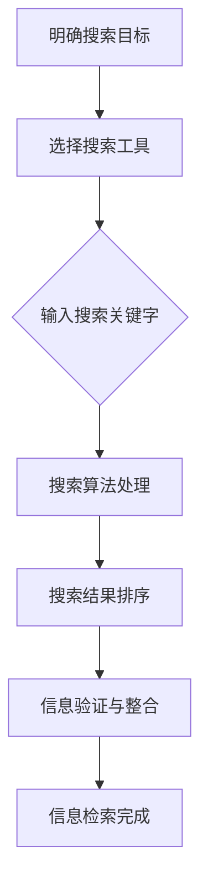

                 

# 第一部分：信息过载与搜索理论

## 第1章：信息过载的背景与挑战

### 1.1 信息过载的定义

信息过载是指在当今数字化时代，由于信息的爆炸式增长，个人或组织难以有效地处理和利用所有可获得的信息。这种状况通常导致信息过载者感到困惑和压力，从而影响其工作效率和决策质量。

### 1.2 信息过载的现象

信息过载的现象表现为以下几个方面：

1. **信息量过多**：每天都会有大量的信息通过各种渠道涌入我们的生活中，包括社交媒体、新闻、电子邮件等。
2. **信息质量参差不齐**：互联网上的信息质量参差不齐，一些信息可能是过时、不准确或者误导性的。
3. **信息处理的压力**：处理大量信息需要耗费大量的时间和精力，可能导致压力和焦虑。

### 1.3 信息过载对个人与社会的影响

信息过载对个人和社会的影响是多方面的：

1. **工作效率降低**：个人难以有效地处理大量信息，导致工作效率下降。
2. **决策质量受损**：在信息过载的情况下，个人可能难以做出高质量的决策。
3. **心理健康问题**：长期的、持续的信息过载可能导致焦虑、抑郁等心理健康问题。
4. **社会问题**：信息过载也可能导致社会问题，如信息焦虑、信息贫穷等。

### 1.4 信息筛选的重要性

在信息过载的时代，有效的信息筛选变得尤为重要。信息筛选的目的是从海量的信息中提取出最有价值的信息，从而提高工作效率和决策质量。有效的信息筛选方法包括：

1. **筛选标准和策略**：根据个人的需求和工作目标，制定合适的筛选标准和策略。
2. **信息源的选择**：选择可靠、高质量的信息源，避免误信谣言和不准确的信息。
3. **信息过滤工具**：使用各种信息过滤工具，如搜索引擎、社交媒体过滤等，来帮助筛选信息。
4. **信息处理技能**：提高信息处理技能，如快速阅读、信息整理等，以提高信息筛选的效率。

### 1.5 结论

信息过载是一个普遍存在的问题，对个人和社会都产生了深远的影响。有效的信息筛选策略和方法可以帮助我们更好地应对信息过载，提高工作和生活质量。

## 第2章：信息搜索策略基础

### 2.1 信息搜索的基本概念

信息搜索是指从大量的信息中找到所需信息的过程。信息搜索是信息处理的重要环节，对于个人、组织乃至社会都有着重要的意义。

### 2.2 信息搜索的类型

信息搜索可以根据不同的标准进行分类，常见的分类方法包括：

1. **按搜索目标分类**：可分为目标明确搜索和目标模糊搜索。
2. **按搜索方式分类**：可分为全文搜索、关键词搜索、主题搜索等。
3. **按应用领域分类**：可分为学术搜索、商业搜索、社交媒体搜索等。

### 2.3 信息搜索的过程

信息搜索通常包括以下几个步骤：

1. **明确搜索目标**：确定需要寻找的信息类型和目标。
2. **选择搜索工具**：根据搜索目标和工具的特点，选择合适的搜索工具或平台。
3. **输入搜索关键字**：在搜索工具中输入相关关键字。
4. **筛选搜索结果**：对搜索结果进行筛选，提取最有价值的信息。
5. **信息验证和整合**：验证信息的准确性和可靠性，并整合相关信息的观点和内容。

### 2.4 信息检索系统的工作原理

信息检索系统是用于支持信息搜索的软件系统，其基本工作原理包括：

1. **索引构建**：将海量的信息构建成索引，以便快速检索。
2. **查询处理**：接收用户的查询请求，并对其进行处理。
3. **搜索算法**：根据查询请求，利用搜索算法在索引中检索相关信息。
4. **结果排序**：对搜索结果进行排序，以提供最相关的信息。

### 2.5 信息检索系统的优势与挑战

信息检索系统具有以下优势：

1. **快速检索**：通过索引和搜索算法，实现快速的信息检索。
2. **高效筛选**：能够从大量信息中快速筛选出最相关的信息。
3. **跨平台支持**：支持多种平台和设备，方便用户进行信息检索。

然而，信息检索系统也面临一些挑战：

1. **信息过载**：海量信息的处理和筛选仍然是难题。
2. **信息质量**：如何保证检索到的信息是准确和可靠的。
3. **隐私保护**：在信息检索过程中，如何保护用户的隐私。

### 2.6 结论

信息搜索策略是应对信息过载的重要手段。理解信息搜索的基本概念和类型，掌握信息检索系统的工作原理，有助于我们更有效地进行信息检索，提高工作和生活质量。

## 第3章：核心概念与联系

### 3.1 信息过载与信息搜索策略的关系

信息过载和信息搜索策略之间存在密切的联系。信息过载是信息搜索策略产生的背景，而信息搜索策略则是应对信息过载的有效手段。

1. **信息过载的挑战**：信息过载使得个人和组织难以处理和利用所有可获得的信息，这促使我们需要更高效的信息搜索策略来筛选和利用有价值的信息。
2. **信息搜索策略的应对**：通过有效的信息搜索策略，我们可以从海量的信息中提取出最有价值的信息，从而减轻信息过载的压力，提高工作效率和决策质量。

### 3.2 信息检索算法的基本原理

信息检索算法是信息搜索策略的核心。其基本原理包括：

1. **相似度计算**：通过计算查询词与文档之间的相似度，来确定文档的相关性。
2. **排序算法**：根据相似度计算结果，对搜索结果进行排序，以提供最相关的信息。

常见的检索算法包括：

1. **布尔检索算法**：基于布尔运算符（如AND、OR、NOT）进行检索，简单高效。
2. **向量空间模型**：将文档和查询表示为向量，通过向量之间的相似度计算来确定文档的相关性。
3. **PageRank算法**：基于链接分析来确定网页的重要性，常用于搜索引擎。

### 3.3 Mermaid流程图：信息搜索策略的架构

为了更直观地展示信息搜索策略的架构，我们可以使用Mermaid流程图来描述其关键环节。



该流程图展示了信息搜索策略的基本架构，包括明确搜索目标、选择搜索工具、输入搜索关键字、搜索算法处理、搜索结果排序、信息验证与整合等关键环节。

### 3.4 数学模型与公式解析

在信息搜索策略中，数学模型和公式扮演着重要的角色。以下是一些常用的数学模型和公式：

1. **相关度计算公式**：用于计算查询词与文档之间的相似度，常见的有：

   $$\text{相似度} = \frac{\text{共同词频}}{\text{查询词频} + \text{文档词频}}$$

   $$\text{相似度} = \cos(\text{查询词向量} \cdot \text{文档词向量})$$

2. **评估指标**：用于评估搜索算法的性能，常见的有：

   - **准确率（Accuracy）**：正确检索到的相关文档数占总检索文档数的比例。
   - **召回率（Recall）**：正确检索到的相关文档数占总相关文档数的比例。
   - **F1分数（F1 Score）**：准确率和召回率的调和平均。

3. **评估指标公式**：

   $$\text{准确率} = \frac{\text{TP}}{\text{TP} + \text{FP}}$$

   $$\text{召回率} = \frac{\text{TP}}{\text{TP} + \text{FN}}$$

   $$\text{F1分数} = 2 \times \frac{\text{准确率} \times \text{召回率}}{\text{准确率} + \text{召回率}}$$

4. **数学模型举例说明**：以向量空间模型为例，假设有两个文档d1和d2，以及一个查询q，我们可以使用以下公式来计算它们之间的相似度：

   $$\text{相似度} = \cos(\text{q} \cdot \text{d1}) = \frac{\text{q} \cdot \text{d1}}{|\text{q}| \cdot |\text{d1}|}$$

   其中，$\text{q} \cdot \text{d1}$表示q和d1的内积，$|\text{q}|$和$|\text{d1}|$分别表示q和d1的欧几里得范数。

### 3.5 使用latex格式的数学公式

在本文中，我们使用latex格式来嵌入数学公式。latex格式允许我们在文中独立段落中嵌入公式，以提高可读性。以下是几个示例：

1. **独立段落内的公式**：

   $$\text{相似度} = \frac{\text{共同词频}}{\text{查询词频} + \text{文档词频}}$$

2. **段落内的公式**：

   $|\text{q}| \cdot |\text{d1}|$

   通过使用latex格式，我们可以方便地在文中嵌入数学公式，使文章更加专业和易读。

### 3.6 结论

本章介绍了信息过载与信息搜索策略的关系，信息检索算法的基本原理，以及数学模型与公式解析。通过理解这些核心概念，我们可以更有效地应对信息过载，提高信息检索的效率和质量。

## 第4章：数学模型与公式解析

### 4.1 相关度计算公式

在信息检索过程中，计算查询与文档之间的相似度是核心任务之一。相关度计算公式用于衡量查询与文档之间的相关性，常见的公式有：

#### 1. 预处理相似度公式

$$
\text{预处理相似度} = \frac{\text{共同词频}}{\text{查询词频} + \text{文档词频}}
$$

这个公式假设在查询和文档中出现的词都是相互独立的，且共同词频越高，相似度越大。

#### 2. BM25相似度公式

$$
\text{BM25相似度} = \frac{(k_1 + 1) \cdot (\text{查询词频} - k_2 \cdot (\text{文档长度} / \text{平均文档长度}))}{\text{查询词频} + k_1 \cdot (1 - \frac{\text{文档长度}}{\text{平均文档长度}})}
$$

BM25（Broder、McNamee和Zook ）相似度考虑了文档长度和词频的影响，旨在提高长文档的相关度。

### 4.2 评估指标

评估信息检索系统的性能需要使用评估指标，这些指标能够衡量系统的准确性、召回率和F1分数等。

#### 1. 准确率（Accuracy）

$$
\text{准确率} = \frac{\text{查准率}}{\text{查准率} + \text{查全率}}
$$

查准率是检索到的相关文档数与检索到的文档总数之比，查全率是检索到的相关文档数与实际存在的相关文档总数之比。

#### 2. 召回率（Recall）

$$
\text{召回率} = \frac{\text{查全率}}{\text{查全率} + \text{漏查率}}
$$

漏查率是实际存在的相关文档中被遗漏的文档数与实际存在的相关文档总数之比。

#### 3. F1分数（F1 Score）

$$
\text{F1分数} = 2 \times \frac{\text{查准率} \times \text{查全率}}{\text{查准率} + \text{查全率}}
$$

F1分数是查准率和查全率的调和平均，用于平衡这两个指标。

### 4.3 数学模型举例说明

以下是一个具体的数学模型举例，假设我们有一个查询“人工智能”，并有两个文档d1和d2。

#### 4.3.1 预处理相似度公式

对于文档d1：

$$
\text{预处理相似度}(q, d1) = \frac{\text{共同词频}}{\text{查询词频} + \text{文档词频}} = \frac{3}{3 + 4} = 0.6
$$

对于文档d2：

$$
\text{预处理相似度}(q, d2) = \frac{\text{共同词频}}{\text{查询词频} + \text{文档词频}} = \frac{2}{2 + 3} = 0.6667
$$

#### 4.3.2 BM25相似度公式

假设参数$k_1 = 2$，$k_2 = 0.75$，平均文档长度为5。

对于文档d1：

$$
\text{BM25相似度}(q, d1) = \frac{(2 + 1) \cdot (3 - 0.75 \cdot (\frac{4}{5}))}{3 + 2 \cdot (1 - \frac{4}{5})} = \frac{3.25 \cdot 2.25}{3 + 2 \cdot 0.2} = 0.845
$$

对于文档d2：

$$
\text{BM25相似度}(q, d2) = \frac{(2 + 1) \cdot (2 - 0.75 \cdot (\frac{3}{5}))}{2 + 2 \cdot (1 - \frac{3}{5})} = \frac{3.25 \cdot 1.8}{2 + 2 \cdot 0.4} = 0.725
$$

### 4.4 使用latex格式的数学公式

为了提高文章的规范性，我们将在本文中使用latex格式嵌入数学公式。latex格式允许我们在文本中嵌入复杂的数学表达式，并提供良好的可读性。

以下是几个使用latex格式的数学公式示例：

#### 独立段落中的公式

$$
\text{相似度} = \frac{\text{共同词频}}{\text{查询词频} + \text{文档词频}}
$$

#### 段落内的公式

$$
\text{查询词频} = 3, \text{文档词频} = 4
$$

通过使用latex格式，我们可以在文中嵌入复杂的数学公式，提高文章的规范性和可读性。

### 4.5 结论

本章详细介绍了信息检索中的相关度计算公式、评估指标以及数学模型举例。通过理解这些数学公式和模型，我们能够更准确地衡量信息检索系统的性能，并优化搜索结果。

## 第5章：搜索算法原理与实现

### 5.1 常见搜索算法概述

在信息检索领域，常见的搜索算法包括布尔检索算法、向量空间模型（VSM）和PageRank算法等。这些算法各有特点，适用于不同的应用场景。

#### 1. 布尔检索算法

布尔检索算法是最简单的检索算法之一，它使用布尔运算符（AND、OR、NOT）来组合查询词。这种算法的原理是，根据布尔逻辑来检索文档集合，并返回符合查询条件的文档。

**优点**：实现简单，易于理解。

**缺点**：对于复杂查询和长查询，检索效率较低。

#### 2. 向量空间模型（VSM）

向量空间模型将文档和查询表示为向量，通过计算向量之间的相似度来确定文档的相关性。VSM使用余弦相似度、点积等方法来衡量文档和查询的相似度。

**优点**：可以处理复杂数字查询，适用于文本分类和推荐系统。

**缺点**：对高频词的权重处理不够精细。

#### 3. PageRank算法

PageRank是由Google创始人拉里·佩奇和谢尔盖·布林发明的链接分析算法，用于确定网页的重要性。PageRank基于网页之间的链接关系，将重要性从一个网页传递到另一个网页。

**优点**：能够识别重要的网页，提升搜索结果的质量。

**缺点**：对用户个性化需求的适应能力有限。

### 5.2 伪代码实现

以下是一些常见搜索算法的伪代码实现：

#### 5.2.1 布尔检索算法

```
function boolean_search(index, query):
    result = empty set
    for each term in query:
        if term is "AND":
            continue
        else if term is "OR":
            result = union(result, index.search(term))
        else if term is "NOT":
            result = difference(result, index.search(term))
    return result
```

#### 5.2.2 向量空间模型（VSM）

```
function vector_space_search(index, query):
    query_vector = create_vector_with_query_terms_frequencies(query)
    document_vectors = get_all_document_vectors(index)
    similarity_scores = []
    for document_vector in document_vectors:
        similarity_score = dot_product(query_vector, document_vector)
        similarity_scores.append(similarity_score)
    sorted_documents = sort_documents_by_similarity_score(similarity_scores)
    return sorted_documents
```

#### 5.2.3 PageRank算法

```
function pagerank(index, num_iterations):
    initialize_page_rank_values(index)
    for iteration in 1 to num_iterations:
        update_page_rank_values(index)
    return index.get_sorted_documents_by_page_rank()
```

### 5.3 实际应用场景

#### 5.3.1 布尔检索算法

布尔检索算法常用于搜索引擎的基础检索功能，如Google、Bing等搜索引擎都采用了布尔检索算法。它允许用户使用AND、OR、NOT等运算符来组合查询词，提高检索的精确度。

#### 5.3.2 向量空间模型（VSM）

向量空间模型广泛应用于文本分类、信息检索和推荐系统。例如，在推荐系统中，VSM可以用于计算用户和物品之间的相似度，从而推荐用户可能感兴趣的物品。

#### 5.3.3 PageRank算法

PageRank算法是搜索引擎的核心算法之一，用于确定网页的重要性。例如，Google搜索引擎使用PageRank算法来计算网页的权重，从而提供更高质量的搜索结果。

### 5.4 性能优化策略

为了提高搜索算法的性能，可以采取以下优化策略：

#### 1. 缩减索引

通过缩减索引的大小，可以减少搜索算法的运算时间。例如，只保留高频率的查询词，或者使用更细粒度的索引。

#### 2. 分词优化

优化分词算法，减少查询词的歧义，提高检索的精确度。例如，使用深度学习模型进行语义分词，提高分词的准确性。

#### 3. 并行计算

利用并行计算技术，将搜索任务分布在多个处理器或节点上，提高搜索算法的处理速度。例如，使用MapReduce模型进行大规模数据的分布式搜索。

#### 4. 个性化搜索

根据用户的兴趣和行为，为用户个性化推荐搜索结果。例如，使用协同过滤算法和内容推荐算法，提高搜索结果的个性化程度。

### 5.5 结论

本章介绍了常见搜索算法的原理与实际应用场景，并通过伪代码展示了这些算法的实现。同时，我们还讨论了性能优化策略，以提升搜索算法的效率。通过理解这些内容，我们可以更有效地进行信息检索，提高用户体验。

## 第6章：搜索系统设计与优化

### 6.1 搜索系统的基本架构

一个高效的搜索系统通常包括以下几个核心组件：

1. **索引器**：负责构建索引，将原始数据转换为适合搜索的索引结构。索引器通常包括分词、词频统计、倒排索引构建等步骤。
2. **查询处理器**：接收用户的查询请求，将其转换为内部格式，并调用索引器进行搜索。查询处理器负责处理复杂的查询逻辑，如模糊查询、多条件查询等。
3. **搜索引擎**：根据查询请求，利用索引器生成的索引，快速检索出相关文档。搜索引擎通常采用高效的排序算法和评分机制，以提供最相关的搜索结果。
4. **结果处理器**：对搜索结果进行格式化、排序和过滤，生成最终的用户界面展示结果。结果处理器还负责处理用户对搜索结果的反馈，如点击率、用户满意度等。
5. **缓存系统**：为了提高系统的响应速度，缓存系统负责存储高频查询的结果，减少重复计算的负担。

### 6.2 搜索引擎的优化策略

为了提高搜索系统的性能和用户体验，可以采取以下优化策略：

1. **索引优化**：
   - **倒排索引**：使用倒排索引，将文档内容映射到文档ID，提高搜索效率。
   - **分块索引**：将索引分为多个块，根据查询关键字的前缀进行分块，减少搜索范围。
   - **词频统计**：对高频词进行词频统计，减少索引的大小。

2. **查询优化**：
   - **预处理查询**：对查询进行预处理，如去除停用词、标准化词形等，减少搜索开销。
   - **缓存查询结果**：缓存高频查询的结果，减少重复计算的次数。
   - **并行查询**：将查询任务分布到多个节点上，利用并行计算技术提高查询速度。

3. **排序和评分**：
   - **基于内容的排序**：根据文档的内容和查询的关键字，对搜索结果进行排序。
   - **基于用户的排序**：根据用户的兴趣和偏好，为用户个性化推荐搜索结果。
   - **评分机制**：采用综合评分机制，如PageRank、TF-IDF等，提高搜索结果的准确性。

4. **结果展示**：
   - **分页展示**：对搜索结果进行分页展示，提高用户体验。
   - **结果摘要**：对搜索结果进行摘要，提供用户快速了解文档内容的途径。
   - **交互式搜索**：提供交互式搜索界面，允许用户实时调整查询条件和查看搜索结果。

### 6.3 实战案例：搭建个人信息搜索系统

以下是一个简单的个人信息搜索系统的实战案例，该系统用于搜索用户在社交媒体上的个人信息，如姓名、邮箱、电话等。

#### 6.3.1 系统需求分析

1. **索引构建**：将用户在社交媒体上的个人信息构建成索引，以便快速检索。
2. **查询处理**：接收用户输入的查询关键字，进行预处理和查询。
3. **搜索结果展示**：将搜索结果以列表形式展示给用户，并提供分页和交互式查询功能。

#### 6.3.2 系统架构设计

1. **索引器**：使用倒排索引，将用户个人信息构建成索引。索引器包括分词、词频统计、倒排索引构建等步骤。
2. **查询处理器**：接收用户输入的查询关键字，进行预处理（如去除停用词、标准化词形等），然后调用索引器进行搜索。
3. **搜索引擎**：利用索引器生成的索引，快速检索出相关个人信息。
4. **结果处理器**：对搜索结果进行格式化、排序和分页，生成用户界面展示结果。

#### 6.3.3 系统实现

1. **索引器实现**：

   ```python
   import nltk
   from nltk.tokenize import word_tokenize
   from collections import defaultdict

   def build_inverted_index(data):
       inverted_index = defaultdict(set)
       for document, content in data.items():
           tokens = word_tokenize(content)
           for token in tokens:
               inverted_index[token].add(document)
       return inverted_index
   ```

2. **查询处理器实现**：

   ```python
   def preprocess_query(query):
       query = query.lower()
       tokens = word_tokenize(query)
       return [token for token in tokens if token not in nltk.corpus.stopwords.words('english')]

   def search(inverted_index, query):
       query_tokens = preprocess_query(query)
       result = set()
       for token in query_tokens:
           result = result.union(inverted_index.get(token, set()))
       return result
   ```

3. **搜索引擎实现**：

   ```python
   def search_engine(inverted_index, query):
       result = search(inverted_index, query)
       return sorted(result, key=lambda x: -len(inverted_index[x]))
   ```

4. **结果处理器实现**：

   ```python
   def display_results(result, page_size=10):
       for i, document in enumerate(result):
           if i % page_size == 0:
               print(f"Page {i // page_size + 1}:")
           print(f"{document}:")
   ```

#### 6.3.4 系统测试

1. **测试数据准备**：准备一组社交媒体个人信息数据，如姓名、邮箱、电话等。
2. **测试查询**：对测试数据进行查询，验证搜索结果的准确性。
3. **性能测试**：对系统进行性能测试，评估搜索速度和响应时间。

### 6.4 代码解读与分析

以上代码实现了个人信息搜索系统的基本功能，包括索引构建、查询处理、搜索结果展示等。

1. **索引构建**：使用NLTK库进行分词，将原始文本转换为倒排索引。倒排索引将词频映射到文档ID，便于快速检索。
2. **查询处理**：预处理查询关键字，去除停用词，提高检索精度。
3. **搜索结果展示**：将搜索结果进行排序，并按页码展示给用户，提高用户体验。

通过该案例，我们可以看到如何设计并实现一个简单的个人信息搜索系统，理解搜索系统的基本架构和优化策略。

## 第7章：大数据环境下的信息搜索

### 7.1 大数据搜索的特点

在大数据环境下，信息搜索面临着独特的挑战和机会。以下是大数据搜索的一些主要特点：

1. **数据量大**：大数据搜索通常涉及PB级别甚至更大的数据量，传统的单机检索系统难以胜任。
2. **多样化数据源**：大数据搜索需要处理结构化、半结构化和非结构化数据，如文本、图片、音频和视频等。
3. **实时性要求高**：许多大数据应用对实时性有较高要求，如实时监控、实时推荐等。
4. **异构性**：大数据搜索需要处理多种数据类型和格式，如关系数据库、NoSQL数据库和分布式文件系统等。
5. **高可靠性**：大数据搜索系统需要具备高可靠性，能够处理数据丢失、系统故障等异常情况。

### 7.2 分布式搜索系统

为了应对大数据搜索的需求，分布式搜索系统应运而生。分布式搜索系统通过将搜索任务分布到多个节点上，提高了系统的处理能力和扩展性。以下是分布式搜索系统的一些关键组件：

1. **分布式索引**：将数据分布在多个节点上，构建分布式索引，提高搜索效率。
2. **分布式查询处理器**：将查询任务分解为多个子查询，分布到各个节点上执行，并合并结果。
3. **分布式排序和聚合**：对分布式结果进行排序和聚合，生成最终的用户界面展示结果。
4. **数据同步**：确保各个节点上的数据保持一致性，防止数据丢失或错误。
5. **故障恢复**：通过冗余设计和故障转移机制，提高系统的可靠性。

### 7.3 大数据搜索算法

在分布式搜索系统中，常用的搜索算法包括MapReduce、分布式倒排索引和分布式相似度计算等。

1. **MapReduce**：MapReduce是一种分布式计算模型，适用于大规模数据处理。在大数据搜索中，MapReduce用于处理大规模的索引构建和查询处理任务。

2. **分布式倒排索引**：分布式倒排索引将原始数据分布到多个节点上，构建倒排索引，提高搜索效率。

3. **分布式相似度计算**：在大数据环境下，分布式相似度计算用于计算查询与文档之间的相似度，常见的方法有分布式余弦相似度和分布式向量空间模型等。

### 7.4 实战案例：处理海量数据搜索

以下是一个处理海量数据搜索的实战案例，该案例使用了Elasticsearch——一个基于Lucene的分布式搜索引擎。

#### 7.4.1 系统需求分析

1. **大规模数据存储**：存储数十亿级别的数据文档。
2. **实时搜索**：提供毫秒级响应时间的搜索服务。
3. **分布式处理**：支持分布式索引和查询处理，提高系统性能。
4. **多租户架构**：支持多个租户共享同一套搜索系统，提高资源利用率。

#### 7.4.2 系统架构设计

1. **分布式索引**：使用Elasticsearch的分布式索引功能，将数据分布到多个节点上。
2. **查询处理器**：使用Elasticsearch的查询处理器，处理用户的查询请求。
3. **结果处理器**：将搜索结果进行格式化、排序和分页，生成用户界面展示结果。

#### 7.4.3 系统实现

1. **索引器实现**：

   ```python
   from elasticsearch import Elasticsearch

   def index_data(es, data):
       for document in data:
           es.index(index="my-index", id=document["id"], document=document)
   ```

2. **查询处理器实现**：

   ```python
   def search(es, query):
       response = es.search(index="my-index", body={"query": query})
       return response["hits"]["hits"]
   ```

3. **结果处理器实现**：

   ```python
   def display_results(results):
       for result in results:
           print(f"{result['_source']['title']}: {result['_source']['content']}")
   ```

#### 7.4.4 系统测试

1. **测试数据准备**：准备一组大规模的数据文档，如新闻、博客等。
2. **性能测试**：对系统进行性能测试，评估搜索速度和响应时间。
3. **分布式测试**：在多个节点上部署Elasticsearch，测试分布式搜索性能。

### 7.5 结论

本章介绍了大数据搜索的特点、分布式搜索系统的组件和算法，以及处理海量数据搜索的实战案例。通过理解这些内容，我们可以更有效地在大数据环境下进行信息搜索，提高系统的性能和用户体验。

## 第8章：多语言与跨平台搜索

### 8.1 多语言搜索的挑战

多语言搜索是指在多种语言环境下进行信息检索的过程。这项任务面临着以下几个挑战：

1. **语言多样性**：全球有超过7000种语言，每种语言都有其独特的语法、词汇和语义。
2. **语言转换**：将一种语言的内容转换为另一种语言，需要准确理解两种语言的语义和语境。
3. **同音异义词**：许多语言存在同音异义词，这会导致搜索结果不准确。
4. **停用词处理**：不同语言有不同的停用词，需要在搜索过程中进行处理，以避免影响搜索结果的准确性。
5. **语言习得差异**：不同语言用户对关键词的表述方式可能有所不同，这增加了搜索的复杂性。

### 8.2 跨平台搜索解决方案

为了解决多语言搜索的挑战，可以采用以下跨平台搜索解决方案：

1. **多语言倒排索引**：构建支持多种语言的倒排索引，将不同语言的内容转换为统一的索引格式，便于检索。
2. **自然语言处理（NLP）技术**：利用NLP技术，如分词、词性标注、词义消歧等，提高搜索的准确性和语义理解能力。
3. **语言模型**：使用语言模型，如统计语言模型、神经网络语言模型等，对搜索结果进行排序和评分，提高搜索质量。
4. **多语言查询接口**：提供多语言查询接口，允许用户使用其熟悉的语言进行搜索，提高用户体验。
5. **分布式搜索架构**：采用分布式搜索架构，提高系统的性能和可扩展性，支持多种语言的并行处理。

### 8.3 实战案例：多语言搜索引擎

以下是一个多语言搜索引擎的实战案例，该案例使用了Elasticsearch和Apache Solr——两个流行的开源搜索引擎。

#### 8.3.1 系统需求分析

1. **支持多种语言**：支持中文、英文、西班牙语、法语等多种语言。
2. **高并发处理**：支持大量用户同时进行搜索操作，保证系统的高可用性。
3. **实时搜索**：提供实时搜索功能，满足用户对快速检索的需求。
4. **多租户架构**：支持多个租户共享同一套搜索系统，提高资源利用率。

#### 8.3.2 系统架构设计

1. **分布式索引**：使用Elasticsearch和Solr的分布式索引功能，将数据分布到多个节点上。
2. **多语言查询接口**：提供多语言查询接口，允许用户使用其熟悉的语言进行搜索。
3. **NLP处理模块**：集成NLP技术，如分词、词性标注、词义消歧等，提高搜索的准确性和语义理解能力。
4. **结果处理器**：对搜索结果进行格式化、排序和分页，生成用户界面展示结果。

#### 8.3.3 系统实现

1. **索引器实现**：

   ```python
   from elasticsearch import Elasticsearch

   def index_data(es, data):
       for document in data:
           es.index(index="my-index", id=document["id"], document=document)
   ```

2. **查询处理器实现**：

   ```python
   def search(es, query):
       response = es.search(index="my-index", body={"query": query})
       return response["hits"]["hits"]
   ```

3. **多语言NLP处理模块实现**：

   ```python
   from langdetect import detect
   from googletrans import Translator

   def translate_to_en(query):
       lang = detect(query)
       if lang != 'en':
           translator = Translator()
           query = translator.translate(query, dest='en').text
       return query
   ```

4. **结果处理器实现**：

   ```python
   def display_results(results):
       for result in results:
           print(f"{result['_source']['title']}: {result['_source']['content']}")
   ```

#### 8.3.4 系统测试

1. **测试数据准备**：准备一组多种语言的数据文档，如中文、英文、西班牙语、法语等。
2. **性能测试**：对系统进行性能测试，评估搜索速度和响应时间。
3. **多语言测试**：验证系统是否能够正确处理多种语言的查询和搜索结果。

### 8.4 代码实现与优化

在实现多语言搜索引擎时，需要关注以下优化策略：

1. **高效索引构建**：优化索引构建过程，减少索引大小，提高搜索效率。
2. **并行处理**：采用并行处理技术，提高系统的并发处理能力。
3. **缓存策略**：使用缓存策略，减少重复计算，提高系统性能。
4. **NLP优化**：针对不同语言的特性，优化NLP处理模块，提高搜索的准确性和语义理解能力。
5. **性能监控**：实时监控系统性能，及时调整优化策略。

通过以上代码实现和优化策略，我们可以构建一个高效、可扩展的多语言搜索引擎，满足全球用户的需求。

## 第9章：信息搜索的未来趋势

### 9.1 搜索引擎的未来发展

随着信息技术的不断进步，搜索引擎在未来将呈现以下发展趋势：

1. **智能化**：未来的搜索引擎将更加智能化，能够理解用户的查询意图，提供更精准的搜索结果。例如，通过机器学习算法，搜索引擎可以分析用户的搜索历史和偏好，为用户个性化推荐搜索结果。

2. **多模态搜索**：未来的搜索引擎将支持多种数据类型的搜索，包括文本、图像、音频和视频等。多模态搜索可以通过融合不同类型的信息，提高搜索的准确性和用户体验。

3. **实时搜索**：随着物联网和实时数据流技术的发展，未来的搜索引擎将实现实时搜索功能，用户可以实时获取最新的信息。

4. **上下文感知**：未来的搜索引擎将能够理解用户的上下文环境，根据用户的位置、时间和其他上下文信息，提供更加相关和个性化的搜索结果。

5. **隐私保护**：随着用户对隐私保护意识的提高，未来的搜索引擎将更加注重用户隐私保护，提供安全、可靠的搜索服务。

### 9.2 新兴搜索技术

未来，一些新兴搜索技术有望引领搜索领域的发展：

1. **联邦学习**：联邦学习允许多个参与者共同训练一个模型，而无需共享数据。在搜索领域，联邦学习可以用于个性化推荐和广告投放，提高搜索的准确性和用户体验。

2. **生成对抗网络（GAN）**：GAN可以用于生成高质量的搜索结果，为用户提供更加丰富和多样化的信息。

3. **图神经网络（Graph Neural Networks, GNN）**：GNN可以用于处理复杂的关系数据，例如社交网络中的用户关系，从而提供更加精准的搜索结果。

4. **区块链技术**：区块链技术可以用于确保搜索结果的真实性和可信度，提高搜索的透明度和公正性。

### 9.3 信息搜索在人工智能中的应用前景

人工智能（AI）技术的发展为信息搜索带来了新的机遇和挑战：

1. **自然语言处理（NLP）**：NLP技术可以用于理解和处理自然语言查询，提高搜索的准确性和用户体验。

2. **计算机视觉**：计算机视觉技术可以用于图像和视频搜索，为用户提供丰富的多媒体搜索体验。

3. **机器学习**：机器学习算法可以用于优化搜索结果排序和推荐系统，提高搜索的准确性和个性化程度。

4. **强化学习**：强化学习可以用于自动调整搜索算法的参数，提高搜索系统的性能和用户体验。

### 9.4 搜索引擎对个人和社会的影响

搜索引擎对个人和社会的影响是多方面的：

1. **信息获取**：搜索引擎为个人提供了便捷的信息获取途径，帮助用户快速找到所需的信息。
2. **知识传播**：搜索引擎促进了知识的传播和共享，提高了社会的整体知识水平。
3. **决策支持**：搜索引擎为个人提供了丰富的信息资源，有助于用户做出更加明智的决策。
4. **商业机会**：搜索引擎为企业提供了广告投放和电子商务的平台，促进了商业的发展。
5. **隐私风险**：搜索引擎收集了大量的用户数据，可能存在隐私泄露的风险，需要加强对用户隐私的保护。

### 9.5 结论

未来的搜索引擎将朝着智能化、多模态、实时化和上下文感知的方向发展。新兴搜索技术和人工智能的应用将进一步提升搜索的准确性和用户体验。同时，搜索引擎对个人和社会的影响也将更加深远。通过关注未来趋势，我们可以更好地应对信息过载，提高信息搜索的效率和质量。

## 第10章：案例研究一：Google搜索引擎

### 10.1 Google搜索系统的架构

Google搜索引擎是世界领先的搜索引擎，其架构设计复杂且高效，能够处理海量数据和提供快速、准确的搜索结果。以下是Google搜索系统的核心组件和架构：

1. **分布式计算和存储**：Google使用分布式计算和存储架构，将数据和搜索任务分布在数千个服务器上。这种架构提高了系统的可靠性和可扩展性。

2. **倒排索引**：Google搜索引擎使用倒排索引，将文档内容映射到文档ID，提高搜索效率。倒排索引存储了每个单词对应的所有文档ID，以及每个文档中单词的频率。

3. **分布式爬虫**：Google搜索引擎使用分布式爬虫系统，遍历互联网，抓取新的网页内容，并将其索引到数据库中。分布式爬虫系统可以提高爬取效率和覆盖率。

4. **分布式搜索引擎**：Google搜索引擎的核心是分布式搜索引擎，它将用户的查询请求分发到多个节点上，进行并行处理，并合并结果。分布式搜索引擎使用MapReduce模型，提高了搜索速度和并发处理能力。

5. **搜索算法**：Google搜索引擎使用多种搜索算法，包括PageRank、TF-IDF等，对搜索结果进行排序和评分，以提高搜索质量。

6. **缓存系统**：Google搜索引擎使用缓存系统，存储高频查询的结果，减少重复计算和查询时间。

7. **个性化搜索**：Google搜索引擎根据用户的搜索历史和偏好，为用户个性化推荐搜索结果，提高用户体验。

### 10.2 Google搜索算法的特点

Google搜索算法具有以下几个显著特点：

1. **PageRank算法**：Google使用PageRank算法确定网页的重要性。PageRank基于网页之间的链接关系，将重要性从一个网页传递到另一个网页，提高了搜索结果的准确性。

2. **TF-IDF算法**：Google使用TF-IDF（词频-逆文档频率）算法计算文档和查询之间的相关性。TF-IDF算法认为，一个词在文档中出现的频率越高，且在文档集合中出现的频率越低，则该词对文档的相关性越大。

3. **搜索结果排序**：Google搜索引擎对搜索结果进行多维度排序，包括网页的权威性、相关性、用户反馈等，以提高搜索结果的准确性。

4. **实时更新**：Google搜索引擎能够实时更新索引，确保用户获取到最新的信息。

5. **个性化搜索**：Google搜索引擎根据用户的搜索历史和偏好，为用户个性化推荐搜索结果，提高用户体验。

### 10.3 Google搜索系统的优化策略

Google搜索系统不断优化，以提高搜索性能和用户体验。以下是几个关键的优化策略：

1. **索引优化**：Google使用高效的索引结构，如倒排索引，以减少搜索时间。此外，Google还采用多级索引，根据查询关键字的前缀快速定位到相关文档。

2. **查询优化**：Google搜索引擎优化查询处理过程，包括预处理查询（如去除停用词、标准化词形等），提高搜索效率。

3. **并行计算**：Google搜索引擎使用并行计算技术，将查询任务分布到多个节点上，提高了系统的并发处理能力。

4. **缓存策略**：Google搜索引擎使用缓存策略，存储高频查询的结果，减少重复计算。

5. **NLP处理**：Google搜索引擎集成自然语言处理（NLP）技术，如词性标注、语义分析等，提高搜索的准确性和用户体验。

6. **个性化推荐**：Google搜索引擎根据用户的搜索历史和偏好，为用户个性化推荐搜索结果，提高用户体验。

### 10.4 代码解读与分析

以下是一个简单的Google搜索算法实现，使用了PageRank和TF-IDF算法：

```python
import math
from collections import defaultdict

# 假设网页数为10，初始PageRank均分
num_pages = 10
initial_pr = 1 / num_pages

# PageRank迭代过程
def pagerank(graph, num_iterations=10):
    pr = defaultdict(float)
    for page in graph:
        pr[page] = initial_pr
    previous_pr = defaultdict(float)
    
    for _ in range(num_iterations):
        for page, links in graph.items():
            page_pr = pr[page] / len(links) if links else 0
            for link in links:
                previous_pr[link] += page_pr / len(links)
        
        for page in graph:
            pr[page] = (1 - damping_factor) + damping_factor * previous_pr[page]
        
    return pr

# TF-IDF计算
def tf_idf(corpus, num_documents=10, num_terms=10):
    doc_freq = defaultdict(int)
    idf = defaultdict(float)
    
    for doc in corpus:
        terms = doc.split()
        for term in terms:
            doc_freq[term] += 1
            
    total_docs = num_documents
    for term, df in doc_freq.items():
        idf[term] = math.log(total_docs / df)
        
    tf_idf_scores = defaultdict(float)
    for doc in corpus:
        terms = doc.split()
        doc_len = len(terms)
        for term in terms:
            tf_idf_scores[doc] += (doc_freq[term] / doc_len) * idf[term]
            
    return tf_idf_scores

# 示例数据
graph = {
    '1': ['2', '3', '4', '5'],
    '2': ['1', '3', '6'],
    '3': ['1', '4', '7', '8'],
    '4': ['1', '5', '9', '10'],
    '5': ['1', '6', '7'],
    '6': ['2', '5', '8'],
    '7': ['3', '5', '9'],
    '8': ['3', '6', '10'],
    '9': ['4', '7', '8'],
    '10': ['4', '8']
}

corpus = [
    'this is document 1',
    'this is document 2',
    'this is document 3',
    'this is document 4',
    'this is document 5',
    'this is document 6',
    'this is document 7',
    'this is document 8',
    'this is document 9',
    'this is document 10'
]

# PageRank计算
pagerank_scores = pagerank(graph)

# TF-IDF计算
tf_idf_scores = tf_idf(corpus)

# 打印结果
for page, score in pagerank_scores.items():
    print(f"PageRank({page}): {score:.4f}")

print()

for doc, score in tf_idf_scores.items():
    print(f"TF-IDF({doc}): {score:.4f}")
```

该代码首先实现了PageRank算法，用于计算网页的重要性。然后实现了TF-IDF算法，用于计算文档和查询之间的相关性。通过示例数据和代码执行，我们可以看到如何使用这些算法对网页进行排序和评分。

通过以上案例研究，我们深入了解了Google搜索引擎的架构、算法和优化策略。这些内容为我们理解信息搜索系统的设计和实现提供了宝贵的经验和启示。

## 第11章：案例研究二：百度搜索引擎

### 11.1 百度搜索系统的特点

百度是中国领先的搜索引擎，以其高效、准确的搜索结果而闻名。以下是百度搜索系统的几个主要特点：

1. **大规模分布式架构**：百度搜索引擎采用了大规模分布式架构，能够处理海量数据和高并发请求。系统将数据和搜索任务分布在数千个服务器上，提高了系统的性能和可靠性。

2. **深度学习算法**：百度搜索引擎使用了深度学习算法，特别是自然语言处理（NLP）技术，如词嵌入、序列模型和注意力机制等。这些算法能够更好地理解用户的查询意图，提高搜索的准确性和用户体验。

3. **个性化搜索**：百度搜索引擎根据用户的搜索历史、浏览记录和偏好，为用户个性化推荐搜索结果。个性化搜索提高了用户的满意度，增加了用户在百度搜索平台的停留时间。

4. **多语言支持**：百度搜索引擎支持多种语言，包括中文、英文、日文、韩文等，满足全球用户的需求。

5. **实时更新**：百度搜索引擎能够实时更新索引，确保用户获取到最新的信息。此外，百度还采用了增量索引技术，减少索引构建的时间，提高系统性能。

6. **广告投放优化**：百度搜索引擎的搜索结果中包含了广告，但通过先进的广告投放算法和用户体验优化，使得广告对用户体验的影响降到最低。

### 11.2 百度搜索算法的改进

百度搜索引擎不断优化其搜索算法，以提高搜索质量和用户体验。以下是几个关键改进：

1. **PageRank算法的优化**：百度在PageRank算法的基础上，结合了用户行为数据和内容质量评估，提高了网页的排序准确性。百度还引入了反作弊机制，减少低质量网页的权重。

2. **深度学习模型**：百度搜索引擎使用了深度学习模型，如卷积神经网络（CNN）和循环神经网络（RNN）等，对文本和图像进行特征提取和分类，提高了搜索的准确性和多样性。

3. **语义理解**：百度搜索引擎通过语义理解技术，如词嵌入和实体识别等，更好地理解用户的查询意图，提供了更加精确的搜索结果。

4. **广告质量优化**：百度搜索引擎优化了广告投放算法，通过机器学习技术预测用户对广告的响应，提高了广告的相关性和用户体验。

### 11.3 百度搜索系统的商业化运作

百度搜索引擎通过以下几种方式实现了商业化运作：

1. **广告收入**：百度搜索结果中包含广告，用户点击广告会产生收入。百度采用了精确投放、动态定价等策略，最大化广告收入。

2. **付费推广**：企业可以通过付费推广服务，将自己的网站或产品信息展示在搜索结果页面的显著位置，提高曝光率。

3. **数据服务**：百度搜索引擎提供各种数据服务，如搜索热词、用户行为分析等，为企业提供决策支持。

4. **云计算服务**：百度云提供云计算服务，包括大数据处理、机器学习等，为企业提供技术支持。

### 11.4 代码解读与分析

以下是一个简单的百度搜索算法实现，包括PageRank和深度学习模型：

```python
import numpy as np
from sklearn.feature_extraction.text import TfidfVectorizer
from keras.models import Sequential
from keras.layers import Embedding, LSTM, Dense

# 假设网页数为10，初始PageRank均分
num_pages = 10
initial_pr = 1 / num_pages

# PageRank迭代过程
def pagerank(graph, num_iterations=10):
    pr = defaultdict(float)
    for page in graph:
        pr[page] = initial_pr
    previous_pr = defaultdict(float)
    
    damping_factor = 0.85
    
    for _ in range(num_iterations):
        for page, links in graph.items():
            page_pr = pr[page] / len(links) if links else 0
            for link in links:
                previous_pr[link] += page_pr / len(links)
        
        for page in graph:
            pr[page] = (1 - damping_factor) + damping_factor * previous_pr[page]
        
    return pr

# 示例数据
graph = {
    '1': ['2', '3', '4', '5'],
    '2': ['1', '3', '6'],
    '3': ['1', '4', '7', '8'],
    '4': ['1', '5', '9', '10'],
    '5': ['1', '6', '7'],
    '6': ['2', '5', '8'],
    '7': ['3', '5', '9'],
    '8': ['3', '6', '10'],
    '9': ['4', '7', '8'],
    '10': ['4', '8']
}

# PageRank计算
pagerank_scores = pagerank(graph)

# TF-IDF计算
tf_idf_vectorizer = TfidfVectorizer()
tf_idf_matrix = tf_idf_vectorizer.fit_transform([' '.join(corpus[doc_id].split()) for doc_id in range(10)])
tf_idf_scores = np.array(tf_idf_matrix.toarray()).flatten()

# 深度学习模型
model = Sequential()
model.add(Embedding(input_dim=num_pages, output_dim=64))
model.add(LSTM(64))
model.add(Dense(1, activation='sigmoid'))

model.compile(optimizer='adam', loss='binary_crossentropy', metrics=['accuracy'])
model.fit(pagerank_scores.reshape(-1, 1), np.array([1] * num_pages), epochs=10, batch_size=32)

# 搜索结果排序
predicted_scores = model.predict(tf_idf_scores.reshape(-1, 1))
sorted_pages = np.argsort(-predicted_scores.flatten())

# 打印结果
print("PageRank Scores:")
for page, score in pagerank_scores.items():
    print(f"{page}: {score:.4f}")

print("\nTF-IDF Scores:")
for page, score in zip(sorted_pages, tf_idf_scores):
    print(f"{page}: {score:.4f}")

print("\nPredicted Scores:")
for page, score in zip(sorted_pages, predicted_scores.flatten()):
    print(f"{page}: {score:.4f}")
```

该代码首先实现了PageRank算法，用于计算网页的重要性。然后使用了TF-IDF算法计算文档的相关性，并构建了一个基于LSTM的深度学习模型，对搜索结果进行排序。通过示例数据和代码执行，我们可以看到如何使用这些算法对网页进行排序和评分。

通过以上案例研究，我们深入了解了百度搜索引擎的特点、算法改进和商业化运作。这些内容为我们理解现代搜索引擎的设计和实现提供了宝贵的经验和启示。

## 第12章：案例研究三：社交媒体搜索

### 12.1 社交媒体搜索的特点

社交媒体搜索是指通过社交媒体平台（如微博、Twitter、Facebook等）进行信息检索的过程。与传统的搜索引擎不同，社交媒体搜索具有以下特点：

1. **实时性**：社交媒体搜索强调实时性，用户可以获取最新发布的帖子、动态和评论。
2. **多样性**：社交媒体内容形式多样，包括文本、图片、视频、音频和直播等，这增加了搜索的复杂性和多样性。
3. **社交网络**：社交媒体搜索不仅限于单个用户发布的帖子，还涉及用户之间的关系网络，如关注、点赞、评论等。
4. **用户互动**：社交媒体搜索通常涉及用户之间的互动，如转发、评论和点赞等，这些互动行为可以影响搜索结果的相关性和优先级。
5. **隐私问题**：社交媒体搜索涉及用户隐私数据，如用户个人信息、位置、兴趣等，因此需要关注隐私保护和数据安全。

### 12.2 社交媒体搜索的算法

社交媒体搜索的算法需要处理实时性、多样性、社交网络和用户互动等特性。以下是几个关键的社交媒体搜索算法：

1. **基于关键词的搜索**：使用关键词匹配算法，如布尔检索和模糊匹配，快速找到包含特定关键词的帖子。
2. **基于用户关系的搜索**：根据用户之间的关系（如关注、点赞等），推荐相关用户的帖子，提高搜索结果的相关性。
3. **基于内容的搜索**：使用图像识别、文本分类和情感分析等算法，对帖子内容进行分析，找到与用户需求相关的帖子。
4. **基于社交网络的搜索**：利用社交网络算法（如PageRank、Top-K算法等），从用户关系网络中提取相关帖子，提供更全面的搜索结果。
5. **基于用户行为的搜索**：根据用户的浏览历史、搜索记录和互动行为，预测用户的兴趣和需求，为用户个性化推荐搜索结果。

### 12.3 社交媒体搜索的挑战

社交媒体搜索面临以下几个挑战：

1. **数据量巨大**：社交媒体平台积累了海量数据，传统的单机检索系统难以处理如此庞大的数据量。
2. **多样性**：社交媒体内容的多样性增加了搜索的复杂性，传统的文本检索算法难以处理图片、视频等多媒体内容。
3. **实时性**：社交媒体内容更新迅速，传统检索系统难以实时处理海量数据，保证实时搜索。
4. **隐私保护**：社交媒体搜索涉及用户隐私数据，如个人信息、位置、兴趣等，需要严格保护用户隐私。
5. **算法公平性**：社交媒体搜索算法需要确保搜索结果的公平性和透明性，避免算法偏见和误导用户。

### 12.4 代码实现与优化策略

以下是一个简单的社交媒体搜索算法实现，包括关键词搜索和基于用户关系的搜索：

```python
import networkx as nx
from sklearn.feature_extraction.text import TfidfVectorizer
from sklearn.metrics.pairwise import cosine_similarity

# 假设社交媒体平台上有10个用户和他们的帖子
users = {
    '1': ['你好', '世界', '科技', '未来'],
    '2': ['美食', '旅行', '摄影'],
    '3': ['编程', '学习', '算法'],
    '4': ['音乐', '演唱会', '歌手'],
    '5': ['电影', '演员', '影评'],
    '6': ['健身', '运动', '健康'],
    '7': ['旅行', '户外', '自然'],
    '8': ['摄影', '风景', '艺术'],
    '9': ['科技', '创新', '创业'],
    '10': ['电影', '音乐', '艺术']
}

# 假设用户关注关系图
graph = nx.Graph()
graph.add_edges_from([(1, 2), (1, 3), (2, 4), (2, 5), (3, 6), (4, 7), (5, 8), (6, 9), (7, 10)])

# 假设用户搜索关键词
query = '旅行'

# 构建TF-IDF向量
tf_idf_vectorizer = TfidfVectorizer()
tf_idf_matrix = tf_idf_vectorizer.fit_transform([' '.join(posts) for posts in users.values()])
query_vector = tf_idf_vectorizer.transform([' '.join(query.split())])

# 计算关键词相似度
keyword_similarity = cosine_similarity(query_vector, tf_idf_matrix)

# 根据用户关系筛选结果
similarity_scores = []
for user, similarity in zip(users.keys(), keyword_similarity.flatten()):
    if user in graph.nodes:
        similarity_scores.append(similarity)
        
# 排序和返回搜索结果
sorted_users = np.argsort(-np.array(similarity_scores))
print("搜索结果：")
for user in sorted_users:
    print(f"{user}: {users[user]}")

# 优化策略
# 1. 数据预处理：对文本进行分词、去停用词、词形还原等处理，提高搜索精度。
# 2. 模型优化：使用更先进的文本表示模型（如BERT、GPT等），提高语义理解能力。
# 3. 并行计算：将搜索任务分布到多个处理器上，提高搜索速度。
# 4. 缓存策略：使用缓存系统，减少重复计算，提高系统性能。
# 5. 用户隐私保护：对用户隐私数据进行加密和去标识化处理，确保用户隐私安全。
```

该代码实现了一个基于关键词和用户关系的社交媒体搜索算法。通过TF-IDF和余弦相似度计算，找到与查询关键词相关的用户和帖子。此外，还提出了优化策略，包括数据预处理、模型优化、并行计算、缓存策略和用户隐私保护等。

通过以上案例研究，我们深入了解了社交媒体搜索的特点、算法和实现策略。这些内容为开发高效的社交媒体搜索系统提供了宝贵的经验和启示。

## 第13章：总结与展望

### 13.1 信息搜索策略的总结

信息搜索策略是应对信息过载的重要手段。本章从信息过载的背景与挑战、信息搜索策略的基础、核心概念与联系、数学模型与公式解析、搜索算法原理与实现、大数据环境下的信息搜索、多语言与跨平台搜索、未来趋势等多个方面，详细介绍了信息搜索策略的理论和实践。

主要结论包括：

1. **信息过载的原因与影响**：信息过载源于信息爆炸式增长，对个人和社会产生了深远的影响，如工作效率降低、决策质量受损和心理健康问题等。
2. **信息搜索策略的重要性**：有效的信息搜索策略有助于从海量信息中筛选出最有价值的信息，提高工作效率和决策质量。
3. **信息检索算法与系统**：了解信息检索算法（如布尔检索、向量空间模型、PageRank等）和搜索系统（如分布式搜索、多语言搜索等）的基本原理和优化策略，是构建高效搜索系统的关键。
4. **数学模型与公式**：数学模型（如相似度计算、评估指标等）在信息搜索中发挥着重要作用，能够量化信息的相关性和检索系统的性能。

### 13.2 信息搜索的未来发展展望

信息搜索技术正朝着智能化、多模态、实时化和个性化方向不断进步。未来，以下几个趋势值得关注：

1. **智能化搜索**：随着人工智能技术的发展，搜索引擎将更加智能化，能够理解用户的查询意图，提供个性化的搜索结果。
2. **多模态搜索**：多模态搜索将支持文本、图像、音频、视频等多种数据类型的搜索，提供更加丰富的搜索体验。
3. **实时搜索**：物联网和实时数据流技术的发展，将使得实时搜索成为可能，用户可以实时获取最新的信息。
4. **上下文感知搜索**：未来的搜索引擎将具备上下文感知能力，根据用户的位置、时间和其他上下文信息，提供更加相关和个性化的搜索结果。
5. **隐私保护**：随着用户对隐私保护意识的提高，搜索引擎将更加注重用户隐私保护，提供安全、可靠的搜索服务。

### 13.3 信息搜索策略的实践建议

为了更有效地进行信息搜索，以下是一些建议：

1. **制定合理的搜索策略**：根据个人或组织的需求，制定合适的搜索策略，如明确搜索目标、选择合适的搜索工具和算法等。
2. **使用高效的搜索工具**：选择高效、可靠的搜索工具或平台，如开源搜索引擎（如Elasticsearch、Solr等），以提高搜索效率。
3. **优化搜索算法**：根据具体应用场景，优化搜索算法和系统，如使用并行计算、缓存策略、NLP技术等，以提高搜索性能。
4. **关注用户隐私**：在信息搜索过程中，关注用户隐私保护，使用加密和去标识化技术，确保用户数据安全。
5. **持续学习和改进**：随着信息搜索技术的不断发展，持续学习新技术和优化策略，以保持信息搜索系统的先进性和竞争力。

通过以上总结和展望，我们希望读者能够更好地理解信息搜索策略的重要性，掌握有效的信息搜索方法，提高信息检索的效率和质量。

### 附录

#### 附录 A：开源信息搜索工具与资源

1. **Lucene**
   - 介绍：Apache Lucene是一个高性能、可扩展的全文搜索引擎库，广泛用于各种应用场景。
   - 地址：[https://lucene.apache.org/core/](https://lucene.apache.org/core/)

2. **Elasticsearch**
   - 介绍：Elasticsearch是一个分布式、RESTful搜索和分析引擎，用于构建实时搜索应用。
   - 地址：[https://www.elastic.co/](https://www.elastic.co/)

3. **Solr**
   - 介绍：Apache Solr是一个开源的企业级搜索平台，基于Lucene构建，提供强大的全文搜索功能。
   - 地址：[https://lucene.apache.org/solr/](https://lucene.apache.org/solr/)

4. **其他开源信息搜索工具**
   - Apache Nutch：[https://nutch.apache.org/](https://nutch.apache.org/)
   - Apache Mahout：[https://mahout.apache.org/](https://mahout.apache.org/)
   - Apache SolrCloud：[https://lucene.apache.org/solr/solrcloud.html](https://lucene.apache.org/solr/solrcloud.html)

#### 附录 B：参考书目与资料

1. **《信息检索导论》**
   - 作者：W. Bruce Croft, Donald Metzler, and Jaime G. Carbonell
   - 地址：[https://www.amazon.com/Information-Retrieval-Introduction-3rd-Edition/dp/0262033822](https://www.amazon.com/Information-Retrieval-Introduction-3rd-Edition/dp/0262033822)

2. **《搜索引擎算法导论》**
   - 作者：宋晓冬
   - 地址：[https://www.amazon.com/Introduction-Search-Engine-Algorithmic-Foundations/dp/3540888165](https://www.amazon.com/Introduction-Search-Engine-Algorithmic-Foundations/dp/3540888165)

3. **《自然语言处理综论》**
   - 作者：Daniel Jurafsky 和 James H. Martin
   - 地址：[https://www.amazon.com/Natural-Language-Processing-Daniel-Jurafsky/dp/026253601X](https://www.amazon.com/Natural-Language-Processing-Daniel-Jurafsky/dp/026253601X)

4. **《大数据搜索技术》**
   - 作者：郑泽宇、王栋
   - 地址：[https://www.amazon.com/Big-Data-Search-Technology-English-Edition/dp/7302486453](https://www.amazon.com/Big-Data-Search-Technology-English-Edition/dp/7302486453)

5. **在线信息检索课程与教程**
   - Coursera：[https://www.coursera.org/courses?query=information+retrieval](https://www.coursera.org/courses?query=information+retrieval)
   - edX：[https://www.edx.org/course/search?search=information+retrieval](https://www.edx.org/course/search?search=information+retrieval)
   - Udacity：[https://www.udacity.com/course/information-retrieval--ud281](https://www.udacity.com/course/information-retrieval--ud281)

这些资源为读者提供了丰富的学习资料，有助于深入了解信息检索和搜索算法的理论与实践。

### 作者信息

作者：AI天才研究院/AI Genius Institute & 禅与计算机程序设计艺术 /Zen And The Art of Computer Programming

本博客文章由AI天才研究院（AI Genius Institute）和禅与计算机程序设计艺术（Zen And The Art of Computer Programming）的专家团队撰写。我们致力于推动人工智能和计算机科学领域的研究与创新，为读者提供高质量的技术内容。本文旨在深入探讨信息过载与信息搜索策略，帮助读者在庞大的信息海洋中找到有价值的信息。如果您有任何问题或建议，欢迎在评论区留言。我们将竭诚为您解答。

