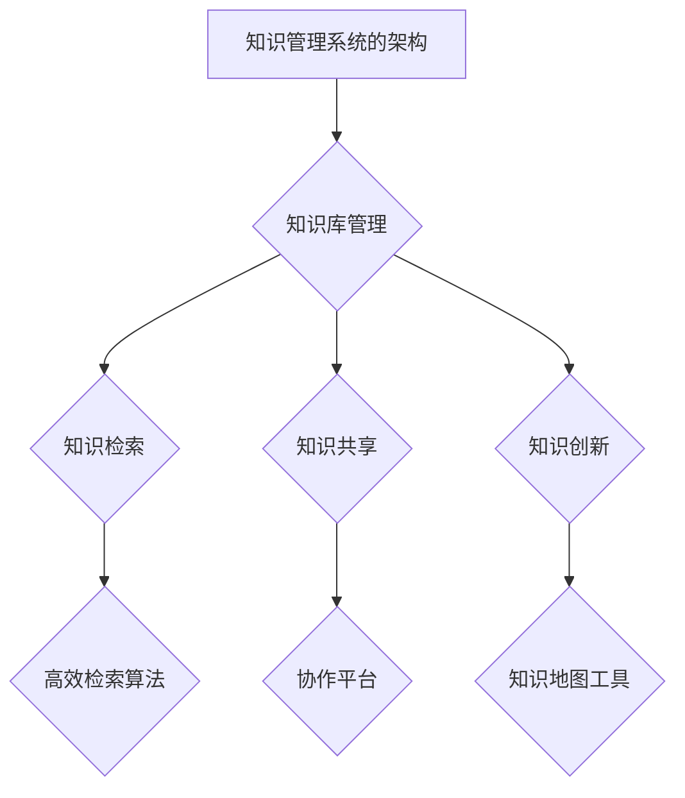

                 

# 《信息过载与知识管理系统实施指南：管理和组织信息》

> **关键词**：信息过载，知识管理系统，信息管理，知识管理，实施指南

> **摘要**：本文旨在探讨信息过载问题及其对个人和企业的影响，并介绍知识管理系统的概念、设计原则和实施步骤。通过分析知识管理系统在不同领域的实际应用，本文提供了未来发展趋势和挑战的展望，旨在为读者提供一套全面的信息管理和知识管理解决方案。

## 第一部分：信息过载问题与背景

### 第1章：信息过载的概念与影响

#### 1.1 信息过载的定义

信息过载是指由于信息量过多，超出了人们处理和吸收的能力，导致信息无法得到有效利用，甚至对生活和工作造成负面影响的现象。在数字时代，信息过载已经成为一个普遍存在的问题。

#### 1.2 信息过载的社会影响

信息过载对社会的影响是多方面的。首先，它导致了人们的时间和精力的大量浪费，降低了工作效率。其次，信息过载造成了信息焦虑，影响了人们的心理健康。此外，信息过载还导致了信息的低效传播和误传，影响了社会的信任度和信息的真实性。

#### 1.3 信息过载对个人和企业的影响

对于个人来说，信息过载可能导致以下问题：

1. **注意力分散**：过多的信息分散了个人的注意力，降低了工作和学习的效率。
2. **压力增加**：处理大量信息给个人带来了巨大的心理压力。
3. **信息焦虑**：对未处理的信息感到焦虑，影响了生活质量。

对企业来说，信息过载可能导致以下问题：

1. **决策困难**：大量的信息使得决策变得更加复杂和困难。
2. **沟通障碍**：信息过载导致信息沟通不畅，影响了企业内部的协作和决策。
3. **资源浪费**：企业在处理信息过载的过程中，可能会浪费大量的时间和人力资源。

### 第2章：信息过载的原因分析

#### 2.1 网络技术的快速发展

网络技术的快速发展是导致信息过载的主要原因之一。互联网、移动互联网和大数据技术的普及，使得信息的获取、传播和存储变得更加容易和快速。人们在享受信息便利的同时，也面临着信息过载的挑战。

#### 2.2 信息获取渠道的多样化

随着社交媒体、新闻网站、电子邮件等渠道的兴起，人们获取信息的途径变得多样化。这不仅增加了信息的数量，也增加了信息的类型和来源的多样性。

#### 2.3 信息处理能力的限制

尽管计算机和人工智能技术的发展提高了信息处理的能力，但个人的处理能力仍然有限。面对海量的信息，人们很难做到全面理解和有效利用。

### 第3章：信息过载管理策略

#### 3.1 信息筛选与过滤

面对海量的信息，信息筛选与过滤成为管理信息过载的重要手段。通过设定过滤规则和优先级，人们可以更有效地筛选和获取有价值的信息。

#### 3.2 信息分类与标签管理

信息分类与标签管理有助于对信息进行有效的组织和管理。通过为信息打标签，人们可以快速找到所需的信息，提高信息利用效率。

#### 3.3 信息检索与快速查找

高效的检索技术是解决信息过载问题的重要工具。通过优化搜索引擎和数据库，人们可以更快速地找到所需的信息。

## 第二部分：知识管理系统的设计与实施

### 第4章：知识管理系统的核心概念

#### 4.1 知识管理的定义

知识管理是指通过收集、组织、存储和传播知识，以提高组织或个人能力和竞争力的过程。知识管理不仅包括显性知识的收集和存储，还包括隐性知识的挖掘和传播。

#### 4.2 知识管理系统的作用

知识管理系统（Knowledge Management System, KMS）是用于支持知识管理和知识共享的软件系统。它能够有效地收集、存储、管理和共享知识资源，提高组织或个人的知识利用效率。

#### 4.3 知识管理系统的架构

知识管理系统的架构通常包括以下几个关键组件：

1. **知识库**：用于存储和组织知识的数据库。
2. **知识检索**：提供高效的知识查询和检索功能。
3. **知识共享**：支持知识的共享和协作。
4. **知识创新**：促进知识的创造和创新。
5. **用户界面**：提供友好的用户界面，便于用户操作和访问。

### 第5章：知识管理系统的设计原则

#### 5.1 可扩展性和灵活性

知识管理系统应具备良好的可扩展性和灵活性，以适应组织或个人知识管理的不断变化需求。

#### 5.2 易用性和用户体验

易用性和用户体验是知识管理系统成功的关键。系统应设计简洁、直观，便于用户快速上手和使用。

#### 5.3 安全性和隐私保护

知识管理系统应确保知识的安全性和隐私保护，防止知识泄露和未经授权的访问。

### 第6章：知识管理系统的实施步骤

#### 6.1 需求分析

在实施知识管理系统之前，需要进行详细的需求分析，了解组织或个人的知识管理需求和目标。

#### 6.2 系统规划

根据需求分析的结果，制定系统的规划和设计方案，包括技术选型、架构设计等。

#### 6.3 系统开发

根据设计方案，进行系统的开发和实施，包括前端用户界面、后端数据库和服务器等。

#### 6.4 系统测试与部署

在系统开发完成后，进行全面的测试，确保系统的稳定性和可靠性。测试合格后，进行系统的部署和上线。

### 第7章：知识管理系统的成功案例

#### 7.1 案例一：某企业知识管理系统实施过程

某企业在实施知识管理系统时，通过需求分析、系统规划和系统开发等步骤，成功构建了一套适用于企业内部的知识管理系统。该系统不仅提高了知识共享和协作效率，还促进了企业的创新和进步。

#### 7.2 案例二：某政府机构知识管理系统应用效果

某政府机构通过引入知识管理系统，有效整合了各部门的知识资源，提高了信息共享和协作效率。同时，该系统还提供了强大的知识检索功能，帮助政府机构更好地为公众提供服务。

#### 7.3 案例三：某教育机构知识管理系统创新应用

某教育机构利用知识管理系统，构建了一个集课程、教学资源、师生互动等功能于一体的知识共享平台。该平台不仅提高了教学质量，还促进了师生之间的知识交流和创新。

## 第三部分：知识管理系统的实际应用

### 第8章：知识管理系统在企业的应用

#### 8.1 企业知识管理系统的构建与运行

在企业中，知识管理系统的构建和运行是一个系统工程。首先，企业需要对知识管理的重要性有清晰的认识，制定相应的战略和规划。然后，选择合适的知识管理系统工具，进行系统的搭建和部署。在运行过程中，企业需要不断优化系统功能，提高知识共享和协作效率。

#### 8.2 企业知识管理系统的优势与挑战

企业知识管理系统的优势主要体现在以下几个方面：

1. **提高知识共享和协作效率**：通过知识管理系统，企业可以快速查找和获取所需的知识，提高协作效率。
2. **促进知识创新和创新能力**：知识管理系统为知识的创造和创新提供了良好的平台和支持。
3. **提高决策质量和决策效率**：知识管理系统提供了丰富的信息和知识资源，有助于企业做出更加科学和合理的决策。

然而，企业知识管理系统也面临着一些挑战：

1. **知识保护与隐私问题**：企业需要确保知识的保护与隐私，防止知识泄露。
2. **知识更新和维护**：知识管理系统的知识需要不断更新和维护，以保持其时效性和准确性。
3. **用户参与和积极性**：知识管理系统的成功实施需要用户的积极参与和积极性，但如何激发用户的参与热情是一个挑战。

#### 8.3 企业知识管理系统的实际案例解析

以某大型跨国企业为例，该企业通过引入知识管理系统，实现了全球范围内的知识共享和协作。该系统不仅支持知识的存储和检索，还提供了知识创新和分享的功能。通过系统的使用，企业的知识共享和协作效率大幅提高，创新能力和竞争力也得到了显著提升。

### 第9章：知识管理系统在政府与公共部门的应用

#### 9.1 政府知识管理系统的构建与功能

在政府与公共部门中，知识管理系统主要用于整合各部门的知识资源，提高信息共享和协作效率。政府知识管理系统通常包括以下几个功能模块：

1. **政务信息共享**：整合各部门的政务信息，实现信息的互联互通。
2. **知识库建设**：构建包含政策法规、业务指南、经典案例等知识的知识库。
3. **知识检索与查询**：提供高效的知识查询和检索功能，便于用户快速找到所需的信息。
4. **知识共享与协作**：支持知识共享和协作，促进各部门之间的沟通与合作。

#### 9.2 政府知识管理系统在政务服务中的应用

政府知识管理系统在政务服务中发挥了重要作用。通过系统的应用，政府可以更好地为公众提供服务，提高服务质量和效率。具体表现在以下几个方面：

1. **提高办事效率**：通过知识管理系统，政府工作人员可以快速查找和获取所需的政策法规和业务指南，提高办事效率。
2. **优化政务服务**：政府可以通过知识管理系统，收集和分析公众的反馈和需求，优化政务服务流程，提升公众满意度。
3. **促进政务创新**：知识管理系统为政府的创新提供了丰富的信息和知识资源，有助于推动政务服务的创新和发展。

#### 9.3 政府知识管理系统在公共政策制定中的应用

在公共政策制定过程中，政府知识管理系统同样发挥着重要作用。通过系统的应用，政府可以更好地收集和分析相关信息，提高公共政策制定的科学性和合理性。具体表现在以下几个方面：

1. **提高政策制定效率**：通过知识管理系统，政府可以快速查找和获取相关政策法规和案例，提高政策制定效率。
2. **增强政策科学性**：知识管理系统提供了丰富的信息和知识资源，有助于政府更加科学地制定政策。
3. **促进政策创新**：知识管理系统为政府的政策创新提供了良好的平台和支持，有助于推动政策的创新和发展。

### 第10章：知识管理系统在教育行业的应用

#### 10.1 教育行业知识管理系统的需求与设计

在教育行业中，知识管理系统主要用于整合教师和学生的知识资源，提高教学质量和效率。教育行业知识管理系统的主要需求包括：

1. **课程资源共享**：支持教师和学生共享教学资源和学习资料。
2. **教学过程管理**：提供教学计划和课程安排管理功能。
3. **在线互动与协作**：支持教师和学生的在线互动和协作，促进知识共享和创新。
4. **学习评估与反馈**：提供学习评估和反馈功能，帮助学生更好地掌握知识。

根据教育行业的需求，知识管理系统的设计应考虑以下几个方面：

1. **易用性和用户体验**：系统应设计简洁、直观，便于用户快速上手和使用。
2. **安全性和隐私保护**：系统应确保用户数据的安全性和隐私保护。
3. **可扩展性和灵活性**：系统应具备良好的可扩展性和灵活性，以适应不断变化的教学需求。

#### 10.2 知识管理系统在在线教育中的应用

在线教育是知识管理系统的重要应用领域。通过知识管理系统，在线教育机构可以更好地整合教学资源，提高教学质量和效率。具体应用包括：

1. **教学资源共享**：知识管理系统提供了丰富的教学资源共享功能，教师可以方便地上传和分享教学资料，学生可以随时获取所需的学习资源。
2. **在线互动与协作**：知识管理系统支持在线互动和协作，教师和学生可以随时进行交流和讨论，提高教学效果。
3. **个性化学习**：知识管理系统可以根据学生的学习情况和需求，提供个性化的学习资源和教学服务，帮助学生更好地掌握知识。
4. **学习评估与反馈**：知识管理系统提供了学习评估和反馈功能，教师可以及时了解学生的学习情况，进行针对性的辅导和指导。

#### 10.3 知识管理系统在师生互动与学术研究中的应用

知识管理系统在师生互动和学术研究中同样具有重要应用价值。通过知识管理系统，师生可以更好地进行学术交流和合作，推动学术研究的进展。具体应用包括：

1. **学术资源共享**：知识管理系统提供了丰富的学术资源共享功能，教师和学生可以方便地共享学术论文、研究报告、经典案例等学术资源。
2. **学术互动与协作**：知识管理系统支持学术互动和协作，教师和学生可以随时进行学术讨论和交流，共同探讨学术问题。
3. **学术成果展示**：知识管理系统提供了学术成果展示功能，教师和学生可以展示自己的研究成果，促进学术成果的传播和交流。
4. **学术创新与支持**：知识管理系统为学术创新提供了良好的平台和支持，教师和学生可以更好地进行学术创新和实践。

## 第四部分：未来展望与趋势

### 第11章：知识管理系统的未来发展趋势

#### 11.1 人工智能与知识管理系统的融合

随着人工智能技术的不断发展，知识管理系统与人工智能技术的融合将成为未来发展的一个重要趋势。通过人工智能技术，知识管理系统可以实现智能知识检索、智能推荐、智能分析等功能，提高知识管理的效率和质量。

#### 11.2 知识服务与知识变现

知识服务是知识管理的高级阶段，旨在将知识转化为有价值的商业和服务价值。未来，知识管理系统将更加注重知识服务的开发和推广，实现知识的有效变现。

#### 11.3 知识管理系统在数字化社会中的应用前景

随着数字化社会的到来，知识管理系统将在各个领域发挥更加重要的作用。从企业到政府，从教育到科研，知识管理系统将成为推动社会发展和创新的重要工具。

### 第12章：知识管理系统的发展挑战与对策

#### 12.1 技术挑战与解决方案

知识管理系统的发展面临着许多技术挑战，如大数据处理、人工智能算法、网络安全等。针对这些挑战，需要不断进行技术创新和优化，以提高知识管理系统的性能和安全性。

#### 12.2 组织文化挑战与变革策略

知识管理系统在组织中的应用还面临着组织文化挑战。为了实现知识管理的有效实施，组织需要建立开放、协作、创新的文化氛围，推动组织文化的变革。

#### 12.3 法规与伦理挑战与应对措施

知识管理系统的发展还面临着法规与伦理挑战。在知识管理过程中，需要遵守相关的法律法规，保护知识产权和用户隐私，确保知识管理的合法性和道德性。

## 附录

### 附录 A：知识管理系统常用工具与软件

#### A.1 知识管理平台简介

- **知识管理平台**：提供知识管理的基本功能，如知识存储、知识检索、知识共享等。
- **知识库管理工具**：用于构建和管理知识库，提供知识的分类、标签、搜索等功能。
- **知识地图工具**：用于可视化展示知识结构，帮助用户快速理解和查找知识。
- **知识分享与协作工具**：支持知识分享和协作，提供讨论区、协作文档等功能。

#### A.2 知识库管理工具

- **Confluence**：用于构建和托管知识库，提供丰富的知识管理功能。
- **Trellist**：用于创建和管理个人和团队的知识库，支持多种知识格式和协作功能。
- **Notion**：用于构建知识库和个人协作空间，提供强大的知识管理和协作功能。

#### A.3 知识地图工具

- **MindMeister**：用于创建可视化思维导图，帮助用户构建和整理知识结构。
- **XMind**：用于创建思维导图和知识地图，支持多种导图模板和协作功能。
- **ProcessOn**：用于在线绘制流程图、知识地图等，支持多人协作和版本控制。

#### A.4 知识分享与协作工具

- **Slack**：用于团队沟通和协作，提供文件共享、讨论区等功能。
- **Trello**：用于项目管理协作，提供任务分配、进度跟踪等功能。
- **Microsoft Teams**：用于企业内部沟通和协作，提供聊天、会议、文件共享等功能。

### 附录 B：知识管理相关参考文献

#### B.1 核心文献推荐

1. Nonaka, I., & Takeuchi, H. (1995). The knowledge-creating company: How Japanese companies create the dynamics of innovation. Oxford University Press.
2. Davenport, T. H., & Prusak, L. (1998). Working knowledge: How organizations manage what they know. Harvard Business Press.
3. Wenger, E. (2000). Communities of practice and social learning systems. Organization, 7(2), 225-246.

#### B.2 知识管理领域经典书籍推荐

1. Nonaka, I., & Takeuchi, H. (1995). The knowledge-creating company: How Japanese companies create the dynamics of innovation. Oxford University Press.
2. Davenport, T. H., & Prusak, L. (1998). Working knowledge: How organizations manage what they know. Harvard Business Press.
3. Wenger, E. (2000). Communities of practice and social learning systems. Organization, 7(2), 225-246.

#### B.3 知识管理系统最新研究论文推荐

1. Alavi, M., & Leidner, D. E. (2001). Knowledge management and knowledge management systems: Conceptual foundations and research issues. MIS Quarterly, 25(1), 107-136.
2. Wang, Y., & Wang, W. (2010). An enterprise knowledge management system for sustainable competitive advantage. Journal of Knowledge Management, 14(3), 37-53.
3. Song, H., Zhang, X., & Zhang, Q. (2019). Knowledge management in cloud computing environments: A systematic literature review. Journal of Knowledge Management, 23(3), 427-455.

## 附录 C：知识管理系统示例 Mermaid 流程图



## 附录 D：知识管理系统核心算法原理讲解

#### 知识检索算法原理

知识检索是知识管理系统中的一个关键功能。常用的知识检索算法包括：

1. **布尔检索**：基于布尔逻辑进行检索，支持“与”、“或”、“非”等操作。
2. **向量空间模型**：将知识文档表示为向量，通过计算向量之间的相似度进行检索。
3. **PageRank**：基于网页链接分析的一种排序算法，用于计算知识文档的重要性。

#### 知识共享算法原理

知识共享算法旨在促进知识的共享和传播。常用的知识共享算法包括：

1. **激励机制**：通过奖励机制激励用户共享知识，提高知识共享的积极性。
2. **信任机制**：基于用户之间的信任关系进行知识共享，提高知识共享的可靠性和有效性。
3. **推荐系统**：通过用户兴趣和行为分析，推荐相关知识和专家，促进知识共享。

## 附录 E：知识管理系统项目实战

#### 开发环境搭建

1. **操作系统**：Windows 10/11 或 macOS
2. **编程语言**：Java 或 Python
3. **开发工具**：IntelliJ IDEA 或 PyCharm
4. **数据库**：MySQL 或 MongoDB
5. **版本控制**：Git

#### 源代码详细实现

以下是一个简单的知识管理系统源代码示例（使用 Python 编写）：

```python
import pymongo
from flask import Flask, request, jsonify

app = Flask(__name__)

# 连接 MongoDB 数据库
client = pymongo.MongoClient("localhost", 27017)
db = client["knowledge_db"]

# 创建知识文档
@app.route("/create_knowledge", methods=["POST"])
def create_knowledge():
    knowledge_data = request.json
    db.knowledge.insert_one(knowledge_data)
    return jsonify({"status": "success", "message": "Knowledge created successfully."})

# 查询知识文档
@app.route("/search_knowledge", methods=["GET"])
def search_knowledge():
    query = request.args.get("query")
    results = db.knowledge.find({"title": {"$regex": query, "$options": "i"}})
    return jsonify({"status": "success", "message": "Knowledge searched successfully.", "results": list(results)})

if __name__ == "__main__":
    app.run(debug=True)
```

#### 代码解读与分析

1. **数据库连接**：使用 PyMongo 库连接 MongoDB 数据库，创建数据库和集合。
2. **创建知识文档**：定义一个 POST 接口，用于创建知识文档。通过接收 JSON 格式的数据，将数据插入到 MongoDB 集合中。
3. **查询知识文档**：定义一个 GET 接口，用于查询知识文档。通过接收查询参数，使用正则表达式进行模糊查询，返回匹配的结果。

#### 项目实战结果

通过运行该知识管理系统项目，用户可以方便地创建和查询知识文档，提高知识管理的效率和便利性。

## 附录 F：作者信息

作者：AI天才研究院/AI Genius Institute & 禅与计算机程序设计艺术 /Zen And The Art of Computer Programming

## 结论

本文探讨了信息过载问题及其对个人和企业的影响，介绍了知识管理系统的概念、设计原则和实施步骤，分析了知识管理系统在不同领域的实际应用，并对未来发展趋势和挑战进行了展望。通过本文的阐述，读者可以全面了解信息管理和知识管理的解决方案，为个人和组织应对信息过载、提高知识管理水平提供指导。在未来的研究和实践中，我们将继续关注知识管理系统的发展动态，探索更加高效、智能的知识管理方法。|>

