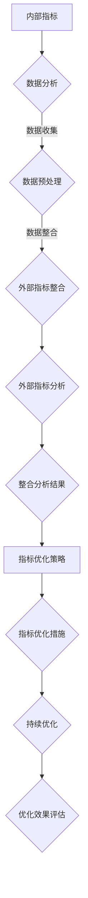

                 

### 文章标题

"内部指标与外部指标的关系：管理与优化策略"

### 文章关键词

- 内部指标
- 外部指标
- 企业运营
- 数据分析
- 指标优化

### 文章摘要

本文深入探讨了内部指标与外部指标在企业运营中的关系，包括其定义、分类、管理策略及优化方法。通过分析两者之间的关联性，本文提出了有效的整合和应用策略，并提供了详细的案例研究和算法讲解，旨在为企业提供实用的指导和实践方案。

---

### 第一部分：内部指标与外部指标的关系概述

内部指标与外部指标是企业管理中常用的两个重要概念，它们在企业的运营、决策和绩效评估中发挥着至关重要的作用。内部指标通常是指企业内部各个部门、业务流程和运营活动的绩效指标，而外部指标则更多关注企业的市场表现、客户满意度以及行业竞争状况等。这两类指标既有区别又有联系，通过有效的整合和应用，可以为企业提供全面、科学的决策支持。

#### 第1章：内部指标与外部指标的定义与基本概念

##### 1.1 内部指标的定义与分类

内部指标是企业内部各个部门、业务流程和运营活动的绩效指标，它们反映了企业的运营效率、成本控制、资源利用以及员工满意度等多个方面。内部指标可以根据不同的维度进行分类，例如：

- **财务指标**：如收入、利润、成本、资产回报率（ROA）等。
- **运营指标**：如生产效率、库存周转率、订单履行周期等。
- **人力资源指标**：如员工满意度、员工流失率、培训次数等。
- **客户服务指标**：如客户满意度、投诉率、响应时间等。

##### 1.2 外部指标的定义与分类

外部指标则更多地关注企业在市场中的表现和行业竞争状况。这些指标通常由外部数据来源提供，如市场调研、客户反馈、竞争对手分析等。外部指标可以分为以下几类：

- **市场表现指标**：如市场份额、品牌知名度、销售额增长率等。
- **客户指标**：如客户满意度、客户忠诚度、客户留存率等。
- **竞争指标**：如竞争对手的市场份额、产品价格、营销策略等。

##### 1.3 内部指标与外部指标的关系

内部指标与外部指标之间存在着密切的关联性。内部指标是企业运营的基础，直接影响到外部指标的表现。例如，一个企业的生产效率和成本控制能力越强，其市场份额和客户满意度就可能越高。同时，外部环境的变化，如市场需求、竞争态势等，也会影响内部指标的表现。因此，内部指标与外部指标之间的关系是相互作用、相互影响的。

#### 1.3.1 内部指标与外部指标的关联性

内部指标与外部指标之间的关联性体现在多个方面：

- **市场反应**：内部指标如产品开发周期、生产效率等，直接影响产品的市场投放速度和竞争力，进而影响市场份额和销售额。
- **成本控制**：内部指标如成本控制能力、库存管理效率等，对企业的盈利能力和市场竞争力有直接的影响。
- **客户满意度**：内部指标如客户服务响应时间、员工服务质量等，直接影响客户满意度，进而影响客户忠诚度和市场口碑。

#### 1.3.2 内部指标与外部指标的关系模型

内部指标与外部指标的关系可以通过以下模型进行描述：

1. **因果关系模型**：内部指标影响外部指标，如生产效率高可以提高市场竞争力。
2. **反馈循环模型**：外部环境变化导致内部指标调整，如市场需求增加导致企业增加生产，进而提高市场份额。
3. **协同效应模型**：内部指标和外部指标相互促进，如高客户满意度可以增加市场份额，提高企业盈利能力。

#### 1.3.3 内部指标与外部指标的数据交互与整合

为了有效地管理和优化内部指标与外部指标，企业需要实现两者之间的数据交互和整合：

- **数据集成**：通过数据仓库和集成平台，将内部指标和外部指标的数据进行统一存储和管理。
- **数据共享**：建立统一的数据共享机制，确保各部门能够实时访问和分析内外部指标数据。
- **数据可视化**：利用数据可视化工具，将内部指标和外部指标的数据进行可视化和对比分析。

通过以上方式，企业可以更全面、准确地了解自身的运营状况和市场表现，为决策提供有力支持。

---

**Mermaid 流程图：内部指标与外部指标关系**

---

在下一部分，我们将进一步探讨内部指标的管理与优化策略，帮助企业更好地利用这些关键指标，提升整体运营效率和竞争力。敬请期待。

