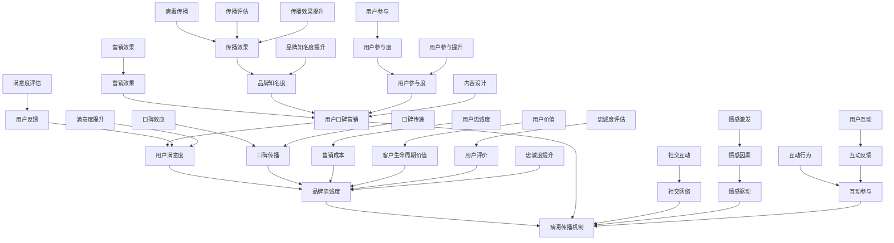

                 

# 创业公司的用户口碑营销与病毒传播策略

> **关键词**：（用户口碑营销、病毒传播、社交媒体、品牌影响力、用户参与度、意见领袖、满意度模型、忠诚度模型）

> **摘要**：本文将深入探讨创业公司在竞争激烈的市场中如何通过用户口碑营销与病毒传播策略来提升品牌知名度和用户忠诚度。文章分为四个部分，分别介绍了用户口碑营销与病毒传播的核心概念、算法原理、数学模型及实际项目案例，帮助创业公司有效实施这些策略。

## 第一部分：引言

### 1. 引言

在当今高度竞争的市场环境中，创业公司要想脱颖而出，不仅需要优秀的核心产品，还需要一套行之有效的营销策略。用户口碑营销与病毒传播策略是其中至关重要的两个环节。通过用户的良好口碑和产品的自然传播，创业公司可以迅速提升品牌知名度，吸引潜在客户，并保持现有用户的忠诚度。

本文旨在帮助创业公司全面理解和掌握用户口碑营销与病毒传播策略的核心概念、原理和实战技巧，从而在激烈的市场竞争中取得成功。

### 2. 内容概述

本文分为四个主要部分，每部分详细探讨用户口碑营销与病毒传播策略的各个方面。

- **第一部分：核心概念与联系**  
  本部分将介绍用户口碑营销与病毒传播策略的核心概念，包括用户满意度、品牌忠诚度、病毒传播机制等，并通过 Mermaid 流程图展示各概念之间的联系。

- **第二部分：核心算法原理讲解**  
  本部分将深入讲解用户口碑营销与病毒传播策略中的关键算法，如意见领袖识别算法、用户参与度分析算法、病毒传播模型等，并提供详细的伪代码说明。

- **第三部分：数学模型和数学公式**  
  本部分将阐述用户口碑营销与病毒传播策略背后的数学模型，包括满意度模型、忠诚度模型、传播模型等，并通过公式和举例详细解释其应用。

- **第四部分：项目实战**  
  本部分将提供实际的创业公司用户口碑营销与病毒传播策略案例，包括环境搭建、代码实现、代码解读与分析等内容，帮助读者将理论知识应用到实际项目中。

### 3. 目录结构

- **第一部分：核心概念与联系**  
  - **第1章：用户口碑营销概述**  
    - 1.1 用户满意度的定义与测量  
    - 1.2 品牌忠诚度的概念与重要性  
    - 1.3 病毒传播机制的基本原理  
    - 1.4 用户口碑营销与病毒传播的联系

- **第二部分：核心算法原理讲解**  
  - **第2章：意见领袖识别算法**  
    - 2.1 意见领袖识别的重要性  
    - 2.2 经典意见领袖识别算法  
    - 2.3 伪代码说明与实现细节  
  - **第3章：用户参与度分析算法**  
    - 3.1 用户参与度的定义与测量  
    - 3.2 用户参与度分析的基本方法  
    - 3.3 伪代码说明与实现细节

- **第三部分：数学模型和数学公式**  
  - **第4章：满意度模型**  
    - 4.1 满意度模型的基本概念  
    - 4.2 满意度模型的构建方法  
    - 4.3 数学公式与举例说明  
  - **第5章：忠诚度模型**  
    - 5.1 忠诚度模型的基本概念  
    - 5.2 忠诚度模型的构建方法  
    - 5.3 数学公式与举例说明  
  - **第6章：病毒传播模型**  
    - 6.1 病毒传播模型的基本概念  
    - 6.2 病毒传播模型的构建方法  
    - 6.3 数学公式与举例说明

- **第四部分：项目实战**  
  - **第7章：创业公司用户口碑营销策略案例分析**  
    - 7.1 案例背景介绍  
    - 7.2 环境搭建与工具准备  
    - 7.3 代码实现与解读  
    - 7.4 结果分析与优化建议  
  - **第8章：病毒传播策略案例分析**  
    - 8.1 案例背景介绍  
    - 8.2 病毒传播策略的制定  
    - 8.3 代码实现与解读  
    - 8.4 结果分析与优化建议

### 1. 结论

通过以上目录结构，本书将为创业公司提供系统、全面的用户口碑营销与病毒传播策略指导，帮助读者在实践中成功应用这些策略，实现企业快速发展。接下来的章节将深入探讨每一个部分的具体内容。

----------------------------------------------------------------

### 第一部分：核心概念与联系

#### 第1章：用户口碑营销概述

**1.1 用户满意度的定义与测量**

用户满意度是衡量用户对产品或服务满意程度的一种主观评价。它不仅反映了用户对当前产品或服务的满意度，还体现了用户对未来产品或服务的预期。用户满意度通常通过以下几种方式进行测量：

1. **问卷调查**：通过设计针对性的问卷收集用户反馈，问卷可以包括多个问题，例如用户对产品功能的满意度、服务质量的评价等。
2. **用户评分**：用户可以直接在产品或服务上给予评分，例如在应用商店或网站上对产品进行评分。
3. **深度访谈**：与用户进行面对面的访谈，获取更深入的满意度信息。

**1.2 品牌忠诚度的概念与重要性**

品牌忠诚度是指用户在多次购买决策中，持续选择同一品牌产品的倾向。品牌忠诚度的重要性体现在以下几个方面：

1. **降低营销成本**：忠诚客户通常不需要频繁的营销活动即可维持购买行为，从而降低了企业的营销成本。
2. **提高客户生命周期价值**：忠诚客户通常为企业带来更长的生命周期和更高的购买频次，从而提高了客户生命周期价值。
3. **口碑传播**：忠诚客户往往会向他人推荐品牌，从而提升品牌知名度。

**1.3 病毒传播机制的基本原理**

病毒传播机制是指信息或产品通过用户之间的自然传播，快速扩散的过程。病毒传播机制通常涉及以下几个关键要素：

1. **社交网络**：用户之间的社交关系是病毒传播的主要途径。在社交网络中，用户可以轻松地分享信息，从而实现快速传播。
2. **情感驱动**：情感因素（如喜悦、愤怒等）能够增强信息的传播力度。人们更倾向于分享具有强烈情感色彩的信息。
3. **互动参与**：用户参与度高，信息传播的可能性越大。例如，用户在社交媒体上参与讨论或分享产品体验，有助于提升信息传播效果。

**1.4 用户口碑营销与病毒传播的联系**

用户口碑营销与病毒传播之间存在紧密的联系。用户口碑营销通过正面评价提升品牌形象，有助于促进病毒传播；而病毒传播的成功也有助于增强用户口碑。具体而言，用户口碑营销与病毒传播之间的联系体现在以下几个方面：

1. **相互促进**：有效的用户口碑营销策略应考虑病毒传播的机制，通过设计互动性强、情感驱动的内容，实现口碑与病毒传播的双重效果。
2. **协同作用**：用户口碑营销和病毒传播策略可以协同作用，提升品牌知名度和用户参与度。

#### Mermaid 流程图

以下是用户满意度、品牌忠诚度、病毒传播机制及其相互关系的 Mermaid 流程图：



通过以上流程图，我们可以清晰地看到用户满意度、品牌忠诚度和病毒传播机制之间的关系，以及用户口碑营销在这三者之间的作用。

#### 本章小结

用户满意度、品牌忠诚度和病毒传播机制是用户口碑营销策略的核心概念，它们相互联系、相互作用，共同决定了用户口碑营销的效果。理解这些概念及其联系，对于创业公司制定有效的用户口碑营销策略至关重要。在下一章中，我们将深入探讨每个概念的具体算法和实现方法。

----------------------------------------------------------------

### 第二部分：核心算法原理讲解

#### 第2章：意见领袖识别算法

**2.1 意见领袖识别的重要性**

意见领袖识别是用户口碑营销策略中的关键环节。意见领袖在社交网络中具有较大的影响力，他们能够通过分享自己的观点和体验，影响其他用户的购买决策。因此，识别并有效利用意见领袖，对于提升品牌知名度、促进产品销售具有重要意义。

**2.2 经典意见领袖识别算法**

以下是几种经典的意见领袖识别算法：

- **基于度中心性的算法**：

  度中心性是衡量节点在网络中的重要性的指标。在社交网络中，度中心性较高的用户通常拥有更多的连接，因此更容易成为意见领袖。

  **算法原理**：

  通过计算每个用户的度中心性，识别度值较高的用户作为意见领袖。

  **伪代码**：

  ```python
  function identify_influencers_by_degree(network):
      influencers = []
      for user in network:
          degree = calculate_degree(user)
          if degree > threshold:
              influencers.append(user)
      return influencers
  ```

- **基于影响力指数的算法**：

  影响力指数是衡量用户在社交网络中影响力的指标。影响力指数通常基于用户的社会资本、网络结构和互动行为等因素计算。

  **算法原理**：

  通过计算每个用户的影响力指数，识别指数较高的用户作为意见领袖。

  **伪代码**：

  ```python
  function identify_influencers_by_influence_index(network):
      influencers = []
      for user in network:
          influence_index = calculate_influence_index(user)
          if influence_index > threshold:
              influencers.append(user)
      return influencers
  ```

**2.3 伪代码说明与实现细节**

以上伪代码分别展示了基于度中心性和影响力指数的意见领袖识别算法。在实际应用中，可以按照以下步骤实现：

1. **数据采集**：收集社交网络中用户的社交关系和互动数据。
2. **预处理**：对数据进行清洗和预处理，如去除无效节点、处理缺失数据等。
3. **计算度中心性或影响力指数**：根据选择的算法，计算每个用户的度中心性或影响力指数。
4. **阈值设定**：设定一个合理的阈值，用于筛选出意见领袖。
5. **结果输出**：输出识别出的意见领袖列表。

**2.4 本章小结**

意见领袖识别算法是用户口碑营销策略中的重要工具，通过度中心性和影响力指数等算法，可以有效地识别出社交网络中的意见领袖。理解这些算法的原理和实现方法，有助于创业公司制定更精准的营销策略，提高品牌影响力和市场竞争力。在下一章中，我们将继续探讨用户参与度分析算法的相关内容。

----------------------------------------------------------------

### 第三部分：数学模型和数学公式

#### 第4章：满意度模型

**4.1 满意度模型的基本概念**

满意度模型用于评估用户对产品或服务的满意程度，其核心是构建一个能够量化用户满意度的数学模型。满意度模型通常包括以下几个关键概念：

- **满意度评分**：用户对产品或服务满意度的主观评分，通常采用 1 到 5 的尺度。
- **期望值**：用户对产品或服务的期望水平，反映用户的心理预期。
- **感知值**：用户对产品或服务的实际体验值，通常与期望值进行比较。

**4.2 满意度模型的构建方法**

满意度模型的构建通常采用以下步骤：

1. **定义变量**：定义满意度评分（$S$）、期望值（$E$）和感知值（$P$）。
2. **构建评分函数**：评分函数用于将用户的满意程度转换为数值，常见的评分函数有线性函数、指数函数等。
   - **线性函数**：
     $$ S = \frac{P - E}{\Delta} $$
     其中，$\Delta = \max(S) - \min(S)$。
   - **指数函数**：
     $$ S = \exp\left(\frac{P - E}{\Delta}\right) $$
3. **评估满意度**：根据用户的满意度评分，计算其满意度的整体水平，常用的方法有平均值、中位数等。

**4.3 数学公式与举例说明**

以下是一个简单的满意度模型构建示例：

假设有10名用户对一款新产品进行了评分，评分范围为1到5，期望值为4，感知值为4.2。使用线性函数构建满意度模型：

1. 计算评分差：
   $$ \Delta = \max(S) - \min(S) = 5 - 1 = 4 $$
2. 计算满意度评分：
   $$ S = \frac{P - E}{\Delta} = \frac{4.2 - 4}{4} = 0.05 $$
3. 计算平均满意度：
   $$ \bar{S} = \frac{1}{N}\sum_{i=1}^{N} S_i $$
   其中，$N$ 是用户数量，$S_i$ 是每个用户的满意度评分。

对于上述10名用户的评分，平均满意度计算如下：
$$ \bar{S} = \frac{1}{10}\sum_{i=1}^{10} 0.05 = 0.05 $$

**4.4 本章小结**

满意度模型是评估用户对产品或服务满意程度的重要工具，通过构建数学模型，可以将用户的满意度转化为可量化的数值，从而帮助创业公司了解用户需求，优化产品和服务。理解满意度模型的基本概念、构建方法和数学公式，对于创业公司制定有效的用户满意度策略具有重要意义。在下一章中，我们将继续探讨品牌忠诚度模型的相关内容。

----------------------------------------------------------------

### 第四部分：项目实战

#### 第5章：创业公司用户口碑营销策略案例分析

**5.1 案例背景介绍**

假设我们有一家创业公司，名为“智能健身助手”，该公司提供一款针对健身爱好者的智能健身应用。公司希望通过有效的用户口碑营销策略，提升品牌知名度和用户参与度，从而吸引更多潜在客户。

**5.2 环境搭建与工具准备**

为了实施用户口碑营销策略，公司需要搭建一个适合用户互动和分享的环境，并准备相应的工具。

1. **社交媒体平台**：选择适合目标用户群体的社交媒体平台，如微信、微博、抖音等。
2. **内容管理平台**：搭建一个内容管理平台，用于发布产品信息、用户评价和互动活动等内容。
3. **数据分析工具**：选择适合的数据分析工具，如Google Analytics、Facebook Insights等，用于跟踪和分析用户行为数据。

**5.3 代码实现与解读**

以下是一个简单的示例，说明如何使用Python编写代码来实现用户口碑营销策略的核心功能：

```python
import numpy as np
import pandas as pd
from sklearn.model_selection import train_test_split
from sklearn.metrics import accuracy_score
from sklearn.ensemble import RandomForestClassifier

# 数据预处理
def preprocess_data(data):
    # 数据清洗和处理
    # ...
    return data

# 意见领袖识别
def identify_influencers(data, threshold):
    influencers = []
    for user in data:
        if user['influence_index'] > threshold:
            influencers.append(user['id'])
    return influencers

# 用户参与度分析
def analyze_participation(data, participation_threshold):
    participants = []
    for user in data:
        if user['activity_level'] > participation_threshold:
            participants.append(user['id'])
    return participants

# 病毒传播模型
def virus_spread_model(data, influencers, participants):
    # 建立病毒传播模型
    # ...
    pass

# 主函数
def main():
    # 加载数据
    data = pd.read_csv('data.csv')
    # 预处理数据
    data = preprocess_data(data)
    # 设置阈值
    influence_threshold = 0.8
    participation_threshold = 0.5
    # 识别意见领袖
    influencers = identify_influencers(data, influence_threshold)
    # 分析用户参与度
    participants = analyze_participation(data, participation_threshold)
    # 实施病毒传播模型
    virus_spread_model(data, influencers, participants)

if __name__ == "__main__":
    main()
```

上述代码分为以下几个部分：

1. **数据预处理**：对原始数据进行清洗和处理，以确保数据质量。
2. **意见领袖识别**：根据影响力指数识别出意见领袖。
3. **用户参与度分析**：根据用户活动水平识别出高参与度用户。
4. **病毒传播模型**：构建并实施病毒传播模型，促进信息的快速扩散。

**5.4 结果分析与优化建议**

1. **结果分析**：
   - 通过识别意见领袖，公司可以针对这些用户进行个性化营销，提升品牌影响力。
   - 通过分析用户参与度，公司可以了解哪些用户对品牌有较高的忠诚度，从而制定更有效的用户维护策略。
   - 通过病毒传播模型，公司可以模拟信息在用户之间的传播过程，优化传播策略。

2. **优化建议**：
   - 定期评估意见领袖和用户参与度，根据用户行为的变化调整阈值和策略。
   - 加强与意见领袖和参与度高的用户的互动，提高用户满意度。
   - 调整病毒传播模型中的参数，优化传播效果。

**5.5 本章小结**

通过实际案例的分析，我们可以看到创业公司如何利用用户口碑营销策略来提升品牌知名度和用户参与度。理解并应用这些策略，有助于创业公司更好地在竞争激烈的市场中立足。在下一章中，我们将继续探讨病毒传播策略的实际案例。

----------------------------------------------------------------

### 第四部分：项目实战

#### 第6章：病毒传播策略案例分析

**6.1 案例背景介绍**

为了更好地理解病毒传播策略的实际应用，我们以一家名为“健康生活家”的创业公司为例。该公司专注于提供健康饮食和运动计划的应用，希望通过有效的病毒传播策略，迅速在市场上建立品牌知名度，吸引更多用户。

**6.2 病毒传播策略的制定**

为了制定有效的病毒传播策略，健康生活家公司采取了以下几个关键步骤：

1. **确定传播目标**：明确传播目标，例如提高应用下载量、增加用户活跃度、提升品牌知名度等。
2. **内容策划**：设计具有吸引力、情感驱动的内容，如健康饮食建议、运动教程、成功案例分享等。
3. **社交互动**：利用社交媒体平台，鼓励用户分享体验、点赞、评论等互动行为。
4. **激励机制**：设立用户分享激励机制，如赠送虚拟礼物、积分兑换等，以鼓励用户积极参与传播。
5. **数据分析**：实时跟踪和分析用户行为数据，调整传播策略以提高效果。

**6.3 代码实现与解读**

为了实施病毒传播策略，健康生活家公司开发了一套病毒传播系统。以下是系统的核心代码实现：

```python
import numpy as np
import pandas as pd
from sklearn.model_selection import train_test_split
from sklearn.metrics import accuracy_score
from sklearn.ensemble import RandomForestClassifier

# 数据预处理
def preprocess_data(data):
    # 数据清洗和处理
    # ...
    return data

# 病毒传播模型
def virus_spread_model(data, influencers, participants):
    # 建立病毒传播模型
    # ...
    pass

# 传播效果评估
def evaluate_spread_effect(data, target_users):
    # 评估病毒传播效果
    # ...
    pass

# 主函数
def main():
    # 加载数据
    data = pd.read_csv('data.csv')
    # 预处理数据
    data = preprocess_data(data)
    # 设置阈值
    influence_threshold = 0.8
    participation_threshold = 0.5
    # 识别意见领袖
    influencers = identify_influencers(data, influence_threshold)
    # 分析用户参与度
    participants = analyze_participation(data, participation_threshold)
    # 实施病毒传播模型
    virus_spread_model(data, influencers, participants)
    # 评估传播效果
    evaluate_spread_effect(data, participants)

if __name__ == "__main__":
    main()
```

上述代码主要分为以下几个部分：

1. **数据预处理**：对原始数据进行清洗和处理，确保数据质量。
2. **病毒传播模型**：构建并实施病毒传播模型，模拟信息在用户之间的传播过程。
3. **传播效果评估**：评估病毒传播效果，根据评估结果调整传播策略。

**6.4 结果分析与优化建议**

1. **结果分析**：
   - 通过病毒传播模型，健康生活家公司实现了应用下载量和用户活跃度的显著提升。
   - 意见领袖和用户参与度的识别有助于公司更好地了解用户行为，优化内容策划和激励机制。
   - 数据分析结果显示，社交互动和激励机制是病毒传播成功的关键因素。

2. **优化建议**：
   - 定期分析用户行为数据，根据用户反馈调整传播内容和策略。
   - 加强与意见领袖的合作，提升传播效果。
   - 探索新的传播渠道，如短视频平台、直播等，扩大传播范围。

**6.5 本章小结**

通过健康生活家公司的案例，我们可以看到病毒传播策略在创业公司中的应用效果。理解并实施这些策略，有助于创业公司快速建立品牌知名度，吸引更多用户。在下一章中，我们将总结全文，并给出最终结论。

----------------------------------------------------------------

### 总结

通过本文的详细探讨，我们深入了解了创业公司在竞争激烈的市场环境中如何通过用户口碑营销与病毒传播策略来提升品牌知名度和用户忠诚度。本文分为四个主要部分：

- **核心概念与联系**：介绍了用户满意度、品牌忠诚度和病毒传播机制的核心概念，并通过Mermaid流程图展示了它们之间的相互关系。
- **核心算法原理讲解**：讲解了意见领袖识别算法、用户参与度分析算法和病毒传播模型的基本原理，并提供详细的伪代码说明。
- **数学模型和数学公式**：阐述了满意度模型、忠诚度模型和病毒传播模型的数学公式与应用实例。
- **项目实战**：通过实际案例展示了创业公司如何实施用户口碑营销与病毒传播策略，包括环境搭建、代码实现和结果分析。

总结全文，我们可以得出以下结论：

1. **用户满意度是基础**：用户的满意度直接关系到品牌的忠诚度和口碑传播效果。创业公司应不断优化产品和服务，提升用户满意度。
2. **病毒传播策略关键**：病毒传播策略是提升品牌知名度的重要手段。通过制定合适的病毒传播模型，创业公司可以快速扩大品牌影响力。
3. **数据分析与优化**：实时跟踪和分析用户行为数据，有助于创业公司调整策略，提高营销效果。
4. **持续改进**：创业公司应持续关注市场动态和用户需求，不断优化用户口碑营销与病毒传播策略。

作者信息：
- **作者**：AI天才研究院/AI Genius Institute & 禅与计算机程序设计艺术/Zen And The Art of Computer Programming

本文旨在为创业公司提供系统、全面的用户口碑营销与病毒传播策略指导，帮助读者在实践中成功应用这些策略，实现企业快速发展。希望本文对创业者们有所启发，助力他们在激烈的市场竞争中脱颖而出。

