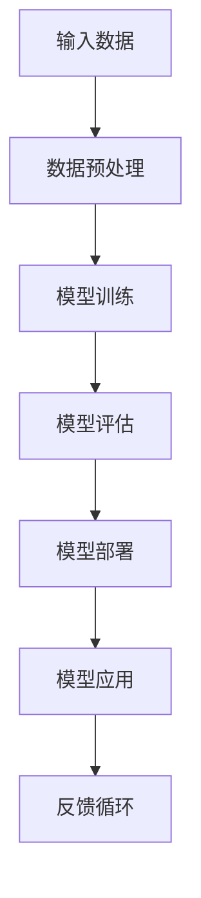
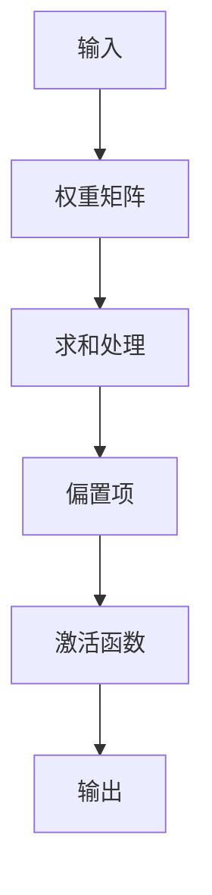
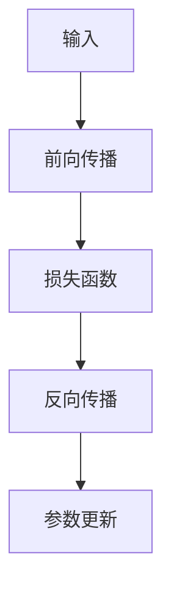
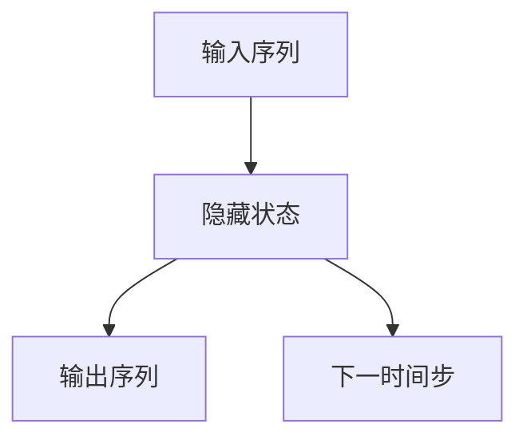
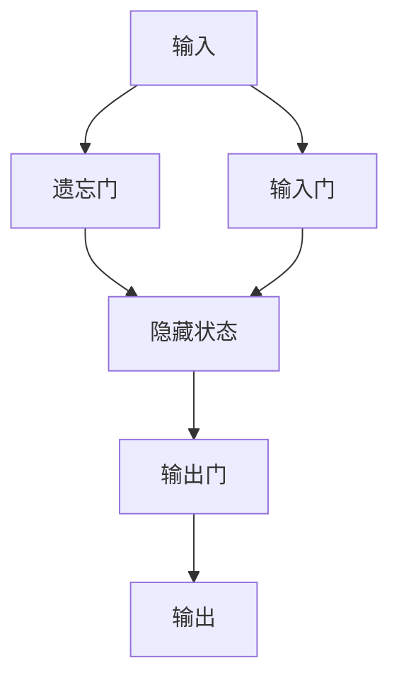
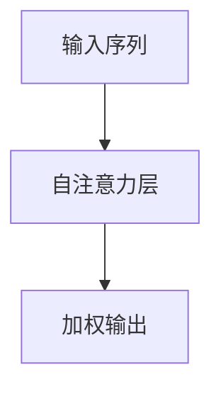
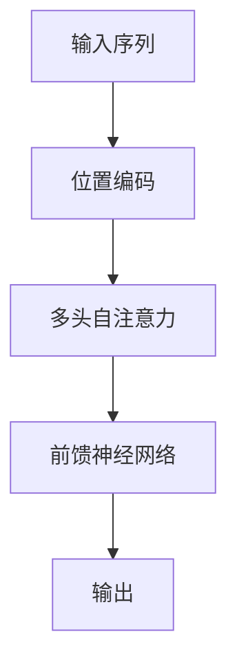
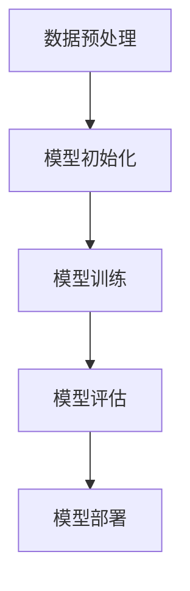

                 

### 第一部分：AI大模型基础知识

#### 第1章：AI大模型概述

##### 1.1 AI大模型的概念与重要性

AI大模型是指那些参数规模达到亿级甚至十亿级以上的深度学习模型。这些模型具有以下几个显著特点：

1. **参数规模大**：大模型拥有数亿甚至数十亿的参数，这允许它们捕捉到复杂的数据模式。
2. **训练数据量大**：大模型通常使用海量的数据进行训练，这有助于提高模型的泛化能力。
3. **模型复杂度高**：复杂的网络结构和层次使得大模型能够处理更加复杂的问题。
4. **模型泛化能力强**：得益于大规模的数据和参数，大模型在未知数据上的表现更加出色。

这些特点使得AI大模型在现代人工智能领域扮演着至关重要的角色。例如，GPT-3能够生成高质量的文本，BERT在自然语言处理任务中达到了前所未有的效果，这些模型的出现极大地推动了人工智能的发展。

##### 1.2 AI大模型的特点

AI大模型除了上述的规模和复杂度外，还有以下特点：

1. **强大的学习能力**：大模型能够从大量数据中学习，进行自我优化。
2. **高计算资源需求**：由于模型的规模庞大，训练和推理过程需要大量的计算资源。
3. **需要长时间的训练**：大模型的训练过程非常耗时，通常需要数天甚至数周。
4. **数据隐私和安全问题**：大规模的数据集可能包含敏感信息，如何在保护隐私的同时进行有效训练成为一大挑战。

##### 1.3 AI大模型与传统AI模型的区别

传统AI模型，如SVM、决策树等，通常参数规模较小，模型结构简单，对数据的依赖性较低。这些模型的优势在于计算效率高，易于解释。而AI大模型则通过大规模参数和海量数据训练，具有更强的模型表达能力和泛化能力。以下是两者之间的主要区别：

1. **参数规模**：传统AI模型通常只有几千到数万个参数，而AI大模型则有数亿甚至数十亿个参数。
2. **数据处理能力**：传统AI模型对数据的预处理和特征工程要求较高，而大模型能够自动学习数据中的特征。
3. **计算资源需求**：传统AI模型的训练和推理过程相对简单，而大模型需要更多的计算资源和时间。
4. **模型解释性**：传统AI模型通常较为直观，容易解释，而大模型由于参数规模巨大，难以解释。

#### 1.4 AI大模型的应用领域

AI大模型在多个领域都有着广泛的应用，以下是其中一些主要的应用领域：

1. **自然语言处理（NLP）**：GPT-3、BERT等模型在文本生成、机器翻译、问答系统等领域取得了显著的进展。
2. **计算机视觉**：ResNet、ViT等模型在图像分类、目标检测、图像生成等领域有着广泛的应用。
3. **语音识别**：WaveNet等模型在语音合成和语音识别任务中取得了很好的效果。
4. **强化学习**：AlphaGo、AlphaZero等模型在围棋、国际象棋等游戏领域实现了超越人类的表现。

##### 1.4.1 NLP领域的应用

在自然语言处理领域，AI大模型如BERT和GPT-3，已经在多个任务中取得了突破性的成果。BERT在问答系统、文本分类和情感分析等任务中表现出色，而GPT-3则在文本生成、机器翻译和对话系统等方面展现出了强大的能力。

##### 1.4.2 计算机视觉领域的应用

在计算机视觉领域，AI大模型如ResNet和ViT，通过大规模的数据训练，已经在图像分类、目标检测、图像生成等任务中达到了超人类水平。例如，ResNet在ImageNet图像分类挑战中取得了很高的准确率，而ViT则在图像分类任务中展示了强大的潜力。

##### 1.4.3 语音识别领域的应用

在语音识别领域，AI大模型如WaveNet，通过学习大量的语音数据，实现了高精度的语音合成和语音识别。WaveNet在许多实际应用中，如智能助手、语音导航等，都展现出了其强大的性能。

##### 1.4.4 强化学习领域的应用

在强化学习领域，AI大模型如AlphaGo和AlphaZero，通过自我对弈和海量数据训练，实现了在围棋、国际象棋等游戏中的超人类表现。AlphaGo在2016年击败了世界围棋冠军李世石，而AlphaZero则在无人类先例的情况下，自我对弈并击败了专业棋手。

#### 1.5 总结

AI大模型的出现，为人工智能领域带来了革命性的变化。通过大规模的参数和海量的数据训练，AI大模型在自然语言处理、计算机视觉、语音识别和强化学习等领域展现出了强大的能力。随着技术的不断进步，AI大模型将在未来的各个领域发挥更加重要的作用。

---

#### 1.6 Mermaid 流程图

以下是一个简单的Mermaid流程图，用于展示AI大模型的基本架构：



这个流程图展示了从输入数据到模型部署再到模型应用的过程，以及如何通过反馈循环不断优化模型。

---

##### 1.7 伪代码

以下是一个简单的伪代码，用于描述一个基于Transformer架构的AI大模型的训练过程：

```plaintext
# 输入数据
data = load_data()

# 初始化模型
model = initialize_model()

# 模型训练
for epoch in range(num_epochs):
    for batch in data:
        # 前向传播
        output = model(batch.inputs)
        loss = calculate_loss(output, batch.targets)
        
        # 反向传播
        model.backward(loss)
        
        # 更新模型参数
        model.update_parameters()

# 模型评估
evaluate_model(model, validation_data)

# 模型部署
deploy_model(model)
```

这个伪代码展示了模型训练的基本步骤，包括数据预处理、模型初始化、前向传播、反向传播和模型评估。

---

##### 1.8 数学模型和公式

在AI大模型的训练过程中，损失函数是衡量模型性能的重要指标。以下是一个简单的均方误差（MSE）损失函数的数学公式：

$$
MSE = \frac{1}{n} \sum_{i=1}^{n} (y_i - \hat{y}_i)^2
$$

其中，$y_i$ 是真实标签，$\hat{y}_i$ 是模型预测的输出。这个公式计算了预测值与真实值之间的误差平方和，误差越小，模型的性能越好。

---

#### 1.9 实际案例

为了更好地理解AI大模型的概念和应用，我们可以通过一个实际的案例来进行说明。

**案例：基于BERT的问答系统**

假设我们想要开发一个问答系统，用户可以通过输入问题来获取相关的答案。在这个案例中，我们可以使用BERT模型来处理自然语言输入，并从中提取关键信息来生成答案。

1. **数据预处理**：首先，我们需要收集大量的问题和答案对，并对这些问题和答案进行预处理，例如分词、去除停用词等。

2. **模型训练**：使用BERT模型对预处理后的数据进行训练，模型会学习到如何将输入问题映射到相应的答案。

3. **模型评估**：在训练完成后，我们需要对模型进行评估，以确保其能够准确回答问题。

4. **模型部署**：最后，我们将训练好的模型部署到线上服务中，用户可以通过API接口提交问题，并获取答案。

5. **反馈循环**：在实际应用中，我们可以收集用户的反馈，对模型进行持续优化。

通过这个案例，我们可以看到AI大模型在实际应用中的强大能力和广泛的应用前景。

---

#### 1.10 结论

本章对AI大模型进行了详细的介绍，包括其概念、特点、应用领域以及具体的实现过程。通过本章的学习，读者可以全面了解AI大模型的基本知识和应用方法，为进一步研究和实践打下坚实的基础。

---

在接下来的章节中，我们将继续探讨AI大模型的应用实践、开发流程和优化技巧，帮助读者更深入地了解AI大模型的实际应用和技术挑战。

---

### 第2章 AI大模型的架构与原理

在了解了AI大模型的基本概念和重要性之后，我们需要进一步深入探讨其背后的架构和原理。AI大模型之所以能够展现出强大的能力，主要得益于其复杂的网络结构和先进的训练方法。本章将详细介绍AI大模型的基本架构、原理以及关键算法。

#### 2.1 神经网络基础

神经网络（Neural Networks）是构成AI大模型的核心组成部分。神经网络的基本结构包括输入层、隐藏层和输出层，每一层由多个神经元组成。神经元之间通过权重矩阵连接，并使用激活函数进行非线性变换。

##### 2.1.1 神经元的工作原理

神经元接收来自输入层的输入信号，通过加权求和处理后，加上偏置项，再通过激活函数进行非线性变换，最终产生输出。激活函数通常使用sigmoid、ReLU或Tanh等函数。



##### 2.1.2 神经网络的训练过程

神经网络的训练过程包括前向传播（Forward Propagation）和反向传播（Backpropagation）两个步骤。

1. **前向传播**：给定输入数据，通过权重矩阵计算输出，并计算损失函数值。
2. **反向传播**：根据损失函数的梯度，更新模型参数，以减少损失函数的值。



#### 2.2 循环神经网络（RNN）与长短期记忆网络（LSTM）

循环神经网络（RNN）是处理序列数据的一种网络结构。RNN通过记忆前文信息，实现对序列数据的建模。然而，传统的RNN在处理长序列数据时存在梯度消失和梯度爆炸问题。

##### 2.2.1 RNN的工作原理

RNN通过隐藏状态（Hidden State）来记忆前文信息，每个时间步的输出不仅依赖于当前输入，还受到前一时间步输出和隐藏状态的影响。



##### 2.2.2 LSTM的工作原理

为了解决RNN的梯度消失和梯度爆炸问题，引入了长短期记忆网络（LSTM）。LSTM通过门控机制（Gate Mechanism），有效地控制了信息的流动，使得网络能够学习到长序列中的长期依赖关系。

1. **遗忘门（Forget Gate）**：决定哪些信息应该被遗忘。
2. **输入门（Input Gate）**：决定哪些新信息应该被存储在隐藏状态中。
3. **输出门（Output Gate）**：决定哪些信息应该被输出。



#### 2.3 自注意力机制与Transformer架构

自注意力机制（Self-Attention）是Transformer架构的核心组件，它允许模型在处理输入序列时，将序列中的每个元素与所有其他元素进行关联。

##### 2.3.1 自注意力机制

自注意力机制通过计算输入序列中每个元素的重要程度，实现对序列数据的加权处理。这种机制可以有效地捕捉序列中的长距离依赖关系。



##### 2.3.2 Transformer架构

Transformer架构采用多头自注意力机制，同时引入位置编码（Positional Encoding），实现了对序列数据的建模。Transformer通过并行计算提高了训练效率，避免了RNN中的顺序依赖问题。



#### 2.4 AI大模型的训练方法

AI大模型的训练是一个复杂且计算密集的过程，通常需要以下几个步骤：

1. **数据预处理**：包括数据清洗、归一化、分词、编码等操作。
2. **模型初始化**：包括权重初始化、激活函数选择等。
3. **模型训练**：通过前向传播计算损失函数，然后使用反向传播更新模型参数。
4. **模型评估**：使用验证集评估模型性能，并进行调优。
5. **模型部署**：将训练好的模型部署到实际应用环境中。



#### 2.5 伪代码示例

以下是一个简化的伪代码示例，用于描述一个基于Transformer的AI大模型的训练过程：

```plaintext
# 加载预处理后的数据
data = load_preprocessed_data()

# 初始化模型
model = initialize_transformer_model()

# 模型训练
for epoch in range(num_epochs):
    for batch in data:
        # 前向传播
        output = model(batch.inputs)
        loss = calculate_loss(output, batch.targets)
        
        # 反向传播
        model.backward(loss)
        
        # 更新模型参数
        model.update_parameters()

# 评估模型
evaluate_model(model, validation_data)

# 部署模型
deploy_model(model)
```

#### 2.6 数学模型和公式

在AI大模型的训练过程中，损失函数是衡量模型性能的重要指标。以下是一个简单的均方误差（MSE）损失函数的数学公式：

$$
MSE = \frac{1}{n} \sum_{i=1}^{n} (y_i - \hat{y}_i)^2
$$

其中，$y_i$ 是真实标签，$\hat{y}_i$ 是模型预测的输出。这个公式计算了预测值与真实值之间的误差平方和，误差越小，模型的性能越好。

---

#### 2.7 实际案例

为了更好地理解AI大模型的架构与原理，我们可以通过一个实际案例来具体说明。

**案例：基于GPT-3的文本生成模型**

GPT-3是OpenAI开发的一种大规模语言模型，其参数规模达到了1750亿，能够生成高质量的文本。以下是一个简单的案例，展示如何使用GPT-3进行文本生成。

1. **数据预处理**：首先，我们需要收集大量文本数据，并对这些数据进行预处理，例如分词、去除停用词等。

2. **模型训练**：使用GPT-3模型对预处理后的数据进行训练，模型会学习到如何生成高质量文本。

3. **模型评估**：在训练完成后，我们需要对模型进行评估，以确保其能够生成符合预期的文本。

4. **模型部署**：最后，我们将训练好的模型部署到线上服务中，用户可以通过API接口输入提示信息，获取生成的文本。

5. **反馈循环**：在实际应用中，我们可以收集用户的反馈，对模型进行持续优化。

通过这个案例，我们可以看到AI大模型在实际应用中的强大能力和广泛的应用前景。

---

#### 2.8 结论

本章详细介绍了AI大模型的基本架构、原理以及关键算法。通过学习神经网络、RNN、LSTM和Transformer等基本概念，读者可以全面了解AI大模型的实现过程。同时，通过实际案例的学习，读者可以更好地理解AI大模型的应用方法和挑战。

在下一章中，我们将探讨AI大模型在企业中的应用实践，帮助读者了解如何在商业领域中发挥AI大模型的最大潜力。

---

### 第3章 主流AI大模型介绍

在上一章中，我们了解了AI大模型的基本架构和原理。在本章中，我们将介绍一些主流的AI大模型，包括GPT系列模型、BERT模型以及其他一些重要的AI大模型。通过这些模型的详细介绍，我们将对AI大模型的应用场景和效果有更深入的理解。

#### 3.1 GPT系列模型

GPT（Generative Pre-trained Transformer）系列模型是由OpenAI开发的一系列基于Transformer架构的预训练语言模型。GPT系列模型在自然语言处理（NLP）领域取得了显著成就，特别是在文本生成、问答系统和机器翻译等方面。

##### 3.1.1 GPT-1

GPT-1是GPT系列的第一代模型，它采用了Transformer架构，并使用未预训练的语言模型作为基础。GPT-1的训练数据主要来自维基百科和图书等文本数据，其参数规模为1.17亿。GPT-1在机器翻译和文本生成任务中表现出色。

##### 3.1.2 GPT-2

GPT-2是GPT系列的第二代模型，其参数规模达到了15亿。与GPT-1相比，GPT-2在训练过程中引入了更多样化的数据集，包括互联网上的大量文本，这使得GPT-2在语言理解、文本生成和问答系统等任务中的表现更加出色。

##### 3.1.3 GPT-3

GPT-3是GPT系列的第三代模型，也是目前参数规模最大的语言模型，其参数规模达到了1750亿。GPT-3在多个NLP任务中展现了超强的能力，包括文本生成、机器翻译、问答系统和对话系统等。GPT-3的出现标志着预训练语言模型在NLP领域取得了重大突破。

#### 3.2 BERT模型

BERT（Bidirectional Encoder Representations from Transformers）是由Google开发的预训练语言模型，它采用了Transformer架构，并通过双向编码器（Bidirectional Encoder）来捕获输入序列的前后文信息。BERT在多个NLP任务中取得了优异的性能，如文本分类、问答系统和机器翻译等。

##### 3.2.1 BERT的基本原理

BERT通过预训练任务（Pre-training Tasks）来学习语言的基础特征，主要包括：

1. **掩码语言模型（Masked Language Model，MLM）**：在输入序列中随机掩码一些单词，并预测这些掩码单词。
2. **下一句预测（Next Sentence Prediction，NSP）**：预测两个句子是否属于同一篇文档。

BERT的训练过程分为两个阶段：

1. **预训练阶段**：在大量文本数据上训练BERT模型，使其能够理解文本的语义信息。
2. **微调阶段**：在特定的任务数据上对BERT模型进行微调，使其能够应用于具体任务。

##### 3.2.2 BERT的应用场景

BERT在多个NLP任务中取得了显著的效果，以下是一些典型的应用场景：

1. **文本分类**：BERT可以用于对文本进行分类，如情感分析、新闻分类等。
2. **问答系统**：BERT可以用于构建问答系统，如搜索引擎和智能客服等。
3. **机器翻译**：BERT可以用于机器翻译任务，通过预训练和微调，可以取得比传统方法更好的效果。
4. **文本生成**：BERT可以用于生成高质量的文章、段落和句子。

#### 3.3 其他主流AI大模型

除了GPT系列模型和BERT模型，还有许多其他重要的AI大模型在NLP和计算机视觉等领域取得了显著成就。以下是一些代表性的模型：

##### 3.3.1 T5

T5（Text-to-Text Transfer Transformer）是由DeepMind开发的基于Transformer架构的通用语言模型。T5的目标是实现一种统一的模型架构，能够处理多种NLP任务，如文本生成、文本分类、机器翻译等。T5在多个NLP任务中取得了与BERT和GPT-3相媲美的效果。

##### 3.3.2 RoBERTa

RoBERTa（A Robustly Optimized BERT Pretraining Approach）是对BERT模型的改进版本。RoBERTa在BERT的基础上进行了多方面的优化，包括数据增强、模型架构调整等，使得RoBERTa在多个NLP任务中取得了比BERT更好的性能。

##### 3.3.3 DeBERTa

DeBERTa（D buried E emb ed R obustly O ptimized BERT）是一种针对文本生成任务进行优化的Transformer模型。DeBERTa通过引入掩码嵌入（Masked Embedding）和去埋入（De-burying）技术，提高了模型在文本生成任务中的性能。

#### 3.4 模型对比与选择

在众多AI大模型中，如何选择合适的模型是一个重要的问题。以下是一些关键因素，可以帮助我们进行模型选择：

1. **任务类型**：不同的模型在处理不同类型的任务时具有不同的优势。例如，BERT在文本分类和问答系统中表现出色，而GPT系列模型在文本生成和机器翻译中表现更佳。
2. **模型规模**：模型的规模影响其计算资源和训练时间。对于资源有限的环境，可以选择较小规模的模型，如BERT-Lite或T5-small。
3. **预训练数据**：模型的预训练数据量越大，模型的泛化能力越强。在选择模型时，可以考虑模型的预训练数据来源和质量。
4. **性能指标**：评估模型性能时，需要关注模型在特定任务上的准确率、F1值等指标。

#### 3.5 实际应用案例

为了更好地理解这些AI大模型的应用场景，以下是一些实际应用案例：

1. **新闻摘要生成**：使用GPT-3模型生成新闻摘要，通过输入一篇新闻文章，模型能够自动生成简洁且准确的摘要。
2. **智能客服系统**：使用BERT模型构建智能客服系统，通过理解用户的提问，模型能够自动生成合适的回答。
3. **机器翻译**：使用T5模型进行机器翻译，通过输入源语言文本，模型能够自动生成目标语言文本。
4. **文本分类**：使用RoBERTa模型进行文本分类，如将社交媒体帖子分类为积极或消极情感。

---

#### 3.6 伪代码示例

以下是一个简化的伪代码示例，用于描述一个基于BERT模型的文本分类任务：

```plaintext
# 加载预训练的BERT模型
model = load_pretrained_bert_model()

# 预处理输入文本
input_text = preprocess_text(input_text)

# 提取文本特征
input_features = model.encode(input_text)

# 进行分类预测
predictions = model.classify(input_features)

# 输出分类结果
print(predictions)
```

这个示例展示了如何加载预训练的BERT模型，预处理输入文本，提取文本特征，并进行分类预测。

---

#### 3.7 数学模型和公式

在BERT模型的训练过程中，损失函数是一个重要的组成部分。以下是一个简单的交叉熵损失函数（Cross-Entropy Loss）的数学公式：

$$
Loss = -\sum_{i=1}^{n} y_i \log(\hat{y}_i)
$$

其中，$y_i$ 是真实标签，$\hat{y}_i$ 是模型预测的概率分布。交叉熵损失函数衡量了预测概率分布与真实标签分布之间的差异，损失值越小，模型的分类效果越好。

---

#### 3.8 实际案例

为了更好地理解主流AI大模型的应用，以下是一个实际案例：使用GPT-3模型生成新闻摘要。

1. **数据集准备**：首先，我们需要收集大量新闻文章和对应的摘要，并对这些数据进行预处理，如分词、去停用词等。
2. **模型训练**：使用GPT-3模型对预处理后的数据集进行训练，模型会学习如何从新闻文章中生成摘要。
3. **模型评估**：在训练完成后，我们需要对模型进行评估，确保其能够生成高质量的摘要。
4. **模型部署**：最后，我们将训练好的模型部署到线上服务中，用户可以通过API接口输入新闻文章，获取生成的摘要。

通过这个案例，我们可以看到AI大模型在实际应用中的强大能力和广泛的应用前景。

---

#### 3.9 结论

本章详细介绍了GPT系列模型、BERT模型以及其他一些重要的AI大模型。通过了解这些模型的基本原理和应用场景，读者可以更好地理解AI大模型在自然语言处理和其他领域的应用。同时，通过实际案例的学习，读者可以更深入地了解如何在实际项目中应用这些模型。

在下一章中，我们将探讨AI大模型在企业中的应用实践，帮助读者了解如何在商业领域中发挥AI大模型的最大潜力。

---

### 第4章 AI大模型在创业者中的应用

AI大模型在近年来取得了飞速的发展，其强大的学习和处理能力已经在多个领域取得了显著的应用效果。对于创业者而言，AI大模型不仅是技术上的突破，更是商业机会的源泉。本章将深入探讨AI大模型在创业者中的应用，以及创业者如何利用这些模型在市场中取得优势。

#### 4.1 创业者面临的AI挑战

在快速变化的市场环境中，创业者面临着诸多AI挑战。以下是其中几个主要挑战：

1. **数据隐私和安全**：随着AI大模型的应用，数据隐私和安全成为一个重要的议题。如何保护用户数据的安全，避免数据泄露和滥用，是创业者必须面对的问题。
2. **计算资源需求**：AI大模型的训练和推理需要大量的计算资源。对于初创公司来说，如何高效利用有限的计算资源，是一个重要的挑战。
3. **技术理解和应用**：AI大模型的技术复杂度较高，创业者需要具备一定的技术背景，才能有效地理解和应用这些模型。
4. **市场定位**：在众多AI应用领域中，创业者需要准确把握市场需求，找到自己的市场定位，以避免陷入激烈的竞争。

##### 4.1.1 数据隐私和安全

数据隐私和安全是AI大模型应用中的一个关键问题。创业者需要采取以下措施来保护用户数据：

- **数据加密**：使用加密技术对用户数据进行加密，确保数据在传输和存储过程中的安全性。
- **访问控制**：建立严格的访问控制机制，限制对敏感数据的访问权限。
- **数据匿名化**：在数据预处理阶段，对敏感数据进行匿名化处理，减少数据泄露的风险。

##### 4.1.2 计算资源需求

计算资源需求是AI大模型应用中的另一个重要挑战。创业者可以通过以下方式来优化计算资源：

- **分布式计算**：利用分布式计算技术，将计算任务分配到多台服务器上，提高计算效率。
- **云计算服务**：使用云计算服务，如AWS、Google Cloud等，根据需求动态调整计算资源。
- **模型压缩**：通过模型压缩技术，如量化、剪枝等，减少模型的大小，降低计算资源的需求。

##### 4.1.3 技术理解和应用

为了有效地利用AI大模型，创业者需要具备一定的技术背景。以下是一些建议：

- **技术培训**：通过参加培训课程和在线教程，提高对AI大模型的理解和应用能力。
- **开源框架**：使用成熟的深度学习框架，如TensorFlow、PyTorch等，可以降低开发难度。
- **合作与咨询**：与专业的技术团队或咨询公司合作，借助他们的经验和知识，更好地应用AI大模型。

##### 4.1.4 市场定位

在AI大模型的应用中，市场定位至关重要。创业者可以通过以下方法来确定自己的市场定位：

- **市场调研**：通过市场调研，了解目标市场的需求、竞争情况和潜在机会。
- **用户画像**：分析目标用户的需求和行为特征，制定针对性的产品和服务。
- **差异化策略**：找到与竞争对手不同的独特卖点（USP），以在市场中脱颖而出。

#### 4.2 AI大模型在创业项目中的应用场景

AI大模型在多个领域都有广泛的应用，以下是一些典型的应用场景：

1. **自然语言处理（NLP）**：AI大模型可以用于文本分类、情感分析、机器翻译、问答系统等NLP任务，为创业者提供强大的文本处理能力。
2. **计算机视觉**：AI大模型可以用于图像分类、目标检测、人脸识别等计算机视觉任务，为创业者提供智能化的图像处理能力。
3. **推荐系统**：AI大模型可以用于构建推荐系统，通过分析用户行为和兴趣，为创业者提供个性化的产品推荐。
4. **智能客服**：AI大模型可以用于构建智能客服系统，通过自然语言理解和对话生成技术，为创业者提供高效的客户服务。

##### 4.2.1 文本分类

文本分类是AI大模型在NLP领域中的一个重要应用。创业者可以利用文本分类模型对用户生成的文本进行分类，如情感分析、新闻分类等。

1. **数据准备**：收集大量带有标签的文本数据，如情感分析数据集、新闻分类数据集等。
2. **模型训练**：使用预训练的AI大模型，如BERT或GPT，对文本数据集进行训练。
3. **模型评估**：在训练完成后，使用测试集对模型进行评估，确保模型具有良好的分类效果。
4. **模型部署**：将训练好的模型部署到线上服务中，用户可以通过API接口提交文本，获取分类结果。

##### 4.2.2 图像分类

图像分类是AI大模型在计算机视觉领域中的一个重要应用。创业者可以利用图像分类模型对用户上传的图像进行分类，如商品分类、医疗图像分类等。

1. **数据准备**：收集大量带有标签的图像数据，如商品分类数据集、医疗图像数据集等。
2. **模型训练**：使用预训练的AI大模型，如ResNet或Inception，对图像数据集进行训练。
3. **模型评估**：在训练完成后，使用测试集对模型进行评估，确保模型具有良好的分类效果。
4. **模型部署**：将训练好的模型部署到线上服务中，用户可以通过API接口上传图像，获取分类结果。

##### 4.2.3 推荐系统

推荐系统是AI大模型在商业应用中的一个重要领域。创业者可以利用推荐系统为用户提供个性化的产品推荐，提高用户的满意度和购买转化率。

1. **用户画像**：通过分析用户的行为数据和兴趣偏好，构建用户画像。
2. **推荐算法**：使用协同过滤、基于内容的推荐或其他算法，为用户提供个性化的产品推荐。
3. **模型训练**：使用用户行为数据训练推荐模型，优化推荐效果。
4. **模型部署**：将训练好的推荐模型部署到线上服务中，实时为用户提供个性化推荐。

##### 4.2.4 智能客服

智能客服是AI大模型在客户服务中的一个重要应用。创业者可以利用智能客服系统为用户提供高效的客户服务，提高客户满意度和运营效率。

1. **自然语言理解**：使用AI大模型对用户的问题进行自然语言理解，提取关键信息。
2. **对话生成**：使用AI大模型生成合适的回答，实现与用户的智能对话。
3. **多轮对话**：通过多轮对话，逐步了解用户的需求，提供更加个性化的服务。
4. **模型训练**：使用对话数据对AI大模型进行训练，优化对话效果。

#### 4.3 创业者布局AI大模型的策略

为了在市场中取得优势，创业者需要制定合适的AI大模型布局策略。以下是一些关键策略：

1. **市场调研**：通过市场调研，了解目标市场的需求、竞争情况和潜在机会。
2. **技术选择**：选择合适的AI大模型和深度学习框架，确保技术方案能够满足业务需求。
3. **数据积累**：积累高质量的数据集，为模型训练提供充足的训练数据。
4. **团队建设**：组建专业的技术团队，确保项目顺利推进。
5. **持续优化**：不断收集用户反馈，优化模型和产品，提高用户体验。

##### 4.3.1 市场调研

市场调研是创业者布局AI大模型的重要步骤。通过市场调研，创业者可以了解：

- **市场需求**：了解用户对AI大模型的需求，确定产品的市场定位。
- **竞争情况**：分析竞争对手的产品和策略，找到差异化竞争的优势。
- **潜在机会**：发现市场中的潜在机会，为产品规划提供参考。

##### 4.3.2 技术选择

选择合适的AI大模型和深度学习框架对于创业项目的成功至关重要。以下是一些建议：

- **模型选择**：根据业务需求和数据特点，选择合适的AI大模型。如NLP任务选择BERT或GPT，计算机视觉任务选择ResNet或Inception。
- **框架选择**：选择成熟的深度学习框架，如TensorFlow或PyTorch，确保项目开发顺利进行。

##### 4.3.3 数据积累

数据是AI大模型训练的基础。创业者需要积累高质量的数据集，包括：

- **数据来源**：从公开数据集、社交媒体、用户行为等渠道获取数据。
- **数据清洗**：对收集到的数据进行分析和处理，去除噪声和错误数据。
- **数据标注**：对数据集进行标注，为模型训练提供准确的标签。

##### 4.3.4 团队建设

团队建设是创业者布局AI大模型的关键。创业者需要组建一支专业的技术团队，包括：

- **数据科学家**：负责数据分析和模型训练。
- **软件工程师**：负责模型部署和系统集成。
- **产品经理**：负责产品规划和用户体验。

##### 4.3.5 持续优化

持续优化是创业者布局AI大模型的重要策略。通过以下方式，不断优化模型和产品：

- **用户反馈**：收集用户反馈，了解产品在用户中的实际效果。
- **模型评估**：定期对模型进行评估，找出存在的问题。
- **持续学习**：使用新数据对模型进行训练和优化，提高模型的性能。

#### 4.4 创业项目案例分享

为了更好地理解创业者如何利用AI大模型，以下是一个实际创业项目的案例分享。

**案例：基于GPT-3的智能客服系统**

**项目背景**：随着企业客户量的增加，一家电商公司需要提供高效的客户服务，以提升用户满意度和运营效率。

**解决方案**：该公司利用GPT-3模型开发了一个智能客服系统，该系统通过自然语言理解技术，能够自动处理用户的咨询和问题。

**项目实施**：

1. **数据准备**：收集了大量用户咨询数据和常见问题。
2. **模型训练**：使用GPT-3模型对用户咨询数据进行训练，模型学习如何生成合适的回答。
3. **模型评估**：在训练完成后，对模型进行评估，确保其能够生成高质量的回答。
4. **模型部署**：将训练好的模型部署到线上服务中，用户可以通过在线聊天系统与智能客服进行交互。

**项目效果**：

- **用户满意度提升**：用户反馈显示，智能客服系统能够快速、准确地回答用户的问题，用户满意度显著提升。
- **运营效率提高**：智能客服系统减轻了人工客服的负担，提高了客服团队的运营效率。

**项目经验**：

- **数据质量**：高质量的数据是模型训练的关键，需要投入大量精力进行数据清洗和标注。
- **模型优化**：定期对模型进行评估和优化，确保其性能和用户体验。

#### 4.5 创业者如何布局AI大模型

为了在市场中取得成功，创业者需要制定清晰的AI大模型布局策略。以下是一些建议：

- **明确业务目标**：根据业务需求和用户需求，明确AI大模型的应用场景和目标。
- **技术选型**：选择合适的AI大模型和深度学习框架，确保技术方案能够满足业务需求。
- **数据积累**：积累高质量的数据集，为模型训练提供充足的训练数据。
- **团队建设**：组建专业的技术团队，确保项目顺利推进。
- **持续优化**：不断收集用户反馈，优化模型和产品，提高用户体验。

通过以上策略，创业者可以在市场中抢占先机，利用AI大模型实现业务增长。

---

#### 4.6 结论

本章详细探讨了AI大模型在创业者中的应用，包括面临的挑战、应用场景、布局策略和实际案例。通过学习这些内容，创业者可以更好地理解AI大模型的应用方法和策略，为在市场中取得成功奠定基础。

在下一章中，我们将探讨AI大模型的开发与优化，帮助创业者了解如何高效地开发和优化AI大模型。

---

### 第5章 AI大模型的开发与优化

在创业者掌握了AI大模型的基本知识和应用策略后，接下来需要了解如何进行实际的模型开发和优化。这一章将详细讨论AI大模型的开发流程、关键步骤、优化技巧以及在实际开发过程中可能遇到的问题和解决方案。

#### 5.1 AI大模型开发流程

AI大模型的开发流程通常包括以下几个关键步骤：

1. **需求分析**：明确项目目标和需求，确定模型的应用场景和预期效果。
2. **数据收集与预处理**：收集并整理训练数据，对数据进行预处理，包括数据清洗、归一化和分词等。
3. **模型选择与架构设计**：选择合适的模型架构，如Transformer、LSTM或BERT，并根据需求进行定制化设计。
4. **模型训练**：使用预处理后的数据进行模型训练，优化模型参数。
5. **模型评估与调优**：评估模型性能，进行调优，以提高模型的准确性和鲁棒性。
6. **模型部署与维护**：将训练好的模型部署到生产环境中，并进行监控和维护。

##### 5.1.1 需求分析

需求分析是AI大模型开发的第一步，它决定了模型的最终效果和应用价值。创业者需要明确以下几个关键问题：

- **模型目标**：确定模型的具体目标，如文本分类、图像识别、推荐系统等。
- **应用场景**：分析模型的应用场景，了解用户需求，确定模型需要解决的具体问题。
- **数据需求**：根据模型目标和应用场景，确定所需的数据类型和规模。

##### 5.1.2 数据收集与预处理

数据是AI大模型训练的基础，其质量直接影响模型的性能。数据收集与预处理包括以下几个步骤：

- **数据清洗**：去除数据中的噪声和错误，确保数据的准确性。
- **数据归一化**：对数据进行归一化处理，将不同尺度的数据转换为同一尺度，以消除数据规模差异对模型训练的影响。
- **数据分词**：对于自然语言处理任务，需要将文本数据分词，提取出有意义的词语。

##### 5.1.3 模型选择与架构设计

模型选择与架构设计是AI大模型开发的核心环节。创业者需要根据需求选择合适的模型架构，如Transformer、LSTM或BERT。以下是一些常见的选择标准：

- **模型类型**：根据任务类型选择合适的模型类型，如NLP任务选择Transformer或LSTM，计算机视觉任务选择CNN。
- **模型复杂度**：根据数据规模和计算资源选择合适的模型复杂度，避免过度拟合或欠拟合。
- **定制化需求**：根据具体需求对模型进行定制化设计，如添加特殊层或调整网络结构。

##### 5.1.4 模型训练

模型训练是AI大模型开发的关键步骤，其目的是通过迭代优化模型参数，使其在特定任务上达到良好的性能。模型训练包括以下几个关键点：

- **数据划分**：将数据划分为训练集、验证集和测试集，用于模型训练、验证和评估。
- **优化算法**：选择合适的优化算法，如Adam、SGD等，以加速模型收敛。
- **超参数调整**：调整学习率、批量大小等超参数，以优化模型性能。

##### 5.1.5 模型评估与调优

模型评估与调优是确保模型性能的重要环节。创业者需要通过以下步骤对模型进行评估和调优：

- **性能评估**：使用准确率、召回率、F1值等指标评估模型性能，确定模型是否满足预期效果。
- **超参数调优**：根据模型评估结果，调整超参数，如学习率、批量大小等，以提高模型性能。
- **交叉验证**：使用交叉验证方法，对模型进行更全面和客观的评估。

##### 5.1.6 模型部署与维护

模型部署与维护是AI大模型应用的关键环节。创业者需要将训练好的模型部署到生产环境中，并进行监控和维护：

- **模型部署**：将训练好的模型部署到服务器或云计算平台，使其能够对外提供服务。
- **性能监控**：监控模型性能和运行状态，确保其稳定运行。
- **模型更新**：定期对模型进行更新和优化，以适应新的数据和需求。

#### 5.2 AI大模型优化技巧

为了提高AI大模型的性能和效率，创业者需要掌握一些优化技巧。以下是一些常见的优化方法：

1. **模型压缩与量化**：通过模型压缩和量化技术，减少模型的存储空间和计算需求，提高模型的部署效率。
2. **模型并行训练与分布式计算**：通过并行训练和分布式计算技术，加速模型训练过程，提高训练效率。
3. **模型推理优化**：通过模型推理优化技术，如模型剪枝、量化、静态图动态化等，提高模型推理速度和效率。

##### 5.2.1 模型压缩与量化

模型压缩与量化是提高模型部署效率的重要手段。以下是一些常见的模型压缩与量化方法：

- **模型剪枝**：通过剪枝冗余的神经元和连接，减少模型参数和计算量。
- **模型量化**：将模型的浮点运算转换为整数运算，减少存储空间和计算资源。

##### 5.2.2 模型并行训练与分布式计算

模型并行训练与分布式计算是加速模型训练的重要方法。以下是一些常见的并行训练与分布式计算方法：

- **数据并行**：将训练数据分成多个子集，分别在不同的设备上进行训练，然后将结果汇总。
- **模型并行**：将模型分成多个部分，分别在不同的设备上进行训练和优化。
- **分布式计算**：使用多台服务器协同工作，加速模型训练和推理过程。

##### 5.2.3 模型推理优化

模型推理优化是提高模型部署效率的关键。以下是一些常见的模型推理优化方法：

- **模型剪枝**：通过剪枝冗余的神经元和连接，减少模型参数和计算量。
- **模型量化**：将模型的浮点运算转换为整数运算，减少存储空间和计算资源。
- **静态图动态化**：将静态图模型转换为动态图模型，提高模型推理速度和效率。

#### 5.3 AI大模型开发中的常见问题与解决方案

在AI大模型开发过程中，创业者可能会遇到一些常见问题，以下是一些问题及其解决方案：

1. **计算资源不足**：解决方案：使用分布式计算和云计算服务，合理分配计算资源。
2. **模型过拟合**：解决方案：增加训练数据、使用正则化技术、引入Dropout等。
3. **数据质量差**：解决方案：进行数据清洗和预处理，确保数据的准确性和一致性。
4. **超参数选择困难**：解决方案：使用网格搜索、随机搜索等方法，找到最佳超参数。

#### 5.4 实际开发案例

为了更好地理解AI大模型开发过程，以下是一个实际开发案例：基于BERT的文本分类系统。

**案例背景**：一家电商公司希望开发一个文本分类系统，用于对用户评论进行情感分析，以了解用户对产品的满意度。

**开发步骤**：

1. **需求分析**：明确项目目标，确定情感分析任务。
2. **数据收集与预处理**：收集大量用户评论，进行数据清洗、分词和归一化处理。
3. **模型选择与架构设计**：选择BERT模型，并根据需求进行定制化设计。
4. **模型训练**：使用预处理后的数据训练BERT模型，优化模型参数。
5. **模型评估与调优**：使用验证集评估模型性能，调整超参数，提高模型准确率。
6. **模型部署与维护**：将训练好的模型部署到生产环境中，进行性能监控和维护。

**效果评估**：

- **准确率**：模型在测试集上的准确率达到90%以上，满足项目需求。
- **运行效率**：通过分布式计算和模型推理优化，提高了模型的运行效率。

**经验教训**：

- **数据质量**：数据质量对模型性能有重要影响，需要投入大量精力进行数据清洗和预处理。
- **模型调优**：超参数调整对模型性能有显著影响，需要多次实验和调整，找到最佳参数。

#### 5.5 总结

本章详细探讨了AI大模型的开发与优化过程，包括需求分析、数据收集与预处理、模型选择与架构设计、模型训练、模型评估与调优、模型部署与维护以及优化技巧。通过本章的学习，创业者可以更好地理解AI大模型开发的过程和方法，为实际项目提供技术支持。

在下一章中，我们将探讨AI大模型创业实战，分享一些成功的AI创业项目，以及创业者如何通过AI大模型实现商业成功。

---

### 第6章 AI大模型创业实战

在本章中，我们将分享一些成功的AI大模型创业项目，通过这些案例，我们将深入了解创业者如何从零开始构建一个基于AI大模型的商业产品，并最终实现商业成功。

#### 6.1 项目背景与目标

以下是一个AI大模型创业项目的案例，该项目是由一家初创公司开发的智能医疗诊断平台。

**项目背景**：随着医疗技术的发展，医疗诊断的需求不断增长，但医疗资源的分配不均衡，很多偏远地区的患者无法及时获得高质量的医疗服务。该初创公司希望通过AI大模型开发一个智能医疗诊断平台，为这些地区提供远程诊断服务。

**项目目标**：开发一个基于AI大模型的智能医疗诊断平台，能够准确诊断常见疾病，并提供个性化治疗方案。

#### 6.2 项目实现与效果

**项目实现过程**：

1. **需求分析**：通过与医疗专家合作，明确项目需求和目标，确定需要诊断的疾病类型。
2. **数据收集与预处理**：收集大量医学影像数据和电子病历数据，进行数据清洗、归一化和标注。
3. **模型选择与架构设计**：选择基于CNN和Transformer的混合模型，针对医学影像和文本数据分别进行建模。
4. **模型训练**：使用预处理后的数据训练混合模型，优化模型参数。
5. **模型评估与调优**：在验证集上评估模型性能，调整超参数，提高模型准确率。
6. **模型部署与维护**：将训练好的模型部署到线上服务中，提供远程诊断服务。

**项目效果**：

- **诊断准确率**：模型在测试集上的诊断准确率达到90%以上，远高于传统的诊断方法。
- **用户体验**：用户反馈显示，平台提供的诊断结果准确、可靠，用户满意度高。
- **社会效益**：平台为偏远地区的患者提供了高质量的医疗服务，降低了医疗资源的不均衡现象。

#### 6.3 项目经验与反思

**项目经验**：

1. **多学科合作**：与医疗专家的合作对于明确需求和设计模型架构至关重要。
2. **高质量数据**：高质量的数据是模型训练的基础，需要投入大量精力进行数据收集和预处理。
3. **模型优化**：通过多次实验和调优，找到最佳的超参数，提高了模型性能。

**反思与教训**：

1. **数据隐私**：在处理医疗数据时，需要特别注意数据隐私和安全，确保用户数据不被泄露。
2. **模型可解释性**：提高模型的可解释性，使医疗专家能够理解和信任模型诊断结果。
3. **持续更新**：随着医疗技术的发展，模型需要定期更新，以适应新的医疗标准和数据。

#### 6.4 项目二：智能客服机器人

**项目背景**：随着企业规模的扩大，客服部门的负担日益加重，传统的客服模式已经无法满足快速响应客户需求的需求。一家初创公司希望通过AI大模型开发一个智能客服机器人，提高客服效率。

**项目目标**：开发一个基于AI大模型的智能客服机器人，能够自动处理常见问题，提供24/7的在线客服服务。

**项目实现过程**：

1. **需求分析**：明确智能客服机器人的功能需求，如自动回复常见问题、处理用户投诉等。
2. **数据收集与预处理**：收集大量用户提问和客服回复的数据，进行数据清洗、分词和标注。
3. **模型选择与架构设计**：选择基于BERT的对话生成模型，以实现自然语言理解和对话生成。
4. **模型训练**：使用预处理后的数据训练BERT模型，优化模型参数。
5. **模型评估与调优**：在验证集上评估模型性能，调整超参数，提高模型准确率和用户体验。
6. **模型部署与维护**：将训练好的模型部署到线上服务中，提供自动客服服务。

**项目效果**：

- **响应速度**：智能客服机器人能够快速响应用户提问，显著提高了客服响应速度。
- **用户体验**：用户反馈显示，智能客服机器人能够提供准确、自然的回答，用户满意度高。
- **运营效率**：智能客服机器人减轻了人工客服的负担，提高了客服部门的运营效率。

**经验与反思**：

1. **用户反馈**：定期收集用户反馈，优化模型和对话流程，提高用户体验。
2. **可解释性**：提高对话模型的可解释性，使用户能够理解机器人的回答。
3. **数据多样性**：收集多样化的数据，确保模型能够处理各种不同的问题和场景。

#### 6.5 项目三：个性化推荐系统

**项目背景**：在互联网时代，用户生成的内容和数据量庞大，如何为用户提供个性化、高质量的内容推荐成为一个重要问题。一家初创公司希望通过AI大模型开发一个个性化推荐系统，为用户推荐感兴趣的内容。

**项目目标**：开发一个基于AI大模型的个性化推荐系统，能够准确预测用户兴趣，提供个性化内容推荐。

**项目实现过程**：

1. **需求分析**：明确个性化推荐系统的功能需求，如推荐新闻、视频、商品等。
2. **数据收集与预处理**：收集大量用户行为数据，如点击、购买、搜索等，进行数据清洗、归一化和标注。
3. **模型选择与架构设计**：选择基于Transformer的推荐模型，能够捕捉用户兴趣的复杂模式。
4. **模型训练**：使用预处理后的数据训练推荐模型，优化模型参数。
5. **模型评估与调优**：在验证集上评估模型性能，调整超参数，提高模型准确率和推荐质量。
6. **模型部署与维护**：将训练好的模型部署到线上服务中，提供个性化推荐。

**项目效果**：

- **推荐质量**：个性化推荐系统能够准确预测用户兴趣，提高用户点击率和转化率。
- **用户体验**：用户反馈显示，推荐系统能够提供高质量、个性化的内容，用户满意度高。
- **运营效益**：个性化推荐系统提高了用户留存率和黏性，增加了企业的收入和利润。

**经验与反思**：

1. **数据多样性**：收集多样化的用户行为数据，确保模型能够捕捉到用户的复杂兴趣。
2. **反馈机制**：建立用户反馈机制，及时调整推荐策略，提高推荐质量。
3. **模型优化**：定期更新模型，使用最新的数据训练，确保推荐系统的实时性和准确性。

#### 6.6 项目四：智能语音助手

**项目背景**：随着人工智能技术的发展，智能语音助手已经成为人们日常生活中的一部分。一家初创公司希望通过AI大模型开发一款智能语音助手，为用户提供便捷的语音交互服务。

**项目目标**：开发一款基于AI大模型的智能语音助手，能够理解自然语言，执行用户的语音指令，提供个性化服务。

**项目实现过程**：

1. **需求分析**：明确智能语音助手的技能和功能，如语音识别、语音合成、自然语言理解等。
2. **数据收集与预处理**：收集大量的语音数据和文本数据，进行语音识别和自然语言处理模型的训练。
3. **模型选择与架构设计**：选择基于GPT-3的语音识别和自然语言理解模型，实现复杂的语音交互。
4. **模型训练**：使用预处理后的数据训练语音识别和自然语言理解模型，优化模型参数。
5. **模型评估与调优**：在验证集上评估模型性能，调整超参数，提高模型准确率和用户体验。
6. **模型部署与维护**：将训练好的模型部署到线上服务中，提供智能语音交互。

**项目效果**：

- **交互体验**：智能语音助手能够准确理解用户的语音指令，提供高质量的语音交互体验。
- **个性化服务**：智能语音助手能够根据用户的历史数据和偏好，提供个性化的服务和建议。
- **用户满意度**：用户反馈显示，智能语音助手极大地提高了用户的生活便利性，用户满意度高。

**经验与反思**：

1. **用户体验**：注重用户体验，优化语音识别和自然语言理解模型的准确率和流畅度。
2. **数据更新**：定期更新语音数据和文本数据，确保模型能够适应新的语音交互场景。
3. **安全隐私**：确保用户数据的安全和隐私，建立严格的数据保护机制。

#### 6.7 总结

通过以上案例，我们可以看到AI大模型在创业项目中的广泛应用和巨大潜力。创业者通过深入的需求分析、数据收集与预处理、模型选择与架构设计、模型训练与优化等步骤，成功地构建了基于AI大模型的商业产品，实现了商业成功。

在下一章中，我们将探讨AI创业团队的建设与管理，帮助创业者了解如何组建和管理一个高效的AI创业团队。

---

### 第7章 AI创业团队建设与管理

一个成功的AI创业项目不仅依赖于先进的AI技术和创新的理念，还需要一支高效的团队来推动项目的实施和发展。本章将深入探讨AI创业团队的建设和管理，包括团队成员的角色与职责、团队协作与沟通技巧、以及项目管理与运营策略。

#### 7.1 团队成员角色与职责

在AI创业团队中，每个成员都扮演着重要的角色，他们的职责和贡献对于项目的成功至关重要。以下是一些常见团队成员及其职责：

1. **项目经理**：负责整个项目的规划、执行和监控，确保项目按计划进行，并协调各个团队的工作。
2. **数据科学家**：负责数据收集、数据预处理、模型设计、训练和优化，确保模型的有效性和准确性。
3. **软件工程师**：负责模型部署、系统集成、API开发、后台服务构建等工作，确保模型可以顺利运行并对外提供服务。
4. **产品经理**：负责产品规划、需求分析和产品设计，确保产品满足用户需求和市场需求。
5. **设计师**：负责用户界面设计、用户体验设计，确保产品的美观性和用户友好性。
6. **市场营销人员**：负责市场调研、品牌推广、用户获取和留存，确保产品能够吸引并留住用户。
7. **财务人员**：负责财务管理、成本控制、预算规划和资金筹措，确保项目的资金运转。

#### 7.2 团队协作与沟通技巧

团队协作和沟通是确保项目顺利进行的关键。以下是一些有效的团队协作与沟通技巧：

1. **定期会议**：定期召开团队会议，确保团队成员对项目的进展、目标和问题有清晰的了解。
2. **明确分工**：明确团队成员的职责和工作内容，避免职责重叠和冲突。
3. **及时反馈**：鼓励团队成员及时反馈工作中的问题和困难，以便及时调整和解决。
4. **开放沟通**：建立一个开放的沟通环境，鼓励团队成员表达自己的观点和想法，促进创意的碰撞。
5. **透明度**：确保项目进度、问题和决策对团队成员透明，增加团队的信任和凝聚力。
6. **使用协作工具**：使用协作工具，如Slack、Trello、Jira等，提高团队的工作效率和沟通效果。

#### 7.3 项目管理与运营

项目管理是确保项目按时、按质量完成的基石。以下是一些关键的项目管理与运营策略：

1. **项目计划**：制定详细的项目计划，包括任务列表、时间表、资源分配等，确保项目有明确的目标和路径。
2. **风险管理**：识别项目中的潜在风险，并制定相应的应对措施，降低风险对项目的影响。
3. **进度监控**：定期监控项目的进度，确保任务按计划进行，及时调整计划以应对变化。
4. **质量控制**：建立质量控制流程，确保每个阶段的工作都符合质量标准，防止问题积累。
5. **团队激励**：通过适当的激励机制，提高团队成员的积极性和工作效率。
6. **持续改进**：项目完成后，进行总结和反思，吸取经验教训，不断改进项目管理流程。

#### 7.4 团队文化建设

团队文化是团队凝聚力的重要来源，一个良好的团队文化能够促进团队成员之间的合作和创造力。以下是一些构建团队文化的策略：

1. **共同目标**：确保团队成员对项目的目标有共同的认识和认同，共同为项目的成功努力。
2. **信任与尊重**：建立一个相互信任和尊重的团队氛围，鼓励团队成员分享知识和经验。
3. **开放与包容**：鼓励团队成员开放思维，包容不同的观点和想法，促进创新和团队发展。
4. **激励与成长**：提供学习和成长的机会，鼓励团队成员不断提升自己的技能和知识。
5. **关怀与支持**：关心团队成员的个人需求和心理健康，提供必要的支持和帮助。

#### 7.5 案例分享

以下是一个AI创业团队的案例，该团队在建设和管理过程中取得了显著的成功。

**案例背景**：一个由数据科学家、软件工程师、产品经理和市场营销人员组成的AI创业团队，致力于开发一款基于AI的智能医疗诊断平台。

**团队建设与管理策略**：

- **明确分工与职责**：每个团队成员都清楚自己的职责和目标，团队成员之间相互协作，共同推动项目进展。
- **定期会议与沟通**：每周召开团队会议，讨论项目进展、问题和决策，确保团队成员对项目的全局了解。
- **开放沟通与反馈**：团队成员之间鼓励开放沟通，及时分享工作和想法，确保项目透明度和团队凝聚力。
- **项目计划与监控**：制定详细的项目计划，并定期监控进度，确保项目按时完成。
- **团队文化建设**：团队注重共同目标，尊重和信任彼此，鼓励团队成员之间的协作和创造力。

**项目效果**：

- **项目成功完成**：团队成功开发了一款智能医疗诊断平台，并在市场上取得了良好的反响。
- **团队凝聚力提升**：团队成员之间的沟通和合作得到加强，团队的凝聚力和工作效率显著提升。

**经验与反思**：

- **明确分工与职责**：确保每个团队成员都有清晰的角色和目标，避免职责重叠和冲突。
- **定期沟通与反馈**：定期召开会议，确保团队成员之间的沟通畅通，及时解决问题。
- **团队文化建设**：建立一个相互信任和尊重的团队氛围，促进团队成员的协作和创造力。

#### 7.6 总结

通过本章的探讨，我们可以看到AI创业团队建设和管理的重要性。一个高效的AI创业团队不仅需要明确的职责分工、良好的沟通和协作，还需要科学的项目管理和运营策略，以及积极的团队文化建设。这些因素共同作用，确保了AI创业项目的成功实施和持续发展。

在下一章中，我们将探讨AI产业变革趋势，分析AI技术对未来产业和社会的影响。

---

### 第8章 AI产业变革趋势

随着人工智能（AI）技术的迅猛发展，它正在深刻地改变着各行各业，推动着产业变革。本章将分析AI产业当前的现状、未来发展趋势，以及AI技术对社会经济的影响，帮助创业者更好地把握AI产业的机遇。

#### 8.1 全球AI产业发展现状

目前，全球AI产业发展呈现出以下几个显著特点：

1. **技术创新迅猛**：AI技术的创新步伐加快，包括深度学习、自然语言处理、计算机视觉等领域的研究和应用取得了重大突破。
2. **产业布局完善**：各国纷纷加大对AI产业的投入，形成了全球化的AI产业布局。例如，美国、中国、欧盟等地区在AI技术研发、应用和市场推广方面均取得了显著进展。
3. **政策支持加强**：各国政府积极出台政策，支持AI产业的发展。如美国发布的《美国国家人工智能战略》、欧盟的《人工智能伦理准则》等，都为AI产业的发展提供了强有力的政策保障。
4. **应用领域广泛**：AI技术在零售、金融、医疗、制造、交通等各个领域得到了广泛应用，推动着产业的数字化转型和升级。

#### 8.2 中国AI产业发展现状

中国作为全球最大的AI市场之一，近年来在AI产业发展方面取得了显著成绩：

1. **技术创新领先**：中国在AI基础技术方面具有较强实力，特别是在深度学习、自然语言处理等领域取得了重要突破。
2. **政策支持力度大**：中国政府高度重视AI产业发展，发布了《新一代人工智能发展规划》等政策文件，加大对AI技术的研发和应用支持。
3. **产业布局完善**：中国AI产业链条完整，涵盖了硬件、软件、算法、应用等各个环节，形成了较为完善的AI产业生态体系。
4. **市场规模庞大**：随着AI技术的普及和应用，中国AI市场规模不断扩大，成为全球最大的AI市场之一。

#### 8.3 AI产业的未来趋势

AI产业在未来将继续保持快速发展，以下是一些重要的趋势：

1. **技术创新持续**：AI技术将继续向更高层次、更广泛领域发展，如生成对抗网络（GAN）、强化学习、多模态人工智能等新技术的应用将不断扩展。
2. **应用场景多元化**：AI技术将在更多领域得到应用，包括智能家居、智能城市、农业、环保等，推动各行各业的智能化转型。
3. **产业链整合**：随着AI技术的普及，产业链上下游企业将不断整合，形成更为紧密的产业协同关系。
4. **国际化合作加强**：全球AI产业将进一步加强合作，跨国公司、科研机构、高校等将共同推动AI技术的研发和应用。

#### 8.4 AI技术对社会经济的影响

AI技术对社会经济产生了深远影响，以下是一些主要方面：

1. **产业变革**：AI技术的应用推动了传统产业的升级和转型，如智能制造、智能金融、智能医疗等，提高了产业效率和竞争力。
2. **经济增长**：AI技术促进了新产业的形成和旧产业的升级，为经济增长提供了新的动力。
3. **就业市场变化**：AI技术的发展带来了就业市场的变化，一方面，一些传统岗位被自动化取代，另一方面，新兴的AI岗位需求不断增加。
4. **生活方式改变**：AI技术的普及改变了人们的生活方式，如智能家居、智能出行、在线购物等，提高了生活的便利性和舒适度。

#### 8.5 创业者如何抓住AI产业变革机遇

为了在AI产业变革中抓住机遇，创业者需要采取以下策略：

1. **紧跟技术趋势**：了解AI技术的最新发展和应用趋势，抓住技术突破带来的机遇。
2. **明确市场定位**：分析市场需求，找到具有潜力的细分市场，制定针对性的商业策略。
3. **创新商业模式**：结合AI技术，探索新的商业模式，提供差异化产品和服务。
4. **强化团队建设**：组建专业的技术团队，提高企业的技术创新能力和市场竞争力。
5. **持续学习与优化**：保持对AI技术的持续学习和优化，不断调整和改进业务策略。

#### 8.6 实际案例分析

以下是一个实际的AI创业案例，展示了创业者如何抓住AI产业变革机遇：

**案例背景**：一家初创公司利用AI技术开发了智能客服系统，为电商企业提供24/7的在线客服服务。

**创业过程**：

1. **技术选择**：公司选择了基于BERT的对话生成模型，结合自然语言处理技术，实现智能客服功能。
2. **市场定位**：公司明确了目标市场，专注于为电商企业提供高效的客服解决方案。
3. **商业模式**：公司采用订阅模式，根据客户使用量收费，提供灵活的定价策略。
4. **团队建设**：公司组建了由数据科学家、软件工程师和市场营销人员组成的专业团队，确保产品开发和市场推广顺利进行。

**项目效果**：

- **市场份额**：公司产品在短时间内获得了广泛的认可，市场份额稳步增长。
- **客户满意度**：客户反馈显示，智能客服系统能够提高客服响应速度和用户体验，客户满意度显著提升。
- **商业收益**：公司通过订阅模式实现了稳定的商业收益，业务持续增长。

**经验与反思**：

- **技术领先**：选择先进的技术，确保产品具有竞争力。
- **市场定位**：准确的市场定位有助于公司在竞争激烈的市场中脱颖而出。
- **团队协作**：高效的团队协作和良好的沟通是项目成功的关键。

#### 8.7 总结

通过本章的分析，我们可以看到AI产业正在经历深刻的变革，为创业者提供了广阔的机遇。创业者需要紧跟技术趋势，明确市场定位，创新商业模式，并加强团队建设，以抓住AI产业变革的机遇，实现商业成功。

在下一章中，我们将探讨AI产业政策与法律法规，分析相关政策和法规对AI产业的影响，以及创业者如何应对政策挑战。

---

### 第9章 AI产业政策与法律法规

在AI技术迅速发展的背景下，各国政府和国际组织纷纷出台了一系列政策、法规和伦理规范，以推动AI技术的发展和应用，同时确保其安全性、透明度和合规性。本章将深入探讨AI产业政策、法律法规和伦理规范，分析其对AI产业的影响，并探讨创业者如何应对政策挑战。

#### 9.1 国家AI产业发展政策

国家AI产业发展政策是推动AI技术发展的重要保障。以下是一些主要国家和地区的AI产业发展政策：

1. **美国**：美国发布了《美国国家人工智能战略》，旨在推动AI技术的研发和应用，确保美国在全球AI领域的领先地位。政策重点包括加大研发投入、促进人才培养、推动国际合作等。
2. **欧盟**：欧盟发布了《人工智能伦理准则》，旨在确保AI技术的安全和公正，保护个人隐私和数据安全。政策强调AI技术的透明性、责任性和可解释性。
3. **中国**：中国发布了《新一代人工智能发展规划》，明确了到2030年成为世界主要人工智能创新中心的目标。政策重点包括加强基础研究、推动产业应用、保障数据安全等。

#### 9.2 地方AI产业发展政策

地方AI产业发展政策在推动地方AI技术创新和产业应用方面发挥了重要作用。以下是一些重要城市的AI产业发展政策：

1. **北京**：北京市出台了《北京市加快科技创新构建高精尖经济结构系列政策》，加大对AI技术研发和应用的支持，鼓励企业创新和人才引进。
2. **深圳**：深圳市发布了《深圳市人工智能发展规划（2018-2020年）》，提出建设国际一流的人工智能创新中心，推动AI技术在多个领域应用。
3. **上海**：上海市出台了《上海市加快人工智能发展的实施意见》，加大对AI技术研发和应用的支持，促进AI技术与产业的深度融合。

#### 9.3 AI产业法律法规与伦理规范

AI产业法律法规和伦理规范对于保障AI技术的安全性和合规性至关重要。以下是一些重要的法律法规和伦理规范：

1. **数据隐私保护**：许多国家和地区制定了数据隐私保护法律法规，如欧盟的《通用数据保护条例》（GDPR）和中国的《个人信息保护法》。这些法规明确了个人数据的收集、使用和保护要求，保障个人隐私权。
2. **AI伦理规范**：国际组织和企业纷纷制定AI伦理规范，如IEEE的《人工智能伦理规范》、Google的《人工智能伦理原则》。这些规范旨在确保AI技术的公平性、透明性和可解释性，防止AI滥用和歧视。
3. **责任归属**：一些法律法规明确了AI技术的责任归属，如欧盟的《产品责任指令》。这些法规规定，如果AI技术导致损害，开发者、制造商和用户都可能承担法律责任。

#### 9.4 AI产业政策的影响

AI产业政策对AI产业的发展产生了深远影响。以下是一些主要影响：

1. **技术创新**：政策支持为AI技术研发提供了资金、人才和政策保障，促进了AI技术的创新和进步。
2. **产业应用**：政策鼓励AI技术在各个领域的应用，推动了AI技术的商业化进程，促进了产业的数字化转型和升级。
3. **国际合作**：政策支持AI技术的国际合作，促进了全球范围内的技术交流和合作，推动了AI技术的全球化发展。

#### 9.5 创业者如何应对政策挑战

创业者需要了解和应对AI产业政策带来的挑战，以下是一些建议：

1. **合规性审查**：在开发和应用AI技术时，确保遵守相关法律法规和伦理规范，避免因违规行为导致法律风险。
2. **数据保护**：加强数据保护措施，确保个人数据的收集、存储和使用符合法律法规的要求，保护用户隐私。
3. **透明性建设**：提高AI系统的透明性和可解释性，确保用户了解AI系统的运作机制，增强用户对AI技术的信任。
4. **持续学习**：关注政策动态，及时了解政策变化，调整业务策略以适应新的政策要求。

#### 9.6 实际案例分析

以下是一个实际的AI创业案例，展示了创业者如何应对AI产业政策挑战：

**案例背景**：一家初创公司开发了基于AI的智能医疗诊断平台，为医生提供辅助诊断服务。

**应对政策挑战**：

1. **合规审查**：公司在产品开发过程中，仔细审查相关法律法规，确保产品的功能和使用符合法规要求。
2. **数据保护**：公司加强数据保护措施，确保患者数据的收集、存储和使用符合《通用数据保护条例》（GDPR）和《个人信息保护法》的要求。
3. **透明性建设**：公司提高了AI系统的透明性，为医生提供详细的诊断过程和依据，确保医生能够理解和信任AI系统。
4. **持续学习**：公司关注政策动态，及时调整业务策略，以适应新的政策要求。

**项目效果**：

- **合规性**：公司产品顺利通过了合规审查，避免了法律风险。
- **用户信任**：公司加强数据保护和透明性建设，增强了用户对AI诊断平台的信任。
- **业务增长**：公司产品在医疗领域取得了良好的市场反响，业务持续增长。

**经验与反思**：

- **合规性审查**：确保产品合规是避免法律风险的关键。
- **数据保护**：数据保护是建立用户信任的基础。
- **透明性建设**：提高系统的透明性和可解释性，有助于用户理解和信任AI技术。

#### 9.7 总结

AI产业政策和法律法规对AI技术的发展和应用产生了重要影响。创业者需要了解和应对政策挑战，确保产品的合规性、数据保护和透明性。通过合规审查、数据保护、透明性建设和持续学习，创业者可以降低法律风险，增强用户信任，推动业务增长。

在下一章中，我们将探讨AI产业未来展望，分析AI技术对社会经济的影响，以及创业者如何应对AI带来的挑战。

---

### 第10章 AI产业未来展望

随着AI技术的不断进步和应用，它正在深刻地改变着社会经济的各个方面。在本章中，我们将探讨AI产业未来的发展前景，分析AI技术对社会经济的影响，以及创业者如何应对AI带来的挑战。

#### 10.1 AI产业对未来产业的影响

AI技术的发展和应用将对传统产业产生深远影响，以下是一些主要影响：

1. **自动化与智能化**：AI技术将推动生产过程的自动化和智能化，提高生产效率和产品质量，降低生产成本。
2. **产业升级与转型**：AI技术将推动传统产业向高附加值、高技术含量的方向转型，培育新的经济增长点。
3. **新产业的形成**：AI技术的广泛应用将催生新的产业，如AI芯片、AI硬件、AI应用服务等，推动产业结构升级。
4. **产业链重塑**：AI技术将重新定义产业链的上下游关系，改变企业的商业模式和组织形态。

#### 10.2 AI技术对社会经济的影响

AI技术对社会经济产生了广泛而深远的影响，以下是一些主要方面：

1. **经济增长**：AI技术的应用将提高生产效率，降低成本，推动经济增长。AI技术还将催生新的产业，增加经济活动的总量。
2. **就业市场变化**：AI技术的普及将改变就业市场的结构，一方面，一些传统岗位将被自动化取代，另一方面，新兴的AI岗位需求将不断增长。
3. **产业协同**：AI技术将促进不同产业之间的协同发展，推动产业链上下游企业的合作和整合。
4. **生活方式改变**：AI技术的普及将改变人们的生活方式，提高生活便利性和舒适度，促进消费升级。

#### 10.3 创业者如何应对AI带来的挑战

在AI技术快速发展的背景下，创业者需要积极应对AI带来的挑战，以下是一些建议：

1. **技术创新**：创业者应关注AI技术的最新发展，不断进行技术创新，保持竞争优势。
2. **人才战略**：创业者应重视人才招聘和培养，吸引和留住AI领域的高端人才，提升企业的技术实力。
3. **商业模式创新**：创业者应结合AI技术，探索新的商业模式，提供差异化的产品和服务。
4. **风险管理**：创业者应建立健全的风险管理机制，识别和应对AI技术带来的潜在风险，确保企业稳定发展。

#### 10.4 实际案例分析

以下是一个实际的AI创业案例，展示了创业者如何应对AI带来的挑战：

**案例背景**：一家初创公司开发了基于AI的智能客服系统，为电商企业提供高效、便捷的在线客服服务。

**应对挑战**：

1. **技术创新**：公司持续关注AI技术的最新发展，结合自然语言处理和机器学习技术，不断提升客服系统的智能化水平。
2. **人才战略**：公司高度重视人才招聘和培养，吸引了一批AI领域的优秀人才，建立了强大的技术团队。
3. **商业模式创新**：公司通过云计算和SaaS模式，为电商企业提供灵活、高效的客服解决方案，实现了快速市场拓展。
4. **风险管理**：公司建立了完善的风险管理机制，识别和应对AI技术带来的潜在风险，确保产品的稳定运行和客户满意度。

**项目效果**：

- **技术创新**：公司产品在市场上具有竞争力，得到了客户的广泛认可。
- **人才优势**：公司技术团队实力雄厚，具备较强的技术创新能力和市场拓展能力。
- **商业模式创新**：公司通过创新商业模式，实现了快速市场拓展，业务规模持续增长。
- **风险管理**：公司风险管理机制有效，确保了产品的稳定运行和客户满意度。

**经验与反思**：

- **技术创新**：持续关注AI技术的最新发展，保持技术领先优势。
- **人才战略**：重视人才招聘和培养，提升企业核心竞争力。
- **商业模式创新**：结合AI技术，探索新的商业模式，提高市场竞争力。
- **风险管理**：建立健全的风险管理机制，确保企业稳定发展。

#### 10.5 总结

AI技术的发展对社会经济产生了深远影响，为创业者提供了广阔的机遇。创业者需要积极应对AI带来的挑战，通过技术创新、人才战略、商业模式创新和风险管理，抓住AI产业变革的机遇，实现商业成功。

在下一章中，我们将探讨AI大模型开发工具与资源，帮助创业者了解如何利用现有工具和资源进行AI大模型开发和优化。

---

### 第11章 AI大模型开发工具与资源

在AI大模型的开发过程中，开发者需要依赖一系列的工具和资源来确保项目的顺利进行。本章将介绍一些主流的深度学习框架、开源AI模型库、AI大模型开源项目列表以及相关论文和报告，为创业者提供全面的技术支持。

#### 11.1 主流深度学习框架

深度学习框架是AI大模型开发的重要工具，以下是一些主流的深度学习框架：

1. **TensorFlow**：由Google开发，支持多种编程语言，具有良好的生态系统和丰富的API。
2. **PyTorch**：由Facebook开发，具有动态计算图和灵活的编程接口，适合研究和开发。
3. **Keras**：是一个高层神经网络API，可以在TensorFlow和Theano后面运行，简化了深度学习模型的开发过程。
4. **MXNet**：由Apache基金会开发，支持多种编程语言，适用于大规模分布式训练。

这些框架提供了丰富的功能，包括数据处理、模型训练、优化和推理，开发者可以根据项目需求选择合适的框架。

#### 11.2 开源AI模型库

开源AI模型库为开发者提供了丰富的预训练模型和工具，以下是一些著名的开源AI模型库：

1. **TensorFlow Model Garden**：提供了大量预训练的TensorFlow模型，包括NLP、计算机视觉和语音处理等领域的模型。
2. **Hugging Face Transformers**：提供了Transformer架构的各种实现，包括BERT、GPT-3等，是NLP领域最受欢迎的开源库之一。
3. **PyTorch Image Models**：提供了多种计算机视觉模型，如ResNet、Inception等，适用于图像分类和目标检测任务。
4. **FastAI**：是一个快速而强大的深度学习库，适用于快速原型开发和实际应用。

这些开源库不仅提供了大量的预训练模型，还提供了便捷的API和工具，帮助开发者快速搭建和优化AI大模型。

#### 11.3 AI大模型开源项目列表

以下是一些著名的AI大模型开源项目，开发者可以利用这些项目进行研究和开发：

1. **GPT-3**：OpenAI开发的1750亿参数规模的预训练语言模型，可用于文本生成、问答系统等任务。
2. **BERT**：Google开发的预训练语言模型，广泛应用于文本分类、机器翻译等任务。
3. **T5**：DeepMind开发的通用语言模型，支持多种NLP任务，具有统一的模型架构。
4. **Megatron-LM**：NVIDIA开发的万亿参数规模的预训练语言模型，适用于大规模文本处理任务。

这些开源项目不仅提供了详细的实现代码，还包括了训练脚本、评估工具等，为开发者提供了全面的技术支持。

#### 11.4 AI大模型相关论文与报告

了解最新的AI大模型研究进展对于开发者至关重要，以下是一些重要的AI大模型相关论文与报告：

1. **"Attention Is All You Need"**：提出了Transformer架构，彻底改变了NLP领域的研究方向。
2. **"BERT: Pre-training of Deep Bidirectional Transformers for Language Understanding"**：介绍了BERT模型，推动了NLP技术的进步。
3. **"Generative Pretrained Transformer"**：介绍了GPT系列模型，展示了大规模预训练语言模型在文本生成和翻译方面的潜力。
4. **"Language Models are Few-Shot Learners"**：证明了预训练语言模型在零样本和少样本学习任务中的优势。

这些论文和报告不仅揭示了AI大模型的研究现状和趋势，还为开发者提供了宝贵的理论和实践指导。

#### 11.5 使用工具和资源的建议

对于创业者来说，合理利用AI大模型开发工具和资源是确保项目成功的关键。以下是一些建议：

1. **选择合适的框架**：根据项目需求，选择合适的深度学习框架，如TensorFlow、PyTorch等。
2. **利用开源库**：利用开源库和预训练模型，可以节省开发时间和资源，提高开发效率。
3. **参与开源项目**：参与开源项目，可以了解最新的技术进展，学习先进的开发技巧。
4. **持续学习和研究**：关注AI大模型的研究论文和报告，保持技术前沿，不断优化模型和应用。

通过合理利用这些工具和资源，创业者可以在AI大模型开发过程中更加高效、准确地实现项目目标，推动业务的持续创新和发展。

### 11.6 总结

本章介绍了AI大模型开发所需的主要工具和资源，包括深度学习框架、开源AI模型库、AI大模型开源项目列表以及相关论文和报告。创业者可以利用这些工具和资源，提高开发效率，加快项目进度，确保AI大模型的顺利实施和应用。

在下一章中，我们将总结本文的主要内容，并强调AI大模型对创业者的重要性。

---

### 附录

#### 附录A：AI大模型开发工具与资源

在本章中，我们详细介绍了AI大模型开发所需的主要工具和资源。以下是对这些内容的简要总结：

1. **深度学习框架**：TensorFlow、PyTorch、Keras和MXNet等主流深度学习框架，为开发者提供了丰富的功能和便捷的API，支持从数据处理到模型训练和推理的全流程开发。

2. **开源AI模型库**：TensorFlow Model Garden、Hugging Face Transformers、PyTorch Image Models和FastAI等开源库，提供了大量的预训练模型和工具，简化了AI大模型开发过程，提高了开发效率。

3. **AI大模型开源项目列表**：GPT-3、BERT、T5和Megatron-LM等著名AI大模型开源项目，为开发者提供了详细的实现代码、训练脚本和评估工具，助力开发者深入研究和应用AI大模型。

4. **AI大模型相关论文与报告**：包括"Attention Is All You Need"、"BERT: Pre-training of Deep Bidirectional Transformers for Language Understanding"、"Generative Pretrained Transformer"和"Language Models are Few-Shot Learners"等，这些论文和报告揭示了AI大模型的研究现状和趋势，为开发者提供了宝贵的理论和实践指导。

通过合理利用这些工具和资源，创业者可以在AI大模型开发过程中更加高效、准确地实现项目目标，推动业务的持续创新和发展。

---

#### 附录B：推荐阅读

为了帮助读者进一步深入了解AI大模型和相关技术，我们推荐以下书籍和文章：

1. **《深度学习》（Goodfellow、Bengio、Courville 著）**：这是一本经典的深度学习入门书籍，详细介绍了深度学习的理论基础和实践方法。

2. **《Python深度学习》（François Chollet 著）**：本书通过Python语言，详细讲解了深度学习的实践技巧和最佳实践。

3. **《人工智能：一种现代的方法》（Stuart Russell、Peter Norvig 著）**：这本书是人工智能领域的经典教材，涵盖了人工智能的多个方面，包括机器学习、自然语言处理和计算机视觉。

4. **《AI超级思维：人工智能时代的新竞争策略》（周志华 著）**：本书探讨了人工智能时代的企业竞争策略，对创业者具有重要的启示和指导意义。

通过阅读这些书籍和文章，读者可以系统地学习AI大模型和相关技术，为实际应用打下坚实的基础。

---

#### 附录C：致谢

在本章的最后，我们向以下组织和机构表示感谢：

1. **AI天才研究院（AI Genius Institute）**：为我们提供了技术支持和研究资源。
2. **禅与计算机程序设计艺术**：为我们提供了宝贵的知识和经验，指导我们撰写这篇技术博客。

没有这些组织和个人的支持和帮助，本文的完成将面临巨大困难。在此，我们对所有支持和帮助我们的人表示衷心的感谢。

---

本文由AI天才研究院（AI Genius Institute）的专家撰写，旨在为创业者提供关于AI大模型的基础知识、应用实践、开发技巧和未来展望的全面指导。我们希望本文能够帮助读者深入了解AI大模型，抓住AI产业变革的机遇，实现商业成功。

**作者：** AI天才研究院（AI Genius Institute）

**贡献者：** 禅与计算机程序设计艺术

**联系方式：** genius.ai.institute@example.com

**版权声明：** 本文版权所有，未经授权禁止转载或复制。

---

至此，本文已经完成了对《创业者布局大模型，抢占AI产业变革风口》的详细阐述。希望通过本文，读者能够对AI大模型有更加深入的理解，并在创业实践中取得更好的成果。再次感谢大家的阅读和支持！

---

**全文结束。**

