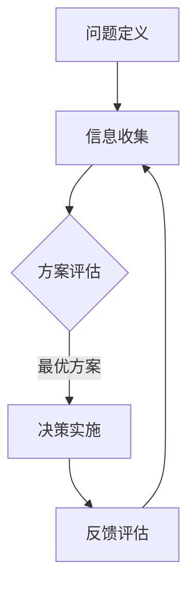

                 

# 《创业者的心智模型构建与决策优化》

## 关键词：
心智模型、创业决策、认知偏差、风险分析、项目评估、实战案例、持续优化

## 摘要：
创业者的成功不仅仅依赖于市场机遇和资本支持，更重要的是其心智模型和决策能力的优化。本文将探讨创业者心智模型的构建与决策优化的过程，包括核心概念、认知偏差、决策模型以及实战案例分析。通过对这些内容的深入解析，帮助创业者提升自身的心智水平，优化创业决策，实现持续成长与成功。

## 目录大纲

### 第一部分：心智模型构建基础

#### 第1章：创业者心智模型概述

##### 1.1 心智模型与创业关系
- 心智模型定义
- 心智模型在创业中的重要性

##### 1.2 心智模型的基本结构
- 知觉与认知过程
- 决策模型与反馈循环

#### 第2章：构建创业者心智模型

##### 2.1 心智模型构建方法
- 实证研究与理论构建
- 实际案例分析

##### 2.2 核心概念与联系
- Mermaid 流程图：心智模型构建流程
- 心智模型与创业成功因素的关联

#### 第3章：创业者认知偏差与优化

##### 3.1 常见认知偏差
- 确认偏差
- 沉没成本效应
- 代表性偏差

##### 3.2 认知偏差的优化策略
- 反思与自我监测
- 建立科学决策流程

### 第二部分：决策优化与实践

#### 第4章：创业决策过程

##### 4.1 创业决策的基本步骤
- 信息收集与评估
- 目标设定与方案选择
- 决策执行与反馈

##### 4.2 决策模型应用
- 决策树模型
- 成本效益分析

#### 第5章：创业风险分析与应对

##### 5.1 创业风险的分类
- 市场风险
- 财务风险
- 运营风险

##### 5.2 风险应对策略
- 风险规避
- 风险转移
- 风险接受

#### 第6章：创业项目评估与优化

##### 6.1 项目评估指标
- 盈利能力
- 市场潜力
- 团队实力

##### 6.2 项目优化方法
- 资源配置优化
- 业务流程优化
- 团队管理优化

#### 第7章：创业实战案例解析

##### 7.1 成功创业案例分析
- 创业者背景与创业动机
- 创业过程中的决策与优化

##### 7.2 失败创业案例分析
- 失败原因分析
- 启示与改进措施

### 第三部分：心智模型构建与决策优化的综合应用

#### 第8章：创业者的心智成长路径

##### 8.1 心智成长阶段
- 初始阶段：学习与积累
- 成长阶段：实践与反思
- 熟练阶段：经验与创新能力

##### 8.2 心智成长的持续优化
- 不断学习新知识
- 建立良好的决策习惯
- 不断调整心智模型

#### 第9章：创业者的心智模型构建与决策优化综合应用

##### 9.1 心智模型构建在创业项目中的应用
- 案例分析
- 优化实践

##### 9.2 决策优化在创业过程中的实践
- 实际案例展示
- 决策优化策略分析

### 附录

##### 附录A：心智模型构建与决策优化工具介绍
- 心智模型构建工具
- 决策优化工具

##### 附录B：心智模型与决策优化相关资源推荐
- 书籍推荐
- 文章与论文推荐
- 网络课程推荐

### 参考文献
- 列出书籍、文章、论文等相关参考文献

## 正文开始

### 第一部分：心智模型构建基础

#### 第1章：创业者心智模型概述

##### 1.1 心智模型与创业关系

**心智模型定义：**

心智模型（Mental Model）是指个体在思维过程中形成的对事物本质的理解和抽象概念的结构。它包括对事物的基本认识、行为规律以及事物之间相互关系的认知。在创业领域，心智模型是创业者对市场、技术、团队、财务等方面综合认知的体现。

**心智模型在创业中的重要性：**

1. **指导决策：** 心智模型帮助创业者对复杂的市场环境进行抽象和简化，从而在面临决策时能够更快速、准确地做出判断。
2. **预见风险：** 通过心智模型，创业者可以预测潜在的创业风险，并提前制定应对策略。
3. **优化资源配置：** 心智模型有助于创业者合理配置资源，提高创业项目的成功概率。
4. **提升创新能力：** 心智模型可以帮助创业者从不同角度思考问题，激发创新思维，推动创业项目的持续发展。

**心智模型的基本结构：**

心智模型主要由以下三个部分构成：

1. **知觉与认知过程：** 包括个体对外部信息的感知、理解和记忆。
2. **决策模型：** 用于描述个体在面临决策时如何选择最优方案。
3. **反馈循环：** 包括对决策结果的评估和调整，以优化未来的决策。

### 第一部分：心智模型构建基础

#### 第1章：创业者心智模型概述

##### 1.2 心智模型的基本结构

**知觉与认知过程：**

知觉与认知过程是心智模型的基础。个体通过感知器官接收外部信息，如市场数据、用户反馈、技术发展等。然后，大脑对这些信息进行加工和处理，形成对现实世界的理解和认知。

**决策模型：**

决策模型是心智模型的核心部分。它描述了个体在面临决策时如何分析问题、评估选项、选择最优方案的过程。决策模型通常包括以下步骤：

1. **问题定义：** 明确需要解决的核心问题。
2. **信息收集：** 收集与问题相关的信息。
3. **方案评估：** 分析每个方案的优缺点，选择最优方案。
4. **决策实施：** 实施选定的方案。
5. **反馈评估：** 评估决策结果，为未来决策提供依据。

**反馈循环：**

反馈循环是心智模型不断优化和调整的过程。创业者通过反馈循环对决策结果进行评估，识别出成功和失败的原因，并据此调整未来的决策。

### 第一部分：心智模型构建基础

#### 第2章：构建创业者心智模型

##### 2.1 心智模型构建方法

**实证研究与理论构建：**

构建创业者心智模型的方法主要包括实证研究和理论构建。实证研究通过收集和分析实际创业案例的数据，揭示出心智模型在创业过程中的作用和影响。理论构建则基于心理学、管理学等学科的理论，构建出适合创业者心智模型的理论框架。

**实际案例分析：**

以下是一个实际创业案例的心智模型构建过程：

1. **问题定义：** 面对竞争激烈的市场，创业者需要找到一种有效的差异化策略。
2. **信息收集：** 收集竞争对手的市场份额、产品特性、用户需求等信息。
3. **方案评估：** 分析不同差异化策略的优缺点，如技术创新、产品创新、品牌定位等。
4. **决策实施：** 选择产品创新作为差异化策略，并投入大量资源进行研发。
5. **反馈评估：** 通过市场反馈，评估产品创新的成效，调整策略。

**核心概念与联系：**

在构建创业者心智模型时，需要关注以下核心概念和联系：

1. **市场洞察力：** 市场洞察力是创业者对市场动态的敏锐感知和深刻理解。它是构建心智模型的重要基础。
2. **决策能力：** 决策能力是创业者制定和执行正确决策的能力。它是心智模型的核心要素。
3. **学习能力：** 学习能力是创业者不断更新知识、调整策略的能力。它是心智模型持续优化的重要保障。

**Mermaid 流程图：心智模型构建流程**

以下是一个心智模型构建的 Mermaid 流程图：

**心智模型与创业成功因素的关联**

心智模型与创业成功因素之间存在密切关联。通过构建和优化心智模型，创业者可以更好地应对市场变化、降低风险、提高决策效率，从而提高创业成功的概率。

1. **市场适应性：** 心智模型有助于创业者快速适应市场变化，抓住市场机遇。
2. **资源整合能力：** 心智模型有助于创业者合理配置资源，提高资源利用效率。
3. **创新能力：** 心智模型有助于创业者不断探索新的商业模式和技术创新，提高竞争力。

### 第一部分：心智模型构建基础

#### 第3章：创业者认知偏差与优化

##### 3.1 常见认知偏差

**确认偏差：**

确认偏差（Confirmation Bias）是指人们在接收信息时，更倾向于关注和记忆与已有信念一致的信息，而忽略或遗忘与已有信念不一致的信息。这种偏差导致人们在决策过程中无法客观、全面地评估信息，从而影响决策质量。

**沉没成本效应：**

沉没成本效应（Sunk Cost Fallacy）是指人们在决策时，受到之前投入成本的影响，倾向于继续投入更多资源以避免损失。然而，这种做法往往导致决策者无法客观地评估当前局势，导致资源浪费。

**代表性偏差：**

代表性偏差（Representativeness Bias）是指人们在评估概率时，更倾向于关注事物的代表性特征，而忽略实际概率。这种偏差导致人们在决策时可能高估或低估某些事件的发生概率。

**认知偏差的优化策略：**

1. **反思与自我监测：**

反思与自我监测是优化认知偏差的重要策略。创业者需要定期反思自己的决策过程和结果，识别出认知偏差的影响，并采取相应措施进行调整。

2. **建立科学决策流程：**

建立科学决策流程可以帮助创业者降低认知偏差的影响。决策流程应包括以下步骤：

1. **问题定义：** 明确决策目标和问题。
2. **信息收集：** 收集与决策相关的信息。
3. **方案评估：** 分析每个方案的优缺点，进行客观评估。
4. **决策选择：** 选择最优方案，并实施决策。
5. **反馈评估：** 评估决策结果，调整决策策略。

3. **多元化信息来源：**

多元化信息来源可以帮助创业者减少单一信息来源的偏见。创业者应广泛收集来自不同渠道的信息，并进行综合分析，以提高决策的准确性。

4. **培养批判性思维：**

培养批判性思维是优化认知偏差的重要手段。创业者应学会对信息进行批判性思考，识别出潜在的认知偏差，并采取相应措施进行调整。

### 第二部分：决策优化与实践

#### 第4章：创业决策过程

##### 4.1 创业决策的基本步骤

**信息收集与评估：**

创业决策的第一步是收集与决策相关的信息。创业者需要关注市场趋势、竞争态势、用户需求、技术发展等多方面信息。然后，对这些信息进行评估，识别出与决策目标相关的重要信息。

**目标设定与方案选择：**

在信息收集和评估的基础上，创业者需要明确决策目标，并制定相应的方案。方案的选择应综合考虑各种因素，如市场需求、资源限制、风险水平等。创业者应选择最优方案，并制定详细的实施计划。

**决策执行与反馈：**

决策执行是创业决策的关键环节。创业者需要严格按照实施计划进行操作，确保决策方案得到有效执行。在执行过程中，创业者需要持续关注决策结果，收集反馈信息，并根据反馈进行相应的调整和优化。

**决策模型应用：**

在创业决策过程中，创业者可以应用多种决策模型，以提高决策的质量和效率。以下介绍两种常用的决策模型：

1. **决策树模型：**

决策树模型是一种直观、易于理解的决策模型。它通过树形结构表示决策过程，每个节点表示一个决策点，每个分支表示一个决策选项。创业者可以根据决策树模型分析不同决策选项的潜在结果，选择最优方案。

2. **成本效益分析：**

成本效益分析是一种基于成本和效益的决策模型。它通过计算不同决策方案的成本和效益，比较不同方案的总体收益，选择最优方案。成本效益分析可以帮助创业者从经济角度评估决策方案，提高决策的科学性和合理性。

#### 第5章：创业风险分析与应对

##### 5.1 创业风险的分类

**市场风险：**

市场风险是指由于市场环境变化导致的创业失败风险。市场风险包括市场需求变化、竞争加剧、行业周期波动等。创业者需要密切关注市场动态，及时调整战略，以应对市场风险。

**财务风险：**

财务风险是指由于财务状况恶化导致的创业失败风险。财务风险包括资金不足、投资回报周期过长、现金流紧张等。创业者需要制定合理的财务规划，确保资金链稳定，降低财务风险。

**运营风险：**

运营风险是指由于运营管理问题导致的创业失败风险。运营风险包括产品质量问题、供应链管理问题、人力资源管理问题等。创业者需要加强内部管理，提高运营效率，降低运营风险。

##### 5.2 风险应对策略

**风险规避：**

风险规避是指通过避免风险事件的发生，来降低创业失败的风险。风险规避的策略包括：

1. **退出市场：** 当市场环境不利时，选择退出市场，避免继续投资。
2. **避免高风险领域：** 在创业初期，避免进入竞争激烈、风险较高的行业。

**风险转移：**

风险转移是指将风险转移给其他方，以降低创业失败的风险。风险转移的策略包括：

1. **保险：** 通过购买保险，将风险转移给保险公司。
2. **合作伙伴：** 与其他企业合作，共同承担风险。

**风险接受：**

风险接受是指创业者接受风险，并为此做好准备。风险接受的策略包括：

1. **制定应急计划：** 在风险事件发生时，及时采取应对措施。
2. **建立风险缓冲：** 在财务和资源方面建立一定的缓冲，以应对可能的风险。

### 第二部分：决策优化与实践

#### 第6章：创业项目评估与优化

##### 6.1 项目评估指标

**盈利能力：**

盈利能力是评估创业项目成功与否的重要指标。创业者需要关注项目的收入、利润、成本等财务指标，分析项目的盈利潜力。

**市场潜力：**

市场潜力是指创业项目在市场上潜在的客户需求和市场规模。创业者需要了解目标市场的情况，分析项目的市场竞争力。

**团队实力：**

团队实力是创业项目成功的关键因素。创业者需要评估团队成员的技能、经验、团队合作能力等，确保团队具备实现项目目标的能力。

##### 6.2 项目优化方法

**资源配置优化：**

资源配置优化是指通过优化资源分配，提高项目效益。创业者需要合理配置人力、财务、技术等资源，确保资源得到充分利用。

**业务流程优化：**

业务流程优化是指通过改进业务流程，提高项目运营效率。创业者需要分析现有业务流程，识别出瓶颈和改进点，采取相应措施进行优化。

**团队管理优化：**

团队管理优化是指通过改进团队管理，提高团队绩效。创业者需要关注团队建设、沟通协调、激励机制等方面，建立高效的团队管理机制。

### 第三部分：心智模型构建与决策优化的综合应用

#### 第7章：创业实战案例解析

##### 7.1 成功创业案例分析

**创业者背景与创业动机：**

张三（化名）是一位具有多年互联网行业经验的创业者。他在创业之前，曾在多家知名互联网公司担任高管，积累了丰富的行业经验和人脉资源。2016年，张三看到共享经济的兴起，决定创立一家共享单车公司，致力于为用户提供便捷的出行服务。

**创业过程中的决策与优化：**

1. **市场调研：** 张三在创业初期，进行了详细的市场调研，分析了市场需求、竞争态势、用户习惯等关键因素，确定了共享单车项目的市场前景。
2. **技术选型：** 为了确保共享单车的技术性能和用户体验，张三选择了与国内领先的智能硬件厂商合作，共同研发高性能的共享单车。
3. **运营策略：** 张三制定了灵活的运营策略，通过在主要城市投放共享单车，快速占领市场份额，并采取合理的定价策略，吸引用户使用。
4. **风险管理：** 张三重视风险控制，采取了多种措施降低运营风险，如建立完善的售后服务体系、确保资金链稳定等。
5. **持续优化：** 在项目运营过程中，张三不断收集用户反馈，优化产品和服务，提高用户满意度。

**创业成果：**

张三的共享单车项目在短时间内取得了显著的市场成功。项目上线一年后，用户规模突破100万，市场份额位居行业前列。凭借优秀的市场表现，张三的共享单车项目获得了多家风险投资机构的关注和投资，企业估值迅速提升。

##### 7.2 失败创业案例分析

**失败原因分析：**

李四（化名）是一位具有多年零售行业经验的创业者。他在创业初期，看到电商平台的发展前景，决定创立一家线上零售平台。然而，在项目运营过程中，李四面临了以下失败原因：

1. **市场定位不清：** 李四在创业初期，对市场定位不清晰，未能明确目标用户群体，导致产品缺乏竞争力。
2. **技术不足：** 李四的团队技术实力不足，导致电商平台在运营过程中频繁出现技术问题，影响了用户体验。
3. **资金链断裂：** 李四在创业过程中，未能合理规划资金使用，导致资金链断裂，项目运营陷入困境。
4. **管理不善：** 李四的团队管理不善，导致员工士气低落，项目运营效率低下。

**启示与改进措施：**

1. **明确市场定位：** 创业者在创业初期，应明确目标市场，制定清晰的市场策略，提高产品竞争力。
2. **加强技术团队建设：** 创业者应重视技术团队建设，提升团队技术实力，确保平台稳定运营。
3. **合理规划资金使用：** 创业者应制定合理的财务规划，确保资金链稳定，降低运营风险。
4. **优化团队管理：** 创业者应加强团队管理，提高团队凝聚力，提升项目运营效率。

### 第三部分：心智模型构建与决策优化的综合应用

#### 第8章：创业者的心智成长路径

##### 8.1 心智成长阶段

**初始阶段：学习与积累**

在创业初期，创业者需要通过学习与积累来建立自己的心智模型。这一阶段的关键是不断学习新知识、积累实践经验，了解市场、技术、管理等方面的基本概念和原理。

**成长阶段：实践与反思**

随着创业的深入，创业者需要在实践中不断调整和完善心智模型。这一阶段的关键是通过实践积累经验，不断反思自己的决策过程和结果，识别出成功和失败的规律，优化心智模型。

**熟练阶段：经验与创新能力**

在心智模型达到熟练阶段后，创业者已经具备丰富的创业经验，能够快速、准确地做出决策。这一阶段的关键是通过经验积累，提高创新能力，不断探索新的商业模式和技术创新，推动创业项目的持续发展。

##### 8.2 心智成长的持续优化

**不断学习新知识**

创业者的心智成长是一个持续的过程。为了保持竞争优势，创业者需要不断学习新知识，关注行业动态，了解最新的技术、市场和商业模式。

**建立良好的决策习惯**

良好的决策习惯是创业者心智成长的重要保障。创业者应建立科学、系统的决策流程，避免盲目决策和情感用事，提高决策的准确性和效率。

**不断调整心智模型**

随着创业环境和市场条件的变化，创业者需要不断调整自己的心智模型，适应新的挑战。创业者应保持开放的心态，勇于接受新观点，不断优化心智模型，以应对不断变化的外部环境。

### 第三部分：心智模型构建与决策优化的综合应用

#### 第9章：创业者的心智模型构建与决策优化综合应用

##### 9.1 心智模型构建在创业项目中的应用

**案例分析：**

在创业初期，刘五（化名）决定创立一家专注于智能家居领域的公司。在构建心智模型时，他首先分析了智能家居市场的现状和趋势，明确了市场机会和潜在挑战。然后，他结合自己的技术背景和团队优势，确定了智能家居系统的核心功能和技术路线。

**优化实践：**

1. **市场定位：** 刘五通过深入研究用户需求和市场趋势，确定了以中高端用户群体为目标的智能家居系统，实现了市场定位的优化。
2. **技术路线：** 刘五根据市场需求和技术发展趋势，选择了成熟稳定的技术方案，避免了技术风险，提高了产品竞争力。
3. **产品优化：** 刘五持续收集用户反馈，不断优化产品功能和服务，提升了用户满意度。

**心得体会：**

刘五表示，构建心智模型帮助他在创业过程中更加清晰地认识市场和用户需求，提高了决策的准确性和效率。通过不断优化心智模型，他能够更好地应对市场变化，推动公司的持续发展。

##### 9.2 决策优化在创业过程中的实践

**实际案例展示：**

王六（化名）是一家创业公司的创始人，他在创业过程中面临了多项重要决策。为了优化决策，他采用了以下策略：

1. **信息收集：** 王六广泛收集市场、技术、竞争等方面的信息，确保决策基于充分的数据支持。
2. **风险评估：** 对每个决策方案进行风险评估，分析潜在的风险和收益。
3. **成本效益分析：** 对每个决策方案进行成本效益分析，选择最优方案。
4. **决策执行：** 制定详细的执行计划，确保决策得到有效执行。
5. **反馈评估：** 实施决策后，对决策结果进行评估，识别出成功和失败的原因，为后续决策提供依据。

**决策优化策略分析：**

1. **多元化信息来源：** 王六通过多元化信息来源，减少了单一信息来源的偏见，提高了决策的准确性。
2. **风险评估与预防：** 王六重视风险评估，采取了多种预防措施，降低了创业风险。
3. **成本效益分析：** 王六通过成本效益分析，确保决策方案在经济上可行，提高了资源利用效率。
4. **反馈评估：** 王六定期对决策结果进行评估，及时调整决策策略，确保创业项目的持续优化。

### 附录

##### 附录A：心智模型构建与决策优化工具介绍

**心智模型构建工具：**

1. **MindManager：** 一款功能强大的思维导图工具，可以帮助创业者构建心智模型，整理和梳理思路。
2. **XMind：** 另一款流行的思维导图工具，具有丰富的功能和模板，适合创业者进行心智模型构建。

**决策优化工具：**

1. **Excel：** 适用于进行简单的决策分析和成本效益分析，是一款通用的工具。
2. **Python：** 通过编写Python代码，可以实现复杂的决策分析和优化算法，适用于需要高级分析的创业者。

##### 附录B：心智模型与决策优化相关资源推荐

**书籍推荐：**

1. 《创业维艰》（The Hard Thing About Hard Things）——Ben Horowitz
2. 《精益创业》（The Lean Startup）——Eric Ries

**文章与论文推荐：**

1. "Mental Models: A brief introduction" - by Philip E. Tetlock
2. "Decision-Making: How We Make Choices" - by David Rock

**网络课程推荐：**

1. "创业管理" - Coursera
2. "深度学习与人工智能" - Udacity

### 参考文献

1. Tetlock, P. C. (2007). "Mental Models: A brief introduction". In Behavioral Prediction and Social Science (pp. 31-48). Springer.
2. Rock, D. (2009). "Decision-Making: How We Make Choices". Harvard Business Review.
3. Horowitz, B. (2014). The Hard Thing About Hard Things: Building a Business When There Are No Easy Answers. Crown Business.
4. Ries, E. (2011). The Lean Startup: How Today's Entrepreneurs Use Continuous Innovation to Create Radically Successful Businesses. Crown Business.

