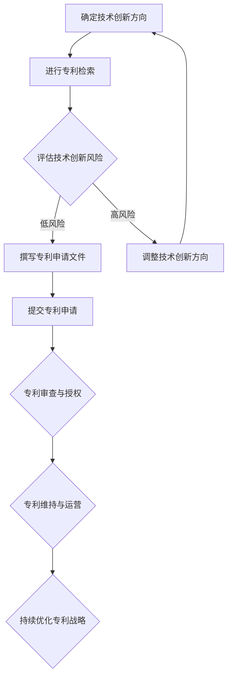

                 

### 引言与背景

创业，这是一场充满挑战和机遇的冒险。对于创业者来说，技术创新是推动企业发展的核心动力，而专利战略则是保护这一核心动力的重要手段。在这场创新与竞争的游戏中，专利战略不仅能够为企业的技术创新提供坚实的法律保障，还能在市场竞争中发挥关键作用。

#### 创业的挑战与机遇

创业的道路充满了未知和不确定性。初创企业在市场竞争中常常面临资金不足、技术不成熟、市场接受度低等问题。同时，创业者还需要面对激烈的竞争，从同行业中脱颖而出。然而，正是这些挑战，也为创业者提供了巨大的机遇。通过技术创新，企业可以开发出独特的产品或服务，满足市场的需求，从而获得竞争优势。

#### 技术创新的重要性

技术创新是创业成功的基石。在当今科技飞速发展的时代，市场环境瞬息万变，只有不断创新，才能保持竞争力。技术创新不仅能够为企业带来直接的经济效益，还能够提升企业的品牌价值和市场地位。因此，技术创新在创业过程中具有至关重要的地位。

#### 专利战略的基本概念

专利战略是指企业在技术创新过程中，通过申请、保护、运营专利来保护自身利益的一系列策略和方法。专利战略的目的是确保企业的技术优势得以长期保持，同时防止竞争对手模仿或侵权。专利战略不仅包括专利申请，还包括专利布局、专利运营和专利维权等多个方面。

#### 专利战略在创业中的角色

在创业过程中，专利战略扮演着多重角色。首先，专利战略能够保护企业的技术创新成果，防止竞争对手模仿或侵权。其次，专利战略还可以提升企业的市场地位和品牌价值。通过有效的专利布局，企业能够在市场上形成专利壁垒，从而获得竞争优势。此外，专利战略还可以帮助企业吸引投资，提升企业的估值。

总的来说，专利战略是创业企业成功路上不可或缺的一部分。通过合理的专利战略，企业不仅可以保护自身的创新成果，还可以在激烈的市场竞争中立于不败之地。因此，对于创业者来说，了解和运用专利战略具有重要意义。

### 专利基础知识

在探讨创业中的专利战略之前，我们首先需要了解一些基本的专利知识。专利是一种法律保护，用于保护发明人的创新成果。通过专利，发明人可以获得独占权，防止他人未经许可使用其发明。以下是关于专利类型、申请流程、申请策略和检索技巧的详细讲解。

#### 专利的类型与分类

专利主要分为三种类型：发明专利、实用新型专利和外观设计专利。

1. **发明专利**：发明专利是指对产品、方法或其改进所提出的新的技术方案。发明专利的保护范围较广，通常涵盖核心技术。发明专利的申请周期较长，但一旦获得授权，保护期限也较长，一般为20年。

2. **实用新型专利**：实用新型专利是指对产品的形状、构造或其结合所提出的适于实用的新的技术方案。实用新型专利的保护范围较窄，但申请周期较短，保护期限为10年。

3. **外观设计专利**：外观设计专利是指对产品的形状、图案、色彩或其结合所提出的富有美感并适于工业应用的新设计。外观设计专利的保护期限通常为15年。

#### 专利申请流程

专利申请流程通常包括以下几个步骤：

1. **前期准备**：在正式申请前，需要进行技术调研，确保所申请的技术方案具有新颖性、创造性和实用性。

2. **撰写申请文件**：申请文件包括专利说明书、权利要求书、摘要等。这些文件需要详细描述发明内容，并明确保护范围。

3. **提交申请**：将申请文件提交至国家知识产权局进行审查。

4. **初步审查**：国家知识产权局对申请文件进行形式审查，确保符合法定要求。

5. **实质审查**：对于发明专利，需要进行实质审查，判断其是否具有新颖性、创造性和实用性。

6. **授权和维持**：通过审查后，专利将获得授权。此后，企业需要按照规定缴纳年费，以维持专利的有效性。

#### 专利申请策略

专利申请策略对于企业至关重要。以下是一些常用的专利申请策略：

1. **提前布局**：在技术创新初期，企业应该提前进行专利布局，确保关键技术得到保护。

2. **分阶段申请**：可以将关键技术拆分为多个阶段进行申请，以延长保护期限。

3. **交叉申请**：在不同国家和地区进行专利申请，以防止竞争对手在全球范围内抄袭。

4. **避免过度保护**：专利申请应避免过于宽泛，以免影响后续的技术创新。

5. **公开披露**：在申请专利前，可以通过公开披露来建立先占权，防止他人抢先申请。

#### 专利检索技巧

专利检索是专利申请的重要环节。以下是一些常用的专利检索技巧：

1. **关键词检索**：根据发明主题选择合适的关键词进行检索。

2. **分类号检索**：利用国际专利分类号进行检索，可以更精准地找到相关专利。

3. **同族专利检索**：查找同一发明在不同国家和地区的专利，以了解其全球布局情况。

4. **引证检索**：通过查找专利的引证关系，可以了解相关技术的演变和发展趋势。

通过了解专利的基础知识，企业可以更好地制定专利战略，保护自身的技术创新成果。在下一章中，我们将进一步探讨如何通过专利分析和策略来提升企业在市场中的竞争力。

### 专利分析与策略

在掌握了专利基础知识之后，我们接下来要深入探讨如何通过专利分析来制定有效的专利策略。专利分析是企业制定专利战略的重要工具，它能够帮助企业了解市场动态、竞争对手的专利布局，以及技术发展趋势。以下是关于市场调研与竞争对手分析、技术趋势分析与预测、专利布局与保护策略、以及专利运营策略的详细讲解。

#### 市场调研与竞争对手分析

市场调研是专利分析的基础工作。通过市场调研，企业可以了解市场需求、技术趋势、竞争对手的动向等信息。以下是一些关键步骤：

1. **市场需求分析**：了解市场上对某一技术或产品的需求，确定技术创新的方向。

2. **竞争对手分析**：识别主要竞争对手及其专利布局，分析其技术优势和劣势。

3. **竞争产品分析**：分析竞争对手的产品特点、技术实现方式，以及其潜在的侵权风险。

4. **市场定位分析**：根据市场需求和竞争对手分析，确定自身产品的市场定位和竞争优势。

通过市场调研与竞争对手分析，企业可以明确自身的技术创新方向，并制定相应的专利申请策略。

#### 技术趋势分析与预测

技术趋势分析是预测未来技术发展方向的重要手段。通过技术趋势分析，企业可以提前布局关键技术，抢占市场先机。以下是一些常用方法：

1. **文献调研**：通过查阅技术文献、专利文件、技术报告等，了解当前技术的最新进展和未来趋势。

2. **数据分析**：利用数据挖掘技术，分析专利申请数量、专利引证关系、专利地域分布等数据，发现技术热点和发展方向。

3. **专家咨询**：邀请技术专家进行研讨，获取对技术趋势的前瞻性判断。

4. **技术路线图**：绘制技术路线图，明确关键技术的发展路径和可能的技术突破点。

通过技术趋势分析与预测，企业可以提前布局关键技术，确保在未来的市场竞争中占据优势。

#### 专利布局与保护策略

专利布局是保护技术创新成果的关键。通过合理的专利布局，企业可以形成专利壁垒，防止竞争对手模仿或侵权。以下是一些关键策略：

1. **地域布局**：根据市场需求和竞争对手的专利布局，在不同国家和地区申请专利，形成全球性专利网络。

2. **技术布局**：对关键技术进行多层次、多维度的专利保护，确保技术的全面覆盖。

3. **时间布局**：合理安排专利申请时间，确保专利在关键时间节点获得授权。

4. **组合布局**：结合不同类型的专利（如发明专利、实用新型专利和外观设计专利），形成多元化的专利组合。

5. **交叉许可**：与其他企业进行专利交叉许可，实现技术共享，降低侵权风险。

通过合理的专利布局，企业可以形成坚实的专利壁垒，确保技术创新成果得到有效保护。

#### 专利运营策略

专利运营是企业实现专利价值的重要手段。以下是一些常用的专利运营策略：

1. **专利交易**：通过专利转让、许可等方式，实现专利的商业化运作。

2. **专利联盟**：与其他企业建立专利联盟，共享专利资源，降低研发成本。

3. **专利池建设**：构建专利池，提高专利的整体价值。

4. **专利风险防控**：通过专利预警、侵权监测等方式，防范潜在的专利风险。

5. **专利布局优化**：根据市场和技术发展趋势，对专利布局进行持续优化。

通过有效的专利运营，企业可以充分发挥专利的价值，实现技术创新的商业化运作。

总之，通过专利分析，企业可以深入了解市场动态、技术趋势和竞争对手，制定出科学的专利策略。这不仅能够保护企业的技术创新成果，还能在市场竞争中占据优势地位。在下一章中，我们将进一步探讨专利战略在创业中的应用，为企业提供实用的专利战略指导。

### 创业企业的专利布局

在创业过程中，专利布局是企业保护技术创新成果、提升市场竞争力的关键。合理的专利布局不仅可以为企业提供坚实的法律保障，还能在市场上形成专利壁垒，防止竞争对手的模仿和侵权。以下是关于创业企业专利布局原则、策略、案例分析以及效果评估的详细讲解。

#### 专利布局原则

1. **全面覆盖原则**：专利布局应全面覆盖企业的核心技术，确保技术的各个细节都得到保护。

2. **优先布局原则**：对于关键技术和市场前景看好的技术，应优先进行专利布局，确保在市场竞争中占据先机。

3. **地域布局原则**：根据企业的市场战略，在全球范围内进行专利布局，形成全球性专利网络。

4. **多样性布局原则**：结合不同类型的专利（如发明专利、实用新型专利和外观设计专利），形成多元化的专利组合。

5. **动态调整原则**：根据市场和技术的发展趋势，对专利布局进行持续调整和优化。

#### 专利布局策略

1. **早期布局策略**：在技术创新的早期阶段，企业应提前进行专利布局，确保核心技术得到保护。这可以通过提前申请专利或公开披露来实现。

2. **多层次布局策略**：对核心技术进行多层次、多维度的专利保护，包括技术方案、实施例和改进方案等，确保专利的全面性。

3. **交叉布局策略**：在不同国家和地区进行专利申请，形成全球性专利布局，降低竞争对手在特定市场的侵权风险。

4. **合作布局策略**：与其他企业或研究机构建立合作关系，共同进行专利布局，实现技术共享和风险分担。

5. **衍生布局策略**：在核心技术的基础上，衍生出新的技术方案和产品，并进行专利布局，扩大专利保护范围。

#### 案例分析

以下是一个创业企业专利布局的案例分析：

**案例背景**：某创业公司致力于开发一款智能健康管理系统，该系统通过大数据分析和人工智能技术，提供个性化的健康建议。

**专利布局**：
1. **核心技术研发**：公司首先进行核心技术研发，包括大数据处理算法、人工智能模型和用户健康数据分析方法等。

2. **早期布局**：在技术研发初期，公司提交了第一份专利申请，保护核心技术。

3. **多层次布局**：随着技术的逐步完善，公司进一步提交了多个专利申请，包括改进算法、具体实现方法和产品结构等。

4. **国际布局**：公司还在多个国家和地区申请了专利，形成了全球性专利网络。

5. **合作布局**：公司与其他研究机构和医疗机构合作，共同开发新的技术方案，并共同申请专利。

**效果评估**：
1. **法律保护**：通过全面而有效的专利布局，公司的核心技术创新成果得到了法律保护，防止了竞争对手的模仿和侵权。

2. **市场竞争力**：公司的专利壁垒使其在市场上形成了竞争优势，提高了产品的市场认可度和用户信任度。

3. **商业价值**：专利布局不仅提升了公司的技术价值，还为公司的产品定价提供了谈判的筹码，增强了公司的商业竞争力。

#### 创业企业专利布局效果评估

评估创业企业专利布局的效果，可以从以下几个方面进行：

1. **专利数量**：专利数量是衡量专利布局效果的一个重要指标。通过分析专利数量，可以了解企业在特定技术领域的专利积累情况。

2. **专利质量**：专利质量是衡量专利布局效果的另一个重要指标。高质量专利具有较强的法律保护效果和商业价值。

3. **市场表现**：通过分析专利布局对企业市场表现的影响，可以评估专利布局的实际效果。市场表现包括市场份额、销售收入、用户满意度等。

4. **法律纠纷**：分析企业在专利维权过程中胜诉的比例，可以评估专利布局的法律保护效果。

总之，合理的专利布局对创业企业具有重要意义。通过科学的专利布局原则和策略，企业可以有效地保护技术创新成果，提升市场竞争力和商业价值。在下一章中，我们将进一步探讨专利风险管理与应对策略，帮助创业企业应对潜在的专利风险。

### 专利风险管理与应对策略

在创业过程中，专利风险管理是确保企业技术优势和市场地位的重要环节。由于技术创新过程中不可避免地会面临各种专利风险，包括专利侵权、专利被侵权、以及专利诉讼等，因此，企业必须建立健全的专利风险管理体系，并制定有效的应对策略。以下是关于专利风险的识别与评估、专利纠纷应对策略、专利诉讼案例分析以及专利维权策略的详细讲解。

#### 专利风险的识别与评估

1. **风险识别**：
   - **内部风险**：包括技术创新过程中的保密不足、专利申请不及时、专利权维护不力等。
   - **外部风险**：包括竞争对手的专利侵权行为、市场上的潜在侵权产品、法律环境的变化等。

2. **风险评估**：
   - **技术风险评估**：评估技术创新过程中可能涉及的专利风险，包括技术方案是否创新、是否可能侵权等。
   - **市场风险评估**：评估市场上的专利布局情况，识别可能存在的侵权风险和市场竞争对手的专利策略。
   - **法律风险评估**：分析当前的法律环境，评估专利法律风险，包括专利申请和维权的法律依据。

3. **风险分级**：根据风险评估结果，对专利风险进行分级管理，确保企业能够优先应对高优先级的专利风险。

#### 专利纠纷应对策略

1. **预防策略**：
   - **专利检索**：在产品开发和市场推广前，进行全面的专利检索，避免侵犯他人的专利权。
   - **法律咨询**：在技术创新和专利申请过程中，寻求专业法律咨询，确保专利的有效性和合法性。

2. **应对策略**：
   - **调解**：在专利纠纷发生时，首先尝试通过调解解决争议，避免诉讼带来的高昂成本和时间浪费。
   - **诉讼**：当调解无法解决问题时，企业可以考虑通过法律诉讼来维护自身的合法权益。

3. **应对措施**：
   - **专利防御**：通过申请反诉专利，形成专利壁垒，防止对方专利的侵权指控。
   - **技术改造**：在专利侵权指控成立的情况下，通过技术改造来规避侵权，或寻找替代方案。

#### 专利诉讼案例分析

以下是一个专利诉讼的案例分析：

**案例背景**：某创业公司开发了一款智能硬件产品，但在市场推广过程中被竞争对手指控侵犯了对方的专利权。

**案件经过**：
- **第一阶段**：竞争对手向法院提起诉讼，要求创业公司停止侵权行为并赔偿损失。
- **第二阶段**：创业公司在诉讼过程中进行了详细的专利检索和分析，发现竞争对手的专利存在缺陷。
- **第三阶段**：创业公司提出反诉，指控竞争对手专利无效，并通过技术改造规避侵权。

**结果**：经过长时间的法律诉讼，法院最终驳回了竞争对手的诉讼请求，并支持了创业公司的反诉，使创业公司免受了巨额赔偿的风险。

#### 专利维权策略

1. **专利预警**：建立专利预警机制，定期监测市场上的专利动态，及时发现潜在的侵权风险。

2. **专利监控**：通过专利监控系统，跟踪竞争对手的专利申请和布局，了解市场趋势。

3. **专利维权**：
   - **法律维权**：在发现专利侵权行为时，及时通过法律手段维权，包括提起诉讼、申请禁令等。
   - **非法律维权**：通过谈判、和解等方式解决侵权争议，降低法律诉讼的成本。

4. **专利储备**：建立专利储备库，储备一定数量的专利，以备在市场竞争中形成专利壁垒。

通过有效的专利风险管理和应对策略，创业企业可以最大限度地降低专利风险，保护自身的技术优势和市场地位。在下一章中，我们将探讨专利战略对创业成功的影响，以及成功创业企业的专利战略实践。

### 专利战略与创业成功

专利战略在创业成功中扮演着至关重要的角色。一个完善的专利战略不仅能够为企业提供技术创新的保护盾，还能在市场竞争中创造巨大的价值。以下是关于专利战略对创业成功的影响、成功创业企业的专利战略实践、以及创业企业专利战略的持续优化和未来趋势的详细探讨。

#### 专利战略对创业成功的影响

1. **技术保护**：专利战略能够有效保护企业的技术创新，防止竞争对手的模仿和侵权，确保企业在市场上的竞争优势。

2. **市场拓展**：通过专利布局，企业能够在全球范围内建立专利壁垒，扩大市场份额，提高品牌影响力。

3. **融资能力**：拥有高质量的专利组合，能够提升企业的融资能力，吸引投资者的关注，从而获得更多的资金支持。

4. **商业价值**：专利战略能够提升企业的技术价值和商业价值，为企业带来直接的经济收益。

5. **品牌塑造**：专利战略有助于企业树立技术领先者的品牌形象，增强消费者的信任和忠诚度。

#### 成功创业企业的专利战略实践

以下是一些成功创业企业在专利战略方面的实践：

**案例一：苹果公司**

- **早期布局**：苹果公司在技术创新的早期阶段就进行专利布局，确保核心技术的保护。
- **多样化保护**：苹果公司不仅申请发明专利，还申请了实用新型专利和外观设计专利，形成全面的专利保护。
- **全球布局**：苹果公司在全球范围内进行专利申请，建立了强大的专利网络。
- **合作与收购**：苹果公司通过与其他企业合作和收购，不断扩充专利储备，增强技术实力。

**案例二：特斯拉公司**

- **专利储备**：特斯拉公司建立了庞大的专利储备库，涵盖了电动汽车的核心技术。
- **防御策略**：特斯拉公司通过积极的专利防御策略，应对竞争对手的专利诉讼，确保市场份额。
- **开放合作**：特斯拉公司积极推动专利开放，与其他企业共享技术，降低研发成本。

#### 创业企业专利战略的持续优化

1. **动态调整**：创业企业需要根据市场和技术的发展趋势，持续调整专利战略，确保专利布局的及时性和有效性。

2. **技术创新**：持续进行技术创新，保持技术领先地位，为专利战略提供持续的基础。

3. **法律培训**：加强员工的法律培训，提高对企业专利战略的理解和执行力。

4. **外部合作**：与专业机构、高校和研究机构建立合作关系，共同进行专利研究和布局。

#### 专利战略的未来趋势

1. **专利联盟**：随着全球专利竞争的加剧，专利联盟将成为企业保护自身利益、降低侵权风险的重要手段。

2. **人工智能**：人工智能技术在专利分析和布局中的应用，将进一步提升专利战略的效率和精准度。

3. **专利标准化**：专利标准化将有助于企业更好地整合和利用专利资源，提升专利组合的整体价值。

4. **国际协作**：在全球化的背景下，企业将更加注重国际协作，通过跨国合作和共享专利，提升全球竞争力。

总之，专利战略是创业企业成功的重要因素。通过合理的专利布局、有效的专利管理和持续的战略优化，企业可以最大限度地保护技术创新成果，提升市场竞争力，实现创业成功。在下一章中，我们将提供专利法律法规与政策、专利数据库与工具、专利分析方法以及专利战略相关文献推荐，为创业者提供全面的专利战略指导。

### 附录

在创业过程中，掌握专利法律法规、利用专利数据库和工具、以及掌握专利分析方法，对于制定和实施有效的专利战略至关重要。以下是关于专利法律法规与政策、专利数据库与工具、专利分析方法以及专利战略相关文献推荐的详细说明。

#### 专利法律法规与政策

1. **《中华人民共和国专利法》**：这是我国关于专利的基本法律，规定了专利的申请、审查、授权、无效、侵权诉讼等程序。

2. **《专利审查指南》**：这是国家知识产权局发布的关于专利申请和审查的具体操作指南，为企业提供了详细的申请和审查标准。

3. **政策文件**：国家和地方政府会发布各种政策文件，如高新技术企业优惠政策、专利奖励政策等，为企业提供政策支持。

#### 专利数据库与工具

1. **国家知识产权局专利检索数据库**：这是我国最大的专利数据库，提供全面的专利检索服务。

2. **Google Patents**：这是谷歌提供的全球最大的专利数据库之一，收录了全球多个国家的专利信息。

3. **Patent Explorer**：这是IBM提供的专利分析工具，可以帮助企业进行专利分析、监控和布局。

4. **PatSnap**：这是一个专业的专利数据库和分析工具，提供全面的专利情报服务。

#### 专利分析方法

1. **技术分析方法**：通过分析专利的技术内容，了解技术的创新点和应用领域。

2. **法律分析方法**：通过分析专利的法律状态，判断专利的有效性和稳定性。

3. **市场分析方法**：通过分析市场上的专利布局，了解竞争对手的专利策略和市场动向。

4. **趋势分析方法**：通过分析专利申请和授权数据，预测技术发展趋势和市场前景。

#### 专利战略相关文献推荐

1. **《专利战略管理》**：李明华 著，详细介绍了专利战略的制定、实施和评估方法。

2. **《专利运营实战》**：王勇 著，讲述了专利交易、许可、维权等运营策略。

3. **《专利分析与布局》**：陈昊 著，提供了专利分析的方法和案例分析。

4. **《专利诉讼实务》**：张强 著，介绍了专利诉讼的实务操作和案例分析。

通过这些法律法规、数据库和工具，以及相关文献的学习和实践，创业者可以更好地理解和运用专利战略，为企业的技术创新和市场竞争力提供坚实的支持。

### 附录A：专利战略流程图与伪代码

在制定和实施专利战略的过程中，流程图和伪代码是帮助创业者理清思路、明确步骤的重要工具。以下是一个专利战略流程图，以及关于技术创新与专利保护、专利布局与保护策略、以及专利风险管理与应对策略的伪代码示例。

#### 附录A.1 专利战略流程图



#### 附录A.2 技术创新与专利保护的伪代码

```python
def innovation_and_patent_protection(technological_innovation):
    # 初始化专利保护状态
    patent_protection = False
    
    # 进行专利检索，评估技术创新风险
    risk_level = patent_search(technological_innovation)
    
    if risk_level == 'low':
        # 撰写专利申请文件
        patent_application = create_patent_application(technological_innovation)
        
        # 提交专利申请
        patent_id = submit_patent_application(patent_application)
        
        # 专利审查与授权
        if patent_review(patent_id):
            # 更新专利保护状态
            patent_protection = True
            print("专利申请成功，技术创新得到保护。")
        else:
            print("专利申请未通过，需重新评估技术创新方向。")
    else:
        print("技术创新存在高风险，需调整方向或增加保护措施。")
        
    return patent_protection
```

#### 附录A.3 专利布局与保护策略的伪代码

```python
def patent_layout_and_protection(technological_innovation, market_environment):
    # 初始化专利布局状态
    patent_layout = False
    
    # 分析市场环境和竞争对手
    market_analyze_result = market_analysis(market_environment)
    
    if market_analyze_result['opportunity'] > 0:
        # 根据市场环境进行专利布局
        patent_application_list = create_patent_layout(technological_innovation, market_analyze_result)
        
        # 提交专利申请
        for patent_application in patent_application_list:
            patent_id = submit_patent_application(patent_application)
            
            # 专利审查与授权
            if patent_review(patent_id):
                # 更新专利布局状态
                patent_layout = True
                print("专利布局成功，技术创新得到有效保护。")
            else:
                print("专利申请未通过，需调整布局策略。")
    else:
        print("市场环境不利于专利布局，需重新评估。")
        
    return patent_layout
```

#### 附录A.4 专利风险管理与应对策略的伪代码

```python
def patent_risk_management_and_response(technological_innovation):
    # 初始化风险状态
    risk_state = 'unknown'
    
    # 进行专利风险评估
    risk_level = patent_risk_evaluation(technological_innovation)
    
    if risk_level == 'low':
        risk_state = 'controlled'
        print("专利风险处于可控状态。")
    elif risk_level == 'medium':
        risk_state = 'alert'
        print("专利风险处于预警状态，需采取应对措施。")
    else:
        risk_state = 'high'
        print("专利风险处于高位，需立即采取应对措施。")
        
    # 根据风险状态采取应对策略
    if risk_state == 'alert' or risk_state == 'high':
        response_strategy = determine_response_strategy(risk_state)
        execute_response_strategy(response_strategy)
        print("已采取应对措施。")
    else:
        print("无需采取额外措施。")
        
    return risk_state
```

通过上述流程图和伪代码，创业者可以系统地制定和实施专利战略，确保技术创新得到有效保护，并在市场竞争中立于不败之地。在实际操作中，创业者应根据具体情况进行调整和优化，以实现最佳效果。

