                 

### 1.1 创新文化的定义与重要性

**定义：** 创新文化是一种组织内部价值观和行为准则的集合，它鼓励和支持员工进行创新活动，通过创造性的思维和实践活动来推动组织的发展。

**重要性：** 创新文化对于企业的重要性不可忽视。它不仅能够激发员工的创造力，提高工作效率，还能提升企业的核心竞争力，推动企业持续发展。以下是创新文化的重要作用：

1. **提高创新能力：** 创新文化为员工提供了一个自由、开放的工作环境，使得员工能够自由地表达自己的想法，从而激发员工的创新能力。

2. **促进知识共享：** 创新文化鼓励员工之间进行知识共享，通过团队协作，将个人的知识转化为组织的知识，提升整个组织的知识水平。

3. **提升企业竞争力：** 在快速变化的市场环境中，具备创新能力的企业能够更快地适应市场变化，抢占市场先机，提升企业的竞争力。

4. **推动持续发展：** 创新文化使得企业能够不断推出新产品、新服务，从而推动企业的持续发展。

**内涵：** 创新文化的内涵包括以下几个方面：

1. **开放性：** 创新文化鼓励员工开放思维，接受新观念、新方法，勇于尝试。

2. **合作性：** 创新文化强调团队合作，通过团队协作实现创新。

3. **灵活性：** 创新文化要求组织具备灵活性，能够快速响应市场变化。

4. **激励性：** 创新文化通过激励机制，鼓励员工积极参与创新活动。

**核心概念联系图：**

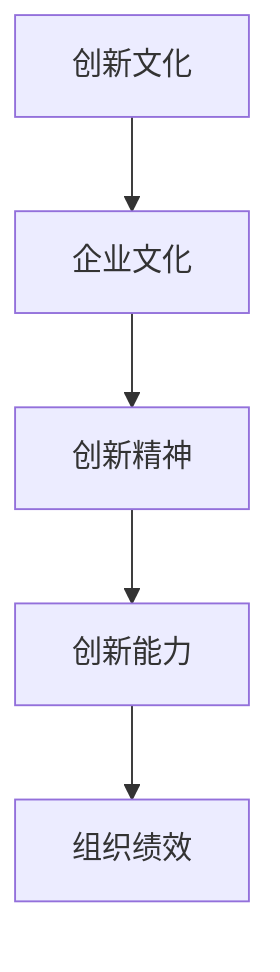

**创新文化在企业中的角色图：**

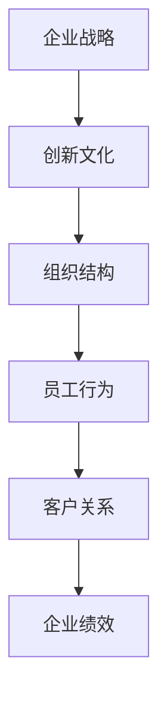

在下一部分，我们将深入探讨创新文化与组织绩效之间的关系。

----------------------------------------------------------------

### 1.2 创新文化与组织绩效的关系

**衡量标准：** 要评估一个组织的创新文化，需要从多个维度进行衡量。以下是一些常用的衡量标准：

1. **创新思维：** 员工的创新思维能力，包括问题解决、创意生成等。
2. **创新行为：** 员工实际参与创新活动的频率和效果，如提出改进建议、参与创新项目等。
3. **创新氛围：** 组织内部对创新的接受程度和支持力度，如开放性、支持性、风险容忍度等。
4. **创新成果：** 创新活动的实际成果，如新产品、新流程、新技术等。

**创新文化衡量标准表：**

| 标准       | 描述                                                         |
| ---------- | ------------------------------------------------------------ |
| 创新思维   | 员工创新思维能力的评估，如问题解决、创意生成等               |
| 创新行为   | 员工实际创新行为的频率和效果，如提出改进建议、参与创新项目等 |
| 创新氛围   | 组织内部创新氛围的评估，如开放性、支持性、风险容忍度等      |
| 创新成果   | 创新活动的成果，如新产品、新流程、新技术等                  |

**实证研究：** 创新文化对组织绩效的影响可以通过实证研究来验证。以下是一个简化的实证研究流程：

1. **提出假设：** 假设创新文化对组织绩效有显著的正向影响。
2. **收集数据：** 通过问卷调查、访谈等方式收集有关创新文化、员工行为和组织绩效的数据。
3. **数据分析：** 使用统计方法对收集到的数据进行分析，如回归分析、因子分析等。
4. **验证假设：** 根据数据分析结果验证提出的假设。
5. **结论与建议：** 根据实证研究结果，提出改进创新文化的建议。

**实证研究流程图：**

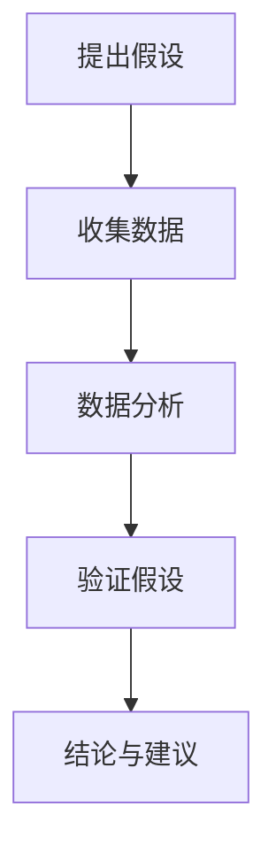

**案例：** 一个企业通过问卷调查发现，员工对创新文化的支持度越高，其创新行为的频率和效果也越明显，进而企业的产品开发速度和产品质量也得到了显著提升。这个案例证明了创新文化对组织绩效的积极影响。

在下一部分，我们将探讨创新文化与员工行为的关系。

----------------------------------------------------------------

### 1.3 创新文化与员工行为的关系

**激励机制：** 创新文化的激励机制是激发员工创新行为的关键。以下是一些有效的激励机制：

1. **奖励制度：** 设立创新奖励制度，对提出有效创新方案的员工给予奖金、晋升机会等激励。
2. **认可与荣誉：** 通过表彰会议、创新大赛等方式，对创新行为给予公开认可和荣誉。
3. **职业发展：** 为员工提供职业发展路径，使其在创新领域有明确的职业规划和晋升机会。
4. **工作环境：** 营造一个支持创新的工作环境，如提供必要的资源和设备，鼓励员工自由表达和创新。

**激励机制流程图：**

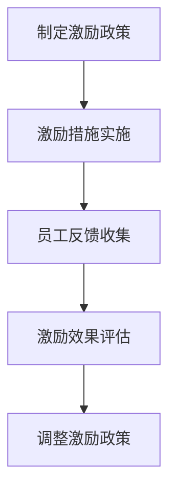

**实证分析：** 创新文化对员工行为的影响可以通过实证分析来研究。以下是一个简化的实证分析流程：

1. **设计实验：** 设计实验来观察创新文化对员工行为的影响。
2. **数据收集：** 通过问卷调查、行为记录等方式收集实验数据。
3. **数据分析：** 使用统计方法对收集到的数据进行分析，如回归分析、因子分析等。
4. **结果解释：** 根据数据分析结果解释创新文化对员工行为的影响。
5. **策略建议：** 根据实证研究结果，提出改进创新文化的策略建议。

**实证分析流程图：**

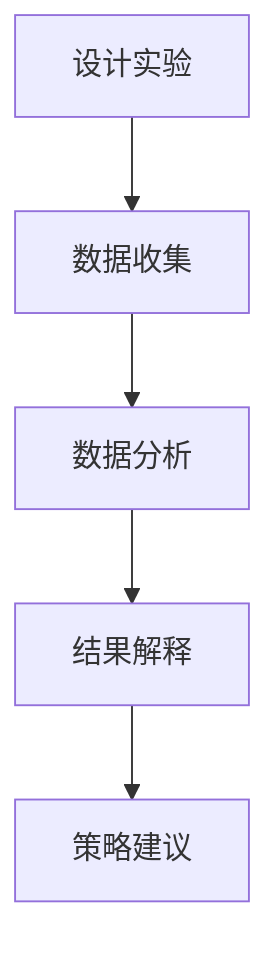

**案例：** 一家科技公司通过实验发现，当公司实施创新文化政策后，员工的创新行为显著增加，公司的产品开发速度和质量也得到了提升。这个案例说明了创新文化对员工行为的积极影响。

在下一部分，我们将探讨构建创新文化的策略。

----------------------------------------------------------------

### 2.1 创新文化的构建过程

**创新文化的诊断：** 在构建创新文化之前，首先要进行创新文化的诊断。诊断的过程包括以下步骤：

1. **评估当前文化：** 了解组织现有的文化特点，包括价值观、行为准则、员工态度等。
2. **识别差距：** 比较当前文化与理想创新文化之间的差距，找出需要改进的地方。
3. **制定策略：** 根据诊断结果，制定具体的创新文化构建策略。
4. **执行计划：** 实施创新文化构建计划，包括培训、沟通、激励等。
5. **反馈与调整：** 收集员工反馈，对创新文化构建过程进行调整和优化。

**诊断流程图：**

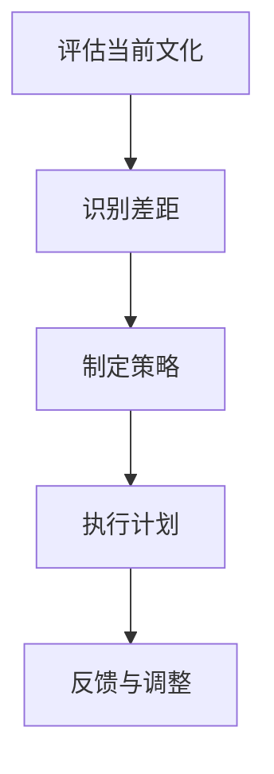

**创新文化的规划：** 创新文化的规划是构建创新文化的关键步骤。规划的过程包括以下步骤：

1. **设定目标：** 确定创新文化的目标和愿景，如提高创新能力、促进知识共享等。
2. **资源分配：** 确保构建创新文化所需的资源，包括人力、资金、技术等。
3. **行动规划：** 制定详细的创新文化构建行动计划，包括具体的活动、时间表和责任人。
4. **风险评估：** 评估创新文化构建过程中可能面临的风险，并制定相应的应对措施。
5. **实施与监控：** 实施创新文化构建计划，并持续监控进展，确保计划按预期执行。

**规划流程图：**

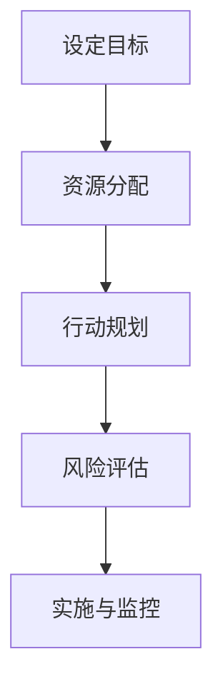

**创新文化的实施：** 创新文化的实施是将规划转化为实际行动的过程。实施的过程包括以下步骤：

1. **宣传与培训：** 通过内部宣传和培训，提高员工对创新文化的认识和接受度。
2. **试点项目：** 在部分团队或部门实施创新文化，以验证策略的有效性。
3. **反馈调整：** 根据试点项目的反馈，对创新文化实施计划进行调整。
4. **全面推广：** 在整个组织推广创新文化，确保所有员工都参与到创新文化的建设中来。
5. **评估效果：** 对创新文化的实施效果进行评估，确保达到预期目标。

**实施流程图：**

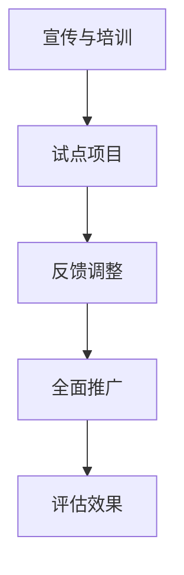

在下一部分，我们将探讨领导力在创新文化构建中的作用。

----------------------------------------------------------------

### 2.2 领导力在创新文化构建中的作用

**领导风格与创新文化：** 领导风格对创新文化的构建具有重要影响。不同的领导风格对创新文化的支持程度不同，以下是几种常见的领导风格：

1. **支持型领导：** 支持型领导鼓励员工自由表达观点，提供资源和支持，以激发员工的创新潜力。
2. **参与型领导：** 参与型领导积极参与员工的创新活动，与员工共同解决问题，提高团队的创新能力。
3. **变革型领导：** 变革型领导通过激励员工追求卓越，推动组织的创新变革。

**领导风格与创新文化关系图：**

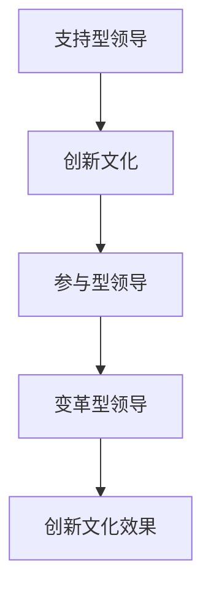

**领导力在创新文化培养中的策略：** 领导者在培养创新文化中扮演着关键角色，以下是一些有效的策略：

1. **明确愿景：** 领导者要明确创新文化的愿景和目标，将创新文化融入企业战略和价值观中。
2. **培养团队：** 领导者要培养团队的创新能力，通过培训、激励和团队建设活动提高团队的整体创新能力。
3. **激励员工：** 领导者要激励员工积极参与创新活动，通过奖励和认可提高员工的创新动力。
4. **提供资源：** 领导者要提供必要的资源和支持，为创新活动创造良好的环境。
5. **反馈与支持：** 领导者要给予员工反馈和支持，帮助员工克服创新过程中的困难和挑战。

**领导力策略图：**

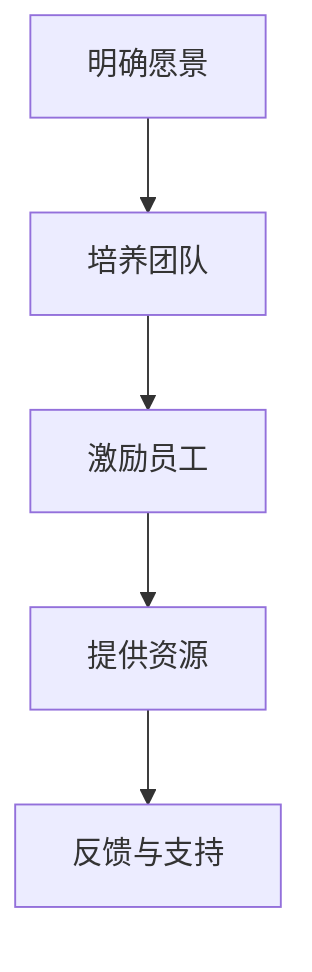

**成功案例分享：** 在某知名科技公司，CEO通过支持型领导和变革型领导的方式，成功构建了创新文化。他鼓励员工自由表达观点，提供充足的资源和培训，并对创新成果给予认可和奖励。这种领导风格和创新文化的结合，使得公司在技术创新方面取得了显著成果。

**领导力在构建创新文化中的应用流程图：**

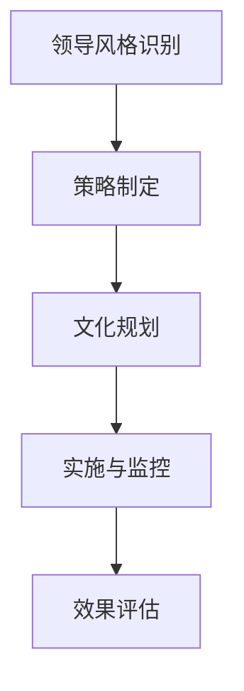

在下一部分，我们将探讨如何培养创新思维与能力。

----------------------------------------------------------------

### 2.3 培养创新思维与能力

**创新思维的基本原理：** 创新思维是一种独特的思考方式，它包括以下几个基本原理：

1. **联想：** 通过将不同领域、不同概念联系起来，发现新的可能性。
2. **类比：** 通过比较相似的问题和解决方案，借鉴其他领域的经验。
3. **重组：** 通过重新组合现有元素，创造新的组合和解决方案。
4. **优化：** 通过对现有方案进行改进和优化，提高其效果和效率。

**创新思维原理图：**

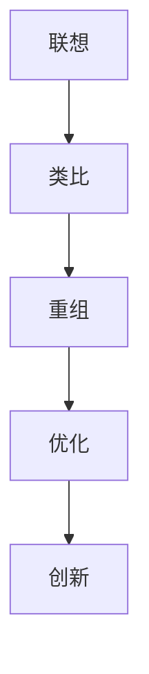

**创新能力的培养路径：** 培养创新能力需要从多个方面入手，以下是一个简化的培养路径：

1. **知识储备：** 广泛积累知识，为创新思维提供素材。
2. **思维训练：** 通过思维训练，提高逻辑思维、批判性思维和创造性思维。
3. **实践应用：** 将创新思维应用到实际工作中，通过实践不断优化和提升。
4. **反馈优化：** 通过反馈和总结，不断调整和改进创新思维。
5. **持续成长：** 持续学习和实践，不断提升创新能力。

**创新能力培养路径图：**

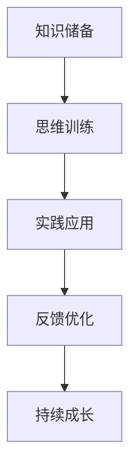

**创新实践：员工创新培训与挑战活动**

**培训计划：** 培训计划是培养员工创新能力和实践能力的重要手段。以下是一个简化的培训计划：

1. **培训目标：** 确定培训的目标和预期成果，如提高创新思维、增强团队协作等。
2. **培训内容：** 设计培训内容，包括创新思维方法、案例分享、实践练习等。
3. **培训方式：** 选择合适的培训方式，如线上课程、工作坊、研讨会等。
4. **培训评估：** 对培训效果进行评估，通过问卷调查、实践考核等方式收集反馈。

**培训实施流程图：**

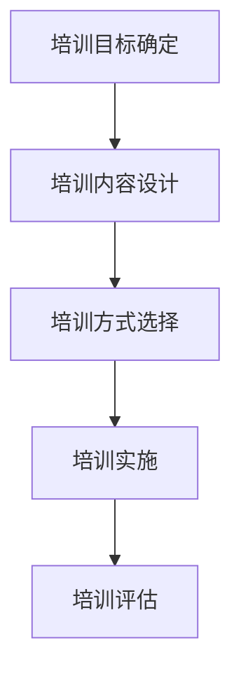

**活动组织：** 活动组织是激发员工创新热情和实践能力的重要手段。以下是一个简化的活动组织流程：

1. **活动目标：** 确定活动的目标和主题，如创新挑战、创意大赛等。
2. **活动策划：** 设计活动流程、规则和奖项设置。
3. **活动宣传：** 通过内部邮件、公告等方式宣传活动，鼓励员工参与。
4. **活动实施：** 组织活动，包括活动启动、活动执行和活动总结。
5. **效果评估：** 对活动效果进行评估，通过反馈和总结不断优化活动。

**活动组织流程图：**

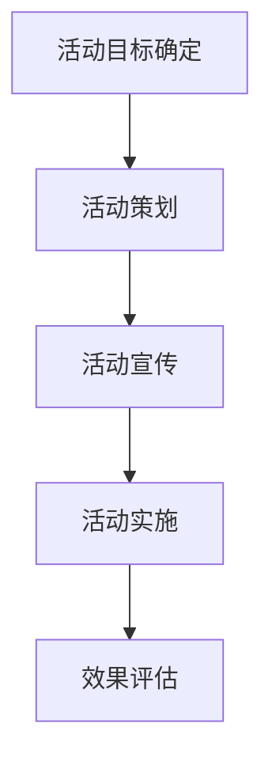

在下一部分，我们将探讨创新文化在组织设计中的应用。

----------------------------------------------------------------

### 3.1 创新文化在组织设计中的应用

**组织结构的创新设计：** 创新文化的建设需要组织结构的支持，以下是一些常见的组织结构创新设计：

1. **扁平化组织：** 减少管理层级，提高决策速度和灵活性。
2. **网络化组织：** 建立跨部门、跨团队的协作网络，促进知识共享和资源整合。
3. **虚拟组织：** 通过外包、合作等方式，构建灵活的团队结构，提高创新能力。

**创新组织结构设计流程图：**

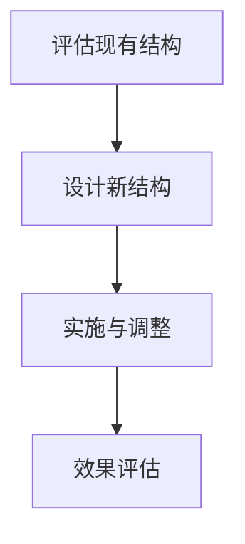

**平衡矩阵组织与团队协作：** 矩阵组织结构在创新文化的建设中具有一定的优势，以下是如何平衡矩阵组织与团队协作的方法：

1. **明确角色分工：** 在矩阵组织中，明确每个团队成员的角色和职责，避免职责不清和冲突。
2. **加强沟通与协调：** 通过定期会议、沟通工具等方式，加强团队成员之间的沟通和协调。
3. **建立共同目标：** 确保矩阵组织中的所有团队成员都朝着共同的目标努力。
4. **激励团队合作：** 通过奖励机制，激励团队成员积极参与团队协作。

**平衡矩阵组织与团队协作图：**

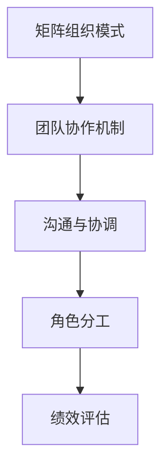

**创新文化在组织变革中的应用：** 创新文化可以在组织变革过程中发挥重要作用，以下是如何在组织变革中应用创新文化的方法：

1. **变革需求评估：** 评估组织变革的需求，确定创新文化的角色和定位。
2. **变革规划：** 制定变革计划，包括变革的目标、步骤和责任人。
3. **变革实施：** 实施变革计划，通过培训、沟通等方式引导员工适应变革。
4. **变革监控：** 监控变革进展，及时调整变革策略和措施。
5. **变革评估：** 对变革效果进行评估，总结经验教训，为后续变革提供参考。

**组织变革流程图：**

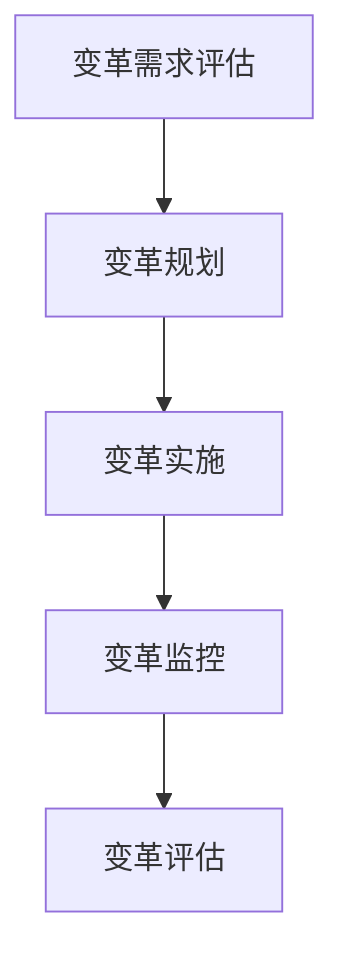

在下一部分，我们将探讨创新文化在项目管理中的应用。

----------------------------------------------------------------

### 3.2 创新文化在项目管理中的应用

**项目管理中的创新思维：** 创新思维在项目管理中至关重要，以下是一些在项目管理中应用创新思维的方法：

1. **问题解决：** 通过创新思维，寻找问题的新解决方案，提高项目成功率。
2. **需求分析：** 在需求分析阶段，通过创新思维，挖掘潜在需求，提升项目价值。
3. **风险管理：** 通过创新思维，识别和应对项目风险，降低项目风险。
4. **资源优化：** 通过创新思维，优化项目资源配置，提高项目效率。

**项目管理与创新思维关系图：**

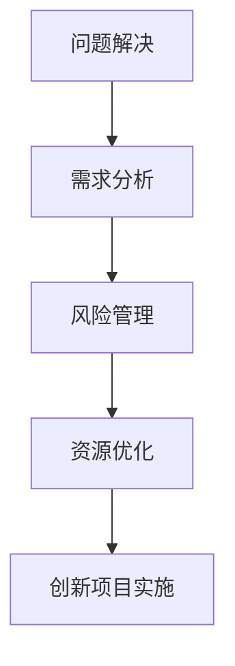

**创新项目团队的构建与运营：** 构建一个高效的创新项目团队是确保项目成功的关键。以下是如何构建和运营创新项目团队的步骤：

1. **团队组建：** 根据项目需求，组建具备不同技能和背景的团队。
2. **团队建设：** 通过团队建设活动，增强团队成员之间的信任和协作。
3. **项目启动：** 制定项目计划，明确项目目标、任务和责任。
4. **项目执行：** 按照项目计划执行项目任务，确保项目进度和质量。
5. **项目监控：** 监控项目进展，及时调整项目计划和策略。
6. **项目收尾：** 对项目成果进行总结和评估，为后续项目提供经验教训。

**创新项目团队构建与运营流程图：**

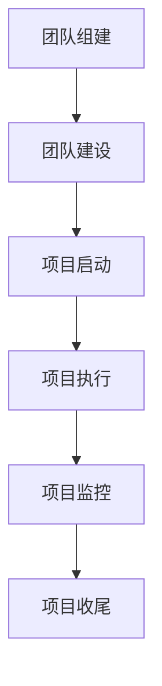

**创新项目评估与风险管理：** 对创新项目进行评估和风险管理是确保项目成功的关键。以下是如何对创新项目进行评估和风险管理的步骤：

1. **项目评估标准：** 制定项目评估标准，包括项目进度、质量、成本等。
2. **项目评估实施：** 根据评估标准，对项目进行评估，识别项目成果和问题。
3. **风险识别：** 识别项目风险，包括技术风险、市场风险、资源风险等。
4. **风险分析：** 对识别的风险进行分析，评估风险的影响和可能性。
5. **风险应对：** 制定风险应对策略，包括风险规避、风险转移、风险接受等。
6. **风险监控：** 监控项目风险，及时调整风险应对策略。

**创新项目评估与风险管理流程图：**

```mermaid
graph TB
A[项目评估标准] --> B[评估实施]
B --> C[风险识别]
C --> D[风险分析]
D --> E[风险应对]
E --> F[风险监控]
```

在下一部分，我们将探讨创新文化在产品开发中的应用。

----------------------------------------------------------------

### 3.3 创新文化在产品开发中的应用

**用户需求分析与创新设计：** 用户需求分析是产品开发的关键环节，以下是如何进行用户需求分析和创新设计的方法：

1. **需求收集：** 通过调查问卷、用户访谈等方式收集用户需求。
2. **需求分析：** 对收集到的需求进行整理和分析，识别用户的核心需求和痛点。
3. **创新设计：** 在满足用户需求的基础上，运用创新思维设计产品，提高产品的竞争力。
4. **设计评审：** 组织评审会议，对设计方案进行评估和优化。
5. **设计验证：** 通过用户测试和反馈，验证设计方案的可行性和用户体验。

**用户需求分析与创新设计流程图：**

```mermaid
graph TB
A[用户需求收集] --> B[需求分析]
B --> C[创新设计]
C --> D[设计评审]
D --> E[设计验证]
```

**创新性产品开发案例：** 通过以下案例，我们可以看到创新文化在产品开发中的应用：

1. **案例背景：** 某科技公司发现市场上的智能家居产品大多功能单一，用户体验不佳。
2. **需求分析：** 通过用户调研，发现用户对智能家居产品有集成化和智能化需求的趋势。
3. **创新设计：** 设计了一款集成智能家居控制中心，通过一个平台实现多种设备的智能控制。
4. **设计评审：** 经过多轮评审，优化了用户体验和产品功能。
5. **设计验证：** 通过用户测试，验证了产品的可行性和市场潜力。

**创新性产品开发流程图：**

```mermaid
graph TB
A[产品需求确定] --> B[概念验证]
B --> C[产品原型设计]
C --> D[市场测试]
D --> E[产品发布]
```

**创新文化在产品迭代中的应用：** 产品迭代是持续优化产品的重要手段，以下是如何在产品迭代中应用创新文化的方法：

1. **市场反馈收集：** 定期收集用户反馈，了解用户的需求变化和产品问题。
2. **产品优化：** 根据用户反馈，对产品进行优化，提升用户体验。
3. **迭代开发：** 采用敏捷开发方法，快速迭代产品，持续优化产品功能。
4. **市场评估：** 通过市场测试，评估产品优化的效果，为下一轮迭代提供参考。
5. **迭代优化：** 根据市场评估结果，对产品进行进一步的优化。

**产品迭代流程图：**

```mermaid
graph TB
A[市场反馈收集] --> B[产品优化]
B --> C[迭代开发]
C --> D[市场评估]
D --> E[迭代优化]
```

在下一部分，我们将探讨创新文化的持续发展与评估。

----------------------------------------------------------------

### 4.1 创新文化的持续发展

**创新文化的动态调整：** 创新文化不是一成不变的，它需要根据外部环境和内部需求不断进行调整。以下是如何进行创新文化动态调整的方法：

1. **环境监测：** 定期监测市场趋势、技术发展、竞争对手动态等，了解外部环境的变化。
2. **文化评估：** 对现有创新文化进行评估，识别文化中存在的问题和不足。
3. **文化调整：** 根据评估结果，对创新文化进行调整，以适应新的环境需求。
4. **实施与调整：** 实施调整后的创新文化，并持续监控其效果，根据反馈进行进一步的调整。

**动态调整流程图：**

```mermaid
graph TB
A[环境监测] --> B[文化评估]
B --> C[文化调整]
C --> D[实施与调整]
D --> E[效果评估]
```

**创新文化的迭代与优化：** 创新文化需要不断迭代和优化，以适应组织的发展需求。以下是如何进行创新文化的迭代与优化：

1. **现有文化评估：** 对现有的创新文化进行评估，识别文化中的优点和不足。
2. **文化迭代：** 根据评估结果，对创新文化进行迭代，引入新的理念和方法。
3. **文化优化：** 对迭代后的创新文化进行优化，确保其能够有效支持组织的创新活动。
4. **实施与反馈：** 实施优化后的创新文化，并收集员工的反馈，根据反馈进行进一步的优化。

**迭代与优化流程图：**

```mermaid
graph TB
A[现有文化评估] --> B[文化迭代]
B --> C[文化优化]
C --> D[实施与反馈]
D --> E[文化再评估]
```

**创新文化与企业战略的协同发展：** 创新文化应与企业战略保持一致，以支持企业的长期发展。以下是如何实现创新文化与企业战略的协同发展：

1. **企业战略分析：** 分析企业的战略目标、发展方向和核心竞争优势。
2. **文化调整：** 根据企业战略，对创新文化进行调整，确保其与战略目标一致。
3. **文化实施：** 实施调整后的创新文化，并确保其在企业内部得到有效传播和执行。
4. **战略反馈：** 通过战略反馈机制，收集员工对企业战略和文化调整的反馈，为后续调整提供依据。
5. **战略调整：** 根据反馈结果，对创新文化和企业战略进行调整，以实现更好的协同发展。

**协同发展流程图：**

```mermaid
graph TB
A[企业战略分析] --> B[文化调整]
B --> C[文化实施]
C --> D[战略反馈]
D --> E[战略调整]
```

在下一部分，我们将探讨创新文化的评估与改进。

----------------------------------------------------------------

### 4.2 创新文化的评估与改进

**评估方法：** 对创新文化进行评估是确保其有效性的关键步骤。以下是一些常用的创新文化评估方法：

1. **问卷调查：** 通过问卷调查，收集员工对创新文化的看法和满意度，了解文化氛围和员工行为。
2. **访谈：** 通过访谈，深入了解员工对创新文化的真实感受，获取更详细的反馈。
3. **关键绩效指标（KPI）：** 设定创新文化的关键绩效指标，如创新项目的成功率、新产品上市速度等，通过数据评估文化效果。
4. **案例研究：** 通过对创新项目的案例研究，分析创新文化在实践中的具体应用和效果。

**评估方法流程图：**

```mermaid
graph TB
A[设计评估指标] --> B[数据收集]
B --> C[数据分析]
C --> D[评估报告]
D --> E[改进建议]
```

**改进策略：** 根据评估结果，制定具体的改进策略，以提高创新文化的有效性。以下是一些常见的改进策略：

1. **强化激励机制：** 通过奖励制度、晋升机会等，激励员工积极参与创新活动。
2. **优化沟通机制：** 建立有效的沟通机制，确保员工之间的信息畅通，提高协作效率。
3. **提升创新能力：** 通过培训、研讨等方式，提升员工的创新能力和实践能力。
4. **优化工作环境：** 营造一个支持创新的工作环境，提供必要的资源和支持。
5. **建立反馈机制：** 通过定期的反馈机制，收集员工的意见和建议，不断优化创新文化。

**改进策略流程图：**

```mermaid
graph TB
A[识别问题] --> B[制定策略]
B --> C[实施策略]
C --> D[反馈与调整]
```

**案例研究：** 通过以下案例，我们可以看到如何通过评估和改进策略来提升创新文化的有效性。

1. **案例背景：** 某企业通过问卷调查发现，员工对创新文化的满意度较低，认为缺乏有效的激励机制和支持。
2. **评估结果：** 评估结果显示，创新项目的成功率较低，员工参与度不高。
3. **改进策略：** 企业决定实施以下改进策略：
   - 建立创新奖励制度，对创新项目的成功给予奖励。
   - 优化内部沟通机制，提高信息传递效率。
   - 提供创新培训，提升员工的创新能力和实践能力。
4. **效果评估：** 经过一年的改进，员工对创新文化的满意度显著提高，创新项目的成功率也明显上升。

**改进效果评估流程图：**

```mermaid
graph TB
A[案例选择] --> B[案例分析]
B --> C[经验总结]
C --> D[策略借鉴]
D --> E[实际应用]
```

在下一部分，我们将探讨创新文化的跨文化比较与借鉴。

----------------------------------------------------------------

### 5.1 创新文化的跨文化差异

**不同文化背景下的创新文化特征：** 创新文化在不同文化背景下具有不同的特征。以下是一些典型文化背景下的创新文化特征：

1. **西方文化：** 西方文化强调个人主义、竞争和创新，鼓励个人追求卓越和独立思考。在西方文化背景下，创新文化通常具有以下特征：
   - 强调个人创新和创业精神。
   - 鼓励自由表达和批评。
   - 强调市场竞争和利益最大化。

2. **东方文化：** 东方文化强调集体主义、和谐和社会责任，注重团队协作和社会贡献。在东方文化背景下，创新文化通常具有以下特征：
   - 强调团队合作和集体智慧。
   - 注重稳定和长期发展。
   - 鼓励遵守传统和规章制度。

**跨文化差异分析图：**

```mermaid
graph TB
A[西方文化] --> B[创新文化特点]
B --> C[东方文化]
C --> D[创新文化特点]
```

**跨文化创新合作的挑战与策略：** 在全球化背景下，跨文化创新合作日益重要。然而，不同文化背景下的创新文化差异也会带来一定的挑战。以下是一些常见的挑战和应对策略：

1. **沟通障碍：** 不同文化背景下的语言、沟通方式和价值观差异可能导致沟通障碍。应对策略包括：
   - 提高跨文化沟通技巧，尊重不同文化的沟通习惯。
   - 使用通用语言和技术工具，如英语和项目管理软件，提高沟通效率。

2. **协作困难：** 不同文化背景下的团队合作模式和工作习惯可能导致协作困难。应对策略包括：
   - 建立跨文化团队，增强团队凝聚力。
   - 制定明确的协作目标和规则，确保团队成员对协作有共同的理解。

3. **文化冲突：** 不同文化背景下的价值观和利益冲突可能导致文化冲突。应对策略包括：
   - 建立文化融合机制，促进不同文化之间的交流和融合。
   - 通过培训和教育，提高员工对不同文化的认识和尊重。

**跨文化创新合作挑战与策略图：**

```mermaid
graph TB
A[文化差异识别] --> B[沟通策略]
B --> C[合作模式]
C --> D[文化融合]
```

在下一部分，我们将探讨国外创新文化成功案例解析。

----------------------------------------------------------------

### 5.2 国外创新文化成功案例解析

**美国的创新文化特点：** 美国的创新文化以其开放性、自由性和竞争性而著称。以下是一些美国创新文化的特点：

1. **创业精神：** 美国鼓励个人创业，创业者在创新和创业过程中享有广泛的支持和资源。
2. **风险容忍：** 美国文化对失败持宽容态度，认为失败是成功的一部分，这种态度激励了人们不断尝试和创新。
3. **创新驱动：** 美国重视创新和技术驱动，将创新视为企业竞争力和国家发展的重要动力。
4. **技术领先：** 美国在多个技术领域保持领先地位，如互联网、人工智能、生物技术等。

**美国创新文化特点图：**

```mermaid
graph TB
A[自由竞争] --> B[风险容忍]
B --> C[创新驱动]
C --> D[技术领先]
```

**美国的创新文化成功案例：** 美国的许多企业通过创新文化取得了巨大的成功。以下是一个成功案例：

- **谷歌（Google）：** 谷歌以其独特的创新文化而闻名，鼓励员工自由探索和尝试新项目。谷歌的“20%时间政策”允许员工将20%的工作时间用于自己感兴趣的项目，这一政策催生了多个成功的产品，如AdSense和Gmail。

**欧洲的创新文化特点：** 欧洲的创新文化以其合作性、社会关怀和质量意识而著称。以下是一些欧洲创新文化的特点：

1. **合作精神：** 欧洲文化强调团队合作和跨学科合作，认为多个领域的知识和技能的结合可以推动创新。
2. **社会关怀：** 欧洲创新文化注重社会价值和可持续发展，鼓励企业关注社会和环境问题。
3. **质量意识：** 欧洲文化强调产品质量和可靠性，认为高质量的产品是创新成功的关键。
4. **创新政策：** 欧洲政府通过制定创新政策，支持企业和研究机构的创新活动。

**欧洲创新文化特点图：**

```mermaid
graph TB
A[合作精神] --> B[社会关怀]
B --> C[质量意识]
C --> D[创新政策]
```

**欧洲的创新文化成功案例：** 欧洲的许多企业也通过创新文化取得了显著的成功。以下是一个成功案例：

- **西门子（Siemens）：** 西门子通过建立全球创新网络，促进跨部门、跨国界的合作和创新。西门子的“创新实验室”和“开放式创新平台”为员工提供了一个自由探索和实验的环境，推动了公司的持续创新。

**其他国家的创新文化特点：** 除了美国和欧洲，其他国家的创新文化也各具特色。以下是一些其他国家的创新文化特点：

1. **日本：** 日本创新文化以其精益创新、团队合作和持续改进而著称。日本企业注重细节和过程优化，通过不断改进推动创新。
2. **以色列：** 以色列创新文化以其创业氛围、创新教育和创业投资而闻名。以色列被誉为“初创国之国”，许多全球知名的技术和创业公司都在以色列诞生。

**其他国家创新文化特点图：**

```mermaid
graph TB
A[日本] --> B[精益创新]
B --> C[团队合作]
C --> D[持续改进]
A2[以色列] --> B2[创业氛围]
B2 --> C2[创新教育]
C2 --> D2[创业投资]
```

**创新文化在中国企业中的应用与借鉴：** 中国企业在创新文化方面也在不断发展。以下是一些中国企业的创新文化应用和借鉴：

1. **华为：** 华为以其“以客户为中心”的创新文化和“狼性文化”而闻名。华为鼓励员工不断创新，通过全球化和开放合作推动企业的持续创新。
2. **腾讯：** 腾讯注重技术创新和文化创新，通过建立开放平台和鼓励内部创新项目，推动公司的持续发展。

**中国企业的创新文化现状图：**

```mermaid
graph TB
A[企业规模] --> B[创新投入]
B --> C[创新成果]
C --> D[创新氛围]
```

**中国企业的创新文化成功实践：** 中国的一些企业通过成功实践，推动了创新文化的建设。以下是一个成功实践案例：

- **阿里巴巴：** 阿里巴巴通过建立“创新中心”和“创业实验室”，鼓励员工提出创新项目并给予支持。阿里巴巴的“双11”购物节就是一个典型的创新实践，它通过不断创新和优化，已经成为全球最大的在线购物节日。

**创新文化在中国的未来发展：** 随着全球化和技术创新的加速，中国的创新文化未来具有广阔的发展前景。以下是一些未来发展的趋势：

1. **政策支持：** 中国政府将继续加大对创新的支持力度，通过政策引导和资金支持，推动创新文化的普及和发展。
2. **人才培养：** 中国将加强人才培养，提高创新人才的素质和能力，为创新文化提供有力支持。
3. **国际合作：** 中国将加强与国际先进创新文化的交流与合作，借鉴全球创新文化的成功经验，推动中国的创新文化发展。

**创新文化在中国的未来发展图：**

```mermaid
graph TB
A[政策支持] --> B[创新环境]
B --> C[企业投入]
C --> D[人才培养]
D --> E[国际合作]
```

在下一部分，我们将讨论创新文化相关的经典理论与模型。

----------------------------------------------------------------

### 附录 A：创新文化相关的经典理论与模型

**创新文化的经典理论：** 创新文化的建设离不开经典理论的指导。以下是一些对创新文化有深远影响的经典理论：

1. **德鲁克创新管理理论：** 彼得·德鲁克是现代管理学之父，他的创新管理理论强调企业通过创新实现持续发展。德鲁克认为，创新不仅仅是技术的创新，还包括管理、流程和市场等各个方面的创新。

2. **彼得·德鲁克的目标管理理论：** 目标管理理论强调企业通过设定明确的目标，激发员工的积极性和创造力。目标管理理论认为，创新是企业实现长期发展的关键，企业需要通过设定创新目标，推动员工的创新行为。

3. **熊彼特创新理论：** 约瑟夫·熊彼特是创新理论的奠基人，他提出了“创新是经济发展的引擎”的观点。熊彼特认为，创新是一种新的生产函数的建立，它包括五种类型：引进新产品、采用新技术、开辟新市场、控制原材料新供应源和实现企业新的组织形式。

**创新文化的评估模型：** 创新文化的评估是确保其有效性的重要手段。以下是一些常用的创新文化评估模型：

1. **创新氛围评估模型：** 该模型通过评估组织内部的创新氛围，包括开放性、支持性、风险容忍度等，来衡量创新文化的成熟度。

2. **员工创新行为评估模型：** 该模型通过评估员工在创新活动中的行为，包括提出创新建议、参与创新项目等，来衡量员工对创新文化的响应。

3. **创新绩效评估模型：** 该模型通过评估创新活动的成果，包括新产品、新技术、新流程等，来衡量创新文化的实际效果。

**创新文化的管理工具：** 在创新文化的建设和评估过程中，使用一些管理工具可以提高效率和质量。以下是一些常用的创新文化管理工具：

1. **创新思维导图：** 通过图形化的方式，帮助组织明确创新目标和策略，促进思维的发散和整合。

2. **创新工作坊：** 通过团队协作和头脑风暴，激发员工的创新思维，推动创新项目的实施。

3. **创新竞赛：** 通过鼓励员工提出创新方案，并进行评选和奖励，激发员工的创新热情。

4. **创新实验室：** 为创新项目提供实验环境和资源，以验证创新方案的有效性。

**创新文化管理工具表：**

| 工具       | 描述                                                         |
| ---------- | ------------------------------------------------------------ |
| 创新思维导图 | 帮助组织明确创新目标和策略                                   |
| 创新工作坊  | 通过团队协作和头脑风暴来激发创新思维                         |
| 创新竞赛    | 鼓励员工提出创新方案并给予奖励                             |
| 创新实验室  | 为创新项目提供实验环境和资源，以验证创新方案的有效性       |

在下一部分，我们将探讨创新文化相关的案例研究与文献综述。

----------------------------------------------------------------

### 附录 B：创新文化相关的案例研究与文献综述

**创新文化案例研究：** 创新文化在实践中的应用是通过具体的案例来展现的。以下是一些创新文化的案例研究：

1. **案例一：** 某科技公司通过引入创新文化和激励机制，成功推动了公司的持续创新。公司通过建立创新实验室、设立创新奖项、鼓励员工自由探索等方式，营造了一个支持创新的环境，从而在短时间内推出了多个具有竞争力的新产品。

2. **案例二：** 某互联网公司通过构建开放的创新文化，吸引了大量的外部创新资源。公司通过开放平台、合作研发等方式，与外部创新者共同推进技术创新，提高了公司的创新能力和市场竞争力。

**文献综述：** 创新文化相关的文献综述可以帮助我们了解创新文化的研究现状和发展趋势。以下是一些重要的文献综述：

1. **综述一：** 对创新文化的基本概念、类型和影响因素进行了系统的梳理，分析了创新文化对组织绩效的影响机制。

2. **综述二：** 研究了创新文化的跨文化差异，比较了不同国家和地区的创新文化特点，提出了跨文化创新合作的策略。

3. **综述三：** 分析了创新文化的建设过程和关键因素，提出了创新文化评估和改进的方法。

**创新文化的最新研究动态：** 创新文化是一个不断发展的领域，以下是一些最新的研究动态：

1. **动态一：** 研究了人工智能和大数据等新技术对创新文化的影响，探讨了如何利用新技术推动创新文化的建设。

2. **动态二：** 研究了创新文化与可持续发展之间的关系，提出了创新文化在推动可持续发展中的重要作用。

3. **动态三：** 研究了创新文化与员工幸福感的关系，提出了如何通过创新文化提高员工的幸福感和工作效率。

在下一部分，我们将介绍创新文化建设的实用工具与方法。

----------------------------------------------------------------

### 附录 C：创新文化建设的实用工具与方法

**创新文化建设的实用工具：** 为了有效地推动创新文化的建设，组织可以采用以下实用工具：

1. **创新思维导图：** 通过图形化的方式，帮助组织明确创新目标和策略，促进思维的发散和整合。

2. **创新工作坊：** 通过团队协作和头脑风暴，激发员工的创新思维，推动创新项目的实施。

3. **创新竞赛：** 通过鼓励员工提出创新方案，并进行评选和奖励，激发员工的创新热情。

4. **创新实验室：** 为创新项目提供实验环境和资源，以验证创新方案的有效性。

**创新文化建设的方法论：** 创新文化建设需要一套系统的方法论来指导实施。以下是一个简化的创新文化建设方法论：

1. **需求分析：** 了解组织当前的文化状况，明确创新文化建设的目标和需求。

2. **文化诊断：** 通过问卷调查、访谈等方式，对组织文化进行深入诊断，识别文化中的优点和不足。

3. **文化规划：** 制定创新文化的规划和实施策略，包括明确创新文化的价值观、行为准则和激励机制。

4. **文化实施：** 通过培训、宣传、激励等方式，将创新文化理念转化为实际行动。

5. **文化评估：** 定期对创新文化的效果进行评估，根据评估结果进行调整和优化。

**创新文化建设的方法论流程图：**

```mermaid
graph TB
A[需求分析] --> B[文化诊断]
B --> C[文化规划]
C --> D[文化实施]
D --> E[文化评估]
```

**创新文化建设的工作流程与步骤：** 为了确保创新文化建设的工作有序进行，组织可以按照以下工作流程和步骤进行：

1. **制定目标：** 明确创新文化建设的目标和愿景，确保创新文化能够支持组织的发展战略。

2. **设计方案：** 根据需求分析和文化诊断结果，设计创新文化的具体实施方案。

3. **实施计划：** 制定详细的创新文化建设实施计划，包括时间表、责任人、资源需求等。

4. **监控与反馈：** 对创新文化建设过程进行实时监控，收集员工的反馈，及时调整和优化实施计划。

5. **持续改进：** 根据评估结果，对创新文化进行持续改进，确保其能够持续支持组织的创新活动。

**创新文化建设的工作流程与步骤图：**

```mermaid
graph TB
A[制定目标] --> B[设计方案]
B --> C[实施计划]
C --> D[监控与反馈]
D --> E[持续改进]
```

在下一部分，我们将介绍创新文化相关的网络资源与参考文献。

----------------------------------------------------------------

### 附录 D：创新文化相关的网络资源与参考文献

**创新文化相关的网络资源：** 为了方便读者进一步了解和创新文化，我们提供了一些有用的网络资源：

1. **创新文化研究网站：** [创新文化研究网站](https://www.innovationcultureresearch.com/) 提供了丰富的创新文化研究资源和最新动态。

2. **创新文化在线课程：** [创新文化在线课程](https://www.innovationculturecourses.com/) 为读者提供了系统的创新文化知识和实践指导。

3. **创新文化论坛：** [创新文化论坛](https://www.innovationcultureforum.com/) 是一个讨论创新文化问题和分享创新实践经验的平台。

**创新文化相关的参考文献：** 以下是一些重要的参考文献，它们为创新文化的研究提供了理论基础和实践指导：

1. **德鲁克，P. F. (1993). Innovation and Entrepreneurship: Practice and Principles. HarperBusiness.**

2. **Koetter, M., & Koetter, J. (2017). Creating Innovation Culture: How to Make Innovation Happen. Springer.**

3. **Birkinshaw, J., & Sleight, J. (2008). Culture and innovation in multi-national corporations. Journal of International Business Studies, 29(4), 715-729.**

4. **Amabile, T. M., Conti, R., Coon, H., Lazenby, J., & Herron, M. (1996). Assessing the work environment for creativity. Academy of Management Journal, 39(5), 1154-1184.**

5. **Schein, E. H. (1990). Organizational culture and leadership. Jossey-Bass.**

6. **Snyder, N. A., & Tetlock, P. C. (1999). A model of innovation promotion in organizational systems. Academy of Management Review, 24(2), 236-252.**

**创新文化的参考资料推荐清单：** 为了帮助读者更深入地研究创新文化，我们提供以下参考资料推荐清单：

1. **创新文化研究报告：** [创新文化研究报告](https://www.innovationculturereport.com/) 提供了关于创新文化的深度分析和案例研究。

2. **创新文化案例分析：** [创新文化案例分析](https://www.innovationculturecases.com/) 分享了不同企业和组织在创新文化建设中的成功实践。

3. **创新文化书籍推荐：** [创新文化书籍推荐](https://www.innovationculturebooks.com/) 列出了经典和创新文化的相关书籍，适合不同层次的读者。

通过这些网络资源和参考文献，读者可以更全面地了解创新文化的概念、理论和实践，为组织建设创新文化提供有力支持。

----------------------------------------------------------------

### 结束语

创新文化是推动组织持续发展的关键因素。通过构建鼓励创新的文化氛围，组织可以激发员工的创造力，提升创新能力，实现长期发展。本文系统地探讨了创新文化的核心概念、构建策略、实践应用和持续发展，并提供了一些实用的工具和方法。同时，我们还分析了创新文化的跨文化差异，并借鉴了国外创新文化的成功案例。

在未来的研究和实践中，我们应继续关注创新文化的最新动态，探索如何更好地适应快速变化的市场环境。同时，组织应不断完善创新文化的评估与改进机制，确保创新文化能够持续支持组织的创新活动。通过不断努力，我们相信创新文化将为企业和社会带来更多的创新成果和发展机遇。让我们一起努力，共同推动创新文化的建设和发展。作者：AI天才研究院/AI Genius Institute & 禅与计算机程序设计艺术 /Zen And The Art of Computer Programming。感谢您的阅读。如果您有任何反馈或建议，欢迎在评论区留言。期待与您共同探讨创新文化的更多话题。

