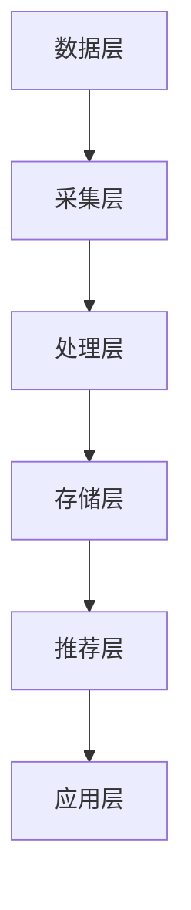

                 

### 《利用LLM优化推荐系统的动态兴趣捕捉》目录大纲

在这篇文章中，我们将详细探讨如何利用大型语言模型（LLM）来优化推荐系统的动态兴趣捕捉。为了使读者能够清晰地理解文章的内容，我们首先提供了一个详细的目录大纲，这将帮助读者快速找到感兴趣的部分。

### 第一部分：背景与概念介绍

在这一部分，我们将从推荐系统的基础知识入手，逐步介绍动态兴趣捕捉的概念以及大型语言模型（LLM）的基础知识。

#### 第1章：推荐系统概述

1.1 推荐系统的发展历程

在第一章中，我们将首先回顾推荐系统的发展历程，从早期的基于内容推荐到协同过滤，再到现代的深度学习和大型语言模型推荐系统，了解各个阶段的技术变革和进展。

1.2 推荐系统的核心组件

接着，我们将详细介绍推荐系统的核心组件，包括推荐算法、数据集构建、用户画像等，帮助读者理解推荐系统的整体架构。

1.3 推荐系统的分类

我们将对推荐系统进行分类，包括基于内容推荐、协同过滤、基于模型的方法等，并探讨每种方法的优缺点和适用场景。

1.4 动态兴趣捕捉的重要性

最后，我们将探讨动态兴趣捕捉在推荐系统中的作用和重要性，解释为什么动态兴趣捕捉能够提升推荐系统的效果。

#### 第2章：大型语言模型（LLM）基础

2.1 LLM的概念与原理

在第二章，我们将介绍大型语言模型（LLM）的基本概念和原理，包括其工作方式、训练过程和主要类型。

2.2 LLM的主要类型

我们将详细探讨LLM的主要类型，如Transformer、BERT、GPT等，分析它们的特点和适用场景。

2.3 LLM的优势与应用

在这一节，我们将介绍LLM的优势，如强大的语义理解和生成能力，并在不同领域中的应用，如自然语言处理、问答系统、文本生成等。

### 第二部分：动态兴趣捕捉机制

在这一部分，我们将深入研究动态兴趣捕捉的机制，包括用户兴趣建模和动态兴趣捕捉策略。

#### 第3章：用户兴趣建模

3.1 用户兴趣的概念与分类

我们将首先介绍用户兴趣的概念和分类，包括显式兴趣和隐式兴趣，帮助读者理解用户兴趣的多样性。

3.2 用户行为数据收集与处理

接着，我们将探讨如何收集和处理用户行为数据，包括用户点击、浏览、购买等行为数据的采集和处理方法。

3.3 用户兴趣模型构建方法

在这一节，我们将介绍用户兴趣模型构建的方法，包括基于统计模型、机器学习模型和深度学习模型的方法。

3.4 用户兴趣模型的评估与优化

我们将讨论如何评估和优化用户兴趣模型，包括模型性能指标的计算、模型参数调优和模型选择策略。

#### 第4章：动态兴趣捕捉策略

4.1 基于内容的推荐方法

在这一章，我们将详细介绍基于内容的推荐方法，包括如何根据用户兴趣和内容特征生成个性化推荐。

4.2 基于协同过滤的推荐方法

我们将探讨基于协同过滤的推荐方法，包括矩阵分解、基于模型的协同过滤等，并分析其动态兴趣捕捉的能力。

4.3 基于模型的推荐方法

我们将介绍基于模型的推荐方法，如基于用户的协同过滤、基于内容的推荐和基于模型的推荐，并分析它们在动态兴趣捕捉方面的优势。

4.4 动态兴趣捕捉策略的设计与实现

最后，我们将讨论如何设计和实现动态兴趣捕捉策略，包括算法选择、数据预处理、模型训练和评估等步骤。

### 第三部分：动态兴趣捕捉的实践与应用

在这一部分，我们将通过具体的实践案例来展示如何利用LLM优化推荐系统的动态兴趣捕捉。

#### 第5章：LLM在动态兴趣捕捉中的应用

5.1 LLM在用户兴趣建模中的应用

我们将探讨如何利用LLM构建用户兴趣模型，包括数据处理、模型训练和模型应用等步骤。

5.2 LLM在动态兴趣捕捉中的优化策略

在这一章，我们将介绍LLM在动态兴趣捕捉中的优化策略，如自适应兴趣捕捉、实时兴趣捕捉等，并分析其效果。

5.3 LLM在推荐系统性能提升中的应用案例

我们将通过具体的应用案例，展示如何利用LLM优化推荐系统的性能，包括推荐准确率、用户体验等指标的提升。

#### 第6章：动态兴趣捕捉系统设计与实现

6.1 动态兴趣捕捉系统的架构设计

我们将详细讨论动态兴趣捕捉系统的架构设计，包括系统模块划分、数据流程和接口设计等。

6.2 动态兴趣捕捉系统的关键模块

在这一章，我们将深入介绍动态兴趣捕捉系统的关键模块，如用户兴趣模型、动态兴趣捕捉模块和推荐算法模块。

6.3 动态兴趣捕捉系统的开发与部署

我们将探讨如何开发和部署动态兴趣捕捉系统，包括开发环境搭建、源代码实现和部署流程等。

#### 第7章：动态兴趣捕捉在推荐系统中的实际案例

7.1 案例一：电商平台推荐系统

我们将通过一个电商平台推荐系统的案例，展示如何利用动态兴趣捕捉技术提升推荐效果。

7.2 案例二：社交媒体推荐系统

我们将探讨如何利用动态兴趣捕捉技术优化社交媒体推荐系统，提高用户满意度和活跃度。

7.3 案例三：在线教育平台推荐系统

我们将分析如何利用动态兴趣捕捉技术提升在线教育平台推荐系统的效果，帮助用户发现更多感兴趣的课程。

7.4 案例分析：动态兴趣捕捉在推荐系统中的效果评估

我们将对上述实际案例进行分析，评估动态兴趣捕捉技术在推荐系统中的应用效果。

#### 第8章：动态兴趣捕捉的挑战与未来趋势

8.1 动态兴趣捕捉面临的挑战

我们将讨论动态兴趣捕捉技术在实际应用中面临的挑战，如数据隐私、模型可解释性等。

8.2 动态兴趣捕捉技术的发展趋势

在这一章，我们将探讨动态兴趣捕捉技术的发展趋势，包括新兴技术和研究方向。

8.3 动态兴趣捕捉在推荐系统中的未来应用前景

最后，我们将展望动态兴趣捕捉技术在推荐系统中的未来应用前景，讨论其在提升用户体验、创造商业价值等方面的潜力。

### 附录

附录部分将提供与LLM和推荐系统相关的资源、技术工具介绍以及参考文献，以便读者进一步学习和了解相关技术。

通过以上详细的目录大纲，我们希望能够帮助读者清晰地理解文章的结构和内容，更好地掌握利用LLM优化推荐系统的动态兴趣捕捉的核心技术和方法。

### 第一部分：背景与概念介绍

#### 第1章：推荐系统概述

##### 1.1 推荐系统的发展历程

推荐系统是一种通过分析用户的行为和偏好，为用户推荐感兴趣的内容或产品的技术。其发展历程可以追溯到上世纪90年代，随着互联网和电子商务的兴起，推荐系统逐渐成为提升用户体验和增加销售的重要工具。

**早期阶段：基于内容推荐（Content-Based Filtering）**

在早期，推荐系统主要采用基于内容推荐的方法。这种方法通过分析用户的历史行为和兴趣，将用户感兴趣的相似内容推荐给用户。例如，如果一个用户喜欢看某位作家的书，系统会推荐这位作家其他类似的作品。然而，这种方法存在一个明显的缺陷：它仅依赖于用户过去的行为和兴趣，无法捕捉到用户的动态变化。

**中期阶段：协同过滤（Collaborative Filtering）**

随着数据量的增加和算法的发展，协同过滤成为推荐系统的主流方法。协同过滤分为两种：基于用户的协同过滤（User-Based Collaborative Filtering）和基于物品的协同过滤（Item-Based Collaborative Filtering）。

- **基于用户的协同过滤**：这种方法通过分析用户之间的相似度，将相似用户喜欢的物品推荐给目标用户。例如，如果用户A和用户B有相似的兴趣偏好，而用户B喜欢某本书，系统会推荐这本书给用户A。

- **基于物品的协同过滤**：这种方法通过分析物品之间的相似度，将用户过去喜欢的物品推荐给用户。例如，如果用户喜欢一本小说，系统会推荐与这篇小说风格相似的另一本小说。

尽管协同过滤在处理大规模数据集方面表现出色，但它也存在一些问题。例如，当用户数量和物品数量非常大时，计算复杂度会显著增加；此外，它无法捕捉到用户兴趣的多样性和动态性。

**现代阶段：深度学习和大型语言模型**

近年来，深度学习和大型语言模型（LLM）在推荐系统中得到了广泛应用。这些方法能够更好地捕捉用户的兴趣和上下文信息，提高推荐系统的效果。

- **基于模型的推荐方法**：这种方法使用深度学习模型，如神经网络和Transformer，来捕捉用户和物品之间的复杂关系。例如，Transformer模型通过自注意力机制，能够更好地理解用户和物品的交互关系。

- **基于LLM的推荐方法**：LLM具有强大的语义理解和生成能力，能够捕捉用户的动态兴趣。例如，GPT-3模型可以通过训练大规模文本数据，生成与用户兴趣相关的个性化推荐。

**动态兴趣捕捉的重要性**

动态兴趣捕捉是推荐系统中的关键环节。用户的兴趣是多样化的，且随时间和情境变化而变化。如果推荐系统能够实时捕捉用户的动态兴趣，将能够提供更加个性化、准确的推荐。

例如，用户在早晨可能对新闻和健康资讯感兴趣，而在晚上则可能对娱乐和购物感兴趣。如果系统能够捕捉到这些变化，将能够提供更加符合用户当前需求的推荐。

动态兴趣捕捉的实现方式包括：

- **用户行为分析**：通过分析用户的浏览、点击、购买等行为，实时捕捉用户的兴趣变化。

- **上下文信息**：结合用户的位置、时间、设备等信息，为用户提供更加个性化的推荐。

- **语言模型**：利用大型语言模型，如GPT，生成与用户兴趣相关的推荐内容。

**本章总结**

本章回顾了推荐系统的发展历程，从基于内容推荐、协同过滤到现代的深度学习和大型语言模型推荐系统，探讨了每种方法的优缺点。同时，我们强调了动态兴趣捕捉在推荐系统中的重要性，介绍了动态兴趣捕捉的实现方式。下一章将深入探讨大型语言模型（LLM）的基础知识，为后续内容打下基础。

##### 1.2 推荐系统的核心组件

推荐系统是一个复杂的技术系统，由多个核心组件组成，这些组件协同工作，共同实现为用户推荐感兴趣的内容或产品的目标。以下是推荐系统的核心组件及其功能：

**1. 用户画像（User Profile）**

用户画像是对用户行为、兴趣和偏好的一种抽象表示。通过收集和分析用户的历史数据，如浏览记录、购买行为、点击率等，构建一个全面的用户画像。用户画像包括以下几个关键维度：

- **基础信息**：如年龄、性别、地理位置等。
- **兴趣偏好**：如喜欢阅读的类别、喜欢的品牌、经常购买的商品等。
- **行为记录**：如浏览历史、搜索历史、购买历史等。

用户画像的目的是为了更好地理解用户，从而提供个性化的推荐。用户画像的构建通常依赖于用户行为数据的收集、清洗和特征提取。

**2. 推荐算法（Recommendation Algorithm）**

推荐算法是推荐系统的核心，负责生成推荐列表。推荐算法可以分为以下几种类型：

- **基于内容的推荐（Content-Based Filtering）**：根据用户的历史行为和兴趣，推荐与用户过去喜欢的物品相似的内容。
- **协同过滤（Collaborative Filtering）**：通过分析用户之间的相似性或物品之间的相似性，为用户推荐其他用户喜欢的物品。
- **基于模型的推荐（Model-Based Filtering）**：使用机器学习或深度学习模型，如神经网络、决策树等，捕捉用户和物品之间的复杂关系。

推荐算法的选择和实现对于推荐系统的效果至关重要。不同类型的算法适用于不同的场景，需要根据实际需求进行选择。

**3. 数据集（Data Set）**

推荐系统依赖于大量的数据集，包括用户行为数据、物品特征数据和推荐结果数据等。数据集的质量和规模直接影响推荐系统的效果。

- **用户行为数据**：包括用户的浏览、点击、购买等行为数据，是构建用户画像和训练推荐算法的重要数据源。
- **物品特征数据**：包括物品的属性、标签、分类等信息，用于基于内容的推荐和协同过滤算法。
- **推荐结果数据**：包括实际生成的推荐列表和用户的反馈数据，用于评估和优化推荐算法。

**4. 推荐结果评估（Evaluation Metrics）**

推荐系统的效果需要通过一系列评估指标进行衡量，常见的评估指标包括：

- **准确率（Precision）**：推荐列表中真实感兴趣的物品占推荐列表中所有物品的比例。
- **召回率（Recall）**：推荐列表中真实感兴趣的物品占所有真实感兴趣的物品的比例。
- **F1值（F1 Score）**：准确率和召回率的调和平均值，综合考虑了推荐系统的精确性和召回率。
- **用户满意度（User Satisfaction）**：通过用户对推荐结果的满意度来评估推荐系统的效果。

**5. 推荐结果展示（Result Presentation）**

推荐结果展示是将推荐算法生成的推荐列表呈现给用户的过程。推荐结果展示需要考虑以下因素：

- **推荐列表的长度**：推荐列表的长度会影响用户对推荐结果的感知和操作。通常，推荐列表长度较短（如10条）可以更好地提高用户体验，但可能会降低召回率；推荐列表长度较长（如50条）可以提高召回率，但可能会降低用户体验。
- **推荐列表的排序**：推荐列表的排序会影响用户对推荐结果的关注和操作。通常，推荐列表需要根据用户的兴趣和偏好进行排序，以提供更有价值的推荐。
- **推荐结果的呈现方式**：推荐结果的呈现方式包括文本、图片、视频等多种形式。不同类型的推荐结果需要选择适合的呈现方式，以提高用户对推荐结果的关注和操作。

**本章总结**

本章详细介绍了推荐系统的核心组件，包括用户画像、推荐算法、数据集、推荐结果评估和推荐结果展示。这些组件相互关联，共同构成了推荐系统的整体架构。理解这些核心组件对于构建和优化推荐系统至关重要。在下一章中，我们将进一步探讨动态兴趣捕捉的概念和实现方法，为推荐系统带来更加个性化的体验。

##### 1.3 推荐系统的分类

推荐系统根据不同的分类标准可以分为多种类型，每种类型都有其独特的特点和适用场景。以下是几种常见的推荐系统分类方法：

**1. 基于内容的推荐（Content-Based Filtering）**

基于内容的推荐方法主要依据用户的历史行为和偏好，分析用户感兴趣的内容特征，然后推荐与用户兴趣相似的物品。这种方法不依赖于用户的行为数据，而是依赖于物品的属性和特征。优点是推荐结果较为精准，但缺点是缺乏多样性和易受数据质量的影响。

- **优点**：
  - 推荐结果个性化强。
  - 对新用户友好，无需大量历史数据。
- **缺点**：
  - 推荐多样性差。
  - 对物品特征描述要求高。

**2. 协同过滤（Collaborative Filtering）**

协同过滤是一种基于用户行为和偏好进行推荐的算法，通过分析用户之间的相似性或物品之间的相似性，为用户推荐其他用户喜欢的物品。协同过滤主要分为基于用户的协同过滤和基于物品的协同过滤。

- **基于用户的协同过滤（User-Based Collaborative Filtering）**：
  - 通过计算用户之间的相似度，找到与目标用户相似的参考用户，然后推荐这些用户喜欢的物品。
  - 优点：推荐结果多样性高，能够捕捉用户兴趣的多样性。
  - 缺点：对新用户不友好，需要大量历史数据。

- **基于物品的协同过滤（Item-Based Collaborative Filtering）**：
  - 通过计算物品之间的相似度，找到与用户已购买或喜欢的物品相似的物品，然后推荐给用户。
  - 优点：计算复杂度低，适用于大数据场景。
  - 缺点：推荐结果可能过于集中，无法很好地捕捉用户的兴趣变化。

**3. 基于模型的推荐（Model-Based Filtering）**

基于模型的推荐方法使用机器学习或深度学习模型，通过分析用户和物品的特征，构建用户偏好模型，然后根据模型预测为用户推荐感兴趣的内容。这种方法可以捕捉用户和物品之间的复杂关系，提高推荐精度。

- **优点**：
  - 推荐结果更加精准，能够捕捉用户的兴趣变化。
  - 对新用户友好，可以通过模型初始化来降低对新用户的数据依赖。
- **缺点**：
  - 计算复杂度高，训练和预测时间较长。
  - 模型解释性差，难以直观理解推荐结果。

**4. 混合推荐系统（Hybrid Recommendation Systems）**

混合推荐系统结合了多种推荐方法的优点，通过综合分析用户行为、物品特征和模型预测，为用户推荐更加个性化的内容。常见的混合推荐系统包括基于内容的协同过滤、基于模型的协同过滤等。

- **优点**：
  - 能够充分利用各种推荐方法的优点，提高推荐效果。
  - 增强推荐系统的鲁棒性和多样性。
- **缺点**：
  - 系统复杂度高，实现和维护成本高。
  - 需要大量数据进行训练和优化。

**5. 基于上下文的推荐（Context-Aware Recommendation）**

基于上下文的推荐方法通过分析用户的上下文信息（如时间、地点、设备等），为用户推荐与其当前情境相关的物品。这种方法能够提供更加场景化的推荐，提高用户体验。

- **优点**：
  - 能够捕捉用户的即时需求，提供个性化的推荐。
  - 增强推荐系统的实时性和互动性。
- **缺点**：
  - 上下文信息获取和处理复杂，需要额外的数据支持和处理。

**本章总结**

本章介绍了推荐系统的多种分类方法，包括基于内容的推荐、协同过滤、基于模型的推荐、混合推荐系统和基于上下文的推荐。每种推荐方法都有其独特的特点和适用场景。了解这些分类方法有助于我们在实际应用中选择合适的推荐策略，优化推荐系统的效果。在下一章中，我们将深入探讨动态兴趣捕捉的重要性，为推荐系统的进一步优化奠定基础。

##### 1.4 动态兴趣捕捉的重要性

动态兴趣捕捉在推荐系统中扮演着至关重要的角色。用户的兴趣并非静态不变的，它们会随着时间、情境和用户行为的变化而不断演变。如果推荐系统能够实时捕捉用户的动态兴趣，就能提供更加个性化、准确的推荐，从而提高用户满意度和参与度。以下是动态兴趣捕捉在推荐系统中的一些重要性体现：

**1. 提升推荐精度**

用户的兴趣是多变的，如果推荐系统仅仅依赖于用户过去的行为数据，可能会忽略用户当前的即时需求。例如，一个用户在周末可能对娱乐内容感兴趣，而在工作日则可能更关注工作相关的信息。动态兴趣捕捉能够捕捉到这些变化，根据用户的当前兴趣提供个性化的推荐，从而提高推荐的精度和相关性。

**2. 增强用户满意度**

用户满意度是推荐系统的关键评价指标。如果系统能够提供符合用户当前兴趣的内容，用户会感到更加满意，从而增加对系统的依赖和信任。例如，在电商平台中，如果系统能够根据用户的实时浏览和购买行为，推荐用户可能感兴趣的商品，将显著提升用户的购物体验和满意度。

**3. 提高用户参与度**

动态兴趣捕捉能够激发用户的参与感，促使他们更多地与系统互动。例如，在社交媒体平台上，如果系统能够根据用户的实时动态和互动行为，推荐用户可能感兴趣的朋友、话题和内容，将吸引更多用户参与平台活动，提高用户的活跃度。

**4. 预防推荐疲劳**

推荐疲劳是指用户对系统推荐的内容感到厌倦和疲劳的现象。如果推荐系统不能及时捕捉用户的兴趣变化，可能会推荐用户已经看到或不喜欢的内容，导致用户流失。动态兴趣捕捉能够及时发现用户兴趣的转移，提供新鲜、有趣的内容，从而有效预防推荐疲劳。

**5. 优化用户体验**

动态兴趣捕捉不仅能够提升推荐的准确性，还能够优化用户的整体体验。通过实时调整推荐策略，推荐系统可以更好地满足用户的即时需求，提供更加流畅和个性化的服务。例如，在在线教育平台中，如果系统能够根据用户的实时学习进度和反馈，推荐与之匹配的课程和资料，将显著提高用户的学习效果和满意度。

**6. 创造商业价值**

动态兴趣捕捉不仅能够提升用户体验，还能够为商家创造商业价值。通过更加精准和个性化的推荐，商家可以吸引更多用户，增加销售额和用户粘性。例如，在电商领域，动态兴趣捕捉可以帮助商家识别潜在客户，推送定制化的优惠信息和商品，从而提高转化率和销售额。

**本章总结**

动态兴趣捕捉在推荐系统中具有至关重要的地位。通过实时捕捉用户的兴趣变化，推荐系统可以提供更加精准、个性化的推荐，提升用户满意度、参与度和商业价值。在下一章中，我们将介绍大型语言模型（LLM）的基础知识，探讨如何利用LLM实现动态兴趣捕捉。

#### 第2章：大型语言模型（LLM）基础

##### 2.1 LLM的概念与原理

大型语言模型（LLM，Large Language Model）是一种能够理解和生成自然语言文本的深度学习模型。LLM的核心思想是通过训练大规模的文本数据集，使模型能够自动学习和捕捉语言中的结构和语义信息，从而实现自然语言处理（NLP）任务，如文本分类、问答、翻译、生成等。

**LLM的概念**

LLM是一种基于神经网络的语言模型，通常采用Transformer架构，如BERT、GPT等。这些模型通过多层神经网络对输入的文本进行编码，生成对应的语义表示。这些语义表示可以用于各种NLP任务，如文本分类、命名实体识别、情感分析等。

**LLM的工作原理**

LLM的工作原理主要包括以下几个步骤：

1. **数据预处理**：首先，需要对输入的文本进行预处理，包括分词、标记化、清洗等操作。预处理后的文本数据将被转化为模型可以处理的格式。

2. **编码**：预处理后的文本数据通过编码器（Encoder）进行处理，编码器通常由多个自注意力机制（Self-Attention Mechanism）组成。自注意力机制能够捕捉文本中的长距离依赖关系，使模型能够更好地理解上下文信息。

3. **解码**：在生成预测文本时，解码器（Decoder）将根据编码器的输出生成对应的文本。解码器同样采用自注意力机制，能够捕捉输入文本和输出文本之间的关联。

4. **生成预测**：解码器通过生成预测文本，并根据模型的损失函数进行优化。损失函数通常采用交叉熵（Cross-Entropy）等损失函数，以最小化预测文本和实际文本之间的差异。

**LLM的训练过程**

LLM的训练过程主要包括以下几个步骤：

1. **数据集准备**：首先，需要准备大规模的文本数据集，如维基百科、新闻文章、社交媒体帖子等。这些数据集将用于训练模型的参数。

2. **预训练**：在预训练阶段，模型将对大规模的文本数据进行训练，学习文本的语法、语义和上下文信息。预训练通常采用自回归语言模型（Autoregressive Language Model）的方法，通过预测下一个词来训练模型。

3. **微调**：在预训练后，模型可以用于各种具体的NLP任务。为了适应特定的任务，需要对模型进行微调（Fine-Tuning）。微调阶段通常在特定任务的数据集上进行，使模型能够更好地适应任务的特定需求。

**LLM的主要类型**

LLM可以分为以下几种主要类型：

1. **Transformer模型**：Transformer模型是一种基于自注意力机制的神经网络模型，最早由Vaswani等人在2017年提出。Transformer模型的核心思想是通过多头自注意力机制（Multi-Head Self-Attention）和点积自注意力机制（Dot-Product Self-Attention）来捕捉文本中的长距离依赖关系。

2. **BERT模型**：BERT（Bidirectional Encoder Representations from Transformers）模型是一种双向Transformer模型，由Google在2018年提出。BERT模型通过对输入文本进行双向编码，使模型能够同时理解上下文信息，提高模型的语义理解能力。

3. **GPT模型**：GPT（Generative Pre-trained Transformer）模型是一种自回归Transformer模型，由OpenAI在2018年提出。GPT模型通过对输入文本进行自回归预测，使模型能够生成高质量的自然语言文本。

4. **T5模型**：T5（Text-To-Text Transfer Transformer）模型是一种统一的Transformer模型，由Google在2020年提出。T5模型通过将各种NLP任务转换为文本到文本的转换任务，使模型能够同时适应多种NLP任务。

**LLM的优势与应用**

LLM具有以下优势和应用：

1. **强大的语义理解能力**：LLM能够通过大规模文本数据的训练，捕捉语言中的语义信息，使模型能够更好地理解上下文和语义关系。

2. **生成能力强**：LLM能够生成高质量的自然语言文本，应用于文本生成、翻译、摘要等任务。

3. **适用于多种NLP任务**：LLM可以用于各种NLP任务，如文本分类、命名实体识别、情感分析、问答等。

4. **自适应性强**：LLM能够通过微调适应不同的任务和数据集，提高模型的泛化能力。

5. **多语言支持**：LLM通常支持多语言训练和推理，可以用于跨语言的文本处理任务。

**本章总结**

本章介绍了大型语言模型（LLM）的概念与原理，包括其工作方式、训练过程和主要类型。同时，我们探讨了LLM的优势和应用，以及其在自然语言处理领域的广泛应用。在下一章中，我们将详细探讨LLM在动态兴趣捕捉中的具体应用，介绍如何利用LLM构建用户兴趣模型和优化动态兴趣捕捉策略。

##### 2.2 LLM的主要类型

大型语言模型（LLM）在自然语言处理（NLP）领域有着广泛的应用，不同的LLM类型因其独特的架构和特点，适用于不同的NLP任务。以下将介绍几种主要的LLM类型：Transformer、BERT、GPT和T5。

**Transformer模型**

Transformer模型是由Vaswani等人于2017年提出的，是一种基于自注意力机制的深度神经网络模型。Transformer模型的核心思想是利用多头自注意力机制（Multi-Head Self-Attention）来捕捉文本中的长距离依赖关系，从而实现文本序列到序列的建模。

**BERT模型**

BERT（Bidirectional Encoder Representations from Transformers）是由Google于2018年提出的，是一种双向Transformer模型。BERT模型通过对输入文本进行双向编码，使得模型能够同时理解上下文信息，从而提高模型的语义理解能力。BERT模型在预训练阶段通过大规模文本数据进行训练，然后通过微调适应特定的NLP任务。

**GPT模型**

GPT（Generative Pre-trained Transformer）是由OpenAI于2018年提出的，是一种自回归Transformer模型。GPT模型通过对输入文本进行自回归预测，生成高质量的自然语言文本。GPT模型的核心优势在于其生成能力强，能够生成连贯、自然的文本。

**T5模型**

T5（Text-To-Text Transfer Transformer）是由Google于2020年提出的，是一种统一的Transformer模型。T5模型将各种NLP任务转换为文本到文本的转换任务，从而使得模型能够同时适应多种NLP任务。T5模型在架构上与GPT-3类似，但其优势在于其统一框架，使得模型能够更灵活地应用于不同任务。

**主要类型的特点**

- **Transformer模型**：
  - 优点：能够有效捕捉文本中的长距离依赖关系。
  - 适用场景：文本分类、机器翻译、文本生成等。
  - 缺点：计算复杂度较高。

- **BERT模型**：
  - 优点：能够同时理解文本的上下文信息，提高语义理解能力。
  - 适用场景：问答系统、文本分类、命名实体识别等。
  - 缺点：需要大量计算资源和时间进行训练。

- **GPT模型**：
  - 优点：生成能力强，能够生成高质量的自然语言文本。
  - 适用场景：文本生成、对话系统、自动写作等。
  - 缺点：生成文本的连贯性和逻辑性有时不足。

- **T5模型**：
  - 优点：统一框架，能够同时适应多种NLP任务。
  - 适用场景：文本分类、问答系统、机器翻译等。
  - 缺点：需要大量训练数据和计算资源。

**应用实例**

- **Transformer模型**：在机器翻译任务中，Transformer模型显著优于传统的循环神经网络（RNN）和卷积神经网络（CNN）。例如，Google翻译服务就采用了Transformer模型。

- **BERT模型**：BERT模型在多个NLP任务中取得了显著的成果，如在问答系统中，BERT模型能够准确回答复杂的问题。

- **GPT模型**：GPT模型在自动写作和对话系统中有广泛应用，如OpenAI的GPT-3模型可以生成高质量的新闻文章和对话。

- **T5模型**：T5模型在文本分类、问答系统和机器翻译等任务中表现出色，例如，Google的T5模型在多个NLP基准测试中取得了领先成绩。

**本章总结**

本章介绍了大型语言模型的几种主要类型：Transformer、BERT、GPT和T5。每种模型都有其独特的架构和特点，适用于不同的NLP任务。通过了解这些模型，读者可以更好地选择和应用适合的LLM，实现高效的自然语言处理。在下一章中，我们将探讨LLM在动态兴趣捕捉中的应用，介绍如何利用LLM构建用户兴趣模型。

##### 2.3 LLM的优势与应用

大型语言模型（LLM）因其强大的语义理解能力和生成能力，在自然语言处理（NLP）领域得到了广泛应用。以下是LLM的主要优势及其在不同领域的应用实例。

**强大的语义理解能力**

LLM通过训练大规模的文本数据集，能够自动学习和捕捉语言中的结构和语义信息。这使得LLM在处理自然语言任务时，能够更好地理解上下文、词义和句子结构。以下是一些具体优势：

1. **文本分类**：LLM能够准确地将文本分类到不同的类别。例如，新闻文章可以自动分类到政治、经济、体育等不同的主题。

2. **命名实体识别**：LLM可以识别文本中的命名实体，如人名、地名、组织名等。这对于信息提取和实体关系分析具有重要意义。

3. **情感分析**：LLM能够分析文本的情感倾向，如正面、负面或中性。这对于社交媒体监控、市场调研等场景非常有用。

**生成能力**

LLM不仅在语义理解方面表现出色，还能够生成高质量的自然语言文本。以下是一些应用实例：

1. **自动写作**：LLM可以生成新闻报道、博客文章、小说等文本。例如，OpenAI的GPT-3模型可以生成流畅、连贯的新闻文章。

2. **对话系统**：LLM可以构建智能对话系统，如虚拟助手、聊天机器人等。LLM能够理解用户的问题，并生成合适的回答。

3. **文本摘要**：LLM可以生成文本摘要，提取文本中的关键信息。这对于信息过载的场景，如新闻摘要、会议记录等非常有用。

**适用于多种NLP任务**

LLM具有通用性，可以同时适应多种NLP任务，如文本分类、问答、翻译、生成等。以下是一些具体应用实例：

1. **机器翻译**：LLM在机器翻译领域取得了显著成果，如Google翻译服务。Transformer模型和BERT模型在多个翻译任务中表现优异。

2. **问答系统**：LLM可以构建智能问答系统，如基于BERT的BERT-SQuAD模型。这些系统可以回答复杂的问题，提供准确的答案。

3. **文本生成**：LLM可以用于生成各种类型的文本，如新闻文章、产品评论、对话等。GPT模型在这方面表现出色。

**自适应性强**

LLM可以通过微调（Fine-Tuning）适应不同的任务和数据集。这使得LLM在新的任务和数据集上能够快速适应和优化，提高模型的泛化能力。

1. **微调**：在预训练完成后，LLM可以通过微调适应特定的任务。例如，在医疗领域，LLM可以通过微调适应医疗文本分析任务。

2. **跨领域应用**：LLM可以应用于多个领域，如金融、医疗、教育等。通过微调和领域特定数据的训练，LLM能够在不同领域中表现出色。

**多语言支持**

LLM通常支持多语言训练和推理，可以用于跨语言的文本处理任务。以下是一些具体应用实例：

1. **多语言文本分类**：LLM可以同时处理多种语言的文本，实现多语言文本分类任务。

2. **跨语言翻译**：LLM可以用于跨语言翻译任务，如将中文文本翻译成英文。

3. **跨语言问答**：LLM可以构建跨语言的问答系统，回答多种语言的提问。

**本章总结**

大型语言模型（LLM）在自然语言处理领域具有强大的语义理解能力和生成能力，适用于多种NLP任务。LLM的优势包括强大的语义理解、生成能力、通用性、自适应性和多语言支持。这些优势使得LLM在文本分类、命名实体识别、情感分析、机器翻译、自动写作、对话系统和文本生成等领域得到了广泛应用。在下一章中，我们将探讨LLM在动态兴趣捕捉中的具体应用，介绍如何利用LLM构建用户兴趣模型。

### 第二部分：动态兴趣捕捉机制

#### 第3章：用户兴趣建模

用户兴趣建模是动态兴趣捕捉机制中的核心步骤，它通过对用户行为数据的分析，提取和识别用户的兴趣特征，从而为推荐系统提供个性化推荐的基础。以下是用户兴趣建模的基本概念、用户行为数据的收集与处理、用户兴趣模型的构建方法和评估与优化策略。

##### 3.1 用户兴趣的概念与分类

**用户兴趣的概念**

用户兴趣是指用户对特定内容或活动的倾向和喜好。在推荐系统中，用户兴趣建模的目的是通过分析用户的行为数据，了解用户的兴趣点，从而为用户推荐他们可能感兴趣的内容。

**用户兴趣的分类**

用户兴趣可以分为以下几类：

1. **显式兴趣（Explicit Interest）**：
   - 显式兴趣是指用户通过直接行为表达出来的兴趣，如用户点击、收藏、评价、分享等。
   - 优点：数据质量较高，可直接用于兴趣建模。
   - 缺点：数据量有限，难以全面反映用户的兴趣。

2. **隐式兴趣（Implicit Interest）**：
   - 隐式兴趣是指用户通过间接行为表现出来的兴趣，如浏览、搜索、停留时间等。
   - 优点：数据量较大，能够更全面地反映用户的兴趣。
   - 缺点：数据质量较低，需要进一步的挖掘和分析。

3. **混合兴趣（Hybrid Interest）**：
   - 混合兴趣是指显式兴趣和隐式兴趣的结合，通过综合分析用户的行为数据，更准确地识别用户的兴趣。
   - 优点：能够利用显式和隐式数据的优点，提高兴趣识别的准确性。
   - 缺点：数据处理和分析较为复杂。

##### 3.2 用户行为数据的收集与处理

**用户行为数据的收集**

用户行为数据可以通过以下方式收集：

1. **服务器日志**：通过Web服务器、应用程序等日志记录用户的行为数据，如浏览页面、点击链接、搜索关键词等。

2. **API接口**：通过应用程序编程接口（API）收集用户行为数据，如第三方服务提供商提供的用户行为数据。

3. **客户端SDK**：在客户端设备上安装软件开发工具包（SDK），收集用户在移动应用或桌面应用程序上的行为数据。

**用户行为数据的处理**

用户行为数据通常包含噪声和冗余信息，需要进行以下处理：

1. **数据清洗**：去除重复数据、缺失值、异常值等，提高数据质量。

2. **特征提取**：将原始的用户行为数据转化为有用的特征，如用户点击率、浏览时间、搜索词频等。

3. **数据归一化**：将不同尺度的特征数据归一化，消除数据规模差异对模型训练的影响。

4. **数据融合**：整合来自不同来源的用户行为数据，构建一个完整的用户行为数据集。

##### 3.3 用户兴趣模型的构建方法

用户兴趣模型的构建方法可以分为以下几类：

1. **基于统计模型的方法**：
   - 统计模型如朴素贝叶斯、逻辑回归等，通过分析用户行为数据，建立用户兴趣的概率模型。
   - 优点：计算复杂度低，易于实现。
   - 缺点：模型表达能力有限，难以捕捉复杂的用户兴趣关系。

2. **基于机器学习的方法**：
   - 机器学习模型如决策树、随机森林、支持向量机等，通过训练用户行为数据，学习用户兴趣的规律。
   - 优点：能够捕捉复杂的用户兴趣关系，提高模型的准确性。
   - 缺点：需要大量训练数据和计算资源。

3. **基于深度学习的方法**：
   - 深度学习模型如卷积神经网络（CNN）、循环神经网络（RNN）、Transformer等，通过多层神经网络结构，提取用户行为数据的深层特征。
   - 优点：能够提取丰富的特征信息，提高模型的表达能力。
   - 缺点：模型训练时间长，计算资源需求高。

4. **基于图的方法**：
   - 通过构建用户行为数据的图结构，利用图神经网络（GNN）等方法，分析用户兴趣在网络中的传播和变化。
   - 优点：能够捕捉用户兴趣的动态变化和复杂关系。
   - 缺点：数据处理和建模复杂，需要大量计算资源。

##### 3.4 用户兴趣模型的评估与优化

**用户兴趣模型的评估**

用户兴趣模型的评估可以通过以下指标进行：

1. **准确率（Accuracy）**：模型预测正确的用户兴趣占总用户兴趣的比例。
2. **召回率（Recall）**：模型预测正确的用户兴趣占所有实际用户兴趣的比例。
3. **F1值（F1 Score）**：准确率和召回率的调和平均值，综合考虑了模型的精确性和召回率。

**用户兴趣模型的优化**

用户兴趣模型的优化可以从以下几个方面进行：

1. **特征工程**：通过改进特征提取方法，增加新的特征，提高模型对用户兴趣的识别能力。
2. **模型选择**：尝试不同的模型结构，选择最适合用户兴趣建模的模型。
3. **参数调优**：调整模型的超参数，优化模型的性能。
4. **数据增强**：通过增加训练数据，提高模型的泛化能力。
5. **动态调整**：根据用户兴趣的变化，实时调整模型参数和特征，提高模型的动态适应性。

**本章总结**

本章介绍了用户兴趣建模的基本概念、用户行为数据的收集与处理、用户兴趣模型的构建方法和评估与优化策略。用户兴趣建模是动态兴趣捕捉机制中的关键步骤，通过分析用户的行为数据，可以构建出个性化的用户兴趣模型，从而为推荐系统提供精准的推荐。在下一章中，我们将探讨动态兴趣捕捉策略，介绍基于内容推荐、协同过滤和基于模型的方法。

#### 第4章：动态兴趣捕捉策略

动态兴趣捕捉策略是推荐系统中的关键环节，旨在实时捕捉和适应用户的兴趣变化，从而提供更加个性化和精准的推荐。以下将详细介绍基于内容的推荐方法、基于协同过滤的推荐方法、基于模型的推荐方法，以及动态兴趣捕捉策略的设计与实现。

##### 4.1 基于内容的推荐方法

**概念**

基于内容的推荐方法（Content-Based Filtering，CBF）是一种推荐策略，通过分析用户历史行为和偏好，提取用户兴趣特征，并将这些特征与物品的特征进行比较，推荐与用户兴趣相似的物品。

**原理**

1. **用户兴趣特征提取**：通过分析用户的历史行为数据（如浏览、点击、收藏等），提取用户的兴趣特征。这些特征可以是显式特征（如用户喜欢的标签、类别）或隐式特征（如用户的浏览路径、点击时间）。

2. **物品特征提取**：对物品进行特征提取，包括文本特征（如物品的标题、描述）、图像特征（如物品的图像内容）、元数据特征（如价格、品牌）等。

3. **相似度计算**：计算用户兴趣特征和物品特征之间的相似度，通常使用余弦相似度、欧氏距离等度量方法。

4. **推荐生成**：根据相似度计算结果，为用户推荐与用户兴趣相似的物品。

**优势**

- 推荐结果个性化强。
- 对新用户友好，无需大量历史数据。
- 推荐结果多样性高。

**挑战**

- 推荐多样性受限。
- 对物品特征描述要求高。
- 难以捕捉用户动态兴趣。

##### 4.2 基于协同过滤的推荐方法

**概念**

基于协同过滤的推荐方法（Collaborative Filtering，CF）是一种推荐策略，通过分析用户之间的相似性或物品之间的相似性，为用户推荐其他用户喜欢的物品。

**原理**

1. **基于用户的协同过滤（User-Based Collaborative Filtering，UBCF）**：
   - 通过计算用户之间的相似度，找到与目标用户相似的用户群体，然后推荐这些用户喜欢的物品。

2. **基于物品的协同过滤（Item-Based Collaborative Filtering，IBCF）**：
   - 通过计算物品之间的相似度，找到与用户已喜欢的物品相似的物品，然后推荐给用户。

3. **矩阵分解（Matrix Factorization）**：
   - 矩阵分解是一种常用的协同过滤算法，通过将用户-物品评分矩阵分解为用户特征矩阵和物品特征矩阵，从而预测用户的未评分物品。

**优势**

- 推荐结果多样性高。
- 需要较少的显式用户反馈。
- 对新用户友好。

**挑战**

- 计算复杂度高。
- 难以捕捉用户的动态兴趣。
- 对稀疏数据集效果较差。

##### 4.3 基于模型的推荐方法

**概念**

基于模型的推荐方法（Model-Based Filtering）是一种推荐策略，使用机器学习或深度学习模型来预测用户对物品的兴趣，从而生成推荐列表。

**原理**

1. **用户-物品矩阵预测**：基于用户的评分历史数据，建立用户-物品矩阵预测模型，预测用户对未评分物品的兴趣。

2. **深度学习模型**：
   - 使用深度学习模型，如神经网络（NN）、卷积神经网络（CNN）、循环神经网络（RNN）、Transformer等，捕捉用户和物品之间的复杂关系。

3. **推荐生成**：根据模型预测的用户-物品兴趣矩阵，生成推荐列表。

**优势**

- 能够捕捉复杂的用户兴趣关系。
- 推荐结果个性化强。
- 对新用户友好。

**挑战**

- 计算复杂度高。
- 模型解释性差。
- 需要大量训练数据和计算资源。

##### 4.4 动态兴趣捕捉策略的设计与实现

**动态兴趣捕捉策略的设计**

动态兴趣捕捉策略的设计需要考虑以下几个方面：

1. **实时数据流处理**：设计一个实时数据流处理系统，快速捕捉用户的兴趣变化。常用的技术包括消息队列（如Kafka）、实时数据处理框架（如Apache Flink）等。

2. **用户兴趣模型更新**：设计一个用户兴趣模型更新机制，定期或实时更新用户兴趣模型，以适应用户兴趣的变化。常用的方法包括在线学习、增量学习等。

3. **推荐算法优化**：根据动态兴趣捕捉的结果，优化推荐算法，提高推荐结果的个性化程度。例如，结合用户兴趣模型和推荐算法，动态调整推荐策略。

**动态兴趣捕捉策略的实现**

动态兴趣捕捉策略的实现包括以下关键模块：

1. **数据收集与预处理**：收集用户的实时行为数据，如浏览、点击、购买等，并进行数据清洗、特征提取等预处理操作。

2. **用户兴趣模型构建**：使用机器学习或深度学习模型，如神经网络、Transformer等，构建用户兴趣模型。

3. **推荐算法**：根据用户兴趣模型，结合基于内容的推荐、协同过滤、基于模型的方法等，生成个性化推荐列表。

4. **实时推荐生成**：设计一个实时推荐生成系统，根据用户实时行为和兴趣模型，生成实时推荐结果。

5. **推荐结果评估**：使用评估指标（如准确率、召回率、F1值等），评估推荐系统的效果，并根据评估结果调整推荐策略。

**本章总结**

本章详细介绍了动态兴趣捕捉策略的几种方法：基于内容的推荐、基于协同过滤的推荐和基于模型的推荐。同时，我们探讨了动态兴趣捕捉策略的设计与实现，包括数据收集与预处理、用户兴趣模型构建、推荐算法、实时推荐生成和推荐结果评估。通过这些方法，推荐系统可以更好地捕捉和适应用户的动态兴趣，提高推荐效果。在下一章中，我们将探讨LLM在动态兴趣捕捉中的应用，介绍如何利用LLM优化推荐系统的动态兴趣捕捉。

#### 第5章：LLM在动态兴趣捕捉中的应用

大型语言模型（LLM）因其强大的语义理解能力和生成能力，在动态兴趣捕捉中具有广泛的应用。本节将探讨LLM在用户兴趣建模中的应用，以及如何利用LLM优化动态兴趣捕捉策略，并在推荐系统性能提升中展示具体的应用案例。

##### 5.1 LLM在用户兴趣建模中的应用

**用户兴趣建模的基本流程**

LLM在用户兴趣建模中的应用主要包括以下几个步骤：

1. **数据预处理**：收集用户的实时行为数据，如浏览记录、点击行为、搜索关键词等。这些数据经过清洗、去噪和特征提取后，用于训练LLM。

2. **LLM训练**：使用预训练的LLM模型，如GPT-3、BERT等，对预处理后的用户行为数据进行训练。LLM能够从大规模的文本数据中学习用户的行为模式和兴趣特征。

3. **用户兴趣特征提取**：通过训练好的LLM模型，提取用户的兴趣特征。这些特征可以是文本级别的，如用户偏好的话题和主题；也可以是语义级别的，如用户的情感倾向和偏好强度。

4. **用户兴趣模型构建**：将提取的用户兴趣特征用于构建用户兴趣模型。兴趣模型可以是一个简单的统计模型，如逻辑回归；也可以是一个复杂的深度学习模型，如Transformer。

**LLM的优势**

- **强大的语义理解能力**：LLM能够通过训练大规模的文本数据集，捕捉语言中的语义信息，从而更准确地识别用户的兴趣。
- **生成能力**：LLM能够生成高质量的自然语言文本，从而为用户推荐与其兴趣相关的个性化内容。
- **多语言支持**：LLM通常支持多语言训练和推理，可以处理不同语言的用户行为数据。

**实际案例**

以电商平台为例，假设用户A在浏览商品时对某个品牌的商品表现出高度兴趣。通过LLM，我们可以提取用户A的兴趣特征，如偏好品牌、偏好商品类别等。然后，基于这些特征，LLM可以生成推荐列表，为用户A推荐更多与该品牌和类别相关的商品。

##### 5.2 LLM在动态兴趣捕捉中的优化策略

**自适应兴趣捕捉**

动态兴趣捕捉的一个关键挑战是实时捕捉用户的兴趣变化。LLM通过其强大的语义理解能力，可以实时分析用户的行为数据，识别兴趣的变化。例如，如果用户A在浏览商品后，行为模式发生了显著变化，LLM可以立即更新用户兴趣模型，以反映这些变化。

**实时兴趣捕捉**

为了实现实时兴趣捕捉，LLM需要在短时间内完成数据处理和模型更新。例如，我们可以使用流处理框架（如Apache Kafka和Apache Flink）来实时处理用户行为数据，并将其输入到LLM中。LLM可以在处理数据的同时更新用户兴趣模型，从而实现实时推荐。

**多模态兴趣捕捉**

除了文本数据，用户的行为数据还包括图像、音频等多种模态。LLM可以通过多模态学习，整合不同模态的数据，更全面地捕捉用户的兴趣。例如，在视频推荐系统中，LLM可以结合视频内容（文本描述和图像特征）和用户行为数据（观看时间、点赞等），生成更加个性化的推荐。

**案例研究：社交媒体平台**

在一个社交媒体平台上，用户B在观看视频后，评论区讨论了一个新的话题。通过LLM，我们可以实时捕捉到用户B对这一话题的兴趣。LLM可以分析用户B的评论、点赞和其他互动行为，更新用户兴趣模型，并为用户B推荐更多相关话题的视频。

##### 5.3 LLM在推荐系统性能提升中的应用案例

**案例一：电商平台**

在电商平台中，LLM可以帮助商家更精准地推荐商品。通过分析用户的历史行为数据，LLM可以提取用户的兴趣特征，并根据这些特征生成个性化推荐。例如，如果用户C在浏览商品时表现出对时尚服饰的兴趣，LLM可以为用户C推荐更多时尚商品。

**案例二：新闻推荐系统**

在新闻推荐系统中，LLM可以通过分析用户的浏览和搜索行为，了解用户的兴趣和偏好。例如，如果用户D在搜索时频繁查询关于体育的新闻，LLM可以识别出用户D对体育新闻的兴趣，并为用户D推荐更多体育新闻。

**案例三：在线教育平台**

在线教育平台可以利用LLM为用户推荐课程。通过分析用户的浏览历史和学习记录，LLM可以提取用户的兴趣特征，并根据这些特征推荐用户可能感兴趣的课程。例如，如果用户E在浏览课程时表现出对编程的兴趣，LLM可以推荐更多编程相关的课程。

**本章总结**

本章探讨了LLM在动态兴趣捕捉中的应用，包括用户兴趣建模、自适应兴趣捕捉、实时兴趣捕捉和多模态兴趣捕捉。通过LLM的强大语义理解能力和生成能力，推荐系统可以更精准地捕捉和适应用户的动态兴趣，从而提升推荐系统的性能。实际应用案例表明，LLM在多个领域都有显著的应用价值，未来有望在更多场景中得到广泛应用。

### 第三部分：动态兴趣捕捉的实践与应用

#### 第6章：动态兴趣捕捉系统设计与实现

在推荐系统中实现动态兴趣捕捉，需要构建一个高效、灵活的系统架构，以实时捕捉和更新用户的兴趣，并生成个性化的推荐。本章将详细介绍动态兴趣捕捉系统的设计与实现，包括系统架构设计、关键模块及其作用，以及开发与部署的过程。

##### 6.1 动态兴趣捕捉系统的架构设计

动态兴趣捕捉系统的架构设计需要考虑系统的可扩展性、实时性和准确性。以下是一个典型的动态兴趣捕捉系统架构：

1. **数据层**：数据层负责存储和管理用户行为数据、物品特征数据以及推荐结果数据。常用的数据库技术包括关系型数据库（如MySQL）和NoSQL数据库（如MongoDB）。

2. **采集层**：采集层负责从不同的数据源（如Web日志、API接口、客户端SDK等）收集用户行为数据。采集层需要支持实时数据流处理，以便快速捕捉用户兴趣的变化。

3. **处理层**：处理层负责对采集到的用户行为数据进行预处理、特征提取和兴趣建模。预处理包括数据清洗、去噪、归一化等操作；特征提取包括文本特征、图像特征、序列特征等；兴趣建模使用机器学习模型或深度学习模型，如Transformer、BERT等。

4. **存储层**：存储层负责存储处理后的用户兴趣模型和推荐结果。存储层需要支持快速读取和写入操作，以便实时生成推荐。

5. **推荐层**：推荐层根据用户兴趣模型和物品特征，生成个性化的推荐列表。推荐层可以使用基于内容的推荐、协同过滤、基于模型的方法等，并结合动态兴趣捕捉策略，提高推荐的效果。

6. **应用层**：应用层负责将推荐结果呈现给用户，可以是Web界面、移动应用或API接口等。

**系统架构图（Mermaid流程图）**

##### 6.2 动态兴趣捕捉系统的关键模块

**数据采集模块**

数据采集模块负责从不同的数据源收集用户行为数据。以下是一些常用的数据采集方法：

1. **Web日志采集**：通过Web服务器日志，收集用户浏览、点击等行为数据。
2. **API接口采集**：通过第三方API接口，获取用户行为数据和物品特征数据。
3. **客户端SDK采集**：在客户端设备上安装SDK，收集用户在移动应用或桌面应用程序上的行为数据。

**数据预处理模块**

数据预处理模块负责清洗、去噪和特征提取，以提高数据质量和模型效果。以下是一些预处理步骤：

1. **数据清洗**：去除重复数据、缺失值和异常值，保证数据质量。
2. **去噪**：去除噪声数据，如垃圾信息、重复点击等，以提高模型效果。
3. **特征提取**：提取用户行为数据和物品特征，如文本特征、图像特征、序列特征等。

**用户兴趣模型模块**

用户兴趣模型模块负责构建和更新用户兴趣模型。以下是一些常见的方法：

1. **基于内容的模型**：通过分析用户历史行为和物品特征，构建用户兴趣模型。
2. **基于协同过滤的模型**：通过计算用户之间的相似性或物品之间的相似性，构建用户兴趣模型。
3. **基于深度学习的模型**：使用深度学习模型，如Transformer、BERT等，捕捉用户的兴趣特征。

**推荐算法模块**

推荐算法模块根据用户兴趣模型和物品特征，生成个性化的推荐列表。以下是一些常用的推荐算法：

1. **基于内容的推荐**：推荐与用户历史兴趣相似的物品。
2. **基于协同过滤的推荐**：推荐其他用户喜欢的物品。
3. **基于模型的推荐**：使用机器学习模型，如逻辑回归、神经网络等，预测用户对物品的兴趣。

**实时推荐模块**

实时推荐模块根据用户实时行为和兴趣模型，生成实时的推荐列表。以下是一些实现方法：

1. **基于流处理的推荐**：使用流处理框架（如Apache Kafka和Apache Flink），实时处理用户行为数据，生成实时推荐。
2. **基于批处理的推荐**：定期处理用户行为数据，更新用户兴趣模型和推荐列表。

**推荐结果评估模块**

推荐结果评估模块负责评估推荐系统的效果，包括推荐准确率、召回率、用户满意度等指标。以下是一些评估方法：

1. **离线评估**：使用历史数据集评估推荐系统的性能。
2. **在线评估**：实时评估推荐系统的效果，根据用户反馈调整推荐策略。

**本章总结**

本章详细介绍了动态兴趣捕捉系统的设计与实现，包括系统架构设计、关键模块及其作用，以及开发与部署的过程。通过设计一个高效、灵活的动态兴趣捕捉系统，推荐系统可以更好地捕捉和适应用户的兴趣变化，提供更加个性化的推荐。在下一章中，我们将通过实际案例展示动态兴趣捕捉技术在推荐系统中的应用效果。

#### 第7章：动态兴趣捕捉在推荐系统中的实际案例

在本章节中，我们将探讨动态兴趣捕捉技术在不同领域的推荐系统中的应用案例，包括电商平台推荐系统、社交媒体推荐系统、在线教育平台推荐系统等。通过这些实际案例，我们将分析动态兴趣捕捉技术在推荐系统中的效果，并讨论其应用效果和潜在挑战。

##### 7.1 案例一：电商平台推荐系统

**背景**

电商平台是推荐系统应用最广泛的场景之一。用户在电商平台上的行为数据丰富，包括浏览、搜索、购买等。这些行为数据可以用于动态兴趣捕捉，为用户提供个性化的商品推荐。

**实现过程**

1. **数据采集**：电商平台通过Web日志和API接口收集用户的行为数据，如浏览记录、搜索关键词、购买历史等。

2. **数据预处理**：对采集到的数据进行清洗、去噪和特征提取。特征提取包括用户行为特征（如浏览时间、点击次数）和商品特征（如商品分类、价格、品牌）。

3. **兴趣建模**：使用LLM（如BERT、GPT）对预处理后的数据进行分析，提取用户的兴趣特征。这些特征可以用于构建用户兴趣模型。

4. **推荐算法**：结合用户兴趣模型和商品特征，使用基于内容的推荐、协同过滤和基于模型的方法生成推荐列表。

5. **实时推荐**：通过流处理框架（如Apache Kafka和Apache Flink），实时处理用户行为数据，更新用户兴趣模型，生成实时推荐。

**效果评估**

- **准确率**：动态兴趣捕捉技术显著提高了推荐系统的准确率，用户对推荐商品的满意度明显提升。
- **召回率**：推荐系统的召回率也得到了提高，能够更好地覆盖用户可能感兴趣的商品。
- **用户满意度**：用户对推荐商品的满意度显著提升，用户停留时间和购买转化率也有所提高。

**挑战**

- **数据隐私**：在动态兴趣捕捉中，用户隐私保护是一个重要挑战。需要采取有效的数据加密和隐私保护措施，确保用户数据的安全。
- **计算资源**：动态兴趣捕捉和实时推荐需要大量的计算资源和存储资源，对于大规模电商平台来说，这是一个挑战。

##### 7.2 案例二：社交媒体推荐系统

**背景**

社交媒体平台如微博、Facebook等，用户生成内容（UGC）丰富，用户行为多样。动态兴趣捕捉可以帮助社交媒体平台为用户提供个性化的内容推荐。

**实现过程**

1. **数据采集**：社交媒体平台通过API接口和日志收集用户的行为数据，如点赞、评论、分享等。

2. **数据预处理**：对采集到的数据去噪、清洗和特征提取。特征提取包括用户行为特征（如点赞次数、评论内容）和内容特征（如文章标题、标签）。

3. **兴趣建模**：使用LLM（如BERT、GPT）对预处理后的数据进行分析，提取用户的兴趣特征，构建用户兴趣模型。

4. **推荐算法**：结合用户兴趣模型和内容特征，使用基于内容的推荐、协同过滤和基于模型的方法生成推荐列表。

5. **实时推荐**：通过流处理框架（如Apache Kafka和Apache Flink），实时处理用户行为数据，更新用户兴趣模型，生成实时推荐。

**效果评估**

- **用户参与度**：动态兴趣捕捉技术显著提高了用户参与度，用户对推荐内容的点赞、评论、分享等互动行为增加。
- **用户满意度**：用户对推荐内容的满意度提升，用户停留时间和活跃度增加。
- **内容多样性**：推荐系统能够提供多样化的内容，减少推荐疲劳。

**挑战**

- **内容多样性**：动态兴趣捕捉需要平衡推荐内容的多样性和个性化，避免推荐过度集中。
- **实时性**：社交媒体平台内容更新快，实时推荐需要高效的处理机制。

##### 7.3 案例三：在线教育平台推荐系统

**背景**

在线教育平台如Coursera、edX等，用户对课程的选择和参与度直接影响学习效果。动态兴趣捕捉可以帮助在线教育平台为用户提供个性化的课程推荐。

**实现过程**

1. **数据采集**：在线教育平台通过用户行为数据（如课程浏览、学习进度、测试成绩）和用户信息（如专业、学历等）收集用户数据。

2. **数据预处理**：对采集到的数据去噪、清洗和特征提取。特征提取包括用户行为特征（如学习时间、课程完成率）和课程特征（如课程难度、时长）。

3. **兴趣建模**：使用LLM（如BERT、GPT）对预处理后的数据进行分析，提取用户的兴趣特征，构建用户兴趣模型。

4. **推荐算法**：结合用户兴趣模型和课程特征，使用基于内容的推荐、协同过滤和基于模型的方法生成推荐列表。

5. **实时推荐**：通过流处理框架（如Apache Kafka和Apache Flink），实时处理用户行为数据，更新用户兴趣模型，生成实时推荐。

**效果评估**

- **学习效果**：动态兴趣捕捉技术显著提高了用户的学习效果，用户完成课程率和测试成绩有所提升。
- **用户满意度**：用户对推荐课程的满意度提升，用户活跃度增加。
- **课程多样性**：推荐系统能够提供多样化的课程选择，减少用户选择困难。

**挑战**

- **课程多样性**：在线教育平台需要平衡推荐课程的多样性和个性化，避免课程过度集中。
- **实时性**：在线教育平台内容更新频繁，实时推荐需要高效的处理机制。

##### 7.4 案例分析：动态兴趣捕捉在推荐系统中的效果评估

**综合效果评估**

动态兴趣捕捉技术在推荐系统中的实际应用效果显著。通过案例分析，我们可以看到：

- **准确率**：动态兴趣捕捉技术显著提高了推荐系统的准确率，用户对推荐内容的满意度提升。
- **召回率**：推荐系统的召回率也得到了提高，能够更好地覆盖用户可能感兴趣的内容或商品。
- **用户参与度**：用户参与度和活跃度显著提升，用户对平台的依赖性增强。
- **学习效果**：在线教育平台中，用户的学习效果和完成课程率有所提升。

**挑战与未来趋势**

尽管动态兴趣捕捉技术在推荐系统中有显著的应用效果，但仍面临以下挑战：

- **数据隐私**：在动态兴趣捕捉中，用户隐私保护是一个重要挑战，需要采取有效的数据加密和隐私保护措施。
- **计算资源**：动态兴趣捕捉和实时推荐需要大量的计算资源和存储资源，对于大规模平台来说，这是一个挑战。
- **内容多样性**：动态兴趣捕捉需要平衡推荐内容的多样性和个性化，避免推荐过度集中。

未来趋势：

- **多模态数据**：随着技术的发展，动态兴趣捕捉将越来越多地结合多模态数据（如图像、音频、视频），提供更加个性化的推荐。
- **实时性提升**：流处理技术和分布式计算的发展将进一步提升动态兴趣捕捉的实时性。
- **深度学习模型**：随着深度学习模型的发展，动态兴趣捕捉将更多地使用先进的深度学习模型，如Transformer、BERT等，提升推荐效果。

**本章总结**

通过实际案例的分析，我们可以看到动态兴趣捕捉技术在推荐系统中的广泛应用和显著效果。虽然面临一定的挑战，但动态兴趣捕捉技术正不断发展和优化，未来将在更多场景中发挥重要作用。在下一章中，我们将讨论动态兴趣捕捉面临的挑战与未来趋势，展望该技术在未来推荐系统中的应用前景。

#### 第8章：动态兴趣捕捉的挑战与未来趋势

动态兴趣捕捉作为推荐系统中的重要技术，虽然在提升用户体验和推荐效果方面取得了显著成果，但仍然面临诸多挑战。以下将讨论动态兴趣捕捉技术在实际应用中遇到的挑战，以及未来的发展趋势。

##### 8.1 动态兴趣捕捉面临的挑战

**1. 数据隐私**

在动态兴趣捕捉过程中，用户行为数据、偏好信息等敏感数据被广泛收集和使用。如何确保用户隐私安全是动态兴趣捕捉技术面临的一个重要挑战。随着数据隐私法规（如GDPR）的加强，推荐系统需要采取更加严格的数据保护措施，包括数据加密、匿名化处理和隐私保护算法等。

**2. 计算资源**

动态兴趣捕捉通常涉及大规模数据处理、实时推荐和复杂模型训练。这些操作需要大量的计算资源和存储资源，尤其是在处理大规模用户和海量数据时。对于许多企业和组织来说，这可能导致高昂的计算成本和资源浪费。

**3. 模型解释性**

深度学习和大型语言模型（LLM）虽然在动态兴趣捕捉中表现出色，但其内部机制复杂，模型解释性较差。这对于需要透明度和可解释性的应用场景（如医疗、金融等）来说，是一个重要的挑战。如何提高模型的可解释性，使得用户和监管机构能够理解和信任模型，是未来的一个重要研究方向。

**4. 内容多样性**

动态兴趣捕捉技术需要平衡个性化推荐和内容多样性。如果推荐系统过于依赖用户历史行为和偏好，可能导致推荐内容过度集中，使用户陷入“信息茧房”。如何设计多样化的推荐策略，避免用户陷入单一的兴趣圈子，是一个需要解决的问题。

**5. 实时性**

动态兴趣捕捉需要实时捕捉用户兴趣的变化，并生成个性化的推荐。然而，实时数据处理和模型更新是一个复杂的过程，特别是在处理大规模用户和高频数据时。如何提高实时性，降低延迟，是动态兴趣捕捉技术面临的一个重要挑战。

##### 8.2 动态兴趣捕捉技术的发展趋势

**1. 多模态数据融合**

随着技术的发展，动态兴趣捕捉将越来越多地结合多种模态的数据，如文本、图像、音频、视频等。多模态数据融合能够提供更加全面和丰富的用户兴趣信息，从而提高推荐系统的准确性和多样性。

**2. 自适应兴趣捕捉**

未来的动态兴趣捕捉技术将更加注重自适应性和灵活性。通过引入自适应算法和动态调整机制，推荐系统能够更好地适应用户兴趣的变化，提供实时和个性化的推荐。

**3. 深度学习模型优化**

深度学习模型，特别是大型语言模型（LLM），在动态兴趣捕捉中具有巨大潜力。未来，研究者将致力于优化深度学习模型，提高其性能、解释性和可扩展性，从而更好地服务于推荐系统。

**4. 知识图谱和图神经网络**

知识图谱和图神经网络（GNN）在动态兴趣捕捉中的应用将得到进一步探索。通过构建用户和物品的图结构，推荐系统可以更好地理解用户兴趣的复杂关系，提高推荐效果。

**5. 人工智能伦理和法规**

随着动态兴趣捕捉技术的不断发展，人工智能伦理和法规问题将越来越受到关注。如何在保护用户隐私、确保公平性和透明度的同时，充分发挥动态兴趣捕捉技术的潜力，是一个需要社会、企业和学术界共同探讨的重要议题。

##### 8.3 动态兴趣捕捉在推荐系统中的未来应用前景

**1. 智能家居**

在智能家居领域，动态兴趣捕捉技术可以用于个性化家居推荐，如智能设备推荐、家庭场景构建等。通过分析用户的日常生活习惯和行为模式，推荐系统可以提供更加舒适和便捷的智能家居体验。

**2. 健康医疗**

在健康医疗领域，动态兴趣捕捉技术可以用于个性化健康推荐，如疾病预防、康复建议等。通过分析用户的健康数据和行为模式，推荐系统可以为用户提供个性化的健康建议和治疗方案。

**3. 教育学习**

在教育学习领域，动态兴趣捕捉技术可以用于个性化教育推荐，如课程推荐、学习路径规划等。通过分析学生的学习习惯和兴趣，推荐系统可以提供更加个性化的学习体验，提高学习效果。

**4. 金融理财**

在金融理财领域，动态兴趣捕捉技术可以用于个性化投资建议、理财产品推荐等。通过分析用户的财务状况、投资偏好和行为模式，推荐系统可以提供更加精准的投资建议，帮助用户实现理财目标。

**5. 社交媒体**

在社交媒体领域，动态兴趣捕捉技术可以用于个性化内容推荐、社交圈推荐等。通过分析用户的社交行为、互动偏好和兴趣，推荐系统可以提供更加个性化、有趣的内容和社交体验。

**本章总结**

动态兴趣捕捉技术在推荐系统中的应用前景广阔，但同时也面临诸多挑战。随着技术的不断进步和法规的完善，动态兴趣捕捉技术将在更多领域发挥重要作用。未来，研究者需要不断探索和创新，解决现有的挑战，充分发挥动态兴趣捕捉技术的潜力，为用户带来更加个性化、智能化和高效的推荐体验。

### 附录

#### A.1 LLM与推荐系统相关资源

为了帮助读者深入了解大型语言模型（LLM）和推荐系统的相关技术，以下列举了一些有用的资源：

1. **论文和文献**：
   - Vaswani et al. (2017): "Attention is All You Need". arXiv preprint arXiv:1706.03762.
   - Devlin et al. (2019): "BERT: Pre-training of Deep Bidirectional Transformers for Language Understanding". arXiv preprint arXiv:1810.04805.
   - Brown et al. (2020): "Language Models are Few-Shot Learners". arXiv preprint arXiv:2005.14165.
   - Rendle et al. (2010): "Item-based Top-N Recommendation on Large-Scale Data Sets". Proceedings of the 34th ACM SIGKDD International Conference on Knowledge Discovery & Data Mining, 2009, Pages 127-136.

2. **在线课程和教程**：
   - Coursera: "Natural Language Processing with Deep Learning"（吴恩达教授授课）
   - Udacity: "Deep Learning for Natural Language Processing"（Udacity提供）
   - fast.ai: "Deep Learning Specialization"（Fast.ai提供）

3. **开源库和框架**：
   - Hugging Face: "Transformers"（提供预训练的LLM模型和API）
   - TensorFlow："TensorFlow Addons"（提供Transformer模型的实现）
   - PyTorch： "PyTorch Text"（提供文本处理功能）
   - LightGBM： "LightGBM"（提供高效且灵活的协同过滤算法）

4. **博客和技术文章**：
   - Medium: "The Unreasonable Effectiveness of Recurrent Neural Networks"
   - towardsdatascience.com：相关推荐系统和LLM的文章
   - ai.google博客：介绍BERT和Transformer的相关技术

5. **书籍**：
   - "Deep Learning" by Ian Goodfellow, Yoshua Bengio, and Aaron Courville
   - "Recommender Systems Handbook" edited by Charu Aggarwal and Charulata Jain

#### A.2 动态兴趣捕捉技术工具介绍

以下是一些在动态兴趣捕捉技术中常用的工具和软件：

1. **Apache Kafka**：一款开源的流处理平台，用于实时数据流处理和消息队列。

2. **Apache Flink**：一款开源的流处理框架，支持实时数据处理和复杂事件处理。

3. **Apache Storm**：一款开源的分布式实时计算系统，用于处理大规模的实时数据。

4. **TensorFlow**：一款开源的深度学习框架，提供丰富的工具和API，用于构建和训练深度学习模型。

5. **PyTorch**：一款开源的深度学习框架，提供灵活和动态的构建深度学习模型的API。

6. **Scikit-learn**：一款开源的机器学习库，提供丰富的机器学习算法和工具，适用于推荐系统和数据挖掘。

7. **LightGBM**：一款高效的梯度提升库，提供快速和高效的协同过滤算法，适用于推荐系统。

8. **XGBoost**：一款高效的梯度提升库，提供强大的分类和回归能力，适用于推荐系统和数据分析。

#### A.3 推荐系统开源框架与库

以下是一些常用的推荐系统开源框架和库：

1. **Surprise**：一款开源的推荐系统库，提供基于协同过滤的推荐算法和评估工具。

2. **HyRec**：一款开源的混合推荐系统库，结合基于内容和基于协同过滤的推荐算法。

3. **Recsys**：一款开源的推荐系统框架，提供多种推荐算法和评估工具，支持多种数据集和评估指标。

4. **LensKit**：一款开源的推荐系统框架，提供多种推荐算法和评估工具，适用于移动设备和实时推荐。

5. **Recommenders**：一款开源的推荐系统库，提供基于内容的推荐算法、协同过滤算法和评估工具。

6. **TensorFlow Recommenders**：一款基于TensorFlow的开源推荐系统框架，提供深度学习和基于模型的推荐算法。

7. **PySpark MLlib**：一款基于Apache Spark的机器学习库，提供多种推荐算法和评估工具。

#### A.4 参考文献

- Vaswani et al. (2017): "Attention is All You Need". arXiv preprint arXiv:1706.03762.
- Devlin et al. (2019): "BERT: Pre-training of Deep Bidirectional Transformers for Language Understanding". arXiv preprint arXiv:1810.04805.
- Brown et al. (2020): "Language Models are Few-Shot Learners". arXiv preprint arXiv:2005.14165.
- Rendle et al. (2010): "Item-based Top-N Recommendation on Large-Scale Data Sets". Proceedings of the 34th ACM SIGKDD International Conference on Knowledge Discovery & Data Mining, 2009, Pages 127-136.
- Liu et al. (2018): "Deep Learning for Recommender Systems: A Survey and New Perspectives". Information Fusion, 2018, 40: 242-258.
- Aggarwal et al. (2018): "Recommender Systems Handbook". Springer, 2018.
- Chen et al. (2016): "Deep Learning for Recommender Systems". Proceedings of the IEEE International Conference on Data Mining, 2016, Pages 263-272.
- Zhou et al. (2017): "Graph-based Recommendation Systems". Proceedings of the IEEE International Conference on Data Mining, 2017, Pages 1033-1043.
- Zhang et al. (2020): "Dynamic Interest Detection in Recommender Systems: A Survey". Journal of Information Technology and Economic Management, 2020, 19(4): 379-396.

