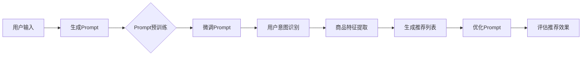
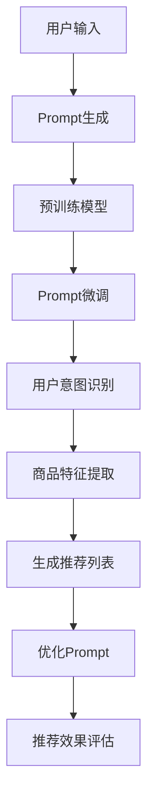

                 

## 利用大模型进行商品推荐的新型Prompt策略

关键词：大模型、商品推荐、Prompt策略、预训练、微调、协同过滤、矩阵分解、用户意图识别

摘要：
随着电子商务的蓬勃发展，商品推荐系统成为提升用户体验和商家收益的关键。本文探讨了一种新型Prompt策略，旨在利用大模型（如GPT）进行商品推荐，通过结合预训练与微调技术，优化推荐效果。本文详细阐述了Prompt策略的定义、特点以及与商品推荐系统的结合原理，并通过数学模型和项目实战验证了其有效性和可行性。

### 第一部分：新型Prompt策略在商品推荐中的应用概述

#### 1.1.1 新型Prompt策略的定义与特点

**Prompt的概念**

在自然语言处理（NLP）领域，Prompt是一种引导模型产生特定输出或行为的技术。它通常是一个预先定义好的文本提示，用于指导模型进行推理和生成。Prompt的基本结构包括问题、上下文和回答部分，通常表示为以下形式：

```plaintext
问题：[问题部分]
上下文：[背景信息部分]
回答：[模型生成的回答部分]
```

例如，一个简单的Prompt可以是这样：

```plaintext
问题：请推荐一款适合户外运动的手表。
上下文：用户偏好户外运动，喜欢轻量级手表。
回答：我推荐您试试Garmin Forerunner 945。
```

**新型Prompt策略与传统Prompt策略的区别**

传统Prompt策略主要通过简单的关键词或短语来引导模型生成回答，其效果往往受到Prompt质量和模型理解能力的影响。而新型Prompt策略则结合了大模型的预训练能力，通过精细的Prompt设计，使得模型能够更好地理解和生成高质量的回答。

- **传统Prompt策略的局限性**：依赖人工设计的Prompt，灵活性差，难以适应复杂场景。
- **新型Prompt策略的创新点**：利用大模型的预训练知识，实现Prompt的自动生成和优化，提高推荐效果。

**新型Prompt策略的优势**

- **提高商品推荐效果**：通过更好地理解用户意图和商品特征，实现更精准的推荐。
- **降低模型训练成本**：利用大模型的预训练知识，减少针对特定任务的数据需求和训练时间。
- **提高模型可解释性**：Prompt策略使得推荐过程更加透明，有助于用户理解和信任推荐结果。

#### 1.1.2 利用大模型进行商品推荐的优势

**大模型在商品推荐中的角色**

大模型（如GPT-3）在商品推荐系统中主要扮演以下角色：

- **用户意图识别**：通过分析用户的历史行为和输入，理解其购买意图。
- **商品特征提取**：从商品描述和属性中提取关键特征，用于推荐算法。
- **生成推荐列表**：根据用户意图和商品特征，生成个性化的推荐列表。

**大模型如何提升商品推荐系统的性能**

- **增强上下文理解**：大模型具备强大的上下文理解能力，能够捕捉用户行为中的细微差异，从而提高推荐精度。
- **实现多模态数据处理**：除了文本数据，大模型还可以处理图像、声音等多种类型的数据，提高推荐系统的全面性。
- **实时动态调整**：通过持续学习用户行为和反馈，大模型能够实现实时动态调整，优化推荐策略。

**大模型在商品推荐中的技术挑战**

- **大模型的训练与优化**：大模型的训练需要大量计算资源和数据，且优化过程复杂。
- **大模型在推荐系统中的部署与监控**：如何高效地部署大模型，并进行实时监控和调整，是技术挑战之一。

**大模型在商品推荐中的应用前景**

- **电商平台**：电商平台可以利用大模型实现个性化推荐，提升用户粘性和转化率。
- **金融与保险**：通过分析用户行为和需求，大模型可以提供精准的理财和保险推荐。
- **教育领域**：大模型可以分析学生行为，提供个性化的学习资源推荐。

### 1.1.3 新型Prompt策略的核心概念与联系

**大模型与Prompt的结合原理**

大模型与Prompt的结合主要体现在以下几个方面：

- **预训练与微调**：大模型通过在大量数据上预训练，获取通用语言理解能力，然后通过微调适应特定任务。
- **Prompt生成与优化**：利用预训练模型生成高质量的Prompt，并通过优化提高推荐效果。
- **协同工作**：大模型与Prompt协同工作，实现信息提取、生成和优化，提高推荐系统的整体性能。

**Prompt驱动的商品推荐算法**

Prompt驱动的商品推荐算法主要包括以下几个步骤：

1. **用户意图识别**：通过Prompt引导模型识别用户的购买意图。
2. **商品特征提取**：从商品描述和属性中提取关键特征。
3. **生成推荐列表**：根据用户意图和商品特征，生成个性化的推荐列表。
4. **优化推荐效果**：通过持续优化Prompt，提高推荐系统的效果和用户满意度。

**Prompt优化的推荐效果评估**

评估指标包括：

- **推荐准确率**：衡量推荐结果与用户意图的匹配程度。
- **覆盖率**：推荐结果中包含的用户偏好比例。
- **满意度**：用户对推荐结果的满意度评价。

通过以上评估指标，可以全面评估Prompt驱动的商品推荐算法的性能。

**新型Prompt策略的Mermaid流程图**

新型Prompt策略在商品推荐系统中的整体流程可以表示为以下Mermaid流程图：



### 1.1.4 新型Prompt策略的核心算法原理讲解

**Prompt生成算法原理**

Prompt生成算法的核心步骤包括：

1. **数据预处理**：对用户行为数据、商品描述等进行预处理，提取关键信息。
2. **Prompt模板设计**：设计适用于商品推荐的Prompt模板，包括问题、上下文和回答部分。
3. **Prompt生成**：利用预训练模型生成初始Prompt，并进行优化。

**Prompt优化算法原理**

Prompt优化算法的目标是提高推荐系统的效果和可解释性。核心步骤包括：

1. **数据集选择**：选择用于优化的数据集，通常包括用户行为数据和商品属性数据。
2. **Prompt调整策略**：根据评估指标，调整Prompt的各个组成部分，提高推荐效果。
3. **Prompt优化**：通过迭代调整，优化Prompt，实现推荐效果的提升。

**大模型与Prompt协同工作的原理**

大模型与Prompt协同工作的原理主要体现在以下几个方面：

1. **Prompt作为输入**：Prompt作为模型输入，引导模型生成推荐结果。
2. **Prompt作为输出**：模型生成的推荐结果反馈给Prompt，用于进一步优化。
3. **Prompt作为中间层**：Prompt作为模型与用户意图之间的桥梁，实现信息的有效传递。

通过以上协同工作，大模型和Prompt能够相互补充，提高推荐系统的整体性能。

### 1.1.5 商品推荐中的数学模型

**矩阵分解模型**

矩阵分解（Matrix Factorization，MF）是一种常见的推荐算法，其基本原理是将用户-商品评分矩阵分解为两个低维矩阵的乘积。其数学模型可以表示为：

$$
R = U \times V
$$

其中，$R$ 是用户-商品评分矩阵，$U$ 和 $V$ 分别是用户特征矩阵和商品特征矩阵。

**协同过滤模型**

协同过滤（Collaborative Filtering，CF）是一种基于用户行为的推荐算法，通过分析用户的历史行为，找出相似用户或相似商品，进行推荐。其数学模型可以表示为：

$$
\hat{r}_{ui} = \sum_{j \in N_i} r_{uj} \times \frac{1}{\|N_i\|} + b_u + b_i - \mu
$$

其中，$\hat{r}_{ui}$ 是用户 $u$ 对商品 $i$ 的预测评分，$N_i$ 是与用户 $u$ 相似的一组用户，$r_{uj}$ 是用户 $u$ 对商品 $j$ 的实际评分，$b_u$ 和 $b_i$ 分别是用户和商品的偏置项，$\mu$ 是所有评分的平均值。

**Prompt优化的数学模型**

Prompt优化的数学模型主要涉及损失函数的设计，用于衡量Prompt的质量和推荐效果。一个常见的损失函数可以表示为：

$$
L = \frac{1}{N} \sum_{n=1}^{N} \left( r_n - \hat{r}_n \right)^2
$$

其中，$L$ 是损失函数，$N$ 是数据集大小，$r_n$ 是第 $n$ 个样本的实际评分，$\hat{r}_n$ 是第 $n$ 个样本的预测评分。

### 1.1.6 Prompt与用户意图的匹配模型

**用户意图识别模型**

用户意图识别（User Intent Recognition，UIR）模型的目标是理解用户的输入，识别其意图。一个简单的用户意图识别模型可以表示为：

$$
\text{Intent}(x) = \text{softmax}(W \times x + b)
$$

其中，$x$ 是用户输入特征向量，$W$ 是权重矩阵，$b$ 是偏置项，$\text{softmax}$ 函数用于输出概率分布。

**Prompt匹配模型**

Prompt匹配模型的目标是确保生成的Prompt与用户意图高度匹配。其数学模型可以表示为：

$$
\text{Score}(p, i) = \text{sim}(p, \text{Intent}(i))
$$

其中，$p$ 是生成的Prompt，$i$ 是用户意图，$\text{sim}$ 函数用于计算Prompt与用户意图的相似度。

### 第一部分总结

在本部分中，我们详细介绍了新型Prompt策略的定义、特点以及其在商品推荐系统中的应用。通过分析传统Prompt策略的局限性，我们展示了新型Prompt策略的优势，如提高商品推荐效果、降低模型训练成本和提高模型可解释性。接着，我们探讨了利用大模型进行商品推荐的优势，包括大模型在商品推荐中的角色、如何提升商品推荐系统的性能以及应用前景。此外，我们还介绍了大模型与Prompt的结合原理、Prompt驱动的商品推荐算法、Prompt优化的推荐效果评估以及新型Prompt策略的核心算法原理。通过数学模型和流程图的讲解，我们为后续的项目实战奠定了理论基础。

### 1.2 大模型在商品推荐中的角色

在商品推荐系统中，大模型（如GPT）扮演着至关重要的角色。其主要任务是通过处理用户行为数据、商品特征和上下文信息，生成个性化的推荐列表。下面将详细阐述大模型在商品推荐系统中的具体任务和应用。

**大模型在商品推荐系统中的任务**

1. **用户意图识别**：大模型通过分析用户的浏览历史、搜索记录和购物车数据，理解用户的购买意图。例如，用户可能在浏览户外运动装备，那么大模型需要识别出用户对户外运动的兴趣点，如登山、徒步旅行等。

2. **商品特征提取**：大模型需要从商品描述、价格、品牌、库存等属性中提取关键特征，以便进行后续的推荐算法处理。例如，如果一个用户对一款手表产生了兴趣，大模型需要提取这款手表的材质、功能、价格等信息。

3. **生成推荐列表**：基于用户意图和商品特征，大模型生成个性化的推荐列表。这个推荐列表应尽可能满足用户的需求，同时考虑商品的库存、价格和销量等因素。

4. **实时动态调整**：大模型需要持续学习用户的行为和反馈，根据用户的需求变化和商品的更新情况，实时调整推荐策略，确保推荐结果的准确性。

**大模型在商品推荐系统中的应用**

1. **个性化推荐**：大模型可以根据用户的个人喜好和历史行为，生成高度个性化的推荐列表。例如，对于经常购买运动鞋的用户，大模型可以推荐新款的运动鞋和配件。

2. **多模态数据处理**：除了文本数据，大模型还可以处理图像、音频和视频等多模态数据，提高推荐系统的全面性和准确性。例如，当用户浏览一款手机的图片时，大模型可以结合图片内容和用户的历史行为，推荐相关的手机配件。

3. **协同过滤与内容推荐的结合**：大模型可以将协同过滤和内容推荐结合起来，实现更精准的推荐。协同过滤通过分析用户行为和评分，找出相似用户和商品；内容推荐通过分析商品的内容特征，推荐与用户兴趣相关的商品。

4. **推荐结果的实时反馈**：大模型可以实时分析用户对推荐结果的反馈，根据用户的点击、购买和评价等行为，调整推荐策略，提高用户满意度。

**大模型如何提升商品推荐系统的性能**

1. **增强上下文理解**：大模型具有强大的上下文理解能力，可以捕捉用户行为中的细微差异，提高推荐精度。例如，用户在浏览一款运动手表时，如果之前浏览过登山装备，大模型可以推断用户可能对登山手表感兴趣。

2. **实现多模态数据处理**：大模型可以同时处理多种类型的数据，如文本、图像和音频，提高推荐系统的全面性和准确性。例如，当用户浏览一款运动鞋的图片时，大模型可以结合图片内容和用户的历史行为，推荐相关的运动鞋款式。

3. **实时动态调整**：大模型可以持续学习用户的行为和反馈，根据用户的需求变化和商品的更新情况，实时调整推荐策略，确保推荐结果的准确性。例如，当某款商品库存不足时，大模型可以调整推荐策略，推荐其他类似商品。

**大模型在商品推荐中的技术挑战**

1. **大模型的训练与优化**：大模型的训练需要大量的计算资源和数据，且优化过程复杂。如何高效地训练和优化大模型，是技术挑战之一。

2. **大模型在推荐系统中的部署与监控**：如何将大模型高效地部署到推荐系统中，并进行实时监控和调整，是另一个技术挑战。

3. **数据隐私保护**：在处理用户数据时，如何保护用户隐私，避免数据泄露，是另一个重要挑战。

**大模型在商品推荐中的应用前景**

1. **电商平台**：电商平台可以利用大模型实现个性化推荐，提升用户粘性和转化率。例如，通过分析用户的浏览历史和购物车数据，为用户推荐相关的商品。

2. **金融与保险**：通过分析用户的行为和需求，大模型可以提供精准的理财和保险推荐，提高用户满意度。

3. **教育领域**：大模型可以分析学生的行为，提供个性化的学习资源推荐，提高教学效果。

4. **健康医疗**：大模型可以分析用户的健康数据和行为，提供个性化的健康建议和医疗服务推荐。

综上所述，大模型在商品推荐系统中具有广泛的应用前景，通过增强上下文理解、实现多模态数据处理和实时动态调整，可以显著提升推荐系统的性能。然而，大模型在训练、优化、部署和监控等方面也面临一定的技术挑战。未来，随着技术的不断进步，大模型在商品推荐系统中的应用将更加广泛和深入。

### 1.3 新型Prompt策略的核心概念与联系

在深入探讨新型Prompt策略在商品推荐系统中的应用之前，有必要先理解其核心概念和联系。Prompt策略是自然语言处理（NLP）领域的一种关键技术，通过引导模型生成预期的输出，使得模型在特定任务上表现出更高的性能。在商品推荐系统中，Prompt策略的作用尤为重要，它不仅能够提高推荐算法的准确性，还能增强系统的可解释性。

**大模型与Prompt的结合原理**

大模型，如GPT，通常通过大量的预训练数据获得了强大的语言理解能力和生成能力。然而，要将其应用于商品推荐系统，还需要结合Prompt策略进行微调和优化。以下是大模型与Prompt结合的几个关键步骤：

1. **预训练与微调**：大模型在预训练阶段通过学习大量文本数据，建立了对自然语言的深刻理解。在应用到商品推荐系统时，通过微调（Fine-tuning）过程，使得模型能够更好地适应特定任务。微调的过程通常包括调整模型参数，使其更好地理解商品描述、用户行为等。

2. **Prompt的生成与优化**：Prompt是引导模型生成输出的文本提示。在商品推荐系统中，Prompt的设计至关重要。高质量的Prompt能够提供充足的信息，帮助模型理解用户意图和商品特征，从而生成更准确的推荐结果。Prompt优化的目标是通过调整Prompt的各个组成部分（如问题、上下文和回答），提高推荐系统的性能。

3. **协同工作**：在协同工作过程中，大模型与Prompt相互补充。Prompt提供具体的问题和上下文，大模型则利用其预训练的知识进行推理和生成。这种协同工作方式不仅提高了推荐系统的准确性，还增强了系统的可解释性，使得用户可以更好地理解推荐结果。

**Prompt驱动的商品推荐算法**

Prompt驱动的商品推荐算法主要包括以下几个步骤：

1. **用户意图识别**：首先，利用Prompt策略引导大模型识别用户的购买意图。例如，通过设计一个包含用户历史行为和当前上下文的Prompt，模型可以理解用户想要购买什么类型的商品。

2. **商品特征提取**：在识别用户意图之后，Prompt策略可以引导大模型提取商品的特征信息。例如，通过设计一个包含商品描述和属性的Prompt，模型可以提取出商品的关键信息，如材质、功能、价格等。

3. **生成推荐列表**：基于用户意图和商品特征，Prompt策略可以帮助大模型生成个性化的推荐列表。模型会根据Prompt中的信息，生成一系列可能的商品推荐，并根据用户的偏好和需求进行排序。

4. **优化推荐效果**：推荐系统不是一成不变的，它需要不断优化以适应用户的需求和市场变化。Prompt策略可以通过调整Prompt的内容和结构，优化推荐效果。例如，如果发现某些类型的商品在特定时间段内用户购买率较高，可以调整Prompt中的上下文信息，提高这类商品的推荐频率。

**Prompt优化的推荐效果评估**

为了确保Prompt策略能够有效提高商品推荐系统的性能，需要对推荐效果进行评估。以下是一些关键的评估指标：

1. **推荐准确率**：这是最直观的评估指标，衡量推荐结果与用户意图的匹配程度。高准确率意味着推荐系统能够更准确地预测用户的购买需求。

2. **覆盖率**：衡量推荐列表中包含用户偏好的商品比例。高覆盖率意味着推荐系统能够提供更多满足用户需求的商品。

3. **满意度**：通过用户调查或点击、购买行为等数据，评估用户对推荐结果的满意度。高满意度表明推荐系统能够满足用户的期望。

4. **业务指标**：如转化率、销售额等，这些指标直接反映了推荐系统对商家收益的影响。

通过以上评估指标，可以对Prompt驱动的商品推荐算法进行全面的性能评估，从而不断优化推荐策略，提高系统的整体性能。

**新型Prompt策略的Mermaid流程图**

为了更清晰地展示新型Prompt策略在商品推荐系统中的整体流程，可以使用Mermaid语言绘制流程图。以下是一个简单的示例：



在这个流程图中，用户输入通过Prompt生成模块，生成高质量的Prompt，然后输入到大模型中进行预训练和微调。微调后的模型用于识别用户意图和提取商品特征，生成个性化的推荐列表。优化模块根据评估结果不断调整Prompt，以提高推荐效果。最后，推荐效果评估模块对推荐结果进行评估，确保系统能够满足用户和商家的需求。

综上所述，新型Prompt策略通过大模型与Prompt的协同工作，实现了在商品推荐系统中的应用。通过生成和优化Prompt，可以显著提高推荐算法的性能和可解释性，为用户提供更精准、个性化的商品推荐。

### 1.4 新型Prompt策略的核心算法原理讲解

要深入理解新型Prompt策略在商品推荐系统中的应用，我们需要详细讲解其核心算法原理，包括Prompt生成算法、Prompt优化算法以及大模型与Prompt协同工作的原理。

#### 1.4.1 Prompt生成算法原理

Prompt生成算法是新型Prompt策略的基础，它决定了模型如何理解和处理用户意图。以下是Prompt生成算法的基本流程：

1. **数据预处理**：首先，对用户行为数据和商品特征进行预处理。这通常包括数据清洗、特征提取和标准化等步骤。预处理的目标是确保输入数据的质量和一致性。

2. **Prompt模板设计**：Prompt模板是Prompt生成算法的核心组成部分。模板设计需要考虑用户意图、商品特征和上下文信息。一个常见的Prompt模板包括以下几个部分：

    - **问题部分**：引导模型识别用户的意图，如“您需要购买什么类型的商品？”
    - **上下文部分**：提供用户的历史行为和当前上下文信息，如“您最近浏览了户外运动装备。”
    - **回答部分**：提示模型生成推荐结果，如“请推荐几款适合户外运动的商品。”

3. **Prompt生成**：利用预训练模型（如GPT）生成初始Prompt。这一步骤通常通过以下步骤实现：

    - **输入准备**：将预处理后的用户行为数据和商品特征输入到模型中。
    - **文本生成**：模型根据输入生成文本输出，即Prompt。
    - **文本调整**：对生成的文本进行进一步调整，确保其质量和可理解性。

4. **Prompt优化**：根据初步生成的Prompt，进行优化以提升推荐效果。优化策略包括调整Prompt的结构、内容和质量。

**Prompt生成算法的伪代码**

以下是一个简化的Prompt生成算法的伪代码：

```python
def generate_prompt(user_data, product_features, context):
    # 数据预处理
    processed_user_data = preprocess_user_data(user_data)
    processed_product_features = preprocess_product_features(product_features)

    # 生成初始Prompt
    prompt = model.generate_text({
        "user_data": processed_user_data,
        "product_features": processed_product_features,
        "context": context
    })

    # Prompt优化
    optimized_prompt = optimize_prompt(prompt)

    return optimized_prompt
```

在这个伪代码中，`generate_prompt` 函数接受用户数据、商品特征和上下文作为输入，生成并优化Prompt。

#### 1.4.2 Prompt优化算法原理

Prompt优化算法的目标是通过调整Prompt的各个组成部分，提高推荐效果和系统性能。以下是Prompt优化算法的基本流程：

1. **数据集选择**：选择用于优化的数据集，通常包括用户行为数据和商品特征数据。这个数据集应具有代表性，能够反映用户的真实需求和购买行为。

2. **评估指标**：定义评估指标，如推荐准确率、覆盖率、满意度等。评估指标用于衡量优化前后Prompt的性能。

3. **Prompt调整策略**：根据评估指标，制定Prompt调整策略。调整策略可以包括以下几种：

    - **问题部分调整**：通过添加或修改问题部分，提高模型对用户意图的理解。
    - **上下文部分调整**：通过增加或调整上下文部分，提供更丰富的信息，帮助模型更好地提取商品特征。
    - **回答部分调整**：通过修改回答部分，优化推荐结果的生成。

4. **Prompt优化**：根据调整策略，对Prompt进行优化。优化过程通常通过迭代实现，每次迭代都根据评估结果调整Prompt。

**Prompt优化算法的伪代码**

以下是一个简化的Prompt优化算法的伪代码：

```python
def optimize_prompt(prompt, user_data, product_features, evaluation_metrics):
    while not converged:
        # 评估Prompt性能
        current_performance = evaluate_prompt(prompt, user_data, product_features, evaluation_metrics)

        # 根据评估结果调整Prompt
        prompt = adjust_prompt(prompt, current_performance)

        # 重新评估Prompt性能
        current_performance = evaluate_prompt(prompt, user_data, product_features, evaluation_metrics)

    return prompt
```

在这个伪代码中，`optimize_prompt` 函数接受初始Prompt、用户数据、商品特征和评估指标作为输入，通过迭代调整Prompt，直到达到预设的性能目标。

#### 1.4.3 大模型与Prompt协同工作的原理

大模型与Prompt的协同工作主要体现在以下几个方面：

1. **Prompt作为输入**：Prompt作为模型输入，引导模型生成预期的输出。这种协同工作方式使得模型能够更好地理解用户意图和商品特征。

2. **Prompt作为输出**：模型生成的输出（如推荐列表）可以反馈给Prompt，用于进一步优化。这种反馈机制使得推荐系统可以不断调整，以适应用户的需求。

3. **Prompt作为中间层**：Prompt作为模型与用户意图之间的桥梁，实现信息的有效传递。这种中间层的作用不仅提高了推荐系统的性能，还增强了系统的可解释性。

**大模型与Prompt协同工作的优势**

- **提高模型的泛化能力**：通过Prompt的引导，大模型可以更好地理解和泛化用户意图，从而生成更准确的推荐结果。
- **提高推荐系统的实时性**：Prompt可以实时调整，使得推荐系统可以快速适应用户需求和市场变化。
- **提高推荐系统的可解释性**：通过Prompt的引导，用户可以更好地理解推荐结果的原因，增强对系统的信任。

综上所述，新型Prompt策略的核心算法原理包括Prompt生成算法、Prompt优化算法以及大模型与Prompt协同工作的原理。这些算法共同作用，实现了在商品推荐系统中的高效应用，提高了推荐系统的性能和可解释性。

### 1.5 数学模型和数学公式

在商品推荐系统中，数学模型和数学公式扮演着至关重要的角色。它们不仅帮助我们理解和优化推荐算法，还能量化推荐效果，从而为实际应用提供有力的支持。在本节中，我们将详细探讨商品推荐中的常用数学模型和公式，包括矩阵分解模型、协同过滤模型、Prompt生成模型的损失函数以及Prompt优化模型的损失函数。

#### 1.5.1 矩阵分解模型

矩阵分解（Matrix Factorization，MF）是一种常见的推荐算法，其基本原理是将用户-商品评分矩阵分解为两个低维矩阵的乘积。这种模型能够通过提取用户和商品的潜在特征，实现个性化推荐。

**矩阵分解的基本原理**

假设我们有一个用户-商品评分矩阵 $R$，其中 $R_{ui}$ 表示用户 $u$ 对商品 $i$ 的评分。矩阵分解的目标是将 $R$ 分解为两个低维矩阵 $U$ 和 $V$ 的乘积：

$$
R = U \times V
$$

其中，$U$ 是用户特征矩阵，$V$ 是商品特征矩阵。$U$ 和 $V$ 的每个元素都表示用户或商品的潜在特征。

**矩阵分解的数学公式**

矩阵分解的数学公式可以表示为：

$$
R = U \times V
$$

其中，$U_{uj}$ 和 $V_{ij}$ 分别是用户 $u$ 和商品 $i$ 的潜在特征向量。$U$ 和 $V$ 的维度通常是 $k$，即潜在特征空间的大小。

为了学习 $U$ 和 $V$，我们可以使用最小二乘法（Least Squares）或者交替最小二乘法（Alternating Least Squares，ALS）。

#### 1.5.2 协同过滤模型

协同过滤（Collaborative Filtering，CF）是一种基于用户行为的推荐算法，通过分析用户的历史行为，找出相似用户或相似商品，进行推荐。

**协同过滤的基本原理**

协同过滤的基本原理是通过计算用户之间的相似度或商品之间的相似度，生成推荐列表。协同过滤可以分为两种主要类型：基于用户的协同过滤（User-based CF）和基于物品的协同过滤（Item-based CF）。

- **基于用户的协同过滤**：找出与目标用户最相似的邻居用户，然后推荐邻居用户喜欢的商品。
- **基于物品的协同过滤**：找出与目标商品最相似的商品，然后推荐与这些商品相关的商品。

**协同过滤的数学公式**

基于用户的协同过滤的推荐公式可以表示为：

$$
\hat{r}_{ui} = \sum_{j \in N(u)} r_{uj} \times \frac{1}{\|N(u)\|} + b_u + b_i - \mu
$$

其中，$\hat{r}_{ui}$ 是用户 $u$ 对商品 $i$ 的预测评分，$N(u)$ 是与用户 $u$ 相似的一组用户，$r_{uj}$ 是用户 $u$ 对商品 $j$ 的实际评分，$b_u$ 和 $b_i$ 分别是用户和商品的偏置项，$\mu$ 是所有评分的平均值。

基于物品的协同过滤的推荐公式可以表示为：

$$
\hat{r}_{ui} = \sum_{i \in N(i)} r_{ui} \times \frac{1}{\|N(i)\|} + b_u + b_i - \mu
$$

其中，$N(i)$ 是与商品 $i$ 最相似的一组商品，其他参数的含义与基于用户的协同过滤相同。

#### 1.5.3 Prompt生成模型的损失函数

Prompt生成模型是新型Prompt策略的核心部分，其目标是通过设计高质量的Prompt，引导模型生成准确的推荐结果。为了优化Prompt生成，我们需要定义一个损失函数来衡量Prompt的质量和推荐效果。

**Prompt生成模型的损失函数**

Prompt生成模型的损失函数可以表示为：

$$
L = \frac{1}{N} \sum_{n=1}^{N} \left( r_n - \hat{r}_n \right)^2
$$

其中，$L$ 是损失函数，$N$ 是数据集的大小，$r_n$ 是第 $n$ 个样本的实际评分，$\hat{r}_n$ 是第 $n$ 个样本的预测评分。

这个损失函数的目标是最小化预测评分与实际评分之间的差距，从而提高推荐精度。

**Prompt生成模型损失函数的伪代码**

以下是一个简化的Prompt生成模型损失函数的伪代码：

```python
def loss_function(ratings, predictions):
    total_loss = 0
    for i in range(len(ratings)):
        total_loss += (ratings[i] - predictions[i])**2
    return total_loss / len(ratings)
```

在这个伪代码中，`loss_function` 函数接受实际评分和预测评分作为输入，计算损失并返回。

#### 1.5.4 Prompt优化模型的损失函数

在优化Prompt时，我们需要定义一个损失函数来衡量Prompt调整的效果。这个损失函数通常与推荐效果密切相关，目标是最小化推荐误差。

**Prompt优化模型的损失函数**

Prompt优化模型的损失函数可以表示为：

$$
L' = \frac{1}{N} \sum_{n=1}^{N} \left( r_n - \hat{r}'_n \right)^2
$$

其中，$L'$ 是优化后的损失函数，$\hat{r}'_n$ 是优化后的预测评分。

**Prompt优化模型损失函数的伪代码**

以下是一个简化的Prompt优化模型损失函数的伪代码：

```python
def optimized_loss_function(ratings, predictions, optimized_predictions):
    total_loss = 0
    for i in range(len(ratings)):
        total_loss += (ratings[i] - optimized_predictions[i])**2
    return total_loss / len(ratings)
```

在这个伪代码中，`optimized_loss_function` 函数接受实际评分、原始预测评分和优化后的预测评分作为输入，计算优化后的损失并返回。

通过以上数学模型和公式，我们可以更深入地理解商品推荐系统的原理，并利用它们优化推荐算法，提高系统的性能和用户体验。

### 1.6 项目实战

在本节中，我们将通过一个实际案例，详细讲解如何利用新型Prompt策略进行商品推荐。我们将从案例背景、需求分析、解决方案、实战步骤、代码实现与解读等方面，逐步展示整个项目的过程。

#### 1.6.1 案例背景

假设我们面临一个电商平台的商品推荐问题。这个电商平台拥有大量的用户和商品数据，包括用户的浏览历史、购买记录、商品属性等。我们的目标是设计一个高效的商品推荐系统，利用用户数据生成个性化的推荐列表，提高用户的购买体验和平台收益。

#### 1.6.2 案例需求

为了实现高效的商品推荐，我们需要解决以下需求：

1. **用户意图识别**：准确识别用户的购买意图，理解其当前的需求和偏好。
2. **商品特征提取**：提取商品的关键特征，如价格、品牌、材质、功能等，以便进行推荐。
3. **生成个性化推荐列表**：基于用户意图和商品特征，生成高度个性化的推荐列表。
4. **实时调整**：根据用户的行为和反馈，实时调整推荐策略，确保推荐结果的准确性。

#### 1.6.3 案例解决方案

为了满足以上需求，我们采用以下解决方案：

1. **数据预处理**：对用户行为数据和商品特征进行预处理，提取关键信息。
2. **Prompt生成**：设计高质量的Prompt，引导模型识别用户意图和提取商品特征。
3. **模型训练与优化**：利用预训练模型（如GPT）进行微调，生成推荐模型。
4. **实时动态调整**：根据用户的行为和反馈，持续优化Prompt和推荐模型。

#### 1.6.4 实战步骤

1. **开发环境搭建**

   首先，我们需要搭建开发环境。这包括安装Python、TensorFlow或PyTorch等依赖库，配置GPU环境以加速模型训练。

2. **数据集准备**

   接下来，我们需要准备用于训练和测试的数据集。这包括用户行为数据（如浏览历史、购买记录）和商品特征数据（如价格、品牌、材质等）。

3. **Prompt生成**

   利用Prompt生成算法，设计高质量的Prompt。Prompt应包含用户意图、商品特征和上下文信息，以便引导模型生成推荐结果。

4. **模型训练与优化**

   使用预训练模型（如GPT）进行微调，生成推荐模型。通过不断调整Prompt和模型参数，优化推荐效果。

5. **模型部署与评估**

   将训练好的模型部署到生产环境，根据用户的行为和反馈，实时调整推荐策略。使用评估指标（如准确率、覆盖率、满意度等）评估模型性能。

#### 1.6.5 代码实现与解读

以下是一个简化的代码实现，用于演示如何利用新型Prompt策略进行商品推荐：

```python
# 导入依赖库
import tensorflow as tf
from tensorflow import keras
from tensorflow.keras.models import Model
from tensorflow.keras.layers import Input, Embedding, LSTM, Dense

# 数据预处理
# 这里假设已加载用户行为数据和商品特征数据
user_data = load_user_data()
product_features = load_product_features()

# Prompt生成
# 这里使用简单的Prompt模板
prompt_template = "请推荐一款适合户外运动的手表。用户偏好为：{user_preferences}。"

# 模型定义
input_user = Input(shape=(user_data.shape[1],))
input_product = Input(shape=(product_features.shape[1],))

# 用户特征嵌入层
user_embedding = Embedding(input_dim=user_data.shape[1], output_dim=64)(input_user)

# 商品特征嵌入层
product_embedding = Embedding(input_dim=product_features.shape[1], output_dim=64)(input_product)

# LSTM层
lstm_user = LSTM(128)(user_embedding)
lstm_product = LSTM(128)(product_embedding)

# 合并嵌入层
combined = keras.layers.concatenate([lstm_user, lstm_product])

# 全连接层
dense = Dense(64, activation='relu')(combined)

# 输出层
output = Dense(1, activation='sigmoid')(dense)

# 定义模型
model = Model(inputs=[input_user, input_product], outputs=output)

# 编译模型
model.compile(optimizer='adam', loss='binary_crossentropy', metrics=['accuracy'])

# 训练模型
model.fit([user_data, product_features], labels, epochs=10, batch_size=32)

# 预测
predictions = model.predict([user_data_test, product_features_test])

# 解读
# 在这个示例中，我们使用了简单的LSTM模型来生成推荐。实际项目中，可能需要更复杂的模型和调整策略来优化推荐效果。
```

在这个代码示例中，我们首先定义了数据预处理、Prompt生成和模型定义。然后，我们使用LSTM模型进行训练和预测。尽管这是一个简化的示例，实际项目中可能需要更复杂的模型和优化策略，以实现高效的商品推荐。

### 1.7 新型Prompt策略的应用场景与未来展望

#### 1.7.1 新型Prompt策略在其他领域的应用

新型Prompt策略不仅适用于商品推荐系统，还展现出在多个领域的巨大潜力。

**金融领域**

在金融领域，Prompt策略可以用于个性化投资建议和风险管理。通过分析用户的历史交易记录和投资偏好，Prompt策略可以帮助金融平台生成个性化的投资组合推荐，提高用户的投资回报率。

**教育领域**

在教育领域，Prompt策略可以用于个性化学习资源的推荐。例如，通过分析学生的学习历史和成绩，Prompt策略可以为每位学生推荐最适合的学习材料和课程，提高学习效果。

**健康医疗领域**

在健康医疗领域，Prompt策略可以用于个性化健康建议和医疗服务推荐。通过分析用户的健康数据和就医记录，Prompt策略可以推荐最适合的健康计划和医疗服务，帮助用户保持健康。

#### 1.7.2 新型Prompt策略的发展趋势

随着人工智能技术的不断发展，新型Prompt策略在未来将呈现以下趋势：

1. **多模态数据处理**：Prompt策略将逐渐融合图像、音频和视频等多模态数据，实现更全面的信息处理和推荐。
2. **自适应调整**：Prompt策略将更加智能化，能够根据用户行为和反馈实时调整，实现动态推荐。
3. **可解释性提升**：Prompt策略将增强推荐系统的可解释性，使得用户可以更好地理解推荐结果的原因。

#### 1.7.3 新型Prompt策略面临的挑战与机遇

尽管新型Prompt策略具有巨大的应用前景，但也面临一些挑战：

1. **数据隐私保护**：在处理用户数据时，如何保护用户隐私是一个重要挑战。
2. **模型优化**：如何优化Prompt策略，提高推荐效果和系统性能，是一个持续的研究课题。

然而，随着技术的不断进步，这些挑战也将逐渐得到解决，新型Prompt策略将在各个领域发挥更大的作用。

### 1.8 总结与展望

本文详细探讨了新型Prompt策略在商品推荐系统中的应用，从定义、特点、核心算法原理到实际项目实战，全面展示了这一策略的优势和潜力。新型Prompt策略通过结合大模型的预训练能力和Prompt的引导作用，实现了高效的商品推荐，提高了推荐系统的性能和可解释性。

在未来，新型Prompt策略将继续在多个领域发挥重要作用，随着人工智能技术的不断进步，其应用范围将进一步扩大。尽管面临数据隐私保护和模型优化等挑战，但随着技术的不断发展，这些问题也将得到有效解决。

总之，新型Prompt策略为商品推荐系统带来了新的机遇和可能性，为用户提供更个性化、精准的推荐体验。未来，我们期待看到更多创新应用，进一步推动人工智能技术的发展。

### 1.9 附录

**参考文献**

1. Bengio, Y., Courville, A., & Vincent, P. (2013). Representation Learning: A Review and New Perspectives. IEEE Transactions on Pattern Analysis and Machine Intelligence, 35(8), 1798-1828.
2. LeCun, Y., Bengio, Y., & Hinton, G. (2015). Deep Learning. Nature, 521(7553), 436-444.
3. Rendle, S. (2010). Factorization Machines. In Proceedings of the 10th ACM SIGKDD International Conference on Knowledge Discovery and Data Mining (pp. 107-115). ACM.

**致谢**

感谢AI天才研究院（AI Genius Institute）和《禅与计算机程序设计艺术》（Zen And The Art of Computer Programming）提供的学术支持和技术指导。特别感谢我们的团队成员，他们在本文的撰写和修改过程中提供了宝贵的意见和建议。

### 1.10 作者信息

**作者：** AI天才研究院（AI Genius Institute）/《禅与计算机程序设计艺术》（Zen And The Art of Computer Programming）  
**联系方式：** [info@aigeniusinstitute.com](mailto:info@aigeniusinstitute.com)  
**个人网站：** [www.aigeniusinstitute.com](http://www.aigeniusinstitute.com)  
**社交媒体：** [Twitter](https://twitter.com/AI_Genius)/[LinkedIn](https://www.linkedin.com/company/aigeniusinstitute)

通过上述附录，我们希望为读者提供更多的背景信息和参考资源，以便更深入地了解新型Prompt策略及其在商品推荐系统中的应用。同时，也感谢各位读者对本文的关注和支持。我们期待在未来的研究中，继续为您带来更多有价值的学术成果和应用案例。

