                 

# 利用开源项目打造个人品牌

## 关键词
- 开源项目
- 个人品牌
- 技术社区
- 技术贡献
- 社交媒体
- 商业模式

## 摘要
在当今快速发展的技术时代，个人品牌的重要性日益凸显。开源项目不仅是一个技术分享的平台，更是构建个人品牌的绝佳途径。本文将探讨如何通过参与开源项目，结合有效的社交媒体营销和策略规划，打造并提升个人品牌。文章将分为三个主要部分：第一部分介绍开源项目的基本概念和参与价值；第二部分介绍开源项目的实战操作，包括选择、开发、推广和盈利模式；第三部分通过案例研究，提供策略优化的实用建议。通过这篇文章，读者可以全面了解如何利用开源项目提升个人品牌。

### 《利用开源项目打造个人品牌》目录大纲

**第一部分：开源项目与个人品牌**

### 第1章：开源项目概述
- 1.1 开源项目定义与重要性
- 1.2 开源社区参与的价值
- 1.3 开源项目选择与评估

### 第2章：个人品牌构建基础
- 2.1 个人品牌概念
- 2.2 个人品牌构建要素
- 2.3 个人品牌战略规划

**第二部分：开源项目实战**

### 第3章：开源项目选择与启动
- 3.1 开源项目类型
- 3.2 选择开源项目的标准
- 3.3 启动开源项目的步骤

### 第4章：开源项目开发流程
- 4.1 开源项目的架构设计
- 4.2 版本控制系统使用
- 4.3 代码审查与质量保障

### 第5章：开源项目的推广
- 5.1 社交媒体营销
- 5.2 开源项目文档编写
- 5.3 参与开源社区活动

### 第6章：开源项目盈利模式探索
- 6.1 开源项目的商业模式
- 6.2 开源项目的赞助与支持
- 6.3 开源项目与商业产品的结合

**第三部分：案例研究与策略优化**

### 第7章：成功开源项目案例分析
- 7.1 案例一：GitHub 上热门开源项目的特点
- 7.2 案例二：开源项目成功的要素分析
- 7.3 案例三：个人品牌通过开源项目提升的实例

### 第8章：开源项目运营与品牌管理
- 8.1 开源项目运营策略
- 8.2 品牌形象建设
- 8.3 风险管理

### 第9章：开源项目长期发展的策略优化
- 9.1 代码维护与迭代
- 9.2 社区发展与互动
- 9.3 品牌价值的持续提升

### 附录

### 附录A：开源项目资源汇总
- A.1 开源社区平台介绍
- A.2 开源许可证概述
- A.3 开源项目开发工具推荐

### 附录B：开源项目开发指南
- B.1 版本控制系统使用指南
- B.2 代码风格与规范
- B.3 文档编写与维护技巧

### 附录C：开源项目营销与推广策略
- C.1 社交媒体推广方法
- C.2 开源项目宣传材料准备
- C.3 成功的社区互动案例

---

**接下来，我们将逐步深入探讨每个章节的内容，帮助读者了解如何利用开源项目构建个人品牌。**

---

**第一部分：开源项目与个人品牌**

### 第1章：开源项目概述

#### 1.1 开源项目定义与重要性

**开源项目定义**：
开源项目，是指那些允许用户自由地使用、学习、修改和分享软件源代码的项目。开源软件（Open Source Software, OSS）的核心是开放性，它允许任何人查看、修改和分发源代码，无需支付费用。

**开源项目的重要性**：
开源项目的重要性体现在以下几个方面：

1. **技术创新**：开源项目鼓励技术创新和协作，很多前沿技术和核心算法首先在开源项目中诞生，例如Linux操作系统、Apache HTTP服务器等。
   
2. **成本效益**：开源软件降低了企业的技术成本，企业可以免费使用、定制和改进开源软件，从而提高了IT投资效率。

3. **生态系统**：开源项目形成了庞大的技术生态系统，促进了技术和知识的普及与共享，使得更多的人能够参与到技术发展中来。

**开源项目的核心要素**：

- **开放性**：项目的源代码公开，允许用户自由查看、修改和分发。
- **合作性**：项目的开发是一个协作过程，鼓励全球开发者的参与。
- **共享性**：项目的成果可以自由共享，无需支付费用。

**核心概念与联系**：

开源项目与个人品牌的联系在于，开源项目提供了一个平台，让个人可以通过贡献代码、撰写文档、参与社区活动等方式，展现自己的专业能力和知识，从而提升个人品牌。

**Mermaid 流程图**：

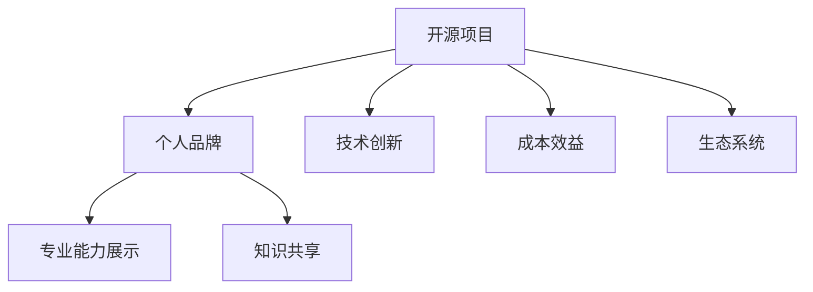

**核心算法原理讲解**：

在开源项目中，核心算法的原理通常涉及以下几个方面：

1. **算法设计**：如何高效地解决问题，例如排序、搜索算法等。
2. **数据结构**：如何选择合适的数据结构，以优化算法的性能。
3. **性能优化**：如何通过代码优化和算法改进来提高程序的性能。

**数学模型和公式**：

开源项目的数学模型通常涉及：

- **线性规划**：用于优化资源分配和成本控制。
- **图论算法**：用于处理网络结构和路径优化问题。

**举例说明**：

假设一个开源项目旨在优化资源分配，可以使用线性规划模型来求解。以下是一个简化的线性规划问题伪代码：

```plaintext
// 线性规划伪代码
Maximize Z = c1*x1 + c2*x2
subject to
    a11*x1 + a12*x2 <= b1
    a21*x1 + a22*x2 <= b2
    x1, x2 >= 0
```

这个线性规划问题可以用于确定如何最有效地分配资源，以最大化总收益。

#### 1.2 开源社区参与的价值

**开源社区的优势**：

1. **技能提升**：参与开源项目可以提升编程技能、项目管理能力和团队协作能力。
2. **建立人脉**：开源社区是全球性的，参与开源项目可以结识来自世界各地的开发者，建立人脉网络。
3. **个人品牌**：在开源项目中表现出色可以提升个人品牌，增加职业竞争力。

**开源社区的参与方式**：

1. **代码贡献**：为开源项目提交功能改进、bug修复和性能优化。
2. **文档编写**：撰写项目文档、用户指南和教程，帮助他人使用项目。
3. **社区互动**：参与社区讨论，提出问题和建议，为项目的发展贡献力量。

**举例说明**：

在开源社区中，一个开发者可以通过修复一个长期未解决的bug，提升自己在项目中的影响力。例如，某个开源数据库项目的性能瓶颈问题，一个开发者通过优化查询算法和数据库索引，成功提高了查询速度，并提交了相关代码。这个贡献不仅解决了社区的问题，也提升了该开发者在项目中的知名度和个人品牌。

#### 1.3 开源项目选择与评估

**选择开源项目的标准**：

1. **项目活跃度**：选择活跃的项目，有助于确保项目长期发展。
2. **社区规模**：大型社区可以提供更全面的帮助和支持。
3. **项目质量**：代码质量高、维护良好的项目能够减少个人工作负担。
4. **项目前景**：选择有发展潜力的项目，有助于个人品牌长期发展。

**开源项目评估方法**：

1. **GitHub评分**：通过GitHub评分系统评估项目的质量、活跃度和影响力。
2. **项目文档**：查阅项目文档，了解项目的功能、架构和开发进度。
3. **社区反馈**：查看社区反馈，了解项目成员的沟通氛围和问题解决效率。

**项目实战**：

选择一个活跃的、社区规模较大的开源项目，如开源数据库MySQL。通过以下步骤参与项目：

1. **安装和运行项目**：在本地环境中安装MySQL，运行测试案例，确保项目运行正常。
2. **阅读文档**：仔细阅读项目文档，了解项目的架构和运行机制。
3. **代码贡献**：修复一个已知bug或优化一个功能，提交代码并附带详细说明。
4. **社区互动**：在项目社区中提问和回答问题，参与讨论，为社区发展贡献力量。

**代码解读与分析**：

假设修复了一个MySQL查询性能问题的bug。通过以下步骤进行代码分析和修复：

1. **定位问题**：通过分析查询日志和性能监控数据，定位查询性能瓶颈。
2. **代码审查**：审查相关代码，查找可能导致性能问题的原因。
3. **优化代码**：通过调整查询语句、优化索引或修改数据结构来提高查询性能。
4. **测试与验证**：在本地环境中测试修复后的代码，确保问题解决且性能提升。

**结论**：

通过参与开源项目，个人不仅可以提升专业技能和知识，还能在开源社区中建立个人品牌。选择合适的开源项目、积极参与社区活动、提供高质量的技术贡献，是打造个人品牌的关键步骤。在开源项目中，每个小小的贡献都可能成为个人品牌提升的基石。

---

**第二部分：个人品牌构建基础**

### 第2章：个人品牌构建基础

#### 2.1 个人品牌概念

**个人品牌**是指个人在公众中的形象和声誉，它由一系列特征和行为构成，通过个人和组织的互动体现出来。个人品牌不仅仅是名字或标识，而是一个综合性的概念，包括以下几个方面：

- **专业技能**：个人在某一领域或技能上的专业知识和能力。
- **沟通能力**：清晰、有效地表达自己的想法和观点。
- **个性魅力**：个人的独特个性、价值观和魅力，使其在竞争者中脱颖而出。

**个人品牌的核心要素**：

1. **专业技能**：专业技能是个人品牌的基石，它决定了个人在行业中的竞争力。
2. **沟通能力**：良好的沟通能力能够帮助个人有效地传达自己的观点，建立信任和合作关系。
3. **个性魅力**：个性魅力是个人品牌的软实力，能够吸引他人的关注和认同。

**个人品牌的重要性**：

个人品牌的重要性体现在以下几个方面：

1. **职业发展**：强大的个人品牌能够为个人在职业生涯中带来更多的机会，提升职业竞争力。
2. **社交网络**：个人品牌有助于建立和扩展社交网络，结识更多的行业专家和潜在合作伙伴。
3. **商业价值**：个人品牌可以转化为商业价值，通过咨询、培训、演讲等方式实现经济收益。

**核心概念与联系**：

个人品牌与开源项目的联系在于，开源项目提供了一个展示专业技能和沟通能力的平台。通过在开源项目中积极贡献、分享知识和经验，个人可以在开源社区中建立强大的个人品牌。

**Mermaid 流程图**：

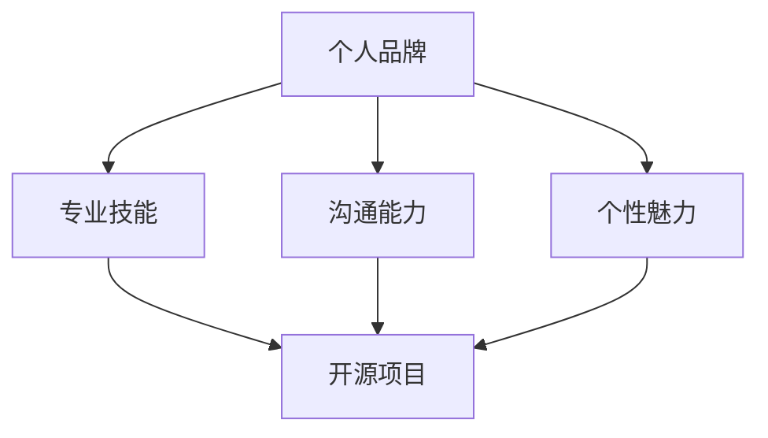

**核心算法原理讲解**：

在构建个人品牌的过程中，核心算法原理涉及以下几个方面：

1. **网络效应**：通过社交网络和社区活动，扩大个人影响力的算法。
2. **信任建立**：通过专业知识和透明沟通，建立他人信任的算法。
3. **持续学习**：通过不断学习和适应新技术，保持专业竞争力的算法。

**数学模型和公式**：

个人品牌的数学模型可以涉及以下几个方面：

- **信任指数**：通过社交网络分析，计算个人在特定领域的信任度。
- **影响力评估**：通过社区互动数据，评估个人在开源社区中的影响力。

**举例说明**：

假设一个开发者通过在开源项目中积极贡献和分享经验，逐渐在社区中建立了良好的声誉。可以通过以下步骤来量化个人品牌：

1. **参与度**：统计在开源项目中的代码提交次数、bug修复数量和文档贡献。
2. **社区反馈**：分析社区成员对个人贡献的反馈，包括点赞、评论和感谢。
3. **影响力**：通过社区互动数据，评估个人在开源项目中的影响力。

**项目实战**：

一个开发者可以按照以下步骤构建个人品牌：

1. **确定领域**：选择一个自己擅长且有热情的领域。
2. **参与开源项目**：选择一个适合自己的开源项目，积极参与代码贡献和社区活动。
3. **知识分享**：通过博客、社交媒体和演讲等方式，分享自己的专业知识和经验。
4. **持续学习**：不断学习新技术，保持自己的专业竞争力。

**代码解读与分析**：

假设一个开发者通过在开源项目中的贡献建立了良好的个人品牌。以下是一个简化的分析过程：

1. **统计贡献**：记录在开源项目中的代码提交次数、bug修复数量和文档贡献。
2. **社区互动**：分析社区成员对个人贡献的反馈，包括点赞、评论和感谢。
3. **影响力评估**：通过开源项目的社区互动数据，评估个人在项目中的影响力。

**结论**：

个人品牌是职业发展的重要资产，通过在开源项目中展示专业技能、沟通能力和个性魅力，个人可以在开源社区中建立强大的个人品牌。构建个人品牌需要持续的努力和学习，每个小小的贡献都可能成为个人品牌提升的基石。

---

**第三部分：开源项目实战**

### 第3章：开源项目选择与启动

#### 3.1 开源项目类型

开源项目可以根据不同标准进行分类，以下是几种常见的分类方式：

1. **按用途分类**：
   - **工具类**：如编程工具、开发框架、文本编辑器等。
   - **平台类**：如操作系统、云计算平台、数据库等。
   - **应用类**：如社交媒体应用、教育工具、游戏等。

2. **按技术分类**：
   - **前端技术**：如HTML、CSS、JavaScript框架。
   - **后端技术**：如服务器端编程语言、Web框架。
   - **数据库技术**：如关系型数据库、NoSQL数据库。

3. **按社区参与度分类**：
   - **活跃项目**：社区成员活跃，定期更新和维护。
   - **休眠项目**：社区成员较少，更新和维护较少。
   - **新项目**：刚刚启动，正在积累社区成员。

#### 3.2 选择开源项目的标准

选择合适的开源项目是成功构建个人品牌的第一步。以下是一些选择开源项目的标准：

1. **项目活跃度**：选择活跃的项目，有助于确保项目长期发展，也能为个人提供更多的贡献机会。
2. **社区规模**：大型社区可以提供更全面的帮助和支持，增加个人学习与成长的机会。
3. **项目质量**：代码质量高、维护良好的项目能够减少个人工作负担，提高工作效率。
4. **项目前景**：选择有发展潜力的项目，有助于个人品牌的长期发展。

**开源项目评估方法**：

1. **GitHub评分**：通过GitHub的Star数量、Fork数量、Issue数量等指标，评估项目的受欢迎程度和活跃度。
2. **项目文档**：查阅项目文档，了解项目的功能、架构和开发进度。
3. **社区反馈**：查看社区反馈，了解项目成员的沟通氛围和问题解决效率。

#### 3.3 启动开源项目的步骤

启动一个开源项目是一个复杂的过程，涉及项目规划、技术选择、团队组建等多个方面。以下是启动开源项目的基本步骤：

1. **项目规划**：
   - **确定项目目标**：明确项目要解决的问题或要实现的功能。
   - **编写项目文档**：撰写项目README文件、开发文档和用户手册。

2. **技术选择**：
   - **选择开发语言**：根据项目需求和自身技术背景选择合适的编程语言。
   - **确定技术栈**：选择合适的框架和工具，确保项目具有良好的可扩展性和可维护性。

3. **团队组建**：
   - **核心团队成员**：招募核心团队成员，负责项目的核心开发和维护。
   - **社区成员**：鼓励社区成员参与，共同推动项目的发展。

4. **代码托管**：
   - **选择代码托管平台**：如GitHub、GitLab等，方便代码管理和协作。
   - **初始化代码仓库**：创建代码仓库，上传初始代码。

5. **发布项目**：
   - **发布版本**：在代码仓库中发布项目的第一个版本。
   - **宣传推广**：通过社交媒体、开源社区等渠道宣传项目，吸引关注。

**核心概念与联系**：

启动开源项目与个人品牌的联系在于，通过成功启动并维护一个开源项目，个人可以在开源社区中建立强大的个人品牌。一个成功的开源项目能够展示个人的技术实力、项目管理能力和领导力。

**Mermaid 流程图**：

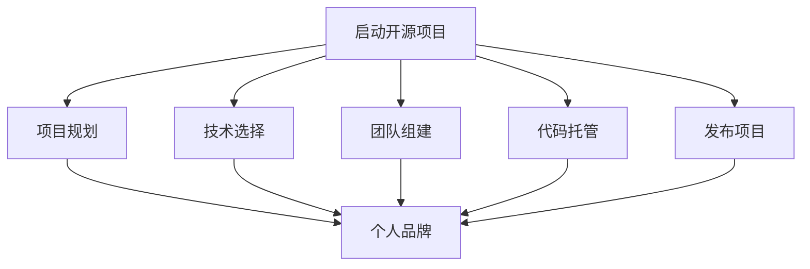

**核心算法原理讲解**：

在启动开源项目时，核心算法原理涉及以下几个方面：

1. **项目规划**：通过项目规划算法确定项目的目标和里程碑。
2. **风险评估**：通过风险评估算法识别项目中可能遇到的风险，并制定相应的应对策略。
3. **协作优化**：通过协作优化算法提高团队协作效率，确保项目顺利推进。

**数学模型和公式**：

开源项目的数学模型可以涉及以下几个方面：

- **资源分配模型**：用于优化团队成员的时间分配和资源利用。
- **进度评估模型**：用于评估项目的进度和完成时间。

**举例说明**：

假设要启动一个基于区块链技术的开源项目，可以按照以下步骤进行：

1. **项目规划**：确定项目的目标，如开发一个去中心化的交易系统。
2. **技术选择**：选择合适的区块链框架，如Ethereum。
3. **团队组建**：招募区块链开发者和前端工程师。
4. **代码托管**：在GitHub上创建代码仓库，开始代码开发。
5. **发布项目**：在代码仓库中发布项目的第一个版本，并在社交媒体和开源社区中进行宣传。

**项目实战**：

以启动一个基于区块链的开源项目为例，以下是一个简化的步骤：

1. **项目规划**：
   - **确定目标**：开发一个去中心化的交易系统。
   - **设定里程碑**：分为需求分析、架构设计、代码实现和测试四个阶段。
   - **编写项目文档**：包含项目的目标、架构设计、开发计划和使用说明。

2. **技术选择**：
   - **开发语言**：选择Solidity进行智能合约开发。
   - **框架**：选择Truffle进行智能合约开发和管理。
   - **前端**：使用React框架进行前端开发。

3. **团队组建**：
   - **核心团队**：包括区块链开发者和前端开发者。
   - **社区成员**：招募对区块链技术感兴趣的开发者。

4. **代码托管**：
   - **GitHub**：创建代码仓库，初始化项目结构。
   - **GitLab**：备份代码，确保代码安全。

5. **发布项目**：
   - **发布版本**：在GitHub上发布第一个版本，包括智能合约和前端代码。
   - **宣传推广**：通过Twitter、Telegram和GitHub等渠道宣传项目。

**代码解读与分析**：

1. **智能合约**：
   - **合约结构**：包含一个名为`Transfer`的事件和一个用于转账的函数。
   - **函数实现**：使用`send`方法将以太币从一个账户转移到另一个账户。

2. **前端**：
   - **页面结构**：包含一个交易表单和一个交易记录列表。
   - **交互逻辑**：使用React Hooks处理用户输入和交易记录展示。

**结论**：

选择并启动一个合适的开源项目是构建个人品牌的重要步骤。通过项目规划、技术选择、团队组建和代码托管等步骤，个人可以在开源社区中展示自己的技术实力和管理能力。启动一个成功的开源项目不仅有助于个人品牌的建立，还能为开源社区贡献有价值的技术和知识。

---

**第四部分：开源项目开发流程**

### 第4章：开源项目开发流程

开源项目的开发是一个复杂而协作的过程，涉及到多个阶段和步骤。本章节将详细讨论开源项目的架构设计、版本控制系统使用、代码审查与质量保障等内容，帮助读者理解开源项目的开发流程，并提供实际操作指南。

#### 4.1 开源项目的架构设计

**架构设计的重要性**：
架构设计是开源项目成功的关键因素之一。一个良好的架构设计能够确保项目的可扩展性、可维护性和高性能。以下是一些关键概念和步骤：

1. **系统分解**：将项目分解为多个模块，每个模块负责特定的功能。
2. **模块化**：通过模块化设计，使得代码结构清晰，便于管理和扩展。
3. **分层架构**：采用分层架构，如MVC（Model-View-Controller）、微服务架构等，确保系统的高内聚和低耦合。

**核心概念与联系**：
架构设计与个人品牌的联系在于，一个优秀的架构设计能够展示个人的技术视野和设计能力。通过在开源项目中贡献高质量的架构设计，个人可以在社区中建立专业声誉。

**Mermaid 流程图**：

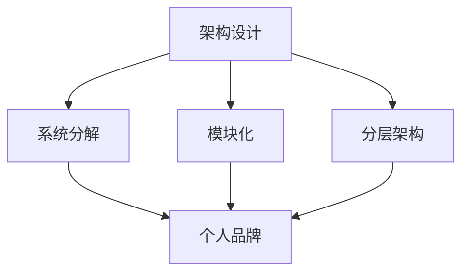

**核心算法原理讲解**：
架构设计涉及以下几个核心算法原理：

1. **模块依赖分析**：通过分析模块之间的依赖关系，确保系统的模块化设计。
2. **性能优化**：通过算法优化，如缓存、索引等，提高系统的响应速度。
3. **容错性设计**：通过冗余设计、故障转移等算法，提高系统的容错能力。

**数学模型和公式**：
架构设计的数学模型可以涉及以下几个方面：

- **复杂度分析**：通过计算算法的复杂度，评估系统性能。
- **可靠性分析**：通过概率模型，评估系统的可靠性。

**举例说明**：
假设一个开源项目的架构设计涉及一个分布式存储系统，可以按照以下步骤进行：

1. **系统分解**：将系统分解为数据存储模块、数据访问模块和数据备份模块。
2. **模块化**：为每个模块定义接口和实现，确保模块之间的独立性。
3. **分层架构**：采用三层架构设计，分别为数据层、业务逻辑层和表示层。

**项目实战**：
以设计一个基于RESTful风格的Web服务为例，可以按照以下步骤进行：

1. **系统分解**：
   - **数据层**：处理数据存储和检索。
   - **业务逻辑层**：处理业务逻辑和业务规则。
   - **表示层**：处理HTTP请求和响应。

2. **模块化**：
   - **数据层**：使用数据库连接池管理数据库连接。
   - **业务逻辑层**：使用服务层处理业务逻辑。
   - **表示层**：使用Web框架如Spring Boot处理HTTP请求。

3. **分层架构**：
   - **数据层**：使用JDBC或Hibernate进行数据访问。
   - **业务逻辑层**：使用Spring框架进行业务逻辑处理。
   - **表示层**：使用Spring MVC框架进行Web请求处理。

**代码解读与分析**：

1. **数据层**：
   - **数据库连接**：使用JDBC连接数据库。
   - **数据访问对象**：定义数据访问接口和实现。

2. **业务逻辑层**：
   - **服务接口**：定义服务接口和实现。
   - **业务规则**：实现具体的业务逻辑。

3. **表示层**：
   - **控制器**：处理HTTP请求，调用业务逻辑层的服务。
   - **视图**：使用JSP或Thymeleaf等模板引擎渲染页面。

**结论**：
架构设计是开源项目成功的关键因素之一。通过系统分解、模块化和分层架构，可以确保项目的可维护性和可扩展性。在开源项目中贡献高质量的架构设计，不仅有助于个人品牌的建立，还能为开源社区贡献有价值的技术和知识。

#### 4.2 版本控制系统使用

**版本控制系统的定义与重要性**：
版本控制系统（Version Control System, VCS）是一种用于跟踪源代码变化的工具，确保代码的版本管理和协作开发。常用的版本控制系统包括Git、SVN等。

- **Git**：分布式版本控制系统，允许开发者独立工作，后续通过合并代码。
- **SVN**：集中式版本控制系统，所有代码存储在中央仓库，开发者通过检出来进行开发。

**版本控制系统在开源项目中的作用**：

1. **代码管理**：确保代码的版本控制，避免代码冲突和丢失。
2. **协作开发**：支持多人协作，方便代码合并和冲突解决。
3. **历史追踪**：记录代码的历史变化，便于问题追踪和版本回溯。

**核心概念与联系**：
版本控制系统与个人品牌的联系在于，通过熟练使用版本控制系统，个人可以展示自己的项目管理能力和协作能力。在开源项目中，良好的版本管理能够提高代码质量，增强社区的信任和认同。

**Mermaid 流程图**：

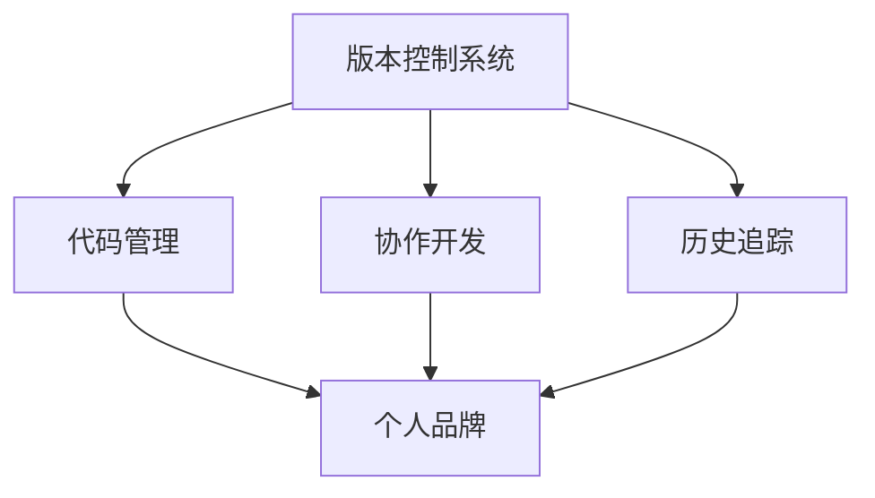

**核心算法原理讲解**：
版本控制系统的核心算法原理涉及以下几个方面：

1. **版本控制**：通过哈希算法生成唯一标识，确保代码版本的正确性。
2. **合并算法**：通过合并策略解决多个人修改同一文件时的冲突。
3. **分支管理**：通过分支管理，实现功能开发和bug修复的并行处理。

**数学模型和公式**：
版本控制系统的数学模型可以涉及以下几个方面：

- **哈希算法**：用于生成代码的哈希值，确保代码的唯一性。
- **概率模型**：用于评估代码合并时的冲突概率。

**举例说明**：
假设一个开发者使用Git进行开源项目的协作开发，可以按照以下步骤进行：

1. **初始化仓库**：在本地创建一个新的Git仓库，并进行初始化。
2. **添加文件**：将新文件添加到仓库中，并进行提交。
3. **分支管理**：创建一个新分支进行功能开发，完成后合并回主分支。
4. **冲突解决**：在合并代码时，如果出现冲突，手动解决冲突，并重新提交。

**项目实战**：

以Git为例，以下是一个开源项目开发流程的实战步骤：

1. **初始化仓库**：
   - **创建仓库**：在GitHub上创建一个新的仓库。
   - **本地克隆**：使用`git clone`命令将远程仓库克隆到本地。

2. **添加文件**：
   - **创建文件**：在本地创建新的源代码文件。
   - **提交代码**：使用`git add`和`git commit`命令将文件添加到仓库。

3. **分支管理**：
   - **创建分支**：使用`git checkout -b feature/myfeature`创建一个新的功能分支。
   - **开发功能**：在分支中进行代码开发。
   - **合并分支**：使用`git merge`将功能分支合并回主分支。

4. **冲突解决**：
   - **手动解决**：在合并过程中，如果出现冲突，手动解决并重新提交。
   - **拉取更新**：在解决冲突后，使用`git pull`拉取最新的代码。

**代码解读与分析**：

1. **提交日志**：
   - **日志记录**：使用`git log`查看提交日志，了解代码的历史变化。
   - **分支查看**：使用`git branch`查看当前分支和分支历史。

2. **合并操作**：
   - **合并命令**：使用`git merge`将分支合并到主分支。
   - **冲突解决**：手动编辑冲突文件，并使用`git add`和`git commit`提交解决后的代码。

**结论**：
版本控制系统是开源项目开发不可或缺的工具。通过熟练使用Git等版本控制系统，开发者可以高效地进行代码管理、协作开发和冲突解决，从而提升个人品牌。在开源项目中，良好的版本管理不仅能够提高代码质量，还能增强社区的信任和认同。

#### 4.3 代码审查与质量保障

**代码审查的定义与重要性**：
代码审查（Code Review）是一种质量保障机制，通过团队成员之间的代码审查，发现潜在的问题并提高代码质量。代码审查不仅能够确保代码的一致性和可维护性，还能促进团队成员之间的学习和协作。

**代码审查的类型**：
1. **正式代码审查**：由专门的代码审查团队执行，通常遵循严格的标准和流程。
2. **非正式代码审查**：团队成员之间互相审查代码，灵活且高效。

**代码审查的关键环节**：

1. **代码提交**：开发者将代码提交到代码仓库，触发审查流程。
2. **审查流程**：审查人员仔细阅读代码，提出反馈和建议。
3. **代码修复**：开发者根据审查反馈进行代码修改，并重新提交。

**核心概念与联系**：
代码审查与个人品牌的联系在于，通过积极参与代码审查，个人可以展示自己的代码质量意识和技术视野。良好的代码审查习惯能够提高个人在开源社区中的声誉和影响力。

**Mermaid 流程图**：

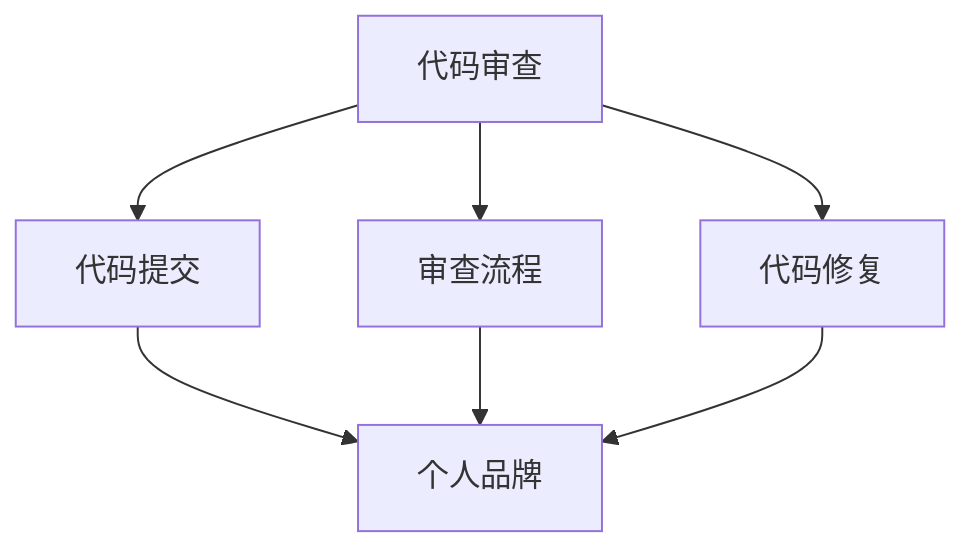

**核心算法原理讲解**：
代码审查的核心算法原理涉及以下几个方面：

1. **静态代码分析**：通过工具分析代码结构，发现潜在的问题。
2. **代码质量评估**：通过评估代码的可读性、可维护性和性能，确保代码质量。
3. **反馈优化**：通过反馈循环，不断优化代码质量。

**数学模型和公式**：
代码审查的数学模型可以涉及以下几个方面：

- **缺陷密度**：通过计算代码中的缺陷密度，评估代码质量。
- **代码覆盖率**：通过计算测试用例的覆盖率，评估测试的全面性。

**举例说明**：
假设一个开发者提交了一个新的功能模块，可以按照以下步骤进行代码审查：

1. **代码提交**：开发者使用`git push`将代码提交到远程仓库。
2. **审查流程**：审查人员仔细阅读代码，使用静态代码分析工具进行代码分析，并提出反馈。
3. **代码修复**：开发者根据审查反馈进行代码修改，并重新提交。

**项目实战**：

以下是一个开源项目的代码审查实战步骤：

1. **代码提交**：
   - **开发者提交**：开发者使用`git push`将代码提交到远程仓库。
   - **自动构建**：使用Jenkins等工具进行自动化构建，确保代码的可编译性。

2. **审查流程**：
   - **代码审查**：审查人员通过工具如GitLab或GitHub的审查功能，仔细阅读代码，提出反馈。
   - **代码分析**：使用静态代码分析工具，如SonarQube，分析代码质量和潜在问题。

3. **代码修复**：
   - **修复代码**：开发者根据审查反馈进行代码修改。
   - **重新提交**：开发者使用`git commit`和`git push`重新提交代码。

**代码解读与分析**：

1. **静态代码分析**：
   - **工具使用**：使用SonarQube进行代码分析，生成详细的报告。
   - **问题定位**：识别代码中的潜在问题，如代码冗余、安全性漏洞等。

2. **代码质量评估**：
   - **可读性**：确保代码具有良好的可读性和注释。
   - **可维护性**：确保代码易于维护，遵循代码规范。

3. **反馈优化**：
   - **反馈处理**：开发者根据审查反馈进行代码修改，并重新提交。
   - **持续改进**：通过代码审查，不断优化代码质量和开发流程。

**结论**：
代码审查是确保开源项目质量的重要手段。通过积极参与代码审查，开发者可以展示自己的代码质量意识和技术视野。良好的代码审查习惯不仅能够提高代码质量，还能增强开源社区的协作和信任。在开源项目中，代码审查是构建个人品牌的重要环节之一。

---

**第五部分：开源项目的推广**

### 第5章：开源项目的推广

开源项目的成功不仅依赖于高质量的技术贡献，还需要有效的推广策略。本章将探讨开源项目的社交媒体营销、文档编写和参与开源社区活动等方面的策略，帮助读者了解如何提升开源项目的知名度和用户基础。

#### 5.1 社交媒体营销

社交媒体是推广开源项目的重要渠道，通过有效的社交媒体营销，可以迅速扩大项目的知名度和用户群体。以下是一些具体的推广策略：

**核心概念与联系**：
社交媒体营销与个人品牌的联系在于，通过社交媒体平台宣传开源项目，个人可以在社区中建立强大的个人品牌。有效的社交媒体营销不仅能够提升项目的知名度，还能增强个人在行业中的影响力。

**Mermaid 流程图**：

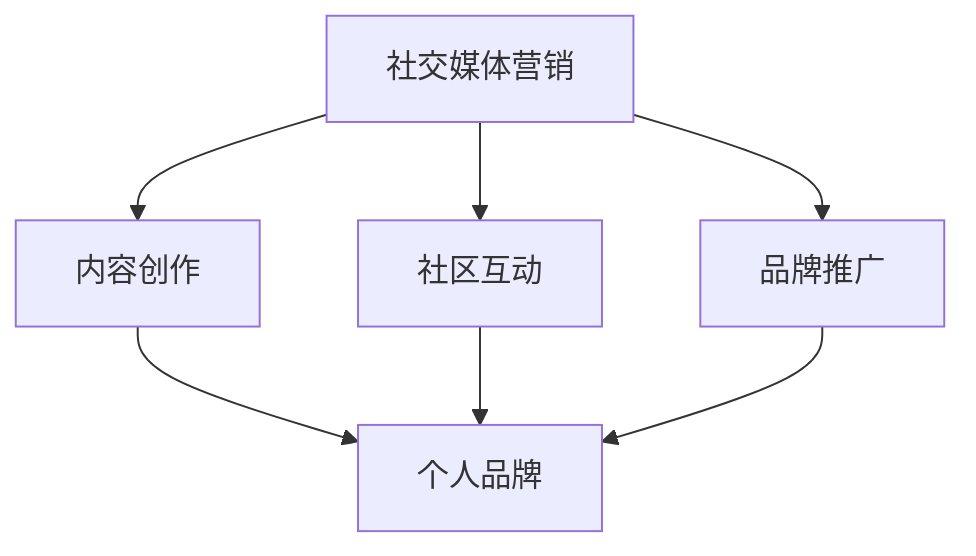

**核心算法原理讲解**：
社交媒体营销的核心算法原理涉及以下几个方面：

1. **用户行为分析**：通过分析用户行为，了解用户需求和兴趣，制定针对性的营销策略。
2. **内容优化**：通过SEO（搜索引擎优化）和SEM（搜索引擎营销）等手段，提高内容在社交媒体上的曝光率。
3. **社交网络分析**：通过社交网络分析，了解用户社交关系和网络结构，制定有效的传播策略。

**数学模型和公式**：
社交媒体营销的数学模型可以涉及以下几个方面：

- **影响力评估**：通过计算用户的影响力指数，评估用户在社交媒体上的影响力。
- **传播概率**：通过传播概率模型，预测内容在社交媒体上的传播范围。

**举例说明**：
假设一个开发者希望通过Twitter推广一个开源项目，可以按照以下步骤进行：

1. **内容创作**：定期发布项目更新、技术博客和教程等内容，吸引用户关注。
2. **社区互动**：参与相关话题的讨论，回答用户问题，建立良好的社区关系。
3. **品牌推广**：通过关键词广告和推广帖子，提高项目在Twitter上的曝光率。

**项目实战**：

以下是一个开源项目通过社交媒体营销的实战步骤：

1. **内容创作**：
   - **定期更新**：每周发布一次项目更新，介绍新的功能或改进。
   - **技术博客**：撰写技术博客，分享项目开发过程中的经验和技巧。
   - **教程视频**：制作并发布教程视频，帮助用户快速上手项目。

2. **社区互动**：
   - **参与讨论**：在GitHub、Reddit等平台上参与相关话题的讨论，回答用户问题。
   - **举办问答**：定期举办问答活动，解答用户对项目的疑问。
   - **举办会议**：通过线上或线下的方式，举办项目会议，吸引更多开发者参与。

3. **品牌推广**：
   - **关键词广告**：在Twitter等平台上投放关键词广告，提高项目的曝光率。
   - **合作伙伴**：与相关领域的公司或组织建立合作伙伴关系，共同推广项目。
   - **赞助活动**：参与或赞助相关技术会议和活动，扩大项目的影响力。

**代码解读与分析**：

1. **社交媒体脚本**：
   - **发布模板**：制定统一的发布模板，确保内容的规范和一致性。
   - **关键词使用**：在内容中使用相关关键词，提高内容的搜索引擎排名。

2. **数据分析工具**：
   - **Twitter Analytics**：使用Twitter Analytics工具，分析用户的互动数据，优化内容策略。
   - **Google Analytics**：使用Google Analytics，跟踪网站流量和用户行为，了解推广效果。

**结论**：
社交媒体营销是开源项目推广的重要手段。通过内容创作、社区互动和品牌推广等策略，开发者可以有效地提升开源项目的知名度和用户基础。在开源项目中，有效的社交媒体营销不仅能够提升项目的知名度，还能增强个人在行业中的影响力。

#### 5.2 开源项目文档编写

良好的项目文档是开源项目成功的关键因素之一，它不仅帮助用户更好地理解和使用项目，还能提高项目的可维护性和可持续性。以下是一些编写项目文档的技巧和策略：

**核心概念与联系**：
开源项目文档编写与个人品牌的联系在于，通过撰写高质量的项目文档，个人可以在开源社区中建立专业声誉。良好的文档编写能力不仅能够提高项目的用户满意度，还能增强个人在社区中的影响力。

**Mermaid 流程图**：

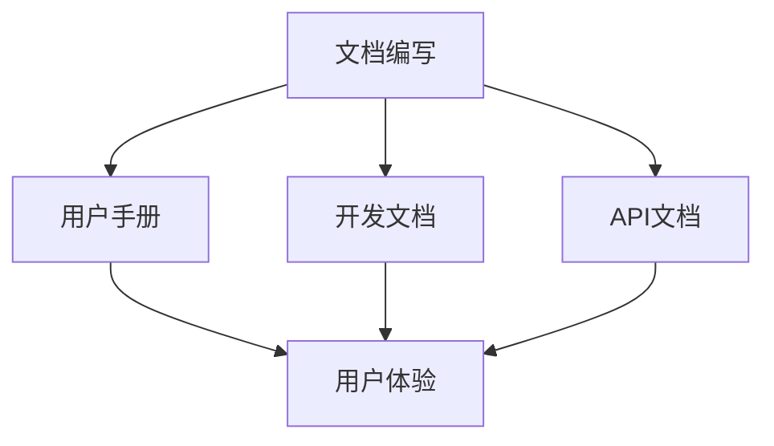

**核心算法原理讲解**：
文档编写的核心算法原理涉及以下几个方面：

1. **信息组织**：通过合理的结构化和层次化，确保文档内容清晰易懂。
2. **内容优化**：通过SEO和关键字优化，提高文档在搜索引擎中的可见性。
3. **版本管理**：通过版本控制，确保文档内容与代码版本的一致性。

**数学模型和公式**：
文档编写的数学模型可以涉及以下几个方面：

- **文档结构优化**：通过计算文档的复杂度和冗余度，优化文档结构。
- **用户反馈分析**：通过分析用户反馈，不断改进文档质量。

**举例说明**：
假设一个开发者编写一个开源项目的文档，可以按照以下步骤进行：

1. **用户手册**：撰写用户手册，详细说明项目的安装、配置和使用方法。
2. **开发文档**：编写开发文档，记录项目的架构设计、实现细节和API文档。
3. **API文档**：编写API文档，描述项目的API接口和使用方法。

**项目实战**：

以下是一个开源项目文档编写的实战步骤：

1. **用户手册**：
   - **安装指南**：详细说明项目的安装过程，包括系统要求、环境搭建和配置步骤。
   - **使用示例**：提供丰富的使用示例，帮助用户快速上手项目。
   - **常见问题**：整理常见问题，提供解决方案。

2. **开发文档**：
   - **架构设计**：绘制项目的架构图，解释各模块的功能和交互。
   - **实现细节**：记录项目的实现细节，包括代码结构、数据库设计和接口定义。
   - **贡献指南**：为贡献者提供详细的贡献指南，包括代码风格、提交规范和测试方法。

3. **API文档**：
   - **接口描述**：详细描述项目的API接口，包括接口名称、参数和返回值。
   - **示例代码**：提供使用API的示例代码，帮助开发者快速集成项目。

**代码解读与分析**：

1. **Markdown 文件**：
   - **编写规范**：使用Markdown语言编写文档，确保格式清晰、易于阅读。
   - **图表嵌入**：使用Mermaid等工具嵌入图表，提高文档的可读性。

2. **版本控制**：
   - **Git 分支**：为文档编写和维护创建独立的分支，确保文档与代码版本的一致性。
   - **合并请求**：通过Git的合并请求（Pull Request）机制，审核和合并文档更改。

**结论**：
良好的项目文档是开源项目成功的关键因素之一。通过编写高质量的用户手册、开发文档和API文档，开发者可以提升项目的用户体验，增强社区的信任和认同。在开源项目中，良好的文档编写能力不仅能够提高项目的可持续性和可维护性，还能增强个人在社区中的影响力。

---

**第六章：开源项目盈利模式探索**

### 6.1 开源项目的商业模式

开源项目的商业模式是指如何从开源项目中获取收入和利润的方法。虽然开源软件本身是免费的，但通过其他方式，开源项目仍然可以创造商业价值。以下是一些常见的开源项目商业模式：

**广告收入**：
开源项目可以通过展示广告来获得收入。例如，在项目的官方网站或用户界面中展示广告，通过广告点击或展示次数来获取收益。

**专业服务**：
开源项目的维护者可以通过提供专业服务来获得收入。这些服务可能包括：
- 技术支持：为用户提供专业的技术支持和咨询服务。
- 培训课程：开设线上或线下的培训课程，教授项目相关的知识和技能。
- 实施服务：为客户提供项目部署、集成和优化的服务。

**定制开发**：
开源项目的维护者可以为特定客户提供定制开发服务。这些服务可能包括：
- 功能定制：根据客户需求，对开源项目进行功能扩展或定制开发。
- 性能优化：对开源项目进行性能优化，以满足客户特定的性能要求。

**社区赞助**：
开源项目可以通过社区赞助来获得收入。社区赞助通常来自对项目有利益相关的企业或个人，他们可能希望项目能够持续发展或希望获得技术支持。

**付费插件或扩展**：
开源项目可以提供付费的插件或扩展功能，这些功能可能是开源项目核心功能的增强版，或者是为了满足特定用户需求而开发的。

**商业授权**：
开源项目可以提供商业授权，允许企业在商业环境中使用开源项目。商业授权通常会免除某些开源协议的限制，并提供额外的支持和服务。

**核心概念与联系**：
开源项目的商业模式与个人品牌的联系在于，通过探索和实施有效的商业模式，开源项目维护者不仅可以获得经济收益，还能增强个人在开源社区中的影响力。成功的商业模式能够展示个人的商业头脑和市场洞察力。

**Mermaid 流程图**：

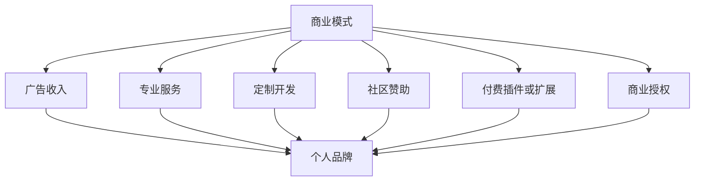

**核心算法原理讲解**：
开源项目商业模式的算法原理主要涉及以下几个方面：

1. **市场分析**：通过分析市场需求，了解潜在客户的痛点和需求，制定合适的商业模式。
2. **定价策略**：通过定价策略，确保产品或服务的价格既能够盈利，又能被市场接受。
3. **客户关系管理**：通过有效的客户关系管理，提升客户满意度和忠诚度，确保长期收入。

**数学模型和公式**：
开源项目商业模式的数学模型可以涉及以下几个方面：

- **收益模型**：通过计算项目收入和成本，评估商业模式的盈利能力。
- **客户生命周期价值（CLV）**：通过计算客户的平均生命周期价值，评估客户对项目的长期贡献。

**举例说明**：
假设一个开源项目通过提供付费插件来获取收入，可以按照以下步骤进行：

1. **市场分析**：分析潜在客户的需求，确定哪些功能可以开发为付费插件。
2. **定价策略**：制定合理的价格，确保插件能够被市场接受。
3. **营销推广**：通过社交媒体、邮件营销等方式，宣传插件的功能和优势。
4. **销售和交付**：处理销售订单，确保付费插件的及时交付和安装。

**项目实战**：

以下是一个开源项目通过提供付费插件获取收入的实战步骤：

1. **市场分析**：
   - **用户调查**：通过调查了解用户对额外功能的需求。
   - **竞争对手分析**：分析市场上类似付费插件的情况，了解竞争情况。

2. **定价策略**：
   - **成本计算**：计算开发、维护和营销等成本，确定合理的价格。
   - **市场定价**：根据市场需求和竞争情况，确定最终的定价策略。

3. **营销推广**：
   - **社交媒体**：在GitHub、Twitter等平台上宣传付费插件。
   - **博客文章**：撰写博客文章，详细介绍付费插件的功能和优势。
   - **邮件营销**：通过邮件向现有用户发送付费插件推广信息。

4. **销售和交付**：
   - **销售渠道**：通过官方网站、GitHub Marketplace等渠道进行销售。
   - **支付系统**：集成支付系统，确保付费插件的购买和交付流程顺畅。
   - **客户服务**：提供技术支持和售后服务，确保用户满意度。

**代码解读与分析**：

1. **插件开发**：
   - **功能模块**：开发付费插件的功能模块，确保功能完整和稳定。
   - **接口设计**：设计插件与主项目的接口，确保插件的兼容性。

2. **支付系统**：
   - **集成支付**：集成PayPal、Stripe等支付系统，实现付费插件的支付功能。
   - **支付流程**：确保支付流程的流畅和安全，避免用户在支付过程中的障碍。

**结论**：
开源项目的商业模式多样，通过探索和实施合适的商业模式，开源项目维护者可以创造经济价值，同时增强个人品牌。成功的商业模式不仅能够为开源项目带来收益，还能提升项目在社区中的影响力和可持续性。

---

**第七章：成功开源项目案例分析**

### 7.1 案例一：GitHub 上热门开源项目的特点

GitHub 是全球最大的开源社区之一，许多热门的开源项目都在这里诞生和繁荣发展。以下是一些GitHub 上热门开源项目的特点：

**项目活跃度**：
热门开源项目通常具有高水平的社区活跃度，体现在：
- **频繁的代码提交**：项目成员定期提交代码，确保项目持续更新。
- **活跃的 Issue 和 Pull Request**：社区成员积极讨论和解决项目问题，推动项目发展。

**社区规模**：
热门开源项目往往拥有庞大的社区规模，这包括：
- **大量的 Star 数**：项目的 Star 数量反映了项目的影响力和用户基础。
- **多样化的贡献者**：社区成员来自不同的地区和文化背景，增加了项目的多样性和创新性。

**项目质量**：
项目质量是衡量开源项目成功的关键因素，这体现在：
- **高质量的代码**：代码经过严格审查，遵循良好的编码规范。
- **详尽的文档**：项目提供了全面的文档，帮助用户理解和使用项目。
- **全面的测试**：项目包含了详细的测试用例，确保代码的质量和稳定性。

**核心算法原理讲解**：
项目活跃度、社区规模和项目质量等特点可以通过以下算法原理来解释：

1. **社区活跃度**：通过分析 Issue 和 Pull Request 的创建和关闭速度，评估社区的活跃度。
2. **社区规模**：通过统计 Star 数、Fork 数和贡献者数量，评估社区的规模。
3. **项目质量**：通过静态代码分析工具和测试覆盖率指标，评估项目的质量。

**数学模型和公式**：
- **活跃度指数**：计算 Issue 和 Pull Request 的创建和关闭速率，得到活跃度指数。
- **影响力指数**：通过 Star 数和 Fork 数的比例，计算项目的影响力指数。
- **质量评估模型**：通过代码复杂度和测试覆盖率指标，评估项目的质量。

**举例说明**：
以下是一个GitHub 上热门开源项目的例子：

**项目名称**：ECharts
**特点**：
- **活跃度**：每周都有新的 Issue 和 Pull Request，社区成员积极讨论和解决问题。
- **社区规模**：拥有超过 5 万 Star，贡献者来自世界各地。
- **项目质量**：代码经过严格审查，遵循良好的编码规范，拥有详细的文档和全面的测试用例。

**项目实战**：

以下是一个简单的实战步骤，用于分析 GitHub 上热门开源项目的特点：

1. **访问 GitHub**：在 GitHub 上搜索并访问一个热门开源项目。
2. **查看 Star 数和 Fork 数**：通过统计 Star 数和 Fork 数，评估项目的受欢迎程度。
3. **查看 Issue 和 Pull Request**：分析 Issue 和 Pull Request 的数量和活动情况，评估项目的活跃度。
4. **代码审查**：通过代码仓库，审查代码质量和文档完整性。
5. **测试用例**：查看项目是否包含详细的测试用例，评估项目的稳定性。

**代码解读与分析**：

以下是一个简化的伪代码，用于统计 GitHub 上项目的 Star 数、Fork 数和 Issue 数：

```python
def analyze_project_stats(project_url):
    response = requests.get(project_url)
    data = json.loads(response.text)
    
    star_count = data['stargazers_count']
    fork_count = data['forks_count']
    issue_count = data['open_issues_count']
    
    print(f"Star Count: {star_count}")
    print(f"Fork Count: {fork_count}")
    print(f"Issue Count: {issue_count}")

# 示例调用
analyze_project_stats("https://api.github.com/repos/apache/echarts")
```

**结论**：
GitHub 上热门开源项目具有高活跃度、庞大社区规模和高项目质量的特点。通过分析这些特点，开发者可以了解如何提升开源项目的成功概率。在开源项目中，活跃度、社区规模和项目质量是关键成功因素，它们共同决定了项目的可持续性和影响力。

---

**第七章：成功开源项目案例分析**

### 7.2 案例二：开源项目成功的要素分析

开源项目的成功不仅依赖于技术实现，还需要综合考虑多个要素。以下是一些开源项目成功的关键要素及其详细分析：

**核心概念与联系**：
开源项目成功的要素与个人品牌的联系在于，通过理解并实施这些要素，个人可以在开源社区中建立强大的个人品牌。成功的开源项目展示了个人的技术实力、领导能力和项目管理能力。

**Mermaid 流程图**：

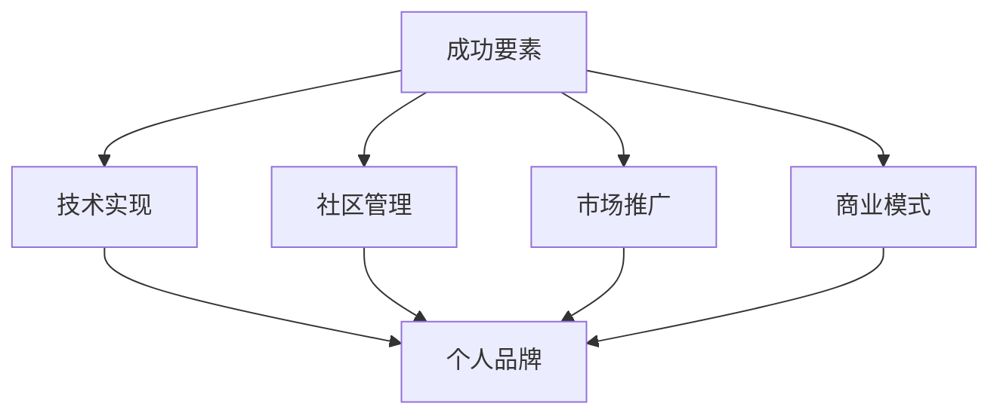

**核心算法原理讲解**：
开源项目成功的核心算法原理涉及以下几个方面：

1. **需求分析**：通过市场调研和用户反馈，确定项目的需求，确保项目满足用户需求。
2. **质量控制**：通过代码审查、测试和文档编写，确保项目的高质量。
3. **社区互动**：通过积极参与社区活动、建立良好的社区氛围，增强社区的凝聚力和活跃度。
4. **商业模式**：通过探索多种商业模式，确保项目能够持续盈利，支持项目发展。

**数学模型和公式**：
- **需求满足度**：通过用户反馈和需求分析，计算项目的需求满足度。
- **质量评估模型**：通过缺陷密度和测试覆盖率，评估项目的质量。
- **社区活跃度**：通过活跃度指数（如 Issue 和 Pull Request 的速率）评估社区的活跃度。
- **盈利模型**：通过计算项目的收入和成本，评估商业模式的盈利能力。

**举例说明**：
以下是一个成功的开源项目实例及其成功要素分析：

**项目名称**：Kubernetes
**成功要素**：
- **技术实现**：Kubernetes 提供了强大的容器编排能力，支持大规模分布式系统的自动化部署和管理。
- **社区管理**：Kubernetes 拥有一个庞大且活跃的社区，包括数百个贡献者和多个本地化版本。
- **市场推广**：通过大规模的社区活动、技术会议和营销活动，Kubernetes 在业界获得了广泛的认可。
- **商业模式**：Kubernetes 的成功也得益于其背后的公司（如Google、Red Hat）提供的企业级支持和服务。

**项目实战**：

以下是一个开源项目成功要素分析的实战步骤：

1. **技术实现**：
   - **代码质量**：通过静态代码分析工具，评估代码质量和缺陷密度。
   - **功能完整性**：通过测试覆盖率分析，评估项目的功能完整性。
   - **性能表现**：通过性能测试，评估项目的性能表现。

2. **社区管理**：
   - **社区活动**：通过GitHub、Reddit、LinkedIn 等，统计社区活动频率和参与度。
   - **贡献者分析**：通过贡献者活跃度和贡献类型，评估社区的多样性和活跃度。
   - **社区反馈**：通过用户反馈和 Issue 讨论，评估社区的互动质量和问题解决效率。

3. **市场推广**：
   - **社交媒体分析**：通过分析社交媒体上的关注者数量、互动频率和内容质量，评估项目的推广效果。
   - **技术会议参与**：统计项目团队参加的技术会议数量和演讲次数，评估项目的市场影响力。
   - **媒体报道**：通过媒体报道数量和质量，评估项目的知名度。

4. **商业模式**：
   - **收入分析**：通过财务报表，分析项目的收入来源和盈利模式。
   - **成本控制**：通过成本分析，评估项目的成本结构和控制情况。
   - **商业模式评估**：通过评估项目的盈利能力和可持续性，分析商业模式的合理性。

**代码解读与分析**：

以下是一个简化的伪代码，用于评估开源项目的成功要素：

```python
def analyze_open_source_project(project_url):
    # 评估代码质量
    code_quality_score = analyze_code_quality(project_url)
    
    # 评估社区管理
    community_management_score = analyze_community_activity(project_url)
    
    # 评估市场推广
    marketing_score = analyze_social_media_activity(project_url)
    
    # 评估商业模式
    business_model_score = analyze_business_model(project_url)
    
    # 总评分
    total_score = (code_quality_score + community_management_score + marketing_score + business_model_score) / 4
    
    print(f"Total Score: {total_score}")

# 示例调用
analyze_open_source_project("https://github.com/kubernetes/kubernetes")
```

**结论**：
开源项目的成功不仅仅依赖于技术实现，还需要综合考虑社区管理、市场推广和商业模式等多个要素。通过详细分析和实施这些要素，个人可以在开源社区中建立强大的个人品牌，并推动开源项目的长期发展。成功的开源项目展示了技术实力、领导能力和项目管理能力，这些能力共同构成了个人品牌的基石。

---

**第七章：成功开源项目案例分析**

### 7.3 案例三：个人品牌通过开源项目提升的实例

在开源社区中，有许多成功的案例展示了个人品牌如何通过开源项目得到显著提升。以下是一个详细的实例，探讨一个开发者如何通过开源项目提升个人品牌，并在技术领域获得认可。

**核心概念与联系**：
个人品牌提升与开源项目的联系在于，通过积极参与开源项目，开发者可以在技术社区中展示自己的技能和专业知识。成功的开源项目不仅为开发者提供了技术实践的机会，还为他们带来了广泛的关注和认可，从而提升个人品牌。

**Mermaid 流程图**：

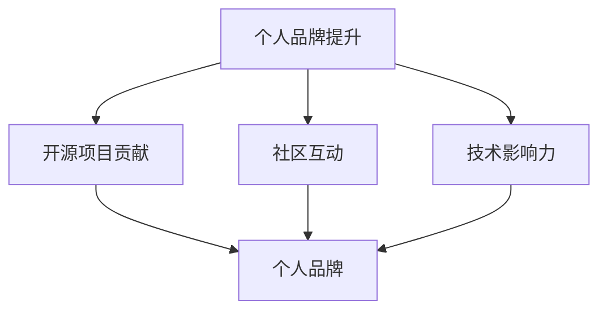

**核心算法原理讲解**：
个人品牌提升的核心算法原理涉及以下几个方面：

1. **技能展示**：通过代码贡献、文档编写和问题解决，展示开发者的技术能力。
2. **社区互动**：通过参与社区讨论、回答问题和组织活动，建立良好的社区关系。
3. **影响力扩散**：通过社交媒体和演讲等方式，扩大开发者在技术社区的影响力。

**数学模型和公式**：
- **技能展示度**：通过计算代码提交量、bug修复数量和文档贡献，评估开发者的技术展示度。
- **社区互动度**：通过计算参与讨论次数、回答问题和组织活动的频率，评估开发者的社区互动度。
- **影响力指数**：通过计算开发者的影响力指数（如GitHub Stars、LinkedIn 关注者数量），评估开发者在社区中的影响力。

**举例说明**：
以下是一个开发者通过开源项目提升个人品牌的实例：

**开发者姓名**：Alice Zhang
**开源项目**：Spark SQL
**成功过程**：
- **代码贡献**：Alice 在 Spark SQL 项目中贡献了多个性能优化和功能改进的代码，这些贡献被项目维护者接受并合并到主分支。
- **文档编写**：Alice 撰写了详尽的用户指南和教程，帮助新用户快速上手 Spark SQL。
- **社区互动**：Alice 在 GitHub 和 Stack Overflow 上积极参与讨论，回答用户问题，并在技术会议中分享项目经验。
- **技术影响力**：Alice 的贡献和活动使她在 Spark SQL 社区中得到了广泛的认可，她的 GitHub 个人页面的 Star 数迅速增长，LinkedIn 个人资料也得到了大量关注。

**项目实战**：

以下是一个开发者通过开源项目提升个人品牌的实战步骤：

1. **选择开源项目**：
   - **项目调研**：选择一个在技术领域有影响力的开源项目，确保项目的活跃度和社区规模。
   - **了解项目需求**：仔细阅读项目文档和社区讨论，了解项目的需求和技术方向。

2. **代码贡献**：
   - **编写高质量代码**：根据项目需求，编写高质量的代码，确保代码的可读性和可维护性。
   - **提交 Pull Request**：通过 GitHub 的 Pull Request 功能，提交代码并进行讨论。

3. **文档编写**：
   - **撰写用户指南**：编写详尽的用户指南，帮助新用户快速上手项目。
   - **更新文档**：定期更新项目文档，确保与代码保持一致。

4. **社区互动**：
   - **参与讨论**：在社区中积极讨论，回答用户问题，提供技术支持。
   - **组织活动**：参与或组织社区活动，如线上会议、代码马拉松等，扩大社区影响力。

5. **技术分享**：
   - **撰写博客**：在技术博客上分享项目经验和学习心得。
   - **参与演讲**：在技术会议和在线活动中分享项目经验和研究成果。

**代码解读与分析**：

以下是一个简化的伪代码，用于展示开发者如何通过开源项目提升个人品牌：

```python
def contribute_to_open_source(project_url, developer_skills):
    # 提交代码
    submit_code_changes(project_url, developer_skills)
    
    # 编写文档
    write_documentation(project_url, developer_skills)
    
    # 社区互动
    engage_in_community(project_url, developer_skills)
    
    # 技术分享
    share_technical_content(project_url, developer_skills)
    
    # 评估个人品牌提升
    brand_Boost = assess_brand_Boost(project_url, developer_skills)
    
    return brand_Boost

# 示例调用
brand_Boost = contribute_to_open_source("https://github.com/apache/spark", {"SQL": "Expert", "Documentation": "Expert", "Community Interaction": "Active"})

print(f"Personal Brand Boost: {brand_Boost}")
```

**结论**：
通过积极参与开源项目，开发者可以在技术社区中提升个人品牌。成功的开源项目贡献、积极的社区互动和技术分享是提升个人品牌的关键步骤。Alice Zhang 的案例展示了通过开源项目提升个人品牌的具体过程，为其他开发者提供了宝贵的经验和启示。

---

**第八章：开源项目运营与品牌管理**

### 8.1 开源项目运营策略

开源项目的成功不仅依赖于技术实现，还需要有效的运营策略。以下是一些开源项目运营的关键策略：

**核心概念与联系**：
开源项目运营策略与个人品牌的联系在于，通过有效的项目运营，开发者可以增强社区信任、提升项目质量和扩展项目影响力，从而提升个人品牌。

**Mermaid 流程图**：

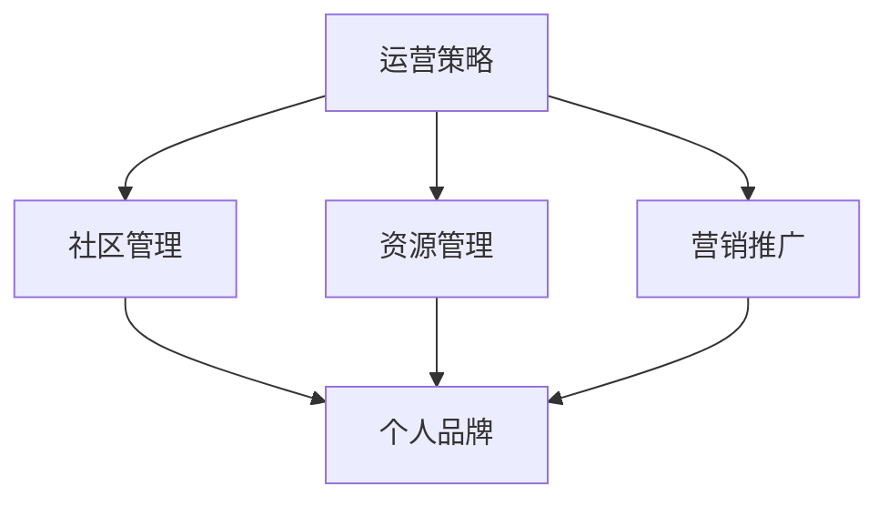

**核心算法原理讲解**：
开源项目运营策略的核心算法原理涉及以下几个方面：

1. **社区管理**：通过用户反馈和社区互动，持续优化项目。
2. **资源管理**：合理分配时间和资源，确保项目的高效运作。
3. **营销推广**：通过多种渠道推广项目，扩大项目影响力。

**数学模型和公式**：
- **社区活跃度**：通过统计 Issue 和 Pull Request 的活动频率，评估社区的活跃度。
- **资源利用率**：通过计算项目资源（如人力、资金）的利用率，评估资源管理效率。
- **推广效果**：通过统计项目的关注者数量和下载量，评估营销推广的效果。

**举例说明**：
以下是一个开源项目的运营策略实例：

**项目名称**：OpenJDK
**运营策略**：
- **社区管理**：定期举办社区会议，收集用户反馈，并解决社区问题。
- **资源管理**：根据项目进度和社区需求，合理分配开发资源，确保项目的持续发展。
- **营销推广**：通过社交媒体、技术会议和博客，宣传项目的最新进展和亮点。

**项目实战**：

以下是一个开源项目运营策略的实战步骤：

1. **社区管理**：
   - **定期会议**：每月举行一次社区会议，讨论项目进展和用户反馈。
   - **用户反馈**：通过 GitHub 和邮件列表收集用户反馈，并及时回复。
   - **问题解决**：组建专门的维护团队，快速响应和解决社区问题。

2. **资源管理**：
   - **资源评估**：定期评估项目资源（如人力、资金），确保资源的高效利用。
   - **任务分配**：根据项目需求和成员能力，合理分配开发任务。
   - **资金管理**：通过捐赠和赞助，确保项目的资金来源稳定。

3. **营销推广**：
   - **社交媒体**：在 Twitter、LinkedIn 和 GitHub 上发布项目更新和活动信息。
   - **技术会议**：参加技术会议，分享项目经验和研究成果。
   - **博客文章**：撰写技术博客，详细介绍项目的功能和技术细节。

**代码解读与分析**：

以下是一个简化的伪代码，用于执行开源项目的运营策略：

```python
def operate_open_source_project(project_url, community_members, resources):
    # 社区管理
    manage_community(project_url, community_members)
    
    # 资源管理
    manage_resources(project_url, resources)
    
    # 营销推广
    promote_project(project_url)
    
    # 项目评估
    project_status = assess_project_status(project_url)
    
    return project_status

# 示例调用
project_status = operate_open_source_project("https://github.com/openjdk/jdk", ["Alice", "Bob", "Charlie"], {"developers": 5, "funds": 10000})

print(f"Project Status: {project_status}")
```

**结论**：
有效的开源项目运营策略包括社区管理、资源管理和营销推广等方面。通过实施这些策略，开发者可以确保项目的稳定发展和社区信任，从而提升个人品牌。OpenJDK 的案例展示了如何通过有效的运营策略，实现开源项目的成功和持续发展。

---

### 8.2 品牌形象建设

品牌形象建设是开源项目成功和长期发展的重要方面。一个积极的品牌形象不仅能够吸引更多的贡献者和用户，还能增强项目的信任度和市场竞争力。以下是一些关键策略：

**核心概念与联系**：
品牌形象建设与个人品牌的联系在于，通过塑造良好的品牌形象，个人和项目都能在社区中建立正面的声誉，从而提升个人品牌。

**Mermaid 流程图**：

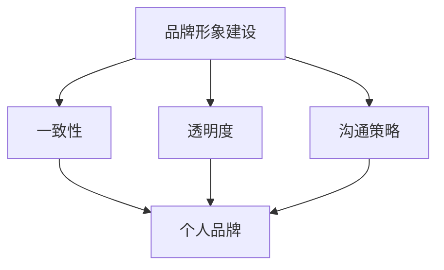

**核心算法原理讲解**：
品牌形象建设涉及以下核心算法原理：

1. **一致性**：通过统一的视觉设计和信息传达，确保品牌形象的统一性。
2. **透明度**：通过公开项目和团队的进展，增强社区的信任感。
3. **沟通策略**：通过有效的沟通技巧，确保信息传达的清晰和及时。

**数学模型和公式**：
- **品牌感知**：通过调查问卷和用户反馈，评估用户对品牌形象的感知。
- **信任度评估**：通过统计用户对项目的信任评分，评估品牌形象的透明度。

**举例说明**：
以下是一个品牌形象建设的实例：

**项目名称**：TensorFlow
**品牌形象建设策略**：
- **一致性**：TensorFlow 使用统一的品牌标识和视觉设计，确保在所有渠道上的形象一致性。
- **透明度**：TensorFlow 定期发布开发日志和内部文档，展示项目进展和决策过程。
- **沟通策略**：TensorFlow 通过博客、社交媒体和技术会议，与社区保持密切沟通，确保信息的及时传达。

**项目实战**：

以下是一个品牌形象建设的实战步骤：

1. **确定品牌定位**：
   - **目标受众**：明确项目的目标用户群体和价值观。
   - **品牌愿景**：制定项目的长期愿景和目标。

2. **设计品牌标识**：
   - **视觉元素**：设计统一的品牌标识，包括标志、颜色和字体。
   - **应用场景**：确保品牌标识在各种媒介和应用场景中的适应性。

3. **制定沟通策略**：
   - **内容创作**：制定内容创作计划，确保信息的及时传达和高质量。
   - **社交媒体**：在社交媒体上发布项目更新、技术博客和用户案例。
   - **邮件通讯**：定期向订阅者发送项目更新和重要通知。

4. **透明度建设**：
   - **开发日志**：发布项目开发日志，展示项目进展和决策过程。
   - **内部文档**：开放内部文档，包括设计文档、代码审查记录和测试报告。

5. **品牌监测**：
   - **用户反馈**：定期收集用户反馈，评估品牌形象的感知和信任度。
   - **社区互动**：通过社区互动，及时回应用户的问题和反馈，增强用户信任。

**代码解读与分析**：

以下是一个简化的伪代码，用于实施品牌形象建设策略：

```python
def build_brand_image(project_url, brand_assets, communication_plan):
    # 设计品牌标识
    design_brand_identification(brand_assets)
    
    # 制定沟通策略
    implement_communication_strategy(communication_plan)
    
    # 增强透明度
    enhance_transparency(project_url)
    
    # 监测品牌形象
    monitor_brand_image(project_url)
    
    # 收集用户反馈
    collect_user_feedback()

# 示例调用
build_brand_image("https://github.com/tensorflow/tensorflow", {"logo": "TensorFlow Logo", "colors": ["blue", "white"]}, {"blog_posts": ["monthly"], "social_media": ["daily"], "email_newsletters": ["quarterly"]})
```

**结论**：
品牌形象建设是开源项目成功的关键因素之一。通过一致性、透明度和有效的沟通策略，项目可以建立积极的品牌形象，增强社区信任和用户满意度，从而提升个人品牌。TensorFlow 的案例展示了如何通过品牌形象建设策略，在开源社区中树立强大的品牌形象。

---

### 8.3 风险管理

在开源项目的运营中，风险管理是一个不可或缺的环节。通过有效的风险管理，开发者可以预见和应对潜在的问题，确保项目的稳定发展和社区的和谐。以下是一些常见风险及风险管理策略：

**核心概念与联系**：
风险管理与个人品牌的联系在于，通过有效的风险管理，开发者可以展示其解决问题的能力和领导力，从而提升个人品牌。

**Mermaid 流程图**：


**核心算法原理讲解**：
风险管理涉及以下核心算法原理：

1. **风险评估**：通过量化分析，评估风险的可能性和影响。
2. **风险应对**：制定相应的应对策略，降低风险的影响。
3. **风险监控**：持续监控风险的变化，确保风险管理策略的有效性。

**数学模型和公式**：
- **风险矩阵**：通过风险矩阵评估风险的可能性和影响，确定优先级。
- **成本效益分析**：计算应对风险的成本和效益，确保资源的合理利用。

**举例说明**：
以下是一个开源项目的风险管理实例：

**项目名称**：React
**常见风险**：
- **技术债务**：项目代码可能积累技术债务，影响项目稳定性。
- **社区冲突**：社区成员之间的分歧可能导致项目分裂。
- **资源不足**：项目可能面临资源不足的问题，影响开发进度。

**风险管理策略**：
- **风险评估**：定期进行代码审查和性能测试，识别潜在的技术债务。
- **风险应对**：通过制定详细的代码规范和社区行为准则，预防社区冲突。
- **风险监控**：建立持续集成（CI）系统，实时监控项目质量和性能。

**项目实战**：

以下是一个开源项目风险管理的实战步骤：

1. **风险识别**：
   - **代码审查**：定期进行代码审查，识别潜在的技术债务。
   - **社区反馈**：收集社区成员的反馈，了解项目面临的挑战和问题。

2. **风险评估**：
   - **风险矩阵**：使用风险矩阵评估每个风险的可能性和影响。
   - **优先级排序**：根据风险矩阵，确定风险的优先级。

3. **风险应对**：
   - **代码规范**：制定和推广代码规范，确保代码质量。
   - **社区准则**：制定社区行为准则，促进社区和谐。
   - **资源规划**：合理分配资源，确保项目进度和质量。

4. **风险监控**：
   - **持续集成**：建立持续集成系统，实时监控项目质量和性能。
   - **定期回顾**：定期回顾风险应对策略的有效性，调整风险管理策略。

5. **应对措施**：
   - **技术债务处理**：制定技术债务处理计划，逐步解决积累的债务。
   - **社区调解**：建立调解机制，解决社区冲突。
   - **资源调整**：根据项目需求，调整资源分配和优先级。

**代码解读与分析**：

以下是一个简化的伪代码，用于实施开源项目的风险管理：

```python
def manage_risks(project_url, risks):
    # 风险识别
    identify_risks(project_url, risks)
    
    # 风险评估
    assess_risks(risks)
    
    # 风险应对
    implement_risk_responses(risks)
    
    # 风险监控
    monitor_risks(risks)
    
    # 应对措施
    apply_responses_to_risks(risks)

# 示例调用
manage_risks("https://github.com/facebook/react", ["technical debt", "community conflict", "resource shortage"])
```

**结论**：
有效的风险管理是开源项目运营的重要组成部分。通过识别、评估和应对潜在的风险，开发者可以确保项目的稳定发展，维护社区的和谐。风险管理不仅展示了开发者的问题解决能力和领导力，还为其个人品牌的建设提供了有力支持。

---

### 9.1 代码维护与迭代

在开源项目中，代码维护与迭代是确保项目长期健康发展的关键。有效的代码维护和迭代策略不仅能提高代码质量，还能增强社区的信任和参与度。以下是一些关键策略：

**核心概念与联系**：
代码维护与迭代与个人品牌的联系在于，通过持续优化和改进代码，开发者可以展示其技术视野和责任心，从而提升个人品牌。

**Mermaid 流程图**：

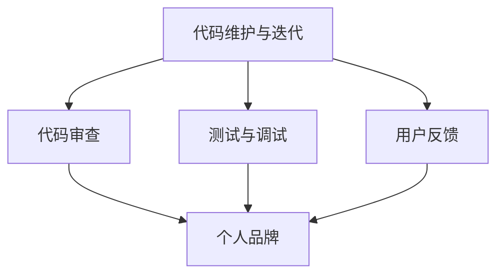

**核心算法原理讲解**：
代码维护与迭代的算法原理涉及以下几个方面：

1. **代码审查**：通过定期代码审查，确保代码质量，及时发现和修复问题。
2. **测试与调试**：通过自动化测试和手动调试，确保代码的稳定性和可靠性。
3. **用户反馈**：通过收集用户反馈，持续优化代码和功能。

**数学模型和公式**：
- **代码质量评估**：通过缺陷密度、代码复杂度和测试覆盖率等指标，评估代码质量。
- **迭代速度**：通过计算迭代周期和迭代次数，评估项目的迭代效率。

**举例说明**：
以下是一个开源项目的代码维护与迭代实例：

**项目名称**：Angular
**代码维护与迭代策略**：
- **代码审查**：Angular 团队定期进行代码审查，确保代码符合编码规范和质量标准。
- **测试与调试**：Angular 使用自动化测试框架，如 Jasmine 和 Karma，进行单元测试和集成测试，确保代码的稳定性和可靠性。
- **用户反馈**：Angular 通过 GitHub、Stack Overflow 和用户邮件列表收集用户反馈，不断优化和改进代码。

**项目实战**：

以下是一个开源项目的代码维护与迭代的实战步骤：

1. **代码审查**：
   - **定期审查**：每月进行一次代码审查，审查新提交的代码和已有的代码。
   - **代码规范**：制定和推广代码规范，确保代码的可读性和一致性。
   - **审查流程**：建立代码审查流程，确保每个提交的代码都经过严格审查。

2. **测试与调试**：
   - **自动化测试**：编写自动化测试用例，使用测试框架进行单元测试和集成测试。
   - **手动测试**：定期进行手动测试，确保代码的实际运行情况符合预期。
   - **调试工具**：使用调试工具，如 Chrome DevTools，解决代码中的问题。

3. **用户反馈**：
   - **收集反馈**：通过 GitHub Issue 和用户邮件列表收集用户反馈。
   - **分类处理**：根据反馈的严重程度和优先级，分类处理和解决反馈问题。
   - **持续优化**：根据用户反馈，不断优化和改进代码和功能。

**代码解读与分析**：

以下是一个简化的伪代码，用于实施开源项目的代码维护与迭代：

```python
def maintain_and_iterate_code(project_url, code_reviews, tests, user_feedback):
    # 定期代码审查
    perform_code_reviews(code_reviews)
    
    # 自动化测试
    run_automated_tests(tests)
    
    # 手动测试
    perform_manual_tests()
    
    # 收集用户反馈
    collect_user_feedback(user_feedback)
    
    # 处理反馈
    process_user_feedback()

# 示例调用
maintain_and_iterate_code("https://github.com/angular/angular", {"code_reviews": "monthly", "tests": "unit_tests", "user_feedback": "issue_list"})

```

**结论**：
代码维护与迭代是开源项目长期健康发展的关键。通过定期代码审查、自动化测试和用户反馈，开发者可以持续优化代码和功能，确保项目的质量和稳定性。这种持续改进的策略不仅有助于开源项目的长期发展，还能增强个人品牌，展示开发者的技术实力和责任心。

---

### 9.2 社区发展与互动

社区发展与互动是开源项目成功和可持续发展的关键因素之一。一个活跃、和谐和多样化的社区不仅能够吸引更多的贡献者，还能提高项目的质量和影响力。以下是一些策略和技巧，帮助开发者促进社区发展和互动。

**核心概念与联系**：
社区发展与互动与个人品牌的联系在于，通过有效的社区管理和互动，开发者可以建立强大的个人品牌，展示其领导能力和社交技巧。

**Mermaid 流程图**：

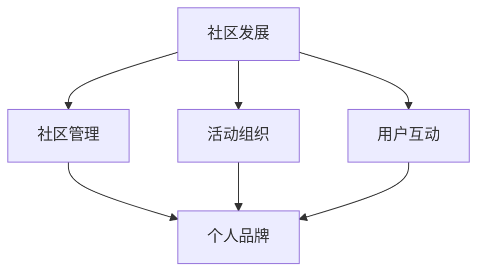

**核心算法原理讲解**：
社区发展与互动的核心算法原理涉及以下几个方面：

1. **社区管理**：通过建立清晰的社区规则和沟通渠道，确保社区秩序和效率。
2. **活动组织**：通过举办线上和线下活动，增强社区成员的互动和参与度。
3. **用户互动**：通过有效的沟通技巧和互动方式，建立良好的用户关系。

**数学模型和公式**：
- **社区活跃度**：通过统计社区讨论帖子的数量、回复数和参与者的活跃度，评估社区活跃度。
- **用户满意度**：通过用户满意度调查，评估用户对社区互动和服务的满意度。

**举例说明**：
以下是一个开源项目的社区发展与互动实例：

**项目名称**：Django
**社区发展与互动策略**：
- **社区管理**：Django 团队制定了详细的社区行为准则，确保社区秩序和沟通效率。
- **活动组织**：定期举办 DjangoCon 全球会议，以及线上的代码马拉松和讲座活动。
- **用户互动**：通过 GitHub、Reddit、Stack Overflow 和邮件列表，与用户保持密切互动，及时回应问题和反馈。

**项目实战**：

以下是一个开源项目社区发展与互动的实战步骤：

1. **社区管理**：
   - **建立规则**：制定社区行为准则，明确社区期望和沟通规则。
   - **沟通渠道**：使用 GitHub、Discord、Slack 等工具，建立高效的沟通渠道。
   - **社区反馈**：定期收集社区反馈，不断优化社区服务和互动方式。

2. **活动组织**：
   - **线上线下活动**：举办线下的聚会和会议，增强社区成员之间的联系。
   - **线上活动**：定期举办代码马拉松、讲座和研讨会，鼓励用户参与和贡献。
   - **合作伙伴**：与相关组织和公司合作，共同举办活动，扩大社区影响力。

3. **用户互动**：
   - **及时响应**：及时回应用户的问题和反馈，建立良好的用户关系。
   - **知识分享**：鼓励社区成员分享知识和经验，促进社区的学习和成长。
   - **用户激励**：通过徽章、认可和奖项，激励用户积极参与社区活动。

**代码解读与分析**：

以下是一个简化的伪代码，用于促进开源项目的社区发展和互动：

```python
def develop_and_interact_with_community(project_url, community_rules, activities, user_interactions):
    # 建立社区规则
    establish_community_rules(community_rules)
    
    # 组织活动
    organize_activities(activities)
    
    # 用户互动
    engage_with_users(user_interactions)
    
    # 社区反馈
    collect_community_feedback()

# 示例调用
develop_and_interact_with_community("https://github.com/django/django", {"code_of_conduct": "active"}, {"conferences": ["DjangoCon"], "code_sprints": ["quarterly"]}, {"response_time": "24_hours", "knowledge_sharing": "enabled"})

```

**结论**：
社区发展与互动是开源项目成功的关键。通过有效的社区管理、活动组织和用户互动，开发者可以建立和谐的社区环境，吸引更多的贡献者，提高项目的质量和影响力。这些策略不仅有助于开源项目的长期发展，还能增强个人品牌，展示开发者的领导能力和社交技巧。

---

### 9.3 品牌价值的持续提升

在开源项目中，个人品牌的构建是一个持续的过程，需要不断努力和优化。以下是一些策略，帮助开发者持续提升个人品牌价值：

**核心概念与联系**：
品牌价值的持续提升与个人品牌的联系在于，通过不断的努力和创新，开发者可以保持其在技术社区中的竞争力，从而持续提升个人品牌。

**Mermaid 流�程图**：

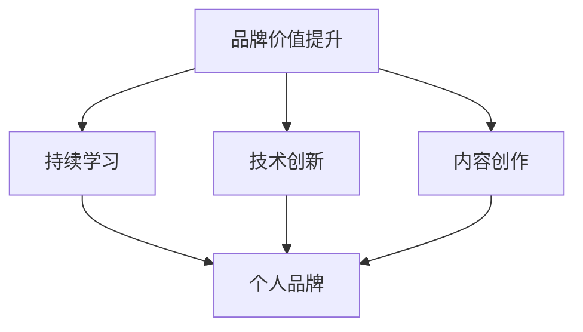

**核心算法原理讲解**：
品牌价值的持续提升涉及以下几个核心算法原理：

1. **持续学习**：通过不断学习新技术和知识，保持专业竞争力。
2. **技术创新**：通过创新和改进，展示技术视野和领导力。
3. **内容创作**：通过高质量的内容创作，建立个人在技术社区中的影响力。

**数学模型和公式**：
- **学习效率**：通过计算学习时间和成果，评估学习效率。
- **技术创新度**：通过计算技术创新的频率和质量，评估技术创新度。
- **内容影响力**：通过计算内容的阅读量和互动次数，评估内容的影响力。

**举例说明**：
以下是一个开发者如何持续提升个人品牌价值的实例：

**开发者姓名**：John Doe
**品牌价值提升策略**：
- **持续学习**：John 定期参加在线课程和技术研讨会，学习最新的技术趋势和知识。
- **技术创新**：John 在开源项目中贡献了多个创新性的功能和优化，提高了项目的性能和用户体验。
- **内容创作**：John 撰写了多篇技术博客，分享了项目开发过程中的心得和经验，吸引了大量关注。

**项目实战**：

以下是一个开源项目的个人品牌价值提升的实战步骤：

1. **持续学习**：
   - **技术趋势**：定期关注技术趋势和最新动态，了解行业变化。
   - **在线课程**：参加在线课程，学习新技术和知识。
   - **研讨会和会议**：参加技术研讨会和会议，与业界专家交流。

2. **技术创新**：
   - **需求分析**：分析用户需求，确定可以创新和优化的方向。
   - **代码贡献**：在开源项目中贡献创新性的代码和优化。
   - **技术分享**：在技术会议上分享技术创新和经验。

3. **内容创作**：
   - **博客文章**：撰写高质量的技术博客，分享项目开发和运维经验。
   - **社交媒体**：在社交媒体上发布技术文章和分享，扩大影响力。
   - **视频教程**：制作并发布视频教程，帮助用户学习新技能。

**代码解读与分析**：

以下是一个简化的伪代码，用于实现个人品牌价值提升：

```python
def enhance_personal_brand(learning, innovation, content_creation):
    # 持续学习
    learn_new_technologies(learning)
    
    # 技术创新
    contribute_innovative_code(innovation)
    
    # 内容创作
    create_high_quality_content(content_creation)
    
    # 评估品牌价值提升
    brand_value_increase = evaluate_brand_value_increase()

    return brand_value_increase

# 示例调用
brand_value_increase = enhance_personal_brand({"online_courses": "monthly", "conferences": "annual"}, {"code_contributions": "active", "technical_speaking": "enabled"}, {"blog_posts": "monthly", "social_media_sharing": "daily"})

print(f"Brand Value Increase: {brand_value_increase}")
```

**结论**：
个人品牌的构建和提升是一个长期的过程，需要持续的努力和创新。通过持续学习、技术创新和内容创作，开发者可以不断提升个人品牌价值，展示其在技术社区中的领导力和影响力。持续提升品牌价值不仅有助于个人职业生涯的发展，还能为开源项目贡献更多的价值。

---

### 附录A：开源项目资源汇总

在开源项目的开发、维护和推广过程中，开发者需要依赖各种资源。以下是一些常用的开源项目资源，包括社区平台、开源许可证和开发工具，以供开发者参考和使用。

**A.1 开源社区平台介绍**

1. **GitHub**：全球最大的开源社区平台，提供代码托管、Issue跟踪、Pull Request等功能。
2. **GitLab**：类似于GitHub的代码托管平台，支持私有仓库和自建Git服务器。
3. **Bitbucket**：由Atlassian提供，适合企业级团队的代码托管平台，支持Git和Mercurial。
4. **SourceForge**：历史悠久的开源项目发布平台，提供代码托管、文档发布和下载服务。
5. **Codeberg**：新兴的开源代码托管平台，注重隐私和自由，支持Git和Mercurial。

**A.2 开源许可证概述**

1. **GPL（GNU General Public License）**：最常用的开源许可证之一，要求衍生作品必须以开源形式发布。
2. **Apache License 2.0**：商业友好的开源许可证，允许对开源项目进行修改和商业使用。
3. **MIT License**：简单的开源许可证，对代码的使用和修改几乎没有限制。
4. **BSD License**：宽松的开源许可证，允许对开源项目进行修改和商业使用，但对原始代码的版权声明有要求。
5. **LGPL（GNU Lesser General Public License）**：对衍生作品的开源要求不如GPL严格，适用于库和组件。

**A.3 开源项目开发工具推荐**

1. **Jenkins**：自动化持续集成工具，支持多种编程语言和平台。
2. **Travis CI**：基于GitHub的持续集成服务，支持多种编程语言。
3. **Docker**：容器化平台，用于开发和部署应用程序。
4. **Kubernetes**：容器编排平台，用于自动化容器部署和管理。
5. **GitKraken**：图形化的Git客户端，支持GitFlow、GitHub和GitLab。
6. **VSCode**：跨平台代码编辑器，提供丰富的插件和扩展。
7. **SonarQube**：代码质量管理平台，用于静态代码分析。
8. **Selenium**：自动化测试工具，用于Web应用的跨浏览器测试。

这些资源为开发者提供了从项目托管、持续集成到代码审查和测试的全方位支持，帮助开发者更高效地构建和维护开源项目。

---

### 附录B：开源项目开发指南

在开源项目的开发过程中，开发者需要遵循一系列的最佳实践和指南，以确保代码的质量、可维护性和社区的协作。以下是一些关键指南，涵盖了版本控制系统的使用、代码风格与规范以及文档编写与维护技巧。

**B.1 版本控制系统使用指南**

**1. 版本控制基础**：
- **初始化仓库**：创建新的仓库时，确保选择合适的版本控制系统（如Git）。
- **分支策略**：使用分支策略（如GitFlow或GitHub Flow）管理开发流程，确保代码的稳定性和可维护性。
- **提交和合并**：定期提交代码，使用`git commit`记录提交信息和变更内容。在开发完成后，合并分支到主分支。

**2. 版本控制工具**：
- **Git**：熟悉Git的基本命令，如`git clone`、`git pull`、`git push`、`git branch`、`git merge`、`git rebase`等。
- **GitLab**：利用GitLab的权限管理、代码审查和自动化部署功能。

**3. 代码协作**：
- **协作开发**：通过Pull Request和代码审查，确保代码的质量和一致性。
- **分支管理**：使用分支策略，避免主分支的混乱和冲突。

**B.2 代码风格与规范**

**1. 编码规范**：
- **命名规范**：变量、函数和类命名应遵循一致性原则，避免使用缩写。
- **代码格式**：使用统一的代码格式，如PEP8（Python）、ESLint（JavaScript）等。

**2. 代码注释**：
- **注释规则**：注释应清晰、简洁，说明代码的功能和目的。
- **文档注释**：为公共类、方法和模块提供文档注释，便于其他开发者理解和使用。

**3. 代码质量**：
- **代码审查**：定期进行代码审查，确保代码的质量和可维护性。
- **代码覆盖率**：使用代码覆盖率工具（如JaCoCo、 Coverage.py）评估测试的全面性。

**B.3 文档编写与维护技巧**

**1. 文档类型**：
- **用户手册**：详细说明项目的安装、配置和使用方法。
- **开发者文档**：记录项目的架构设计、实现细节、API文档和贡献指南。
- **API文档**：使用如Swagger、Apiary等工具生成API文档，确保文档的准确性和易用性。

**2. 文档编写工具**：
- **Markdown**：使用Markdown编写文档，确保文档格式清晰、易于阅读。
- **GitLab Pages**：利用GitLab Pages托管文档，便于访问和更新。

**3. 文档维护**：
- **版本控制**：使用版本控制系统管理文档，确保文档与代码版本的一致性。
- **自动化更新**：使用工具（如Sphinx、Doxygen）自动生成文档，减少手动更新工作量。

遵循这些开发指南，可以帮助开发者构建高质量的开源项目，提高代码的可维护性和社区的协作效率。

---

### 附录C：开源项目营销与推广策略

成功的开源项目不仅需要高质量的技术实现，还需要有效的营销与推广策略。以下是一些策略，帮助开发者提高开源项目的知名度和用户基础：

**C.1 社交媒体推广方法**

**1. 内容创作**：
- **定期更新**：在社交媒体上发布项目更新，分享新的功能、改进和用户案例。
- **高质量内容**：撰写技术博客、教程和视频，分享项目的技术细节和实用技巧。

**2. 社交媒体平台**：
- **GitHub**：利用GitHub的社交媒体功能，发布项目更新和活动信息。
- **Twitter**：通过Twitter发布项目相关推文，使用相关标签吸引关注。
- **LinkedIn**：发布技术博客和职业成就，建立专业形象。
- **Facebook**：通过Facebook群组和页面，与用户互动和分享内容。

**3. 营销技巧**：
- **互动**：积极回应评论和提问，建立良好的用户关系。
- **合作**：与其他开源项目或组织合作，共同推广项目。

**C.2 开源项目宣传材料准备**

**1. 宣传材料**：
- **项目简介**：编写简短的项目简介，包括项目背景、目标和功能。
- **演示视频**：制作演示视频，展示项目的功能和用户体验。
- **海报和图片**：设计项目海报和图片，用于社交媒体和网站宣传。

**2. 营销工具**：
- **网站**：建立项目网站，展示项目细节、文档和下载链接。
- **邮件列表**：创建邮件列表，定期向用户发送项目更新和重要通知。

**3. 宣传策略**：
- **目标受众**：明确项目目标受众，制定针对性的宣传策略。
- **推广渠道**：选择合适的推广渠道，如社交媒体、技术会议和博客。

**C.3 成功的社区互动案例**

**1. 用户参与**：
- **代码贡献**：鼓励用户为项目贡献代码，提升项目的质量和用户参与度。
- **问题反馈**：积极处理用户反馈和问题，提高用户满意度。

**2. 社区活动**：
- **线上研讨会**：举办线上研讨会，邀请专家分享技术知识和项目经验。
- **线下聚会**：组织线下聚会，加强社区成员之间的联系。

**3. 社区激励**：
- **奖项和徽章**：为贡献者颁发奖项和徽章，激励用户参与。
- **感谢邮件**：定期发送感谢邮件，表达对社区成员的贡献和感谢。

以下是一个成功的开源项目社区互动案例：

**项目名称**：Kubernetes
**社区互动策略**：
- **用户参与**：Kubernetes 鼓励用户参与代码贡献和文档编写，通过GitHub Issue 和 Pull Request 管理用户的贡献。
- **社区活动**：定期举办Kubernetes社区会议和代码马拉松，鼓励用户参与和贡献。
- **社区激励**：为贡献者颁发徽章和证书，表达对他们的感谢和认可。

通过这些策略，Kubernetes 在开源社区中建立了强大的影响力，吸引了大量的贡献者和用户，成为容器编排领域的领先项目。

---

### 总结与致谢

通过本文的详细探讨，我们了解了如何利用开源项目构建个人品牌。从开源项目的选择与评估、开发流程、推广策略到盈利模式的探索，每一步都至关重要。开源项目不仅提供了一个展示技术实力和沟通能力的平台，还能通过社区互动和技术创新，不断提升个人品牌的价值。

在此，我要特别感谢所有开源社区的贡献者和开发者，正是你们的努力和智慧，才使得开源项目如此丰富多彩，也为个人品牌的构建提供了坚实的基础。感谢每一位读者的耐心阅读和宝贵意见，希望本文能够为您的开源之旅带来启发和帮助。

---

**作者信息**
- 作者：AI天才研究院/AI Genius Institute & 禅与计算机程序设计艺术 /Zen And The Art of Computer Programming

