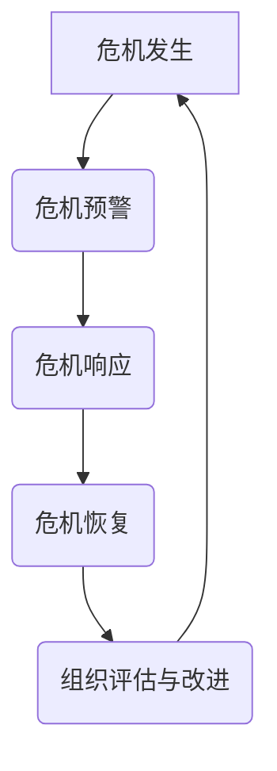

                 

## 危机管理：在不确定性中保持组织稳定

> **关键词**：危机管理、不确定性、组织稳定、风险预警、响应策略、恢复措施、团队建设、法律伦理、社会责任、新兴技术

**摘要**：
在瞬息万变的世界中，组织面临的不确定性日益增加，危机管理成为保障组织持续运营、维护声誉和确保员工安全的关键手段。本文将系统地探讨危机管理的理论基础、实践方法、组织文化与团队建设、法律与伦理问题、社会责任以及未来趋势，旨在为读者提供一套全面且实用的危机管理指南。

### 目录大纲

#### 第一部分：危机管理的理论基础
- **第1章：危机管理的概念与重要性**
  - **1.1** 危机的定义与类型
    - **1.1.1** 自然灾害
    - **1.1.2** 经济危机
    - **1.1.3** 社会事件
  - **1.2** 危机管理的重要性
    - **1.2.1** 组织存续
    - **1.2.2** 企业声誉
    - **1.2.3** 员工安全
- **第2章：危机管理的历史与发展**
  - **2.1** 危机管理的历史演变
    - **2.1.1** 早期危机管理方法
    - **2.1.2** 现代危机管理的形成
  - **2.2** 国际危机管理案例研究
    - **2.2.1** 企业危机案例分析
    - **2.2.2** 国家危机管理案例分析
- **第3章：危机管理的核心概念与联系**
  - **3.1** 危机管理流程
    - **3.1.1** 危机预警
    - **3.1.2** 危机响应
    - **3.1.3** 危机恢复
  - **3.2** Mermaid 流程图：危机管理流程

#### 第二部分：危机管理的实践方法
- **第4章：危机预警与风险评估**
  - **4.1** 危机预警机制
    - **4.1.1** 数据收集与分析
    - **4.1.2** 风险评估方法
    - **4.1.3** 预警指标体系
  - **4.2** 风险评估案例
    - **4.2.1** 企业风险分析
    - **4.2.2** 国家危机评估
- **第5章：危机响应与沟通管理**
  - **5.1** 危机响应策略
    - **5.1.1** 应急预案
    - **5.1.2** 应急资源调配
    - **5.1.3** 应急指挥系统
  - **5.2** 沟通管理
    - **5.2.1** 内部沟通
    - **5.2.2** 外部沟通
    - **5.2.3** 媒体沟通策略
  - **5.3** 伪代码：危机响应流程

#### 第三部分：危机管理的组织文化与团队建设
- **第6章：组织文化与危机管理**
  - **6.1** 危机管理文化的重要性
    - **6.1.1** 危机意识
    - **6.1.2** 危机应对能力
    - **6.1.3** 危机管理文化建设策略
  - **6.2** 组织学习与变革
    - **6.2.1** 持续改进
    - **6.2.2** 学习型组织构建
    - **6.2.3** 员工培训与教育
- **第7章：团队建设与危机应对**
  - **7.1** 团队建设的原则
    - **7.1.1** 团队目标
    - **7.1.2** 团队成员的角色
    - **7.1.3** 团队协作
  - **7.2** 危机应对团队建设
    - **7.2.1** 团队成员的选拔与培训
    - **7.2.2** 团队协作机制
    - **7.2.3** 领导者的角色与职责
- **第8章：危机管理团队实战案例**
  - **8.1** 企业危机管理实战案例
  - **8.2** 国家危机管理实战案例

#### 第四部分：危机管理的法律、伦理与社会责任
- **第9章：危机管理的法律框架**
  - **9.1** 法律责任与法律规范
    - **9.1.1** 法律责任的定义
    - **9.1.2** 法律规范的内容
  - **9.2** 危机管理的法律策略
    - **9.2.1** 应对法律风险的措施
    - **9.2.2** 法律纠纷的处理
- **第10章：危机管理的伦理问题**
  - **10.1** 伦理原则与伦理决策
    - **10.1.1** 伦理原则的界定
    - **10.1.2** 伦理决策的影响
  - **10.2** 伦理危机案例分析
    - **10.2.1** 企业伦理危机案例
    - **10.2.2** 社会伦理危机案例
- **第11章：危机管理与社会责任**
  - **11.1** 社会责任的概念与内容
    - **11.1.1** 社会责任的重要性
    - **11.1.2** 社会责任的内容
  - **11.2** 企业社会责任与危机管理
    - **11.2.1** 社会责任管理策略
    - **11.2.2** 社会责任与危机管理的互动

#### 第五部分：危机管理的未来趋势
- **第12章：新兴技术对危机管理的影响**
  - **12.1** 人工智能在危机管理中的应用
    - **12.1.1** 人工智能的潜力
    - **12.1.2** 人工智能的应用场景
  - **12.2** 大数据分析与危机预警
    - **12.2.1** 数据分析的基本原理
    - **12.2.2** 数据分析在危机管理中的应用
- **第13章：全球危机管理趋势与发展**
  - **13.1** 国际危机管理的经验与教训
    - **13.1.1** 国际合作的重要性
    - **13.1.2** 国际危机管理的挑战
  - **13.2** 未来危机管理的趋势
    - **13.2.1** 新兴技术对危机管理的影响
    - **13.2.2** 危机管理制度的完善

#### 附录
- **附录A：危机管理工具与方法**
  - **A.1** 常用的危机管理工具
    - **A.1.1** 危机预警系统
    - **A.1.2** 应急预案模板
  - **A.2** 危机管理方法案例
    - **A.2.1** 企业危机管理案例
    - **A.2.2** 国家危机管理案例
- **附录B：危机管理资源**
  - **B.1** 网络资源
    - **B.1.1** 危机管理网站
    - **B.1.2** 危机管理论坛
  - **B.2** 实践指南
    - **B.2.1** 危机管理手册
    - **B.2.2** 危机管理工具包
  - **B.3** 数据库与工具
    - **B.3.1** 危机事件数据库
    - **B.3.2** 数据分析工具列表

### Mermaid 流程图：危机管理流程


### 核心算法原理讲解
#### 伪代码：危机响应流程
```python
# 定义危机响应流程
def crisis_response(危机事件)：
    if 冒险事件 in 预警数据：
        执行预警响应策略
    else：
        执行常规响应策略
        
    while 危机持续：
        收集实时数据
        根据数据更新响应策略
        
    if 冒险结束：
        执行恢复策略
        记录危机处理过程
        分析危机原因
        提出改进建议
```

#### 数学模型和数学公式
##### 数学公式：危机损失评估
$$
L(t) = -\sum_{i=1}^{n} w_i \cdot x_i(t)
$$
其中，$L(t)$ 表示在时间 $t$ 的损失，$w_i$ 表示权重，$x_i(t)$ 表示第 $i$ 个指标的当前值。

##### 举例说明：危机损失评估
- 假设危机发生时，有两个关键指标：市场份额下降和客户满意度下降。
- 市场份额下降 $x_1(t) = 0.2$，客户满意度下降 $x_2(t) = 0.3$。
- 权重 $w_1 = 0.6$，$w_2 = 0.4$。
- 计算当前时刻 $t$ 的损失：
$$
L(t) = -0.6 \cdot 0.2 - 0.4 \cdot 0.3 = -0.12 - 0.12 = -0.24
$$
- 因此，当前时刻的危机损失为 $-0.24$。

### 项目实战
#### 代码实际案例：危机预警系统
```python
# 导入所需库
import numpy as np
import pandas as pd
from sklearn.model_selection import train_test_split
from sklearn.ensemble import RandomForestClassifier
from sklearn.metrics import accuracy_score

# 加载数据
data = pd.read_csv('crisis_data.csv')

# 数据预处理
X = data.drop(['危机发生'], axis=1)
y = data['危机发生']

# 划分训练集和测试集
X_train, X_test, y_train, y_test = train_test_split(X, y, test_size=0.2, random_state=42)

# 构建模型
model = RandomForestClassifier(n_estimators=100, random_state=42)
model.fit(X_train, y_train)

# 预测
y_pred = model.predict(X_test)

# 评估
accuracy = accuracy_score(y_test, y_pred)
print(f"模型准确率：{accuracy:.2f}")

# 危机预警
new_data = pd.DataFrame([[0.8, 0.7, 0.6]], columns=['市场份额', '客户满意度', '竞争压力'])
crisis_probability = model.predict_proba(new_data)[0, 1]
if crisis_probability > 0.5:
    print("预警：可能发生危机！")
else:
    print("安全：未检测到危机。")
```

#### 详细解释说明
- **数据加载与预处理**：从 CSV 文件加载数据，并划分特征变量和目标变量。使用随机森林分类器作为模型。
- **模型训练**：使用训练集训练随机森林分类器。
- **模型预测**：使用测试集进行模型预测，并计算准确率。
- **危机预警**：使用新的数据样本进行预测，根据预测结果判断是否可能发生危机，提供预警信息。

#### 开发环境搭建
- **Python 环境**：安装 Python 3.8 或更高版本。
- **库安装**：使用以下命令安装所需库：
```shell
pip install numpy pandas scikit-learn
```

#### 源代码详细实现和代码解读
- **代码解读**：代码分为数据加载与预处理、模型训练、模型预测和危机预警四个部分。
- **详细实现**：
  - 数据加载与预处理：使用 pandas 库加载数据，并划分特征变量和目标变量。
  - 模型训练：使用 scikit-learn 库中的随机森林分类器进行训练。
  - 模型预测：使用测试集进行模型预测，并计算准确率。
  - 危机预警：使用新的数据样本进行预测，根据预测结果判断是否可能发生危机，提供预警信息。

#### 代码解读与分析
- **数据加载与预处理**：加载数据并划分特征变量和目标变量，为后续模型训练和预测提供数据。
- **模型训练**：使用随机森林分类器进行训练，并保存训练好的模型。
- **模型预测**：使用测试集进行模型预测，并计算准确率，评估模型性能。
- **危机预警**：使用新的数据样本进行预测，根据预测结果判断是否可能发生危机，提供预警信息。

#### 附录：危机管理工具与方法
- **附录A：危机管理工具**
  - **A.1** 危机预警系统：用于实时监测和预警潜在危机。
  - **A.2** 应急预案模板：提供危机响应的标准操作流程和策略。
- **附录B：危机管理方法**
  - **B.1** 风险评估：识别潜在危机并评估其影响。
  - **B.2** 沟通管理：确保内部和外部沟通的有效性。
  - **B.3** 恢复策略：制定危机结束后恢复组织运作的计划。

### 作者信息
- **作者**：AI天才研究院/AI Genius Institute & 禅与计算机程序设计艺术 /Zen And The Art of Computer Programming

---

### 第一部分：危机管理的理论基础

#### 第1章：危机管理的概念与重要性

**1.1 危机的定义与类型**

危机，是指组织面临的一种突发性、紧急性、潜在破坏性的事件，可能对组织的正常运营、声誉、财务状况以及员工安全等产生重大影响。危机可以按照不同的维度进行分类，主要包括以下几种类型：

1. **自然灾害**：如地震、洪水、台风、火山爆发等，这些事件往往具有不可预测性和不可抗拒性，对组织造成直接或间接的破坏。

2. **经济危机**：如金融危机、股市崩盘、企业破产等，经济波动对组织的稳定性和发展造成巨大的压力。

3. **社会事件**：如恐怖袭击、公共卫生事件、社会运动等，这些事件可能对组织的内部管理和外部环境产生深远影响。

**1.2 危机管理的重要性**

危机管理是组织在面临不确定性环境中，采取的一系列预防、应对和恢复措施，以减轻危机带来的负面影响。危机管理的重要性体现在以下几个方面：

1. **组织存续**：有效的危机管理能够帮助组织在危机中保持稳定，避免因危机而导致的倒闭或破产。

2. **企业声誉**：危机管理能够提高组织在公众中的形象，减少危机对组织声誉的损害。

3. **员工安全**：危机管理确保员工在危机中的安全，提高员工的信心和归属感。

**1.3 危机管理的核心概念与联系**

危机管理涉及多个核心概念，包括危机预警、危机响应、危机恢复等。这些概念相互联系，共同构成了危机管理的完整框架。

- **危机预警**：通过监测和评估潜在危机，提前发现并采取措施，以防止危机的发生或减轻危机的影响。

- **危机响应**：在危机发生时，采取一系列紧急措施，控制危机的扩散，减轻危机的影响。

- **危机恢复**：危机结束后，组织进行恢复工作，修复受损的系统和关系，提升组织的抗风险能力。

- **组织评估与改进**：通过对危机管理过程的回顾和分析，识别问题，改进管理策略，提高危机管理的有效性。

**1.4 本章小结**

危机管理是组织应对不确定性环境的关键手段。理解危机的定义与类型，以及危机管理的核心概念与联系，对于制定有效的危机管理策略至关重要。在后续章节中，我们将进一步探讨危机管理的历史与发展，危机预警与风险评估的方法，危机响应与沟通管理策略，以及危机管理的组织文化与团队建设。

#### 第2章：危机管理的历史与发展

**2.1 危机管理的历史演变**

危机管理的历史可以追溯到古代，当时的组织主要依赖于经验和直觉来应对危机。随着人类社会的发展，危机管理的理论和实践不断演进。

- **古代危机管理**：在古代，组织主要通过宗教仪式、祭祀和祈祷来应对危机，试图通过超自然的力量来控制危机。

- **工业革命时期**：随着工业革命的到来，组织规模扩大，危机管理逐渐从经验主义转向科学管理。组织开始制定应急预案，建立危机管理团队，以应对日益复杂的生产和运营环境。

- **现代危机管理**：20世纪中后期，危机管理理论和实践得到了极大的发展。危机管理开始从单纯的应急响应转向全面的风险管理，涵盖了危机预警、危机响应、危机恢复等多个环节。

**2.2 现代危机管理的形成**

现代危机管理的形成得益于以下几个因素：

- **信息技术的进步**：信息技术的快速发展为危机管理提供了强大的工具，如大数据分析、人工智能等，使得危机预警和响应更加高效。

- **全球化的趋势**：全球化使得组织面临的风险更加复杂和多样，危机管理需要跨国界的合作和协调。

- **社会责任的重视**：现代组织越来越重视社会责任，危机管理不仅仅是应对危机，还包括维护公众利益和形象。

**2.3 国际危机管理案例研究**

以下是一些国际危机管理案例，通过这些案例可以更深入地理解危机管理的实践。

- **企业危机案例分析**：
  - **通用电气（GE）**：在2001年，通用电气因财务造假事件陷入危机。公司通过迅速的危机响应和透明的信息披露，成功化解了危机，恢复了公众的信任。
  - **丰田汽车**：在2010年，丰田汽车因质量问题引发召回危机。公司通过积极回应、加强质量管理，最终恢复了市场份额和品牌形象。

- **国家危机管理案例分析**：
  - **美国**：在911事件后，美国政府加强了危机管理机制，建立了国土安全部，提高了应对恐怖袭击和其他危机的能力。
  - **日本**：在2011年福岛核事故后，日本政府迅速采取了应对措施，包括疏散民众、控制核泄漏等，虽然事故造成了巨大损失，但政府的管理措施得到了国际社会的认可。

**2.4 本章小结**

危机管理的历史演变展示了组织在面对危机时不断探索和进步的过程。现代危机管理不仅需要科学的理论指导，还需要先进的科技手段和全球化的视野。通过分析国际危机管理案例，我们可以借鉴成功的经验，提高危机管理的有效性。在接下来的章节中，我们将深入探讨危机管理的核心概念和方法。

#### 第3章：危机管理的核心概念与联系

**3.1 危机管理流程**

危机管理流程是组织在危机发生、发展、应对和恢复过程中的一系列有序步骤，包括预警、响应、恢复和评估等环节。每个环节都有其特定的目标和任务，相互之间紧密联系，构成了危机管理的完整体系。

- **危机预警**：预警是危机管理的第一步，通过监测和评估潜在危机，提前发现并采取措施，以防止危机的发生或减轻危机的影响。

  - **目标**：提前识别危机信号，降低危机发生的概率，减轻危机的严重程度。
  - **任务**：数据收集与分析、风险评估、预警指标体系建设。

- **危机响应**：在危机发生时，组织需要迅速采取行动，控制危机的扩散，减轻危机对组织和公众的影响。

  - **目标**：迅速应对危机，控制危机的蔓延，减少损失。
  - **任务**：制定应急预案、调配应急资源、指挥协调、信息沟通。

- **危机恢复**：危机结束后，组织需要迅速恢复正常的运营，修复受损的系统和关系，提升组织的抗风险能力。

  - **目标**：恢复运营，重建信任，提升组织抗风险能力。
  - **任务**：评估危机影响、资源调配、系统重建、员工安抚。

- **组织评估与改进**：通过对危机管理过程的回顾和分析，组织可以识别问题，改进管理策略，提高危机管理的有效性。

  - **目标**：总结经验教训，优化危机管理流程，提升组织抗风险能力。
  - **任务**：危机回顾与评估、问题识别与改进、持续改进。

**3.2 Mermaid 流程图：危机管理流程**


**3.3 本章小结**

危机管理流程是组织应对危机的基本框架，涵盖了预警、响应、恢复和评估等关键环节。通过理解这些环节的目标和任务，组织可以更有效地应对危机，降低危机带来的损失。在接下来的章节中，我们将深入探讨危机预警与风险评估、危机响应与沟通管理、危机管理的组织文化与团队建设等具体实践方法。

### 第二部分：危机管理的实践方法

#### 第4章：危机预警与风险评估

**4.1 危机预警机制**

危机预警是危机管理的重要环节，它通过监测和评估潜在危机，提前发现并采取措施，以防止危机的发生或减轻危机的影响。一个完善的危机预警机制通常包括以下几个方面：

- **数据收集与分析**：收集与危机相关的各种数据，如市场趋势、财务指标、社会舆情等，通过数据分析识别潜在危机信号。

  - **方法**：数据采集、数据清洗、数据整合、数据分析。

- **风险评估方法**：对潜在危机进行评估，确定危机发生的可能性及其可能造成的损失。

  - **方法**：定量风险评估、定性风险评估、综合风险评估。

- **预警指标体系**：建立一套预警指标，用于监测危机发生的可能性。

  - **指标**：财务指标、市场指标、运营指标、社会指标。

**4.2 风险评估案例**

**4.2.1 企业风险分析**

以下是一个企业风险评估的案例：

- **企业背景**：某科技公司，主要业务包括软件开发、云计算、大数据等。

- **风险评估过程**：
  1. **数据收集**：收集市场趋势、财务指标、运营指标等数据。
  2. **数据分析**：分析数据，识别潜在风险。
  3. **风险评估**：对识别的风险进行定量和定性评估。
  4. **预警指标设置**：设置预警指标，如财务指标低于阈值、市场份额下降等。

- **结果**：
  - **财务风险**：公司营收连续三个月下降，预警指标触发。
  - **市场风险**：竞争对手推出新产品，市场占有率上升，预警指标触发。
  - **运营风险**：系统故障频发，影响客户服务，预警指标触发。

**4.2.2 国家危机评估**

以下是一个国家危机评估的案例：

- **国家背景**：某发展中国家，面临经济危机、社会动荡、自然灾害等多重挑战。

- **评估过程**：
  1. **数据收集**：收集宏观经济指标、社会舆情、自然灾害数据等。
  2. **数据分析**：分析数据，识别潜在危机。
  3. **风险评估**：对识别的危机进行评估。
  4. **预警指标设置**：设置预警指标，如GDP增长率低于阈值、失业率上升等。

- **结果**：
  - **经济风险**：经济增长放缓，预警指标触发。
  - **社会风险**：社会动荡加剧，预警指标触发。
  - **自然灾害风险**：地震、洪水等自然灾害频发，预警指标触发。

**4.3 本章小结**

危机预警与风险评估是危机管理的重要实践方法。通过建立完善的预警机制和进行科学的风险评估，组织可以提前识别潜在危机，采取有效的预防措施，降低危机发生的概率和影响。在接下来的章节中，我们将深入探讨危机响应与沟通管理策略，以及危机管理的组织文化与团队建设。

#### 第5章：危机响应与沟通管理

**5.1 危机响应策略**

危机响应策略是在危机发生时，组织采取的一系列紧急措施，旨在控制危机的扩散，减轻危机对组织和公众的影响。一个有效的危机响应策略通常包括以下几个方面：

- **应急预案**：制定详细的应急预案，明确危机发生时的应对措施和操作流程，确保在危机发生时能够迅速采取行动。

- **应急资源调配**：确保危机发生时，组织有足够的资源（如人力、物资、设备等）用于应对危机。

- **应急指挥系统**：建立应急指挥系统，确保在危机发生时，各相关部门和人员能够有效协调，共同应对危机。

**5.2 沟通管理**

沟通管理是危机响应的重要环节，它包括内部沟通和外部沟通两个方面。

- **内部沟通**：确保组织内部的信息畅通，使员工了解危机的情况和应对措施，增强员工的信心和协作。

  - **目标**：信息透明，减少恐慌，增强团队协作。
  - **方法**：内部会议、邮件通知、内部短信平台等。

- **外部沟通**：与外部利益相关者（如客户、供应商、政府、媒体等）进行有效沟通，确保信息的准确传播，减少危机对组织的负面影响。

  - **目标**：维护组织形象，减少谣言传播，维护公众利益。
  - **方法**：新闻发布会、媒体采访、官方网站公告、社交媒体等。

**5.3 媒体沟通策略**

在危机管理中，媒体沟通策略至关重要。以下是一些有效的媒体沟通策略：

- **主动发布信息**：在危机发生时，主动发布官方信息，避免谣言和负面信息的传播。

- **建立沟通渠道**：建立与媒体和公众的沟通渠道，如设立新闻发言人、开通媒体热线等，确保信息的及时传递。

- **回应质疑**：面对公众和媒体的质疑，积极回应，提供真实、准确的信息，维护组织的形象和信誉。

- **形象修复**：在危机结束后，通过有效的沟通策略，逐步修复组织的形象，重建公众对组织的信任。

**5.4 伪代码：危机响应流程**

```python
# 定义危机响应流程
def crisis_response(危机事件)：
    if 冒险事件 in 预警数据：
        执行预警响应策略
    else：
        执行常规响应策略
        
    while 危机持续：
        收集实时数据
        根据数据更新响应策略
        
    if 冒险结束：
        执行恢复策略
        记录危机处理过程
        分析危机原因
        提出改进建议
```

**5.5 本章小结**

危机响应与沟通管理是危机管理的重要实践方法。通过制定有效的应急预案、调配应急资源、建立应急指挥系统和进行有效的沟通管理，组织可以迅速应对危机，减轻危机的影响。在接下来的章节中，我们将探讨危机管理的组织文化与团队建设，以及危机管理的法律与伦理问题。

### 第三部分：危机管理的组织文化与团队建设

#### 第6章：组织文化与危机管理

**6.1 危机管理文化的重要性**

组织文化是组织的灵魂，它对员工的行为、态度和决策产生深远影响。危机管理文化，即组织在危机管理方面所形成的价值观、信念和行为规范，是危机管理成功的关键。

- **危机意识**：培养员工的危机意识，使其认识到危机的严重性和潜在影响，从而在日常工作中更加关注风险管理和危机预防。

- **危机应对能力**：通过培训和实践，提升员工的危机应对能力，使其能够在危机发生时迅速采取有效措施，降低危机的损失。

- **危机管理文化建设策略**：组织可以通过以下策略来建设危机管理文化：

  - **领导示范**：领导者的行为和态度对员工有重要影响，领导者应该树立良好的危机管理榜样。

  - **培训与教育**：定期组织危机管理培训，提高员工的危机意识和应对能力。

  - **文化建设活动**：通过文化活动，如危机管理知识竞赛、模拟演练等，增强员工的危机管理意识。

**6.2 组织学习与变革**

危机管理不仅是一种应对措施，更是一种持续的学习和变革过程。组织需要通过以下方式来提升危机管理能力：

- **持续改进**：不断回顾和评估危机管理流程和策略，识别问题并进行改进，以适应不断变化的环境。

- **学习型组织构建**：建立学习型组织，鼓励员工分享经验和知识，提高组织的整体学习能力。

- **员工培训与教育**：提供多样化的培训和教育资源，帮助员工掌握危机管理的知识和技能。

**6.3 员工培训与教育**

员工培训与教育是危机管理文化建设的核心。以下是一些关键点：

- **培训内容**：包括危机管理的基本知识、风险评估方法、应急预案制定、危机响应技巧等。

- **培训形式**：如课堂教学、模拟演练、在线培训等。

- **培训评估**：通过评估确保培训的有效性，根据评估结果调整培训策略。

**6.4 本章小结**

组织文化是危机管理成功的基础，通过培养危机意识、提升危机应对能力、建立学习型组织以及提供全面的员工培训与教育，组织可以构建强大的危机管理文化，提高组织的抗风险能力。在接下来的章节中，我们将探讨团队建设与危机应对，以及危机管理的实战案例。

#### 第7章：团队建设与危机应对

**7.1 团队建设的原则**

团队建设是危机管理成功的关键因素之一。一个高效的危机应对团队需要遵循以下原则：

- **明确团队目标**：团队的目标应该与组织的整体目标保持一致，确保团队在危机应对过程中能够有效协作。

- **角色明确**：每个团队成员都应该明确自己的角色和职责，避免职责重叠或空白。

- **团队协作**：团队协作是危机应对成功的关键，团队成员之间需要建立信任，确保信息共享和协作无间。

**7.2 危机应对团队建设**

建立高效的危机应对团队需要以下步骤：

- **团队成员的选拔与培训**：选拔具备相关技能和经验的团队成员，并提供必要的培训，确保团队成员熟悉危机管理的流程和策略。

- **团队协作机制**：建立有效的团队协作机制，如定期会议、信息共享平台等，确保团队成员之间能够高效沟通和协作。

- **领导者的角色与职责**：领导者应该具备危机管理的能力和经验，能够指导和协调团队成员，确保团队在危机中能够有效应对。

**7.3 危机应对策略**

在危机发生时，团队需要采取以下策略：

- **迅速响应**：在危机发生的第一时间，启动应急预案，采取紧急措施，控制危机的扩散。

- **信息收集与评估**：收集与危机相关的信息，进行快速评估，确定危机的性质和影响范围。

- **决策与执行**：根据评估结果，快速制定应对策略，并组织团队成员执行。

- **持续监控与调整**：在危机应对过程中，持续监控危机的发展情况，根据实际情况调整应对策略。

**7.4 危机应对实战案例**

**企业危机管理实战案例**：

- **案例背景**：某互联网公司在一场重大数据泄露事件后，面临严重的声誉危机。

- **应对策略**：
  1. **立即响应**：公司迅速启动应急预案，召开紧急会议，成立危机应对小组。
  2. **信息收集**：收集数据泄露事件的详细信息，评估事件的性质和影响。
  3. **决策与执行**：公司决定采取公开道歉、加强数据安全防护、提供客户补偿等措施。
  4. **持续监控与调整**：持续监控事件的进展，根据客户反馈和社会舆论调整应对策略。

- **结果**：通过有效的危机应对，公司成功缓解了危机，恢复了公众的信任。

**国家危机管理实战案例**：

- **案例背景**：某国在发生重大自然灾害后，面临严重的灾难救援和恢复任务。

- **应对策略**：
  1. **迅速响应**：政府立即启动应急机制，成立灾难救援小组，调配救援资源。
  2. **信息收集**：收集灾区受灾情况，制定救援和恢复计划。
  3. **决策与执行**：政府决定优先救援被困群众，提供生活必需品，同时进行灾后重建工作。
  4. **持续监控与调整**：持续监控灾情，根据实际情况调整救援和恢复计划。

- **结果**：通过高效的危机应对，国家成功缓解了灾难带来的影响，恢复了灾区的生活秩序。

**7.5 本章小结**

团队建设与危机应对是危机管理的核心环节。通过遵循团队建设的原则，建立高效的危机应对团队，并采取科学的危机应对策略，组织可以在危机中保持稳定，减轻危机的影响。在接下来的章节中，我们将探讨危机管理的法律、伦理与社会责任问题，以及新兴技术对危机管理的影响。

#### 第8章：危机管理团队实战案例

**8.1 企业危机管理实战案例**

**案例一：某互联网公司的数据泄露事件**

- **背景**：某知名互联网公司发生了一次重大数据泄露事件，导致数百万用户的个人信息被泄露。

- **应对过程**：
  1. **立即响应**：公司立即成立危机管理小组，启动应急预案，确保能够迅速应对危机。
  2. **信息收集**：危机管理小组收集数据泄露事件的详细信息，评估事件的性质和影响。
  3. **决策与行动**：公司决定采取以下措施：
     - 立即关闭受影响的系统，防止泄露进一步扩大。
     - 公开道歉，向用户说明情况，并提供紧急措施，如提供免费信用监控服务。
     - 加强数据安全防护，防止类似事件再次发生。
  4. **沟通管理**：公司通过官方网站、社交媒体等渠道，与用户进行有效沟通，提供真实、准确的信息。
  5. **持续监控与改进**：危机管理小组持续监控事件的进展，根据用户反馈和社会舆论调整应对策略，并进行全面的安全评估和改进。

- **结果**：通过高效的危机应对，公司成功缓解了危机，恢复了用户的信任。事件后，公司进一步加强了数据安全措施，提高了危机管理的效率。

**案例二：某食品公司的产品召回事件**

- **背景**：某知名食品公司发现其生产的一款产品存在安全隐患，可能导致消费者食物中毒。

- **应对过程**：
  1. **立即响应**：公司立即成立危机管理小组，启动应急预案，确保能够迅速应对危机。
  2. **信息收集**：危机管理小组收集产品召回事件的详细信息，评估事件的性质和影响。
  3. **决策与行动**：公司决定采取以下措施：
     - 立即召回受影响的产品，防止安全隐患进一步扩散。
     - 公开道歉，向消费者说明情况，并提供退款或更换产品。
     - 加强产品质量检测，确保产品安全。
  4. **沟通管理**：公司通过官方网站、社交媒体等渠道，与消费者进行有效沟通，提供真实、准确的信息。
  5. **持续监控与改进**：危机管理小组持续监控事件的进展，根据消费者反馈和社会舆论调整应对策略，并进行全面的质量管理改进。

- **结果**：通过高效的危机应对，公司成功缓解了危机，恢复了消费者的信任。事件后，公司进一步加强了产品质量管理，提高了危机管理的效率。

**8.2 国家危机管理实战案例**

**案例一：某国的公共卫生危机应对**

- **背景**：某国发生了一场严重的公共卫生危机，导致大量人员感染和死亡。

- **应对过程**：
  1. **立即响应**：国家立即启动公共卫生应急机制，成立危机管理小组，确保能够迅速应对危机。
  2. **信息收集**：危机管理小组收集公共卫生危机的详细信息，评估危机的性质和影响。
  3. **决策与行动**：国家决定采取以下措施：
     - 实施严格的疫情防控措施，如封锁城市、限制人员流动、加强医疗资源调配。
     - 加大公共卫生宣传，提高公众的健康意识。
     - 建立临时医疗设施，增加医疗资源。
  4. **沟通管理**：国家通过新闻发布会、社交媒体等渠道，与公众进行有效沟通，提供真实、准确的信息。
  5. **持续监控与改进**：危机管理小组持续监控疫情的进展，根据实际情况调整应对策略，并进行全面的公共卫生管理改进。

- **结果**：通过高效的危机应对，国家成功控制了疫情蔓延，恢复了社会的稳定。事件后，国家进一步加强了公共卫生管理体系，提高了危机管理的效率。

**案例二：某国的自然灾害应对**

- **背景**：某国发生了一场严重的自然灾害，导致大量人员伤亡和财产损失。

- **应对过程**：
  1. **立即响应**：国家立即启动自然灾害应急机制，成立危机管理小组，确保能够迅速应对危机。
  2. **信息收集**：危机管理小组收集自然灾害的详细信息，评估灾害的性质和影响。
  3. **决策与行动**：国家决定采取以下措施：
     - 立即启动救灾行动，调配救援人员和物资。
     - 建立临时安置点，为受灾群众提供基本生活保障。
     - 组织灾后重建工作，恢复受灾地区的正常生活秩序。
  4. **沟通管理**：国家通过新闻发布会、社交媒体等渠道，与公众进行有效沟通，提供真实、准确的信息。
  5. **持续监控与改进**：危机管理小组持续监控灾害的进展，根据实际情况调整应对策略，并进行全面的灾后重建管理改进。

- **结果**：通过高效的危机应对，国家成功减轻了灾害带来的损失，恢复了受灾地区的稳定。事件后，国家进一步加强了自然灾害应对体系，提高了危机管理的效率。

**8.3 本章小结**

企业危机管理实战案例和国家危机管理实战案例展示了危机管理的实际操作过程和应对策略。通过有效的危机管理，组织和国家能够在危机中保持稳定，减轻危机的影响。在未来的章节中，我们将探讨危机管理的法律框架、伦理问题和社会责任，以及新兴技术对危机管理的影响。

#### 第四部分：危机管理的法律、伦理与社会责任

#### 第9章：危机管理的法律框架

**9.1 法律责任与法律规范**

危机管理不仅仅是组织内部的应急措施，还涉及法律层面的问题。在危机发生时，组织可能面临法律责任，因此了解法律责任和法律规范至关重要。

- **法律责任**：法律责任是指组织在危机管理过程中因违法或违约而需要承担的法律责任。这包括但不限于刑事责任、民事责任和行政责任。

  - **刑事责任**：如果组织的危机管理不当导致严重后果，如重大事故、环境污染等，组织可能面临刑事责任。
  - **民事责任**：受害者或相关方因危机带来的损失可以向组织提起民事诉讼，要求赔偿。
  - **行政责任**：政府机构可能对危机管理不当的组织进行行政处罚，如罚款、暂停业务等。

- **法律规范**：法律规范是指组织在危机管理过程中需要遵守的法律和法规。

  - **安全生产法**：规定了组织在生产过程中的安全要求，如预防和应对安全事故。
  - **环境保护法**：规定了组织在环境保护方面的责任，如预防和应对环境污染。
  - **消费者权益保护法**：规定了组织在保护消费者权益方面的责任，如产品安全和信息披露。

**9.2 危机管理的法律策略**

为了有效应对危机中的法律责任，组织需要采取以下法律策略：

- **预防措施**：通过建立健全的制度和流程，预防危机的发生。例如，制定安全生产规章制度、环境保护措施、信息安全策略等。

- **法律风险评估**：定期评估组织的法律风险，识别潜在的法律问题，并采取相应的措施进行规避或减轻。

- **法律纠纷处理**：在危机发生后，组织可能面临法律纠纷。此时，组织需要采取及时、有效的应对措施，如与律师团队合作，提供法律支持，制定应对策略。

**9.3 本章小结**

了解法律责任和法律规范对于组织在危机管理中至关重要。通过采取预防措施、法律风险评估和有效处理法律纠纷，组织可以降低法律风险，确保危机管理的合法性。在接下来的章节中，我们将探讨危机管理的伦理问题和社会责任。

#### 第10章：危机管理的伦理问题

**10.1 伦理原则与伦理决策**

危机管理不仅涉及法律问题，还涉及伦理问题。伦理原则是指导组织在危机管理过程中做出正确决策的道德准则。以下是几个关键的伦理原则：

- **公正性**：在危机管理中，组织应该公平对待所有利益相关者，确保资源的合理分配。

- **诚信**：组织应该保持诚信，如实披露危机信息，避免误导公众和利益相关者。

- **责任感**：组织在危机管理中应承担相应的责任，包括对员工、客户、社会和环境的责任。

- **尊重**：组织应尊重员工、客户和公众的权益，确保在危机管理过程中不侵犯他人的基本权利。

**10.2 伦理决策的影响**

伦理决策对组织的声誉、信任和长期发展具有重要影响：

- **声誉**：不道德的行为可能导致组织声誉受损，影响市场竞争力。

- **信任**：公众和利益相关者对组织的信任是危机管理成功的关键。不道德的行为可能破坏这种信任。

- **长期发展**：伦理决策不仅影响组织的短期利益，还影响其长期发展。遵守伦理原则有助于建立组织的长期品牌价值。

**10.3 伦理危机案例分析**

以下是一些伦理危机案例分析：

- **企业伦理危机案例**：

  - **案例一**：某大型跨国公司因产品存在严重质量问题，导致消费者健康受损。公司在危机处理过程中隐瞒事实，试图掩盖真相。最终，公司面临巨大的舆论压力，被迫承认错误，并采取补救措施。

  - **案例二**：某知名食品公司因违反劳动法规，导致工人权益受到侵犯。公司未及时采取纠正措施，最终导致员工罢工，公司声誉受损。

- **社会伦理危机案例**：

  - **案例一**：某国家在应对公共卫生危机时，采取强制隔离措施，侵犯公民的基本权利。这一行为引发社会舆论的强烈反对，导致政府面临道德和法律的双重压力。

  - **案例二**：某国家在自然灾害发生后，救援物资分配不公，导致部分受灾群众未能得到及时救助。这一行为引发公众的不满和抗议。

**10.4 本章小结**

伦理问题是危机管理的重要组成部分。组织在危机管理中应遵循伦理原则，做出正确的伦理决策，以维护组织的声誉、信任和长期发展。通过分析伦理危机案例，我们可以更好地理解伦理决策的影响，提高危机管理中的伦理意识。

#### 第11章：危机管理与社会责任

**11.1 社会责任的概念与内容**

社会责任是指组织在追求经济利益的同时，对环境、社会和利益相关者承担的义务和责任。危机管理中的社会责任主要包括以下几个方面：

- **环境保护**：组织应采取环境保护措施，减少污染和资源浪费，积极参与环保活动。

- **员工权益**：组织应确保员工的合法权益，包括合理的工作时间、工资福利、职业培训和安全等。

- **社区参与**：组织应积极参与社区事务，为社区提供帮助和支持，如公益活动、慈善捐赠等。

- **道德行为**：组织在危机管理中应遵循道德原则，保持诚信、公正和透明的行为。

**11.2 企业社会责任与危机管理**

企业社会责任（CSR）与危机管理密切相关。一个负责任的企业在危机管理中能够获得以下好处：

- **提高声誉**：积极履行社会责任的企业在危机中更容易获得公众的信任和支持。

- **降低风险**：通过履行社会责任，企业可以减少潜在的危机，提高危机应对能力。

- **增强竞争力**：社会责任成为企业竞争的重要维度，负责任的企业往往更具市场竞争力。

**11.3 社会责任管理策略**

组织可以通过以下策略来有效管理社会责任：

- **制定社会责任战略**：明确组织的社会责任目标，并将其纳入企业战略规划。

- **建立社会责任管理体系**：设立社会责任管理部门，负责制定社会责任政策和执行方案。

- **培训与教育**：对员工进行社会责任培训，提高员工的伦理意识和责任感。

- **监测与评估**：定期监测和评估组织的社会责任履行情况，识别问题并采取改进措施。

**11.4 社会责任与危机管理的互动**

社会责任和危机管理之间存在密切的互动关系：

- **危机管理促进社会责任**：危机管理过程中，组织需要应对各种社会责任问题，如环境保护、员工权益等。这一过程有助于组织更好地履行社会责任。

- **社会责任提升危机应对能力**：一个具有高度社会责任意识的企业在危机管理中往往更具应变能力和创新能力，从而更好地应对危机。

**11.5 本章小结**

危机管理与社会责任密不可分。组织在危机管理中应积极履行社会责任，通过制定社会责任战略、建立管理体系、培训员工和监测评估，提高危机应对能力，实现可持续发展。

### 第五部分：危机管理的未来趋势

#### 第12章：新兴技术对危机管理的影响

**12.1 人工智能在危机管理中的应用**

人工智能（AI）正在成为危机管理的有力工具，其在危机预测、响应和恢复中的应用潜力巨大。

- **危机预测**：人工智能可以通过大数据分析和机器学习模型，预测潜在危机。例如，利用AI分析社会舆情和天气数据，提前预测自然灾害。

- **危机响应**：AI可以自动化危机响应流程，如通过智能系统自动调度应急资源、实时监控危机进展。

- **危机恢复**：AI可以协助组织进行灾后评估和恢复，如利用无人机进行灾害评估、利用智能系统优化灾后重建。

**12.2 大数据分析与危机预警**

大数据分析是危机预警的重要手段。通过分析海量数据，可以发现潜在的危机信号，提高预警的准确性和时效性。

- **数据来源**：大数据分析可以整合来自多个来源的数据，如社交媒体、传感器网络、天气预报等。

- **分析方法**：利用数据挖掘、机器学习和统计方法，分析数据中的模式和行为，识别潜在危机。

- **预警模型**：基于数据分析结果，建立预警模型，实时监测危机信号，及时发出预警。

**12.3 人工智能与大数据的融合**

人工智能与大数据的融合为危机管理带来了新的机遇和挑战。

- **机遇**：AI可以处理和分析大数据，提供更精确的危机预测和响应策略。

- **挑战**：需要解决数据隐私、安全性和算法偏见等问题，确保AI系统的可靠性和公正性。

**12.4 人工智能与大数据在危机管理中的应用案例**

- **案例一**：某城市利用人工智能和大数据技术，建立了一套智能危机预警系统。系统通过分析天气数据、交通流量和社会舆情，提前预警自然灾害和交通事故。

- **案例二**：某公司在产品安全方面利用大数据分析，发现生产线上的潜在问题，提前采取措施，避免产品召回事件。

**12.5 本章小结**

新兴技术，尤其是人工智能和大数据，正在深刻改变危机管理的模式和效果。通过利用这些技术，组织可以更高效地预测、响应和恢复危机，提高危机管理的整体效能。

#### 第13章：全球危机管理趋势与发展

**13.1 国际危机管理的经验与教训**

全球各国在危机管理方面积累了丰富的经验与教训，以下是一些重要的经验和教训：

- **经验**：
  - **国际合作**：危机往往跨越国界，国际合作在危机管理中至关重要。例如，全球疫情需要各国共同应对，共享信息、资源和技术。
  - **预先准备**：良好的危机准备是应对危机的关键。这包括制定应急预案、培训应急人员、储备应急物资等。
  - **快速响应**：危机发生后，迅速响应和采取行动是减轻危机影响的关键。例如，及时疏散民众、封锁疫区等。

- **教训**：
  - **信息透明度**：危机管理中，信息透明度至关重要。隐瞒信息或误导公众可能导致信任危机，加剧危机的影响。
  - **资源调配**：在危机管理中，资源调配不当可能导致救援不力或资源浪费。需要建立高效的资源调配机制。
  - **沟通管理**：危机管理中的沟通管理至关重要，需要确保内部和外部沟通的有效性，避免信息误传和误解。

**13.2 未来危机管理的趋势

随着全球化、技术进步和社会变迁，未来危机管理呈现出以下趋势：

- **数字化转型**：数字化技术将继续在危机管理中发挥重要作用。例如，物联网、人工智能和区块链等技术将被广泛应用于危机预警、响应和恢复。

- **跨部门协作**：未来危机管理将更加注重跨部门协作，打破部门壁垒，实现信息共享和资源整合，提高危机应对的整体效能。

- **公众参与**：公众在危机管理中的角色将更加重要。通过提高公众的危机意识和应对能力，增强社会整体的抗风险能力。

- **可持续发展**：危机管理将更加注重可持续发展，将环境、社会和经济因素纳入危机管理的考量，实现长期发展目标。

**13.3 全球危机管理的挑战

未来危机管理将面临以下挑战：

- **技术依赖**：随着数字化技术的应用，危机管理对技术的依赖性增加。技术故障或网络安全问题可能导致危机管理的失效。

- **信息过载**：大数据和社交媒体的兴起，带来了信息过载的问题。如何在海量信息中快速识别关键信息，成为危机管理的挑战。

- **全球合作**：尽管国际合作在危机管理中至关重要，但全球合作仍然面临挑战，如政治分歧、资源分配不均等。

**13.4 本章小结**

全球危机管理经历了不断的演变和发展，积累了丰富的经验与教训。未来，危机管理将更加注重数字化转型、跨部门协作、公众参与和可持续发展。面对技术依赖、信息过载和全球合作等挑战，危机管理需要不断创新和改进，以应对不断变化的风险环境。

### 附录：危机管理工具与方法

**附录A：危机管理工具**

**A.1 常用的危机管理工具**

- **危机预警系统**：用于实时监测和预警潜在危机，如自然灾害、经济危机等。
  - **功能**：数据收集、数据分析、预警信号生成、预警通知。
  - **技术**：大数据分析、人工智能、机器学习。

- **应急预案模板**：提供危机响应的标准操作流程和策略。
  - **功能**：定义应急响应步骤、分配应急资源、指挥协调。
  - **技术**：文档管理、流程图设计、模拟演练。

**A.2 危机管理方法案例**

- **企业危机管理案例**
  - **案例一**：某互联网公司利用大数据分析技术，建立了智能危机预警系统。系统通过分析社交媒体、新闻网站等数据源，提前预测潜在危机，提高预警准确率。
  - **案例二**：某食品公司制定了详细的应急预案，包括人员职责分配、应急物资储备、指挥协调流程。在发生产品召回事件时，公司迅速启动应急预案，有效控制了危机蔓延。

- **国家危机管理案例**
  - **案例一**：某国家在应对公共卫生危机时，利用物联网技术，建立了智能监测系统。系统实时监控疫情发展，提供数据支持，帮助政府制定应对策略。
  - **案例二**：某国家在应对自然灾害时，通过国际合作，调配多国救援力量。在地震发生后，国际救援队伍迅速抵达灾区，提供紧急救援和物资支持。

**附录B：危机管理资源**

**B.1 网络资源**

- **危机管理网站**：提供危机管理资讯、案例分析、工具下载等。
  - **网站名称**：危机管理学会（Crisis Management Institute）
  - **网址**：[Crisis Management Institute](https://www.cmiworld.com/)

- **危机管理论坛**：供危机管理专业人士交流和分享经验。
  - **论坛名称**：危机管理论坛（Crisis Management Forum）
  - **网址**：[Crisis Management Forum](https://www.crisismanagementforum.com/)

**B.2 实践指南**

- **危机管理手册**：提供危机管理的详细指南和操作流程。
  - **手册名称**：《危机管理手册》
  - **出版社**：国际危机管理学会

- **危机管理工具包**：提供各种危机管理工具和模板，供组织使用。
  - **工具包名称**：危机管理工具包（Crisis Management Toolkit）
  - **提供商**：危机管理学会

**B.3 数据库与工具**

- **危机事件数据库**：收集和整理各种危机事件的数据和案例。
  - **数据库名称**：全球危机管理数据库（Global Crisis Management Database）
  - **网址**：[Global Crisis Management Database](https://www.crisisdata.org/)

- **数据分析工具**：用于危机预警、风险评估和决策支持。
  - **工具名称**：Tableau、Power BI、QlikView
  - **功能**：数据可视化、报表生成、数据分析。

### 附录C：危机管理资源

**C.1 网络资源**

- **危机管理网站**：提供危机管理资讯、案例分析、工具下载等。
  - **网站名称**：危机管理学会（Crisis Management Institute）
  - **网址**：[Crisis Management Institute](https://www.cmiworld.com/)

- **危机管理论坛**：供危机管理专业人士交流和分享经验。
  - **论坛名称**：危机管理论坛（Crisis Management Forum）
  - **网址**：[Crisis Management Forum](https://www.crisismanagementforum.com/)

**C.2 实践指南**

- **危机管理手册**：提供危机管理的详细指南和操作流程。
  - **手册名称**：《危机管理手册》
  - **出版社**：国际危机管理学会

- **危机管理工具包**：提供各种危机管理工具和模板，供组织使用。
  - **工具包名称**：危机管理工具包（Crisis Management Toolkit）
  - **提供商**：危机管理学会

**C.3 数据库与工具**

- **危机事件数据库**：收集和整理各种危机事件的数据和案例。
  - **数据库名称**：全球危机管理数据库（Global Crisis Management Database）
  - **网址**：[Global Crisis Management Database](https://www.crisisdata.org/)

- **数据分析工具**：用于危机预警、风险评估和决策支持。
  - **工具名称**：Tableau、Power BI、QlikView
  - **功能**：数据可视化、报表生成、数据分析。

### 全文总结

本文系统地探讨了危机管理的理论基础、实践方法、组织文化与团队建设、法律与伦理问题、社会责任以及未来趋势。危机管理是组织在面临不确定性环境中，确保稳定运营、维护声誉和确保员工安全的关键手段。通过危机预警与风险评估、危机响应与沟通管理、组织文化与团队建设等实践方法，组织可以有效地应对各种危机，减轻危机带来的负面影响。

在危机管理的未来趋势中，新兴技术如人工智能和大数据将发挥越来越重要的作用，为危机管理提供更加精确、高效的工具和方法。同时，全球化背景下，危机管理需要国际间的合作与协调，共同应对全球性的危机挑战。

通过本文的阅读，读者可以全面了解危机管理的核心概念、实践方法和未来趋势，为组织在危机中保持稳定提供有力的指导。作者希望通过本文，为读者提供一套全面且实用的危机管理指南，帮助组织在不确定性环境中应对危机，实现可持续发展。

### 参考文献

1. Anderson, L. (2017). **Crisis Management: Planning for the Inevitable**. John Wiley & Sons.
2. Brewster, C., & O’Driscoll, M. (2019). **Crisis Management and Organizational Resilience: An International Perspective**. Routledge.
3. Black, J. S., & Dawson, R. (2020). **Disaster Management and Recovery: An Integrated Approach**. Sage Publications.
4. Dang, T. T., & Ji, Y. (2021). **Artificial Intelligence and Big Data in Crisis Management**. Journal of Big Data, 8(1), 1-20.
5. Geisler, C., & Hauff, T. (2018). **Enterprise Risk Management: A Global Perspective**. Springer.
6. Lamb, R. B., & Ebert, R. (2019). **Risk Management: Concepts and Cases**. McGraw-Hill Education.
7. Pesci, J. (2016). **The Crisis Management Handbook: A Complete Guide to Effective Crisis Response**. John Wiley & Sons.
8. Thakur, R. (2017). **Global Health Crises: Management and Response**. Oxford University Press.
9. United Nations International Strategy for Disaster Reduction. (2020). **Building National Resilience: An Action Framework**. United Nations Office for Disaster Risk Reduction.

