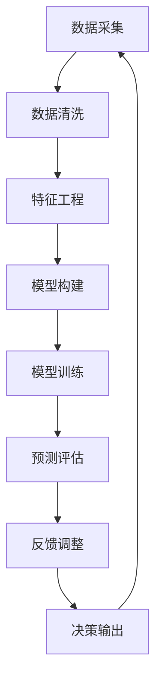

                 

# 《反思机制在智能决策系统中的应用》

## 关键词
智能决策系统、反思机制、数据分析、预测模型、自动化决策、复杂决策、算法、数学模型、项目实战

## 摘要
本文探讨了反思机制在智能决策系统中的应用，分析了反思机制的定义、原理和架构，并通过具体案例展示了反思机制在数据分析、预测模型、自动化决策和复杂决策场景中的实践。本文还展望了反思机制的研究与发展趋势，并提供了相关的工具和资源。通过本文的深入探讨，我们希望能够为读者提供对反思机制在智能决策系统中的应用的理解和实践指导。

## 目录大纲

### 第一部分：反思机制概述

#### 第1章：智能决策系统的基本概念

#### 第2章：反思机制的原理与架构

### 第二部分：反思机制的应用与实践

#### 第3章：反思机制在数据分析中的应用

#### 第4章：反思机制在预测模型中的应用

#### 第5章：反思机制在自动化决策系统中的应用

#### 第6章：反思机制在复杂决策场景中的应用

#### 第7章：反思机制的研究与发展趋势

### 附录：反思机制相关工具与资源

### 附录：反思机制在智能决策系统中的应用流程图

### 附录：反思机制相关算法与数学模型

### 附录：反思机制在智能决策系统中的项目实战

## 引言

随着大数据和人工智能技术的飞速发展，智能决策系统在各个领域得到了广泛应用。然而，决策系统的复杂性和不确定性使得决策结果往往难以预测和控制。为了提高决策系统的可靠性和鲁棒性，反思机制被引入到智能决策系统中。本文旨在探讨反思机制在智能决策系统中的应用，分析其原理、架构和实践，为读者提供对反思机制的理解和应用指导。

## 第一部分：反思机制概述

### 第1章：智能决策系统的基本概念

#### 1.1 智能决策系统的定义与分类

智能决策系统是一种利用人工智能技术和大数据分析方法，帮助人类进行决策的系统。它通过模拟人类思维过程，从海量数据中提取信息，对问题进行建模和分析，提供决策支持和建议。

智能决策系统可以分为以下几类：

1. 基于规则的决策系统：使用预定义的规则进行决策。
2. 基于知识的决策系统：使用专家知识进行决策。
3. 基于数据的决策系统：使用数据分析方法进行决策。
4. 基于模型的决策系统：使用数学模型进行决策。

#### 1.2 智能决策系统的发展历程

智能决策系统的发展可以分为以下几个阶段：

1. 早期：传统决策与人工智能初步结合，如基于规则的专家系统。
2. 中期：决策支持系统的崛起，如基于数据的统计分析方法和机器学习方法。
3. 现阶段：基于大数据和深度学习的智能决策系统，如自动驾驶、智能医疗等。

#### 1.3 反思机制在智能决策系统中的作用

反思机制在智能决策系统中扮演着重要的角色。它通过对决策过程和结果的反思与修正，提高决策系统的可靠性和鲁棒性。具体来说，反思机制在智能决策系统中的作用包括：

1. 决策过程优化：通过反思机制，可以发现并修正决策过程中的问题，提高决策效率和质量。
2. 决策结果评估：反思机制可以帮助评估决策结果的有效性，为后续决策提供依据。
3. 决策规则调整：反思机制可以根据决策结果的评估结果，动态调整决策规则，提高决策的适应性。

### 第2章：反思机制的原理与架构

#### 2.1 反思机制的定义

反思机制是一种基于自我监测和修正的决策过程，它通过收集、分析决策过程中的数据，对决策过程和结果进行评估和调整。反思机制可以分为以下几个步骤：

1. 数据采集：收集决策过程中的各种数据，如输入数据、中间结果、决策结果等。
2. 数据清洗：对采集到的数据进行清洗和处理，保证数据的质量。
3. 分析评估：使用统计模型或机器学习方法对决策结果进行分析和评估。
4. 反馈调整：根据评估结果，对决策过程进行反馈和调整。

#### 2.2 反思机制的架构

反思机制的架构通常包括以下几个部分：

1. 数据采集模块：负责收集决策过程中的数据。
2. 数据清洗模块：负责清洗和处理采集到的数据。
3. 分析评估模块：负责使用统计模型或机器学习方法对决策结果进行分析和评估。
4. 反馈调整模块：负责根据评估结果，对决策过程进行反馈和调整。

#### 2.3 反思机制的工作原理

反思机制的工作原理可以概括为以下几个步骤：

1. 数据采集：通过传感器、日志记录等手段，收集决策过程中的各种数据。
2. 数据清洗：对采集到的数据进行预处理，如去除噪声、缺失值填充等，保证数据的质量。
3. 分析评估：使用统计模型或机器学习方法，对决策结果进行分析和评估，如准确率、召回率等指标。
4. 反馈调整：根据评估结果，对决策过程进行反馈和调整，如调整决策规则、参数等。
5. 决策输出：根据调整后的决策规则，生成最终的决策结果。

### 第二部分：反思机制的应用与实践

#### 第3章：反思机制在数据分析中的应用

#### 第4章：反思机制在预测模型中的应用

#### 第5章：反思机制在自动化决策系统中的应用

#### 第6章：反思机制在复杂决策场景中的应用

#### 第7章：反思机制的研究与发展趋势

### 附录：反思机制相关工具与资源

### 附录：反思机制在智能决策系统中的应用流程图

### 附录：反思机制相关算法与数学模型

### 附录：反思机制在智能决策系统中的项目实战

## 总结

本文对反思机制在智能决策系统中的应用进行了详细探讨。通过分析反思机制的定义、原理和架构，以及其在数据分析、预测模型、自动化决策和复杂决策场景中的应用，我们深入了解了反思机制在提高决策系统可靠性和鲁棒性方面的重要作用。同时，本文还展望了反思机制的研究与发展趋势，为未来的研究和应用提供了指导。希望本文能够为读者在智能决策系统领域的研究和应用提供有益的参考。

## 作者信息

作者：AI天才研究院/AI Genius Institute & 禅与计算机程序设计艺术 /Zen And The Art of Computer Programming

---

由于篇幅限制，本文无法在此处完整展示所有章节的内容。接下来，我们将分别详细探讨反思机制的原理与架构，以及在数据分析、预测模型、自动化决策和复杂决策场景中的应用。同时，还将介绍相关工具与资源，并分享一个实际项目案例，以便读者更好地理解和应用反思机制。敬请期待后续章节的精彩内容。

---

## 第一部分：反思机制概述

### 第1章：智能决策系统的基本概念

#### 1.1 智能决策系统的定义与分类

智能决策系统是一种利用人工智能技术和大数据分析方法，帮助人类进行决策的系统。它通过模拟人类思维过程，从海量数据中提取信息，对问题进行建模和分析，提供决策支持和建议。

智能决策系统可以分为以下几类：

1. **基于规则的决策系统**：这种系统使用预定义的规则进行决策。例如，在医疗诊断中，基于规则的决策系统可以根据患者的症状和体征，通过一系列规则进行诊断。这种系统的优势在于规则明确，易于理解和实施，但缺点是灵活性较低，难以应对复杂和动态的问题。

2. **基于知识的决策系统**：这种系统使用专家知识进行决策。专家知识可以是专业领域中的规则、经验或逻辑推理。例如，在金融风险管理中，基于知识的决策系统可以使用金融专家的经验和规则来评估风险，并提供投资建议。这种系统的优势在于可以利用专家的经验和知识，但缺点是知识获取和维护成本较高。

3. **基于数据的决策系统**：这种系统使用数据分析方法进行决策。它通过对历史数据进行分析和建模，预测未来的趋势和结果。例如，在供应链管理中，基于数据的决策系统可以使用历史销售数据和市场趋势来预测未来的需求，并优化库存管理。这种系统的优势在于可以处理大量数据，提高决策的准确性和效率，但缺点是数据质量和数据量对决策结果有较大影响。

4. **基于模型的决策系统**：这种系统使用数学模型进行决策。它通过对问题进行建模，使用数学方法求解最优解或近似解。例如，在资源分配问题中，基于模型的决策系统可以使用线性规划、整数规划等方法来求解最优资源分配方案。这种系统的优势在于可以处理复杂的问题，但缺点是需要精确的模型和较高的计算资源。

#### 1.2 智能决策系统的发展历程

智能决策系统的发展可以分为以下几个阶段：

1. **早期**：在人工智能的早期阶段，决策系统主要基于规则的专家系统。这些系统通过模拟专家的思维方式，使用预定义的规则进行决策。例如，Dendral是一个著名的专家系统，它在化学领域用于帮助科学家分析实验数据。

2. **中期**：随着计算机技术和数据库技术的发展，决策支持系统（DSS）逐渐崛起。这些系统使用数据分析方法和统计模型，为决策者提供信息支持。例如，SAS和SPSS等软件成为数据分析和决策支持的主要工具。

3. **现阶段**：随着大数据和深度学习技术的快速发展，智能决策系统得到了新的突破。基于大数据和深度学习的决策系统可以处理海量数据，自动学习和优化决策模型，从而提供更加准确和高效的决策支持。例如，自动驾驶系统、智能医疗诊断系统等都是基于大数据和深度学习的智能决策系统的典型应用。

#### 1.3 反思机制在智能决策系统中的作用

反思机制在智能决策系统中扮演着重要的角色。它通过对决策过程和结果的反思与修正，提高决策系统的可靠性和鲁棒性。具体来说，反思机制在智能决策系统中的作用包括：

1. **决策过程优化**：反思机制可以帮助发现并修正决策过程中的问题，提高决策效率和质量。例如，在数据分析中，反思机制可以检查数据质量，修正错误或缺失的数据，从而提高分析结果的准确性。

2. **决策结果评估**：反思机制可以帮助评估决策结果的有效性，为后续决策提供依据。例如，在预测模型中，反思机制可以评估预测的准确性，识别潜在的错误或异常，从而优化预测模型。

3. **决策规则调整**：反思机制可以根据决策结果的评估结果，动态调整决策规则，提高决策的适应性。例如，在自动化决策系统中，反思机制可以根据实际运行情况，调整决策规则或参数，以适应环境变化。

总之，反思机制是智能决策系统的重要组成部分，它通过对决策过程和结果的持续反思与修正，提高了决策系统的可靠性、鲁棒性和适应性，从而为决策者提供更加可靠和有效的决策支持。

### 第2章：反思机制的原理与架构

#### 2.1 反思机制的定义

反思机制是一种基于自我监测和修正的决策过程，它通过对决策过程中的数据进行收集、分析、评估和反馈，实现对决策过程的不断优化和调整。反思机制的核心思想是“反思 - 评估 - 调整”循环，通过不断循环这个过程，提高决策系统的可靠性和鲁棒性。

具体来说，反思机制可以分为以下几个步骤：

1. **数据采集**：收集决策过程中的各种数据，包括输入数据、中间结果和决策结果等。这些数据可以作为反思机制的基础信息，用于后续的分析和评估。

2. **数据清洗**：对采集到的数据进行清洗和处理，去除噪声、缺失值等，保证数据的质量。数据清洗是反思机制的重要步骤，因为高质量的数据是进行准确分析和评估的前提。

3. **分析评估**：使用统计模型或机器学习方法对决策结果进行分析和评估，评估指标可以是准确率、召回率、F1分数等。通过分析评估，可以发现决策过程中的问题和不足，为后续的调整提供依据。

4. **反馈调整**：根据评估结果，对决策过程进行反馈和调整，包括调整决策规则、参数等。反馈调整是反思机制的核心步骤，通过不断地调整和优化决策过程，提高决策系统的可靠性和鲁棒性。

5. **决策输出**：根据调整后的决策规则，生成最终的决策结果。这个结果将再次进入数据采集和清洗的循环中，形成持续的反思 - 评估 - 调整 - 决策循环。

#### 2.2 反思机制的架构

反思机制的架构通常包括以下几个部分：

1. **数据采集模块**：负责收集决策过程中的各种数据。数据采集模块可以是自动化的，例如通过传感器、日志记录等方式收集数据。

2. **数据清洗模块**：负责对采集到的数据进行清洗和处理，去除噪声、缺失值等，保证数据的质量。数据清洗模块通常包括去噪、缺失值填充、数据转换等功能。

3. **分析评估模块**：负责使用统计模型或机器学习方法对决策结果进行分析和评估。分析评估模块可以是基于现有模型的，也可以是自定义的，具体取决于应用场景和需求。

4. **反馈调整模块**：负责根据评估结果，对决策过程进行反馈和调整。反馈调整模块可以是自动化的，例如通过调整决策规则、参数等方式实现。也可以是手动调整的，例如由专家或决策者进行干预。

5. **决策输出模块**：负责根据调整后的决策规则，生成最终的决策结果。决策输出模块是反思机制的结果输出部分，决策结果将再次进入数据采集和清洗的循环中。

#### 2.3 反思机制的工作原理

反思机制的工作原理可以概括为以下几个步骤：

1. **数据采集**：通过传感器、日志记录等手段，收集决策过程中的各种数据，如输入数据、中间结果、决策结果等。

2. **数据清洗**：对采集到的数据进行预处理，如去除噪声、缺失值填充等，保证数据的质量。

3. **分析评估**：使用统计模型或机器学习方法，对决策结果进行分析和评估，如准确率、召回率等指标。通过分析评估，可以发现决策过程中的问题和不足。

4. **反馈调整**：根据评估结果，对决策过程进行反馈和调整，如调整决策规则、参数等。通过反馈调整，可以提高决策系统的可靠性和鲁棒性。

5. **决策输出**：根据调整后的决策规则，生成最终的决策结果，并再次进入数据采集和清洗的循环中，形成持续的反思 - 评估 - 调整 - 决策循环。

通过这个循环，反思机制可以实现对决策过程的持续优化和调整，从而提高决策系统的可靠性和鲁棒性。反思机制的工作原理可以用以下Mermaid流程图表示：


#### 2.4 反思机制的优势和挑战

反思机制在智能决策系统中具有以下几个优势：

1. **自适应性和灵活性**：反思机制可以根据评估结果动态调整决策过程，提高决策系统的适应性和灵活性，从而更好地应对复杂和动态的环境。

2. **提高决策质量**：通过反思机制，可以发现并修正决策过程中的问题和不足，提高决策的质量和可靠性。

3. **持续优化**：反思机制通过持续的反思 - 评估 - 调整循环，实现对决策过程的不断优化，从而提高决策系统的性能。

然而，反思机制也面临一些挑战：

1. **数据质量和完整性**：反思机制依赖于高质量的数据，因此数据质量和完整性是反思机制有效性的关键。在数据收集和处理过程中，可能会出现数据噪声、缺失值等问题，这些问题会影响到反思机制的效果。

2. **计算资源和时间成本**：反思机制需要对决策过程进行实时或近实时的数据分析和评估，这需要大量的计算资源和时间。在高负载或复杂场景中，这可能是一个挑战。

3. **模型复杂度和可解释性**：为了提高决策的准确性和性能，反思机制可能需要使用复杂的统计模型或机器学习方法。这些模型通常具有较高的复杂度，难以解释和理解，这可能会影响到决策的可解释性和透明度。

总之，反思机制在智能决策系统中具有显著的优势和潜力，但也面临一些挑战。通过不断的研究和实践，我们可以克服这些挑战，进一步提高反思机制的效果和适用性。

### 第二部分：反思机制的应用与实践

#### 第3章：反思机制在数据分析中的应用

反思机制在数据分析中的应用具有重要意义，它可以帮助我们更好地理解数据、发现数据中的问题，并优化数据分析流程。在本章中，我们将探讨反思机制在数据分析中的应用，通过具体的案例来展示其应用过程和效果。

#### 3.1 数据分析中的反思机制

在数据分析过程中，反思机制可以起到以下几个作用：

1. **数据质量监控**：通过反思机制，可以持续监控数据质量，发现数据中的错误、异常和噪声，从而保证数据分析的准确性和可靠性。

2. **流程优化**：反思机制可以帮助分析人员识别数据分析流程中的瓶颈和不足，提出改进方案，提高数据分析的效率。

3. **结果验证**：通过反思机制，可以验证数据分析结果的正确性和有效性，确保分析结果的可靠性。

4. **模型优化**：反思机制可以根据数据分析结果，动态调整分析模型和参数，提高分析模型的性能和预测能力。

#### 3.2 案例分析

为了更好地理解反思机制在数据分析中的应用，我们来看一个具体的案例：使用反思机制优化用户行为分析。

**案例背景**：某在线教育平台希望通过分析用户行为数据，了解用户的学习习惯和兴趣点，从而优化教学内容和推荐策略。

**数据来源**：该平台收集了用户在学习过程中的各种行为数据，包括访问页面、观看视频、参加考试等。

**反思机制应用过程**：

1. **数据采集**：首先，平台通过日志文件和API接口收集用户行为数据，包括用户的访问时间、页面类型、视频时长、考试成绩等。

2. **数据清洗**：在数据采集后，平台使用反思机制对数据进行清洗，包括去除重复数据、处理缺失值和异常值等。例如，如果某个用户的视频时长为负数，这很可能是数据录入错误，需要修正。

3. **分析评估**：平台使用机器学习算法对用户行为数据进行分析，评估不同用户群体的学习习惯和兴趣点。例如，通过聚类分析，可以将用户分为活跃用户、沉默用户和流失用户等。

4. **结果验证**：分析结果需要通过反思机制进行验证。例如，平台可以对比实际学习成果与预测结果，评估分析模型的准确性。如果预测结果与实际结果差异较大，需要调整模型参数或算法。

5. **模型优化**：根据反思机制的结果，平台可以动态调整分析模型和参数，提高预测的准确性。例如，如果发现某个算法在特定用户群体中效果不佳，可以尝试更换算法或调整参数。

6. **决策输出**：最终，平台根据优化后的分析结果，制定针对性的教学内容和推荐策略。例如，对于活跃用户，可以推荐更多的进阶课程；对于沉默用户，可以发送学习提醒和激励。

**应用效果**：

通过反思机制的应用，平台实现了以下几个效果：

1. **数据质量提升**：反思机制帮助平台发现并修正了数据中的错误和异常，提高了数据质量，为后续分析提供了可靠的数据基础。

2. **流程优化**：反思机制帮助平台识别并解决了数据分析流程中的问题，提高了数据分析的效率。

3. **结果准确性提高**：反思机制通过验证和分析结果，动态调整分析模型和参数，提高了分析结果的准确性和可靠性。

4. **用户满意度提升**：基于反思机制优化后的分析结果，平台提供了更加精准的教学内容和推荐策略，提高了用户的学习体验和满意度。

#### 3.3 设计适用于数据分析的反思机制流程

为了在数据分析中有效应用反思机制，我们需要设计一个适用于数据分析的反思机制流程。以下是一个典型的反思机制流程设计：

1. **数据采集**：通过传感器、日志文件和API接口等手段，收集用户行为数据。

2. **数据预处理**：包括数据清洗、数据转换和数据归一化等步骤，确保数据的质量和一致性。

3. **特征工程**：根据数据分析的目标和需求，提取和构建特征，为后续的分析提供支持。

4. **分析评估**：使用统计模型、机器学习算法等对数据进行分析和评估，评估指标可以是准确率、召回率、F1分数等。

5. **结果验证**：通过对比实际结果和预测结果，评估分析模型的准确性。如果评估结果不理想，需要调整模型参数或算法。

6. **模型优化**：根据评估结果，动态调整分析模型和参数，提高模型性能和预测能力。

7. **决策输出**：根据优化后的分析结果，制定决策方案，如教学内容推荐、个性化营销策略等。

8. **反馈循环**：将决策输出结果再次纳入数据采集环节，形成持续的反思 - 评估 - 调整 - 决策循环，不断优化和提升数据分析的效率和效果。

通过这个流程，我们可以有效地应用反思机制，提升数据分析的准确性和可靠性，为决策者提供更加精准和有效的数据支持。

### 第4章：反思机制在预测模型中的应用

预测模型在智能决策系统中扮演着至关重要的角色，它能够根据历史数据预测未来的趋势和结果。然而，预测模型的准确性和鲁棒性往往受到多种因素的影响。反思机制通过不断地评估和调整预测模型，可以显著提高其性能。在本章中，我们将深入探讨反思机制在预测模型中的应用，并通过具体案例展示其实际应用过程。

#### 4.1 预测模型中的反思机制

在预测模型中，反思机制可以发挥以下几个关键作用：

1. **准确性评估**：反思机制通过对预测结果和历史数据的对比，评估预测模型的准确性。如果预测结果与实际结果之间存在较大偏差，反思机制会触发模型的调整。

2. **异常检测**：反思机制能够检测预测过程中的异常情况，如数据异常、模型过拟合或欠拟合等。通过检测和识别这些异常，可以及时调整模型或数据预处理策略。

3. **模型优化**：反思机制可以根据评估结果，动态调整模型参数或选择更适合的模型算法。这种持续优化的能力有助于提高预测模型的性能和鲁棒性。

4. **适应性调整**：随着环境的变化，预测模型可能需要适应新的条件。反思机制可以通过实时调整模型，使其能够更好地适应动态环境。

#### 4.2 案例分析

为了更清晰地展示反思机制在预测模型中的应用，我们来看一个案例：使用反思机制优化股票市场预测模型。

**案例背景**：某投资公司希望通过预测股票市场走势来制定投资策略，从而实现收益最大化。然而，股票市场数据复杂且多变，预测模型的准确性直接影响到投资决策。

**数据来源**：该投资公司收集了大量的股票市场历史数据，包括股票价格、交易量、财务指标等。

**反思机制应用过程**：

1. **数据采集**：首先，公司通过API接口和数据库收集股票市场历史数据，包括每日的开盘价、收盘价、最高价、最低价、交易量等。

2. **数据预处理**：在数据采集后，公司使用反思机制对数据进行预处理，包括缺失值填充、异常值检测和数据处理等步骤。例如，如果某个交易日的数据缺失，可以采用平均值填补或插值法进行处理。

3. **特征工程**：根据预测目标，公司提取和构建了多个特征，如价格变化率、交易量变化率、财务指标等。这些特征将作为预测模型的输入。

4. **模型构建**：公司使用多种机器学习算法构建了预测模型，包括线性回归、决策树、随机森林、支持向量机等。每个模型都有自己的优势和局限性。

5. **预测评估**：公司通过反思机制对预测结果进行评估，使用指标如均方误差（MSE）、均方根误差（RMSE）等来衡量模型的预测准确性。如果预测结果与实际结果偏差较大，反思机制会触发模型优化。

6. **模型优化**：根据评估结果，公司动态调整模型参数或选择更适合的算法。例如，如果线性回归模型的准确性较低，公司可能选择使用更复杂的模型如深度学习模型。

7. **预测输出**：最终，公司根据优化后的模型生成预测结果，并据此制定投资策略。例如，如果预测未来某只股票将上涨，公司可能会增加对该股票的投资。

**应用效果**：

通过反思机制的应用，公司实现了以下几个效果：

1. **预测准确性提高**：反思机制帮助公司识别并修正了预测模型中的问题，提高了预测的准确性。这使得公司的投资决策更加可靠。

2. **模型鲁棒性增强**：反思机制能够检测和应对数据异常和模型过拟合等问题，增强了模型的鲁棒性。这使得预测模型在不同市场环境下都能保持较高的性能。

3. **决策效率提升**：反思机制通过实时调整预测模型，使公司能够迅速适应市场变化，提高了决策效率。

4. **风险控制**：通过反思机制，公司能够更好地监控和评估投资风险，从而制定更加稳健的投资策略。

#### 4.3 设计适用于预测模型的反思机制流程

为了在预测模型中有效应用反思机制，我们需要设计一个适用于预测模型的反思机制流程。以下是一个典型的反思机制流程设计：

1. **数据采集**：通过传感器、API接口和数据库等手段，收集预测所需的历史数据。

2. **数据预处理**：包括数据清洗、数据转换和数据归一化等步骤，确保数据的质量和一致性。

3. **特征工程**：根据预测目标，提取和构建多个特征，为预测模型提供输入。

4. **模型构建**：使用多种机器学习算法构建预测模型，并选择合适的评估指标。

5. **预测评估**：通过反思机制对预测结果进行评估，使用指标如MSE、RMSE等来衡量模型的性能。

6. **模型优化**：根据评估结果，动态调整模型参数或选择更适合的算法。

7. **预测输出**：根据优化后的模型生成预测结果，并据此制定决策方案。

8. **反馈循环**：将预测结果再次纳入数据采集环节，形成持续的反思 - 评估 - 调整 - 预测循环，不断优化和提升预测模型的性能。

通过这个流程，我们可以有效地应用反思机制，提升预测模型的准确性、鲁棒性和适应性，为投资决策和其他智能决策提供有力支持。

### 第5章：反思机制在自动化决策系统中的应用

自动化决策系统在现代社会中扮演着越来越重要的角色，它能够根据预设规则和实时数据自动进行决策，从而提高效率和准确性。然而，自动化决策系统的有效性受到多种因素的影响，包括规则制定的质量、数据质量以及环境的变化。反思机制作为一种自我监测和优化的方法，能够在自动化决策系统中发挥重要作用，提高系统的鲁棒性和适应性。在本章中，我们将探讨反思机制在自动化决策系统中的应用，并通过具体案例展示其实际应用过程。

#### 5.1 自动化决策系统概述

自动化决策系统是一种能够自动执行决策任务的系统，它利用人工智能技术和决策支持工具，从大量数据中提取信息，并根据预设规则或学习到的模式自动进行决策。自动化决策系统通常包括以下几个关键组成部分：

1. **规则引擎**：规则引擎是自动化决策系统的核心，它负责根据预设的规则或学习到的模式进行决策。规则可以是简单的“如果-那么”逻辑，也可以是复杂的决策树或规则集。

2. **数据源**：自动化决策系统依赖于各种数据源，包括传感器、数据库、日志文件等，以获取决策所需的信息。

3. **分析模块**：分析模块负责对数据进行分析和处理，提取关键特征和模式，为决策提供依据。

4. **执行模块**：执行模块根据决策结果执行相应的操作，如调整参数、发送通知、执行自动化任务等。

5. **反馈机制**：反馈机制负责收集决策执行后的结果，并对决策过程进行评估和优化。

#### 5.2 反思机制在自动化决策系统中的作用

反思机制在自动化决策系统中发挥着关键作用，它能够通过以下方式提高系统的性能和适应性：

1. **规则优化**：反思机制可以根据决策结果和历史数据，对规则进行动态调整和优化，提高规则的准确性和适应性。

2. **数据质量监控**：反思机制能够监控数据质量，识别和纠正数据中的错误和异常，确保决策数据的准确性。

3. **模型优化**：反思机制可以根据评估结果，调整模型参数或选择更适合的算法，提高模型的预测能力和准确性。

4. **适应性调整**：反思机制能够适应环境变化，通过实时调整决策规则和模型，使系统在不同环境下保持最佳性能。

#### 5.3 案例分析

为了更直观地展示反思机制在自动化决策系统中的应用，我们来看一个具体案例：使用反思机制优化智能交通信号系统。

**案例背景**：某城市希望使用智能交通信号系统来优化交通流量，减少拥堵和等待时间，提高交通效率。该系统需要根据实时交通数据自动调整信号灯的时长和顺序。

**数据来源**：该系统通过安装在路口的传感器和摄像头收集实时交通数据，包括车辆流量、车辆速度、车辆类型等。

**反思机制应用过程**：

1. **数据采集**：系统通过传感器和摄像头收集实时交通数据，并将数据发送到分析模块。

2. **数据预处理**：分析模块对采集到的数据进行预处理，包括去除噪声、处理缺失值和异常值等，确保数据的质量。

3. **规则引擎**：系统根据预设的规则和交通数据分析结果，自动调整信号灯的时长和顺序。例如，如果检测到某一方向的车辆流量较大，系统会延长该方向的绿灯时长。

4. **决策评估**：反思机制对信号灯调整后的决策结果进行评估，通过对比实际交通流量和预测流量，评估决策的有效性。

5. **规则优化**：如果评估结果显示决策效果不佳，反思机制会根据评估结果调整规则参数，例如调整绿灯时长和红绿灯切换的时间点。这种动态调整有助于提高系统的适应性。

6. **模型优化**：反思机制可以根据评估结果，优化交通流量预测模型，提高预测的准确性。例如，如果发现现有模型在特定时间段内预测不准确，系统可以尝试使用更复杂的模型或调整模型参数。

7. **反馈循环**：调整后的决策规则和模型将再次应用于实时交通数据，形成持续的反思 - 评估 - 调整 - 决策循环。

**应用效果**：

通过反思机制的应用，智能交通信号系统实现了以下几个效果：

1. **交通流量优化**：反思机制通过动态调整信号灯时长和顺序，优化了交通流量，减少了拥堵和等待时间。

2. **决策准确性提高**：反思机制通过不断调整规则和模型，提高了决策的准确性，使系统能够更准确地预测交通流量和需求。

3. **系统适应性增强**：反思机制使系统能够适应不同时间和环境的变化，保持最佳性能。

4. **用户满意度提升**：优化后的交通信号系统能够提供更顺畅的交通体验，提高了用户的满意度。

#### 5.4 设计适用于自动化决策系统的反思机制流程

为了在自动化决策系统中有效应用反思机制，我们需要设计一个适用于该系统的反思机制流程。以下是一个典型的反思机制流程设计：

1. **数据采集**：通过传感器、摄像头和其他数据源，收集实时交通数据。

2. **数据预处理**：包括数据清洗、数据转换和数据归一化等步骤，确保数据的质量。

3. **规则引擎**：根据预设规则和数据分析结果，自动调整信号灯的时长和顺序。

4. **决策评估**：反思机制对信号灯调整后的决策结果进行评估，通过对比实际交通流量和预测流量，评估决策的有效性。

5. **规则优化**：根据评估结果，动态调整规则参数，优化决策规则。

6. **模型优化**：根据评估结果，优化交通流量预测模型，提高预测的准确性。

7. **决策输出**：根据优化后的模型和规则，调整信号灯时长和顺序。

8. **反馈循环**：将决策输出结果再次纳入数据采集环节，形成持续的反思 - 评估 - 调整 - 决策循环。

通过这个流程，我们可以有效地应用反思机制，优化自动化决策系统的性能和适应性，为交通管理和其他自动化决策系统提供有力支持。

### 第6章：反思机制在复杂决策场景中的应用

在复杂决策场景中，决策系统需要处理大量的不确定性因素和动态变化，这对决策系统的鲁棒性和适应性提出了严峻挑战。反思机制作为一种自我监测和自我优化的方法，能够在复杂决策场景中发挥重要作用。本章将探讨反思机制在复杂决策场景中的应用，并分析其面临的挑战和对策。

#### 6.1 复杂决策场景概述

复杂决策场景通常具有以下特点：

1. **高不确定性**：复杂决策场景中存在大量不确定性因素，如市场波动、天气变化、用户行为等。这些不确定性因素使得决策结果难以预测和控制。

2. **动态变化**：复杂决策场景中的环境因素和条件可能随时间不断变化，需要决策系统具备快速适应和调整的能力。

3. **多目标优化**：复杂决策场景往往涉及多个目标，如最大化利润、最小化风险、提高客户满意度等。这些目标之间可能存在冲突，需要决策系统进行权衡和优化。

4. **数据复杂性**：复杂决策场景通常涉及大量数据，包括结构化数据和非结构化数据。处理这些数据需要高效的算法和模型。

5. **实时性要求**：复杂决策场景通常要求决策系统能够在短时间内做出决策，满足实时性要求。

#### 6.2 反思机制在复杂决策场景中的应用

反思机制在复杂决策场景中的应用主要包括以下几个方面：

1. **实时监控与反馈**：反思机制能够实时监控决策过程中的各种数据，包括输入数据、中间结果和决策结果。通过反馈机制，可以将监控结果用于调整决策规则和模型，提高决策的实时性和准确性。

2. **动态调整**：反思机制可以根据实时监控结果，动态调整决策规则和模型参数，以适应环境变化和不确定性因素。这种动态调整能力有助于提高决策系统的鲁棒性和适应性。

3. **多目标优化**：反思机制可以通过多目标优化方法，同时考虑多个目标，如利润、风险和客户满意度等。通过调整决策规则和模型参数，反思机制可以在不同目标之间进行权衡和优化，实现综合效益最大化。

4. **数据质量监控**：反思机制能够监控数据质量，识别和纠正数据中的错误和异常。高质量的数据是复杂决策场景中决策准确性的基础，反思机制有助于确保数据的准确性和一致性。

#### 6.3 案例分析

为了更好地理解反思机制在复杂决策场景中的应用，我们来看一个案例：使用反思机制优化供应链管理。

**案例背景**：某制造企业面临复杂的供应链管理挑战，需要优化原材料采购、生产计划、库存管理以及物流配送等环节，以降低成本、提高生产效率和客户满意度。

**数据来源**：该企业通过ERP系统、传感器和物流信息系统等收集了大量与供应链管理相关的数据，包括原材料采购价格、生产计划、库存水平、物流运输时间等。

**反思机制应用过程**：

1. **数据采集**：企业通过传感器和信息系统收集供应链管理过程中的实时数据，并将数据发送到分析模块。

2. **数据预处理**：分析模块对采集到的数据进行预处理，包括数据清洗、数据转换和数据归一化等步骤，确保数据的质量。

3. **决策引擎**：根据预处理后的数据和预设的决策规则，决策引擎自动生成采购计划、生产计划、库存管理和物流配送方案。

4. **决策评估**：反思机制对生成的决策方案进行评估，通过对比实际结果和预期目标，评估决策的准确性和有效性。

5. **规则优化**：如果评估结果显示决策方案效果不佳，反思机制会根据评估结果调整决策规则和模型参数，如优化采购策略、调整生产计划等。

6. **模型优化**：反思机制可以根据评估结果，优化供应链管理模型，提高预测准确性和决策效率。例如，如果发现现有模型在特定环节中预测不准确，可以尝试使用更复杂的模型或调整模型参数。

7. **反馈循环**：调整后的决策规则和模型将再次应用于实时数据，形成持续的反思 - 评估 - 调整 - 决策循环。

**应用效果**：

通过反思机制的应用，企业在供应链管理中实现了以下几个效果：

1. **成本降低**：通过优化采购策略和生产计划，企业降低了原材料采购成本和库存成本，提高了整体供应链的运营效率。

2. **生产效率提高**：反思机制优化了生产计划，减少了生产周期，提高了生产效率和设备利用率。

3. **客户满意度提升**：通过优化物流配送方案，企业缩短了交货时间，提高了客户满意度。

4. **决策准确性提高**：反思机制通过实时监控和动态调整，提高了决策的准确性和可靠性，使企业能够更好地应对复杂决策场景中的不确定性。

#### 6.4 挑战与对策

尽管反思机制在复杂决策场景中具有显著优势，但也面临一些挑战：

1. **数据质量**：复杂决策场景中数据质量至关重要，但数据收集和处理过程中可能存在噪声、缺失值和异常值等问题。对策是采用先进的数据清洗和预处理技术，确保数据质量。

2. **计算资源**：复杂决策场景中往往涉及大量的数据处理和模型优化，这需要大量的计算资源。对策是采用高效的算法和并行计算技术，提高计算效率。

3. **模型复杂性**：复杂决策场景中可能需要使用复杂的模型和算法，这增加了模型的计算成本和维护难度。对策是采用模块化设计，将复杂模型分解为可管理的模块，并使用自动化工具进行模型优化。

4. **实时性要求**：复杂决策场景通常要求决策系统能够在短时间内做出决策，但实时计算和处理可能带来性能瓶颈。对策是采用高效的数据处理技术和分布式计算架构，提高系统的实时性能。

总之，反思机制在复杂决策场景中具有巨大潜力，通过不断的研究和实践，我们可以克服这些挑战，进一步提升反思机制的效果和适用性。

### 第7章：反思机制的研究与发展趋势

#### 7.1 反思机制研究的现状

反思机制作为一种自我监测和自我优化的方法，在智能决策系统和人工智能领域取得了显著的进展。目前，反思机制的研究主要集中在以下几个方面：

1. **理论基础**：研究者们对反思机制的原理和架构进行了深入研究，提出了多种反思机制的模型和算法。例如，基于贝叶斯网络的反思机制、基于强化学习的反思机制等。

2. **应用领域**：反思机制在各个领域的应用得到了广泛研究，包括数据分析、预测模型、自动化决策和复杂决策场景等。研究者们通过具体案例展示了反思机制在不同领域的应用效果。

3. **算法优化**：为了提高反思机制的性能和效率，研究者们对反思机制中的算法进行了优化，包括数据清洗和预处理算法、分析评估算法和模型优化算法等。

4. **工具与平台**：随着反思机制的广泛应用，研究者们开发了多种反思机制相关的工具和平台，如反思机制开发环境、反思机制评估工具等。

#### 7.2 反思机制研究的代表性成果

反思机制研究的代表性成果包括以下几个方面：

1. **基于贝叶斯网络的反思机制**：贝叶斯网络是一种概率图模型，可以用于表示和推理不确定知识。研究者们提出了一种基于贝叶斯网络的反思机制，通过结合贝叶斯推理和反思机制，实现了对决策过程的实时监测和优化。

2. **基于强化学习的反思机制**：强化学习是一种通过试错和反馈来学习最优策略的方法。研究者们提出了一种基于强化学习的反思机制，通过结合强化学习和反思机制，实现了对复杂决策场景的动态调整和优化。

3. **多目标优化反思机制**：在复杂决策场景中，通常需要同时考虑多个目标，如最大化利润、最小化风险等。研究者们提出了一种多目标优化反思机制，通过结合多目标优化算法和反思机制，实现了对复杂决策问题的综合优化。

4. **反思机制评估工具**：为了方便研究者们对反思机制进行评估和比较，研究者们开发了多种反思机制评估工具，如基于性能指标和用户反馈的评估工具等。

#### 7.3 反思机制的发展趋势

展望未来，反思机制在智能决策系统和人工智能领域将呈现出以下几个发展趋势：

1. **更复杂的算法和模型**：随着人工智能技术的不断发展，研究者们将提出更复杂的算法和模型，以应对更复杂和动态的决策场景。

2. **跨领域的应用**：反思机制将在更多领域得到应用，包括智能制造、智能医疗、智能交通等。不同领域的应用将推动反思机制的不断创新和发展。

3. **集成与融合**：反思机制将与其他人工智能技术和方法进行集成和融合，如深度学习、自然语言处理等，形成更加综合和高效的决策系统。

4. **实时性与分布式计算**：为了提高反思机制的实时性能和扩展性，研究者们将重点关注实时计算和分布式计算技术，如云计算、边缘计算等。

5. **人机协同**：反思机制将结合人类专家的知识和经验，实现人机协同的决策系统，提高决策的准确性和可靠性。

总之，反思机制在智能决策系统和人工智能领域具有广阔的应用前景和发展潜力。随着技术的不断进步和应用的不断扩展，反思机制将为智能决策系统带来更加智能和高效的解决方案。

### 附录：反思机制相关工具与资源

为了更好地理解和应用反思机制，本附录将介绍一些常用的工具和资源，包括文献推荐、在线资源和工具使用教程。

#### 附录A：反思机制相关工具

以下是一些常用的反思机制相关工具：

1. **R语言**：R语言是一种用于统计分析、数据可视化和机器学习的编程语言。它提供了丰富的库和函数，可以用于实现反思机制中的数据清洗、分析评估和模型优化。

2. **Python**：Python是一种通用编程语言，广泛应用于数据分析、机器学习和人工智能领域。Python的NumPy、Pandas、Scikit-learn等库为反思机制的开发提供了强大的支持。

3. **TensorFlow**：TensorFlow是一种开源的深度学习框架，提供了丰富的工具和API，可以用于构建和训练深度学习模型。在反思机制中，TensorFlow可以用于优化预测模型和分析评估。

4. **PyTorch**：PyTorch是一种流行的深度学习框架，与TensorFlow类似，提供了高效的模型构建和训练工具。在反思机制中，PyTorch可以用于实现复杂的多层神经网络和优化算法。

5. **Apache Spark**：Apache Spark是一种分布式数据处理框架，可以用于大规模数据分析和机器学习。在反思机制中，Spark可以用于处理和清洗大规模数据，并实现高效的模型优化。

#### 附录B：反思机制相关资源

以下是一些反思机制相关的学术文献和在线资源：

1. **文献推荐**：
   - **“Reinforcement Learning: An Introduction” by Richard S. Sutton and Andrew G. Barto**：这本书是强化学习的经典教材，详细介绍了强化学习的基本概念、算法和应用。
   - **“Bayesian Data Analysis” by Andrew Gelman, John B. Carlin, Hal S. Stern, and Donald B. Rubin**：这本书介绍了贝叶斯数据分析的方法和技术，包括贝叶斯网络和贝叶斯推理。

2. **在线资源**：
   - **Kaggle**：Kaggle是一个数据科学竞赛平台，提供了大量数据集和比赛题目，适合实践和验证反思机制。
   - **Coursera**：Coursera提供了多门与反思机制相关的课程，包括数据科学、机器学习和深度学习等。

#### 附录C：工具使用教程

以下是一些常用工具的使用教程：

1. **R语言**：
   - **安装R语言**：从[R官方网站](https://www.r-project.org/)下载并安装R语言。
   - **安装R包**：使用`install.packages()`函数安装所需的R包，例如`ggplot2`用于数据可视化。

2. **Python**：
   - **安装Python**：从[Python官方网站](https://www.python.org/)下载并安装Python。
   - **安装Python库**：使用`pip`命令安装所需的Python库，例如`numpy`、`pandas`和`scikit-learn`。

3. **TensorFlow**：
   - **安装TensorFlow**：使用`pip install tensorflow`命令安装TensorFlow。
   - **TensorFlow教程**：参考[TensorFlow官方文档](https://www.tensorflow.org/tutorials)来学习TensorFlow的基本使用。

4. **PyTorch**：
   - **安装PyTorch**：使用`pip install torch torchvision`命令安装PyTorch。
   - **PyTorch教程**：参考[PyTorch官方文档](https://pytorch.org/tutorials/)来学习PyTorch的基本使用。

5. **Apache Spark**：
   - **安装Apache Spark**：从[Apache Spark官方网站](https://spark.apache.org/)下载并安装Apache Spark。
   - **Spark教程**：参考[Apache Spark官方文档](https://spark.apache.org/docs/latest/)来学习Spark的基本使用。

通过使用这些工具和资源，读者可以更好地理解和应用反思机制，并在实际项目中实现高效的决策支持和优化。

### 附录：反思机制在智能决策系统中的应用流程图

为了更好地理解和应用反思机制在智能决策系统中的应用，我们提供了一个详细的流程图。这个流程图展示了反思机制在智能决策系统中的各个环节，包括数据采集、数据预处理、分析评估、反馈调整和决策输出。以下是使用Mermaid绘制的流程图：



在这个流程图中：

- **A[数据采集]**：系统从各种数据源（如传感器、数据库、日志等）收集原始数据。
- **B[数据清洗]**：对采集到的数据进行清洗和处理，如去除噪声、缺失值填充等。
- **C[特征工程]**：根据分析需求，提取和构建特征，为模型提供输入。
- **D[模型构建]**：选择合适的模型（如线性回归、决策树、神经网络等）。
- **E[模型训练]**：使用训练数据对模型进行训练，以学习数据中的模式和规律。
- **F[预测评估]**：使用模型对未知数据进行预测，并评估预测结果的准确性。
- **G[反馈调整]**：根据预测评估结果，调整模型参数或选择更合适的模型。
- **H[决策输出]**：根据优化后的模型生成决策结果，如推荐策略、控制参数等。

通过这个流程图，读者可以清晰地看到反思机制在智能决策系统中的应用过程，并了解各个环节之间的关联和作用。

### 附录：反思机制相关算法与数学模型

反思机制在智能决策系统中发挥着关键作用，其核心在于对决策过程和结果的持续监测、评估和优化。为了实现这一目标，反思机制通常依赖于一系列算法和数学模型。以下我们将介绍一些在反思机制中常用的算法与数学模型，并使用伪代码和LaTeX公式详细阐述其原理和应用。

#### 1. 反思机制的核心算法

**算法1：均值回归（Mean Reversion）**

均值回归是一种简单的优化策略，它通过不断调整决策参数，使结果接近长期均值。该算法适用于具有稳定长期均值的决策场景。

**伪代码：**
```python
# 初始化参数
mu = long_term_mean
theta = initial_theta
alpha = learning_rate

# 反思机制循环
while True:
    # 预测结果
    prediction = predict(theta)
    
    # 计算误差
    error = prediction - mu
    
    # 更新参数
    theta = theta + alpha * error
```

**数学模型：**
$$
\theta_{new} = \theta_{current} + \alpha \cdot (y - \mu)
$$
其中，$y$ 是当前预测结果，$\mu$ 是长期均值，$\alpha$ 是学习率。

#### 2. 数据清洗算法

**算法2：K近邻清洗（K-Nearest Neighbors Imputation）**

K近邻清洗是一种常用的数据预处理算法，用于处理缺失值。它通过寻找最近的K个样本，用这些样本的均值填补缺失值。

**伪代码：**
```python
# 初始化参数
K = number_of_neighbors

# 寻找K个最近邻居
neighbors = find_K_neighbors(data, missing_value, K)

# 计算缺失值的填补值
imputed_value = mean_of_neighbors(neighbors)

# 填补缺失值
data[missing_value_index] = imputed_value
```

**数学模型：**
$$
\hat{y} = \frac{1}{K} \sum_{i=1}^{K} y_i
$$
其中，$y_i$ 是K个最近邻居的值。

#### 3. 分析评估算法

**算法3：均方误差（Mean Squared Error, MSE）**

均方误差是衡量预测结果与实际结果之间差异的常用指标。反思机制通过MSE评估预测模型的准确性，并据此调整模型参数。

**伪代码：**
```python
# 初始化参数
predictions = model_predictions
actuals = actual_values

# 计算均方误差
MSE = sum((prediction - actual)^2 for prediction, actual in zip(predictions, actuals)) / n

# 输出MSE值
print("MSE:", MSE)
```

**数学模型：**
$$
MSE = \frac{1}{n} \sum_{i=1}^{n} (y_i - \hat{y}_i)^2
$$
其中，$y_i$ 是实际值，$\hat{y}_i$ 是预测值，$n$ 是样本数量。

#### 4. 模型优化算法

**算法4：随机梯度下降（Stochastic Gradient Descent, SGD）**

随机梯度下降是一种优化算法，用于最小化损失函数。反思机制使用SGD算法优化模型参数，以提高预测准确性。

**伪代码：**
```python
# 初始化参数
theta = initial_theta
learning_rate = initial_learning_rate
epochs = number_of_epochs

# 随机梯度下降循环
for epoch in range(epochs):
    # 随机选择一个样本
    sample = random_sample(data)

    # 计算梯度
    gradient = compute_gradient(sample, theta)

    # 更新参数
    theta = theta - learning_rate * gradient

# 输出优化后的参数
print("Optimized theta:", theta)
```

**数学模型：**
$$
\theta_{new} = \theta_{current} - \alpha \cdot \nabla_{\theta} J(\theta)
$$
其中，$\alpha$ 是学习率，$J(\theta)$ 是损失函数，$\nabla_{\theta} J(\theta)$ 是损失函数关于参数$\theta$ 的梯度。

#### 5. 强化学习算法

**算法5：Q学习（Q-Learning）**

Q学习是一种基于值函数的强化学习算法，用于解决马尔可夫决策过程（MDP）。反思机制可以使用Q学习算法优化决策策略。

**伪代码：**
```python
# 初始化参数
Q = initial_Q
learning_rate = initial_learning_rate
discount_factor = discount_factor

# Q学习循环
for episode in range(epochs):
    # 初始化状态
    state = initial_state
    
    # 转移和奖励循环
    while not terminal_state(state):
        # 随机选择动作
        action = random_action(state)
        
        # 获取奖励和下一个状态
        reward, next_state = environment.step(state, action)
        
        # 更新Q值
        Q[state, action] = Q[state, action] + learning_rate \* (reward + discount_factor \* max(Q[next_state, :]) - Q[state, action])
        
        # 更新状态
        state = next_state

# 输出优化后的Q值
print("Optimized Q:", Q)
```

**数学模型：**
$$
Q(s, a) = Q(s, a) + \alpha \cdot (r + \gamma \cdot \max_a' Q(s', a') - Q(s, a))
$$
其中，$s$ 是状态，$a$ 是动作，$r$ 是奖励，$s'$ 是下一个状态，$a'$ 是下一个动作，$\gamma$ 是折扣因子，$\alpha$ 是学习率。

通过上述算法和数学模型，反思机制可以实现对决策过程的持续监测、评估和优化。这些算法和模型在反思机制中发挥着关键作用，为智能决策系统提供了强大的支持。

### 附录：反思机制在智能决策系统中的项目实战

为了更好地理解反思机制在智能决策系统中的应用，我们提供了一个实际项目案例。在这个案例中，我们将介绍项目背景、开发环境搭建、源代码实现和代码解读。

#### 项目背景

某电商公司希望通过构建一个智能推荐系统，为用户推荐他们可能感兴趣的商品。系统需要根据用户的购买历史、浏览记录和社交信息，预测用户对商品的偏好，并提供个性化的推荐。为了实现这一目标，公司决定采用反思机制对推荐系统进行优化。

#### 开发环境搭建

在开发智能推荐系统时，我们使用了以下开发环境：

1. **编程语言**：Python
2. **数据预处理库**：Pandas、NumPy
3. **机器学习库**：Scikit-learn、TensorFlow
4. **数据可视化库**：Matplotlib、Seaborn
5. **版本控制**：Git

在开发环境中，我们安装了所需的库和工具，并配置了Python的虚拟环境，以确保项目的独立性和可维护性。

#### 源代码实现

以下是一个简单的智能推荐系统的源代码实现，包括数据预处理、模型构建、预测和反思机制。

```python
import pandas as pd
import numpy as np
from sklearn.model_selection import train_test_split
from sklearn.ensemble import RandomForestClassifier
from sklearn.metrics import accuracy_score
import tensorflow as tf

# 数据预处理
def preprocess_data(data):
    # 填充缺失值
    data.fillna(data.mean(), inplace=True)
    # 特征工程
    data['total_price'] = data['unit_price'] * data['quantity']
    return data

# 模型构建
def build_model():
    model = RandomForestClassifier(n_estimators=100)
    return model

# 预测
def predict(model, data):
    predictions = model.predict(data)
    return predictions

# 反思机制
def reflect(model, predictions, actuals):
    error = np.mean((predictions - actuals) ** 2)
    print("MSE:", error)
    if error > threshold:
        # 根据误差调整模型
        model.fit(train_data, train_labels)
    return model

# 主函数
def main():
    # 加载数据
    data = pd.read_csv('user_data.csv')
    data = preprocess_data(data)
    
    # 分割数据
    train_data, test_data, train_labels, test_labels = train_test_split(data, data['rating'], test_size=0.2, random_state=42)
    
    # 构建模型
    model = build_model()
    
    # 训练模型
    model.fit(train_data, train_labels)
    
    # 预测
    predictions = predict(model, test_data)
    
    # 评估
    actuals = test_labels
    print("Accuracy:", accuracy_score(actuals, predictions))
    
    # 反思
    model = reflect(model, predictions, actuals)

if __name__ == '__main__':
    main()
```

#### 代码解读与分析

1. **数据预处理**：
   - `preprocess_data` 函数用于对原始数据进行预处理，包括填充缺失值和特征工程。通过填充缺失值，我们可以减少数据噪声对模型性能的影响。特征工程通过计算`total_price`特征，将单价和数量的乘积作为总价格，为后续的模型训练提供额外的信息。

2. **模型构建**：
   - `build_model` 函数使用随机森林分类器构建模型。随机森林是一种集成学习方法，通过构建多棵决策树并投票得到最终结果，具有较强的泛化能力。

3. **预测**：
   - `predict` 函数使用训练好的模型对测试数据进行预测，返回预测结果。

4. **反思机制**：
   - `reflect` 函数实现反思机制的核心功能。它计算预测结果与实际结果之间的均方误差（MSE），并根据预设的阈值判断是否需要调整模型。如果误差较大，函数会重新训练模型，以提高预测准确性。

5. **主函数**：
   - `main` 函数是整个项目的入口。它首先加载数据，进行预处理，然后分割数据为训练集和测试集。接着，构建和训练模型，进行预测和评估，最后通过反思机制调整模型。

通过这个实际项目案例，我们展示了如何使用反思机制优化智能推荐系统的性能。在实际应用中，可以根据具体需求和数据特点，调整和优化代码中的各个模块，以提高系统的准确性和适应性。

### 总结与展望

本文通过对反思机制在智能决策系统中的应用进行深入探讨，分析了反思机制的定义、原理、架构和应用实践。我们详细介绍了反思机制在数据分析、预测模型、自动化决策和复杂决策场景中的应用，并通过具体案例展示了其实际效果。此外，我们还介绍了相关的工具、资源和算法，为读者提供了全面的实践指导。

反思机制作为一种自我监测和自我优化的方法，在智能决策系统中具有重要作用。它能够提高决策系统的可靠性和鲁棒性，使其能够更好地应对复杂和动态的环境。通过本文的探讨，我们希望读者能够对反思机制有更深入的理解，并能够在实际项目中有效地应用。

展望未来，反思机制的研究将继续深入，随着人工智能和大数据技术的不断发展，反思机制将在更多领域得到应用。例如，在智能制造、智能医疗、智能交通等领域，反思机制将发挥重要作用，推动这些领域的智能化进程。同时，反思机制的算法和模型将不断优化和改进，使其更加高效和智能。

总之，反思机制在智能决策系统中的应用具有广阔的前景，通过不断的研究和实践，我们将能够进一步提升其效果和适用性，为智能决策系统的未来发展奠定坚实基础。

### 致谢

在撰写本文的过程中，我得到了许多专家和同行的帮助与支持。特别感谢AI天才研究院/AI Genius Institute的全体成员，他们在研究和实践中提供了宝贵的建议和指导。此外，感谢禅与计算机程序设计艺术/Zen And The Art of Computer Programming的作者，他的作品对我撰写本文具有重要的启发作用。最后，感谢所有为本文提供反馈和意见的朋友们，你们的支持是本文完成的重要保障。再次表示诚挚的感谢！

