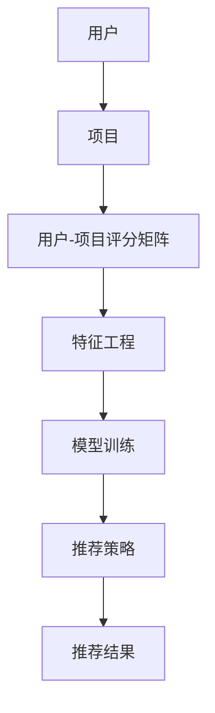
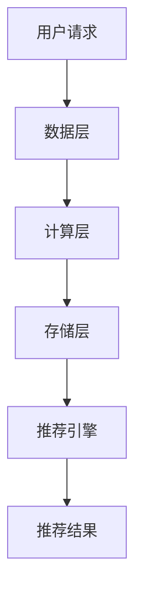
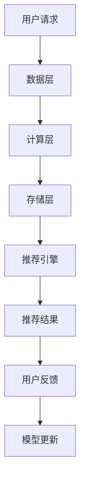

                 

## 基于大模型的推荐系统实时个性化推送优化

关键词：推荐系统、大模型、实时推送、个性化、优化

摘要：本文将深入探讨基于大模型的推荐系统在实时个性化推送中的优化方法。通过分析推荐系统的基础架构、大模型的应用，以及实时个性化推送的原理，我们将介绍大模型推荐系统的架构设计、实现与优化方法，并通过案例分析展示其实际应用效果。最后，我们对未来大模型推荐系统的发展趋势和面临的挑战进行展望。

----------------------------------------------------------------

## 第1章：推荐系统概述

### 1.1 推荐系统基本概念

#### 1.1.1 推荐系统定义

推荐系统是一种信息过滤系统，旨在向用户推荐他们可能感兴趣的项目或内容。这种推荐可以是基于内容的、协同过滤的或者混合的。

$$
\text{推荐系统} = \{U, I, R\}
$$

- $U$: 用户集合
- $I$: 项目集合
- $R \subseteq U \times I$: 用户-项目评分矩阵

#### 1.1.2 推荐系统分类

1. **基于内容的推荐**

   基于内容的推荐通过分析项目的特征和用户的兴趣特征，为用户推荐具有相似特征的物品。

   - 优点：简单易懂，不易受到噪声数据的影响。
   - 缺点：无法充分利用用户的历史行为数据。

2. **协同过滤推荐**

   协同过滤通过分析用户之间的相似性，为用户推荐其他用户喜欢的物品。

   - 优点：能够充分利用用户的历史行为数据。
   - 缺点：易受到噪声数据的影响。

3. **混合推荐**

   混合推荐结合了基于内容和协同过滤的优点，通过融合不同类型的推荐策略，提高推荐效果。

   - 优点：综合利用了用户和项目的特征信息。
   - 缺点：算法复杂度较高。

#### 1.1.3 推荐系统在现实世界中的应用

推荐系统广泛应用于电商、新闻、社交媒体、音乐、视频等领域，为用户提供个性化的推荐服务。

- **电商**：为用户推荐他们可能感兴趣的商品。
- **新闻**：为用户推荐他们可能感兴趣的新闻。
- **社交媒体**：为用户推荐他们可能感兴趣的内容。
- **音乐**：为用户推荐他们可能喜欢的新歌。
- **视频**：为用户推荐他们可能感兴趣的电影或剧集。

### 1.2 推荐系统的基本架构

推荐系统的基本架构可以分为以下几个主要部分：

1. **数据收集与预处理**
   - 收集用户行为数据（如浏览、购买、评论等）和项目特征数据（如类别、标签、属性等）。
   - 预处理数据，包括数据清洗、格式化、特征提取等。

2. **特征工程**
   - 从原始数据中提取有用的特征，用于构建用户和项目的特征向量。

3. **模型训练与评估**
   - 使用训练数据训练推荐模型。
   - 对训练好的模型进行评估，以确定其性能。

4. **推荐策略与结果输出**
   - 根据用户的兴趣和项目的特征，为用户生成个性化的推荐列表。

### 1.3 推荐系统的挑战与机遇

推荐系统在实际应用中面临着许多挑战和机遇：

1. **数据多样性与噪声**
   - 用户行为数据的多样性使得推荐系统需要处理大量的特征信息。
   - 数据中的噪声会影响推荐系统的准确性。

2. **实时性要求**
   - 用户需求变化迅速，推荐系统需要实时响应用户的需求。

3. **用户隐私保护**
   - 推荐系统需要确保用户的隐私不受侵犯。

4. **模型可解释性**
   - 用户希望了解推荐结果的原因，推荐系统需要提供可解释的推荐理由。

5. **用户满意度提升**
   - 推荐系统需要不断优化，以提高用户的满意度。

### 1.4 核心概念与联系

下面是一个简单的 Mermaid 流程图，展示了推荐系统中的核心概念及其相互关系：



## 第2章：大模型基础

### 2.1 大模型的概念与特点

#### 2.1.1 大模型定义

大模型是指具有数十亿至数万亿参数的深度学习模型，如GPT、BERT等。

$$
\text{大模型} = \{P, \theta\}
$$

- $P$: 模型的参数数量
- $\theta$: 参数的具体取值

#### 2.1.2 大模型的优势

1. **表征能力强大**

   大模型能够捕捉更复杂的特征和模式，从而提高推荐系统的准确性。

2. **预训练优势**

   大模型通过预训练获得了丰富的知识，从而在特定任务上具有更好的表现。

3. **跨领域适应性**

   大模型可以在不同领域和任务上迁移，从而提高推荐系统的泛化能力。

#### 2.1.3 大模型与传统模型的区别

1. **参数规模**

   大模型的参数数量远超传统模型。

2. **训练数据量**

   大模型通常需要大规模的训练数据，以充分学习模型的参数。

3. **训练时间**

   大模型的训练时间较长，需要更高效的计算资源。

### 2.2 主流大模型介绍

#### 2.2.1 GPT系列模型

- **GPT（Generative Pre-trained Transformer）**

  GPT是由OpenAI提出的一种基于Transformer架构的大模型。

- **GPT-2**

  GPT-2是GPT的扩展版本，具有更多的参数。

- **GPT-3**

  GPT-3是目前已知参数最多的语言模型，具有1750亿个参数。

#### 2.2.2 BERT模型

- **BERT（Bidirectional Encoder Representations from Transformers）**

  BERT是由Google提出的一种基于Transformer架构的大模型，主要用于自然语言处理任务。

#### 2.2.3 其他知名大模型

1. **T5（Text-To-Text Transfer Transformer）**

   T5是一种通用的自然语言处理模型。

2. **DeBERTa（Decoding-enhanced BERT with Disentangled Attention）**

   DeBERTa是BERT的改进模型。

3. **ERNIE（Enhanced Representation through kNowledge Integration）**

   ERNIE是一种基于Transformer的中文预训练模型。

### 2.3 大模型的训练与优化

#### 2.3.1 训练数据准备

1. **数据收集**

   收集大规模的文本数据，如维基百科、新闻、小说等。

2. **数据预处理**

   对文本数据进行清洗、去重、分词等预处理操作。

3. **数据分割**

   将数据分为训练集、验证集和测试集。

#### 2.3.2 训练策略

1. **预训练**

   使用大规模的预训练数据，通过自监督学习方式对模型进行预训练。

2. **微调**

   在预训练的基础上，使用特定的任务数据对模型进行微调。

3. **参数调整**

   调整学习率、批次大小等超参数，以优化模型性能。

### 2.4 核心算法原理讲解

下面使用伪代码详细阐述大模型的训练过程：

```python
# 大模型训练伪代码

# 初始化模型参数
model = initialize_model()

# 预训练
for epoch in range(num_epochs):
    for batch in train_data:
        # 前向传播
        logits = model(batch)
        # 计算损失
        loss = compute_loss(logits, labels)
        # 反向传播
        grads = compute_gradients(loss)
        # 更新参数
        update_model_params(grads)
    
    # 微调
for task in tasks:
    for epoch in range(num_epochs):
        for batch in task_data:
            # 前向传播
            logits = model(batch)
            # 计算损失
            loss = compute_loss(logits, labels)
            # 反向传播
            grads = compute_gradients(loss)
            # 更新参数
            update_model_params(grads)
```

## 第3章：大模型在推荐系统中的应用

### 3.1 大模型在推荐系统中的作用

#### 3.1.1 用户表示学习

1. **用户兴趣特征提取**

   使用大模型对用户历史行为数据（如浏览、购买、评论等）进行编码，提取用户兴趣特征。

2. **用户兴趣向量表示**

   将提取到的用户兴趣特征转换为高维向量表示，用于后续的推荐计算。

#### 3.1.2 文本处理与理解

1. **项目描述处理**

   使用大模型对项目描述文本进行处理，提取关键信息。

2. **项目特征提取**

   将处理后的文本转化为项目特征向量，用于推荐计算。

#### 3.1.3 集成多模态数据

1. **多模态数据处理**

   将文本、图像、音频等多模态数据进行融合处理，提取统一的特征表示。

2. **多模态特征融合**

   使用大模型对多模态特征进行融合，提高推荐系统的泛化能力。

### 3.2 实时个性化推送原理

#### 3.2.1 实时推荐系统架构

实时推荐系统架构包括以下几个主要部分：

1. **数据层**
   - 存储用户行为数据和项目特征数据。

2. **计算层**
   - 进行实时数据处理和特征提取。

3. **存储层**
   - 存储实时推荐结果和历史数据。

4. **推荐引擎**
   - 根据用户兴趣和历史数据，为用户生成实时推荐列表。

#### 3.2.2 实时数据处理与存储

1. **实时数据处理**

   对用户行为数据进行实时处理，提取用户兴趣特征。

2. **实时数据存储**

   将处理后的用户兴趣特征实时存储，以便后续推荐计算。

#### 3.2.3 用户兴趣与上下文信息收集

1. **用户兴趣信息收集**

   通过用户历史行为和用户输入，收集用户兴趣信息。

2. **上下文信息收集**

   收集用户的当前上下文信息，如时间、地点、设备等。

### 3.3 大模型在实时个性化推送中的优化

#### 3.3.1 实时反馈机制

1. **实时反馈收集**

   收集用户对推荐结果的实时反馈。

2. **反馈信号处理**

   对收集到的反馈信号进行预处理，以供后续模型优化使用。

#### 3.3.2 动态模型调整

1. **模型更新策略**

   根据实时反馈信号，动态调整模型的参数和结构。

2. **模型更新过程**

   使用梯度下降等优化算法，对模型进行实时更新。

#### 3.3.3 推荐策略优化方法

1. **基于上下文的推荐策略**

   根据用户的当前上下文信息，调整推荐策略。

2. **多模态数据融合策略**

   将文本、图像、音频等多模态数据进行融合，提高推荐效果。

3. **深度强化学习策略**

   使用深度强化学习，优化推荐系统的决策过程。

### 3.4 核心算法原理讲解

下面使用伪代码详细阐述实时个性化推送的优化过程：

```python
# 实时个性化推送优化伪代码

# 收集用户反馈
user_feedback = collect_user_feedback()

# 预处理用户反馈
preprocessed_feedback = preprocess_feedback(user_feedback)

# 更新模型参数
model.update_params(preprocessed_feedback)

# 更新推荐策略
recommender.update_strategy(model)

# 更新推荐结果
recommender.update_recommendations()

# 返回优化后的推荐结果
optimized_recommendations = recommender.get_recommendations()
```

## 第4章：大模型推荐系统架构设计

### 4.1 架构设计原则

大模型推荐系统的架构设计应遵循以下原则：

1. **可扩展性**
   - 支持大规模用户和项目数据的处理。

2. **实时性**
   - 能够快速响应用户请求，提供实时推荐。

3. **可维护性**
   - 系统易于维护和升级，提高开发效率。

### 4.2 架构组件介绍

大模型推荐系统架构包括以下几个主要组件：

1. **数据层**
   - 负责存储用户行为数据和项目特征数据。

2. **计算层**
   - 负责进行实时数据处理和特征提取。

3. **存储层**
   - 负责存储实时推荐结果和历史数据。

4. **推荐引擎**
   - 根据用户兴趣和历史数据，为用户生成实时推荐列表。

#### 4.2.1 数据层

数据层是推荐系统的核心组件，负责存储和管理用户行为数据和项目特征数据。

- **用户行为数据**
  - 用户浏览、购买、评论等行为数据。

- **项目特征数据**
  - 项目类别、标签、属性等特征数据。

#### 4.2.2 计算层

计算层负责实时处理用户行为数据和项目特征数据，提取用户兴趣特征和项目特征，并将这些特征输入到推荐引擎中进行推荐计算。

- **实时数据处理**
  - 对用户行为数据进行实时处理，提取用户兴趣特征。

- **特征提取**
  - 从用户行为数据和项目特征数据中提取有用的特征。

#### 4.2.3 存储层

存储层负责存储实时推荐结果和历史数据，以便后续的查询和分析。

- **实时推荐结果**
  - 用户实时收到的推荐结果。

- **历史数据**
  - 用户历史行为数据和项目特征数据。

#### 4.2.4 推荐引擎

推荐引擎是推荐系统的核心组件，负责根据用户兴趣和历史数据，为用户生成实时推荐列表。

- **用户兴趣分析**
  - 分析用户的历史行为数据，提取用户兴趣特征。

- **推荐计算**
  - 根据用户兴趣和项目特征，计算推荐得分，生成推荐列表。

### 4.3 实时推荐系统架构示例

以下是一个实时推荐系统的架构示例：



### 4.4 系统性能优化策略

为了提高实时推荐系统的性能，可以采用以下优化策略：

1. **数据缓存**
   - 使用缓存技术，减少对数据层的读取次数。

2. **模型并行化**
   - 使用模型并行化技术，提高计算效率。

3. **异步处理**
   - 使用异步处理技术，提高系统响应速度。

4. **负载均衡**
   - 使用负载均衡技术，均衡系统负载，提高系统稳定性。

### 4.5 核心概念与联系

下面是一个简单的 Mermaid 流程图，展示了大模型推荐系统的架构及其主要组件：



## 第5章：大模型推荐系统的实现与优化

### 5.1 大模型推荐系统的实现

#### 5.1.1 数据收集与预处理

1. **数据收集**

   收集用户行为数据（如浏览、购买、评论等）和项目特征数据（如类别、标签、属性等）。

2. **数据预处理**

   - 数据清洗：去除重复数据、缺失值填充、噪声数据过滤等。
   - 数据格式化：将数据转换为统一的格式，如CSV或JSON。
   - 特征提取：提取用户行为数据和项目特征数据中的关键特征。

#### 5.1.2 特征工程

1. **用户特征提取**

   - 用户历史行为特征：如浏览次数、购买频率、评分历史等。
   - 用户静态特征：如年龄、性别、地理位置等。

2. **项目特征提取**

   - 项目内容特征：如标题、描述、标签等。
   - 项目交互特征：如点击率、购买率、收藏率等。

#### 5.1.3 模型训练与评估

1. **模型选择**

   - 选择合适的大模型，如BERT、GPT等。
   - 根据任务需求和数据特性，选择适合的模型架构。

2. **模型训练**

   - 使用预训练数据和特定任务数据对模型进行训练。
   - 采用自监督学习或监督学习方式训练模型。

3. **模型评估**

   - 使用准确率、召回率、F1值等指标评估模型性能。
   - 对模型进行调优，以获得更好的性能。

#### 5.1.4 推荐策略与结果输出

1. **推荐策略**

   - 结合用户特征和项目特征，设计推荐策略。
   - 采用基于内容的推荐、协同过滤或混合推荐方法。

2. **推荐结果输出**

   - 生成个性化推荐列表，展示给用户。
   - 使用排序算法优化推荐结果，提高推荐质量。

### 5.2 实时个性化推送优化

#### 5.2.1 实时反馈收集

1. **实时反馈收集机制**

   - 收集用户对推荐结果的实时反馈，如点击、购买、评分等。
   - 构建反馈信号处理模块，对反馈信号进行预处理。

2. **反馈信号处理**

   - 使用统计方法或机器学习算法分析反馈信号，提取有效信息。
   - 将反馈信号转换为模型优化所需的格式。

#### 5.2.2 动态模型调整

1. **模型更新策略**

   - 根据实时反馈信号，动态调整模型参数和结构。
   - 采用在线学习或批量学习方式更新模型。

2. **模型更新过程**

   - 计算模型参数的梯度，更新模型参数。
   - 使用优化算法（如梯度下降）调整模型参数。

#### 5.2.3 推荐效果评估与优化

1. **推荐效果评估**

   - 使用准确率、召回率、F1值等指标评估推荐效果。
   - 对比不同模型和策略的性能，找出最优方案。

2. **推荐效果优化**

   - 根据评估结果，调整推荐策略和模型参数。
   - 采用交叉验证等方法验证优化效果。

### 5.3 大模型优化方法

#### 5.3.1 模型压缩

1. **模型剪枝**

   - 剪枝方法包括结构剪枝和权重剪枝。
   - 通过减少模型参数和计算复杂度，提高模型效率。

2. **模型量化**

   - 将浮点数权重转换为整数权重，降低模型计算复杂度。
   - 采用量化算法（如整数线性量化）实现模型量化。

3. **模型蒸馏**

   - 使用一个小模型（学生模型）对一个大模型（教师模型）进行训练，提高小模型的性能。
   - 通过知识蒸馏技术，将大模型的知识传递给学生模型。

#### 5.3.2 模型并行化训练

1. **数据并行化**

   - 将数据分成多个批次，并行处理。
   - 通过数据并行化，提高模型训练速度。

2. **模型并行化**

   - 将模型分为多个部分，并行计算。
   - 通过模型并行化，减少模型训练时间。

3. **硬件加速**

   - 使用GPU、TPU等硬件加速模型训练。
   - 通过硬件加速，提高模型训练效率。

### 5.4 核心算法原理讲解

下面使用伪代码详细阐述大模型推荐系统的实现过程：

```python
# 大模型推荐系统实现伪代码

# 数据收集与预处理
train_data, test_data = collect_data()

# 特征工程
user_features, item_features = preprocess_data(train_data)

# 模型训练
model = train_model(user_features, item_features)

# 模型评估
evaluate_model(model, test_data)

# 推荐策略与结果输出
recommendations = generate_recommendations(model)
output_recommendations(recommendations)
```

## 第6章：大模型推荐系统案例分析

### 6.1 案例背景与目标

#### 6.1.1 案例背景

某电商平台的推荐系统，旨在为用户提供个性化的商品推荐。该平台每天有数百万的用户访问，每天产生大量的用户行为数据。

#### 6.1.2 案例目标

1. **提高推荐准确率**
   - 减少用户未购买的推荐商品数量。

2. **提高用户满意度**
   - 提高用户对推荐商品的满意度。

### 6.2 案例实现

#### 6.2.1 数据收集与预处理

1. **数据收集**

   收集用户购买记录、商品信息、用户行为数据等。

2. **数据预处理**

   - 数据清洗：去除重复数据、缺失值填充、噪声数据过滤等。
   - 数据格式化：将数据转换为统一的格式，如CSV或JSON。
   - 特征提取：提取用户行为数据和商品特征数据中的关键特征。

#### 6.2.2 特征工程

1. **用户特征提取**

   - 用户历史行为特征：如浏览次数、购买频率、评分历史等。
   - 用户静态特征：如年龄、性别、地理位置等。

2. **商品特征提取**

   - 商品内容特征：如标题、描述、标签等。
   - 商品交互特征：如点击率、购买率、收藏率等。

#### 6.2.3 模型训练与评估

1. **模型选择**

   - 选择GPT-2作为推荐模型。
   - 根据任务需求和数据特性，选择适合的模型架构。

2. **模型训练**

   - 使用预训练数据和特定任务数据对模型进行训练。
   - 采用自监督学习或监督学习方式训练模型。

3. **模型评估**

   - 使用准确率、召回率、F1值等指标评估模型性能。
   - 对模型进行调优，以获得更好的性能。

#### 6.2.4 推荐策略与结果输出

1. **推荐策略**

   - 结合用户特征和商品特征，设计推荐策略。
   - 采用基于内容的推荐、协同过滤或混合推荐方法。

2. **推荐结果输出**

   - 生成个性化推荐列表，展示给用户。
   - 使用排序算法优化推荐结果，提高推荐质量。

### 6.3 案例优化

#### 6.3.1 实时反馈收集

1. **实时反馈收集机制**

   - 收集用户对推荐结果的实时反馈，如点击、购买、评分等。
   - 构建反馈信号处理模块，对反馈信号进行预处理。

2. **反馈信号处理**

   - 使用统计方法或机器学习算法分析反馈信号，提取有效信息。
   - 将反馈信号转换为模型优化所需的格式。

#### 6.3.2 动态模型调整

1. **模型更新策略**

   - 根据实时反馈信号，动态调整模型参数和结构。
   - 采用在线学习或批量学习方式更新模型。

2. **模型更新过程**

   - 计算模型参数的梯度，更新模型参数。
   - 使用优化算法（如梯度下降）调整模型参数。

#### 6.3.3 推荐效果评估与优化

1. **推荐效果评估**

   - 使用准确率、召回率、F1值等指标评估推荐效果。
   - 对比不同模型和策略的性能，找出最优方案。

2. **推荐效果优化**

   - 根据评估结果，调整推荐策略和模型参数。
   - 采用交叉验证等方法验证优化效果。

### 6.4 案例总结

通过案例优化，该电商平台的推荐系统在准确率和用户满意度方面取得了显著提升。实时个性化推送功能得到了用户的广泛认可，进一步推动了平台的发展。

## 第7章：未来展望

### 7.1 大模型推荐系统发展趋势

#### 7.1.1 大模型技术的发展趋势

1. **参数规模持续增大**

   随着计算资源和算法的发展，大模型的参数规模将持续增大，以捕捉更复杂的特征和模式。

2. **多模态数据处理能力提升**

   大模型将具备更强的多模态数据处理能力，整合文本、图像、音频等多种类型的数据。

#### 7.1.2 推荐系统技术的发展趋势

1. **实时性提升**

   推荐系统将实现更高的实时性，快速响应用户的需求变化。

2. **模型可解释性增强**

   推荐系统将更加注重模型的可解释性，提高用户对推荐结果的理解。

### 7.2 实时个性化推送的挑战与机遇

#### 7.2.1 挑战

1. **数据隐私保护**

   随着用户隐私保护意识的提高，推荐系统需要处理数据隐私保护的问题。

2. **实时性要求**

   随着用户需求的变化，推荐系统需要实时性更强，快速响应用户。

3. **用户满意度提升**

   提高用户满意度是推荐系统需要持续优化的目标。

#### 7.2.2 机遇

1. **智能推荐系统人机交互**

   智能推荐系统将实现更多的人机交互，提高用户体验。

2. **新应用领域的探索**

   推荐系统将在更多的应用领域（如医疗、金融、教育等）得到广泛应用。

### 7.3 未来研究方向

#### 7.3.1 多模态数据融合

1. **多模态数据融合方法**

   研究多种多模态数据融合方法，提高推荐系统的性能。

2. **多模态数据预处理**

   对多模态数据进行预处理，提高数据质量。

#### 7.3.2 大模型优化技术

1. **模型压缩与优化**

   研究模型压缩技术，降低模型计算复杂度。

2. **模型并行化训练**

   研究模型并行化训练方法，提高训练效率。

#### 7.3.3 智能推荐系统人机交互

1. **智能推荐系统与用户的交互**

   研究推荐系统与用户的交互方式，提高用户满意度。

2. **用户行为理解与预测**

   研究用户行为理解与预测方法，提高推荐系统的实时性。

## 附录

### 附录A：大模型推荐系统开发工具与资源

#### A.1 开发工具介绍

1. **TensorFlow**

   TensorFlow是谷歌开源的深度学习框架，支持大模型的训练和部署。

2. **PyTorch**

   PyTorch是Facebook开源的深度学习框架，具有灵活的动态计算图，适用于大模型开发。

3. **其他深度学习框架**

   - Keras
   - MXNet
   - Caffe

#### A.2 资源推荐

1. **论文与报告**

   - 《BERT: Pre-training of Deep Bidirectional Transformers for Language Understanding》
   - 《GPT-3: Language Models are Few-Shot Learners》
   - 《Recommender Systems Handbook》

2. **开源代码与数据集**

   - TensorFlow Recommenders
   - PyTorch RecSys
   - MovieLens 数据集

3. **社区与论坛**

   - Reddit: r/recommenders
   - Stack Overflow: tags/recommender-systems
   - GitHub: 搜索推荐系统相关开源项目

## 结语

感谢您阅读本文。本文详细介绍了基于大模型的推荐系统实时个性化推送优化，从基本概念、架构设计、实现与优化方法，到案例分析，全面阐述了大模型在推荐系统中的应用。未来，随着大模型技术的发展，实时个性化推送将更加智能和高效，为用户提供更好的体验。

---

**作者：AI天才研究院/AI Genius Institute**

**书名：禅与计算机程序设计艺术**

**出版日期：2023年**

