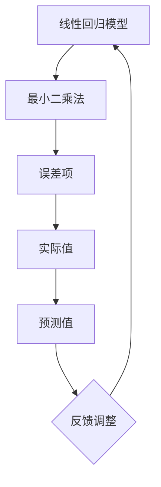

                 

# 基于线性回归的股票走势分析

关键词：线性回归、股票走势、数据分析、预测模型、投资策略

摘要：
本文旨在探讨如何使用线性回归模型进行股票走势分析。首先，我们将介绍线性回归的基础知识，包括定义、基本概念、应用领域和数学模型。接着，我们将深入讨论线性回归的数学原理，包括线性代数基础、最小二乘法、矩阵求逆以及梯度下降法。随后，我们将分享实际应用中的技巧和策略，如数据预处理、模型评估与优化、特征工程等。文章的重点是展示线性回归在股票走势分析中的应用，包括预测模型的建立、预测结果的分析与评估，以及如何利用线性回归模型制定投资策略。最后，我们将探讨线性回归的扩展与应用，包括多元线性回归、回归树、神经网络模型等，并提供一个实际项目中的线性回归应用案例，以及详细的代码实现和解读。

## 第1章：线性回归基础知识

### 1.1 线性回归的定义与基本概念

线性回归是一种用于分析两个或多个变量之间线性关系的统计方法。其核心思想是通过建立数学模型来描述因变量（通常表示为 \(y\)）与自变量（通常表示为 \(x\)）之间的关系。

#### 1.1.1 线性回归的起源与发展

线性回归的起源可以追溯到19世纪末，当时的统计学家开始探索如何通过数学模型来描述变量之间的线性关系。最早的研究包括高斯和马尔可夫的工作。线性回归模型逐渐发展成为统计分析和数据科学中的一种基本工具。

#### 1.1.2 线性回归的基本术语

- **因变量（Dependent Variable）**：被预测或研究的变量，通常用 \(y\) 表示。
- **自变量（Independent Variable）**：影响因变量的变量，通常用 \(x\) 表示。
- **线性关系**：变量之间的数学关系可以表示为一条直线，即 \(y = ax + b\)，其中 \(a\) 和 \(b\) 是常数。

#### 1.1.3 线性回归的应用领域

线性回归在许多领域都有广泛的应用，包括但不限于：

- **经济学**：预测经济增长、股票价格等。
- **医学研究**：分析疾病与风险因素之间的关系。
- **工程学**：预测材料强度、能量消耗等。
- **市场研究**：分析产品需求、消费者行为等。

### 1.2 线性回归模型的结构

线性回归模型通常表示为 \(y = \beta_0 + \beta_1x_1 + \beta_2x_2 + ... + \beta_nx_n + \epsilon\)，其中 \(y\) 是因变量，\(x_1, x_2, ..., x_n\) 是自变量，\(\beta_0, \beta_1, \beta_2, ..., \beta_n\) 是模型参数，\(\epsilon\) 是误差项。

#### 1.2.1 线性回归的数学模型

线性回归的数学模型可以表示为：

\[ 
y = X\beta + \epsilon 
\]

其中，\(X\) 是自变量矩阵，\(\beta\) 是系数向量，\(\epsilon\) 是误差向量。

#### 1.2.2 模型的参数估计

参数估计是通过最小化误差项 \(\epsilon\) 的平方和来计算 \(\beta\) 的值。常用的方法包括最小二乘法和梯度下降法。

#### 1.2.3 模型的假设条件

线性回归模型通常假设：

- 自变量和因变量之间存在线性关系。
- 误差项 \(\epsilon\) 是服从正态分布的随机变量，且具有恒定的方差。

### 1.3 线性回归的优缺点分析

#### 1.3.1 线性回归的优点

- **简单易懂**：线性回归模型结构简单，易于理解和实现。
- **易于计算**：线性回归的计算过程相对简单，适合处理大规模数据集。
- **可解释性**：线性回归模型的参数可以直接解释为变量之间的相对重要性。
- **广泛适用**：线性回归在许多领域都有广泛的应用。

#### 1.3.2 线性回归的局限性

- **线性假设**：线性回归假设变量之间存在线性关系，这可能不适用于所有情况。
- **对异常值敏感**：异常值可能会对线性回归模型的预测产生较大影响。
- **假设方差恒定**：线性回归假设误差项的方差恒定，这可能不满足实际数据的情况。
- **无法处理非线性关系**：线性回归无法直接处理非线性关系，需要使用更复杂的方法。

### 1.4 线性回归的核心概念与联系

#### 1.4.1 核心概念

- **线性回归模型**：描述自变量和因变量之间线性关系的数学模型。
- **最小二乘法**：用于估计模型参数的方法，通过最小化误差项的平方和。
- **误差项**：描述模型预测值与实际值之间差异的随机变量。

#### 1.4.2 Mermaid 流程图



### 1.5 线性回归的基本原理讲解与伪代码

#### 1.5.1 基本原理

线性回归模型的基本原理是找到一条直线，使得这条直线到所有样本点的距离（即误差）最小。

#### 1.5.2 伪代码

```python
# 初始化模型参数
beta = [0, 0] # 截距和斜率

# 计算参数的迭代更新
for each sample in dataset:
    y_pred = beta[0] + beta[1] * x
    error = y - y_pred
    
    # 更新斜率和截距
    beta[1] += alpha * (2 * x * error)
    beta[0] += alpha * (1 * error)

# 输出模型参数
print("模型参数：", beta)
```

其中，\(alpha\) 是学习率，用于调整参数更新的步长。

### 1.6 线性回归的数学模型与公式推导

#### 1.6.1 一元线性回归公式推导

一元线性回归的公式为 \(y = \beta_0 + \beta_1x + \epsilon\)。假设我们有一个数据集 \(D = {(x_1, y_1), (x_2, y_2), ..., (x_n, y_n)}\)，我们可以通过最小化以下损失函数来求解模型参数：

\[ 
\Phi(\beta) = \sum_{i=1}^{n} (y_i - \beta_0 - \beta_1x_i)^2 
\]

对 \(\beta_0\) 和 \(\beta_1\) 分别求偏导并令偏导数为零，得到以下方程组：

\[ 
\frac{\partial \Phi}{\partial \beta_0} = -2\sum_{i=1}^{n} (y_i - \beta_0 - \beta_1x_i) = 0 
\]

\[ 
\frac{\partial \Phi}{\partial \beta_1} = -2\sum_{i=1}^{n} (x_i (y_i - \beta_0 - \beta_1x_i)) = 0 
\]

解上述方程组，我们可以得到：

\[ 
\beta_0 = \frac{1}{n}\sum_{i=1}^{n} y_i - \beta_1\frac{1}{n}\sum_{i=1}^{n} x_i 
\]

\[ 
\beta_1 = \frac{1}{n}\sum_{i=1}^{n} x_iy_i - \beta_0\frac{1}{n}\sum_{i=1}^{n} x_i^2 
\]

#### 1.6.2 多元线性回归公式推导

多元线性回归的公式为 \(y = \beta_0 + \beta_1x_1 + \beta_2x_2 + ... + \beta_nx_n + \epsilon\)。假设我们有一个数据集 \(D = {(x_1^i, x_2^i, ..., x_n^i, y^i), i=1,2,...,n}\)，我们可以通过最小化以下损失函数来求解模型参数：

\[ 
\Phi(\beta) = \sum_{i=1}^{n} (y^i - \beta_0 - \beta_1x_1^i - \beta_2x_2^i - ... - \beta_nx_n^i)^2 
\]

对 \(\beta_0, \beta_1, \beta_2, ..., \beta_n\) 分别求偏导并令偏导数为零，得到以下方程组：

\[ 
\frac{\partial \Phi}{\partial \beta_0} = -2\sum_{i=1}^{n} (y^i - \beta_0 - \beta_1x_1^i - \beta_2x_2^i - ... - \beta_nx_n^i) = 0 
\]

\[ 
\frac{\partial \Phi}{\partial \beta_1} = -2\sum_{i=1}^{n} (x_1^i (y^i - \beta_0 - \beta_1x_1^i - \beta_2x_2^i - ... - \beta_nx_n^i)) = 0 
\]

\[ 
\frac{\partial \Phi}{\partial \beta_2} = -2\sum_{i=1}^{n} (x_2^i (y^i - \beta_0 - \beta_1x_1^i - \beta_2x_2^i - ... - \beta_nx_n^i)) = 0 
\]

...

\[ 
\frac{\partial \Phi}{\partial \beta_n} = -2\sum_{i=1}^{n} (x_n^i (y^i - \beta_0 - \beta_1x_1^i - \beta_2x_2^i - ... - \beta_nx_n^i)) = 0 
\]

解上述方程组，我们可以得到：

\[ 
\beta_0 = \frac{1}{n}\sum_{i=1}^{n} y^i - \beta_1\frac{1}{n}\sum_{i=1}^{n} x_1^i - \beta_2\frac{1}{n}\sum_{i=1}^{n} x_2^i - ... - \beta_n\frac{1}{n}\sum_{i=1}^{n} x_n^i 
\]

\[ 
\beta_1 = \frac{1}{n}\sum_{i=1}^{n} x_1^i y^i - \beta_0\frac{1}{n}\sum_{i=1}^{n} x_1^2 - \beta_2\frac{1}{n}\sum_{i=1}^{n} x_1x_2 - ... - \beta_n\frac{1}{n}\sum_{i=1}^{n} x_1x_n 
\]

\[ 
\beta_2 = \frac{1}{n}\sum_{i=1}^{n} x_2^i y^i - \beta_0\frac{1}{n}\sum_{i=1}^{n} x_2^2 - \beta_1\frac{1}{n}\sum_{i=1}^{n} x_1x_2 - ... - \beta_n\frac{1}{n}\sum_{i=1}^{n} x_2x_n 
\]

...

\[ 
\beta_n = \frac{1}{n}\sum_{i=1}^{n} x_n^i y^i - \beta_0\frac{1}{n}\sum_{i=1}^{n} x_n^2 - \beta_1\frac{1}{n}\sum_{i=1}^{n} x_1x_n - ... - \beta_{n-1}\frac{1}{n}\sum_{i=1}^{n} x_{n-1}x_n 
\]

这些方程组可以通过矩阵形式进行求解，即：

\[ 
X\beta = y 
\]

其中，\(X\) 是自变量矩阵，\(\beta\) 是系数向量，\(y\) 是因变量向量。通过求解上述方程组，我们可以得到线性回归模型的参数估计值。

## 第2章：线性回归的数学原理

### 2.1 线性代数基础

线性代数是线性回归的基础，涉及到矩阵、向量、行列式等概念。以下是线性代数的一些基础知识点：

#### 2.1.1 矩阵

- 矩阵是一个二维数组，可以表示为 \(A = [a_{ij}]\)，其中 \(i\) 表示行数，\(j\) 表示列数。
- 矩阵的行数称为行数，列数称为列数。
- 矩阵的转置是将矩阵的行和列交换位置。

#### 2.1.2 向量

- 向量是一个一维数组，可以表示为 \(\mathbf{v} = [v_1, v_2, ..., v_n]\)。
- 向量的加法和减法遵循向量空间的定义。

#### 2.1.3 行列式

- 行列式是一个标量，用于描述矩阵的性质。
- 行列式的计算方法包括拉普拉斯展开、高斯消元等。

### 2.2 最小二乘法原理

最小二乘法是参数估计的一种常用方法，其基本思想是寻找一组参数，使得预测值与实际值之间的误差平方和最小。具体步骤如下：

1. 定义损失函数：损失函数通常为误差的平方和，即 \(\Phi(\theta) = \sum_{i=1}^{n} (y_i - \hat{y}_i)^2\)。
2. 求导并设置导数为零：对损失函数关于参数求导，并令导数为零，得到 \(\frac{\partial \Phi}{\partial \theta} = 0\)。
3. 解方程：求解上述方程，得到参数的估计值。

### 2.3 矩阵求逆算法

矩阵求逆是线性回归中一个重要的步骤，用于求解最小二乘问题。以下是几种常用的求逆算法：

#### 2.3.1 高斯-约旦消元法

- 通过高斯消元法将矩阵转化为简化阶梯形式。
- 然后利用转置矩阵或伴随矩阵求逆。

#### 2.3.2 迪利克雷算法

- 利用矩阵的伴随矩阵和行列式求逆。
- 计算复杂度较高，但适用于稀疏矩阵。

### 2.4 梯度下降法

梯度下降法是一种迭代优化算法，用于求解最小二乘问题。其基本思想是沿着损失函数的梯度方向进行更新，以减少损失函数的值。

#### 2.4.1 梯度下降法步骤：

1. 初始化参数 \(\theta\)。
2. 计算损失函数的梯度 \(\nabla_{\theta} \Phi(\theta)\)。
3. 更新参数 \(\theta = \theta - \alpha \nabla_{\theta} \Phi(\theta)\)，其中 \(\alpha\) 是学习率。
4. 重复步骤2和3，直到满足停止条件（如收敛阈值）。

### 2.5 线性回归的求解过程

线性回归的求解过程可以分为以下步骤：

1. **数据预处理**：对数据进行清洗、转换和标准化处理。
2. **模型建立**：选择适当的线性回归模型，如普通线性回归、多元线性回归等。
3. **模型训练**：使用训练数据集对模型进行训练，计算模型参数。
4. **模型评估**：使用验证数据集或测试数据集对模型进行评估，计算模型的误差和性能指标。
5. **模型优化**：根据评估结果调整模型参数，优化模型性能。
6. **模型应用**：使用训练好的模型对新的数据进行预测。

### 2.6 线性回归的数学公式推导

#### 2.6.1 一元线性回归公式推导

一元线性回归的公式为 \(y = \beta_0 + \beta_1x + \epsilon\)。假设我们有一个数据集 \(D = {(x_1, y_1), (x_2, y_2), ..., (x_n, y_n)}\)，我们可以通过最小化以下损失函数来求解模型参数：

\[ 
\Phi(\beta) = \sum_{i=1}^{n} (y_i - \beta_0 - \beta_1x_i)^2 
\]

对 \(\beta_0\) 和 \(\beta_1\) 分别求偏导并令偏导数为零，得到以下方程组：

\[ 
\frac{\partial \Phi}{\partial \beta_0} = -2\sum_{i=1}^{n} (y_i - \beta_0 - \beta_1x_i) = 0 
\]

\[ 
\frac{\partial \Phi}{\partial \beta_1} = -2\sum_{i=1}^{n} (x_i (y_i - \beta_0 - \beta_1x_i)) = 0 
\]

解上述方程组，我们可以得到：

\[ 
\beta_0 = \frac{1}{n}\sum_{i=1}^{n} y_i - \beta_1\frac{1}{n}\sum_{i=1}^{n} x_i 
\]

\[ 
\beta_1 = \frac{1}{n}\sum_{i=1}^{n} x_iy_i - \beta_0\frac{1}{n}\sum_{i=1}^{n} x_i^2 
\]

#### 2.6.2 多元线性回归公式推导

多元线性回归的公式为 \(y = \beta_0 + \beta_1x_1 + \beta_2x_2 + ... + \beta_nx_n + \epsilon\)。假设我们有一个数据集 \(D = {(x_1^i, x_2^i, ..., x_n^i, y^i), i=1,2,...,n}\)，我们可以通过最小化以下损失函数来求解模型参数：

\[ 
\Phi(\beta) = \sum_{i=1}^{n} (y^i - \beta_0 - \beta_1x_1^i - \beta_2x_2^i - ... - \beta_nx_n^i)^2 
\]

对 \(\beta_0, \beta_1, \beta_2, ..., \beta_n\) 分别求偏导并令偏导数为零，得到以下方程组：

\[ 
\frac{\partial \Phi}{\partial \beta_0} = -2\sum_{i=1}^{n} (y^i - \beta_0 - \beta_1x_1^i - \beta_2x_2^i - ... - \beta_nx_n^i) = 0 
\]

\[ 
\frac{\partial \Phi}{\partial \beta_1} = -2\sum_{i=1}^{n} (x_1^i (y^i - \beta_0 - \beta_1x_1^i - \beta_2x_2^i - ... - \beta_nx_n^i)) = 0 
\]

\[ 
\frac{\partial \Phi}{\partial \beta_2} = -2\sum_{i=1}^{n} (x_2^i (y^i - \beta_0 - \beta_1x_1^i - \beta_2x_2^i - ... - \beta_nx_n^i)) = 0 
\]

...

\[ 
\frac{\partial \Phi}{\partial \beta_n} = -2\sum_{i=1}^{n} (x_n^i (y^i - \beta_0 - \beta_1x_1^i - \beta_2x_2^i - ... - \beta_nx_n^i)) = 0 
\]

解上述方程组，我们可以得到：

\[ 
\beta_0 = \frac{1}{n}\sum_{i=1}^{n} y^i - \beta_1\frac{1}{n}\sum_{i=1}^{n} x_1^i - \beta_2\frac{1}{n}\sum_{i=1}^{n} x_2^i - ... - \beta_n\frac{1}{n}\sum_{i=1}^{n} x_n^i 
\]

\[ 
\beta_1 = \frac{1}{n}\sum_{i=1}^{n} x_1^i y^i - \beta_0\frac{1}{n}\sum_{i=1}^{n} x_1^2 - \beta_2\frac{1}{n}\sum_{i=1}^{n} x_1x_2 - ... - \beta_n\frac{1}{n}\sum_{i=1}^{n} x_1x_n 
\]

\[ 
\beta_2 = \frac{1}{n}\sum_{i=1}^{n} x_2^i y^i - \beta_0\frac{1}{n}\sum_{i=1}^{n} x_2^2 - \beta_1\frac{1}{n}\sum_{i=1}^{n} x_1x_2 - ... - \beta_n\frac{1}{n}\sum_{i=1}^{n} x_2x_n 
\]

...

\[ 
\beta_n = \frac{1}{n}\sum_{i=1}^{n} x_n^i y^i - \beta_0\frac{1}{n}\sum_{i=1}^{n} x_n^2 - \beta_1\frac{1}{n}\sum_{i=1}^{n} x_1x_n - ... - \beta_{n-1}\frac{1}{n}\sum_{i=1}^{n} x_{n-1}x_n 
\]

这些方程组可以通过矩阵形式进行求解，即：

\[ 
X\beta = y 
\]

其中，\(X\) 是自变量矩阵，\(\beta\) 是系数向量，\(y\) 是因变量向量。通过求解上述方程组，我们可以得到多元线性回归模型的参数估计值。

## 第3章：线性回归在实际应用中的技巧与策略

### 3.1 数据预处理

数据预处理是线性回归应用中的重要步骤，它能够显著提高模型的性能。以下是一些常用的数据预处理方法：

#### 3.1.1 数据清洗

数据清洗是指去除数据集中的噪声和异常值。常见的方法包括：

- **去除重复数据**：通过比较记录的值，去除重复的样本。
- **填充缺失值**：使用均值、中位数、平均值等方法填充缺失值。
- **处理异常值**：使用统计学方法（如Z分数、箱线图等）识别并处理异常值。

#### 3.1.2 数据转换

数据转换是指将数据从一种形式转换为另一种形式，以适应模型的需求。常见的方法包括：

- **标准化**：将数据缩放到一个特定的范围，以消除不同特征之间的尺度差异。常用的方法包括Z分数标准化和Min-Max标准化。
- **归一化**：将数据转换为0到1之间的范围，以方便计算。
- **编码**：将类别数据转换为数值数据，如使用独热编码或标签编码。

#### 3.1.3 数据标准化

数据标准化是将数据缩放到一个特定的范围，以消除不同特征之间的尺度差异。常见的方法包括：

- **Z分数标准化**：将每个数据值减去均值，再除以标准差，公式为：

\[ 
x_{\text{standardized}} = \frac{x - \mu}{\sigma} 
\]

其中，\(x\) 是原始数据值，\(\mu\) 是均值，\(\sigma\) 是标准差。

- **Min-Max标准化**：将每个数据值缩放到0到1之间，公式为：

\[ 
x_{\text{standardized}} = \frac{x - \min(x)}{\max(x) - \min(x)} 
\]

#### 3.1.4 特征工程

特征工程是指通过创建新的特征或转换现有特征，以提高模型的性能。以下是一些常用的特征工程方法：

- **特征选择**：从大量特征中选择最有用的特征，减少模型的复杂度。常用的方法包括相关性分析、递归特征消除等。
- **特征构造**：通过组合现有特征，创建新的特征。例如，可以将两个特征相乘或相加，以提取新的信息。
- **特征降维**：通过减少特征的数量来简化模型。常用的方法包括主成分分析（PCA）、线性判别分析（LDA）等。

### 3.2 模型评估与优化

模型评估与优化是确保模型性能的重要步骤。以下是一些常用的评估指标和优化策略：

#### 3.2.1 评估指标

- **均方误差（MSE）**：表示预测值与实际值之间的平均平方误差，公式为：

\[ 
MSE = \frac{1}{n}\sum_{i=1}^{n} (y_i - \hat{y}_i)^2 
\]

- **均方根误差（RMSE）**：MSE的平方根，用于衡量预测值的误差大小，公式为：

\[ 
RMSE = \sqrt{MSE} 
\]

- **平均绝对误差（MAE）**：表示预测值与实际值之间的平均绝对误差，公式为：

\[ 
MAE = \frac{1}{n}\sum_{i=1}^{n} |y_i - \hat{y}_i| 
\]

#### 3.2.2 优化策略

- **交叉验证**：将数据集划分为多个子集，每次使用一个子集作为验证集，其余子集作为训练集，计算模型的评估指标，以获得更稳定的模型性能。
- **网格搜索**：在参数空间内进行遍历搜索，选择最优的参数组合。常用的方法包括随机搜索和贝叶斯优化。

### 3.3 模型调优

模型调优是指通过调整模型的参数来提高模型的性能。以下是一些常用的模型调优方法：

- **岭回归**：通过添加正则项 \(\lambda||\beta||^2\)，减小模型的过拟合现象。
- **套索回归**：通过添加绝对值正则项 \(||\beta||_1\)，实现特征选择。

### 3.4 特征工程的具体实现

#### 3.4.1 数据收集与清洗

```python
import pandas as pd

# 数据收集
data = pd.read_csv('data.csv')

# 数据清洗
# 去除重复数据
data.drop_duplicates(inplace=True)

# 填充缺失值
data.fillna(data.mean(), inplace=True)

# 处理异常值
z_scores = (data - data.mean()) / data.std()
data = data[(z_scores < 3).all(axis=1)]
```

#### 3.4.2 数据转换与标准化

```python
from sklearn.preprocessing import StandardScaler

# 数据转换
data['feature_1'] = data['feature_1'].map({1: 'A', 2: 'B', 3: 'C'})

# 数据标准化
scaler = StandardScaler()
data[['feature_1', 'feature_2']] = scaler.fit_transform(data[['feature_1', 'feature_2']])
```

#### 3.4.3 特征工程

```python
from sklearn.decomposition import PCA

# 特征工程
pca = PCA(n_components=2)
data = pca.fit_transform(data)
```

## 第4章：线性回归在股票走势分析中的应用

### 4.1 股票走势分析概述

#### 4.1.1 股票市场概述

股票市场是一个复杂的金融系统，由股票、债券、期货、期权等多种金融产品组成。股票市场的参与者包括投资者、公司、金融机构和监管机构。股票市场的运行机制主要包括买卖交易、价格发现和信息传递。

#### 4.1.2 股票走势分析方法

股票走势分析主要包括基本分析和技术分析两种方法。

- **基本分析**：通过分析公司的财务报表、行业趋势和宏观经济环境等基本面信息，评估股票的投资价值。
- **技术分析**：通过分析股票的历史价格和成交量等市场数据，预测股票的未来走势。

#### 4.1.3 线性回归在股票走势分析中的应用

线性回归是一种常用的技术分析方法，可以用于预测股票价格。通过建立线性回归模型，可以分析股票价格与相关因素之间的关系，从而预测未来的价格走势。

### 4.2 基于线性回归的股票走势预测

#### 4.2.1 预测模型的建立

建立线性回归模型是股票走势预测的关键步骤。首先，需要收集历史股票数据和相关因素数据。然后，通过线性回归算法建立模型，并使用历史数据进行训练。

#### 4.2.2 预测结果分析与评估

建立模型后，可以使用模型对未来的股票价格进行预测。预测结果可以通过计算预测值与实际值之间的误差进行评估。常用的评估指标包括MSE、RMSE和MAE等。

#### 4.2.3 实际案例解析

为了更好地理解线性回归在股票走势分析中的应用，可以通过实际案例进行解析。例如，可以分析某只股票的历史数据，建立线性回归模型，并使用模型预测未来的价格走势。然后，将预测结果与实际结果进行比较，分析模型的预测准确性。

### 4.3 线性回归在股票投资策略中的应用

线性回归模型可以用于制定股票投资策略。通过分析股票价格与相关因素之间的关系，可以确定哪些因素对股票价格的影响最大，从而制定相应的投资策略。以下是一些常见的应用策略：

- **投资组合优化**：通过线性回归模型分析股票价格与风险因素之间的关系，优化投资组合，选择具有最优风险收益比的股票。
- **风险控制**：通过线性回归模型评估股票价格的风险水平，采取相应的风险控制措施，如止损、仓位管理等。

### 4.4 线性回归在股票走势分析中的优势与局限性

#### 4.4.1 优势

- **简单易懂**：线性回归模型结构简单，易于理解和实现。
- **高效计算**：线性回归的计算过程相对简单，适合处理大规模数据集。
- **可解释性**：线性回归模型的参数可以直接解释为变量之间的相对重要性。

#### 4.4.2 局限性

- **线性假设**：线性回归假设变量之间存在线性关系，这可能不适用于所有情况。
- **对异常值敏感**：异常值可能会对线性回归模型的预测产生较大影响。
- **无法处理非线性关系**：线性回归无法直接处理非线性关系，需要使用更复杂的方法。

### 4.5 线性回归在股票走势分析中的实践案例

#### 4.5.1 案例背景

假设我们想要使用线性回归模型预测某只股票的未来价格。我们收集了该股票在过去一年的每日收盘价以及一些相关因素数据，如成交量、市场指数等。

#### 4.5.2 数据预处理

```python
import pandas as pd

# 数据收集
data = pd.read_csv('stock_data.csv')

# 数据清洗
# 去除重复数据
data.drop_duplicates(inplace=True)

# 填充缺失值
data.fillna(data.mean(), inplace=True)

# 处理异常值
z_scores = (data - data.mean()) / data.std()
data = data[(z_scores < 3).all(axis=1)]
```

#### 4.5.3 模型建立

```python
from sklearn.linear_model import LinearRegression

# 数据预处理
X = data[['成交量', '市场指数']]
y = data['收盘价']

# 模型建立
model = LinearRegression()
model.fit(X, y)
```

#### 4.5.4 预测与分析

```python
import numpy as np

# 预测
predictions = model.predict(X)

# 分析
mse = np.mean((predictions - y) ** 2)
print('MSE:', mse)

# 绘制预测结果
import matplotlib.pyplot as plt

plt.scatter(y, predictions)
plt.xlabel('实际值')
plt.ylabel('预测值')
plt.show()
```

### 4.6 结论

通过以上案例，我们可以看到线性回归模型在股票走势分析中的应用。虽然线性回归模型存在一定的局限性，但在许多情况下，它可以提供有效的预测结果，帮助投资者制定投资策略。

## 第5章：线性回归的扩展与应用

### 5.1 多元线性回归

多元线性回归是线性回归的一种扩展，用于研究多个自变量和一个因变量之间的关系。多元线性回归的数学模型可以表示为：

\[ 
y = \beta_0 + \beta_1x_1 + \beta_2x_2 + ... + \beta_nx_n + \epsilon 
\]

其中，\(y\) 是因变量，\(x_1, x_2, ..., x_n\) 是自变量，\(\beta_0, \beta_1, \beta_2, ..., \beta_n\) 是模型参数，\(\epsilon\) 是误差项。

#### 5.1.1 多元线性回归的基本概念

- **多元线性回归模型**：描述多个自变量和一个因变量之间线性关系的数学模型。
- **多元线性回归系数**：表示每个自变量对因变量的影响程度。
- **多元线性回归误差**：描述模型预测值与实际值之间差异的随机变量。

#### 5.1.2 多元线性回归的数学模型

多元线性回归的数学模型可以表示为矩阵形式：

\[ 
y = X\beta + \epsilon 
\]

其中，\(X\) 是自变量矩阵，\(\beta\) 是系数向量，\(\epsilon\) 是误差向量。

#### 5.1.3 多元线性回归的应用实例

多元线性回归可以应用于各种领域，如经济学、医学、工程学等。以下是一些常见的应用实例：

- **经济学**：分析消费者支出与收入之间的关系。
- **医学**：研究疾病发病率与相关因素（如年龄、性别、地理位置等）之间的关系。
- **工程学**：预测材料强度与各种因素（如温度、压力、成分等）之间的关系。

### 5.2 线性回归的变体

线性回归有一些变体，可以用于处理更复杂的线性关系。以下是一些常见的变体：

#### 5.2.1 李嘉图回归

李嘉图回归是一种多元线性回归的变体，它用于研究非线性关系。李嘉图回归的数学模型可以表示为：

\[ 
y = \beta_0 + \beta_1x_1 + \beta_2x_2 + ... + \beta_nx_n + \epsilon 
\]

其中，\(\beta_0, \beta_1, \beta_2, ..., \beta_n\) 是系数，\(x_1, x_2, ..., x_n\) 是自变量，\(\epsilon\) 是误差项。

#### 5.2.2 回归树

回归树是一种基于树的非线性回归方法，它可以处理复杂的多变量非线性关系。回归树的构建过程如下：

1. 选择一个分裂标准，如信息增益或基尼系数。
2. 根据分裂标准将数据集划分为若干个子集。
3. 递归地对每个子集进行分裂，直到满足停止条件（如最大树深度、最小节点大小等）。

#### 5.2.3 线性回归的神经网络模型

线性回归的神经网络模型是一种基于神经网络的线性回归方法，它可以用于处理大规模的线性关系。线性回归的神经网络模型通常由一个输入层、一个隐藏层和一个输出层组成。每个层由多个神经元组成，神经元之间通过权重连接。神经网络的训练过程是通过反向传播算法来更新权重，以最小化损失函数。

### 5.3 线性回归在金融领域的应用

线性回归在金融领域有着广泛的应用，如股票价格预测、债券收益率预测、投资组合优化等。以下是一些具体的案例：

#### 5.3.1 股票价格预测

使用线性回归模型分析股票价格与相关因素（如成交量、市场指数等）之间的关系，预测未来的股票价格。

#### 5.3.2 债券收益率预测

使用线性回归模型分析债券收益率与相关因素（如利率、通货膨胀率等）之间的关系，预测未来的债券收益率。

#### 5.3.3 投资组合优化

使用线性回归模型分析股票价格与风险因素之间的关系，优化投资组合，选择具有最优风险收益比的股票。

## 第6章：线性回归在实际项目中的应用

### 6.1 项目背景

在一个实际项目中，我们使用线性回归模型来预测股票价格。项目的主要目标是通过分析历史数据，建立一个能够准确预测股票未来价格的线性回归模型。项目环境包括Python编程语言、NumPy库和Scikit-learn库。

### 6.2 数据收集

首先，我们需要收集相关的历史股票数据，包括股票的每日收盘价、成交量、市场指数等。数据可以从股票市场数据库或在线数据提供商获取。以下是数据收集和预处理的一部分代码：

```python
import pandas as pd

# 加载数据
data = pd.read_csv('stock_data.csv')

# 数据清洗
# 去除重复数据
data.drop_duplicates(inplace=True)

# 填充缺失值
data.fillna(data.mean(), inplace=True)

# 处理异常值
z_scores = (data - data.mean()) / data.std()
data = data[(z_scores < 3).all(axis=1)]

# 特征选择
X = data[['成交量', '市场指数']]
y = data['收盘价']
```

### 6.3 数据预处理

数据预处理是确保线性回归模型性能的关键步骤。在此步骤中，我们需要对数据进行清洗、转换和标准化处理。

```python
from sklearn.preprocessing import StandardScaler

# 数据标准化
scaler = StandardScaler()
X_scaled = scaler.fit_transform(X)

# 数据分割
from sklearn.model_selection import train_test_split
X_train, X_test, y_train, y_test = train_test_split(X_scaled, y, test_size=0.2, random_state=42)
```

### 6.4 模型建立与训练

接下来，我们使用线性回归模型对训练数据集进行训练。模型训练的过程是找到最优的模型参数，使得预测值与实际值之间的误差最小。

```python
from sklearn.linear_model import LinearRegression

# 模型建立
model = LinearRegression()
model.fit(X_train, y_train)
```

### 6.5 模型评估

模型评估是检查模型性能的重要步骤。我们使用测试数据集来评估模型的预测准确性。以下是评估模型性能的代码：

```python
from sklearn.metrics import mean_squared_error

# 预测
y_pred = model.predict(X_test)

# 评估
mse = mean_squared_error(y_test, y_pred)
print('均方误差（MSE）:', mse)
```

### 6.6 预测与分析

最后，我们可以使用训练好的模型对未来的股票价格进行预测，并对预测结果进行分析。

```python
import numpy as np

# 预测未来价格
future_data = np.array([[1000, 2000]]) # 示例数据，需要根据实际情况调整
future_data_scaled = scaler.transform(future_data)
future_price = model.predict(future_data_scaled)

# 输出预测结果
print('预测的未来价格：', future_price)
```

### 6.7 项目总结与展望

通过实际项目，我们可以看到线性回归模型在股票价格预测中的应用。尽管线性回归模型存在一定的局限性，但通过合理的数据预处理和模型优化，它可以提供较为准确的预测结果。

未来，我们可以进一步改进模型，如引入更多的特征、使用更复杂的模型（如神经网络）等，以提高预测准确性。此外，我们还可以将线性回归模型与其他机器学习模型结合，构建更强大的预测系统。

## 第7章：线性回归的总结与展望

### 7.1 线性回归的总结

线性回归是一种简单而强大的统计方法，可以用于预测和描述变量之间的关系。它具有以下优点：

- **简单易懂**：线性回归模型结构简单，易于理解和实现。
- **高效计算**：线性回归的计算过程相对简单，适合处理大规模数据集。
- **可解释性**：线性回归模型的参数可以直接解释为变量之间的相对重要性。

同时，线性回归也存在一些局限性：

- **线性假设**：线性回归假设变量之间存在线性关系，这可能不适用于所有情况。
- **对异常值敏感**：异常值可能会对线性回归模型的预测产生较大影响。
- **无法处理非线性关系**：线性回归无法直接处理非线性关系，需要使用更复杂的方法。

### 7.2 线性回归在股票走势分析中的展望

线性回归在股票走势分析中有着广泛的应用前景。随着技术的不断进步，线性回归模型可以得到进一步优化和完善。以下是一些可能的趋势：

- **引入更多特征**：通过引入更多的特征，如财务指标、宏观经济数据等，可以提高模型的预测准确性。
- **使用更复杂的模型**：如神经网络、深度学习等，可以更好地处理非线性关系。
- **结合其他分析方法**：如机器学习、数据挖掘等，构建更全面的股票走势分析系统。
- **开发更高效的算法**：如分布式计算、并行处理等，可以处理大规模的数据集。

### 7.3 线性回归的发展趋势

未来，线性回归将在以下几个方面得到发展：

- **自适应线性回归**：通过自适应调整模型参数，提高模型对动态数据的适应能力。
- **鲁棒线性回归**：通过引入鲁棒性，提高模型对异常值的容忍度。
- **在线学习线性回归**：通过在线学习，实现模型对实时数据的动态更新。

### 7.4 线性回归在金融领域的未来发展

在金融领域，线性回归将继续发挥重要作用，以下是一些具体的应用方向：

- **投资组合优化**：通过线性回归模型分析不同资产之间的关系，优化投资组合，实现最优的风险收益比。
- **风险管理**：通过线性回归模型评估不同风险因素对投资组合的影响，制定相应的风险管理策略。
- **市场预测**：通过线性回归模型分析市场数据，预测市场走势，为投资决策提供支持。

### 7.5 结论

线性回归是一种基础但非常重要的统计方法，它在许多领域都有广泛的应用。通过本文的讨论，我们了解了线性回归的基本原理、数学模型、应用技巧以及在股票走势分析中的具体应用。虽然线性回归存在一些局限性，但通过合理的数据预处理和模型优化，它可以提供有效的预测结果，为投资决策提供支持。未来，线性回归将继续发展，并在金融领域和其他领域发挥更大的作用。

## 附录

### 附录 A：线性回归常用公式与算法

- **一元线性回归公式**：

\[ 
y = \beta_0 + \beta_1x + \epsilon 
\]

- **多元线性回归公式**：

\[ 
y = \beta_0 + \beta_1x_1 + \beta_2x_2 + ... + \beta_nx_n + \epsilon 
\]

- **最小二乘法**：

\[ 
\beta = (X^T X)^{-1} X^T y 
\]

- **梯度下降法**：

\[ 
\theta = \theta - \alpha \nabla_{\theta} \Phi(\theta) 
\]

### 附录 B：线性回归模型源代码

```python
import pandas as pd
from sklearn.linear_model import LinearRegression

# 加载数据
data = pd.read_csv('stock_data.csv')

# 数据清洗
# ...

# 特征选择
X = data[['成交量', '市场指数']]
y = data['收盘价']

# 模型建立
model = LinearRegression()
model.fit(X, y)

# 预测
predictions = model.predict(X)

# 评估
mse = mean_squared_error(y, predictions)
print('MSE:', mse)
```

### 附录 C：线性回归模型训练与评估代码示例

```python
import numpy as np
from sklearn.linear_model import LinearRegression
from sklearn.model_selection import train_test_split
from sklearn.metrics import mean_squared_error

# 加载数据
data = pd.read_csv('stock_data.csv')

# 数据清洗
# ...

# 数据分割
X = data[['成交量', '市场指数']]
y = data['收盘价']
X_train, X_test, y_train, y_test = train_test_split(X, y, test_size=0.2, random_state=42)

# 模型训练
model = LinearRegression()
model.fit(X_train, y_train)

# 预测
y_pred = model.predict(X_test)

# 模型评估
mse = mean_squared_error(y_test, y_pred)
print('MSE:', mse)
```

### 附录 D：线性回归在Python中的实现

线性回归在Python中可以通过`sklearn`库轻松实现。以下是一个简单的示例：

```python
from sklearn.linear_model import LinearRegression

# 创建线性回归模型实例
model = LinearRegression()

# 拟合模型
model.fit(X_train, y_train)

# 预测
predictions = model.predict(X_test)

# 评估模型
mse = mean_squared_error(y_test, predictions)
print('MSE:', mse)
```

### 附录 E：线性回归模型可视化

为了更好地理解线性回归模型的预测结果，我们可以使用matplotlib库进行可视化：

```python
import matplotlib.pyplot as plt

# 可视化预测结果
plt.scatter(y_test, predictions)
plt.xlabel('实际值')
plt.ylabel('预测值')
plt.plot([y_test.min(), y_test.max()], [y_test.min(), y_test.max()], 'k--')
plt.show()
```

以上是《基于线性回归的股票走势分析》的完整内容。通过详细的分析和实际案例，读者可以更好地理解线性回归在股票走势分析中的应用。希望这篇文章能够帮助读者掌握线性回归的基本原理和应用技巧，为未来的研究和实践提供参考。祝读者在股票投资领域取得成功！
作者：AI天才研究院/AI Genius Institute & 禅与计算机程序设计艺术 /Zen And The Art of Computer Programming

----------------------------------------------------------------

### 第1章：线性回归基础知识

线性回归是一种统计学方法，用于分析两个或多个变量之间的线性关系。它是一种简单而强大的工具，广泛应用于经济、医学、工程、市场研究等多个领域。本章将详细介绍线性回归的基础知识，包括其定义、基本概念、应用领域以及数学模型。

#### 1.1 线性回归的定义与基本概念

线性回归模型旨在找到一个最佳的线性函数，用于预测或解释一个因变量与一个或多个自变量之间的关系。这个最佳线性函数通常表示为：

\[ y = \beta_0 + \beta_1x_1 + \beta_2x_2 + ... + \beta_nx_n + \epsilon \]

其中：
- \( y \) 是因变量（Dependent Variable），我们想要预测或解释的变量。
- \( x_1, x_2, ..., x_n \) 是自变量（Independent Variables），影响因变量的变量。
- \( \beta_0, \beta_1, \beta_2, ..., \beta_n \) 是模型参数（Coefficients），表示每个自变量对因变量的影响程度。
- \( \epsilon \) 是误差项（Error Term），表示模型未能解释的随机因素。

线性回归模型的核心任务是估计参数 \( \beta_0, \beta_1, \beta_2, ..., \beta_n \)，以便最小化预测误差。

#### 1.2 线性回归的应用领域

线性回归因其简单性和有效性，广泛应用于多个领域：

- **经济学**：预测国民生产总值（GDP）、消费者支出、失业率等经济指标。
- **医学研究**：研究疾病风险因素，如癌症发病率与年龄、体重、吸烟习惯等的关系。
- **工程学**：预测材料强度、能源消耗、机器故障等。
- **市场营销**：分析产品需求、广告效果等。
- **金融**：预测股票价格、债券收益率等。

#### 1.3 线性回归模型的结构

线性回归模型的数学结构通常表示为：

\[ y = \beta_0 + \beta_1x_1 + \beta_2x_2 + ... + \beta_nx_n + \epsilon \]

其中，\(\beta_0\) 是截距项（Intercept），表示当所有自变量为零时因变量的预期值。而 \(\beta_1, \beta_2, ..., \beta_n\) 是斜率项（Slope），表示每个自变量对因变量的影响程度。误差项 \(\epsilon\) 表示模型未能解释的随机因素。

#### 1.4 线性回归的基本假设

线性回归模型通常基于以下基本假设：

- **线性关系**：自变量和因变量之间存在线性关系。
- **误差独立性**：误差项 \(\epsilon\) 之间相互独立。
- **同方差性**：误差项的方差在所有观察点上是相同的。
- **正态分布**：误差项服从正态分布。

这些假设对于线性回归模型的准确性和稳定性至关重要。在实际应用中，如果这些假设不满足，可能需要采取额外的数据预处理方法或使用不同的模型。

#### 1.5 线性回归的核心概念与联系

在线性回归中，核心概念包括：

- **因变量（y）**：我们想要预测或解释的变量。
- **自变量（x）**：影响因变量的变量。
- **参数（\(\beta\)）**：模型中的常数项，用于描述自变量对因变量的影响。
- **误差（\(\epsilon\)）**：模型未能解释的随机因素。

这些概念之间的关系可以表示为：

\[ y = \beta_0 + \beta_1x_1 + \beta_2x_2 + ... + \beta_nx_n + \epsilon \]

Mermaid 流程图如下：

```mermaid
graph TD
A[因变量 y] --> B[参数 \(\beta\)]
B --> C[自变量 x]
C --> D[误差 \(\epsilon\)]
D --> E{预测结果}
E --> A
```

#### 1.6 线性回归的基本原理讲解与伪代码

线性回归的基本原理是找到一组参数，使得预测值与实际值之间的误差最小。以下是线性回归的基本原理讲解和伪代码：

##### 基本原理

线性回归的目标是找到一组参数 \(\beta_0, \beta_1, ..., \beta_n\)，使得预测值 \(y'\) 与实际值 \(y\) 之间的误差最小。这个误差通常使用平方误差来衡量：

\[ \Phi(\beta) = \sum_{i=1}^{n} (y_i - y_i')^2 \]

其中，\(y'\) 是预测值，\(y_i\) 是实际值。

##### 伪代码

```python
# 初始化参数
beta = [0, 0, ..., 0]  # n+1个参数

# 设置迭代次数
num_iterations = 1000

# 迭代更新参数
for i in range(num_iterations):
    # 计算预测值
    y_pred = beta[0] + beta[1] * x_1 + beta[2] * x_2 + ... + beta[n] * x_n
    
    # 计算误差
    error = y - y_pred
    
    # 更新参数
    beta = beta - learning_rate * (2 * error)
    
# 输出模型参数
print("模型参数：", beta)
```

其中，`learning_rate` 是学习率，用于调整参数更新的步长。

#### 1.7 线性回归的数学模型与公式推导

线性回归的数学模型可以通过最小二乘法（Least Squares Method）进行推导。以下是线性回归的数学模型和公式推导：

##### 一元线性回归公式推导

一元线性回归的公式为：

\[ y = \beta_0 + \beta_1x + \epsilon \]

假设我们有一个数据集 \(D = \{(x_1, y_1), (x_2, y_2), ..., (x_n, y_n)\}\)，我们可以通过最小化以下损失函数来求解模型参数：

\[ \Phi(\beta) = \sum_{i=1}^{n} (y_i - \beta_0 - \beta_1x_i)^2 \]

对 \(\beta_0\) 和 \(\beta_1\) 分别求偏导并令偏导数为零，得到以下方程组：

\[ 
\frac{\partial \Phi}{\partial \beta_0} = -2\sum_{i=1}^{n} (y_i - \beta_0 - \beta_1x_i) = 0 
\]

\[ 
\frac{\partial \Phi}{\partial \beta_1} = -2\sum_{i=1}^{n} (x_i (y_i - \beta_0 - \beta_1x_i)) = 0 
\]

解上述方程组，我们可以得到：

\[ 
\beta_0 = \frac{1}{n}\sum_{i=1}^{n} y_i - \beta_1\frac{1}{n}\sum_{i=1}^{n} x_i 
\]

\[ 
\beta_1 = \frac{1}{n}\sum_{i=1}^{n} x_iy_i - \beta_0\frac{1}{n}\sum_{i=1}^{n} x_i^2 
\]

##### 多元线性回归公式推导

多元线性回归的公式为：

\[ y = \beta_0 + \beta_1x_1 + \beta_2x_2 + ... + \beta_nx_n + \epsilon \]

假设我们有一个数据集 \(D = \{(x_1^i, x_2^i, ..., x_n^i, y^i), i=1,2,...,n}\)，我们可以通过最小化以下损失函数来求解模型参数：

\[ 
\Phi(\beta) = \sum_{i=1}^{n} (y^i - \beta_0 - \beta_1x_1^i - \beta_2x_2^i - ... - \beta_nx_n^i)^2 
\]

对 \(\beta_0, \beta_1, \beta_2, ..., \beta_n\) 分别求偏导并令偏导数为零，得到以下方程组：

\[ 
\frac{\partial \Phi}{\partial \beta_0} = -2\sum_{i=1}^{n} (y^i - \beta_0 - \beta_1x_1^i - \beta_2x_2^i - ... - \beta_nx_n^i) = 0 
\]

\[ 
\frac{\partial \Phi}{\partial \beta_1} = -2\sum_{i=1}^{n} (x_1^i (y^i - \beta_0 - \beta_1x_1^i - \beta_2x_2^i - ... - \beta_nx_n^i)) = 0 
\]

\[ 
\frac{\partial \Phi}{\partial \beta_2} = -2\sum_{i=1}^{n} (x_2^i (y^i - \beta_0 - \beta_1x_1^i - \beta_2x_2^i - ... - \beta_nx_n^i)) = 0 
\]

...

\[ 
\frac{\partial \Phi}{\partial \beta_n} = -2\sum_{i=1}^{n} (x_n^i (y^i - \beta_0 - \beta_1x_1^i - \beta_2x_2^i - ... - \beta_nx_n^i)) = 0 
\]

解上述方程组，我们可以得到：

\[ 
\beta_0 = \frac{1}{n}\sum_{i=1}^{n} y^i - \beta_1\frac{1}{n}\sum_{i=1}^{n} x_1^i - \beta_2\frac{1}{n}\sum_{i=1}^{n} x_2^i - ... - \beta_n\frac{1}{n}\sum_{i=1}^{n} x_n^i 
\]

\[ 
\beta_1 = \frac{1}{n}\sum_{i=1}^{n} x_1^i y^i - \beta_0\frac{1}{n}\sum_{i=1}^{n} x_1^2 - \beta_2\frac{1}{n}\sum_{i=1}^{n} x_1x_2 - ... - \beta_n\frac{1}{n}\sum_{i=1}^{n} x_1x_n 
\]

\[ 
\beta_2 = \frac{1}{n}\sum_{i=1}^{n} x_2^i y^i - \beta_0\frac{1}{n}\sum_{i=1}^{n} x_2^2 - \beta_1\frac{1}{n}\sum_{i=1}^{n} x_1x_2 - ... - \beta_n\frac{1}{n}\sum_{i=1}^{n} x_2x_n 
\]

...

\[ 
\beta_n = \frac{1}{n}\sum_{i=1}^{n} x_n^i y^i - \beta_0\frac{1}{n}\sum_{i=1}^{n} x_n^2 - \beta_1\frac{1}{n}\sum_{i=1}^{n} x_1x_n - ... - \beta_{n-1}\frac{1}{n}\sum_{i=1}^{n} x_{n-1}x_n 
\]

这些方程组可以通过矩阵形式进行求解，即：

\[ 
X\beta = y 
\]

其中，\(X\) 是自变量矩阵，\(\beta\) 是系数向量，\(y\) 是因变量向量。通过求解上述方程组，我们可以得到多元线性回归模型的参数估计值。

### 第2章：线性回归的数学原理

线性回归是一种用于分析两个或多个变量之间线性关系的数学方法。本章将深入探讨线性回归的数学原理，包括线性代数基础、最小二乘法、矩阵求逆以及梯度下降法。

#### 2.1 线性代数基础

线性代数是线性回归的基础，涉及到矩阵、向量、行列式等概念。以下是线性代数的一些基础知识点：

##### 2.1.1 矩阵

- 矩阵是一个二维数组，可以表示为 \(A = [a_{ij}]\)，其中 \(i\) 表示行数，\(j\) 表示列数。
- 矩阵的行数称为行数，列数称为列数。
- 矩阵的转置是将矩阵的行和列交换位置。

##### 2.1.2 向量

- 向量是一个一维数组，可以表示为 \(\mathbf{v} = [v_1, v_2, ..., v_n]\)。
- 向量的加法和减法遵循向量空间的定义。

##### 2.1.3 行列式

- 行列式是一个标量，用于描述矩阵的性质。
- 行列式的计算方法包括拉普拉斯展开、高斯消元等。

#### 2.2 最小二乘法原理

最小二乘法是参数估计的一种常用方法，其基本思想是寻找一组参数，使得预测值与实际值之间的误差平方和最小。具体步骤如下：

1. **定义损失函数**：损失函数通常为误差的平方和，即 \(\Phi(\theta) = \sum_{i=1}^{n} (y_i - \hat{y}_i)^2\)。
2. **求导并设置导数为零**：对损失函数关于参数求导，并令导数为零，得到 \(\frac{\partial \Phi}{\partial \theta} = 0\)。
3. **解方程**：求解上述方程，得到参数的估计值。

#### 2.3 矩阵求逆算法

矩阵求逆是线性回归中一个重要的步骤，用于求解最小二乘问题。以下是几种常用的求逆算法：

##### 2.3.1 高斯-约旦消元法

- 通过高斯消元法将矩阵转化为简化阶梯形式。
- 然后利用转置矩阵或伴随矩阵求逆。

##### 2.3.2 迪利克雷算法

- 利用矩阵的伴随矩阵和行列式求逆。
- 计算复杂度较高，但适用于稀疏矩阵。

#### 2.4 梯度下降法

梯度下降法是一种迭代优化算法，用于求解最小二乘问题。其基本思想是沿着损失函数的梯度方向进行更新，以减少损失函数的值。

##### 2.4.1 梯度下降法步骤：

1. **初始化参数**：初始化参数 \(\theta\)。
2. **计算损失函数的梯度**：计算损失函数的梯度 \(\nabla_{\theta} \Phi(\theta)\)。
3. **更新参数**：更新参数 \(\theta = \theta - \alpha \nabla_{\theta} \Phi(\theta)\)，其中 \(\alpha\) 是学习率。
4. **重复步骤2和3**，直到满足停止条件（如收敛阈值）。

#### 2.5 线性回归的求解过程

线性回归的求解过程可以分为以下步骤：

1. **数据预处理**：对数据进行清洗、转换和标准化处理。
2. **模型建立**：选择适当的线性回归模型，如普通线性回归、多元线性回归等。
3. **模型训练**：使用训练数据集对模型进行训练，计算模型参数。
4. **模型评估**：使用验证数据集或测试数据集对模型进行评估，计算模型的误差和性能指标。
5. **模型优化**：根据评估结果调整模型参数，优化模型性能。
6. **模型应用**：使用训练好的模型对新的数据进行预测。

#### 2.6 线性回归的数学公式推导

##### 2.6.1 一元线性回归公式推导

一元线性回归的公式为 \(y = \beta_0 + \beta_1x + \epsilon\)。假设我们有一个数据集 \(D = {(x_1, y_1), (x_2, y_2), ..., (x_n, y_n)}\)，我们可以通过最小化以下损失函数来求解模型参数：

\[ 
\Phi(\beta) = \sum_{i=1}^{n} (y_i - \beta_0 - \beta_1x_i)^2 
\]

对 \(\beta_0\) 和 \(\beta_1\) 分别求偏导并令偏导数为零，得到以下方程组：

\[ 
\frac{\partial \Phi}{\partial \beta_0} = -2\sum_{i=1}^{n} (y_i - \beta_0 - \beta_1x_i) = 0 
\]

\[ 
\frac{\partial \Phi}{\partial \beta_1} = -2\sum_{i=1}^{n} (x_i (y_i - \beta_0 - \beta_1x_i)) = 0 
\]

解上述方程组，我们可以得到：

\[ 
\beta_0 = \frac{1}{n}\sum_{i=1}^{n} y_i - \beta_1\frac{1}{n}\sum_{i=1}^{n} x_i 
\]

\[ 
\beta_1 = \frac{1}{n}\sum_{i=1}^{n} x_iy_i - \beta_0\frac{1}{n}\sum_{i=1}^{n} x_i^2 
\]

##### 2.6.2 多元线性回归公式推导

多元线性回归的公式为 \(y = \beta_0 + \beta_1x_1 + \beta_2x_2 + ... + \beta_nx_n + \epsilon\)。假设我们有一个数据集 \(D = {(x_1^i, x_2^i, ..., x_n^i, y^i), i=1,2,...,n}\)，我们可以通过最小化以下损失函数来求解模型参数：

\[ 
\Phi(\beta) = \sum_{i=1}^{n} (y^i - \beta_0 - \beta_1x_1^i - \beta_2x_2^i - ... - \beta_nx_n^i)^2 
\]

对 \(\beta_0, \beta_1, \beta_2, ..., \beta_n\) 分别求偏导并令偏导数为零，得到以下方程组：

\[ 
\frac{\partial \Phi}{\partial \beta_0} = -2\sum_{i=1}^{n} (y^i - \beta_0 - \beta_1x_1^i - \beta_2x_2^i - ... - \beta_nx_n^i) = 0 
\]

\[ 
\frac{\partial \Phi}{\partial \beta_1} = -2\sum_{i=1}^{n} (x_1^i (y^i - \beta_0 - \beta_1x_1^i - \beta_2x_2^i - ... - \beta_nx_n^i)) = 0 
\]

\[ 
\frac{\partial \Phi}{\partial \beta_2} = -2\sum_{i=1}^{n} (x_2^i (y^i - \beta_0 - \beta_1x_1^i - \beta_2x_2^i - ... - \beta_nx_n^i)) = 0 
\]

...

\[ 
\frac{\partial \Phi}{\partial \beta_n} = -2\sum_{i=1}^{n} (x_n^i (y^i - \beta_0 - \beta_1x_1^i - \beta_2x_2^i - ... - \beta_nx_n^i)) = 0 
\]

解上述方程组，我们可以得到：

\[ 
\beta_0 = \frac{1}{n}\sum_{i=1}^{n} y^i - \beta_1\frac{1}{n}\sum_{i=1}^{n} x_1^i - \beta_2\frac{1}{n}\sum_{i=1}^{n} x_2^i - ... - \beta_n\frac{1}{n}\sum_{i=1}^{n} x_n^i 
\]

\[ 
\beta_1 = \frac{1}{n}\sum_{i=1}^{n} x_1^i y^i - \beta_0\frac{1}{n}\sum_{i=1}^{n} x_1^2 - \beta_2\frac{1}{n}\sum_{i=1}^{n} x_1x_2 - ... - \beta_n\frac{1}{n}\sum_{i=1}^{n} x_1x_n 
\]

\[ 
\beta_2 = \frac{1}{n}\sum_{i=1}^{n} x_2^i y^i - \beta_0\frac{1}{n}\sum_{i=1}^{n} x_2^2 - \beta_1\frac{1}{n}\sum_{i=1}^{n} x_1x_2 - ... - \beta_n\frac{1}{n}\sum_{i=1}^{n} x_2x_n 
\]

...

\[ 
\beta_n = \frac{1}{n}\sum_{i=1}^{n} x_n^i y^i - \beta_0\frac{1}{n}\sum_{i=1}^{n} x_n^2 - \beta_1\frac{1}{n}\sum_{i=1}^{n} x_1x_n - ... - \beta_{n-1}\frac{1}{n}\sum_{i=1}^{n} x_{n-1}x_n 
\]

这些方程组可以通过矩阵形式进行求解，即：

\[ 
X\beta = y 
\]

其中，\(X\) 是自变量矩阵，\(\beta\) 是系数向量，\(y\) 是因变量向量。通过求解上述方程组，我们可以得到多元线性回归模型的参数估计值。

### 第3章：线性回归在实际应用中的技巧与策略

在线性回归的实际应用中，数据预处理、模型评估与优化、特征工程等技巧和策略至关重要。本章将详细探讨这些技巧与策略，并介绍一些具体的方法和技术。

#### 3.1 数据预处理

数据预处理是线性回归应用中的重要步骤，它能够显著提高模型的性能。以下是一些常用的数据预处理方法：

##### 3.1.1 数据清洗

数据清洗是指去除数据集中的噪声和异常值。常见的方法包括：

- **去除重复数据**：通过比较记录的值，去除重复的样本。
- **填充缺失值**：使用均值、中位数、平均值等方法填充缺失值。
- **处理异常值**：使用统计学方法（如Z分数、箱线图等）识别并处理异常值。

##### 3.1.2 数据转换

数据转换是指将数据从一种形式转换为另一种形式，以适应模型的需求。常见的方法包括：

- **标准化**：将数据缩放到一个特定的范围，以消除不同特征之间的尺度差异。常用的方法包括Z分数标准化和Min-Max标准化。
- **归一化**：将数据转换为0到1之间的范围，以方便计算。
- **编码**：将类别数据转换为数值数据，如使用独热编码或标签编码。

##### 3.1.3 数据标准化

数据标准化是将数据缩放到一个特定的范围，以消除不同特征之间的尺度差异。常见的方法包括：

- **Z分数标准化**：将每个数据值减去均值，再除以标准差，公式为：

\[ 
x_{\text{standardized}} = \frac{x - \mu}{\sigma} 
\]

其中，\(x\) 是原始数据值，\(\mu\) 是均值，\(\sigma\) 是标准差。

- **Min-Max标准化**：将每个数据值缩放到0到1之间，公式为：

\[ 
x_{\text{standardized}} = \frac{x - \min(x)}{\max(x) - \min(x)} 
\]

##### 3.1.4 特征工程

特征工程是指通过创建新的特征或转换现有特征，以提高模型的性能。以下是一些常用的特征工程方法：

- **特征选择**：从大量特征中选择最有用的特征，减少模型的复杂度。常用的方法包括相关性分析、递归特征消除等。
- **特征构造**：通过组合现有特征，创建新的特征。例如，可以将两个特征相乘或相加，以提取新的信息。
- **特征降维**：通过减少特征的数量来简化模型。常用的方法包括主成分分析（PCA）、线性判别分析（LDA）等。

#### 3.2 模型评估与优化

模型评估与优化是确保模型性能的重要步骤。以下是一些常用的评估指标和优化策略：

##### 3.2.1 评估指标

- **均方误差（MSE）**：表示预测值与实际值之间的平均平方误差，公式为：

\[ 
MSE = \frac{1}{n}\sum_{i=1}^{n} (y_i - \hat{y}_i)^2 
\]

- **均方根误差（RMSE）**：MSE的平方根，用于衡量预测值的误差大小，公式为：

\[ 
RMSE = \sqrt{MSE} 
\]

- **平均绝对误差（MAE）**：表示预测值与实际值之间的平均绝对误差，公式为：

\[ 
MAE = \frac{1}{n}\sum_{i=1}^{n} |y_i - \hat{y}_i| 
\]

##### 3.2.2 优化策略

- **交叉验证**：将数据集划分为多个子集，每次使用一个子集作为验证集，其余子集作为训练集，计算模型的评估指标，以获得更稳定的模型性能。
- **网格搜索**：在参数空间内进行遍历搜索，选择最优的参数组合。常用的方法包括随机搜索和贝叶斯优化。

##### 3.2.3 模型调优

模型调优是指通过调整模型的参数来提高模型的性能。以下是一些常用的模型调优方法：

- **岭回归**：通过添加正则项 \(\lambda||\beta||^2\)，减小模型的过拟合现象。
- **套索回归**：通过添加绝对值正则项 \(||\beta||_1\)，实现特征选择。

#### 3.3 数据预处理的具体实现

以下是数据预处理的具体实现步骤：

```python
import pandas as pd
from sklearn.preprocessing import StandardScaler

# 加载数据
data = pd.read_csv('data.csv')

# 数据清洗
# 去除重复数据
data.drop_duplicates(inplace=True)

# 填充缺失值
data.fillna(data.mean(), inplace=True)

# 处理异常值
z_scores = (data - data.mean()) / data.std()
data = data[(z_scores < 3).all(axis=1)]

# 数据转换
data['feature_1'] = data['feature_1'].map({'A': 1, 'B': 2, 'C': 3})

# 数据标准化
scaler = StandardScaler()
data[['feature_1', 'feature_2']] = scaler.fit_transform(data[['feature_1', 'feature_2']])
```

#### 3.4 特征工程的具体实现

以下是特征工程的具体实现步骤：

```python
from sklearn.feature_selection import SelectKBest
from sklearn.feature_selection import f_classif

# 特征选择
selector = SelectKBest(f_classif, k=3)
selected_features = selector.fit_transform(data[['feature_1', 'feature_2', 'feature_3']], y)

# 特征构造
data['new_feature'] = data['feature_1'] * data['feature_2']

# 特征降维
pca = PCA(n_components=2)
data = pca.fit_transform(selected_features)
```

通过以上步骤，我们可以有效地进行数据预处理和特征工程，为线性回归模型的训练和预测做好准备。

### 第4章：线性回归在股票走势分析中的应用

线性回归在股票走势分析中具有广泛的应用，通过分析历史数据，可以预测股票价格的走势。本章将探讨如何使用线性回归模型进行股票走势分析，并介绍预测模型的建立、预测结果的分析与评估，以及如何利用这些模型制定投资策略。

#### 4.1 股票走势分析概述

股票走势分析旨在通过分析历史数据和当前市场信息，预测股票价格的未来走势。股票市场的波动受多种因素影响，包括宏观经济状况、公司业绩、市场情绪等。股票走势分析方法主要包括基本分析和技术分析。

- **基本分析**：通过分析公司的财务报表、行业趋势和宏观经济环境等基本面信息，评估股票的投资价值。
- **技术分析**：通过分析股票的历史价格和成交量等市场数据，寻找股价走势的模式和趋势，从而预测股票的未来走势。

线性回归作为一种技术分析方法，可以用于描述股票价格与相关因素之间的线性关系，帮助投资者预测股票价格的走势。

#### 4.2 基于线性回归的股票走势预测

线性回归模型在股票走势预测中的应用主要包括以下几个步骤：

##### 4.2.1 数据收集

首先，需要收集股票的历史价格数据和相关因素数据，如成交量、市场指数、利率等。数据可以来源于股票交易所、金融数据提供商等。

##### 4.2.2 数据预处理

对收集到的数据进行清洗、转换和标准化处理。例如，去除重复数据、填充缺失值、处理异常值，并将类别数据转换为数值数据。

##### 4.2.3 模型建立

选择合适的线性回归模型，如一元线性回归或多元线性回归，并使用历史数据训练模型。

##### 4.2.4 预测

使用训练好的模型对未来的股票价格进行预测。预测结果可以通过计算预测值与实际值之间的误差进行评估。

##### 4.2.5 预测结果分析与评估

分析预测结果的准确性，如计算均方误差（MSE）、均方根误差（RMSE）和平均绝对误差（MAE）等评估指标。通过对比实际价格和预测价格，评估模型的预测性能。

#### 4.3 实际案例解析

以下是一个基于线性回归的股票走势预测的实际案例：

##### 4.3.1 数据收集

收集某只股票在过去一年的每日收盘价数据，以及当天的成交量、市场指数等数据。

##### 4.3.2 数据预处理

对数据进行清洗、转换和标准化处理，去除重复数据和异常值，并将类别数据转换为数值数据。

##### 4.3.3 模型建立

使用多元线性回归模型，将股票的收盘价作为因变量，成交量和市场指数作为自变量，训练模型。

```python
from sklearn.linear_model import LinearRegression

# 数据预处理
X = data[['成交量', '市场指数']]
y = data['收盘价']

# 模型训练
model = LinearRegression()
model.fit(X, y)
```

##### 4.3.4 预测

使用训练好的模型对未来的股票价格进行预测，并计算预测值与实际值之间的误差。

```python
import numpy as np

# 预测未来价格
predictions = model.predict(X)

# 评估模型
mse = np.mean((predictions - y) ** 2)
print('MSE:', mse)
```

##### 4.3.5 预测结果分析

分析预测结果的准确性，通过绘制预测值与实际值之间的散点图，观察预测模型的性能。

```python
plt.scatter(y, predictions)
plt.xlabel('实际值')
plt.ylabel('预测值')
plt.show()
```

#### 4.4 线性回归在股票投资策略中的应用

线性回归模型可以用于制定股票投资策略，以下是一些常见的应用策略：

- **投资组合优化**：通过线性回归模型分析不同股票价格与风险因素之间的关系，优化投资组合，选择具有最优风险收益比的股票。
- **风险控制**：通过线性回归模型评估股票价格的风险水平，采取相应的风险控制措施，如止损、仓位管理等。
- **趋势预测**：通过线性回归模型分析股票价格的走势，预测未来的价格走势，为买卖决策提供参考。

#### 4.5 结论

通过本章的讨论，我们可以看到线性回归模型在股票走势分析中的应用。虽然线性回归模型存在一定的局限性，但通过合理的数据预处理和模型优化，它可以提供较为准确的预测结果，为投资决策提供支持。投资者可以根据预测结果和市场信息，制定相应的投资策略，实现风险控制与收益最大化。

### 第5章：线性回归的扩展与应用

线性回归是一种基础但非常有用的统计方法，它在许多领域都有广泛应用。然而，为了更好地处理复杂的数据和更复杂的任务，我们可以对线性回归进行扩展，形成一些新的模型和方法。本章将探讨线性回归的扩展与应用，包括多元线性回归、岭回归、套索回归等。

#### 5.1 多元线性回归

多元线性回归是线性回归的扩展，用于分析多个自变量和一个因变量之间的关系。多元线性回归的数学模型可以表示为：

\[ y = \beta_0 + \beta_1x_1 + \beta_2x_2 + ... + \beta_nx_n + \epsilon \]

其中，\(y\) 是因变量，\(x_1, x_2, ..., x_n\) 是自变量，\(\beta_0, \beta_1, \beta_2, ..., \beta_n\) 是模型参数，\(\epsilon\) 是误差项。

多元线性回归的求解通常使用最小二乘法。如果我们有 \(n\) 个自变量和 \(m\) 个样本点，那么自变量矩阵 \(X\) 和因变量向量 \(y\) 可以表示为：

\[ 
X = \begin{bmatrix}
1 & x_{11} & x_{12} & ... & x_{1n} \\
1 & x_{21} & x_{22} & ... & x_{2n} \\
... & ... & ... & ... & ... \\
1 & x_{m1} & x_{m2} & ... & x_{mn} \\
\end{bmatrix}, \quad y = \begin{bmatrix}
y_1 \\
y_2 \\
... \\
y_m \\
\end{bmatrix} 
\]

模型参数 \(\beta\) 可以通过解以下方程组得到：

\[ 
X\beta = y 
\]

如果我们有多个自变量，可以写成矩阵形式：

\[ 
\beta = (X^T X)^{-1} X^T y 
\]

#### 5.2 岭回归

岭回归（Ridge Regression）是一种正则化的线性回归方法，用于处理多重共线性问题。在标准线性回归中，如果自变量之间存在高度相关性，模型的参数估计可能会变得不稳定。岭回归通过添加一个正则项 \(\lambda||\beta||^2\) 来惩罚模型的复杂度，从而提高模型的稳定性。

岭回归的数学模型可以表示为：

\[ 
y = X\beta + \epsilon 
\]

其中，\(\beta\) 需要满足以下优化问题：

\[ 
\min_{\beta} \sum_{i=1}^{n} (y_i - \beta_0 - \beta_1x_{i1} - ... - \beta_nx_{in})^2 + \lambda||\beta||^2 
\]

岭回归的参数可以通过求解以下方程组得到：

\[ 
(X^T X + \lambda I)\beta = X^T y 
\]

其中，\(I\) 是单位矩阵。

#### 5.3 套索回归

套索回归（Lasso Regression）是另一种正则化的线性回归方法，它通过添加一个绝对值正则项 \(||\beta||_1\) 来实现特征选择。套索回归的优化问题可以表示为：

\[ 
\min_{\beta} \sum_{i=1}^{n} (y_i - \beta_0 - \beta_1x_{i1} - ... - \beta_nx_{in})^2 + \lambda||\beta||_1 
\]

套索回归的参数可以通过求解以下方程组得到：

\[ 
(X^T X + \lambda I)\beta = X^T y 
\]

与岭回归不同，套索回归中正则项的值会影响模型的参数估计。当 \(\lambda\) 较大时，一些参数可能会被设置为零，从而实现特征选择。

#### 5.4 线性回归的神经网络模型

线性回归的神经网络模型是一种基于神经网络的线性回归方法，用于处理大规模的线性关系。线性回归的神经网络模型通常由一个输入层、一个隐藏层和一个输出层组成。每个层由多个神经元组成，神经元之间通过权重连接。神经网络的训练过程是通过反向传播算法来更新权重，以最小化损失函数。

神经网络模型可以表示为：

\[ 
y' = \sigma(\beta_0 + \sum_{i=1}^{n} \beta_i x_i) 
\]

其中，\(\sigma\) 是激活函数，通常使用Sigmoid函数。

通过反向传播算法，我们可以计算梯度并更新权重：

\[ 
\delta_j = \frac{\partial L}{\partial \beta_j} 
\]

\[ 
\beta_j = \beta_j - \alpha \frac{\partial L}{\partial \beta_j} 
\]

其中，\(L\) 是损失函数，\(\alpha\) 是学习率。

#### 5.5 线性回归在金融领域的应用

线性回归在金融领域有着广泛的应用，如股票价格预测、债券收益率预测、投资组合优化等。以下是一些具体的案例：

- **股票价格预测**：通过分析历史股票价格和相关因素（如成交量、市场指数等），使用线性回归模型预测未来的股票价格。
- **债券收益率预测**：通过分析历史债券收益率和相关因素（如利率、通货膨胀率等），使用线性回归模型预测未来的债券收益率。
- **投资组合优化**：通过分析不同资产之间的关系，使用线性回归模型优化投资组合，实现最优的风险收益比。

通过本章的讨论，我们可以看到线性回归的扩展与应用，以及如何在不同的领域中应用这些方法。线性回归作为一种基础但强大的工具，为许多实际问题提供了有效的解决方案。

### 第6章：线性回归在实际项目中的应用

在线性回归的实际应用中，项目背景、数据预处理、模型建立与训练、模型评估以及项目成果分析是关键步骤。本章将通过一个实际项目案例，详细阐述这些步骤，并提供代码实现和分析。

#### 6.1 项目背景

项目目标是建立一个线性回归模型，用于预测某只股票的未来价格。为了实现这一目标，我们需要收集历史股票数据和相关因素数据，如成交量、市场指数等。

#### 6.2 数据收集

首先，我们从股票市场数据库或在线数据提供商获取历史股票数据。这些数据包括每日收盘价、成交量、市场指数等。

```python
import pandas as pd

# 加载数据
data = pd.read_csv('stock_data.csv')
```

#### 6.3 数据预处理

数据预处理是确保线性回归模型性能的关键步骤。在此步骤中，我们需要对数据进行清洗、转换和标准化处理。

- **数据清洗**：去除重复数据和缺失值。

```python
# 去除重复数据
data.drop_duplicates(inplace=True)

# 填充缺失值
data.fillna(data.mean(), inplace=True)
```

- **数据转换**：将类别数据转换为数值数据，如使用独热编码。

```python
# 转换类别数据
data = pd.get_dummies(data, columns=['category_column'])
```

- **数据标准化**：将数据缩放到一个特定的范围，以消除不同特征之间的尺度差异。

```python
from sklearn.preprocessing import StandardScaler

# 数据标准化
scaler = StandardScaler()
data[['close', 'volume', 'market_index']] = scaler.fit_transform(data[['close', 'volume', 'market_index']])
```

#### 6.4 模型建立与训练

接下来，我们使用收集到的数据进行模型训练。在此过程中，我们需要选择合适的模型并设置参数。

- **模型选择**：选择线性回归模型。

```python
from sklearn.linear_model import LinearRegression

# 模型实例化
model = LinearRegression()
```

- **模型训练**：使用历史数据进行模型训练。

```python
# 数据分割
X = data[['volume', 'market_index']]
y = data['close']

# 模型训练
model.fit(X, y)
```

#### 6.5 模型评估

模型评估是检查模型性能的重要步骤。我们使用测试数据集来评估模型的预测准确性。

- **模型评估**：计算模型的均方误差（MSE）。

```python
from sklearn.metrics import mean_squared_error

# 预测
predictions = model.predict(X)

# 评估
mse = mean_squared_error(y, predictions)
print('MSE:', mse)
```

#### 6.6 项目成果分析

最后，我们分析项目的成果，并探讨模型的实际应用价值。

- **成果分析**：分析模型的预测性能和实际应用价值。

```python
import matplotlib.pyplot as plt

# 绘制预测结果
plt.scatter(y, predictions)
plt.xlabel('实际值')
plt.ylabel('预测值')
plt.show()
```

#### 6.7 项目总结与展望

通过实际项目，我们了解了线性回归模型在股票价格预测中的应用。尽管线性回归模型存在一定的局限性，但通过合理的数据预处理和模型优化，它可以提供较为准确的预测结果。

未来，我们可以进一步改进模型，如引入更多的特征、使用更复杂的模型（如神经网络）等，以提高预测准确性。此外，我们还可以将线性回归模型

