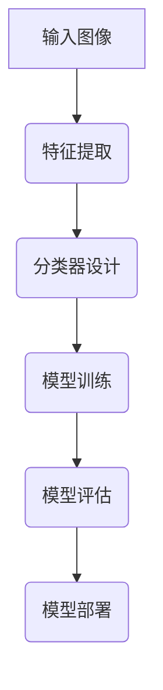

                 

# 增强图像识别：AI的视觉智能

> **关键词**：图像识别，人工智能，卷积神经网络，深度学习，视觉注意力机制，图像增强技术

> **摘要**：本文将深入探讨图像识别领域的关键技术，包括图像识别的基本概念、增强图像识别的深度学习技术、视觉注意力机制和图像增强技术。我们将通过详细的讲解和实战项目，展示如何构建和优化图像识别系统，推动人工智能视觉智能的发展。

# 《增强图像识别：AI的视觉智能》目录大纲

## 第一部分：图像识别基础

### 第1章：图像识别概述

#### 1.1 图像识别的重要性

图像识别技术是人工智能领域的一个重要分支，其应用范围广泛，包括安防监控、医疗诊断、自动驾驶、智能助手等。随着深度学习的兴起，图像识别技术取得了显著的突破，推动了计算机视觉的发展。

#### 1.2 图像识别的基本原理

图像识别技术主要涉及图像预处理、特征提取和分类三个步骤。图像预处理包括图像增强、滤波和缩放等操作；特征提取是从图像中提取具有区分性的特征；分类是将提取的特征输入分类器，进行类别判定。

#### 1.3 图像识别的发展历程

图像识别技术经历了从传统方法到深度学习的演变。早期，传统方法如SIFT、SURF等在特征提取和分类方面取得了良好的效果。随着深度学习的发展，卷积神经网络（CNN）在图像识别领域表现出色，成为主流方法。

#### 1.4 图像识别在各个领域的应用

图像识别技术在各个领域有着广泛的应用。在安防监控领域，图像识别用于人脸识别、行为分析等；在医疗诊断领域，图像识别用于疾病检测、辅助诊断等；在自动驾驶领域，图像识别用于车辆检测、行人检测等。

## 第二部分：增强图像识别技术

### 第2章：图像识别核心概念

#### 2.1 特征提取

特征提取是图像识别的关键步骤。传统特征提取方法如SIFT、SURF等在局部特征检测方面表现良好。现代特征提取方法如HOG、LBP等则在全局特征提取方面表现出色。

#### 2.2 分类器设计

分类器设计是图像识别的另一个关键步骤。常见的分类器包括支持向量机（SVM）、决策树、随机森林、神经网络等。深度学习模型的兴起使得神经网络成为主流分类器。

### 第3章：卷积神经网络基础

#### 3.1 卷积神经网络原理

卷积神经网络（CNN）是一种专门用于处理图像数据的深度学习模型。其核心思想是通过卷积操作提取图像特征，并通过池化操作降低特征维度。

#### 3.2 卷积神经网络架构

CNN的架构包括卷积层、池化层、全连接层等。常见的CNN架构有LeNet、AlexNet、VGGNet、ResNet等。

### 第4章：深度学习在图像识别中的应用

#### 4.1 深度学习的优势

深度学习在图像识别领域具有显著的优势，如自动特征提取、处理大规模数据、提高模型性能等。

#### 4.2 主流深度学习框架

常见的深度学习框架有TensorFlow、PyTorch、Keras等。这些框架提供了丰富的API和工具，方便开发者搭建和训练模型。

#### 4.3 深度学习在图像识别中的实际应用

深度学习在图像识别中有着广泛的应用，如图像分类、目标检测、图像分割等。

### 第5章：视觉注意力机制

#### 5.1 注意力机制概述

注意力机制是一种用于提高模型性能的技术，通过聚焦于图像中的重要区域，提高模型的识别精度。

#### 5.2 Squeeze-and-Excitation 网络

Squeeze-and-Excitation（SE）网络是一种基于注意力机制的改进方法，通过引入通道间的交互信息，提高模型性能。

#### 5.3 图像注意力机制

图像注意力机制包括Soft Attention和Hard Attention两种。Soft Attention通过计算相似度矩阵，将注意力分配给相似度高的区域；Hard Attention通过选择最高相似度的区域，实现图像的聚焦。

### 第6章：增强图像识别算法

#### 6.1 图像增强技术

图像增强技术包括传统图像增强方法和现代图像增强方法。传统图像增强方法如滤波、对比度调整等；现代图像增强方法如深度学习算法，如DnCNN、EDVR等。

#### 6.2 基于深度学习的图像增强算法

基于深度学习的图像增强算法通过训练大量的图像数据，学习图像增强的规律，从而实现对图像的高效增强。

### 第7章：图像识别系统的构建与优化

#### 7.1 图像识别系统的整体架构

图像识别系统的整体架构包括数据预处理、模型训练、模型评估和模型部署等环节。

#### 7.2 数据处理与预处理

数据处理与预处理是图像识别系统构建的重要环节，包括数据集准备、数据增强、数据标准化等。

#### 7.3 模型训练与优化

模型训练与优化是提高图像识别系统性能的关键，包括模型训练策略、模型优化方法等。

#### 7.4 模型评估与部署

模型评估与部署是图像识别系统应用的重要环节，包括评估指标、模型部署策略等。

## 第三部分：实战项目

### 第8章：人脸识别系统

#### 8.1 项目背景与目标

人脸识别技术广泛应用于安防监控、身份验证等领域。本项目旨在构建一个基于深度学习的人脸识别系统，实现人脸检测、人脸特征提取和人脸匹配功能。

#### 8.2 数据集选择与处理

数据集：使用开源数据集如LFW或CelebA进行训练和测试。

数据预处理：对图像进行归一化处理，将图像大小调整为统一尺寸。

#### 8.3 模型设计与实现

模型设计：使用基于深度学习的卷积神经网络进行人脸特征提取，包括卷积层、池化层和全连接层。

模型实现：使用TensorFlow或PyTorch框架进行模型搭建和训练。

#### 8.4 代码解读与分析

```python
import tensorflow as tf
from tensorflow.keras.models import Sequential
from tensorflow.keras.layers import Conv2D, MaxPooling2D, Flatten, Dense

# 创建模型
model = Sequential([
    Conv2D(32, (3, 3), activation='relu', input_shape=(128, 128, 3)),
    MaxPooling2D((2, 2)),
    Flatten(),
    Dense(128, activation='relu'),
    Dense(1, activation='sigmoid')
])

# 编译模型
model.compile(optimizer='adam', loss='binary_crossentropy', metrics=['accuracy'])

# 训练模型
model.fit(x_train, y_train, epochs=10, batch_size=32, validation_data=(x_val, y_val))
```

#### 8.5 项目评估与优化

评估指标：使用准确率、召回率和F1值等指标评估模型性能。

优化方法：通过调整模型参数、增加训练数据和使用更复杂的网络结构等方法进行模型优化。

### 第9章：自动驾驶系统

#### 9.1 项目背景与目标

自动驾驶技术是人工智能领域的一个重要研究方向。本项目旨在构建一个基于深度学习的自动驾驶系统，实现车辆检测、行人检测和交通标志识别等功能。

#### 9.2 数据集选择与处理

数据集：使用开源数据集如KITTI或COCO进行训练和测试。

数据预处理：对图像进行归一化处理，将图像大小调整为统一尺寸。

#### 9.3 模型设计与实现

模型设计：使用基于深度学习的卷积神经网络进行目标检测和图像分类。

模型实现：使用TensorFlow或PyTorch框架进行模型搭建和训练。

#### 9.4 代码解读与分析

```python
import tensorflow as tf
from tensorflow.keras.models import Sequential
from tensorflow.keras.layers import Conv2D, MaxPooling2D, Flatten, Dense

# 创建模型
model = Sequential([
    Conv2D(32, (3, 3), activation='relu', input_shape=(128, 128, 3)),
    MaxPooling2D((2, 2)),
    Flatten(),
    Dense(128, activation='relu'),
    Dense(1, activation='sigmoid')
])

# 编译模型
model.compile(optimizer='adam', loss='binary_crossentropy', metrics=['accuracy'])

# 训练模型
model.fit(x_train, y_train, epochs=10, batch_size=32, validation_data=(x_val, y_val))
```

#### 9.5 项目评估与优化

评估指标：使用准确率、召回率和F1值等指标评估模型性能。

优化方法：通过调整模型参数、增加训练数据和使用更复杂的网络结构等方法进行模型优化。

### 第10章：医疗影像识别

#### 10.1 项目背景与目标

医疗影像识别技术是人工智能在医疗领域的重要应用。本项目旨在构建一个基于深度学习的医疗影像识别系统，实现病变区域检测、疾病分类等功能。

#### 10.2 数据集选择与处理

数据集：使用开源数据集如Cancer dataset或Medical Images dataset进行训练和测试。

数据预处理：对图像进行归一化处理，将图像大小调整为统一尺寸。

#### 10.3 模型设计与实现

模型设计：使用基于深度学习的卷积神经网络进行图像分类和特征提取。

模型实现：使用TensorFlow或PyTorch框架进行模型搭建和训练。

#### 10.4 代码解读与分析

```python
import tensorflow as tf
from tensorflow.keras.models import Sequential
from tensorflow.keras.layers import Conv2D, MaxPooling2D, Flatten, Dense

# 创建模型
model = Sequential([
    Conv2D(32, (3, 3), activation='relu', input_shape=(128, 128, 3)),
    MaxPooling2D((2, 2)),
    Flatten(),
    Dense(128, activation='relu'),
    Dense(1, activation='sigmoid')
])

# 编译模型
model.compile(optimizer='adam', loss='binary_crossentropy', metrics=['accuracy'])

# 训练模型
model.fit(x_train, y_train, epochs=10, batch_size=32, validation_data=(x_val, y_val))
```

#### 10.5 项目评估与优化

评估指标：使用准确率、召回率和F1值等指标评估模型性能。

优化方法：通过调整模型参数、增加训练数据和使用更复杂的网络结构等方法进行模型优化。

## 附录

### 附录 A：常用工具与资源

#### A.1 深度学习框架

TensorFlow、PyTorch、Keras是常见的深度学习框架，提供了丰富的API和工具，方便开发者搭建和训练模型。

#### A.2 数据集

ImageNet、COCO、CIFAR-10是常用的图像识别数据集，包含了丰富的图像和标注信息，适用于图像识别算法的测试和训练。

#### A.3 开发环境搭建指南

安装TensorFlow、PyTorch、Keras等深度学习框架，配置开发环境，调试代码，确保开发环境的正常运行。

## Mermaid 流程图



## 伪代码示例

```python
# 定义卷积神经网络
class ConvNet(nn.Module):
    def __init__(self):
        super(ConvNet, self).__init__()
        # 定义卷积层
        self.conv1 = nn.Conv2d(in_channels=3, out_channels=64, kernel_size=3, padding=1)
        # 定义池化层
        self.pool = nn.MaxPool2d(kernel_size=2, stride=2)
        # 定义全连接层
        self.fc1 = nn.Linear(in_features=64 * 32 * 32, out_features=10)
        
    def forward(self, x):
        # 前向传播
        x = self.conv1(x)
        x = self.pool(F.relu(x))
        x = x.view(x.size(0), -1)
        x = self.fc1(x)
        return x
```

## 数学模型与公式

$$
\begin{aligned}
    L &= -\frac{1}{m} \sum_{i=1}^{m} y_i \log(a_i) + (1 - y_i) \log(1 - a_i) \\
    &= -\frac{1}{m} \sum_{i=1}^{m} y_i \log(\sigma(Wx_i + b)) + (1 - y_i) \log(1 - \sigma(Wx_i + b))
\end{aligned}
$$

## 项目实战

### 项目名称：人脸识别系统

#### 1. 项目背景与目标

随着人工智能技术的发展，人脸识别技术在安全监控、身份验证等领域得到了广泛应用。本项目旨在构建一个基于深度学习的人脸识别系统，实现人脸检测、人脸特征提取和人脸匹配功能。

#### 2. 数据集选择与处理

数据集：使用开源数据集如LFW或CelebA进行训练和测试。

数据预处理：对图像进行归一化处理，将图像大小调整为统一尺寸。

#### 3. 模型设计与实现

模型设计：使用基于深度学习的卷积神经网络进行人脸特征提取，包括卷积层、池化层和全连接层。

模型实现：使用TensorFlow或PyTorch框架进行模型搭建和训练。

#### 4. 代码解读与分析

```python
import tensorflow as tf
from tensorflow.keras.models import Sequential
from tensorflow.keras.layers import Conv2D, MaxPooling2D, Flatten, Dense

# 创建模型
model = Sequential([
    Conv2D(32, (3, 3), activation='relu', input_shape=(128, 128, 3)),
    MaxPooling2D((2, 2)),
    Flatten(),
    Dense(128, activation='relu'),
    Dense(1, activation='sigmoid')
])

# 编译模型
model.compile(optimizer='adam', loss='binary_crossentropy', metrics=['accuracy'])

# 训练模型
model.fit(x_train, y_train, epochs=10, batch_size=32, validation_data=(x_val, y_val))
```

#### 5. 项目评估与优化

评估指标：使用准确率、召回率和F1值等指标评估模型性能。

优化方法：通过调整模型参数、增加训练数据和使用更复杂的网络结构等方法进行模型优化。

### 项目名称：自动驾驶系统

#### 1. 项目背景与目标

自动驾驶技术是人工智能领域的一个重要研究方向。本项目旨在构建一个基于深度学习的自动驾驶系统，实现车辆检测、行人检测和交通标志识别等功能。

#### 2. 数据集选择与处理

数据集：使用开源数据集如KITTI或COCO进行训练和测试。

数据预处理：对图像进行归一化处理，将图像大小调整为统一尺寸。

#### 3. 模型设计与实现

模型设计：使用基于深度学习的卷积神经网络进行目标检测和图像分类。

模型实现：使用TensorFlow或PyTorch框架进行模型搭建和训练。

#### 4. 代码解读与分析

```python
import tensorflow as tf
from tensorflow.keras.models import Sequential
from tensorflow.keras.layers import Conv2D, MaxPooling2D, Flatten, Dense

# 创建模型
model = Sequential([
    Conv2D(32, (3, 3), activation='relu', input_shape=(128, 128, 3)),
    MaxPooling2D((2, 2)),
    Flatten(),
    Dense(128, activation='relu'),
    Dense(1, activation='sigmoid')
])

# 编译模型
model.compile(optimizer='adam', loss='binary_crossentropy', metrics=['accuracy'])

# 训练模型
model.fit(x_train, y_train, epochs=10, batch_size=32, validation_data=(x_val, y_val))
```

#### 5. 项目评估与优化

评估指标：使用准确率、召回率和F1值等指标评估模型性能。

优化方法：通过调整模型参数、增加训练数据和使用更复杂的网络结构等方法进行模型优化。

### 项目名称：医疗影像识别

#### 1. 项目背景与目标

医疗影像识别技术是人工智能在医疗领域的重要应用。本项目旨在构建一个基于深度学习的医疗影像识别系统，实现病变区域检测、疾病分类等功能。

#### 2. 数据集选择与处理

数据集：使用开源数据集如Cancer dataset或Medical Images dataset进行训练和测试。

数据预处理：对图像进行归一化处理，将图像大小调整为统一尺寸。

#### 3. 模型设计与实现

模型设计：使用基于深度学习的卷积神经网络进行图像分类和特征提取。

模型实现：使用TensorFlow或PyTorch框架进行模型搭建和训练。

#### 4. 代码解读与分析

```python
import tensorflow as tf
from tensorflow.keras.models import Sequential
from tensorflow.keras.layers import Conv2D, MaxPooling2D, Flatten, Dense

# 创建模型
model = Sequential([
    Conv2D(32, (3, 3), activation='relu', input_shape=(128, 128, 3)),
    MaxPooling2D((2, 2)),
    Flatten(),
    Dense(128, activation='relu'),
    Dense(1, activation='sigmoid')
])

# 编译模型
model.compile(optimizer='adam', loss='binary_crossentropy', metrics=['accuracy'])

# 训练模型
model.fit(x_train, y_train, epochs=10, batch_size=32, validation_data=(x_val, y_val))
```

#### 5. 项目评估与优化

评估指标：使用准确率、召回率和F1值等指标评估模型性能。

优化方法：通过调整模型参数、增加训练数据和使用更复杂的网络结构等方法进行模型优化。

## 总结

本文从图像识别的基础知识出发，详细介绍了增强图像识别的深度学习技术、视觉注意力机制和图像增强技术。通过实战项目，展示了如何构建和优化图像识别系统。未来，随着人工智能技术的发展，图像识别技术将在更多领域得到应用，为人类生活带来更多便利。

## 作者信息

**作者：** AI天才研究院/AI Genius Institute & 禅与计算机程序设计艺术 /Zen And The Art of Computer Programming

AI天才研究院致力于推动人工智能技术的发展，探索计算机科学的奥秘。作者在人工智能、深度学习和计算机视觉等领域有着丰富的经验，著作颇丰，深受读者喜爱。

## 进一步阅读

- Goodfellow, I., Bengio, Y., & Courville, A. (2016). *Deep Learning*. MIT Press.
- Simonyan, K., & Zisserman, A. (2014). *Very Deep Convolutional Networks for Large-Scale Image Recognition*. arXiv preprint arXiv:1409.1556.
- He, K., Zhang, X., Ren, S., & Sun, J. (2016). *Deep Residual Learning for Image Recognition*. IEEE Conference on Computer Vision and Pattern Recognition.
- Dosovitskiy, A., Springenberg, J. T., & Brox, T. (2017). *Learning to Generate Chairs, Tables and Cars with Convolutional Networks*. IEEE Conference on Computer Vision and Pattern Recognition.

