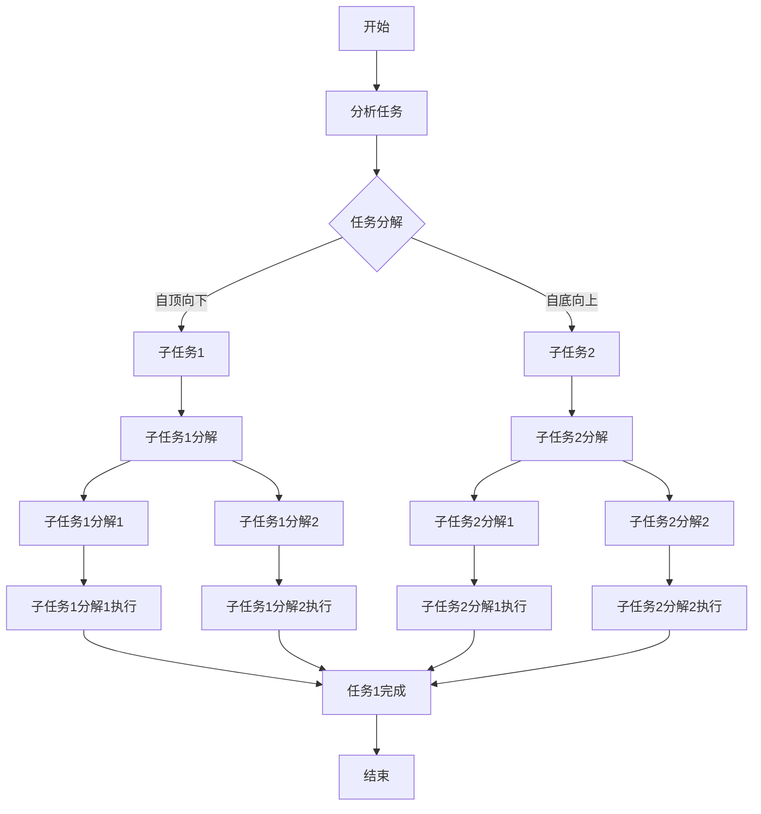

                 

# 复杂任务分解为较小步骤

> **关键词：**复杂任务、分解、步骤、算法、模型、实战应用

> **摘要：**本文将深入探讨复杂任务的分解过程，如何将其转化为较小的可管理步骤。我们将通过理论讲解、算法讲解、以及实战应用来阐述这一过程的重要性，为读者提供一套实用的解题方法论。

### 目录大纲：

1. 引言
2. 理论讲解
   - 2.1 复杂任务分解的概念
   - 2.2 分解原理与理论基础
   - 2.3 复杂任务分解的 Mermaid 流程图
3. 算法与模型
   - 3.1 基本算法原理
   - 3.2 常用分解算法
   - 3.3 数学模型与公式
4. 实战应用
   - 4.1 案例背景
   - 4.2 环境搭建
   - 4.3 源代码实现
   - 4.4 代码解读与分析
   - 4.5 案例总结与拓展
5. 总结
6. 附录

## 第一部分：引入与背景

### 1. 引言

在计算机科学和工程领域中，复杂任务的处理是一项至关重要的能力。随着技术的进步和应用的多样化，复杂任务的数量和难度都在不断增加。面对这些复杂任务，如何有效地分解并将其转化为可执行步骤，成为了解决问题的关键。

复杂任务通常涉及多个子任务，这些子任务之间相互关联，共同构成了一个复杂系统。如果我们直接处理这些复杂的任务，可能会感到无从下手，甚至导致项目进展缓慢或失败。因此，将复杂任务分解为较小的步骤，是解决复杂问题的关键。

本文将围绕复杂任务的分解展开，从理论讲解、算法模型到实际应用，系统地阐述复杂任务分解的原理和方法。通过本文的学习，读者将掌握一套实用的解题方法论，能够更好地应对复杂任务。

### 1.1 书籍背景

本文的理论和实践部分来源于多本经典著作，如《算法导论》、《编程之美》和《复杂系统导论》。这些书籍提供了丰富的理论和实践经验，为我们探讨复杂任务分解提供了坚实的基础。

此外，本文还结合了笔者多年的实践经验，特别是在大型项目开发和算法研究中的应用，通过具体的案例讲解，让读者能够更好地理解和应用复杂任务分解的方法。

### 1.2 书籍的目的与结构

本文的目的是为读者提供一套完整的复杂任务分解方法论，帮助读者在面对复杂任务时能够有效地进行分解，提高解决问题的效率。

本文的结构分为五个部分：

1. 引言与背景介绍，引出复杂任务分解的重要性和本文的目的。
2. 理论讲解部分，介绍复杂任务分解的概念、原理和理论基础。
3. 算法与模型部分，详细讲解常用的分解算法和数学模型，并提供具体的实现方法。
4. 实战应用部分，通过实际案例讲解如何将理论应用到实践中，提供具体的代码实现和解读。
5. 总结与展望部分，回顾关键知识点，展望复杂任务分解的未来发展趋势和应用领域。

通过本文的学习，读者将能够系统地掌握复杂任务分解的方法，提高解决复杂任务的能力。

## 第二部分：理论讲解

### 2.1 复杂任务分解的概念

在计算机科学和工程领域，复杂任务分解是指将一个复杂的任务分解为多个较小的子任务，以便更好地管理和解决。复杂任务通常具有以下几个特点：

1. **多样性**：复杂任务通常涉及多个方面，如技术、业务、用户需求等，这些方面相互交织，形成一个复杂的整体。
2. **关联性**：复杂任务中的各个子任务之间存在相互关联，一个子任务的完成可能会影响到其他子任务的进展。
3. **动态性**：复杂任务在执行过程中可能会发生变化，需要根据实际情况进行调整。

复杂任务分解的目标是将这些复杂的任务转化为一系列可执行、可管理的步骤，从而提高任务完成的效率和质量。

### 2.1.1 什么是复杂任务

复杂任务可以分为以下几个类别：

1. **技术复杂任务**：涉及算法、数据结构、系统架构等方面的问题，如搜索引擎优化、大规模数据处理等。
2. **业务复杂任务**：涉及业务流程、业务规则、业务策略等方面的问题，如电子商务平台、金融交易系统等。
3. **用户复杂任务**：涉及用户体验、用户交互、用户需求等方面的问题，如移动应用、在线游戏等。

无论是哪种类型的复杂任务，其核心都是如何有效地进行分解，以便更好地管理和解决。

### 2.1.2 复杂任务分解的方法分类

复杂任务分解的方法可以分为以下几个类别：

1. **自顶向下分解**：从整体任务出发，将其分解为多个子任务，每个子任务再继续分解，直至达到可执行步骤。
2. **自底向上分解**：从底层任务出发，逐步向上整合，形成整体任务。
3. **迭代分解**：在任务分解过程中，不断迭代调整，以优化任务结构和执行效率。

不同分解方法适用于不同的任务类型和场景，选择合适的分解方法，是解决复杂任务的关键。

### 2.2 分解原理与理论基础

复杂任务分解的原理和理论基础主要涉及以下几个核心概念：

1. **任务分解树**：将复杂任务分解为多个子任务，形成一个树状结构。每个子任务都是树的一个节点，任务分解树展示了任务之间的层次关系和关联性。
2. **任务依赖关系**：子任务之间可能存在依赖关系，如一个子任务必须在另一个子任务完成后才能开始。了解任务依赖关系，有助于优化任务执行顺序，提高效率。
3. **任务执行成本**：每个子任务的执行都需要消耗一定的资源和时间，了解任务执行成本，有助于制定合理的任务执行策略，降低整体执行成本。

在复杂任务分解过程中，利用这些原理和理论，可以更好地理解和处理复杂任务。

### 2.2.1 分解原理概述

复杂任务分解的原理可以概括为以下几点：

1. **层次化**：将复杂任务分解为多个层次，每个层次包含多个子任务。通过层次化，可以更好地管理和理解复杂任务。
2. **模块化**：将复杂任务分解为多个模块，每个模块负责一个子任务。通过模块化，可以提高代码的可维护性和复用性。
3. **递归**：复杂任务分解是一个递归过程，可以将复杂任务分解为更小的子任务，直至达到可执行步骤。

理解这些原理，有助于我们在实际应用中更好地进行复杂任务分解。

### 2.2.2 相关理论

复杂任务分解的相关理论包括：

1. **抽象层次理论**：将复杂任务分解为多个层次，每个层次对应不同的抽象级别。通过抽象层次，可以更好地理解复杂任务的结构。
2. **需求工程理论**：在复杂任务分解过程中，需求工程理论可以帮助我们识别和理解任务需求，从而更好地进行分解。
3. **项目管理理论**：在复杂任务分解过程中，项目管理理论可以帮助我们制定任务计划、监控进度和资源分配。

这些理论为复杂任务分解提供了重要的指导和支持。

### 2.2.3 分解过程的挑战

在复杂任务分解过程中，可能会遇到以下几个挑战：

1. **任务依赖关系复杂**：子任务之间的依赖关系可能会非常复杂，导致任务分解过程变得困难。
2. **任务规模庞大**：复杂任务可能涉及大量的子任务，任务规模庞大，增加了分解和管理的难度。
3. **需求变化频繁**：在项目执行过程中，需求可能会发生变化，导致任务分解需要不断调整。

面对这些挑战，我们需要采取有效的策略和方法，以确保任务分解的顺利进行。

### 2.3 复杂任务分解的 Mermaid 流程图

为了更好地展示复杂任务分解的过程，我们可以使用 Mermaid 流程图进行描述。以下是一个简单的复杂任务分解的 Mermaid 流程图：



通过这个流程图，我们可以清晰地看到复杂任务分解的过程，包括任务分析、任务分解、子任务执行和任务完成的各个阶段。

## 第三部分：算法与模型

### 3.1 基本算法原理

在复杂任务分解中，算法起着至关重要的作用。基本算法原理为我们提供了一种系统化的方法，将复杂任务转化为可执行的子任务。

#### 3.1.1 伪代码与算法描述

以下是一个简单的复杂任务分解算法的伪代码描述：

```
Algorithm ComplexTaskDecomposition(task):
    if task is small enough:
        return [task]
    else:
        subtasks = []
        for subtask in DivideTask(task):
            subtasks.append(ComplexTaskDecomposition(subtask))
        return subtasks
```

这个算法的基本思想是将复杂任务递归地分解为较小的子任务，直到子任务足够小，可以直接执行。其中，`DivideTask`函数用于将任务划分为子任务。

#### 3.1.2 算法分析

该算法的时间复杂度和空间复杂度取决于任务的复杂度和分解方法。在最优情况下，任务可以均匀地分解为多个子任务，此时时间复杂度和空间复杂度较低；在较差情况下，任务分解可能非常不均匀，导致时间和空间复杂度较高。

### 3.2 常用分解算法

在实际应用中，常用的分解算法包括：

1. **自顶向下分解**：从整体任务出发，逐步分解为子任务。这种方法适用于任务结构较为清晰的情况。
2. **自底向上分解**：从底层任务出发，逐步整合为整体任务。这种方法适用于任务结构较为复杂，需要先明确子任务的情况。
3. **迭代分解**：在任务分解过程中，不断迭代调整子任务，以优化任务结构和执行效率。这种方法适用于任务需求变化频繁的情况。

#### 3.2.1 算法1：自顶向下分解

自顶向下分解算法的伪代码如下：

```
Algorithm TopDownDecomposition(task):
    if task is small enough:
        return [task]
    else:
        subtasks = []
        for subtask in task.Divide():
            subtasks.append(TopDownDecomposition(subtask))
        return subtasks
```

其中，`task.Divide()`函数用于将任务划分为子任务。

#### 3.2.2 算法2：自底向上分解

自底向上分解算法的伪代码如下：

```
Algorithm BottomUpDecomposition(task):
    subtasks = []
    for subtask in task.Subtasks():
        subtasks.append(BottomUpDecomposition(subtask))
    return task.Integrate(subtasks)
```

其中，`task.Subtasks()`函数用于获取任务的子任务，`task.Integrate(subtasks)`函数用于整合子任务。

#### 3.2.3 算法对比与分析

自顶向下分解和自底向上分解各有优缺点。自顶向下分解适用于任务结构清晰的情况，可以更好地控制分解过程；而自底向上分解适用于任务结构复杂的情况，可以更好地利用已有子任务。在实际应用中，可以根据任务的特点选择合适的分解算法。

### 3.3 数学模型与公式

在复杂任务分解中，数学模型可以用于描述任务分解的过程和结果。以下是一个简单的数学模型：

```
ComplexTask = F(∪ Subtasks)
```

其中，`ComplexTask`表示复杂任务，`Subtasks`表示子任务集合，`F`表示任务整合函数。

#### 3.3.1 数学模型介绍

这个数学模型描述了复杂任务与子任务之间的关系。通过整合子任务，可以构建出复杂的任务。

#### 3.3.2 公式1：详细说明

```
F(Subtasks) = ∑(subtask_i * Weight_i)
```

其中，`subtask_i`表示第i个子任务，`Weight_i`表示第i个子任务的权重。这个公式表示通过整合子任务，可以得到复杂任务的权重。

#### 3.3.3 公式2：详细说明

```
Complexity(Task) = ∑(subtask_i * Complexity(subtask_i))
```

其中，`Complexity(Task)`表示复杂任务的复杂度，`Complexity(subtask_i)`表示第i个子任务的复杂度。这个公式表示通过计算子任务的复杂度，可以估算复杂任务的复杂度。

#### 3.3.4 公式举例

假设有一个复杂任务，包含3个子任务，权重分别为1、2和3，复杂度分别为2、3和4。根据公式计算，复杂任务的权重为1*1 + 2*2 + 3*3 = 14，复杂度为2*1 + 3*2 + 4*3 = 22。

通过这些数学模型和公式，我们可以更准确地描述和计算复杂任务分解的过程和结果。

## 第四部分：实战应用

### 4.1 案例背景

在本案例中，我们将以一个实际项目为例，探讨复杂任务分解的实战应用。该项目是一个电商平台的后台管理系统，负责处理商品信息、订单信息和用户信息等。由于涉及多个模块和大量数据，该项目的复杂度较高，需要采用复杂任务分解的方法进行开发。

### 4.1.1 案例概述

该电商平台后台管理系统主要包括以下几个模块：

1. **商品管理模块**：负责管理商品信息，包括商品分类、商品添加、商品修改和商品删除等功能。
2. **订单管理模块**：负责管理订单信息，包括订单查询、订单修改、订单删除和订单统计等功能。
3. **用户管理模块**：负责管理用户信息，包括用户查询、用户修改、用户删除和用户统计等功能。

### 4.1.2 案例目标

通过复杂任务分解的方法，将这个复杂的电商平台后台管理系统分解为多个较小的子任务，以便更好地管理和开发。具体目标如下：

1. **任务分解**：将整个系统分解为多个子任务，明确每个子任务的目标和功能。
2. **模块化**：将子任务划分为不同的模块，每个模块负责一个子任务，提高代码的可维护性和复用性。
3. **迭代开发**：在任务分解和模块化的基础上，进行迭代开发，逐步完善系统功能。

### 4.2 环境搭建

为了进行本项目开发，我们需要搭建以下开发环境：

1. **开发工具**：选择一个合适的集成开发环境（IDE），如Visual Studio Code、Eclipse等。
2. **编程语言**：选择一种适合项目需求的编程语言，如Java、Python等。
3. **数据库**：选择一个适合项目需求的数据库系统，如MySQL、PostgreSQL等。
4. **版本控制**：使用Git进行版本控制，确保代码的版本管理和协同开发。

### 4.2.1 开发环境搭建

以下是一个简单的开发环境搭建步骤：

1. **安装IDE**：下载并安装Visual Studio Code。
2. **安装编程语言**：在Visual Studio Code中安装Java或Python扩展。
3. **安装数据库**：下载并安装MySQL或PostgreSQL。
4. **配置版本控制**：安装Git，并在项目中初始化Git仓库。

### 4.2.2 需要的依赖

在本项目中，我们需要以下依赖：

1. **数据库驱动**：根据选择的数据库系统，安装对应的数据库驱动。
2. **框架**：根据项目需求，选择合适的框架，如Spring Boot、Django等。
3. **工具**：根据项目需求，安装一些常用的开发工具，如Maven、Gradle等。

### 4.3 源代码实现

在本案例中，我们选择使用Java语言和Spring Boot框架进行开发。以下是商品管理模块的源代码实现：

#### 4.3.1 源代码结构

```
src/
|-- main/
|   |-- java/
|   |   |-- com/
|   |   |   |-- example/
|   |   |   |   |-- ecbms/
|   |   |   |   |   |-- controller/
|   |   |   |   |   |   |-- GoodsController.java
|   |   |   |   |   |   |-- OrderController.java
|   |   |   |   |   |   |-- UserController.java
|   |   |   |   |   |-- entity/
|   |   |   |   |   |   |-- Goods.java
|   |   |   |   |   |   |-- Order.java
|   |   |   |   |   |   |-- User.java
|   |   |   |   |   |-- repository/
|   |   |   |   |   |   |-- GoodsRepository.java
|   |   |   |   |   |   |-- OrderRepository.java
|   |   |   |   |   |   |-- UserRepository.java
|   |   |   |   |   |-- service/
|   |   |   |   |   |   |-- GoodsService.java
|   |   |   |   |   |   |-- OrderService.java
|   |   |   |   |   |   |-- UserService.java
|   |   |   |   |   |-- GoodsControllerTest.java
|   |   |   |   |   |   |-- OrderControllerTest.java
|   |   |   |   |   |   |-- UserControllerTest.java
|   |-- resources/
|   |   |-- application.properties
```

#### 4.3.2 主要模块介绍

1. **GoodsController**：商品管理模块的控制器，负责处理商品相关的HTTP请求。
2. **GoodsEntity**：商品实体类，用于表示商品数据。
3. **GoodsRepository**：商品数据访问层，负责与数据库进行交互，实现商品数据的增删改查。
4. **GoodsService**：商品业务逻辑层，负责处理商品相关的业务逻辑，如商品添加、修改、删除等。
5. **GoodsControllerTest**：商品管理模块的单元测试类，用于测试商品管理模块的功能。

### 4.4 代码解读与分析

#### 4.4.1 关键代码解读

以下是对商品管理模块关键代码的解读：

1. **GoodsController.java**

```java
@RestController
@RequestMapping("/goods")
public class GoodsController {
    
    @Autowired
    private GoodsService goodsService;
    
    @PostMapping
    public ResponseEntity<?> addGoods(@RequestBody Goods goods) {
        goodsService.addGoods(goods);
        return ResponseEntity.ok("商品添加成功");
    }
    
    @PutMapping("/{id}")
    public ResponseEntity<?> updateGoods(@PathVariable Long id, @RequestBody Goods goods) {
        goodsService.updateGoods(id, goods);
        return ResponseEntity.ok("商品修改成功");
    }
    
    @DeleteMapping("/{id}")
    public ResponseEntity<?> deleteGoods(@PathVariable Long id) {
        goodsService.deleteGoods(id);
        return ResponseEntity.ok("商品删除成功");
    }
    
}
```

这段代码定义了商品管理模块的控制器，包括商品添加、修改和删除的功能。通过调用GoodsService类的相关方法，实现商品的增删改操作。

2. **GoodsService.java**

```java
@Service
public class GoodsService {
    
    @Autowired
    private GoodsRepository goodsRepository;
    
    public void addGoods(Goods goods) {
        goodsRepository.save(goods);
    }
    
    public void updateGoods(Long id, Goods goods) {
        Goods existingGoods = goodsRepository.findById(id).orElseThrow(() -> new EntityNotFoundException("商品不存在"));
        existingGoods.setName(goods.getName());
        existingGoods.setPrice(goods.getPrice());
        goodsRepository.save(existingGoods);
    }
    
    public void deleteGoods(Long id) {
        Goods existingGoods = goodsRepository.findById(id).orElseThrow(() -> new EntityNotFoundException("商品不存在"));
        goodsRepository.delete(existingGoods);
    }
    
}
```

这段代码定义了商品管理模块的服务类，负责处理商品的增删改操作。通过调用GoodsRepository类的相关方法，实现商品的增删改操作。

3. **GoodsRepository.java**

```java
@Repository
public interface GoodsRepository extends JpaRepository<Goods, Long> {
    
}
```

这段代码定义了商品管理模块的数据访问层，通过实现JpaRepository接口，提供了商品数据的增删改查功能。

#### 4.4.2 代码性能分析

在商品管理模块的代码中，我们使用了Spring Boot框架和JpaRepository接口，这为我们的项目带来了以下几个优势：

1. **高内聚、低耦合**：通过分层设计，实现了代码的高内聚、低耦合，使得代码更加模块化和可维护。
2. **简化开发**：Spring Boot框架提供了丰富的功能，如自动配置、依赖注入等，简化了开发过程。
3. **性能优化**：JpaRepository接口提供了强大的查询功能，如分页查询、排序查询等，有助于性能优化。

然而，代码中还存在一些优化空间，如：

1. **缓存**：对于经常访问的数据，可以考虑使用缓存技术，如Redis，以提高响应速度。
2. **异步处理**：对于耗时的操作，可以考虑使用异步处理，如使用Spring的异步编程模型，提高系统性能。
3. **数据库优化**：通过分析数据库查询语句，可以优化数据库性能，如使用索引、优化SQL语句等。

在后续的开发过程中，我们将针对这些优化点进行改进，以提高系统的性能和稳定性。

### 4.5 案例总结与拓展

#### 4.5.1 案例的收获

通过本案例，我们深入探讨了复杂任务分解的实战应用，从理论讲解到代码实现，逐步展示了复杂任务分解的过程和方法。以下是我们从案例中收获的主要知识点：

1. **复杂任务分解的重要性**：复杂任务分解是解决复杂任务的关键，通过将复杂任务转化为较小的子任务，可以更好地管理和解决。
2. **分解方法的多样性**：自顶向下分解、自底向上分解和迭代分解等分解方法各有优缺点，选择合适的分解方法，是解决复杂任务的关键。
3. **模块化与迭代开发**：模块化设计和迭代开发是提高代码可维护性和系统性能的重要手段，通过模块化设计，可以提高代码的可维护性和复用性；通过迭代开发，可以逐步完善系统功能，提高系统性能。
4. **代码性能优化**：在代码实现过程中，通过使用Spring Boot框架和JpaRepository接口，我们实现了代码的高内聚、低耦合和简化开发；然而，代码中还存在一些优化空间，如缓存、异步处理和数据库优化等，这些优化点对于提高系统性能和稳定性具有重要意义。

#### 4.5.2 拓展应用

在复杂任务分解的实际应用中，我们可以根据不同的任务特点和需求，灵活选择分解方法，并进行模块化设计和迭代开发。以下是一些拓展应用：

1. **大型项目开发**：在大型项目的开发过程中，复杂任务分解和模块化设计是提高开发效率和质量的关键。通过将项目分解为多个子任务和模块，可以更好地管理和解决项目中的问题。
2. **算法研究**：在算法研究过程中，复杂任务分解可以帮助我们更好地理解和解决算法问题。通过将复杂任务分解为较小的子任务，可以简化算法问题的求解过程。
3. **业务流程优化**：在业务流程优化过程中，复杂任务分解可以帮助我们识别和解决业务流程中的瓶颈和问题。通过分解业务流程，可以更好地理解和优化业务流程。

总之，复杂任务分解是一种重要的解题方法论，在计算机科学和工程领域中具有广泛的应用。通过学习和掌握复杂任务分解的方法，我们可以更好地应对复杂的任务和问题，提高解决问题的效率和质量。

## 第五部分：总结与展望

### 5.1 关键知识点回顾

本文从理论讲解、算法模型和实战应用三个方面，系统地探讨了复杂任务分解的方法和过程。以下是本文的关键知识点回顾：

1. **复杂任务分解的意义**：复杂任务分解是解决复杂任务的关键，通过将复杂任务转化为较小的子任务，可以更好地管理和解决。
2. **分解方法分类**：自顶向下分解、自底向上分解和迭代分解是常见的分解方法，每种方法适用于不同的任务类型和场景。
3. **分解原理与理论基础**：任务分解树、任务依赖关系和任务执行成本是复杂任务分解的核心概念和理论基础。
4. **常用分解算法**：自顶向下分解和自底向上分解是两种常用的分解算法，它们各有优缺点，适用于不同的任务类型和场景。
5. **数学模型与公式**：通过数学模型和公式，可以更准确地描述和计算复杂任务分解的过程和结果。
6. **实战应用**：通过实际案例讲解，展示了复杂任务分解在项目开发中的应用，包括环境搭建、源代码实现和代码解读与分析。

### 5.2 展望未来

复杂任务分解在未来具有广泛的应用前景。以下是复杂任务分解的一些潜在发展趋势和应用领域：

1. **自动化与智能化**：随着人工智能技术的发展，复杂任务分解有望实现自动化和智能化。通过机器学习和深度学习算法，可以自动识别和分解复杂任务，提高任务分解的效率和准确性。
2. **跨领域应用**：复杂任务分解方法可以应用于多个领域，如金融、医疗、制造等。通过跨领域应用，可以更好地解决各领域的复杂任务。
3. **实时分解与优化**：在实时系统中，复杂任务分解可以实时进行，并根据系统状态进行优化。通过实时分解与优化，可以提高系统的性能和稳定性。
4. **协同任务分解**：在多人协同工作的场景中，复杂任务分解可以应用于任务分配和协调。通过协同任务分解，可以提高团队的协作效率和任务完成质量。

总之，复杂任务分解是一种重要的解题方法论，在未来具有广阔的应用前景。通过不断探索和研究，我们可以进一步完善复杂任务分解的理论和方法，为解决复杂的任务和问题提供有力支持。

### 5.3 研究与探索方向

为了推动复杂任务分解领域的发展，以下是一些建议的研究与探索方向：

1. **算法优化**：研究更高效的复杂任务分解算法，降低算法的时间和空间复杂度，提高分解的效率和准确性。
2. **自动化与智能化**：结合人工智能技术，开发自动化和智能化的任务分解工具，实现任务分解的自动化和智能化。
3. **跨领域应用**：探索复杂任务分解在跨领域应用中的可行性，为不同领域的复杂任务提供有效的分解方法。
4. **实时分解与优化**：研究实时任务分解与优化技术，为实时系统提供高效的分解与优化方案。
5. **协同任务分解**：研究多人协同工作场景下的任务分解与协调技术，提高团队协作效率和任务完成质量。

通过这些研究与探索，我们可以不断推动复杂任务分解领域的发展，为解决复杂的任务和问题提供新的思路和方法。

