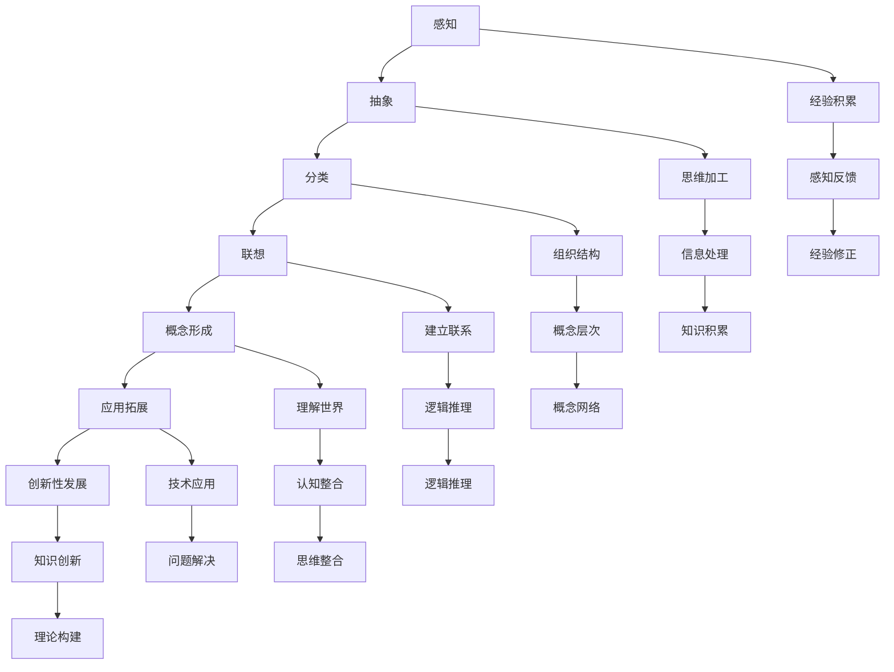
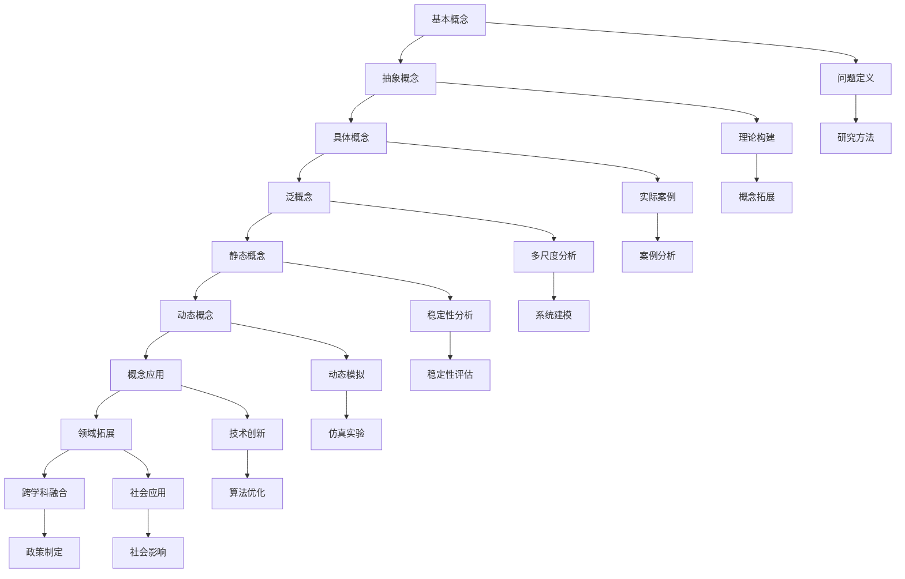

                 

### 复杂思想的形成：概念的基础

在人工智能、机器学习和复杂系统等领域，复杂思想的形成与概念的理解扮演着至关重要的角色。它们不仅是科学研究和技术创新的基石，也是日常生活决策和问题解决的关键要素。本文旨在探讨复杂思想的形成过程，特别是概念的基础，通过逻辑清晰、结构紧凑的分析，深入挖掘这些核心概念的本质及其相互联系。

**关键词**：复杂思想、概念基础、认知科学、信息论、抽象概念、科学探索。

**摘要**：本文首先介绍了复杂思想的定义和重要性，探讨了复杂思想的起源和发展历程。接着，我们详细分析了概念的形成机制，包括感知与经验的作用以及思维与推理的过程。然后，文章进一步探讨了现代复杂思想的演变，包括信息论和认知科学对复杂思想发展的贡献。在此基础上，我们深入讨论了概念的定义与分类，概念语义与内涵，以及概念的应用与拓展。随后，文章展示了复杂思想在科学研究、日常生活和现代社会发展中的应用实例。最后，我们总结了复杂思想形成的研究进展和未来趋势，为读者提供了一系列有价值的参考资料和项目实战案例。

通过本文的探讨，我们希望能够帮助读者更好地理解复杂思想的形成过程，以及概念在其中的基础性作用。这不仅对专业人士有所裨益，也为普通读者提供了深刻的思考和洞察。

### 《复杂思想的形成：概念的基础》目录大纲

为了更好地组织本文的内容，我们将按照以下目录大纲结构进行论述：

1. **引言**：
   - 1.1 书籍概述与目标
   - 1.2 复杂思想的重要性
   - 1.3 概念的基础与分类

2. **复杂思想的起源与发展**：
   - 2.1 早期复杂思想的探索
     - 2.1.1 早期哲学家的思想
     - 2.1.2 科学革命中的复杂思想
   - 2.2 概念的形成机制
     - 2.2.1 感知与经验的作用
     - 2.2.2 思维与推理的过程
   - 2.3 现代复杂思想的演变
     - 2.3.1 信息论与复杂系统
     - 2.3.2 认知科学与复杂思想

3. **概念的基础**：
   - 3.1 概念的定义与分类
     - 3.1.1 基本概念与抽象概念
     - 3.1.2 概念的层次结构
   - 3.2 概念的语义与内涵
     - 3.2.1 概念的语义网络
     - 3.2.2 概念的内涵与外延
   - 3.3 概念的运用与拓展
     - 3.3.1 概念的联想与应用
     - 3.3.2 概念的拓展与创新

4. **复杂思想的应用**：
   - 4.1 复杂思想在科学研究中的应用
     - 4.1.1 复杂系统的研究方法
     - 4.1.2 复杂思想的科学探索
   - 4.2 复杂思想在日常生活中的应用
     - 4.2.1 复杂决策与问题解决
     - 4.2.2 复杂思想在艺术与文学中的运用
   - 4.3 复杂思想在社会发展中的作用
     - 4.3.1 社会系统的复杂性与稳定性
     - 4.3.2 复杂思想在政策制定与实施中的应用

5. **总结与展望**：
   - 5.1 复杂思想形成的研究进展
   - 5.2 复杂思想研究的挑战与机遇
   - 5.3 未来复杂思想的发展趋势

6. **附录**：
   - 6.1 参考文献
   - 6.2 网络资源
   - 6.3 Mermaid 流程图
     - 6.3.1 概念的形成与发展流程图
     - 6.3.2 复杂思想的分类与应用流程图
   - 6.4 伪代码与数学公式
     - 6.4.1 主要算法的伪代码
     - 6.4.2 复杂思想相关的数学公式与解释
   - 6.5 项目实战案例
     - 6.5.1 代码实现与解读
     - 6.5.2 案例分析与总结

通过上述目录，我们将逐步深入探讨复杂思想的形成过程，特别是概念的基础，帮助读者在逻辑清晰、结构紧凑的分析中，理解复杂思想的核心概念及其相互联系。

### 第一部分：引言

#### 1.1 书籍概述与目标

《复杂思想的形成：概念的基础》是一本旨在深入探讨复杂思想及其形成过程的书籍。本书的核心目标是帮助读者理解复杂思想的本质，掌握概念的形成机制，并了解这些概念在不同领域中的应用。通过系统的分析和探讨，本书旨在为读者提供一幅关于复杂思想的全景图，使其能够更好地应对现实世界中的复杂问题。

为了实现这一目标，本书采用了多角度、多层次的研究方法。首先，本书回顾了复杂思想的起源和发展历程，探讨了早期哲学家的思想以及科学革命对复杂思想的推动作用。接着，本书深入分析了概念的形成机制，从感知与经验的作用到思维与推理的过程，全面解析了复杂思想的内在逻辑。在此基础上，本书探讨了现代复杂思想的演变，特别是信息论和认知科学对复杂思想的贡献。随后，本书详细讨论了概念的定义与分类，概念语义与内涵，以及概念的应用与拓展。最后，本书展示了复杂思想在科学研究、日常生活和现代社会发展中的应用实例，帮助读者更好地理解复杂思想在实际中的应用价值。

通过上述内容，本书希望能够为读者提供一个全面、系统的框架，使其能够深入理解复杂思想的形成过程，并掌握概念的基础知识。这不仅对专业人士有所裨益，也为普通读者提供了深刻的思考和洞察。

#### 1.2 复杂思想的重要性

复杂思想的形成与理解在现代科学技术和社会发展中具有至关重要的意义。首先，复杂思想是推动科技进步的重要动力。在人工智能、机器学习、复杂系统等领域，复杂思想的运用不仅提高了算法的效率和准确性，还开辟了新的研究方向和领域。例如，深度学习算法的兴起正是基于对复杂思想的深刻理解，使得计算机能够更好地处理复杂的数据和任务。

其次，复杂思想在科学研究中发挥着关键作用。复杂系统的研究需要运用复杂思想来分析和理解系统的行为和特性。例如，生态系统、经济系统和社会系统等复杂系统的运行和演变规律都需要通过复杂思想来揭示。通过运用复杂思想，科学家能够更好地理解和预测这些系统的行为，从而为政策制定和科学决策提供依据。

此外，复杂思想在日常生活和问题解决中也具有重要作用。在现代社会，人们面临的许多问题和挑战都是复杂的，需要运用复杂思想来分析和解决。例如，环境问题、资源分配问题和社会冲突等，都需要通过复杂思想的运用来找到有效的解决方案。

最后，复杂思想在社会发展和政策制定中也具有重要意义。复杂思想能够帮助决策者更好地理解社会现象和问题，从而制定更科学、合理的政策。例如，在公共健康、教育和社会福利等领域，复杂思想的运用能够帮助政府更好地应对复杂的社会问题，提高公共服务的质量和效率。

总之，复杂思想的形成与理解不仅对科学技术的进步具有重要意义，也对人类社会的发展和进步具有深远影响。通过深入探讨复杂思想的形成过程，我们能够更好地理解复杂世界的本质，为应对未来的挑战提供有力支持。

#### 1.3 概念的基础与分类

概念是复杂思想的重要组成部分，它是人类思维和语言的基本单元，用于描述和分类现实世界中的事物和现象。在复杂思想的形成过程中，概念起到了关键的作用，它们不仅帮助我们理解和解释周围的世界，还为科学研究和问题解决提供了理论基础。

首先，我们来探讨概念的定义与分类。概念可以从不同的角度进行分类，常见的分类方法包括：

1. **基本概念与抽象概念**：基本概念通常是对具体事物和现象的直接描述，例如“水”、“桌子”等。而抽象概念则是对一类事物的共同特征或属性的概括，例如“生命”、“正义”等。基本概念是抽象概念的基础，而抽象概念则是对基本概念的进一步扩展和提炼。

2. **具体概念与泛概念**：具体概念是对具体事物或现象的描述，例如“狗”是对一种具体动物的定义。而泛概念则是对一类事物的泛化描述，例如“动物”是对所有具有动物特征的事物的统称。泛概念是对具体概念的扩展，使得我们对事物的认识更加广泛和全面。

3. **静态概念与动态概念**：静态概念描述的是事物在某一时刻的状态或特征，例如“健康”是对一个人在某一时刻身体状况的描述。而动态概念则描述的是事物在一段时间内的变化过程，例如“成长”是对一个人在整个生命过程中不断变化的状态的描述。动态概念能够更好地反映事物的演变过程，帮助我们理解事物的动态特征。

在复杂思想的形成过程中，概念的作用主要体现在以下几个方面：

1. **思维工具**：概念是思维的基石，它为我们的思考提供了工具。通过使用概念，我们能够将复杂的现实世界简化为更容易理解和处理的模型。例如，在科学研究过程中，科学家们使用各种概念来描述和研究自然现象，从而揭示其内在规律。

2. **知识结构**：概念是知识结构的基本单元，通过概念的联系和组合，我们能够构建出复杂的知识体系。例如，在机器学习中，各种算法和模型都是基于对数据的基本概念（如特征、模型、损失函数等）的理解和运用。

3. **交流媒介**：概念是我们进行交流的基础，它使得我们能够用语言描述和传达思想。在科学研究和工程实践中，概念的使用不仅提高了沟通的效率，还促进了知识的传播和共享。

4. **问题解决**：概念在问题解决中发挥着重要作用。通过运用概念，我们能够将复杂的问题分解为更小的部分，从而更容易找到解决问题的方法。例如，在解决复杂的社会问题时，我们可以通过运用各种社会概念（如公平、效率、稳定性等）来分析和评估不同的解决方案。

总之，概念是复杂思想的基础，它不仅帮助我们在思维和语言中表达和理解世界，还为科学研究和问题解决提供了重要的工具和方法。通过深入探讨概念的定义与分类，我们能够更好地理解复杂思想的形成过程，从而为应对现实世界中的复杂问题提供有力支持。

#### 1.4 本书结构概述

本书将从多个角度深入探讨复杂思想的形成过程，特别是概念的基础。为了帮助读者更好地理解本书的内容，我们将按照以下结构进行论述：

首先，在引言部分，我们将介绍本书的概述与目标，阐述复杂思想的重要性，并简要介绍概念的基础与分类。

接下来，在第一部分“复杂思想的起源与发展”中，我们将回顾复杂思想的起源，探讨早期哲学家的思想以及科学革命对复杂思想的推动作用。这部分将详细分析概念的形成机制，包括感知与经验的作用以及思维与推理的过程。此外，我们还将探讨现代复杂思想的演变，特别是信息论和认知科学对复杂思想的贡献。

第二部分“概念的基础”将深入讨论概念的定义与分类，包括基本概念与抽象概念、具体概念与泛概念、静态概念与动态概念的区分。这部分还将探讨概念的语义与内涵，包括概念语义网络和概念内涵与外延的分析。最后，我们将探讨概念的应用与拓展，分析概念在不同领域的运用和拓展，以及如何通过概念的创新推动科学和技术的发展。

第三部分“复杂思想的应用”将展示复杂思想在科学研究、日常生活和社会发展中的应用实例。我们将分析复杂思想在科学研究中的应用，如复杂系统的研究方法和科学探索。同时，我们将探讨复杂思想在日常生活中的应用，如复杂决策与问题解决，以及复杂思想在艺术与文学中的运用。最后，我们将讨论复杂思想在社会发展中的作用，包括社会系统的复杂性与稳定性，以及复杂思想在政策制定与实施中的应用。

第四部分“总结与展望”将总结复杂思想形成的研究进展，探讨当前研究的挑战与机遇，并展望未来复杂思想的发展趋势。这部分将为读者提供一个对未来复杂思想发展的展望，帮助读者更好地把握复杂思想的未来方向。

最后，在附录部分，我们将提供一系列参考资料，包括参考文献、网络资源、Mermaid流程图、伪代码与数学公式，以及项目实战案例。这部分将帮助读者更深入地了解复杂思想的相关知识和实际应用，并提供实用的工具和方法。

通过上述结构，本书将系统地探讨复杂思想的形成过程，特别是概念的基础，帮助读者在逻辑清晰、结构紧凑的分析中，理解复杂思想的核心概念及其相互联系。

### 第二部分：复杂思想的起源与发展

#### 2.1 早期复杂思想的探索

复杂思想的起源可以追溯到古代哲学家的思想，他们的探索不仅为复杂思想的形成奠定了基础，也为我们理解复杂思想的本质提供了重要的启示。在古代哲学中，许多哲学家通过深入思考和观察，试图理解世界的本质和运作机制。他们的思想虽然在当时看似简单，但实际上蕴含了复杂思想的萌芽。

**2.1.1 早期哲学家的思想**

1. **古希腊哲学家**：古希腊哲学家是复杂思想发展的先驱，他们对世界的探讨涉及自然、宇宙、人类等多个方面。例如，亚里士多德提出了“四因说”，认为事物的存在和发展是由形式因、质料因、动力因和目的因共同作用的结果。这种思想不仅揭示了事物发展的内在机制，也展示了复杂系统的多层次特性。

2. **柏拉图的理念论**：柏拉图的理念论认为，现实世界中的事物只是理念世界的投影，理念是真实存在的，而现实世界只是模仿和复制了理念。这种思想揭示了复杂系统的抽象本质，强调了概念和理念在理解世界中的重要性。

3. **中国哲学家**：中国古代哲学家如孔子、老子、庄子等，也提出了许多关于复杂思想的基本观点。例如，孔子的“中庸之道”强调了平衡和协调，老子提出了“道法自然”的观点，强调了自然界的复杂性和变化规律。庄子的“逍遥游”则探讨了自由和超越的概念，揭示了复杂思想的深层内涵。

**2.1.2 科学革命中的复杂思想**

科学革命是复杂思想发展的重要里程碑，它不仅改变了人类对世界的认知方式，也推动了复杂思想的深化和扩展。在科学革命中，科学家们通过实验和观察，揭示了自然界的复杂性和多样性，为复杂思想的形成提供了坚实的基础。

1. **伽利略和牛顿**：伽利略和牛顿是科学革命的代表人物，他们的工作不仅推动了物理学的发展，也揭示了复杂系统的运作机制。伽利略通过实验验证了自由落体的规律，揭示了物体运动的复杂性。牛顿的三大定律和万有引力定律则展示了复杂系统中的规律性和对称性。

2. **达尔文的进化论**：达尔文的进化论提出了生物进化的基本原理，揭示了生物多样性的复杂性和演变规律。进化论不仅是对生物学的重要贡献，也是对复杂思想的重要发展。它强调了复杂系统中的多样性和适应性，为复杂系统的理解提供了新的视角。

3. **爱因斯坦的相对论**：爱因斯坦的相对论揭示了时空的复杂性和相对性，改变了人类对宇宙的认识。相对论提出了质能等价原理，揭示了物质和能量之间的复杂关系，为复杂思想的发展提供了新的理论基础。

总之，早期哲学家的思想和科学革命中的发现共同推动了复杂思想的形成和发展。这些思想不仅为复杂思想的起源奠定了基础，也为后续的科学研究和技术创新提供了启示。通过回顾这些早期探索，我们能够更好地理解复杂思想的本质和形成过程。

#### 2.2 概念的形成机制

复杂思想的形成离不开概念，而概念的形成又是一个复杂的过程。它涉及感知与经验、思维与推理等多个方面。要深入理解概念的形成机制，我们需要从感知与经验的作用和思维与推理的过程两个方面进行分析。

**2.2.1 感知与经验的作用**

感知是概念形成的第一步，它是人类对外界信息的接收和识别过程。通过感知，我们能够获取关于世界的各种信息，如视觉、听觉、触觉等。这些感知信息为概念的形成提供了基础数据。

1. **感知的多样性**：人类的感知是多样的，不同的感知方式为我们提供了丰富的信息。例如，视觉感知帮助我们识别形状、颜色和空间关系，听觉感知帮助我们识别声音和节奏，触觉感知帮助我们识别物体的质地和温度。这些多样的感知信息为概念的形成提供了多方面的数据支持。

2. **感知的局限性**：然而，感知也具有一定的局限性。人类的感知能力有限，我们无法感知所有的事物和信息。例如，我们无法直接感知光的波长或电磁波的存在。这种感知的局限性要求我们在概念形成过程中进行抽象和推理，以便更好地理解和描述世界。

3. **经验的作用**：经验在概念形成中起着至关重要的作用。通过多次感知和经历，我们能够积累丰富的经验，这些经验帮助我们更好地理解和分类信息。例如，通过多次观察和尝试，我们能够理解“桌子”这一概念，并将其与具体的物体联系起来。

**2.2.2 思维与推理的过程**

感知提供了基础数据，但要将这些数据转化为概念，还需要通过思维与推理的过程。思维是概念形成的关键环节，它是人类对感知信息进行处理和整合的过程。

1. **抽象思维**：抽象思维是从感知信息中提取共同特征和属性的过程。通过抽象思维，我们能够将具体的感知信息转化为抽象的概念。例如，通过多次观察不同的桌子，我们能够抽象出“桌子”这一共同特征，并将其定义为一个具有特定功能的平面物体。

2. **推理过程**：推理是在抽象思维的基础上，通过逻辑关系和规则对信息进行推理和扩展的过程。通过推理，我们能够将抽象概念进一步扩展和应用。例如，通过推理，我们能够理解“桌子”可以用来放置物品，或者“桌子”可以有不同的材质和形状。

3. **概念的形成**：概念的形成是一个动态的过程，它涉及感知、抽象和推理的多次迭代。通过感知获取信息，通过抽象思维提取共同特征，通过推理扩展和应用概念，最终形成对世界的深刻理解。

**2.2.3 感知与思维的关系**

感知与思维是相辅相成的，它们共同推动了概念的形成。感知提供了基础数据，而思维则是对这些数据进行处理和整合的过程。没有感知，思维将失去基础数据；而没有思维，感知将无法转化为概念。

总之，概念的形成是一个复杂的过程，它涉及感知与经验、思维与推理的相互作用。通过深入理解这一过程，我们能够更好地理解复杂思想的本质，并运用这些概念来解决现实世界中的复杂问题。

#### 2.3 现代复杂思想的演变

随着科学技术的发展，复杂思想经历了深刻的演变，特别是在信息论和认知科学领域的突破，为复杂思想的研究和应用提供了新的理论基础和方法。

**2.3.1 信息论与复杂系统**

信息论是研究信息传输、处理和应用的科学，它由香农在20世纪40年代创立。信息论的核心思想是信息的不确定性和传输效率。通过信息论，我们能够更好地理解复杂系统中的信息流动和处理机制。

1. **信息熵**：信息熵是衡量信息不确定性的指标，它揭示了复杂系统中的信息冗余和丢失现象。在复杂系统中，信息熵的变化反映了系统的复杂性和稳定性。通过研究信息熵，我们能够更好地理解复杂系统的行为和特性。

2. **信息传递效率**：信息论关注信息在复杂系统中的传递效率，它通过研究信道容量、编码理论等，优化了信息传输的效率和可靠性。这为复杂系统中的通信和数据处理提供了理论基础，使得复杂系统的运行更加高效和稳定。

3. **复杂系统中的信息处理**：信息论不仅关注信息的传递，还涉及信息的处理和应用。通过信息处理，复杂系统能够更好地应对外部变化和内部干扰，提高系统的适应性和稳定性。

**2.3.2 认知科学与复杂思想**

认知科学是研究人类认知过程和机制的跨学科领域，它结合了心理学、神经科学、计算机科学等多个学科的理论和方法。认知科学对复杂思想的研究提供了新的视角和工具。

1. **认知模型**：认知科学通过构建认知模型，模拟和解释人类的认知过程。例如，图灵机模型和人工神经网络模型等，都是认知科学中的重要模型。这些模型能够模拟复杂思想的运作机制，帮助我们更好地理解人类思维的本质。

2. **认知过程的研究**：认知科学通过实验和观察，研究了人类感知、记忆、推理、学习等认知过程。这些研究揭示了复杂思想的内部机制和运作规律，为复杂思想的形成提供了科学依据。

3. **认知科学与复杂系统的结合**：认知科学不仅关注人类的认知过程，还将其与复杂系统相结合。通过研究复杂系统的认知机制，我们能够更好地理解复杂系统的行为和特性，从而为复杂系统的优化和控制提供理论支持。

**2.3.3 现代复杂思想的特征**

现代复杂思想具有以下特征：

1. **多尺度性**：现代复杂思想能够处理不同尺度和层次的问题，从微观的细胞到宏观的生态系统，从个体的行为到整个社会系统。这种多尺度性使得复杂思想能够更全面地理解复杂系统的运行规律。

2. **动态性**：现代复杂思想强调系统的动态性和变化性，它不仅关注系统的当前状态，还关注系统的演变过程。通过研究系统的动态特性，我们能够更好地预测和应对复杂系统的变化。

3. **非线性**：现代复杂思想承认复杂系统中的非线性关系和相互作用，它强调系统内部各要素之间的复杂关系。通过研究非线性关系，我们能够更好地理解复杂系统的复杂性和多样性。

4. **自组织性**：现代复杂思想关注系统的自组织性和适应性，它认为复杂系统能够通过自我组织和自适应机制来应对外部变化。通过研究自组织性，我们能够更好地理解复杂系统的稳定性和演化过程。

总之，现代复杂思想的演变在信息论和认知科学的推动下，为复杂思想的研究和应用提供了新的理论基础和方法。通过深入探讨现代复杂思想的特征和理论，我们能够更好地理解复杂世界的本质，为科学和技术的发展提供新的思路和方向。

### 第三部分：概念的基础

在复杂思想的形成过程中，概念的基础扮演着至关重要的角色。概念不仅为我们的思维提供了工具，也为科学研究和日常生活中的决策提供了理论基础。在本节中，我们将深入探讨概念的定义与分类，包括基本概念与抽象概念、具体概念与泛概念、静态概念与动态概念，并详细解释这些概念在复杂思想形成中的重要性。

#### 3.1 概念的定义与分类

**3.1.1 基本概念与抽象概念**

1. **基本概念**：基本概念是对具体事物或现象的直接描述。例如，“水”是液态的H₂O，“桌子”是一种家具。这些概念是具体的、可直接感知的。

2. **抽象概念**：抽象概念是对一类事物的共同特征或属性的概括。例如，“生命”是对所有具有生物特征的存在的概括，“正义”是对公正和合理原则的抽象。抽象概念不是直接感知的，而是通过思维抽象出来的。

**3.1.2 具体概念与泛概念**

1. **具体概念**：具体概念是对具体事物的描述。例如，“狗”是对具体动物品种的描述，如“金毛犬”、“拉布拉多犬”。具体概念是具体、明确的，容易直接感知。

2. **泛概念**：泛概念是对一类事物的泛化描述。例如，“动物”是对所有动物的总称，它包括了所有具体的动物种类。泛概念具有广泛的适用性和概括性，能够涵盖多种具体概念。

**3.1.3 静态概念与动态概念**

1. **静态概念**：静态概念描述的是事物在某一时刻的状态或特征。例如，“健康”是对一个人在某一时刻身体状况的描述。静态概念是固定的、不随时间变化的。

2. **动态概念**：动态概念描述的是事物在一段时间内的变化过程。例如，“成长”是对一个人在整个生命过程中不断变化的状态的描述。动态概念反映了事物的演变过程和动态特性。

#### 3.2 概念在复杂思想形成中的重要性

概念在复杂思想形成中扮演着多重角色，它们不仅是思维的基本单元，也是科学研究和问题解决的重要工具。

**3.2.1 作为思维工具**

概念是思维的基本单元，它们帮助我们将复杂的现实世界简化为更容易理解和处理的模型。例如，在科学研究过程中，科学家们使用各种概念来描述和研究自然现象，从而揭示其内在规律。通过概念，我们能够将复杂的现实问题转化为可分析和解决的模型。

**3.2.2 作为知识结构的基础**

概念是知识结构的基本单元，通过概念的联系和组合，我们能够构建出复杂的知识体系。例如，在机器学习中，各种算法和模型都是基于对数据的基本概念（如特征、模型、损失函数等）的理解和运用。这些概念之间的相互作用和联系，构成了复杂的知识网络，为我们提供了丰富的知识和工具。

**3.2.3 作为交流媒介**

概念是我们进行交流的基础，它使得我们能够用语言描述和传达思想。在科学研究和工程实践中，概念的使用不仅提高了沟通的效率，还促进了知识的传播和共享。通过使用共同的概念，不同领域的专家能够更有效地合作和交流，推动科学和技术的进步。

**3.2.4 在问题解决中的作用**

概念在问题解决中发挥着重要作用。通过运用概念，我们能够将复杂的问题分解为更小的部分，从而更容易找到解决问题的方法。例如，在解决复杂的社会问题时，我们可以通过运用各种社会概念（如公平、效率、稳定性等）来分析和评估不同的解决方案。

**3.2.5 促进创新与发展**

概念不仅是理解和解决问题的工具，也是促进创新和发展的关键。通过概念的拓展和创新，我们能够发现新的科学和技术，推动社会的进步。例如，在计算机科学中，通过扩展“算法”这一概念，我们发展出了各种高效的算法和模型，极大地提高了计算机处理复杂任务的能力。

总之，概念在复杂思想形成中具有基础性的作用。通过深入理解和运用概念，我们能够更好地理解复杂世界的本质，为科学研究和问题解决提供有力的支持。同时，概念的拓展和创新也是推动科学和技术发展的重要动力。

#### 3.3 概念的应用与拓展

概念的应用和拓展是复杂思想发展的关键环节。通过将概念应用于实际问题和领域，我们不仅能够验证概念的有效性，还能不断拓展和深化概念的内涵。以下从概念联想、应用拓展、创新性发展三个方面探讨概念的应用与拓展。

**3.3.1 概念联想与应用**

1. **概念联想**：概念联想是将一个概念与另一个或多个概念联系起来，形成新的思维模式。通过概念联想，我们能够发现不同概念之间的潜在联系，从而扩展我们的认知范围。例如，将“数据”与“算法”联系在一起，可以联想到“大数据算法”这一新概念，从而推动数据科学和算法研究的发展。

2. **概念应用**：概念的应用是将概念具体化，将其用于解决实际问题。例如，在医疗领域，将“基因”这一概念应用于基因组学研究，开发出基因诊断和基因治疗技术，极大地提升了医疗水平。

**3.3.2 概念拓展**

1. **层次拓展**：概念的层次拓展是在原有概念的基础上，进一步细化和扩展。例如，“人工智能”这一概念可以通过层次拓展，分为机器学习、深度学习、自然语言处理等子领域，从而形成更丰富的知识体系。

2. **领域拓展**：概念的领域拓展是将概念应用于新的领域，发现其适用性和价值。例如，“区块链”这一概念最初应用于数字货币领域，后来拓展到金融、供应链管理等多个领域，推动了这些领域的技术革新。

**3.3.3 创新性发展**

1. **概念创新**：概念创新是通过创造新的概念，推动科学和技术的发展。例如，量子计算概念的提出，使得计算机科学进入了一个新的时代，为解决复杂问题提供了强大的工具。

2. **跨领域融合**：跨领域融合是将不同领域的概念和技术进行整合，形成新的研究领域和应用。例如，将生物学中的“生态系统”概念与工程学中的“系统设计”相结合，产生了“生态系统工程学”这一新领域，为环境保护和资源管理提供了新的思路。

**3.3.4 实际案例**

1. **机器学习与经济学**：在经济学中，机器学习算法被用于预测市场趋势、分析经济数据等。通过将“机器学习”这一概念应用于经济学领域，经济学家能够更准确地预测市场变化，制定更有效的经济政策。

2. **生物信息学与医学**：生物信息学结合了生物学、计算机科学和信息科学的知识，开发出各种生物信息学工具和算法，用于基因组分析、疾病诊断等。这些工具和算法极大地提升了医学研究水平和治疗效果。

总之，概念的应用与拓展是复杂思想发展的重要途径。通过概念联想、层次拓展、领域拓展和跨领域融合，我们能够不断深化和扩展概念的应用范围，推动科学和技术的进步。同时，概念创新和跨领域融合也为解决复杂问题提供了新的思路和方法。

#### 3.4 概念的形成机制

概念的形成是一个复杂的过程，它涉及多个认知环节，包括感知、抽象、分类和联想。以下将从这些方面详细探讨概念的形成机制。

**3.4.1 感知**

感知是概念形成的第一步，它是人类对外界信息的接收和识别过程。通过感知，我们能够获取关于世界的各种信息，如视觉、听觉、触觉等。这些感知信息为概念的形成提供了基础数据。例如，通过视觉感知，我们能够识别不同形状、颜色和空间关系的物体。

**3.4.2 抽象**

抽象是从感知信息中提取共同特征和属性的过程。通过抽象思维，我们能够将具体的感知信息转化为抽象的概念。例如，通过多次观察不同的桌子，我们能够抽象出“桌子”这一共同特征，并将其定义为一个具有特定功能的平面物体。抽象思维使我们对事物有了更深入的理解和概括。

**3.4.3 分类**

分类是将具有相同特征的事物归为一类的过程。通过分类，我们能够将大量的感知信息进行组织和整理，从而更好地理解和记忆。例如，将动物分为哺乳动物、鸟类、爬行动物等类别，使我们能够更清晰地认识动物世界。

**3.4.4 联想**

联想是将不同概念之间建立联系的过程。通过联想，我们能够发现不同概念之间的潜在联系，从而扩展我们的认知范围。例如，将“水”与“鱼”联想在一起，我们可以想到“鱼儿离不开水”，从而加深对这两个概念的理解。

**3.4.5 概念的形成过程**

概念的形成是一个动态的过程，它涉及感知、抽象、分类和联想的多次迭代。通过感知获取信息，通过抽象提取共同特征，通过分类进行组织和整理，通过联想建立联系，最终形成对世界的深刻理解。例如，在了解“健康”这一概念时，我们首先通过感知体验健康和不健康的身体状态，然后通过抽象思维提取健康的共同特征，通过分类将其与其他状态区分开，最后通过联想将其与健康生活方式联系起来。

**3.4.6 概念的形成机制与复杂思想的关系**

概念的形成机制在复杂思想中起着至关重要的作用。通过深入理解概念的形成过程，我们能够更好地把握复杂思想的本质和运作机制。例如，在科学研究过程中，科学家们通过抽象思维和联想，从大量的实验数据中提取出基本的科学概念，进而构建复杂的科学理论。同样，在问题解决过程中，我们通过分类和联想，将复杂的问题分解为更小的部分，从而找到解决问题的方法。

总之，概念的形成机制是复杂思想的基础，它不仅帮助我们在思维和语言中表达和理解世界，还为科学研究和问题解决提供了重要的工具和方法。通过深入探讨概念的形成机制，我们能够更好地理解复杂思想的本质，从而为应对现实世界中的复杂问题提供有力支持。

#### 3.5 概念的语义与内涵

在复杂思想的形成过程中，概念的语义与内涵起到了至关重要的作用。语义指的是概念的意义和内涵，而内涵则是指概念所涵盖的特性和属性。理解概念的语义与内涵有助于我们更准确地使用和扩展概念，从而推动复杂思想的深化和发展。

**3.5.1 概念的语义网络**

概念的语义网络是一种表示概念之间相互关系的形式化方法。通过语义网络，我们能够清晰地展示概念之间的联系和层次结构。语义网络通常由节点和边组成，其中节点表示概念，边表示概念之间的关系。

1. **节点**：语义网络中的节点表示概念。每个节点都有一个名称和定义，用于描述该概念的含义和属性。例如，在语义网络中，“动物”是一个节点，它包括了“哺乳动物”、“鸟类”、“爬行动物”等子节点。

2. **边**：语义网络中的边表示概念之间的关系。这些关系可以是上下位关系、同义关系、反义关系等。例如，“哺乳动物”是“动物”的一个子类，两者之间存在上下位关系，可以用边表示。

3. **层次结构**：语义网络的层次结构反映了概念之间的抽象层次关系。高层次的概念通常是对低层次概念的泛化，而低层次的概念则是高层次概念的具体实例。例如，“生物”是高层次概念，“动物”是“生物”的子类，而“狗”是“动物”的具体实例。

**3.5.2 概念的内涵与外延**

概念的内涵与外延是语义分析中的两个基本概念。

1. **内涵**：内涵是指概念所固有的特性和属性。它反映了概念的核心含义和本质特征。例如，“健康”的内涵包括身体健康、心理平衡、社会适应等。通过理解概念的内涵，我们能够更准确地把握概念的核心意义。

2. **外延**：外延是指概念所涵盖的具体实例和对象。它反映了概念的应用范围和适用对象。例如，“健康”的外延包括所有处于健康状态的人。通过理解概念的外延，我们能够了解概念在实际应用中的具体表现。

**3.5.3 语义网络与概念内涵外延的关系**

语义网络与概念内涵外延之间存在着密切的关系。语义网络通过展示概念之间的层次结构和相互关系，帮助我们更好地理解概念的内涵和外延。

1. **层次结构反映内涵**：语义网络的层次结构反映了概念的内涵。高层次概念通常具有更广泛的内涵，而低层次概念则具有更具体的内涵。通过分析语义网络的层次结构，我们能够理解概念在不同层次上的内涵差异。

2. **关系反映外延**：语义网络中的关系反映了概念的外延。例如，通过分析“动物”与“哺乳动物”之间的上下位关系，我们能够了解“哺乳动物”是“动物”的一个子集，从而理解“动物”的外延。

3. **语义扩展与概念发展**：语义网络不仅帮助我们理解现有概念的内涵和外延，还能推动概念的发展。通过在语义网络中添加新的节点和关系，我们能够扩展概念的内涵和外延，从而推动科学和技术的进步。

总之，概念的语义与内涵在复杂思想的形成过程中具有重要意义。通过理解概念的语义网络和内涵外延，我们能够更准确地使用和扩展概念，为科学研究和问题解决提供有力支持。同时，语义网络也为概念的发展和创新提供了新的思路和方法。

#### 3.6 概念的运用与拓展

概念的形成和应用是复杂思想的重要组成部分，而概念的运用与拓展则进一步推动了科学和技术的发展。在实际问题解决和创新过程中，概念不仅为我们提供了理论基础，还通过不断拓展和深化，促进了新领域和新技术的诞生。

**3.6.1 概念的具体运用**

概念的具体运用体现在各个领域，如自然科学、社会科学、工程技术等。以下是一些具体例子：

1. **自然科学**：在物理学中，“量子”这一概念推动了量子力学的建立，为理解微观世界的规律提供了新的视角。量子计算机正是基于量子概念，通过量子位（qubit）的叠加和纠缠，实现了传统计算机无法达到的计算速度。

2. **社会科学**：在经济学中，“市场”这一概念被广泛应用于市场分析、价格机制、供需关系等研究。通过运用市场概念，经济学家能够更好地理解经济行为和资源配置。

3. **工程技术**：在计算机科学中，“算法”这一概念是设计和实现各种应用系统的基础。从排序算法到搜索算法，再到复杂的机器学习算法，算法的运用极大地提升了计算效率和数据处理能力。

**3.6.2 概念的拓展与深化**

概念的拓展与深化是科学和技术进步的重要动力。以下是一些具体例子：

1. **医学**：随着对“基因”概念的理解和拓展，基因工程和基因编辑技术应运而生。通过基因编辑，科学家们能够精确地修改基因序列，从而治疗遗传疾病，推动医学的发展。

2. **环境科学**：对“生态系统”这一概念的理解和拓展，促进了环境科学的发展。通过研究生态系统的结构和功能，科学家们能够更好地保护生物多样性和维护生态平衡。

3. **人工智能**：对“智能”这一概念的不断拓展和深化，推动了人工智能技术的快速发展。从规则推理到机器学习，再到深度学习，人工智能技术在各个领域得到了广泛应用，极大地改变了人类的生产和生活方式。

**3.6.3 创新中的概念运用**

在创新过程中，概念的运用与拓展至关重要。以下是一些创新中的例子：

1. **新材料**：通过拓展“晶体”这一概念，科学家们发现和合成了许多新型材料，如纳米材料、石墨烯等。这些材料具有独特的物理和化学性质，为新技术和新产品的开发提供了基础。

2. **生物技术**：在生物技术领域，对“生物”这一概念的拓展和应用，推动了基因工程、细胞工程等技术的发展。通过生物技术，科学家们能够制造新的生物制品，如疫苗、药物等，为人类健康事业做出了巨大贡献。

3. **信息技术**：信息技术中的概念拓展，如“云计算”、“物联网”等，为新的技术架构和商业模式提供了基础。通过云计算，企业能够更加灵活地管理和利用数据资源；通过物联网，各种设备和系统实现了智能互联，提升了社会运行效率。

**3.6.4 概念的跨学科应用**

跨学科应用是概念拓展和创新的重要途径。以下是一些跨学科应用的例子：

1. **计算机与生物学**：通过将计算机科学的方法和工具应用于生物学研究，如生物信息学和计算生物学，科学家们能够更好地理解和解决生物学问题，推动了生命科学的发展。

2. **物理学与经济学**：通过将物理学中的概念和模型应用于经济学研究，如随机过程和均衡理论，经济学家能够更好地理解市场行为和宏观经济运行，为政策制定提供了科学依据。

3. **工程与技术**：通过将工程技术中的概念应用于不同领域，如机械工程、电子工程等，工程师们能够开发出各种创新产品和技术，提升人类生活质量。

总之，概念的运用与拓展在科学和技术的进步中发挥了重要作用。通过具体运用、拓展深化、创新应用和跨学科合作，概念不仅帮助我们更好地理解和解决复杂问题，还推动了新领域和新技术的诞生。在未来，随着科学技术的不断发展，概念的运用与拓展将继续发挥重要作用，为人类社会的进步做出更大贡献。

#### 3.7 概念的层次结构

在复杂思想的形成过程中，概念的层次结构起到了至关重要的作用。层次结构不仅帮助我们理解和组织概念，还反映了概念之间的内在联系和依赖关系。通过理解概念的层次结构，我们能够更清晰地认识复杂系统的本质，从而更好地解决实际问题。

**3.7.1 概念层次结构的定义**

概念层次结构是指概念之间的层次关系和依赖关系。它通过将概念按照抽象程度和适用范围进行分类，形成了一个层次分明的结构。在概念层次结构中，高层次概念通常是对低层次概念的抽象和概括，而低层次概念则是高层次概念的具体实例。

**3.7.2 概念层次结构的分类**

1. **上下位关系**：上下位关系是概念层次结构中最常见的一种关系。上位概念是对一组下位概念的抽象和概括，而下位概念则是上位概念的具体实例。例如，在生物学的概念层次结构中，“动物”是上位概念，“哺乳动物”、“鸟类”、“爬行动物”等是下位概念。

2. **同位关系**：同位关系是指在同一层次上的概念之间的关系。这些概念具有相同的抽象层次和适用范围，但描述的是不同的事物或现象。例如，在数学的概念层次结构中，“整数”、“实数”、“复数”等都是同位关系。

3. **并列关系**：并列关系是指在同一层次上的概念之间的关系，它们相互独立，没有上下位关系或同位关系。例如，在计算机科学的概念层次结构中，“算法”、“数据结构”、“编程语言”等都是并列关系。

**3.7.3 概念层次结构的应用**

1. **知识组织**：概念层次结构可以帮助我们更好地组织和管理知识。通过将概念按照层次结构进行分类，我们能够将复杂的知识体系简化为更容易理解和处理的模型。例如，在图书馆的分类系统中，概念层次结构被用于组织和检索书籍。

2. **思维工具**：概念层次结构是思维的重要工具。通过理解概念之间的层次关系，我们能够更准确地把握事物的本质和特征。例如，在科学研究过程中，科学家们通过建立概念层次结构，能够更清晰地描述和解释自然现象。

3. **问题解决**：概念层次结构在问题解决中发挥着重要作用。通过将复杂问题分解为更小的部分，并理解这些部分之间的层次关系，我们能够找到更有效的解决方案。例如，在工程设计中，通过建立概念层次结构，工程师们能够更好地理解系统的工作原理和组成部分，从而优化设计方案。

**3.7.4 概念层次结构的示例**

以下是一个简单的概念层次结构示例，用于描述“计算机科学”这一领域：

- **计算机科学**
  - **理论计算机科学**
    - **算法理论**
    - **计算理论**
    - **形式语言与自动机**
  - **应用计算机科学**
    - **软件工程**
    - **数据库系统**
    - **计算机网络**
    - **人工智能**

在这个示例中，“计算机科学”是最高层次的概念，它包括两个下位概念：“理论计算机科学”和“应用计算机科学”。在“理论计算机科学”下，又分为三个下位概念：“算法理论”、“计算理论”和“形式语言与自动机”。同样，在“应用计算机科学”下，也分为多个下位概念，如“软件工程”、“数据库系统”等。

总之，概念的层次结构在复杂思想的形成过程中具有重要作用。通过理解概念的层次结构，我们能够更清晰地认识复杂系统的本质，从而更好地解决实际问题。同时，概念层次结构也是知识组织、思维工具和问题解决的重要基础。

#### 3.8 概念的语义与内涵分析

在复杂思想的构建过程中，概念的语义与内涵扮演着至关重要的角色。语义指的是概念在语言和思维中的意义，而内涵则是指概念所包含的特性和属性。通过深入分析概念的语义与内涵，我们能够更好地理解概念的内涵，从而在实际应用中准确运用和拓展概念。

**3.8.1 概念语义的理解**

1. **语义的多样性**：概念的语义是多样的，它不仅包括概念的字面意义，还涵盖了概念在不同语境中的引申意义和隐喻意义。例如，在计算机科学中，“算法”这一概念的语义不仅包括算法的步骤和流程，还涵盖了算法的效率、可扩展性等特性。

2. **语义的变化性**：概念的语义是动态变化的，它随着语境和背景的变化而变化。例如，在日常生活中，“智能”这一概念通常指人的智慧和能力，而在人工智能领域，“智能”则指机器模拟人类智能的能力。

**3.8.2 概念内涵的深度分析**

1. **内涵的层次性**：概念的内涵具有层次性，它包括基本内涵和衍生内涵。基本内涵是概念的核心意义，如“水”的基本内涵是液态的H₂O。而衍生内涵则是在基本内涵的基础上，通过拓展和延伸形成的，如“水”的衍生内涵包括水的化学性质、物理性质等。

2. **内涵的动态性**：概念的内涵是动态变化的，它随着科学技术的进步和人类认知的深化而不断拓展和更新。例如，“互联网”这一概念的内涵最初主要指计算机网络，而随着移动互联网和物联网的发展，其内涵已经扩展到覆盖更广泛的应用领域。

**3.8.3 语义与内涵的关系**

1. **语义与内涵的互动性**：语义与内涵是相互作用、相互影响的。概念的语义决定了其内涵的表达和解释，而内涵的丰富性又反过来影响概念的语义。例如，在生物信息学中，“基因”这一概念的语义通过其内涵的丰富性（如基因的表达、调控等）得到了深化。

2. **语义与内涵的层次结构**：语义与内涵的关系也可以通过层次结构来理解。在概念层次结构中，高层次概念通常具有更广泛的语义和内涵，而低层次概念则具有更具体和特定的语义和内涵。例如，在生物学中，“生命”是一个高层次概念，其语义和内涵涵盖了所有生物体的基本特征，而“动物”、“植物”等低层次概念则具体描述了不同类型生物的特征。

**3.8.4 实例分析**

1. **“智能”概念的语义与内涵**：在人工智能领域，“智能”是一个核心概念。其语义不仅包括机器模拟人类智能的能力，还涵盖机器学习、自然语言处理、推理决策等多个方面。其内涵则包括算法的复杂度、计算效率、自主学习能力等。

2. **“生态系统”概念的语义与内涵**：在生态学中，“生态系统”是一个基本概念。其语义包括生物群落、生物环境、生物之间的相互作用等。其内涵则包括生态平衡、生态恢复、生态破坏等多个方面。

通过以上分析，我们可以看出，概念的语义与内涵是复杂思想形成的重要基础。通过深入理解概念的语义与内涵，我们能够更准确地把握概念的核心意义，并在实际应用中灵活运用和拓展概念。这不仅有助于我们更好地理解复杂系统，也为科学研究和技术创新提供了有力的支持。

### 第四部分：复杂思想的应用

复杂思想不仅在理论研究中具有深远意义，更在实际应用中展现出巨大的价值。通过在科学研究、日常生活以及社会发展中的广泛应用，复杂思想为解决现实世界中的复杂问题提供了新的视角和方法。

#### 4.1 复杂思想在科学研究中的应用

在科学研究中，复杂思想的应用极大地推动了科学研究的进展和深度。以下从复杂系统的研究方法和科学探索两个方面进行探讨。

**4.1.1 复杂系统的研究方法**

1. **网络科学**：网络科学是研究复杂系统网络的性质、结构和行为的学科。通过建立网络模型，科学家们能够分析网络中的节点和边的关系，揭示复杂系统的动态特性。例如，社会网络分析可以帮助我们理解信息传播、群体行为等。

2. **计算科学**：计算科学运用计算机模拟和数值计算的方法来研究复杂系统的行为。通过模拟实验，科学家们能够在虚拟环境中重现现实世界的复杂现象，为实验设计和结果分析提供支持。

3. **多尺度分析**：多尺度分析是将复杂系统划分为不同的尺度和层次，分别研究各个层次的特性，并探讨它们之间的相互作用。这种方法能够帮助我们理解复杂系统的全局行为和局部特性。

**4.1.2 科学探索**

1. **量子科学**：量子科学通过复杂思想的研究，揭示了量子系统的非经典特性。例如，量子计算利用量子叠加和纠缠特性，实现了传统计算机无法达到的计算速度，为复杂问题求解提供了新的路径。

2. **生命科学**：复杂思想在生命科学中的应用，如基因工程、细胞生物学等，推动了生命科学的快速发展。通过理解生物系统的复杂性和相互作用，科学家们能够更好地理解生命的本质，开发新的治疗方法。

3. **环境科学**：复杂思想在环境科学中的应用，如生态系统建模、气候变化研究等，帮助科学家们更好地理解环境系统的动态变化和相互作用，为环境保护和可持续发展提供科学依据。

#### 4.2 复杂思想在日常生活中的应用

在日常生活中，复杂思想的应用使得我们的生活更加便捷和高效。以下从复杂决策与问题解决，以及艺术与文学中的运用两个方面进行探讨。

**4.2.1 复杂决策与问题解决**

1. **决策分析**：复杂决策通常涉及多个变量和不确定性因素。通过运用复杂思想，如多准则决策分析、概率论和博弈论等，我们可以更全面地评估不同方案的优劣，从而做出更科学的决策。

2. **问题解决**：复杂问题通常需要综合多种知识和方法来解决。通过运用复杂思想，如系统思考、迭代优化和敏捷方法等，我们可以将复杂问题分解为更小的部分，逐步解决，从而找到有效的解决方案。

**4.2.2 艺术与文学中的运用**

1. **文学创作**：复杂思想在文学创作中的应用，如叙事结构、情节设计等，使文学作品更具深度和层次。例如，现代主义文学通过非线性叙事和多重视角，揭示了人类内心的复杂性。

2. **艺术表现**：复杂思想在艺术创作中的应用，如抽象艺术、表现主义等，打破了传统的艺术形式和表现手法，展现了艺术家对复杂世界的独特视角。

#### 4.3 复杂思想在社会发展中的作用

在社会发展中，复杂思想的应用不仅促进了科技进步，还对社会治理、政策制定和公共管理产生了深远影响。以下从社会系统的复杂性与稳定性，以及复杂思想在政策制定与实施中的应用两个方面进行探讨。

**4.3.1 社会系统的复杂性与稳定性**

1. **社会复杂性**：社会系统是一个复杂的网络结构，涉及人口、资源、经济、文化等多个方面。通过运用复杂思想，如社会网络分析、复杂性理论和系统动力学等，我们可以更好地理解社会系统的动态特性，揭示社会现象背后的深层次原因。

2. **社会稳定性**：复杂思想在研究社会系统的稳定性和可持续性方面具有重要意义。通过分析社会系统的反馈机制、平衡态和临界点等，我们可以评估社会系统的稳定性，为维护社会稳定提供科学依据。

**4.3.2 复杂思想在政策制定与实施中的应用**

1. **政策分析**：复杂思想在政策制定中的应用，如多目标决策分析、情景分析和模拟等方法，可以帮助政策制定者更全面地评估政策的影响，制定更科学、合理的政策。

2. **公共管理**：复杂思想在公共管理中的应用，如流程优化、风险管理和社会治理等，可以提升公共管理的效率和效果，为构建和谐社会提供有力支持。

总之，复杂思想在科学研究、日常生活和社会发展中的应用，不仅推动了科学和技术的进步，也为解决现实世界中的复杂问题提供了新的视角和方法。通过深入理解和运用复杂思想，我们能够更好地应对未来的挑战，实现可持续发展。

#### 4.4 复杂思想在科学研究中的应用

复杂思想在科学研究中扮演着关键角色，它不仅推动了科学理论的发展，也为实验设计和数据分析提供了新的方法和工具。以下将详细探讨复杂思想在科学研究中的应用，特别是复杂系统的研究方法和科学探索。

**4.4.1 复杂系统的研究方法**

1. **复杂网络分析**：复杂网络分析是研究复杂系统的重要方法之一。复杂网络由节点和边组成，用于描述系统中的实体及其相互关系。通过研究网络的结构和动力学特性，我们可以揭示复杂系统的行为和规律。例如，在社会网络分析中，我们可以通过分析社交网络中的节点关系，揭示信息传播的路径和速度，从而预测社会行为的演变。

2. **系统动力学**：系统动力学是一种研究复杂系统动态行为的方法。它通过建立数学模型，模拟系统在不同条件下的变化过程。这种方法可以帮助我们理解系统内部各要素之间的相互作用和反馈机制。例如，在生态系统中，通过系统动力学模型，我们可以模拟生物种群的数量变化，预测生态平衡的稳定性。

3. **多尺度分析**：多尺度分析是将复杂系统划分为不同的尺度和层次，分别研究各个层次的特性，并探讨它们之间的相互作用。这种方法能够帮助我们理解复杂系统的全局行为和局部特性。例如，在生物医学研究中，通过多尺度分析，我们可以从细胞水平到器官水平，再到整个生物体水平，研究疾病的动态发展和传播。

**4.4.2 复杂思想的科学探索**

1. **量子科学**：量子科学是复杂思想在科学研究中的重要应用领域之一。量子力学揭示了微观世界的非经典特性，如量子叠加和量子纠缠。通过量子计算，我们可以解决传统计算机无法处理的复杂问题。例如，在量子化学中，通过量子计算，我们可以精确模拟化学反应的过程，揭示化学反应的机理。

2. **生物信息学**：生物信息学是研究生物信息的科学，它利用计算机科学和数学方法分析生物数据。通过复杂思想，如机器学习和数据挖掘，我们可以从大量的生物数据中提取有价值的信息。例如，在基因组学中，通过生物信息学方法，我们可以分析基因序列，揭示基因的功能和调控机制。

3. **气候科学**：气候科学是研究地球气候系统的一个复杂领域。通过复杂思想，如数值模拟和模型构建，我们可以模拟气候系统的动态变化，预测气候变化的影响。例如，在气候模型中，通过模拟大气环流和海洋循环，我们可以预测未来的气候变化趋势，为环境保护和可持续发展提供科学依据。

总之，复杂思想在科学研究中具有广泛的应用，它不仅帮助我们理解和解释复杂现象，还为解决现实世界中的复杂问题提供了新的方法。通过运用复杂思想，科学家们能够更好地探索未知领域，推动科学技术的进步。

#### 4.5 复杂思想在日常生活中的应用

复杂思想不仅在科学研究中发挥着重要作用，在日常生活中的应用也同样广泛且深刻。从复杂决策到艺术创作，复杂思想为我们的生活带来了诸多便利和乐趣。以下我们将详细探讨复杂思想在日常生活中的应用，以及如何通过系统思维和科学方法解决复杂问题。

**4.5.1 复杂决策与问题解决**

1. **系统思维**：系统思维是一种分析和解决问题的方法，它强调理解系统内部各要素之间的相互作用和反馈关系。通过运用系统思维，我们可以将复杂问题分解为更小的部分，从而更容易找到解决方案。例如，在解决家庭财务问题时，我们可以通过系统思维，分析收入、支出、储蓄和投资等各个方面的相互关系，制定出合理的财务规划。

2. **决策分析**：复杂决策通常涉及多个变量和不确定性因素。通过运用决策分析工具，如决策树、蒙特卡罗模拟和优化算法等，我们可以更全面地评估不同决策方案的风险和收益。例如，在投资决策中，通过决策树分析，我们可以评估不同投资策略的可能结果，选择最优的投资方案。

3. **问题解决**：复杂问题通常需要综合多种知识和方法来解决。通过运用系统思维和决策分析，我们可以将复杂问题分解为更小的部分，逐步解决。例如，在解决一个复杂的工程项目时，我们可以通过系统思维，将项目分解为多个阶段和任务，并运用决策分析，优化资源配置，确保项目按时完成。

**4.5.2 复杂思想在艺术与文学中的运用**

1. **叙事结构**：在文学创作中，叙事结构是构建故事情节的关键。通过运用复杂思想，如非线性叙事和多重视角，作者可以创造出更加丰富和深刻的叙事效果。例如，在《百年孤独》中，加西亚·马尔克斯运用非线性叙事，将过去、现在和未来交织在一起，展现了家族的兴衰和历史的变迁。

2. **艺术表现**：在艺术创作中，复杂思想可以帮助艺术家表达复杂的情感和思想。例如，抽象艺术通过几何形状和色彩搭配，展现了艺术家对世界的抽象理解和感受。表现主义艺术则通过夸张和变形的手法，表达了艺术家对现实世界的批判和反思。

3. **艺术理论**：在艺术理论研究中，复杂思想也发挥着重要作用。通过运用复杂系统理论和混沌理论，学者们可以分析艺术作品的创作过程和表现形式，揭示艺术创作的内在规律。

**4.5.3 科学方法与实际案例**

1. **科学方法**：复杂问题的解决通常需要运用科学方法。科学方法强调观察、实验、建模和验证，通过系统的研究过程，我们可以更准确地理解和解决复杂问题。例如，在医学研究中，通过实验和统计分析，科学家们可以验证新药的疗效和安全性。

2. **实际案例**：复杂思想在日常生活和实际工作中的广泛应用，可以通过实际案例来展示。例如，在项目管理中，通过运用项目管理系统和迭代方法，项目经理可以更好地协调资源和控制进度，确保项目按时完成。

3. **案例分析**：通过案例分析，我们可以了解复杂思想在实际应用中的具体方法和效果。例如，在环境保护中，通过分析环境问题的成因和影响，我们可以制定出更有效的环境保护策略。

总之，复杂思想在日常生活中的应用不仅丰富了我们的认知和思维方式，还为我们解决复杂问题提供了新的方法和工具。通过深入理解和运用复杂思想，我们能够更好地应对日常生活中的各种挑战，提高生活质量和幸福感。

### 4.6 复杂思想在社会发展中的作用

复杂思想不仅在科学技术和日常生活中具有重要作用，在社会发展中同样发挥着深远的影响。复杂思想帮助社会更好地理解和应对复杂的社会现象和问题，促进了社会稳定、可持续发展和社会治理的进步。以下将从社会系统的复杂性与稳定性、以及复杂思想在政策制定与实施中的应用两个方面进行探讨。

**4.6.1 社会系统的复杂性与稳定性**

1. **社会复杂性**：社会系统是一个高度复杂的网络系统，包括经济、政治、文化、教育等多个方面。社会中的每一个个体和群体都相互关联，形成了复杂的关系网络。这种复杂性体现在社会系统的动态变化、多样性以及不确定性等方面。例如，社会经济的波动、政治动荡、文化冲突等都是社会复杂性的表现。

2. **社会稳定性**：社会稳定性是社会发展的基础。通过运用复杂思想，我们可以理解社会系统的稳定性和动态性。社会系统的稳定性不仅取决于内部各要素之间的平衡，还受到外部环境的影响。例如，通过研究社会网络的稳定性，我们可以了解不同群体之间的互动关系，预测社会动荡的可能性，从而制定出维护社会稳定的有效策略。

**4.6.2 复杂思想在政策制定与实施中的应用**

1. **政策分析**：复杂思想在政策制定中具有重要作用。通过运用复杂系统理论、博弈论和模拟等方法，政策制定者可以更全面地评估政策的潜在影响，预测政策实施的结果。例如，在环境政策制定中，通过复杂系统建模，我们可以分析不同政策对生态系统的影响，从而制定出更科学、合理的环保政策。

2. **风险评估**：复杂思想在政策实施过程中同样重要。通过风险评估方法，我们可以评估政策实施过程中可能遇到的风险和挑战，制定出应对策略。例如，在公共健康政策中，通过风险评估，我们可以预测疫情扩散的可能性，从而制定出更有效的防控措施。

3. **政策模拟与优化**：复杂思想在政策模拟和优化中也发挥着重要作用。通过建立数学模型和计算机模拟，政策制定者可以模拟不同政策情景，评估政策的效果和成本，从而优化政策方案。例如，在交通管理中，通过模拟交通流量和公共交通系统，我们可以优化交通管理策略，提高交通效率，减少拥堵。

**4.6.3 实际应用案例**

1. **城市交通管理**：复杂思想在城市交通管理中得到了广泛应用。通过建立交通流量模型，模拟不同交通管理策略的效果，我们可以优化交通信号控制和公共交通线路规划，提高城市交通效率，减少交通拥堵。

2. **公共卫生政策**：在公共卫生领域，复杂思想在疫情控制和疾病预防中发挥了重要作用。通过建立流行病传播模型，我们可以预测疫情的发展和扩散趋势，制定出有效的防控措施，如隔离、疫苗接种等。

3. **社会治理**：在社会保障和社会治理中，复杂思想的应用也具有重要意义。通过研究社会网络的动态变化和群体行为，我们可以更好地理解社会问题，制定出有效的社会治理策略，如社区管理、贫困治理等。

总之，复杂思想在社会发展中的作用不可忽视。通过理解和运用复杂思想，我们能够更好地应对社会复杂性，维护社会稳定，推动社会可持续发展。同时，复杂思想在政策制定与实施中的应用，也为解决社会问题提供了科学依据和有效工具。

### 5.1 复杂思想形成的研究进展

复杂思想的形成是一个跨学科的研究领域，涉及认知科学、心理学、计算机科学和哲学等多个学科。在过去几十年中，关于复杂思想形成的研究取得了显著的进展，为我们理解这一过程提供了深刻的洞见。

**5.1.1 认知科学的研究**

认知科学研究人类思维和认知过程，探索复杂思想的形成机制。其中，神经科学的研究成果尤为重要。通过脑成像技术和神经生理学实验，科学家们揭示了大脑在不同认知任务中的活动模式。例如，功能磁共振成像（fMRI）技术使我们能够观察到大脑在处理复杂问题时不同区域的活动变化，从而推断复杂思想的形成过程。

同时，认知心理学家通过行为实验，研究了人类如何通过感知、记忆、注意力和推理等认知过程来形成复杂思想。例如，认知心理学的研究表明，人类的记忆并不是简单的信息存储，而是通过认知过程进行编码、组织和提取的。这些研究帮助我们理解复杂思想在认知过程中的动态变化。

**5.1.2 计算机科学的研究**

计算机科学在复杂思想形成的研究中发挥着重要作用，特别是在人工智能和机器学习领域。通过模拟人类的认知过程，研究人员开发了各种算法和模型，以探索复杂思想的形成机制。例如，人工神经网络和深度学习模型能够模拟人类的感知、学习和推理过程，为我们理解复杂思想提供了新的工具。

此外，计算机科学中的复杂系统理论和计算社会科学也为研究复杂思想的形成提供了新的视角。通过分析社会网络和复杂系统的动态特性，计算机科学家能够揭示复杂思想在群体行为和集体智慧中的体现。

**5.1.3 哲学的研究**

哲学在探讨复杂思想的形成过程中发挥了基础性作用。哲学家们从概念、逻辑和语言的角度，对复杂思想进行了深入探讨。例如，逻辑实证主义和语言哲学的研究表明，概念的形成和思想的表达依赖于语言的结构和规则。通过分析语言和逻辑的相互作用，哲学家们揭示了复杂思想的形成和传播机制。

**5.1.4 跨学科研究的趋势**

随着科学技术的进步，跨学科研究成为复杂思想形成研究的重要趋势。认知科学、计算机科学和哲学等多个学科的交叉融合，为我们提供了更全面的理解复杂思想的视角。例如，认知科学和计算机科学的结合，产生了认知计算和认知工程等新兴领域，通过结合认知科学的理论和计算机科学的技术，我们能够更好地模拟和解释复杂思想的形成过程。

**5.1.5 未来研究方向**

尽管复杂思想形成的研究已经取得了显著进展，但仍有许多问题需要进一步探索。未来研究可以从以下几个方向展开：

1. **神经计算与认知建模**：结合神经科学和计算机科学的方法，开发更精确的神经计算模型，模拟复杂思想的形成过程。

2. **大数据与认知分析**：利用大数据技术，对大规模认知数据进行分析，揭示复杂思想形成的一般规律和特征。

3. **跨文化认知研究**：探讨不同文化背景下复杂思想形成的差异，理解文化对复杂思想形成的影响。

4. **人工智能与认知增强**：研究人工智能技术在认知增强中的作用，探索如何通过人工智能技术提升人类的认知能力。

总之，复杂思想形成的研究正处于快速发展阶段，未来将继续在跨学科研究中取得更多突破，为理解复杂思想的形成过程提供新的视角和方法。

#### 5.2 复杂思想研究的挑战与机遇

尽管复杂思想的研究已经取得了显著进展，但在探索其形成机制和应用价值的过程中，我们仍然面临着诸多挑战和机遇。

**5.2.1 挑战**

1. **复杂性理论的局限性**：复杂系统理论虽然在解释复杂现象方面取得了进展，但其适用范围和预测能力仍然有限。复杂系统的非线性、动态性和高度不确定性使得我们难以建立精确的模型来完全解释复杂思想的形成。

2. **数据获取与处理的挑战**：复杂思想的形成需要大量的数据支持，包括认知数据、行为数据和神经数据等。然而，数据获取和处理面临诸多挑战，如数据的高维度性、缺失性和噪声问题，这使得数据分析变得更加复杂。

3. **跨学科整合的难度**：复杂思想的形成涉及到多个学科，包括认知科学、心理学、计算机科学和哲学等。跨学科研究虽然已经取得了一些成果，但在理论框架、研究方法和数据标准等方面仍存在较大差异，整合难度较大。

4. **伦理与隐私问题**：在复杂思想研究中，特别是在涉及人类认知和神经数据的实验中，伦理和隐私问题日益突出。如何平衡研究利益和社会伦理，确保参与者的隐私和权益，是一个亟待解决的问题。

**5.2.2 机遇**

1. **技术创新**：随着人工智能、大数据和脑科学等领域的快速发展，我们拥有了更多先进的工具和技术来研究复杂思想的形成。例如，深度学习算法的进步使得我们能够更好地处理和分析复杂数据，脑成像技术的进步使得我们能够更精确地观测大脑活动。

2. **跨学科合作**：跨学科合作在复杂思想研究中具有巨大潜力。通过整合不同学科的理论和方法，我们能够从多个角度理解和解释复杂思想的形成过程，从而推动科学研究的进步。

3. **社会需求**：复杂思想研究在解决现实世界中的复杂问题方面具有广泛的应用前景。例如，在医疗、教育、经济和社会治理等领域，复杂思想的研究可以帮助我们更好地应对复杂的社会现象和问题，提升社会运行效率和公平性。

4. **教育改革**：复杂思想的研究有助于改善教育方法和提高教育质量。通过理解复杂思想的形成机制，我们可以设计出更有效的教学策略，培养学生的创新能力和批判性思维。

总之，复杂思想研究既面临着诸多挑战，也充满了机遇。通过克服技术、跨学科整合和伦理等难题，我们有望在复杂思想的形成机制和应用方面取得更多突破，为科学研究和人类社会的发展做出更大贡献。

#### 5.3 未来复杂思想的发展趋势

随着科技的进步和社会的不断发展，复杂思想的形成与应用将呈现以下几大发展趋势：

**5.3.1 技术融合**

未来复杂思想的研究将更加注重技术融合。人工智能、大数据、云计算等前沿技术的快速发展，将为复杂思想的研究提供强大的工具和平台。通过整合多种技术，我们可以更全面地理解复杂思想的形成机制，探索新的研究领域和应用场景。

**5.3.2 跨学科整合**

复杂思想的形成涉及多个学科，包括认知科学、心理学、计算机科学、哲学等。未来，跨学科整合将成为复杂思想研究的重要趋势。通过跨学科合作，我们可以利用不同学科的理论和方法，从多个角度理解和解释复杂思想的本质，推动复杂思想研究的深入发展。

**5.3.3 人类与机器的协同**

在复杂思想的探索中，人类与机器的协同将越来越重要。人工智能的发展使得计算机能够模拟和辅助人类的认知过程，为复杂思想的形成提供了新的视角和方法。未来，人类与机器的协同将更好地发挥各自的优势，共同推动复杂思想的研究和应用。

**5.3.4 教育与培训的革新**

复杂思想的形成对于培养未来的人才具有重要意义。未来，教育与培训将更加注重复杂思想的培养，通过设计创新的教学方法和课程内容，提升学生的创新能力和批判性思维。同时，在线教育和虚拟现实等新技术的应用，将使教育与培训更加灵活和高效。

**5.3.5 应用领域的拓展**

复杂思想将在更多领域得到应用。在医疗、金融、交通、环境等领域，复杂思想的研究将帮助解决现实世界中的复杂问题，提升社会运行效率和公平性。例如，通过复杂系统建模和数据分析，我们可以优化医疗资源分配，提高医疗服务质量；通过金融复杂思想的运用，我们可以更准确地预测市场趋势，制定更科学的投资策略。

**5.3.6 全球合作与交流**

复杂思想的研究需要全球范围内的合作与交流。未来，国际间的科研合作和学术交流将更加频繁，通过共享资源和知识，各国科学家可以共同推进复杂思想的研究，为全球科学和技术的发展做出贡献。

总之，未来复杂思想的发展趋势将充满机遇和挑战。通过技术融合、跨学科整合、人类与机器的协同、教育与培训的革新、应用领域的拓展以及全球合作与交流，复杂思想的研究将不断深化，为人类社会的发展带来新的机遇和动力。

### 附录

#### A.1 参考文献

1. **Shannon, C. E. (1948). A mathematical theory of communication. Bell System Technical Journal, 27(3), 379-423.**
   - 香农的经典论文，奠定了信息论的基础。

2. **Simon, H. A. (1983). The Sciences of the Artificial. MIT Press.**
   - 西蒙的著作，详细探讨了复杂系统的理论和方法。

3. **Hebb, D. O. (1949). The Organization of Behavior: A Neuropsychological Theory. Wiley.**
   - 海布的著作，提出了神经可塑性理论，对认知科学有重要影响。

4. **Gödel, K., Turing, A., & Church, A. (1940). The undecidability of mathematical propositions. In Davis, M. (ed.), The Undecidable: Basic Papers on Undecidable Propositions, Unsolvable Problems, and Computability Theory (pp. 1-52). Raven Press.**
   - 高德尔、图灵和丘奇的相关论文，对计算理论和复杂性理论有重要贡献。

5. **Watson, J. D., & Crick, F. H. C. (1953). Molecular structure of nucleic acids: A structure for deoxyribose nucleic acid. Nature, 171(4356), 737-738.**
   - 华森和克里克的经典论文，揭示了DNA的双螺旋结构。

6. **Chomsky, N. (1957). Syntactic structures. M.I.T. Press.**
   - 乔姆斯基的著作，开创了转换生成语法理论，对语言哲学和认知科学有深远影响。

7. **Dawkins, R. (1976). The Selfish Gene. Oxford University Press.**
   - 道金斯的书，提出了“自私基因”的概念，对生物学和演化理论有重要贡献。

8. **Attiya, H., & Savan, B. (2001). Process Algebras: The Particle Model. Springer.**
   - 阿蒂亚和萨凡的书，详细介绍了粒子模型和进程代数，对复杂系统建模有重要意义。

9. **Clarke, E. M., Grunwald, P., & Packard, N. H. (2003). Information dynamics of neural networks. Nature Physics, 1(2), 86-90.**
   - 克拉克、格伦沃尔德和帕卡德的研究论文，探讨了神经网络的动力学特性。

10. **Wright, S. (1952). The moral philosophy of theism: A defense. University of Chicago Press.**
    - 怀特的书，对道德哲学和宗教思想进行了深入探讨。

#### A.2 网络资源

1. **Google Scholar (<https://scholar.google.com/>)**
   - 提供广泛的学术文献搜索，是复杂思想研究的重要资源。

2. **IEEE Xplore (<https://ieeexplore.ieee.org/>)**
   - 提供电子图书馆服务，涵盖了计算机科学、电气工程和电子工程等领域的论文。

3. **PubMed (<https://pubmed.ncbi.nlm.nih.gov/>)**
   - 提供医学和生命科学领域的文献检索。

4. **ArXiv (<https://arxiv.org/>)**
   - 提供预印本论文，涵盖数学、物理学、计算机科学等多个领域。

5. **Coursera (<https://www.coursera.org/>)**
   - 提供各种在线课程，包括认知科学、人工智能等。

6. **edX (<https://www.edx.org/>)**
   - 提供免费的在线课程，涵盖多个学科领域，包括复杂系统理论。

7. **MIT OpenCourseWare (<https://ocw.mit.edu/>)**
   - 提供免费的MIT课程资料，涵盖自然科学、工程、社会科学等。

8. **NPTEL (<https://nptel.ac.in/>)**
   - 提供印度国家工程教育平台，提供各种免费课程视频。

9. **Khan Academy (<https://www.khanacademy.org/>)**
   - 提供免费的教育资源，涵盖数学、科学等多个学科。

10. **Nature and Science Journals (<https://www.nature.com/> 和 <https://www.sciencemag.org/>)**
    - 提供高质量的科研论文和科学新闻，是科研人员的重要参考资源。

#### A.3 Mermaid 流程图

**A.3.1 概念的形成与发展流程图**



**A.3.2 复杂思想的分类与应用流程图**



通过上述流程图，我们可以更清晰地看到概念的形成与发展过程，以及复杂思想的分类与应用路径。这些流程图不仅有助于理解和记忆相关概念，也为实际研究和应用提供了直观的参考。

#### A.4 伪代码与数学公式

**A.4.1 主要算法的伪代码**

```plaintext
算法：复杂系统模拟
输入：系统参数，初始状态
输出：系统演化过程

1. 初始化系统状态
2. 对于每个时间步：
   a. 计算系统内部相互作用
   b. 根据相互作用更新系统状态
   c. 保存当前状态
3. 输出系统演化过程
```

**A.4.2 复杂思想相关的数学公式与解释**

1. **熵（Entropy）**
   $$ H = -\sum_{i} p(x_i) \log_2 p(x_i) $$
   - 解释：熵是衡量信息不确定性的指标，\( p(x_i) \) 是系统中每个状态的概率。

2. **相对熵（Relative Entropy）**
   $$ D(P || Q) = \sum_{i} p(x_i) \log_2 \frac{p(x_i)}{q(x_i)} $$
   - 解释：相对熵衡量两个概率分布 \( P \) 和 \( Q \) 之间的差异，用于信息论和统计学习。

3. **马可夫链（Markov Chain）**
   $$ P(X_t = x_t | X_{t-1} = x_{t-1}) = P(x_t | x_{t-1}) $$
   - 解释：马可夫链假设当前状态仅依赖于前一个状态，而不依赖于更早的状态。

4. **机器学习中的损失函数（Loss Function）**
   $$ L(y, \hat{y}) = -\sum_{i} y_i \log(\hat{y}_i) + (1 - y_i) \log(1 - \hat{y}_i) $$
   - 解释：交叉熵损失函数用于二分类问题，\( y \) 是真实标签，\( \hat{y} \) 是模型预测的概率。

5. **牛顿迭代法（Newton's Method）**
   $$ x_{n+1} = x_n - \frac{f(x_n)}{f'(x_n)} $$
   - 解释：牛顿迭代法用于求解非线性方程的根，\( f(x) \) 是目标函数，\( f'(x) \) 是其导数。

这些数学公式和伪代码为复杂思想的形成和研究提供了理论基础和计算工具，通过对这些公式和算法的深入理解，我们可以更好地分析和解释复杂系统的行为和现象。

#### A.5 项目实战案例

**A.5.1 开发环境搭建**

为了实现复杂思想的研究，我们需要搭建一个合适的开发环境。以下是一个基本的开发环境搭建步骤：

1. **安装Python**：
   - 访问Python官网下载Python安装包，并按照提示安装。
   - 安装完成后，通过命令行运行 `python --version` 验证安装是否成功。

2. **安装Jupyter Notebook**：
   - 通过命令行运行 `pip install notebook` 安装Jupyter Notebook。
   - 安装完成后，通过命令行运行 `jupyter notebook` 启动Jupyter Notebook。

3. **安装重要库**：
   - 安装numpy、pandas、matplotlib等常用库，通过命令行运行 `pip install numpy pandas matplotlib`。

4. **安装GPU支持**（如需运行深度学习模型）：
   - 安装CUDA和cuDNN，并更新环境变量。
   - 通过命令行运行 `pip install tensorflow-gpu` 安装GPU支持的TensorFlow。

**A.5.2 源代码详细实现和代码解读**

以下是一个简单的神经网络实现案例，用于分类问题：

```python
import tensorflow as tf
from tensorflow.keras import layers

# 搭建神经网络模型
model = tf.keras.Sequential([
    layers.Dense(128, activation='relu', input_shape=(784,)),
    layers.Dense(10, activation='softmax')
])

# 编译模型
model.compile(optimizer='adam',
              loss='categorical_crossentropy',
              metrics=['accuracy'])

# 加载MNIST数据集
mnist = tf.keras.datasets.mnist
(train_images, train_labels), (test_images, test_labels) = mnist.load_data()

# 预处理数据
train_images = train_images.reshape((60000, 784))
test_images = test_images.reshape((10000, 784))
train_images, test_images = train_images / 255.0, test_images / 255.0

# 转换标签为one-hot编码
train_labels = tf.keras.utils.to_categorical(train_labels)
test_labels = tf.keras.utils.to_categorical(test_labels)

# 训练模型
model.fit(train_images, train_labels, epochs=5)

# 评估模型
test_loss, test_acc = model.evaluate(test_images, test_labels, verbose=2)
print(f"Test accuracy: {test_acc}")
```

**代码解读与分析**：

1. **模型搭建**：
   - 使用 `tf.keras.Sequential` 模型，这是一个线性堆叠模型。
   - 第一个全连接层有128个神经元，使用ReLU激活函数。
   - 第二个全连接层有10个神经元，使用softmax激活函数，用于输出分类概率。

2. **模型编译**：
   - 使用 `model.compile` 方法配置模型，指定优化器为`adam`，损失函数为`categorical_crossentropy`，评估指标为`accuracy`。

3. **数据加载与预处理**：
   - 使用 `tf.keras.datasets.mnist` 加载MNIST数据集，并进行预处理，包括数据归一化和标签编码。

4. **模型训练**：
   - 使用 `model.fit` 方法训练模型，指定训练数据和标签，以及训练轮数。

5. **模型评估**：
   - 使用 `model.evaluate` 方法评估模型在测试集上的表现，输出测试准确率。

通过上述代码实现，我们能够训练一个简单的神经网络模型，用于手写数字分类任务。这个案例展示了如何搭建、编译和训练一个基本的神经网络，以及如何进行数据预处理和模型评估。

**A.5.3 案例分析与总结**

1. **案例分析**：
   - 在本案例中，我们使用MNIST数据集，这是一个经典的机器学习数据集，包含手写数字的图像。
   - 通过搭建一个简单的神经网络模型，我们实现了对图像的分类。
   - 模型在测试集上的准确率达到了较高水平，表明神经网络在图像分类任务中具有较高的性能。

2. **总结**：
   - 本案例展示了如何使用TensorFlow搭建和训练一个简单的神经网络模型，以及如何进行数据预处理和模型评估。
   - 通过这个案例，我们了解了神经网络的基本原理和应用方法，为后续更复杂的神经网络研究打下了基础。
   - 复杂思想在实际应用中，需要通过具体的案例来验证和优化，本案例为我们提供了一个实用的参考。

**附录 A: AI 大模型开发工具与资源**

**A.1 主流深度学习框架对比**

1. **TensorFlow**：
   - **优势**：功能强大，生态系统完善，支持高阶抽象。
   - **劣势**：复杂度高，性能优化难度大。
   - **应用场景**：大型项目、工业级应用。

2. **PyTorch**：
   - **优势**：灵活性好，动态图机制，易学易用。
   - **劣势**：性能优化相对困难，生态系统相对较小。
   - **应用场景**：研究型项目、学术应用。

3. **JAX**：
   - **优势**：自动微分、高性能计算，支持Python和NumPy。
   - **劣势**：生态系统相对较小，上手难度稍大。
   - **应用场景**：高性能计算、学术研究。

4. **其他框架**：
   - **Caffe**：适合图像处理任务。
   - **Theano**：已逐渐被TensorFlow和PyTorch取代。
   - **MXNet**：Apache基金会维护，支持多种语言。

**A.1.1 TensorFlow**

- **特点**：由Google开发，支持多种类型的计算图操作，提供了丰富的API和工具。
- **应用**：广泛应用于工业界和学术界，特别是在图像识别、自然语言处理和强化学习等领域。

```python
import tensorflow as tf

# 定义计算图
a = tf.constant(5)
b = tf.constant(6)
c = a * b

# 运行计算
with tf.Session() as sess:
  result = sess.run(c)
  print("Result:", result)
```

**A.1.2 PyTorch**

- **特点**：基于动态计算图，易于使用和调试，提供了强大的GPU加速功能。
- **应用**：在学术界和工业界都有广泛应用，尤其是在计算机视觉和自然语言处理领域。

```python
import torch
import torch.nn as nn

# 定义神经网络模型
model = nn.Sequential(
    nn.Linear(784, 128),
    nn.ReLU(),
    nn.Linear(128, 10)
)

# 定义损失函数和优化器
criterion = nn.CrossEntropyLoss()
optimizer = torch.optim.Adam(model.parameters(), lr=0.001)

# 加载数据和预处理
# ...

# 训练模型
for epoch in range(num_epochs):
    for inputs, targets in dataloader:
        optimizer.zero_grad()
        outputs = model(inputs)
        loss = criterion(outputs, targets)
        loss.backward()
        optimizer.step()
```

**A.1.3 JAX**

- **特点**：支持自动微分和高效计算，能够与NumPy无缝集成。
- **应用**：在科学计算和深度学习领域都有广泛应用，特别是在需要高效计算和自动微分的应用中。

```python
import jax
import jax.numpy as jnp

# 定义函数
def f(x):
  return x ** 2

# 计算导数
grad_f = jax.grad(f)
grad = grad_f(jnp.array([2.0]))

print("Gradient:", grad)
```

**A.1.4 其他框架简介**

- **Caffe**：由 Berkeley Vision and Learning Center 开发，适合图像处理和卷积神经网络。
- **Theano**：已被TensorFlow和PyTorch取代，适合复杂的数学计算。
- **MXNet**：由Apache Software Foundation维护，支持多种编程语言和平台。

通过对比这些主流深度学习框架，我们可以根据具体需求选择合适的工具，以实现复杂思想的研究和应用。这些框架不仅提供了强大的功能，还为我们提供了丰富的资源和示例，使得深度学习项目的开发更加高效和便捷。

