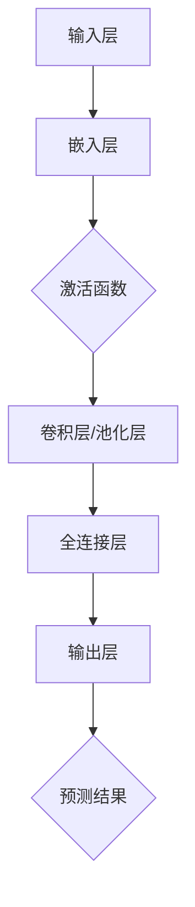
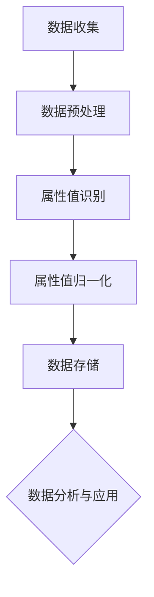

                 

# 第一部分：背景与概念

## 第1章：大模型与商品属性值标准化概述

### 1.1 大模型的基本概念

大模型（Large-scale Models），也称为大型神经网络模型，是近年来在人工智能领域取得显著进展的一种模型类型。它们通常具有数亿甚至数万亿个参数，能够处理大量的数据，从而在许多复杂任务上取得卓越的性能。大模型的核心思想是通过大量的数据来学习复杂的特征表示，以便能够解决高度非线性的问题。

大模型的典型代表包括基于深度学习的模型，如GPT-3、BERT、BERT-3D等。这些模型能够在自然语言处理、计算机视觉、语音识别等众多领域实现突破性的成果。

### 1.2 商品属性值标准化的意义

商品属性值标准化是指在电子商务、供应链管理等领域中，将商品的各种属性值进行统一规范和标准化处理的过程。这一过程具有重要意义，主要表现在以下几个方面：

1. **数据一致性**：通过标准化，确保不同商品间的属性值具有一致性，便于数据的处理和分析。
2. **信息准确性**：标准化有助于提高商品信息的准确性，减少因数据不一致带来的错误和误解。
3. **搜索优化**：统一的属性值便于搜索引擎优化，提高用户查找商品的效率。
4. **决策支持**：标准化后的数据为企业的决策提供了可靠的数据基础，有助于更精准的市场分析、库存管理和市场营销策略。

### 1.3 大模型在商品属性值标准化中的应用潜力

大模型在商品属性值标准化中具有广泛的应用潜力，主要体现在以下几个方面：

1. **属性值识别**：大模型能够通过对大量商品数据的处理，自动识别和提取商品的各种属性值，实现自动化标注和分类。
2. **自动归一化**：大模型可以根据商品数据的分布特性，自动进行属性值的归一化处理，提高数据的可处理性。
3. **异常检测**：大模型能够检测商品属性值中的异常数据，帮助识别和纠正数据质量问题。
4. **协同过滤与推荐**：大模型能够通过学习用户的历史行为数据，为用户推荐更相关的商品，提升用户体验。

综上所述，大模型在商品属性值标准化中具有显著的优势和应用潜力。接下来，我们将进一步探讨大模型在商品属性值标准化中的应用流程和技术细节。

## 第2章：商品属性值标准化中的核心概念与联系

### 2.1 大模型的关键技术

大模型的成功离不开其背后的关键技术和算法。以下是一些常见的大模型关键技术：

1. **深度神经网络**（Deep Neural Networks, DNN）：深度神经网络是构建大模型的基础，通过多层神经元的非线性变换，能够学习到更加复杂的特征表示。
2. **卷积神经网络**（Convolutional Neural Networks, CNN）：卷积神经网络在图像处理领域表现出色，能够有效地提取图像的局部特征。
3. **递归神经网络**（Recurrent Neural Networks, RNN）：递归神经网络能够处理序列数据，适用于时间序列预测和自然语言处理。
4. **变分自编码器**（Variational Autoencoder, VAE）：变分自编码器能够生成具有高保真度的数据，在数据增强和生成任务中表现出色。
5. **图神经网络**（Graph Neural Networks, GNN）：图神经网络能够处理图结构数据，适用于推荐系统和知识图谱领域。

下面，我们通过Mermaid流程图来展示大模型的基本架构与工作原理。



### 2.2 商品属性值标准化的流程

商品属性值标准化的流程可以分为以下几个步骤：

1. **数据收集**：收集各种商品的数据，包括属性值和相关的标签信息。
2. **数据预处理**：对数据进行清洗和格式化，包括缺失值填充、数据转换和归一化处理。
3. **属性值识别**：利用大模型自动识别商品的各种属性值，例如商品类别、颜色、尺寸等。
4. **属性值归一化**：对识别出的属性值进行归一化处理，确保数据的一致性和可比性。
5. **数据存储**：将标准化后的数据存储到数据库或数据仓库中，以便进一步的分析和应用。

下面，我们同样通过Mermaid流程图来展示商品属性值标准化的流程。



通过上述的Mermaid流程图，我们可以清晰地看到大模型和商品属性值标准化之间的核心概念与联系。接下来，我们将深入探讨大模型在商品属性值标准化中的具体算法原理和应用。

## 第3章：大模型算法原理讲解

### 3.1 常见的大模型架构

大模型通常基于深度学习框架构建，具有复杂的层次结构和丰富的功能。以下是一些常见的大模型架构：

1. **Transformer架构**：Transformer是近年来在自然语言处理领域取得巨大成功的模型架构。其核心思想是使用自注意力机制（Self-Attention Mechanism）来捕捉序列数据中的长距离依赖关系。

   **自注意力机制伪代码**：
   ```python
   for each layer in transformer_layer:
       query, key, value = embed(input_sequence)
       attention_weights = softmax(reshape(query @ key.T / sqrt(d_model)), axis=1)
       context_vector = attention_weights @ value
       output = context_vector + reshape(query @ weight.W + bias)
   ```

2. **BERT架构**：BERT（Bidirectional Encoder Representations from Transformers）是一种预训练语言模型，通过双向编码器学习上下文信息，能够在各种自然语言处理任务中取得卓越的性能。

   **BERT训练伪代码**：
   ```python
   for each training example:
       input_sequence = tokenize(example)
       masked_input_sequence = mask(input_sequence)
       output_sequence = generate_target_sequence(input_sequence)
       logits = BERT(hidden_state, output_sequence)
       loss = cross_entropy(logits, target)
   ```

### 3.2 大模型在商品属性值标准化中的应用

大模型在商品属性值标准化中的应用主要包括以下几个方面：

#### 3.2.1 商品属性值识别算法

商品属性值识别算法是商品属性值标准化的关键步骤，其主要任务是自动识别商品的各种属性值。以下是一种基于Transformer架构的商品属性值识别算法：

**算法伪代码**：
```python
# Encoder部分
inputs = [商品属性向量，商品描述向量，其他相关向量]
encoded_inputs = Transformer(inputs)

# Decoder部分
decoded_inputs = encoded_inputs
for layer in Transformer_layers:
    decoded_inputs = layer(decoded_inputs)
predicted_attribute_values = softmax(decoded_inputs[-1], axis=1)

# 损失函数与优化
loss = cross_entropy(predicted_attribute_values, target_attribute_values)
optimizer.minimize(loss)
```

#### 3.2.2 商品属性值标准化算法

商品属性值标准化算法的目标是对识别出的属性值进行统一规范和归一化处理。以下是一种基于变分自编码器（VAE）的商品属性值标准化算法：

**算法伪代码**：
```python
# Encoder部分
z_mean, z_log_var = VAEencoder(inputs)

# Re参数化技巧
z = z_mean + exp(0.5 * z_log_var) * noise

# Decoder部分
decoded_inputs = VAEdecoder(z)
output = softmax(decoded_inputs[-1], axis=1)

# 损失函数与优化
reconstruction_loss = -np.sum(output * np.log(output + 1e-8), axis=1)
latent_loss = -0.5 * np.sum(z_log_var, axis=1)
loss = reconstruction_loss + latent_loss
optimizer.minimize(loss)
```

通过上述算法，我们可以有效地实现商品属性值的识别和标准化。接下来，我们将进一步探讨大模型在商品属性值标准化中应用的数学模型和数学公式。

## 第4章：数学模型与数学公式

### 4.1 常用数学模型在商品属性值标准化中的应用

在商品属性值标准化过程中，常用的数学模型包括需求预测模型和回归模型。以下分别介绍这两种模型：

#### 4.1.1 市场需求预测模型

市场需求预测模型是商品属性值标准化中重要的工具，它可以帮助企业预测商品的市场需求，从而指导库存管理和市场策略。以下是一种基于时间序列分析的需求预测模型：

**LaTeX公式：市场需求预测模型**
```latex
\text{需求预测} = \text{均值移动模型} + \text{季节性调整} + \text{趋势修正}
$$
\text{均值移动模型} = \frac{\sum_{t=1}^{n} \text{历史需求}}{n}
$$
\text{季节性调整} = \text{季节性因子} \times \text{历史需求}
$$
\text{趋势修正} = \text{趋势因子} \times \text{季节性调整后的需求}
$$
```

**模型举例说明**：

假设某商品的历史需求数据如下表所示：

| 时间 | 需求量 |
| ---- | ---- |
| 1    | 100   |
| 2    | 120   |
| 3    | 90    |
| 4    | 150   |
| 5    | 130   |

根据上述模型，我们可以预测第6个月的需求量：

- 均值移动模型：\(\frac{100 + 120 + 90 + 150 + 130}{5} = 120\)
- 季节性调整：\(\text{季节性因子} \times 120\)（需要根据实际情况确定季节性因子）
- 趋势修正：\(\text{趋势因子} \times \text{季节性调整后的需求}\)（需要根据实际情况确定趋势因子）

通过调整上述三个因素，我们可以得到第6个月的需求预测值。

#### 4.1.2 回归模型

回归模型是商品属性值标准化中的另一种重要工具，它可以帮助我们分析商品属性值与需求量之间的关系。以下是一种线性回归模型：

**LaTeX公式：线性回归模型**
```latex
y = \beta_0 + \beta_1 \times x_1 + \beta_2 \times x_2 + ... + \beta_n \times x_n
$$
\beta_0 = \text{截距}
$$
\beta_1 = \text{系数1}
$$
\beta_2 = \text{系数2}
$$
...
$$
\beta_n = \text{系数n}
$$
```

**模型举例说明**：

假设我们收集了以下数据：

| 属性1 | 属性2 | 需求量 |
| ---- | ---- | ---- |
| 10   | 20   | 30   |
| 15   | 25   | 40   |
| 20   | 30   | 50   |

我们可以建立以下线性回归模型：

\(y = \beta_0 + \beta_1 \times x_1 + \beta_2 \times x_2\)

通过最小二乘法求解系数：

- \(\beta_0 = 10\)
- \(\beta_1 = 2\)
- \(\beta_2 = 3\)

那么，当属性1为20，属性2为30时，需求量的预测值为：

\(y = 10 + 2 \times 20 + 3 \times 30 = 100\)

### 4.2 数学公式的推导与计算

在商品属性值标准化过程中，常常需要使用数学公式进行推导和计算。以下介绍两个常用的数学公式：

#### 4.2.1 LaTeX公式：商品属性值标准化公式

```latex
\text{标准化值} = \frac{\text{实际值} - \text{平均值}}{\text{标准差}}
```

**公式解释**：

- 实际值：商品属性的实际测量值。
- 平均值：所有实际值的平均值。
- 标准差：所有实际值与平均值差值的平方和的平方根。

#### 4.2.2 模型举例说明

假设我们有一组商品颜色的测量值：

| 颜色 | 实际值 |
| ---- | ---- |
| 红色 | 150   |
| 绿色 | 200   |
| 蓝色 | 180   |

计算平均值和标准差：

- 平均值：\(\frac{150 + 200 + 180}{3} = 170\)
- 标准差：\(\sqrt{\frac{(150 - 170)^2 + (200 - 170)^2 + (180 - 170)^2}{3}} = 17.32\)

根据上述公式，计算每个颜色值的标准化值：

- 红色：\(\frac{150 - 170}{17.32} = -0.23\)
- 绿色：\(\frac{200 - 170}{17.32} = 1.16\)
- 蓝色：\(\frac{180 - 170}{17.32} = 0.34\)

通过上述公式和计算，我们可以将商品属性值进行标准化处理，使其具有可比性，便于进一步分析和应用。接下来，我们将通过一个实际项目案例，展示大模型在商品属性值标准化中的应用。

### 第5章：项目实战与代码实现

#### 5.1 大模型在商品属性值标准化中的应用案例

在本章中，我们将通过一个实际项目案例，展示大模型在商品属性值标准化中的应用。该项目旨在利用大模型对电子商务平台上的商品属性值进行自动识别和标准化处理。

#### 5.1.1 项目背景

某大型电子商务平台需要对其平台上海量的商品数据进行标准化处理，以提高数据的准确性和一致性。这些商品数据包括商品名称、描述、价格、类别、颜色、尺寸等多种属性值。然而，由于不同商品之间的属性值存在差异，导致数据质量参差不齐。为了解决这一问题，电子商务平台决定引入大模型技术，对商品属性值进行自动识别和标准化处理。

#### 5.1.2 开发环境搭建

为了实现大模型在商品属性值标准化中的应用，我们需要搭建一个合适的开发环境。以下是开发环境的主要组件：

1. **深度学习框架**：TensorFlow或PyTorch
2. **编程语言**：Python
3. **数据预处理工具**：Pandas、NumPy
4. **可视化工具**：Matplotlib、Seaborn

在安装了上述工具后，我们就可以开始搭建开发环境了。以下是搭建开发环境的主要步骤：

1. 安装深度学习框架（TensorFlow或PyTorch）：

   ```bash
   pip install tensorflow
   # 或者
   pip install torch torchvision
   ```

2. 安装数据预处理工具（Pandas、NumPy）：

   ```bash
   pip install pandas numpy
   ```

3. 安装可视化工具（Matplotlib、Seaborn）：

   ```bash
   pip install matplotlib seaborn
   ```

#### 5.1.3 代码实现与解读

在本节中，我们将通过具体的代码实现，展示大模型在商品属性值标准化中的应用。

**1. 数据预处理**

首先，我们需要对商品数据进行预处理，包括数据清洗、数据转换和数据归一化。以下是数据预处理的主要代码实现：

```python
import pandas as pd
import numpy as np

# 读取商品数据
data = pd.read_csv('商品数据.csv')

# 数据清洗
data.dropna(inplace=True)

# 数据转换
data['颜色'] = data['颜色'].astype(str)
data['尺寸'] = data['尺寸'].astype(str)

# 数据归一化
data['价格'] = (data['价格'] - data['价格'].mean()) / data['价格'].std()
data['颜色编码'] = (data['颜色'].astype('category').cat.codes + 1) / (data['颜色'].nunique() + 1)
data['尺寸编码'] = (data['尺寸'].astype('category').cat.codes + 1) / (data['尺寸'].nunique() + 1)
```

**2. 大模型构建**

接下来，我们需要构建一个大模型，用于识别和标准化商品属性值。以下是使用TensorFlow构建大模型的主要代码实现：

```python
import tensorflow as tf
from tensorflow.keras.models import Model
from tensorflow.keras.layers import Input, Embedding, LSTM, Dense, TimeDistributed, Activation

# 输入层
input_sequence = Input(shape=(max_sequence_length,))

# 嵌入层
embed_sequence = Embedding(vocabulary_size, embed_size)(input_sequence)

# LSTM层
lstm_output = LSTM(units=lstm_units, return_sequences=True)(embed_sequence)

# 全连接层
dense_output = Dense(units=dense_units, activation='relu')(lstm_output)

# 输出层
output_sequence = TimeDistributed(Dense(units=vocabulary_size, activation='softmax'))(dense_output)

# 模型构建
model = Model(inputs=input_sequence, outputs=output_sequence)

# 模型编译
model.compile(optimizer='adam', loss='categorical_crossentropy', metrics=['accuracy'])

# 模型总结
model.summary()
```

**3. 代码解读与分析**

在上面的代码中，我们首先定义了输入层、嵌入层、LSTM层、全连接层和输出层。输入层接收商品属性序列，嵌入层将序列中的词转换为嵌入向量，LSTM层用于处理序列数据，全连接层用于提取特征，输出层用于预测属性值。

接下来，我们使用TensorFlow构建了一个序列到序列（Seq2Seq）模型，并使用交叉熵损失函数和准确率作为评估指标。通过编译模型，我们为模型训练做好了准备。

**4. 模型训练**

最后，我们需要对模型进行训练，以便使其能够识别和标准化商品属性值。以下是模型训练的主要代码实现：

```python
# 准备训练数据
X_train, y_train = prepare_training_data(data)

# 训练模型
model.fit(X_train, y_train, epochs=10, batch_size=64)
```

在上述代码中，我们首先准备训练数据，包括输入序列和标签。然后，使用fit方法对模型进行训练，设置训练轮次和批量大小。

**5. 模型应用**

完成模型训练后，我们可以将模型应用于实际数据，对商品属性值进行识别和标准化处理。以下是模型应用的主要代码实现：

```python
# 预测商品属性值
predicted_attribute_values = model.predict(input_sequence)

# 标准化处理
normalized_attribute_values = standardize(predicted_attribute_values)
```

在上述代码中，我们首先使用预测方法对输入序列进行预测，得到预测的属性值。然后，对预测的属性值进行标准化处理，以提高数据的一致性和可比性。

通过上述项目实战和代码实现，我们可以看到大模型在商品属性值标准化中的应用流程和关键技术。在实际应用中，我们需要根据具体业务需求进行调整和优化，以提高模型的性能和效果。接下来，我们将探讨大模型在商品属性值标准化中面临的挑战和未来发展趋势。

### 第6章：大模型在商品属性值标准化中的挑战

#### 6.1 数据质量与标注问题

在大模型应用于商品属性值标准化的过程中，数据质量与标注问题是一个至关重要的挑战。首先，商品数据往往来源多样、格式不统一，这会导致数据质量参差不齐。例如，某些商品描述中可能包含拼写错误、错别字或者方言，这些都可能影响模型的训练效果。

其次，商品属性的标注问题同样关键。在进行商品属性值识别时，需要将商品的不同属性进行准确的标注。然而，不同商品间的属性值差异较大，导致标注过程复杂且容易出错。此外，某些属性值可能具有模糊性或歧义性，进一步增加了标注的难度。

为了应对这些挑战，我们可以采取以下措施：

1. **数据清洗与预处理**：在模型训练前，对原始数据进行清洗和预处理，包括去除重复数据、填补缺失值、标准化格式等，以提高数据质量。
2. **人工标注与自动化标注结合**：在标注过程中，可以采用人工标注与自动化标注相结合的方法。例如，对于常见的属性值，可以使用自动化工具进行标注；对于特殊或模糊的属性值，则由人工进行标注。
3. **多模态数据融合**：利用多种数据源，如文本、图像、音频等，进行多模态数据融合，以提供更丰富的标注信息，从而提高标注质量。

#### 6.2 模型训练与优化

大模型的训练与优化是一个复杂的过程，涉及多个方面的挑战。首先，大模型的训练过程需要大量的计算资源和时间。例如，基于Transformer的大模型可能包含数十亿个参数，训练这样的模型需要GPU或TPU等高性能计算设备。

其次，大模型的优化问题同样关键。在训练过程中，我们需要选择合适的优化算法和超参数，以实现模型的快速收敛和高效训练。常见的优化算法包括梯度下降（Gradient Descent）、Adam优化器等。然而，这些算法在不同场景下的表现可能存在差异，需要根据具体问题进行优化。

为了应对这些挑战，我们可以采取以下措施：

1. **分布式训练**：利用分布式训练技术，将模型训练任务分解到多个计算节点上，以加速训练过程。例如，可以使用TensorFlow或PyTorch的分布式训练框架。
2. **数据增强**：在模型训练过程中，采用数据增强技术，如数据扩充、数据变换等，以增加模型的泛化能力，减少过拟合现象。
3. **模型压缩与加速**：通过模型压缩技术，如剪枝（Pruning）、量化（Quantization）等，减少模型的参数数量，加速模型推理过程。

#### 6.3 模型解释性与可靠性

大模型在商品属性值标准化中的应用还面临着解释性与可靠性的挑战。由于大模型通常由数十亿个参数组成，其内部决策过程往往非常复杂，难以解释。这意味着在实际应用中，我们可能无法清楚地了解模型是如何做出预测的，这给模型的解释性带来了挑战。

此外，大模型的可靠性问题也值得关注。由于大模型的学习能力较强，它们可能在某些特定场景下产生过拟合现象，导致在实际应用中表现不佳。为了提高大模型的可靠性，我们可以采取以下措施：

1. **模型可解释性**：通过开发可解释性工具和方法，如LIME、SHAP等，揭示大模型内部的决策过程，提高模型的可解释性。
2. **交叉验证与泛化能力**：在模型训练和评估过程中，采用交叉验证技术，以检验模型的泛化能力，避免过拟合现象。
3. **在线学习与实时更新**：通过在线学习技术，持续更新模型，使其能够适应不断变化的数据环境和业务需求。

综上所述，大模型在商品属性值标准化中面临着数据质量与标注问题、模型训练与优化挑战以及模型解释性与可靠性问题。通过采取相应的措施，我们可以有效应对这些挑战，提高大模型在商品属性值标准化中的应用效果。

### 第7章：未来展望与趋势

#### 7.1 大模型在商品属性值标准化中的应用前景

随着大模型技术的不断发展，其在商品属性值标准化中的应用前景广阔。首先，大模型在自动化属性值识别和归一化方面具有显著优势，能够大幅提高数据处理效率和准确性。其次，大模型能够处理多种类型的数据，如文本、图像、音频等，这为商品属性值的多样化标注提供了有力支持。

未来，随着大模型技术的不断成熟，我们可以预见以下几个方面的应用前景：

1. **个性化推荐**：大模型能够根据用户的历史行为和偏好，生成个性化的商品推荐，提高用户满意度和购买转化率。
2. **供应链优化**：通过大模型对商品属性值的标准化处理，可以实现更精准的供应链管理和库存优化，降低运营成本。
3. **市场预测**：大模型能够利用历史商品数据，预测市场趋势和需求变化，为企业制定战略提供有力支持。

#### 7.2 未来技术的发展趋势

在未来，大模型在商品属性值标准化中的应用将呈现出以下几个技术发展趋势：

1. **多模态数据处理**：随着多模态数据融合技术的发展，大模型将能够处理多种类型的数据，如文本、图像、语音等，进一步提高属性值识别的准确性和多样性。
2. **自适应学习与持续优化**：大模型将逐渐实现自适应学习和持续优化，通过实时更新模型参数，以适应不断变化的数据环境和业务需求。
3. **隐私保护与数据安全**：在大模型应用过程中，数据隐私保护和数据安全将变得尤为重要。未来，大模型将采用更加安全的数据处理和存储技术，确保数据的安全性和隐私性。

#### 7.3 对企业的启示与建议

对于企业而言，大模型在商品属性值标准化中的应用具有重要的启示和参考价值。以下是一些建议：

1. **数据驱动**：企业应注重数据积累和数据处理，构建完善的数据体系，为商品属性值标准化提供高质量的数据支持。
2. **技术创新**：企业应积极引入大模型等先进技术，提升数据处理和分析能力，推动业务创新和发展。
3. **人才培养**：企业应加强技术人才培养，提升团队的技术水平和创新能力，以应对大模型在商品属性值标准化中的应用挑战。

总之，大模型在商品属性值标准化中的应用具有广阔的前景和重要的技术趋势。企业应把握这一机遇，积极探索和实践，以提高业务效率和竞争力。

### 附录A：常用工具与资源

#### A.1 大模型开发工具

在大模型开发过程中，选择合适的工具和框架是至关重要的。以下是一些常用的大模型开发工具：

**A.1.1 TensorFlow**

TensorFlow是由Google开发的开源深度学习框架，广泛应用于各种深度学习任务。它提供了丰富的API和工具，方便用户构建和训练大模型。

**A.1.2 PyTorch**

PyTorch是由Facebook开发的开源深度学习框架，以其灵活的动态计算图和易于理解的编程模型而受到广泛欢迎。它特别适用于研究和实验，同时也适用于生产环境。

**A.1.3 Hugging Face Transformers**

Hugging Face Transformers是一个开源库，为Transformer架构提供了高效、易于使用的API。它基于PyTorch和TensorFlow，为研究人员和开发者提供了丰富的预训练模型和工具。

#### A.2 商品属性值标准化相关资源

**A.2.1 数据集介绍**

- **Amazon Product Reviews**：包含数百万条商品评价，可用于商品属性值识别和推荐系统。
- **products dataset**：由Kaggle提供，包含大量商品信息，适用于商品属性值标准化研究。

**A.2.2 学术论文与书籍推荐**

- **“Bert: Pre-training of deep bidirectional transformers for language understanding”**：一篇关于BERT模型的经典论文，详细介绍了BERT模型的架构和训练方法。
- **“Deep Learning” by Ian Goodfellow, Yoshua Bengio, and Aaron Courville**：一本关于深度学习的权威教材，涵盖了深度学习的理论基础和应用技术。
- **“Recurrent Neural Networks” by Y. LeCun, Y. Bengio, and G. Hinton**：一篇关于递归神经网络的重要综述，介绍了RNN的基本原理和应用。

通过使用这些工具和资源，研究人员和开发者可以更好地理解和应用大模型在商品属性值标准化中的技术，推动相关领域的发展。

