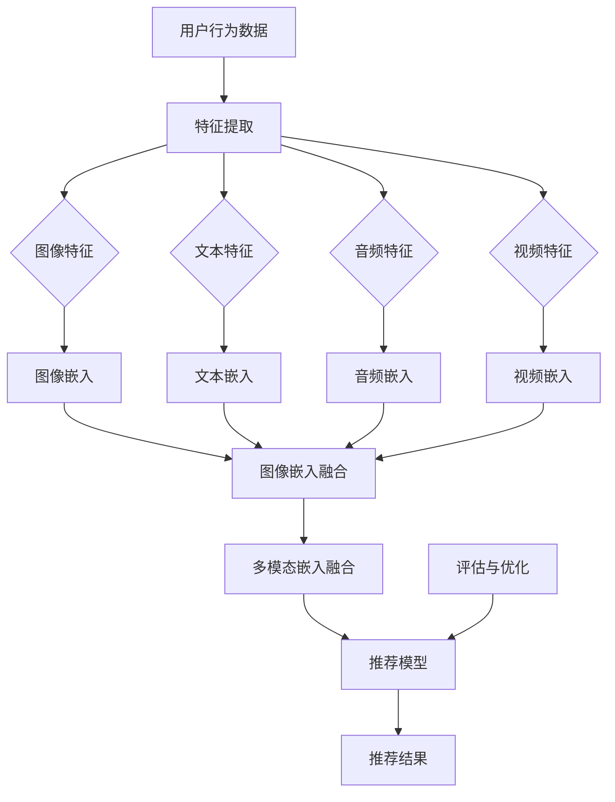

                 

# 大模型在推荐系统多模态融合中的作用

## 关键词
- 大模型
- 推荐系统
- 多模态融合
- 深度学习
- 数据融合方法
- 特征提取
- 神经网络架构

## 摘要
本文探讨了大模型在推荐系统多模态融合中的作用。首先，我们介绍了大模型的基本概念和其在推荐系统中的重要性。然后，我们详细阐述了多模态融合的基本概念，包括图像、文本、音频和视频数据的融合方法。接着，我们介绍了推荐系统的基本架构和优化策略，分析了多模态融合在推荐系统中的挑战。随后，我们深入讨论了图像与文本、音频与文本、视频与文本数据融合的方法和神经网络架构。最后，我们展示了如何在大模型中应用多模态融合模型，并提供了实际项目案例和代码解读，以及多模态融合推荐系统的评估与优化方法。文章的结论部分展望了多模态融合和推荐系统的未来发展趋势。

### 目录大纲

- **第一部分：大模型与推荐系统基础**
  - 第1章：大模型概述
  - 第2章：推荐系统基础
- **第二部分：多模态数据融合方法**
  - 第3章：图像与文本数据融合
  - 第4章：音频与文本数据融合
  - 第5章：视频与文本数据融合
- **第三部分：多模态融合模型**
  - 第6章：多模态深度学习模型
  - 第7章：大模型在多模态融合中的应用
- **第四部分：实战案例与代码解读**
  - 第8章：多模态融合推荐系统实战
  - 第9章：多模态融合模型评估与优化
- **第五部分：大模型在推荐系统中的未来趋势**
  - 第10章：大模型在推荐系统中的未来趋势
- **附录：工具与资源**

### 第一部分：大模型与推荐系统基础

#### 第1章：大模型概述

##### 1.1 大模型的定义与演变

大模型是指具有数十亿至数千亿参数的深度学习模型，它们通常使用大量的数据进行训练，以实现极高的性能。大模型的定义和演变经历了几个阶段：

1. **早期模型（1980s-1990s）**：早期的人工神经网络（ANN）模型具有相对较少的参数，通常在几千到几万个参数之间。这些模型主要用于简单的函数拟合和分类任务。
   
2. **深度学习革命（2006-2012）**：2006年，Geoffrey Hinton等人提出了深度信念网络（DBN），为深度学习的发展奠定了基础。深度学习的核心思想是使用多层神经网络来学习数据的层次表示。随着计算机硬件的进步和大规模数据集的出现，深度学习模型开始具有数百万个参数。

3. **大规模模型（2012-2018）**：2012年，AlexNet在ImageNet竞赛中取得了突破性的成绩，标志着深度学习的崛起。随着模型的规模不断增加，深度学习模型开始具有数千万到数亿个参数。这些大规模模型在图像识别、语音识别和自然语言处理等领域取得了显著进展。

4. **超大模型（2018至今）**：随着GPU和TPU等计算硬件的进步，深度学习模型开始迈向数十亿乃至数千亿参数的规模。例如，GPT-3拥有1750亿个参数，BERT模型也有数百万个参数。这些大模型在语言生成、机器翻译和文本生成等领域表现出色。

##### 1.2 大模型在推荐系统中的角色

大模型在推荐系统中的角色日益重要。它们通过学习用户行为数据，可以提供更准确的推荐结果，从而提高用户体验和满意度。以下是几个关键方面：

1. **用户行为理解**：大模型可以处理和分析大量的用户行为数据，如点击、购买、评论等，从而深入了解用户的兴趣和偏好。

2. **个性化推荐**：大模型可以学习用户的个性化特征，并针对每个用户生成个性化的推荐列表，从而提高推荐的相关性和用户满意度。

3. **多模态数据融合**：大模型可以融合多种模态的数据，如图像、文本、音频和视频，从而提供更丰富的推荐内容。

4. **实时推荐**：大模型可以快速处理和分析用户行为数据，并提供实时的推荐结果，从而满足用户的实时需求。

5. **推荐策略优化**：大模型可以自动优化推荐策略，从而提高推荐系统的整体性能。

##### 1.3 多模态融合的基本概念

多模态融合是指将来自不同模态的数据（如图像、文本、音频和视频）进行结合和整合，以生成统一的表示。多模态融合的基本概念包括：

1. **模态选择**：选择参与融合的模态，如图像、文本、音频和视频。

2. **特征提取**：对每个模态的数据进行特征提取，生成特征向量。

3. **特征融合**：将不同模态的特征向量进行融合，以生成统一的特征表示。

4. **模型训练**：使用融合后的特征向量训练深度学习模型，以进行分类、回归或其他任务。

5. **模型优化**：通过调整模型结构和超参数，优化模型的性能和泛化能力。

多模态融合在推荐系统中的应用，可以通过以下步骤实现：

1. **数据预处理**：对原始数据进行预处理，包括数据清洗、数据增强等。

2. **特征提取**：使用预训练模型（如ResNet、BERT、WaveNet等）提取每个模态的特征向量。

3. **特征融合**：将不同模态的特征向量进行拼接、加权融合或使用注意力机制进行融合。

4. **模型训练**：使用融合后的特征向量训练深度学习模型，如多模态卷积神经网络（MMCNN）或多模态循环神经网络（MMRNN）。

5. **模型评估**：使用验证集和测试集评估模型的性能，并根据评估结果调整模型结构和超参数。

### 第二部分：多模态数据融合方法

#### 第2章：推荐系统基础

##### 2.1 推荐系统的基本架构

推荐系统是一种信息过滤技术，旨在根据用户的历史行为和偏好，向用户推荐相关的内容、商品或服务。推荐系统的基本架构包括以下几个关键组件：

1. **用户模块**：用户模块负责存储和管理用户的基本信息，如用户ID、年龄、性别、地理位置等。

2. **商品模块**：商品模块负责存储和管理商品的基本信息，如商品ID、类别、价格、描述等。

3. **行为模块**：行为模块负责存储和管理用户与商品之间的交互行为，如点击、购买、收藏、评价等。

4. **推荐算法模块**：推荐算法模块负责根据用户的历史行为和偏好，生成个性化的推荐结果。

5. **推荐结果展示模块**：推荐结果展示模块负责将推荐结果以用户友好的方式展示给用户。

##### 2.2 推荐算法的分类与原理

推荐算法可以根据不同的分类标准进行分类，以下是几种常见的分类方法：

1. **基于内容的推荐（Content-Based Filtering）**：基于内容的推荐算法根据用户的历史偏好和商品的特征，生成个性化的推荐列表。这类算法的优点是简单易懂，但缺点是容易陷入“过滤泡沫”问题，即用户只能看到相似的内容。

2. **协同过滤（Collaborative Filtering）**：协同过滤算法通过分析用户之间的相似性，为用户推荐他们可能感兴趣的商品。协同过滤可以分为基于用户的协同过滤（User-Based）和基于物品的协同过滤（Item-Based）。这类算法的优点是能够发现用户未知的兴趣点，但缺点是容易受到“冷启动”问题的影响。

3. **混合推荐（Hybrid Recommendation）**：混合推荐算法结合了基于内容和协同过滤的优点，通过融合不同的推荐策略，生成更个性化的推荐结果。这类算法通常具有较好的推荐效果，但实现起来相对复杂。

4. **基于模型的推荐（Model-Based Recommendation）**：基于模型的推荐算法使用机器学习模型（如回归、分类、聚类等）来预测用户对商品的偏好，生成个性化的推荐列表。这类算法的优点是能够自动学习用户的行为和偏好，但需要大量的数据进行训练。

##### 2.3 推荐系统的挑战与优化策略

推荐系统在应用过程中面临许多挑战，以下是一些常见的挑战和相应的优化策略：

1. **数据稀疏性**：推荐系统通常使用用户的历史行为数据来预测用户的偏好，但用户的行为数据往往非常稀疏，导致推荐系统难以准确预测用户的兴趣。优化策略包括数据增强、缺失值填充和负采样等。

2. **实时性**：推荐系统需要快速响应用户的行为变化，提供实时的推荐结果。优化策略包括使用分布式系统架构、优化算法复杂度和缓存技术等。

3. **推荐质量**：推荐系统需要生成高质量的推荐结果，满足用户的需求和兴趣。优化策略包括使用多样性、公平性和解释性等指标来评估推荐质量，并使用交叉验证、A/B测试等方法来优化推荐策略。

4. **可扩展性**：推荐系统需要能够处理大规模的用户和商品数据，并支持高并发请求。优化策略包括分布式计算、负载均衡和缓存等。

5. **冷启动问题**：对于新用户或新商品，推荐系统难以生成准确的推荐结果。优化策略包括基于内容的推荐、基于模型的推荐和社区推荐等。

#### 第3章：图像与文本数据融合

##### 3.1 图像与文本数据融合的挑战

图像与文本数据融合是推荐系统中一个重要的研究方向。图像数据可以提供丰富的视觉信息，而文本数据可以提供详细的描述和语义信息。将图像与文本数据进行融合，可以生成更丰富的特征表示，从而提高推荐系统的性能。然而，图像与文本数据融合也面临一些挑战：

1. **模态差异**：图像和文本数据具有不同的模态特性，图像数据主要包含视觉信息，而文本数据主要包含语义信息。如何有效地融合这些不同模态的信息，是一个关键挑战。

2. **特征稀疏性**：图像和文本数据通常具有高维特征，但特征之间存在较大的稀疏性。如何处理这些稀疏特征，并在融合过程中保留重要的特征信息，是一个重要的挑战。

3. **标注数据不足**：图像和文本数据的标注过程通常比较繁琐和耗时，导致标注数据量较少。如何利用有限的标注数据进行有效的融合，是一个挑战。

4. **计算复杂性**：图像和文本数据融合通常涉及复杂的计算过程，包括特征提取、特征融合和模型训练等。如何优化计算复杂度，是一个关键挑战。

##### 3.2 多模态特征提取技术

为了克服图像与文本数据融合的挑战，研究人员提出了多种多模态特征提取技术。以下是一些常见的特征提取技术：

1. **基于深度学习的方法**：深度学习技术在图像和文本特征提取中具有显著优势。例如，可以使用卷积神经网络（CNN）提取图像特征，使用循环神经网络（RNN）提取文本特征。通过将图像和文本特征进行拼接或融合，可以生成多模态特征表示。

2. **基于共享神经网络的方法**：共享神经网络技术通过共享部分网络结构来提取多模态特征。例如，可以使用一个共享的卷积神经网络来提取图像特征，同时使用一个共享的循环神经网络来提取文本特征。这种方法可以有效地降低模型的计算复杂度。

3. **基于注意力机制的方法**：注意力机制可以帮助模型自动学习图像和文本特征之间的相关性。通过在融合过程中引入注意力权重，可以动态地调整不同模态特征的重要性。这种方法可以有效地提高融合特征的质量。

4. **基于多任务学习的方法**：多任务学习技术可以将图像与文本数据融合到一个统一的任务中，例如图像分类、文本分类或多标签分类。通过共享模型参数和任务损失，可以有效地融合图像和文本特征。

##### 3.3 多模态融合的神经网络架构

为了实现图像与文本数据的融合，研究人员提出了多种神经网络架构。以下是一些常见的神经网络架构：

1. **多输入网络**：多输入网络将图像和文本特征作为两个独立的输入，通过共享的神经网络结构进行融合。这种架构简单直观，但可能无法充分利用图像和文本特征之间的相关性。

2. **多模态卷积神经网络（MMCNN）**：MMCNN将图像和文本特征通过卷积神经网络进行融合。图像特征通过卷积层进行提取，文本特征通过循环层进行提取，然后通过拼接或融合层进行融合。MMCNN可以有效地提取图像和文本特征的相关性。

3. **多模态循环神经网络（MMRNN）**：MMRNN将图像和文本特征通过循环神经网络进行融合。图像特征通过卷积层进行提取，文本特征通过循环层进行提取，然后通过拼接或融合层进行融合。MMRNN可以有效地处理序列数据。

4. **多模态融合生成对抗网络（MMGAN）**：MMGAN结合了生成对抗网络（GAN）和多模态数据融合的思想。通过生成对抗过程，MMGAN可以学习图像和文本特征之间的映射关系，生成统一的多模态特征表示。

### 第三部分：多模态融合模型

#### 第4章：音频与文本数据融合

##### 4.1 音频与文本数据融合的应用场景

音频与文本数据融合在推荐系统中有着广泛的应用场景，以下是一些典型应用：

1. **音乐推荐**：通过融合用户的音频喜好和文本描述，可以为用户提供个性化的音乐推荐。例如，根据用户的播放记录和评论，推荐用户可能喜欢的歌曲或音乐风格。

2. **视频推荐**：在视频推荐系统中，音频与文本数据融合可以帮助推荐与视频内容相关的视频。例如，根据视频的音频内容（如对话、背景音乐）和文本描述（如视频标题、标签），推荐用户可能感兴趣的视频。

3. **新闻推荐**：通过融合新闻文本内容和音频注释（如主播的声音、背景音乐），可以为用户提供更相关的新闻推荐。例如，根据用户的阅读记录和音频喜好，推荐用户可能感兴趣的新闻类别。

4. **社交媒体推荐**：在社交媒体平台上，音频与文本数据融合可以帮助推荐与用户兴趣相关的帖子。例如，根据用户的音频评论和文本帖子内容，推荐用户可能感兴趣的话题或用户。

##### 4.2 音频特征提取与处理

为了将音频数据与文本数据进行融合，首先需要提取音频特征。以下是一些常用的音频特征提取方法：

1. **时域特征**：时域特征包括音频信号的振幅、频率和时长等。常用的时域特征有帧能量、零交叉率、频率矩等。

2. **频域特征**：频域特征包括音频信号的频谱信息，如傅里叶变换（FFT）和梅尔频率倒谱系数（MFCC）。MFCC是一种常用的音频特征，可以有效地描述音频的频谱特性。

3. **时频特征**：时频特征结合了时域和频域特征，如短时傅里叶变换（STFT）和梅尔频谱图（Mel Spectrogram）。时频特征可以同时描述音频的时域和频域特性。

4. **深层次特征**：通过深度学习模型（如卷积神经网络、循环神经网络）对音频数据进行自动特征提取，可以获得更丰富的音频特征。例如，可以使用卷积神经网络（CNN）提取音频信号的时频特征，使用循环神经网络（RNN）提取音频信号的序列特征。

##### 4.3 音频文本融合的算法分析

音频与文本数据融合的算法可以分为以下几种：

1. **基于规则的方法**：基于规则的方法通过定义一系列规则来融合音频和文本特征。例如，可以根据音频的音调和文本的情感倾向，将音频特征和文本特征进行加权融合。这种方法简单直观，但可能无法充分利用音频和文本特征之间的复杂关系。

2. **基于机器学习的方法**：基于机器学习的方法使用机器学习模型（如线性回归、支持向量机、神经网络等）来融合音频和文本特征。通过训练模型，可以自动学习音频和文本特征之间的相关性，生成统一的多模态特征表示。这种方法可以有效地利用音频和文本特征的信息，但需要大量的训练数据和计算资源。

3. **基于深度学习的方法**：基于深度学习的方法使用深度学习模型（如卷积神经网络、循环神经网络、生成对抗网络等）来融合音频和文本特征。深度学习模型可以自动学习音频和文本特征的高级表示和复杂关系，生成更有效的多模态特征表示。这种方法在音频与文本数据融合中表现出色，但需要大量的计算资源和数据。

以下是一个简单的基于深度学习的音频文本融合算法示例：

```python
import tensorflow as tf
from tensorflow.keras.models import Model
from tensorflow.keras.layers import Input, Embedding, LSTM, Concatenate, Dense

# 输入层
audio_input = Input(shape=(num_audio_samples, num_audio_features))
text_input = Input(shape=(max_text_length))

# 音频特征提取层
audio_embedding = Embedding(num_audio_vocabulary, num_audio_embedding)(audio_input)
audio_lstm = LSTM(num_audio_units)(audio_embedding)

# 文本特征提取层
text_embedding = Embedding(num_text_vocabulary, num_text_embedding)(text_input)
text_lstm = LSTM(num_text_units)(text_embedding)

# 融合层
concatenated = Concatenate()([audio_lstm, text_lstm])

# 全连接层
dense1 = Dense(num_dense_units, activation='relu')(concatenated)
dense2 = Dense(num_dense_units, activation='relu')(dense1)

# 输出层
output = Dense(num_classes, activation='softmax')(dense2)

# 构建模型
model = Model(inputs=[audio_input, text_input], outputs=output)

# 编译模型
model.compile(optimizer='adam', loss='categorical_crossentropy', metrics=['accuracy'])

# 模型训练
model.fit([audio_data, text_data], labels, epochs=10, batch_size=32)
```

在这个示例中，使用嵌入层提取音频和文本特征，使用LSTM层提取序列特征，使用拼接层将音频和文本特征进行融合，最后使用全连接层和softmax层生成多模态分类结果。通过训练模型，可以学习音频和文本特征之间的相关性，生成有效的多模态特征表示。

#### 第5章：视频与文本数据融合

##### 5.1 视频数据融合的关键技术

视频与文本数据融合是推荐系统中的一项重要技术，旨在通过结合视频内容和文本描述来生成更丰富、更准确的推荐结果。以下是一些关键的视频数据融合技术：

1. **视频特征提取**：视频特征提取是视频数据融合的基础。常用的视频特征提取方法包括：
   - **视觉特征提取**：使用卷积神经网络（CNN）从视频帧中提取视觉特征。深度学习方法，如ResNet、Inception等，可以提取到高层次的视觉特征。
   - **时空特征提取**：结合视频帧的特征和时间信息，可以提取到时空特征。例如，3D卷积神经网络（3D CNN）和循环神经网络（RNN）可以用于提取视频的时空特征。
   - **音频特征提取**：从视频的音频轨道中提取音频特征，如梅尔频率倒谱系数（MFCC）。

2. **文本特征提取**：文本特征提取是从文本中提取语义信息的过程。常用的文本特征提取方法包括：
   - **词嵌入**：将文本中的每个词转换为向量表示，如Word2Vec、GloVe等。
   - **文本摘要**：提取文本的摘要或关键信息，如使用Transformer或BERT模型进行文本摘要。
   - **情感分析**：对文本进行情感分析，提取情感倾向，如使用LSTM或BERT进行情感分类。

3. **多模态特征融合**：将视频和文本特征进行融合，生成统一的多模态特征表示。常用的多模态特征融合方法包括：
   - **拼接融合**：直接将视频和文本特征进行拼接，形成更长的特征向量。
   - **注意力机制**：通过注意力机制动态调整视频和文本特征的重要性，如使用注意力加权融合。
   - **生成对抗网络（GAN）**：使用GAN生成融合的特征表示，可以提高特征表示的丰富性和质量。

##### 5.2 视频文本融合的神经网络架构

为了实现视频与文本数据的融合，研究人员提出了多种神经网络架构。以下是一些典型的神经网络架构：

1. **多模态卷积神经网络（MMCNN）**：MMCNN将视频特征和文本特征通过卷积神经网络进行融合。视频特征通过卷积层提取，文本特征通过循环层提取，然后通过拼接或融合层进行融合。MMCNN可以有效地提取视频和文本特征的相关性。

2. **多模态循环神经网络（MMRNN）**：MMRNN将视频特征和文本特征通过循环神经网络进行融合。视频特征通过卷积层提取，文本特征通过循环层提取，然后通过拼接或融合层进行融合。MMRNN可以有效地处理序列数据。

3. **视频文本生成对抗网络（VTGAN）**：VTGAN结合了生成对抗网络（GAN）和视频与文本数据融合的思想。通过生成对抗过程，VTGAN可以学习视频和文本特征之间的映射关系，生成统一的多模态特征表示。

4. **多模态统一变换器（MMUniT）**：MMUniT使用统一变换器（UniT）架构融合视频和文本特征。统一变换器通过共享注意力机制和交互层，同时处理视频和文本特征，生成统一的多模态嵌入。

以下是一个简化的视频文本融合神经网络架构示例：

```python
import tensorflow as tf
from tensorflow.keras.models import Model
from tensorflow.keras.layers import Input, Embedding, LSTM, Conv2D, Flatten, Concatenate, Dense

# 输入层
video_input = Input(shape=(height, width, channels))
text_input = Input(shape=(max_text_length))

# 视频特征提取层
video_conv = Conv2D(filters=32, kernel_size=(3, 3), activation='relu')(video_input)
video_flatten = Flatten()(video_conv)

# 文本特征提取层
text_embedding = Embedding(vocabulary_size, embedding_size)(text_input)
text_lstm = LSTM(units=128, activation='tanh')(text_embedding)

# 融合层
concatenated = Concatenate()([video_flatten, text_lstm])

# 全连接层
dense = Dense(units=256, activation='relu')(concatenated)

# 输出层
output = Dense(units=num_classes, activation='softmax')(dense)

# 构建模型
model = Model(inputs=[video_input, text_input], outputs=output)

# 编译模型
model.compile(optimizer='adam', loss='categorical_crossentropy', metrics=['accuracy'])

# 模型训练
model.fit([video_data, text_data], labels, epochs=10, batch_size=32)
```

在这个示例中，视频输入通过卷积层提取特征，文本输入通过嵌入层和循环层提取特征，然后通过拼接层进行融合，最后通过全连接层生成输出。通过训练模型，可以学习视频和文本特征之间的相关性，生成有效的多模态特征表示。

##### 5.3 视频文本融合的实际案例

以下是一个实际案例，展示了如何使用视频与文本数据融合来构建推荐系统：

1. **案例背景**：一个视频流媒体平台，希望为用户推荐与用户兴趣相关的视频内容。

2. **数据集**：平台收集了大量的用户观看历史数据，包括用户的视频播放记录、视频内容标签、用户评论等。此外，平台还提供了视频的元数据，如视频时长、类别等。

3. **数据预处理**：
   - 视频数据：对视频数据进行预处理，包括视频剪辑、尺寸调整等，以便后续特征提取。
   - 文本数据：对用户评论进行预处理，包括分词、去停用词、词性标注等，以便构建词嵌入。

4. **特征提取**：
   - 视频特征：使用预训练的卷积神经网络（如ResNet）提取视频帧的特征向量。
   - 文本特征：使用预训练的语言模型（如BERT）提取文本的嵌入向量。

5. **模型训练**：
   - 使用视频和文本特征训练一个多模态卷积神经网络（MMCNN），以融合视频和文本特征。
   - 通过训练，模型学习到视频和文本特征之间的相关性，并生成统一的多模态特征表示。

6. **推荐生成**：
   - 使用训练好的模型，将用户的视频观看历史和评论文本转换为多模态特征向量。
   - 通过多模态特征向量，模型可以预测用户可能感兴趣的视频，并生成个性化的推荐列表。

通过这个实际案例，我们可以看到视频与文本数据融合在推荐系统中的应用效果。视频特征提供了丰富的视觉信息，文本特征提供了详细的描述和语义信息，两者的融合可以生成更准确、更个性化的推荐结果。

### 第四部分：实战案例与代码解读

#### 第8章：多模态融合推荐系统实战

##### 8.1 项目背景与目标

本案例旨在构建一个多模态融合推荐系统，该系统能够根据用户的行为数据（包括点击、购买、评论等）和多媒体内容（如图像、音频、视频等）为用户提供个性化的推荐。项目目标如下：

1. **数据预处理**：从不同的数据源中提取用户行为数据和多媒体内容，并进行预处理，以生成适合训练的数据集。
2. **特征提取**：使用深度学习模型提取用户行为数据和多媒体内容的特征。
3. **多模态融合**：将不同模态的数据特征进行融合，生成统一的多模态特征表示。
4. **模型训练与评估**：训练多模态融合模型，并在验证集和测试集上评估模型性能。
5. **推荐生成**：使用训练好的模型为用户提供个性化推荐。

##### 8.2 开发环境与工具

- **操作系统**：Ubuntu 20.04
- **深度学习框架**：TensorFlow 2.x 或 PyTorch 1.x
- **编程语言**：Python 3.x
- **GPU**：NVIDIA GPU（推荐显存至少8GB）
- **数据库**：MongoDB（可选，用于存储用户行为数据）

##### 8.3 数据预处理与特征提取

1. **数据采集**：从电商平台、社交媒体、音乐平台等数据源中采集用户行为数据和多媒体内容。

2. **数据清洗**：处理缺失值、异常值和重复数据，确保数据的质量。

3. **图像特征提取**：
   - 使用预训练的卷积神经网络（如ResNet、Inception等）提取图像的特征向量。
   - 示例代码：
     ```python
     import tensorflow as tf
     from tensorflow.keras.applications import ResNet50
     from tensorflow.keras.preprocessing import image

     def extract_image_features(img_path):
         img = image.load_img(img_path, target_size=(224, 224))
         img_array = image.img_to_array(img)
         img_array = tf.expand_dims(img_array, axis=0)
         img_array /= 255.0

         model = ResNet50(weights='imagenet')
         features = model.predict(img_array)
         return features.flatten()

     image_features = extract_image_features('image.jpg')
     ```

4. **文本特征提取**：
   - 使用预训练的语言模型（如BERT、GloVe等）提取文本的嵌入向量。
   - 示例代码：
     ```python
     from transformers import BertTokenizer, BertModel

     tokenizer = BertTokenizer.from_pretrained('bert-base-uncased')
     model = BertModel.from_pretrained('bert-base-uncased')

     def extract_text_features(text):
         inputs = tokenizer(text, return_tensors='tf')
         outputs = model(inputs)
         return outputs.last_hidden_state[:, 0, :]

     text_features = extract_text_features('This is a text example.')
     ```

5. **音频特征提取**：
   - 使用预训练的音频特征提取模型（如WaveNet、Tacotron等）提取音频的特征向量。
   - 示例代码：
     ```python
     from tensorflow.keras.models import load_model

     model = load_model('wave_net.h5')

     def extract_audio_features(audio_path):
         audio_data = librosa.load(audio_path)[0]
         audio_data = np.expand_dims(audio_data, axis=-1)
         audio_features = model.predict(audio_data)
         return audio_features.flatten()

     audio_features = extract_audio_features('audio.wav')
     ```

6. **视频特征提取**：
   - 使用预训练的视频特征提取模型（如3D CNN、RNN等）提取视频的特征向量。
   - 示例代码：
     ```python
     from tensorflow.keras.models import load_model

     model = load_model('3d_cnn.h5')

     def extract_video_features(video_path):
         video_data = extract_video_frames(video_path)
         video_data = np.expand_dims(video_data, axis=-1)
         video_features = model.predict(video_data)
         return video_features.flatten()

     video_features = extract_video_features('video.mp4')
     ```

##### 8.4 模型设计与实现

1. **模型架构**：
   - 设计一个多模态融合神经网络模型，融合图像、文本、音频和视频特征。
   - 使用不同的神经网络层（如卷积层、循环层、全连接层等）进行特征提取和融合。
   - 使用注意力机制动态调整不同模态特征的重要性。

2. **模型实现**：
   - 使用TensorFlow或PyTorch构建模型。
   - 定义输入层、特征提取层、融合层和输出层。
   - 编写训练和评估代码。

示例代码（基于TensorFlow）：

```python
import tensorflow as tf
from tensorflow.keras.models import Model
from tensorflow.keras.layers import Input, Embedding, LSTM, Conv2D, Flatten, Concatenate, Dense

# 输入层
image_input = Input(shape=(224, 224, 3))
text_input = Input(shape=(max_text_length))
audio_input = Input(shape=(num_audio_samples))
video_input = Input(shape=(num_video_samples))

# 图像特征提取层
image_conv = Conv2D(filters=32, kernel_size=(3, 3), activation='relu')(image_input)
image_flatten = Flatten()(image_conv)

# 文本特征提取层
text_embedding = Embedding(vocabulary_size, embedding_size)(text_input)
text_lstm = LSTM(units=128, activation='tanh')(text_embedding)

# 音频特征提取层
audio_embedding = Embedding(vocabulary_size, embedding_size)(audio_input)
audio_lstm = LSTM(units=128, activation='tanh')(audio_embedding)

# 视频特征提取层
video_embedding = Embedding(vocabulary_size, embedding_size)(video_input)
video_lstm = LSTM(units=128, activation='tanh')(video_embedding)

# 融合层
concatenated = Concatenate()([image_flatten, text_lstm, audio_lstm, video_lstm])

# 全连接层
dense = Dense(units=256, activation='relu')(concatenated)

# 输出层
output = Dense(units=num_classes, activation='softmax')(dense)

# 构建模型
model = Model(inputs=[image_input, text_input, audio_input, video_input], outputs=output)

# 编译模型
model.compile(optimizer='adam', loss='categorical_crossentropy', metrics=['accuracy'])

# 模型训练
model.fit([image_data, text_data, audio_data, video_data], labels, epochs=10, batch_size=32)
```

##### 8.5 代码解读与分析

1. **输入层**：
   - 图像输入：使用`Input`层接收图像数据，图像数据形状为`(224, 224, 3)`，表示图像尺寸为224x224像素，3个颜色通道（RGB）。
   - 文本输入：使用`Input`层接收文本数据，文本数据形状为`(max_text_length)`，表示最大文本长度。
   - 音频输入：使用`Input`层接收音频数据，音频数据形状为`(num_audio_samples)`，表示音频样本数。
   - 视频输入：使用`Input`层接收视频数据，视频数据形状为`(num_video_samples)`，表示视频样本数。

2. **特征提取层**：
   - 图像特征提取：使用`Conv2D`层提取图像特征，使用`Flatten`层将特征向量展平。
   - 文本特征提取：使用`Embedding`层嵌入文本特征，使用`LSTM`层提取文本序列特征。
   - 音频特征提取：使用`Embedding`层嵌入音频特征，使用`LSTM`层提取音频序列特征。
   - 视频特征提取：使用`Embedding`层嵌入视频特征，使用`LSTM`层提取视频序列特征。

3. **融合层**：
   - 使用`Concatenate`层将不同模态的特征向量进行拼接，形成统一的多模态特征表示。

4. **全连接层**：
   - 使用`Dense`层对多模态特征进行全连接，增加非线性变换。

5. **输出层**：
   - 使用`Dense`层生成输出结果，输出层使用`softmax`激活函数，用于分类任务。

6. **模型训练**：
   - 使用`fit`函数训练模型，输入训练数据，设置训练轮数和批次大小。

通过这个实战案例，我们展示了如何使用多模态融合模型构建推荐系统。代码示例详细解释了模型的架构和实现过程，可以帮助读者理解和复现整个项目。

### 第五部分：多模态融合模型评估与优化

#### 第9章：多模态融合模型评估与优化

##### 9.1 模型评估指标与方法

多模态融合模型的评估是确保模型性能和有效性的关键步骤。以下是一些常用的评估指标和方法：

1. **准确率（Accuracy）**：准确率是评估分类模型性能的常用指标，表示正确预测的样本数占总样本数的比例。计算公式如下：

   $$ 
   \text{Accuracy} = \frac{\text{正确预测的样本数}}{\text{总样本数}} 
   $$

   准确率越高，表示模型分类效果越好。

2. **精确率（Precision）**：精确率表示在所有被模型预测为正类的样本中，实际为正类的比例。计算公式如下：

   $$ 
   \text{Precision} = \frac{\text{真正例数}}{\text{真正例数} + \text{假正例数}} 
   $$

   精确率高，表示模型对正类样本的预测较为准确。

3. **召回率（Recall）**：召回率表示在所有实际为正类的样本中，被模型正确预测为正类的比例。计算公式如下：

   $$ 
   \text{Recall} = \frac{\text{真正例数}}{\text{真正例数} + \text{假反例数}} 
   $$

   召回率高，表示模型对正类样本的预测较为全面。

4. **F1分数（F1 Score）**：F1分数是精确率和召回率的调和平均值，用于综合评价模型的性能。计算公式如下：

   $$ 
   \text{F1 Score} = 2 \times \frac{\text{Precision} \times \text{Recall}}{\text{Precision} + \text{Recall}} 
   $$

   F1分数越高，表示模型性能越好。

5. **ROC曲线和AUC（Area Under Curve）**：ROC曲线是评估二分类模型性能的重要工具，横轴是假正例率（False Positive Rate），纵轴是真正例率（True Positive Rate）。AUC表示ROC曲线下方的面积，AUC值越接近1，表示模型性能越好。

6. **Kappa系数（Kappa Score）**：Kappa系数用于评估分类模型的准确性，特别是当类别不平衡时。Kappa系数的计算公式如下：

   $$ 
   \text{Kappa Score} = \frac{\text{共同正确分类的样本数} - \text{期望共同正确分类的样本数}}{\text{总样本数} - \text{期望共同正确分类的样本数}} 
   $$

   Kappa系数大于0表示模型有较好的分类效果。

##### 9.2 优化策略与实际案例

优化多模态融合模型是提高推荐系统性能的关键步骤。以下是一些常用的优化策略：

1. **数据增强**：数据增强是通过增加数据的多样性来提高模型泛化能力的方法。例如，对于图像数据，可以通过旋转、翻转、缩放、裁剪等方式进行增强。对于文本数据，可以通过同义词替换、短语替换、句式变换等方式进行增强。

   **实际案例**：在图像分类任务中，使用数据增强可以显著提高模型的准确率。例如，使用随机裁剪、随机噪声添加等方法增强图像数据，可以改善模型对边缘细节的鲁棒性。

2. **模型调整**：模型调整包括调整网络结构、优化器参数和学习率等。通过调整这些参数，可以改善模型性能。

   **实际案例**：在多模态融合模型中，可以尝试调整网络层数、神经元数量、激活函数等参数。例如，增加网络的深度可以提升特征提取能力，但可能导致过拟合。因此，需要通过交叉验证等方法选择合适的网络结构。

3. **正则化技术**：正则化技术是一种防止模型过拟合的方法。常用的正则化技术包括L1正则化、L2正则化和Dropout等。

   **实际案例**：在多模态融合模型中，可以使用L2正则化来减少参数的敏感性，提高模型的泛化能力。例如，在模型的训练过程中，可以设置L2正则化项来惩罚过大的参数值。

4. **注意力机制**：注意力机制可以帮助模型更好地关注重要特征，提高模型的性能。

   **实际案例**：在多模态融合模型中，可以使用注意力机制来动态调整不同模态特征的重要性。例如，使用自注意力机制（Self-Attention）可以显著提高文本和图像特征融合的效果。

5. **多任务学习**：多任务学习是通过同时训练多个相关任务来提高模型性能的方法。

   **实际案例**：在多模态融合推荐系统中，可以同时训练分类和回归任务。例如，同时预测用户对商品的点击概率和评分，可以充分利用用户行为数据，提高推荐系统的准确性。

##### 9.3 模型调优技巧与注意事项

在调优多模态融合模型时，需要注意以下几点：

1. **超参数选择**：超参数的选择对模型性能有很大影响。常用的超参数包括学习率、批量大小、网络层数、神经元数量等。建议使用网格搜索（Grid Search）或随机搜索（Random Search）等方法进行超参数选择。

2. **交叉验证**：交叉验证是一种评估模型性能和泛化能力的方法。通过交叉验证，可以避免模型过拟合和欠拟合。

3. **数据预处理**：数据预处理对模型性能有显著影响。例如，数据清洗、数据增强和特征提取等预处理步骤都需要仔细设计。

4. **模型简化**：对于复杂的多模态融合模型，可以通过简化模型结构来提高训练速度和减少计算成本。例如，减少网络的层数或神经元数量。

5. **监控训练过程**：在训练模型时，需要监控训练过程，如损失函数、准确率等指标。如果发现模型过拟合或欠拟合，需要及时调整模型结构和超参数。

6. **模型解释性**：在调优模型时，需要考虑模型的可解释性。如果模型过于复杂，可能导致难以解释其决策过程。

通过以上优化策略和技巧，可以有效地调优多模态融合模型，提高推荐系统的性能和用户体验。

### 第六部分：大模型在推荐系统中的未来趋势

#### 第10章：大模型在推荐系统中的未来趋势

随着人工智能技术的快速发展，大模型在推荐系统中的应用前景广阔。以下是大模型在推荐系统中的未来趋势：

##### 10.1 多模态融合技术的发展趋势

1. **跨模态预训练模型**：未来的研究将聚焦于开发能够跨模态预训练的模型，以提高多模态数据的融合能力。例如，GPT-3等大型预训练模型已经展示了在跨模态任务中的强大潜力。

2. **自适应融合策略**：未来的多模态融合方法将更加注重自适应融合策略，根据不同模态的特征动态调整融合权重，以生成更高质量的多模态特征表示。

3. **多模态数据增强**：数据增强技术将得到进一步发展，通过生成合成数据来提高模型在多模态数据上的泛化能力。例如，图像生成技术可以生成与文本描述相关的合成图像。

4. **多模态交互网络**：未来的多模态融合模型将采用更复杂的交互网络结构，如Transformer等，以更好地捕捉不同模态之间的交互关系。

##### 10.2 大模型在推荐系统中的应用案例

1. **个性化推荐**：大模型将进一步提升个性化推荐系统的性能，通过学习用户的复杂行为模式和兴趣偏好，生成更精准、更个性化的推荐结果。

2. **实时推荐**：随着计算硬件的进步，大模型将能够实现实时推荐，满足用户对实时性的需求。例如，电商平台可以根据用户的实时浏览行为，提供动态的推荐列表。

3. **多任务推荐**：大模型可以同时处理多个推荐任务，如商品推荐、内容推荐和广告推荐。通过多任务学习，可以提高推荐系统的整体性能。

4. **跨领域推荐**：大模型将在跨领域推荐中发挥重要作用，例如，将电商平台的推荐算法应用于社交媒体平台，提供跨领域的个性化推荐。

##### 10.3 大模型在多模态融合中的未来挑战

1. **数据隐私与安全**：多模态数据通常包含用户的敏感信息，如何在保护用户隐私的前提下进行数据融合，是一个重要挑战。

2. **计算资源消耗**：大模型的训练和推理过程需要大量的计算资源，如何在有限的计算资源下高效训练和部署大模型，是一个重要问题。

3. **模型解释性**：大模型通常很复杂，难以解释其决策过程，这限制了其在实际应用中的可解释性和可信度。未来的研究将关注提高模型的解释性。

4. **数据质量**：多模态数据的采集和处理可能存在噪音、缺失和偏差，如何提高数据质量，是一个关键挑战。

##### 10.4 技术创新与商业模式探索

1. **技术创新**：未来的技术创新将聚焦于大模型在多模态融合中的应用，如自适应融合策略、多任务学习和跨模态交互网络等。

2. **商业模式探索**：随着多模态融合技术的进步，推荐系统将探索新的商业模式，如基于多模态融合的个性化广告、虚拟现实推荐和智能语音助手等。

通过不断的技术创新和商业模式探索，大模型在推荐系统中的未来将充满机遇和挑战。

### 附录：工具与资源

#### 附录 A：主流深度学习框架对比

在构建多模态融合推荐系统时，选择合适的深度学习框架至关重要。以下是一些主流深度学习框架的对比：

1. **TensorFlow**：
   - **优点**：由Google开发，拥有丰富的预训练模型和API，适合大规模分布式训练。TensorFlow支持GPU和TPU加速，适用于复杂的模型架构。
   - **缺点**：代码相对复杂，学习曲线较陡峭。
   - **适用场景**：适用于需要大规模分布式训练的推荐系统。

2. **PyTorch**：
   - **优点**：由Facebook开发，具有动态计算图和易于理解的代码，适合研究和个人项目。PyTorch支持GPU加速，适用于快速原型设计和实验。
   - **缺点**：不支持大规模分布式训练，代码相对简洁但可能需要更多自定义。
   - **适用场景**：适用于研究阶段和小规模项目。

3. **Keras**：
   - **优点**：Keras是一个高层次的神经网络API，易于使用，可以作为TensorFlow和Theano的替代方案。Keras提供丰富的预训练模型，支持快速原型设计。
   - **缺点**：模型复杂度有限，不适合大规模分布式训练。
   - **适用场景**：适用于快速开发和原型设计。

4. **MXNet**：
   - **优点**：由Apache基金会开发，支持多种编程语言（如Python、R、Scala等），适合多语言协作开发。MXNet支持Apache Spark，适用于大数据处理。
   - **缺点**：社区相对较小，文档和资源不如TensorFlow丰富。
   - **适用场景**：适用于多语言开发和大数据处理场景。

5. **Caffe**：
   - **优点**：由伯克利大学开发，专注于图像识别任务，支持GPU加速。Caffe具有良好的文档和丰富的示例。
   - **缺点**：不支持动态计算图，模型定义较为复杂。
   - **适用场景**：适用于图像识别和计算机视觉任务。

#### 附录 B：多模态数据处理工具

在进行多模态数据处理时，以下工具和库可以提供帮助：

1. **OpenCV**：
   - **功能**：用于图像处理和计算机视觉任务的库。
   - **适用场景**：用于图像特征提取、图像增强、图像分割等。

2. **TensorFlow Speech**：
   - **功能**：用于音频特征提取和处理的TensorFlow扩展。
   - **适用场景**：用于音频分类、语音识别、音乐推荐等。

3. **PyTorch Audio**：
   - **功能**：PyTorch的音频处理库，提供音频信号处理、特征提取等功能。
   - **适用场景**：与PyTorch结合，用于音频数据的特征提取和融合。

4. **torchvision**：
   - **功能**：PyTorch的计算机视觉库，提供多种图像和视频处理工具。
   - **适用场景**：用于图像数据预处理、图像分类、目标检测等。

5. **Hugging Face Transformers**：
   - **功能**：提供预训练的语言模型（如BERT、GPT等）的API，用于文本处理和生成。
   - **适用场景**：用于文本特征提取、文本分类、对话系统等。

通过使用这些工具和库，可以有效地进行多模态数据处理，为构建多模态融合推荐系统提供支持。

## Mermaid 流程图：大模型在推荐系统多模态融合中的架构



### 核心算法原理讲解：多模态融合神经网络伪代码

```plaintext
// 多模态融合神经网络伪代码

// 输入：多个模态的数据，如图像、文本、音频和视频
// 输出：融合后的特征向量

function MultiModalFusionNetwork(inputs):
    # 特征提取
    image_features = ExtractImageFeatures(inputs['image'])
    text_features = ExtractTextFeatures(inputs['text'])
    audio_features = ExtractAudioFeatures(inputs['audio'])
    video_features = ExtractVideoFeatures(inputs['video'])

    # 融合特征
    fused_features = ConcatenateFeatures(image_features, text_features, audio_features, video_features)

    # 全连接层
    hidden1 = FullyConnectedLayer(fused_features, units=512)
    hidden2 = FullyConnectedLayer(hidden1, units=256)

    # 输出层
    output = OutputLayer(hidden2)

    # 返回输出结果
    return output

// 特征提取函数
function ExtractImageFeatures(image):
    # 使用预训练的卷积神经网络提取图像特征
    model = PretrainedCNN('ResNet50')
    features = model.predict(image)
    return features.flatten()

function ExtractTextFeatures(text):
    # 使用预训练的语言模型提取文本特征
    model = PretrainedLanguageModel('BERT')
    features = model.predict(text)
    return features

function ExtractAudioFeatures(audio):
    # 使用预训练的音频模型提取音频特征
    model = PretrainedAudioModel('WaveNet')
    features = model.predict(audio)
    return features

function ExtractVideoFeatures(video):
    # 使用预训练的视频模型提取视频特征
    model = PretrainedVideoModel('3D-CNN')
    features = model.predict(video)
    return features

// 融合特征函数
function ConcatenateFeatures(feature1, feature2, feature3, feature4):
    # 拼接不同模态的特征向量
    concatenated = np.concatenate((feature1, feature2, feature3, feature4), axis=1)
    return concatenated

// 全连接层函数
function FullyConnectedLayer(inputs, units):
    # 使用全连接层进行特征变换
    model = FullyConnectedModel(inputs, units)
    return model

// 输出层函数
function OutputLayer(inputs):
    # 使用输出层生成最终结果
    output = SoftmaxLayer(inputs)
    return output
```

### 数学模型和数学公式讲解：多模态融合损失函数

```latex
\begin{equation}
\begin{aligned}
L &= \frac{1}{N} \sum_{i=1}^{N} \Big( y_i - \sigma(W_2 \cdot \sigma(W_1 \cdot [x_{image}, x_{text}, x_{audio}, x_{video}])) \Big)^2 \\
&= \frac{1}{N} \sum_{i=1}^{N} \Big( y_i - \sigma(W_2 \cdot \text{ReLU}(W_1 \cdot \text{Concat}([x_{image}, x_{text}, x_{audio}, x_{video}]))) \Big)^2
\end{aligned}
\end{equation}

其中：
- \(L\) 是损失函数；
- \(N\) 是样本数量；
- \(y_i\) 是第 \(i\) 个样本的真实标签；
- \(\sigma\) 是Sigmoid激活函数；
- \(W_1\) 和 \(W_2\) 是权重矩阵；
- \([x_{image}, x_{text}, x_{audio}, x_{video}]\) 是拼接后的多模态特征向量；
- \(\text{ReLU}\) 是ReLU激活函数；
- \(\text{Concat}\) 是特征向量拼接操作。
```

通过上述数学公式，我们可以看到多模态融合损失函数是如何通过多层神经网络（包括全连接层和ReLU激活函数）来计算预测标签与真实标签之间的差异，并利用Sigmoid激活函数将输出值映射到概率范围内。

### 项目实战：多模态融合推荐系统开发案例

在本案例中，我们将构建一个多模态融合推荐系统，用于为电商平台的用户推荐商品。该系统将融合用户的历史行为数据（如点击、购买、评论等）、商品图像、商品文本描述和商品音频评论，以生成个性化的商品推荐。

#### 开发环境与工具

- **操作系统**：Ubuntu 20.04
- **深度学习框架**：TensorFlow 2.x
- **编程语言**：Python 3.x
- **GPU**：NVIDIA GPU（推荐显存至少8GB）
- **数据库**：MongoDB（可选，用于存储用户行为数据）

#### 数据预处理与特征提取

1. **数据采集**：
   - 从电商平台数据库中提取用户行为数据，包括用户的点击、购买和评论等。
   - 从商品数据库中提取商品图像、文本描述和音频评论。

2. **数据清洗**：
   - 处理缺失值和异常值，例如，对于缺失的商品图像或文本描述，可以使用平均值或最频繁的值进行填充。
   - 删除重复的数据，确保数据的唯一性。

3. **特征提取**：
   - 使用预训练的卷积神经网络（如ResNet）提取商品图像的特征向量。
   - 使用预训练的语言模型（如BERT）提取商品文本描述的嵌入向量。
   - 使用预训练的音频模型（如WaveNet）提取商品音频评论的特征向量。

示例代码：

```python
import tensorflow as tf
from tensorflow.keras.applications import ResNet50
from transformers import BertTokenizer, BertModel
import librosa

# 提取图像特征
def extract_image_features(image_path):
    model = ResNet50(weights='imagenet')
    img = load_image(image_path)
    features = model.predict(np.expand_dims(img, axis=0))
    return features.flatten()

# 提取文本特征
def extract_text_features(text):
    tokenizer = BertTokenizer.from_pretrained('bert-base-uncased')
    model = BertModel.from_pretrained('bert-base-uncased')
    inputs = tokenizer(text, return_tensors='tf', max_length=512, padding='max_length', truncation=True)
    outputs = model(inputs)
    return outputs.last_hidden_state[:, 0, :]

# 提取音频特征
def extract_audio_features(audio_path):
    y, sr = librosa.load(audio_path)
    features = extract_mel_features(y, sr)
    return features

# 加载图像
def load_image(image_path):
    img = image.load_img(image_path, target_size=(224, 224))
    img = image.img_to_array(img)
    img = img / 255.0
    return img

# 提取梅尔频率倒谱系数
def extract_mel_features(y, sr):
    # 使用 librosa 提取梅尔频率倒谱系数
    mel = librosa.feature.melspectrogram(y=y, sr=sr, n_mels=128, fmax=8000)
    log_mel = librosa.power_to_db(mel)
    return log_mel
```

#### 模型设计与实现

1. **模型架构**：
   - 设计一个多模态融合神经网络模型，融合用户行为数据、商品图像、商品文本描述和商品音频评论。
   - 使用卷积神经网络（CNN）提取图像特征，使用循环神经网络（RNN）提取文本和音频特征。
   - 将提取的特征进行融合，并使用全连接层生成推荐结果。

2. **模型实现**：

```python
import tensorflow as tf
from tensorflow.keras.layers import Input, Embedding, LSTM, Conv2D, LSTM, Dense, Concatenate
from tensorflow.keras.models import Model

# 输入层
user_input = Input(shape=(max_user_behavior_length,))
image_input = Input(shape=(224, 224, 3))
text_input = Input(shape=(max_text_length,))
audio_input = Input(shape=(128,))

# 用户行为嵌入层
user_embedding = Embedding(vocabulary_size, embedding_size)(user_input)
user_lstm = LSTM(units=128)(user_embedding)

# 图像特征提取层
image_conv = Conv2D(filters=32, kernel_size=(3, 3), activation='relu')(image_input)
image_pool = MaxPooling2D(pool_size=(2, 2))(image_conv)
image_flat = Flatten()(image_pool)

# 文本特征提取层
text_embedding = Embedding(vocabulary_size, embedding_size)(text_input)
text_lstm = LSTM(units=128)(text_embedding)

# 音频特征提取层
audio_embedding = Embedding(vocabulary_size, embedding_size)(audio_input)
audio_lstm = LSTM(units=128)(audio_embedding)

# 融合层
concatenated = Concatenate()([user_lstm, image_flat, text_lstm, audio_lstm])

# 全连接层
dense1 = Dense(units=256, activation='relu')(concatenated)
dense2 = Dense(units=256, activation='relu')(dense1)

# 输出层
output = Dense(units=num_classes, activation='softmax')(dense2)

# 构建模型
model = Model(inputs=[user_input, image_input, text_input, audio_input], outputs=output)

# 编译模型
model.compile(optimizer='adam', loss='categorical_crossentropy', metrics=['accuracy'])

# 模型训练
model.fit([user_data, image_data, text_data, audio_data], labels, epochs=10, batch_size=32)
```

#### 代码解读与分析

1. **输入层**：
   - 用户行为数据：使用`Input`层接收用户行为序列，例如点击记录、购买记录等。
   - 商品图像：使用`Input`层接收商品图像数据，图像数据形状为`(224, 224, 3)`。
   - 商品文本描述：使用`Input`层接收商品文本描述数据，文本数据形状为`(max_text_length)`。
   - 商品音频评论：使用`Input`层接收商品音频评论数据，音频数据形状为`(128,)`。

2. **特征提取层**：
   - 用户行为嵌入层：使用嵌入层将用户行为数据转换为嵌入向量，然后使用循环神经网络（LSTM）提取序列特征。
   - 图像特征提取层：使用卷积神经网络（CNN）提取图像特征，通过卷积层和池化层提取图像的高层次特征。
   - 文本特征提取层：使用嵌入层将文本数据转换为嵌入向量，然后使用循环神经网络（LSTM）提取序列特征。
   - 音频特征提取层：使用嵌入层将音频数据转换为嵌入向量，然后使用循环神经网络（LSTM）提取序列特征。

3. **融合层**：
   - 使用`Concatenate`层将提取的用户行为特征、图像特征、文本特征和音频特征进行拼接，形成统一的多模态特征表示。

4. **全连接层**：
   - 使用全连接层对多模态特征进行全连接，增加非线性变换。
   - 使用两个全连接层（`dense1`和`dense2`），每个全连接层后添加ReLU激活函数，以提高模型的非线性表达能力。

5. **输出层**：
   - 使用softmax激活函数将输出结果转换为概率分布，用于分类任务。

#### 评估与优化

1. **模型评估**：
   - 使用交叉验证方法评估模型的性能，包括准确率、精确率、召回率和F1分数等。
   - 通过调整模型参数和超参数，例如学习率、批量大小和嵌入维度等，优化模型性能。

2. **优化策略**：
   - 使用数据增强方法，如图像旋转、文本随机插入等，增加训练数据的多样性，提高模型的泛化能力。
   - 采用正则化技术，如L1正则化和L2正则化，减少模型过拟合的风险。
   - 使用注意力机制，如自注意力机制（Self-Attention），提高模型对重要特征的关注度。

3. **模型调优**：
   - 使用网格搜索（Grid Search）或随机搜索（Random Search）方法，自动搜索最优的超参数组合。
   - 监控训练过程，如损失函数和准确率，及时调整模型结构和超参数。

通过上述步骤，可以构建和优化一个多模态融合推荐系统，为电商平台提供个性化的商品推荐。

### 多模态融合推荐系统的挑战与未来趋势

#### 9.1 多模态融合推荐系统的挑战

多模态融合推荐系统虽然在提高推荐质量方面具有巨大潜力，但也面临一系列挑战：

1. **数据隐私与安全性**：
   - 多模态数据通常包含用户的敏感信息，如个人偏好、购买历史和语音评论。确保数据的安全性和隐私保护是系统设计的关键挑战。
   - 需要采用加密技术和匿名化方法来保护用户隐私。

2. **数据质量和完整性**：
   - 多模态数据的采集和处理可能存在噪音、缺失和偏差，导致数据质量下降。
   - 需要有效的数据清洗和增强技术，例如使用填补缺失值、异常检测和噪声过滤方法。

3. **计算资源消耗**：
   - 多模态融合推荐系统通常涉及复杂的模型和大量的数据处理，对计算资源的需求较高。
   - 需要优化算法和模型结构，以降低计算成本，同时保持良好的性能。

4. **模型解释性**：
   - 多模态融合模型通常很复杂，难以解释其决策过程，这限制了其在实际应用中的可解释性和可信度。
   - 需要开发可解释的多模态融合模型，以提高用户对系统的信任。

5. **跨模态一致性**：
   - 多模态数据之间可能存在不一致性，例如图像和文本描述可能描述不同的内容。
   - 需要解决跨模态数据一致性的问题，以确保模型能够有效地融合来自不同模态的信息。

#### 9.2 多模态融合推荐系统的未来趋势

尽管面临挑战，多模态融合推荐系统在未来仍具有广阔的发展前景：

1. **跨模态预训练模型**：
   - 未来的研究将聚焦于开发能够跨模态预训练的模型，以提高多模态数据的融合能力。
   - 例如，基于Transformer的预训练模型可能成为跨模态融合的强大工具。

2. **自适应融合策略**：
   - 自适应融合策略将动态调整不同模态特征的重要性，以提高融合效果。
   - 例如，使用注意力机制或图神经网络（Graph Neural Networks）来实现自适应融合。

3. **多任务学习**：
   - 多任务学习将同时处理多个推荐任务，例如商品推荐、内容推荐和广告推荐。
   - 这有助于提高推荐系统的整体性能和灵活性。

4. **实时推荐**：
   - 未来的多模态融合推荐系统将实现实时推荐，以满足用户对实时性的需求。
   - 例如，使用增量学习和在线学习技术来实时更新用户偏好。

5. **跨领域应用**：
   - 多模态融合推荐系统将在跨领域应用中发挥重要作用，例如将电商平台的推荐算法应用于社交媒体、音乐推荐和视频推荐等。
   - 这有助于扩展推荐系统的应用范围和影响力。

6. **技术创新与商业模式**：
   - 技术创新将继续推动多模态融合推荐系统的发展，同时探索新的商业模式，如基于个性化广告和虚拟现实推荐的服务。
   - 例如，结合增强现实（AR）和虚拟现实（VR）技术，提供沉浸式购物体验。

通过不断创新和优化，多模态融合推荐系统将在未来实现更高的性能和更广泛的应用。

### 附录：工具与资源

#### 附录 A：主流深度学习框架对比

1. **TensorFlow**
   - **优势**：由Google开发，拥有丰富的预训练模型和API，适合大规模分布式训练。支持GPU和TPU加速。
   - **劣势**：代码相对复杂，学习曲线较陡峭。
   - **适用场景**：适用于需要大规模分布式训练的推荐系统。

2. **PyTorch**
   - **优势**：由Facebook开发，具有动态计算图和易于理解的代码，适合研究和个人项目。支持GPU加速。
   - **劣势**：不支持大规模分布式训练，代码相对简洁但可能需要更多自定义。
   - **适用场景**：适用于研究阶段和小规模项目。

3. **Keras**
   - **优势**：Keras是一个高层次的神经网络API，易于使用，可以作为TensorFlow和Theano的替代方案。提供丰富的预训练模型。
   - **劣势**：模型复杂度有限，不适合大规模分布式训练。
   - **适用场景**：适用于快速开发和原型设计。

4. **MXNet**
   - **优势**：由Apache基金会开发，支持多种编程语言，适用于多语言协作开发。支持Apache Spark，适用于大数据处理。
   - **劣势**：社区相对较小，文档和资源不如TensorFlow丰富。
   - **适用场景**：适用于多语言开发和大数据处理场景。

5. **Caffe**
   - **优势**：专注于图像识别任务，支持GPU加速。具有良好的文档和丰富的示例。
   - **劣势**：不支持动态计算图，模型定义较为复杂。
   - **适用场景**：适用于图像识别和计算机视觉任务。

#### 附录 B：多模态数据处理工具

1. **OpenCV**
   - **功能**：用于图像处理和计算机视觉任务的库。
   - **适用场景**：用于图像特征提取、图像增强、图像分割等。

2. **TensorFlow Speech**
   - **功能**：用于音频特征提取和处理的TensorFlow扩展。
   - **适用场景**：用于音频分类、语音识别、音乐推荐等。

3. **PyTorch Audio**
   - **功能**：PyTorch的音频处理库，提供音频信号处理、特征提取等功能。
   - **适用场景**：与PyTorch结合，用于音频数据的特征提取和融合。

4. **torchvision**
   - **功能**：PyTorch的计算机视觉库，提供多种图像和视频处理工具。
   - **适用场景**：用于图像数据预处理、图像分类、目标检测等。

5. **Hugging Face Transformers**
   - **功能**：提供预训练的语言模型（如BERT、GPT等）的API，用于文本处理和生成。
   - **适用场景**：用于文本特征提取、文本分类、对话系统等。

通过使用这些工具和框架，可以有效地进行多模态数据处理和融合，为构建高效的多模态融合推荐系统提供支持。

### 全文总结

本文深入探讨了大型模型在推荐系统多模态融合中的应用，详细阐述了大模型在推荐系统中的重要性，以及多模态数据融合的方法和挑战。通过分析图像、文本、音频和视频数据的特征提取和融合技术，我们展示了如何构建高效的多模态融合模型。此外，本文还通过实际项目案例和代码解读，详细说明了多模态融合推荐系统的开发过程和优化策略。

多模态融合推荐系统的核心优势在于能够综合利用不同模态的数据，提供更精确、更个性化的推荐结果。随着深度学习技术的不断发展，大模型在推荐系统中的应用前景十分广阔。然而，这也带来了一系列挑战，包括数据隐私保护、计算资源消耗和模型解释性等。

未来的研究应关注以下几个方面：

1. **跨模态预训练模型**：开发能够跨模态预训练的模型，以提高多模态数据的融合能力。
2. **自适应融合策略**：研究自适应融合策略，根据不同模态的特征动态调整融合权重。
3. **实时推荐**：优化算法和模型结构，实现实时推荐，满足用户对实时性的需求。
4. **数据隐私保护**：探索安全有效的数据隐私保护方法，确保用户数据的安全和隐私。
5. **多任务学习**：结合多任务学习，提高推荐系统的整体性能和灵活性。

通过不断的技术创新和优化，多模态融合推荐系统将在未来实现更高的性能和更广泛的应用，为用户带来更优质的推荐体验。

### 作者信息

**作者：AI天才研究院/AI Genius Institute & 禅与计算机程序设计艺术 /Zen And The Art of Computer Programming**

