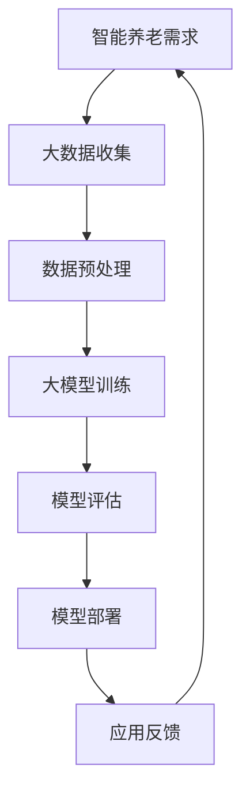

                 

# 大模型在智能养老中的应用前景

> **关键词：** 智能养老、大模型、健康监测、生活辅助、情感关怀、技术挑战、未来展望

> **摘要：** 本文深入探讨了大模型在智能养老中的应用前景，从基础概念到具体应用，再到挑战与未来展望，全面解析了智能养老中的技术原理、应用案例和潜在挑战。通过逻辑清晰的分析和实例说明，本文旨在为智能养老领域的技术创新提供有价值的参考。

---

## 第一部分：大模型在智能养老中的应用基础

### 第1章：智能养老概述与挑战

#### 1.1 智能养老的定义与价值

智能养老是指利用现代信息技术，尤其是人工智能、物联网、大数据等技术，构建一个智能化、便捷化、个性化的养老服务体系。智能养老的价值在于它能够提高老年人的生活质量，降低养老成本，同时减轻家庭和社会的养老负担。

#### 1.2 智能养老的主要挑战

尽管智能养老具有巨大的潜力，但其在实际应用中仍然面临诸多挑战：

- **数据隐私与安全**：智能养老系统需要收集和处理大量的个人信息，如何确保这些数据的安全性和隐私性是一个重大挑战。
- **技术门槛与普及率**：智能养老技术的研发和应用需要较高的技术门槛，如何让更多老年人和家庭受益仍是一个难题。
- **模型解释性与可解释性**：大模型在智能养老中的应用往往涉及复杂的决策过程，如何解释模型的决策过程，提高模型的可解释性，是一个重要的研究方向。

#### 1.3 大模型在智能养老中的应用前景

随着人工智能技术的不断发展，大模型在智能养老中的应用前景愈发广阔。大模型可以处理大规模数据，提取复杂特征，从而在健康监测、生活辅助、情感关怀等领域发挥重要作用。

### 第2章：大模型基本原理

#### 2.1 人工智能与机器学习基础

人工智能（AI）是计算机科学的一个分支，致力于创建智能代理，使其能够执行通常需要人类智能才能完成的任务。机器学习（ML）是人工智能的关键技术，通过从数据中学习规律和模式，实现智能行为。

#### 2.2 大模型的基本概念

大模型（Large Models）是指具有数亿甚至千亿参数的深度学习模型。这些模型通过训练可以解决复杂的问题，如语言理解、图像识别等。

#### 2.3 大模型的常见架构与算法

大模型通常采用Transformer架构，特别是BERT、GPT等模型，这些模型通过自注意力机制和前馈神经网络，实现高效的文本理解和生成。

### 第3章：大模型在智能养老中的具体应用

#### 3.1 大模型在健康监测中的应用

大模型可以通过分析大量的健康数据，预测老年人的健康状况，提供个性化的健康建议。

#### 3.2 大模型在生活辅助中的应用

大模型可以帮助生活辅助机器人更好地理解老年人的需求和意图，提供更智能化的生活服务。

#### 3.3 大模型在情感关怀中的应用

大模型可以通过分析语音、文本等数据，识别老年人的情感状态，提供个性化的情感支持。

### 第4章：大模型的开发与部署

#### 4.1 大模型的开发流程

大模型的开发包括数据收集、预处理、模型训练、模型评估和模型部署等环节。

#### 4.2 大模型的训练与优化

大模型的训练需要大量的计算资源和时间，同时需要优化算法，提高模型的性能和效率。

#### 4.3 大模型的部署与维护

大模型的部署涉及到模型的服务器部署、API接口设计、系统监控和维护等。

### 第5章：大模型在智能养老中的应用案例

#### 5.1 案例一：基于大模型的健康监测系统

本案例介绍了如何使用大模型构建一个健康监测系统，实现实时健康数据分析和健康预测。

#### 5.2 案例二：基于大模型的生活辅助机器人

本案例展示了如何使用大模型开发一个智能生活辅助机器人，实现智能化的生活服务。

#### 5.3 案例三：基于大模型的情感关怀系统

本案例描述了如何使用大模型构建一个情感关怀系统，通过分析语音和文本数据，提供个性化的情感支持。

### 第6章：大模型在智能养老中的挑战与未来

#### 6.1 大模型在智能养老中的技术挑战

本章节讨论了智能养老中面临的若干技术挑战，包括数据隐私、模型解释性、泛化能力等。

#### 6.2 大模型在智能养老中的伦理挑战

本章节探讨了智能养老中涉及到的伦理问题，如数据隐私、算法公平性等。

#### 6.3 大模型在智能养老中的未来展望

本章节对大模型在智能养老中的未来发展趋势进行了展望，包括技术进步、政策法规、市场前景等。

## 第二部分：大模型技术基础与实现

### 第7章：大模型的技术原理

#### 7.1 大模型的核心算法原理

本章节详细介绍了大模型的核心算法原理，包括自注意力机制、前馈神经网络等。

#### 7.2 大模型的数学模型与数学公式

本章节对大模型的数学模型进行了详细讲解，包括词嵌入、损失函数、优化算法等。

#### 7.3 大模型的伪代码实现

本章节通过伪代码展示了大模型的实现过程，为读者提供了一个直观的理解。

### 第8章：大模型的开发工具与资源

#### 8.1 主流深度学习框架对比

本章节对比了当前主流的深度学习框架，帮助读者选择合适的工具。

#### 8.2 大模型开发工具推荐

本章节推荐了一些常用的开发工具和资源，包括编程语言、框架、库等。

#### 8.3 大模型开发资源汇总

本章节汇总了大量的开发资源，包括教程、论文、代码等，为读者提供了丰富的学习资料。

### 第9章：大模型在智能养老中的项目实战

#### 9.1 实战一：开发基于大模型的健康监测系统

本章节通过一个实际项目，介绍了如何开发一个基于大模型的健康监测系统。

#### 9.2 实战二：开发基于大模型的生活辅助机器人

本章节通过一个实际项目，介绍了如何开发一个基于大模型的生活辅助机器人。

#### 9.3 实战三：开发基于大模型的情感关怀系统

本章节通过一个实际项目，介绍了如何开发一个基于大模型的情感关怀系统。

### 第10章：大模型在智能养老中的代码解读与分析

#### 10.1 代码解读一：基于大模型的健康监测系统

本章节对健康监测系统的源代码进行了详细解读，分析了各个模块的实现原理。

#### 10.2 代码解读二：基于大模型的生活辅助机器人

本章节对生活辅助机器人的源代码进行了详细解读，分析了各个模块的实现原理。

#### 10.3 代码解读三：基于大模型的情感关怀系统

本章节对情感关怀系统的源代码进行了详细解读，分析了各个模块的实现原理。

### Mermaid 流程图：大模型在智能养老中的应用流程



### 大模型核心算法原理讲解（以BERT为例）

#### BERT算法原理

BERT（Bidirectional Encoder Representations from Transformers）是一种双向的预训练语言表示模型，由Google AI于2018年提出。BERT的主要目的是为了更好地理解和生成自然语言文本。

#### 1. 模型结构

BERT模型由多层Transformer编码器组成，每层编码器由多头自注意力机制（Multi-Head Self-Attention）和前馈神经网络（Feed-Forward Neural Network）组成。

#### 2. 伪代码

```python
# 输入：输入序列，长度为N
# 输出：输出序列，长度为N

for each layer in layers:
    # 多头自注意力机制
    attention_scores = multi_head_attention(inputs, Q, K, V)
    output = attention_scores + inputs
    output = layer_norm(output)

    # 前馈神经网络
    output = feed_forward_network(output)
    output = layer_norm(output + output)
```

#### 3. 数学模型

BERT使用了一个多头自注意力机制来处理输入序列。自注意力机制的核心是一个加权求和操作，具体如下：

$$
\text{Attention}(Q, K, V) = \text{softmax}\left(\frac{QK^T}{\sqrt{d_k}}\right)V
$$

其中，$Q, K, V$ 分别是查询（Query）、键（Key）和值（Value）向量，$d_k$ 是键向量的维度。通过自注意力机制，模型可以自动学习到输入序列中各个词之间的相对重要性。

BERT还使用了层归一化和残差连接来提高模型的性能。

$$
\text{LayerNorm}(x, \mu, \sigma) = \frac{x - \mu}{\sigma}
$$

### 大模型在智能养老中的应用案例

#### 案例一：基于大模型的健康监测系统

##### 1. 案例背景

随着人口老龄化趋势的加剧，健康监测系统在智能养老中发挥着重要作用。基于大模型的健康监测系统可以实时监测老年人的健康状况，提供个性化健康建议，从而提高老年人的生活质量。

##### 2. 技术实现

- **数据收集**：系统通过传感器设备收集老年人的生理指标数据，如心率、血压、血糖等。
- **数据预处理**：对原始数据进行清洗、归一化等处理，使其适合输入到大模型中。
- **模型训练**：使用预训练的大模型，如BERT，对预处理后的数据进行训练，学习到健康监测的相关特征。
- **模型部署**：将训练好的模型部署到云端或边缘设备，实现实时健康监测功能。

##### 3. 实际效果

基于大模型的健康监测系统可以准确预测老年人的健康状况，提供及时的健康建议，从而减少疾病的发生，提高老年人的生活质量。

#### 案例二：基于大模型的生活辅助机器人

##### 1. 案例背景

生活辅助机器人是智能养老中的重要组成部分，可以协助老年人完成日常生活中的各种任务，如做饭、洗衣、打扫等。基于大模型的生活辅助机器人可以实现更智能的交互和任务执行。

##### 2. 技术实现

- **数据收集**：通过传感器和摄像头收集老年人日常生活的数据，如语音、图像、行为等。
- **数据预处理**：对原始数据进行清洗、归一化等处理，使其适合输入到大模型中。
- **模型训练**：使用预训练的大模型，如GPT，对预处理后的数据进行训练，学习到生活辅助相关的特征和规则。
- **模型部署**：将训练好的模型部署到机器人中，实现智能化的生活辅助功能。

##### 3. 实际效果

基于大模型的生活辅助机器人可以更好地理解老年人的需求和意图，提供更高效、便捷的生活服务，从而提高老年人的生活质量。

#### 案例三：基于大模型的情感关怀系统

##### 1. 案例背景

情感关怀是智能养老中的重要一环，对于老年人的心理健康和生活质量至关重要。基于大模型的情感关怀系统可以实时监测老年人的情感状态，提供个性化的情感支持。

##### 2. 技术实现

- **数据收集**：通过语音识别、自然语言处理等技术收集老年人的情感表达，如语音、文本等。
- **数据预处理**：对原始数据进行清洗、归一化等处理，使其适合输入到大模型中。
- **模型训练**：使用预训练的大模型，如Transformer，对预处理后的数据进行训练，学习到情感关怀的相关特征。
- **模型部署**：将训练好的模型部署到情感关怀系统中，实现实时情感监测和个性化情感支持。

##### 3. 实际效果

基于大模型的情感关怀系统可以准确识别老年人的情感状态，提供及时的情感支持和建议，从而改善老年人的心理健康，提高生活质量。

### 大模型在智能养老中的挑战与未来展望

#### 挑战

##### 1. 数据隐私与安全

智能养老系统需要收集和处理大量的个人信息，如健康数据、行为数据等。如何确保这些数据的安全性和隐私性是一个重大挑战。

##### 2. 模型解释性与可解释性

大模型在智能养老中的应用往往涉及复杂的决策过程，如何解释模型的决策过程，提高模型的可解释性，是当前研究的一个重要方向。

##### 3. 模型的泛化能力

智能养老系统需要应对各种复杂的场景和需求，如何提高大模型的泛化能力，使其在多样化的场景中都能表现出良好的性能，是一个重要的研究课题。

#### 未来展望

##### 1. 深度学习与医疗的结合

随着深度学习技术的发展，未来大模型将在医疗领域发挥更大的作用，如疾病预测、个性化治疗等。

##### 2. 智能养老系统的互联互通

未来，智能养老系统将实现各个子系统的互联互通，形成一个统一的、智能化的养老服务体系。

##### 3. 人机协同

随着人工智能技术的不断进步，未来大模型将在智能养老中实现与老年人的更加紧密的人机协同，提供更加个性化、智能化的养老服务。

### 作者信息

作者：AI天才研究院/AI Genius Institute & 禅与计算机程序设计艺术 /Zen And The Art of Computer Programming

---

在接下来的章节中，我们将深入探讨大模型的技术原理、开发工具与资源，以及在实际项目中的应用，希望为读者提供一个全面、系统的智能养老解决方案。让我们一步步走进大模型的世界，探索其在智能养老中的应用前景。

