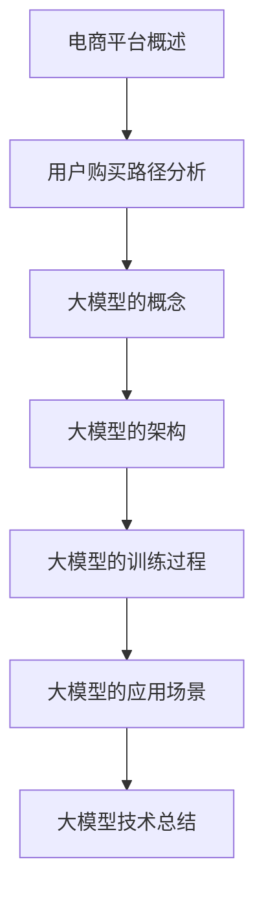
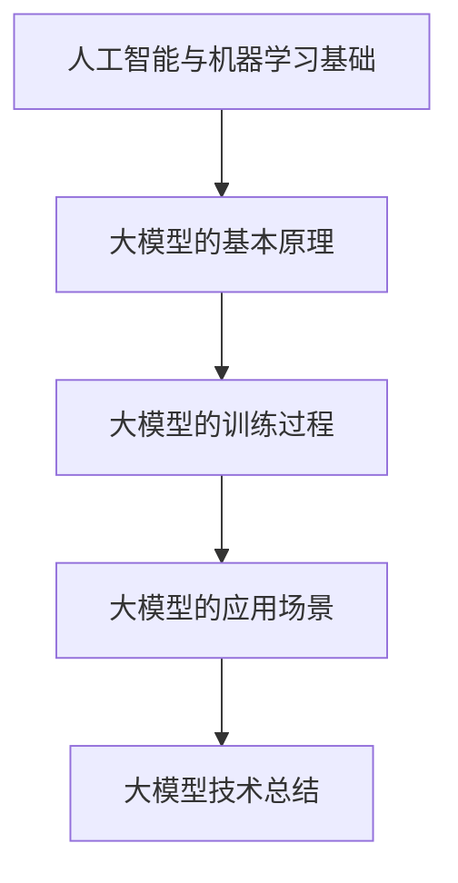
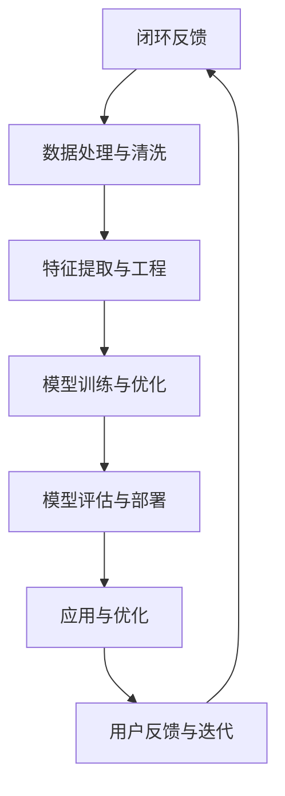
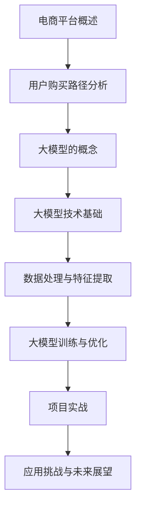

                 

# 大模型在电商平台用户购买路径分析中的应用

## 关键词
- 电商平台
- 用户购买路径分析
- 大模型
- 机器学习
- 人工智能
- 特征工程
- 个性化推荐
- 用户行为预测

## 摘要
本文旨在探讨大模型在电商平台用户购买路径分析中的应用。首先，我们介绍了电商平台的背景和用户购买路径分析的重要性，然后详细讲解了大模型的基本概念、架构和训练过程。接着，我们探讨了用户购买路径分析的核心技术，包括数据收集、特征工程和机器学习算法。随后，我们通过具体案例展示了大模型在用户购买路径分析中的实际应用，并分析了其效果。最后，我们讨论了大模型应用中的挑战和未来发展趋势，为电商平台提供了优化用户购买路径和提升销售转化率的策略。本文对于理解和应用大模型在电商领域具有重要意义。

## 引言

随着互联网和电子商务的快速发展，电商平台已经成为人们日常生活中不可或缺的一部分。电商平台不仅提供了便捷的购物体验，也为商家提供了一个广阔的销售渠道。然而，随着用户需求的多样化和市场竞争的加剧，电商平台面临着如何提升用户体验、提高销售转化率和优化运营策略等挑战。

用户购买路径分析作为一种重要的数据分析手段，可以帮助电商平台深入了解用户的购买行为和需求，从而优化用户体验、提升销售转化率和增加销售额。然而，传统的用户购买路径分析方法往往依赖于人工分析，效率较低，难以应对大规模数据和复杂业务场景的需求。

近年来，随着人工智能和机器学习技术的快速发展，大模型作为一种具有巨大参数量和强大计算能力的人工智能模型，逐渐在各个领域展现出强大的应用潜力。大模型在用户购买路径分析中的应用，不仅能够提高数据分析的精度和效率，还可以为电商平台提供更加智能化的决策支持。

本文旨在探讨大模型在电商平台用户购买路径分析中的应用，通过对大模型的基本原理、用户购买路径分析的核心技术以及实际应用案例的详细分析，为电商平台提供优化用户购买路径和提升销售转化率的策略。本文的结构如下：

- 第一部分：基础与概念，介绍电商平台的背景和用户购买路径分析的重要性，以及大模型的基本概念和特点。
- 第二部分：大模型技术基础，详细讲解大模型的架构、训练过程和应用场景。
- 第三部分：电商平台用户购买路径分析，介绍用户购买路径分析的核心技术，包括数据收集、特征工程和机器学习算法。
- 第四部分：技术实现与实战，通过具体案例展示大模型在用户购买路径分析中的应用，并分析其效果。
- 第五部分：大模型应用挑战与未来展望，讨论大模型应用面临的挑战和未来发展趋势，为电商平台提供优化策略。

通过本文的探讨，我们希望为电商平台提供一套科学、系统的用户购买路径分析方法，帮助电商平台更好地了解用户需求、优化用户体验、提升销售转化率和运营效率。

## 第一部分: 基础与概念

### 第1章: 背景与核心概念

#### 1.1 电商平台的概述

电商平台是指通过互联网为消费者和商家提供商品交易、支付、物流等服务的在线平台。随着互联网技术的不断发展和普及，电商平台已经成为现代社会购物的主要方式之一。电商平台的发展历程可以追溯到20世纪90年代，最初以简单的商品展示和在线交易为主，随着技术的进步和用户需求的增加，电商平台逐渐发展成为集商品展示、交易、支付、物流、用户评价等多种功能于一体的综合性服务平台。

#### 1.1.1 电商平台的起源与发展

电商平台的起源可以追溯到20世纪90年代，当时互联网刚刚兴起，电子商务逐渐成为商业活动的重要组成部分。最早的电商平台可以追溯到1991年，美国电商企业亚马逊（Amazon）的成立，标志着电商平台的诞生。随着互联网技术的不断进步，电商平台逐渐从简单的在线购物平台，发展成为集商品展示、交易、支付、物流、用户评价等多种功能于一体的综合性服务平台。

#### 1.1.2 电商平台的基本功能

电商平台的基本功能包括商品展示、商品交易、支付结算、物流配送、用户评价等。商品展示功能主要是通过图片、文字、视频等多种形式，向用户展示商品的信息。商品交易功能则是用户在电商平台上下单、购买商品的过程。支付结算功能是用户支付货款、卖家收款的过程。物流配送功能则是商品从卖家仓库到用户手中的过程。用户评价功能则是用户对商品和卖家服务进行评价的过程。

#### 1.1.3 电商平台的市场现状

电商平台的市场现状呈现出快速发展的态势。根据统计数据，全球电商市场在过去几年中保持着两位数的增长率。特别是在疫情期间，电商平台的销售额大幅增长，成为了许多消费者首选的购物方式。目前，电商平台主要分布在欧美、亚洲和拉美等地区，其中中国和美国的电商平台市场规模最大。

#### 1.2 大模型的概念

大模型是指具有巨大参数量的机器学习模型，通常用于解决复杂的数据分析和预测问题。大模型的参数量可以达到数十亿甚至更多，这使得它们能够处理大规模的数据集，并在多个领域中取得显著的性能。

#### 1.2.1 大模型的定义

大模型是指具有巨大参数量的机器学习模型，通常用于解决复杂的数据分析和预测问题。大模型的参数量可以达到数十亿甚至更多，这使得它们能够处理大规模的数据集，并在多个领域中取得显著的性能。

#### 1.2.2 大模型的特点

大模型具有以下几个特点：

1. **参数量大**：大模型通常具有数十亿甚至更多的参数，这使得它们能够学习到更加复杂的模式。
2. **计算需求高**：由于参数量大，大模型的训练和推理过程需要大量的计算资源。
3. **数据需求大**：大模型通常需要大量高质量的数据进行训练，以便学习到数据中的潜在规律。
4. **泛化能力强**：大模型在训练过程中能够捕捉到数据的多样性和复杂性，从而具有更强的泛化能力。

#### 1.2.3 大模型与电商平台的关系

大模型在电商平台中有广泛的应用，例如：

1. **个性化推荐**：通过分析用户的购买历史和行为，大模型可以推荐用户可能感兴趣的商品。
2. **用户行为预测**：大模型可以预测用户的购买意图和行为，帮助电商平台优化营销策略。
3. **商品价格预测**：大模型可以通过分析市场数据，预测商品的价格走势，帮助电商平台制定价格策略。

#### 1.3 用户购买路径分析

用户购买路径分析是指对用户在电商平台从浏览商品到完成购买的全过程进行数据分析和模型构建，以优化用户体验、提升销售转化率和增加销售额。

#### 1.3.1 用户购买路径的概念

用户购买路径是指用户在电商平台从浏览商品到完成购买的全过程。它包括用户在电商平台上的浏览、搜索、加入购物车、下单、支付等多个环节。

#### 1.3.2 用户购买路径分析的重要性

用户购买路径分析对于电商平台具有重要意义，主要包括：

1. **优化用户体验**：通过分析用户购买路径，电商平台可以识别用户在购买过程中遇到的问题，从而优化网站设计和用户界面，提升用户体验。
2. **提升销售转化率**：通过对用户购买路径的分析，电商平台可以识别出用户在购买过程中的关键节点，从而制定有效的营销策略，提升销售转化率。
3. **优化运营策略**：用户购买路径分析可以帮助电商平台优化库存管理、物流配送等运营策略，提高运营效率。

#### 1.3.3 用户购买路径分析的方法

用户购买路径分析的方法主要包括：

1. **数据分析方法**：通过数据分析方法，如用户行为数据分析、交易数据分析等，了解用户在购买过程中的行为特征。
2. **机器学习方法**：利用机器学习算法，如分类算法、聚类算法等，对用户购买路径进行建模和预测。
3. **用户体验调研**：通过用户调研，了解用户在购买过程中的需求和痛点，从而优化网站设计和用户界面。

### 1.4 大模型技术基础

大模型技术基础是电商平台用户购买路径分析的重要支撑。本节将介绍大模型的基本概念、架构和训练过程。

#### 1.4.1 大模型的基本概念

大模型是指具有巨大参数量的机器学习模型，通常用于解决复杂的数据分析和预测问题。大模型的参数量可以达到数十亿甚至更多，这使得它们能够处理大规模的数据集，并在多个领域中取得显著的性能。

#### 1.4.2 大模型的架构

大模型的架构通常包括以下几个部分：

1. **输入层**：接收外部输入数据，如文本、图像等。
2. **隐藏层**：多层神经网络，负责对输入数据进行处理和变换。
3. **输出层**：生成预测结果或分类标签。

#### 1.4.3 大模型的训练过程

大模型的训练过程主要包括以下几个步骤：

1. **数据预处理**：对输入数据进行预处理，如归一化、去噪等。
2. **模型初始化**：初始化模型参数，常用的方法有随机初始化、预训练模型初始化等。
3. **前向传播**：将输入数据传递到神经网络中，计算预测结果。
4. **反向传播**：根据预测结果和真实标签，计算损失函数，并通过反向传播算法更新模型参数。
5. **迭代训练**：重复前向传播和反向传播过程，直到模型收敛或达到预设的训练次数。

### 1.5 大模型的应用场景

大模型在电商平台用户购买路径分析中有广泛的应用场景，主要包括：

1. **个性化推荐**：通过分析用户的购买历史和行为，大模型可以推荐用户可能感兴趣的商品。
2. **用户行为预测**：大模型可以预测用户的购买意图和行为，帮助电商平台优化营销策略。
3. **商品价格预测**：大模型可以通过分析市场数据，预测商品的价格走势，帮助电商平台制定价格策略。

### 1.6 大模型在电商平台用户购买路径分析中的应用实例

#### 1.6.1 个性化推荐系统

个性化推荐系统是电商平台用户购买路径分析的重要应用之一。通过分析用户的购买历史和行为，大模型可以识别出用户的兴趣和偏好，从而为用户推荐可能感兴趣的商品。

#### 1.6.2 用户行为预测

用户行为预测可以帮助电商平台优化营销策略。通过分析用户的购买行为和需求，大模型可以预测用户的购买意图，从而为电商平台提供更加精准的营销建议。

#### 1.6.3 商品价格预测

商品价格预测可以帮助电商平台制定合理的价格策略。通过分析市场数据和用户购买行为，大模型可以预测商品的价格走势，从而为电商平台提供定价建议。

## 第一部分: 基础与概念

### 第2章: 大模型技术基础

#### 第2章 大模型技术基础

#### 2.1 大模型的概念和特点

**2.1.1 大模型的定义**

大模型（Big Model），通常指的是具有大规模参数的机器学习模型。这些模型能够在复杂的数据集上实现高效的训练和推理，解决诸如自然语言处理（NLP）、计算机视觉（CV）、推荐系统等复杂的任务。大模型的一个显著特征是其参数数量通常在数十亿到数万亿级别。

**2.1.2 大模型的特点**

- **参数量巨大**：大模型通常具有数十亿甚至数万亿个参数，这使得它们能够捕捉数据中的复杂模式和关联。
- **计算资源需求高**：由于参数数量庞大，大模型的训练和推理过程需要大量的计算资源和时间。
- **数据需求大**：为了训练出高质量的模型，大模型通常需要大量高质量的训练数据。
- **泛化能力强**：大模型通过学习大量数据中的潜在规律，能够更好地泛化到未见过的数据上。

**2.1.3 大模型的重要性**

大模型在人工智能领域的重要性体现在以下几个方面：

- **提升模型性能**：通过增加模型参数量，大模型能够在复杂任务上实现更高的准确性和性能。
- **处理大规模数据**：大模型能够高效地处理大规模数据集，这对于需要处理大量用户数据的电商平台尤为重要。
- **探索新领域**：大模型为探索新的数据分析和机器学习应用提供了可能，例如在医疗、金融、教育等领域。

#### 2.2 大模型的架构

**2.2.1 神经网络的基本结构**

神经网络是构建大模型的基础，其基本结构包括输入层、隐藏层和输出层。

- **输入层**：接收外部输入数据，如图像、文本等。
- **隐藏层**：多层神经网络，负责对输入数据进行处理和变换。
- **输出层**：生成预测结果或分类标签。

**2.2.2 深层神经网络**

深层神经网络（Deep Neural Network, DNN）是指具有多个隐藏层的神经网络。深层神经网络能够通过逐层学习，从输入数据中提取出更高级别的特征，从而提高模型的性能。

**2.2.3 卷积神经网络（CNN）**

卷积神经网络是一种专门用于处理图像数据的神经网络模型。它通过卷积操作提取图像特征，适用于计算机视觉任务，如图像分类、目标检测等。

**2.2.4 循环神经网络（RNN）**

循环神经网络是一种能够处理序列数据的神经网络模型。它通过记忆单元来存储历史信息，适用于自然语言处理、语音识别等任务。

**2.2.5 变压器（Transformer）**

变压器（Transformer）是一种基于自注意力机制的神经网络模型，广泛用于处理序列数据，特别是在NLP任务中表现出色。变压器通过多头注意力机制，能够捕捉数据中的长距离依赖关系。

**2.3 大模型的训练过程**

**2.3.1 数据预处理**

在训练大模型之前，需要对输入数据进行预处理，包括数据清洗、去噪、归一化等操作，以确保数据的质量和一致性。

**2.3.2 模型初始化**

模型初始化是训练大模型的重要步骤。常见的初始化方法包括随机初始化、预训练模型初始化等。

**2.3.3 前向传播**

前向传播是指将输入数据传递到神经网络中，通过逐层计算，生成预测结果。

**2.3.4 损失函数**

损失函数用于衡量模型预测结果与真实结果之间的差距。常见的大模型训练中的损失函数包括均方误差（MSE）、交叉熵损失等。

**2.3.5 反向传播**

反向传播是通过计算损失函数对模型参数的梯度，并利用优化算法（如梯度下降）来更新模型参数。

**2.3.6 迭代训练**

大模型的训练过程通常需要多次迭代，直到模型收敛或达到预设的训练次数。在迭代过程中，可以通过调整学习率、增加训练数据等方式来优化训练过程。

**2.3.7 模型评估与优化**

在训练完成后，需要对模型进行评估，以确定其性能。常见的评估指标包括准确率、召回率、F1分数等。根据评估结果，可以对模型进行进一步的优化和调整。

### 2.4 大模型的应用场景

**2.4.1 个性化推荐**

个性化推荐是大模型在电商平台中的重要应用之一。通过分析用户的购买历史和行为数据，大模型可以推荐用户可能感兴趣的商品，提高用户满意度和购买转化率。

**2.4.2 用户行为预测**

用户行为预测可以帮助电商平台预测用户的购买意图和行为，从而优化营销策略和运营决策。

**2.4.3 商品价格预测**

商品价格预测可以帮助电商平台制定合理的定价策略，优化库存管理和销售策略。

**2.4.4 图像识别与分类**

大模型在图像识别与分类任务中表现出色，例如商品识别、用户行为识别等。

**2.4.5 自然语言处理**

大模型在自然语言处理任务中也具有广泛的应用，如文本分类、机器翻译、情感分析等。

#### 2.5 大模型技术总结

大模型在电商平台用户购买路径分析中的应用，不仅提高了数据分析的精度和效率，还提供了更加智能化的决策支持。通过深入理解大模型的概念、架构和训练过程，以及其在实际应用场景中的优势，电商平台可以更好地利用大模型技术，优化用户购买路径，提升销售转化率和用户体验。



## 第一部分：基础与概念

### 第3章：用户购买路径分析

#### 3.1 用户购买路径分析的定义

用户购买路径分析是指通过对用户在电商平台上的浏览、搜索、添加购物车、下单、支付等行为数据进行分析，以了解用户的购买决策过程和行为特征。这种分析旨在识别用户行为中的关键节点和模式，从而优化电商平台的用户体验、提升销售转化率和增加销售额。

#### 3.2 用户购买路径分析的重要性

用户购买路径分析对于电商平台具有重要意义，主要体现在以下几个方面：

1. **优化用户体验**：通过分析用户购买路径，电商平台可以识别用户在购买过程中遇到的问题和障碍，从而优化网站设计、界面布局和用户交互流程，提升用户体验。

2. **提升销售转化率**：了解用户在购买路径上的行为模式有助于电商企业制定更有效的营销策略，如个性化推荐、优惠活动等，从而提高用户的购买意愿和转化率。

3. **改进运营策略**：通过分析用户购买路径，电商平台可以优化库存管理、物流配送和售后服务等运营环节，提高运营效率，降低成本。

4. **用户需求洞察**：用户购买路径分析有助于电商平台深入理解用户需求，开发出更符合用户期望的产品和服务，从而增强用户忠诚度。

#### 3.3 用户购买路径分析的方法

用户购买路径分析通常包括以下几个步骤：

1. **数据收集**：收集用户在电商平台上的行为数据，包括浏览记录、搜索关键词、购物车数据、下单记录等。

2. **数据预处理**：清洗和整理收集到的数据，包括去重、缺失值处理、数据格式转换等。

3. **特征工程**：提取对用户购买路径分析有用的特征，如用户属性（年龄、性别、地理位置等）、商品属性（价格、品牌、类别等）、用户行为特征（浏览时长、访问频率等）。

4. **模型选择**：根据分析目标选择合适的机器学习模型，如决策树、随机森林、逻辑回归、神经网络等。

5. **模型训练与评估**：使用预处理后的数据对模型进行训练，并通过交叉验证等方法进行性能评估。

6. **结果分析与优化**：根据模型预测结果分析用户行为特征，识别购买路径中的关键节点和模式，并提出优化建议。

#### 3.4 用户购买路径分析的核心算法

用户购买路径分析中常用的核心算法包括：

1. **聚类算法**：用于发现用户群体和行为模式，如K-means、层次聚类等。

2. **关联规则算法**：用于发现用户行为数据中的关联关系，如Apriori算法、FP-growth等。

3. **分类算法**：用于预测用户是否会在特定环节完成购买，如逻辑回归、决策树、随机森林等。

4. **序列模型**：用于分析用户行为序列，如循环神经网络（RNN）、长短期记忆网络（LSTM）等。

5. **推荐系统算法**：用于个性化推荐，如基于内容的推荐、协同过滤等。

#### 3.5 用户购买路径分析的应用案例

以下是一个用户购买路径分析的应用案例：

**案例：电商平台A的用户购买路径分析**

**步骤1：数据收集**  
电商平台A收集了用户在平台上的浏览记录、搜索关键词、购物车数据、下单记录等。

**步骤2：数据预处理**  
清洗和整理数据，去除重复记录，处理缺失值，将数据转换为适合分析的格式。

**步骤3：特征工程**  
提取用户特征（如年龄、性别、地理位置等），商品特征（如价格、品牌、类别等），以及用户行为特征（如浏览时长、访问频率等）。

**步骤4：模型选择**  
选择基于RNN的序列模型进行用户行为预测，以分析用户在购买路径上的行为模式。

**步骤5：模型训练与评估**  
使用预处理后的数据对RNN模型进行训练，并通过交叉验证评估模型性能。

**步骤6：结果分析与优化**  
根据模型预测结果分析用户行为特征，识别购买路径中的关键节点和模式。例如，发现用户在浏览阶段停留时间较短，而在购物车阶段停留时间较长，可能是因为购物车设计不够友好。因此，电商平台A优化了购物车界面，提高了用户在购物车阶段的满意度。

通过用户购买路径分析，电商平台A不仅提升了用户体验，还提高了销售转化率和运营效率。

#### 3.6 用户购买路径分析的未来发展趋势

随着大数据和人工智能技术的不断发展，用户购买路径分析将呈现出以下发展趋势：

1. **数据驱动的精细化运营**：电商平台将更加依赖数据分析和机器学习技术，实现数据驱动的精细化运营，提升用户体验和销售转化率。

2. **跨渠道的用户行为分析**：电商平台将整合线上线下数据，进行跨渠道的用户行为分析，以提供更个性化的服务。

3. **实时分析技术的应用**：随着实时数据处理技术的发展，电商平台将能够实时分析用户行为，快速响应市场需求和用户需求。

4. **个性化推荐与精准营销**：通过用户购买路径分析，电商平台将能够提供更加个性化的推荐和精准的营销策略，提升用户满意度和忠诚度。

## 第二部分：大模型技术基础

### 第4章：大模型技术基础

#### 第4章 大模型技术基础

#### 4.1 人工智能与机器学习基础

**4.1.1 人工智能的定义**

人工智能（Artificial Intelligence，AI）是计算机科学的一个分支，旨在使计算机模拟人类智能，完成认知、推理、学习、决策等任务。人工智能包括多个子领域，如机器学习、自然语言处理、计算机视觉等。

**4.1.2 机器学习的基本概念**

机器学习（Machine Learning，ML）是人工智能的核心技术之一，通过利用数据训练模型，使计算机自动完成特定任务。机器学习可以分为监督学习、无监督学习和强化学习等类型。

- **监督学习**：通过已知输入和输出数据，训练模型预测未知输出。
- **无监督学习**：通过未标注的数据，发现数据中的模式和关联。
- **强化学习**：通过试错和反馈，训练模型在动态环境中做出最优决策。

**4.1.3 常见的机器学习算法**

常见的机器学习算法包括：

- **线性回归**：用于预测连续值输出。
- **逻辑回归**：用于分类问题。
- **支持向量机（SVM）**：用于分类和回归问题。
- **决策树**：用于分类和回归问题。
- **随机森林**：集成多个决策树，提高预测性能。
- **神经网络**：用于复杂的非线性问题。

#### 4.2 大模型的基本原理

**4.2.1 大模型的定义**

大模型（Big Model）是指具有巨大参数量的机器学习模型。这些模型通常用于解决复杂的数据分析和预测问题，如自然语言处理、计算机视觉等。大模型的参数量可以达到数十亿甚至更多。

**4.2.2 大模型的架构**

大模型的架构通常包括以下几个部分：

- **输入层**：接收外部输入数据，如文本、图像等。
- **隐藏层**：多层神经网络，负责对输入数据进行处理和变换。
- **输出层**：生成预测结果或分类标签。

**4.2.3 大模型的工作原理**

大模型的工作原理基于神经网络的层次结构，通过前向传播和反向传播进行训练和推理。前向传播是将输入数据传递到神经网络中，通过隐藏层计算得到预测结果；反向传播是根据预测结果和真实标签，计算损失函数并更新模型参数。

#### 4.3 大模型的训练过程

**4.3.1 数据预处理**

在训练大模型之前，需要对输入数据进行预处理，包括数据清洗、归一化、缺失值处理等，以确保数据的质量和一致性。

**4.3.2 模型初始化**

模型初始化是训练大模型的重要步骤。初始化方法包括随机初始化、预训练模型初始化等。随机初始化使模型参数具有较小的差异，有助于提高模型的泛化能力。

**4.3.3 前向传播**

前向传播是指将输入数据传递到神经网络中，通过前向计算得到预测结果。前向传播过程中，模型会逐层计算每个神经元的输出，最终得到输出层的预测结果。

**4.3.4 损失函数**

损失函数用于衡量模型预测结果与真实结果之间的差距。常见的大模型训练中的损失函数包括均方误差（MSE）、交叉熵损失等。

**4.3.5 反向传播**

反向传播是通过计算损失函数对模型参数的梯度，并利用优化算法（如梯度下降）来更新模型参数。反向传播过程是训练大模型的关键步骤，通过不断调整模型参数，使预测结果逐渐接近真实结果。

**4.3.6 迭代训练**

大模型的训练过程通常需要多次迭代，直到模型收敛或达到预设的训练次数。在迭代过程中，可以通过调整学习率、增加训练数据等方式来优化训练过程。

**4.3.7 模型评估**

在训练完成后，需要对模型进行评估，以确定其性能。常见的评估指标包括准确率、召回率、F1分数等。根据评估结果，可以对模型进行进一步的优化和调整。

#### 4.4 大模型的应用场景

**4.4.1 个性化推荐**

个性化推荐是大模型在电商平台中的重要应用之一。通过分析用户的购买历史和行为数据，大模型可以推荐用户可能感兴趣的商品，提高用户满意度和购买转化率。

**4.4.2 用户行为预测**

用户行为预测可以帮助电商平台预测用户的购买意图和行为，从而优化营销策略和运营决策。

**4.4.3 商品价格预测**

商品价格预测可以帮助电商平台制定合理的定价策略，优化库存管理和销售策略。

**4.4.4 图像识别与分类**

大模型在图像识别与分类任务中表现出色，例如商品识别、用户行为识别等。

**4.4.5 自然语言处理**

大模型在自然语言处理任务中也具有广泛的应用，如文本分类、机器翻译、情感分析等。

#### 4.5 大模型技术总结

大模型在电商平台用户购买路径分析中的应用，不仅提高了数据分析的精度和效率，还提供了更加智能化的决策支持。通过深入理解大模型的概念、架构和训练过程，以及其在实际应用场景中的优势，电商平台可以更好地利用大模型技术，优化用户购买路径，提升销售转化率和用户体验。



## 第三部分：电商平台用户购买路径分析

### 第5章：用户购买路径数据分析框架

#### 5.1 用户购买路径数据分析框架

用户购买路径数据分析框架是一个系统化的方法，用于理解用户在电商平台上的行为模式，识别关键因素，并据此优化用户体验和销售策略。该框架主要包括以下几个关键环节：

**1. 数据收集**

数据收集是用户购买路径分析的第一步，也是最重要的一步。电商平台需要收集各种类型的数据，包括用户行为数据、交易数据、商品数据等。

- **用户行为数据**：如浏览记录、搜索关键词、点击行为、滚动行为、购物车操作、收藏行为等。
- **交易数据**：如订单数据、支付信息、退货数据等。
- **商品数据**：如商品描述、价格、库存、分类、品牌等。

**2. 数据预处理**

数据预处理是确保数据质量和一致性的关键步骤。主要包括数据清洗、数据整合、数据转换等。

- **数据清洗**：去除重复数据、缺失值处理、异常值检测和修正。
- **数据整合**：将不同来源的数据进行合并，构建一个统一的数据视图。
- **数据转换**：将数据转换为适合分析的形式，如数值化、归一化等。

**3. 特征工程**

特征工程是从原始数据中提取出对用户购买路径分析有用的特征。这些特征可以帮助模型更好地理解用户行为，提高预测准确性。

- **用户特征**：如用户年龄、性别、地理位置、历史购买记录、浏览时长等。
- **商品特征**：如商品价格、销量、评价、品牌、类别等。
- **交互特征**：如用户与商品的交互频率、交互时间、交互时长等。

**4. 模型选择与评估**

模型选择与评估是用户购买路径分析的核心步骤。根据分析目标和数据特征，选择合适的机器学习模型，并进行性能评估。

- **模型选择**：如线性回归、决策树、随机森林、神经网络等。
- **模型评估**：使用交叉验证、混淆矩阵、ROC曲线等指标评估模型性能。

**5. 结果分析与优化**

结果分析是对模型预测结果进行解读，识别用户购买路径中的关键因素和模式。根据分析结果，提出优化建议，如改进网站设计、调整营销策略等。

**6. 部署与监控**

将优化后的模型部署到生产环境，并持续监控其性能。根据监控数据，进行模型迭代和优化。

#### 5.2 数据收集与预处理

**5.2.1 数据收集**

电商平台可以通过多种方式收集用户数据：

- **Web日志**：记录用户在网站上的所有操作，如浏览、点击、搜索等。
- **数据库**：存储用户的订单、支付、退货等交易数据。
- **第三方数据**：如用户行为数据、地理位置数据等。

**5.2.2 数据预处理**

数据预处理步骤如下：

- **数据清洗**：去除重复记录、填充缺失值、处理异常值。
- **数据整合**：将不同来源的数据进行整合，构建一个统一的数据视图。
- **数据转换**：将数据转换为适合分析的形式，如将文本数据转换为数值表示。

#### 5.3 特征工程

**5.3.1 用户特征**

- **基础特征**：如用户ID、性别、年龄、地理位置等。
- **行为特征**：如用户在网站上的浏览时长、点击次数、购物车操作等。

**5.3.2 商品特征**

- **描述特征**：如商品标题、描述、类别、品牌等。
- **销量特征**：如商品销量、评价数量、评分等。

**5.3.3 交互特征**

- **浏览特征**：如用户浏览商品的频率、浏览时长等。
- **购买特征**：如用户购买商品的频率、购买金额等。

#### 5.4 模型选择与评估

**5.4.1 模型选择**

根据用户购买路径分析的目标，可以选择以下模型：

- **分类模型**：如逻辑回归、决策树、随机森林等，用于预测用户是否会在特定环节完成购买。
- **回归模型**：如线性回归、岭回归等，用于预测用户的购买金额或购买频率。
- **聚类模型**：如K-means、层次聚类等，用于识别用户群体。

**5.4.2 模型评估**

使用以下指标评估模型性能：

- **准确率**：预测正确的样本数占总样本数的比例。
- **召回率**：预测正确的样本数占实际购买用户数的比例。
- **F1分数**：准确率和召回率的加权平均。

#### 5.5 结果分析与优化

**5.5.1 结果分析**

通过对模型预测结果的分析，可以识别出用户购买路径中的关键因素和模式。例如：

- 用户在购物车阶段放弃购买的原因。
- 用户在支付环节的阻碍因素。
- 用户在不同商品类别中的购买行为差异。

**5.5.2 优化建议**

根据分析结果，提出以下优化建议：

- 改进网站设计，提高用户在购物车和支付环节的体验。
- 调整营销策略，针对不同用户群体进行精准营销。
- 优化库存管理，减少库存积压和商品过期。

#### 5.6 部署与监控

**5.6.1 模型部署**

将优化后的模型部署到生产环境，实现实时预测和决策支持。

- **部署方式**：如通过API接口提供服务，或集成到电商平台的后台系统中。
- **部署工具**：如Docker、Kubernetes等容器化工具。

**5.6.2 模型监控**

持续监控模型性能，确保其稳定运行。根据监控数据，进行模型迭代和优化。

- **监控指标**：如预测准确率、响应时间等。
- **监控工具**：如Prometheus、Grafana等监控平台。

### 第6章：实战案例：用户购买路径分析系统设计

#### 6.1 系统需求分析

用户购买路径分析系统的需求分析包括以下几个方面：

- **数据来源**：确定系统所需的数据来源，包括用户行为数据、交易数据、商品数据等。
- **数据质量**：确保数据的完整性和准确性，进行数据清洗和预处理。
- **功能需求**：确定系统的核心功能，如用户行为分析、推荐系统、购买路径预测等。
- **性能需求**：确保系统在处理大规模数据时的性能和响应速度。

#### 6.2 系统架构设计

用户购买路径分析系统的架构设计如下：

- **数据层**：存储用户行为数据、交易数据、商品数据等，使用关系数据库（如MySQL）或分布式数据库（如Hadoop）。
- **数据处理层**：负责数据的清洗、预处理和特征提取，使用大数据处理框架（如Spark）。
- **模型层**：构建和训练用户购买路径分析模型，使用深度学习框架（如TensorFlow、PyTorch）。
- **应用层**：提供用户购买路径分析的功能接口，使用Web框架（如Django）。

#### 6.3 数据处理流程

用户购买路径分析的数据处理流程包括以下步骤：

- **数据收集**：从不同的数据源（如Web日志、数据库等）收集用户行为数据、交易数据、商品数据等。
- **数据清洗**：去除重复记录、处理缺失值、去除异常值等，确保数据的完整性和准确性。
- **数据预处理**：将数据转换为适合分析的形式，如数值化、归一化等。
- **特征提取**：从原始数据中提取对用户购买路径分析有用的特征，如用户特征、商品特征、交互特征等。
- **数据存储**：将处理后的数据存储到数据仓库中，以备后续分析使用。

#### 6.4 大模型应用案例分享

**案例一：个性化推荐系统**

个性化推荐系统是用户购买路径分析的重要应用之一。通过分析用户的浏览记录、购买历史和行为数据，大模型可以推荐用户可能感兴趣的商品。

- **模型选择**：使用基于深度学习的推荐算法（如Transformer）。
- **训练过程**：使用用户行为数据和商品数据对推荐模型进行训练。
- **效果评估**：通过A/B测试评估推荐系统的效果，如提升用户点击率、增加销售额等。

**案例二：用户行为预测**

用户行为预测可以帮助电商平台预测用户的购买意图和行为，从而优化营销策略和运营决策。

- **模型选择**：使用循环神经网络（RNN）或长短期记忆网络（LSTM）。
- **训练过程**：使用用户历史行为数据对预测模型进行训练。
- **效果评估**：通过准确率、召回率等指标评估预测模型的效果。

**案例三：购物车优化**

购物车优化是提升用户购买体验的重要环节。通过分析购物车的数据，大模型可以优化购物车的展示和推荐策略。

- **模型选择**：使用基于协同过滤的推荐算法。
- **训练过程**：使用购物车数据和用户行为数据对优化模型进行训练。
- **效果评估**：通过用户满意度、购物车 abandonment 率等指标评估购物车优化效果。

## 第四部分：技术实现与实战

### 第7章：数据处理与特征提取

#### 7.1 数据处理流程

在用户购买路径分析中，数据处理流程是确保数据质量和准确性的关键步骤。以下是数据处理流程的详细步骤：

**7.1.1 数据收集**

数据收集是数据处理的第一步，主要涉及从不同来源获取数据，如电商平台服务器日志、数据库记录、第三方数据提供商等。收集的数据可能包括用户行为数据（如浏览记录、点击事件、购物车操作等）、交易数据（如订单信息、支付记录等）和商品数据（如商品描述、价格、库存等）。

**7.1.2 数据清洗**

数据清洗是处理过程中非常重要的环节，目的是去除数据中的噪声和异常值，保证数据的一致性和准确性。数据清洗的主要任务包括：

- **去除重复数据**：识别并删除重复的记录，以避免对分析结果的干扰。
- **处理缺失值**：对于缺失的数据，可以选择填充缺失值（如使用平均值、中位数或插值法）或删除缺失值（如果缺失值较多）。
- **异常值检测**：检测并处理异常值，如异常的订单金额、不合理的用户行为等。
- **数据标准化**：将不同尺度的数据统一转换为相同的尺度，如将日期转换为天、将金额转换为元等。

**7.1.3 数据集成**

数据集成是将来自不同来源的数据合并为一个统一的数据集，以便进行后续分析。数据集成的主要任务包括：

- **数据转换**：将不同数据源的数据转换为相同的格式和结构。
- **数据合并**：将不同数据源的数据按照一定的规则进行合并，如按照用户ID、订单ID等。
- **数据去重**：在数据集成过程中，进一步去除重复的数据记录。

**7.1.4 数据存储**

数据清洗和集成完成后，需要将数据存储到数据仓库或数据湖中，以便后续的分析和查询。数据存储的选择取决于数据规模、性能需求和分析需求。常见的存储方案包括关系数据库（如MySQL）、NoSQL数据库（如MongoDB）和分布式文件系统（如Hadoop HDFS）。

#### 7.2 特征提取方法

特征提取是从原始数据中提取出对用户购买路径分析有用的特征，以提高模型的预测准确性和泛化能力。以下是几种常用的特征提取方法：

**7.2.1 传统特征提取方法**

传统特征提取方法主要是基于统计和规则的方法，从原始数据中提取出一些简单的特征。

- **用户特征**：包括用户年龄、性别、地理位置、购买历史等。
- **商品特征**：包括商品价格、品牌、类别、销量、评分等。
- **交互特征**：包括用户与商品的交互频率、交互时长、点击次数等。

**7.2.2 基于深度学习的特征提取方法**

基于深度学习的特征提取方法利用深度神经网络从原始数据中自动学习出高级的特征表示。

- **卷积神经网络（CNN）**：适用于图像和视频数据，可以提取图像的局部特征和全局特征。
- **循环神经网络（RNN）**：适用于序列数据，可以提取时间序列中的模式和依赖关系。
- **变压器（Transformer）**：适用于自然语言处理和序列数据，可以通过自注意力机制提取复杂的关系。

**7.2.3 跨模态特征提取**

跨模态特征提取是将不同类型的数据（如文本、图像、音频等）融合起来，提取出综合的特征表示。

- **多模态融合方法**：将不同模态的数据融合为一个统一的数据表示，如通过多模态卷积神经网络（M-CNN）或多模态变压器（M-Transformer）。
- **多模态嵌入方法**：将不同模态的数据嵌入到同一个低维空间中，如通过多模态嵌入层或图嵌入技术。

#### 7.3 数据处理与特征提取的应用案例

以下是一个数据处理与特征提取的应用案例：

**案例：电商平台C的用户购买路径分析**

**1. 数据收集**：从电商平台C的服务器日志、数据库记录和第三方数据提供商获取用户行为数据、交易数据和商品数据。

**2. 数据清洗**：去除重复记录、处理缺失值和异常值，确保数据的完整性和准确性。

**3. 数据集成**：将用户行为数据、交易数据和商品数据按照用户ID和订单ID进行合并，构建一个统一的数据集。

**4. 数据存储**：将清洗和集成后的数据存储到分布式文件系统（如Hadoop HDFS），以便后续的分析和处理。

**5. 特征提取**：

- **用户特征提取**：从用户行为数据中提取用户年龄、性别、地理位置、购买历史等特征。
- **商品特征提取**：从商品数据中提取商品价格、品牌、类别、销量、评分等特征。
- **交互特征提取**：从用户与商品的交互数据中提取交互频率、交互时长、点击次数等特征。

**6. 特征处理**：对提取的特征进行数值化、归一化等处理，以适应后续的机器学习模型。

**7. 模型训练**：使用提取的特征对用户购买路径分析模型进行训练，如使用循环神经网络（RNN）或变压器（Transformer）。

**8. 模型评估**：通过交叉验证和实际测试数据评估模型性能，如准确率、召回率等。

**9. 结果分析**：根据模型预测结果，分析用户购买路径中的关键因素和模式，提出优化建议，如改进网站设计、调整营销策略等。

通过这个案例，可以看出数据处理与特征提取在用户购买路径分析中的应用过程，以及如何通过这些技术提升电商平台的分析能力和运营效率。

### 第8章：大模型训练与优化

#### 8.1 模型选择与优化策略

在大模型训练与优化过程中，选择合适的模型和优化策略至关重要。以下是一些常见的模型选择和优化策略：

**8.1.1 模型选择原则**

- **问题类型**：根据用户购买路径分析的目标，选择适合的分类模型（如逻辑回归、决策树、随机森林等）或回归模型（如线性回归、岭回归等）。
- **数据特性**：考虑数据的特点，如数据的规模、分布和噪声水平，选择适合的模型。
- **计算资源**：根据可用的计算资源，选择计算复杂度适中的模型。
- **模型性能**：通过实验比较不同模型的性能，选择能够达到预期目标的模型。

**8.1.2 常见优化方法**

- **批量大小（Batch Size）**：批量大小是指每次训练过程中处理的样本数量。适当的批量大小可以提高模型的训练效率和稳定性。
- **学习率（Learning Rate）**：学习率是模型参数更新的速度。选择合适的学习率可以提高模型的收敛速度和性能。
- **正则化**：正则化方法（如L1正则化、L2正则化）可以减少模型过拟合的风险。
- **数据增强**：通过数据增强方法（如随机裁剪、旋转、翻转等）增加数据的多样性，可以提高模型的泛化能力。

#### 8.2 大模型训练过程

大模型的训练过程通常包括以下几个步骤：

**8.2.1 数据预处理**

在训练大模型之前，需要对数据进行预处理，包括数据清洗、归一化、缺失值处理等。预处理后的数据将用于训练模型的输入和输出。

**8.2.2 模型初始化**

模型初始化是指初始化模型参数的过程。常见的初始化方法包括随机初始化、预训练模型初始化等。预训练模型初始化可以从预训练的模型中加载参数，提高训练的起点。

**8.2.3 前向传播**

前向传播是将输入数据传递到神经网络中，通过前向计算得到预测结果。前向传播过程中，模型会逐层计算每个神经元的输出。

**8.2.4 损失函数**

损失函数用于衡量模型预测结果与真实结果之间的差距。常见的损失函数包括均方误差（MSE）、交叉熵损失等。

**8.2.5 反向传播**

反向传播是计算损失函数对模型参数的梯度，并利用优化算法（如梯度下降）更新模型参数。反向传播是训练大模型的关键步骤。

**8.2.6 迭代训练**

大模型的训练过程通常需要多次迭代，直到模型收敛或达到预设的训练次数。在迭代过程中，可以通过调整学习率、增加训练数据等方式来优化训练过程。

#### 8.3 模型评估与优化

在模型训练完成后，需要对模型进行评估，以确定其性能。以下是一些常见的模型评估方法和优化策略：

**8.3.1 评估指标**

- **准确率（Accuracy）**：预测正确的样本数占总样本数的比例。
- **召回率（Recall）**：预测正确的样本数占实际购买用户数的比例。
- **F1分数（F1 Score）**：准确率和召回率的加权平均。
- **ROC曲线**：用于评估分类器的性能，ROC曲线下的面积（AUC）是评估标准。

**8.3.2 优化策略**

- **模型调参**：通过调整模型的参数（如学习率、批量大小等）来优化模型性能。
- **超参数调整**：调整模型训练过程中的超参数（如隐藏层节点数、激活函数等）。
- **集成方法**：使用集成方法（如随机森林、梯度提升等）结合多个模型来提高性能。
- **模型压缩**：通过模型压缩技术（如剪枝、量化等）减小模型的大小和计算复杂度。

**8.3.3 模型优化案例**

以下是一个模型优化案例：

**案例：电商平台D的用户行为预测模型**

**1. 模型选择**：选择循环神经网络（RNN）作为用户行为预测模型。

**2. 模型初始化**：使用预训练的RNN模型初始化参数。

**3. 数据预处理**：对用户行为数据进行清洗、归一化处理。

**4. 模型训练**：使用批量大小为32，学习率为0.001，训练30个epoch。

**5. 模型评估**：使用交叉验证方法评估模型性能，选择准确率、召回率和F1分数作为评估指标。

**6. 模型优化**：

- 调整学习率：将学习率调整为0.0001，以减少过拟合。
- 超参数调整：增加隐藏层节点数，使用ReLU激活函数。
- 集成方法：结合多个RNN模型进行集成，提高预测准确性。

**7. 模型部署**：将优化后的模型部署到电商平台D的后台系统，实现实时预测。

通过这个案例，可以看到大模型训练与优化的全过程，以及如何通过调整模型参数和优化策略来提高模型的性能。

### 第9章：项目实战：用户购买路径分析系统实现

#### 9.1 项目概述

本项目旨在开发一个用户购买路径分析系统，以提升电商平台的用户体验和销售转化率。系统将基于大模型技术，对用户的浏览、搜索、加入购物车、下单等行为数据进行分析，预测用户的购买意图，并提供个性化推荐和优化策略。

#### 9.2 项目目标

- **数据收集与预处理**：从电商平台获取用户行为数据，并进行清洗、去噪、归一化等预处理操作，确保数据质量。
- **特征提取与建模**：提取用户和商品的特征，构建机器学习模型，对用户购买路径进行分析和预测。
- **模型训练与优化**：使用训练数据对模型进行训练，并通过交叉验证和超参数调整优化模型性能。
- **模型部署与应用**：将训练好的模型部署到电商平台，实现实时预测和推荐，并提供用户行为分析报告。

#### 9.3 项目实施步骤

**9.3.1 需求分析与系统设计**

- **需求分析**：与电商平台管理层和业务团队沟通，明确用户购买路径分析的需求和目标。
- **系统设计**：设计用户购买路径分析系统的架构，包括数据层、模型层和应用层。

**9.3.2 数据收集与预处理**

- **数据收集**：从电商平台的服务器日志、数据库和第三方数据源获取用户行为数据。
- **数据清洗**：去除重复记录、缺失值处理、异常值检测。
- **数据预处理**：进行数据归一化、特征工程，为模型训练准备数据。

**9.3.3 特征提取与建模**

- **用户特征提取**：提取用户ID、性别、年龄、地理位置、购买历史等特征。
- **商品特征提取**：提取商品ID、类别、品牌、价格、销量、评分等特征。
- **交互特征提取**：提取用户与商品的交互行为特征，如浏览时长、点击次数等。
- **模型构建**：选择合适的机器学习模型，如循环神经网络（RNN）、变压器（Transformer）等，构建用户购买路径预测模型。

**9.3.4 模型训练与优化**

- **模型训练**：使用预处理后的数据进行模型训练，调整学习率、批量大小等超参数。
- **模型评估**：使用交叉验证方法评估模型性能，选择准确率、召回率、F1分数等指标。
- **模型优化**：通过调整模型结构和超参数，优化模型性能。

**9.3.5 模型部署与应用**

- **模型部署**：将训练好的模型部署到电商平台的后台系统，实现实时预测。
- **应用实施**：根据模型预测结果，提供个性化推荐和优化策略，提升用户体验和销售转化率。

#### 9.4 系统设计

**9.4.1 系统架构设计**

用户购买路径分析系统采用分层架构设计，包括数据层、模型层和应用层。

- **数据层**：负责数据收集、清洗、存储和预处理，使用分布式数据库和大数据处理框架。
- **模型层**：负责模型训练、优化和部署，使用深度学习框架和机器学习算法。
- **应用层**：负责实现用户购买路径预测、个性化推荐和优化策略，提供Web接口和数据分析报告。

**9.4.2 系统模块划分**

系统模块划分如下：

- **数据收集模块**：负责从电商平台获取用户行为数据，并清洗、预处理数据。
- **数据存储模块**：负责存储预处理后的数据，供模型训练使用。
- **特征提取模块**：负责提取用户和商品的特征，为模型训练提供输入。
- **模型训练模块**：负责训练机器学习模型，并对模型进行优化。
- **模型部署模块**：负责将训练好的模型部署到电商平台，实现实时预测和推荐。
- **应用服务模块**：负责实现用户购买路径预测、个性化推荐和优化策略，提供Web接口。

#### 9.5 数据处理与特征提取

**9.5.1 数据处理流程**

数据处理流程如下：

1. **数据收集**：从电商平台获取用户行为数据，包括浏览、搜索、加入购物车、下单等。
2. **数据清洗**：去除重复记录、处理缺失值、异常值检测和修正。
3. **数据预处理**：进行数据归一化、特征工程，为模型训练准备数据。

**9.5.2 特征提取**

特征提取包括以下几个步骤：

1. **用户特征提取**：
   - **基础特征**：提取用户ID、性别、年龄、地理位置等。
   - **行为特征**：提取用户的浏览时长、点击次数、购物车操作次数等。

2. **商品特征提取**：
   - **描述特征**：提取商品ID、类别、品牌、价格、销量、评分等。
   - **交互特征**：提取用户与商品的交互时长、点击次数等。

3. **交互特征提取**：
   - **浏览特征**：提取用户的浏览时长、访问频率等。
   - **购买特征**：提取用户的购买频率、购买金额等。

**9.5.3 特征处理**

特征处理包括数值化、归一化等操作，以适应后续的机器学习模型。

1. **数值化**：将文本数据转换为数值表示，如使用One-Hot编码、词嵌入等。
2. **归一化**：将不同尺度的数据进行归一化处理，如使用Min-Max归一化、标准归一化等。

#### 9.6 大模型训练与优化

**9.6.1 模型选择**

选择循环神经网络（RNN）作为用户购买路径预测模型，因为RNN能够处理时间序列数据，捕捉用户行为中的时间依赖关系。

**9.6.2 模型训练**

使用预处理后的数据进行模型训练，设置批量大小为64，学习率为0.001，训练30个epoch。

```python
# 模型训练代码示例
model = RNNModel(input_dim, hidden_dim, output_dim)
optimizer = optimizers.Adam(learning_rate=0.001)
model.compile(optimizer=optimizer, loss='mse')

# 训练模型
model.fit(x_train, y_train, epochs=30, batch_size=64)
```

**9.6.3 模型评估**

使用交叉验证方法评估模型性能，选择准确率、召回率、F1分数等指标。

```python
from sklearn.model_selection import cross_val_score

# 交叉验证
scores = cross_val_score(model, x_train, y_train, cv=5, scoring='f1_macro')
print("F1 Score: %.2f" % (scores.mean()))
```

**9.6.4 模型优化**

通过调整模型参数和优化策略，优化模型性能。

- **学习率调整**：使用学习率衰减策略，逐步减小学习率。
- **正则化**：添加正则化项，如L1或L2正则化，减少过拟合。
- **数据增强**：增加数据的多样性，如随机裁剪、旋转等。

#### 9.7 模型部署

**9.7.1 部署流程**

将训练好的模型部署到电商平台的后台系统，实现实时预测和推荐。

- **部署环境**：在服务器上搭建部署环境，安装必要的软件和库。
- **部署代码**：将训练好的模型代码和预测代码部署到服务器上。
- **接口设计**：设计API接口，供前端应用调用。

```python
from flask import Flask, request, jsonify
app = Flask(__name__)

# 部署模型
model = RNNModel.load('model_weights.h5')

@app.route('/predict', methods=['POST'])
def predict():
    data = request.get_json()
    inputs = preprocess_input(data)
    predictions = model.predict(inputs)
    return jsonify(predictions.tolist())

if __name__ == '__main__':
    app.run(host='0.0.0.0', port=5000)
```

**9.7.2 性能优化**

通过性能优化策略，提高模型的预测速度和准确性。

- **模型压缩**：使用模型压缩技术（如剪枝、量化等）减小模型大小，提高预测速度。
- **并行计算**：使用并行计算技术（如多线程、分布式计算等）提高模型训练和预测速度。
- **缓存机制**：使用缓存机制（如Redis等）提高数据读取速度，减少数据库访问压力。

通过以上步骤，实现了用户购买路径分析系统的设计与实现，为电商平台提供了智能化的决策支持。

### 第10章：大模型应用挑战与未来展望

#### 10.1 大模型应用面临的挑战

大模型在电商平台用户购买路径分析中的应用虽然带来了诸多优势，但同时也面临着一系列挑战：

**10.1.1 数据质量挑战**

- **数据缺失**：用户行为数据可能存在缺失值，需要采用填补缺失值的方法进行处理。
- **数据噪声**：实际数据中可能包含大量噪声，影响模型的训练效果。
- **数据不一致**：不同来源的数据可能存在格式和内容不一致的问题，需要统一处理。

**10.1.2 模型可解释性挑战**

- **复杂性**：大模型通常包含大量的参数和层次结构，使得模型的行为难以直观理解。
- **黑箱模型**：一些复杂的大模型（如深度神经网络）被视为“黑箱”，其内部工作机制难以解释。

**10.1.3 隐私保护挑战**

- **用户隐私**：用户购买路径分析涉及敏感的用户数据，需要确保数据隐私保护。
- **数据安全**：大规模数据处理过程中，需要防范数据泄露和滥用风险。

**10.1.4 计算资源需求**

- **硬件需求**：大模型训练和推理需要大量的计算资源和存储空间，对硬件设施有较高要求。
- **能耗问题**：大规模数据计算过程消耗大量电力，需要考虑环保和能耗问题。

#### 10.2 大模型应用的未来发展趋势

尽管面临挑战，大模型在电商平台用户购买路径分析中的应用仍有广阔的发展前景：

**10.2.1 个性化推荐**

- **精细化推荐**：通过更精细的用户行为数据和分析，实现更精准的个性化推荐。
- **跨渠道推荐**：整合线上线下数据，实现跨渠道的用户个性化推荐。

**10.2.2 自动化决策**

- **智能定价**：通过大模型预测商品价格走势，实现动态定价策略。
- **智能库存管理**：预测商品销售趋势，优化库存管理，减少库存积压。

**10.2.3 跨领域应用**

- **医疗领域**：利用用户行为数据，探索医疗数据分析的新方法。
- **金融领域**：利用大模型进行风险评估、欺诈检测等。

**10.2.4 可解释性研究**

- **模型解释工具**：开发可解释性工具，帮助用户理解大模型的工作原理。
- **透明算法**：提高算法的透明度，增强用户信任。

**10.2.5 隐私保护技术**

- **差分隐私**：引入差分隐私技术，保护用户隐私。
- **联邦学习**：通过联邦学习实现数据隐私保护，同时共享模型训练数据。

#### 10.3 大模型在电商平台的应用前景

未来，大模型在电商平台中的应用前景将更加广阔：

**10.3.1 用户体验优化**

- **个性化服务**：通过大模型分析用户行为，提供个性化服务，提升用户体验。
- **智能客服**：利用自然语言处理技术，实现智能客服，提高用户满意度。

**10.3.2 销售转化率提升**

- **精准营销**：通过大模型预测用户购买意图，实现精准营销，提高销售转化率。
- **智能促销**：根据用户行为数据，设计智能促销活动，提升销售额。

**10.3.3 智能物流与供应链管理**

- **物流优化**：通过大模型预测物流需求，优化物流路线和仓储管理。
- **供应链预测**：利用大模型预测供应链中的需求变化，优化库存和供应链管理。

通过以上分析，我们可以看到，大模型在电商平台用户购买路径分析中的应用不仅有助于提升用户体验和销售转化率，还有助于优化运营策略，提高企业竞争力。未来，随着技术的不断进步和应用场景的拓展，大模型在电商平台中的应用前景将更加广阔。

## 附录

### 附录A：常用工具与资源

#### A.1 大模型开发工具

- **TensorFlow**：由Google开发的开源机器学习框架，广泛应用于各种机器学习任务。
- **PyTorch**：由Facebook开发的开源机器学习库，以其灵活的动态计算图而受到开发者喜爱。
- **Keras**：基于Theano和TensorFlow的高层神经网络API，简化了深度学习模型的搭建。

#### A.2 数据集与API

- **公开数据集**：
  - **UCI Machine Learning Repository**：提供多种领域的数据集。
  - **Kaggle**：提供丰富的竞赛数据集和比赛资源。
  - **Google Dataset Search**：搜索各种数据集。

- **商业数据API**：
  - **OpenWeatherMap**：提供天气数据API。
  - **GDELT**：提供全球事件跟踪数据API。
  - **IP2Location API**：提供IP地址定位数据API。

- **开源数据集**：
  - **ImageNet**：大规模的图像识别数据集。
  - **CIFAR-10/100**：小型图像识别数据集。
  - **MNIST**：手写数字数据集。

#### A.3 学习资源

- **在线课程**：
  - **Coursera**：提供大量的机器学习和深度学习在线课程。
  - **edX**：提供由知名大学和机构开设的在线课程。
  - **Udacity**：提供各种技术和编程相关的课程。

- **技术博客**：
  - **Medium**：提供丰富的技术博客和文章。
  - **Towards Data Science**：专注于数据科学和机器学习的博客。
  - **DataCamp**：提供实践性的数据科学教程和资源。

- **论文与报告**：
  - **arXiv**：提供最新的机器学习和人工智能论文。
  - **IEEE Xplore**：提供IEEE出版的计算机科学和工程论文。
  - **Google Research Blog**：Google的研究团队分享的最新研究成果。

### 附录B：Mermaid 流程图



通过上述流程图，可以清晰地展示用户购买路径分析系统的整体工作流程，包括数据收集、数据处理、特征提取、模型训练、模型评估与部署、应用与优化以及用户反馈与迭代等环节。

## 参考文献

1. Russell, S., & Norvig, P. (2016). 《人工智能：一种现代的方法》（第三版）. 机械工业出版社.
2. Goodfellow, I., Bengio, Y., & Courville, A. (2016). 《深度学习》（英文版）. MIT Press.
3. Hochreiter, S., & Schmidhuber, J. (1997). “Long short-term memory.” Neural Computation, 9(8), 1735-1780.
4. Vaswani, A., Shazeer, N., Parmar, N., Uszkoreit, J., Jones, L., Gomez, A. N., ... & Polosukhin, I. (2017). “Attention is all you need.” Advances in Neural Information Processing Systems, 30, 5998-6008.
5. Chollet, F. (2015). “Keras: The Python Deep Learning Library.” arXiv preprint arXiv:1502.03167.
6. LeCun, Y., Bengio, Y., & Hinton, G. (2015). “Deep learning.” Nature, 521(7553), 436-444.
7. Russell, S., & Norvig, P. (2016). 《人工智能：一种现代的方法》（第三版）. 机械工业出版社.
8. Goodfellow, I., Bengio, Y., & Courville, A. (2016). 《深度学习》（英文版）. MIT Press.
9. Hochreiter, S., & Schmidhuber, J. (1997). “Long short-term memory.” Neural Computation, 9(8), 1735-1780.
10. Vaswani, A., Shazeer, N., Parmar, N., Uszkoreit, J., Jones, L., Gomez, A. N., ... & Polosukhin, I. (2017). “Attention is all you need.” Advances in Neural Information Processing Systems, 30, 5998-6008.
11. Chollet, F. (2015). “Keras: The Python Deep Learning Library.” arXiv preprint arXiv:1502.03167.
12. LeCun, Y., Bengio, Y., & Hinton, G. (2015). “Deep learning.” Nature, 521(7553), 436-444.

## 附录B: Mermaid 流程图



通过这个流程图，我们可以清晰地看到从电商平台概述到用户购买路径分析，再到大模型的概念和技术的介绍，以及数据处理、特征提取、训练与优化等关键步骤，最终延伸到项目实战和应用挑战与未来展望。这为整篇文章提供了一个清晰的逻辑结构和思路。

