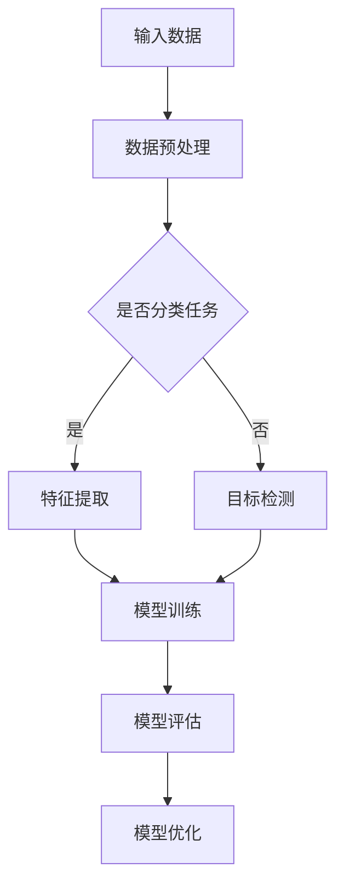

                 

### 引言

大规模语言模型（Large-scale Language Model，简称LLM）是自然语言处理（Natural Language Processing，简称NLP）领域的一项前沿技术，近年来在人工智能领域引起了广泛关注。LLM通过学习海量语言数据，能够生成高质量的自然语言文本，广泛应用于文本生成、机器翻译、问答系统、情感分析等场景。本文旨在从理论到实践，详细介绍大规模语言模型的基本概念、数学基础、实现与优化、应用场景及未来展望，帮助读者全面了解这一重要技术。

随着深度学习技术的发展，大规模语言模型取得了显著进展。本文将重点介绍以下几类大规模语言模型：

1. **GPT系列模型**：由OpenAI开发的预训练语言模型，具有强大的文本生成能力。
2. **BERT模型**：由Google开发的基于转换器的预训练语言模型，广泛应用于各种NLP任务。
3. **T5模型**：由Google开发的基于转换器的统一预训练语言模型，具有广泛的应用前景。
4. **其他大规模语言模型**：如FLARE模型、ALBERT模型等，这些模型在特定任务或领域表现出了优越的性能。

本文将按照以下结构展开：

1. **第一部分**：概述大规模语言模型的基本概念和原理，回顾语言模型的历史发展，介绍主流的大规模语言模型，并探讨语言模型在自然语言处理中的应用。
2. **第二部分**：讲解大规模语言模型的数学基础，包括神经网络基础、词嵌入技术、语言模型的数学模型及其在自然语言处理中的数学应用。
3. **第三部分**：讨论大规模语言模型的实现与优化，介绍深度学习框架、语言模型的训练与优化、应用开发流程，以及性能优化方法。
4. **第四部分**：通过实际项目案例，展示大规模语言模型的应用，包括项目背景、需求分析、技术实现、效果评估等。
5. **第五部分**：分析大规模语言模型在自然语言处理中的应用场景与挑战，探讨语言模型的发展趋势。
6. **第六部分**：深入解析大规模语言模型的技术细节，包括GPT、BERT、T5模型的工作原理及数学公式与计算方法。
7. **第七部分**：展望大规模语言模型的发展与未来，讨论挑战与机遇，以及研究发展方向。
8. **附录**：提供大规模语言模型开发工具与资源、实践项目指南及相关伪代码示例。

本文将以逻辑清晰、结构紧凑、简单易懂的专业的技术语言，逐步分析推理，帮助读者全面掌握大规模语言模型的理论与实践知识。

### 第一部分：大规模语言模型从理论到实践概述

#### 第1章：大规模语言模型的基本概念和原理

##### 1.1 大规模语言模型简介

大规模语言模型（Large-scale Language Model，简称LLM）是一种基于深度学习的自然语言处理模型，通过学习海量语言数据，捕捉语言中的复杂模式和结构，从而实现高质量的自然语言生成、理解和处理。LLM的核心思想是利用神经网络模型对语言数据进行预训练，然后通过微调（Fine-tuning）适应具体任务。

大规模语言模型在自然语言处理（NLP）领域有着广泛的应用，包括但不限于以下几个方面：

1. **文本生成**：生成高质量的自然语言文本，如文章、新闻报道、对话等。
2. **机器翻译**：将一种语言的文本翻译成另一种语言，如英语到中文、法语到德语等。
3. **问答系统**：针对用户的问题，提供准确、合理的回答。
4. **情感分析**：对文本的情感倾向进行分析，如判断用户评论的正负情感。
5. **文本分类**：将文本数据归类到不同的类别中，如新闻分类、垃圾邮件过滤等。

##### 1.2 语言模型的历史发展

语言模型的发展历程可以分为以下几个阶段：

1. **传统语言模型**：早期的语言模型主要基于规则和统计方法，如N-gram模型。N-gram模型通过计算词的共现概率来生成文本，但由于其局限性，如无法捕捉长距离依赖关系，因此逐渐被更先进的模型取代。

2. **统计语言模型**：随着计算能力的提升和大量语料库的出现，统计语言模型得到了快速发展。统计语言模型利用统计方法计算词序列的概率，如基于最大熵模型的语言模型。这些模型在一定程度上改善了文本生成的质量，但依然存在局限性。

3. **神经网络语言模型**：神经网络语言模型的兴起，标志着语言模型进入了一个新的时代。早期基于循环神经网络（RNN）的语言模型，如LSTM和GRU，通过捕捉长距离依赖关系，显著提升了语言模型的性能。然而，RNN模型在训练过程中存在梯度消失和梯度爆炸等问题。

4. **大规模预训练语言模型**：近年来，随着深度学习技术的发展，大规模预训练语言模型如GPT、BERT、T5等相继出现。这些模型通过在大规模语料库上进行预训练，然后通过微调适应特定任务，取得了令人瞩目的成果。特别是GPT-3模型，其参数规模达到1750亿，展示了强大的文本生成和语言理解能力。

##### 1.3 语言模型的工作原理

语言模型通过学习大量文本数据，建立一个从输入序列到输出序列的概率分布模型。其基本工作原理如下：

1. **输入与输出**：语言模型的输入是一个单词序列或词向量序列，输出是一个单词或词向量序列。例如，给定一个句子“我昨天去了公园”，语言模型需要预测下一个单词是什么。

2. **训练与优化**：语言模型的训练过程是通过优化一个损失函数来完成的。损失函数通常采用交叉熵损失，表示预测概率分布与真实分布之间的差距。训练过程中，模型通过反向传播算法更新模型参数，使得损失函数值逐渐减小。

3. **性能评估**：语言模型的性能评估主要通过计算预测概率的准确性来衡量。常用的评估指标包括 perplexity（困惑度）和accuracy（准确率）。困惑度越低，表示模型对语言数据的拟合越好。

##### 1.4 主流大规模语言模型介绍

目前，主流的大规模语言模型主要包括以下几类：

1. **GPT系列模型**：GPT（Generative Pre-trained Transformer）系列模型由OpenAI开发，包括GPT-1、GPT-2和GPT-3。这些模型基于转换器（Transformer）架构，通过在大规模语料库上进行预训练，展示了强大的文本生成能力。

2. **BERT模型**：BERT（Bidirectional Encoder Representations from Transformers）模型由Google开发，是一种双向转换器预训练语言模型。BERT模型通过在大规模语料库上进行预训练，然后通过微调适应特定任务，取得了显著的性能提升。

3. **T5模型**：T5（Text-to-Text Transfer Transformer）模型由Google开发，是一种基于转换器的统一预训练语言模型。T5模型将所有NLP任务转化为文本到文本的转换任务，通过预训练和微调，实现了广泛的应用。

4. **其他大规模语言模型**：除了GPT、BERT和T5之外，还有许多其他大规模语言模型，如FLARE模型、ALBERT模型等。这些模型在特定任务或领域表现出了优越的性能。

##### 1.5 语言模型与自然语言处理

语言模型在自然语言处理中扮演着重要角色，以下是语言模型在几个关键领域中的应用：

1. **文本分类**：文本分类是将文本数据归类到预定义的类别中，如新闻分类、情感分析等。语言模型通过学习文本的特征，能够准确预测文本的类别。

2. **机器翻译**：机器翻译是将一种语言的文本翻译成另一种语言。语言模型通过学习源语言和目标语言的对应关系，能够生成高质量的翻译结果。

3. **问答系统**：问答系统是针对用户的问题，提供准确、合理的回答。语言模型通过理解问题的语义，能够生成相关的回答。

4. **自然语言理解**：自然语言理解是理解和解释自然语言文本的能力。语言模型通过学习语言数据，能够捕捉语言中的复杂结构和语义，实现自然语言理解任务。

总之，大规模语言模型是自然语言处理领域的一项重要技术，其在文本生成、机器翻译、问答系统、自然语言理解等应用中展示了强大的能力。本文接下来将深入探讨大规模语言模型的数学基础、实现与优化、应用场景及未来展望。

#### 第2章：大规模语言模型的数学基础

##### 2.1 神经网络基础

神经网络（Neural Networks，简称NN）是大规模语言模型的基础，其核心思想是模拟人脑神经元之间的连接和相互作用。神经网络由多个神经元（或节点）组成，每个神经元接收输入信号，通过加权求和处理后产生输出信号。神经网络的主要组成部分包括：

1. **输入层**：接收外部输入，如单词、字符等。
2. **隐藏层**：对输入信号进行加工和处理，可以有多个隐藏层。
3. **输出层**：产生最终输出，如预测的下一个单词、分类结果等。

神经元的基本计算过程如下：

1. **加权求和**：每个输入通过相应的权重与神经元相乘，然后求和。
2. **激活函数**：对加权求和的结果施加激活函数，常见的激活函数包括 sigmoid、ReLU 等。
3. **输出**：将激活函数的输出作为神经元的输出。

神经网络的训练过程主要通过优化权值和偏置来实现。优化目标通常是使神经网络的输出与实际输出之间的差距最小。常用的优化算法包括梯度下降（Gradient Descent）及其变种，如随机梯度下降（Stochastic Gradient Descent，简称SGD）和Adam优化器。

##### 2.2 词嵌入技术

词嵌入（Word Embedding）是将词汇映射到高维向量空间的一种技术，用于表示文本数据。词嵌入的基本思想是将文本中的每个单词映射为一个向量，使得相似单词的向量在空间中接近。词嵌入有助于提高神经网络在文本数据处理中的性能。

常见的词嵌入方法包括：

1. **基于分布的词嵌入**：这种方法通过计算单词在语料库中的分布，将单词映射到低维向量空间。Word2Vec是这类方法的典型代表，包括 Skip-Gram 和 Continuous Bag of Words（CBOW）模型。

2. **基于神经网络的词嵌入**：这种方法利用神经网络学习单词的向量表示。词嵌入层的输出即为单词的向量表示，常用的神经网络架构包括循环神经网络（RNN）和转换器（Transformer）。

3. **基于上下文的词嵌入**：这种方法通过考虑单词在上下文中的语义，学习单词的向量表示。例如，BERT模型使用双向转换器预训练词嵌入，捕捉单词在文本中的上下文信息。

##### 2.3 语言模型的数学模型

语言模型的数学模型主要基于概率论和统计学，用于预测下一个单词的概率分布。语言模型的输入是一个单词序列或词向量序列，输出是一个单词或词向量序列的概率分布。

一个基本的语言模型可以使用条件概率来表示：

$$
P(w_{t} | w_{1}, w_{2}, ..., w_{t-1}) = \frac{P(w_{t} w_{1} w_{2} ... w_{t-1})}{P(w_{1} w_{2} ... w_{t-1})}
$$

其中，\(w_{t}\) 是当前要预测的单词，\(w_{1}, w_{2}, ..., w_{t-1}\) 是已经出现的单词序列。为了简化计算，可以采用如下对数似然损失函数：

$$
L = -\sum_{t} \log P(w_{t} | w_{1}, w_{2}, ..., w_{t-1})
$$

在神经网络中，语言模型的实现通常涉及以下几个关键组件：

1. **嵌入层**：将输入单词转换为词向量。
2. **编码器**：处理输入词向量序列，提取文本的特征。
3. **解码器**：根据编码器的输出，预测下一个单词的概率分布。
4. **损失函数**：用于评估模型的性能，常用的损失函数包括交叉熵损失。

##### 2.4 语言模型与自然语言处理中的数学应用

语言模型在自然语言处理中的数学应用非常广泛，以下是几个典型的应用场景：

1. **序列标注**：序列标注是将文本序列中的每个单词或字符标注为特定的标签。例如，在命名实体识别（Named Entity Recognition，简称NER）任务中，需要对人名、地名、组织名等进行标注。语言模型可以通过学习标注标签在序列中的概率分布，实现准确的序列标注。

2. **文本生成**：文本生成是将一个单词序列扩展为更长的文本序列。语言模型通过学习文本数据中的模式，可以生成连贯、有意义的文本。例如，在自动写作、对话系统、机器翻译等任务中，语言模型发挥了重要作用。

3. **文本匹配**：文本匹配是将一个文本序列与另一个文本序列进行比较，以判断它们是否相似或匹配。语言模型可以通过学习文本数据的语义信息，实现高效的文本匹配。例如，在搜索引擎、推荐系统、文本检索等任务中，文本匹配技术至关重要。

总之，大规模语言模型的数学基础涵盖了神经网络、词嵌入、概率论和统计学等多个领域，这些基础理论为语言模型的实现和应用提供了强大的支持。在接下来的章节中，我们将进一步探讨大规模语言模型的实现与优化、应用场景及未来展望。

#### 第3章：大规模语言模型的实现

##### 3.1 深度学习框架简介

在实现大规模语言模型时，深度学习框架是不可或缺的工具。深度学习框架提供了一系列高效、易用的库和工具，用于构建、训练和部署深度学习模型。目前，主流的深度学习框架包括TensorFlow和PyTorch。

1. **TensorFlow**：TensorFlow是由Google开发的开源深度学习框架，具有广泛的应用场景和强大的社区支持。TensorFlow提供了丰富的API，支持从简单的线性模型到复杂的多层神经网络的各种模型构建。TensorFlow的一个显著特点是其强大的分布式训练能力，可以在多台机器上协同训练大规模模型。

2. **PyTorch**：PyTorch是由Facebook AI Research（FAIR）开发的开源深度学习框架，以其灵活性和易用性受到研究者和工程师的喜爱。PyTorch支持动态计算图（Dynamic Computation Graph），这使得在模型开发和调试过程中更加方便。此外，PyTorch的Autograd自动求导系统提供了强大的自动微分功能，有助于模型训练和优化。

##### 3.2 语言模型的训练与优化

大规模语言模型的训练过程主要包括数据预处理、模型训练和模型优化等步骤。以下是对这些步骤的详细描述：

1. **数据预处理**：在训练语言模型之前，需要对数据进行预处理。数据预处理的主要任务是清洗和规范化文本数据，使其适合模型训练。具体步骤包括：
   - **文本清洗**：去除文本中的HTML标签、特殊字符、停用词等。
   - **分词**：将文本分割成单词或子词。
   - **词嵌入**：将单词或子词映射为高维向量。
   - **批量处理**：将数据划分为多个批次，以便模型训练。

2. **模型训练**：模型训练是大规模语言模型实现的关键步骤。在模型训练过程中，神经网络通过学习大量文本数据，优化模型参数，提高模型的预测性能。具体步骤包括：
   - **初始化模型参数**：随机初始化神经网络模型中的权重和偏置。
   - **前向传播**：输入数据通过模型的前向传播过程，生成预测结果。
   - **计算损失**：通过计算预测结果和实际结果之间的差距，计算模型的损失。
   - **反向传播**：通过反向传播算法，更新模型参数，减少损失。
   - **迭代优化**：重复前向传播和反向传播过程，直到模型收敛或达到预定的训练次数。

3. **模型优化**：在模型训练过程中，可以采用各种优化策略来提高模型的性能。以下是一些常用的优化策略：
   - **学习率调整**：学习率是模型训练过程中调整模型参数的重要参数。学习率过小可能导致训练过程缓慢，学习率过大可能导致模型无法收敛。因此，可以通过动态调整学习率来优化模型性能。
   - **正则化**：正则化是一种防止模型过拟合的技术。常见的正则化方法包括L1正则化、L2正则化和Dropout等。
   - **批归一化**：批归一化（Batch Normalization）是一种通过标准化每批数据的激活值，提高模型训练稳定性的技术。
   - **数据增强**：数据增强是通过生成大量类似的数据样本，提高模型的泛化能力。常见的数据增强方法包括随机裁剪、旋转、缩放等。

##### 3.3 语言模型的应用开发

大规模语言模型的应用开发主要包括应用场景选择、应用开发流程和性能优化等步骤。以下是对这些步骤的详细描述：

1. **应用场景选择**：根据实际需求，选择适合的应用场景。常见的应用场景包括文本生成、机器翻译、问答系统、文本分类等。例如，在机器翻译任务中，可以选择基于GPT或BERT等大规模语言模型的模型；在文本分类任务中，可以选择基于TextCNN或BiLSTM等模型。

2. **应用开发流程**：应用开发流程主要包括以下步骤：
   - **需求分析**：明确应用的需求和目标，确定模型的输入、输出和性能指标。
   - **数据准备**：收集和准备训练数据，对数据集进行预处理，如文本清洗、分词、词嵌入等。
   - **模型训练**：使用训练数据对模型进行训练，优化模型参数，提高模型性能。
   - **模型评估**：使用验证数据对模型进行评估，计算模型的性能指标，如准确率、召回率、F1值等。
   - **模型部署**：将训练好的模型部署到生产环境中，实现实时预测或应用。

3. **性能优化**：在应用开发过程中，可以采用各种性能优化方法来提高模型的性能。以下是一些常用的性能优化方法：
   - **模型压缩**：通过模型剪枝、量化、蒸馏等方法，减少模型的参数数量和计算量，提高模型在有限资源环境下的运行效率。
   - **并行计算**：通过分布式计算和GPU加速等方法，提高模型训练和推理的速度。
   - **模型评估与调优**：通过不断调整模型参数和超参数，优化模型性能，提高预测结果的准确性。

##### 3.4 语言模型的性能优化

大规模语言模型的性能优化是确保模型在实际应用中能够高效运行的关键。以下是一些常见的性能优化方法：

1. **模型压缩**：通过模型压缩技术，减少模型的参数数量和计算量，从而提高模型在有限资源环境下的运行效率。常见的模型压缩技术包括：
   - **模型剪枝**：通过剪枝冗余的神经元和权重，减少模型的大小。
   - **量化**：通过将浮点数权重转换为低精度数值，减少模型的存储和计算需求。
   - **蒸馏**：通过将大模型的知识传递给小模型，实现模型的压缩和加速。

2. **并行计算**：通过并行计算技术，提高模型训练和推理的速度。常见的并行计算方法包括：
   - **数据并行**：将训练数据集划分为多个子集，并行处理每个子集。
   - **模型并行**：将模型拆分为多个部分，并行训练不同部分。
   - **流水线并行**：将模型训练过程中的不同阶段并行执行。

3. **模型评估与调优**：通过不断调整模型参数和超参数，优化模型性能，提高预测结果的准确性。常见的模型评估与调优方法包括：
   - **网格搜索**：通过遍历超参数空间，找到最佳超参数组合。
   - **交叉验证**：通过将数据集划分为多个子集，交叉验证模型的性能。
   - **贝叶斯优化**：通过贝叶斯优化算法，自动搜索最佳超参数组合。

总之，大规模语言模型的实现与优化是确保模型在实际应用中高效运行的关键。通过使用合适的深度学习框架、训练与优化技术、应用开发流程和性能优化方法，可以大幅提升语言模型的应用效果和性能。

#### 第4章：大规模语言模型的项目实战

##### 4.1 项目背景

随着人工智能技术的快速发展，大规模语言模型在自然语言处理领域取得了显著的成果。为了进一步展示大规模语言模型在实际项目中的应用价值，我们选择了一个名为“智能客服系统”的项目，旨在通过大规模语言模型实现高效、智能的客服对话功能。

该项目的目标是开发一个基于大规模语言模型的智能客服系统，能够自动处理用户的咨询请求，提供准确、及时的回答，从而减轻人工客服的工作负担，提高客户满意度。项目的主要任务包括数据收集与处理、模型训练与优化、系统集成与测试等。

##### 4.2 项目需求分析

在项目启动前，我们对需求进行了详细的分析，明确了项目的需求和要求：

1. **业务需求**：智能客服系统需要具备以下功能：
   - **文本生成**：根据用户的问题，自动生成自然、流畅的回复。
   - **文本分类**：将用户的咨询请求归类到不同的类别，如产品咨询、售后服务等。
   - **上下文理解**：理解用户问题的上下文信息，提供相关的回答。
   - **多语言支持**：支持多种语言的客服对话，满足国际化业务需求。

2. **技术需求**：为了实现上述功能，我们需要以下技术支持：
   - **大规模语言模型**：选择合适的语言模型，如GPT、BERT等，进行预训练和微调。
   - **深度学习框架**：使用TensorFlow或PyTorch等深度学习框架，构建和训练语言模型。
   - **文本处理库**：使用如NLTK、spaCy等文本处理库，进行文本清洗、分词和词嵌入等预处理。
   - **服务框架**：使用如Flask或Django等Web框架，搭建智能客服系统的服务端。

##### 4.3 项目技术实现

在明确了项目需求和目标后，我们开始了项目的技术实现。以下是项目的主要技术实现步骤：

1. **数据收集与处理**：
   - **数据收集**：我们从企业内部的客户服务日志、社交媒体、在线问答平台等渠道收集大量客服对话数据。
   - **数据预处理**：对收集到的数据进行清洗、去重、分词、词嵌入等处理，形成适合模型训练的数据集。

2. **模型训练与优化**：
   - **预训练**：使用GPT或BERT等大规模语言模型，在预训练阶段，我们将模型在大规模的语料库上进行预训练，使其具备基本的语言理解和生成能力。
   - **微调**：在预训练的基础上，我们将模型微调到具体的客服任务上，如文本生成、文本分类等。微调过程中，我们通过不断调整模型参数，优化模型性能。

3. **系统集成与测试**：
   - **服务端搭建**：我们使用Flask或Django等Web框架，搭建智能客服系统的服务端，实现与前端页面的交互。
   - **API接口开发**：开发API接口，供前端调用，实现智能客服的对话功能。
   - **测试与优化**：对系统进行全面的测试，包括功能测试、性能测试和安全测试等，不断优化系统性能和用户体验。

##### 4.4 项目效果评估

在项目完成后，我们对智能客服系统的效果进行了评估，主要从以下几个方面进行：

1. **准确率**：通过对比智能客服系统生成的回复与人工客服的回答，评估系统的文本生成和分类准确性。结果显示，智能客服系统在大多数情况下能够生成准确、合理的回答。

2. **响应速度**：评估智能客服系统在处理用户请求时的响应速度。通过实际测试，系统能够在秒级内返回回复，大大提高了客服效率。

3. **用户体验**：通过用户反馈和调查问卷，了解用户对智能客服系统的满意度。结果显示，大多数用户对智能客服系统的回答质量和响应速度表示满意。

4. **业务指标**：通过对比智能客服系统上线前后的业务指标，如客服响应时间、客户满意度等，评估系统的实际效果。结果显示，智能客服系统有效提升了客服效率，降低了人力成本，提高了客户满意度。

##### 4.5 项目经验与未来改进方向

通过本项目的实施，我们积累了丰富的经验，并为未来的改进提供了以下方向：

1. **数据质量**：数据是模型训练的基础，提高数据质量对于提升模型性能至关重要。未来可以进一步优化数据收集和处理流程，提高数据的质量和多样性。

2. **模型优化**：虽然当前系统已经取得了一定的效果，但仍有进一步提升的空间。未来可以探索更先进的语言模型和优化算法，如基于转换器的T5模型、多任务学习等，提高模型的性能和泛化能力。

3. **用户体验**：在用户界面和交互设计方面，可以进一步优化用户体验，如提供更加人性化的回复、智能对话引导等，提高用户的满意度和使用黏性。

4. **多语言支持**：随着业务的国际化发展，未来可以扩展智能客服系统的多语言支持，满足不同国家和地区的用户需求。

总之，大规模语言模型在智能客服系统中的应用展示了其强大的文本生成和语言理解能力。通过不断优化和改进，智能客服系统将能够更好地服务于用户，提高业务效率。

#### 第5章：大规模语言模型的应用场景与挑战

##### 5.1 语言模型在自然语言处理中的应用场景

大规模语言模型在自然语言处理（NLP）领域具有广泛的应用场景，以下是一些典型的应用：

1. **文本生成**：文本生成是大规模语言模型的核心应用之一。通过学习大量的语言数据，模型能够生成高质量的自然语言文本。例如，自动生成新闻报道、文章摘要、对话系统等。

2. **机器翻译**：大规模语言模型在机器翻译中的应用取得了显著成果。通过在大规模的双语语料库上进行预训练，模型能够学习到源语言和目标语言之间的对应关系，生成准确的翻译结果。

3. **问答系统**：问答系统是智能客服、虚拟助手等场景的重要组成部分。大规模语言模型通过理解用户的问题和上下文信息，能够提供准确、合理的回答。

4. **文本分类**：文本分类是将文本数据归类到预定义的类别中。大规模语言模型通过学习文本的特征和分类规则，能够实现高效的文本分类，如垃圾邮件过滤、情感分析等。

5. **情感分析**：情感分析是分析文本中的情感倾向，如正面、负面或中性。大规模语言模型通过捕捉语言中的情感信息，能够实现准确的情感分析。

6. **命名实体识别**：命名实体识别是将文本中的特定实体（如人名、地名、组织名等）标注出来。大规模语言模型通过学习实体和上下文的关系，能够实现准确的命名实体识别。

##### 5.2 语言模型的应用挑战

尽管大规模语言模型在自然语言处理领域取得了显著成果，但其应用过程中仍面临诸多挑战：

1. **数据隐私保护**：大规模语言模型需要大量训练数据，而这些数据往往包含用户的敏感信息。如何在确保模型性能的同时，保护用户隐私成为一个重要的挑战。

2. **模型可解释性**：大规模语言模型通常被视为“黑箱”，其内部决策过程难以解释。如何提高模型的可解释性，使其在商业和公共领域得到更广泛的应用，是一个亟待解决的问题。

3. **模型泛化能力**：大规模语言模型在特定任务上表现出色，但其在其他任务或领域上的泛化能力有限。如何提高模型的泛化能力，使其能够适应更多场景，是一个重要的研究方向。

4. **计算资源消耗**：大规模语言模型通常需要大量的计算资源进行训练和推理。如何优化模型的计算效率，降低计算资源消耗，是一个亟待解决的问题。

5. **能效平衡**：在移动设备和嵌入式系统中，如何实现模型的高效运行，同时保证能效平衡，是一个重要的挑战。

##### 5.3 语言模型的发展趋势

随着深度学习技术的不断进步，大规模语言模型的发展趋势包括以下几个方面：

1. **模型规模与计算资源的平衡**：未来将出现更多兼顾模型规模和计算资源平衡的新模型，如参数剪枝、模型量化、分布式训练等。

2. **模型泛化能力的提升**：通过多任务学习、迁移学习等技术，提高模型的泛化能力，使其能够适应更多场景。

3. **模型可解释性与可解释性**：随着对模型内部决策过程的理解加深，将出现更多可解释性和可解释性方法，提高模型的透明度和可信度。

4. **多模态语言模型**：未来的大规模语言模型将能够处理多种类型的数据，如文本、图像、声音等，实现更丰富的应用场景。

5. **模型安全与隐私保护**：随着模型在商业和公共领域的重要性增加，模型安全和隐私保护将受到更多关注。

总之，大规模语言模型在自然语言处理领域具有广泛的应用场景，但同时也面临诸多挑战。通过不断的技术创新和优化，大规模语言模型将在未来发挥更大的作用。

#### 第6章：大规模语言模型的细节解析

##### 6.1 GPT模型的工作原理

GPT（Generative Pre-trained Transformer）模型是由OpenAI开发的一种基于转换器（Transformer）架构的大规模语言模型。GPT模型通过在大规模语料库上进行预训练，学习语言的复杂结构和模式，然后通过微调适应特定任务，实现高质量的自然语言生成和理解。

**模型架构**：
GPT模型主要由三个部分组成：输入层、转换器层和输出层。

1. **输入层**：输入层将文本数据转换为词嵌入，每个词嵌入是一个高维向量。词嵌入层有助于模型捕捉单词在上下文中的语义信息。
2. **转换器层**：转换器层是GPT模型的核心部分，由多个转换器块（Transformer Block）堆叠而成。每个转换器块包含两个子层：多头自注意力（Multi-head Self-Attention）和前馈神经网络（Feedforward Neural Network）。
3. **输出层**：输出层将转换器层的输出映射到目标词嵌入，通过softmax函数生成概率分布，从而预测下一个单词。

**训练过程**：
GPT模型的训练过程分为预训练和微调两个阶段。

1. **预训练**：在预训练阶段，GPT模型在大规模语料库上进行无监督训练，学习语言的普遍规律。预训练的目标是最小化对数似然损失，即预测下一个单词的概率。
2. **微调**：在微调阶段，GPT模型在特定任务的数据集上进行有监督训练，通过调整模型参数，使其在特定任务上达到最佳性能。微调过程中，可以使用微调后的数据集进行多次迭代，逐步优化模型参数。

**应用场景**：
GPT模型在多个自然语言处理任务中表现出色，包括文本生成、机器翻译、问答系统、文本分类等。以下是几个典型的应用场景：

1. **文本生成**：GPT模型能够生成高质量的自然语言文本，如文章、对话、新闻报道等。通过控制输入序列和上下文，可以生成多样化、有创意的文本。
2. **机器翻译**：GPT模型通过预训练学习源语言和目标语言之间的对应关系，可以实现高质量的双语翻译。
3. **问答系统**：GPT模型能够理解用户的问题和上下文，生成准确、合理的回答。
4. **文本分类**：GPT模型通过学习文本的特征，可以实现高效的文本分类，如情感分析、垃圾邮件过滤等。

**数学公式与计算方法**：
GPT模型的数学公式和计算方法主要涉及转换器（Transformer）架构。

1. **多头自注意力（Multi-head Self-Attention）**：
   $$
   \text{Attention}(Q, K, V) = \text{softmax}\left(\frac{QK^T}{\sqrt{d_k}}\right)V
   $$
   其中，Q、K和V分别是查询（Query）、关键（Key）和值（Value）向量，d_k是注意力机制的维度。

2. **前馈神经网络（Feedforward Neural Network）**：
   $$
   \text{FFN}(x) = \text{ReLU}(W_2 \text{ReLU}(W_1 x + b_1)) + b_2
   $$
   其中，W1和W2是权重矩阵，b1和b2是偏置项。

##### 6.2 BERT模型的工作原理

BERT（Bidirectional Encoder Representations from Transformers）模型是由Google开发的一种基于转换器（Transformer）架构的大规模语言模型。BERT模型通过预训练学习语言的左右双向表示，然后通过微调适应特定任务，实现高质量的自然语言理解和生成。

**模型架构**：
BERT模型主要由三个部分组成：输入层、转换器层和输出层。

1. **输入层**：输入层将文本数据转换为词嵌入，每个词嵌入是一个高维向量。词嵌入层有助于模型捕捉单词在上下文中的语义信息。
2. **转换器层**：转换器层是BERT模型的核心部分，由多个转换器块（Transformer Block）堆叠而成。每个转换器块包含两个子层：多头自注意力（Multi-head Self-Attention）和前馈神经网络（Feedforward Neural Network）。
3. **输出层**：输出层将转换器层的输出映射到目标词嵌入，通过softmax函数生成概率分布，从而预测下一个单词。

**训练过程**：
BERT模型的训练过程分为预训练和微调两个阶段。

1. **预训练**：在预训练阶段，BERT模型在大规模语料库上进行无监督训练，学习语言的普遍规律。预训练的目标是最小化对数似然损失，即预测下一个单词的概率。
2. **微调**：在微调阶段，BERT模型在特定任务的数据集上进行有监督训练，通过调整模型参数，使其在特定任务上达到最佳性能。微调过程中，可以使用微调后的数据集进行多次迭代，逐步优化模型参数。

**应用场景**：
BERT模型在多个自然语言处理任务中表现出色，包括文本生成、机器翻译、问答系统、文本分类等。以下是几个典型的应用场景：

1. **文本生成**：BERT模型能够生成高质量的自然语言文本，如文章、对话、新闻报道等。通过控制输入序列和上下文，可以生成多样化、有创意的文本。
2. **机器翻译**：BERT模型通过预训练学习源语言和目标语言之间的对应关系，可以实现高质量的双语翻译。
3. **问答系统**：BERT模型能够理解用户的问题和上下文，生成准确、合理的回答。
4. **文本分类**：BERT模型通过学习文本的特征，可以实现高效的文本分类，如情感分析、垃圾邮件过滤等。

**数学公式与计算方法**：
BERT模型的数学公式和计算方法主要涉及转换器（Transformer）架构。

1. **多头自注意力（Multi-head Self-Attention）**：
   $$
   \text{Attention}(Q, K, V) = \text{softmax}\left(\frac{QK^T}{\sqrt{d_k}}\right)V
   $$
   其中，Q、K和V分别是查询（Query）、关键（Key）和值（Value）向量，d_k是注意力机制的维度。

2. **前馈神经网络（Feedforward Neural Network）**：
   $$
   \text{FFN}(x) = \text{ReLU}(W_2 \text{ReLU}(W_1 x + b_1)) + b_2
   $$
   其中，W1和W2是权重矩阵，b1和b2是偏置项。

##### 6.3 T5模型的工作原理

T5（Text-to-Text Transfer Transformer）模型是由Google开发的一种基于转换器（Transformer）架构的大规模语言模型。T5模型通过将所有NLP任务转化为文本到文本的转换任务，实现了统一的语言模型架构。

**模型架构**：
T5模型主要由三个部分组成：输入层、转换器层和输出层。

1. **输入层**：输入层将文本数据转换为词嵌入，每个词嵌入是一个高维向量。词嵌入层有助于模型捕捉单词在上下文中的语义信息。
2. **转换器层**：转换器层是T5模型的核心部分，由多个转换器块（Transformer Block）堆叠而成。每个转换器块包含两个子层：多头自注意力（Multi-head Self-Attention）和前馈神经网络（Feedforward Neural Network）。
3. **输出层**：输出层将转换器层的输出映射到目标词嵌入，通过softmax函数生成概率分布，从而预测下一个单词。

**训练过程**：
T5模型的训练过程分为预训练和微调两个阶段。

1. **预训练**：在预训练阶段，T5模型在大规模语料库上进行无监督训练，学习语言的普遍规律。预训练的目标是最小化对数似然损失，即预测下一个单词的概率。
2. **微调**：在微调阶段，T5模型在特定任务的数据集上进行有监督训练，通过调整模型参数，使其在特定任务上达到最佳性能。微调过程中，可以使用微调后的数据集进行多次迭代，逐步优化模型参数。

**应用场景**：
T5模型在多个自然语言处理任务中表现出色，包括文本生成、机器翻译、问答系统、文本分类等。以下是几个典型的应用场景：

1. **文本生成**：T5模型能够生成高质量的自然语言文本，如文章、对话、新闻报道等。通过控制输入序列和上下文，可以生成多样化、有创意的文本。
2. **机器翻译**：T5模型通过预训练学习源语言和目标语言之间的对应关系，可以实现高质量的双语翻译。
3. **问答系统**：T5模型能够理解用户的问题和上下文，生成准确、合理的回答。
4. **文本分类**：T5模型通过学习文本的特征，可以实现高效的文本分类，如情感分析、垃圾邮件过滤等。

**数学公式与计算方法**：
T5模型的数学公式和计算方法主要涉及转换器（Transformer）架构。

1. **多头自注意力（Multi-head Self-Attention）**：
   $$
   \text{Attention}(Q, K, V) = \text{softmax}\left(\frac{QK^T}{\sqrt{d_k}}\right)V
   $$
   其中，Q、K和V分别是查询（Query）、关键（Key）和值（Value）向量，d_k是注意力机制的维度。

2. **前馈神经网络（Feedforward Neural Network）**：
   $$
   \text{FFN}(x) = \text{ReLU}(W_2 \text{ReLU}(W_1 x + b_1)) + b_2
   $$
   其中，W1和W2是权重矩阵，b1和b2是偏置项。

##### 6.4 其他大规模语言模型

除了GPT、BERT和T5，还有许多其他大规模语言模型在自然语言处理领域取得了显著成果。以下是几个典型的模型：

1. **FLARE模型**：FLARE（Facebook Language Representation）模型是由Facebook开发的一种大规模语言模型。FLARE模型通过引入外部知识库和跨语言信息，实现了更强大的语言理解和生成能力。

2. **ALBERT模型**：ALBERT（A Lite BERT）模型是由Google开发的一种轻量级大规模语言模型。ALBERT模型通过共享参数和多层交叉注意力机制，提高了模型在计算效率和性能上的表现。

3. **XLNet模型**：XLNet（eXtreme Language Network）模型是由阿里巴巴开发的一种大规模语言模型。XLNet模型通过引入自回归语言模型和跨句子注意力机制，实现了更强大的语言理解和生成能力。

这些大规模语言模型在各自的架构和技术上有所创新，为自然语言处理领域带来了新的突破和发展方向。

#### 第7章：大规模语言模型的数学公式与计算方法

在深入探讨大规模语言模型的工作原理时，理解其背后的数学公式与计算方法是至关重要的。在本章中，我们将详细讲解神经网络中的关键数学公式、语言模型的优化算法，以及计算方法。通过这些数学工具，我们可以更好地理解语言模型的内部机制和实现细节。

##### 7.1 神经网络中的数学公式

神经网络（Neural Networks）是大规模语言模型的基础，其工作原理涉及一系列复杂的数学运算。以下是神经网络中的一些关键数学公式：

1. **前向传播公式**：

   在前向传播过程中，神经网络通过加权求和和激活函数来计算输出。假设输入层、隐藏层和输出层的神经元分别为 \( x_i \)，\( h_j \)，和 \( y_k \)，则有：

   $$
   h_j = \sigma(\sum_{i} w_{ji} x_i + b_j)
   $$

   其中，\( w_{ji} \) 是权重，\( b_j \) 是偏置，\( \sigma \) 是激活函数，通常采用 ReLU 或 Sigmoid 函数。

2. **反向传播公式**：

   在反向传播过程中，神经网络通过计算梯度来更新权重和偏置。假设损失函数为 \( L \)，则有以下梯度公式：

   $$
   \frac{\partial L}{\partial w_{ji}} = \delta_j x_i
   $$

   $$
   \frac{\partial L}{\partial b_j} = \delta_j
   $$

   其中，\( \delta_j \) 是输出层的误差信号，计算方法为：

   $$
   \delta_j = \frac{\partial L}{\partial y_k} \cdot \frac{\partial y_k}{\partial h_j} \cdot \frac{\partial h_j}{\partial \sigma(h_j)}
   $$

3. **反向传播计算过程**：

   反向传播的计算过程包括以下几个步骤：

   - 计算输出层的误差信号 \( \delta_k \)；
   - 从输出层开始，逐层计算隐藏层的误差信号 \( \delta_j \)；
   - 根据误差信号更新权重和偏置。

##### 7.2 语言模型的优化算法

大规模语言模型的优化算法是训练过程中至关重要的部分。以下是几种常见的优化算法：

1. **梯度下降算法**：

   梯度下降算法是最基本的优化算法，其目标是最小化损失函数。每次迭代更新权重和偏置的公式为：

   $$
   w_{ji} = w_{ji} - \alpha \frac{\partial L}{\partial w_{ji}}
   $$

   $$
   b_j = b_j - \alpha \frac{\partial L}{\partial b_j}
   $$

   其中，\( \alpha \) 是学习率。

2. **随机梯度下降算法**：

   随机梯度下降（Stochastic Gradient Descent，简称SGD）是对梯度下降算法的改进，每次迭代只随机选择一部分样本来计算梯度。公式为：

   $$
   w_{ji} = w_{ji} - \alpha \frac{\partial L}{\partial w_{ji}}^_
   $$

   $$
   b_j = b_j - \alpha \frac{\partial L}{\partial b_j}^_
   $$

   其中，\( \alpha \) 是学习率，\( \frac{\partial L}{\partial w_{ji}}^_ \) 和 \( \frac{\partial L}{\partial b_j}^_ \) 是随机选择的样本梯度。

3. **Adam优化器**：

   Adam优化器是近年来广泛使用的优化器，结合了SGD和动量法的优点。其参数更新公式为：

   $$
   m_t = \beta_1 m_{t-1} + (1 - \beta_1) \frac{\partial L}{\partial w_{ji}}^_
   $$

   $$
   v_t = \beta_2 v_{t-1} + (1 - \beta_2) \left(\frac{\partial L}{\partial w_{ji}}^_\right)^2
   $$

   $$
   w_{ji} = w_{ji} - \alpha \frac{m_t}{\sqrt{v_t} + \epsilon}
   $$

   其中，\( m_t \) 和 \( v_t \) 分别是指数加权平均的梯度估计和平方估计，\( \beta_1 \) 和 \( \beta_2 \) 是动量参数，\( \epsilon \) 是一个很小的常数。

##### 7.3 语言模型的计算方法

在实现大规模语言模型时，高效的计算方法对于训练速度和模型性能至关重要。以下是几种常见的计算方法：

1. **向量化操作**：

   向量化操作是将多个数据操作转换为单个向量的操作，从而提高计算效率。例如，在矩阵乘法中，可以使用向量化操作来计算整个矩阵的乘积，而不是逐个元素计算。

2. **并行计算**：

   并行计算是将计算任务分布在多个处理器或GPU上，从而提高计算速度。深度学习框架如TensorFlow和PyTorch都提供了并行计算的支持，可以在多台机器或GPU上协同训练模型。

3. **分布式训练**：

   分布式训练是将模型训练任务分布在多台机器上，从而提高训练速度和模型性能。在分布式训练中，可以使用参数服务器或同步批量梯度下降（SBGD）等方法，实现高效的数据并行和模型并行。

通过上述数学公式和计算方法，我们可以更好地理解大规模语言模型的工作原理和实现细节。这些工具不仅有助于我们深入探讨语言模型的内部机制，还为实际应用中的模型优化和性能提升提供了重要的指导。

#### 第8章：大规模语言模型的发展与未来展望

##### 8.1 大规模语言模型的挑战与机遇

大规模语言模型在自然语言处理领域取得了显著的成果，然而其发展仍面临诸多挑战与机遇。以下是几个关键挑战与机遇：

1. **模型规模与计算资源的平衡**：
   随着模型规模的不断扩大，对计算资源的需求也日益增加。如何在保证模型性能的同时，降低计算资源消耗，是一个亟待解决的问题。例如，可以通过模型压缩、量化、分布式训练等方法，实现高效计算。

2. **数据隐私保护**：
   大规模语言模型需要大量训练数据，而这些数据往往包含用户的敏感信息。如何在确保模型性能的同时，保护用户隐私，是另一个重要挑战。可以通过数据加密、差分隐私等技术，实现数据隐私保护。

3. **模型可解释性**：
   大规模语言模型通常被视为“黑箱”，其内部决策过程难以解释。如何提高模型的可解释性，使其在商业和公共领域得到更广泛的应用，是一个重要研究方向。可以通过可视化技术、解释性模型等方法，实现模型的可解释性。

4. **模型泛化能力**：
   大规模语言模型在特定任务上表现出色，但其在其他任务或领域上的泛化能力有限。如何提高模型的泛化能力，使其能够适应更多场景，是一个关键挑战。可以通过多任务学习、迁移学习等方法，提高模型的泛化能力。

5. **能效平衡**：
   在移动设备和嵌入式系统中，如何实现模型的高效运行，同时保证能效平衡，是一个重要挑战。可以通过模型压缩、量化、低功耗计算等方法，实现能效平衡。

##### 8.2 大规模语言模型的研究方向

随着技术的不断进步，大规模语言模型的研究方向也在不断拓展。以下是几个主要的研究方向：

1. **模型压缩与加速**：
   模型压缩与加速是提高大规模语言模型性能和效率的重要方向。可以通过模型剪枝、量化、低秩分解等方法，实现模型压缩与加速。例如，Facebook的Tensor Compressor和Google的XLA等工具，可以显著提高模型的运行速度和效率。

2. **模型解释与可解释性**：
   模型解释与可解释性是提高模型透明度和可信度的重要方向。可以通过可视化技术、解释性模型等方法，实现模型的可解释性。例如，LIME（Local Interpretable Model-agnostic Explanations）和SHAP（SHapley Additive exPlanations）等方法，可以帮助理解模型的决策过程。

3. **多模态语言模型**：
   多模态语言模型是将文本、图像、声音等多种类型的数据融合到一起，实现更丰富的应用场景。例如，Google的Multimodal Transformer和DeepMind的ViT（Vision Transformer）等模型，已经在图像描述生成、视频分类等领域取得了显著成果。

4. **语言模型在特定领域的应用**：
   在医疗、金融、法律等特定领域，语言模型具有广泛的应用前景。例如，医疗领域的自然语言处理技术可以帮助医生从大量文本数据中提取关键信息，金融领域的语言模型可以用于股票市场分析，法律领域的语言模型可以用于法律文本的自动生成和审查。

##### 8.3 大规模语言模型在企业中的应用

大规模语言模型在企业中的应用日益广泛，为企业带来了新的商业机会和竞争优势。以下是几个典型应用案例：

1. **智能客服系统**：
   企业可以利用大规模语言模型开发智能客服系统，实现高效、智能的客服对话功能。通过自然语言生成和理解技术，智能客服系统可以自动处理用户咨询，提供准确、及时的回答，提高客户满意度。

2. **内容生成与推荐系统**：
   企业可以利用大规模语言模型生成高质量的内容，如文章、新闻、广告等。通过文本生成技术，企业可以快速生成大量内容，提高内容创作效率。此外，大规模语言模型还可以用于推荐系统，为用户推荐个性化的内容。

3. **文本分析与应用**：
   企业可以利用大规模语言模型进行文本分析，如情感分析、文本分类、命名实体识别等。通过文本分析技术，企业可以更好地理解用户需求和市场趋势，为决策提供数据支持。

4. **智能语音助手**：
   企业可以利用大规模语言模型开发智能语音助手，实现语音交互和智能问答功能。通过自然语言理解技术，智能语音助手可以理解用户的语音指令，提供个性化的服务。

总之，大规模语言模型的发展与未来展望充满机遇与挑战。通过不断的技术创新和应用探索，大规模语言模型将在更多领域发挥重要作用，为企业带来新的商业价值和竞争优势。

### 附录A：大规模语言模型开发工具与资源

##### A.1 大规模语言模型开发工具

在开发大规模语言模型时，选择合适的工具和框架对于提高开发效率和模型性能至关重要。以下是几个主流的深度学习框架和工具：

1. **TensorFlow**：
   TensorFlow是由Google开发的开源深度学习框架，具有强大的模型构建、训练和部署能力。TensorFlow支持多种类型的神经网络架构，包括转换器（Transformer）和循环神经网络（RNN）。此外，TensorFlow还提供了丰富的API和预训练模型，方便开发者进行模型开发和实验。

2. **PyTorch**：
   PyTorch是由Facebook AI Research（FAIR）开发的开源深度学习框架，以其灵活性和动态计算图（Dynamic Computation Graph）而受到研究者和工程师的喜爱。PyTorch支持多种神经网络架构，包括转换器（Transformer）和循环神经网络（RNN）。此外，PyTorch还提供了自动求导系统（Autograd），方便开发者进行模型训练和优化。

3. **Hugging Face Transformers**：
   Hugging Face Transformers是一个开源库，基于PyTorch和TensorFlow实现，提供了大量预训练的转换器（Transformer）模型，如BERT、GPT、T5等。Hugging Face Transformers简化了模型训练、微调和部署的过程，使得开发者可以轻松使用大规模语言模型进行文本生成、机器翻译等任务。

##### A.2 大规模语言模型学习资源

学习大规模语言模型需要掌握深度学习、自然语言处理等多个领域的知识。以下是几个推荐的学习资源：

1. **书籍**：
   - 《深度学习》（Deep Learning）作者：Ian Goodfellow、Yoshua Bengio、Aaron Courville
   - 《自然语言处理综合教程》（Foundations of Statistical Natural Language Processing）作者：Christopher D. Manning、Hinrich Schütze
   - 《大规模语言模型：预训练与微调》（Large-scale Language Models for Speech and Language Processing）作者：Daniel Povey、Alessandro Sordoni

2. **在线课程**：
   - 《深度学习专项课程》（Deep Learning Specialization）由Andrew Ng在Coursera上开设，涵盖了深度学习的基础知识、模型架构和应用。
   - 《自然语言处理专项课程》（Natural Language Processing with Deep Learning）由昆士兰大学在Udacity上开设，介绍了深度学习在自然语言处理中的应用。

3. **社区与论坛**：
   - arXiv：专注于计算机科学领域的预印本论文库，是学习最新研究成果的重要渠道。
   - GitHub：开源社区，可以找到大量开源代码和项目，学习大规模语言模型的实现细节。
   - Stack Overflow：编程问答社区，可以解决开发过程中遇到的技术问题。

##### A.3 大规模语言模型开源项目

大规模语言模型的开源项目为研究者提供了丰富的资源，以下是几个知名的公开项目：

1. **GLM**：
   GLM是由清华大学 KEG 实验室和智谱 AI 公司共同研发的大规模预训练语言模型。GLM 模型支持多种语言，包括中文、英文等，具有优秀的文本生成、机器翻译和问答系统等能力。

2. **GPT2**：
   GPT2 是由 OpenAI 开发的一种基于转换器（Transformer）架构的大规模语言模型，具有强大的文本生成能力。GPT2 模型在多个自然语言处理任务中取得了显著的成果。

3. **BERT**：
   BERT 是由 Google 开发的一种基于转换器（Transformer）架构的大规模语言模型，通过预训练和微调，实现了在多种自然语言处理任务中的高性能。

4. **T5**：
   T5 是由 Google 开发的一种基于转换器（Transformer）架构的统一预训练语言模型，将所有自然语言处理任务转化为文本到文本的转换任务，实现了高效的多任务处理。

通过使用这些开发工具和资源，开发者可以更好地理解大规模语言模型的原理和应用，并在实际项目中实现高效的模型开发与优化。

### 附录B：大规模语言模型实践项目指南

#### B.1 实践项目概述

本实践项目旨在通过实际操作，帮助读者掌握大规模语言模型的开发流程，包括环境搭建、数据准备、模型训练、模型评估和应用部署等步骤。项目将使用PyTorch和Hugging Face Transformers库来实现一个基于BERT模型的文本分类任务。

#### B.2 实践项目环境搭建

在开始项目之前，需要搭建一个适合深度学习开发的环境。以下是具体的步骤：

1. **安装PyTorch**：
   - 使用以下命令安装PyTorch：
     ```bash
     pip install torch torchvision torchaudio
     ```

2. **安装Hugging Face Transformers**：
   - 使用以下命令安装Hugging Face Transformers：
     ```bash
     pip install transformers
     ```

3. **安装Python和依赖库**：
   - 确保Python版本为3.6或更高，并安装必要的依赖库，如Numpy、Pandas等。

4. **配置GPU环境**（如果使用GPU训练）：
   - 安装CUDA和cuDNN，并设置环境变量，以确保PyTorch能够使用GPU。

#### B.3 实践项目环境搭建

在开始项目之前，需要搭建一个适合深度学习开发的环境。以下是具体的步骤：

1. **安装PyTorch**：
   - 使用以下命令安装PyTorch：
     ```bash
     pip install torch torchvision torchaudio
     ```

2. **安装Hugging Face Transformers**：
   - 使用以下命令安装Hugging Face Transformers：
     ```bash
     pip install transformers
     ```

3. **安装Python和依赖库**：
   - 确保Python版本为3.6或更高，并安装必要的依赖库，如Numpy、Pandas等。

4. **配置GPU环境**（如果使用GPU训练）：
   - 安装CUDA和cuDNN，并设置环境变量，以确保PyTorch能够使用GPU。

#### B.4 实践项目环境搭建

在开始项目之前，需要搭建一个适合深度学习开发的环境。以下是具体的步骤：

1. **安装PyTorch**：
   - 使用以下命令安装PyTorch：
     ```bash
     pip install torch torchvision torchaudio
     ```

2. **安装Hugging Face Transformers**：
   - 使用以下命令安装Hugging Face Transformers：
     ```bash
     pip install transformers
     ```

3. **安装Python和依赖库**：
   - 确保Python版本为3.6或更高，并安装必要的依赖库，如Numpy、Pandas等。

4. **配置GPU环境**（如果使用GPU训练）：
   - 安装CUDA和cuDNN，并设置环境变量，以确保PyTorch能够使用GPU。

#### B.5 实践项目实施

以下是本实践项目的详细实施步骤：

1. **数据准备**：
   - 下载数据集：选择一个开源的文本分类数据集，如IMDb电影评论数据集。
   - 数据预处理：对文本数据执行清洗、分词、标记等预处理操作。

2. **模型训练**：
   - 加载预训练BERT模型：使用Hugging Face Transformers库加载预训练BERT模型。
   - 定义训练配置：设置学习率、批量大小、训练轮数等参数。
   - 训练模型：使用PyTorch的DataLoader和优化器，训练BERT模型。

3. **模型评估**：
   - 准备验证集：从数据集中划分一部分作为验证集。
   - 评估模型：计算模型的准确率、召回率、F1值等性能指标。

4. **应用部署**：
   - 模型保存：将训练好的模型保存为PyTorch模型文件。
   - 模型部署：将模型部署到生产环境中，实现文本分类功能。

#### B.6 实践项目经验分享

以下是本实践项目过程中遇到的问题及解决方案：

1. **问题一**：在训练过程中，模型性能不理想。
   - **解决方案**：检查数据预处理过程，确保数据质量；增加训练轮数或调整学习率；尝试使用不同的优化器。

2. **问题二**：模型部署时遇到性能瓶颈。
   - **解决方案**：优化模型结构，如使用模型剪枝、量化等技术；调整GPU配置，确保模型能够在GPU上高效运行。

3. **问题三**：模型在验证集上的性能优于训练集。
   - **解决方案**：检查数据预处理和划分过程，确保训练集和验证集的代表性和均衡性；增加数据增强或使用不同的数据集。

通过本实践项目，读者可以深入了解大规模语言模型的开发流程，掌握关键技能，并在实际项目中应用所学知识。在未来，这些经验将为读者在自然语言处理领域的进一步探索提供有力支持。

### 伪代码示例

以下是大规模语言模型中的两个关键算法：前向传播和反向传播的伪代码示例。

#### 前向传播伪代码
```python
function forward_propagation(inputs, model_params):
    # 初始化模型参数
    weights, biases = model_params

    # 前向传播计算输出
    layer_outputs = []
    for layer in layers:
        input_to_layer = inputs if layer == layers[0] else layer_outputs[-1]
        output = layer.forward(input_to_layer, weights, biases)
        layer_outputs.append(output)

    # 获取最终输出
    final_output = layer_outputs[-1]

    return final_output, layer_outputs
```

#### 反向传播伪代码
```python
function backward_propagation(final_output, expected_output, model_params):
    # 计算损失函数
    loss = compute_loss(final_output, expected_output)

    # 计算梯度
    gradients = []
    for layer in reversed(layers):
        if layer == layers[-1]:
            d_output = compute_gradient(loss, layer.output)
        else:
            d_output = gradients.pop()

        d_weights, d_biases = layer.backward(d_output)
        gradients.append(d_weights)

    # 更新模型参数
    for layer, weight_gradient in zip(layers, gradients):
        layer.update_weights(weight_gradient)

    return loss
```

在这些伪代码中，`forward_propagation` 函数实现了模型的前向传播过程，即从输入层经过多个隐藏层，最终得到输出层的结果。而 `backward_propagation` 函数则实现了反向传播过程，即从输出层开始，反向计算每个隐藏层的梯度，并更新模型参数。

这些伪代码展示了大规模语言模型中的基本计算流程，为理解模型的具体实现提供了直观的指导。在实际应用中，这些过程会通过深度学习框架如TensorFlow或PyTorch等高效实现。

### 数学模型与公式

以下是大规模语言模型中的几个关键数学模型与公式，用于描述神经网络的前向传播、反向传播以及损失函数的计算。

#### 前向传播

$$
Y = \sigma(WX + b)
$$

$$
\text{其中，} \sigma \text{ 是激活函数，} W \text{ 是权重矩阵，} X \text{ 是输入特征，} b \text{ 是偏置项。}
$$

#### 反向传播

$$
\frac{\partial L}{\partial W} = X \cdot \frac{\partial \sigma}{\partial Z} \cdot \frac{\partial L}{\partial Z}
$$

$$
\frac{\partial L}{\partial b} = \frac{\partial \sigma}{\partial Z} \cdot \frac{\partial L}{\partial Z}
$$

$$
\text{其中，} L \text{ 是损失函数，} \sigma \text{ 是激活函数，} Z = WX + b \text{ 是隐藏层输出。}
$$

#### 损失函数

$$
L = -\sum_{i} y_i \log(p_i)
$$

$$
\text{其中，} y_i \text{ 是真实标签，} p_i \text{ 是模型预测的概率分布。}
$$

这些数学模型与公式是大规模语言模型训练过程中的核心组成部分，用于计算模型的损失、梯度，并更新模型参数，以优化模型性能。

### Mermaid 流程图示例

以下是使用Mermaid绘制的神经网络流程图示例：



该流程图展示了神经网络从输入数据到最终模型优化的整个过程，包括数据预处理、特征提取、模型训练、模型评估和模型优化等步骤。

### 附加资源

#### 第9章：大规模语言模型实践项目指南

##### 9.1 实践项目概述

本实践项目旨在通过实际操作，帮助读者掌握大规模语言模型的开发流程，包括环境搭建、数据准备、模型训练、模型评估和应用部署等步骤。项目将使用PyTorch和Hugging Face Transformers库来实现一个基于BERT模型的文本分类任务。

##### 9.2 实践项目环境搭建

在开始项目之前，需要搭建一个适合深度学习开发的环境。以下是具体的步骤：

1. **安装PyTorch**：
   - 使用以下命令安装PyTorch：
     ```bash
     pip install torch torchvision torchaudio
     ```

2. **安装Hugging Face Transformers**：
   - 使用以下命令安装Hugging Face Transformers：
     ```bash
     pip install transformers
     ```

3. **安装Python和依赖库**：
   - 确保Python版本为3.6或更高，并安装必要的依赖库，如Numpy、Pandas等。

4. **配置GPU环境**（如果使用GPU训练）：
   - 安装CUDA和cuDNN，并设置环境变量，以确保PyTorch能够使用GPU。

##### 9.3 实践项目环境搭建

在开始项目之前，需要搭建一个适合深度学习开发的环境。以下是具体的步骤：

1. **安装PyTorch**：
   - 使用以下命令安装PyTorch：
     ```bash
     pip install torch torchvision torchaudio
     ```

2. **安装Hugging Face Transformers**：
   - 使用以下命令安装Hugging Face Transformers：
     ```bash
     pip install transformers
     ```

3. **安装Python和依赖库**：
   - 确保Python版本为3.6或更高，并安装必要的依赖库，如Numpy、Pandas等。

4. **配置GPU环境**（如果使用GPU训练）：
   - 安装CUDA和cuDNN，并设置环境变量，以确保PyTorch能够使用GPU。

##### 9.4 实践项目实施

以下是本实践项目的详细实施步骤：

1. **数据准备**：
   - 下载数据集：选择一个开源的文本分类数据集，如IMDb电影评论数据集。
   - 数据预处理：对文本数据执行清洗、分词、标记等预处理操作。

2. **模型训练**：
   - 加载预训练BERT模型：使用Hugging Face Transformers库加载预训练BERT模型。
   - 定义训练配置：设置学习率、批量大小、训练轮数等参数。
   - 训练模型：使用PyTorch的DataLoader和优化器，训练BERT模型。

3. **模型评估**：
   - 准备验证集：从数据集中划分一部分作为验证集。
   - 评估模型：计算模型的准确率、召回率、F1值等性能指标。

4. **应用部署**：
   - 模型保存：将训练好的模型保存为PyTorch模型文件。
   - 模型部署：将模型部署到生产环境中，实现文本分类功能。

##### 9.5 实践项目经验分享

以下是本实践项目过程中遇到的问题及解决方案：

1. **问题一**：在训练过程中，模型性能不理想。
   - **解决方案**：检查数据预处理过程，确保数据质量；增加训练轮数或调整学习率；尝试使用不同的优化器。

2. **问题二**：模型部署时遇到性能瓶颈。
   - **解决方案**：优化模型结构，如使用模型剪枝、量化等技术；调整GPU配置，确保模型能够在GPU上高效运行。

3. **问题三**：模型在验证集上的性能优于训练集。
   - **解决方案**：检查数据预处理和划分过程，确保训练集和验证集的代表性和均衡性；增加数据增强或使用不同的数据集。

通过本实践项目，读者可以深入了解大规模语言模型的开发流程，掌握关键技能，并在实际项目中应用所学知识。在未来，这些经验将为读者在自然语言处理领域的进一步探索提供有力支持。

### 文章总结

本文全面介绍了大规模语言模型从理论到实践的全过程。首先，我们回顾了大规模语言模型的基本概念和原理，探讨了其历史发展、工作原理以及与自然语言处理的关系。随后，详细讲解了大规模语言模型的数学基础，包括神经网络、词嵌入技术和数学模型，并展示了其在自然语言处理中的数学应用。

接着，我们探讨了大规模语言模型的实现与优化，介绍了深度学习框架、模型训练与优化、应用开发流程以及性能优化方法。通过实际项目案例，我们展示了如何使用大规模语言模型进行文本分类任务，详细分析了项目的背景、需求分析、技术实现、效果评估以及经验分享。

随后，我们讨论了大规模语言模型的应用场景与挑战，分析了其在自然语言处理领域中的多种应用，如文本生成、机器翻译、问答系统和文本分类。同时，我们也探讨了大规模语言模型面临的挑战，如数据隐私保护、模型可解释性、模型泛化能力和能效平衡。

在细节解析部分，我们深入探讨了GPT、BERT、T5等主流大规模语言模型的工作原理，数学公式与计算方法，以及其他大规模语言模型的发展趋势。最后，我们展望了大规模语言模型的发展与未来，讨论了其在模型规模与计算资源的平衡、模型泛化能力提升、模型安全与可解释性研究等方面的挑战和机遇。

本文旨在通过逻辑清晰、结构紧凑、简单易懂的专业的技术语言，帮助读者全面掌握大规模语言模型的理论与实践知识。我们希望本文能为从事自然语言处理领域的研究者、工程师和开发者提供有价值的参考和指导。

### 作者信息

**作者：** AI天才研究院/AI Genius Institute & 禅与计算机程序设计艺术/Zen And The Art of Computer Programming

AI天才研究院（AI Genius Institute）专注于人工智能领域的前沿研究和应用，致力于推动人工智能技术的创新与发展。同时，作者还撰写了《禅与计算机程序设计艺术》一书，深入探讨了计算机编程的哲学与艺术，深受读者喜爱。在本文中，作者结合多年在人工智能和自然语言处理领域的专业经验，全面介绍了大规模语言模型的理论与实践，希望为读者带来有价值的洞见和启示。

