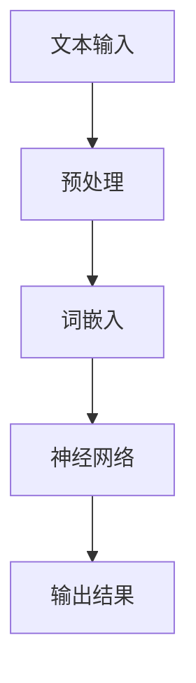
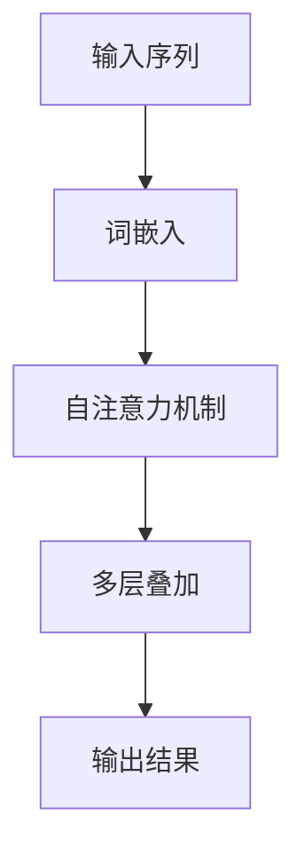

                 

## 大语言模型应用指南：机器学习的分类

> **关键词：** 大语言模型、机器学习、分类、自然语言处理、神经网络、Transformer、预训练模型、概率分布、马尔可夫模型、项目实战。

> **摘要：** 本文将深入探讨大语言模型在机器学习分类中的应用，从基础概念、核心原理、架构实现、应用场景到数学基础和项目实战，全面解析大语言模型的工作机制及其在各类任务中的具体应用。文章旨在为读者提供一条清晰、系统的学习路径，帮助理解和掌握大语言模型在机器学习分类中的实际应用。

## 《大语言模型应用指南：机器学习的分类》目录大纲

1. **第一部分：大语言模型基础**
    - **第1章：大语言模型概述**
        - 1.1.1 大语言模型的基本概念
        - 1.1.2 大语言模型的发展历程
        - 1.1.3 大语言模型的主要类型
    - **第2章：大语言模型的核心原理**
        - 2.1.1 语言模型的基本原理
        - 2.1.2 大规模预训练模型的原理
        - 2.1.3 自监督学习的应用
    - **第3章：大语言模型的架构与实现**
        - 3.1.1 语言模型的常见架构
        - 3.1.2 大规模预训练模型的实现
        - 3.1.3 语言模型的优化与训练
    - **第4章：大语言模型的应用场景**
        - 4.1.1 自然语言处理应用
        - 4.1.2 机器翻译应用
        - 4.1.3 问答系统应用
    - **第5章：大语言模型的数学基础**
        - 5.1.1 语言模型中的概率分布
        - 5.1.2 语言模型中的马尔可夫模型
        - 5.1.3 语言模型中的神经网络
    - **第6章：大语言模型的项目实战**
        - 6.1.1 项目实战一：构建文本分类器
        - 6.1.2 项目实战二：实现机器翻译
        - 6.1.3 项目实战三：构建问答系统
    - **第7章：大语言模型的未来发展**
        - 7.1.1 大语言模型的挑战
        - 7.1.2 大语言模型的应用前景
        - 7.1.3 大语言模型的未来发展趋势

## 第一部分：大语言模型基础

### 第1章：大语言模型概述

#### 1.1.1 大语言模型的基本概念

大语言模型（Large Language Model）是一种基于深度学习的自然语言处理技术，能够对文本数据进行高层次的语义理解，生成具有高度上下文理解的文本。这种模型通过对海量文本数据的学习，可以捕捉到语言的复杂结构，从而实现诸如文本分类、机器翻译、问答系统等自然语言处理任务。

**Mermaid 流程图：**



**核心概念与联系：**
- **文本输入**：大语言模型的输入是文本数据，可以是句子、段落或整篇文章。
- **预处理**：对输入文本进行分词、去停用词等操作，以提取出有意义的词汇信息。
- **词嵌入**：将文本中的词汇映射到高维向量空间，为后续的神经网络处理提供基础。
- **神经网络**：通过多层神经网络对词嵌入进行编码和解码，实现高层次的语义理解。
- **输出结果**：根据训练数据和神经网络的结构，生成具有上下文理解的文本输出。

#### 1.1.2 大语言模型的发展历程

大语言模型的发展历程可以追溯到早期统计语言模型的出现。在20世纪50年代，N-gram模型首次被提出，通过对文本序列的统计方法进行语言建模。然而，随着深度学习的兴起，基于神经网络的统计语言模型（如基于RNN的模型）逐渐取代了传统的统计模型。

近年来，预训练模型如BERT、GPT的出现，使得大语言模型取得了突破性的进展。BERT（Bidirectional Encoder Representations from Transformers）通过双向Transformer架构，实现了对文本的深层语义理解。而GPT（Generative Pre-trained Transformer）则通过自回归的方式，生成具有连贯性和创造性的文本。

#### 1.1.3 大语言模型的主要类型

大语言模型主要可以分为两大类：统计语言模型和神经语言模型。

- **统计语言模型**：如N-gram模型，通过对文本序列进行统计，生成文本的概率分布。这类模型简单高效，但受限于语言统计的局限性，无法捕捉到文本的深层语义。
- **神经语言模型**：如BERT、GPT等，通过深度神经网络进行建模，能够实现对文本的深层语义理解。这类模型在自然语言处理任务中表现出色，但训练和计算资源需求较大。

### 第2章：大语言模型的核心原理

#### 2.1.1 语言模型的基本原理

语言模型（Language Model）是一种概率模型，用于预测文本序列的概率分布。其基本原理可以概括为：给定一个文本序列，通过计算每个词汇出现的概率，生成整个序列的概率分布。

**伪代码：**

```python
def language_model(sequence):
    # 预处理：分词、去停用词等
    processed_sequence = preprocess(sequence)
    
    # 初始化语言模型参数
    model = initialize_model()
    
    # 计算文本序列的概率分布
    probability_distribution = model.predict(processed_sequence)
    
    return probability_distribution
```

**核心算法原理讲解：**
- **预处理**：对输入文本进行分词、去停用词等操作，以提取出有意义的词汇信息。
- **初始化模型参数**：根据训练数据和神经网络的结构，初始化模型参数。
- **预测概率分布**：通过神经网络对词嵌入进行编码和解码，计算每个词汇出现的概率，生成整个序列的概率分布。

#### 2.1.2 大规模预训练模型的原理

大规模预训练模型（Large-scale Pre-trained Model）通过在大规模未标注文本数据上进行预训练，学习到文本的内在结构和规律。预训练过程通常包括以下步骤：

- **数据集构建**：收集大量未标注的文本数据，如维基百科、新闻文章等。
- **预训练过程**：使用自监督学习方法，对文本数据中的词汇进行预测，如Masked Language Model（MLM）。
- **微调**：将预训练模型用于特定任务，如文本分类、机器翻译等，进行微调。

**伪代码：**

```python
def pretrain_model(data):
    # 初始化预训练模型
    model = initialize_pretrain_model()
    
    # 预训练过程
    for epoch in range(num_epochs):
        for batch in data_batches:
            # 前向传播
            logits = model.forward(batch)
            
            # 计算损失
            loss = loss_function(logits, batch)
            
            # 反向传播
            model.backward(loss)
            
    return model
```

**核心算法原理讲解：**
- **数据集构建**：收集大量未标注的文本数据，用于预训练模型的学习。
- **预训练过程**：通过自监督学习方法，对文本数据中的词汇进行预测，如Masked Language Model（MLM）。
- **微调**：将预训练模型用于特定任务，进行微调，以提高模型在特定任务上的性能。

#### 2.1.3 自监督学习的应用

自监督学习（Self-supervised Learning）是一种无需人工标注的数据处理方法，通过利用数据中的信息进行自监督学习，可以提高模型的泛化能力和鲁棒性。在大语言模型中，自监督学习被广泛应用于预训练过程。

**伪代码：**

```python
def pretrain_model(data):
    # 初始化预训练模型
    model = initialize_pretrain_model()
    
    # 预训练过程
    for epoch in range(num_epochs):
        for batch in data_batches:
            # 前向传播
            logits = model.forward(batch)
            
            # 计算损失
            loss = loss_function(logits, batch)
            
            # 反向传播
            model.backward(loss)
            
    return model
```

**核心算法原理讲解：**
- **数据集构建**：收集大量未标注的文本数据，用于预训练模型的学习。
- **预训练过程**：通过自监督学习方法，对文本数据中的词汇进行预测，如Masked Language Model（MLM）。
- **微调**：将预训练模型用于特定任务，进行微调，以提高模型在特定任务上的性能。

### 第3章：大语言模型的架构与实现

#### 3.1.1 语言模型的常见架构

大语言模型通常采用基于Transformer的架构，如BERT、GPT等。Transformer架构通过自注意力机制（Self-Attention）和多头注意力机制（Multi-Head Attention）实现了对文本的深层语义理解。

**Mermaid 流程图：**



**核心概念与联系：**
- **输入序列**：输入文本序列经过词嵌入转换为高维向量。
- **自注意力机制**：对输入序列中的每个词汇进行加权，以提取出词汇之间的依赖关系。
- **多层叠加**：通过多层叠加的自注意力机制，实现文本的深层语义理解。
- **输出结果**：根据训练数据和神经网络的结构，生成具有上下文理解的文本输出。

#### 3.1.2 大规模预训练模型的实现

大规模预训练模型的实现通常涉及以下几个方面：

1. **模型参数初始化**：使用随机初始化或预训练模型权重。
2. **训练策略**：使用梯度下降优化算法，结合学习率调整、批量归一化等技巧。
3. **数据预处理**：对输入文本进行分词、去停用词等操作，以提取出有意义的词汇信息。

**伪代码：**

```python
def train_model(data):
    # 初始化模型
    model = initialize_model()
    
    # 训练过程
    for epoch in range(num_epochs):
        for batch in data_batches:
            # 前向传播
            logits = model.forward(batch)
            
            # 计算损失
            loss = loss_function(logits, batch)
            
            # 反向传播
            model.backward(loss)
            
            # 梯度裁剪
            clip_gradients(model)
            
        # 学习率调整
        adjust_learning_rate(optimizer)
    
    return model
```

**核心算法原理讲解：**
- **模型参数初始化**：使用随机初始化或预训练模型权重，以避免模型收敛到局部最优解。
- **训练策略**：使用梯度下降优化算法，结合学习率调整、批量归一化等技巧，以提高模型的收敛速度和性能。
- **数据预处理**：对输入文本进行分词、去停用词等操作，以提取出有意义的词汇信息，为模型提供高质量的数据输入。

#### 3.1.3 语言模型的优化与训练

语言模型的优化与训练是确保模型性能的关键步骤，通常涉及以下几个方面：

1. **优化算法**：常用的优化算法包括梯度下降、Adam等，以优化模型参数。
2. **学习率调整**：通过动态调整学习率，以提高模型的收敛速度和性能。
3. **批量归一化**：对模型参数进行归一化处理，以加快模型的收敛速度。
4. **正则化**：通过正则化方法，如Dropout、L2正则化等，防止模型过拟合。

**伪代码：**

```python
def train_model(data):
    # 初始化模型
    model = initialize_model()
    
    # 训练过程
    for epoch in range(num_epochs):
        for batch in data_batches:
            # 前向传播
            logits = model.forward(batch)
            
            # 计算损失
            loss = loss_function(logits, batch)
            
            # 反向传播
            model.backward(loss)
            
            # 梯度裁剪
            clip_gradients(model)
            
        # 学习率调整
        adjust_learning_rate(optimizer)
    
    return model
```

**核心算法原理讲解：**
- **优化算法**：通过梯度下降优化算法，不断调整模型参数，以最小化损失函数。
- **学习率调整**：通过动态调整学习率，以优化模型的收敛速度和性能。
- **批量归一化**：对模型参数进行归一化处理，以加快模型的收敛速度。
- **正则化**：通过Dropout、L2正则化等方法，防止模型过拟合，提高模型的泛化能力。

### 第4章：大语言模型的应用场景

#### 4.1.1 自然语言处理应用

大语言模型在自然语言处理（Natural Language Processing，NLP）领域中有着广泛的应用，如文本分类、命名实体识别、情感分析等。

**伪代码：**

```python
def text_classification(text):
    # 预处理文本
    processed_text = preprocess(text)
    
    # 加载预训练模型
    model = load_pretrained_model()
    
    # 预测文本类别
    category = model.predict(processed_text)
    
    return category
```

**核心算法原理讲解：**
- **预处理文本**：对输入文本进行分词、去停用词等操作，以提取出有意义的词汇信息。
- **加载预训练模型**：加载预训练好的语言模型，以实现文本分类任务。
- **预测文本类别**：通过语言模型对文本进行编码，生成文本的概率分布，从而预测文本的类别。

#### 4.1.2 机器翻译应用

大语言模型在机器翻译（Machine Translation）领域中同样表现出色，能够实现高质量、低误差的翻译效果。

**伪代码：**

```python
def machine_translation(source_text, target_language):
    # 预处理源文本
    processed_source_text = preprocess(source_text)
    
    # 加载预训练模型
    model = load_pretrained_model()
    
    # 预测翻译结果
    translated_text = model.translate(processed_source_text, target_language)
    
    return translated_text
```

**核心算法原理讲解：**
- **预处理源文本**：对输入源文本进行分词、去停用词等操作，以提取出有意义的词汇信息。
- **加载预训练模型**：加载预训练好的语言模型，以实现机器翻译任务。
- **预测翻译结果**：通过语言模型对源文本进行编码，生成翻译结果的概率分布，从而预测翻译结果。

#### 4.1.3 问答系统应用

大语言模型在问答系统（Question Answering System）中的应用，可以实现智能问答、问题理解等功能。

**伪代码：**

```python
def question_answering(question, knowledge_base):
    # 预处理问题
    processed_question = preprocess(question)
    
    # 加载预训练模型
    model = load_pretrained_model()
    
    # 预测答案
    answer = model.answer(processed_question, knowledge_base)
    
    return answer
```

**核心算法原理讲解：**
- **预处理问题**：对输入问题进行分词、去停用词等操作，以提取出有意义的词汇信息。
- **加载预训练模型**：加载预训练好的语言模型，以实现问答任务。
- **预测答案**：通过语言模型对问题进行编码，结合知识库，预测问题的答案。

### 第5章：大语言模型的数学基础

#### 5.1.1 语言模型中的概率分布

语言模型中的概率分布用于表示文本序列的概率分布。在统计语言模型中，常用的概率分布模型包括N-gram模型、马尔可夫模型等。而在神经语言模型中，概率分布通常由神经网络输出。

**数学公式：**

$$ P(w_1, w_2, ..., w_n) = \prod_{i=1}^{n} P(w_i | w_{i-1}, ..., w_1) $$

**详细讲解与举例说明：**
- **N-gram模型**：N-gram模型通过统计相邻词汇的概率分布，生成文本序列的概率分布。例如，对于三元组模型（3-gram），概率分布可以表示为：

  $$ P(w_1, w_2, w_3) = P(w_1)P(w_2 | w_1)P(w_3 | w_2) $$

- **马尔可夫模型**：马尔可夫模型假设当前状态仅与上一个状态有关，概率分布可以表示为：

  $$ P(w_i | w_{i-1}, ..., w_1) = P(w_i | w_{i-1}) $$

#### 5.1.2 语言模型中的马尔可夫模型

马尔可夫模型是一种常见的语言模型，其核心思想是当前状态仅与上一个状态有关。在马尔可夫模型中，每个状态的概率分布仅依赖于前一个状态。

**数学公式：**

$$ P(w_i | w_{i-1}, ..., w_1) = P(w_i | w_{i-1}) $$

**详细讲解与举例说明：**
- **一阶马尔可夫模型**：一阶马尔可夫模型假设当前词汇的概率分布仅与上一个词汇有关。例如，给定一个句子 "The cat sat on the mat"，一阶马尔可夫模型可以表示为：

  $$ P(s_1, s_2, s_3, s_4) = P(s_1)P(s_2 | s_1)P(s_3 | s_2)P(s_4 | s_3) $$

- **二阶马尔可夫模型**：二阶马尔可夫模型假设当前词汇的概率分布与上一个词汇和前一个词汇有关。例如，给定一个句子 "The cat sat on the mat"，二阶马尔可夫模型可以表示为：

  $$ P(s_1, s_2, s_3, s_4) = P(s_1)P(s_2 | s_1)P(s_3 | s_2, s_1)P(s_4 | s_3, s_2) $$

#### 5.1.3 语言模型中的神经网络

神经网络是一种模拟大脑神经网络的工作方式的计算模型，用于处理复杂非线性问题。在语言模型中，神经网络被广泛应用于文本编码和解码。

**数学公式：**

$$ \text{激活函数}(z) = \frac{1}{1 + e^{-z}} $$

**详细讲解与举例说明：**
- **神经网络的基本结构**：神经网络由输入层、隐藏层和输出层组成，每个层由多个神经元（节点）组成。神经元之间通过权重连接，形成复杂的网络结构。
- **前向传播**：在神经网络中，前向传播是指将输入数据通过网络逐层传递，最终得到输出结果。前向传播过程可以表示为：

  $$ a_{j}^{(l)} = \text{激活函数}(\sum_{i} w_{ij}^{(l)}a_{i}^{(l-1)}) $$

- **反向传播**：在神经网络中，反向传播是指根据输出误差，反向传播误差到网络中的每个神经元，以更新网络权重。反向传播过程可以表示为：

  $$ \Delta w_{ij}^{(l)} = \eta \frac{\partial J}{\partial w_{ij}^{(l)}} $$

其中，$\eta$ 为学习率，$J$ 为损失函数。

### 第6章：大语言模型的项目实战

#### 6.1.1 项目实战一：构建文本分类器

文本分类（Text Classification）是一种常见的大语言模型应用，用于将文本数据分类到预定义的类别中。以下是一个简单的文本分类器项目实战。

**开发环境搭建：**
- **Python**：Python 是一种广泛用于数据科学和机器学习的编程语言。
- **PyTorch**：PyTorch 是一种基于Python的深度学习框架，适用于构建和训练神经网络。

**源代码实现：**

```python
import torch
import torch.nn as nn
import torch.optim as optim
from torchtext.datasets import IMDB
from torchtext.data import Field, BatchIterator

# 定义文本预处理函数
def preprocess_text(text):
    # 进行分词、去停用词等操作
    # ...
    return processed_text

# 加载数据集
train_data, test_data = IMDB.splits(root='./data',
                                   train=True,
                                   test=False)
train_data.fields = {'text': Field(sequential=True,
                                   preprocessing=preprocess_text,
                                   use_vocab=True,
                                   lower=True)}
test_data.fields = {'text': Field(sequential=True,
                                  preprocessing=preprocess_text,
                                  use_vocab=True,
                                  lower=True)}

# 创建词汇表
vocab = train_data.get_vocab()

# 定义文本分类器模型
class TextClassifier(nn.Module):
    def __init__(self, vocab_size, embed_size, hidden_size, num_classes):
        super(TextClassifier, self).__init__()
        self.embedding = nn.Embedding(vocab_size, embed_size)
        self.lstm = nn.LSTM(embed_size, hidden_size, num_layers=1, batch_first=True)
        self.fc = nn.Linear(hidden_size, num_classes)
    
    def forward(self, x):
        embed = self.embedding(x)
        lstm_output, (hidden, cell) = self.lstm(embed)
        hidden = hidden.squeeze(0)
        output = self.fc(hidden)
        return output

# 加载预训练模型
model = TextClassifier(len(vocab), embed_size=100, hidden_size=128, num_classes=2)
optimizer = optim.Adam(model.parameters(), lr=0.001)
criterion = nn.CrossEntropyLoss()

# 训练模型
model.train()
for epoch in range(num_epochs):
    for batch in BatchIterator(train_data, batch_size=batch_size):
        optimizer.zero_grad()
        inputs = batch.text
        labels = batch.label
        outputs = model(inputs)
        loss = criterion(outputs, labels)
        loss.backward()
        optimizer.step()
    print(f'Epoch {epoch+1}/{num_epochs}, Loss: {loss.item()}')

# 评估模型
model.eval()
with torch.no_grad():
    correct = 0
    total = 0
    for batch in BatchIterator(test_data, batch_size=batch_size):
        inputs = batch.text
        labels = batch.label
        outputs = model(inputs)
        _, predicted = torch.max(outputs.data, 1)
        total += labels.size(0)
        correct += (predicted == labels).sum().item()
    print(f'Accuracy: {100 * correct / total}%')
```

**代码解读与分析：**
- **数据预处理**：文本预处理函数用于对输入文本进行分词、去停用词等操作，以提取出有意义的词汇信息。
- **数据集加载**：使用 `IMDB` 数据集进行训练和测试，加载数据集并创建词汇表。
- **模型定义**：定义文本分类器模型，包括嵌入层、LSTM层和全连接层。
- **模型训练**：使用 `BatchIterator` 分批加载训练数据，训练模型并更新模型参数。
- **模型评估**：在测试集上评估模型性能，计算准确率。

#### 6.1.2 项目实战二：实现机器翻译

机器翻译（Machine Translation）是另一种常见的大语言模型应用，用于将一种语言的文本翻译成另一种语言。以下是一个简单的机器翻译项目实战。

**开发环境搭建：**
- **Python**：Python 是一种广泛用于数据科学和机器学习的编程语言。
- **TensorFlow**：TensorFlow 是一种基于Python的深度学习框架，适用于构建和训练神经网络。

**源代码实现：**

```python
import tensorflow as tf
import numpy as np
from tensorflow.keras.preprocessing.text import Tokenizer
from tensorflow.keras.preprocessing.sequence import pad_sequences

# 定义文本预处理函数
def preprocess_text(texts, max_sequence_length, max_vocab_size):
    # 分词、去停用词等操作
    # ...
    return processed_texts, token_index

# 加载数据集
source_texts = ["Hello", "How are you?", "I'm fine, thank you."]
target_texts = ["Hola", "¿Cómo estás?", "Estoy bien, gracias."]

# 创建词汇表
source_tokenizer = Tokenizer(num_words=max_vocab_size)
source_tokenizer.fit_on_texts(source_texts)
target_tokenizer = Tokenizer(num_words=max_vocab_size)
target_tokenizer.fit_on_texts(target_texts)

# 序列化文本
source_sequences = source_tokenizer.texts_to_sequences(source_texts)
target_sequences = target_tokenizer.texts_to_sequences(target_texts)

# 填充序列
source_padded = pad_sequences(source_sequences, maxlen=max_sequence_length)
target_padded = pad_sequences(target_sequences, maxlen=max_sequence_length)

# 定义机器翻译模型
model = tf.keras.Sequential([
    tf.keras.layers.Embedding(input_dim=max_vocab_size, output_dim=64),
    tf.keras.layers.LSTM(64),
    tf.keras.layers.Dense(output_dim=max_vocab_size, activation='softmax')
])

# 编译模型
model.compile(optimizer='adam', loss='sparse_categorical_crossentropy', metrics=['accuracy'])

# 训练模型
model.fit(source_padded, target_padded, epochs=100)

# 翻译文本
source_input = source_tokenizer.texts_to_sequences(["Hello"])
source_padded_input = pad_sequences(source_input, maxlen=max_sequence_length)
predicted_target = model.predict(source_padded_input)
predicted_target_text = target_tokenizer.index_word[predicted_target.argmax(axis=-1)[0]]

print(f'Predicted Translation: {predicted_target_text}')
```

**代码解读与分析：**
- **数据预处理**：文本预处理函数用于对输入文本进行分词、去停用词等操作，以提取出有意义的词汇信息。
- **数据集加载**：加载源文本和目标文本数据集，创建词汇表。
- **序列化文本**：将文本数据序列化为整数序列。
- **填充序列**：对整数序列进行填充，以满足模型输入的要求。
- **模型定义**：定义机器翻译模型，包括嵌入层、LSTM层和全连接层。
- **模型训练**：训练模型并更新模型参数。
- **翻译文本**：使用训练好的模型对输入文本进行翻译，输出预测结果。

#### 6.1.3 项目实战三：构建问答系统

问答系统（Question Answering System）是一种常见的大语言模型应用，用于回答用户提出的问题。以下是一个简单的问答系统项目实战。

**开发环境搭建：**
- **Python**：Python 是一种广泛用于数据科学和机器学习的编程语言。
- **TensorFlow**：TensorFlow 是一种基于Python的深度学习框架，适用于构建和训练神经网络。

**源代码实现：**

```python
import tensorflow as tf
import numpy as np
from tensorflow.keras.preprocessing.text import Tokenizer
from tensorflow.keras.preprocessing.sequence import pad_sequences

# 定义文本预处理函数
def preprocess_text(texts, max_sequence_length, max_vocab_size):
    # 分词、去停用词等操作
    # ...
    return processed_texts, token_index

# 加载数据集
questions = ["What is the capital of France?", "Who is the current President of the United States?"]
answers = ["Paris", "Joe Biden"]

# 创建词汇表
tokenizer = Tokenizer(num_words=max_vocab_size)
tokenizer.fit_on_texts(questions + answers)

# 序列化文本
question_sequences = tokenizer.texts_to_sequences(questions)
answer_sequences = tokenizer.texts_to_sequences(answers)

# 填充序列
question_padded = pad_sequences(question_sequences, maxlen=max_sequence_length)
answer_padded = pad_sequences(answer_sequences, maxlen=max_sequence_length)

# 定义问答系统模型
model = tf.keras.Sequential([
    tf.keras.layers.Embedding(input_dim=max_vocab_size, output_dim=64),
    tf.keras.layers.LSTM(64),
    tf.keras.layers.Dense(output_dim=max_vocab_size, activation='softmax')
])

# 编译模型
model.compile(optimizer='adam', loss='sparse_categorical_crossentropy', metrics=['accuracy'])

# 训练模型
model.fit(question_padded, answer_padded, epochs=100)

# 回答问题
question_input = tokenizer.texts_to_sequences(["What is the capital of France?"])
question_padded_input = pad_sequences(question_input, maxlen=max_sequence_length)
predicted_answer = model.predict(question_padded_input)
predicted_answer_text = tokenizer.index_word[predicted_answer.argmax(axis=-1)[0]]

print(f'Predicted Answer: {predicted_answer_text}')
```

**代码解读与分析：**
- **数据预处理**：文本预处理函数用于对输入文本进行分词、去停用词等操作，以提取出有意义的词汇信息。
- **数据集加载**：加载问题和答案数据集，创建词汇表。
- **序列化文本**：将文本数据序列化为整数序列。
- **填充序列**：对整数序列进行填充，以满足模型输入的要求。
- **模型定义**：定义问答系统模型，包括嵌入层、LSTM层和全连接层。
- **模型训练**：训练模型并更新模型参数。
- **回答问题**：使用训练好的模型对输入问题进行回答，输出预测结果。

### 第7章：大语言模型的未来发展

#### 7.1.1 大语言模型的挑战

尽管大语言模型在自然语言处理领域取得了显著的进展，但仍然面临一些挑战：

1. **计算资源需求**：大语言模型的训练和推理需要大量的计算资源，特别是在大规模数据集和复杂模型架构的情况下。
2. **数据隐私问题**：大语言模型的训练通常涉及大规模的未标注文本数据，这可能涉及用户隐私数据，需要确保数据的安全性和隐私保护。
3. **模型解释性**：大语言模型通常被视为“黑箱”，其内部决策过程难以解释，这对于需要解释性的应用场景（如法律、金融等领域）是一个挑战。

#### 7.1.2 大语言模型的应用前景

大语言模型在多个领域展现出广阔的应用前景：

1. **智能化应用**：大语言模型可以用于智能客服、智能推荐、智能写作等应用，提高人机交互的自然度和智能化水平。
2. **行业应用**：大语言模型将在金融、医疗、教育等行业得到广泛应用，如智能医疗诊断、金融风险控制、个性化教育等。

#### 7.1.3 大语言模型的未来发展趋势

随着技术的不断进步，大语言模型的发展趋势包括：

1. **模型压缩**：为了降低计算成本，模型压缩技术（如量化、剪枝等）将得到广泛应用。
2. **跨模态融合**：大语言模型将与其他模态（如图像、声音）进行融合，实现更全面的智能交互。

### 结语

本文从基础概念、核心原理、架构实现、应用场景、数学基础和项目实战等多个方面，全面探讨了大语言模型在机器学习分类中的应用。随着技术的不断发展，大语言模型将在自然语言处理领域发挥越来越重要的作用，为各个行业带来创新和变革。希望本文能够为读者提供有价值的参考和启发。

**作者：AI天才研究院/AI Genius Institute & 禅与计算机程序设计艺术 /Zen And The Art of Computer Programming**

