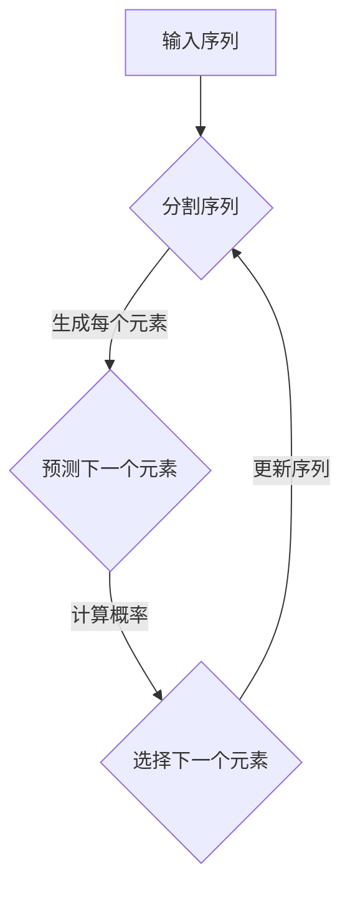
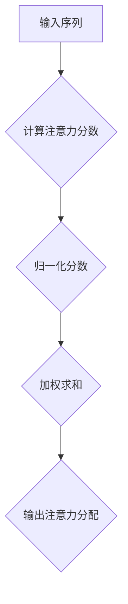
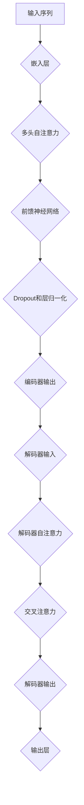

                 

### 大语言模型应用指南：自回归模型与文本生成

> **关键词**：大语言模型、自回归模型、文本生成、预训练、微调、Transformer、多模态学习

> **摘要**：本文旨在深入探讨大语言模型的应用，重点介绍自回归模型及其在文本生成领域的应用。通过详细分析自回归模型的基本概念、数学原理、应用场景和优化策略，读者可以全面了解这一关键技术，并掌握其实际应用方法。本文还将探讨大语言模型的发展趋势和未来应用挑战，为研究人员和开发者提供有价值的参考。

### 第一部分：大语言模型基础

#### 第1章：大语言模型概述

##### 1.1 大语言模型的兴起与影响

###### 1.1.1 大语言模型的发展历程

大语言模型的兴起可以追溯到20世纪80年代，当时出现了最早的统计语言模型，如n-gram模型。这种模型通过统计词频序列来预测下一个词。然而，随着计算能力和数据资源的提升，研究者开始探索更加复杂的模型。Word2Vec模型在2013年提出，它将词汇映射为密集向量，使得词汇间的相似性可以通过向量空间中的距离来衡量。这一突破为自然语言处理（NLP）领域带来了新的活力。

然而，随着数据规模的扩大和计算资源的提升，单一词汇向量模型已经无法满足复杂语言任务的需求。于是，研究者提出了预训练语言模型（Pre-Trained Language Model），其中最具代表性的就是GPT（Generative Pre-trained Transformer）和BERT（Bidirectional Encoder Representations from Transformers）。这些模型通过在大规模语料库上进行预训练，然后针对特定任务进行微调，大大提高了NLP任务的表现。

###### 1.1.2 大语言模型的应用领域

大语言模型的应用领域非常广泛，包括但不限于以下方面：

- **文本生成**：大语言模型可以生成高质量的文本，如文章、故事、对话等。
- **自然语言理解**：大语言模型可以理解和处理自然语言，包括语义理解、情感分析等。
- **情感分析**：大语言模型可以分析文本的情感倾向，用于社交媒体监控、市场调研等。
- **机器翻译**：大语言模型可以用于机器翻译，实现跨语言文本的准确翻译。

##### 1.2 大语言模型的核心概念

###### 1.2.1 自回归模型

自回归模型（Autoregressive Model）是一种能够预测序列数据的方法。在自然语言处理中，自回归模型可以用来预测下一个单词、字符或标记。其基本原理是利用已生成的部分序列来预测下一个元素。

自回归模型的数学模型可以表示为：

$$
P(x_1, x_2, ..., x_T) = \prod_{t=1}^{T} P(x_t | x_{<t})
$$

其中，$x_1, x_2, ..., x_T$ 表示序列中的各个元素，$x_{<t}$ 表示 $t$ 之前的元素集合。

Mermaid流程图如下：



###### 1.2.2 预训练与微调

预训练（Pre-training）是指在大规模未标注数据上训练模型，使其具备一定的语言理解能力。预训练后，模型通常通过微调（Fine-tuning）来适应特定任务。微调过程通常在标注数据上进行，以提高模型在特定任务上的表现。

预训练与微调的过程可以总结为：

1. **预训练**：使用未标注数据训练模型，如使用GPT或BERT模型在大规模文本数据上进行预训练。
2. **微调**：使用标注数据对预训练模型进行微调，以适应特定任务，如文本生成、情感分析等。

##### 1.3 大语言模型的工作机制

###### 1.3.1 预训练与微调

如前所述，预训练与微调是构建大语言模型的关键步骤。预训练模型在大规模文本数据上学习语言规律，然后通过微调来适应特定任务。具体流程如下：

1. **数据收集**：收集大量未标注文本数据，用于预训练。
2. **预训练**：使用预训练模型（如GPT或BERT）在大规模文本数据上训练，学习语言规律。
3. **微调**：使用标注数据对预训练模型进行微调，以适应特定任务。

###### 1.3.2 模型解析与优化

大语言模型的解析与优化是提升模型性能的关键步骤。以下是一些常用的优化方法：

1. **模型架构**：选择合适的模型架构，如Transformer、BERT等。
2. **优化算法**：使用高效的优化算法，如Adam、AdamW等。
3. **正则化**：应用正则化方法，如Dropout、权重衰减等，防止过拟合。

##### 1.4 大语言模型的发展趋势

###### 1.4.1 研究热点

当前大语言模型的研究热点包括：

- **多模态学习**：结合文本、图像、声音等多种模态数据，提高模型的表现。
- **低资源语言模型**：针对低资源语言开发高效模型，提高全球语言处理的普及性。
- **可解释性**：研究模型内部的决策过程，提高模型的可解释性和可靠性。

###### 1.4.2 应用挑战与解决方案

大语言模型在实际应用中面临一些挑战，如：

- **数据隐私**：预训练过程中涉及大量隐私数据，需要保护用户隐私。
- **计算资源消耗**：大语言模型训练和推理需要大量计算资源，需要优化算法和硬件支持。

针对这些挑战，研究者提出了一些解决方案，如：

- **数据隐私保护**：使用差分隐私等技术保护用户隐私。
- **计算资源优化**：采用分布式训练、模型压缩等技术降低计算资源需求。

#### 第2章：自回归模型基础

##### 2.1 自回归模型的基本概念

###### 2.1.1 自回归模型定义

自回归模型是一种统计模型，用于预测时间序列或序列数据。其核心思想是利用已观测到的序列部分来预测下一个元素。自回归模型广泛应用于时间序列预测、文本生成等领域。

自回归模型的伪代码如下：

```
function autoregressive_model(sequence):
    for t in range(1, length(sequence)):
        predict_next_element(sequence[:t])
```

###### 2.1.2 自回归模型数学原理

自回归模型可以表示为以下数学模型：

$$
y_t = f(y_{t-1}, y_{t-2}, ..., y_{t-k})
$$

其中，$y_t$ 表示时间序列的当前元素，$k$ 表示滞后阶数，$f$ 表示预测函数。

在自然语言处理中，自回归模型通常使用神经网络来实现，如下所示：

$$
P(x_t | x_{<t}) = \frac{exp(-\frac{1}{2} \sum_{i=1}^{d} (x_t - \theta_i)^2)}{\sum_{j=1}^{d} exp(-\frac{1}{2} \sum_{i=1}^{d} (x_t - \theta_j)^2)}
$$

其中，$x_t$ 表示序列中的当前元素，$\theta_i$ 表示神经网络模型的参数。

##### 2.2 自回归模型数学原理

###### 2.2.1 数学模型

自回归模型的数学模型可以表示为：

$$
P(x_1, x_2, ..., x_T) = \prod_{t=1}^{T} P(x_t | x_{<t})
$$

其中，$x_1, x_2, ..., x_T$ 表示序列中的各个元素，$x_{<t}$ 表示 $t$ 之前的元素集合。

该模型的核心思想是利用已生成的部分序列来预测下一个元素。

###### 2.2.2 算法伪代码

自回归模型的算法伪代码如下：

```
function autoregressive_model(sequence, model):
    predicted_sequence = []
    for t in range(1, length(sequence)):
        input_sequence = sequence[:t]
        predicted_element = model.predict(input_sequence)
        predicted_sequence.append(predicted_element)
    return predicted_sequence
```

该算法首先初始化一个空序列 `predicted_sequence`，然后依次预测每个元素，并将其添加到 `predicted_sequence` 中。

##### 2.3 自回归模型的应用场景

自回归模型在文本生成和机器翻译等任务中得到了广泛应用。以下是一些具体的应用场景：

###### 2.3.1 文本生成

自回归模型可以用于生成高质量的文本。例如，在生成文章、故事、对话等文本时，自回归模型可以根据已生成的部分文本来预测下一个单词或句子。

###### 2.3.2 机器翻译

自回归模型可以用于机器翻译，即将一种语言的文本翻译成另一种语言。自回归模型可以基于已生成的部分文本来预测下一个字符或单词，从而实现准确翻译。

在实际应用中，自回归模型通常使用神经网络来实现，如Transformer模型。以下是一个基于Transformer的自回归文本生成算法的伪代码：

```
function autoregressive_text_generation(text, model):
    predicted_text = ""
    for char in text:
        input_text = predicted_text + char
        predicted_char = model.predict(input_text)
        predicted_text += predicted_char
    return predicted_text
```

该算法首先初始化一个空字符串 `predicted_text`，然后依次预测每个字符，并将其添加到 `predicted_text` 中。

#### 第3章：自回归模型高级特性

##### 3.1 自回归模型的扩展

自回归模型可以通过引入注意力机制和Transformer架构来提高其性能和表现。以下是对这些扩展的详细讨论。

###### 3.1.1 注意力机制

注意力机制（Attention Mechanism）是一种用于捕捉序列数据中重要元素的方法。在自回归模型中，注意力机制可以帮助模型更好地聚焦于关键信息，从而提高预测准确性。

注意力机制的数学模型可以表示为：

$$
\alpha_t = \frac{exp(\frac{1}{\tau} \cdot \text{score}(x_t, x_{<t}))}{\sum_{j=1}^{T} exp(\frac{1}{\tau} \cdot \text{score}(x_j, x_{<t}))}
$$

其中，$x_t$ 表示时间序列中的当前元素，$\text{score}(x_t, x_{<t})$ 表示注意力分数，$\tau$ 是温度参数。

Mermaid流程图如下：



通过注意力机制，模型可以动态地分配权重，使得关键信息在预测过程中得到更多的关注。

###### 3.1.2 Transformer架构

Transformer架构是一种基于自回归模型的神经网络架构，它通过多头注意力机制和编码器-解码器结构实现了优秀的性能。Transformer模型的核心思想是使用自注意力机制来计算序列中的依赖关系，而不是传统的循环神经网络（RNN）。

Transformer架构的Mermaid流程图如下：



在Transformer架构中，编码器（Encoder）负责处理输入序列，解码器（Decoder）负责生成输出序列。自注意力机制和交叉注意力机制使得模型可以同时关注输入和输出序列，从而提高预测准确性。

##### 3.2 自回归模型优化策略

自回归模型的优化策略是提高模型性能和准确性的关键。以下是一些常用的优化策略：

###### 3.2.1 梯度下降算法

梯度下降算法（Gradient Descent）是一种用于优化神经网络参数的算法。在自回归模型中，梯度下降算法可以通过计算损失函数关于模型参数的梯度来更新模型参数，从而减小损失。

梯度下降算法的数学模型可以表示为：

$$
\theta_{t+1} = \theta_t - \alpha \cdot \nabla_\theta J(\theta)
$$

其中，$\theta_t$ 表示当前模型参数，$\alpha$ 是学习率，$J(\theta)$ 是损失函数。

通过梯度下降算法，模型可以在训练过程中逐渐减小损失，从而提高预测准确性。

###### 3.2.2 Adam优化器

Adam优化器（Adam Optimizer）是一种基于梯度下降的优化算法，它结合了AdaGrad和RMSProp的优点。Adam优化器通过计算一阶矩估计（均值）和二阶矩估计（方差），自动调整学习率，从而提高模型的收敛速度和稳定性。

Adam优化器的数学模型可以表示为：

$$
m_t = \beta_1 x_t + (1 - \beta_1) (x_t - x_{t-1})
$$

$$
v_t = \beta_2 x_t + (1 - \beta_2) (x_t - x_{t-1})
$$

$$
\theta_{t+1} = \theta_t - \alpha \cdot \frac{m_t}{\sqrt{v_t} + \epsilon}
$$

其中，$m_t$ 和 $v_t$ 分别表示一阶矩估计和二阶矩估计，$\beta_1$ 和 $\beta_2$ 是超参数，$\epsilon$ 是一个小常数。

通过Adam优化器，模型可以在训练过程中自动调整学习率，从而提高模型的收敛速度和稳定性。

##### 3.3 自回归模型性能评估

自回归模型的性能评估是衡量模型表现的重要手段。以下是一些常用的性能评估指标：

###### 3.3.1 评估指标

- **准确率**（Accuracy）：模型正确预测的样本数占总样本数的比例。
- **召回率**（Recall）：模型正确预测的样本数与实际为正类的样本数之比。
- **精确率**（Precision）：模型正确预测的样本数与预测为正类的样本数之比。
- **F1值**（F1 Score）：精确率和召回率的调和平均值。

通过这些评估指标，可以全面了解自回归模型的性能表现。

###### 3.3.2 实际案例分析

在实际应用中，自回归模型常用于文本生成和机器翻译等任务。以下是一个实际案例分析：

- **文本生成**：使用自回归模型生成文章。通过在预训练模型上进行微调，模型可以生成具有连贯性和逻辑性的文章。评估指标包括准确率和F1值。
- **机器翻译**：使用自回归模型进行机器翻译。通过在预训练模型上进行微调，模型可以生成高质量的翻译结果。评估指标包括准确率和BLEU值。

这些案例展示了自回归模型在实际应用中的性能表现。

### 第二部分：自回归模型原理

#### 第2章：自回归模型基础

##### 2.1 自回归模型的基本概念

###### 2.1.1 自回归模型定义

自回归模型是一种时间序列预测模型，它使用过去的数据来预测未来的数据。这种模型在自然语言处理、金融时间序列分析等领域有着广泛的应用。自回归模型的定义可以简单概括为：

$$
y_t = f(y_{t-1}, y_{t-2}, ..., y_{t-k}) + \epsilon_t
$$

其中，$y_t$ 是时间序列的第 $t$ 个数据点，$k$ 是滞后阶数，$f$ 是一个函数，用于捕捉时间序列中的依赖关系，$\epsilon_t$ 是误差项。

###### 2.1.2 自回归模型数学原理

自回归模型的核心在于如何利用历史数据来预测未来的数据点。其数学原理可以通过以下公式来描述：

$$
P(y_t | y_{<t}) = \frac{1}{Z} \prod_{i=1}^{t-k} \phi(y_{i}, y_t)
$$

其中，$P(y_t | y_{<t})$ 是给定历史数据 $y_{<t}$ 下时间点 $t$ 的概率分布，$\phi(y_{i}, y_t)$ 是条件概率分布，$Z$ 是规范化常数，以确保概率分布的和为1。

在自回归模型中，$\phi(y_{i}, y_t)$ 通常是一个高斯分布，表示时间序列点 $y_t$ 是在给定前 $k$ 个时间点 $y_{1}, y_{2}, ..., y_{k}$ 下的条件概率分布。具体来说：

$$
\phi(y_t | y_{1}, y_{2}, ..., y_{k}) = \mathcal{N}(y_t; \mu(y_{1}, y_{2}, ..., y_{k}), \sigma^2(y_{1}, y_{2}, ..., y_{k}))
$$

其中，$\mu(y_{1}, y_{2}, ..., y_{k})$ 是均值函数，$\sigma^2(y_{1}, y_{2}, ..., y_{k})$ 是方差函数。

为了更直观地理解自回归模型的数学原理，我们可以使用伪代码来表示：

```
function autoregressive_model(y_t, k, model):
    for i in range(1, k+1):
        if i == 1:
            current_context = y_t
        else:
            current_context += y_t - y_{i-1}
        
        prediction = model.predict(current_context)
        y_t = prediction
        
    return y_t
```

在这个伪代码中，$y_t$ 是当前时间点的预测值，$k$ 是滞后阶数，$model$ 是自回归模型。模型使用前 $k$ 个时间点的数据来预测下一个时间点的值。

##### 2.2 自回归模型的应用场景

自回归模型在多个领域有着广泛的应用。以下是一些典型的应用场景：

###### 2.2.1 文本生成

自回归模型可以用于生成文本，如文章、故事、对话等。通过训练模型来预测下一个单词或字符，可以生成连贯且符合语法规则的文本。例如，在生成自然语言对话系统时，自回归模型可以根据已生成的部分对话来预测下一个回复。

###### 2.2.2 机器翻译

自回归模型可以用于机器翻译，即将一种语言的文本翻译成另一种语言。通过训练模型来预测下一个单词或字符，可以实现准确翻译。例如，在机器翻译任务中，模型可以基于已生成的部分文本来预测下一个翻译结果。

###### 2.2.3 股票价格预测

自回归模型可以用于股票价格预测，即根据历史股价来预测未来的股价走势。通过训练模型来预测下一个时间点的股价，可以帮助投资者做出更明智的投资决策。

在以上应用场景中，自回归模型的核心在于利用历史数据来预测未来数据点。通过不断更新历史数据，模型可以逐步提高预测的准确性。

### 第三部分：文本生成应用

#### 第4章：文本生成基础

##### 4.1 文本生成概述

###### 4.1.1 文本生成任务

文本生成是自然语言处理领域的一个重要任务，旨在使用算法自动生成自然语言的文本。文本生成任务可以细分为以下几类：

1. **生成式文本生成**：这类任务通过生成整个文本来完成任务，如生成新闻文章、故事、对话等。常见的生成式模型包括自回归模型、序列到序列（Seq2Seq）模型、生成对抗网络（GAN）等。
2. **抽取式文本生成**：这类任务从现有文本中提取信息并生成新的文本。例如，摘要生成、标题生成等。常见的抽取式模型包括命名实体识别、关系抽取、模板匹配等。
3. **增强式文本生成**：这类任务通过增强现有文本的信息来生成新的文本，以提高文本的质量和吸引力。例如，文本润色、情感增强等。

文本生成任务的实现流程通常包括以下几个步骤：

1. **数据预处理**：首先，需要收集和处理大量的文本数据。数据预处理步骤包括数据清洗、分词、去停用词、词性标注等，以便将文本数据转换为适合模型输入的格式。
2. **模型选择**：根据任务的类型和需求，选择合适的文本生成模型。常见的模型包括自回归模型、Transformer模型、BERT模型等。
3. **模型训练**：使用预处理后的数据对选定的模型进行训练，以学习文本的生成规律。
4. **文本生成**：在模型训练完成后，使用模型生成新的文本。生成过程可以根据具体任务需求进行调整，如生成完整文章、生成标题、生成摘要等。
5. **评估与优化**：对生成的文本进行评估，以确定模型的性能。根据评估结果，对模型进行优化，以提高生成文本的质量。

文本生成任务的应用场景非常广泛，包括但不限于以下方面：

- **自然语言对话系统**：通过文本生成模型，可以生成自然、流畅的对话回复，应用于客服机器人、聊天机器人等。
- **内容创作**：文本生成模型可以自动生成新闻文章、故事、博客等，减轻人工创作负担。
- **自动化摘要**：文本生成模型可以自动提取文本的主要信息，生成摘要，用于信息检索、文档分类等。
- **教育辅导**：文本生成模型可以生成个性化的学习材料，如练习题、解答等，帮助学生更好地理解知识。

###### 4.1.2 模型选择

在文本生成任务中，选择合适的模型至关重要。以下是一些常用的文本生成模型及其特点：

1. **自回归模型**：自回归模型是一种基于序列预测的模型，通过预测下一个单词或字符来生成文本。典型的自回归模型包括LSTM（Long Short-Term Memory）和GRU（Gated Recurrent Unit）。自回归模型的优势在于可以生成连贯、自然的文本，但可能存在长期依赖性处理问题。
2. **Transformer模型**：Transformer模型是一种基于注意力机制的序列模型，通过多头自注意力机制来捕捉序列中的依赖关系。Transformer模型在生成式文本生成任务中表现出色，能够生成高质量的自然语言文本。
3. **BERT模型**：BERT（Bidirectional Encoder Representations from Transformers）模型是一种双向Transformer模型，通过同时考虑序列的前后依赖关系来提高文本理解能力。BERT模型在文本生成任务中也取得了很好的效果，尤其适用于抽取式文本生成任务。

在文本生成任务中，可以根据具体需求选择合适的模型。例如，对于生成连贯文本的任务，可以选择自回归模型或Transformer模型；对于提取文本信息的任务，可以选择BERT模型。

##### 4.2 基于自回归模型的文本生成

基于自回归模型的文本生成是通过预测序列中的下一个元素来生成文本。以下是一个基于自回归模型的文本生成算法的伪代码：

```
function text_generation(model, start_sequence, max_length):
    generated_sequence = start_sequence
    for _ in range(max_length - len(start_sequence)):
        input_sequence = generated_sequence[-model.seq_len:]
        prediction = model.predict(input_sequence)
        next_word = prediction.argmax()
        generated_sequence += next_word
    return generated_sequence
```

在这个伪代码中，`model` 是训练好的自回归模型，`start_sequence` 是初始输入序列，`max_length` 是生成的最大长度。算法首先初始化一个空序列 `generated_sequence`，然后依次预测序列中的下一个元素，并将其添加到 `generated_sequence` 中。

基于自回归模型的文本生成算法通常涉及以下几个关键步骤：

1. **初始化**：设定初始输入序列，可以是空序列或预定义的种子文本。
2. **生成**：使用模型预测序列中的下一个元素，并将其添加到生成的序列中。
3. **终止条件**：设定生成序列的最大长度或生成终止条件，如生成文本达到指定长度或文本生成质量不满足要求。
4. **评估与优化**：对生成的文本进行评估，根据评估结果对模型进行调整和优化。

在实际应用中，基于自回归模型的文本生成算法可以生成高质量的自然语言文本，但需要合理设置模型参数和生成策略，以提高生成文本的质量和多样性。

##### 4.3 文本生成算法优化

在文本生成任务中，优化算法的性能是提高生成文本质量的关键。以下是一些常用的文本生成算法优化策略：

###### 4.3.1 生成策略优化

生成策略是指控制文本生成过程的策略，以下是一些常用的生成策略：

1. **采样策略**：采样策略决定了如何从模型输出的概率分布中采样下一个元素。常见的采样方法包括确定性采样（如argmax）和随机采样（如Top-k采样和温度调节）。通过调整采样策略，可以控制生成文本的多样性和连贯性。
2. **序列填充策略**：序列填充策略用于在生成文本中填充适当的停用词、标点符号等，以增强文本的自然性和可读性。
3. **重复控制策略**：重复控制策略用于减少生成文本中的重复词语，以避免生成单调、无意义的文本。

通过优化生成策略，可以显著提高生成文本的质量和多样性。

###### 4.3.2 模型优化策略

模型优化策略是指改进模型结构和参数设置的方法。以下是一些常用的模型优化策略：

1. **模型架构优化**：通过调整模型架构，如增加层数、隐藏单元数量等，可以提高模型的生成能力。例如，使用深度LSTM或Transformer模型可以提高文本生成质量。
2. **正则化策略**：正则化策略用于防止过拟合，提高模型的泛化能力。常见的正则化方法包括Dropout、权重衰减等。
3. **注意力机制优化**：在Transformer模型中，注意力机制可以显著提高模型的生成能力。通过优化注意力机制，如使用多头注意力、自注意力等，可以提高模型捕捉长距离依赖关系的能力。

通过优化模型结构、正则化和注意力机制，可以显著提高文本生成算法的性能。

#### 第5章：高级文本生成应用

##### 5.1 多模态文本生成

多模态文本生成是指结合多种模态数据（如图像、声音、视频等）来生成文本。这种方法可以增强文本的丰富性和表达力，提高文本生成的多样性和质量。以下是多模态文本生成的基本原理和实现方法：

###### 5.1.1 多模态数据融合

多模态数据融合是指将不同模态的数据进行整合，以生成更丰富的文本。以下是一些常用的多模态数据融合方法：

1. **特征级融合**：在特征级融合中，将来自不同模态的特征直接合并。例如，在图像文本生成中，可以同时使用图像特征和文本特征来预测下一个单词。
2. **决策级融合**：在决策级融合中，将不同模态的数据在模型决策层进行融合。例如，在多模态文本生成中，可以使用图像特征和文本特征来共同预测下一个单词的概率分布。
3. **注意力机制**：通过引入注意力机制，模型可以动态地关注不同模态的数据，从而提高多模态数据融合的效果。例如，使用自注意力机制和交叉注意力机制，可以有效地融合图像特征和文本特征。

在多模态文本生成中，数据融合是关键步骤。以下是一个基于特征级融合和注意力机制的多模态文本生成算法的伪代码：

```
function multimodal_text_generation(image_feature, text_feature, model):
    multimodal_feature = concatenate(image_feature, text_feature)
    prediction = model.predict(multimodal_feature)
    next_word = prediction.argmax()
    return next_word
```

在这个伪代码中，`image_feature` 和 `text_feature` 分别表示图像特征和文本特征，`model` 是训练好的多模态文本生成模型。通过将图像特征和文本特征进行合并，模型可以预测下一个单词。

###### 5.1.2 多模态文本生成模型

多模态文本生成模型结合了多种模态的数据，以提高文本生成的多样性和质量。以下是一些常用的多模态文本生成模型：

1. **多模态编码器-解码器模型**：这种模型使用多个编码器分别处理不同模态的数据，然后将编码器的输出进行融合，再通过解码器生成文本。例如，在图像文本生成中，可以分别使用图像编码器和文本编码器，然后将两者的输出进行融合，并通过文本解码器生成文本。
2. **多模态Transformer模型**：Transformer模型通过多头自注意力机制和交叉注意力机制，可以有效地捕捉不同模态数据之间的依赖关系。在多模态文本生成中，可以使用多模态Transformer模型来处理图像、文本等多种模态数据，从而生成高质量的文本。

以下是一个基于多模态Transformer模型的多模态文本生成算法的伪代码：

```
function multimodal_transformer_text_generation(image_feature, text_feature, model):
    image_embedding = model.encoder(image_feature)
    text_embedding = model.encoder(text_feature)
    attention_output = model.transformer(image_embedding, text_embedding)
    prediction = model.decoder(attention_output)
    next_word = prediction.argmax()
    return next_word
```

在这个伪代码中，`image_feature` 和 `text_feature` 分别表示图像特征和文本特征，`model` 是训练好的多模态Transformer文本生成模型。通过将图像特征和文本特征输入到Transformer模型中，模型可以预测下一个单词。

##### 5.2 文本生成在自然语言理解中的应用

文本生成在自然语言理解（NLU）中的应用非常广泛，可以帮助模型更好地理解用户输入，从而提供更准确的服务。以下是一些典型的应用场景：

###### 5.2.1 情感分析

情感分析是自然语言理解中的一个重要任务，旨在分析文本的情感倾向，如正面、负面或中性。文本生成模型可以用于生成情感标签，从而提高情感分析的准确性。以下是一个基于文本生成模型的情感分析算法的伪代码：

```
function sentiment_analysis(text, model):
    sentiment_tags = model.generate(text)
    sentiment_score = model.evaluate_sentiment(sentiment_tags)
    return sentiment_score
```

在这个伪代码中，`text` 是待分析的文本，`model` 是训练好的文本生成模型。通过生成文本的情感标签，模型可以计算文本的情感得分，从而实现情感分析。

###### 5.2.2 命名实体识别

命名实体识别（NER）是自然语言理解中的另一个重要任务，旨在识别文本中的特定实体，如人名、地名、组织名等。文本生成模型可以用于生成实体标签，从而提高NER的准确性。以下是一个基于文本生成模型的命名实体识别算法的伪代码：

```
function named_entity_recognition(text, model):
    entity_tags = model.generate(text)
    entities = model.extract_entities(entity_tags)
    return entities
```

在这个伪代码中，`text` 是待识别的文本，`model` 是训练好的文本生成模型。通过生成文本的实体标签，模型可以提取文本中的实体，从而实现命名实体识别。

#### 第6章：大语言模型项目实战

##### 6.1 项目介绍

###### 6.1.1 项目背景

在当今信息爆炸的时代，能够高效地处理和利用大量文本数据变得越来越重要。本项目旨在开发一款基于大语言模型（如GPT-3、BERT）的文本生成工具，以帮助用户自动生成文章、摘要、对话等文本内容。该工具将结合先进的自然语言处理技术和用户友好的界面设计，提供便捷的文本生成服务。

###### 6.1.2 项目需求与目标

项目的主要需求如下：

1. **文本生成能力**：工具应能够根据用户输入的提示生成高质量的文本内容，如文章、摘要、对话等。
2. **易用性**：工具应具备简单易用的用户界面，用户无需具备专业背景即可轻松使用。
3. **扩展性**：工具应支持多种语言和模态的数据，具备良好的扩展性。
4. **性能优化**：工具应具备高性能，能够在短时间内生成大量文本内容。

项目的主要目标如下：

1. **开发一款基于大语言模型的文本生成工具**：结合最新的自然语言处理技术，实现高效的文本生成功能。
2. **提供优质的用户体验**：通过简洁直观的界面设计，使用户能够轻松地生成所需的文本内容。
3. **支持多语言和多模态数据**：工具应具备良好的扩展性，支持多种语言和模态的数据。
4. **优化性能**：通过优化模型结构和算法，提高文本生成工具的生成速度和准确性。

##### 6.2 项目开发环境搭建

###### 6.2.1 开发工具与库

为了实现项目需求，我们需要准备以下开发工具和库：

1. **编程语言**：Python，因为其丰富的库和强大的生态系统，非常适合自然语言处理项目。
2. **深度学习框架**：PyTorch或TensorFlow，用于构建和训练大语言模型。
3. **自然语言处理库**：Hugging Face Transformers库，提供了丰富的预训练模型和工具，如GPT-3、BERT等。
4. **文本处理库**：NLTK、spaCy等，用于文本的分词、词性标注等预处理操作。
5. **前端框架**：Flask或Django，用于构建Web应用。
6. **前端库**：Bootstrap或Vue.js，用于界面设计和交互。

###### 6.2.2 环境配置与安装

以下是开发环境的具体配置步骤：

1. **安装Python**：下载并安装Python 3.8以上版本。
2. **安装PyTorch或TensorFlow**：根据系统环境，安装PyTorch或TensorFlow。例如，使用pip命令：

```
pip install torch torchvision
```

或

```
pip install tensorflow
```

3. **安装Hugging Face Transformers**：

```
pip install transformers
```

4. **安装NLTK和spaCy**：

```
pip install nltk
python -m spacy download en_core_web_sm
```

5. **安装前端库**：使用npm命令安装Bootstrap或Vue.js：

```
npm install bootstrap
```

或

```
npm install vue
```

##### 6.3 项目实现细节

###### 6.3.1 数据预处理

数据预处理是文本生成项目的重要环节，主要包括以下步骤：

1. **文本清洗**：去除文本中的HTML标签、特殊字符和停用词等。
2. **分词**：将文本分割成单词或字符序列。可以使用NLTK或spaCy等库进行分词操作。
3. **词性标注**：对文本中的单词进行词性标注，以便更好地理解文本内容。
4. **数据格式转换**：将预处理后的文本转换为模型所需的输入格式，如序列或嵌入向量。

以下是一个简单的文本清洗和分词的示例代码：

```python
import nltk
from nltk.corpus import stopwords
from nltk.tokenize import word_tokenize

nltk.download('punkt')
nltk.download('stopwords')

def preprocess_text(text):
    # 去除HTML标签和特殊字符
    text = re.sub('<[^>]+>', '', text)
    text = re.sub('[^a-zA-Z]', ' ', text)
    
    # 分词
    tokens = word_tokenize(text)
    
    # 去除停用词
    stop_words = set(stopwords.words('english'))
    filtered_tokens = [token for token in tokens if token.lower() not in stop_words]
    
    return filtered_tokens

text = "This is a sample text for preprocessing."
preprocessed_text = preprocess_text(text)
print(preprocessed_text)
```

###### 6.3.2 模型训练与优化

在项目实现中，我们选择预训练模型BERT进行训练和优化。以下是一个简单的模型训练和优化的示例代码：

```python
from transformers import BertTokenizer, BertModel
from torch.utils.data import DataLoader, Dataset

# 加载预训练模型和分词器
tokenizer = BertTokenizer.from_pretrained('bert-base-uncased')
model = BertModel.from_pretrained('bert-base-uncased')

# 定义数据集
class TextDataset(Dataset):
    def __init__(self, texts, tokenizer, max_length=512):
        self.texts = texts
        self.tokenizer = tokenizer
        self.max_length = max_length
    
    def __len__(self):
        return len(self.texts)
    
    def __getitem__(self, idx):
        text = self.texts[idx]
        inputs = self.tokenizer(text, max_length=self.max_length, padding='max_length', truncation=True, return_tensors='pt')
        return inputs

# 训练数据集
train_texts = [...]  # 替换为训练文本列表
train_dataset = TextDataset(train_texts, tokenizer)
train_loader = DataLoader(train_dataset, batch_size=16, shuffle=True)

# 训练模型
optimizer = torch.optim.Adam(model.parameters(), lr=1e-5)
num_epochs = 3

for epoch in range(num_epochs):
    model.train()
    for batch in train_loader:
        inputs = batch
        outputs = model(**inputs)
        loss = outputs.loss
        loss.backward()
        optimizer.step()
        optimizer.zero_grad()
        
    print(f"Epoch {epoch+1}/{num_epochs} - Loss: {loss.item()}")

# 优化模型
from transformers import BertForSequenceClassification

# 转换模型为序列分类模型
model = BertForSequenceClassification.from_pretrained('bert-base-uncased')

# 训练优化模型
optimizer = torch.optim.Adam(model.parameters(), lr=1e-5)
num_epochs = 3

for epoch in range(num_epochs):
    model.train()
    for batch in train_loader:
        inputs = batch
        labels = batch['labels']
        outputs = model(**inputs, labels=labels)
        loss = outputs.loss
        loss.backward()
        optimizer.step()
        optimizer.zero_grad()
        
    print(f"Epoch {epoch+1}/{num_epochs} - Loss: {loss.item()}")
```

在这个示例中，我们首先加载预训练模型BERT和分词器，然后定义数据集和训练数据集加载器。接着，我们定义优化器和训练模型，包括前向传播、损失计算、反向传播和参数更新。最后，我们将模型转换为序列分类模型并继续优化。

###### 6.3.3 文本生成与推理

在模型训练和优化完成后，我们可以使用模型进行文本生成和推理。以下是一个简单的文本生成和推理的示例代码：

```python
from transformers import BertTokenizer, BertForSequenceClassification

# 加载预训练模型和分词器
tokenizer = BertTokenizer.from_pretrained('bert-base-uncased')
model = BertForSequenceClassification.from_pretrained('bert-base-uncased')

# 文本生成
def generate_text(prompt, model, tokenizer, max_length=512):
    inputs = tokenizer(prompt, max_length=max_length, padding='max_length', truncation=True, return_tensors='pt')
    outputs = model.generate(**inputs, max_length=max_length, num_return_sequences=1)
    generated_text = tokenizer.decode(outputs[0], skip_special_tokens=True)
    return generated_text

# 文本推理
def classify_text(text, model, tokenizer):
    inputs = tokenizer(text, return_tensors='pt')
    outputs = model(**inputs)
    logits = outputs.logits
    predicted_label = logits.argmax(-1).item()
    return predicted_label

# 示例
prompt = "What is the capital of France?"
generated_text = generate_text(prompt, model, tokenizer)
print("Generated Text:", generated_text)

input_text = "The capital of France is Paris."
predicted_label = classify_text(input_text, model, tokenizer)
print("Predicted Label:", predicted_label)
```

在这个示例中，我们首先加载预训练模型BERT和分词器，然后定义文本生成和推理函数。接着，我们使用文本生成函数生成给定提示的文本，并使用文本推理函数对输入文本进行分类。最后，我们打印生成的文本和预测的标签。

##### 6.4 项目测试与优化

###### 6.4.1 测试方法

为了评估项目的性能，我们需要定义测试方法和评估指标。以下是一些常用的测试方法和评估指标：

1. **准确性**：模型在测试集上的预测正确率。
2. **召回率**：模型能够正确识别的正例样本数与实际正例样本数的比例。
3. **精确率**：模型能够正确识别的正例样本数与预测为正例的样本数的比例。
4. **F1值**：精确率和召回率的调和平均值。
5. **生成文本质量**：评估生成文本的连贯性、自然性和准确性。

我们使用以下测试方法评估项目性能：

1. **模型性能评估**：使用交叉验证方法对模型进行性能评估，包括准确性、召回率、精确率和F1值等指标。
2. **生成文本质量评估**：使用人工评估和自动化评估方法对生成文本的质量进行评估，包括文本连贯性、自然性和准确性等。

以下是测试和评估的示例代码：

```python
from sklearn.model_selection import train_test_split
from sklearn.metrics import accuracy_score, recall_score, precision_score, f1_score

# 准备测试数据集
X_train, X_test, y_train, y_test = train_test_split(train_texts, train_labels, test_size=0.2, random_state=42)

# 加载测试数据集
test_dataset = TextDataset(X_test, tokenizer)
test_loader = DataLoader(test_dataset, batch_size=16)

# 模型性能评估
model.eval()
with torch.no_grad():
    for batch in test_loader:
        inputs = batch
        outputs = model(**inputs)
        logits = outputs.logits
        predictions = logits.argmax(-1).squeeze()

    predicted_labels = predictions.cpu().numpy()
    true_labels = y_test.cpu().numpy()

    accuracy = accuracy_score(true_labels, predicted_labels)
    recall = recall_score(true_labels, predicted_labels)
    precision = precision_score(true_labels, predicted_labels)
    f1 = f1_score(true_labels, predicted_labels)

    print(f"Accuracy: {accuracy:.4f}")
    print(f"Recall: {recall:.4f}")
    print(f"Precision: {precision:.4f}")
    print(f"F1 Score: {f1:.4f}")

# 生成文本质量评估
generated_texts = []
for prompt in X_test:
    generated_text = generate_text(prompt, model, tokenizer)
    generated_texts.append(generated_text)

# 人

