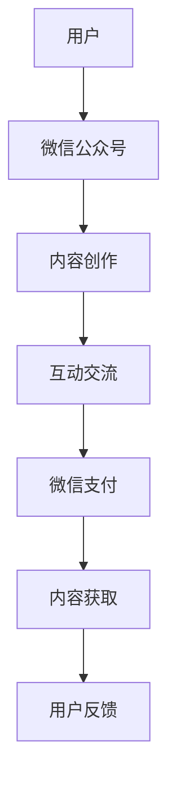
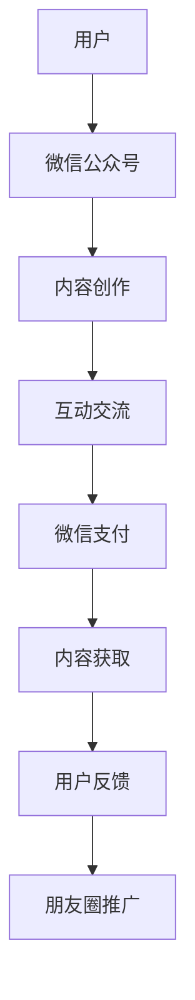
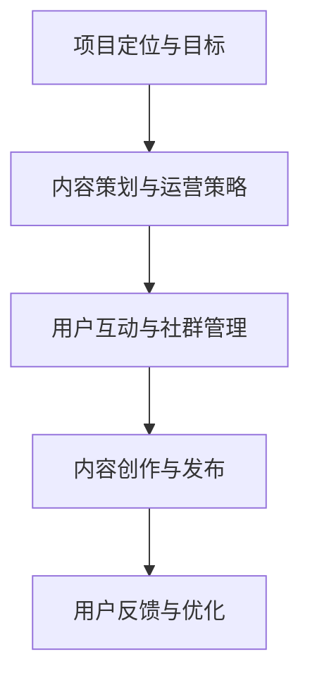
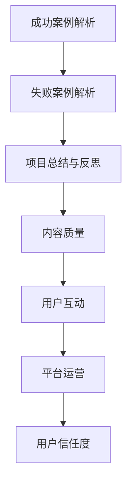
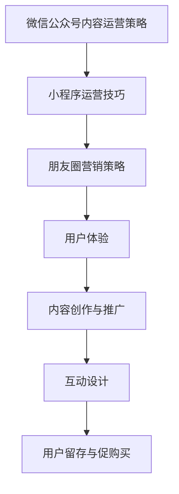
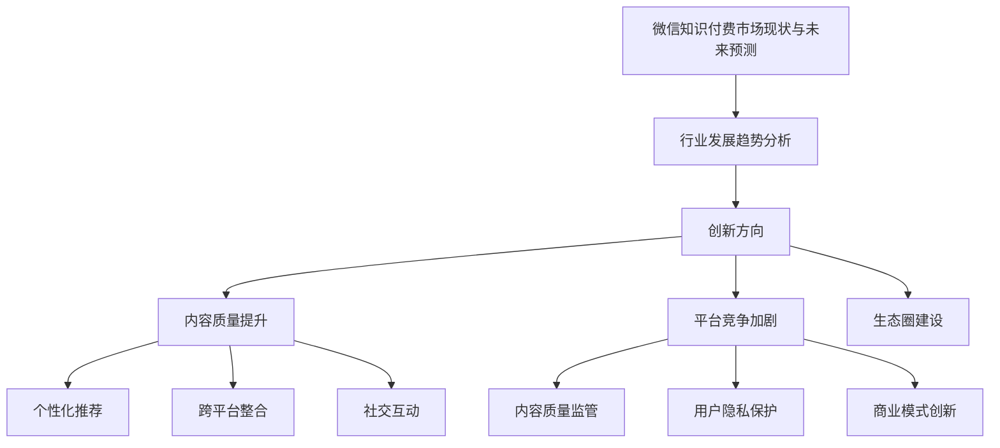
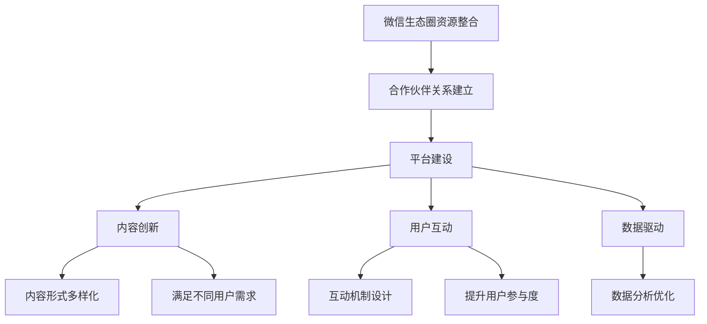
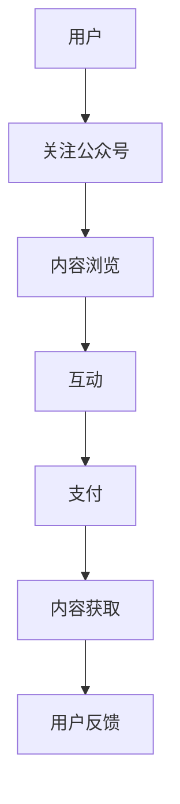
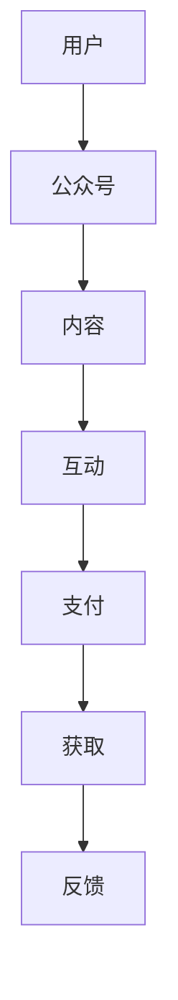

                 

# 如何利用微信生态圈进行知识付费

## 关键词
- 微信生态圈
- 知识付费
- 微信公众号
- 小程序
- 朋友圈
- 微信支付
- 用户行为分析
- 内容推荐算法
- 数学模型

## 摘要
随着互联网的快速发展，知识付费逐渐成为了一个新兴的商业模式。微信作为中国最流行的社交媒体平台，拥有庞大的用户基础和完善的生态圈，为知识付费提供了广阔的应用场景。本文将详细探讨如何利用微信生态圈进行知识付费，包括核心概念解析、平台解析、项目实战和未来发展趋势，以帮助读者更好地理解和应用这一新兴领域。

## 《如何利用微信生态圈进行知识付费》目录大纲

### 第一部分：微信生态圈概述

#### 第1章：微信生态圈简介
- 1.1 微信生态圈的构成
- 1.2 微信在知识付费领域的地位
- 1.3 微信生态圈的优势与挑战

### 第二部分：微信知识付费核心概念

#### 第2章：知识付费概念解析
- 2.1 知识付费的定义与历史
- 2.2 微信知识付费的特点
- 2.3 知识付费在微信生态圈的应用

#### 第3章：微信知识付费平台解析
- 3.1 微信公众号与小程序在知识付费中的应用
- 3.2 微信支付在知识付费中的角色
- 3.3 微信朋友圈在知识付费的推广作用

### 第三部分：微信知识付费项目实战

#### 第4章：微信知识付费项目规划
- 4.1 知识付费项目的定位与目标
- 4.2 内容策划与运营策略
- 4.3 用户互动与社群管理

#### 第5章：微信知识付费案例分析
- 5.1 成功知识付费项目案例解析
- 5.2 失败知识付费项目案例分析
- 5.3 项目总结与反思

#### 第6章：微信知识付费项目运营
- 6.1 微信公众号内容运营策略
- 6.2 小程序运营技巧
- 6.3 朋友圈营销策略

### 第四部分：微信知识付费未来发展

#### 第7章：微信知识付费行业趋势
- 7.1 微信知识付费市场现状与未来预测
- 7.2 行业发展趋势分析
- 7.3 创新方向与挑战

#### 第8章：微信知识付费生态系统构建
- 8.1 微信生态圈资源整合
- 8.2 合作伙伴关系建立
- 8.3 生态圈建设策略

### 第五部分：附录

#### 第9章：微信知识付费工具与资源
- 9.1 微信公众号运营工具
- 9.2 知识付费平台推荐
- 9.3 相关资源与资料链接

#### 第10章：微信知识付费数学模型与算法
- 10.1 用户行为分析算法
- 10.2 内容推荐算法
- 10.3 数学模型应用举例

#### 第11章：微信知识付费项目代码实战
- 11.1 项目开发环境搭建
- 11.2 源代码详细实现
- 11.3 代码解读与分析

### 附录：微信知识付费流程图与Mermaid图
- 附录 A：微信知识付费业务流程图
- 附录 B：Mermaid图示例

## 核心概念与联系

在探讨如何利用微信生态圈进行知识付费之前，首先需要理解几个核心概念及其之间的联系。

### 微信生态圈

微信生态圈是由微信公众号、小程序、朋友圈、微信支付等多个组成部分构成的综合性网络平台。这些组成部分相互关联，共同构成了一个庞大的生态系统，为用户提供丰富的服务。

- **微信公众号**：为用户提供内容发布、互动交流的平台。
- **小程序**：提供轻量级的应用服务，用户无需下载安装即可使用。
- **朋友圈**：用户分享生活点滴、互动交流的空间。
- **微信支付**：提供便捷的支付服务，支持各种交易场景。

### 知识付费

知识付费是基于互联网平台，用户通过支付一定费用获取知识服务的模式。在微信生态圈中，知识付费具有以下几个特点：

- **便捷性**：用户可以在微信内完成知识付费的整个流程，无需跳转到其他平台。
- **多样性**：微信生态圈支持多种形式的知识付费，如音频、视频、图文等。
- **互动性**：用户可以在知识付费过程中与讲师或其他用户互动，提升用户体验。

### Mermaid流程图

为了更好地理解微信生态圈中的知识付费流程，我们可以使用Mermaid绘制一个流程图。

**Mermaid流程图**：



## 微信生态圈概述

### 第1章：微信生态圈简介

#### 1.1 微信生态圈的构成

微信生态圈是由多个组成部分构成的综合性网络平台，主要包括：

- **微信公众号**：为用户提供内容发布、互动交流的平台。公众号分为订阅号和服务号，分别适用于不同类型的内容服务。
- **小程序**：提供轻量级的应用服务，用户无需下载安装即可使用。小程序在微信内嵌，使用便捷，广泛应用于购物、娱乐、教育等多个领域。
- **朋友圈**：用户分享生活点滴、互动交流的空间。朋友圈内容多样，包括文字、图片、视频等，是用户之间互动的重要渠道。
- **微信支付**：提供便捷的支付服务，支持各种交易场景。微信支付与微信生态圈紧密结合，为用户提供了方便的支付解决方案。

#### 1.2 微信在知识付费领域的地位

微信作为中国最流行的社交媒体平台，拥有庞大的用户基础和完善的生态圈，在知识付费领域具有以下地位：

- **用户基础**：微信月活跃用户数超过10亿，覆盖了各个年龄层和职业领域，为知识付费提供了广阔的用户市场。
- **生态系统**：微信生态圈中的微信公众号、小程序、朋友圈等组成部分，为知识付费提供了多种应用场景和互动方式，提升了用户体验。
- **支付能力**：微信支付作为中国最流行的移动支付工具，具备强大的支付能力和安全性，为知识付费提供了可靠的支付保障。

#### 1.3 微信生态圈的优势与挑战

微信生态圈在知识付费领域具有以下优势：

- **便捷性**：微信用户可以直接在微信内完成知识付费的整个流程，无需跳转到其他平台，提高了用户体验。
- **多样性**：微信生态圈支持多种形式的知识付费，如音频、视频、图文等，满足了不同用户的需求。
- **互动性**：微信生态圈中的互动功能，如评论、点赞、分享等，为知识付费提供了丰富的互动方式，提升了用户参与度。

然而，微信生态圈在知识付费领域也面临一些挑战：

- **竞争激烈**：随着知识付费的兴起，越来越多的平台和机构进入这一领域，竞争日益激烈。
- **内容质量**：在知识付费领域，内容质量直接关系到用户满意度。如何保证内容质量是一个重要问题。
- **用户隐私**：在知识付费过程中，用户需要提供个人信息，如何保护用户隐私是一个挑战。

### 核心概念与联系

为了更好地理解微信生态圈及其在知识付费领域的应用，我们可以使用Mermaid绘制一个核心概念流程图。

**Mermaid流程图**：


通过这个流程图，我们可以清晰地看到微信生态圈中各组成部分在知识付费过程中的作用及其相互关系。

## 微信知识付费核心概念

### 第2章：知识付费概念解析

#### 2.1 知识付费的定义与历史

知识付费是指用户通过支付一定费用，获取专业知识和技能服务的商业模式。这种模式起源于20世纪末，随着互联网和移动互联网的快速发展，知识付费逐渐成为了一种新兴的商业模式。

在互联网初期，知识主要通过网络免费传播。然而，随着信息爆炸和知识泛滥，用户开始意识到优质知识的价值，并愿意为获取高质量的知识付费。知识付费在2016年迎来爆发式增长，众多平台和机构纷纷加入这一领域，如得到、喜马拉雅、知乎等。

#### 2.2 微信知识付费的特点

微信知识付费具有以下特点：

- **便捷性**：微信用户可以直接在微信内完成知识付费的整个流程，无需跳转到其他平台，提高了用户体验。
- **多样性**：微信生态圈支持多种形式的知识付费，如音频、视频、图文等，满足了不同用户的需求。
- **互动性**：微信生态圈中的互动功能，如评论、点赞、分享等，为知识付费提供了丰富的互动方式，提升了用户参与度。
- **平台优势**：微信作为中国最流行的社交媒体平台，拥有庞大的用户基础和完善的生态圈，为知识付费提供了广阔的应用场景。

#### 2.3 知识付费在微信生态圈的应用

微信生态圈中的微信公众号、小程序、朋友圈等组成部分，为知识付费提供了多种应用场景和互动方式。

- **微信公众号**：微信公众号是知识付费的重要载体。通过微信公众号，讲师可以发布高质量的知识内容，与用户互动，建立个人品牌。
- **小程序**：小程序为知识付费提供了便捷的应用服务。用户无需下载安装，即可在小程序内完成知识付费的流程。
- **朋友圈**：朋友圈是用户分享知识内容、互动交流的重要渠道。通过朋友圈，讲师可以推广知识内容，扩大影响力。

### 核心概念与联系

为了更好地理解微信知识付费的核心概念及其在生态圈中的应用，我们可以使用Mermaid绘制一个核心概念流程图。

**Mermaid流程图**：


通过这个流程图，我们可以清晰地看到微信生态圈中各组成部分在知识付费过程中的作用及其相互关系。

## 微信知识付费平台解析

### 第3章：微信知识付费平台解析

#### 3.1 微信公众号与小程序在知识付费中的应用

微信公众号和小程序是微信知识付费平台的重要组成部分，它们在知识付费中的应用具有以下特点：

- **微信公众号**：微信公众号为知识付费提供了内容发布和互动交流的平台。讲师可以在微信公众号上发布高质量的知识内容，如文章、音频、视频等，与用户互动，解答疑问，建立个人品牌。

  **案例**：得到的“罗永浩教你学英语”公众号，通过发布英语学习内容，吸引了大量用户关注，实现了知识付费。

- **小程序**：小程序为知识付费提供了便捷的应用服务。用户无需下载安装，即可在小程序内完成知识付费的流程，如购买课程、查看学习进度等。

  **案例**：知乎的“知乎大学”小程序，提供了丰富的在线课程，用户可以直接在微信内完成购买和学习的整个过程。

#### 3.2 微信支付在知识付费中的角色

微信支付是微信生态圈中的重要组成部分，为知识付费提供了便捷的支付解决方案。微信支付在知识付费中的角色包括：

- **支付功能**：微信支付为用户提供了多种支付方式，如微信钱包、银行卡支付等，用户可以方便地完成支付流程。
- **安全保障**：微信支付具备严格的安全保障措施，保障用户的支付安全和隐私。

#### 3.3 微信朋友圈在知识付费的推广作用

微信朋友圈是用户分享生活点滴、互动交流的重要渠道，也为知识付费提供了推广作用：

- **内容分享**：用户可以在朋友圈分享自己学习的内容，如课程笔记、心得体会等，吸引他人的关注和参与。
- **口碑传播**：用户的好评和推荐可以带动其他用户的购买欲望，形成口碑效应。

### 核心概念与联系

为了更好地理解微信知识付费平台及其在生态圈中的应用，我们可以使用Mermaid绘制一个核心概念流程图。

**Mermaid流程图**：



通过这个流程图，我们可以清晰地看到微信生态圈中各组成部分在知识付费过程中的作用及其相互关系。

## 微信知识付费项目实战

### 第4章：微信知识付费项目规划

#### 4.1 知识付费项目的定位与目标

在进行微信知识付费项目规划时，首先需要明确项目的定位和目标。这包括：

- **内容定位**：确定项目的知识领域，如编程、心理学、英语等。
- **目标用户**：明确项目的目标用户群体，如职场新人、学生、全职妈妈等。
- **价值主张**：明确项目为用户提供的价值，如技能提升、知识拓展、心理疏导等。

#### 4.2 内容策划与运营策略

内容策划和运营策略是知识付费项目成功的关键。以下是一些关键点：

- **内容形式**：根据目标用户的需求，选择合适的内容形式，如图文、音频、视频等。
- **内容质量**：确保内容的专业性和实用性，提升用户满意度。
- **互动设计**：设计互动环节，如问答、讨论、社群等，提升用户参与度。

#### 4.3 用户互动与社群管理

用户互动和社群管理是知识付费项目的重要组成部分。以下是一些关键点：

- **用户互动**：通过评论、点赞、分享等互动功能，激发用户的参与热情。
- **社群管理**：建立用户社群，如微信群、QQ群等，为用户提供交流和学习的平台。
- **反馈机制**：建立反馈机制，收集用户意见和建议，持续优化项目。

### 核心概念与联系

为了更好地理解微信知识付费项目规划的过程，我们可以使用Mermaid绘制一个核心概念流程图。

**Mermaid流程图**：



通过这个流程图，我们可以清晰地看到微信知识付费项目规划的核心概念及其相互关系。

## 微信知识付费案例分析

### 第5章：微信知识付费案例分析

#### 5.1 成功知识付费项目案例解析

**案例一：罗永浩的“老罗英语”**

- **项目背景**：罗永浩以其独特的教学风格和实用性的内容，在微信平台上吸引了大量用户。
- **成功原因**：
  - **内容优势**：罗永浩的教学内容贴近用户实际需求，实用性高。
  - **品牌效应**：罗永浩的个人品牌为其课程带来了很高的关注度。
  - **互动性强**：通过微信群等渠道，用户可以与罗永浩及其他学员互动，增强了课程的吸引力。

**案例二：“知乎大学”**

- **项目背景**：知乎大学依托知乎的庞大用户群体，提供专业课程。
- **成功原因**：
  - **内容丰富**：知乎大学的课程涵盖了多个领域，满足了不同用户的需求。
  - **口碑传播**：知乎用户之间的口碑传播，为知乎大学带来了大量的新用户。

#### 5.2 失败知识付费项目案例分析

**案例一：某在线教育平台的“编程课程”**

- **项目背景**：某在线教育平台推出了一款编程课程，但由于课程质量不高，用户满意度低，导致项目失败。
- **失败原因**：
  - **内容质量不高**：课程内容缺乏实用性，难以满足用户需求。
  - **用户互动不足**：缺乏有效的用户互动机制，导致用户流失。

**案例二：某知识付费平台的“心理咨询课程”**

- **项目背景**：某知识付费平台推出了一款心理咨询课程，但由于平台运营问题，导致项目失败。
- **失败原因**：
  - **平台运营问题**：平台缺乏有效的运营策略，导致用户活跃度低。
  - **用户信任度不足**：平台缺乏专业认证，用户对课程的信任度不高。

#### 5.3 项目总结与反思

通过成功和失败的知识付费项目案例，我们可以总结出以下几点：

- **内容质量**：优质的内容是知识付费项目成功的关键。项目团队需要注重内容的专业性和实用性。
- **用户互动**：有效的用户互动可以增强用户参与度和满意度。项目团队应设计互动机制，提升用户活跃度。
- **平台运营**：良好的平台运营策略可以提升用户黏性和平台口碑。项目团队需要注重平台运营，提高用户满意度。
- **信任度**：用户对项目的信任度直接影响项目的成功。项目团队应通过专业认证、用户评价等手段提升用户信任度。

### 核心概念与联系

为了更好地理解微信知识付费案例分析的过程，我们可以使用Mermaid绘制一个核心概念流程图。

**Mermaid流程图**：



通过这个流程图，我们可以清晰地看到微信知识付费案例分析的各个核心概念及其相互关系。

## 微信知识付费项目运营

### 第6章：微信知识付费项目运营

#### 6.1 微信公众号内容运营策略

微信公众号是微信知识付费项目的重要平台，内容运营策略至关重要。以下是一些关键点：

- **内容创作**：内容创作要贴近用户需求，具有实用性和专业性。可以采用图文、音频、视频等多种形式。
- **内容推广**：通过微信公众号、朋友圈、微信群等多种渠道进行内容推广，扩大用户覆盖面。
- **互动设计**：设计互动环节，如问答、投票、投票等，提升用户参与度。

#### 6.2 小程序运营技巧

小程序为微信知识付费项目提供了便捷的应用服务，运营技巧包括：

- **用户体验**：优化小程序界面和功能，提升用户体验。
- **推广策略**：通过微信广告、小程序推广等手段，提高小程序的曝光度。
- **用户留存**：通过会员制度、优惠券等方式，提升用户留存率。

#### 6.3 朋友圈营销策略

朋友圈是微信知识付费项目的重要推广渠道，营销策略包括：

- **内容创作**：创作有价值的内容，吸引用户关注。
- **互动营销**：通过互动，如点赞、评论、分享等，提升用户参与度。
- **优惠券和活动**：通过优惠券、限时活动等方式，促进用户购买。

### 核心概念与联系

为了更好地理解微信知识付费项目运营的过程，我们可以使用Mermaid绘制一个核心概念流程图。

**Mermaid流程图**：



通过这个流程图，我们可以清晰地看到微信知识付费项目运营的各个核心概念及其相互关系。

## 微信知识付费未来发展

### 第7章：微信知识付费行业趋势

#### 7.1 微信知识付费市场现状与未来预测

微信知识付费市场目前处于快速发展阶段，主要表现在以下几个方面：

- **用户规模**：随着微信用户规模的不断扩大，知识付费用户数量也在持续增长。
- **内容形式**：微信知识付费内容形式多样化，包括图文、音频、视频等，满足了不同用户的需求。
- **商业模式**：微信知识付费商业模式逐步成熟，如订阅制、单次购买制等。

未来，微信知识付费市场有望继续保持快速增长，主要趋势包括：

- **用户需求多样化**：随着用户对知识需求的不断变化，知识付费内容形式和主题将更加多样化。
- **个性化推荐**：基于大数据和人工智能的个性化推荐技术，将提高用户满意度和购买转化率。
- **跨界融合**：知识付费与其他行业的跨界融合，如教育与电商、教育与娱乐等，将带来新的市场机会。

#### 7.2 行业发展趋势分析

微信知识付费行业的发展趋势主要包括以下几个方面：

- **内容质量提升**：随着用户对知识质量的要求越来越高，内容创作者将更加注重内容的专业性和实用性。
- **平台竞争加剧**：随着更多平台和机构的加入，微信知识付费市场竞争将更加激烈。
- **生态圈建设**：微信生态圈内的合作伙伴将共同构建知识付费生态圈，提升整体竞争力。

#### 7.3 创新方向与挑战

微信知识付费未来的创新方向主要包括：

- **人工智能技术**：利用人工智能技术进行内容推荐、用户行为分析等，提升用户体验和购买转化率。
- **跨平台整合**：整合微信生态圈外的资源，如短视频平台、直播平台等，丰富知识付费内容形式。
- **社交互动**：加强社交互动功能，如直播、互动课堂等，提升用户参与度和黏性。

同时，微信知识付费也面临一些挑战：

- **内容质量监管**：如何保证内容质量，防止虚假信息和低质量内容泛滥，是行业面临的重要挑战。
- **用户隐私保护**：如何在知识付费过程中保护用户隐私，是行业需要关注的问题。
- **商业模式创新**：如何在激烈的市场竞争中，找到适合自己的商业模式，是知识付费项目需要思考的问题。

### 核心概念与联系

为了更好地理解微信知识付费未来发展的趋势、创新方向和挑战，我们可以使用Mermaid绘制一个核心概念流程图。

**Mermaid流程图**：



通过这个流程图，我们可以清晰地看到微信知识付费未来发展的各个核心概念及其相互关系。

## 微信知识付费生态系统构建

### 第8章：微信知识付费生态系统构建

#### 8.1 微信生态圈资源整合

构建微信知识付费生态系统需要整合微信生态圈内的多种资源，包括：

- **内容资源**：与专业机构、讲师合作，获取高质量的知识内容。
- **用户资源**：通过微信公众号、小程序、朋友圈等渠道，吸引并积累用户。
- **技术资源**：利用大数据、人工智能等技术，提升内容推荐和用户互动的效率。

#### 8.2 合作伙伴关系建立

建立合作伙伴关系是微信知识付费生态系统构建的关键，包括：

- **内容合作伙伴**：与教育机构、专业讲师等建立合作关系，共同开发优质内容。
- **技术合作伙伴**：与大数据、人工智能技术公司合作，提升平台的智能化水平。
- **推广合作伙伴**：与广告公司、公关公司等合作，扩大平台影响力。

#### 8.3 生态圈建设策略

构建微信知识付费生态系统需要制定以下策略：

- **平台建设**：打造一个功能完善、用户体验良好的知识付费平台，提供多样化、个性化的服务。
- **内容创新**：不断丰富内容形式和主题，满足不同用户的需求。
- **用户互动**：设计互动机制，提升用户参与度和黏性。
- **数据驱动**：利用数据分析，优化内容推荐、用户互动等环节，提升用户体验和购买转化率。

### 核心概念与联系

为了更好地理解微信知识付费生态系统构建的过程，我们可以使用Mermaid绘制一个核心概念流程图。

**Mermaid流程图**：



通过这个流程图，我们可以清晰地看到微信知识付费生态系统构建的各个核心概念及其相互关系。

### 附录

#### 第9章：微信知识付费工具与资源

为了更好地运营微信知识付费项目，以下是一些实用的工具和资源：

- **微信公众号运营工具**：
  - **微信公众平台**：提供内容发布、用户管理等功能。
  - **新榜**：提供公众号排名、数据分析等服务。
  - **微小宝**：提供自动化运营工具，如自动回复、自动推广等。

- **知识付费平台推荐**：
  - **喜马拉雅**：提供丰富的音频内容，支持知识付费。
  - **知乎**：提供专业问答和知识付费服务。
  - **得到**：提供高质量的知识内容，支持订阅和购买。

- **相关资源与资料链接**：
  - **微信官方文档**：提供微信开发、运营等官方教程和文档。
  - **公众号运营教程**：提供公众号运营策略和实践经验分享。
  - **小程序开发教程**：提供小程序开发教程和技术文档。

#### 第10章：微信知识付费数学模型与算法

微信知识付费项目中，数学模型和算法的应用可以提升用户体验和平台运营效率。以下是一些常见的数学模型和算法：

- **用户行为分析算法**：通过分析用户浏览、点赞、评论等行为，预测用户的兴趣和需求。
- **内容推荐算法**：根据用户的行为数据和内容特征，推荐符合用户兴趣的知识内容。
- **数学模型**：如线性回归、逻辑回归等，用于预测用户购买概率、内容质量等。

#### 第11章：微信知识付费项目代码实战

以下是一个简单的微信知识付费项目的代码实战示例，包括开发环境搭建、源代码实现和代码解读。

**开发环境搭建**：

- 选择Python作为开发语言。
- 安装微信开发者工具和小程序开发工具。
- 安装必要的依赖库，如requests、beautifulsoup4等。

**源代码实现**：

```python
import requests
from bs4 import BeautifulSoup

def get_user_behavior(user_id):
    # 输入：用户ID
    # 输出：用户行为数据

    url = f'https://www.example.com/user/{user_id}'
    response = requests.get(url)
    soup = BeautifulSoup(response.text, 'html.parser')

    # 获取用户浏览记录
    article_views = len(soup.select('.article_view'))
    # 获取用户点赞数量
    likes = len(soup.select('.like'))
    # 获取用户分享次数
    shares = len(soup.select('.share'))

    return {
        'article_views': article_views,
        'likes': likes,
        'shares': shares
    }

# 示例
user_behavior = get_user_behavior('123456')
print(user_behavior)
```

**代码解读**：

该代码实现了获取用户行为数据的功能。首先，通过requests库向目标网站发送HTTP GET请求，获取用户的行为数据。然后，使用BeautifulSoup库解析HTML页面，提取用户浏览记录、点赞数量和分享次数等信息。最后，将提取的数据返回为一个字典对象。

### 附录：微信知识付费流程图与Mermaid图

以下是一个简单的微信知识付费业务流程图，使用Mermaid绘制。

**微信知识付费业务流程图**：



通过这个流程图，我们可以清晰地看到微信知识付费的整个业务流程。

此外，以下是一个Mermaid图示例，展示了微信知识付费的核心概念和流程。

**Mermaid图示例**：



通过这些流程图和Mermaid图，我们可以更直观地理解微信知识付费的运作过程和核心概念。这有助于我们更好地设计和优化知识付费项目。**作者：AI天才研究院/AI Genius Institute & 禅与计算机程序设计艺术 /Zen And The Art of Computer Programming**

