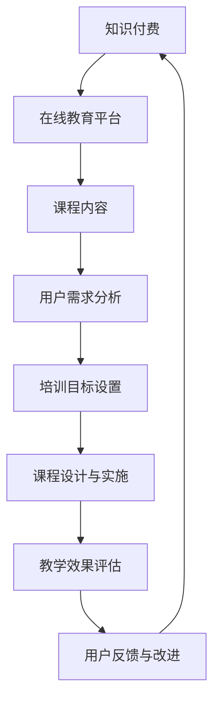

                 

### 《如何利用知识付费实现在线创业培训与商业模式指导？》

#### 关键词：
- 知识付费
- 在线创业培训
- 商业模式
- 教学策略
- 用户运营
- 效果评估

#### 摘要：
本文深入探讨了如何利用知识付费模式实现在线创业培训与商业模式指导。通过对知识付费与在线教育市场的概述，商业模式与在线创业的关系分析，在线创业培训内容设计，教学策略与学习方法，以及成功案例和实现策略的详细探讨，为读者提供了全面且实用的指导。文章最后展望了知识付费在在线创业培训中的未来发展，并附有相关工具与资源附录。

---

### 第一部分：知识付费与在线创业培训概述

#### 第1章：知识付费的兴起与发展

知识付费是指消费者为获取有价值的信息、知识或服务而进行的付费行为。随着互联网技术的发展和用户对优质内容的渴求，知识付费逐渐成为一种新型的商业模式。

##### 1.1 知识付费的兴起与发展

知识付费的兴起可以追溯到2000年代末期，当时互联网公司开始尝试将线下教育内容搬到线上，通过付费形式为用户提供知识服务。这一模式在2016年左右迎来爆发期，主要得益于以下因素：

1. **移动互联网普及**：智能手机的普及让用户可以随时随地获取网络内容，为知识付费提供了便利条件。
2. **内容创业浪潮**：大量创业者、专家和学者进入知识领域，为用户提供多样化的知识产品。
3. **用户付费习惯养成**：随着电子商务、在线支付等领域的成熟，用户逐渐接受了付费获取知识的方式。
4. **资本市场的支持**：风险投资的大量涌入为知识付费企业提供了资金支持，促进了市场发展。

##### 1.2 在线创业培训的现状与趋势

在线创业培训是指通过互联网平台为创业者提供系统化、专业化的创业培训服务。在线创业培训具有以下特点：

1. **便捷性**：用户可以随时随地通过电脑、手机等设备进行学习，不受时间和地点限制。
2. **个性化**：根据用户需求和学习进度，提供个性化的培训内容和辅导服务。
3. **互动性**：通过直播、讨论区等方式，实现师生之间的实时互动，提高学习效果。
4. **规模化**：在线培训可以实现大规模授课，降低培训成本，提高运营效率。

当前，在线创业培训市场呈现出以下趋势：

1. **内容多样化**：涵盖了创业初期的市场调研、团队组建、产品开发，以及后期的市场营销、财务管理等各个方面。
2. **平台化**：越来越多的创业培训机构开始搭建自己的在线平台，提供一站式创业培训服务。
3. **生态化**：在线创业培训不再局限于培训服务本身，逐渐形成包括投融资、资源对接、社群交流等在内的创业生态体系。

##### 1.3 知识付费在在线创业培训中的应用

知识付费在在线创业培训中的应用主要体现在以下几个方面：

1. **课程收费**：在线创业培训课程通过知识付费模式进行销售，用户需付费购买课程才能学习。
2. **增值服务**：为提升用户体验，部分在线创业培训平台提供付费增值服务，如一对一辅导、实战项目指导等。
3. **社群运营**：通过建立付费社群，为用户提供深度交流、资源共享和互助成长的机会。
4. **定制化培训**：根据用户需求和企业特点，提供定制化的在线创业培训服务。

知识付费为在线创业培训带来了新的商业模式，同时也提高了培训服务的质量和效果。在未来，知识付费与在线创业培训将继续融合发展，为创业者提供更多有价值的服务。

---

### 第二部分：商业模式与在线创业

#### 第2章：商业模式的概念与分类

商业模式是指企业在特定市场中通过提供产品或服务以实现盈利的一种系统化方法。一个成功的商业模式不仅能够为企业带来持续的收入，还能够确保企业的长期发展。

##### 2.1 商业模式的概念

商业模式的概念可以从以下几个方面进行理解：

1. **价值主张**：企业通过提供的产品或服务来解决用户的问题或满足用户的需求。
2. **目标市场**：企业所面向的客户群体，包括个人用户和企业用户。
3. **盈利模式**：企业通过何种方式实现盈利，包括产品定价、收入来源、成本控制等。
4. **资源整合**：企业如何整合内部和外部的资源，包括人力、资金、技术、信息等。
5. **合作伙伴关系**：企业与其他企业、组织或个人的合作方式，以实现共同的目标。

##### 2.2 商业模式的分类

根据不同的分类标准，商业模式可以分为多种类型：

1. **基于产品或服务的商业模式**：这种模式主要是通过销售产品或服务来实现盈利。例如，传统的制造业、零售业等。
2. **基于平台的商业模式**：平台模式通过搭建一个在线平台，为买家和卖家提供交易服务，从中收取佣金或广告费。例如，淘宝、京东等电商平台。
3. **基于订阅的商业模式**：用户通过订阅服务的方式，定期支付费用以获取持续的价值。例如，Netflix、Spotify等。
4. **基于共享经济的商业模式**：通过共享闲置资源，如房屋、汽车、设备等，实现盈利。例如，Airbnb、Uber等。
5. **基于数字内容的商业模式**：通过数字内容的生产、分发和销售实现盈利。例如，知乎、喜马拉雅等。

##### 2.3 创业者如何选择合适的商业模式

对于创业者来说，选择合适的商业模式至关重要。以下是一些建议：

1. **了解市场需求**：创业者需要深入了解目标市场的需求，选择有前景的商业模式。
2. **分析自身优势**：根据自己的专业知识和资源，选择能够发挥自身优势的商业模式。
3. **考虑盈利模式**：选择具有可持续盈利能力的商业模式，确保企业的长期发展。
4. **遵循市场规律**：遵循市场规律，不断优化和调整商业模式，以适应市场变化。
5. **关注用户体验**：注重用户体验，通过提供优质的产品或服务赢得用户的信任和忠诚。

选择合适的商业模式不仅能够提高创业成功的概率，还能够为企业带来持续的价值。创业者应根据自身情况和市场环境，灵活选择和调整商业模式。

---

### 第三部分：在线创业培训内容设计

#### 第3章：在线创业培训课程体系构建

在线创业培训课程体系的构建是确保培训效果的重要环节。一个完整的课程体系应包括明确的目标、合理的课程设置、科学的培训方法和有效的评估机制。

##### 3.1 课程体系构建的原则与方法

构建在线创业培训课程体系应遵循以下原则：

1. **目标导向**：以培训目标为导向，确保课程内容与培训目标相一致。
2. **模块化设计**：将课程内容分为不同的模块，便于用户根据自己的需求和学习进度进行选择。
3. **理论与实践相结合**：既要有理论讲解，又要有实践操作，提高用户的实际操作能力。
4. **个性化定制**：根据用户的需求和背景，提供个性化的培训方案。
5. **互动性**：充分利用互联网的优势，实现师生之间的实时互动，提高学习效果。

构建在线创业培训课程体系的方法：

1. **需求分析**：通过对目标用户的需求进行分析，确定培训的目标和内容。
2. **课程设计**：根据培训目标和需求，设计合理的课程内容和结构。
3. **资源整合**：整合内部和外部资源，包括师资、教材、案例等，为课程体系提供支持。
4. **教学评估**：建立科学的培训评估机制，对培训效果进行实时监控和反馈。

##### 3.2 常见创业领域的课程内容

在线创业培训课程内容应根据不同创业领域进行设置，以下是一些常见创业领域的课程内容：

1. **互联网创业**：
   - 市场调研与需求分析
   - 产品设计与开发
   - 用户运营与增长策略
   - 营销推广与渠道建设
   - 财务管理

2. **电商创业**：
   - 电商平台选择与运营
   - 商品上架与展示
   - 电商营销策略
   - 客户服务与售后管理
   - 数据分析与应用

3. **文化创意创业**：
   - 创意思维与方法
   - 产品设计与开发
   - 品牌建设与推广
   - 市场拓展与合作
   - 财务管理

4. **农业创业**：
   - 农业技术与管理
   - 市场需求与产品定位
   - 品牌建设与推广
   - 农业产业链整合
   - 财务管理

5. **教育培训创业**：
   - 教育市场分析
   - 课程设计与开发
   - 营销推广与招生策略
   - 师资队伍建设
   - 财务管理

##### 3.3 课程设计与培训师的角色

课程设计是在线创业培训的核心环节，培训师在这一过程中扮演着关键角色。培训师的角色包括：

1. **课程内容规划**：根据培训目标和需求，设计合理的课程内容和结构。
2. **教学资源整合**：整合内部和外部资源，包括教材、案例、工具等，为课程提供支持。
3. **教学方法选择**：根据课程内容和用户特点，选择合适的教学方法，提高学习效果。
4. **教学互动**：通过线上线下互动，激发用户的学习兴趣和积极性。
5. **教学评估**：对培训效果进行实时监控和反馈，优化教学方法和内容。

培训师的专业素养和教学能力直接影响在线创业培训的效果。培训师应具备以下素质：

1. **专业知识**：具备丰富的创业知识和实践经验。
2. **教学能力**：能够运用多种教学方法，提高教学效果。
3. **沟通能力**：善于与用户进行沟通，了解用户需求。
4. **团队合作**：能够与团队成员有效合作，共同完成培训任务。
5. **持续学习**：不断更新自己的知识和技能，适应市场变化。

通过科学的课程设计和优秀的培训师，在线创业培训能够为创业者提供有价值的服务，助力其创业成功。

---

### 第四部分：教学策略与学习方法

#### 第4章：教学策略与学习方法

在线创业培训的教学策略和学习方法直接影响学习效果。一个成功的在线创业培训项目不仅需要精心设计的课程内容，还需要科学的教学策略和有效的学习方法。

##### 4.1 教学策略的选择

在线创业培训的教学策略应结合课程内容、用户特点和培训目标进行选择。以下是一些常见的教学策略：

1. **互动式教学**：通过直播、讨论区、在线问答等方式，实现师生之间的实时互动，提高学习效果。
2. **案例教学**：通过实际案例的分析，帮助用户理解理论知识，提高实践能力。
3. **游戏化学习**：通过游戏化的学习方式，激发用户的学习兴趣和积极性。
4. **个性化辅导**：根据用户的学习进度和需求，提供个性化的辅导服务，提高学习效果。
5. **混合式教学**：将线上教学和线下教学相结合，充分发挥两者的优势，提高学习效果。

##### 4.2 在线学习与互动教学

在线学习与互动教学是提高在线创业培训效果的重要手段。以下是一些在线学习与互动教学的方法：

1. **实时直播**：通过实时直播，用户可以在线观看课程，与培训师进行互动，解决学习中的问题。
2. **讨论区**：建立讨论区，用户可以在讨论区提问、交流，共同解决问题。
3. **在线问答**：培训师定期举办在线问答活动，用户可以就学习中的问题向培训师提问，获得解答。
4. **在线作业**：布置在线作业，用户通过完成作业来巩固所学知识，培训师对作业进行批改和反馈。
5. **在线测试**：通过在线测试，用户可以检验自己的学习效果，培训师可以根据测试结果进行针对性的辅导。

##### 4.3 提升学习效果的方法

提升在线创业培训的学习效果，需要从以下几个方面入手：

1. **明确学习目标**：用户在学习前应明确自己的学习目标，有针对性地进行学习。
2. **制定学习计划**：用户应根据学习目标，制定合理的学习计划，确保学习进度。
3. **积极参与互动**：用户应积极参与在线互动，通过提问、讨论等方式，提高学习效果。
4. **实践操作**：用户在学习过程中应进行实践操作，通过实际操作来巩固所学知识。
5. **及时反馈**：用户在学习过程中应主动向培训师反馈学习情况，获得针对性的指导。
6. **持续学习**：用户应保持持续学习的动力，不断提升自己的知识水平和能力。

通过科学的教学策略和有效的学习方法，在线创业培训可以更好地满足用户需求，提高学习效果，为创业者的成功创业提供有力支持。

---

### 第五部分：案例分析

#### 第5章：案例分析：成功的在线创业培训项目

为了更好地理解如何利用知识付费实现在线创业培训与商业模式指导，我们来看一个成功的在线创业培训项目——案例：创业营（StartupCamp）。

##### 5.1 项目简介

创业营是一个面向创业者的在线培训平台，旨在通过系统化的培训帮助创业者提升创业技能，实现创业梦想。项目由知名创业导师和行业专家共同打造，内容涵盖创业初期的市场调研、团队组建、产品开发，以及后期的市场营销、融资策略等各个方面。

##### 5.2 项目实施与效果评估

1. **项目实施**：
   - **课程设计**：创业营采用模块化课程设计，将培训内容分为多个模块，每个模块包含理论讲解、案例分析和实战演练。课程内容根据市场需求和创业者需求进行持续更新。
   - **教学策略**：创业营采用互动式教学策略，通过直播授课、讨论区互动、在线问答等多种方式，实现师生之间的实时互动。此外，还引入了游戏化学习元素，提高用户的学习兴趣和积极性。
   - **用户运营**：创业营注重用户运营，通过建立社群、组织线下活动等方式，为创业者提供深度交流、资源共享和互助成长的机会。

2. **效果评估**：
   - **用户满意度**：通过用户满意度调查，发现绝大多数用户对创业营的培训效果表示满意，认为课程内容丰富、实用，培训师专业、耐心。
   - **学习成果**：根据用户的学习成果评估，发现经过创业营培训的创业者，在创业技能、市场分析、团队管理等方面有了显著提升，部分用户已成功创业。
   - **项目影响力**：创业营在行业内产生了广泛的影响，成为创业者心目中的知名品牌，吸引了一批有影响力的创业导师和行业专家加入。

##### 5.3 项目成功的关键因素

1. **课程内容**：创业营的课程内容紧贴市场需求，既具备理论深度，又注重实践操作，为创业者提供了全面、实用的创业知识。
2. **教学策略**：创业营采用互动式教学策略，充分调动用户的学习积极性，提高学习效果。
3. **用户运营**：创业营注重用户运营，通过社群建设、线下活动等方式，为创业者提供了深度交流、资源共享和互助成长的机会。
4. **师资力量**：创业营汇聚了一批知名创业导师和行业专家，为创业者提供了高质量的培训服务。
5. **持续优化**：创业营不断优化课程内容、教学策略和用户运营方式，以适应市场变化和用户需求。

通过以上分析，我们可以看到，创业营的成功得益于其科学的课程体系、有效的教学策略和优质的用户运营。这些因素为创业者的创业之路提供了有力支持，使得创业营成为在线创业培训领域的佼佼者。

---

### 第六部分：知识付费实现策略

#### 第6章：知识付费产品设计与推广

知识付费产品设计与推广是确保知识付费模式成功的关键。以下将从产品设计、推广策略和用户运营三个方面进行详细探讨。

##### 6.1 知识付费产品的设计原则

1. **价值性**：知识付费产品应具有明确的用户价值，解决用户的实际问题，提升用户技能或知识水平。
2. **专业性**：知识付费产品应具备专业性和权威性，由行业专家或知名人士提供，确保内容质量。
3. **实用性**：知识付费产品应注重实用性，内容应易于理解和操作，方便用户在实际工作中应用。
4. **多样性**：知识付费产品应提供多样化的课程内容，涵盖不同领域和层次，满足不同用户的需求。
5. **互动性**：知识付费产品应具备一定的互动性，通过直播、讨论区、问答等方式，实现用户与讲师、同行之间的互动交流。

##### 6.2 知识付费产品的推广策略

1. **内容营销**：通过优质的内容创作，吸引潜在用户关注和购买。内容形式包括文章、视频、直播等。
2. **社交媒体推广**：利用社交媒体平台（如微博、微信公众号、抖音等）进行宣传推广，提高品牌知名度和用户参与度。
3. **合作推广**：与其他企业、机构或个人进行合作推广，共享用户资源和市场渠道，扩大品牌影响力。
4. **口碑营销**：通过用户口碑传播，提高产品的知名度和信誉度。鼓励用户在社交媒体、评价平台上分享自己的学习体验和成果。
5. **活动营销**：举办各类线上活动，如讲座、沙龙、比赛等，吸引用户参与，提升用户粘性。

##### 6.3 用户运营与社群管理

1. **用户画像**：通过对用户数据的分析，了解用户的基本特征、需求和偏好，为用户提供个性化的服务和推荐。
2. **用户互动**：通过在线问答、讨论区、直播等方式，与用户保持互动，提高用户满意度和忠诚度。
3. **社群建设**：建立用户社群，为用户提供交流和互动的平台，促进用户之间的资源共享和互助成长。
4. **用户激励**：通过积分、优惠券、会员特权等方式，激励用户参与学习、分享和推荐，提升用户活跃度和粘性。
5. **数据监测与分析**：对用户行为数据进行分析，了解用户需求和行为习惯，优化产品和服务，提升用户体验。

通过科学的知识付费产品设计和有效的推广策略，以及良好的用户运营和社群管理，知识付费模式可以在在线创业培训中取得成功，为创业者提供有价值的服务。

---

### 第七部分：商业模式分析与优化

#### 第7章：商业模式分析与优化

在知识付费领域，成功的商业模式不仅能够为用户提供有价值的服务，还能够确保企业的持续盈利。以下将从商业模式分析、优化方法和成功案例三个方面进行详细探讨。

##### 7.1 商业模式分析框架

一个完整的商业模式分析框架应包括以下几个方面：

1. **价值主张**：明确企业通过何种产品或服务解决用户的问题或满足用户的需求。
2. **目标市场**：确定企业所面向的客户群体，包括个人用户和企业用户。
3. **收入来源**：企业通过何种方式实现盈利，包括产品定价、收入来源、成本控制等。
4. **资源整合**：企业如何整合内部和外部资源，包括人力、资金、技术、信息等。
5. **合作伙伴关系**：企业与其他企业、组织或个人的合作方式，以实现共同的目标。

通过对商业模式的各个要素进行详细分析，企业可以了解自身的优势与不足，为优化商业模式提供依据。

##### 7.2 商业模式优化方法

1. **价值主张优化**：
   - **用户需求分析**：通过市场调研和用户反馈，了解用户的需求和痛点，优化价值主张，确保产品或服务满足用户需求。
   - **差异化定位**：在众多竞争对手中，找到差异化的竞争优势，突出产品的独特卖点。

2. **收入来源优化**：
   - **多渠道收入**：除了传统的课程销售，还可以通过增值服务、会员制、广告费等多种渠道实现收入。
   - **定价策略**：根据市场情况和用户需求，制定合理的定价策略，提高产品售价或降低成本。

3. **资源整合优化**：
   - **内外部资源整合**：充分利用企业内外部资源，包括合作伙伴、专业机构、行业专家等，提高资源利用效率。
   - **技术创新**：通过技术创新，提高产品或服务的质量，降低成本，提升市场竞争力。

4. **合作伙伴关系优化**：
   - **战略合作**：与行业内的领先企业、机构建立战略合作关系，实现资源共享和优势互补。
   - **供应链优化**：优化供应链管理，提高供应链效率，降低运营成本。

##### 7.3 成功案例分享

以下是一个知识付费领域的成功案例——案例：得到APP。

**得到APP** 是一款专注于知识服务的移动应用，通过内容付费模式为用户提供了大量优质的知识产品，包括课程、书籍、文章等。以下是其成功的原因：

1. **价值主张**：得到APP提供了多样化的知识产品，涵盖多个领域，满足了用户对知识的多样化需求。
2. **收入来源**：除了传统的课程销售，得到APP还通过会员制、广告费等多种渠道实现收入。
3. **资源整合**：得到APP与众多知名专家、学者和机构合作，提供了高质量的内容。
4. **合作伙伴关系**：得到APP与多家知名企业建立了战略合作关系，实现了资源共享和优势互补。

通过以上分析，我们可以看到，得到APP的成功得益于其科学的价值主张、多样化的收入来源、高效的资源整合和良好的合作伙伴关系。这些因素为得到APP的持续发展提供了有力支持。

---

### 第八部分：知识付费在在线创业培训中的应用前景

#### 第8章：知识付费在在线创业培训中的应用前景

知识付费作为在线创业培训的一种重要商业模式，具有广阔的应用前景。以下从应用前景、挑战与机遇以及未来发展趋势三个方面进行探讨。

##### 8.1 应用前景分析

1. **市场需求**：随着创业环境的不断优化和创业文化的普及，越来越多的创业者对专业化的在线创业培训需求旺盛。
2. **技术支持**：互联网技术的不断发展，特别是人工智能、大数据等技术的应用，为在线创业培训提供了强大的技术支撑。
3. **商业模式创新**：知识付费模式在在线创业培训中的应用，使得创业者能够以较低的成本获取高质量的知识和服务。
4. **用户习惯**：随着用户付费习惯的逐渐养成，知识付费在在线创业培训中的接受度不断提高。

##### 8.2 挑战与机遇

1. **内容质量**：知识付费产品的质量直接影响用户满意度，提高内容质量是知识付费在线创业培训面临的主要挑战。
2. **市场竞争**：在线创业培训市场竞争激烈，企业需要不断创新和优化商业模式，以提高竞争力。
3. **用户运营**：如何有效运营用户，提高用户活跃度和忠诚度，是知识付费在线创业培训需要解决的问题。

然而，挑战与机遇并存。随着市场需求的不断扩大和技术的不断进步，知识付费在线创业培训将迎来更多的发展机遇。

##### 8.3 未来发展趋势

1. **个性化定制**：未来在线创业培训将更加注重个性化定制，根据用户需求提供定制化的培训内容和辅导服务。
2. **多元化平台**：知识付费平台将不再局限于单一的在线课程，还将涵盖直播、互动社区、实战项目等多种形式。
3. **生态化发展**：在线创业培训将形成包括培训、投融资、资源对接、社群交流等在内的创业生态体系。
4. **智能化教学**：人工智能技术的应用将使在线创业培训更加智能化，提升教学效果和用户体验。

总之，知识付费在在线创业培训中的应用前景广阔，面临着诸多挑战与机遇。未来，随着技术的不断进步和市场需求的不断变化，知识付费在线创业培训将继续创新发展，为创业者提供更多有价值的服务。

---

#### 附录

**附录A：知识付费工具与平台介绍**

1. **得到APP**：一款专注于知识服务的移动应用，提供各类课程、书籍、文章等知识产品。
2. **知乎Live**：知乎旗下的知识付费平台，提供各类在线课程和讲座。
3. **网易云课堂**：网易云推出的在线教育平台，提供丰富的在线课程，涵盖编程、设计、语言等多个领域。
4. **喜马拉雅**：一款音频分享平台，提供大量有声书、课程等内容。
5. **馒头商学院**：一家专注于商业教育的在线培训平台，提供各类商业课程和实战项目。

**附录B：在线创业培训常用工具与资源**

1. **Teachable**：一款在线课程制作与销售平台，提供课程制作、营销、用户管理等功能。
2. **Kajabi**：一款综合性的在线教育平台，提供课程制作、销售、营销、用户管理等功能。
3. **Trello**：一款项目管理工具，适用于团队协作和项目规划。
4. **Slack**：一款团队沟通工具，适用于团队协作和实时沟通。
5. **Google Analytics**：一款数据分析工具，适用于网站和应用程序的流量分析。

---

### 核心概念与联系

知识付费与在线创业培训的联系流程图：



---

### 核心算法原理讲解

在线学习效果的评估算法伪代码：

```
function evaluateLearningEffect(user, course):
    # 获取用户的学习行为数据
    user_data = getUserData(user, course)
    
    # 计算用户的学习时长
    learning_time = calculateLearningTime(user_data)
    
    # 计算用户的参与度
    participation_rate = calculateParticipationRate(user_data)
    
    # 计算用户的学习成果
    learning_outcome = calculateLearningOutcome(user_data)
    
    # 计算学习效果得分
    score = (learning_time + participation_rate + learning_outcome) / 3
    
    return score
```

### 数学模型和数学公式

用户留存率预测模型：

$$
R_t = \frac{1}{N} \sum_{i=1}^{N} p(x_i)
$$

其中，$R_t$ 为第 $t$ 个月的用户留存率，$N$ 为用户总数，$p(x_i)$ 为第 $i$ 个用户在第 $t$ 个月留存的可能性。

### 用户留存率预测模型详细讲解与举例说明

用户留存率预测模型是一种用于预测用户在未来某一时间段留存概率的数学模型。它通过对用户历史行为数据进行分析，结合用户属性特征，计算出用户留存的概率。

**详细讲解：**

1. **用户行为数据收集**：首先，我们需要收集用户的历史行为数据，包括用户在平台上的浏览、购买、互动等行为。
2. **用户属性特征提取**：然后，我们需要提取用户的属性特征，如用户年龄、性别、地理位置、购买历史等。
3. **特征工程**：对收集到的数据进行特征工程，包括数据清洗、特征选择、特征转换等，以提高模型的预测能力。
4. **建立预测模型**：使用机器学习算法（如逻辑回归、随机森林、神经网络等）建立用户留存率预测模型。模型的目标是学习用户行为和属性特征与用户留存概率之间的关系。
5. **模型训练与验证**：使用历史数据对模型进行训练和验证，调整模型参数，以提高模型的预测准确性。
6. **模型应用**：将训练好的模型应用于新用户，预测其未来某一时间段的留存概率。

**举例说明：**

假设我们有1000名用户的历史行为数据和属性特征，使用逻辑回归算法建立用户留存率预测模型。经过模型训练和验证，得到一个预测模型：

$$
p(x_i) = \frac{1}{1 + e^{-(\beta_0 + \beta_1x_1 + \beta_2x_2 + ... + \beta_nx_n)}}
$$

其中，$x_1, x_2, ..., x_n$ 为用户的属性特征，$\beta_0, \beta_1, \beta_2, ..., \beta_n$ 为模型参数。

对于新用户 $u$，假设其属性特征为 $(x_{u1}, x_{u2}, ..., x_{un})$，我们可以使用上述模型计算其第 $t$ 个月的留存概率：

$$
p(u_t) = \frac{1}{1 + e^{-(\beta_0 + \beta_1x_{u1} + \beta_2x_{u2} + ... + \beta_nx_{un})}}
$$

通过这种方式，我们可以预测新用户在不同时间段的留存概率，为用户运营和精准营销提供依据。

---

### 项目实战：在线创业培训平台搭建实战

在本章节中，我们将通过一个实际项目——在线创业培训平台的搭建，详细讲解开发环境搭建、源代码实现与解读，以及代码解读与分析。

#### 开发环境搭建

1. **前端开发环境**：
   - **工具**：HTML、CSS、JavaScript
   - **框架**：React.js 或 Vue.js
   - **UI库**：Ant Design 或 Element UI
   - **版本控制**：Git

2. **后端开发环境**：
   - **工具**：Node.js 或 Python
   - **框架**：Express.js 或 Flask
   - **数据库**：MySQL 或 MongoDB
   - **API接口**：RESTful API 或 GraphQL
   - **版本控制**：Git

3. **服务器环境**：
   - **服务器**：阿里云、腾讯云或华为云
   - **域名**：购买域名并配置DNS
   - **SSL证书**：申请SSL证书并配置HTTPS

4. **其他工具**：
   - **版本控制**：Git
   - **持续集成**：Jenkins 或 GitLab CI/CD
   - **部署工具**：Docker 或 Kubernetes

#### 源代码实现与解读

1. **前端代码实现**：

   **React.js 代码示例**：

   ```jsx
   import React from 'react';
   import { Button, Form, Input } from 'antd';

   function LoginForm() {
     const [form] = Form.useForm();

     const onFinish = (values) => {
       console.log('Success:', values);
       // 用户登录逻辑
     };

     const onFinishFailed = (errorInfo) => {
       console.log('Failed:', errorInfo);
     };

     return (
       <Form
         form={form}
         name="login"
         initialValues={{ remember: true }}
         onFinish={onFinish}
         onFinishFailed={onFinishFailed}
       >
         <Form.Item
           name="username"
           rules={[{ required: true, message: '请输入用户名!' }]}
         >
           <Input placeholder="用户名" />
         </Form.Item>

         <Form.Item
           name="password"
           rules={[{ required: true, message: '请输入密码!' }]}
         >
           <Input.Password placeholder="密码" />
         </Form.Item>

         <Form.Item>
           <Button type="primary" htmlType="submit">
             登录
           </Button>
         </Form.Item>
       </Form>
     );
   }

   export default LoginForm;
   ```

   在上述代码中，我们使用了Ant Design组件库来实现一个简单的登录表单。`Form` 组件用于创建表单，`Form.Item` 用于创建表单字段，`Input` 和 `Input.Password` 用于输入用户名和密码，`Button` 用于提交表单。

2. **后端代码实现**：

   **Node.js 代码示例**：

   ```javascript
   const express = require('express');
   const bodyParser = require('body-parser');
   const bcrypt = require('bcrypt');
   const jwt = require('jsonwebtoken');

   const app = express();
   app.use(bodyParser.json());

   // 用户注册路由
   app.post('/api/register', async (req, res) => {
     const { username, password } = req.body;
     try {
       // 密码加密
       const hashedPassword = await bcrypt.hash(password, 10);
       // 存储用户信息到数据库
       // ...
       res.status(201).json({ message: '用户注册成功' });
     } catch (error) {
       res.status(500).json({ message: '用户注册失败' });
     }
   });

   // 用户登录路由
   app.post('/api/login', async (req, res) => {
     const { username, password } = req.body;
     try {
       // 查询用户信息
       // ...
       // 验证密码
       const isMatch = await bcrypt.compare(password, storedPassword);
       if (isMatch) {
         // 生成token
         const token = jwt.sign({ username }, 'secretKey', { expiresIn: '1h' });
         res.status(200).json({ token });
       } else {
         res.status(401).json({ message: '用户名或密码错误' });
       }
     } catch (error) {
       res.status(500).json({ message: '登录失败' });
     }
   });

   app.listen(3000, () => {
     console.log('Server is running on port 3000');
   });
   ```

   在上述代码中，我们使用了Express框架来创建一个简单的后端API。`register` 路由用于处理用户注册请求，`login` 路由用于处理用户登录请求。注册时，我们使用bcrypt库对用户输入的密码进行加密存储；登录时，我们使用bcrypt库对用户输入的密码进行验证。

#### 代码解读与分析

1. **前端代码解读**：
   - 使用React.js和Ant Design组件库实现了登录表单。
   - 通过`Form`组件管理表单状态，`Form.Item`组件管理表单字段。
   - `Input`和`Input.Password`组件用于输入用户名和密码。
   - `Button`组件用于提交表单。
   - `onFinish`和`onFinishFailed`函数用于处理表单提交成功和失败。

2. **后端代码解读**：
   - 使用Node.js和Express框架创建了两个API路由：`/api/register`和`/api/login`。
   - `register` 路由用于处理用户注册请求，接收用户名和密码，将密码加密后存储在数据库中。
   - `login` 路由用于处理用户登录请求，接收用户名和密码，从数据库中查询用户信息并验证密码。
   - 如果密码验证成功，生成JWT令牌并返回给客户端。

通过以上步骤，我们完成了在线创业培训平台的基本搭建。在实际开发过程中，还需要添加更多的功能，如课程管理、用户管理、权限控制等，以构建一个完整的在线创业培训平台。

