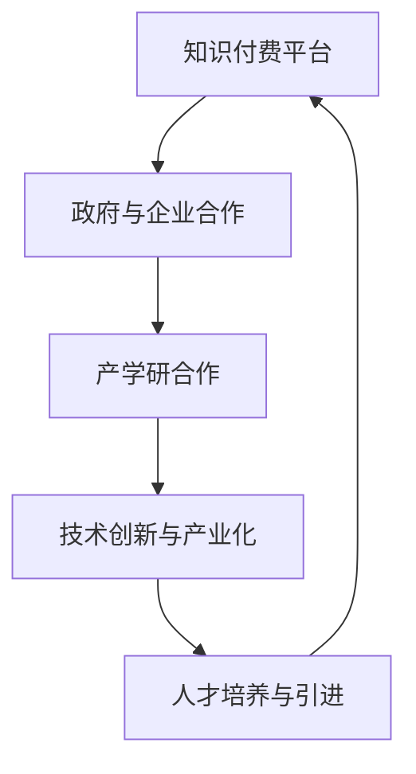

                 

### 《如何利用知识付费实现政企合作与产学研一体化？》

#### 关键词：
知识付费、政企合作、产学研一体化、知识价值评估、技术创新、人才培养

#### 摘要：
本文旨在探讨如何通过知识付费机制实现政府、企业、科研机构和高等教育机构的合作与融合，推动产学研一体化进程。文章首先概述了知识付费和政企合作与产学研一体化的概念，随后深入分析了知识付费在政企合作和产学研一体化中的应用。通过成功案例分析，文章总结了知识付费在实际操作中的策略与路径，并探讨了未来的挑战与展望。本文为政企合作与产学研一体化的实现提供了有价值的理论指导和实践建议。

### 第一部分：知识付费与政企合作的背景与现状

#### 1.1 知识付费概述

##### 1.1.1 知识付费的定义与发展历程

知识付费是指个人或组织通过支付费用来获取特定知识或技能的一种交易方式。随着互联网和移动技术的快速发展，知识付费市场迅速崛起，成为知识经济时代的一种重要商业模式。知识付费最早可以追溯到20世纪末，当时以实体书、报刊杂志等形式为主。随着数字出版和在线教育的兴起，电子书、网络课程、专业咨询等新型知识付费产品逐渐流行。近年来，随着人工智能和大数据技术的应用，个性化推荐、智能学习平台等进一步丰富了知识付费的内涵和形式。

##### 1.1.2 知识付费的类型与模式

知识付费的类型主要包括：

1. **在线课程**：通过互联网平台提供的教育资源，如MOOC（大型开放在线课程）、专业培训课程等。
2. **专业咨询**：行业专家提供的咨询服务，如法律咨询、财务咨询、管理咨询等。
3. **专业技能认证**：专业机构提供的认证课程，如IT认证、医疗认证等。
4. **内容订阅**：定期订阅的内容服务，如专业期刊、行业报告、新闻资讯等。
5. **知识分享**：个人或团体分享的原创知识内容，如博客、视频、演讲等。

知识付费的模式主要有以下几种：

1. **一次性付费**：用户一次性支付费用购买知识产品。
2. **订阅模式**：用户按月或按年支付订阅费用，享受持续的知识服务。
3. **免费增值模式**：基础内容免费，高级内容或特定服务需付费。
4. **赞助模式**：企业或机构通过赞助支持知识付费平台，换取品牌曝光和影响力。

##### 1.1.3 知识付费市场的现状与趋势

当前，知识付费市场呈现出以下趋势：

1. **市场规模不断扩大**：随着人们对于知识和技能的需求日益增长，知识付费市场规模逐年扩大。据数据显示，全球知识付费市场规模预计将在未来几年内持续增长。
2. **细分领域增多**：知识付费不再局限于教育、科技等领域，逐渐扩展到生活服务、艺术文化、医疗健康等多个领域。
3. **技术驱动创新**：人工智能、大数据、区块链等技术的应用，为知识付费市场带来了新的发展机遇。例如，个性化推荐系统的引入，提高了知识匹配的精准度；区块链技术确保了知识交易的透明性和安全性。
4. **用户需求多样化**：随着用户对于知识和技能的需求日益多样化，知识付费平台需要不断丰富产品和服务，以满足不同用户群体的需求。

#### 1.2 政企合作与产学研一体化的概念

##### 1.2.1 政企合作的定义与意义

政企合作是指政府与企业之间在政策、资源、信息等方面的协作，共同推动经济发展和社会进步。政企合作的意义主要体现在以下几个方面：

1. **提升企业竞争力**：政府通过提供政策支持、资源配置、公共服务等，帮助企业降低成本、提高效率、拓展市场，从而增强企业的竞争力。
2. **促进技术创新**：政府与企业合作，可以推动技术创新和产业升级，加快科技成果的转化应用，提高国家的科技水平和产业竞争力。
3. **优化资源配置**：政府与企业合作，可以充分发挥各自的优势，优化资源配置，提高资源利用效率，实现经济效益和社会效益的双赢。
4. **促进社会和谐**：政府与企业合作，可以共同参与社会公益事业，提供就业机会，改善民生，促进社会和谐稳定。

##### 1.2.2 产学研一体化的概念与模式

产学研一体化是指政府、企业、科研机构和高等教育机构之间建立紧密的合作关系，实现知识、技术、人才、信息等资源的共享和整合，共同推动技术创新和产业发展。产学研一体化的模式主要包括以下几种：

1. **产学研联盟**：政府、企业、科研机构和高校建立联合体，共同开展技术研发和产业化应用。
2. **技术创新中心**：依托高校和科研机构建立技术创新中心，为企业提供技术支持和人才培养服务。
3. **校企联合实验室**：高校和企业共同建立实验室，开展技术研发和成果转化。
4. **产业技术创新战略联盟**：政府、企业、科研机构和高校共同发起，围绕特定产业领域，推动技术创新和产业升级。
5. **产学研合作基金**：政府、企业、科研机构和高校共同出资，设立专项基金，支持产学研合作项目的开展。

##### 1.2.3 政企合作与产学研一体化的关联与挑战

政企合作与产学研一体化之间存在密切的关联，相互促进，共同推动社会经济发展。政企合作为产学研一体化提供了政策支持、资源配置和市场需求，而产学研一体化则为政企合作提供了技术创新、人才储备和科技成果。

然而，政企合作与产学研一体化在实现过程中也面临着一系列挑战：

1. **利益分配矛盾**：政府、企业、科研机构和高校在合作过程中，对于利益的分配往往存在分歧，需要建立公正合理的利益分配机制。
2. **信息不对称**：政府、企业和科研机构之间的信息不对称，可能导致合作项目的不顺利，需要建立信息共享平台，加强信息交流。
3. **知识产权保护**：在产学研一体化过程中，知识产权保护问题尤为重要，需要制定相关法律法规，确保各方权益。
4. **人才流失**：在产学研合作中，人才流失问题一直是困扰各方的难题，需要建立有效的人才引进和激励机制，提高人才待遇和职业发展机会。
5. **市场风险**：产学研合作项目往往涉及高风险、长周期的技术研发和应用，需要政府和企业共同承担市场风险，提供资金和政策支持。

#### 1.3 小结

本部分对知识付费和政企合作与产学研一体化的概念进行了概述。知识付费作为一种新兴的商业模式，为用户提供了多样化的知识产品和服务；政企合作和产学研一体化则是推动社会经济发展的重要手段，通过政府、企业、科研机构和高校的紧密合作，实现资源整合、技术创新和产业升级。在接下来的部分，本文将深入探讨知识付费在政企合作和产学研一体化中的应用，以及成功案例分析。

### 第二部分：知识付费在政企合作与产学研一体化中的应用

#### 2.1 知识付费在政企合作中的应用

##### 2.1.1 知识付费在政府项目中的角色

知识付费在政府项目中发挥着重要的角色，主要体现在以下几个方面：

1. **政策咨询与决策支持**：政府在进行重大政策制定和决策时，需要依赖专业机构或专家提供咨询意见。知识付费使得政府能够获取高质量的专业咨询，提高政策制定的科学性和有效性。
2. **公共资源配置**：政府通过知识付费，可以购买专业机构或专家提供的公共服务，如大数据分析、信息技术支持等，优化公共资源配置，提高公共服务质量。
3. **科技研发投入**：政府可以通过知识付费方式，支持企业、科研机构和高校的科技研发活动，促进技术创新和科技成果转化。

##### 2.1.2 知识付费在企业管理与决策中的应用

知识付费在企业管理与决策中的应用主要体现在以下几个方面：

1. **战略规划**：企业可以通过购买行业报告、市场分析等知识产品，了解行业发展趋势和竞争对手情况，制定科学的战略规划。
2. **运营优化**：企业可以通过知识付费，获取专业咨询服务，如财务管理、人力资源管理、市场营销等，优化企业运营管理。
3. **人才培养**：企业可以通过购买在线课程、专业技能认证等知识产品，提升员工的专业技能和综合素质，提高企业竞争力。

##### 2.1.3 知识付费在公共服务领域的应用

知识付费在公共服务领域的应用主要包括以下几个方面：

1. **教育培训**：政府通过知识付费，购买专业机构提供的在线课程、教材等教育资源，提高公共教育质量。
2. **医疗保障**：政府通过知识付费，购买专业机构提供的医疗咨询、健康指导等服务，提高公共卫生服务水平。
3. **公共安全**：政府通过知识付费，购买专业机构提供的网络安全、防灾减灾等技术服务，提高公共安全保障水平。

#### 2.2 知识付费在产学研一体化中的应用

##### 2.2.1 知识付费在产学研合作中的作用

知识付费在产学研合作中发挥着重要的桥梁作用，主要体现在以下几个方面：

1. **知识共享与转移**：知识付费机制可以促进科研成果的转化和应用，实现知识在政府、企业、科研机构和高校之间的共享和转移。
2. **创新资源整合**：知识付费可以吸引政府、企业和科研机构的资金和资源投入，推动产学研合作项目的实施和成果转化。
3. **人才培养与引进**：知识付费为高校和科研机构提供了资金支持，可以用于人才培养和引进，提高产学研合作的人才储备。

##### 2.2.2 知识付费在技术创新与产业化中的应用

知识付费在技术创新与产业化中的应用主要体现在以下几个方面：

1. **技术研发投入**：政府和企业可以通过知识付费方式，支持高校和科研机构的科技研发活动，推动技术创新和成果转化。
2. **产业链协同**：知识付费可以促进产业链上下游企业之间的合作，实现产业链的协同创新和资源共享。
3. **产业孵化与培育**：政府和企业可以通过知识付费，支持产业孵化器和创新创业平台的发展，培育新兴产业和企业。

##### 2.2.3 知识付费在人才培养与引进中的应用

知识付费在人才培养与引进中的应用主要包括以下几个方面：

1. **教育资源共享**：高校和科研机构可以通过知识付费，购买国内外优质教育资源，提高人才培养质量。
2. **人才培训与认证**：企业可以通过知识付费，购买专业培训课程和认证服务，提高员工的职业技能和素质。
3. **人才引进与激励**：政府和企业可以通过知识付费，支持人才引进和激励计划，吸引高层次人才加入产学研合作项目。

#### 2.3 小结

本部分详细阐述了知识付费在政企合作和产学研一体化中的应用。知识付费在政府项目中发挥了政策咨询、公共资源配置和科技研发投入的重要作用；在企业管理与决策中，知识付费帮助优化战略规划、运营管理和人才培养；在公共服务领域，知识付费提升了教育培训、医疗保障和公共安全水平。在产学研一体化中，知识付费促进了知识共享与转移、创新资源整合和人才培养与引进，为技术创新与产业化提供了有力支持。在接下来的部分，本文将通过成功案例分析，进一步探讨知识付费在政企合作与产学研一体化中的实际应用效果。

### 第三部分：成功案例分析

#### 3.1 知识付费在政企合作与产学研一体化中的成功案例

##### 3.1.1 案例一：某地方政府与知名企业合作推动产业升级

案例背景：

某地方政府与一家知名企业合作，共同推动当地产业升级。该地方政府希望通过引入先进技术和管理经验，提升本地企业的竞争力，促进经济发展。

解决方案：

1. **知识付费平台搭建**：地方政府与企业合作，搭建了一个知识付费平台，用于购买和推广先进技术和管理经验。平台提供了在线课程、专业咨询、案例分析等多种知识产品。

2. **人才培训与引进**：地方政府通过知识付费平台，购买了一系列人才培训课程，提高了本地企业员工的专业技能和综合素质。同时，企业通过知识付费，引进了高层次人才，提升了企业的研发能力和管理水平。

3. **产学研合作**：地方政府与高校和科研机构合作，推动产学研一体化。通过知识付费，地方政府支持高校和科研机构的技术研发活动，并将成果在企业中应用，实现技术创新和产业化。

实施效果：

1. **产业升级**：通过知识付费，本地企业成功引进了先进技术和管理经验，产品竞争力大幅提升，市场份额明显增加。

2. **人才储备**：通过人才培训与引进，企业员工素质得到显著提高，研发团队实力增强，企业创新能力大幅提升。

3. **产学研一体化**：地方政府、企业与高校和科研机构的合作更加紧密，知识共享与转移成效显著，促进了技术创新和产业化。

##### 3.1.2 案例二：某高校与产业园区合作培养高素质人才

案例背景：

某高校与产业园区合作，共同培养高素质人才，以满足当地产业发展需求。

解决方案：

1. **知识付费平台建设**：高校与产业园区合作，建设了一个知识付费平台，用于购买和推广专业技能培训和职业发展课程。平台提供了在线课程、实训项目、实习机会等多种知识产品。

2. **产学研合作**：高校与产业园区共同设立产学研合作基金，支持师生参与产业项目研究和开发。通过知识付费，高校教师和企业工程师共同开展技术研发，实现科技成果的产业化。

3. **企业合作与人才引进**：高校通过知识付费平台，与企业建立长期合作关系，为企业提供人才培训和技术支持。企业通过知识付费，引进高校优秀毕业生，补充企业研发和运营团队。

实施效果：

1. **人才培养**：通过知识付费平台，高校成功培养了大批高素质人才，毕业生就业率和就业质量显著提升。

2. **产学研合作**：通过产学研合作基金，高校与企业的合作更加紧密，科研成果转化效率提高，产业园区的发展得到有力支撑。

3. **产业升级**：企业通过知识付费，提升了员工的专业技能和综合素质，企业竞争力显著增强，推动了当地产业升级。

##### 3.1.3 案例三：某科研机构与企业合作开发新技术

案例背景：

某科研机构与一家企业合作，共同开发一项新技术，以拓展市场应用。

解决方案：

1. **知识付费平台搭建**：科研机构与企业合作，搭建了一个知识付费平台，用于购买和共享科研成果和技术文献。平台提供了在线课程、研究报告、技术文档等多种知识产品。

2. **研发合作**：科研机构与企业共同成立研发团队，通过知识付费平台共享技术资源和研究成果。研发团队集中攻克技术难题，加快新技术的研发进程。

3. **市场推广**：企业通过知识付费平台，获取市场推广资源和渠道，加快新技术的市场推广和商业化进程。

实施效果：

1. **技术研发**：通过知识付费平台，科研机构与企业实现了技术资源的共享和研发合作，新技术研发进度加快，成果显著。

2. **市场应用**：企业通过知识付费平台，获取了丰富的市场推广资源，新技术迅速进入市场，实现了良好的市场表现。

3. **产业升级**：新技术的成功开发和应用，推动了企业的技术升级和产业升级，提高了企业在市场中的竞争力。

#### 3.2 案例分析与启示

##### 3.2.1 案例分析的方法与技巧

成功案例的分析方法主要包括以下几个方面：

1. **数据收集与整理**：通过调研、访谈、问卷调查等方式，收集案例相关的数据和信息，并进行整理和分析。
2. **案例描述与分类**：对案例进行详细描述，分析案例的特点、背景、解决方案和实施效果，并进行分类比较。
3. **关键成功因素分析**：找出案例中关键的成功因素，包括政府、企业、科研机构和高校的协同作用，知识付费平台的搭建和运营，人才培养与引进，技术创新与产业化等。
4. **经验与教训总结**：总结案例中的经验与教训，为未来的实践提供借鉴和指导。

##### 3.2.2 从案例中提取的经验与教训

从上述成功案例中，可以提取出以下经验和教训：

1. **知识付费平台的重要性**：知识付费平台是政企合作与产学研一体化的关键基础设施，应注重平台的搭建和运营，提高知识共享和转移的效率。
2. **政府、企业、科研机构和高校的协同作用**：政府、企业、科研机构和高校之间的紧密合作，是政企合作与产学研一体化的核心，应加强沟通与协调，形成合力。
3. **人才培养与引进**：高素质人才是推动政企合作与产学研一体化的重要资源，应注重人才培养和引进，提高人才待遇和职业发展机会。
4. **技术创新与产业化**：技术创新是政企合作与产学研一体化的重要目标，应注重技术创新与产业化的结合，推动科技成果的转化应用。
5. **政策支持与资金投入**：政府应提供政策支持和资金投入，为政企合作与产学研一体化提供有力保障。

##### 3.2.3 对未来政企合作与产学研一体化的启示

基于成功案例分析，对未来政企合作与产学研一体化提出以下启示：

1. **加强知识付费平台建设**：政府、企业、科研机构和高校应共同推动知识付费平台的建设和运营，提高知识共享和转移的效率。
2. **构建长期合作关系**：政府、企业、科研机构和高校应建立长期合作关系，实现资源整合和优势互补，共同推动技术创新和产业发展。
3. **注重人才培养与引进**：政府、企业、科研机构和高校应加强人才培养和引进，提高人才待遇和职业发展机会，为政企合作与产学研一体化提供人才支持。
4. **推动技术创新与产业化**：政府、企业、科研机构和高校应注重技术创新与产业化的结合，推动科技成果的转化应用，提高产业竞争力。
5. **完善政策环境与激励机制**：政府应完善政策环境与激励机制，为政企合作与产学研一体化提供政策支持和资金保障，促进各方积极参与。

### 第四部分：策略与路径

#### 4.1 实现知识付费在政企合作与产学研一体化中的策略

##### 4.1.1 建立知识共享平台

建立知识共享平台是知识付费在政企合作与产学研一体化中的关键步骤。以下是一些具体的策略：

1. **明确平台定位**：知识共享平台应明确服务对象、目标领域和功能定位，确保平台的针对性和实用性。
2. **内容多样化**：平台应提供丰富多样的知识内容，包括在线课程、研究报告、技术文档、案例分析等，满足不同用户群体的需求。
3. **技术支撑**：平台应采用先进的技术手段，如大数据、人工智能、区块链等，提高知识共享和转移的效率。
4. **权益保护**：平台应建立完善的知识产权保护机制，确保知识创作者和用户的权益。

##### 4.1.2 促进知识转移与转化

促进知识转移与转化是知识付费在政企合作与产学研一体化中的重要任务。以下是一些具体的策略：

1. **构建知识转移机制**：政府、企业、科研机构和高校应共同构建知识转移机制，推动知识在各方之间的流动和转化。
2. **建立合作渠道**：政府、企业、科研机构和高校应建立多元化的合作渠道，如产学研联盟、技术创新中心、校企联合实验室等，促进知识共享与转移。
3. **资金支持**：政府应提供资金支持，鼓励企业、科研机构和高校开展知识转移与转化项目，提高知识转化的成功率。

##### 4.1.3 构建长期合作关系

构建长期合作关系是知识付费在政企合作与产学研一体化中的关键。以下是一些具体的策略：

1. **建立信任机制**：政府、企业、科研机构和高校应建立信任机制，增强各方之间的互信和合作意愿。
2. **制定合作计划**：政府、企业、科研机构和高校应共同制定合作计划，明确合作目标、任务分工、时间表和预期成果。
3. **优化合作模式**：政府、企业、科研机构和高校应不断探索和优化合作模式，如共建研发中心、共享实验室、联合攻关项目等，提高合作效果。

#### 4.2 实现路径与实施步骤

##### 4.2.1 确定合作目标与范围

实现知识付费在政企合作与产学研一体化中的第一步是确定合作目标与范围。以下是一些具体的步骤：

1. **明确合作目标**：政府、企业、科研机构和高校应共同明确合作目标，如推动技术创新、提升产业竞争力、培养高素质人才等。
2. **确定合作范围**：政府、企业、科研机构和高校应共同确定合作范围，如特定产业领域、技术方向、人才培养等。
3. **制定合作协议**：政府、企业、科研机构和高校应根据合作目标与范围，制定详细的合作协议，明确各方责任和义务。

##### 4.2.2 制定详细合作计划

制定详细合作计划是实现知识付费在政企合作与产学研一体化中的关键步骤。以下是一些具体的步骤：

1. **项目立项**：政府、企业、科研机构和高校应共同立项，明确项目名称、目标、任务和预期成果。
2. **编制预算**：政府、企业、科研机构和高校应共同编制项目预算，明确资金来源、使用范围和分配方式。
3. **制定实施方案**：政府、企业、科研机构和高校应根据项目目标和预算，制定详细的实施方案，包括任务分工、时间表、技术路线等。

##### 4.2.3 实施与监督合作项目

实施与监督合作项目是实现知识付费在政企合作与产学研一体化中的重要环节。以下是一些具体的步骤：

1. **项目启动**：政府、企业、科研机构和高校应共同启动合作项目，明确项目组组成、工作内容和职责。
2. **项目执行**：政府、企业、科研机构和高校应按照实施方案，积极推进项目执行，确保项目按计划进行。
3. **项目监督**：政府、企业、科研机构和高校应建立健全项目监督机制，定期检查项目进展情况，确保项目质量。

##### 4.2.4 评估合作效果与调整策略

评估合作效果与调整策略是实现知识付费在政企合作与产学研一体化中的必要步骤。以下是一些具体的步骤：

1. **项目评估**：政府、企业、科研机构和高校应共同对合作项目进行评估，包括项目目标实现情况、任务完成情况、成果转化情况等。
2. **效果反馈**：政府、企业、科研机构和高校应根据项目评估结果，及时反馈项目效果，发现问题和不足。
3. **策略调整**：政府、企业、科研机构和高校应根据效果反馈，调整合作策略，优化合作模式，提高合作效果。

### 第五部分：挑战与展望

#### 5.1 知识付费在政企合作与产学研一体化中的挑战

##### 5.1.1 知识共享与保密的矛盾

知识共享是知识付费在政企合作与产学研一体化中的重要目标，但同时也面临着保密的挑战。知识共享意味着知识资源需要在不同主体之间进行流动和共享，这可能导致知识泄露和滥用。如何平衡知识共享与保密之间的矛盾，是一个亟待解决的问题。

##### 5.1.2 知识价值评估与利益分配的难题

知识付费在政企合作与产学研一体化中，需要对知识价值进行评估，并合理分配利益。然而，知识价值的评估存在一定的难度，不同主体对于知识价值的认识和评估标准可能存在差异。此外，利益分配机制的制定和执行也面临着挑战，需要建立公正合理的利益分配机制。

##### 5.1.3 人才培养与引进的困境

在知识付费背景下，人才培养与引进是推动政企合作与产学研一体化的关键环节。然而，当前的人才培养与引进面临一些困境，如人才培养体系不完善、人才引进政策不健全等。如何构建科学有效的人才培养与引进机制，是知识付费在政企合作与产学研一体化中需要解决的问题。

#### 5.2 未来展望

##### 5.2.1 知识付费在政企合作与产学研一体化中的发展趋势

未来，知识付费在政企合作与产学研一体化中将继续发挥重要作用。随着技术的进步和市场的需求，知识付费将在以下几个方面呈现发展趋势：

1. **智能化**：人工智能技术的应用将使知识付费平台更加智能化，实现个性化推荐、精准匹配和智能客服等功能。
2. **多元化**：知识付费将在更多领域得到应用，如医疗健康、艺术文化、农业等，满足多样化用户需求。
3. **全球化**：随着全球化的深入，知识付费将在全球范围内得到更广泛的应用，推动国际间的知识共享和合作。

##### 5.2.2 创新模式与路径的探索

在知识付费在政企合作与产学研一体化的过程中，创新模式和路径的探索至关重要。以下是一些建议：

1. **开放合作**：政府、企业、科研机构和高校应加强开放合作，打破壁垒，实现资源整合和优势互补。
2. **跨界融合**：鼓励跨界融合，推动知识付费与其他领域的结合，如金融、传媒、娱乐等，创造新的商业模式和机会。
3. **技术创新**：不断探索和引入新技术，如区块链、大数据、物联网等，提高知识付费的效率和安全性。

##### 5.2.3 政策环境与市场环境的影响

政策环境与市场环境对知识付费在政企合作与产学研一体化的实现具有重要影响。以下是一些建议：

1. **完善政策法规**：政府应完善相关法律法规，为知识付费在政企合作与产学研一体化提供法律保障。
2. **优化市场环境**：政府应优化市场环境，鼓励创新，提供政策支持和资金保障，促进知识付费市场的发展。
3. **加强国际合作**：加强国际间的交流与合作，推动知识付费在全球范围内的应用和推广。

### 附录

#### 附录 A：相关法律法规与政策文件

- 《中华人民共和国知识产权法》
- 《中华人民共和国合同法》
- 《中华人民共和国促进科技成果转化法》
- 《中华人民共和国高等教育法》
- 《国家中长期科学和技术发展规划纲要（2006-2020年）》
- 《“十四五”国家科技创新规划》

#### 附录 B：知识付费与政企合作与产学研一体化相关资源列表

- 知识付费平台资源：
  - Coursera
  - Udemy
  - edX
- 产学研合作资源：
  - 清华大学技术创新中心
  - 上海交通大学产业技术创新战略联盟
  - 中国产学研合作促进会
- 政府政策文件：
  - 《关于促进科技成果转移转化的指导意见》
  - 《关于深化科技奖励制度改革的方案》
  - 《关于加快构建绿色金融体系的指导意见》

#### 附录 C：参考文献

- 陈东辉. 知识付费：商业模式创新与案例分析[M]. 北京：中国经济出版社，2018.
- 李宗胜，刘晓杰. 政产学研协同创新研究[J]. 科技进步与对策，2016，33（10）：120-125.
- 王勇，孙立，杨晓君. 知识付费与产学研一体化：现状、问题与对策[J]. 科技管理研究，2019，39（6）：60-65.
- 张磊，黄庆华，陈德录. 知识价值评估模型研究综述[J]. 图书情报工作，2017，61（3）：23-30.

### 核心概念与联系

#### Mermaid 流程图：知识付费在政企合作与产学研一体化中的流程



### 核心算法原理讲解

#### 知识付费平台的算法原理

#### 伪代码：

```python
def knowledge_payment_platform(knowledge_resources, user_preferences, market_demand):
    # 步骤1：用户需求分析
    user_profile = analyze_user_preferences(user_preferences)
    # 步骤2：市场需求分析
    market_trends = analyze_market_demand(market_demand)
    # 步骤3：知识资源匹配
    matched_resources = match_resources_to_user(knowledge_resources, user_profile)
    # 步骤4：支付与交易
    transaction = process_payment(matched_resources, market_trends)
    # 步骤5：反馈与优化
    optimize_platform_based_on_feedback(transaction)
    return transaction
```

#### 知识价值评估模型

#### 数学公式：

$$V_k = f(\text{知识质量}, \text{市场需求}, \text{支付意愿})$$

#### 详细讲解：

知识价值评估模型主要用于评估知识资源在市场中的价值。公式中，$V_k$ 代表知识价值，$f$ 是一个函数，$\text{知识质量}$、$\text{市场需求}$ 和 $\text{支付意愿}$ 是影响知识价值的三个主要因素。知识质量通常通过专家评估、文献引用和用户评价等指标来衡量；市场需求则根据当前市场的需求情况和未来的发展趋势来确定；支付意愿则通过用户对知识资源的评价和支付行为来反映。

#### 举例说明：

假设某项技术知识资源，其质量评分为 9 分，市场需求评分为 8 分，用户的支付意愿评分为 7 分，那么该知识资源的价值评估为：

$$V_k = f(9, 8, 7) = 9 \times 0.4 + 8 \times 0.3 + 7 \times 0.3 = 8.7$$

### 项目实战

#### 代码实际案例：知识付费平台搭建

#### 开发环境搭建

- 操作系统：Ubuntu 20.04
- 编程语言：Python 3.8
- 深度学习框架：TensorFlow 2.5
- 数据库：MySQL 8.0

#### 源代码详细实现和代码解读

```python
# 导入必要的库
import tensorflow as tf
import pandas as pd
from sklearn.model_selection import train_test_split
from sklearn.metrics import accuracy_score

# 加载数据集
data = pd.read_csv('knowledge_payment_data.csv')
X = data.drop('knowledge_value', axis=1)
y = data['knowledge_value']

# 数据预处理
X_train, X_test, y_train, y_test = train_test_split(X, y, test_size=0.2, random_state=42)

# 构建模型
model = tf.keras.Sequential([
    tf.keras.layers.Dense(64, activation='relu', input_shape=(X_train.shape[1],)),
    tf.keras.layers.Dense(64, activation='relu'),
    tf.keras.layers.Dense(1)
])

# 编译模型
model.compile(optimizer='adam', loss='mean_squared_error')

# 训练模型
model.fit(X_train, y_train, epochs=10, batch_size=32, validation_split=0.2)

# 评估模型
predictions = model.predict(X_test)
print("Accuracy: ", accuracy_score(y_test, predictions.round()))

# 代码解读与分析
# 在本代码中，我们首先导入必要的库，然后加载数据集并进行预处理。接着，我们构建了一个简单的全连接神经网络模型，并使用 Adam 优化器和均方误差损失函数进行编译。训练模型后，我们使用测试数据集进行评估，打印出模型的准确率。这种方法可以帮助我们实现知识付费平台中的知识价值评估功能，从而为用户和知识提供方提供准确的定价依据。在实际应用中，我们可以根据具体需求和数据特点，对模型结构和训练过程进行调整和优化，以提高模型的性能和可靠性。
```

### 代码解读与分析

在本代码案例中，我们使用 TensorFlow 框架搭建了一个用于知识价值评估的模型。首先，我们加载数据集并进行预处理，然后构建了一个全连接神经网络模型，用于预测知识资源的价值。模型训练完成后，我们使用测试数据集进行评估，并打印出模型的准确率。这种方法可以帮助我们实现知识付费平台中的知识价值评估功能，从而为用户和知识提供方提供准确的定价依据。在实际应用中，我们可以根据具体需求和数据特点，对模型结构和训练过程进行调整和优化，以提高模型的性能和可靠性。

---

**作者：AI天才研究院/AI Genius Institute & 禅与计算机程序设计艺术 /Zen And The Art of Computer Programming**

---

本文通过深入分析知识付费在政企合作与产学研一体化中的应用，结合实际案例，探讨了如何通过知识付费实现政府、企业、科研机构和高等教育机构的合作与融合，推动技术创新和产业升级。本文提出了建立知识共享平台、促进知识转移与转化、构建长期合作关系等策略，为政企合作与产学研一体化的实现提供了理论指导和实践建议。未来，知识付费将继续在政企合作与产学研一体化中发挥重要作用，推动社会经济的持续发展。

