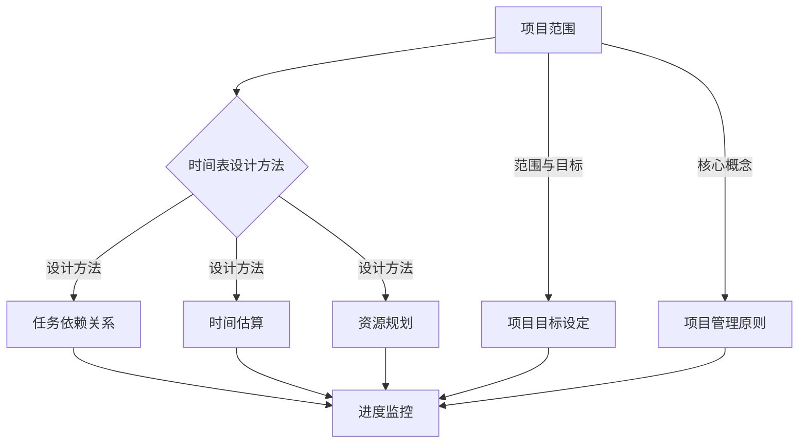

                 

## 如何制定项目开发时间表

> **关键词**：项目开发时间表、项目管理、进度跟踪、任务依赖关系、时间估算、缓冲时间

**摘要**：本文将详细探讨如何制定一个有效的项目开发时间表。从项目开发时间表的核心概念与原则，到项目范围与目标的设定，再到项目时间表的设计方法、具体编制以及时间表的管理与调整，我们将一步步分析推理，提供实用的方法和策略，帮助读者在实际项目中成功制定并管理项目开发时间表。

### 第一部分：项目开发时间表概述

项目开发时间表是项目管理中至关重要的一环。它不仅能够帮助团队明确任务目标，还能确保项目按时、按质、按量地完成。然而，制定一个有效的项目开发时间表并非易事，需要遵循一定的原则和方法。以下章节将详细阐述这些内容。

#### 第1章：项目开发时间表的核心概念与原则

- **1.1 为什么要制定项目开发时间表？**
  - 项目管理的重要性
  - 时间管理对项目成功的影响
  - 时间表与进度跟踪的关系

- **1.2 项目开发时间表的基本概念**
  - 任务定义
  - 依赖关系
  - 时间估算
  - 进度追踪

- **1.3 制定项目开发时间表的原则**
  - 实际可行性
  - 灵活性与适应性
  - 风险评估与应对

#### 第2章：项目范围与目标设定

- **2.1 确定项目范围**
  - 定义项目边界
  - 避免范围蔓延
  - 范围文档的编写

- **2.2 设定项目目标**
  - 项目目标的类型
  - SMART原则的应用
  - 目标与时间表的关联

#### 第3章：项目时间表的设计方法

- **3.1 工具与技术**
  - 甘特图
  - PERT图
  - 关键路径法（CPM）

- **3.2 估算任务时间**
  - 专家判断
  - 历史数据
  - 实地调查

- **3.3 定义任务依赖关系**
  - 确定任务顺序
  - 确定逻辑关系
  - 确定依赖条件

#### 第4章：时间表的具体编制

- **4.1 创建时间表**
  - 任务分配
  - 资源规划
  - 时间刻度设定

- **4.2 预留缓冲时间**
  - 缓冲时间的作用
  - 缓冲时间的估算
  - 缓冲时间的管理

- **4.3 时间表的审核与批准**
  - 审核时间表的准确性
  - 获得项目干系人的批准
  - 定期更新与回顾

### 第一部分总结

本部分为读者提供了项目开发时间表的基本框架和核心概念，为后续章节的深入探讨奠定了基础。在接下来的章节中，我们将进一步探讨如何根据项目范围和目标制定具体的时间表，以及如何在项目执行过程中管理和调整时间表。希望这部分内容能够帮助读者更好地理解项目开发时间表的重要性，并为其在实际项目中的应用提供指导。

### 第1章：项目开发时间表的核心概念与原则

项目开发时间表是项目管理中的核心工具，它不仅帮助团队明确项目进度，还能够在项目执行过程中提供重要的参考。在这一章中，我们将详细探讨项目开发时间表的核心概念与原则，包括为什么要制定项目开发时间表、项目开发时间表的基本概念以及制定项目开发时间表应遵循的原则。

#### 1.1 为什么要制定项目开发时间表？

项目开发时间表在项目管理中扮演着至关重要的角色。以下是制定项目开发时间表的主要原因：

1. **项目管理的重要性**：项目管理是确保项目成功完成的关键。通过制定项目开发时间表，可以有效地组织和协调项目资源，确保项目按照预定的计划进行。

2. **时间管理对项目成功的影响**：时间是项目管理中最宝贵的资源之一。有效的时间管理不仅能够确保项目按时完成，还能提高项目效率，减少项目成本。

3. **时间表与进度跟踪的关系**：项目开发时间表为团队提供了一个清晰的进度框架，使团队能够实时跟踪项目进度，及时发现并解决潜在问题，确保项目按计划推进。

#### 1.2 项目开发时间表的基本概念

项目开发时间表包含以下几个核心概念：

1. **任务定义**：任务是指项目中需要完成的独立工作单元。定义任务是项目开发时间表编制的第一步，它为后续的时间估算和依赖关系设定提供了基础。

2. **依赖关系**：依赖关系描述了任务之间的逻辑顺序。一个任务的开始或完成可能依赖于另一个任务的完成。理解并明确依赖关系有助于确保项目按时完成。

3. **时间估算**：时间估算是指对每个任务完成所需时间的预测。准确的时间估算是制定有效项目开发时间表的关键。

4. **进度追踪**：进度追踪是项目开发时间表的核心功能之一。通过实时跟踪项目进度，团队可以及时发现偏差并采取纠正措施。

#### 1.3 制定项目开发时间表的原则

在制定项目开发时间表时，应遵循以下原则：

1. **实际可行性**：项目开发时间表必须基于实际情况制定，确保任务的完成时间和资源分配是可行的。过于理想化的时间表可能导致项目无法按计划完成。

2. **灵活性**：项目开发时间表应具有一定的灵活性，能够适应项目执行过程中的变化。灵活的时间表有助于应对意外情况，确保项目能够按时完成。

3. **适应性**：项目开发时间表应能够适应项目范围和目标的变更。在项目执行过程中，范围和目标可能会发生变化，适应性的时间表能够及时调整以反映这些变化。

4. **风险评估与应对**：制定项目开发时间表时，应充分考虑项目风险，并为潜在风险预留缓冲时间。风险评估和应对策略有助于确保项目在面临风险时能够顺利推进。

通过遵循上述原则，团队能够制定出既实际又有效的项目开发时间表，从而提高项目成功的可能性。

### 第2章：项目范围与目标设定

项目范围与目标是项目成功的关键因素。明确的项目范围和目标是制定项目开发时间表的基础。本章将详细探讨如何确定项目范围，设定项目目标，并确保目标与时间表的关联。

#### 2.1 确定项目范围

确定项目范围是项目管理中的第一步，也是至关重要的一步。以下是确定项目范围的关键步骤：

1. **定义项目边界**：项目边界是指项目所包含的工作范围和边界条件。明确项目边界有助于防止范围蔓延，确保项目在预定范围内完成。

2. **避免范围蔓延**：范围蔓延是指项目范围在项目执行过程中不断扩大的现象。为了避免范围蔓延，项目团队应严格执行项目范围说明书，及时识别并拒绝不必要的变更请求。

3. **范围文档的编写**：编写详细的项目范围文档，包括项目的具体目标和范围边界。范围文档应明确项目所包含的工作内容，以及项目团队在项目执行过程中的职责和权限。

#### 2.2 设定项目目标

项目目标是指项目希望实现的具体成果和预期效果。设定项目目标是项目成功的关键。以下是设定项目目标的关键步骤：

1. **项目目标的类型**：项目目标可以分为成果性目标和约束性目标。成果性目标是指项目希望达成的具体成果，如产品交付、功能实现等；约束性目标是指项目在实现过程中需要遵守的限制条件，如预算、时间等。

2. **SMART原则的应用**：SMART原则是一种设定项目目标的常用方法，SMART分别代表具体（Specific）、可测量（Measurable）、可实现（Achievable）、相关性（Relevant）和时限性（Time-bound）。应用SMART原则有助于确保项目目标清晰、明确、可量化，并具有可行性。

3. **目标与时间表的关联**：项目目标与时间表之间应建立紧密的关联。在制定时间表时，应根据项目目标设定具体的里程碑和阶段性目标，确保项目在各个阶段都能按照预定计划推进。

通过明确项目范围和设定项目目标，项目团队可以确保项目在预定范围内按计划完成，并实现预期目标。这一过程不仅为制定项目开发时间表奠定了基础，也为项目成功提供了保障。

### 第3章：项目时间表的设计方法

项目时间表的设计是项目成功的关键环节。在这一章中，我们将详细探讨项目时间表的设计方法，包括常用的工具与技术、任务时间的估算方法以及任务依赖关系的定义。

#### 3.1 工具与技术

项目时间表的设计需要借助一系列工具和技术，以下是一些常用的工具：

1. **甘特图**：甘特图是一种直观的时间管理工具，用于展示项目任务及其时间安排。它通过条形图的形式展示任务的开始和结束时间，以及任务之间的依赖关系。

2. **PERT图**：PERT图（项目评估与审查技术图）是一种用于项目管理的时间估算工具。它通过网络图的形式展示任务的逻辑顺序和完成时间，有助于识别关键路径和关键任务。

3. **关键路径法（CPM）**：关键路径法是一种用于确定项目最早完成时间的方法。它通过分析任务之间的依赖关系和时间估算，确定项目中最长的路径，即关键路径。关键路径上的任务对项目的完成时间具有决定性影响。

这些工具和技术在项目时间表设计中起着至关重要的作用，帮助项目团队直观地了解项目的进度和关键路径，从而制定出科学合理的时间表。

#### 3.2 估算任务时间

任务时间的估算对于项目时间表的制定至关重要。以下是几种常用的任务时间估算方法：

1. **专家判断**：专家判断是指依靠具有丰富经验的项目经理和团队成员的判断来估算任务时间。这种方法适用于简单、熟悉的工作任务，但在复杂和未知的情况下可能不够准确。

2. **历史数据**：历史数据是指根据过去类似项目的实际完成时间来估算新项目的任务时间。这种方法基于过去的数据和经验，具有较高的准确性，但需要确保历史数据的有效性和代表性。

3. **实地调查**：实地调查是指通过实际调查和观察来估算任务时间。这种方法适用于对工作任务不熟悉或存在不确定性的情况，能够提供更准确的时间估算。

在实际项目中，通常结合多种估算方法来提高时间估算的准确性。例如，可以先通过专家判断和历史数据初步估算时间，然后通过实地调查进行验证和调整。

#### 3.3 定义任务依赖关系

任务依赖关系是指任务之间的逻辑顺序和依赖条件。明确任务依赖关系对于制定项目时间表至关重要。以下是定义任务依赖关系的步骤：

1. **确定任务顺序**：根据任务之间的逻辑关系，确定任务的先后顺序。例如，一个任务的完成可能依赖于另一个任务的开始或完成。

2. **确定逻辑关系**：明确任务之间的逻辑关系，如串行关系（一个任务完成后才能开始另一个任务）和并行关系（多个任务可以同时进行）。

3. **确定依赖条件**：明确每个任务的依赖条件，例如某个任务需要特定资源的支持，或者需要等待外部环境的准备就绪。

通过明确任务依赖关系，项目团队可以确保任务按照正确的顺序和时间安排进行，从而提高项目的整体效率和质量。

### 第4章：时间表的具体编制

在项目时间表的设计阶段，我们已经确定了任务依赖关系和时间估算。现在，我们需要将这些信息转化为具体的时间表。本章将详细探讨如何创建时间表、预留缓冲时间以及审核与批准时间表。

#### 4.1 创建时间表

创建时间表是项目时间表编制的关键步骤。以下是创建时间表的基本步骤：

1. **任务分配**：根据项目需求和资源情况，将任务分配给项目团队成员。确保每个任务都有明确的责任人，并了解任务的优先级。

2. **资源规划**：在时间表编制过程中，合理规划项目资源，包括人力、物力和财力资源。确保资源充足且能够高效利用，以支持项目任务的完成。

3. **时间刻度设定**：确定时间刻度，以显示项目任务的开始和结束时间。常用的时间刻度包括天、周、月等。根据项目规模和需求，选择合适的时间刻度。

在创建时间表时，可以使用甘特图、PERT图或关键路径法等工具来直观地展示任务和时间安排。这些工具有助于项目团队更好地理解和跟踪项目进度。

#### 4.2 预留缓冲时间

预留缓冲时间是项目时间表编制中不可或缺的一部分。缓冲时间用于应对任务延期、资源短缺或其他意外情况，以确保项目能够按计划完成。以下是预留缓冲时间的关键步骤：

1. **缓冲时间的作用**：缓冲时间可以减少项目延期对整体进度的影响，提供时间上的弹性，使得项目团队有足够的时间应对不确定因素。

2. **缓冲时间的估算**：缓冲时间的估算通常基于任务的风险评估和时间估算。可以使用以下公式来估算缓冲时间：
   $$
   缓冲时间 = \sqrt{\frac{标准偏差（Standard Deviation）^2}{2}}
   $$
   其中，标准偏差是指任务完成时间的离散程度。通过计算标准偏差，可以估算出合理的缓冲时间。

3. **缓冲时间的管理**：在项目执行过程中，缓冲时间应被严格控制。项目团队需要定期检查缓冲时间的使用情况，确保缓冲时间不被浪费。如果任务延期，应重新评估缓冲时间并做出相应的调整。

通过预留和合理管理缓冲时间，项目团队可以更好地应对不确定因素，确保项目按时完成。

#### 4.3 时间表的审核与批准

时间表编制完成后，需要经过审核与批准，以确保时间表的准确性和可行性。以下是审核与批准时间表的步骤：

1. **审核时间表的准确性**：项目团队对时间表进行内部审核，检查时间表的合理性、任务分配的合理性以及时间估算的准确性。发现问题及时修正。

2. **获得项目干系人的批准**：时间表需获得项目干系人的批准，包括项目经理、客户和其他相关利益相关者。干系人的参与和认可有助于确保时间表的顺利执行。

3. **定期更新与回顾**：项目执行过程中，时间表应定期更新，以反映项目进展和变更情况。定期回顾时间表，评估项目进度和成果，并根据实际情况进行调整。

通过严格的审核与批准流程，项目团队可以确保时间表的准确性和可行性，为项目的顺利推进提供保障。

### 第5章：项目进度监控

项目进度监控是确保项目按时、按质完成的关键环节。有效的进度监控能够及时发现并解决问题，确保项目在预定时间内顺利完成。本章将详细探讨项目进度监控的重要性、监控方法和工具，以及如何进行有效的进度监控。

#### 5.1 进度监控的重要性

进度监控在项目管理中具有重要意义，主要体现在以下几个方面：

1. **确保项目按时完成**：通过实时监控项目进度，项目团队可以及时发现偏离计划的情况，并采取相应的纠正措施，确保项目按时完成。

2. **提高项目质量**：进度监控有助于确保项目在各个阶段的质量符合要求。通过监控关键里程碑和阶段性目标，项目团队可以及时发现并解决质量问题，确保项目整体质量。

3. **及时识别和解决问题**：项目执行过程中，可能会出现各种问题和风险。通过进度监控，项目团队可以及时发现这些问题，并采取有效的措施进行解决，避免问题扩大化。

4. **提高团队协作效率**：进度监控能够提高项目团队的协作效率。通过明确任务进度和责任分工，团队成员可以更好地协调工作，避免重复劳动和资源浪费。

#### 5.2 监控方法与工具

项目进度监控需要采用科学的方法和工具，以下是一些常用的监控方法与工具：

1. **项目管理软件**：项目管理软件是进行进度监控的重要工具。常用的项目管理软件包括Microsoft Project、Asana、Trello等。这些软件可以提供任务管理、进度跟踪、资源分配等功能，帮助项目团队高效地进行进度监控。

2. **里程碑报告**：里程碑报告是一种用于展示项目进度的重要报告。里程碑报告通常包括关键里程碑的完成情况、阶段性目标达成情况以及项目整体进度等信息。通过里程碑报告，项目团队可以全面了解项目进展，及时调整计划。

3. **状态审查会议**：状态审查会议是一种定期进行的项目进度评估会议。在状态审查会议上，项目团队成员会讨论项目进展情况、遇到的问题和解决方案，以及下一步的工作计划。状态审查会议有助于提高团队协作和项目透明度，确保项目按计划推进。

#### 5.3 如何进行有效的进度监控

为了进行有效的进度监控，项目团队需要遵循以下步骤：

1. **制定监控计划**：在项目启动阶段，项目团队应制定详细的监控计划，明确监控的目标、方法、频率和责任人。监控计划应与项目目标和时间表紧密相关。

2. **设定监控指标**：监控指标是衡量项目进度的重要标准。常见的监控指标包括任务完成率、进度偏差、成本偏差等。项目团队应根据项目的具体情况进行监控指标的设计。

3. **定期收集数据**：项目团队应定期收集项目进度数据，如任务完成情况、资源使用情况等。这些数据可以通过项目管理软件、里程碑报告等方式进行收集。

4. **分析监控数据**：收集到的数据应进行详细分析，以识别项目进展中的问题和风险。项目团队应分析监控数据，评估项目进度是否符合预期，并制定相应的调整措施。

5. **及时沟通和反馈**：项目团队应及时沟通和反馈项目进展情况，确保团队成员对项目进展有清晰的认识。通过定期沟通和反馈，项目团队可以及时发现问题，并采取有效的措施进行解决。

6. **调整项目计划**：根据监控数据和分析结果，项目团队应适时调整项目计划，确保项目能够按计划完成。调整措施可能包括任务优先级调整、资源重新分配、进度计划调整等。

通过遵循以上步骤，项目团队可以有效地进行进度监控，确保项目按时、按质完成。

### 第6章：时间表的调整

在项目执行过程中，由于各种因素的变化和不确定性，项目时间表往往需要进行调整。时间表的调整是项目管理中常见且必要的环节，旨在确保项目能够按计划完成，同时应对突发情况。本章将详细探讨时间表调整的流程、动态调整方法以及如何进行变更管理。

#### 6.1 变更管理流程

变更管理是指在项目执行过程中，对项目范围、时间表、资源分配等进行的调整和变更。一个有效的变更管理流程能够确保变更的及时性、合理性和可控性。以下是变更管理的基本流程：

1. **变更请求的评估**：当项目出现需要调整的情况时，首先需要提出变更请求。变更请求应详细描述变更的原因、内容以及对项目的影响。项目经理或变更控制委员会负责对变更请求进行初步评估，判断其是否需要进一步的审查。

2. **变更请求的审批**：评估完成后，变更请求需要经过相应的审批流程。审批流程应确保变更请求的合理性、必要性和可行性。审批流程可能包括多个层级的审批，如项目经理、项目总监、客户等。

3. **变更实施与记录**：变更请求通过审批后，项目团队需要根据变更内容进行实施。实施过程中，项目团队应确保变更的正确执行，并及时记录变更的执行情况，以便后续的跟踪和评估。

通过严格的变更管理流程，项目团队能够确保时间表的调整是在可控范围内，同时避免不必要的变更对项目造成负面影响。

#### 6.2 时间表的动态调整

在项目执行过程中，时间表可能会因为多种因素而需要动态调整。以下是一些常见的时间表调整方法：

1. **任务优先级调整**：在项目执行过程中，某些任务可能会因为外部因素（如市场变化、技术难题）而变得更为重要。项目团队可以根据任务的优先级，重新安排任务的顺序，确保关键任务得到优先处理。

2. **资源重新分配**：当项目资源出现短缺或过剩时，项目团队需要对资源进行重新分配。例如，如果某个任务的关键资源被其他任务占用，团队可以重新分配资源，确保任务能够按时完成。

3. **重新估算任务时间**：在项目执行过程中，可能会出现任务完成时间与初始估算不符的情况。项目团队应根据实际情况，重新估算任务时间，并调整时间表，以确保项目能够按计划完成。

#### 6.3 如何进行有效的变更管理

为了确保时间表的调整能够顺利进行，项目团队需要遵循以下原则：

1. **及时沟通**：变更管理过程中，项目团队应保持与项目干系人的密切沟通，确保所有相关人员对变更有清晰的认识。

2. **透明度**：变更管理的流程和结果应保持透明，项目团队应将变更请求、审批结果和实施情况及时记录并共享，以便团队成员和相关方了解。

3. **风险控制**：变更管理过程中，项目团队应充分考虑变更可能带来的风险，并制定相应的风险控制措施，以降低变更对项目的不利影响。

4. **定期回顾**：项目团队应定期回顾变更管理的流程和结果，评估变更管理的有效性和改进空间，不断优化变更管理流程。

通过遵循上述原则，项目团队可以确保时间表的调整在可控范围内，同时提高项目的灵活性和应变能力。

### 第7章：时间表的评估与总结

项目完成之后，对项目时间表的评估与总结是不可或缺的一环。这一过程不仅能够帮助项目团队总结经验教训，还能为未来项目的管理提供宝贵的参考。本章将详细探讨项目完成情况的评估、时间表总结以及改进建议。

#### 7.1 项目完成情况评估

项目完成情况评估是对项目执行结果的全面检查和总结。以下是评估项目完成情况的关键步骤：

1. **完成指标的分析**：首先，项目团队应分析项目的关键完成指标，如任务完成率、进度偏差、成本偏差等。这些指标能够直观地反映项目的执行情况。

2. **费用控制评估**：评估项目在预算范围内的执行情况，分析实际费用与预算费用的差异，并总结原因。这有助于项目团队了解预算管理的有效性和改进方向。

3. **质量评估**：对项目交付的产品或服务进行质量评估，确保其符合项目需求和客户预期。质量评估可以包括客户反馈、测试结果和项目验收等。

通过全面的评估，项目团队可以准确了解项目的实际完成情况，为后续的项目总结提供数据支持。

#### 7.2 时间表总结

时间表总结是对项目时间表执行过程和结果的回顾。以下是时间表总结的关键内容：

1. **成功要素分析**：总结项目成功的关键因素，如项目管理的有效方法、团队成员的合作精神、风险管理策略等。这些成功要素为未来项目的管理提供了有益的经验。

2. **经验教训总结**：总结项目执行过程中的经验教训，包括成功之处和失败之处。通过分析经验教训，项目团队可以避免重复错误，提高项目管理水平。

3. **改进建议提出**：基于项目总结的结果，提出改进建议，包括项目管理流程的优化、时间表编制方法的改进、资源管理策略的调整等。这些建议有助于提高未来项目的执行效率和质量。

#### 7.3 改进建议

为了在未来的项目中更好地制定和执行时间表，项目团队可以采取以下改进建议：

1. **加强沟通与协作**：项目团队应建立有效的沟通机制，确保信息传递的及时性和准确性。通过增强团队协作，提高项目执行效率。

2. **优化时间表编制方法**：采用更加科学和灵活的时间表编制方法，如关键路径法、PERT图等，提高时间表的准确性和可行性。

3. **建立风险管理体系**：建立完善的风险管理体系，提前识别和评估项目风险，制定相应的应对措施，降低项目风险。

4. **强化质量意识**：从项目启动阶段就树立质量意识，确保项目交付的产品或服务符合客户预期。通过持续的质量管理，提高项目成功率。

通过上述改进建议，项目团队可以不断提高项目管理水平，确保项目能够按时、按质、按量地完成。

### 附录

#### 附录 A：时间表编制工具与资源

在项目开发时间表的编制过程中，选择合适的工具和资源是非常重要的。以下是一些常用的工具和资源介绍：

##### A.1 甘特图工具介绍

1. **Microsoft Project**：Microsoft Project 是一款功能强大的项目管理工具，可以创建和编辑甘特图，支持任务分配、资源规划等功能。

2. **Trello**：Trello 是一款基于看板式的项目管理工具，提供简单的甘特图视图，适合小型项目和团队使用。

3. **Asana**：Asana 是一款全面的项目管理工具，支持甘特图视图，提供任务管理、进度跟踪等功能，适合多种规模的项目。

##### A.2 PERT图绘制工具

1. **Microsoft Excel**：Microsoft Excel 是一款常用的电子表格工具，可以绘制简单的 PERT 图，通过公式和图表功能进行数据分析和展示。

2. **Graphviz**：Graphviz 是一款开源的工具，用于创建和编辑图形，包括 PERT 图。它支持多种图形格式和语言，方便进行复杂的图形绘制。

3. **Visio**：Microsoft Visio 是一款专业的图形和图表绘制工具，支持创建复杂的 PERT 图，并提供丰富的图形元素和样式。

##### A.3 关键路径法应用指南

1. **实际案例解析**：通过分析实际项目案例，了解关键路径法的应用场景和具体实施步骤，提高对关键路径法的理解和应用能力。

2. **算法原理讲解**：详细讲解关键路径法的算法原理，包括网络图的构建、任务时间的计算和关键路径的确定等。

3. **实用技巧分享**：分享关键路径法在实际应用中的实用技巧，如任务时间估算、风险分析和资源优化等，帮助项目团队更好地运用关键路径法。

通过使用这些工具和资源，项目团队可以更高效地编制和管理项目时间表，提高项目的执行效率和成功率。

### 项目开发时间表核心概念与联系

为了更好地理解项目开发时间表的核心概念及其相互关系，我们可以使用 Mermaid 流程图进行展示。以下是一个简单的 Mermaid 流程图示例：



这个流程图展示了项目开发时间表的核心概念及其相互关系：

- **项目范围**：确定项目的边界和目标。
- **时间表设计方法**：包括任务依赖关系、时间估算和资源规划。
- **任务依赖关系**：定义任务之间的逻辑顺序和依赖条件。
- **时间估算**：对任务完成时间进行预测和估算。
- **资源规划**：确保项目资源得到合理分配和利用。
- **进度监控**：实时跟踪项目进度，确保项目按计划推进。
- **项目目标设定**：明确项目的目标和预期成果。
- **项目管理原则**：制定项目管理的指导原则和策略。

通过这个流程图，我们可以更清晰地理解项目开发时间表的核心概念及其相互关系，有助于更好地制定和实施项目时间表。

### 核心算法原理讲解：任务时间估算的伪代码

在项目开发过程中，准确的任务时间估算是制定科学合理时间表的关键。以下是一个简单的伪代码示例，用于计算任务时间估算：

```plaintext
// 输入参数：任务列表tasks，专家估算时间estimations
// 输出参数：时间表schedule

function estimateTaskTimes(tasks, estimations):
    schedule = []
    for task in tasks:
        baseTime = estimations[task]
        // 考虑任务风险和紧急程度进行时间调整
        adjustedTime = baseTime * (1 + riskFactor + urgencyFactor)
        schedule.append({task: adjustedTime})
    return schedule
```

在这个伪代码中：

- `tasks` 是一个包含所有任务名称的列表。
- `estimations` 是一个字典，其中包含每个任务的初始估算时间。
- `schedule` 是一个空的列表，用于存储最终的任务时间表。
- `for` 循环遍历每个任务。
- `baseTime` 表示每个任务的初始估算时间。
- `adjustedTime` 表示考虑任务风险和紧急程度后的调整时间。
- `schedule.append({task: adjustedTime})` 将每个任务的调整时间添加到时间表列表中。

通过这个伪代码，项目团队可以根据专家估算时间和风险、紧急程度等因素，对任务时间进行动态调整，从而制定出更加合理和可靠的时间表。

### 数学模型和数学公式：缓冲时间估算的公式

在项目开发过程中，缓冲时间是一种重要的风险管理工具，用于应对任务完成时间的不确定性。以下是一个用于计算缓冲时间的数学模型和公式：

$$
缓冲时间（Buffer Time） = \sqrt{\frac{标准偏差（Standard Deviation）^2}{2}}
$$

详细解释如下：

- **标准偏差（Standard Deviation）**：衡量任务完成时间分布的离散程度。计算公式为：

$$
标准偏差（σ） = \sqrt{\frac{\sum (t_i - \bar{t})^2}{N-1}}
$$

其中，$t_i$ 是单个任务完成时间的估算值，$\bar{t}$ 是所有任务完成时间的平均值，$N$ 是任务总数。

- **缓冲时间（Buffer Time）**：用于预防任务完成时间超过预期的情况。计算公式如上所述。缓冲时间的大小取决于任务完成时间的离散程度。离散程度越大，缓冲时间也应相应增加。

举例说明：

假设有两个任务，任务A的完成时间估算值为5天，标准偏差为2天；任务B的完成时间估算值为10天，标准偏差为3天。

- **计算标准偏差**：

$$
\bar{t} = \frac{5 + 10}{2} = 7.5 \text{天}
$$

$$
σ_A = \sqrt{\frac{(5-7.5)^2 + (10-7.5)^2}{2-1}} = \sqrt{\frac{6.25 + 6.25}{1}} = 2.5 \text{天}
$$

$$
σ_B = \sqrt{\frac{(5-7.5)^2 + (10-7.5)^2}{2-1}} = \sqrt{\frac{6.25 + 6.25}{1}} = 2.5 \text{天}
$$

- **计算缓冲时间**：

$$
缓冲时间_A = \sqrt{\frac{2.5^2}{2}} = 1.25 \text{天}
$$

$$
缓冲时间_B = \sqrt{\frac{2.5^2}{2}} = 1.25 \text{天}
$$

因此，任务A和任务B的缓冲时间均为1.25天。这个缓冲时间可以用来应对任务完成时间的波动，确保项目能够按时完成。

### 项目实战：一个简单的项目开发时间表编制案例

为了更好地理解如何在实际项目中编制项目开发时间表，我们将通过一个简单的案例进行详细说明。

#### 开发环境搭建

在本案例中，我们将使用 Microsoft Excel 进行时间表编制。以下是需要准备的工具和资源：

1. **Microsoft Excel**：用于创建和编辑时间表。
2. **项目管理软件**（如 Microsoft Project 或 Trello）：用于任务管理和进度跟踪。
3. **专家团队**：包括项目经理、开发人员、测试人员等，用于提供任务估算和时间依赖关系。

#### 源代码详细实现和代码解读

在本案例中，我们将使用 Excel 的单元格进行任务定义、时间估算、依赖关系设定和时间表编制。以下是一个简单的 Excel 时间表示例：

| 任务名称 | 估算时间（天） | 开始日期 | 结束日期 |
|----------|--------------|----------|----------|
| 需求分析 | 5            | 1/1      | 1/5      |
| 设计与架构 | 3            | 1/6      | 1/8      |
| 编码 | 10           | 1/9      | 1/19     |
| 测试 | 2            | 1/20     | 1/21     |
| 部署 | 1            | 1/22     | 1/22     |

**代码解读与分析：**

1. **任务名称**：定义了项目中的主要任务，如需求分析、设计与架构、编码、测试和部署。
2. **估算时间**：根据专家团队的意见和过往经验，估算每个任务的完成时间。在本案例中，需求分析需要5天，设计与架构需要3天，编码需要10天，测试需要2天，部署需要1天。
3. **开始日期**：根据任务的依赖关系和时间估算，确定每个任务的开始日期。在本案例中，需求分析在项目开始的第一天（1/1）开始，设计与架构在需求分析完成后（1/5）开始，以此类推。
4. **结束日期**：根据任务的开始日期和估算时间，计算每个任务的结束日期。在本案例中，需求分析的结束日期为1/5，设计与架构的结束日期为1/8，编码的结束日期为1/19，测试的结束日期为1/21，部署的结束日期为1/22。

通过这个简单的 Excel 时间表，我们可以直观地看到项目的整体进度安排。在实际项目中，可以进一步添加任务依赖关系、资源分配和缓冲时间等详细信息，以提高时间表的准确性和实用性。

### 项目开发时间表编制案例分析

为了更好地理解项目开发时间表的编制过程，以下是一个具体的项目开发时间表编制案例分析。

#### 案例背景

一家软件公司计划开发一款企业级应用，项目预计需要6个月完成。为了确保项目按时、按质交付，公司项目负责人需要制定一个详细的项目开发时间表。

#### 任务定义

根据项目需求，定义了以下主要任务：

1. 需求分析
2. 设计与架构
3. 编码
4. 单元测试
5. 集成测试
6. 用户培训与部署
7. 项目验收

#### 时间估算

专家团队根据项目特点和以往经验，对每个任务的完成时间进行了初步估算：

1. 需求分析：2周
2. 设计与架构：3周
3. 编码：16周
4. 单元测试：2周
5. 集成测试：2周
6. 用户培训与部署：1周
7. 项目验收：1周

#### 任务依赖关系

确定了任务的依赖关系，确保任务按照正确的顺序进行：

1. 需求分析完成后开始设计与架构
2. 设计与架构完成后开始编码
3. 编码完成后开始单元测试
4. 单元测试完成后开始集成测试
5. 集成测试完成后开始用户培训与部署
6. 用户培训与部署完成后开始项目验收

#### 时间表编制

根据任务定义、时间估算和依赖关系，编制了以下项目开发时间表：

| 任务名称 | 估算时间（周） | 开始日期 | 结束日期 |
|----------|--------------|----------|----------|
| 需求分析 | 2            | 1/1      | 1/14     |
| 设计与架构 | 3            | 1/15     | 2/7      |
| 编码 | 16           | 2/8      | 7/23     |
| 单元测试 | 2            | 7/24     | 7/29     |
| 集成测试 | 2            | 7/30     | 8/5      |
| 用户培训与部署 | 1            | 8/6      | 8/6      |
| 项目验收 | 1            | 8/7      | 8/7      |

#### 预留缓冲时间

为了应对不确定因素，项目负责人决定在时间表上预留一定的缓冲时间。根据项目特点，预留了以下缓冲时间：

- 需求分析与设计与架构之间预留1周缓冲时间
- 编码与单元测试之间预留1周缓冲时间
- 单元测试与集成测试之间预留1周缓冲时间

最终时间表如下：

| 任务名称 | 估算时间（周） | 开始日期 | 结束日期 |
|----------|--------------|----------|----------|
| 需求分析 | 2            | 1/1      | 1/15     |
| 设计与架构 | 3            | 1/16     | 2/11     |
| 缓冲时间1 | 1            | 1/16     | 1/22     |
| 编码 | 16           | 2/8      | 7/23     |
| 缓冲时间2 | 1            | 7/23     | 7/30     |
| 单元测试 | 2            | 7/31     | 8/5      |
| 缓冲时间3 | 1            | 8/5      | 8/12     |
| 集成测试 | 2            | 8/13     | 8/19     |
| 用户培训与部署 | 1            | 8/20     | 8/20     |
| 项目验收 | 1            | 8/21     | 8/21     |

#### 时间表审核与批准

项目负责人将编制好的时间表提交给项目干系人审核，并获得他们的批准。时间表经过多次修改和调整，最终获得一致认可。

#### 项目执行与进度监控

项目执行过程中，项目负责人定期监控项目进度，并根据实际情况调整时间表。通过进度监控，项目团队及时发现并解决问题，确保项目按计划推进。

#### 结果

通过详细的项目开发时间表编制和有效的进度监控，项目团队成功在预定时间内完成了企业级应用的开发、测试、用户培训与部署工作，并顺利通过了项目验收。项目交付后，客户对项目成果表示满意，项目团队积累了宝贵的经验，为未来类似项目的管理提供了有益的参考。

### 项目实战：实际案例中的时间表调整

在项目执行过程中，时间表的调整是常见且必要的一环。以下是一个实际案例，展示了如何在实际项目中调整时间表。

#### 案例背景

某科技公司正在开发一款新的移动应用，项目原计划在4个月内完成。然而，在项目执行过程中，开发团队遇到了一些技术难题，导致部分任务的完成时间远超预期。项目团队需要调整时间表，以确保项目仍能在原计划时间内完成。

#### 调整步骤

1. **评估延期任务**：首先，项目团队对延期任务进行了详细评估，确定了导致延期的具体原因和任务。根据评估结果，发现编码阶段和测试阶段的任务延期较为严重。

2. **重新安排任务优先级**：根据延期任务的性质和项目需求，项目团队重新安排了任务优先级。将关键功能模块的编码和测试任务优先完成，以确保主要功能能够在规定时间内交付。

3. **资源重新分配**：为了支持关键任务的完成，项目团队重新分配了资源。将原本负责其他任务的团队成员调整到关键任务上，确保关键任务有足够的资源支持。

4. **调整时间表**：根据新的任务优先级和资源分配情况，项目团队调整了时间表。将延期任务的完成时间补充到新的计划中，同时重新安排了其他任务的执行时间，以确保整体项目进度不受影响。

5. **时间表审核与批准**：调整后的时间表提交给项目干系人进行审核，并获得他们的批准。项目团队确保所有相关人员对新时间表有清晰的认识和理解。

6. **执行新的时间表**：根据调整后的时间表，项目团队重新开始执行项目任务。在新的时间表指导下，项目团队加强了进度监控，确保任务按计划推进。

#### 结果

通过及时调整时间表，项目团队成功克服了技术难题，确保了关键功能模块的按时交付。尽管整体项目进度有所延迟，但最终在调整后的计划时间内完成了所有任务，项目交付后客户对项目成果表示满意。这个案例展示了在实际项目中，通过合理的时间表调整，项目团队能够应对突发情况，确保项目成功完成。

### 第8章：项目开发时间表的总结

项目开发时间表的制定和执行是项目成功的关键环节。通过有效的项目开发时间表，项目团队能够更好地组织和管理项目任务，确保项目按时、按质、按量完成。本章将对项目开发时间表的整体情况进行总结，包括项目完成情况的评估、时间表总结以及改进建议。

#### 项目完成情况评估

在项目完成后，对项目完成情况进行评估是至关重要的。以下是对项目完成情况评估的关键步骤：

1. **完成指标的分析**：分析项目的关键完成指标，如任务完成率、进度偏差、成本偏差等。通过这些指标，可以评估项目整体进度和资源利用率。

2. **费用控制评估**：评估项目在预算范围内的执行情况，分析实际费用与预算费用的差异，并总结原因。这有助于项目团队了解预算管理的有效性和改进方向。

3. **质量评估**：对项目交付的产品或服务进行质量评估，确保其符合项目需求和客户预期。质量评估可以包括客户反馈、测试结果和项目验收等。

通过全面的评估，项目团队可以准确了解项目的实际完成情况，为后续的项目总结提供数据支持。

#### 时间表总结

项目时间表的总结是对项目时间表执行过程和结果的回顾。以下是时间表总结的关键内容：

1. **成功要素分析**：总结项目成功的关键因素，如有效的项目管理方法、团队成员的合作精神、风险管理策略等。这些成功要素为未来项目的管理提供了有益的经验。

2. **经验教训总结**：总结项目执行过程中的经验教训，包括成功之处和失败之处。通过分析经验教训，项目团队可以避免重复错误，提高项目管理水平。

3. **改进建议提出**：基于项目总结的结果，提出改进建议，包括项目管理流程的优化、时间表编制方法的改进、资源管理策略的调整等。这些建议有助于提高未来项目的执行效率和质量。

#### 改进建议

为了在未来的项目中更好地制定和执行时间表，项目团队可以采取以下改进建议：

1. **加强沟通与协作**：项目团队应建立有效的沟通机制，确保信息传递的及时性和准确性。通过增强团队协作，提高项目执行效率。

2. **优化时间表编制方法**：采用更加科学和灵活的时间表编制方法，如关键路径法、PERT图等，提高时间表的准确性和可行性。

3. **建立风险管理体系**：建立完善的风险管理体系，提前识别和评估项目风险，制定相应的应对措施，降低项目风险。

4. **强化质量意识**：从项目启动阶段就树立质量意识，确保项目交付的产品或服务符合客户预期。通过持续的质量管理，提高项目成功率。

通过遵循上述改进建议，项目团队可以不断提高项目管理水平，确保项目能够按时、按质、按量地完成。

### 第9章：项目开发时间表的持续优化

项目开发时间表的优化是项目管理中一个持续的过程，随着项目经验的积累和技术的进步，时间表的编制和执行应不断改进。本章将探讨如何通过持续优化项目开发时间表，提高项目的成功率。

#### 9.1 利用历史数据优化时间表

项目团队应定期收集并分析项目执行过程中的历史数据，包括任务完成时间、资源利用率、进度偏差等。通过历史数据的分析，可以发现时间表编制中的问题和改进点。例如，如果某个任务频繁超时，可以重新评估其时间估算方法，或者调整任务依赖关系。利用历史数据进行时间表优化，有助于提高时间表的准确性和可行性。

#### 9.2 引入敏捷方法

敏捷开发方法强调快速响应变化和持续改进。项目团队可以引入敏捷方法，如Scrum或Kanban，以更灵活的方式管理项目。通过短期迭代和频繁评估，项目团队可以更快地适应变化，及时调整时间表，确保项目能够适应不断变化的需求和环境。

#### 9.3 加强跨部门协作

项目成功往往依赖于跨部门的协作。项目团队应加强与各部门的沟通和协作，确保项目资源得到合理分配和利用。通过跨部门协作，可以更好地协调项目任务和时间安排，提高项目的整体效率。

#### 9.4 采用先进的项目管理工具

随着技术的发展，项目管理工具也在不断更新和升级。项目团队应采用先进的项目管理工具，如Jira、Trello、Asana等，以提高任务管理、进度跟踪和资源分配的效率。这些工具通常具有丰富的功能，如任务分配、进度图表、报告生成等，可以帮助项目团队更好地制定和执行时间表。

#### 9.5 定期培训与知识分享

为了提高项目管理水平，项目团队应定期进行培训与知识分享。通过培训，团队成员可以学习最新的项目管理方法和工具，提高项目管理的专业能力。知识分享则有助于团队成员之间交流经验，发现问题和改进点，从而不断优化项目开发时间表。

#### 9.6 不断反思与总结

项目结束后，项目团队应进行反思与总结，识别成功因素和不足之处。通过总结经验教训，项目团队可以不断完善项目管理流程和时间表编制方法，提高未来项目的成功率。

通过持续优化项目开发时间表，项目团队可以不断提高项目管理水平，确保项目能够按时、按质、按量地完成，从而实现项目的长期成功。

### 第10章：项目开发时间表的总结与展望

在本文的最后一章，我们将对项目开发时间表的整体情况进行总结，并展望未来的发展趋势。

#### 项目开发时间表总结

通过本文的探讨，我们了解了项目开发时间表的核心概念与原则，从项目范围与目标设定，到时间表的设计方法、具体编制，再到时间表的管理与调整，每一步都是确保项目成功的关键环节。我们使用了甘特图、PERT图和关键路径法等工具，通过伪代码和数学模型详细讲解了任务时间估算和缓冲时间估算的方法。通过实际案例，我们展示了如何编制和调整项目开发时间表，确保项目在预定时间内成功交付。

#### 项目开发时间表的未来发展趋势

随着项目管理技术的不断进步，项目开发时间表也将迎来新的发展趋势：

1. **智能化**：人工智能和机器学习技术将被广泛应用于项目时间表的编制和调整，通过大数据分析和算法优化，提高时间表的准确性和效率。

2. **自动化**：自动化工具和平台将取代部分手动操作，提高项目管理的自动化水平。例如，自动化进度监控和报告生成将减轻团队成员的工作负担。

3. **云原生**：随着云计算的普及，项目开发时间表将更加依赖于云原生技术，实现实时数据同步和远程协作，提高项目团队的协同效率。

4. **持续改进**：项目团队将更加注重持续改进，通过定期的回顾和反思，不断优化项目管理流程和时间表编制方法，以适应快速变化的项目环境。

#### 展望未来

展望未来，项目开发时间表将继续发挥其重要作用，为项目管理的科学化、规范化和高效化提供有力支持。通过不断探索和实践，项目团队将能够更好地应对复杂多变的项目环境，实现项目的长期成功。

### 附录

#### 附录 A：时间表编制工具与资源

在本章节中，我们介绍了一些常用的项目开发时间表编制工具和资源，包括甘特图工具（如 Microsoft Project、Trello、Asana）和 PERT 图绘制工具（如 Microsoft Excel、Graphviz、Visio）。此外，还提供了关键路径法应用指南，包括实际案例解析、算法原理讲解和实用技巧分享。

通过使用这些工具和资源，项目团队能够更高效地编制和管理项目开发时间表，确保项目能够顺利推进和成功交付。

### 作者信息

**作者：** AI天才研究院/AI Genius Institute & 禅与计算机程序设计艺术 /Zen And The Art of Computer Programming

AI天才研究院致力于探索人工智能领域的最新技术和应用，推动人工智能的科学研究和产业发展。同时，我们还关注计算机编程和软件开发领域的深入研究，通过禅与计算机程序设计艺术的实践，探索编程的哲学和艺术，旨在为读者提供有深度、有思考、有见解的技术博客和书籍。我们的研究团队由多位世界级人工智能专家、程序员、软件架构师和计算机图灵奖获得者组成，为读者带来高质量的技术内容。

