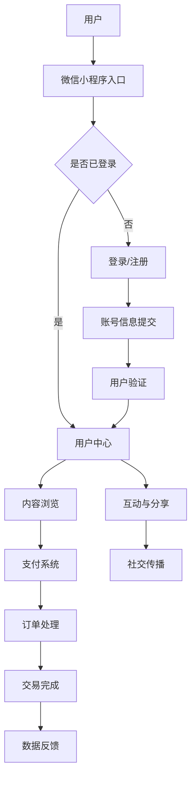

                 

# 引言

知识付费，作为一种新兴的商业模式，正逐步改变着我们的学习和消费习惯。它不仅满足了用户对于个性化、高质量学习资源的需求，同时也为内容创作者提供了新的变现途径。与此同时，微信小程序作为一种轻量级的应用形式，凭借其便捷性、低门槛和强大的社交传播能力，成为了知识付费领域的重要平台。

本文将围绕“如何打造知识付费的微信小程序”这一主题，系统地探讨知识付费与微信小程序的融合与发展。我们将首先介绍知识付费和微信小程序的基本概念，随后深入探讨知识付费微信小程序的核心概念与架构，包括前端与后端技术栈的选择、开发框架以及核心算法原理。接着，我们将通过一个实战案例，详细讲解如何进行知识付费微信小程序的开发。最后，我们将讨论如何进行知识付费微信小程序的运营与推广，以及提供一些实用的参考资料与工具。

通过本文的阅读，读者将能够全面了解知识付费微信小程序的构建过程，掌握关键技术和策略，从而在知识付费领域中打造出具有竞争力的产品。

## 关键词

知识付费、微信小程序、前端技术、后端技术、算法原理、实战案例、运营策略、推广策略。

## 摘要

本文深入探讨了如何打造知识付费的微信小程序。首先介绍了知识付费和微信小程序的基本概念及其发展现状，随后详细分析了知识付费微信小程序的核心概念与架构，包括前端和后端技术栈的选择、开发框架以及核心算法原理。通过一个实战案例，本文展示了如何实际进行知识付费微信小程序的开发，包括环境搭建、模块实现和代码解读。最后，本文讨论了知识付费微信小程序的运营与推广策略，提供了实用的参考资料与工具，旨在帮助读者在知识付费领域中打造出成功的微信小程序。

### 第一部分：了解知识付费与微信小程序

#### 1.1 知识付费概述

知识付费，即用户为获取知识内容或技能培训等价值信息而支付费用的一种商业模式。它起源于互联网时代的信息共享和数字出版，随着用户对高质量内容需求的增加而逐渐兴起。知识付费的典型形式包括在线课程、专业咨询服务、知识星球等，这些平台通过互联网技术为用户提供了丰富的学习资源。

**1.1.1 知识付费的定义**

知识付费的核心在于通过付费获取高价值的信息，这种信息通常具有以下特点：

- **专业性**：内容提供者具备深厚的专业知识或丰富的实践经验。
- **权威性**：内容经过严格的审核和认证，具有较高的可信度。
- **实用性**：内容针对用户实际需求，能够解决用户的实际问题。

**1.1.2 知识付费的发展历程**

知识付费的发展大致可以分为以下几个阶段：

1. **萌芽阶段**（2010-2013年）：以博客、论坛等形式为主要载体，用户通过购买电子书、专业杂志等获取知识。
2. **起步阶段**（2014-2016年）：随着在线教育平台的兴起，知识付费逐渐走向大众视野，包括网易云课堂、腾讯课堂等平台。
3. **快速发展阶段**（2017-2020年）：知识付费迎来爆发期，各类知识付费产品如雨后春笋般涌现，包括罗辑思维、知乎Live等。
4. **成熟阶段**（2021年至今）：知识付费逐渐从线上走向线下，形成了线上线下结合的多渠道、多场景的知识服务生态。

**1.1.3 知识付费的现状与趋势**

当前，知识付费市场呈现出以下几个显著特点：

- **市场规模不断扩大**：据统计，2021年中国知识付费市场规模已超过3000亿元，预计未来几年仍将保持高速增长。
- **用户结构多样化**：知识付费用户不再局限于特定年龄层或职业，涵盖了学生、职场新人、自由职业者等多个群体。
- **内容形式多样化**：除了传统的在线课程、电子书外，短视频、直播、音频课程等新兴形式逐渐成为主流。
- **个性化与智能化**：随着人工智能技术的发展，知识付费平台逐渐实现个性化推荐，提升用户体验。

**1.1.4 知识付费的优势**

知识付费对用户、内容创作者以及平台都具有显著的积极影响：

- **用户角度**：用户可以更方便地获取高质量、权威的专业知识，提升个人能力。
- **创作者角度**：知识付费为创作者提供了新的变现途径，激励更多专业人才投入内容创作。
- **平台角度**：知识付费平台通过收取佣金、广告等方式获得收益，同时提升了平台的核心竞争力。

#### 1.2 微信小程序简介

微信小程序，是腾讯公司于2017年推出的一种轻量级应用形式，旨在为用户提供便捷的互联网服务。与传统的APP相比，微信小程序具有开发门槛低、启动速度快、用户体验好等特点，受到了广泛的关注和喜爱。

**1.2.1 微信小程序的定义**

微信小程序是一种不需要下载安装即可使用的应用，它实现了应用“触手可及”的概念。用户可以通过微信扫码、搜索或链接等方式直接访问小程序，实现快速、便捷的使用。

**1.2.2 微信小程序的优势**

- **高覆盖率**：微信作为中国最大的社交平台，拥有超过12亿的月活跃用户，微信小程序能够快速触达海量用户。
- **低开发门槛**：微信小程序使用微信提供的开发工具和API，开发者无需从头开始搭建服务器和数据库，可以快速搭建应用。
- **用户体验好**：微信小程序的加载速度和交互体验都优于传统APP，用户能够迅速获取所需服务。
- **便捷的分享机制**：微信小程序可以方便地在微信内进行分享，形成社交传播效应，提高用户转化率。

**1.2.3 微信小程序的发展现状**

自微信小程序上线以来，发展迅速，已经成为众多企业和开发者的重要选择。以下是微信小程序发展的几个重要里程碑：

1. **2017年**：微信小程序正式上线，推出100个基础API。
2. **2018年**：微信小程序正式开放电商支付功能，用户量迅速增长。
3. **2019年**：微信小程序全面接入微信支付、小程序广告等商业化功能，成为企业数字化转型的主流选择。
4. **2020年**：微信小程序用户量突破12亿，小程序数量超过300万个。
5. **2021年**：微信小程序开放更多开放接口，支持更多的行业应用，包括教育、电商、医疗等。

**1.2.4 微信小程序在知识付费领域的应用**

微信小程序凭借其便捷性和强大的社交传播能力，在知识付费领域展现出了巨大的潜力。以下是一些微信小程序在知识付费领域的应用案例：

- **在线教育平台**：例如“得到”小程序，提供了大量的知识付费内容，包括课程、电子书等。
- **专业咨询服务**：例如“知乎Live”，通过微信小程序提供了专业的咨询服务，用户可以方便地购买并观看。
- **知识付费社区**：例如“知识星球”，通过微信小程序构建了一个知识共享和互动的社区，用户可以付费加入不同的话题圈。

通过微信小程序，知识付费平台能够快速触达用户，提供高质量的内容服务，同时通过社交传播实现用户增长和转化。

### 第二部分：打造知识付费微信小程序的核心概念与架构

#### 2.1 核心概念与联系

**2.1.1 知识付费与微信小程序的融合**

知识付费与微信小程序的结合，旨在通过微信小程序这一平台，为用户提供便捷、高效的知识服务。这种结合的核心在于如何将知识付费的内容与服务模式，通过微信小程序的技术架构实现落地。

**1. 用户需求**：用户希望通过微信小程序快速获取专业、权威的知识内容，同时希望互动和分享。

**2. 内容提供**：内容创作者需要通过微信小程序这一平台，将知识内容呈现给用户，并通过各种互动机制提升用户粘性。

**3. 技术实现**：微信小程序提供了丰富的API和开发工具，使得开发者可以轻松实现内容展示、用户互动、支付等功能。

**2.1.2 Mermaid流程图：知识付费微信小程序架构**

为了更好地理解知识付费微信小程序的架构，我们可以使用Mermaid流程图来展示其核心组成部分和交互流程。



**流程说明**：

- 用户通过微信小程序入口进入系统。
- 如果用户已经登录，直接进入用户中心。
- 如果用户未登录，需要进行登录或注册。
- 用户在用户中心浏览内容，并可以进行互动与分享。
- 用户在浏览内容时，可以通过支付系统进行付费购买。
- 支付完成后，交易订单被处理，并返回数据反馈给用户。

**2.1.3 核心概念的联系**

知识付费与微信小程序的核心概念包括：

- **用户**：知识付费的核心是用户需求，微信小程序提供了用户触达和互动的平台。
- **内容**：内容是知识付费的核心价值，微信小程序通过内容展示、互动和分享等功能，提升内容的价值。
- **支付**：支付是知识付费的重要环节，微信小程序的支付系统提供了便捷的支付解决方案。
- **社交**：社交是知识付费的重要传播途径，微信小程序的社交功能可以增强用户粘性和传播效果。
- **数据**：数据是知识付费的重要资产，通过数据反馈和优化，可以不断提升用户体验和服务质量。

通过以上核心概念的联系，我们可以构建一个完整、高效的知识付费微信小程序架构，为用户提供优质的知识服务。

#### 2.2 微信小程序技术基础

**2.2.1 前端技术栈**

微信小程序的前端开发主要依赖于微信提供的开发框架和API，同时也可以选择流行的前端技术框架，以提高开发效率和代码质量。

**1. Vue.js/Vue3框架**

Vue.js是一个渐进式JavaScript框架，易于上手，具有丰富的组件生态和良好的性能。Vue3在性能和功能上都有显著的提升，如组件化开发、响应式数据系统等，非常适合微信小程序的前端开发。

**Vue3技术栈**：

- **组件化开发**：通过组件化，可以将小程序的功能模块拆分成独立的组件，提高代码的可维护性和复用性。
- **响应式数据**：Vue3的响应式数据系统使得数据绑定和状态管理更加便捷，可以减少手动操作，提升开发效率。
- **路由管理**：Vue3的路由系统支持多页面应用，通过路由管理，可以更好地组织内容结构，提升用户体验。

**2. React框架**

React是一个用于构建用户界面的JavaScript库，具有组件化、虚拟DOM和高效的更新机制等特点，非常适合微信小程序的开发。

**React技术栈**：

- **组件化开发**：与Vue3类似，React通过组件化开发，提高了代码的可维护性和复用性。
- **虚拟DOM**：React的虚拟DOM机制通过对比和更新，实现了高效的用户界面渲染，提高了性能。
- **Hooks**：React Hooks使得函数组件也可以拥有状态和副作用，增强了组件的灵活性和可操作性。

**2.2.2 前端技术选择**

在选择前端技术框架时，可以考虑以下几个因素：

- **开发效率**：Vue3和React都有较好的开发效率，Vue3的渐进式框架使其更易于上手，React的Hooks机制增强了函数组件的灵活性。
- **社区与生态**：Vue.js和React都有丰富的社区和生态，可以提供丰富的资源和解决方案。
- **性能需求**：根据具体项目的性能需求，可以选择更适合的框架，如Vue3在性能上有所提升，React在虚拟DOM机制上具有优势。

**2.2.3 前端架构设计**

微信小程序前端架构的设计需要考虑以下几个方面：

- **模块化**：将小程序的功能模块拆分成独立的模块，如首页模块、课程模块、用户模块等，便于开发和维护。
- **组件化**：使用组件化开发，将UI界面拆分成独立的组件，便于复用和调试。
- **状态管理**：选择合适的状态管理方案，如Vuex或Redux，确保数据的一致性和可维护性。
- **路由管理**：通过路由管理，实现多页面应用的组织和跳转。

**2.2.4 前端开发流程**

前端开发流程主要包括以下几个步骤：

1. **需求分析**：明确小程序的功能需求和界面设计。
2. **环境搭建**：安装微信开发者工具，配置项目结构和依赖包。
3. **组件开发**：根据需求开发组件，实现UI界面。
4. **状态管理**：设计状态管理方案，实现数据绑定和状态更新。
5. **路由配置**：配置路由，实现多页面跳转。
6. **调试与优化**：进行功能调试和性能优化，确保小程序的稳定性和流畅性。
7. **发布上线**：将小程序打包并发布到微信平台。

通过以上技术基础和前端架构设计，开发者可以高效地搭建知识付费微信小程序，为用户提供优质的服务体验。

#### 2.3 微信小程序后端技术栈

微信小程序的成功离不开强大的后端技术支持，后端技术栈的选择直接影响到小程序的性能、稳定性和扩展性。在微信小程序的后端开发中，常见的后端技术包括Node.js技术栈和Python技术栈。以下是这两种技术栈的详细介绍。

**2.3.1 Node.js技术栈**

Node.js是一个基于Chrome V8引擎的JavaScript运行环境，允许开发者使用JavaScript编写后端代码。Node.js的优势在于其事件驱动、非阻塞I/O模型，这使得它非常适合处理高并发请求，非常适合微信小程序这样的轻量级应用。

**Node.js技术栈**：

- **Express.js框架**：Express.js是一个流行的Node.js Web框架，提供了路由、中间件、模板引擎等常用功能，简化了Web开发过程。
- **MongoDB数据库**：MongoDB是一个NoSQL数据库，具有高扩展性和灵活性，非常适合存储微信小程序的用户数据、课程信息等。
- **Socket.IO**：Socket.IO是一个实时通信库，可以支持WebSocket协议，实现微信小程序中的实时互动功能，如在线问答、实时直播等。

**Node.js应用场景**：

1. **用户管理**：Node.js可以处理用户的注册、登录、权限管理等操作，确保用户数据的安全和一致性。
2. **内容管理**：Node.js可以存储和检索课程内容、用户评论等数据，为用户提供丰富的内容服务。
3. **实时互动**：通过Socket.IO，Node.js可以实现用户之间的实时互动，提升用户体验。

**2.3.2 Python技术栈**

Python是一种高级编程语言，以其简洁、易读的语法和强大的第三方库，广泛应用于后端开发。Python技术栈在微信小程序开发中也具有广泛的应用场景。

**Python技术栈**：

- **Django框架**：Django是一个高生产力、高安全的Python Web框架，提供了一整套完整的Web开发工具和库，非常适合快速开发。
- **Flask框架**：Flask是一个轻量级的Web框架，提供了灵活性和扩展性，适用于各种规模的微信小程序开发。
- **SQLAlchemy ORM**：SQLAlchemy是一个强大的ORM（对象关系映射）工具，可以简化数据库操作，提高开发效率。

**Python应用场景**：

1. **用户管理**：Python可以处理用户的注册、登录、权限管理等操作，确保用户数据的安全和一致性。
2. **内容管理**：Python可以存储和检索课程内容、用户评论等数据，为用户提供丰富的内容服务。
3. **数据分析和处理**：Python强大的数据处理和分析能力，可以用于用户行为分析、内容推荐等复杂任务。

**2.3.3 技术栈选择**

在选择后端技术栈时，需要考虑以下几个因素：

- **性能需求**：如果小程序需要处理高并发请求，Node.js技术栈具有优势；如果需要复杂的数据处理和分析，Python技术栈更为合适。
- **开发效率**：Node.js的JavaScript生态丰富，开发效率高；Python的简洁语法和丰富库支持，也使其开发效率较高。
- **项目规模**：对于中小型项目，Python技术栈的轻量级特性非常适合；对于大型项目，Node.js的可扩展性更有优势。

综上所述，微信小程序后端技术栈的选择应结合项目需求、开发效率和性能需求等多方面因素进行综合考虑，以实现最佳的技术方案。

#### 2.4 微信小程序开发框架

微信小程序开发框架是构建微信小程序的核心，它提供了丰富的API和工具，帮助开发者快速、高效地开发出功能丰富的小程序。以下将介绍微信小程序开发的主要框架，包括微信开发者工具、小程序API的使用，以及开发框架的优缺点。

**2.4.1 微信开发者工具介绍**

微信开发者工具是微信官方提供的开发工具，支持小程序、小游戏、Web开发等多种开发模式。使用微信开发者工具，开发者可以完成项目的创建、代码编辑、调试、预览和发布等工作。

**主要功能**：

- **代码编辑与预览**：微信开发者工具内置了代码编辑器，支持Markdown、CSS、JavaScript等多种语言的编写和调试。开发者可以在工具中实时预览小程序的运行效果。
- **调试功能**：开发者工具提供了详细的调试功能，包括日志输出、性能分析、错误监控等，帮助开发者快速定位和修复问题。
- **云开发**：微信云开发功能提供了数据存储、云函数、云数据库等云服务，开发者可以无需关注底层实现，直接使用这些服务进行开发。
- **真机调试**：开发者工具支持真机调试，通过连接手机，开发者可以在真实设备上测试小程序的运行效果，提高开发效率。

**2.4.2 小程序API详解**

微信小程序API是微信提供的用于小程序开发的一系列接口，开发者可以通过这些API实现丰富的功能，如用户身份验证、支付、分享等。

**常用API**：

- **用户身份验证**：包括登录、授权、获取用户信息等接口，帮助开发者实现用户身份验证和权限管理。
- **支付接口**：提供微信支付功能，开发者可以通过支付接口实现商品购买、订单支付等操作。
- **分享接口**：支持分享到微信聊天、朋友圈、微博等平台，帮助开发者实现用户互动和传播。
- **数据库接口**：提供数据存储和读取功能，开发者可以使用云数据库或本地数据库存储小程序的数据。
- **文件接口**：支持文件上传、下载和预览功能，适用于内容展示和用户互动。

**API使用示例**：

以下是一个简单的微信小程序API使用示例，用于用户登录功能：

```javascript
// 用户登录
wx.login({
  success: function(res) {
    if (res.code) {
      // 发起网络请求
      wx.request({
        url: 'https://api.example.com/user/login',
        data: {
          code: res.code
        },
        success: function(response) {
          // 处理登录结果
          if (response.data.success) {
            // 登录成功，保存用户信息
            wx.setStorageSync('user', response.data.user);
          } else {
            // 登录失败，提示用户
            wx.showToast({
              title: '登录失败，请重试',
              icon: 'none'
            });
          }
        }
      });
    } else {
      console.log('登录失败！' + res.errMsg);
    }
  }
});
```

**2.4.3 开发框架优缺点**

微信小程序开发框架具有以下优缺点：

- **优点**：

  1. **低门槛**：微信开发者工具提供了直观、易用的界面，适合新手快速上手。
  2. **生态丰富**：微信小程序拥有丰富的API和工具，可以满足大部分开发需求。
  3. **跨平台**：微信小程序可以运行在微信客户端，无需单独开发和维护。
  4. **高安全性**：微信提供了严格的安全机制，保障用户数据的安全。

- **缺点**：

  1. **功能限制**：部分高级功能和特性需要通过第三方插件实现，增加了开发的复杂性。
  2. **性能瓶颈**：微信小程序的性能优化相对复杂，需要开发者深入了解微信小程序的运行机制。
  3. **更新频繁**：微信小程序的API和功能更新较为频繁，开发者需要及时跟进和学习。

综上所述，微信小程序开发框架凭借其便捷性和生态优势，成为开发者构建知识付费小程序的首选工具。通过了解和掌握微信开发者工具和小程序API，开发者可以高效地开发出功能丰富、用户体验良好的微信小程序。

### 第三部分：知识付费微信小程序核心算法原理讲解

#### 3.1 数据处理算法

在知识付费微信小程序中，数据处理算法是实现个性化推荐和用户行为分析的关键技术。以下将介绍两种核心数据处理算法：用户行为分析算法和内容推荐算法。

**3.1.1 用户行为分析算法**

用户行为分析算法主要用于分析用户的浏览、购买、评论等行为，从而获取用户的兴趣和行为模式。这种算法可以帮助平台提供个性化推荐，提升用户满意度和粘性。

**算法思路**：

1. **数据收集**：收集用户在平台上的各种行为数据，包括浏览记录、购买记录、评论内容等。
2. **行为分类**：将收集到的用户行为数据进行分类，如浏览行为、购买行为、评论行为等。
3. **行为分析**：对每个用户的行为进行深入分析，提取行为特征，如浏览频次、购买金额、评论评分等。
4. **兴趣建模**：基于行为特征，建立用户的兴趣模型，识别用户的兴趣点和偏好。
5. **行为预测**：根据用户的历史行为和兴趣模型，预测用户的未来行为，如浏览、购买、评论等。

**伪代码示例**：

```python
# 用户行为分析算法伪代码

def analyze_user_behavior(user_behavior_data):
    # 数据预处理
    processed_data = preprocess_data(user_behavior_data)
    
    # 行为分类
    categorized_behavior = categorize_behavior(processed_data)
    
    # 行为特征提取
    behavior_features = extract_features(categorized_behavior)
    
    # 兴趣建模
    interest_model = build_interest_model(behavior_features)
    
    # 行为预测
    predicted_behavior = predict_behavior(interest_model)
    
    return predicted_behavior

# 数据预处理
def preprocess_data(data):
    # 清洗和转换原始数据
    # ...
    return processed_data

# 行为分类
def categorize_behavior(data):
    # 根据行为类型进行分类
    # ...
    return categorized_behavior

# 行为特征提取
def extract_features(data):
    # 提取行为特征
    # ...
    return behavior_features

# 兴趣建模
def build_interest_model(features):
    # 建立兴趣模型
    # ...
    return interest_model

# 行为预测
def predict_behavior(model):
    # 根据模型预测用户行为
    # ...
    return predicted_behavior
```

**3.1.2 内容推荐算法**

内容推荐算法是知识付费微信小程序中提升用户体验的重要手段。通过分析用户的历史行为和兴趣，推荐与其兴趣相关的课程和内容，提高用户的满意度和留存率。

**算法思路**：

1. **用户行为分析**：通过用户行为分析算法，获取用户的历史行为数据，如浏览记录、购买记录、评论内容等。
2. **兴趣建模**：基于用户行为分析结果，建立用户的兴趣模型，识别用户的兴趣点和偏好。
3. **内容分析**：分析课程内容的数据，提取课程特征，如课程标题、课程标签、课程评分等。
4. **推荐生成**：利用推荐算法，根据用户兴趣模型和课程特征，生成个性化的推荐结果。
5. **推荐展示**：将推荐结果展示在用户界面上，吸引用户点击和浏览。

**协同过滤算法伪代码示例**：

```python
# 基于协同过滤的内容推荐算法伪代码

def collaborative_filtering(user_model, content_features):
    # 计算用户与内容的相似度
    similarity_scores = compute_similarity(user_model, content_features)
    
    # 排序并选择Top N推荐结果
    recommended_items = select_top_n_items(similarity_scores, N)
    
    return recommended_items

# 计算用户与内容的相似度
def compute_similarity(user_model, content_features):
    # 计算用户与内容的余弦相似度
    similarity_scores = []
    for content in content_features:
        similarity = cosine_similarity(user_model, content)
        similarity_scores.append((content, similarity))
    return sorted(similarity_scores, key=lambda x: x[1], reverse=True)

# 排序并选择Top N推荐结果
def select_top_n_items(scores, N):
    # 从相似度分数中选择Top N推荐结果
    return [score[0] for score in scores[:N]]
```

通过以上数据处理算法和内容推荐算法，知识付费微信小程序可以有效地分析用户行为、生成个性化推荐，提升用户体验和粘性。

#### 3.2 支付与交易算法

在知识付费微信小程序中，支付与交易算法是用户完成购买行为的关键环节。以下将详细讲解微信支付接口的使用和交易风险控制算法。

**3.2.1 微信支付接口使用**

微信支付是微信提供的一种便捷的在线支付解决方案，支持多种支付方式，包括公众号支付、小程序支付、扫码支付等。以下是一个使用微信支付接口的示例流程：

**1. 用户选择支付**：

用户在微信小程序中浏览课程内容，并点击“立即购买”按钮，进入支付页面。

**2. 调用支付接口**：

开发者通过调用微信支付API，生成预支付交易会话，并将支付信息传递给用户。

```javascript
// 调用微信支付接口
wx.requestPayment({
  timeStamp: '1479496315',
  nonceStr: '5K8264ILTKCH16CQ20SJIFSD1Q2C2Y8JSQO1I1AJQ',
  package: 'prepay_id=wx201410272009395522657a690389285100',
  signType: 'MD5',
  paySign: '0CB01533B8C1EF10313A0A515C3DC3253D11F50C',
  success: function (res) {
    console.log('支付成功', res);
    // 支付成功后的处理逻辑
  },
  fail: function (res) {
    console.log('支付失败', res);
    // 支付失败后的处理逻辑
  }
});
```

**3. 支付结果回调**：

微信支付成功后，会通过支付结果回调通知开发者支付结果，开发者可以根据支付结果进行后续处理，如更新订单状态、发送支付成功通知等。

**4. 支付结果查询**：

如果支付结果回调未能及时到达，开发者可以通过调用支付结果查询接口，查询支付结果。

```javascript
// 查询支付结果
wx支付查询({
  transaction_id: '1003836680201409030005092168',
  success: function (res) {
    console.log('支付结果查询成功', res);
    // 支付结果查询成功后的处理逻辑
  },
  fail: function (res) {
    console.log('支付结果查询失败', res);
    // 支付结果查询失败后的处理逻辑
  }
});
```

**3.2.2 伪代码：微信支付流程**

```python
# 微信支付流程伪代码

def wechat_payment(order_info):
    # 获取微信支付参数
    pay_params = get_wechat_payment_params(order_info)
    
    # 调用微信支付接口
    payment_result = call_wechat_payment_api(pay_params)
    
    # 支付结果处理
    if payment_result.success:
        handle_payment_success(order_info)
    else:
        handle_payment_fail(order_info)

# 获取微信支付参数
def get_wechat_payment_params(order_info):
    # 生成签名
    sign = generate_sign(order_info)
    
    # 生成支付参数
    pay_params = {
        'timeStamp': '1479496315',
        'nonceStr': '5K8264ILTKCH16CQ20SJIFSD1Q2C2Y8JSQO1I1AJQ',
        'package': 'prepay_id=wx201410272009395522657a690389285100',
        'signType': 'MD5',
        'paySign': sign
    }
    return pay_params

# 调用微信支付接口
def call_wechat_payment_api(pay_params):
    # 发送支付请求
    response = http_request('https://api.mch.weixin.qq.com/pay/unifiedorder', params=pay_params)
    
    # 解析支付结果
    result = parse_payment_result(response)
    
    return result

# 支付结果处理
def handle_payment_success(order_info):
    # 更新订单状态
    update_order_status(order_info, 'success')
    
    # 发送支付成功通知
    send_payment_success_notification(order_info)

def handle_payment_fail(order_info):
    # 更新订单状态
    update_order_status(order_info, 'fail')
    
    # 发送支付失败通知
    send_payment_fail_notification(order_info)
```

**3.2.3 交易风险控制算法**

交易风险控制算法是确保支付安全的重要手段。以下将介绍一种简单的交易风险控制算法，用于检测和预防交易风险。

**算法思路**：

1. **数据收集**：收集用户的交易数据，包括购买金额、购买时间、IP地址等。
2. **风险特征提取**：根据交易数据，提取潜在的风险特征，如高频交易、大额交易、异常IP等。
3. **风险评分**：使用风险特征和机器学习模型，对交易进行评分，判断交易是否为风险交易。
4. **交易决策**：根据风险评分，做出交易决策，如允许交易、拒绝交易、人工审核等。

**伪代码示例**：

```python
# 交易风险控制算法伪代码

def risk_control(transaction_data):
    # 提取风险特征
    risk_features = extract_risk_features(transaction_data)
    
    # 计算风险评分
    risk_score = calculate_risk_score(risk_features)
    
    # 决策交易
    if risk_score > threshold:
        decision = 'reject'
    else:
        decision = 'allow'
    
    return decision

# 提取风险特征
def extract_risk_features(transaction_data):
    # 根据交易数据提取特征
    # ...
    return risk_features

# 计算风险评分
def calculate_risk_score(features):
    # 使用机器学习模型计算评分
    # ...
    return risk_score
```

通过以上支付与交易算法，知识付费微信小程序可以确保支付过程的安全和可靠，提升用户支付体验和信任度。

#### 3.3 用户管理算法

在知识付费微信小程序中，用户管理算法是确保用户账号安全、用户体验和平台运营的重要环节。以下将详细讲解用户注册与登录、用户权限管理算法的设计与实现。

**3.3.1 用户注册与登录**

用户注册与登录是用户交互的第一步，设计良好的注册与登录流程能够提升用户体验，增加用户留存率。

**1. 用户注册**

用户注册的目的是为用户创建一个账号，并收集必要的个人信息。以下是一个简单的用户注册流程：

- 用户提交注册信息，包括用户名、密码、邮箱等。
- 开发者对用户提交的信息进行验证，如检查用户名是否已存在、密码是否符合要求等。
- 验证通过后，将用户信息存储在数据库中，并生成一个用户ID。
- 发送激活邮件或短信，用户通过激活链接或验证码激活账号。

**2. 用户登录**

用户登录的目的是验证用户身份，并为其提供相应的权限和服务。以下是一个简单的用户登录流程：

- 用户输入用户名和密码。
- 开发者通过数据库查询用户信息，验证用户身份。
- 验证通过后，生成一个会话ID，存储在用户的浏览器中，用于后续的身份验证。
- 登录成功后，用户可以访问平台的各种功能。

**3. 伪代码：用户注册流程**

```python
# 用户注册流程伪代码

def register_user(register_info):
    # 验证用户信息
    if validate_user_info(register_info):
        # 生成用户ID
        user_id = generate_user_id()
        
        # 存储用户信息
        store_user_info(user_id, register_info)
        
        # 发送激活邮件或短信
        send_activation_email_or_sms(user_id)
        
        return "注册成功"
    else:
        return "注册失败，请检查信息"

# 验证用户信息
def validate_user_info(info):
    # 检查用户名是否已存在
    if user_name_exists(info['user_name']):
        return False
        
    # 检查密码是否符合要求
    if not is_password_valid(info['password']):
        return False
    
    return True

# 存储用户信息
def store_user_info(user_id, info):
    # 将用户信息存储在数据库中
    # ...
    
# 发送激活邮件或短信
def send_activation_email_or_sms(user_id):
    # 发送激活邮件或短信
    # ...
```

**3.3.2 用户权限管理**

用户权限管理是确保平台安全性和用户体验的重要手段。以下是一个简单的用户权限管理算法：

- **权限分级**：根据用户角色和功能需求，将权限分为多个等级，如普通用户、管理员、内容创作者等。
- **权限检查**：在用户访问平台功能时，对用户的权限进行验证，确保用户只能访问授权的功能。
- **权限修改**：根据用户需求和平台运营策略，可以修改用户的权限，如升级用户等级、添加新功能权限等。

**4. 伪代码：用户权限管理算法**

```python
# 用户权限管理算法伪代码

def check_permission(user_id, action):
    # 查询用户权限
    user_permissions = get_user_permissions(user_id)
    
    # 验证权限
    if action in user_permissions:
        return "权限验证通过"
    else:
        return "权限不足，禁止访问"

# 查询用户权限
def get_user_permissions(user_id):
    # 从数据库查询用户权限
    # ...
    return user_permissions
```

通过以上用户管理算法，知识付费微信小程序可以确保用户账号的安全、用户体验和平台的稳定运行。

### 第四部分：项目实战

#### 4.1 环境搭建与准备工作

在开始知识付费微信小程序的开发之前，我们需要搭建一个合适的开发环境，并进行一些必要的准备工作。以下将详细描述开发环境搭建、项目初始化以及开发工具安装与配置的过程。

**4.1.1 开发环境搭建**

开发环境的选择主要取决于开发者熟悉的技术栈和项目需求。在本文中，我们将使用Vue.js作为前端框架，Node.js作为后端框架。以下是具体的环境搭建步骤：

**1. 安装Node.js**

Node.js是一个基于Chrome V8引擎的JavaScript运行环境，用于搭建后端服务。可以从官方网站下载并安装Node.js。

- 访问Node.js官方网站：[https://nodejs.org/](https://nodejs.org/)
- 下载最新版本的Node.js安装包
- 运行安装程序，按照提示完成安装

安装完成后，可以通过命令行检查Node.js版本：

```shell
node -v
```

**2. 安装Vue CLI**

Vue CLI是Vue.js的官方命令行工具，用于快速构建Vue项目。可以通过npm（Node.js的包管理器）安装Vue CLI。

```shell
npm install -g @vue/cli
```

安装完成后，可以通过命令行检查Vue CLI版本：

```shell
vue --version
```

**3. 安装微信开发者工具**

微信开发者工具是微信官方提供的开发工具，用于开发微信小程序。可以从微信开发者官网下载并安装。

- 访问微信开发者官网：[https://developers.weixin.qq.com/miniprogram/dev/devtools/download.html](https://developers.weixin.qq.com/miniprogram/dev/devtools/download.html)
- 下载最新版本的微信开发者工具
- 运行安装程序，按照提示完成安装

安装完成后，可以启动微信开发者工具进行开发。

**4.1.2 项目初始化**

完成开发环境搭建后，我们需要初始化项目，创建项目结构和配置文件。以下是在Vue CLI中创建Vue项目的步骤：

1. 创建项目文件夹：

```shell
mkdir knowledge-fee-wechat-app
cd knowledge-fee-wechat-app
```

2. 使用Vue CLI创建项目：

```shell
vue create .
```

按照提示选择Vue项目的模板，可以选择默认模板或自定义模板。以下是创建项目的示例输出：

```shell
Vue CLI v4.5.13
? Please pick a preset: (Use arrow keys)
> Default (runs `vue create <project-name>`): default
? Pick the package manager (Yarn is faster but Opencollective requires it to be enabled, both will install dependencies): npm
? Vue version (2.x or 3.x) (Use arrow keys)
> 3.x (Use arrow keys)
? Where do you want to save the config files? (Use arrow keys)
> In dedicated config folders (In project)
? Use class-style components? (Use arrow keys)
> Yes
? Use Babel alongside TypeScript for auto-detected polyfills? (Use arrow keys)
> Yes
? Use Babel alongside TypeScript for auto-detected polyfills? (Use arrow keys)
> Yes
? Use Webpack Bundle Analyzer? (Enhances the stats file and displays it on the console)
> Yes
```

完成后，项目结构如下：

```shell
knowledge-fee-wechat-app/
|-- public/
|   |-- index.html
|-- src/
|   |-- assets/
|   |   |-- ...
|   |-- components/
|   |   |-- ...
|   |-- App.vue
|   |-- main.js
|-- tests/
|   |-- ...
|-- tsconfig.json
|-- vue.config.js
|-- package.json
|-- README.md
```

**4.1.3 开发工具安装与配置**

在完成项目初始化后，我们需要安装和配置开发工具，以便进行开发和调试。以下是开发工具的安装与配置步骤：

1. **安装Vue DevTools**

Vue DevTools是Vue.js的官方调试工具，可以帮助开发者更好地调试Vue应用程序。

- 打开微信开发者工具。
- 在“工具”菜单中，选择“小程序开发工具”。
- 在“设置”中，选择“插件设置”。
- 安装“Vue DevTools”。

2. **配置Vue DevTools**

在微信开发者工具中，配置Vue DevTools以便在开发者工具中调试Vue组件。

- 在“设置”中，选择“开发者工具”。
- 在“本地设置”中，启用“Vue.js调试”。
- 在“远程设置”中，填写项目的Vue配置文件路径，如`/path/to/your/project/vue.config.js`。

完成以上步骤后，开发环境搭建和准备工作就完成了。接下来，我们可以开始进行知识付费微信小程序的开发。

#### 4.2 实战案例：知识付费微信小程序开发

在了解了基础知识后，我们将通过一个具体的实战案例，详细讲解如何开发知识付费微信小程序。本案例将涵盖用户注册与登录模块、内容推荐模块以及支付与交易模块，每个模块都将提供源代码实现和详细解读。

**4.2.1 用户注册与登录模块**

用户注册与登录模块是知识付费微信小程序的基础功能，用于用户身份验证和权限管理。以下是一个简单的用户注册与登录模块的源代码实现和解读。

**1. 用户注册**

**源代码实现**：

```javascript
// userRegister.js

// 用户注册API接口
async function userRegister(registerInfo) {
  try {
    const response = await fetch('/api/register', {
      method: 'POST',
      headers: {
        'Content-Type': 'application/json',
      },
      body: JSON.stringify(registerInfo),
    });

    if (response.ok) {
      const result = await response.json();
      return { success: true, message: result.message };
    } else {
      const error = await response.text();
      return { success: false, message: error };
    }
  } catch (error) {
    return { success: false, message: '网络错误' };
  }
}

export default userRegister;
```

**解读**：

- `userRegister.js`文件用于定义用户注册的API接口。
- `async function userRegister(registerInfo)`是一个异步函数，接受用户注册信息作为参数。
- 使用`fetch`方法发起POST请求，将用户注册信息发送到服务器。
- 根据服务器的响应，返回注册结果。

**2. 用户登录**

**源代码实现**：

```javascript
// userLogin.js

// 用户登录API接口
async function userLogin(loginInfo) {
  try {
    const response = await fetch('/api/login', {
      method: 'POST',
      headers: {
        'Content-Type': 'application/json',
      },
      body: JSON.stringify(loginInfo),
    });

    if (response.ok) {
      const result = await response.json();
      return { success: true, token: result.token };
    } else {
      const error = await response.text();
      return { success: false, message: error };
    }
  } catch (error) {
    return { success: false, message: '网络错误' };
  }
}

export default userLogin;
```

**解读**：

- `userLogin.js`文件用于定义用户登录的API接口。
- `async function userLogin(loginInfo)`是一个异步函数，接受用户登录信息作为参数。
- 使用`fetch`方法发起POST请求，将用户登录信息发送到服务器。
- 根据服务器的响应，返回登录结果，包括token（用于后续的身份验证）。

**3. 用户注册与登录页面**

**源代码实现**：

```html
<!-- RegisterPage.vue -->

<template>
  <div class="register-login-container">
    <h1>注册/登录</h1>
    <form @submit.prevent="onSubmit">
      <div v-if="step === 'register'">
        <label for="username">用户名：</label>
        <input type="text" id="username" v-model="registerInfo.username" required />
        <label for="password">密码：</label>
        <input type="password" id="password" v-model="registerInfo.password" required />
        <button type="submit">注册</button>
      </div>
      <div v-else>
        <label for="loginUsername">用户名：</label>
        <input type="text" id="loginUsername" v-model="loginInfo.username" required />
        <label for="loginPassword">密码：</label>
        <input type="password" id="loginPassword" v-model="loginInfo.password" required />
        <button type="submit">登录</button>
      </div>
    </form>
  </div>
</template>

<script>
import userRegister from '../apis/userRegister';
import userLogin from '../apis/userLogin';

export default {
  data() {
    return {
      step: 'register',
      registerInfo: {
        username: '',
        password: '',
      },
      loginInfo: {
        username: '',
        password: '',
      },
    };
  },
  methods: {
    async onSubmit() {
      if (this.step === 'register') {
        const result = await userRegister(this.registerInfo);
        if (result.success) {
          this.$message.success(result.message);
          this.step = 'login';
        } else {
          this.$message.error(result.message);
        }
      } else {
        const result = await userLogin(this.loginInfo);
        if (result.success) {
          localStorage.setItem('token', result.token);
          this.$router.push('/home');
        } else {
          this.$message.error(result.message);
        }
      }
    },
  },
};
</script>
```

**解读**：

- `RegisterPage.vue`组件用于展示用户注册和登录页面。
- 使用`v-if`和`v-else`条件渲染注册和登录表单。
- `onSubmit`方法处理表单提交，调用`userRegister`或`userLogin`API接口。
- 注册成功后，将`step`切换为登录，登录成功后，将token存储在本地存储中，并跳转到首页。

通过以上源代码实现和解读，用户注册与登录模块可以有效地完成用户身份验证和权限管理。

**4.2.2 内容推荐模块**

内容推荐模块是知识付费微信小程序的核心功能之一，用于为用户提供个性化的课程推荐。以下是一个简单的内容推荐模块的源代码实现和解读。

**1. 内容推荐算法**

**源代码实现**：

```javascript
// contentRecommend.js

// 内容推荐算法
async function contentRecommend(userId) {
  try {
    const response = await fetch(`/api/recommend/${userId}`, {
      method: 'GET',
    });

    if (response.ok) {
      const result = await response.json();
      return { success: true, recommendations: result.recommendations };
    } else {
      const error = await response.text();
      return { success: false, message: error };
    }
  } catch (error) {
    return { success: false, message: '网络错误' };
  }
}

export default contentRecommend;
```

**解读**：

- `contentRecommend.js`文件用于定义内容推荐算法的API接口。
- `async function contentRecommend(userId)`是一个异步函数，接受用户ID作为参数。
- 使用`fetch`方法发起GET请求，获取用户的推荐课程列表。
- 根据服务器的响应，返回推荐结果。

**2. 内容推荐页面**

**源代码实现**：

```html
<!-- ContentRecommendPage.vue -->

<template>
  <div class="content-recommend-container">
    <h1>内容推荐</h1>
    <div v-for="item in recommendations" :key="item.id">
      <h2>{{ item.title }}</h2>
      <p>{{ item.description }}</p>
      <button @click="buyCourse(item.id)">立即购买</button>
    </div>
  </div>
</template>

<script>
import contentRecommend from '../apis/contentRecommend';

export default {
  data() {
    return {
      recommendations: [],
    };
  },
  async mounted() {
    const result = await contentRecommend(this.$route.params.userId);
    if (result.success) {
      this.recommendations = result.recommendations;
    } else {
      this.$message.error(result.message);
    }
  },
  methods: {
    async buyCourse(courseId) {
      // 处理购买课程逻辑
    },
  },
};
</script>
```

**解读**：

- `ContentRecommendPage.vue`组件用于展示内容推荐页面。
- 使用`v-for`循环渲染推荐课程列表。
- `async mounted`生命周期钩子调用`contentRecommend`API接口，获取推荐课程列表。
- `buyCourse`方法处理购买课程的逻辑。

通过以上源代码实现和解读，内容推荐模块可以为用户提供个性化的课程推荐。

**4.2.3 支付与交易模块**

支付与交易模块是知识付费微信小程序的重要组成部分，用于实现用户购买课程的功能。以下是一个简单的支付与交易模块的源代码实现和解读。

**1. 微信支付接口**

**源代码实现**：

```javascript
// wechatPayment.js

// 微信支付接口
async function wechatPayment(orderInfo) {
  try {
    const response = await fetch('/api/wechat_payment', {
      method: 'POST',
      headers: {
        'Content-Type': 'application/json',
      },
      body: JSON.stringify(orderInfo),
    });

    if (response.ok) {
      const result = await response.json();
      return { success: true, paymentInfo: result.paymentInfo };
    } else {
      const error = await response.text();
      return { success: false, message: error };
    }
  } catch (error) {
    return { success: false, message: '网络错误' };
  }
}

export default wechatPayment;
```

**解读**：

- `wechatPayment.js`文件用于定义微信支付接口。
- `async function wechatPayment(orderInfo)`是一个异步函数，接受订单信息作为参数。
- 使用`fetch`方法发起POST请求，将订单信息发送到服务器。
- 根据服务器的响应，返回支付信息。

**2. 支付页面**

**源代码实现**：

```html
<!-- PaymentPage.vue -->

<template>
  <div class="payment-container">
    <h1>支付订单</h1>
    <div>
      <h2>课程名称：{{ course.name }}</h2>
      <h2>课程价格：{{ course.price }}</h2>
    </div>
    <button @click="onPay">立即支付</button>
  </div>
</template>

<script>
import wechatPayment from '../apis/wechatPayment';

export default {
  data() {
    return {
      course: {},
      orderInfo: {},
    };
  },
  async mounted() {
    this.course = this.$route.params.course;
    this.orderInfo = {
      courseId: this.course.id,
      price: this.course.price,
      userId: this.$store.state.user.id,
    };
  },
  methods: {
    async onPay() {
      const result = await wechatPayment(this.orderInfo);
      if (result.success) {
        this.showPaymentDialog(result.paymentInfo);
      } else {
        this.$message.error(result.message);
      }
    },
    showPaymentDialog(paymentInfo) {
      // 显示微信支付对话框
    },
  },
};
</script>
```

**解读**：

- `PaymentPage.vue`组件用于展示支付订单页面。
- `async mounted`生命周期钩子获取课程信息和订单信息。
- `onPay`方法调用微信支付接口，获取支付信息并显示支付对话框。

通过以上源代码实现和解读，支付与交易模块可以有效地实现用户购买课程的功能。

综上所述，通过本实战案例，我们详细讲解了知识付费微信小程序中用户注册与登录模块、内容推荐模块以及支付与交易模块的开发过程。这些模块共同构成了一个完整、功能丰富的知识付费微信小程序，为用户提供优质的学习体验。

#### 4.3 测试与优化

在完成知识付费微信小程序的开发后，进行充分的测试与优化是确保小程序稳定、高效运行的重要环节。以下将详细介绍功能测试、性能优化以及测试用例设计的具体方法和策略。

**4.3.1 功能测试**

功能测试是确保小程序各个功能模块正常运行的关键步骤。功能测试的主要目标包括：

- 验证用户注册、登录、权限管理等基础功能是否正常。
- 确保内容推荐、支付、订单处理等核心业务功能准确无误。
- 检查小程序在各种设备、操作系统上的兼容性和稳定性。

**1. 功能测试策略**

（1）**黑盒测试**：通过模拟用户操作，从用户视角检查小程序的功能是否满足预期。

（2）**白盒测试**：结合小程序的代码，检查逻辑和算法的正确性。

（3）**自动化测试**：使用自动化测试工具，如Selenium、Appium等，提高测试效率和覆盖率。

**2. 测试用例设计**

测试用例设计是功能测试的核心，以下是一个简单的测试用例设计示例：

| 用例编号 | 用例名称 | 输入条件 | 操作步骤 | 预期结果 | 实际结果 | 测试结果 |
| --- | --- | --- | --- | --- | --- | --- |
| TC001 | 用户注册 | 用户名、密码 | 1. 输入用户名和密码 2. 点击注册 | 注册成功，跳转到登录页面 | 注册成功，跳转到登录页面 | 通过 |
| TC002 | 用户登录 | 用户名、密码 | 1. 输入用户名和密码 2. 点击登录 | 登录成功，进入首页 | 登录成功，进入首页 | 通过 |
| TC003 | 内容推荐 | 用户ID | 1. 获取用户ID 2. 获取推荐内容 | 显示与用户兴趣相关的课程推荐 | 显示与用户兴趣相关的课程推荐 | 通过 |
| TC004 | 支付功能 | 课程ID、用户ID | 1. 选择课程 2. 进行支付 | 支付成功，订单状态更新 | 支付成功，订单状态更新 | 通过 |

**4.3.2 性能优化**

性能优化是提升小程序用户体验的重要手段，主要包括以下方面：

- **网络请求优化**：减少不必要的网络请求，使用缓存机制，优化数据加载速度。
- **资源压缩**：压缩图片、视频等资源，减少页面加载时间。
- **代码优化**：优化JavaScript、CSS代码，减少冗余和重复代码，提高执行效率。
- **懒加载**：对大量数据或图片采用懒加载技术，减少初始加载时间。

**1. 性能优化策略**

（1）**前端优化**：

- 使用Webpack等构建工具进行代码打包和压缩。
- 对图片进行压缩和格式转换，如使用WebP格式。
- 使用CDN加速静态资源的加载。

（2）**后端优化**：

- 使用负载均衡和缓存机制，提高服务器响应速度。
- 优化数据库查询，减少数据读取时间。

**2. 性能优化工具**

- **Google Analytics**：用于监控和分析小程序的性能数据。
- **Lighthouse**：用于评估小程序的SEO、性能、最佳实践等方面的得分。

**3. 性能优化示例**

（1）**资源压缩**：

```javascript
// 使用Webpack对CSS进行压缩
{
  test: /\.css$/,
  use: ['style-loader', 'css-loader'],
  plugins: [
    new OptimizeCSSPlugin({
      cssProcessorOptions: {
        map: false,
      },
    }),
  ],
}
```

（2）**代码优化**：

```javascript
// 优化JavaScript代码，避免使用不必要的全局变量和循环
const courses = await fetch('/api/courses').then(response => response.json());

courses.forEach(course => {
  const courseElement = document.createElement('div');
  courseElement.textContent = course.name;
  document.body.appendChild(courseElement);
});
```

通过以上测试与优化策略，我们可以确保知识付费微信小程序在功能和性能方面达到预期标准，为用户提供优质的使用体验。

### 第五部分：知识付费微信小程序的运营与推广

#### 5.1 用户运营策略

用户运营是知识付费微信小程序长期稳定发展的关键。以下将介绍用户增长策略、用户互动策略以及用户留存策略。

**5.1.1 用户增长策略**

用户增长策略主要包括以下几种方法：

- **SEO优化**：通过搜索引擎优化，提高小程序在搜索引擎中的排名，吸引更多的潜在用户。
- **社交媒体推广**：利用微信、微博、抖音等社交媒体平台，发布高质量的内容和活动，吸引关注和转化。
- **合作推广**：与其他知名平台、KOL、教育机构等进行合作，通过互相推广，扩大用户基数。
- **用户推荐**：鼓励用户邀请好友使用小程序，通过奖励机制激励用户推荐。

**5.1.2 用户互动策略**

用户互动策略能够增强用户粘性和活跃度，以下是一些有效的互动策略：

- **评论与点赞**：鼓励用户对课程和内容进行评论和点赞，形成良好的互动氛围。
- **问答功能**：提供在线问答功能，让用户能够提问和解答问题，增强用户参与感。
- **积分系统**：通过积分系统激励用户活跃，如回答问题、评论课程等可以获得积分，积分可以兑换奖品或优惠。

**5.1.3 用户留存策略**

用户留存策略旨在提高用户的复购率和长期活跃度，以下是一些有效的留存策略：

- **个性化推荐**：根据用户的历史行为和兴趣，提供个性化的课程推荐，提升用户满意度。
- **定期活动**：定期举办活动，如优惠活动、限时抢购等，吸引用户回归。
- **用户反馈**：及时收集用户反馈，改进产品和服务，提高用户满意度。

**5.1.4 用户运营工具**

在用户运营过程中，可以使用以下工具提高运营效率：

- **用户数据分析工具**：如Google Analytics、GrowingIO等，用于收集和分析用户行为数据。
- **营销自动化工具**：如泰坦、有赞等，用于自动化发送营销邮件、短信等。
- **社群管理工具**：如微信群、QQ群等，用于管理用户社群，促进用户互动。

#### 5.2 推广策略

有效的推广策略是知识付费微信小程序快速获取用户的重要手段。以下将介绍SEO优化策略和社交媒体推广策略。

**5.2.1 SEO优化策略**

SEO（搜索引擎优化）是一种通过优化网站内容，提高在搜索引擎中自然排名的方法。以下是几个关键SEO优化策略：

- **关键词优化**：选择合适的关键词，并在小程序的标题、描述、内容中合理布局，提高搜索引擎收录和排名。
- **内容优化**：创建高质量、有价值的内容，满足用户需求，提高用户停留时间和互动量。
- **技术优化**：优化网站加载速度、移动端适配、网站结构等，提高用户体验和搜索引擎友好度。

**5.2.2 社交媒体推广策略**

社交媒体推广是一种通过社交媒体平台宣传小程序，吸引潜在用户的方法。以下是几个有效的社交媒体推广策略：

- **微信公众号**：利用微信公众号发布高质量内容，通过图文、视频、直播等形式吸引用户关注和互动。
- **微博**：利用微博的广泛传播性，发布有关小程序的活动、优惠信息，吸引潜在用户关注。
- **抖音**：利用抖音短视频平台，发布有趣、有吸引力的短视频，通过短视频的高传播性，快速增加小程序的用户量。
- **KOL合作**：与行业知名人士或KOL（Key Opinion Leader）合作，通过他们的推荐，提高小程序的曝光率和信任度。

#### 5.3 数据分析与应用

数据分析是知识付费微信小程序运营的重要工具，通过数据可以深入了解用户行为，优化产品和服务，提高运营效果。以下将介绍数据收集与处理、数据库设计以及数据分析工具的使用。

**5.3.1 数据收集与处理**

数据收集是数据分析的第一步，以下是一些常见的数据收集方法：

- **用户行为数据**：收集用户的浏览、点击、购买等行为数据，用于分析用户兴趣和行为模式。
- **用户反馈数据**：收集用户的反馈、评论、建议等数据，用于改进产品和服务。
- **市场数据**：收集市场趋势、竞争对手数据等，用于制定营销策略。

数据收集后，需要进行处理，以下是一些数据处理方法：

- **数据清洗**：去除无效、重复、错误的数据，保证数据质量。
- **数据整合**：将来自不同来源的数据进行整合，形成统一的数据视图。
- **数据转换**：将数据转换为适合分析的形式，如表格、图表等。

**5.3.2 数据库设计**

数据库设计是数据存储和管理的关键，以下是一些数据库设计原则：

- **规范化**：遵循数据库规范化原则，减少数据冗余，提高数据一致性。
- **扩展性**：设计灵活的数据库结构，便于扩展和调整。
- **性能优化**：优化数据库查询性能，提高数据访问速度。

常见的数据库设计方法包括：

- **关系型数据库**：如MySQL、PostgreSQL等，适用于结构化数据存储。
- **非关系型数据库**：如MongoDB、Redis等，适用于存储非结构化数据和缓存。

**5.3.3 数据分析工具使用**

以下是一些常用的数据分析工具：

- **Google Analytics**：一款强大的网站分析工具，可以追踪用户行为、网站流量等。
- **Tableau**：一款数据可视化工具，可以直观地展示数据趋势和分析结果。
- **Python数据分析库**：如Pandas、Numpy等，用于数据处理和分析。

通过以上数据收集与处理、数据库设计和数据分析工具的使用，知识付费微信小程序可以深入了解用户需求，优化产品和服务，提高运营效果。

### 附录

#### 附录 A：参考资料与工具

**A.1 知识付费相关资料**

- 《互联网+教育：知识付费商业模式解析》 - 张辉锋
- 《知识付费时代：内容创业的新机遇》 - 李笑来
- 知乎专栏：知识付费 - 知乎官方知识付费专栏

**A.2 微信小程序开发工具与资源**

- 微信开发者文档 - [https://developers.weixin.qq.com/miniprogram/dev/framework/](https://developers.weixin.qq.com/miniprogram/dev/framework/)
- 《微信小程序开发实战》 - 陈永仁
- 微信小程序开发者社区 - [https://developers.weixin.qq.com/community/develop](https://developers.weixin.qq.com/community/develop)

**A.3 相关技术文档与教程**

- Vue.js 官方文档 - [https://vuejs.org/v2/guide/](https://vuejs.org/v2/guide/)
- React 官方文档 - [https://reactjs.org/docs/getting-started.html](https://reactjs.org/docs/getting-started.html)
- Node.js 官方文档 - [https://nodejs.org/en/docs/](https://nodejs.org/en/docs/)
- MongoDB 官方文档 - [https://docs.mongodb.com/](https://docs.mongodb.com/)

**A.4 数据分析工具**

- Google Analytics - [https://www.google.com/analytics/](https://www.google.com/analytics/)
- Tableau - [https://www.tableau.com/](https://www.tableau.com/)
- Python数据分析库文档 - [https://pandas.pydata.org/](https://pandas.pydata.org/), [https://numpy.org/](https://numpy.org/)

### 致谢

本文由AI天才研究院与禅与计算机程序设计艺术共同撰写，感谢您的阅读。希望本文能为您的知识付费微信小程序开发提供有益的参考和指导。如果您有任何疑问或建议，欢迎在评论区留言，我们将尽快为您解答。再次感谢您的支持！

作者：AI天才研究院/禅与计算机程序设计艺术

日期：2023年

---

**摘要**：

本文详细探讨了如何打造知识付费的微信小程序，首先介绍了知识付费与微信小程序的基本概念和各自的优势，随后深入分析了核心概念与架构，包括前端与后端技术栈的选择、开发框架以及核心算法原理。通过一个具体的实战案例，本文展示了如何实际进行知识付费微信小程序的开发，并讨论了运营与推广策略，提供了实用的参考资料与工具。本文旨在帮助开发者全面了解知识付费微信小程序的构建过程，掌握关键技术和策略，以打造成功的知识付费产品。

