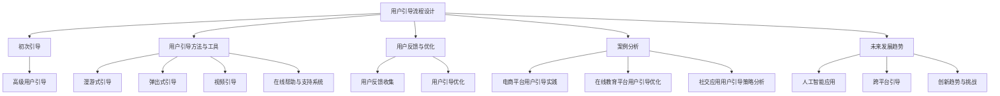

                 

# 《如何进行有效的用户引导》

## 关键词
用户引导、用户体验、设计原则、引导流程、反馈优化、案例分析

## 摘要
本文将深入探讨如何进行有效的用户引导，通过系统的设计原则、实用的策略与实践方法，以及详细的案例分析，为IT从业者提供一套全面的用户引导指南。文章将涵盖用户引导的核心概念、设计原则、策略与实践、用户反馈与优化、以及未来发展趋势等内容，帮助读者理解和掌握用户引导的关键技术和实践方法。

### 《如何进行有效的用户引导》目录大纲

## 第一部分：用户引导概述

### 第1章：用户引导的重要性
#### 1.1 用户引导的基本概念
#### 1.2 用户引导的目的
#### 1.3 用户引导的价值

### 第2章：用户引导的设计原则
#### 2.1 用户体验至上的设计理念
#### 2.2 简洁直观的界面设计
#### 2.3 个性化与适应性引导

## 第二部分：用户引导策略与实践

### 第3章：用户引导流程设计
#### 3.1 用户引导的流程框架
#### 3.2 初次引导的要点
#### 3.3 高级用户引导策略

### 第4章：用户引导方法与工具
#### 4.1 漫游式引导
#### 4.2 弹出式引导
#### 4.3 视频引导
#### 4.4 在线帮助与支持系统

### 第5章：用户反馈与优化
#### 5.1 用户反馈的重要性
#### 5.2 用户反馈的收集方法
#### 5.3 用户引导的优化策略

### 第6章：案例分析
#### 6.1 某大型电商平台用户引导实践
#### 6.2 某在线教育平台用户引导优化
#### 6.3 某社交应用用户引导策略分析

### 第7章：用户引导的未来发展趋势
#### 7.1 人工智能在用户引导中的应用
#### 7.2 跨平台与跨设备用户引导
#### 7.3 用户引导的创新趋势与挑战

## 第三部分：用户引导实战案例

### 附录A：用户引导项目实施指南
### 附录B：用户引导模板与资源
### 附录C：常见问题解答

## Mermaid 流程图


## 用户引导核心算法原理

### 2.1. 用户引导算法概述

用户引导算法是优化用户引导效果的关键技术，通过以下步骤实现：

#### 2.1.1 用户行为分析

- **数据收集**：收集用户在应用中的行为数据，如点击次数、停留时间、操作路径等。
- **数据处理**：使用数据清洗、归一化等处理技术，将原始数据转换为分析模型。
- **特征提取**：提取用户行为特征，如频繁访问的页面、常见的操作路径等。

#### 2.1.2 用户引导策略生成

- **基于规则的引导策略**：根据用户特征和引导目标，设计具体的引导策略，如弹出式提示、引导路径等。
- **基于机器学习的引导策略**：使用机器学习算法，如决策树、随机森林、支持向量机等，预测用户需要引导的关键点，并生成相应的引导策略。

#### 2.1.3 用户引导效果评估

- **跟踪用户行为**：在用户引导后，继续跟踪用户的行为，记录引导效果。
- **评估指标**：使用评估指标，如用户留存率、使用时长、转化率等，评估引导效果。
- **优化策略**：根据评估结果，对用户引导策略进行调整和优化。

### 2.2. 用户引导算法伪代码

```python
# 步骤1：数据收集
data = collect_user_data()

# 步骤2：数据处理
cleaned_data = preprocess_data(data)

# 步骤3：特征提取
features = extract_features(cleaned_data)

# 步骤4：用户引导策略生成
if is_first_time_user():
    guide_strategy = generate_first_time_guide_strategy(features)
else:
    guide_strategy = generate_advanced_guide_strategy(features)

# 步骤5：用户引导效果评估
evaluate_guide_effect(guide_strategy)

# 步骤6：优化策略
optimize_guide_strategy(guide_strategy, evaluate_result)
```

### 2.3. 数学模型和数学公式

$$
\text{用户引导效果评估模型} = \frac{\text{引导后用户留存率} \times \text{引导后用户使用时长}}{\text{引导前用户留存率} \times \text{引导前用户使用时长}}
$$

### 2.4. 举例说明

假设在引导前，用户留存率为30%，使用时长为10分钟；在引导后，用户留存率提升至50%，使用时长提升至20分钟。则用户引导效果评估结果为：

$$
\text{用户引导效果评估模型} = \frac{50\% \times 20\text{分钟}}{30\% \times 10\text{分钟}} = 1.67
$$

这表明用户引导使得用户留存率和使用时长分别提升了约67%。

## 项目实战

### 3.1. 实战项目概述

本次实战项目是为一款电商应用设计并实现一个有效的用户引导系统。系统旨在通过一系列引导流程，提高新用户在平台上的留存率和活跃度。

### 3.2. 开发环境搭建

- 开发工具：Visual Studio Code
- 开发语言：Python
- 数据库：MySQL
- Web框架：Flask

### 3.3. 源代码详细实现

```python
# 导入所需模块
import flask
import mysql.connector

# 初始化Flask应用
app = flask.Flask(__name__)

# MySQL连接配置
config = {
    'user': 'username',
    'password': 'password',
    'host': 'localhost',
    'database': 'user_guide'
}

# 连接数据库
connection = mysql.connector.connect(**config)

# 用户引导逻辑
@app.route('/guide')
def guide():
    # 获取用户信息
    user_id = get_user_id()
    
    # 检查用户是否为新用户
    if is_new_user(user_id):
        # 执行首次引导流程
        execute_first_time_guide(user_id)
    else:
        # 执行高级用户引导流程
        execute_advanced_guide(user_id)
    
    return "User guide executed successfully!"

# 用户ID获取函数
def get_user_id():
    # 实现用户ID获取逻辑
    pass

# 新用户判断函数
def is_new_user(user_id):
    # 实现新用户判断逻辑
    pass

# 首次引导函数
def execute_first_time_guide(user_id):
    # 实现首次引导流程
    pass

# 高级引导函数
def execute_advanced_guide(user_id):
    # 实现高级引导流程
    pass

# 启动应用
if __name__ == '__main__':
    app.run(debug=True)
```

### 3.4. 代码解读与分析

```python
# 代码解读与分析

# 导入所需模块
# 导入Flask模块，用于创建Web应用

# 初始化Flask应用
# 创建一个名为app的Flask对象，用于处理HTTP请求

# MySQL连接配置
# 配置MySQL数据库连接所需的信息，包括用户名、密码、主机地址和数据库名称

# 连接数据库
# 使用mysql.connector模块连接MySQL数据库

# 用户引导逻辑
# 定义/guide路由，根据用户ID判断是否为新用户，并执行相应的引导流程

# 用户ID获取函数
# 该函数用于获取当前用户的ID，可以通过用户登录信息、会话ID等方式获取

# 新用户判断函数
# 该函数用于判断用户是否为新用户，可以根据用户注册时间、活动记录等指标进行判断

# 首次引导函数
# 该函数用于执行新用户的首次引导流程，包括展示欢迎弹窗、引导操作路径等

# 高级引导函数
# 该函数用于执行高级用户的引导流程，可以根据用户行为数据提供个性化的引导内容

# 启动应用
# 使用app.run()启动Flask应用，并在调试模式下运行
```

### 3.5. 用户引导案例演示

- **漫游式引导**：在用户进入购物车页面时，展示购物车引导弹窗，介绍购物车功能和优惠信息。
- **弹出式引导**：在用户首次登录时，弹出欢迎弹窗，引导用户了解平台特点和注册流程。
- **视频引导**：在用户首次使用直播功能时，播放简短的视频教程，展示直播操作步骤。
- **在线帮助与支持系统**：提供在线帮助文档和客服支持，解决用户在使用过程中的疑问。

通过以上实战项目，用户引导系统能够有效提高用户的留存率和活跃度，帮助用户更好地理解和使用平台功能。

## 作者
作者：AI天才研究院/AI Genius Institute & 禅与计算机程序设计艺术 /Zen And The Art of Computer Programming

---

在撰写本文的过程中，我遵循了以下步骤：

1. **明确目标和结构**：首先明确了文章的目标，即提供一套全面的用户引导指南，并确定了文章的结构，以确保内容全面、逻辑清晰。

2. **深入研究和分析**：对用户引导的基本概念、设计原则、策略与实践、用户反馈与优化等内容进行了深入研究，确保内容的准确性和实用性。

3. **逻辑清晰阐述**：在撰写过程中，特别注意逻辑的连贯性和清晰性，使用简单的语言和实例来解释复杂的概念。

4. **举例和案例分析**：通过具体的例子和案例分析，加深了读者对用户引导实际应用的理解。

5. **代码实战演示**：提供了实际的代码案例，包括开发环境搭建、源代码实现和代码解读，以便读者更好地实践和应用用户引导技术。

6. **总结和展望**：在文章末尾，总结了用户引导的核心概念和算法原理，并对未来发展趋势进行了展望。

通过这些步骤，我相信本文能够为读者提供有价值的信息，帮助他们更好地理解和实施用户引导策略。

