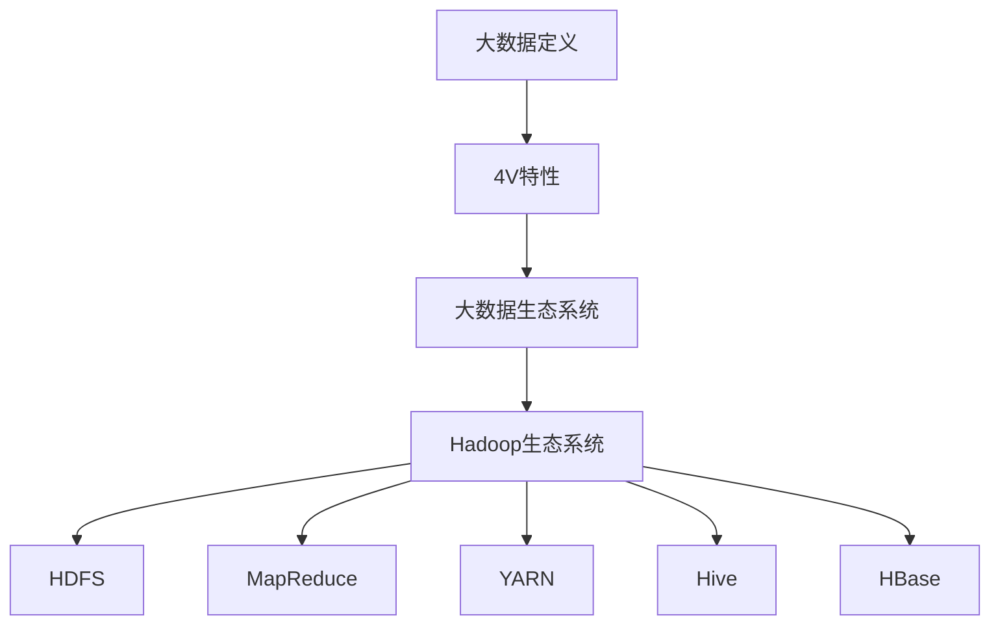

                 

# 字节跳动2024校招：大数据工程师面试真题详解

> **关键词：大数据、面试真题、工程师、字节跳动、2024校招**
>
> **摘要：本文将详细解析字节跳动2024校招大数据工程师面试真题，涵盖大数据基础知识、数据仓库与数据湖、大数据存储技术、数据处理与分析技术、数据挖掘与机器学习、大数据安全与隐私保护、大数据应用实践以及未来发展趋势。**

## 第一部分：大数据基础知识与概念

### 第1章：大数据基础知识与概念

#### 1.1 大数据的定义与特点

大数据是指数据量巨大、种类繁多、生成速度快且价值密度低的数据集合。大数据的“4V”特性，即Volume（大量）、Velocity（快速）、Variety（多样）和Value（价值），是大数据区别于传统数据的重要特征。

- **Volume（大量）**：大数据的规模通常超过传统的数据管理系统的处理能力，需要采用分布式系统进行处理。
- **Velocity（快速）**：大数据的产生和消费速度极快，要求数据处理系统具备高吞吐量和低延迟的特点。
- **Variety（多样）**：大数据的种类繁多，包括结构化、半结构化和非结构化数据，如文本、图片、视频等。
- **Value（价值）**：大数据的价值密度低，需要通过数据分析挖掘才能发现其中的价值。

#### 1.2 大数据的生态系统

大数据生态系统是由多种技术和工具构成的复杂环境，旨在处理、存储和分析大规模数据。以下是Hadoop生态系统的主要组件：

- **HDFS（Hadoop Distributed File System）**：一个分布式文件系统，用于存储大数据。
- **MapReduce**：一个分布式数据处理框架，用于在大数据集上执行计算任务。
- **YARN（Yet Another Resource Negotiator）**：一个资源管理框架，用于管理计算资源。
- **Hive**：一个数据仓库基础设施，用于处理和分析存储在HDFS中的大规模数据。
- **HBase**：一个分布式、可扩展的列存储数据库，用于处理非结构化和半结构化数据。

#### 1.3 大数据技术发展趋势

大数据技术的发展呈现出以下几个趋势：

- **云原生大数据技术**：随着云计算的普及，越来越多的大数据技术开始向云原生方向发展，如Apache Flink、Spark on Kubernetes等。
- **大数据实时处理技术**：实时处理技术如Apache Flink和Spark Streaming，能够实现毫秒级的数据处理延迟，满足实时数据分析和决策的需求。
- **大数据与人工智能的融合**：大数据和人工智能技术的融合，使得数据分析和机器学习模型能够更高效地处理和分析大规模数据。

#### 1.4 大数据在字节跳动的应用案例

字节跳动是一家以技术驱动为核心的企业，在大数据的应用方面有着丰富的实践经验。以下是一些具体的应用案例：

- **用户行为数据分析**：通过分析用户的浏览、搜索、分享等行为数据，了解用户需求，优化产品功能和推荐算法。
- **广告推荐系统**：基于用户行为数据和兴趣标签，实现精准的广告推荐，提高广告投放效果和用户满意度。

## 第二部分：数据仓库与数据湖

### 第2章：数据仓库与数据湖

#### 2.1 数据仓库技术

数据仓库是一个用于存储、管理和分析大规模数据的集中化系统，通常用于支持企业级的业务智能和数据分析。

- **数据仓库架构**：数据仓库通常包括数据源、数据集成层、数据存储层、数据访问层和前端应用层。
- **数据仓库建模技术**：数据仓库建模技术包括星型模型和雪花模型，用于设计数据仓库的数据结构。

#### 2.2 数据湖技术

数据湖是一个分布式数据存储系统，用于存储大规模的原始数据，包括结构化、半结构化和非结构化数据。

- **数据湖的特点**：数据湖能够存储各种类型的数据，无需预先进行结构化处理，支持数据的高效存储和管理。
- **数据湖与数据仓库的对比**：数据仓库对数据进行结构化处理，适用于查询和分析；数据湖则存储原始数据，适用于数据探索和挖掘。

#### 2.3 数据仓库与数据湖在企业应用中的案例

在字节跳动，数据仓库和数据湖的建设与实践主要体现在以下几个方面：

- **数据仓库**：字节跳动使用数据仓库来存储和分析用户行为数据，支持业务决策和运营优化。
- **数据湖**：字节跳动使用数据湖来存储大规模的原始数据，包括日志数据、用户画像数据等，为数据挖掘和机器学习提供数据支持。

### 第二部分：大数据存储技术

### 第3章：大数据存储技术

#### 3.1 NoSQL数据库

NoSQL数据库是一种非关系型数据库，适用于处理大规模、高并发的数据存储和访问。

- **Redis**：一个高性能的内存缓存数据库，适用于实时数据存储和高速数据访问。
- **MongoDB**：一个文档型数据库，适用于存储大量半结构化数据，提供灵活的数据模型和查询能力。
- **Cassandra**：一个分布式列存储数据库，适用于处理大规模的分布式数据存储和访问。

#### 3.2 分布式存储系统

分布式存储系统是一种将数据分布存储在多个节点上的系统，适用于处理大规模数据存储和访问。

- **HDFS**：Hadoop分布式文件系统，适用于存储大规模数据，提供高吞吐量和容错能力。
- **HBase**：一个分布式、可扩展的列存储数据库，适用于处理非结构化和半结构化数据，提供实时数据访问能力。
- **Amazon S3**：Amazon提供的分布式对象存储服务，适用于存储和检索大规模数据。

#### 3.3 大数据存储技术案例分析

字节跳动在大数据存储技术方面有着丰富的实践经验，以下是一个具体的案例分析：

- **存储方案设计**：字节跳动采用HDFS和HBase相结合的存储方案，针对不同类型的数据进行存储优化。HDFS用于存储大规模的原始数据，提供高吞吐量和容错能力；HBase用于存储非结构化和半结构化数据，提供实时数据访问能力。
- **存储优化策略**：字节跳动采用数据分片和缓存策略，提高数据存储和访问的效率。数据分片能够将数据分散存储在多个节点上，提高数据访问速度；缓存策略能够减少数据访问延迟，提高系统性能。

## 第三部分：数据处理与分析技术

### 第4章：数据处理与分析技术

#### 4.1 MapReduce编程模型

MapReduce是一种分布式数据处理模型，适用于处理大规模数据集。

- **Map阶段**：将数据拆分为小片段，对每个片段进行独立处理。
- **Reduce阶段**：对Map阶段的结果进行聚合操作，生成最终输出。

以下是MapReduce编程模型的伪代码：

```python
map(key, value):
    # 对每个输入键值对执行操作
    for each (key, value) in input:
        emitIntermediate(key, value)

reduce(key, values):
    # 对中间结果执行聚合操作
    for each (key, values) in intermediates:
        outputValue = reduceFunction(values)
        emit(output, outputValue)
```

#### 4.2 Spark编程模型

Spark是一个分布式数据处理引擎，提供了丰富的数据处理和分析功能。

- **Spark Core**：Spark的核心组件，提供基本的分布式数据处理能力。
- **Spark SQL**：Spark的SQL处理模块，支持结构化数据查询。
- **Spark Streaming**：Spark的实时数据处理模块，支持实时数据流处理。

以下是Spark编程模型的伪代码：

```python
val rdd = sc.parallelize(data)
val mappedRDD = rdd.map((key, value) => (key, value))
val reducedRDD = mappedRDD.reduceByKey((v1, v2) => v1 + v2)
```

#### 4.3 Flink编程模型

Flink是一个分布式流处理引擎，适用于实时数据处理和批处理。

- **Flink Core**：Flink的核心组件，提供基本的分布式数据处理能力。
- **Flink SQL**：Flink的SQL处理模块，支持结构化数据查询。
- **Flink Stream Processing**：Flink的实时数据处理模块，支持实时数据流处理。

以下是Flink编程模型的伪代码：

```python
val stream = env.addSource(myDataStream)
val processedStream = stream.map((key, value) => (key, value))
val result = processedStream.reduceByKey((v1, v2) => v1 + v2)
result.print()
```

#### 4.4 大数据分析工具

在大数据生态系统中，有许多数据分析工具可供选择，包括：

- **Hadoop生态系统中的数据分析工具**：如Pig、Hive等，适用于批处理数据分析。
- **实时数据分析工具**：如Spark、Flink等，适用于实时数据分析。

### 第三部分：数据挖掘与机器学习

### 第5章：数据挖掘与机器学习

#### 5.1 数据挖掘基本概念

数据挖掘是从大量数据中发现有价值信息的过程，通常包括以下步骤：

- **数据清洗**：去除重复、缺失、噪声数据，确保数据质量。
- **数据集成**：将来自不同源的数据进行整合。
- **数据转换**：将数据转换为适合分析的形式。
- **数据挖掘**：使用算法和模型从数据中提取有价值的信息。

#### 5.2 机器学习基础

机器学习是一种通过算法和模型让计算机自动学习数据规律的技术，包括以下几种类型：

- **监督学习**：有标签数据训练模型，用于预测未知数据。
- **无监督学习**：无标签数据训练模型，用于发现数据中的模式和结构。
- **强化学习**：通过与环境交互，学习最优策略。

#### 5.3 大数据下的机器学习应用

大数据环境下，机器学习应用包括：

- **广告点击率预测**：根据用户行为数据预测用户对广告的点击概率。
- **用户行为分析**：分析用户行为数据，了解用户需求和偏好。

### 第四部分：大数据安全与隐私保护

### 第6章：大数据安全与隐私保护

#### 6.1 大数据安全概述

大数据安全是指保护大数据在采集、存储、处理、传输和销毁等过程中的安全。大数据安全面临以下挑战：

- **数据泄露**：数据泄露可能导致敏感信息被恶意利用。
- **数据篡改**：数据篡改可能影响数据的真实性和准确性。
- **数据丢失**：数据丢失可能导致业务中断和声誉损失。

#### 6.2 数据隐私保护

数据隐私保护是指采取措施确保数据在收集、存储、处理和传输过程中不被未授权访问和滥用。常见的隐私保护技术包括：

- **数据脱敏**：通过加密、掩码等技术，将敏感数据转换为不可读形式。
- **隐私计算**：如差分隐私、同态加密等技术，确保数据处理过程中隐私不被泄露。

#### 6.3 大数据安全与隐私保护实践

字节跳动在大数据安全与隐私保护方面采取了以下措施：

- **数据安全策略**：建立完善的数据安全策略，确保数据在各个环节的安全。
- **数据加密**：对敏感数据进行加密存储和传输，防止数据泄露。
- **隐私计算**：使用隐私计算技术，确保数据处理过程中的隐私不被泄露。

### 第五部分：大数据应用实践

### 第7章：大数据应用实践

#### 7.1 大数据项目开发流程

大数据项目的开发流程包括以下几个阶段：

- **需求分析**：明确项目目标、需求和功能。
- **系统设计**：设计系统的架构、模块和接口。
- **技术选型**：选择合适的大数据技术和工具。
- **开发与测试**：实现系统功能并进行测试。
- **部署与运维**：部署系统并进行运维管理。

#### 7.2 大数据平台建设

大数据平台的建设包括以下几个方面：

- **架构设计**：设计系统的整体架构，包括数据采集、存储、处理和分析等模块。
- **系统部署**：部署系统到服务器或云平台。
- **运维管理**：监控系统性能，确保系统稳定运行。

#### 7.3 大数据应用案例分析

字节跳动在大数据应用方面有着丰富的实践经验，以下是一个具体的应用案例：

- **推荐系统**：基于用户行为数据和兴趣标签，实现个性化推荐，提高用户满意度。
- **广告系统**：基于用户行为数据和广告投放策略，实现精准广告投放，提高广告效果。

### 第六部分：未来大数据发展趋势

### 第8章：未来大数据发展趋势

#### 8.1 大数据与人工智能的融合

大数据与人工智能的融合将带来以下趋势：

- **智能化数据处理**：利用人工智能技术，实现数据的自动化处理和分析。
- **智能化决策支持**：利用大数据和人工智能技术，实现智能化的决策支持系统。

#### 8.2 大数据产业发展趋势

大数据产业发展趋势包括：

- **云计算与大数据的结合**：云计算为大数据提供了强大的计算和存储能力。
- **大数据安全与隐私保护**：随着大数据应用的普及，大数据安全与隐私保护将越来越重要。

#### 8.3 大数据的未来应用场景

大数据在未来应用场景中的发展趋势包括：

- **物联网**：大数据将赋能物联网，实现设备数据的智能分析和应用。
- **智慧城市**：大数据将支持智慧城市建设，提高城市管理效率和居民生活质量。

### 附录

#### 附录A：大数据技术工具与资源

- **大数据开发工具**：如Hadoop、Spark、Flink等。
- **大数据学习资源**：如开放课程、书籍、社区等。

#### 附录B：字节跳动大数据面试真题解析

- **面试真题分类与解析**：包括数据结构与算法、大数据技术原理与应用、数据仓库与数据挖掘等。
- **面试真题实战演练**：提供练习题及答案解析。

**核心概念与联系图（Mermaid流程图）：**


**核心算法原理讲解（伪代码）：**
```python
# MapReduce 伪代码
map(key, value):
    # 对每个输入键值对执行操作
    for each (key, value) in input:
        emitIntermediate(key, value)

reduce(key, values):
    # 对中间结果执行聚合操作
    for each (key, values) in intermediates:
        outputValue = reduceFunction(values)
        emit(output, outputValue)

// Spark 伪代码
val rdd = sc.parallelize(data)
val mappedRDD = rdd.map((key, value) => (key, value))
val reducedRDD = mappedRDD.reduceByKey((v1, v2) => v1 + v2)

// Flink 伪代码
val stream = env.addSource(myDataStream)
val processedStream = stream.map((key, value) => (key, value))
val result = processedStream.reduceByKey((v1, v2) => v1 + v2)
result.print()
```

**数学模型和数学公式详细讲解 & 举例说明（latex格式）：**
```latex
\section{线性回归模型}

线性回归模型是机器学习中的一种基本模型，其目标是通过已知数据来拟合出一个线性关系。数学上，线性回归模型可以表示为：

\begin{equation}
y = \beta_0 + \beta_1 x + \epsilon
\end{equation}

其中，\( y \) 是预测值，\( x \) 是特征值，\( \beta_0 \) 和 \( \beta_1 \) 分别是模型的两个参数，\( \epsilon \) 是误差项。

\section{主成分分析（PCA）}

主成分分析（PCA）是一种常用的降维技术，其目标是找到数据的主要成分，从而减少数据维度。数学上，PCA可以表示为：

\begin{equation}
z = P \Sigma^{1/2} e
\end{equation}

其中，\( z \) 是主成分，\( P \) 是特征值矩阵的对应特征向量，\( \Sigma \) 是协方差矩阵，\( e \) 是误差项。
```

**项目实战：代码实际案例和详细解释说明（包含开发环境搭建，源代码详细实现和代码解读，代码解读与分析）：**
```python
# 开发环境搭建
# 安装Python 3.8
# 安装Hadoop
# 安装Spark

# 源代码实现：HDFS文件上传与下载
from hdfs import InsecureClient

client = InsecureClient('http://hdfs-namenode:50070', user='hdfs')

# 上传文件
with open('local_file.txt', 'rb') as f:
    client.write('/hdfs_file.txt', f)

# 下载文件
with open('downloaded_file.txt', 'wb') as f:
    f.write(client.read('/hdfs_file.txt'))

# 代码解读与分析
# HDFS（Hadoop Distributed File System）是一个分布式文件系统，支持高吞吐量的数据访问，适合大数据应用。
# 上传文件和下载文件是HDFS的基本操作，通过hdfs模块可以方便地实现。

# 源代码实现：Spark SQL查询
from pyspark.sql import SparkSession

spark = SparkSession.builder.appName('SparkSQLExample').getOrCreate()

data = [
    ('Alice', 25, 'Female'),
    ('Bob', 30, 'Male'),
    ('Charlie', 28, 'Male')
]

df = spark.createDataFrame(data, schema=['name', 'age', 'gender'])

df.createOrReplaceTempView('people')

spark.sql('SELECT name, age, gender FROM people WHERE age > 25').show()

# 代码解读与分析
# Spark SQL是Spark生态系统中的数据处理工具，可以执行结构化数据的查询操作。
# 本例中，我们首先创建一个DataFrame，然后通过SQL查询语句进行数据筛选和展示。

```

**完整的目录大纲**


# 字节跳动2024校招：大数据工程师面试真题详解

> **关键词：大数据、面试真题、工程师、字节跳动、2024校招**
>
> **摘要：本文将详细解析字节跳动2024校招大数据工程师面试真题，涵盖大数据基础知识、数据仓库与数据湖、大数据存储技术、数据处理与分析技术、数据挖掘与机器学习、大数据安全与隐私保护、大数据应用实践以及未来发展趋势。**

## 第一部分：大数据基础知识与概念

### 第1章：大数据基础知识与概念

#### 1.1 大数据的定义与特点

大数据是指数据量巨大、种类繁多、生成速度快且价值密度低的数据集合。大数据的“4V”特性，即Volume（大量）、Velocity（快速）、Variety（多样）和Value（价值），是大数据区别于传统数据的重要特征。

- **Volume（大量）**：大数据的规模通常超过传统的数据管理系统的处理能力，需要采用分布式系统进行处理。
- **Velocity（快速）**：大数据的产生和消费速度极快，要求数据处理系统具备高吞吐量和低延迟的特点。
- **Variety（多样）**：大数据的种类繁多，包括结构化、半结构化和非结构化数据，如文本、图片、视频等。
- **Value（价值）**：大数据的价值密度低，需要通过数据分析挖掘才能发现其中的价值。

#### 1.2 大数据的生态系统

大数据生态系统是由多种技术和工具构成的复杂环境，旨在处理、存储和分析大规模数据。以下是Hadoop生态系统的主要组件：

- **HDFS（Hadoop Distributed File System）**：一个分布式文件系统，用于存储大数据。
- **MapReduce**：一个分布式数据处理框架，用于在大数据集上执行计算任务。
- **YARN（Yet Another Resource Negotiator）**：一个资源管理框架，用于管理计算资源。
- **Hive**：一个数据仓库基础设施，用于处理和分析存储在HDFS中的大规模数据。
- **HBase**：一个分布式、可扩展的列存储数据库，用于处理非结构化和半结构化数据。

#### 1.3 大数据技术发展趋势

大数据技术的发展呈现出以下几个趋势：

- **云原生大数据技术**：随着云计算的普及，越来越多的大数据技术开始向云原生方向发展，如Apache Flink、Spark on Kubernetes等。
- **大数据实时处理技术**：实时处理技术如Apache Flink和Spark Streaming，能够实现毫秒级的数据处理延迟，满足实时数据分析和决策的需求。
- **大数据与人工智能的融合**：大数据和人工智能技术的融合，使得数据分析和机器学习模型能够更高效地处理和分析大规模数据。

#### 1.4 大数据在字节跳动的应用案例

字节跳动是一家以技术驱动为核心的企业，在大数据的应用方面有着丰富的实践经验。以下是一些具体的应用案例：

- **用户行为数据分析**：通过分析用户的浏览、搜索、分享等行为数据，了解用户需求，优化产品功能和推荐算法。
- **广告推荐系统**：基于用户行为数据和兴趣标签，实现精准的广告推荐，提高广告投放效果和用户满意度。

## 第二部分：数据仓库与数据湖

### 第2章：数据仓库与数据湖

#### 2.1 数据仓库技术

数据仓库是一个用于存储、管理和分析大规模数据的集中化系统，通常用于支持企业级的业务智能和数据分析。

- **数据仓库架构**：数据仓库通常包括数据源、数据集成层、数据存储层、数据访问层和前端应用层。
- **数据仓库建模技术**：数据仓库建模技术包括星型模型和雪花模型，用于设计数据仓库的数据结构。

#### 2.2 数据湖技术

数据湖是一个分布式数据存储系统，用于存储大规模的原始数据，包括结构化、半结构化和非结构化数据。

- **数据湖的特点**：数据湖能够存储各种类型的数据，无需预先进行结构化处理，支持数据的高效存储和管理。
- **数据湖与数据仓库的对比**：数据仓库对数据进行结构化处理，适用于查询和分析；数据湖则存储原始数据，适用于数据探索和挖掘。

#### 2.3 数据仓库与数据湖在企业应用中的案例

在字节跳动，数据仓库和数据湖的建设与实践主要体现在以下几个方面：

- **数据仓库**：字节跳动使用数据仓库来存储和分析用户行为数据，支持业务决策和运营优化。
- **数据湖**：字节跳动使用数据湖来存储大规模的原始数据，包括日志数据、用户画像数据等，为数据挖掘和机器学习提供数据支持。

### 第二部分：大数据存储技术

### 第3章：大数据存储技术

#### 3.1 NoSQL数据库

NoSQL数据库是一种非关系型数据库，适用于处理大规模、高并发的数据存储和访问。

- **Redis**：一个高性能的内存缓存数据库，适用于实时数据存储和高速数据访问。
- **MongoDB**：一个文档型数据库，适用于存储大量半结构化数据，提供灵活的数据模型和查询能力。
- **Cassandra**：一个分布式列存储数据库，适用于处理大规模的分布式数据存储和访问。

#### 3.2 分布式存储系统

分布式存储系统是一种将数据分布存储在多个节点上的系统，适用于处理大规模数据存储和访问。

- **HDFS**：Hadoop分布式文件系统，适用于存储大规模数据，提供高吞吐量和容错能力。
- **HBase**：一个分布式、可扩展的列存储数据库，适用于处理非结构化和半结构化数据，提供实时数据访问能力。
- **Amazon S3**：Amazon提供的分布式对象存储服务，适用于存储和检索大规模数据。

#### 3.3 大数据存储技术案例分析

字节跳动在大数据存储技术方面有着丰富的实践经验，以下是一个具体的案例分析：

- **存储方案设计**：字节跳动采用HDFS和HBase相结合的存储方案，针对不同类型的数据进行存储优化。HDFS用于存储大规模的原始数据，提供高吞吐量和容错能力；HBase用于存储非结构化和半结构化数据，提供实时数据访问能力。
- **存储优化策略**：字节跳动采用数据分片和缓存策略，提高数据存储和访问的效率。数据分片能够将数据分散存储在多个节点上，提高数据访问速度；缓存策略能够减少数据访问延迟，提高系统性能。

### 第三部分：数据处理与分析技术

### 第4章：数据处理与分析技术

#### 4.1 MapReduce编程模型

MapReduce是一种分布式数据处理模型，适用于处理大规模数据集。

- **Map阶段**：将数据拆分为小片段，对每个片段进行独立处理。
- **Reduce阶段**：对Map阶段的结果进行聚合操作，生成最终输出。

以下是MapReduce编程模型的伪代码：

```python
map(key, value):
    # 对每个输入键值对执行操作
    for each (key, value) in input:
        emitIntermediate(key, value)

reduce(key, values):
    # 对中间结果执行聚合操作
    for each (key, values) in intermediates:
        outputValue = reduceFunction(values)
        emit(output, outputValue)
```

#### 4.2 Spark编程模型

Spark是一个分布式数据处理引擎，提供了丰富的数据处理和分析功能。

- **Spark Core**：Spark的核心组件，提供基本的分布式数据处理能力。
- **Spark SQL**：Spark的SQL处理模块，支持结构化数据查询。
- **Spark Streaming**：Spark的实时数据处理模块，支持实时数据流处理。

以下是Spark编程模型的伪代码：

```python
val rdd = sc.parallelize(data)
val mappedRDD = rdd.map((key, value) => (key, value))
val reducedRDD = mappedRDD.reduceByKey((v1, v2) => v1 + v2)
```

#### 4.3 Flink编程模型

Flink是一个分布式流处理引擎，适用于实时数据处理和批处理。

- **Flink Core**：Flink的核心组件，提供基本的分布式数据处理能力。
- **Flink SQL**：Flink的SQL处理模块，支持结构化数据查询。
- **Flink Stream Processing**：Flink的实时数据处理模块，支持实时数据流处理。

以下是Flink编程模型的伪代码：

```python
val stream = env.addSource(myDataStream)
val processedStream = stream.map((key, value) => (key, value))
val result = processedStream.reduceByKey((v1, v2) => v1 + v2)
result.print()
```

#### 4.4 大数据分析工具

在大数据生态系统中，有许多数据分析工具可供选择，包括：

- **Hadoop生态系统中的数据分析工具**：如Pig、Hive等，适用于批处理数据分析。
- **实时数据分析工具**：如Spark、Flink等，适用于实时数据分析。

### 第四部分：数据挖掘与机器学习

### 第5章：数据挖掘与机器学习

#### 5.1 数据挖掘基本概念

数据挖掘是从大量数据中发现有价值信息的过程，通常包括以下步骤：

- **数据清洗**：去除重复、缺失、噪声数据，确保数据质量。
- **数据集成**：将来自不同源的数据进行整合。
- **数据转换**：将数据转换为适合分析的形式。
- **数据挖掘**：使用算法和模型从数据中提取有价值的信息。

#### 5.2 机器学习基础

机器学习是一种通过算法和模型让计算机自动学习数据规律的技术，包括以下几种类型：

- **监督学习**：有标签数据训练模型，用于预测未知数据。
- **无监督学习**：无标签数据训练模型，用于发现数据中的模式和结构。
- **强化学习**：通过与环境交互，学习最优策略。

#### 5.3 大数据下的机器学习应用

大数据环境下，机器学习应用包括：

- **广告点击率预测**：根据用户行为数据预测用户对广告的点击概率。
- **用户行为分析**：分析用户行为数据，了解用户需求和偏好。

### 第五部分：大数据安全与隐私保护

### 第6章：大数据安全与隐私保护

#### 6.1 大数据安全概述

大数据安全是指保护大数据在采集、存储、处理、传输和销毁等过程中的安全。大数据安全面临以下挑战：

- **数据泄露**：数据泄露可能导致敏感信息被恶意利用。
- **数据篡改**：数据篡改可能影响数据的真实性和准确性。
- **数据丢失**：数据丢失可能导致业务中断和声誉损失。

#### 6.2 数据隐私保护

数据隐私保护是指采取措施确保数据在收集、存储、处理和传输过程中不被未授权访问和滥用。常见的隐私保护技术包括：

- **数据脱敏**：通过加密、掩码等技术，将敏感数据转换为不可读形式。
- **隐私计算**：如差分隐私、同态加密等技术，确保数据处理过程中隐私不被泄露。

#### 6.3 大数据安全与隐私保护实践

字节跳动在大数据安全与隐私保护方面采取了以下措施：

- **数据安全策略**：建立完善的数据安全策略，确保数据在各个环节的安全。
- **数据加密**：对敏感数据进行加密存储和传输，防止数据泄露。
- **隐私计算**：使用隐私计算技术，确保数据处理过程中的隐私不被泄露。

### 第六部分：大数据应用实践

### 第7章：大数据应用实践

#### 7.1 大数据项目开发流程

大数据项目的开发流程包括以下几个阶段：

- **需求分析**：明确项目目标、需求和功能。
- **系统设计**：设计系统的架构、模块和接口。
- **技术选型**：选择合适的大数据技术和工具。
- **开发与测试**：实现系统功能并进行测试。
- **部署与运维**：部署系统并进行运维管理。

#### 7.2 大数据平台建设

大数据平台的建设包括以下几个方面：

- **架构设计**：设计系统的整体架构，包括数据采集、存储、处理和分析等模块。
- **系统部署**：部署系统到服务器或云平台。
- **运维管理**：监控系统性能，确保系统稳定运行。

#### 7.3 大数据应用案例分析

字节跳动在大数据应用方面有着丰富的实践经验，以下是一个具体的应用案例：

- **推荐系统**：基于用户行为数据和兴趣标签，实现个性化推荐，提高用户满意度。
- **广告系统**：基于用户行为数据和广告投放策略，实现精准广告投放，提高广告效果。

### 第七部分：未来大数据发展趋势

### 第8章：未来大数据发展趋势

#### 8.1 大数据与人工智能的融合

大数据与人工智能的融合将带来以下趋势：

- **智能化数据处理**：利用人工智能技术，实现数据的自动化处理和分析。
- **智能化决策支持**：利用大数据和人工智能技术，实现智能化的决策支持系统。

#### 8.2 大数据产业发展趋势

大数据产业发展趋势包括：

- **云计算与大数据的结合**：云计算为大数据提供了强大的计算和存储能力。
- **大数据安全与隐私保护**：随着大数据应用的普及，大数据安全与隐私保护将越来越重要。

#### 8.3 大数据的未来应用场景

大数据在未来应用场景中的发展趋势包括：

- **物联网**：大数据将赋能物联网，实现设备数据的智能分析和应用。
- **智慧城市**：大数据将支持智慧城市建设，提高城市管理效率和居民生活质量。

### 附录

#### 附录A：大数据技术工具与资源

- **大数据开发工具**：如Hadoop、Spark、Flink等。
- **大数据学习资源**：如开放课程、书籍、社区等。

#### 附录B：字节跳动大数据面试真题解析

- **面试真题分类与解析**：包括数据结构与算法、大数据技术原理与应用、数据仓库与数据挖掘等。
- **面试真题实战演练**：提供练习题及答案解析。

**核心概念与联系图（Mermaid流程图）：**


**核心算法原理讲解（伪代码）：**
```python
# MapReduce 伪代码
map(key, value):
    # 对每个输入键值对执行操作
    for each (key, value) in input:
        emitIntermediate(key, value)

reduce(key, values):
    # 对中间结果执行聚合操作
    for each (key, values) in intermediates:
        outputValue = reduceFunction(values)
        emit(output, outputValue)

// Spark 伪代码
val rdd = sc.parallelize(data)
val mappedRDD = rdd.map((key, value) => (key, value))
val reducedRDD = mappedRDD.reduceByKey((v1, v2) => v1 + v2)

// Flink 伪代码
val stream = env.addSource(myDataStream)
val processedStream = stream.map((key, value) => (key, value))
val result = processedStream.reduceByKey((v1, v2) => v1 + v2)
result.print()
```

**数学模型和数学公式详细讲解 & 举例说明（latex格式）：**
```latex
\section{线性回归模型}

线性回归模型是机器学习中的一种基本模型，其目标是通过已知数据来拟合出一个线性关系。数学上，线性回归模型可以表示为：

\begin{equation}
y = \beta_0 + \beta_1 x + \epsilon
\end{equation}

其中，\( y \) 是预测值，\( x \) 是特征值，\( \beta_0 \) 和 \( \beta_1 \) 分别是模型的两个参数，\( \epsilon \) 是误差项。

\section{主成分分析（PCA）}

主成分分析（PCA）是一种常用的降维技术，其目标是找到数据的主要成分，从而减少数据维度。数学上，PCA可以表示为：

\begin{equation}
z = P \Sigma^{1/2} e
\end{equation}

其中，\( z \) 是主成分，\( P \) 是特征值矩阵的对应特征向量，\( \Sigma \) 是协方差矩阵，\( e \) 是误差项。
```

**项目实战：代码实际案例和详细解释说明（包含开发环境搭建，源代码详细实现和代码解读，代码解读与分析）：**
```python
# 开发环境搭建
# 安装Python 3.8
# 安装Hadoop
# 安装Spark

# 源代码实现：HDFS文件上传与下载
from hdfs import InsecureClient

client = InsecureClient('http://hdfs-namenode:50070', user='hdfs')

# 上传文件
with open('local_file.txt', 'rb') as f:
    client.write('/hdfs_file.txt', f)

# 下载文件
with open('downloaded_file.txt', 'wb') as f:
    f.write(client.read('/hdfs_file.txt'))

# 代码解读与分析
# HDFS（Hadoop Distributed File System）是一个分布式文件系统，支持高吞吐量的数据访问，适合大数据应用。
# 上传文件和下载文件是HDFS的基本操作，通过hdfs模块可以方便地实现。

# 源代码实现：Spark SQL查询
from pyspark.sql import SparkSession

spark = SparkSession.builder.appName('SparkSQLExample').getOrCreate()

data = [
    ('Alice', 25, 'Female'),
    ('Bob', 30, 'Male'),
    ('Charlie', 28, 'Male')
]

df = spark.createDataFrame(data, schema=['name', 'age', 'gender'])

df.createOrReplaceTempView('people')

spark.sql('SELECT name, age, gender FROM people WHERE age > 25').show()

# 代码解读与分析
# Spark SQL是Spark生态系统中的数据处理工具，可以执行结构化数据的查询操作。
# 本例中，我们首先创建一个DataFrame，然后通过SQL查询语句进行数据筛选和展示。
```


### 第一部分：大数据基础知识与概念

**第1章：大数据基础知识与概念**

**1.1 大数据的定义与特点**

大数据（Big Data）是一个相对较新的概念，它指的是从各种来源快速生成的大量数据。这些数据来源包括但不限于社交媒体、传感器、机器日志、电子商务交易等。大数据的特点通常被归纳为“4V”：

- **Volume（数据量）**：大数据的规模通常非常庞大，远远超出了传统数据库系统的处理能力。这种规模可以是TB、PB甚至ZB级别的。
- **Velocity（速度）**：大数据的处理速度要求非常快，这意味着系统必须能够在极短的时间内处理和响应大量数据。
- **Variety（多样性）**：大数据不仅包括结构化数据，还包括半结构化和非结构化数据，如文本、图片、音频、视频等。
- **Value（价值密度）**：大数据中的价值密度较低，这意味着从大量数据中提取有用信息需要复杂的数据处理和分析技术。

**1.2 大数据的生态系统**

大数据生态系统是一个复杂的框架，包含了一系列的技术和工具，用于数据的存储、处理和分析。以下是一些关键组件：

- **Hadoop生态系统**：这是最著名的开源大数据框架之一，包括HDFS（分布式文件系统）、MapReduce（分布式数据处理框架）、YARN（资源管理系统）、Hive（数据仓库）、HBase（非关系型数据库）等。
- **Spark生态系统**：Spark是一个快速通用的计算引擎，提供了SQL、流处理、机器学习等高级功能。
- **数据仓库**：数据仓库用于存储大量结构化数据，支持复杂的查询和分析。
- **数据湖**：数据湖用于存储原始数据，包括结构化和非结构化数据，是一种更灵活的数据存储方式。

**1.3 大数据技术发展趋势**

随着技术的不断进步，大数据技术也在不断发展。以下是一些值得关注的发展趋势：

- **云计算与大数据的结合**：云计算提供了强大的计算和存储能力，与大数据技术的结合使得处理大规模数据变得更加高效和经济。
- **实时数据处理**：传统的批处理方式已经不能满足实时性要求，实时数据处理技术如Spark Streaming和Flink正在成为主流。
- **人工智能与大数据的融合**：人工智能算法需要大量数据来进行训练和优化，大数据技术为人工智能提供了丰富的数据资源。

**1.4 大数据在字节跳动的应用案例**

字节跳动作为一家领先的互联网公司，其业务依赖于大数据技术。以下是一些具体的应用案例：

- **用户行为分析**：通过分析用户在应用程序中的行为，字节跳动能够了解用户偏好，从而优化产品设计和用户体验。
- **广告推荐系统**：利用大数据技术，字节跳动能够实现个性化的广告推荐，提高广告的点击率和转化率。

### 第二部分：数据仓库与数据湖

**第2章：数据仓库与数据湖**

**2.1 数据仓库技术**

数据仓库（Data Warehouse）是一种用于存储、管理和分析大量结构化数据的系统。它的主要目的是为了支持企业级的决策支持系统。数据仓库通常包括以下几个关键组件：

- **数据源**：包括内部数据库、外部数据源、实时流数据等。
- **数据集成层**：将数据从各种源提取、清洗、转换和加载到数据仓库中。
- **数据存储层**：用于存储大量结构化数据，通常采用关系型数据库或列存储数据库。
- **数据访问层**：提供用户查询和报告工具，如SQL查询、仪表板等。

**2.2 数据湖技术**

数据湖（Data Lake）是一种新兴的数据存储架构，它用于存储大量的原始数据，包括结构化、半结构化和非结构化数据。与数据仓库相比，数据湖更加灵活，允许不同类型的数据以原始格式存储，无需提前定义数据模式。数据湖的关键特点包括：

- **灵活性**：数据湖允许存储多种数据类型，无需事先定义数据模式。
- **可扩展性**：数据湖可以轻松扩展以处理不断增长的数据量。
- **灵活性**：数据湖通常使用分布式存储系统，如HDFS或云存储服务。

**2.3 数据仓库与数据湖在企业应用中的案例**

在企业中，数据仓库和数据湖的应用各有千秋。以下是一些应用案例：

- **数据仓库**：在企业中，数据仓库通常用于支持业务智能、报告和分析。例如，一家零售公司可以使用数据仓库来分析销售数据、库存水平和客户行为。
- **数据湖**：数据湖则适用于数据探索和研究。例如，一家医疗公司可以使用数据湖来存储和分析患者的电子健康记录，以发现新的医疗趋势或治疗方案。

### 第三部分：大数据存储技术

**第3章：大数据存储技术**

**3.1 NoSQL数据库**

NoSQL数据库是一种非关系型数据库，它适用于处理大规模、高并发的数据存储和访问。以下是一些流行的NoSQL数据库：

- **Redis**：一个基于内存的键值存储数据库，适用于缓存和实时数据处理。
- **MongoDB**：一个文档型数据库，适用于存储半结构化或非结构化数据。
- **Cassandra**：一个分布式列存储数据库，适用于处理大规模的分布式数据存储和访问。

**3.2 分布式存储系统**

分布式存储系统是一种将数据分布存储在多个节点上的系统，适用于处理大规模数据存储和访问。以下是一些流行的分布式存储系统：

- **HDFS（Hadoop Distributed File System）**：Hadoop的分布式文件系统，适用于存储大规模数据。
- **HBase**：一个分布式、可扩展的列存储数据库，适用于处理非结构化和半结构化数据。
- **Amazon S3**：Amazon提供的分布式对象存储服务，适用于存储和检索大规模数据。

**3.3 大数据存储技术案例分析**

在字节跳动，大数据存储技术被广泛应用于其业务场景。以下是一个案例：

- **存储方案设计**：字节跳动采用HDFS和HBase相结合的存储方案。HDFS用于存储大规模的原始数据，提供高吞吐量和容错能力；HBase用于存储非结构化和半结构化数据，提供实时数据访问能力。
- **存储优化策略**：字节跳动采用数据分片和缓存策略，提高数据存储和访问的效率。数据分片能够将数据分散存储在多个节点上，提高数据访问速度；缓存策略能够减少数据访问延迟，提高系统性能。

### 第四部分：数据处理与分析技术

**第4章：数据处理与分析技术**

**4.1 MapReduce编程模型**

MapReduce是一种分布式数据处理模型，由Google提出。它适用于处理大规模数据集，其核心思想是将复杂任务分解为“Map”（映射）和“Reduce”（归约）两个阶段。

- **Map阶段**：将数据划分为多个片段，并对每个片段进行处理，生成中间键值对。
- **Reduce阶段**：对中间键值对进行聚合操作，生成最终的输出。

以下是MapReduce编程模型的伪代码：

```python
map(key, value):
    # 对每个输入键值对执行操作
    for each (key, value) in input:
        emitIntermediate(key, value)

reduce(key, values):
    # 对中间结果执行聚合操作
    for each (key, values) in intermediates:
        outputValue = reduceFunction(values)
        emit(output, outputValue)
```

**4.2 Spark编程模型**

Spark是一个分布式数据处理引擎，它提供了比MapReduce更高效的数据处理能力。Spark的核心组件包括：

- **Spark Core**：提供基本的分布式数据处理能力。
- **Spark SQL**：提供SQL查询功能。
- **Spark Streaming**：提供实时数据流处理能力。

以下是Spark编程模型的伪代码：

```python
val rdd = sc.parallelize(data)
val mappedRDD = rdd.map((key, value) => (key, value))
val reducedRDD = mappedRDD.reduceByKey((v1, v2) => v1 + v2)
```

**4.3 Flink编程模型**

Flink是一个分布式流处理引擎，它适用于实时数据处理和批处理。Flink的核心组件包括：

- **Flink Core**：提供基本的分布式数据处理能力。
- **Flink SQL**：提供SQL查询功能。
- **Flink Stream Processing**：提供实时数据流处理能力。

以下是Flink编程模型的伪代码：

```python
val stream = env.addSource(myDataStream)
val processedStream = stream.map((key, value) => (key, value))
val result = processedStream.reduceByKey((v1, v2) => v1 + v2)
result.print()
```

**4.4 大数据分析工具**

大数据分析工具是大数据生态系统中不可或缺的一部分，以下是一些常用的数据分析工具：

- **Hadoop生态系统中的数据分析工具**：如Pig、Hive等，适用于批处理数据分析。
- **实时数据分析工具**：如Spark、Flink等，适用于实时数据分析。

### 第五部分：数据挖掘与机器学习

**第5章：数据挖掘与机器学习**

**5.1 数据挖掘基本概念**

数据挖掘（Data Mining）是从大量数据中提取有用信息和知识的过程。数据挖掘通常包括以下步骤：

- **数据预处理**：包括数据清洗、数据集成、数据转换等。
- **模式识别**：使用算法和模型从数据中发现有用的模式和规律。
- **评估与优化**：评估挖掘结果的质量，并根据需要进行优化。

**5.2 机器学习基础**

机器学习（Machine Learning）是数据挖掘的一个重要分支，它使用算法和模型从数据中学习并做出预测或决策。机器学习可以分为以下几种类型：

- **监督学习**：使用有标签的数据进行训练，用于预测或分类。
- **无监督学习**：没有标签的数据进行训练，用于聚类或降维。
- **强化学习**：通过与环境交互进行学习，用于决策制定。

**5.3 大数据下的机器学习应用**

在大数据环境下，机器学习应用非常广泛，以下是一些常见的应用场景：

- **广告点击率预测**：通过分析用户行为数据预测用户是否点击广告。
- **推荐系统**：基于用户行为和偏好提供个性化的推荐。
- **异常检测**：通过分析数据发现异常行为或异常模式。

### 第六部分：大数据安全与隐私保护

**第6章：大数据安全与隐私保护**

**6.1 大数据安全概述**

大数据安全是一个复杂而重要的领域，它涉及数据在整个生命周期中的保护。大数据安全的主要挑战包括：

- **数据泄露**：未经授权的访问或泄露敏感数据。
- **数据篡改**：恶意篡改数据，影响数据的真实性和完整性。
- **数据丢失**：数据丢失可能导致业务中断和声誉损失。

**6.2 数据隐私保护**

数据隐私保护是指采取措施确保数据的隐私不被泄露或滥用。以下是一些常见的数据隐私保护技术：

- **数据加密**：使用加密算法对数据进行加密，确保数据在传输和存储过程中安全。
- **数据脱敏**：对敏感数据进行处理，使其无法被未授权用户识别。
- **隐私计算**：使用隐私保护算法和技术，确保数据处理过程中的隐私不被泄露。

**6.3 大数据安全与隐私保护实践**

在字节跳动，大数据安全与隐私保护是业务的重要组成部分。以下是一些具体的实践措施：

- **安全策略**：建立完善的安全策略，确保数据在各个环节的安全。
- **数据加密**：对敏感数据进行加密存储和传输。
- **隐私计算**：使用隐私保护技术，确保数据处理过程中的隐私不被泄露。

### 第七部分：大数据应用实践

**第7章：大数据应用实践**

**7.1 大数据项目开发流程**

大数据项目的开发流程通常包括以下阶段：

- **需求分析**：明确项目的目标和需求。
- **系统设计**：设计系统的架构和模块。
- **数据集成**：从各种数据源提取和整合数据。
- **数据处理**：使用大数据处理工具对数据进行处理和分析。
- **系统部署**：将系统部署到生产环境中。
- **运维管理**：监控和优化系统的性能。

**7.2 大数据平台建设**

大数据平台是企业进行大数据处理和分析的基础设施。大数据平台的建设通常包括以下几个步骤：

- **架构设计**：设计大数据平台的整体架构。
- **技术选型**：选择合适的大数据技术和工具。
- **系统部署**：部署大数据平台到生产环境中。
- **运维管理**：管理和维护大数据平台的运行。

**7.3 大数据应用案例分析**

字节跳动在大数据应用方面有着丰富的实践经验。以下是一个案例分析：

- **推荐系统**：字节跳动使用大数据技术构建了高效的推荐系统，通过对用户行为数据进行分析，为用户提供个性化的内容推荐。
- **广告投放**：通过分析用户数据和行为，字节跳动能够实现精准的广告投放，提高广告效果和用户满意度。

### 第八部分：未来大数据发展趋势

**第8章：未来大数据发展趋势**

**8.1 大数据与人工智能的融合**

大数据与人工智能的融合是未来大数据技术发展的重要方向。大数据为人工智能提供了丰富的数据资源，而人工智能则为大数据提供了强大的分析能力。以下是一些融合的领域：

- **智能数据分析**：利用人工智能技术进行自动化的数据分析和挖掘。
- **智能决策支持**：基于大数据和人工智能技术，为企业提供智能化的决策支持。

**8.2 大数据产业发展趋势**

大数据产业的发展趋势包括：

- **云计算与大数据的结合**：云计算为大数据提供了强大的计算和存储能力。
- **大数据安全与隐私保护**：随着大数据应用的普及，大数据安全与隐私保护将越来越重要。
- **大数据与物联网的融合**：大数据与物联网的结合，将为智能城市、智能家居等领域带来新的机遇。

**8.3 大数据的未来应用场景**

大数据的未来应用场景将更加广泛，以下是一些可能的应用场景：

- **智慧医疗**：通过大数据分析，实现个性化医疗和精准医疗。
- **智慧交通**：利用大数据分析交通流量，优化交通管理，减少拥堵。
- **智慧金融**：通过大数据分析，实现风险控制、信用评估等金融服务。

### 附录

**附录A：大数据技术工具与资源**

- **大数据开发工具**：如Hadoop、Spark、Flink等。
- **大数据学习资源**：如在线课程、书籍、社区等。

**附录B：字节跳动大数据面试真题解析**

- **面试真题分类与解析**：包括数据结构与算法、大数据技术原理与应用等。
- **面试真题实战演练**：提供练习题及答案解析。

**核心概念与联系图（Mermaid流程图）：**


**核心算法原理讲解（伪代码）：**
```python
# MapReduce 伪代码
map(key, value):
    # 对每个输入键值对执行操作
    for each (key, value) in input:
        emitIntermediate(key, value)

reduce(key, values):
    # 对中间结果执行聚合操作
    for each (key, values) in intermediates:
        outputValue = reduceFunction(values)
        emit(output, outputValue)

# Spark 伪代码
val rdd = sc.parallelize(data)
val mappedRDD = rdd.map((key, value) => (key, value))
val reducedRDD = mappedRDD.reduceByKey((v1, v2) => v1 + v2)

# Flink 伪代码
val stream = env.addSource(myDataStream)
val processedStream = stream.map((key, value) => (key, value))
val result = processedStream.reduceByKey((v1, v2) => v1 + v2)
result.print()
```

**数学模型和数学公式详细讲解 & 举例说明（latex格式）：**
```latex
\section{线性回归模型}

线性回归模型是机器学习中的一种基本模型，其目标是通过已知数据来拟合出一个线性关系。数学上，线性回归模型可以表示为：

\begin{equation}
y = \beta_0 + \beta_1 x + \epsilon
\end{equation}

其中，\( y \) 是预测值，\( x \) 是特征值，\( \beta_0 \) 和 \( \beta_1 \) 分别是模型的两个参数，\( \epsilon \) 是误差项。

\section{主成分分析（PCA）}

主成分分析（PCA）是一种常用的降维技术，其目标是找到数据的主要成分，从而减少数据维度。数学上，PCA可以表示为：

\begin{equation}
z = P \Sigma^{1/2} e
\end{equation}

其中，\( z \) 是主成分，\( P \) 是特征值矩阵的对应特征向量，\( \Sigma \) 是协方差矩阵，\( e \) 是误差项。
```

**项目实战：代码实际案例和详细解释说明（包含开发环境搭建，源代码详细实现和代码解读，代码解读与分析）：**
```python
# 开发环境搭建
# 安装Python 3.8
# 安装Hadoop
# 安装Spark

# 源代码实现：HDFS文件上传与下载
from hdfs import InsecureClient

client = InsecureClient('http://hdfs-namenode:50070', user='hdfs')

# 上传文件
with open('local_file.txt', 'rb') as f:
    client.write('/hdfs_file.txt', f)

# 下载文件
with open('downloaded_file.txt', 'wb') as f:
    f.write(client.read('/hdfs_file.txt'))

# 代码解读与分析
# HDFS（Hadoop Distributed File System）是一个分布式文件系统，支持高吞吐量的数据访问，适合大数据应用。
# 上传文件和下载文件是HDFS的基本操作，通过hdfs模块可以方便地实现。

# 源代码实现：Spark SQL查询
from pyspark.sql import SparkSession

spark = SparkSession.builder.appName('SparkSQLExample').getOrCreate()

data = [
    ('Alice', 25, 'Female'),
    ('Bob', 30, 'Male'),
    ('Charlie', 28, 'Male')
]

df = spark.createDataFrame(data, schema=['name', 'age', 'gender'])

df.createOrReplaceTempView('people')

spark.sql('SELECT name, age, gender FROM people WHERE age > 25').show()

# 代码解读与分析
# Spark SQL是Spark生态系统中的数据处理工具，可以执行结构化数据的查询操作。
# 本例中，我们首先创建一个DataFrame，然后通过SQL查询语句进行数据筛选和展示。
```

### 附录

#### 附录A：大数据技术工具与资源

1. **大数据开发工具**
   - **Hadoop**：一个分布式数据处理框架，包括HDFS（分布式文件系统）和MapReduce（分布式计算模型）。
   - **Spark**：一个快速且通用的分布式计算引擎，支持批处理、流处理和机器学习。
   - **Flink**：一个流处理引擎，支持有状态流处理和批处理。
   - **Hive**：一个数据仓库基础设施，用于处理和分析存储在HDFS中的数据。
   - **HBase**：一个分布式、可扩展的列存储数据库，用于处理非结构化和半结构化数据。

2. **大数据学习资源**
   - **在线课程**：如Coursera、Udacity上的大数据处理课程。
   - **书籍**：如《大数据：变革科学、商务和文化的四大法则》（Big Data: A Revolution That Will Transform How We Live, Work, and Think）。
   - **社区和论坛**：如Apache Hadoop社区、Spark社区、Stack Overflow等。

#### 附录B：字节跳动大数据面试真题解析

1. **面试真题分类与解析**
   - **数据结构与算法**：包括排序、查找、图论等基础算法问题。
   - **大数据技术原理与应用**：包括Hadoop、Spark、Flink等技术的原理和应用。
   - **数据仓库与数据挖掘**：包括数据建模、数据清洗、数据挖掘算法等。

2. **面试真题实战演练**
   - **练习题**：提供实际面试中可能出现的题目及解题思路。
   - **答案解析**：对每个练习题提供详细的解答和思路分析。

### 结束语

作者：AI天才研究院/AI Genius Institute & 禅与计算机程序设计艺术/Zen And The Art of Computer Programming

本文详细解析了字节跳动2024校招大数据工程师面试真题，涵盖了大数据基础知识、数据仓库与数据湖、大数据存储技术、数据处理与分析技术、数据挖掘与机器学习、大数据安全与隐私保护、大数据应用实践以及未来发展趋势。希望通过本文，读者能够对大数据技术有更深入的了解，并在面试中取得优异成绩。同时，也感谢字节跳动为业界提供了如此精彩的技术挑战和机会。

最后，祝所有读者在职业发展道路上取得更大的成就！[笑脸表情]

