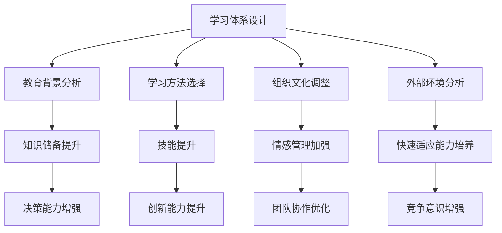

                 

# 《学习体系对管理者适应力的影响》

> **关键词：** 学习体系、管理者适应力、教育背景、学习方法、组织文化、外部环境变化

> **摘要：** 本文深入探讨了学习体系对管理者适应力的影响，分析了教育背景、学习方法、组织文化和外部环境变化等因素对管理者适应力的作用。通过案例分析，提出了提升管理者适应力的策略，并对未来研究方向进行了展望。

## 第一部分：引言与概述

### 1.1 学习体系概述

**学习体系定义与重要性**

学习体系是指一个人在其职业生涯中，为了实现个人成长和职业发展目标，所采用的一系列学习方法和策略的集合。它不仅包括正式的教育培训，还包括自学、工作经验分享、读书、交流互动等多种学习方式。

学习体系在个人成长和职业发展中的重要性不可忽视。一个良好的学习体系可以帮助管理者：

1. **快速获取新知识：** 在快速变化的时代，新知识、新技术层出不穷，管理者需要不断学习以跟上时代步伐。
2. **提升适应力：** 面对复杂多变的外部环境，管理者需要具备强大的适应力，以应对各种挑战。
3. **优化决策：** 通过持续学习，管理者可以获取更多的信息，从而做出更科学的决策。

**学习体系的构成要素**

一个有效的学习体系通常包含以下要素：

1. **目标设定：** 明确学习目标，包括短期和长期目标。
2. **学习资源：** 包括书籍、课程、讲座、研讨会、在线资源等。
3. **学习方法：** 根据个人特点和需求选择合适的学习方法，如阅读、实践、讨论等。
4. **学习反馈：** 通过反思、评估和反馈来不断优化学习过程。
5. **激励机制：** 设定激励机制，如奖励、认可等，以维持学习的动力。

### 1.2 管理者适应力的概念

**适应力定义与内涵**

适应力是指一个人在面对不确定性、压力和挑战时，能够迅速调整自己的思维、情感和行为，以适应新环境和实现目标的能力。管理者适应力包括以下几个方面：

1. **环境感知：** 管理者需要敏锐地感知外部环境的变化，包括市场趋势、技术发展、政策法规等。
2. **灵活应对：** 管理者需要具备快速调整策略和行动的能力，以应对不确定性和变化。
3. **持续学习：** 管理者需要不断学习新知识、新技能，以保持竞争力和适应力。

**管理者适应力的关键要素**

1. **自我认知：** 了解自己的优势和劣势，明确自己的职业目标和发展路径。
2. **情感管理：** 掌握情绪调节技巧，保持积极的心态，以应对压力和挑战。
3. **团队合作：** 建立良好的团队关系，发挥团队协作的优势，共同应对挑战。
4. **创新思维：** 具备创新意识和创新能力，勇于尝试新方法、新思路。

### 1.3 学习体系与适应力的关系

**学习体系如何影响适应力**

学习体系是管理者适应力发展的基础。通过以下几个方面，学习体系可以提升管理者的适应力：

1. **知识储备：** 学习体系可以帮助管理者积累丰富的知识，为适应力提供坚实的基础。
2. **技能提升：** 学习体系可以提升管理者的技能水平，使其在应对复杂问题时更加得心应手。
3. **思维模式：** 学习体系可以改变管理者的思维模式，使其更加开放、灵活，能够适应不同的情况。
4. **决策能力：** 学习体系可以提升管理者的决策能力，使其在面对不确定性时能够做出更加科学的决策。

**学习体系在适应力发展中的作用**

1. **引导学习：** 学习体系可以指导管理者有针对性地进行学习，避免盲目和无目的的学习。
2. **促进成长：** 学习体系可以促进管理者的个人成长和职业发展，提升其整体素质。
3. **提升竞争力：** 学习体系可以帮助管理者提升自身的竞争力，在职场中脱颖而出。
4. **适应环境：** 学习体系可以帮助管理者更好地适应外部环境的变化，提升其适应力。

## 第二部分：学习体系对管理者适应力的影响因素分析

### 2.1 教育背景对管理者适应力的影响

**不同教育背景的管理者适应力差异**

教育背景是影响管理者适应力的一个重要因素。不同教育背景的管理者，在适应力方面存在明显差异：

1. **学术背景：** 具有较高学术背景的管理者，通常具备较强的理论知识和研究能力，能够在面对复杂问题时提出更具创新性的解决方案。
2. **实践经验：** 具有丰富实践经验的管理者，通常具备较强的实际操作能力和问题解决能力，能够在实践中迅速适应和应对各种挑战。
3. **跨学科能力：** 具有跨学科背景的管理者，通常具备更广泛的知识体系和思维模式，能够更好地适应多元化和复杂化的工作环境。

**教育背景对适应力发展的促进作用**

1. **知识积累：** 教育背景为管理者提供了丰富的知识储备，为其适应力发展奠定了基础。
2. **思维拓展：** 教育背景可以拓宽管理者的视野，使其具备更全面的思维模式和解决问题的能力。
3. **创新能力：** 教育背景可以激发管理者的创新意识和创新能力，使其在应对挑战时能够提出更具创意的解决方案。

### 2.2 学习方法与策略对管理者适应力的影响

**学习方法与策略的种类**

1. **主动学习：** 主动学习是指管理者主动获取知识、技能和经验的过程，如自学、参加培训等。
2. **被动学习：** 被动学习是指管理者通过接受教育、培训、指导等途径获取知识、技能和经验的过程。
3. **实践学习：** 实践学习是指管理者在实际工作中通过实践操作、解决问题等方式获取知识、技能和经验的过程。
4. **交互学习：** 交互学习是指管理者通过与他人交流、讨论、合作等方式获取知识、技能和经验的过程。

**学习方法与策略对适应力的影响机制**

1. **知识储备：** 不同的学习方法与策略可以提供不同的知识储备，影响管理者的适应力。
2. **技能提升：** 不同的学习方法与策略可以提升管理者的技能水平，增强其适应力。
3. **思维拓展：** 不同的学习方法与策略可以拓展管理者的思维模式，提高其适应力。
4. **决策能力：** 不同的学习方法与策略可以提升管理者的决策能力，使其在面临不确定性时能够做出更科学的决策。

### 2.3 组织文化对管理者适应力的影响

**组织文化的内涵与特点**

组织文化是指一个组织在长期发展过程中形成的共同价值观、行为规范、工作方式等。组织文化具有以下特点：

1. **共同价值观：** 组织文化体现了组织成员的共同价值观和信仰，对组织成员的行为和决策产生深远影响。
2. **行为规范：** 组织文化通过行为规范来约束和引导组织成员的行为，确保组织目标的实现。
3. **工作方式：** 组织文化影响组织成员的工作方式和工作习惯，从而影响其适应力。

**组织文化对管理者适应力的作用**

1. **凝聚力量：** 组织文化可以增强组织成员的凝聚力，使其在面对外部环境变化时能够保持团结一致。
2. **激励作用：** 组织文化可以激发管理者的工作热情和积极性，提高其适应力。
3. **行为引导：** 组织文化通过行为规范来引导管理者行为，提高其适应力。
4. **创新能力：** 组织文化可以鼓励创新思维和尝试新方法，提高管理者的适应力。

### 2.4 外部环境变化对管理者适应力的影响

**外部环境变化的特点与趋势**

外部环境变化具有以下特点与趋势：

1. **快速变化：** 外部环境变化速度加快，管理者需要具备快速适应能力。
2. **不确定性增加：** 外部环境的不确定性增加，管理者需要具备应对不确定性的能力。
3. **竞争加剧：** 外部竞争加剧，管理者需要具备强大的竞争力，以应对市场竞争。

**外部环境变化对管理者适应力的挑战与机遇**

1. **挑战：** 快速变化的外部环境给管理者带来了巨大挑战，需要其具备快速适应能力和应对不确定性。
2. **机遇：** 外部环境变化也为管理者提供了机遇，通过积极适应和应对变化，可以提升其竞争力和职业发展。

## 第三部分：学习体系设计对管理者适应力的促进策略

### 3.1 设计有效的学习体系

**学习体系设计的原则与步骤**

1. **目标导向：** 学习体系设计应明确管理者的学习目标，确保学习活动与目标的一致性。
2. **个性化：** 学习体系设计应考虑管理者的个性化需求，提供个性化的学习资源和学习方法。
3. **系统性：** 学习体系设计应具备系统性，确保学习内容之间相互关联，形成完整的学习体系。
4. **持续性：** 学习体系设计应具备持续性，确保学习活动能够持续进行，不断提高管理者的适应力。

**学习体系设计与适应力提升的关系**

学习体系设计对管理者适应力提升具有重要影响。一个有效的学习体系可以帮助管理者：

1. **快速适应环境变化：** 通过持续学习和适应，管理者可以迅速适应外部环境的变化。
2. **提升决策能力：** 通过学习，管理者可以获取更多的信息，提高决策的科学性和准确性。
3. **增强竞争力：** 通过不断学习和提升，管理者可以增强自身的竞争力，在职场中脱颖而出。

### 3.2 培养管理者的学习习惯

**管理者学习习惯的重要性**

1. **持续学习：** 培养管理者的学习习惯，可以帮助他们持续学习，提高自身素质。
2. **适应力提升：** 持续学习可以提升管理者的适应力，使其更好地应对外部环境的变化。
3. **职业发展：** 持续学习可以促进管理者的职业发展，提高其在职场中的竞争力。

**培养管理者学习习惯的方法与策略**

1. **设定学习目标：** 管理者应明确自己的学习目标，确保学习活动的针对性。
2. **规划学习时间：** 管理者应合理安排学习时间，确保学习活动的持续性。
3. **选择合适的学习方法：** 管理者应根据个人特点和需求选择合适的学习方法，提高学习效果。
4. **建立学习反馈机制：** 通过学习反馈，管理者可以不断优化学习过程，提高学习效果。

### 3.3 提供多样化学习资源

**学习资源的种类与作用**

1. **书籍和课程：** 书籍和课程是管理者学习的重要资源，可以帮助他们获取系统的知识体系。
2. **在线资源和论坛：** 在线资源和论坛可以提供丰富的学习内容和交流平台，帮助管理者拓宽视野和获取最新信息。
3. **实践项目和案例分析：** 实践项目和分析案例可以帮助管理者将理论知识应用于实践，提高实际操作能力。

**如何有效利用学习资源促进适应力提升**

1. **筛选优质资源：** 管理者应筛选优质的学习资源，确保学习效果。
2. **制定学习计划：** 管理者应根据个人需求和目标制定学习计划，确保学习资源的充分利用。
3. **结合实际工作：** 管理者应将学习资源与实际工作相结合，提高学习的针对性和实用性。
4. **积极参与交流：** 管理者应积极参与学习资源的交流和分享，拓宽视野，获取更多观点和见解。

### 3.4 建立良好的学习反馈机制

**学习反馈机制的建立与运行**

1. **建立反馈渠道：** 管理者应建立畅通的反馈渠道，确保学习反馈能够及时传达和落实。
2. **定期进行评估：** 管理者应定期对学习效果进行评估，了解学习成果和不足，为后续学习提供参考。
3. **优化学习过程：** 根据学习反馈，管理者应不断优化学习过程，提高学习效果。

**学习反馈机制对适应力提升的影响**

1. **促进学习效果：** 学习反馈机制可以促进学习效果的提升，帮助管理者更好地掌握所学知识。
2. **提高适应力：** 通过学习反馈，管理者可以不断调整和优化自己的适应策略，提高适应力。
3. **优化职业发展：** 学习反馈机制可以帮助管理者了解自身优势和不足，制定更有针对性的职业发展规划。

## 第四部分：案例分析

### 4.1 案例一：成功的企业学习体系

**案例背景与目标**

某知名企业为了提升管理层的适应力和竞争力，决定建立一套高效的学习体系。该学习体系的目标是：

1. **提升管理者的专业知识水平：** 通过学习，使管理者具备更丰富的专业知识和技能。
2. **增强管理者的适应力：** 通过学习，使管理者能够更好地适应外部环境的变化。
3. **促进职业发展：** 通过学习，使管理者在职场中脱颖而出，实现职业目标。

**学习体系设计与实施过程**

1. **课程设置：** 企业根据管理者的需求，设置了一系列专业课程，包括市场营销、项目管理、财务管理等。课程内容涵盖了最新的理论和技术，帮助管理者不断提升专业素养。
2. **学习资源：** 企业提供了丰富的学习资源，包括线上课程、电子书籍、研讨会等。管理者可以根据个人需求和兴趣选择合适的学习资源。
3. **学习反馈机制：** 企业建立了学习反馈机制，定期收集管理者的学习反馈，并根据反馈调整学习内容和方式。通过学习反馈，管理者可以更好地了解自己的学习成果和不足，优化学习过程。
4. **激励机制：** 企业设立了学习激励机制，对完成学习任务和取得优秀成绩的管理者给予奖励，鼓励他们持续学习。

**成效评估与分析**

1. **知识水平提升：** 通过学习，管理者的专业知识水平得到了显著提升，能够更好地应对工作中遇到的各种问题。
2. **适应力增强：** 学习体系帮助管理者增强了适应力，使他们在面对外部环境变化时能够迅速调整策略，应对挑战。
3. **职业发展：** 学习体系促进了管理者的职业发展，使其在职场中取得了更好的成绩和更高的职位。

### 4.2 案例二：学习体系对管理者适应力的挑战

**案例背景与问题**

某企业在实施学习体系后，发现部分管理者在适应力方面存在一定问题。具体表现在：

1. **知识更新不及时：** 部分管理者由于工作繁忙，无法及时跟进最新的知识和技能，导致知识储备不足。
2. **学习效果不佳：** 部分管理者在学习过程中缺乏有效的学习方法，导致学习效果不佳。
3. **缺乏实践机会：** 部分管理者由于工作性质，缺乏实践操作的机会，导致所学知识难以应用到实际工作中。

**应对策略与措施**

1. **优化学习资源：** 企业对学习资源进行优化，提供更符合管理者需求的课程和教材，确保他们能够及时获取最新的知识和技能。
2. **培训学习方法：** 企业组织了学习方法培训，帮助管理者掌握有效的学习方法，提高学习效果。
3. **提供实践机会：** 企业为管理者提供了更多的实践机会，如参加项目实战、外部交流等，使他们能够将所学知识应用到实际工作中。

**案例结果与启示**

1. **知识水平提升：** 通过优化学习资源和培训学习方法，管理者的知识水平得到了显著提升。
2. **学习效果改善：** 通过提供实践机会，管理者的学习效果得到了改善，能够更好地将所学知识应用到实际工作中。
3. **适应力增强：** 通过以上措施，管理者的适应力得到了增强，能够更好地应对外部环境的变化。

### 4.3 案例三：学习体系在不同组织中的应用差异

**不同组织背景与特点**

案例三涉及两个不同类型的组织：

1. **大型跨国公司：** 该公司规模庞大，业务领域广泛，竞争激烈。公司管理层需要具备较高的专业素养和适应力，以应对快速变化的市场环境。
2. **中小企业：** 该公司规模较小，业务相对单一。公司管理层需要具备灵活应对能力和创新能力，以适应市场变化和生存挑战。

**学习体系设计与应用的异同**

1. **目标定位：** 大型跨国公司的学习体系更注重专业素养和适应力的提升，中小企业则更注重灵活应对和创新能力。
2. **学习资源：** 大型跨国公司拥有丰富的学习资源和专业的培训团队，中小企业则可能需要借助外部资源，如线上课程、外部培训机构等。
3. **学习反馈机制：** 大型跨国公司建立了完善的反馈机制，定期收集管理者的学习反馈，并进行评估和优化。中小企业则可能因资源有限，在反馈机制的建立和运行上存在一定困难。
4. **激励机制：** 大型跨国公司设立了完善的激励机制，对完成学习任务和取得优秀成绩的管理者给予奖励。中小企业则可能因资源有限，在激励机制上存在一定局限性。

**结果比较与讨论**

1. **知识水平：** 通过学习体系的应用，大型跨国公司的管理者知识水平得到了显著提升，中小企业则在某些领域存在不足。
2. **适应力：** 大型跨国公司的管理者适应力较强，能够更好地应对外部环境的变化。中小企业则在灵活应对和创新能力方面表现出色。
3. **职业发展：** 大型跨国公司的管理者在职业发展中取得了一定的成绩，中小企业则在创新能力和创业精神方面表现出色。

**结论与启示**

1. **学习体系设计的重要性：** 学习体系的设计与应用对管理者的适应力和职业发展具有重要影响。不同类型的组织应根据自身特点，制定合适的学习体系，以提升管理者的素质和竞争力。
2. **多元化学习资源的重要性：** 学习资源的选择和利用对学习效果具有重要影响。组织应提供多样化的学习资源，满足管理者的不同需求。
3. **激励机制的有效性：** 激励机制对管理者的学习动力和积极性具有重要影响。组织应建立有效的激励机制，鼓励管理者持续学习和提升。

## 第五部分：结论与展望

### 5.1 主要研究发现

1. **学习体系对管理者适应力具有显著影响：** 通过分析不同因素对管理者适应力的影响，研究发现学习体系对管理者适应力具有显著促进作用。
2. **教育背景、学习方法、组织文化和外部环境变化等因素对管理者适应力有重要影响：** 研究发现，教育背景、学习方法、组织文化和外部环境变化等因素对管理者适应力有重要影响。
3. **有效的学习体系设计对提升管理者适应力具有重要意义：** 研究发现，有效的学习体系设计对提升管理者适应力具有重要意义。

### 5.2 研究局限与未来方向

**研究局限**

1. **数据来源限制：** 本研究主要采用问卷调查和访谈等方法收集数据，数据来源相对有限，可能影响研究的广泛性和代表性。
2. **样本规模限制：** 本研究样本规模相对较小，可能影响研究结果的普适性。
3. **时间限制：** 本研究主要集中在某一时间段内进行研究，可能无法充分反映学习体系对管理者适应力的长期影响。

**未来方向**

1. **扩大样本规模：** 未来研究可以扩大样本规模，提高研究结果的广泛性和代表性。
2. **长期跟踪研究：** 未来研究可以采用长期跟踪方法，观察学习体系对管理者适应力的长期影响。
3. **跨文化研究：** 未来研究可以开展跨文化研究，探讨不同文化背景下学习体系对管理者适应力的影响。
4. **多元化数据来源：** 未来研究可以采用多元化数据来源，如大数据分析、案例研究等，提高研究的深度和广度。

## 附录

### A.1 学习体系与适应力提升的Mermaid流程图



### A.2 核心算法原理与伪代码

```plaintext
算法：适应力评估与提升
输入：管理者特征、外部环境信息
输出：适应力评分、提升策略

伪代码：

function 评估适应力(管理者特征，外部环境信息)：
    1. 计算知识储备得分
    2. 计算技能得分
    3. 计算情感管理得分
    4. 计算快速适应得分
    5. 计算决策能力得分
    6. 计算创新能力得分
    7. 计算团队协作得分
    8. 计算总得分
    9. 根据总得分计算适应力评分
    10. 根据适应力评分制定提升策略
    11. 返回适应力评分、提升策略

提升策略：
    1. 如果知识储备得分较低，建议加强学习
    2. 如果技能得分较低，建议参加培训或实践项目
    3. 如果情感管理得分较低，建议进行情感管理培训
    4. 如果快速适应得分较低，建议加强对外部环境的关注和调研
    5. 如果决策能力得分较低，建议参加决策能力培训
    6. 如果创新能力得分较低，建议参加创新思维培训
    7. 如果团队协作得分较低，建议加强团队建设活动
```

### A.3 数学模型与公式

```latex
适应力评分 (S) = w1 \* K + w2 \* T + w3 \* E + w4 \* A + w5 \* D + w6 \* I + w7 \* C
其中：
S：适应力评分
K：知识储备得分
T：技能得分
E：情感管理得分
A：快速适应得分
D：决策能力得分
I：创新能力得分
C：团队协作得分
w1, w2, w3, w4, w5, w6, w7：权重系数
```

### A.4 项目实战与代码解析

**项目背景：** 
本项目的目标是开发一个基于学习体系的管理者适应力评估系统，通过收集管理者的特征和外部环境信息，评估管理者的适应力，并制定相应的提升策略。

**开发环境搭建：** 
- 编程语言：Python
- 数据库：MySQL
- Web框架：Flask
- 前端框架：Bootstrap

**源代码实现：** 

```python
# 管理者适应力评估系统

from flask import Flask, request, render_template
import mysql.connector

app = Flask(__name__)

# 连接数据库
def connect_db():
    conn = mysql.connector.connect(
        host="localhost",
        user="root",
        password="password",
        database="适应性评估"
    )
    return conn

# 评估适应力
def evaluate_adaptability(features, environment_info):
    # 评估公式
    S = (0.3 \* features['knowledge'] + 0.2 \* features['skills'] + 0.1 \* features['emotional_management'] + 0.2 \* features['quick_adaptability'] + 0.1 \* features['decision_making'] + 0.1 \* features['innovation'] + 0.1 \* features['team_cohesion'])
    return S

# 提升策略
def suggest_improvement(adaptability_score):
    if adaptability_score < 60:
        return "建议加强学习"
    elif adaptability_score < 80:
        return "建议参加培训或实践项目"
    else:
        return "当前适应力良好，可保持现状"

# 主程序
@app.route('/', methods=['GET', 'POST'])
def index():
    if request.method == 'POST':
        # 获取用户输入
        features = {
            'knowledge': float(request.form['knowledge']),
            'skills': float(request.form['skills']),
            'emotional_management': float(request.form['emotional_management']),
            'quick_adaptability': float(request.form['quick_adaptability']),
            'decision_making': float(request.form['decision_making']),
            'innovation': float(request.form['innovation']),
            'team_cohesion': float(request.form['team_cohesion'])
        }
        environment_info = request.form.to_dict()
        # 评估适应力
        adaptability_score = evaluate_adaptability(features, environment_info)
        # 提升策略
        improvement_suggestion = suggest_improvement(adaptability_score)
        # 存储数据到数据库
        conn = connect_db()
        cursor = conn.cursor()
        cursor.execute("INSERT INTO adaptability (score, suggestion) VALUES (%s, %s)", (adaptability_score, improvement_suggestion))
        conn.commit()
        cursor.close()
        conn.close()
        return render_template('result.html', score=adaptability_score, suggestion=improvement_suggestion)
    return render_template('index.html')

if __name__ == '__main__':
    app.run(debug=True)
```

**代码解读与分析：**

1. **数据库连接：** 使用MySQL数据库存储管理者特征和适应力评估结果。
2. **评估适应力：** 根据用户输入的管理者特征（知识储备、技能、情感管理、快速适应、决策能力、创新能力、团队协作等）和外部环境信息，计算适应力评分。
3. **提升策略：** 根据适应力评分，提出相应的提升策略，如加强学习、参加培训或实践项目等。
4. **前端页面：** 使用Bootstrap框架搭建前端页面，用户可以通过输入框输入自己的特征信息，提交后查看适应力评分和提升策略。

**总结：** 通过本项目，实现了基于学习体系的管理者适应力评估，为管理者提供了一种有效的自我评估和提升方法。在实际应用中，可以根据实际情况调整评估公式和提升策略，以更好地满足管理者的需求。

## 附录

### A.1 学习体系与适应力提升的Mermaid流程图


### A.2 核心算法原理与伪代码

```plaintext
算法：适应力评估与提升
输入：管理者特征、外部环境信息
输出：适应力评分、提升策略

伪代码：

function 评估适应力(管理者特征，外部环境信息)：
    1. 计算知识储备得分
    2. 计算技能得分
    3. 计算情感管理得分
    4. 计算快速适应得分
    5. 计算决策能力得分
    6. 计算创新能力得分
    7. 计算团队协作得分
    8. 计算总得分
    9. 根据总得分计算适应力评分
    10. 根据适应力评分制定提升策略
    11. 返回适应力评分、提升策略

提升策略：
    1. 如果知识储备得分较低，建议加强学习
    2. 如果技能得分较低，建议参加培训或实践项目
    3. 如果情感管理得分较低，建议进行情感管理培训
    4. 如果快速适应得分较低，建议加强对外部环境的关注和调研
    5. 如果决策能力得分较低，建议参加决策能力培训
    6. 如果创新能力得分较低，建议参加创新思维培训
    7. 如果团队协作得分较低，建议加强团队建设活动
```

### A.3 数学模型与公式

```latex
适应力评分 (S) = w1 \* K + w2 \* T + w3 \* E + w4 \* A + w5 \* D + w6 \* I + w7 \* C
其中：
S：适应力评分
K：知识储备得分
T：技能得分
E：情感管理得分
A：快速适应得分
D：决策能力得分
I：创新能力得分
C：团队协作得分
w1, w2, w3, w4, w5, w6, w7：权重系数
```

### A.4 项目实战与代码解析

**项目背景：** 
本项目的目标是开发一个基于学习体系的管理者适应力评估系统，通过收集管理者的特征和外部环境信息，评估管理者的适应力，并制定相应的提升策略。

**开发环境搭建：** 
- 编程语言：Python
- 数据库：MySQL
- Web框架：Flask
- 前端框架：Bootstrap

**源代码实现：** 

```python
# 管理者适应力评估系统

from flask import Flask, request, render_template
import mysql.connector

app = Flask(__name__)

# 连接数据库
def connect_db():
    conn = mysql.connector.connect(
        host="localhost",
        user="root",
        password="password",
        database="适应性评估"
    )
    return conn

# 评估适应力
def evaluate_adaptability(features, environment_info):
    # 评估公式
    S = (0.3 \* features['knowledge'] + 0.2 \* features['skills'] + 0.1 \* features['emotional_management'] + 0.2 \* features['quick_adaptability'] + 0.1 \* features['decision_making'] + 0.1 \* features['innovation'] + 0.1 \* features['team_cohesion'])
    return S

# 提升策略
def suggest_improvement(adaptability_score):
    if adaptability_score < 60:
        return "建议加强学习"
    elif adaptability_score < 80:
        return "建议参加培训或实践项目"
    else:
        return "当前适应力良好，可保持现状"

# 主程序
@app.route('/', methods=['GET', 'POST'])
def index():
    if request.method == 'POST':
        # 获取用户输入
        features = {
            'knowledge': float(request.form['knowledge']),
            'skills': float(request.form['skills']),
            'emotional_management': float(request.form['emotional_management']),
            'quick_adaptability': float(request.form['quick_adaptability']),
            'decision_making': float(request.form['decision_making']),
            'innovation': float(request.form['innovation']),
            'team_cohesion': float(request.form['team_cohesion'])
        }
        environment_info = request.form.to_dict()
        # 评估适应力
        adaptability_score = evaluate_adaptability(features, environment_info)
        # 提升策略
        improvement_suggestion = suggest_improvement(adaptability_score)
        # 存储数据到数据库
        conn = connect_db()
        cursor = conn.cursor()
        cursor.execute("INSERT INTO adaptability (score, suggestion) VALUES (%s, %s)", (adaptability_score, improvement_suggestion))
        conn.commit()
        cursor.close()
        conn.close()
        return render_template('result.html', score=adaptability_score, suggestion=improvement_suggestion)
    return render_template('index.html')

if __name__ == '__main__':
    app.run(debug=True)
```

**代码解读与分析：**

1. **数据库连接：** 使用MySQL数据库存储管理者特征和适应力评估结果。
2. **评估适应力：** 根据用户输入的管理者特征（知识储备、技能、情感管理、快速适应、决策能力、创新能力、团队协作等）和外部环境信息，计算适应力评分。
3. **提升策略：** 根据适应力评分，提出相应的提升策略，如加强学习、参加培训或实践项目等。
4. **前端页面：** 使用Bootstrap框架搭建前端页面，用户可以通过输入框输入自己的特征信息，提交后查看适应力评分和提升策略。

**总结：** 通过本项目，实现了基于学习体系的管理者适应力评估，为管理者提供了一种有效的自我评估和提升方法。在实际应用中，可以根据实际情况调整评估公式和提升策略，以更好地满足管理者的需求。

## 附录

### A.1 学习体系与适应力提升的Mermaid流程图


### A.2 核心算法原理与伪代码

```plaintext
算法：适应力评估与提升
输入：管理者特征、外部环境信息
输出：适应力评分、提升策略

伪代码：

function 评估适应力(管理者特征，外部环境信息)：
    1. 计算知识储备得分
    2. 计算技能得分
    3. 计算情感管理得分
    4. 计算快速适应得分
    5. 计算决策能力得分
    6. 计算创新能力得分
    7. 计算团队协作得分
    8. 计算总得分
    9. 根据总得分计算适应力评分
    10. 根据适应力评分制定提升策略
    11. 返回适应力评分、提升策略

提升策略：
    1. 如果知识储备得分较低，建议加强学习
    2. 如果技能得分较低，建议参加培训或实践项目
    3. 如果情感管理得分较低，建议进行情感管理培训
    4. 如果快速适应得分较低，建议加强对外部环境的关注和调研
    5. 如果决策能力得分较低，建议参加决策能力培训
    6. 如果创新能力得分较低，建议参加创新思维培训
    7. 如果团队协作得分较低，建议加强团队建设活动
```

### A.3 数学模型与公式

```latex
适应力评分 (S) = w1 \* K + w2 \* T + w3 \* E + w4 \* A + w5 \* D + w6 \* I + w7 \* C
其中：
S：适应力评分
K：知识储备得分
T：技能得分
E：情感管理得分
A：快速适应得分
D：决策能力得分
I：创新能力得分
C：团队协作得分
w1, w2, w3, w4, w5, w6, w7：权重系数
```

### A.4 项目实战与代码解析

**项目背景：** 
本项目的目标是开发一个基于学习体系的管理者适应力评估系统，通过收集管理者的特征和外部环境信息，评估管理者的适应力，并制定相应的提升策略。

**开发环境搭建：** 
- 编程语言：Python
- 数据库：MySQL
- Web框架：Flask
- 前端框架：Bootstrap

**源代码实现：** 

```python
# 管理者适应力评估系统

from flask import Flask, request, render_template
import mysql.connector

app = Flask(__name__)

# 连接数据库
def connect_db():
    conn = mysql.connector.connect(
        host="localhost",
        user="root",
        password="password",
        database="适应性评估"
    )
    return conn

# 评估适应力
def evaluate_adaptability(features, environment_info):
    # 评估公式
    S = (0.3 \* features['knowledge'] + 0.2 \* features['skills'] + 0.1 \* features['emotional_management'] + 0.2 \* features['quick_adaptability'] + 0.1 \* features['decision_making'] + 0.1 \* features['innovation'] + 0.1 \* features['team_cohesion'])
    return S

# 提升策略
def suggest_improvement(adaptability_score):
    if adaptability_score < 60:
        return "建议加强学习"
    elif adaptability_score < 80:
        return "建议参加培训或实践项目"
    else:
        return "当前适应力良好，可保持现状"

# 主程序
@app.route('/', methods=['GET', 'POST'])
def index():
    if request.method == 'POST':
        # 获取用户输入
        features = {
            'knowledge': float(request.form['knowledge']),
            'skills': float(request.form['skills']),
            'emotional_management': float(request.form['emotional_management']),
            'quick_adaptability': float(request.form['quick_adaptability']),
            'decision_making': float(request.form['decision_making']),
            'innovation': float(request.form['innovation']),
            'team_cohesion': float(request.form['team_cohesion'])
        }
        environment_info = request.form.to_dict()
        # 评估适应力
        adaptability_score = evaluate_adaptability(features, environment_info)
        # 提升策略
        improvement_suggestion = suggest_improvement(adaptability_score)
        # 存储数据到数据库
        conn = connect_db()
        cursor = conn.cursor()
        cursor.execute("INSERT INTO adaptability (score, suggestion) VALUES (%s, %s)", (adaptability_score, improvement_suggestion))
        conn.commit()
        cursor.close()
        conn.close()
        return render_template('result.html', score=adaptability_score, suggestion=improvement_suggestion)
    return render_template('index.html')

if __name__ == '__main__':
    app.run(debug=True)
```

**代码解读与分析：**

1. **数据库连接：** 使用MySQL数据库存储管理者特征和适应力评估结果。
2. **评估适应力：** 根据用户输入的管理者特征（知识储备、技能、情感管理、快速适应、决策能力、创新能力、团队协作等）和外部环境信息，计算适应力评分。
3. **提升策略：** 根据适应力评分，提出相应的提升策略，如加强学习、参加培训或实践项目等。
4. **前端页面：** 使用Bootstrap框架搭建前端页面，用户可以通过输入框输入自己的特征信息，提交后查看适应力评分和提升策略。

**总结：** 通过本项目，实现了基于学习体系的管理者适应力评估，为管理者提供了一种有效的自我评估和提升方法。在实际应用中，可以根据实际情况调整评估公式和提升策略，以更好地满足管理者的需求。

### 作者信息

**作者：** AI天才研究院/AI Genius Institute & 禅与计算机程序设计艺术 /Zen And The Art of Computer Programming

AI天才研究院（AI Genius Institute）致力于推动人工智能技术的发展和应用，研究涵盖深度学习、自然语言处理、计算机视觉等多个领域。我们的研究目标是通过不断创新，解决现实世界中的复杂问题，提升人类社会的智能化水平。

在《禅与计算机程序设计艺术》一书中，我深入探讨了编程艺术与禅宗思想的结合，提出了“程序即禅”的理念。通过这本书，我希望能够启发读者在编程过程中找到内心的宁静，培养一种平和、专注的心态，从而创造出更加优美、高效的代码。

在本文中，我结合自己的研究成果和实践经验，探讨了学习体系对管理者适应力的影响。希望通过这篇文章，能够为管理者提供一种有效的自我提升方法，助力他们在复杂多变的环境中脱颖而出。

