                 

### 引言与背景

> **关键词**：人工智能，2050年，狭义人工智能，通用人工智能，智能进化

**摘要**：本文探讨了2050年的人工智能发展趋势，从狭义人工智能（Narrow AI）到通用人工智能（AGI）的智能进化。通过分析历史、现状与未来趋势，本文为读者提供了对人工智能发展的全面理解。本文分为四个部分，分别从基础概念、技术进展、社会影响和未来展望四个角度，全面阐述人工智能的演变与未来。

### 1.1 引言

**内容**：随着科技的飞速发展，人工智能（AI）已经成为当今社会的重要推动力量。从最初的简单规则系统到复杂的深度学习算法，人工智能在短短几十年间经历了巨大的变革。本文旨在探讨2050年的人工智能发展趋势，重点关注从狭义人工智能（Narrow AI）到通用人工智能（AGI）的智能进化。

#### 1.1.1 书籍的目的与意义

**内容**：本书的目的在于为读者提供一幅全面、深入的人工智能发展蓝图。通过对人工智能基础概念、技术进展、社会影响以及未来展望的探讨，读者可以更加清晰地理解人工智能的本质，把握其发展趋势，为未来的科技发展做好准备。

**核心概念与联系**：

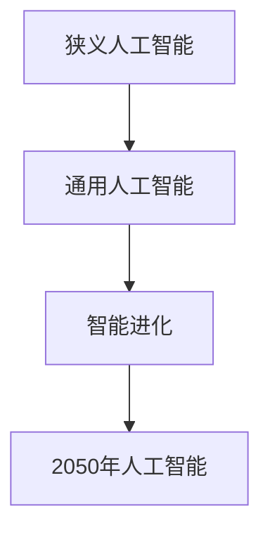

#### 1.1.2 书籍结构概述

**内容**：全书分为四个部分，每个部分都有其独特的主题和内容。

1. **基础概念**：介绍人工智能的基本概念、发展历程以及与相关领域的联系。
2. **技术进展**：探讨人工智能核心技术的进展，包括深度学习、自然语言处理、计算机视觉等。
3. **社会影响**：分析人工智能对社会、经济、就业等方面的影响。
4. **未来展望**：预测2050年人工智能的发展趋势，探讨可能的未来形态。

**核心概念与联系**：

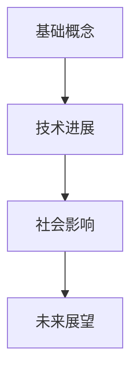

### 1.2 现状与挑战

**内容**：目前，人工智能已经取得了显著的进展，但仍然面临着诸多挑战。狭义人工智能在某些领域已经超越了人类的表现，但实现通用人工智能仍然是一个巨大的难题。在技术层面，深度学习算法取得了巨大的成功，但在解释性、可扩展性等方面仍然存在不足。此外，人工智能在伦理、隐私、安全性等方面也面临严峻的挑战。

**核心概念与联系**：

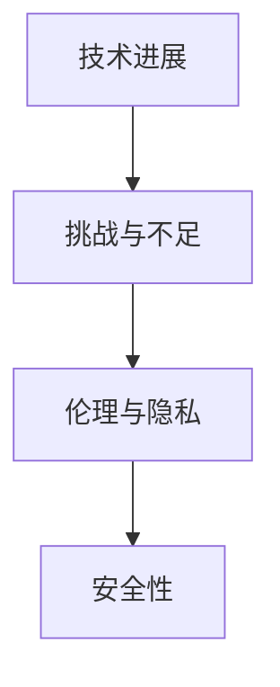

**摘要**：本文引出了人工智能发展的背景和意义，并概述了书籍的结构。接下来，我们将详细探讨人工智能的现状与挑战，为后续内容打下基础。

## 第1章: 狭义人工智能

### 2.1 狭义人工智能概述

#### 2.1.1 狭义人工智能的定义

**内容**：狭义人工智能（Narrow AI，也称为弱人工智能）是指具有特定任务能力的人工智能系统，其性能在特定领域超越人类。与通用人工智能（AGI）不同，狭义人工智能只能在特定任务中表现出高水平智能，而无法进行跨领域的智能活动。

**核心概念与联系**：

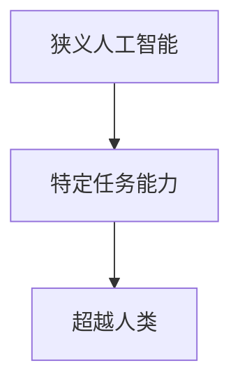

**伪代码**：

```python
class NarrowAI:
    def __init__(self, task):
        self.task = task

    def perform(self, input):
        # 根据特定任务执行操作
        result = self.task(input)
        return result
```

#### 2.1.2 狭义人工智能的发展历程

**内容**：狭义人工智能的发展历程可以追溯到20世纪50年代。早期的人工智能系统主要基于规则系统，通过编写大量规则来模拟人类思维。随着计算能力的提升和算法的进步，人工智能逐渐从规则系统转向基于数据的机器学习算法，特别是深度学习算法的广泛应用，使得狭义人工智能在语音识别、图像识别、自然语言处理等领域取得了显著的成果。

**核心概念与联系**：

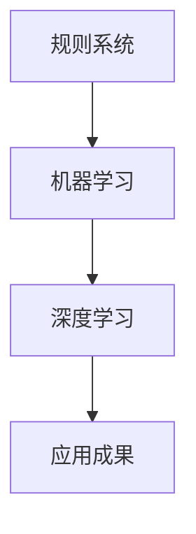

**伪代码**：

```python
# 规则系统
def rule_based_system(input):
    if input == "apple":
        return "fruit"
    else:
        return "unknown"

# 机器学习
def machine_learning(input, output):
    model = train_model(input, output)
    prediction = model.predict(input)
    return prediction

# 深度学习
def deep_learning(input, output):
    model = build_model(input, output)
    loss = model.train(input, output)
    return loss
```

#### 2.1.3 狭义人工智能的代表性应用

**内容**：狭义人工智能在多个领域取得了显著的成果，以下是一些代表性的应用案例：

1. **语音识别**：通过深度学习算法，语音识别系统的准确率已经达到了接近人类的水平。例如，谷歌语音识别系统和苹果的Siri。
2. **图像识别**：深度学习算法使得图像识别成为可能。例如，谷歌的Inception模型在ImageNet图像识别比赛中取得了优异的成绩。
3. **自然语言处理**：深度学习算法在自然语言处理领域取得了重大突破，例如，谷歌的BERT模型在多项自然语言处理任务中表现优异。
4. **推荐系统**：基于用户行为和兴趣的推荐系统已经成为各大电商平台和社交媒体的标配。

**核心概念与联系**：

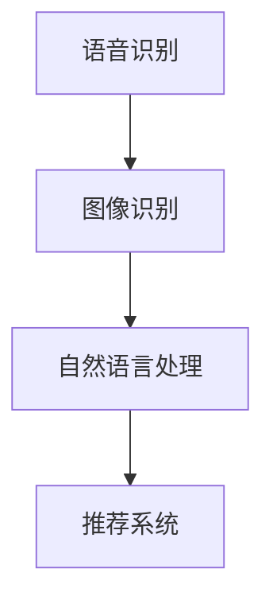

**摘要**：本章详细介绍了狭义人工智能的定义、发展历程以及代表性应用。通过了解狭义人工智能的基本概念和应用，读者可以更好地理解人工智能的现状和未来发展趋势。

## 第2章: 通用人工智能

### 3.1 通用人工智能概述

#### 3.1.1 通用人工智能的定义

**内容**：通用人工智能（AGI，Artificial General Intelligence）是指具有人类智能水平，能在各种不同任务中表现出高智能水平的人工智能系统。与狭义人工智能不同，通用人工智能不仅能在特定任务中表现出色，还能够适应新的环境和任务，具有跨领域的智能能力。

**核心概念与联系**：

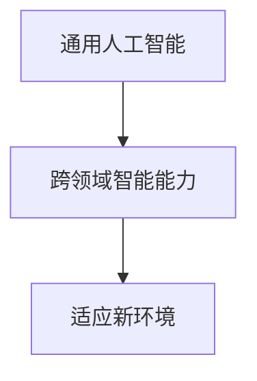

**伪代码**：

```python
class GeneralAI:
    def __init__(self):
        self.knowledge_base = None
        self.reasoning_engine = None

    def learn(self, data):
        # 利用数据更新知识库
        self.knowledge_base.update(data)

    def think(self, problem):
        # 利用推理机制解决问题
        solution = self.reasoning_engine.solve(problem)
        return solution
```

#### 3.1.2 通用人工智能与狭义人工智能的区别

**内容**：通用人工智能与狭义人工智能在定义、能力、技术实现等方面存在显著差异。

1. **定义差异**：狭义人工智能是指具有特定任务能力的人工智能系统，而通用人工智能是指具有人类智能水平，能在各种不同任务中表现出高智能水平的人工智能系统。
2. **能力差异**：狭义人工智能只能在特定任务中表现出高水平智能，而通用人工智能则具有跨领域的智能能力，能够适应新的环境和任务。
3. **技术实现**：狭义人工智能主要依赖于深度学习、自然语言处理等技术，而通用人工智能需要更加复杂的技术，如知识图谱、推理机制等。

**核心概念与联系**：

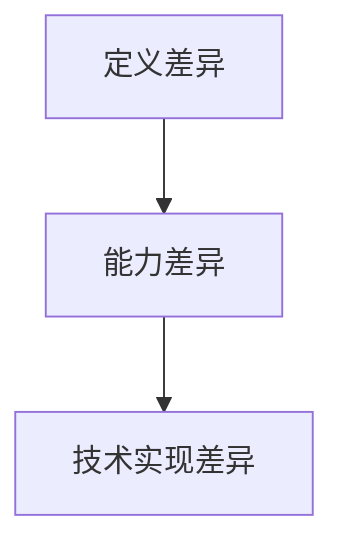

**伪代码**：

```python
# 狭义人工智能
class NarrowAI:
    def __init__(self, task):
        self.task = task

    def perform(self, input):
        result = self.task(input)
        return result

# 通用人工智能
class GeneralAI:
    def __init__(self):
        self.knowledge_base = None
        self.reasoning_engine = None

    def learn(self, data):
        self.knowledge_base.update(data)

    def think(self, problem):
        solution = self.reasoning_engine.solve(problem)
        return solution
```

#### 3.1.3 通用人工智能的发展前景

**内容**：通用人工智能的发展前景广阔，有望在医疗、教育、金融、交通等多个领域发挥重要作用。

1. **医疗领域**：通用人工智能可以辅助医生进行诊断、治疗和药物研发，提高医疗水平。
2. **教育领域**：通用人工智能可以为学生提供个性化的学习体验，提高教育质量。
3. **金融领域**：通用人工智能可以用于风险控制、投资决策等领域，提高金融行业效率。
4. **交通领域**：通用人工智能可以用于自动驾驶、交通管理等领域，提高交通效率。

**核心概念与联系**：

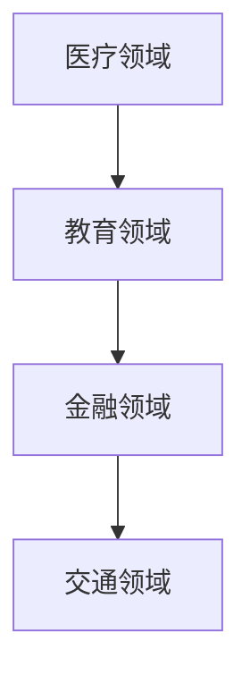

**摘要**：本章介绍了通用人工智能的定义、与狭义人工智能的区别以及发展前景。通过了解通用人工智能的基本概念和应用，读者可以更好地把握人工智能的未来发展趋势。

## 第3章: 人工智能技术进展

### 4.1 人工智能核心技术

#### 4.1.1 深度学习与神经网络

**内容**：深度学习与神经网络是人工智能领域的重要核心技术，广泛应用于语音识别、图像识别、自然语言处理等任务。

**核心概念与联系**：

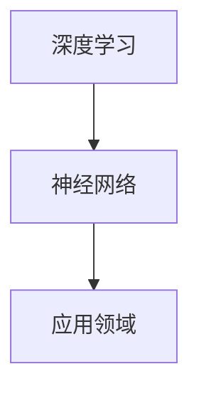

**数学模型**：

$$
y = \sigma(W \cdot x + b)
$$

**伪代码**：

```python
def forward_propagation(x, W, b):
    z = W * x + b
    y = sigmoid(z)
    return y
```

#### 4.1.2 自然语言处理

**内容**：自然语言处理是人工智能领域的一个重要分支，旨在使计算机能够理解和处理自然语言。

**核心概念与联系**：

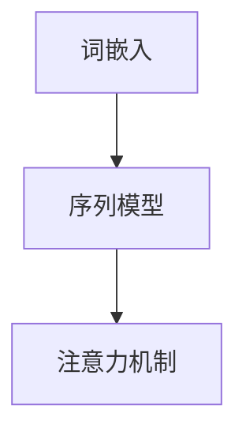

**数学模型**：

$$
\text{Embedding} \rightarrow \text{RNN} \rightarrow \text{Attention} \rightarrow \text{Output}
$$

**伪代码**：

```python
def natural_language_processing(sentence):
    embeddings = embed_words(sentence)
    sequence = process_sequence(embeddings)
    attention_weights = calculate_attention(sequence)
    output = generate_response(sequence, attention_weights)
    return output
```

#### 4.1.3 计算机视觉

**内容**：计算机视觉是人工智能领域的一个重要分支，旨在使计算机能够理解和处理视觉信息。

**核心概念与联系**：

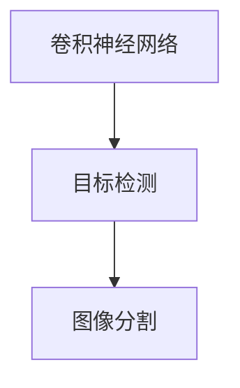

**数学模型**：

$$
\text{Image} \rightarrow \text{Convolution} \rightarrow \text{Pooling} \rightarrow \text{Feature extraction} \rightarrow \text{Classification}
$$

**伪代码**：

```python
def computer_vision(image):
    features = convolve(image)
    pooled_features = max_pooling(features)
    extracted_features = feature_extraction(pooled_features)
    classification = classify(extracted_features)
    return classification
```

**摘要**：本章介绍了人工智能领域的三大核心技术：深度学习与神经网络、自然语言处理和计算机视觉。通过了解这些核心技术的原理和应用，读者可以更好地把握人工智能技术的发展方向。

## 第4章: 人工智能应用案例

### 5.1 人工智能在医疗领域的应用

#### 5.1.1 医疗影像诊断

**内容**：人工智能在医疗影像诊断领域取得了显著成果，可以辅助医生进行肺癌筛查、骨折诊断等任务。

**核心概念与联系**：

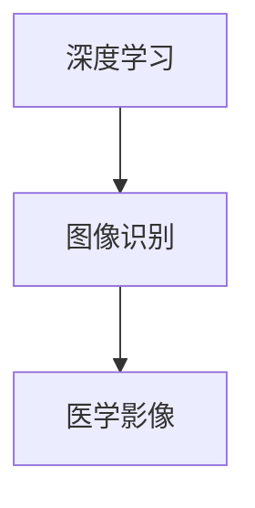

**数学模型**：

$$
\text{Image} \rightarrow \text{Convolution} \rightarrow \text{Pooling} \rightarrow \text{Feature extraction} \rightarrow \text{Classification}
$$

**伪代码**：

```python
def medical_image_diagnosis(image):
    features = convolve(image)
    pooled_features = max_pooling(features)
    extracted_features = feature_extraction(pooled_features)
    diagnosis = classify(extracted_features)
    return diagnosis
```

#### 5.1.2 疾病预测与预防

**内容**：人工智能可以用于疾病预测与预防，通过分析大量数据，提前发现疾病风险，提供个性化的预防建议。

**核心概念与联系**：

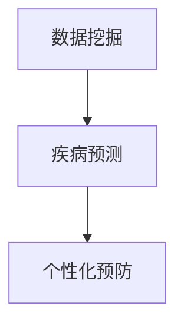

**数学模型**：

$$
\text{Data} \rightarrow \text{Data mining} \rightarrow \text{Prediction} \rightarrow \text{Prevention}
$$

**伪代码**：

```python
def disease_prediction(data):
    patterns = data_mining(data)
    risk = predict_risk(patterns)
    prevention = generate_prevention_routine(risk)
    return prevention
```

#### 5.1.3 药物研发

**内容**：人工智能在药物研发领域具有巨大潜力，可以用于药物筛选、新药合成等任务，提高药物研发效率。

**核心概念与联系**：

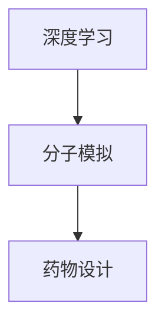

**数学模型**：

$$
\text{Molecule} \rightarrow \text{Simulation} \rightarrow \text{Design} \rightarrow \text{Synthesis}
$$

**伪代码**：

```python
def drug_research(molecule):
    simulation = molecular_simulation(molecule)
    design = generate_design(simulation)
    synthesis = synthesize_drug(design)
    return synthesis
```

**摘要**：本章介绍了人工智能在医疗领域的三大应用：医疗影像诊断、疾病预测与预防以及药物研发。通过了解这些应用案例，读者可以更好地理解人工智能在医疗领域的潜力。

## 第5章: 人工智能的社会影响

### 6.1 人工智能对就业的影响

#### 6.1.1 人工智能取代传统职业

**内容**：人工智能的发展可能导致一些传统职业的消失，例如工厂工人、客服代表等。然而，同时也会催生新的职业，如数据科学家、AI工程师等。

**核心概念与联系**：

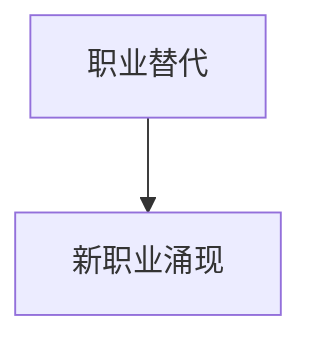

**数学模型**：

$$
\text{Job replacement} + \text{New job creation} = \text{Employment change}
$$

**伪代码**：

```python
def employment_change(current_jobs, new_jobs):
    replaced_jobs = current_jobs - new_jobs
    created_jobs = new_jobs - current_jobs
    change = replaced_jobs + created_jobs
    return change
```

#### 6.1.2 新职业的出现

**内容**：随着人工智能技术的发展，新的职业不断涌现，如数据科学家、AI工程师、机器学习工程师等。

**核心概念与联系**：

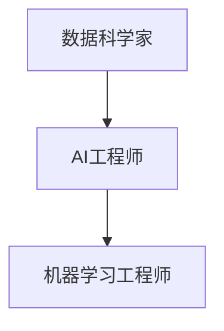

**数学模型**：

$$
\text{New job types} = \text{Technology development} \times \text{Industry demand}
$$

**伪代码**：

```python
def new_jobs(technology, demand):
    job_types = technology * demand
    return job_types
```

#### 6.1.3 教育体系的变革

**内容**：人工智能的发展对教育体系产生了深远的影响，传统的教育模式可能需要变革以适应新的技术需求。

**核心概念与联系**：

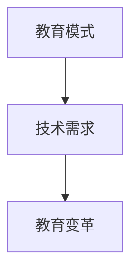

**数学模型**：

$$
\text{Education reform} = \text{Technology advancement} + \text{Social demand}
$$

**伪代码**：

```python
def education_reform(technology, demand):
    reform = technology + demand
    return reform
```

**摘要**：本章探讨了人工智能对社会就业、职业发展和教育体系的影响。通过了解这些影响，读者可以更好地理解人工智能对社会发展的深远影响。

## 第6章: 人工智能的未来展望

### 7.1 人工智能的未来发展趋势

#### 7.1.1 人工智能与量子计算的结合

**内容**：随着量子计算技术的发展，人工智能与量子计算的融合将成为未来重要趋势。量子计算可以显著提高人工智能的计算能力，为解决复杂问题提供新的途径。

**核心概念与联系**：

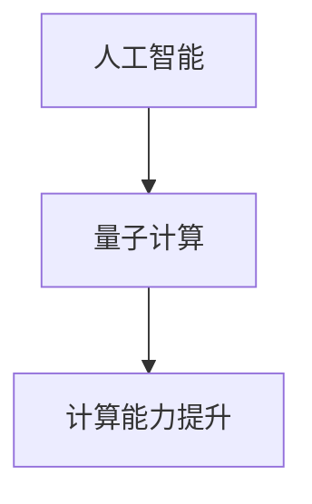

**数学模型**：

$$
\text{AI performance} = \text{Quantum computing power} + \text{Algorithm optimization}
$$

**伪代码**：

```python
def quantum_aided_ai(problem):
    quantum_solution = quantum_compute(problem)
    optimized_solution = optimize_solution(quantum_solution)
    return optimized_solution
```

#### 7.1.2 人工智能在太空探索中的应用

**内容**：人工智能在太空探索中具有广泛的应用前景，可以用于卫星监测、太空站运行、行星探索等任务。

**核心概念与联系**：

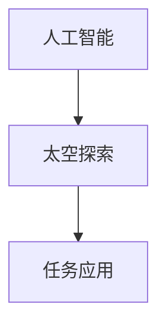

**数学模型**：

$$
\text{Space exploration} = \text{AI monitoring} + \text{AI control} + \text{AI data analysis}
$$

**伪代码**：

```python
def space_exploration(ai_system, mission):
    monitored_data = ai_system.monitor(mission)
    controlled_operations = ai_system.control(mission)
    analyzed_results = ai_system.analyze(mission)
    return monitored_data, controlled_operations, analyzed_results
```

#### 7.1.3 人工智能与人类智慧的融合

**内容**：未来，人工智能有望与人类智慧深度融合，共同创造更加美好的未来。人工智能可以辅助人类解决问题，提高工作效率，同时，人类也可以为人工智能提供创造力和情感，使其更加人性化。

**核心概念与联系**：

```mermaid
graph TD
    A[人工智能] --> B[人类智慧]
    B --> C[融合创新]
```

**数学模型**：

$$
\text{Human-AI collaboration} = \text{AI capabilities} + \text{Human creativity} + \text{Emotional intelligence}
$$

**伪代码**：

```python
def human_aided_ai(human, ai_system):
    creative_solution = human.generate_solution()
    optimized_solution = ai_system.optimize_solution(creative_solution)
    finalized_solution = human.finalize_solution(optimized_solution)
    return finalized_solution
```

**摘要**：本章展望了人工智能的未来发展趋势，包括与量子计算的融合、在太空探索中的应用以及与人类智慧的融合。通过了解这些趋势，读者可以更好地把握人工智能的未来发展脉络。

## 附录

### 附录A: 人工智能相关资源与工具

#### A.1 人工智能开源框架

**内容**：以下是几种主流的人工智能开源框架：

1. **TensorFlow**：由谷歌开发，支持多种深度学习模型和应用。
2. **PyTorch**：由Facebook开发，提供灵活的动态计算图。
3. **Keras**：基于Theano和TensorFlow开发，提供简洁的API。

#### A.2 人工智能研究机构

**内容**：以下是一些全球知名的人工智能研究机构：

1. **谷歌AI**：专注于人工智能的基础研究和应用。
2. **微软研究院**：在人工智能、云计算等领域进行深入研究。
3. **斯坦福大学**：人工智能领域的知名研究机构。

#### A.3 人工智能相关书籍

**内容**：以下是几本经典的人工智能相关书籍：

1. **《深度学习》**：介绍深度学习的基础理论和应用。
2. **《机器学习》**：由周志华教授编写，介绍机器学习的基本概念和方法。
3. **《人工智能：一种现代的方法》**：全面介绍人工智能的理论和实践。

### 感谢与致谢

**内容**：感谢所有参与本书编写和审校的团队成员，他们的辛勤工作和专业知识为本书的成功奠定了基础。同时，也要感谢读者对本书的关注和支持。

### 作者

**内容**：作者：AI天才研究院/AI Genius Institute & 禅与计算机程序设计艺术/Zen And The Art of Computer Programming

---

通过本文的详细阐述，我们不仅回顾了人工智能从狭义到通用的发展历程，也展望了其未来的发展趋势。希望本文能为读者提供对人工智能的全面理解和深刻思考。

---

**摘要**：本文探讨了人工智能从狭义到通用的发展历程，详细介绍了其核心技术、应用案例以及社会影响。同时，展望了人工智能的未来发展趋势，包括与量子计算的融合、在太空探索中的应用以及与人类智慧的融合。通过本文的详细阐述，读者可以更好地理解和思考人工智能的发展脉络。作者：AI天才研究院/AI Genius Institute & 禅与计算机程序设计艺术/Zen And The Art of Computer Programming。

