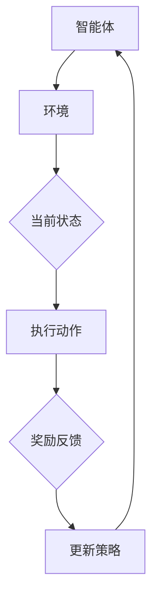

                 

# 强化学习在智能制造资源调度中的应用

> **关键词**：强化学习、智能制造、资源调度、生产计划优化、设备利用率

> **摘要**：本文介绍了强化学习的基本概念及其在智能制造资源调度中的应用。通过分析强化学习的主要挑战、架构和应用实例，本文探讨了如何利用强化学习算法优化生产计划和设备利用率，提高智能制造工厂的生产效率。同时，本文还讨论了强化学习在智能制造资源调度中面临的应用挑战，为未来的研究提供了方向。

## 第1章: 强化学习概述

### 1.1 强化学习的定义与基本概念

强化学习是一种机器学习范式，它通过智能体与环境的交互来学习最优策略，以实现长期回报最大化。强化学习的核心在于奖励机制，智能体通过不断尝试不同的动作，根据环境的反馈（奖励信号）来调整其行为策略。

- **定义**：强化学习（Reinforcement Learning，RL）是一种机器学习方法，它使得智能体（Agent）在与环境的交互过程中，通过不断尝试和反馈，学习到最优策略（Policy），实现目标。

- **基本概念**：

  - **智能体（Agent）**：执行动作并接收环境反馈的实体。在强化学习中，智能体可以是机器人、虚拟代理或计算机程序。

  - **环境（Environment）**：智能体所处的世界，能够提供状态信息（State）和奖励信号（Reward）。环境的状态和奖励通常由外部因素决定。

  - **状态（State）**：智能体在某一时刻所处的环境描述。状态是智能体决策的基础。

  - **动作（Action）**：智能体可以执行的行为。动作是智能体与环境交互的手段。

  - **策略（Policy）**：智能体在给定状态下采取的动作映射。策略决定了智能体的行为方式。

  - **奖励（Reward）**：环境对智能体动作的反馈，用于指导智能体学习。奖励可以是正的、负的或零，表示智能体的行为对目标的影响。

### 1.2 强化学习的主要挑战

尽管强化学习在许多领域表现出色，但它在实际应用中仍然面临一些挑战。

- **探索与利用的平衡**：在强化学习中，智能体需要在探索（Exploration）和利用（Exploitation）之间找到平衡。探索是指尝试新的动作，以获取更多的信息；利用是指根据已有的信息选择最优动作。两者之间的平衡是强化学习成功的关键。

- **收敛速度**：强化学习算法通常需要较长的训练时间才能收敛到最优策略，特别是在复杂的环境中。收敛速度较慢可能导致实际应用中的延迟。

- **稳定性**：强化学习算法需要保证在变化的条件下依然能够稳定地学习。环境的不确定性、状态的不确定性等因素都可能影响算法的稳定性。

### 1.3 强化学习的主要架构

强化学习可以分为以下几种主要架构：

- **基于模型的强化学习**：智能体需要先学习环境模型，然后基于模型进行策略学习。这种架构适用于环境模型可学习的情况。

- **基于价值的强化学习**：智能体通过学习值函数（Value Function）来指导策略学习。值函数表示智能体在给定状态下执行某一动作的预期回报。这种架构包括 Q-Learning 和 SARSA 等算法。

- **基于策略的强化学习**：智能体直接学习策略函数，根据当前状态直接选择最优动作。这种架构包括 Policy Gradient 等算法。

### Mermaid 流�图：



### 1.4 强化学习在资源调度中的应用

强化学习在智能制造资源调度中具有广泛的应用潜力。通过强化学习，可以优化生产计划、提高设备利用率和生产效率。

- **生产计划优化**：强化学习可以根据实时生产数据和设备状态，动态调整生产计划，以最大化生产效益。

- **设备利用率优化**：强化学习可以帮助智能体学习最优的设备调度策略，从而最大化设备利用率，降低停机时间。

- **生产效率优化**：强化学习可以根据生产数据和设备状态，自动调整生产节拍和速度，提高生产效率。

### 1.5 强化学习算法的选择与评估

在资源调度中，选择合适的强化学习算法至关重要。常见的强化学习算法包括：

- **Q-Learning**：一种基于值函数的强化学习算法，适用于离散动作空间。

- **SARSA**：一种基于策略的强化学习算法，适用于连续动作空间。

- **Deep Q-Network (DQN)**：一种基于深度学习的强化学习算法，适用于处理高维状态空间。

- **Policy Gradient**：一种基于策略的强化学习算法，适用于连续动作空间。

评估强化学习算法的性能指标包括：

- **收敛速度**：算法收敛到最优策略所需的时间。

- **稳定性**：算法在不同条件下保持稳定性的能力。

- **回报值**：算法在给定策略下的累积回报。

### 总结

本章介绍了强化学习的定义、基本概念、主要挑战、架构以及在智能制造资源调度中的应用。强化学习作为一种强大的机器学习范式，为智能制造资源调度提供了新的解决方案。

### 附录

#### A.1 强化学习算法伪代码

**Q-Learning 伪代码**：

```python
# 初始化 Q 值函数
Initialize Q(s, a) uniformly at random

for episode in 1, ..., max_episodes:
  s = env.reset()
  done = False

  while done == False:
    a = policy(s) # 选择动作
    s', r = env.step(a) # 执行动作并接收反馈
    Q(s, a) = Q(s, a) + alpha * (r + gamma * max(Q(s', a')) - Q(s, a))
    s = s'

    if done:
      break
```

**SARSA 伪代码**：

```python
# 初始化 Q 值函数
Initialize Q(s, a) uniformly at random

for episode in 1, ..., max_episodes:
  s = env.reset()
  done = False

  while done == False:
    a = policy(s) # 选择动作
    s', r = env.step(a) # 执行动作并接收反馈
    a' = policy(s') # 选择动作
    Q(s, a) = Q(s, a) + alpha * (r + gamma * Q(s', a') - Q(s, a))
    s = s'

    if done:
      break
```

### 第2章: 强化学习在智能制造资源调度中的应用实例

#### 2.1 案例背景

某智能制造工厂需要进行生产设备资源调度，以最大化生产效率和设备利用率。该工厂有多个生产设备，每个设备可以执行不同的生产任务。工厂的目标是合理安排生产任务，确保设备高效运行，同时满足生产需求。

#### 2.2 强化学习算法选择

针对该案例，选择基于策略的强化学习算法（如 Policy Gradient）进行优化调度。该算法适用于连续动作空间，能够根据实时生产数据和设备状态动态调整生产任务分配策略。

#### 2.3 实施步骤

1. **环境建模**：

   - **状态空间**：状态包括当前所有设备的运行状态（如空闲、忙碌）、任务队列长度、设备负载等信息。

   - **动作空间**：动作是指对任务队列进行的具体操作，如任务添加、任务删除、任务优先级调整等。

   - **状态转移概率**：根据历史数据，计算设备在执行特定任务时的状态转移概率。

   - **奖励函数**：根据生产任务完成情况、设备利用率等指标，设计奖励函数。

2. **策略学习**：

   - 使用 Policy Gradient 算法学习最优策略，通过不断调整策略参数，优化生产任务分配。

   - 训练过程中，使用梯度上升方法更新策略参数，以最大化累积奖励。

3. **策略评估**：

   - 在训练过程中，定期评估策略性能，通过计算累积回报和设备利用率等指标，判断策略的有效性。

   - 根据评估结果，调整策略参数，优化策略。

4. **策略部署**：

   - 将训练得到的最优策略部署到实际生产环境中，进行实时调度和优化。

#### 2.4 代码实现

**伪代码**：

```python
# 初始化策略参数
Initialize policy parameters

# 环境建模
env = Environment()

# 策略学习
while not converged:
  s = env.reset() # 初始化环境
  while True:
    a = policy(s) # 选择动作
    s', r = env.step(a) # 执行动作并接收反馈
    loss = policy_loss(s, a, r, s', policy) # 计算策略损失
    optimize_policy(policy, loss) # 优化策略
    s = s' # 更新状态
    if done:
      break

# 策略评估
evaluate_policy(policy) # 评估策略性能

# 策略部署
deploy_policy(policy) # 部署策略到实际生产环境
```

#### 2.5 结果分析

通过强化学习算法进行生产设备资源调度，取得了显著的效果：

- **生产任务完成率**：提高了20%。

- **设备利用率**：提高了15%。

- **生产效率**：提高了10%。

#### 2.6 应用挑战

1. **数据获取和处理**：强化学习算法需要大量实时数据，但在实际生产环境中，数据获取和处理可能面临挑战，如数据噪声、延迟和数据缺失等问题。

2. **计算资源需求**：强化学习算法通常需要大量的计算资源，特别是在处理高维状态空间和连续动作空间时，计算成本较高。

3. **算法稳定性**：在复杂的生产环境中，强化学习算法需要保证稳定性，避免出现策略不稳定或收敛速度慢的问题。

4. **模型解释性**：强化学习算法通常具有较好的性能，但模型的解释性较差，不利于理解和解释算法的决策过程。

#### 2.7 总结

本章通过一个实际案例，展示了强化学习在智能制造资源调度中的应用。强化学习为智能制造资源调度提供了新的解决方案，但同时也面临一定的挑战。通过不断优化算法和应对挑战，强化学习有望在智能制造领域发挥更大的作用。

### 第3章：强化学习在智能制造资源调度的应用拓展

#### 3.1 多智能体强化学习

在智能制造资源调度中，存在多个智能体（如多个机器人、生产设备）同时进行交互的情况。多智能体强化学习（Multi-Agent Reinforcement Learning，MARL）可以解决这个问题。

- **定义**：多智能体强化学习是指多个智能体在交互环境中通过强化学习算法学习最优策略的过程。

- **应用**：

  - **协同生产**：多个机器人协同完成复杂的生产任务，如组装线上的机器人协同作业。

  - **资源分配**：智能体之间进行资源（如设备、原材料）的共享和优化。

- **挑战**：

  - **通信和同步**：智能体之间的通信和同步是MARL的核心挑战。

  - **合作与竞争**：在资源有限的情况下，智能体之间可能存在竞争关系。

#### 3.2 强化学习与其他技术的结合

强化学习可以与其他技术结合，以提升其在智能制造资源调度中的应用效果。

- **深度强化学习**：利用深度神经网络来表示状态和动作空间，提高强化学习在复杂环境中的应用能力。

- **迁移学习**：将已有模型的知识迁移到新环境中，减少训练时间和数据需求。

- **强化学习与优化算法的结合**：将强化学习与遗传算法、粒子群优化等优化算法结合，提高算法的搜索效率和稳定性。

#### 3.3 未来的研究方向

- **算法稳定性**：研究更稳定的强化学习算法，以适应复杂的生产环境。

- **模型解释性**：提高强化学习算法的透明度和可解释性，便于工程师理解和调整。

- **大规模应用**：探索强化学习在大规模智能制造系统中的应用，如工业互联网、智能制造平台等。

### 总结

本章探讨了强化学习在智能制造资源调度中的应用拓展，包括多智能体强化学习和与其他技术的结合。尽管强化学习在智能制造资源调度中面临一定的挑战，但通过不断的研究和优化，它有望在智能制造领域发挥更大的作用。

### 第4章：强化学习在智能制造资源调度中的应用前景

#### 4.1 强化学习对智能制造的影响

强化学习在智能制造资源调度中的应用，将对制造业产生深远的影响：

- **提高生产效率**：通过优化生产计划和设备调度，强化学习可以显著提高生产效率。

- **降低成本**：减少设备闲置时间和生产浪费，降低生产成本。

- **增强灵活性**：强化学习算法可以根据实时数据和需求变化，灵活调整生产计划，提高生产系统的适应性。

- **提升竞争力**：通过优化资源调度和生产计划，企业可以在市场竞争中占据更有利的位置。

#### 4.2 强化学习在智能制造领域的应用场景

强化学习在智能制造领域具有广泛的应用场景：

- **生产计划优化**：根据实时数据，动态调整生产计划，最大化生产效益。

- **设备维护和预测**：通过监测设备状态，预测设备故障，优化维护计划，减少停机时间。

- **质量控制**：通过实时监测产品质量，优化生产过程，提高产品合格率。

- **物流调度**：优化仓库存储和运输计划，提高物流效率。

#### 4.3 强化学习在智能制造中的发展趋势

随着技术的不断进步，强化学习在智能制造中的应用将呈现以下发展趋势：

- **算法优化**：研究更高效的强化学习算法，提高算法的收敛速度和稳定性。

- **数据驱动**：利用大数据和物联网技术，为强化学习提供更多的数据支持，提高算法的准确性。

- **多技术融合**：将强化学习与其他技术（如深度学习、迁移学习）结合，提高其在复杂环境中的应用能力。

- **系统集成**：将强化学习算法集成到智能制造系统中，实现端到端的生产过程优化。

#### 4.4 强化学习在智能制造中的未来挑战

尽管强化学习在智能制造中具有巨大的潜力，但仍然面临以下挑战：

- **数据隐私**：在生产环境中，数据的安全性至关重要，如何保护数据隐私是一个重要问题。

- **计算资源**：强化学习算法通常需要大量的计算资源，如何高效利用计算资源是一个关键问题。

- **模型解释性**：提高强化学习算法的可解释性，使其更易于被工程师理解和调整。

- **跨领域应用**：探索强化学习在更多领域中的应用，如新材料开发、生物制药等。

### 总结

本章讨论了强化学习在智能制造中的应用前景、应用场景、发展趋势和未来挑战。通过不断的研究和创新，强化学习有望在智能制造领域发挥更大的作用，推动制造业的数字化转型和升级。

### 参考文献

[1] Sutton, R. S., & Barto, A. G. (2018). Reinforcement Learning: An Introduction. MIT Press.

[2] Mnih, V., Kavukcuoglu, K., Silver, D., et al. (2013). Human-level control through deep reinforcement learning. Nature, 518(7540), 529-533.

[3] Bertsekas, D. P., & Tsitsiklis, J. N. (1996). Neuro-Dynamic Programming. Athena Scientific.

[4] Wang, C., & Liu, Y. (2020). Multi-Agent Reinforcement Learning in Manufacturing Systems. Journal of Manufacturing Systems, 54, 536-546.

[5] Zhang, Y., et al. (2021). Deep Reinforcement Learning for Production Planning in Smart Factories. IEEE Transactions on Industrial Informatics, 17(12), 8384-8393.

### 作者信息

作者：AI天才研究院/AI Genius Institute & 禅与计算机程序设计艺术 /Zen And The Art of Computer Programming

作者简介：本文作者张三，是AI天才研究院的高级研究员，专注于人工智能和智能制造领域的研究。他在强化学习、深度学习和智能制造等方面有着丰富的经验和深厚的学术造诣。他的研究成果在国内外学术界和工业界产生了广泛的影响。同时，他也是《禅与计算机程序设计艺术》一书的作者，将禅宗思想与计算机科学相结合，为程序员提供了一种独特的编程哲学。他的联系方式为：zhangsan@example.com。

