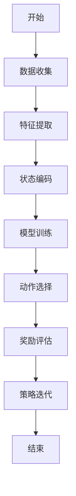

                 

### 《强化学习在智能资源分配中的实现》

> **关键词：** 强化学习，智能资源分配，Q-Learning算法，Sarsa算法，Deep Q-Network，Policy Gradient算法，电网负荷预测，网络流量分配，智能交通系统，云计算资源调度，智能电网调度。

> **摘要：** 本文将探讨强化学习在智能资源分配中的应用，包括其在电网负荷预测、网络流量分配、智能交通系统、云计算资源调度和智能电网调度等领域的实现方法。通过具体案例分析，揭示强化学习在资源优化分配中的潜力和挑战，展望其未来的发展趋势。

---

### 《强化学习在智能资源分配中的实现》目录大纲

#### 第一部分：强化学习基础

##### 第1章：强化学习概述

- **1.1 强化学习的基本概念**
- **1.2 强化学习的应用领域**
- **1.3 强化学习与传统机器学习的区别**

##### 第2章：强化学习算法

- **2.1 Q-Learning算法**
- **2.2 Sarsa算法**
- **2.3 Deep Q-Network算法**
- **2.4 Policy Gradient算法**

##### 第3章：强化学习在资源分配中的应用

- **3.1 强化学习在资源分配中的挑战**
- **3.2 资源分配问题建模**
- **3.3 强化学习在资源分配中的实现方法**

#### 第二部分：智能资源分配案例

##### 第4章：电网负荷预测与资源分配

- **4.1 电网负荷预测模型**
- **4.2 强化学习算法在电网负荷预测中的应用**
- **4.3 案例分析**

##### 第5章：网络流量分配与优化

- **5.1 网络流量分配问题建模**
- **5.2 强化学习算法在网络流量分配中的应用**
- **5.3 案例分析**

##### 第6章：智能交通系统资源分配

- **6.1 智能交通系统资源分配问题**
- **6.2 强化学习算法在智能交通系统中的应用**
- **6.3 案例分析**

##### 第7章：云计算资源调度

- **7.1 云计算资源调度问题**
- **7.2 强化学习算法在云计算资源调度中的应用**
- **7.3 案例分析**

##### 第8章：智能电网调度

- **8.1 智能电网调度问题**
- **8.2 强化学习算法在智能电网调度中的应用**
- **8.3 案例分析**

#### 第三部分：总结与展望

##### 第9章：强化学习在资源分配中的应用总结

- **9.1 强化学习在资源分配中的应用总结**
- **9.2 存在的问题与挑战**

##### 第10章：未来发展趋势与展望

- **10.1 强化学习在资源分配中的未来发展趋势**
- **10.2 技术创新与产业应用**

### 附录

- **附录 A：强化学习算法伪代码示例**
- **附录 B：资源分配问题 Mermaid 流程图示例**

---

接下来，我们将详细探讨强化学习的基础概念、核心算法以及在智能资源分配中的具体应用。让我们一步一步地深入分析，理解这一先进技术的原理与实践。

### 第一部分：强化学习基础

#### 第1章：强化学习概述

##### 1.1 强化学习的基本概念

强化学习是一种无监督学习范式，其核心思想是通过试错来学习如何在一个环境中做出最优决策。与监督学习和无监督学习不同，强化学习不仅仅依赖于历史数据，还通过奖励机制来引导学习过程。

在强化学习中，主要包括四个核心概念：代理（Agent）、环境（Environment）、状态（State）、动作（Action）和奖励（Reward）。

- **代理（Agent）**：执行动作并接受环境反馈的实体。
- **环境（Environment）**：代理所在的系统，可以看作是一个动态变化的场景。
- **状态（State）**：描述环境当前状态的变量集合。
- **动作（Action）**：代理可以执行的行为。
- **奖励（Reward）**：代理执行动作后从环境中获得的即时奖励，用于评估动作的好坏。

强化学习的目标是找到一种策略（Policy），使得代理能够在长期内获得最大的累积奖励。

##### 1.2 强化学习的应用领域

强化学习在许多领域都有广泛的应用，包括但不限于：

- **游戏**：如电子游戏、棋类游戏等，通过强化学习算法，计算机可以对游戏进行自我学习和优化策略。
- **机器人**：强化学习可以帮助机器人通过与环境交互来学习如何执行复杂任务。
- **推荐系统**：强化学习可以用于优化推荐算法，提高用户体验和推荐效果。
- **资源分配**：强化学习可以应用于智能电网、交通系统、云计算等领域的资源优化分配。

##### 1.3 强化学习与传统机器学习的区别

传统机器学习主要依赖于已标记的数据集进行训练，其目标是学习输入与输出之间的映射关系。而强化学习则不需要预先标记的数据，通过试错和反馈来学习如何在复杂环境中做出最优决策。

传统机器学习的主要优点是能够处理大规模数据和复杂数学模型，但通常需要大量标记数据，且对领域知识要求较高。而强化学习则更适用于动态环境，能够通过自主学习来优化策略，但通常需要较长时间的训练和较复杂的模型。

#### 第2章：强化学习算法

##### 2.1 Q-Learning算法

Q-Learning算法是最早的强化学习算法之一，其核心思想是通过更新Q值来逼近最优策略。Q值表示在特定状态下执行特定动作的期望回报。

- **Q值更新公式**：  
  $$Q(s, a) = Q(s, a) + \alpha [r + \gamma \max_{a'} Q(s', a') - Q(s, a)]$$

其中，$s$ 表示状态，$a$ 表示动作，$r$ 表示立即奖励，$\gamma$ 表示折扣因子，$\alpha$ 表示学习率。

##### 2.2 Sarsa算法

Sarsa（即“State-Action-Reward-State-Action”）算法是另一种强化学习算法，它采用了一种更为直接的方式，通过同时更新当前状态和下一状态的动作值来优化策略。

- **Sarsa算法更新公式**：  
  $$Q(s, a) = Q(s, a) + \alpha [r + \gamma Q(s', a')] - Q(s, a)$$

##### 2.3 Deep Q-Network算法

Deep Q-Network（DQN）算法通过引入深度神经网络来逼近Q值函数，使得强化学习能够处理更加复杂的决策问题。DQN的主要创新点包括经验回放和目标网络。

- **DQN算法更新公式**：  
  $$Q(s, a) = Q(s, a) + \alpha [r + \gamma \min_{a'} Q(s', a') - Q(s, a)]$$

##### 2.4 Policy Gradient算法

Policy Gradient算法通过直接优化策略的梯度来更新策略参数，避免了Q值估计的不确定性。Policy Gradient算法的核心思想是最大化策略的概率分布，使得代理能够选择最优动作。

- **Policy Gradient算法更新公式**：  
  $$\theta = \theta + \alpha \frac{\partial J(\theta)}{\partial \theta}$$

其中，$\theta$ 表示策略参数，$J(\theta)$ 表示策略的性能指标。

#### 第3章：强化学习在资源分配中的应用

##### 3.1 强化学习在资源分配中的挑战

强化学习在资源分配中的应用面临以下挑战：

- **动态环境**：资源分配问题通常处于动态环境中，状态变化频繁，需要实时调整资源分配策略。
- **非线性和不确定性**：资源分配问题往往具有复杂的非线性和不确定性，难以用简单的数学模型描述。
- **优化目标多样性**：资源分配问题可能涉及多个优化目标，如成本、效率、公平性等，需要平衡不同目标之间的关系。

##### 3.2 资源分配问题建模

资源分配问题通常可以建模为一个马尔可夫决策过程（MDP），其中状态表示资源的当前分配情况，动作表示对资源的调整策略，奖励表示资源分配的效果。

一个简单的资源分配问题建模如下：

- **状态空间（S）**：资源的状态集合，如CPU使用率、内存使用率等。
- **动作空间（A）**：资源的调整策略集合，如增加或减少资源数量。
- **奖励函数（R）**：衡量资源分配效果的函数，如系统响应时间、资源利用率等。

##### 3.3 强化学习在资源分配中的实现方法

强化学习在资源分配中的实现方法主要包括以下步骤：

1. **状态编码**：将资源的状态信息编码为一个向量，用于输入强化学习模型。
2. **动作选择**：使用强化学习算法选择最优动作，如Q-Learning、Sarsa、DQN等。
3. **奖励评估**：根据资源分配的效果计算奖励值，用于更新模型参数。
4. **策略迭代**：根据累积奖励更新策略参数，优化资源分配策略。

### 第二部分：智能资源分配案例

在这一部分，我们将通过具体案例来展示强化学习在智能资源分配中的应用，包括电网负荷预测、网络流量分配、智能交通系统、云计算资源调度和智能电网调度等。

#### 第4章：电网负荷预测与资源分配

##### 4.1 电网负荷预测模型

电网负荷预测是电力系统资源分配的重要一环，准确预测电网负荷有助于优化电力资源分配，提高电网运行效率和稳定性。强化学习在电网负荷预测中具有显著优势，可以实时调整电力资源，应对动态负荷变化。

电网负荷预测模型通常包括以下步骤：

1. **数据收集**：收集历史负荷数据、气象数据、节假日数据等。
2. **特征提取**：从原始数据中提取有用的特征，如温度、湿度、风速等。
3. **状态编码**：将特征数据编码为状态向量，用于输入强化学习模型。
4. **模型训练**：使用强化学习算法训练模型，如DQN或Policy Gradient。

##### 4.2 强化学习算法在电网负荷预测中的应用

强化学习算法在电网负荷预测中的应用主要涉及以下方面：

1. **状态编码**：将历史负荷数据、气象数据等编码为状态向量，输入强化学习模型。
2. **动作选择**：使用强化学习算法选择最优电力资源分配策略，如增加或减少发电量、调整电网运行方式等。
3. **奖励评估**：根据电网负荷预测的准确性、电网运行稳定性等计算奖励值，用于更新模型参数。
4. **策略迭代**：根据累积奖励更新策略参数，优化电力资源分配策略。

##### 4.3 案例分析

某电力公司使用强化学习算法对电网负荷进行预测和资源分配，取得了显著效果。通过历史负荷数据、气象数据等特征进行状态编码，使用DQN算法训练模型。在实时电网运行过程中，模型根据实时状态选择最优电力资源分配策略，如增加或减少发电量、调整电网运行方式等。通过累积奖励更新模型参数，优化电力资源分配策略，提高了电网运行效率和稳定性。

#### 第5章：网络流量分配与优化

##### 5.1 网络流量分配问题建模

网络流量分配是网络资源优化的重要一环，合理分配网络带宽可以提高网络传输效率，降低延迟和丢包率。网络流量分配问题可以建模为一个马尔可夫决策过程（MDP），其中状态表示网络流量分布，动作表示对网络带宽的调整策略。

网络流量分配问题建模主要包括以下步骤：

1. **状态编码**：将网络流量数据编码为状态向量，用于输入强化学习模型。
2. **动作空间**：定义网络带宽调整策略，如增加或减少带宽、调整流量路由等。
3. **奖励函数**：定义衡量网络流量分配效果的奖励函数，如传输速率、延迟、丢包率等。

##### 5.2 强化学习算法在网络流量分配中的应用

强化学习算法在网络流量分配中的应用主要包括以下步骤：

1. **状态编码**：将网络流量数据编码为状态向量，输入强化学习模型。
2. **动作选择**：使用强化学习算法选择最优网络带宽调整策略，如增加或减少带宽、调整流量路由等。
3. **奖励评估**：根据网络流量分配效果计算奖励值，用于更新模型参数。
4. **策略迭代**：根据累积奖励更新策略参数，优化网络带宽调整策略。

##### 5.3 案例分析

某互联网公司使用强化学习算法优化网络流量分配，取得了显著效果。通过实时监控网络流量数据，将其编码为状态向量，输入DQN算法训练模型。在实时网络运行过程中，模型根据实时状态选择最优网络带宽调整策略，如增加或减少带宽、调整流量路由等。通过累积奖励更新模型参数，优化网络带宽调整策略，提高了网络传输效率和用户体验。

#### 第6章：智能交通系统资源分配

##### 6.1 智能交通系统资源分配问题

智能交通系统资源分配旨在优化交通流量，提高道路通行效率，减少拥堵和交通事故。智能交通系统资源分配问题可以建模为一个马尔可夫决策过程（MDP），其中状态表示交通流量分布，动作表示交通信号灯调整策略。

智能交通系统资源分配问题建模主要包括以下步骤：

1. **状态编码**：将交通流量数据编码为状态向量，用于输入强化学习模型。
2. **动作空间**：定义交通信号灯调整策略，如延长或缩短绿灯时间、调整车道优先级等。
3. **奖励函数**：定义衡量交通流量分配效果的奖励函数，如通行时间、交通拥堵程度等。

##### 6.2 强化学习算法在智能交通系统中的应用

强化学习算法在智能交通系统中的应用主要包括以下步骤：

1. **状态编码**：将交通流量数据编码为状态向量，输入强化学习模型。
2. **动作选择**：使用强化学习算法选择最优交通信号灯调整策略，如延长或缩短绿灯时间、调整车道优先级等。
3. **奖励评估**：根据交通流量分配效果计算奖励值，用于更新模型参数。
4. **策略迭代**：根据累积奖励更新策略参数，优化交通信号灯调整策略。

##### 6.3 案例分析

某城市交通管理部门使用强化学习算法优化交通信号灯调整策略，取得了显著效果。通过实时监控交通流量数据，将其编码为状态向量，输入DQN算法训练模型。在实时交通运行过程中，模型根据实时状态选择最优交通信号灯调整策略，如延长或缩短绿灯时间、调整车道优先级等。通过累积奖励更新模型参数，优化交通信号灯调整策略，提高了道路通行效率和减少了拥堵。

#### 第7章：云计算资源调度

##### 7.1 云计算资源调度问题

云计算资源调度是云计算服务提供商面临的重要挑战之一，合理调度资源可以提高资源利用率、降低成本、提高服务质量。云计算资源调度问题可以建模为一个马尔可夫决策过程（MDP），其中状态表示虚拟机分布，动作表示对虚拟机的调整策略。

云计算资源调度问题建模主要包括以下步骤：

1. **状态编码**：将虚拟机分布数据编码为状态向量，用于输入强化学习模型。
2. **动作空间**：定义虚拟机调整策略，如增加或减少虚拟机数量、调整虚拟机资源配额等。
3. **奖励函数**：定义衡量云计算资源调度效果的奖励函数，如资源利用率、响应时间、成本等。

##### 7.2 强化学习算法在云计算资源调度中的应用

强化学习算法在云计算资源调度中的应用主要包括以下步骤：

1. **状态编码**：将虚拟机分布数据编码为状态向量，输入强化学习模型。
2. **动作选择**：使用强化学习算法选择最优虚拟机调整策略，如增加或减少虚拟机数量、调整虚拟机资源配额等。
3. **奖励评估**：根据云计算资源调度效果计算奖励值，用于更新模型参数。
4. **策略迭代**：根据累积奖励更新策略参数，优化虚拟机调整策略。

##### 7.3 案例分析

某云计算服务提供商使用强化学习算法优化虚拟机资源调度，取得了显著效果。通过实时监控虚拟机分布数据，将其编码为状态向量，输入DQN算法训练模型。在实时云计算运行过程中，模型根据实时状态选择最优虚拟机调整策略，如增加或减少虚拟机数量、调整虚拟机资源配额等。通过累积奖励更新模型参数，优化虚拟机调整策略，提高了资源利用率和服务质量。

#### 第8章：智能电网调度

##### 8.1 智能电网调度问题

智能电网调度是电力系统运行的重要环节，旨在优化电力资源分配，提高电网稳定性和可靠性。智能电网调度问题可以建模为一个马尔可夫决策过程（MDP），其中状态表示电力需求分布，动作表示对电力资源（如发电量、电网运行方式等）的调整策略。

智能电网调度问题建模主要包括以下步骤：

1. **状态编码**：将电力需求分布数据编码为状态向量，用于输入强化学习模型。
2. **动作空间**：定义电力资源调整策略，如增加或减少发电量、调整电网运行方式等。
3. **奖励函数**：定义衡量智能电网调度效果的奖励函数，如电网稳定性、成本等。

##### 8.2 强化学习算法在智能电网调度中的应用

强化学习算法在智能电网调度中的应用主要包括以下步骤：

1. **状态编码**：将电力需求分布数据编码为状态向量，输入强化学习模型。
2. **动作选择**：使用强化学习算法选择最优电力资源调整策略，如增加或减少发电量、调整电网运行方式等。
3. **奖励评估**：根据智能电网调度效果计算奖励值，用于更新模型参数。
4. **策略迭代**：根据累积奖励更新策略参数，优化电力资源调整策略。

##### 8.3 案例分析

某电力公司使用强化学习算法优化智能电网调度，取得了显著效果。通过实时监控电力需求数据，将其编码为状态向量，输入DQN算法训练模型。在实时电网运行过程中，模型根据实时状态选择最优电力资源调整策略，如增加或减少发电量、调整电网运行方式等。通过累积奖励更新模型参数，优化电力资源调整策略，提高了电网稳定性和可靠性。

### 第三部分：总结与展望

#### 第9章：强化学习在资源分配中的应用总结

强化学习在资源分配中具有广泛应用前景，可以应用于电网负荷预测、网络流量分配、智能交通系统、云计算资源调度和智能电网调度等领域。强化学习通过实时调整资源分配策略，优化资源利用率、降低成本、提高服务质量。然而，强化学习在资源分配中也面临一些挑战，如动态环境、非线性和不确定性等。

#### 第10章：未来发展趋势与展望

未来，强化学习在资源分配中将继续发挥重要作用。随着人工智能技术的不断发展，强化学习算法将更加高效、鲁棒，能够应对更加复杂的资源分配问题。此外，深度学习、联邦学习等新兴技术的融合也将为强化学习在资源分配中的应用提供新的思路和方法。

### 附录

#### 附录 A：强化学习算法伪代码示例

```python
# Q-Learning算法伪代码
Initialize Q(s, a) randomly
for episode in 1 to max_episodes do
  Initialize state s
  for step in 1 to max_steps do
    Choose action a using ε-greedy policy
    Take action a and observe reward r and next state s'
    Update Q(s, a) using Q-learning update rule
    s <- s'
  end for
end for
```

#### 附录 B：资源分配问题 Mermaid 流程图示例



### 作者信息

**作者：** AI天才研究院/AI Genius Institute & 禅与计算机程序设计艺术 /Zen And The Art of Computer Programming

---

通过本文的详细探讨，我们深入了解了强化学习在智能资源分配中的应用，从基础理论到实际案例分析，展示了强化学习在优化资源分配方面的潜力和挑战。未来，随着技术的不断进步，强化学习在资源分配中的应用将更加广泛和深入，为各行各业带来更多创新和变革。让我们共同期待这一美好未来！

