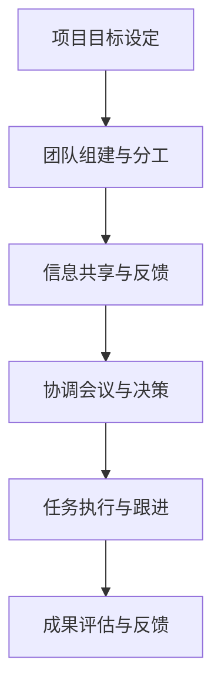
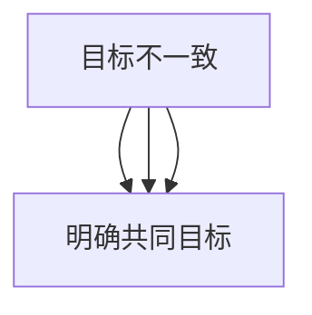
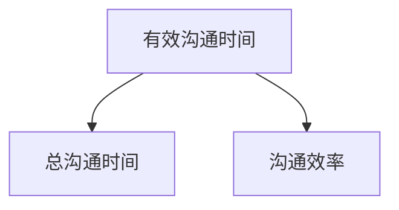

                 

# 引言

跨部门沟通协调能力在现代企业中愈发重要。随着企业规模不断扩大，各部门之间的联系日益紧密，项目协同成为常态。然而，不同部门之间往往存在信息不对称、文化差异和目标不一致等问题，导致沟通效率低下、协调困难，甚至影响项目进度和质量。

本文旨在探讨如何培养跨部门沟通协调能力，帮助企业和个人在复杂环境中实现高效协作。我们将从以下几个方面展开讨论：

1. **跨部门沟通协调的重要性**：分析跨部门沟通的作用和协调能力的价值。
2. **跨部门沟通协调的基础知识**：介绍跨部门沟通的定义、流程及常见障碍。
3. **提升跨部门沟通技巧**：探讨有效的沟通策略、协调技巧与人际关系管理。
4. **跨部门项目协作实战**：分析项目管理、沟通案例以及实战技巧。
5. **跨部门沟通协调能力提升策略**：讨论个人和组织层面的提升方法。

希望通过本文的深入探讨，读者能够更好地理解和掌握跨部门沟通协调的能力，为企业的成功发展贡献力量。

> 关键词：跨部门沟通、协调能力、项目协作、沟通技巧、实战案例分析

> 摘要：本文通过详细探讨跨部门沟通协调的重要性、基础知识、提升技巧、实战案例以及提升策略，帮助读者深入了解并掌握跨部门沟通协调的核心技能。文章采用逻辑清晰、结构紧凑、简单易懂的写作方式，结合实际案例和数学模型，使读者能够更好地应用于实际工作场景中。

----------------------------------------------------------------

### 第一部分：理解跨部门沟通协调

#### 第1章：跨部门沟通协调的重要性

在当今复杂的企业环境中，跨部门沟通协调扮演着至关重要的角色。这不仅关乎项目的顺利进行，更是企业整体运营效率和团队协作能力的体现。为了深入理解这一主题，我们需要从以下几个方面展开讨论：

1. **跨部门沟通的作用**：探讨沟通在跨部门协作中的重要性，以及有效沟通如何促进项目成功。
2. **协调能力的价值**：分析协调能力在企业运营中的实际价值，以及如何提升个人和团队的协调能力。
3. **跨部门协作的挑战**：讨论跨部门协作中常见的问题和挑战，并提出相应的解决方案。

##### 1.1 跨部门沟通的作用

跨部门沟通是企业运营中不可或缺的一环。它不仅有助于确保项目的顺利进行，还能促进团队协作和知识共享。以下是跨部门沟通的几个关键作用：

- **信息传递**：跨部门沟通是信息传递的重要渠道，确保各部门能够及时获取所需的信息，避免信息断层和误解。
- **资源整合**：通过跨部门沟通，企业能够更好地整合各部门的资源，实现资源的合理分配和高效利用。
- **决策制定**：跨部门沟通有助于不同部门共同参与决策过程，确保决策的全面性和科学性。
- **问题解决**：面对复杂的问题和挑战，跨部门沟通能够集中各部门的智慧和力量，共同寻找解决方案。

##### 1.2 协调能力的价值

协调能力是企业运营中的一项重要能力。它不仅关乎项目的成功，更是企业整体运营效率的体现。以下是协调能力的几个关键价值：

- **促进团队协作**：协调能力有助于促进各部门之间的协作，打破部门壁垒，实现整体目标的达成。
- **提高决策质量**：通过协调，各部门能够共同参与决策过程，提高决策的全面性和科学性。
- **优化资源分配**：协调能力有助于优化资源的分配和使用，提高资源利用效率。
- **降低沟通成本**：有效的协调能够减少不必要的沟通和冲突，降低沟通成本。

##### 1.3 跨部门协作的挑战

虽然跨部门沟通协调具有重要意义，但在实际操作中仍面临诸多挑战。以下是跨部门协作中常见的问题和挑战：

- **信息不对称**：不同部门对信息的掌握程度不同，导致信息传递不完整或误解。
- **文化差异**：各部门的文化背景、工作方式不同，导致沟通障碍和协作困难。
- **目标不一致**：各部门对项目目标的认同度不一致，导致协调困难。
- **资源竞争**：各部门之间存在资源竞争，影响协作效率和项目进度。

针对以上挑战，企业需要采取一系列措施来提升跨部门沟通协调能力，确保项目顺利进行。以下是几个解决方案：

- **建立信息共享平台**：通过建立统一的信息共享平台，促进信息的透明化和实时更新，减少信息不对称。
- **加强部门间交流**：通过定期的部门间交流，增进各部门之间的了解和信任，降低文化差异。
- **明确共同目标**：通过明确共同目标，强化团队协作意识，确保各部门共同朝着目标努力。
- **优化资源分配**：通过科学的资源分配策略，合理调配各部门的资源，减少资源竞争。

综上所述，跨部门沟通协调在当今企业中具有重要意义。通过深入理解和掌握跨部门沟通协调的核心技能，企业可以更好地应对挑战，实现高效协作，推动企业持续发展。

----------------------------------------------------------------

### 第二部分：跨部门沟通协调的基础知识

#### 第2章：跨部门沟通的基础概念

要深入探讨跨部门沟通协调，首先需要了解其基础概念，包括跨部门沟通的定义、流程以及常见的沟通障碍和解决策略。

##### 2.1 跨部门沟通的定义

跨部门沟通是指企业中不同部门之间进行的交流和信息传递。这种沟通不仅包括正式的会议、报告和文件传递，还涵盖非正式的交流，如团队协作、合作讨论和日常互动。跨部门沟通的目标是确保各部门能够有效合作，共同实现企业目标。

##### 2.2 沟通协调的流程

跨部门沟通协调的流程通常包括以下几个步骤：

1. **项目目标设定**：明确项目的整体目标和各部门的具体职责。
2. **团队组建与分工**：根据项目需求，组建跨部门团队，并明确各部门的职责和任务分工。
3. **信息共享与反馈**：通过定期的会议、报告和信息共享，确保各部门之间信息的透明和实时更新。
4. **协调会议与决策**：召开跨部门协调会议，解决沟通中的问题，共同决策项目方案。
5. **任务执行与跟进**：各部门按照分工执行任务，并定期汇报进展情况。
6. **成果评估与反馈**：项目完成后，进行评估和总结，收集反馈，为后续项目提供改进建议。

##### 2.3 沟通障碍与解决策略

跨部门沟通中常常会遇到一些障碍，影响沟通效果和协作效率。以下是一些常见的沟通障碍及其解决策略：

1. **信息不对称**：解决策略：
   - **建立信息共享平台**：通过统一的信息共享平台，如企业内部网、共享文件夹等，确保信息的透明化和实时更新。
   - **明确信息传递流程**：制定明确的信息传递流程，确保信息在不同部门之间及时传递。

2. **文化差异**：解决策略：
   - **加强部门间交流**：通过定期的部门间交流活动，增进各部门之间的了解和信任，降低文化差异。
   - **文化培训**：对员工进行跨文化培训，提高跨文化沟通能力。

3. **目标不一致**：解决策略：
   - **明确共同目标**：通过明确共同目标，强化团队协作意识，确保各部门共同朝着目标努力。
   - **共同参与决策**：鼓励各部门共同参与项目决策过程，提高对项目目标的认同度。

4. **资源竞争**：解决策略：
   - **优化资源分配**：通过科学的资源分配策略，合理调配各部门的资源，减少资源竞争。
   - **建立共享机制**：建立资源共享机制，鼓励各部门在资源使用上的协作和互补。

通过了解跨部门沟通的基础概念和流程，以及应对沟通障碍的解决策略，企业和个人可以更好地开展跨部门沟通协调工作，提高协作效率和项目成功率。

----------------------------------------------------------------

### 第三部分：提升跨部门沟通技巧

#### 第3章：有效的沟通策略

在跨部门沟通协调中，掌握有效的沟通策略是提高沟通效率和协作效果的关键。本章节将详细探讨以下几个方面的内容：

1. **沟通前准备**：包括明确沟通目标、受众分析和资料准备，确保沟通具有针对性和有效性。
2. **沟通中的技巧**：介绍有效倾听、清晰表达、控制情绪和适当时机等沟通技巧，提高沟通效果。
3. **沟通后跟进**：讨论如何进行后续反馈和评估，确保沟通的持续改进。

##### 3.1 沟通前准备

良好的沟通始于充分的准备。以下是一些关键的沟通前准备工作：

- **明确沟通目标**：在沟通前，明确沟通的目的和目标，确保沟通内容具有明确的指向性和针对性。
- **受众分析**：了解沟通对象的背景、需求和预期，有助于调整沟通方式和内容，提高受众的接受度。
- **资料准备**：收集和整理与沟通内容相关的资料和信息，确保在沟通中能够提供充分的支持和证据。

##### 3.2 沟通中的技巧

在沟通过程中，运用恰当的技巧可以大大提高沟通的效果。以下是几种关键技巧：

- **有效倾听**：倾听是沟通的重要环节，通过倾听，可以更好地理解对方的观点和需求。有效倾听包括关注对方发言、避免打断、表达理解和确认信息等。
- **清晰表达**：清晰、简洁地表达自己的观点和意见，避免使用模糊或含糊的语言。在表达时，尽量使用具体的例子和数据，增强说服力。
- **控制情绪**：在沟通中，情绪管理至关重要。遇到意见分歧或冲突时，要保持冷静，避免情绪化，确保沟通的理性性和建设性。
- **适当时机**：选择合适的时机进行沟通，如对方有空闲时间、情绪稳定时，可以提高沟通的效果。

##### 3.3 沟通后跟进

沟通后的跟进是确保沟通效果的重要环节。以下是几个关键步骤：

- **反馈收集**：在沟通结束后，及时收集对方的反馈，了解沟通的效果和对方的接受程度。
- **评估与改进**：根据反馈结果，对沟通过程进行评估，找出不足之处，并提出改进建议。
- **持续跟进**：在后续工作中，持续关注沟通对象的进展和需求，确保沟通的持续性和有效性。

通过以上沟通前准备、沟通中的技巧和沟通后跟进，企业和个人可以大大提升跨部门沟通的效率和效果，促进项目协作和团队协作。

----------------------------------------------------------------

#### 第4章：协调技巧与人际关系管理

在跨部门沟通协调过程中，协调技巧和人际关系管理是确保项目顺利进行和团队和谐的重要环节。本章将围绕以下几个方面进行探讨：

1. **建立良好的团队关系**：讨论如何通过沟通和互动建立信任和合作关系。
2. **管理冲突**：介绍冲突的产生原因、处理方法和策略，确保冲突得到有效解决。
3. **情绪管理**：探讨如何应对沟通中的情绪波动，保持冷静和理性。

##### 4.1 建立良好的团队关系

良好的团队关系是跨部门协作成功的基础。以下是一些建立良好团队关系的策略：

- **沟通与互动**：定期组织团队沟通和互动活动，增进各部门之间的了解和信任。例如，可以通过团队建设活动、部门交流会等形式，促进团队成员的相互了解。
- **共同目标**：明确共同的目标和愿景，使团队成员明确自己在项目中的角色和责任，增强团队凝聚力。
- **互惠互利**：在协作过程中，强调互惠互利的原则，使团队成员感受到合作的共赢价值，提高参与度。

##### 4.2 管理冲突

冲突在跨部门协作中是不可避免的，但关键在于如何有效地管理和解决冲突。以下是一些建立冲突管理的方法：

- **理解冲突原因**：了解冲突的产生原因，包括利益冲突、沟通不畅、目标不一致等，有助于采取针对性的解决策略。
- **倾听与理解**：在处理冲突时，首先要倾听对方的观点，理解对方的立场和感受。避免急于发表意见或做出判断，以免加剧矛盾。
- **理性沟通**：在冲突中，保持冷静和理性，避免情绪化。通过理性的讨论和协商，寻找共同点和解决方案。
- **建立共识**：在解决冲突时，努力寻找各方都能接受的解决方案，建立共识。这有助于减少后续的矛盾和冲突。

##### 4.3 情绪管理

情绪管理是跨部门沟通协调中的重要一环，直接影响沟通的效果和团队氛围。以下是一些建立情绪管理的方法：

- **自我认知**：了解自己的情绪，认识到情绪对沟通和行为的影响。通过自我反思，提高情绪管理能力。
- **情绪释放**：找到适当的途径释放情绪，如运动、冥想或与朋友交流。避免将负面情绪带入工作中，影响团队协作。
- **同理心**：在沟通中，尽量站在对方的角度思考问题，理解对方的感受和需求。同理心有助于缓解紧张情绪和冲突。
- **积极沟通**：保持积极的态度，用积极的语言和方式与同事沟通。积极沟通可以增强团队的凝聚力和信任感。

通过建立良好的团队关系、有效管理冲突和进行情绪管理，企业和个人可以更好地应对跨部门沟通协调中的挑战，实现项目目标。

----------------------------------------------------------------

### 第四部分：跨部门项目协作实战

#### 第5章：跨部门协作的项目管理

在跨部门协作中，项目管理是确保项目按计划顺利进行的关键环节。本章将详细探讨以下几个方面的内容：

1. **项目目标与规划**：明确项目目标，制定详细的规划，确保项目有明确的方向和可执行性。
2. **资源分配**：合理调配各部门的资源，确保资源的最优利用，提高项目效率。
3. **进度监控与调整**：对项目进度进行实时监控，及时发现和解决问题，确保项目按计划推进。

##### 5.1 项目目标与规划

项目目标与规划是项目管理的核心，为项目提供了明确的方向和执行依据。以下是项目目标与规划的关键步骤：

- **明确项目目标**：在项目启动阶段，首先要明确项目的目标。目标应具体、可衡量、可实现、相关性强和时限明确，即SMART原则。例如，“开发一款具有高用户体验的移动应用，在2023年12月前完成并上线。”
- **制定详细规划**：根据项目目标，制定详细的计划，包括任务分解、时间表、资源需求和里程碑。例如，将项目分为需求分析、设计、开发、测试和上线等阶段，并设定各阶段的截止日期。
- **制定风险管理计划**：在项目规划中，识别可能的风险，并制定相应的应对措施。例如，针对开发过程中可能出现的延误，可以制定应急预案，确保项目能够按时完成。

##### 5.2 资源分配

资源分配是项目管理中的重要环节，直接影响到项目的进度和效率。以下是资源分配的关键策略：

- **需求分析**：在项目启动前，对各阶段所需的资源进行详细分析。包括人力资源、设备资源、财务资源等。
- **资源评估**：根据资源需求，评估现有资源的充足程度，确定是否需要补充或调整。
- **优化资源使用**：通过优化资源的使用，提高资源利用效率。例如，合理分配人力资源，避免资源浪费和过度依赖。
- **动态调整**：在项目执行过程中，根据实际情况动态调整资源分配，确保资源始终处于最优状态。例如，在项目关键阶段增加人力资源投入，确保项目进度。

##### 5.3 进度监控与调整

进度监控与调整是确保项目按计划推进的关键。以下是进度监控与调整的关键步骤：

- **建立监控机制**：制定项目进度监控计划，明确监控指标和监控频率。例如，每周召开项目进度会议，评估项目进展情况。
- **实时跟踪**：通过项目管理工具，实时跟踪项目进展，了解各阶段的完成情况和存在的问题。
- **问题反馈与解决**：在监控过程中，发现项目进度偏离计划时，及时反馈并分析原因，制定解决方案。例如，如果发现开发阶段出现延误，可以调整人力资源或调整任务优先级。
- **调整计划**：根据监控结果和问题解决方案，对项目计划进行适时调整，确保项目能够按计划完成。例如，调整项目时间表或重新分配资源。

通过以上项目目标与规划、资源分配和进度监控与调整，企业和个人可以更好地进行跨部门项目协作，确保项目顺利进行和达成目标。

----------------------------------------------------------------

#### 第6章：跨部门协作的沟通案例分析

在跨部门协作中，有效的沟通是项目成功的关键。为了更好地理解跨部门沟通的实际应用和效果，本章节将分析两个具有代表性的跨部门协作案例，一个是成功案例，另一个是失败案例。通过对比分析，我们将总结成功经验和失败教训，为后续的项目沟通提供有益的借鉴。

##### 6.1 成功案例：某科技公司的产品开发项目

某科技公司正开发一款智能家居应用，该项目需要多个部门的紧密协作，包括研发部、市场部、设计部和运维部。以下是该项目在跨部门沟通协作方面的成功经验和关键策略：

1. **明确目标与分工**：在项目启动阶段，公司明确了项目目标，并制定了详细的分工计划。每个部门明确自己的职责和任务，确保项目目标的实现。

2. **定期沟通会议**：为了确保各部门之间的沟通顺畅，公司建立了每周的跨部门沟通会议制度。在会议中，各部门汇报工作进展，讨论遇到的问题，并共同制定解决方案。

3. **信息共享平台**：公司建立了统一的信息共享平台，各部门可以在平台上发布工作进展、上传相关文件和共享资源，确保信息的透明和实时更新。

4. **团队文化建设**：公司注重团队文化建设，通过定期的团队建设活动，增强团队成员之间的信任和合作意识。

5. **持续反馈与改进**：在项目执行过程中，公司建立了反馈机制，定期收集团队成员的反馈和建议，并根据反馈进行改进。这种持续改进的方式提高了项目的整体效率和质量。

##### 6.2 失败案例：某制造企业的生产线优化项目

某制造企业试图通过优化生产线来提高生产效率，但由于跨部门沟通协调不足，导致项目失败。以下是该项目在跨部门沟通协作方面的失败经验和教训：

1. **缺乏明确目标**：在项目启动阶段，企业没有明确的项目目标，导致各部门对项目缺乏共识和方向感。

2. **沟通不足**：各部门之间的沟通非常有限，缺乏定期的沟通会议和信息共享机制，导致信息传递不完整和滞后。

3. **资源分配不合理**：企业在资源分配上存在问题，各部门的资源和时间没有得到合理调配，导致部分部门过度忙碌，而另一些部门则资源闲置。

4. **缺乏团队文化**：企业缺乏团队文化，各部门之间的合作意识较弱，导致协作困难，项目推进缓慢。

5. **缺乏问题反馈与改进机制**：在项目执行过程中，企业没有建立有效的反馈机制，无法及时发现和解决问题，导致项目在多个环节出现延误和失败。

##### 6.3 启示与借鉴

通过以上两个案例的分析，我们可以得出以下启示和借鉴：

1. **明确目标与分工**：在项目启动阶段，确保明确项目目标和各部门的职责，为项目顺利推进奠定基础。

2. **加强沟通与协作**：建立定期的沟通会议和信息共享机制，确保各部门之间的信息传递畅通和实时更新。

3. **合理分配资源**：在项目执行过程中，合理调配各部门的资源，避免资源浪费和过度依赖。

4. **建设团队文化**：注重团队文化建设，增强团队成员之间的信任和合作意识。

5. **建立反馈与改进机制**：在项目执行过程中，建立有效的反馈机制，及时收集反馈并进行分析改进，提高项目效率和质量。

通过借鉴成功案例的经验和避免失败案例的教训，企业和个人可以更好地进行跨部门协作，实现项目的成功。

----------------------------------------------------------------

### 第五部分：跨部门沟通协调能力提升策略

#### 第7章：个人能力提升

跨部门沟通协调能力的提升不仅依赖于组织的支持，更需要个人努力和自我提升。本章节将围绕以下几个方面进行探讨：

1. **沟通协调能力的自我评估**：通过自我评估，了解自身的沟通协调能力现状，明确提升方向。
2. **提升沟通技巧的途径**：介绍多种提升沟通技巧的方法和途径，如培训、实践和反思等。
3. **持续学习与反思**：强调持续学习的重要性，通过反思和总结，不断提升沟通协调能力。

##### 7.1 沟通协调能力的自我评估

自我评估是提升沟通协调能力的第一步。通过自我评估，可以了解自身的优势和不足，为后续的改进提供依据。以下是自我评估的几个关键步骤：

- **反思自身沟通行为**：回顾过去的沟通经历，思考自己的沟通方式是否有效，是否存在沟通障碍。
- **收集他人反馈**：向同事、上级和下属收集反馈，了解他们对自己沟通协调能力的评价和建议。
- **分析沟通效果**：根据沟通的结果和反馈，分析沟通的成效，找出成功和失败的案例，总结经验教训。
- **制定改进计划**：根据自我评估的结果，制定具体的改进计划，明确提升目标和行动步骤。

##### 7.2 提升沟通技巧的途径

提升沟通技巧是跨部门沟通协调能力提升的关键。以下是一些有效的提升途径：

- **参加培训课程**：参加专业的沟通技巧培训课程，学习沟通理论、技巧和案例分析，提升专业素养。
- **实践与反思**：在实际工作中，不断实践所学知识，通过反思和总结，不断提升沟通能力。例如，在项目会议中，尝试运用有效的沟通技巧，观察反馈效果，并进行分析和调整。
- **阅读相关书籍和资料**：阅读关于沟通技巧的书籍、文章和案例，扩展知识面，借鉴他人的经验和教训。
- **参加模拟演练**：通过模拟演练，模拟真实的沟通场景，提前演练和反思，提高应对复杂沟通情境的能力。
- **寻求导师指导**：找到经验丰富的导师，向他们请教沟通技巧和经验，获取专业指导和反馈。

##### 7.3 持续学习与反思

持续学习和反思是沟通协调能力提升的重要保障。以下是一些建议：

- **定期进行自我评估**：定期进行自我评估，跟踪提升进度，确保持续改进。
- **建立学习计划**：制定详细的学习计划，明确学习目标、内容和时间安排，确保学习的系统性和持续性。
- **建立反思机制**：在每次沟通后，进行反思和总结，分析成功和失败的案例，找出改进的方向。
- **保持开放心态**：保持开放心态，虚心接受他人的建议和反馈，勇于尝试新的沟通方法和技巧。
- **积极参与团队活动**：积极参与团队活动和项目，通过实践和互动，不断提升沟通协调能力。

通过自我评估、提升沟通技巧和持续学习与反思，个人可以不断提升跨部门沟通协调能力，为企业的成功发展贡献力量。

----------------------------------------------------------------

#### 第8章：组织层面的沟通协调策略

在跨部门沟通协调中，组织层面的策略同样至关重要。一个良好的组织沟通机制可以有效地促进信息流通、提高团队协作效率和项目成功率。本章节将围绕以下几个方面进行探讨：

1. **组织文化的影响**：讨论组织文化对跨部门沟通协调的影响，以及如何建设积极向上的组织文化。
2. **沟通机制的建立**：介绍建立有效的跨部门沟通机制的方法和步骤，确保沟通渠道的畅通和有效。
3. **持续改进与优化**：强调持续改进的重要性，通过定期评估和优化，不断提升组织沟通协调能力。

##### 8.1 组织文化的影响

组织文化是跨部门沟通协调的基石。一个积极向上的组织文化可以增强团队成员的归属感和合作意识，促进跨部门沟通的顺畅。以下是一些关键点：

- **鼓励开放沟通**：组织应鼓励员工开放沟通，允许不同观点和意见的提出，建立开放的沟通氛围。
- **尊重差异**：组织应尊重各部门之间的差异，包括文化背景、工作方式等，促进相互理解和尊重。
- **团队精神**：通过培养团队精神，增强团队成员之间的信任和合作，提高团队整体的协作效率。
- **共同目标**：组织应明确共同的目标和愿景，使员工能够明确自己在组织中的角色和责任，共同为实现目标而努力。

##### 8.2 沟通机制的建立

建立有效的沟通机制是确保跨部门沟通协调顺畅的关键。以下是一些关键步骤和方法：

- **建立沟通渠道**：明确各部门之间的沟通渠道，包括正式和非正式的沟通方式。例如，设立跨部门沟通会议、信息共享平台、邮件群组等。
- **制定沟通规范**：制定统一的沟通规范，包括沟通的语言、格式、频率和责任分工等，确保沟通的规范化和标准化。
- **明确沟通责任**：明确各部门和个人的沟通责任，确保每个环节的沟通都有人负责，避免沟通盲区和责任缺失。
- **定期沟通评估**：定期对沟通机制进行评估，收集反馈和改进意见，根据实际情况调整和优化沟通机制。

##### 8.3 持续改进与优化

持续改进与优化是组织沟通协调能力不断提升的关键。以下是一些建议：

- **定期培训**：组织定期的沟通技巧培训，提高员工沟通能力和协作意识，促进跨部门沟通的顺畅。
- **信息共享**：鼓励各部门共享信息和资源，建立信息共享平台，提高信息透明度和实时性。
- **反馈机制**：建立有效的反馈机制，鼓励员工提出改进建议，及时解决沟通中的问题和障碍。
- **反思总结**：定期进行沟通总结，分析成功和失败的案例，总结经验教训，为后续沟通提供借鉴。
- **领导带头**：领导应带头示范良好的沟通行为，积极参与跨部门沟通，树立良好的沟通榜样。

通过建设积极向上的组织文化、建立有效的沟通机制和持续改进与优化，组织可以不断提升跨部门沟通协调能力，实现高效协作和项目成功。

----------------------------------------------------------------

### 附录A：跨部门沟通协调工具与资源

为了更好地进行跨部门沟通协调，以下介绍一些常用的工具和资源，帮助企业和个人提高沟通效率。

#### A.1 常用沟通工具介绍

1. **电子邮件**：电子邮件是一种传统的沟通工具，适用于正式、详尽的沟通需求。通过电子邮件，可以发送详细的报告、文件和通知，确保信息传递的准确性和正式性。

2. **即时通讯工具**：如微信、Slack、钉钉等，适用于快速、便捷的沟通需求。这些工具支持文字、语音和视频通讯，便于团队成员之间的即时交流和协作。

3. **视频会议工具**：如Zoom、Microsoft Teams、Google Meet等，适用于远程会议和多人协作。通过视频会议，可以实时面对面交流，提高沟通效果。

4. **项目管理工具**：如Trello、JIRA、Asana等，适用于任务分配、进度跟踪和项目协作。这些工具可以整合任务、文档和沟通，提高项目管理效率。

#### A.2 跨部门协作模板与示例

1. **跨部门协作会议议程**：制定会议议程，明确会议目的、时间和议程安排，确保会议高效有序。

   ```markdown
   # 跨部门协作会议议程

   - 会议目的
   - 会议时间
   - 会议议程
     1. 项目进展汇报
     2. 遇到的问题及解决方案
     3. 下周工作计划
     4. 其他事项
   ```

2. **跨部门任务分配表**：明确各部门的任务和责任，确保项目分工清晰，提高协作效率。

   ```markdown
   # 跨部门任务分配表

   | 部门 | 任务名称 | 负责人 | 截止日期 |
   | --- | --- | --- | --- |
   | 研发部 | 功能模块开发 | 张三 | 2023-12-01 |
   | 市场部 | 市场调研 | 李四 | 2023-11-15 |
   | 设计部 | 界面设计 | 王五 | 2023-11-20 |
   ```

#### A.3 推荐阅读与资源链接

1. 《跨部门沟通的艺术》 - 作者：罗伯特·霍尔
   链接：[https://www.amazon.com/Cross-Functional-Communication-Art-Robert-Hall/dp/0071499797](https://www.amazon.com/Cross-Functional-Communication-Art-Robert-Hall/dp/0071499797)

2. 《团队协作与沟通技巧》 - 作者：斯蒂芬·罗宾斯
   链接：[https://www.amazon.com/Team-Work-Collaboration-Communication-Skills/dp/1260050301](https://www.amazon.com/Team-Work-Collaboration-Communication-Skills/dp/1260050301)

3. 《项目管理知识体系指南》 - 作者：PMI
   链接：[https://www.pmi.org/knowledge](https://www.pmi.org/knowledge)

通过以上工具和资源的介绍，企业和个人可以更好地进行跨部门沟通协调，提高工作效率和项目成功率。

----------------------------------------------------------------

### 核心概念与联系

#### 跨部门沟通协调流程

在跨部门沟通协调中，流程的清晰和规范是确保项目顺利进行的关键。以下是一个典型的跨部门沟通协调流程及其核心概念和联系：

1. **项目目标设定**
   - **核心概念**：明确项目的总体目标和各部门的具体职责。
   - **联系**：项目目标为跨部门协作提供了方向和目标，各部门的职责分工确保项目任务的明确。

2. **团队组建与分工**
   - **核心概念**：根据项目需求，组建跨部门团队，并明确各部门的职责和任务分工。
   - **联系**：团队组建和分工确保项目任务能够高效分配和执行。

3. **信息共享与反馈**
   - **核心概念**：通过定期的会议、报告和信息共享，确保各部门之间信息的透明和实时更新。
   - **联系**：信息共享和反馈机制确保各部门之间信息流通顺畅，避免信息断层和误解。

4. **协调会议与决策**
   - **核心概念**：召开跨部门协调会议，解决沟通中的问题，共同决策项目方案。
   - **联系**：协调会议和决策是跨部门协作的核心环节，确保各部门能够共同面对问题并找到解决方案。

5. **任务执行与跟进**
   - **核心概念**：各部门按照分工执行任务，并定期汇报进展情况。
   - **联系**：任务执行和跟进确保项目任务能够按计划推进，及时发现和解决问题。

6. **成果评估与反馈**
   - **核心概念**：项目完成后，进行评估和总结，收集反馈，为后续项目提供改进建议。
   - **联系**：成果评估和反馈是项目闭环的重要环节，通过总结经验教训，不断提升跨部门沟通协调能力。

通过上述流程，跨部门沟通协调能够形成一个闭环，确保项目目标的实现和团队的持续改进。



### 核心算法原理讲解

#### 沟通障碍与解决策略

在跨部门沟通协调中，沟通障碍是影响沟通效果和项目成功的重要因素。以下是一个关于沟通障碍及其解决策略的核心算法原理：

1. **沟通障碍**

   - **信息不对称**：不同部门对信息的掌握程度不同，导致沟通效率降低。
   - **文化差异**：各部门的文化背景、工作方式不同，导致沟通障碍。
   - **目标不一致**：各部门对项目目标的认同度不一致，导致协调困难。

2. **解决策略**

   - **信息共享平台**：建立统一的信息共享平台，促进信息的透明化和实时更新。
     ```mermaid
     graph TD
     A[信息不对称] --> B[建立信息共享平台]
     ```
   - **文化培训**：加强部门间的文化交流，提高跨文化沟通能力。
     ```mermaid
     graph TD
     A[文化差异] --> B[进行文化培训]
     ```
   - **明确共同目标**：确保各部门对项目目标有共同认同，加强团队协作意识。
     ```mermaid
     graph TD
     A[目标不一致] --> B[明确共同目标]
     ```

通过上述算法原理，可以有效地识别和解决跨部门沟通中的障碍，提高沟通效率。



### 数学模型和数学公式

在跨部门沟通协调中，评估沟通效率是一个重要的环节。以下是一个关于沟通效率评估的数学模型和数学公式：

1. **沟通效率评估模型**

   - **沟通效率**：通过有效沟通时间与总沟通时间的比例来评估。
     ```latex
     \text{沟通效率} = \frac{\text{有效沟通时间}}{\text{总沟通时间}}
     $$

   - **有效沟通时间**：各部门沟通时间的加权平均值，权重为各部门的有效沟通比例。
     ```latex
     \text{有效沟通时间} = \sum_{i=1}^{n} t_i \cdot p_i
     $$

   - **总沟通时间**：各部门沟通时间的总和。
     ```latex
     \text{总沟通时间} = \sum_{i=1}^{n} t_i
     $$

其中，\(t_i\)为部门i的沟通时间，\(p_i\)为部门i的有效沟通比例。

通过上述数学模型和公式，可以量化地评估跨部门沟通的效率，为后续改进提供依据。

```latex
\text{沟通效率} = \frac{\sum_{i=1}^{n} t_i \cdot p_i}{\sum_{i=1}^{n} t_i}
$$



### 项目实战

#### 跨部门协作案例：产品开发项目

在本案例中，我们将探讨一个实际的产品开发项目，详细说明跨部门协作的过程，包括开发环境搭建、源代码详细实现和代码解读与分析。

##### 开发环境搭建

为了确保跨部门协作的高效，首先需要搭建一个稳定且统一的开发环境。以下是开发环境搭建的关键步骤：

1. **版本控制工具**：选择Git作为版本控制工具，确保代码的版本管理和协作开发。
   ```shell
   git init
   git clone <repository_url>
   ```

2. **项目管理工具**：使用JIRA进行任务管理，分配任务和跟踪进度。
   ```json
   {
     "tasks": [
       {
         "id": "1",
         "title": "需求分析",
         "status": "In Progress"
       },
       {
         "id": "2",
         "title": "设计阶段",
         "status": "Completed"
       },
       ...
     ]
   }
   ```

3. **即时通讯工具**：使用Slack进行日常沟通，便于团队成员间的即时交流。
   ```json
   {
     "channels": [
       {
         "name": "general",
         "messages": ["Hello, everyone! Let's start the day."]
       },
       {
         "name": "project-X",
         "messages": ["@Alice, could you check the latest code review?"]
       }
     ]
   }
   ```

##### 源代码详细实现

在开发过程中，各团队需按照分工协作，以下是一个简化的源代码实现示例：

1. **用户界面模块**：由设计部负责，实现用户界面的展示和交互逻辑。
   ```java
   public class UserInterface {
       public void displayWelcomeMessage() {
           System.out.println("欢迎使用本产品！");
       }
   }
   ```

2. **数据处理模块**：由数据部负责，处理用户输入的数据，进行逻辑判断。
   ```java
   public class DataProcessor {
       public void processData(String input) {
           // 数据处理逻辑
       }
   }
   ```

3. **后台服务模块**：由研发部负责，实现与数据库的交互和业务逻辑。
   ```java
   public class BackendService {
       public void handleBusinessLogic() {
           // 业务逻辑处理
       }
   }
   ```

##### 代码解读与分析

以下是针对上述代码的解读与分析：

1. **用户界面模块**：
   - **功能**：展示欢迎信息。
   - **关键代码**：`displayWelcomeMessage()`方法负责在控制台输出欢迎信息。
   - **作用**：为用户提供友好的交互体验，增强产品的易用性。

2. **数据处理模块**：
   - **功能**：处理用户输入的数据。
   - **关键代码**：`processData()`方法处理用户输入的数据，并进行逻辑判断。
   - **作用**：确保用户输入的数据能够被正确处理，提高系统的稳定性。

3. **后台服务模块**：
   - **功能**：处理业务逻辑，与数据库交互。
   - **关键代码**：`handleBusinessLogic()`方法负责实现业务逻辑，与数据库进行交互。
   - **作用**：确保业务逻辑的正确执行，提高系统的效率和可靠性。

##### 项目进展与反馈

在整个项目开发过程中，项目团队通过JIRA、Slack等工具进行任务管理和日常沟通，确保项目按计划推进。以下是一个项目进展的示例反馈：

- **任务进展**：
  - 需求分析：已完成，需求文档已提交。
  - 设计阶段：已完成，UI设计图已通过评审。
  - 开发阶段：进行中，用户界面和数据处理的代码已基本完成。
  - 测试阶段：计划下周启动，准备测试用例。

- **沟通反馈**：
  - 项目经理：@所有人，本周五下午2点召开项目进度会议，讨论开发阶段的工作进展。
  - 设计师：@开发者，请按照UI设计图实现用户界面，注意用户体验。

通过以上实际项目案例，我们可以看到跨部门协作在产品开发中的重要性。通过明确的分工、有效的沟通和稳定的开发环境，项目团队能够高效地完成开发任务，确保产品的质量和进度。

----------------------------------------------------------------

### 结论

通过本文的深入探讨，我们系统地阐述了跨部门沟通协调的重要性和方法。从理解跨部门沟通协调的基础知识，到提升跨部门沟通技巧和协调能力，再到跨部门项目协作实战，以及组织层面的策略和提升策略，我们为企业和个人提供了全面的指导。

跨部门沟通协调不仅仅是沟通技巧的运用，更是一种系统性的管理艺术。它需要我们从组织文化、沟通机制、个人能力和项目实战等多个维度进行综合考量。通过本文的学习，读者可以更好地掌握跨部门沟通协调的核心技能，提高项目成功率，促进企业的持续发展。

最后，希望本文能够对读者在跨部门沟通协调方面带来实际的帮助和启发。在实践中不断反思和改进，持续提升跨部门沟通协调能力，为企业的成功贡献力量。

### 作者信息

**作者：AI天才研究院/AI Genius Institute & 禅与计算机程序设计艺术 /Zen And The Art of Computer Programming**

