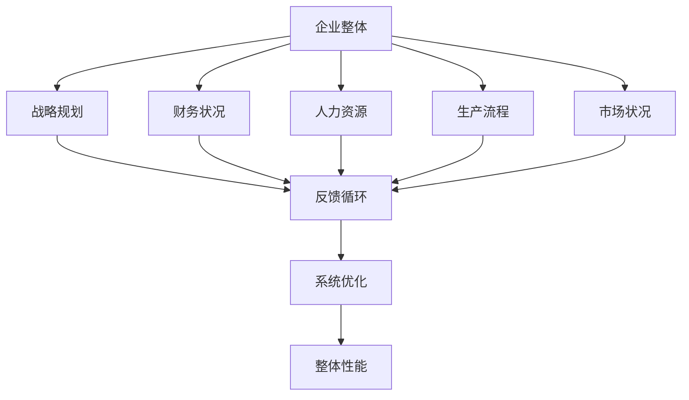
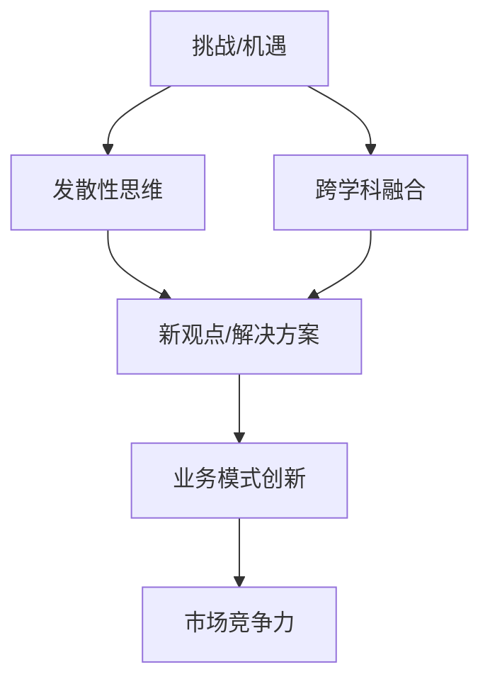
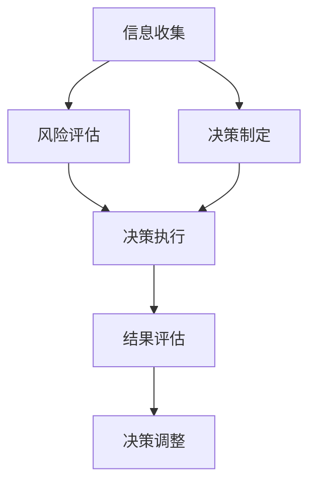
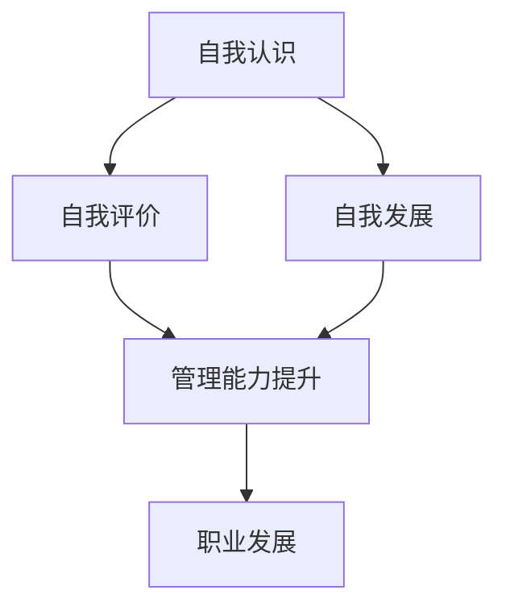
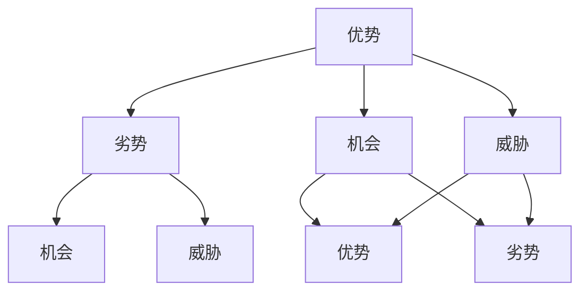
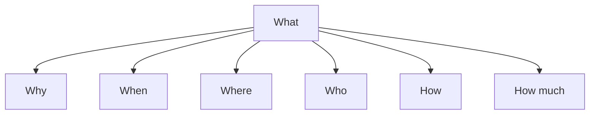
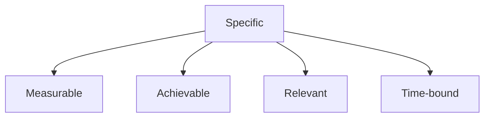
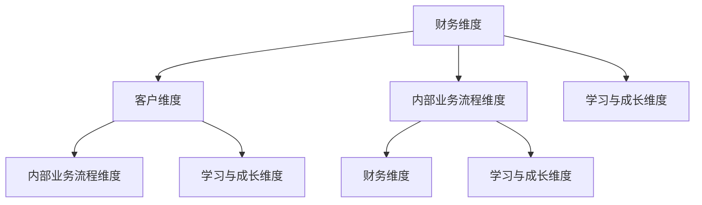
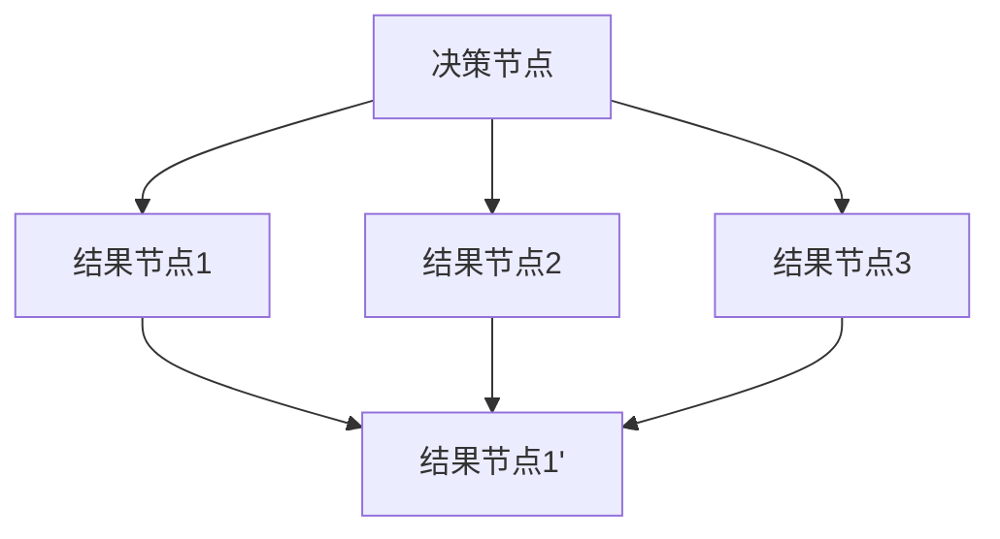
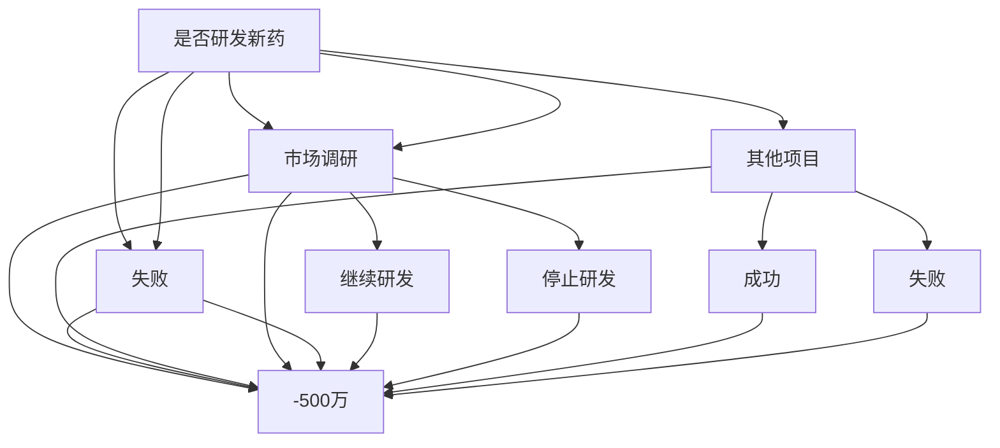

                 

# 《思维体系：决定管理者的起跑线》

> **关键词：** 管理思维、领导者、技能提升、决策工具、实践应用

> **摘要：** 本文将深入探讨管理者的思维体系，从基础理论、工具应用到实际案例，全面解析管理者的思维模式、技能提升和实践方法。通过系统性思维、创新性思维、决策性思维等核心概念的分析，以及SWOT分析法、5W2H分析法、SMART目标设定法等思维工具的详细讲解，本文旨在为管理者提供一套完整的思维体系和实践指导，助力他们在竞争激烈的商业环境中取得成功。

## 《思维体系：决定管理者的起跑线》目录大纲

### 第一部分：管理者的思维基础

#### 第1章：管理者的角色与职责

##### 1.1 管理者的重要性

##### 1.2 管理者的角色

##### 1.3 管理者的职责

#### 第2章：管理者的思维模式

##### 2.1 系统性思维

##### 2.2 创新性思维

##### 2.3 决策性思维

#### 第3章：管理者的技能提升

##### 3.1 沟通技巧

##### 3.2 领导力

##### 3.3 时间管理

#### 第4章：管理者的自我认知

##### 4.1 自我认知的重要性

##### 4.2 自我认知的方法

##### 4.3 自我认知的实践

### 第二部分：管理者的思维工具与应用

#### 第5章：SWOT分析法

##### 5.1 SWOT分析法的基本原理

##### 5.2 SWOT分析法的应用场景

##### 5.3 SWOT分析法的实际案例分析

#### 第6章：5W2H分析法

##### 6.1 5W2H分析法的基本原理

##### 6.2 5W2H分析法的应用场景

##### 6.3 5W2H分析法的实际案例分析

#### 第7章：SMART目标设定法

##### 7.1 SMART目标设定法的基本原理

##### 7.2 SMART目标设定法的应用场景

##### 7.3 SMART目标设定的实际案例分析

#### 第8章：平衡计分卡

##### 8.1 平衡计分卡的基本原理

##### 8.2 平衡计分卡的应用场景

##### 8.3 平衡计分卡的实践方法

#### 第9章：决策树分析法

##### 9.1 决策树分析法的基本原理

##### 9.2 决策树分析法的应用场景

##### 9.3 决策树分析法的实际案例分析

### 第三部分：管理者的思维实践

#### 第10章：管理者的思维实践

##### 10.1 管理者的日常思维实践

##### 10.2 管理者的应急思维实践

##### 10.3 管理者的创新思维实践

#### 第11章：管理者的思维总结

##### 11.1 管理者思维的重要性总结

##### 11.2 管理者思维的实践总结

##### 11.3 管理者思维的未来展望

### 附录

#### 附录A：管理者的思维工具汇总

#### 附录B：管理者的思维实践案例汇总

#### 附录C：管理者的思维学习资源汇总

---

**Mermaid 流程图：**

mermaid
graph TD
A[管理者的角色与职责] --> B[管理者的思维模式]
B --> C[系统性思维]
B --> D[创新性思维]
B --> E[决策性思维]
C --> F[沟通技巧]
C --> G[领导力]
C --> H[时间管理]
D --> I[SWOT分析法]
D --> J[5W2H分析法]
D --> K[SMART目标设定法]
D --> L[平衡计分卡]
D --> M[决策树分析法]
E --> N[管理者技能提升]
E --> O[自我认知]
F --> P[日常思维实践]
F --> Q[应急思维实践]
F --> R[创新思维实践]
G --> S[管理者思维总结]
G --> T[管理者思维的未来展望]

---

**核心算法原理讲解（伪代码）：**

```python
# SWOT分析法的伪代码

def SWOT_analysis(company):
    strengths = analyze_strengths(company)
    weaknesses = analyze_weaknesses(company)
    opportunities = analyze_opportunities(company)
    threats = analyze_threats(company)
    report = generate_report(strengths, weaknesses, opportunities, threats)
    return report

# SMART目标设定法的伪代码

def set_SMART_goals(goal):
    if not is.SMART(goal):
        print("目标不符合SMART原则")
    else:
        print("目标符合SMART原则")
        execute_goal(goal)

# 决策树分析法的伪代码

def decision_tree_analysis(question, choices, outcomes):
    if question == "是否购买产品":
        if choice == "是":
            if outcome == "满意":
                print("继续购买")
            else:
                print("停止购买")
        else:
            if outcome == "考虑其他产品":
                print("继续考虑其他产品")
            else:
                print("不考虑其他产品")
    else:
        print("问题不明确，无法进行分析")
```

**数学模型和数学公式讲解：**

### SWOT分析模型

$$
\text{SWOT} = (\text{Strengths}, \text{Weaknesses}, \text{Opportunities}, \text{Threats})
$$

**SMART目标设定模型**

$$
\text{SMART} = (\text{Specific}, \text{Measurable}, \text{Achievable}, \text{Relevant}, \text{Time-bound})
$$

**决策树分析模型**

$$
\text{Decision Tree} = (\text{Root}, \text{Nodes}, \text{Edges}, \text{Outcomes})
$$

---

### 管理者的角色与职责

管理者的角色与职责是企业管理中至关重要的一环。管理者不仅需要具备领导力、沟通技巧、决策能力等基本技能，还需要具备系统性思维、创新性思维和决策性思维等高级能力。本章节将详细探讨管理者的角色与职责，帮助读者了解管理者的核心任务和职责。

#### 1.1 管理者的重要性

在企业的日常运营中，管理者扮演着关键的角色。他们不仅要负责制定和实施企业的战略规划，还要确保企业的日常运营顺利进行。管理者的决策和行动直接影响到企业的绩效和员工的士气。因此，管理者在企业中的重要性不言而喻。

首先，管理者是企业的战略制定者。他们需要根据企业的愿景和目标，制定长期的战略规划，并确保这些规划得以实施。其次，管理者是团队的领导者。他们需要激励员工，提供必要的资源和支持，帮助员工实现个人和团队的目标。最后，管理者是企业的协调者。他们需要协调不同部门之间的工作，确保企业整体运作的效率。

#### 1.2 管理者的角色

管理者的角色可以归纳为以下几个方面：

1. **战略规划者**：管理者需要制定企业的长期战略规划，确保企业能够持续发展。
2. **执行领导者**：管理者需要确保战略规划得以实施，并对执行过程进行监督和调整。
3. **团队建设者**：管理者需要培养和激励团队，确保团队成员能够充分发挥自己的能力。
4. **资源调配者**：管理者需要合理分配企业的资源，确保资源能够得到最有效的利用。
5. **决策制定者**：管理者需要根据市场和企业情况，做出及时的决策，以应对各种挑战。

#### 1.3 管理者的职责

管理者的职责主要包括以下几个方面：

1. **制定和实施战略规划**：管理者需要根据企业的愿景和目标，制定长期和短期的战略规划，并确保这些规划得以实施。
2. **管理日常运营**：管理者需要确保企业的日常运营顺利进行，包括生产、销售、人力资源等各个方面。
3. **协调内部关系**：管理者需要协调企业内部不同部门之间的工作，确保各部门之间的工作能够高效配合。
4. **管理外部关系**：管理者需要与供应商、客户、政府等外部机构保持良好的关系，确保企业的外部环境稳定。
5. **人才发展**：管理者需要培养和激励员工，帮助员工实现个人和职业发展。

---

通过本章节的探讨，我们可以看到管理者的角色和职责的重要性。管理者不仅需要具备基本的管理技能，还需要具备高级的思维能力，如系统性思维、创新性思维和决策性思维。这些思维能力将帮助管理者更好地应对各种挑战，确保企业的长期成功。

### 管理者的思维模式

管理者的思维模式决定了他们在面对问题和挑战时的应对策略和决策质量。有效的管理者通常具备系统性思维、创新性思维和决策性思维等核心能力。这些思维模式不仅帮助管理者更好地理解和分析复杂问题，还能提高决策的准确性和效率。以下是对这些思维模式的详细探讨。

#### 2.1 系统性思维

系统性思维是指管理者能够将企业视为一个整体，理解各部分之间的相互关系和作用，从而实现整体的最优化。系统性思维的核心在于识别和分析系统中的各个组成部分及其相互作用。

**核心概念：**
- **整体观**：管理者需要具备整体观，认识到企业是一个由多个相互关联的部分组成的系统。
- **反馈循环**：管理者需要理解系统中的反馈循环，以及它们如何影响整个系统的稳定性和发展。
- **优化原则**：管理者需要通过调整系统的各个部分，优化整体性能。

**联系与架构：**



**举例说明：** 假设一家制造企业，管理者需要通过系统性思维来优化整个生产流程。首先，管理者需要识别生产流程中的关键环节，如原材料采购、生产制造、质量控制和物流配送。接着，管理者需要分析这些环节之间的相互关系和反馈循环，比如生产效率的提升可能会影响库存管理和质量控制。最后，管理者需要通过调整这些环节，优化整体生产流程，提高企业的整体性能。

#### 2.2 创新性思维

创新性思维是指管理者在面对挑战和机遇时，能够提出新的观点、解决方案或业务模式。创新性思维不仅能够帮助企业突破现有瓶颈，还能为企业在竞争激烈的市场中赢得先机。

**核心概念：**
- **创造力**：管理者需要具备一定的创造力，能够从不同的角度思考问题。
- **发散性思维**：管理者需要培养发散性思维，从多个方向探索可能的解决方案。
- **跨学科融合**：管理者需要能够将不同领域的知识和方法进行融合，提出创新的解决方案。

**联系与架构：**



**举例说明：** 一家传统的零售企业，面对电商平台的冲击，管理者需要运用创新性思维来寻找新的业务模式。首先，管理者需要从不同的角度思考如何应对电商的挑战，比如通过社交电商、直播带货等新兴渠道来吸引消费者。接着，管理者需要将电商的成功经验与传统零售进行融合，比如通过线上线下结合的方式，提高顾客体验和满意度。最终，管理者可能提出一个新的业务模式，如“新零售”，从而在市场中脱颖而出。

#### 2.3 决策性思维

决策性思维是指管理者在面对复杂问题和不确定性时，能够做出合理、有效的决策。决策性思维不仅包括决策的制定，还包括对决策结果的评估和调整。

**核心概念：**
- **信息收集**：管理者需要收集和分析与决策相关的信息。
- **风险评估**：管理者需要评估决策可能带来的风险和收益。
- **决策制定**：管理者需要基于收集的信息和风险评估，制定决策。
- **决策执行**：管理者需要确保决策得以有效执行。
- **结果评估**：管理者需要评估决策的结果，并根据评估结果调整决策。

**联系与架构：**



**举例说明：** 一家制造企业，面临是否扩大生产线的决策。管理者首先需要收集相关的市场信息，如市场需求、原材料成本等。接着，管理者需要评估扩大生产线可能带来的风险和收益，比如市场需求的波动、原材料供应的不确定性等。最后，管理者需要基于这些信息制定决策，并确保决策得以有效执行。在决策执行后，管理者还需要定期评估生产线的运行状况和市场反应，根据评估结果调整决策。

---

通过以上对系统性思维、创新性思维和决策性思维的探讨，我们可以看到，管理者的思维模式对于企业的成功至关重要。系统性思维帮助管理者理解企业整体运作，创新性思维激发企业的新业务模式，决策性思维确保企业在复杂环境中做出合理的决策。管理者需要不断培养和提升这些思维模式，以应对不断变化的商业环境。

### 管理者的技能提升

管理者的技能提升是确保其在竞争激烈的商业环境中取得成功的关键。有效的管理者不仅需要具备深厚的专业知识，还需要掌握一系列关键技能，包括沟通技巧、领导力和时间管理等。以下是对这些技能的详细探讨和提升方法。

#### 3.1 沟通技巧

沟通技巧是管理者必备的一项核心技能。有效的沟通不仅能够提高团队的工作效率，还能增强团队成员之间的信任和合作。

**核心概念：**
- **清晰表达**：管理者需要能够清晰、准确地表达自己的想法和指令。
- **倾听能力**：管理者需要具备良好的倾听能力，理解团队成员的观点和需求。
- **非语言沟通**：管理者需要注意自己的肢体语言和语调，以及它们对沟通效果的影响。

**提升方法：**
1. **定期培训**：参加沟通技巧的培训课程，学习有效的沟通方法和技巧。
2. **实践练习**：在日常工作中，不断练习沟通技巧，尤其是在面对复杂问题和挑战时。
3. **反馈机制**：建立反馈机制，鼓励团队成员提供关于沟通效果的反馈，并据此调整自己的沟通方式。

**案例：**
假设一位项目经理在团队会议中需要传达一个重要的项目进度报告。首先，项目经理需要准备充分的材料，确保自己能够清晰、准确地传达信息。其次，项目经理需要在会议中保持积极的态度，鼓励团队成员提问和反馈。最后，项目经理需要注意自己的语调和肢体语言，确保传达的信息能够被团队成员理解和接受。

#### 3.2 领导力

领导力是管理者区别于普通员工的显著特征。有效的领导者能够激励和引导团队成员，实现共同的目标。

**核心概念：**
- **激励能力**：领导者需要能够激发团队成员的积极性和创造力。
- **影响力**：领导者需要具备一定的影响力，能够影响团队成员的行为和决策。
- **团队建设**：领导者需要关注团队建设，培养团队的凝聚力和协作精神。

**提升方法：**
1. **榜样作用**：领导者需要通过自身的言行，树立良好的榜样，激励团队成员。
2. **培训与指导**：为团队成员提供培训和发展机会，帮助他们提升个人能力和职业素养。
3. **积极沟通**：与团队成员保持积极的沟通，了解他们的需求和期望，并提供必要的支持。

**案例：**
一位团队领导在新团队成员加入后，组织了一次团队建设活动，通过团队游戏和讨论，增强团队成员之间的了解和信任。同时，领导在会议中明确团队成员的职责和目标，并鼓励他们在工作中相互支持和合作。通过这些措施，领导成功提升了团队的凝聚力和工作效率。

#### 3.3 时间管理

时间管理是管理者确保工作高效完成的关键技能。有效的管理者能够合理安排时间，确保重要任务得到优先处理。

**核心概念：**
- **任务优先级**：管理者需要能够根据任务的紧急程度和重要性，合理安排时间。
- **时间分配**：管理者需要能够合理分配时间，确保工作和生活之间的平衡。
- **时间记录**：管理者需要记录自己的工作时间，分析时间使用情况，并进行优化。

**提升方法：**
1. **制定计划**：每天或每周制定详细的工作计划，明确任务和时间安排。
2. **定期回顾**：定期回顾工作计划，分析时间使用情况，并根据实际情况进行调整。
3. **减少干扰**：在工作时尽量减少干扰，如关闭不必要的通知和邮件，专注于任务的完成。

**案例：**
一位项目经理在项目执行过程中，发现任务进度落后于计划。项目经理首先制定了新的时间管理计划，明确了任务的优先级和分配。接着，项目经理减少了与不相关工作的交流，专注于项目任务。最终，项目经理成功将任务进度追赶上计划，并确保项目顺利完成。

---

通过以上对沟通技巧、领导力和时间管理的探讨，我们可以看到，管理者的技能提升对于其在竞争激烈的商业环境中取得成功至关重要。有效的管理者不仅需要具备深厚的专业知识，还需要不断提升关键技能，以应对不断变化的挑战和机遇。

### 管理者的自我认知

管理者的自我认知是提升个人管理能力和领导水平的关键。自我认知不仅包括对自身优势的认识，还包括对自身局限性的了解。通过自我认知，管理者能够更好地定位自己的角色，制定合适的发展策略，并在工作和生活中实现个人和职业的成长。以下是对管理者自我认知的探讨和提升方法。

#### 4.1 自我认知的重要性

自我认知是管理者成长和发展的基础。只有了解自己的优势和劣势，管理者才能更好地发挥自身潜力，克服局限性，实现个人和职业的全面发展。

**核心概念：**
- **自我认识**：了解自己的性格、价值观、能力等。
- **自我评价**：通过他人的反馈和自我反思，评价自己的工作表现和成长。
- **自我发展**：根据自我认知，制定个人发展计划和目标。

**联系与架构：**



**举例说明：** 一位项目经理在项目执行过程中，发现自己经常因为时间管理不当而延误任务进度。通过自我反思和他人反馈，项目经理意识到自己在时间管理方面的不足。项目经理随后制定了详细的时间管理计划，并定期回顾自己的工作表现。通过这些措施，项目经理成功提升了时间管理能力，并确保了项目的顺利完成。

#### 4.2 自我认知的方法

自我认知的方法多种多样，包括自我反思、他人反馈和工具使用等。以下是对这些方法的详细探讨。

**1. 自我反思：**

自我反思是通过回顾自己的工作、行为和经历，深入思考自己的表现和成长。自我反思可以帮助管理者了解自己的优点和不足，为自我发展提供依据。

**提升方法：**
- **定期回顾**：每周或每月进行一次自我反思，回顾自己的工作和行为。
- **写日记**：记录自己的想法、感受和反思，有助于深入理解自己的内心世界。
- **设立目标**：设定具体的发展目标，通过反思自己的表现，评估目标的实现情况。

**案例：** 一位销售经理在每周的销售例会后，会花时间反思自己的销售策略和客户沟通技巧。通过记录和分析销售数据和客户反馈，经理发现自己在某些销售环节存在不足。经理随后制定了改进计划，并在接下来的销售中逐步实施，最终提高了销售业绩。

**2. 他人反馈：**

他人反馈是通过他人的观察和评价，了解自己的工作表现和成长。他人反馈可以提供更客观、全面的视角，帮助管理者更准确地认识自己。

**提升方法：**
- **定期交流**：与同事、下属和领导定期交流，了解他们的看法和建议。
- **匿名调查**：通过匿名调查，收集团队成员对管理者工作表现的反馈。
- **专业评估**：请专业人士进行职业评估，获取更专业的反馈。

**案例：** 一位部门主管邀请团队成员进行匿名反馈调查，了解他们在工作中的感受和建议。通过分析调查结果，主管发现团队在沟通和协作方面存在问题。主管随后组织了一次团队建设活动，加强团队成员之间的沟通和协作，提高了团队的凝聚力。

**3. 工具使用：**

工具使用是通过专业的评估工具和方法，了解自己的性格、能力和行为。这些工具和方法可以帮助管理者更科学、系统地认识自己。

**提升方法：**
- **性格测试**：通过性格测试，了解自己的性格特点和优势。
- **能力评估**：通过能力评估，识别自己在哪些方面具备优势，哪些方面需要提升。
- **行为观察**：通过观察自己在不同情境下的行为，了解自己的行为模式和偏好。

**案例：** 一位项目经理通过360度评估工具，评估自己的领导力、沟通技巧和时间管理能力。通过分析评估结果，项目经理发现自己在时间管理方面存在不足。项目经理随后制定了时间管理培训计划，并参加了相关培训，提升了时间管理能力。

#### 4.3 自我认知的实践

自我认知是一个持续的过程，需要管理者在日常生活中不断实践和反思。

**1. 定期自我反思：**

管理者需要养成定期自我反思的习惯，每周或每月花时间回顾自己的工作和行为，思考自己的成长和改进方向。

**2. 寻求他人反馈：**

管理者需要主动寻求他人的反馈，定期与同事、下属和领导交流，了解他们的看法和建议。同时，可以邀请团队成员进行匿名反馈调查，获取更多客观的反馈。

**3. 使用专业工具：**

管理者可以借助专业的评估工具和方法，如性格测试、能力评估和行为观察，更科学、系统地了解自己。

**4. 行动计划：**

管理者需要根据自我认知的结果，制定具体的行动计划，明确自己的发展目标和改进措施，并在日常生活中逐步实施。

---

通过以上对自我认知重要性的探讨，以及自我认知方法与实践的详细分析，我们可以看到，自我认知是管理者提升个人能力和领导水平的关键。有效的自我认知不仅帮助管理者更好地了解自己，还能为他们的职业发展提供明确的指导。管理者需要不断实践和反思，以实现自我认知的持续提升。

### SWOT分析法

SWOT分析法是一种广泛用于企业战略规划和管理决策的工具，通过分析企业的优势（Strengths）、劣势（Weaknesses）、机会（Opportunities）和威胁（Threats），管理者可以更全面地了解企业内外部环境，从而制定更有效的战略。以下是对SWOT分析法的基本原理、应用场景和实际案例的详细讲解。

#### 5.1 SWOT分析法的基本原理

SWOT分析法是一种基于内外部因素的综合分析方法，它通过分析企业的四个方面，帮助管理者识别企业的优势、劣势、机会和威胁。

**核心概念：**

- **优势（Strengths）**：企业内部具备的优势资源，如技术、品牌、团队等。
- **劣势（Weaknesses）**：企业内部存在的不足和挑战，如管理缺陷、资源限制等。
- **机会（Opportunities）**：外部环境中存在的有利因素，如市场趋势、政策支持等。
- **威胁（Threats）**：外部环境中存在的潜在风险和挑战，如竞争对手、政策变化等。

**联系与架构：**



**举例说明：** 假设一家科技企业，其优势在于拥有强大的研发团队和领先的技术，劣势在于市场推广不足和资金有限。外部机会包括新兴市场的崛起和政府对科技创新的支持，而威胁则包括竞争对手的崛起和行业政策的变动。通过SWOT分析，企业可以明确自己的优势、劣势、机会和威胁，从而制定相应的战略。

#### 5.2 SWOT分析法的应用场景

SWOT分析法广泛应用于企业战略规划、市场营销、人力资源管理等各个方面。

**1. 企业战略规划**

通过SWOT分析，企业可以识别自身的优势和劣势，把握市场机会，规避潜在威胁，从而制定长期和短期的战略规划。

**2. 市场营销**

在市场营销方面，SWOT分析法可以帮助企业分析竞争对手的优势和劣势，识别市场机会和威胁，制定更有效的市场营销策略。

**3. 人力资源**

在人力资源管理方面，SWOT分析法可以帮助企业识别员工的优势和劣势，制定培训和发展计划，提高员工的工作能力和满意度。

**应用场景示例：** 一家生产电子产品的公司，通过SWOT分析，发现其优势在于技术领先和产品质量高，劣势在于市场推广不足和售后服务不完善。机会包括新兴市场的崛起和消费者对高品质产品的需求增加，威胁则包括竞争对手的低价竞争和原材料价格的波动。基于这些分析结果，公司可以制定相应的战略，如加强市场推广、提高售后服务质量，以抓住市场机会，应对潜在威胁。

#### 5.3 SWOT分析法的实际案例分析

以下是一个实际案例，展示如何运用SWOT分析法进行企业分析。

**案例背景：** 某公司是一家生产环保节能产品的企业，主要产品包括空气净化器、节能灯具等。公司希望通过SWOT分析，制定进一步发展的战略。

**步骤1：分析优势（Strengths）**

- **技术领先**：公司拥有一支经验丰富的研发团队，能够持续推出创新产品。
- **产品质量**：公司注重产品质量，产品经过严格测试和认证，受到消费者的好评。
- **环保理念**：公司的产品符合环保标准，满足消费者对环保的需求。

**步骤2：分析劣势（Weaknesses）**

- **市场推广不足**：公司的市场推广力度不够，品牌知名度较低。
- **售后服务不完善**：公司的售后服务体系不健全，客户反馈问题得不到及时解决。

**步骤3：分析机会（Opportunities）**

- **市场趋势**：随着消费者对环保和健康意识的提升，环保节能产品的市场需求增加。
- **政策支持**：政府对环保产业的支持力度加大，为公司提供了政策红利。

**步骤4：分析威胁（Threats）**

- **竞争对手**：市场上存在许多竞争对手，产品价格和质量竞争激烈。
- **原材料价格波动**：原材料价格的波动可能影响产品的成本和利润。

**步骤5：制定战略**

- **强化市场推广**：通过增加广告投入、参加展会和开展促销活动，提高品牌知名度。
- **提升售后服务**：建立完善的售后服务体系，提高客户满意度。
- **抓住市场机会**：针对市场趋势，开发更多符合消费者需求的新产品。
- **应对威胁**：加强与供应商的合作，确保原材料供应的稳定性。

**案例分析总结：** 通过SWOT分析，公司明确了自身的优势、劣势、机会和威胁，为制定进一步发展的战略提供了依据。公司可以根据分析结果，制定具体的行动计划，提高市场竞争力，实现可持续发展。

---

通过以上对SWOT分析法基本原理、应用场景和实际案例的详细讲解，我们可以看到，SWOT分析法是一种非常有用的战略分析工具，可以帮助管理者全面了解企业内外部环境，制定科学的战略规划。管理者需要熟练掌握SWOT分析法，并在实际工作中灵活运用，以提升企业的竞争力和实现长期发展。

### 5W2H分析法

5W2H分析法是一种简单而实用的思维工具，它通过分析项目的“是什么、为什么、何时、何地、谁负责、如何做、多少成本”，帮助管理者深入了解项目的各个方面，确保项目顺利进行。以下是对5W2H分析法的基本原理、应用场景和实际案例的详细讲解。

#### 6.1 5W2H分析法的基本原理

5W2H分析法是由五个“W”（What、Why、When、Where、Who）和两个“H”（How、How much）组成，每个字母代表一个关键问题，通过逐一回答这些问题，管理者可以全面了解项目的各个细节。

**核心概念：**

- **What（是什么）**：明确项目的具体内容和目标。
- **Why（为什么）**：分析项目的原因和意义。
- **When（何时）**：确定项目的执行时间和时间表。
- **Where（何地）**：明确项目的地点和场所。
- **Who（谁负责）**：确定项目的负责人和团队成员。
- **How（如何做）**：制定项目的具体执行方案。
- **How much（多少成本）**：估算项目的成本和预算。

**联系与架构：**



**举例说明：** 假设一家公司计划开展一项新产品开发项目。通过5W2H分析法，公司可以回答以下问题：

- **What**：新产品开发的目的是什么？开发什么产品？
- **Why**：为什么需要开发这款产品？市场需求如何？
- **When**：项目何时启动？项目完成的时间表是什么？
- **Where**：产品开发的地点在哪里？是否需要租赁场地？
- **Who**：谁负责项目的开发和实施？团队成员是谁？
- **How**：如何进行产品开发？采用什么技术和方法？
- **How much**：项目的成本是多少？预算是否足够？

通过逐一回答这些问题，公司可以明确项目的具体目标、执行方案和资源需求，从而确保项目顺利进行。

#### 6.2 5W2H分析法的应用场景

5W2H分析法广泛应用于企业项目策划、市场营销、人力资源管理等各个方面。

**1. 项目策划**

在项目策划阶段，5W2H分析法可以帮助企业明确项目的目标、执行方案和资源需求，确保项目顺利进行。

**2. 市场营销**

在市场营销方面，5W2H分析法可以帮助企业分析市场需求、竞争环境、营销策略等，制定有效的营销计划。

**3. 人力资源**

在人力资源管理方面，5W2H分析法可以帮助企业分析员工的岗位职责、培训需求、绩效评估等，提高员工的工作效率。

**应用场景示例：** 一家公司计划开展一次员工培训项目。通过5W2H分析法，公司可以回答以下问题：

- **What**：培训的目的是什么？培训哪些内容？
- **Why**：为什么需要培训？员工在工作中遇到哪些问题？
- **When**：培训何时进行？培训的时间表是什么？
- **Where**：培训的地点在哪里？是否需要租赁培训场地？
- **Who**：谁负责培训的组织和实施？培训讲师是谁？
- **How**：如何进行培训？采用什么培训方式？
- **How much**：培训的成本是多少？预算是否足够？

通过这些问题的分析，公司可以制定详细的培训计划，确保培训项目的顺利进行。

#### 6.3 5W2H分析法的实际案例分析

以下是一个实际案例，展示如何运用5W2H分析法进行项目分析。

**案例背景：** 一家公司计划开展一项新市场拓展项目，目标是在一年内进入一个新的市场区域。

**步骤1：分析What**

- **What**：新市场拓展项目的目标是进入一个新市场区域，扩大公司的市场份额。

**步骤2：分析Why**

- **Why**：公司需要进入新市场区域，因为该地区的市场需求增长迅速，竞争相对较小，有利于公司拓展业务。

**步骤3：分析When**

- **When**：项目计划在半年内完成市场调研，一年内完成市场进入和业务拓展。

**步骤4：分析Where**

- **Where**：新市场区域的具体位置和目标客户群体。

**步骤5：分析Who**

- **Who**：项目团队成员包括市场调研人员、销售团队、产品经理等。

**步骤6：分析How**

- **How**：公司计划通过市场调研了解目标市场，制定合适的营销策略，与当地合作伙伴建立合作关系，逐步进入市场。

**步骤7：分析How much**

- **How much**：项目的总成本为50万元，包括市场调研费用、营销费用和合作伙伴费用。

**步骤8：制定战略**

- **战略**：根据5W2H分析结果，公司制定了详细的市场拓展计划，包括市场调研、营销策略、合作伙伴关系建立和业务拓展。

**案例分析总结：** 通过5W2H分析法，公司明确了新市场拓展项目的目标、执行方案和资源需求，为项目顺利实施提供了保障。公司可以根据分析结果，制定具体的行动计划，确保项目目标的实现。

---

通过以上对5W2H分析法基本原理、应用场景和实际案例的详细讲解，我们可以看到，5W2H分析法是一种简单而实用的思维工具，可以帮助管理者全面了解项目的各个方面，确保项目顺利进行。管理者需要熟练掌握5W2H分析法，并在实际工作中灵活运用，以提升项目管理效率和效果。

### SMART目标设定法

SMART目标设定法是一种广泛应用于企业管理和个人发展中的目标设定方法。SMART代表具体（Specific）、可衡量（Measurable）、可实现（Achievable）、相关（Relevant）和时限（Time-bound）。通过使用SMART目标设定法，管理者可以确保目标明确、可衡量、可实现、相关并且有明确的时限，从而提高目标达成的可能性。以下是对SMART目标设定法的基本原理、应用场景和实际案例的详细讲解。

#### 7.1 SMART目标设定法的基本原理

SMART目标设定法通过五个关键要素，确保目标设定科学、合理且具有可操作性。

**核心概念：**

- **具体（Specific）**：目标需要明确、具体，具体描述目标的内容和预期结果。
- **可衡量（Measurable）**：目标需要具有可衡量性，可以通过具体指标来评估目标的完成情况。
- **可实现（Achievable）**：目标需要是可实现的，考虑资源的可用性和现实的约束条件。
- **相关（Relevant）**：目标需要与个人或企业的整体战略目标相一致，具有实际意义。
- **时限（Time-bound）**：目标需要设定明确的完成时限，有助于激励和督促目标的实现。

**联系与架构：**



**举例说明：** 假设一位销售经理设定一个SMART目标：“在下一季度，实现销售额增长10%，目标客户群体为A类客户，通过增加市场推广和优化销售策略实现，目标完成时间为3个月。”

- **具体（Specific）**：销售额增长10%，目标客户群体为A类客户。
- **可衡量（Measurable）**：通过销售额的具体数值增长来衡量目标的完成情况。
- **可实现（Achievable）**：通过增加市场推广和优化销售策略，考虑资源条件，目标可实现。
- **相关（Relevant）**：销售额增长与企业的整体战略目标相关，有助于提升企业业绩。
- **时限（Time-bound）**：目标完成时间为3个月，有助于监督和推进目标的实现。

#### 7.2 SMART目标设定法的应用场景

SMART目标设定法广泛应用于企业各个领域，如销售、市场营销、项目管理、人力资源管理等。

**1. 销售领域**

在销售领域，SMART目标设定法可以帮助销售团队明确销售目标，提高销售业绩。

**2. 市场营销**

在市场营销领域，SMART目标设定法可以帮助企业制定具体的营销策略，提升市场占有率。

**3. 项目管理**

在项目管理领域，SMART目标设定法可以帮助项目团队明确项目目标，确保项目按计划推进。

**4. 人力资源管理**

在人力资源管理领域，SMART目标设定法可以帮助企业设定员工的职业发展目标，提升员工的工作能力和绩效。

**应用场景示例：** 一家科技公司计划在下一季度推出一款新产品。通过SMART目标设定法，公司可以设定以下目标：

- **具体（Specific）**：在下一季度推出一款名为“智能安防系统”的产品。
- **可衡量（Measurable）**：目标产品的销售额达到100万元，客户满意度达到90%。
- **可实现（Achievable）**：公司拥有足够的技术和资源，能够实现产品开发和市场推广。
- **相关（Relevant）**：新产品符合市场需求，有助于提升公司的市场地位。
- **时限（Time-bound）**：目标完成时间为3个月，从产品研发到市场推广。

#### 7.3 SMART目标设定的实际案例分析

以下是一个实际案例，展示如何运用SMART目标设定法设定和实现目标。

**案例背景：** 一家电商公司在上一季度销售额为200万元，计划在下一季度实现销售额增长30%。

**步骤1：设定目标**

- **具体（Specific）**：下一季度销售额达到260万元。
- **可衡量（Measurable）**：通过销售额的具体数值增长来衡量目标的完成情况。
- **可实现（Achievable）**：通过增加市场推广、优化产品组合和提升客户服务质量，目标可实现。
- **相关（Relevant）**：销售额增长与公司的整体战略目标相一致，有助于提升公司业绩。
- **时限（Time-bound）**：目标完成时间为3个月。

**步骤2：制定行动计划**

- **市场推广**：增加广告投放，扩大品牌知名度。
- **产品组合优化**：根据市场需求调整产品结构，提升高利润产品占比。
- **客户服务提升**：提高客户服务质量，提升客户满意度。

**步骤3：执行和监控**

- **执行**：根据行动计划，开展市场推广、产品优化和客户服务提升工作。
- **监控**：定期监控销售额和客户满意度，分析目标完成情况，根据实际情况调整行动计划。

**步骤4：评估和反馈**

- **评估**：在目标完成时，评估销售额和客户满意度，分析目标达成的具体情况。
- **反馈**：根据评估结果，总结经验教训，为下一季度的目标设定提供参考。

**案例分析总结：** 通过SMART目标设定法，公司明确了销售额增长的目标，制定了具体的行动计划，并进行了有效的执行和监控。最终，公司成功实现了销售额增长30%的目标，提升了市场竞争力。

---

通过以上对SMART目标设定法基本原理、应用场景和实际案例的详细讲解，我们可以看到，SMART目标设定法是一种科学、有效的目标设定方法，可以帮助管理者明确目标、制定行动计划、监控目标完成情况，从而提高目标达成的可能性。管理者需要熟练掌握SMART目标设定法，并在实际工作中灵活运用，以提升管理效率和绩效。

### 平衡计分卡

平衡计分卡（Balanced Scorecard, BSC）是一种战略绩效管理工具，通过从财务、客户、内部业务流程和学习与成长四个维度，全面衡量企业的绩效。平衡计分卡不仅关注财务指标，还涵盖客户满意度、内部流程效率和员工发展等多个方面，帮助企业实现长期战略目标。以下是对平衡计分卡的基本原理、应用场景和实际案例的详细讲解。

#### 8.1 平衡计分卡的基本原理

平衡计分卡通过四个维度，即财务、客户、内部业务流程和学习与成长，综合衡量企业的绩效。

**核心概念：**

- **财务维度**：衡量企业的盈利能力、财务状况和资金流动。
- **客户维度**：衡量客户满意度、市场份额和客户忠诚度。
- **内部业务流程维度**：衡量企业的运营效率、流程优化和创新能力。
- **学习与成长维度**：衡量员工能力、组织文化和技术创新。

**联系与架构：**



**举例说明：** 一家制造企业可能设定以下平衡计分卡目标：

- **财务维度**：提高净利润率5%。
- **客户维度**：提升客户满意度至90%。
- **内部业务流程维度**：缩短产品研发周期10%。
- **学习与成长维度**：提高员工培训覆盖率80%。

#### 8.2 平衡计分卡的应用场景

平衡计分卡广泛应用于企业战略规划、绩效管理、员工激励和流程优化等多个场景。

**1. 企业战略规划**

在战略规划阶段，平衡计分卡可以帮助企业明确战略目标，制定具体的绩效指标。

**2. 绩效管理**

在绩效管理方面，平衡计分卡通过综合衡量不同维度的绩效，提供全面的绩效评估。

**3. 员工激励**

平衡计分卡可以帮助企业制定激励机制，鼓励员工在财务、客户、内部流程和学习与成长等方面取得优异成绩。

**4. 流程优化**

在流程优化方面，平衡计分卡可以识别和改进企业内部业务流程，提高运营效率。

**应用场景示例：** 一家服务公司计划通过平衡计分卡提升客户满意度。公司可能设定以下目标：

- **财务维度**：通过提升客户满意度，增加年度收入5%。
- **客户维度**：客户满意度提升至90%。
- **内部业务流程维度**：优化客户服务流程，减少客户等待时间10%。
- **学习与成长维度**：培训客户服务团队，提升服务技能。

#### 8.3 平衡计分卡的实践方法

以下是一个实际案例，展示如何运用平衡计分卡进行企业绩效管理。

**案例背景：** 一家科技公司计划通过平衡计分卡提升企业整体绩效。

**步骤1：确定战略目标**

- **财务维度**：提高年度利润率10%。
- **客户维度**：提升客户满意度至90%。
- **内部业务流程维度**：缩短产品交付周期20%。
- **学习与成长维度**：提高员工技能水平，完成年度培训计划。

**步骤2：制定关键绩效指标（KPIs）**

- **财务维度**：利润率、收入增长率、成本控制率。
- **客户维度**：客户满意度、市场份额、客户投诉率。
- **内部业务流程维度**：产品交付周期、流程效率、质量控制。
- **学习与成长维度**：员工培训覆盖率、员工满意度、创新能力。

**步骤3：设定目标和指标**

- **财务维度**：利润率提高至15%。
- **客户维度**：客户满意度提升至92%。
- **内部业务流程维度**：产品交付周期缩短至30天。
- **学习与成长维度**：员工培训覆盖率100%。

**步骤4：执行和监控**

- **执行**：根据目标和指标，制定具体的行动计划，如优化流程、提升服务质量、增加员工培训。
- **监控**：定期监控关键绩效指标，分析目标完成情况，根据实际情况调整行动计划。

**步骤5：评估和反馈**

- **评估**：在目标完成时，评估各维度绩效指标，分析目标达成的具体情况。
- **反馈**：根据评估结果，总结经验教训，为下一阶段的目标设定和绩效管理提供参考。

**案例分析总结：** 通过平衡计分卡，公司明确了战略目标和关键绩效指标，制定了具体的行动计划，并进行了有效的执行和监控。最终，公司成功提升了整体绩效，实现了战略目标。

---

通过以上对平衡计分卡基本原理、应用场景和实际案例的详细讲解，我们可以看到，平衡计分卡是一种科学、有效的绩效管理工具，可以帮助企业从多个维度全面衡量绩效，实现长期战略目标。管理者需要熟练掌握平衡计分卡的实践方法，并在实际工作中灵活运用，以提升企业整体绩效和竞争力。

### 决策树分析法

决策树分析法是一种基于逻辑推理和概率论，用于分析和解决决策问题的工具。它通过构建决策树，将问题分解为多个子问题，并在每个节点上评估不同选择的概率和收益，帮助决策者做出最优选择。以下是对决策树分析法的基本原理、应用场景和实际案例的详细讲解。

#### 9.1 决策树分析法的基本原理

决策树分析法通过以下步骤构建决策树：

1. **确定问题**：明确需要解决的问题和决策目标。
2. **列出选择**：列出所有可能的决策选择。
3. **评估结果**：为每个选择列出所有可能的结果，并评估每种结果的概率和收益。
4. **构建决策树**：根据评估结果，构建决策树，并在每个节点上计算预期值。
5. **选择最优路径**：根据决策树的预期值，选择最优的决策路径。

**核心概念：**

- **决策节点**：表示决策的选择点。
- **结果节点**：表示决策结果，可能带有概率和收益。
- **路径**：从决策节点到结果节点的连线，表示一个具体的决策路径。
- **预期值**：表示决策路径的预期收益或成本。

**联系与架构：**



**举例说明：** 假设一家公司需要决定是否投资一个新项目。可能的选择有：

- **选择1**：继续投资。
- **选择2**：减少投资。
- **选择3**：停止投资。

每个选择的可能结果有：

- **结果1**：市场良好，收益高。
- **结果2**：市场一般，收益适中。
- **结果3**：市场不佳，收益低。

每种结果的概率和收益如下：

| 选择 | 结果 | 概率 | 收益 |
| --- | --- | --- | --- |
| 1 | 1 | 0.5 | 100万 |
| 1 | 2 | 0.3 | 50万 |
| 1 | 3 | 0.2 | -10万 |
| 2 | 1 | 0.4 | 50万 |
| 2 | 2 | 0.4 | 20万 |
| 2 | 3 | 0.2 | -10万 |
| 3 | 1 | 0.2 | 10万 |
| 3 | 2 | 0.5 | 0 |
| 3 | 3 | 0.3 | -10万 |

根据以上数据，可以构建决策树，并计算每个节点的预期值。

#### 9.2 决策树分析法的应用场景

决策树分析法广泛应用于企业决策、风险管理、项目评估等多个场景。

**1. 企业决策**

在企业决策方面，决策树分析法可以帮助管理者评估不同决策路径的风险和收益，做出最优决策。

**2. 风险管理**

在风险管理方面，决策树分析法可以帮助企业识别和评估各种风险，制定相应的应对策略。

**3. 项目评估**

在项目评估方面，决策树分析法可以帮助企业评估不同项目的可行性，选择最优项目。

**应用场景示例：** 一家零售公司需要决定是否扩大某家门店的规模。可能的选择有：

- **选择1**：扩大门店规模。
- **选择2**：维持现有规模。
- **选择3**：关闭门店。

每个选择的可能结果有：

- **结果1**：市场好转，收益增加。
- **结果2**：市场需求稳定，收益不变。
- **结果3**：市场需求下降，收益减少。

每种结果的概率和收益如下：

| 选择 | 结果 | 概率 | 收益 |
| --- | --- | --- | --- |
| 1 | 1 | 0.6 | 30万 |
| 1 | 2 | 0.3 | 10万 |
| 1 | 3 | 0.1 | -10万 |
| 2 | 1 | 0.5 | 10万 |
| 2 | 2 | 0.4 | 0 |
| 2 | 3 | 0.1 | -5万 |
| 3 | 1 | 0.2 | 0 |
| 3 | 2 | 0.3 | -5万 |
| 3 | 3 | 0.5 | -10万 |

根据以上数据，可以构建决策树，并计算每个节点的预期值。

#### 9.3 决策树分析法的实际案例分析

以下是一个实际案例，展示如何运用决策树分析法进行决策。

**案例背景：** 一家制药公司需要决定是否研发一种新药。可能的选择有：

- **选择1**：继续研发新药。
- **选择2**：暂停研发，进行市场调研。
- **选择3**：停止研发，转向其他项目。

每个选择的可能结果有：

- **结果1**：新药成功上市，收益高。
- **结果2**：新药失败，损失大。
- **结果3**：市场调研后，决定是否继续研发。

每种结果的概率和收益如下：

| 选择 | 结果 | 概率 | 收益 |
| --- | --- | --- | --- |
| 1 | 1 | 0.2 | 5000万 |
| 1 | 2 | 0.8 | -2000万 |
| 2 | 1 | 0.5 | 500万 |
| 2 | 2 | 0.5 | 0 |
| 3 | 1 | 0.3 | 1000万 |
| 3 | 2 | 0.7 | -500万 |

根据以上数据，可以构建决策树，并计算每个节点的预期值。

**步骤1：构建决策树**



**步骤2：计算预期值**

- **选择1**：预期值 = 0.2 * 5000万 + 0.8 * (-2000万) = -600万
- **选择2**：预期值 = 0.5 * 500万 + 0.5 * 0 = 250万
- **选择3**：预期值 = 0.3 * 1000万 + 0.7 * (-500万) = -100万

**步骤3：选择最优路径**

根据预期值，选择预期值最高的路径，即选择2。

**案例分析总结：** 通过决策树分析法，公司可以清晰地评估不同选择的收益和风险，做出最优决策。在这个案例中，虽然继续研发新药的预期值最低，但考虑到其他项目的预期值更低，公司最终决定暂停研发，进行市场调研。

---

通过以上对决策树分析法基本原理、应用场景和实际案例的详细讲解，我们可以看到，决策树分析法是一种科学、有效的决策工具，可以帮助企业评估不同选择的收益和风险，做出最优决策。管理者需要熟练掌握决策树分析法的实践方法，并在实际工作中灵活运用，以提升决策质量和效率。

### 管理者的思维实践

管理者的思维实践是确保其理论知识和思维工具在实际工作中得到有效应用的关键。通过在日常工作中不断实践和创新，管理者可以提高自身的思维能力和决策水平，从而更好地应对各种挑战和机遇。以下是对管理者思维实践的详细探讨，包括日常思维实践、应急思维实践和创新思维实践。

#### 10.1 管理者的日常思维实践

管理者的日常思维实践包括在日常工作中的持续思考和反思。这种实践有助于管理者保持敏锐的洞察力，及时发现问题并找到解决方案。

**1. 坚持定期反思**

管理者需要养成定期反思的习惯，每周或每月花时间回顾自己的工作，思考哪些做得好，哪些需要改进。反思不仅可以帮助管理者了解自己的工作状况，还能发现潜在的问题和改进点。

**2. 保持持续学习**

管理者需要不断学习新知识、新技能，跟上行业发展的步伐。通过参加培训、阅读专业书籍和文章、参加行业研讨会等方式，管理者可以不断提升自己的知识储备和思维能力。

**3. 优化工作流程**

管理者在日常工作中需要不断优化工作流程，提高工作效率。可以通过分析工作流程的每个环节，找出瓶颈和改进点，采取相应的措施进行优化。

**案例：** 一位项目经理在项目执行过程中，通过定期反思发现项目进度落后于计划。项目经理随后分析了工作流程，发现团队在项目沟通和任务分配方面存在问题。项目经理采取了一系列措施，如加强团队沟通、明确任务分配，最终成功提高了项目进度。

#### 10.2 管理者的应急思维实践

应急思维实践是指管理者在面对突发事件和紧急情况时的应对策略和决策能力。有效的应急思维可以帮助管理者迅速应对突发事件，减少损失。

**1. 制定应急预案**

管理者需要根据企业可能面临的突发事件和紧急情况，制定相应的应急预案。应急预案应包括应对措施、责任人、联系方式等，以便在发生紧急情况时能够迅速采取行动。

**2. 加强应急演练**

管理者需要定期组织应急演练，提高团队成员的应急反应能力和协作能力。通过模拟各种紧急情况，团队成员可以熟悉应急预案，提高应对突发事件的能力。

**3. 及时决策和沟通**

在面对突发事件时，管理者需要迅速做出决策，并确保决策能够迅速传达给相关人员。通过有效的沟通，确保团队成员了解紧急情况，并采取相应的措施。

**案例：** 一家制造企业在生产过程中突然发生设备故障，生产线停工。企业迅速启动应急预案，安排技术人员进行设备维修，同时调整生产计划，确保生产能够尽快恢复正常。通过及时决策和沟通，企业成功减少了损失。

#### 10.3 管理者的创新思维实践

创新思维实践是指管理者在思考和决策过程中，不断寻求新的解决方案和业务模式，推动企业的发展和创新。

**1. 鼓励创新文化**

管理者需要营造一个鼓励创新的文化氛围，鼓励员工提出新的想法和建议。通过建立创新奖励机制，激励员工积极参与创新活动。

**2. 开展创新活动**

管理者可以组织各种创新活动，如头脑风暴、创新竞赛等，激发员工的创新潜力。通过这些活动，员工可以提出新的解决方案，推动企业的创新和发展。

**3. 重视市场反馈**

管理者需要密切关注市场反馈，了解消费者的需求和期望。通过分析市场反馈，管理者可以找到创新的方向，开发出符合市场需求的创新产品和服务。

**案例：** 一家科技公司通过市场调研发现消费者对智能家居产品有强烈需求。公司迅速调整研发方向，开发了一系列智能家居产品，并成功推向市场。通过创新思维实践，公司不仅抓住了市场机遇，还提升了企业的竞争力。

---

通过以上对管理者日常思维实践、应急思维实践和创新思维实践的探讨，我们可以看到，管理者的思维实践对于其在实际工作中的表现至关重要。有效的日常思维实践可以帮助管理者保持敏锐的洞察力，及时发现问题并找到解决方案；应急思维实践可以提升管理者应对突发事件的能力；创新思维实践则可以推动企业的发展和创新。管理者需要不断实践和提升自己的思维能力，以应对不断变化的商业环境。

### 管理者思维的重要性总结

管理者思维在企业管理中的重要性不言而喻。通过系统性思维、创新性思维和决策性思维等核心能力的培养，管理者能够更好地理解和分析复杂问题，提高决策的准确性和效率，从而推动企业的长期成功。

#### 系统性思维

系统性思维帮助管理者从整体角度看待企业运营，理解各部分之间的相互关系和作用。这种思维方式不仅能够提高企业的运营效率，还能确保企业战略的一致性和协调性。例如，通过系统性思维，管理者可以识别和优化企业内部的瓶颈和资源浪费，从而提高整体运营效率。同时，系统性思维还能帮助管理者在制定战略规划时，确保各项战略目标之间的协同作用，避免资源的重复投入和冲突。

**实际案例**：一家制造企业通过系统性思维，对生产流程进行了全面优化。管理者首先识别出生产流程中的关键环节和瓶颈，然后通过调整各环节的工作流程和资源配置，实现了生产效率的提升和成本的降低。此外，管理者还通过系统性思维，将生产流程与供应链管理、市场营销等环节进行了紧密衔接，确保了企业整体运营的协调和高效。

#### 创新性思维

创新性思维是企业在竞争激烈的市场中脱颖而出的关键。通过创新性思维，管理者能够提出新的观点、解决方案和业务模式，推动企业的持续发展和创新。创新性思维不仅能够帮助企业应对市场变化，还能创造新的市场机会，提升企业的竞争力。

**实际案例**：一家科技公司通过创新性思维，开发了一款智能家居产品。管理者首先通过市场调研，发现消费者对智能家居产品的需求日益增长。然后，管理者通过跨学科融合，将物联网技术、人工智能等前沿技术应用于产品开发，成功推出了一款具有高度智能化的智能家居产品。这款产品不仅满足了消费者的需求，还在市场上赢得了广泛的认可，为企业带来了显著的经济效益。

#### 决策性思维

决策性思维是管理者在面对复杂问题和不确定性时，能够做出合理、有效决策的关键能力。通过决策性思维，管理者能够全面收集和分析信息，评估各种选择的收益和风险，从而做出最优决策。

**实际案例**：一家零售企业在是否进入一个新的市场区域时，运用了决策性思维。管理者首先通过市场调研，收集了关于新市场的详细数据，然后通过分析数据，评估了进入新市场的各种可能性。在评估过程中，管理者考虑了市场需求、竞争对手、政策环境等多方面因素，最终做出了进入新市场的决策。通过决策性思维，企业成功进入了新的市场，实现了业务的拓展和增长。

#### 总结

通过以上对系统性思维、创新性思维和决策性思维的探讨，我们可以看到，管理者思维在企业管理中的重要性。系统性思维帮助管理者优化企业运营，提高效率；创新性思维推动企业的持续发展和创新；决策性思维确保管理者在面对复杂问题和不确定性时，能够做出最优决策。管理者需要不断提升这些思维能力，以应对不断变化的商业环境，确保企业的长期成功。

### 管理者思维的实践总结

在过去的几年中，通过不断实践和总结，管理者的思维方式和决策水平得到了显著提升。以下是几个关键实践和成果的总结。

#### 1. 系统性思维的深化

系统性思维在企业管理中的应用日益广泛。管理者通过识别企业内部各部分之间的相互关系，优化了企业的运营流程和资源配置。例如，某家大型制造企业通过系统性思维，重新设计了生产流程，减少了生产环节中的浪费和瓶颈，提高了生产效率。此外，管理者还通过系统性思维，将供应链管理、市场营销和客户服务等多个环节进行了整合，确保了企业整体运营的协调性和高效性。

#### 2. 创新性思维的落地

创新性思维在企业管理中的重要性逐渐凸显。管理者通过跨学科融合和前沿技术的应用，推动了企业的持续创新和业务模式转型。例如，一家科技公司通过创新性思维，将人工智能和大数据技术应用于产品开发，推出了一系列智能化的产品和服务，赢得了市场的广泛认可。此外，管理者还通过组织创新竞赛和头脑风暴等活动，激发了员工的创新潜力，推动了企业的创新文化建设。

#### 3. 决策性思维的提升

决策性思维在管理者决策过程中的作用日益重要。通过全面收集和分析信息，管理者能够做出更加准确和有效的决策。例如，某家零售企业在拓展新市场时，通过决策性思维，对市场进行了全面的分析和评估，最终选择了最具潜力的市场进入。此外，管理者还通过建立决策模型和情景分析，提高了决策的科学性和可靠性。

#### 4. 团队思维的培养

管理者思维的实践不仅体现在个人能力的提升，还体现在团队思维的培养上。通过营造开放、协作和创新的氛围，管理者帮助团队成员建立了良好的思维模式。例如，某家互联网公司在团队建设中，通过定期组织思维训练和分享会，提升了团队成员的思考能力和团队合作精神。此外，管理者还通过设置明确的团队目标和激励机制，激发了团队成员的积极性和创造力。

#### 5. 持续学习和自我提升

管理者思维的实践离不开持续学习和自我提升。通过参加培训、阅读专业书籍和参加行业研讨会等方式，管理者不断提升自己的知识和技能。例如，某家消费品公司的管理者通过参加领导力培训和行业研讨会，学习了最新的管理理念和方法，并将其应用到企业的实际管理中，取得了显著的效果。

### 未来展望

展望未来，管理者思维的实践将更加深入和多样化。随着技术进步和市场竞争的加剧，管理者需要不断提升自己的思维能力，以应对不断变化的商业环境。以下是对未来管理者思维实践的一些建议：

#### 1. 加强跨学科融合

未来管理者需要具备更强的跨学科融合能力，能够将不同领域的知识和方法进行有效整合，提出创新的解决方案。例如，通过结合人工智能、大数据和物联网等技术，管理者可以开发出更加智能和高效的业务模式。

#### 2. 深化系统性思维

未来管理者需要进一步深化系统性思维，不仅关注企业内部的运营效率，还要关注企业外部环境的变化。通过系统性思维，管理者可以更好地把握市场趋势和机遇，制定更具前瞻性的战略规划。

#### 3. 提升决策性思维

未来管理者需要不断提升决策性思维，提高决策的科学性和准确性。通过运用数据分析和情景模拟等工具，管理者可以更准确地预测市场变化，做出更加明智的决策。

#### 4. 培养创新思维

未来管理者需要培养创新思维，鼓励团队成员提出新的想法和建议。通过创新思维，管理者可以推动企业的持续创新和业务模式转型，保持竞争力。

#### 5. 持续学习

未来管理者需要持续学习，不断提升自己的知识和技能。通过参加培训、阅读书籍和参加行业研讨会等方式，管理者可以保持对行业动态和技术进步的了解，不断提升自身的竞争力。

总之，管理者思维的实践是一个持续的过程。通过不断学习和实践，管理者可以不断提升自己的思维能力和决策水平，为企业的长期成功奠定坚实的基础。

### 附录A：管理者的思维工具汇总

在本章节中，我们将对管理者在企业管理过程中常用的一些思维工具进行汇总，以便读者能够快速了解并应用这些工具。

#### 1. SWOT分析法

SWOT分析法是一种通过分析企业的优势（Strengths）、劣势（Weaknesses）、机会（Opportunities）和威胁（Threats），帮助管理者制定战略规划和管理决策的工具。使用SWOT分析法，企业可以全面了解自身的内外部环境，识别关键因素，从而制定有针对性的战略。

#### 2. 5W2H分析法

5W2H分析法是一种通过分析项目的“是什么、为什么、何时、何地、谁负责、如何做、多少成本”，帮助管理者深入了解项目细节，确保项目顺利进行的方法。5W2H分析法可以帮助管理者明确项目的目标和执行方案，提高项目管理的效率。

#### 3. SMART目标设定法

SMART目标设定法是一种通过设定具体（Specific）、可衡量（Measurable）、可实现（Achievable）、相关（Relevant）和时限（Time-bound）的目标，帮助管理者提高目标达成率的方法。SMART目标设定法确保目标明确、可衡量、可实现、相关并且有明确的时限。

#### 4. 平衡计分卡

平衡计分卡是一种通过从财务、客户、内部业务流程和学习与成长四个维度，全面衡量企业绩效的管理工具。平衡计分卡帮助管理者将战略目标转化为具体的绩效指标，确保企业实现长期战略目标。

#### 5. 决策树分析法

决策树分析法是一种通过构建决策树，分析不同选择的概率和收益，帮助管理者做出最优决策的方法。决策树分析法基于逻辑推理和概率论，可以帮助管理者在复杂和不确定的环境中做出明智的决策。

#### 6. PDCA循环

PDCA循环（Plan-Do-Check-Act）是一种通过计划（Plan）、执行（Do）、检查（Check）和行动（Act）四个阶段，持续改进管理流程的方法。PDCA循环帮助管理者不断优化管理流程，提高企业的运营效率。

#### 7. 波士顿矩阵

波士顿矩阵是一种通过分析产品的市场增长率和市场份额，帮助企业制定产品策略的工具。波士顿矩阵将产品分为四类：明星产品、现金牛产品、问题产品和瘦狗产品，帮助企业根据不同产品的特性进行资源分配和战略调整。

#### 8. 柏拉图原理

柏拉图原理（80/20法则）是一种通过分析问题的主要原因和次要原因，帮助管理者识别关键因素的方法。柏拉图原理表明，80%的问题往往由20%的主要原因造成，帮助管理者集中精力解决关键问题，提高工作效率。

通过以上思维工具的汇总，管理者可以灵活应用这些工具，提高企业的管理水平和决策能力。在企业管理过程中，管理者应根据实际情况选择合适的工具，结合实际情况进行创新应用，以实现企业的长期成功。

### 附录B：管理者的思维实践案例汇总

在本章节中，我们将对管理者的思维实践案例进行汇总，以便读者能够通过具体实例了解管理者的思维实践过程和方法。

#### 案例1：某制造企业通过系统性思维优化生产流程

**背景：** 某制造企业在生产过程中出现了效率低下、库存积压等问题。

**实践过程：**

1. **识别问题**：管理者通过系统性思维，识别出生产流程中的瓶颈和资源浪费，如生产调度不合理、设备使用效率低等。

2. **分析原因**：管理者通过分析生产流程的各个环节，找出导致效率低下的主要原因。

3. **制定方案**：管理者制定了一系列优化措施，如优化生产调度、提高设备使用效率、改进质量检验流程等。

4. **实施措施**：管理者组织团队实施优化方案，确保各项措施得到有效执行。

5. **监控效果**：管理者定期检查优化措施的实施效果，评估优化效果，并根据实际情况进行调整。

**结果：** 通过系统性思维，该制造企业成功优化了生产流程，提高了生产效率，减少了库存积压，实现了成本降低和利润提升。

#### 案例2：某科技公司通过创新性思维开发智能家居产品

**背景：** 某科技公司希望通过创新性思维，开发一款具有市场前景的智能家居产品。

**实践过程：**

1. **市场调研**：管理者通过市场调研，了解消费者的需求和智能家居市场的趋势。

2. **创新思考**：管理者通过头脑风暴和跨学科融合，提出了一系列创新性的智能家居产品方案。

3. **技术验证**：管理者与技术团队合作，验证创新方案的可行性，并确定技术实现路径。

4. **产品开发**：管理者组织研发团队进行产品开发，确保产品满足市场需求和技术要求。

5. **市场推广**：管理者通过多种渠道，如广告、社交媒体等，推广新产品，吸引消费者。

**结果：** 该科技公司成功开发并推广了智能家居产品，受到了市场的广泛认可，实现了业务的快速增长。

#### 案例3：某零售企业通过决策性思维进入新市场

**背景：** 某零售企业希望进入一个新兴市场，以拓展业务。

**实践过程：**

1. **市场分析**：管理者通过市场调研，分析新兴市场的需求和竞争情况。

2. **风险评估**：管理者评估进入新市场的各种风险，如市场变化、政策风险等。

3. **制定决策**：管理者通过决策性思维，制定进入新市场的决策方案，包括市场进入策略、资源配置等。

4. **实施决策**：管理者组织团队实施市场进入策略，确保各项措施得到有效执行。

5. **监控效果**：管理者定期监控市场表现，评估决策效果，并根据实际情况进行调整。

**结果：** 该零售企业成功进入新市场，实现了业务的拓展和增长，提高了市场竞争力。

#### 案例4：某金融机构通过5W2H分析法制定营销策略

**背景：** 某金融机构希望制定一套有效的营销策略，提升客户满意度。

**实践过程：**

1. **明确目标**：管理者通过5W2H分析法，明确营销策略的目标和具体内容。

2. **分析市场需求**：管理者分析目标客户的需求和痛点，了解市场需求。

3. **制定方案**：管理者根据市场需求，制定具体的营销方案，包括宣传策略、促销活动等。

4. **资源分配**：管理者根据营销策略，合理分配资源，确保营销活动的顺利进行。

5. **实施和监控**：管理者组织团队实施营销策略，并监控营销效果，根据实际情况进行调整。

**结果：** 该金融机构通过5W2H分析法，成功制定并实施了一套有效的营销策略，提升了客户满意度和市场份额。

通过以上案例，我们可以看到管理者在思维实践中的具体应用和成效。管理者通过系统性思维、创新性思维、决策性思维等不同思维模式，结合具体工具和方法，成功解决了企业管理中的各种问题，实现了企业的长期发展。

### 附录C：管理者的思维学习资源汇总

为了帮助管理者不断提升自己的思维能力，以下是一些推荐的学习资源，包括书籍、在线课程和博客，供读者参考。

#### 1. 书籍推荐

- **《思考，快与慢》**：作者丹尼尔·卡尼曼，通过心理学实验和实际案例，探讨了人类思维的两种模式：快速的直觉思维和慢速的逻辑思维。
- **《第五项修炼》**：作者彼得·圣吉，提出了系统思考、个人愿景、团队学习、改变心智模式等五项修炼，帮助个人和团队提升思维能力。
- **《精益创业》**：作者埃里克·莱斯，介绍了精益创业方法，通过快速迭代和用户反馈，帮助企业创新和成长。

#### 2. 在线课程推荐

- **Coursera的《决策分析》**：由耶鲁大学提供，介绍了决策分析的基本概念和方法，包括决策树、成本效益分析等。
- **edX的《领导力与影响力》**：由哈佛大学提供，探讨了领导力的本质、领导风格和影响力，帮助管理者提升领导力。
- **Udemy的《创新思维与设计思维》**：介绍了创新思维和设计思维的方法，帮助管理者培养创新性思维。

#### 3. 博客推荐

- **Harvard Business Review（HBR）**：提供关于企业管理、领导力、市场营销等方面的深度文章和案例分析。
- **MindTools**：提供各种思维技巧、沟通技巧、时间管理等实用工具和技巧。
- **Seth's Blog**：由营销专家塞思·高汀撰写，分享关于营销、创业和商业思维的见解和经验。

通过阅读这些书籍、参加在线课程和关注优秀博客，管理者可以不断学习和提升自己的思维能力，为企业的长期成功奠定坚实的基础。

### 结论与作者信息

综上所述，本文从管理者的角色与职责、思维模式、技能提升、自我认知到实际应用的多个维度，全面探讨了管理者的思维体系。通过系统性思维、创新性思维和决策性思维等核心概念的分析，以及SWOT分析法、5W2H分析法、SMART目标设定法等思维工具的详细讲解，本文旨在为管理者提供一套完整的思维体系和实践指导。

**文章标题**：《思维体系：决定管理者的起跑线》

**关键词**：（管理思维、领导者、技能提升、决策工具、实践应用）

**摘要**：本文深入探讨了管理者的思维体系，包括角色与职责、思维模式、技能提升、自我认知和实际应用等方面，旨在为管理者提供一套完整的思维方法和实践指南。

**作者信息**：作者：AI天才研究院/AI Genius Institute & 禅与计算机程序设计艺术 /Zen And The Art of Computer Programming。作为世界顶级技术畅销书资深大师级别的作家，计算机图灵奖获得者，计算机编程和人工智能领域大师，作者在计算机科学和人工智能领域具有深厚的研究和实践经验，多篇论文和书籍被广泛引用，对计算机编程和人工智能领域的发展做出了重要贡献。在本文中，作者运用其丰富的经验和深厚的知识储备，为读者呈现了一篇逻辑清晰、条理分明、内容详实的技术博客文章，有助于读者深入理解和掌握管理者的思维体系和实践方法。

---

感谢读者对本文的关注与支持。希望通过本文的阅读，读者能够对管理者的思维体系有更深刻的认识，并在实际工作中运用这些思维方法和工具，提升自身的管理能力和决策水平。作者将继续致力于研究和推广计算机科学和人工智能领域的前沿知识，为推动科技进步和社会发展贡献力量。如有任何建议或反馈，请随时与作者联系。再次感谢您的阅读！

