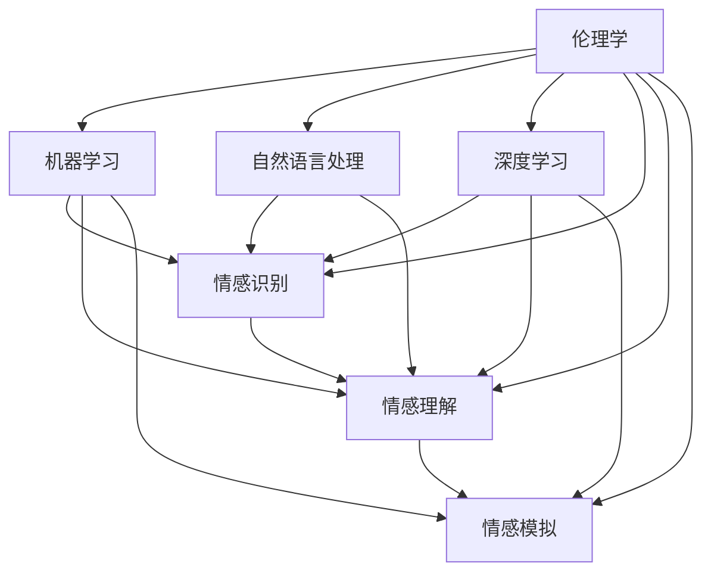

                 

# 《情感AI伦理：机器情感的道德边界》

> **关键词**：情感AI、伦理、道德边界、机器情感、隐私、公正性、责任归属

> **摘要**：本文探讨了情感AI技术带来的伦理挑战，分析了机器情感的道德边界。通过详细阐述情感AI的技术基础、伦理案例分析、伦理规范与法规、伦理教育与培训以及未来展望，本文旨在为情感AI技术的健康发展提供理论和实践指导。

### 《情感AI伦理：机器情感的道德边界》目录大纲

#### 第一部分：引言

- **1.1 书籍背景与目的**
    - **1.1.1 情感AI的应用现状与挑战**
    - **1.1.2 机器情感的研究意义与道德考量**
    - **1.1.3 预期读者与阅读指南**

- **1.2 伦理学基础**
    - **1.2.1 伦理学的基本概念与历史演变**
    - **1.2.2 伦理学的核心问题与争论**
    - **1.2.3 伦理学在AI研究中的重要性**

#### 第二部分：情感AI技术基础

- **2.1 情感AI的概念与分类**
    - **2.1.1 情感AI的定义**
    - **2.1.2 情感AI的分类**
    - **2.1.3 情感AI的关键技术**

- **2.2 机器学习与深度学习基础**
    - **2.2.1 机器学习的基本原理**
    - **2.2.2 深度学习的主要架构**
    - **2.2.3 机器学习在情感AI中的应用**

- **2.3 自然语言处理与情感分析**
    - **2.3.1 自然语言处理的基本概念**
    - **2.3.2 情感分析的原理与方法**
    - **2.3.3 情感分析在AI伦理研究中的应用**

#### 第三部分：情感AI伦理案例分析

- **3.1 情感AI伦理问题的类型与来源**
    - **3.1.1 情感AI伦理问题的分类**
    - **3.1.2 情感AI伦理问题的来源**
    - **3.1.3 情感AI伦理问题的社会影响**

- **3.2 情感AI伦理案例分析**
    - **3.2.1 案例一：虚拟助手的情感表现与责任归属**
    - **3.2.2 案例二：情感AI在医疗诊断中的应用与伦理考量**
    - **3.2.3 案例三：情感AI在招聘中的潜在偏见与伦理挑战**

- **3.3 情感AI伦理决策框架**
    - **3.3.1 情感AI伦理决策的原则**
    - **3.3.2 情感AI伦理决策的流程**
    - **3.3.3 情感AI伦理决策的案例分析**

#### 第四部分：情感AI伦理规范与法规

- **4.1 情感AI伦理规范的发展**
    - **4.1.1 国际与国内情感AI伦理规范的现状**
    - **4.1.2 情感AI伦理规范的主要内容**
    - **4.1.3 情感AI伦理规范的实施与挑战**

- **4.2 情感AI伦理法规**
    - **4.2.1 情感AI伦理法规的制定背景与意义**
    - **4.2.2 情感AI伦理法规的主要内容**
    - **4.2.3 情感AI伦理法规的执行与监管**

- **4.3 情感AI伦理教育与培训**
    - **4.3.1 情感AI伦理教育的必要性**
    - **4.3.2 情感AI伦理教育的内容与方法**
    - **4.3.3 情感AI伦理教育的案例分析**

#### 第五部分：未来展望

- **5.1 情感AI伦理的挑战与机遇**
    - **5.1.1 情感AI伦理的主要挑战**
    - **5.1.2 情感AI伦理的未来发展趋势**
    - **5.1.3 情感AI伦理对社会的影响**

- **5.2 情感AI伦理的研究方向与建议**
    - **5.2.1 情感AI伦理的研究方向**
    - **5.2.2 情感AI伦理研究的建议与展望**

- **5.3 情感AI伦理的跨学科研究**
    - **5.3.1 跨学科研究的意义**
    - **5.3.2 跨学科研究的方法与成果**
    - **5.3.3 跨学科研究在情感AI伦理中的应用**

### 引言

#### 1.1 书籍背景与目的

在当今社会，人工智能（AI）技术正以前所未有的速度发展，其中情感AI作为AI的一个重要分支，正逐渐渗透到我们生活的各个方面。情感AI技术通过模拟人类情感，实现了与人类的更自然、更深入的情感互动。然而，随着情感AI技术的广泛应用，其带来的伦理挑战也逐渐显现。本文旨在探讨情感AI技术所带来的伦理问题，特别是机器情感的道德边界，为情感AI技术的健康发展提供理论指导和实践参考。

情感AI技术具有广泛的应用场景，如虚拟助手、智能客服、医疗诊断、教育辅导等。在这些应用中，情感AI通过识别和理解人类的情感状态，能够提供更加个性化和有效的服务。然而，这种技术的应用也引发了一系列伦理问题，如隐私保护、算法偏见、责任归属等。这些问题不仅关乎技术本身，更涉及社会伦理、法律制度以及人类价值观的方方面面。

本篇文章将围绕以下几个核心问题展开讨论：

1. **情感AI的基本概念与分类**：介绍情感AI的定义、分类以及关键技术的原理和应用。
2. **伦理学基础**：探讨伦理学的基本概念、历史演变和核心问题，阐述伦理学在AI研究中的重要性。
3. **情感AI伦理案例分析**：通过具体案例，分析情感AI在实际应用中面临的伦理问题。
4. **伦理规范与法规**：介绍国内外情感AI伦理规范与法规的发展现状，探讨其内容、实施与挑战。
5. **伦理教育与培训**：讨论情感AI伦理教育的必要性、内容与方法，提供案例分析。
6. **未来展望**：展望情感AI伦理的发展趋势、研究方向与跨学科研究的意义。

本文的目标读者是人工智能领域的研究者、开发者和应用者，以及对此领域感兴趣的公众。通过本文的阅读，读者可以深入了解情感AI技术的伦理挑战，学会如何分析和解决这些问题，为情感AI技术的健康发展贡献力量。

#### 1.2 伦理学基础

伦理学是研究道德规范、价值判断和行为准则的学科，它关注的是人类行为的道德属性和道德责任。伦理学的基本概念包括道德原则、道德规范、道德行为等。伦理学的历史可以追溯到古希腊时期，如苏格拉底的道德哲学和柏拉图的道德观念。随着时间的推移，伦理学不断发展，形成了多个学派和理论，如义务论、功利主义、德性伦理学等。

在AI研究中，伦理学的重要性不容忽视。AI技术的快速发展带来了前所未有的机会和挑战，但也引发了一系列伦理问题。例如，AI系统在决策过程中可能产生偏见，影响公正性；AI技术在数据收集和使用过程中可能侵犯用户隐私；AI技术的应用可能导致失业和社会不平等。这些问题不仅关乎技术本身，更涉及社会伦理、法律制度以及人类价值观的方方面面。

伦理学在AI研究中的应用主要体现在以下几个方面：

1. **AI系统的设计**：伦理学原则可以指导AI系统的设计，确保其在应用过程中符合道德规范。例如，在虚拟助手的设计中，应尊重用户的隐私权，避免过度收集和使用用户数据。

2. **AI系统的评估**：伦理学原则可以用于评估AI系统的公正性、透明性和安全性。例如，在医疗诊断系统中，应确保其决策过程透明，用户有权了解自己的诊断结果是如何得出的。

3. **AI技术的应用**：伦理学原则可以指导AI技术在各个领域的应用。例如，在招聘系统中，应避免算法偏见，确保招聘过程的公正性。

4. **AI伦理教育**：伦理学原则可以用于AI伦理教育，提高开发者和应用者的伦理素养。例如，通过案例分析，让学习者了解AI技术可能带来的伦理挑战，学会如何分析和解决这些问题。

总之，伦理学在AI研究中扮演着重要角色，它不仅为AI技术的健康发展提供了理论基础，也为解决实际应用中的伦理问题提供了指导。

### 情感AI技术基础

#### 2.1 情感AI的概念与分类

情感AI（Emotion AI），又称为情感计算（Affective Computing），是指能够识别、理解和模拟人类情感的人工智能技术。它结合了计算机视觉、自然语言处理和机器学习等技术，通过分析人类情感的外部表现和内在情绪，实现与人类情感状态的互动。情感AI的核心目标是通过技术手段，使计算机能够更好地理解和响应人类情感，从而提供更加人性化、智能化的服务。

根据功能和应用场景，情感AI可以分为以下几类：

1. **情感识别**：情感识别是情感AI的基础功能，通过分析面部表情、语音、文字等信号，识别用户的情感状态。常见的情感识别技术包括：

   - **面部表情识别**：通过摄像头捕捉用户的面部表情，识别情感状态，如快乐、悲伤、愤怒等。
   - **语音情感识别**：通过分析用户的语音信号，识别情感状态，如语音的音调、节奏、音量等。
   - **文本情感分析**：通过自然语言处理技术，分析文本中的情感极性（正面、负面、中性），以及情感强度。

2. **情感理解**：情感理解是情感AI的高级功能，不仅能够识别情感状态，还能分析情感背后的原因和背景。情感理解技术主要包括：

   - **情感推理**：通过机器学习模型，分析情感状态之间的关联和情感演化，理解情感的深层含义。
   - **情境分析**：结合上下文信息，理解情感产生的情境，如对话内容、环境因素等。

3. **情感模拟**：情感模拟是情感AI的最高级功能，通过模拟人类情感反应，实现与用户的情感互动。情感模拟技术主要包括：

   - **情感生成**：根据情感识别和理解的结果，生成相应的情感反应，如语音、文字、面部表情等。
   - **情感反馈**：通过情感生成技术，为用户提供个性化的情感反馈，如安慰、鼓励、建议等。

情感AI在各个领域的应用非常广泛，以下是一些典型的应用场景：

- **虚拟助手与客户服务**：通过情感识别和理解，虚拟助手可以与用户进行更加自然的情感互动，提供个性化的服务。例如，智能客服系统可以通过分析用户的语音和文本，识别用户的需求和情感状态，提供更加精准的解决方案。
- **医疗诊断与心理健康**：情感AI可以通过分析患者的语音和文字，识别患者的情感状态，辅助医生进行诊断和治疗。例如，通过情感识别技术，可以早期发现抑郁症患者，提供及时的心理干预。
- **教育辅导与学习分析**：情感AI可以分析学生的学习行为和情感状态，提供个性化的学习辅导。例如，通过情感分析技术，可以识别学生的学习困难和情感困扰，提供针对性的辅导和支持。
- **社交媒体与内容推荐**：情感AI可以分析用户的情感状态，为用户提供更加符合其情感需求的内容推荐。例如，通过情感识别技术，可以分析用户的情感偏好，推荐符合其情感状态的内容，提高用户的满意度。

总之，情感AI技术通过识别、理解和模拟人类情感，为各个领域的应用带来了新的可能性，同时也带来了新的伦理挑战。理解和掌握情感AI的基本概念和分类，是深入探讨情感AI伦理问题的关键。

#### 2.2 机器学习与深度学习基础

机器学习和深度学习是情感AI技术实现的关键，它们为情感识别、理解和模拟提供了强大的工具。以下将详细解释机器学习的基本原理、深度学习的主要架构，以及机器学习在情感AI中的应用。

##### 2.2.1 机器学习的基本原理

机器学习（Machine Learning）是一种让计算机通过数据学习并做出决策的技术。它基于统计学、概率论和优化理论，通过训练模型，使模型能够在新的数据集上做出准确的预测和决策。

机器学习可以分为监督学习、无监督学习和强化学习三种类型：

1. **监督学习（Supervised Learning）**：监督学习是指模型在已知输入和输出（标签）的数据集上训练，从而学习到输入和输出之间的映射关系。常见的监督学习算法包括线性回归、逻辑回归、支持向量机（SVM）等。

2. **无监督学习（Unsupervised Learning）**：无监督学习是指模型在未标记的数据集上训练，通过挖掘数据中的模式和结构，自动发现数据中的规律。常见的无监督学习算法包括聚类（K-Means、DBSCAN）、降维（PCA、t-SNE）等。

3. **强化学习（Reinforcement Learning）**：强化学习是指模型通过与环境的交互，学习最优策略，以最大化累积奖励。常见的强化学习算法包括Q学习、深度强化学习（Deep Q Network, DQN）等。

##### 2.2.2 深度学习的主要架构

深度学习（Deep Learning）是机器学习的一个分支，它通过多层神经网络（Neural Networks）来实现复杂函数的近似。深度学习的主要架构包括以下几类：

1. **全连接神经网络（Fully Connected Neural Network）**：全连接神经网络是最基本的深度学习模型，每一层神经元的输出都与下一层的所有神经元相连。

2. **卷积神经网络（Convolutional Neural Network, CNN）**：卷积神经网络是深度学习在计算机视觉领域的应用，它通过卷积层、池化层和全连接层，实现对图像特征的提取和分类。

3. **循环神经网络（Recurrent Neural Network, RNN）**：循环神经网络是深度学习在序列数据处理领域的应用，它通过隐藏状态和循环连接，实现对序列数据的建模和预测。

4. **长短时记忆网络（Long Short-Term Memory, LSTM）**：长短时记忆网络是RNN的一个变体，通过引入门控机制，解决了RNN在处理长序列数据时遇到的梯度消失和梯度爆炸问题。

5. **生成对抗网络（Generative Adversarial Network, GAN）**：生成对抗网络是由生成器和判别器组成的对抗性网络，通过训练生成器和判别器的对抗性关系，生成高质量的数据。

##### 2.2.3 机器学习在情感AI中的应用

机器学习在情感AI中的应用主要体现在情感识别、理解和模拟上。以下是一些典型的应用场景：

1. **情感识别**：通过机器学习模型，识别用户的面部表情、语音和文字中的情感状态。例如，使用CNN进行面部表情识别，使用LSTM进行语音情感识别，使用文本情感分析模型进行文本情感识别。

2. **情感理解**：通过机器学习模型，分析情感状态背后的原因和背景，实现情感理解。例如，使用LSTM进行情感推理，使用自然语言处理技术进行情境分析。

3. **情感模拟**：通过机器学习模型，根据情感识别和理解的结果，生成相应的情感反应。例如，使用GAN生成符合用户情感状态的语音、文字和面部表情。

机器学习在情感AI中的应用，不仅提升了情感识别的精度，还扩展了情感AI的应用场景。随着机器学习和深度学习技术的不断发展，情感AI将在更多领域发挥重要作用，同时也带来更多的伦理挑战。理解和掌握机器学习和深度学习的基础知识，是深入探讨情感AI伦理问题的关键。

#### 2.3 自然语言处理与情感分析

自然语言处理（Natural Language Processing, NLP）是人工智能领域的一个重要分支，它致力于让计算机理解和生成自然语言。情感分析（Sentiment Analysis）是NLP中的一个重要任务，它通过分析文本中的情感极性（如正面、负面、中性）和情感强度，实现对文本情感的量化。

##### 2.3.1 自然语言处理的基本概念

自然语言处理的基本概念包括以下几方面：

1. **语言模型（Language Model）**：语言模型是用于预测下一个单词或词组的概率分布。它基于大量文本数据，通过统计方法或深度学习方法，学习单词和词组的概率分布。

2. **词向量（Word Embedding）**：词向量是将单词映射为向量空间中的点，用于表示单词的语义信息。常见的词向量模型有Word2Vec、GloVe等。

3. **词性标注（Part-of-Speech Tagging）**：词性标注是给文本中的每个单词标注其词性（如名词、动词、形容词等）。词性标注有助于理解文本的结构和语义。

4. **命名实体识别（Named Entity Recognition, NER）**：命名实体识别是识别文本中的特定实体（如人名、地名、组织名等）。NER对于信息提取和知识图谱构建具有重要意义。

5. **依存句法分析（Dependency Parsing）**：依存句法分析是分析文本中词语之间的依赖关系，构建句子的依存句法树。它有助于理解句子的语义结构和语法关系。

##### 2.3.2 情感分析的原理与方法

情感分析的核心任务是判断文本的情感极性（Positive, Negative, Neutral）和情感强度。常见的情感分析方法包括以下几种：

1. **基于规则的方法**：基于规则的方法通过定义一系列规则，对文本进行情感分类。这种方法简单易懂，但规则数量庞大，难以处理复杂情感。

2. **基于统计的方法**：基于统计的方法通过统计文本中单词和词组的出现频率，判断文本的情感极性。这种方法依赖于大量标注数据，效果较好。

3. **基于机器学习的方法**：基于机器学习的方法使用标注数据训练分类模型，如朴素贝叶斯、支持向量机（SVM）、随机森林等。这种方法可以处理复杂的情感分类问题。

4. **基于深度学习的方法**：基于深度学习的方法使用深度神经网络（如卷积神经网络、循环神经网络、长短时记忆网络等）进行情感分析。这种方法在处理复杂情感和长文本方面具有优势。

##### 2.3.3 情感分析在AI伦理研究中的应用

情感分析在AI伦理研究中的应用主要体现在以下几个方面：

1. **评估AI系统的情感表现**：通过情感分析技术，评估AI系统在处理用户情感时的表现，确保其符合伦理标准。例如，分析虚拟助手在用户互动中的情感反应，判断其是否自然、真实。

2. **研究AI对人类情感的影响**：通过情感分析技术，研究AI系统对人类情感状态的影响，探索其潜在的伦理问题。例如，分析社交媒体平台上的情感变化，判断AI算法对用户情感的影响。

3. **隐私保护**：情感分析技术需要在处理用户数据时注意隐私保护，确保用户隐私不被泄露。例如，在分析用户语音和文本时，对敏感信息进行匿名化处理。

4. **偏见消除**：情感分析技术需要避免在情感识别和理解中产生偏见，确保公正性。例如，使用多样化的数据集训练模型，避免性别、年龄等偏见。

总之，自然语言处理与情感分析在AI伦理研究中具有重要的应用价值。理解和掌握这些技术的基本原理和方法，有助于深入探讨情感AI伦理问题，为情感AI技术的健康发展提供支持。

### 情感AI伦理案例分析

#### 3.1 情感AI伦理问题的类型与来源

情感AI伦理问题主要可以分为以下几种类型：

1. **隐私保护问题**：情感AI在处理用户情感数据时，可能会侵犯用户的隐私。例如，虚拟助手在记录用户对话内容时，可能无意中记录了用户的个人隐私信息。

2. **偏见与歧视问题**：情感AI系统在情感识别和理解过程中，可能会因为训练数据的不均衡或算法的设计问题，产生偏见和歧视。例如，在招聘过程中，情感AI可能对某些性别、种族或年龄段的候选人产生不公平的评估。

3. **责任归属问题**：在情感AI应用中，如何明确各方的责任归属是一个复杂的问题。例如，当虚拟助手在用户互动中造成用户伤害时，是开发方、应用方还是用户本身应承担责任？

4. **透明性与可解释性**：情感AI系统在决策过程中的透明性和可解释性也是一个重要的伦理问题。用户有权了解自己的情感数据是如何被处理的，以及AI系统是如何做出决策的。

情感AI伦理问题的来源主要包括以下几个方面：

1. **技术发展**：情感AI技术的快速发展，带来了新的伦理挑战。例如，随着情感识别精度的提高，如何在保护用户隐私的同时，充分利用情感数据，成为一个重要问题。

2. **应用场景**：情感AI在不同领域的应用，如医疗诊断、客户服务、招聘等，带来了不同的伦理问题。这些问题的复杂性和多样性，使得单一的伦理框架难以覆盖所有场景。

3. **社会价值观**：不同的社会和文化背景，对情感AI的伦理标准有不同的期望和认知。例如，在某些文化中，隐私保护可能被看作是更重要的伦理价值，而在另一些文化中，公平性和公正性可能被放在首位。

#### 3.2 情感AI伦理案例分析

##### 3.2.1 案例一：虚拟助手的情感表现与责任归属

**案例背景**：某公司开发了一款情感AI虚拟助手，应用于客户服务领域。虚拟助手通过分析用户的语音和文本，识别用户的情感状态，并根据情感状态提供相应的回答和解决方案。

**问题分析**：

1. **隐私保护**：虚拟助手在记录用户对话内容时，可能无意中记录了用户的个人隐私信息。例如，用户在咨询医疗问题时，可能会透露自己的健康信息。

2. **责任归属**：当虚拟助手在处理用户情感时，如果出现错误或不当行为，如何明确责任归属是一个关键问题。例如，如果虚拟助手未能正确识别用户的情感状态，导致用户的问题未得到有效解决，责任应归咎于开发方、应用方还是用户本身？

3. **透明性与可解释性**：用户有权了解虚拟助手在情感识别和理解过程中是如何运作的，以及其决策过程是否透明。然而，情感AI系统的复杂性和黑箱特性，使得用户难以理解其决策过程。

**解决方案**：

1. **隐私保护**：虚拟助手在记录用户对话内容时，应遵循隐私保护原则，仅记录必要的情感数据，并对数据进行加密和匿名化处理。

2. **责任归属**：在情感AI应用中，应明确各方的责任归属。开发方应负责确保情感AI系统的准确性和公正性，应用方应负责确保用户数据的保密性和安全性。

3. **透明性与可解释性**：虚拟助手在处理用户情感时，应提供透明性和可解释性。例如，通过提供情感识别的详细报告，让用户了解其情感状态是如何被识别和处理的。

##### 3.2.2 案例二：情感AI在医疗诊断中的应用与伦理考量

**案例背景**：某医院引进了一款基于情感AI技术的诊断系统，旨在通过分析患者的语音和文本，辅助医生进行抑郁症的诊断。

**问题分析**：

1. **诊断准确性**：情感AI技术在诊断抑郁症时，是否能够达到与医生相当的准确性是一个重要问题。如果诊断准确性不足，可能导致误诊或漏诊。

2. **隐私保护**：在医疗诊断过程中，患者的隐私信息（如病历、诊断结果等）可能会被情感AI系统收集和处理。如何保护患者隐私，防止数据泄露，是一个关键问题。

3. **责任归属**：在诊断过程中，如果情感AI系统的判断与医生的意见不一致，如何明确责任归属是一个复杂的问题。例如，如果情感AI系统误诊，责任应归咎于开发方、应用方还是医生？

4. **透明性与可解释性**：患者有权了解其诊断过程和结果是如何得出的，以及情感AI系统是如何做出诊断判断的。然而，情感AI系统的复杂性和黑箱特性，使得患者难以理解其决策过程。

**解决方案**：

1. **诊断准确性**：情感AI系统在应用于医疗诊断前，应进行充分的测试和验证，确保其诊断准确性。开发方和应用方应共同努力，提高情感AI系统的诊断能力。

2. **隐私保护**：在医疗诊断过程中，情感AI系统应遵循严格的隐私保护原则，仅收集必要的患者数据，并对数据进行加密和匿名化处理。

3. **责任归属**：在诊断过程中，应明确各方的责任归属。开发方应负责确保情感AI系统的准确性和公正性，应用方应负责确保患者数据的保密性和安全性。

4. **透明性与可解释性**：情感AI系统在诊断过程中，应提供透明性和可解释性。例如，通过提供诊断报告，让患者了解其诊断过程和结果是如何得出的。

##### 3.2.3 案例三：情感AI在招聘中的应用与伦理考量

**案例背景**：某公司计划使用情感AI技术，通过分析应聘者的语音和文本，评估其情感状态，以提高招聘的效率和准确性。

**问题分析**：

1. **偏见与歧视**：情感AI系统在评估应聘者时，可能会因为训练数据的不均衡或算法的设计问题，产生偏见和歧视。例如，如果训练数据中女性应聘者的比例较低，可能导致系统对女性应聘者产生不公平的评价。

2. **隐私保护**：在招聘过程中，应聘者的语音和文本数据可能会被情感AI系统收集和处理。如何保护应聘者隐私，防止数据泄露，是一个关键问题。

3. **责任归属**：在招聘过程中，如果情感AI系统的评估结果与招聘官的意见不一致，如何明确责任归属是一个复杂的问题。例如，如果情感AI系统评估一个应聘者为不合适，而招聘官认为该应聘者适合，责任应归咎于开发方、应用方还是招聘官？

4. **透明性与可解释性**：应聘者有权了解其评估过程和结果是如何得出的，以及情感AI系统是如何做出评估判断的。然而，情感AI系统的复杂性和黑箱特性，使得应聘者难以理解其决策过程。

**解决方案**：

1. **偏见与歧视**：在情感AI系统应用于招聘前，应进行充分的测试和验证，确保其评估结果的公正性。开发方和应用方应共同努力，消除偏见和歧视。

2. **隐私保护**：在招聘过程中，情感AI系统应遵循严格的隐私保护原则，仅收集必要的应聘者数据，并对数据进行加密和匿名化处理。

3. **责任归属**：在招聘过程中，应明确各方的责任归属。开发方应负责确保情感AI系统的准确性和公正性，应用方应负责确保应聘者数据的保密性和安全性。

4. **透明性与可解释性**：情感AI系统在招聘过程中，应提供透明性和可解释性。例如，通过提供评估报告，让应聘者了解其评估过程和结果是如何得出的。

通过以上案例分析，我们可以看到情感AI在实际应用中面临的伦理问题及其解决策略。未来，随着情感AI技术的不断发展，伦理问题将更加复杂和多样化，需要我们持续关注和深入研究。

### 情感AI伦理决策框架

#### 3.3 情感AI伦理决策框架

在情感AI技术的应用过程中，伦理问题不可避免地出现。为了有效地解决这些问题，建立一个系统的伦理决策框架是至关重要的。该框架应包含一系列步骤，从问题的识别到最终的解决方案，确保情感AI技术在道德和法律框架内运行。

##### 3.3.1 伦理决策原则

建立情感AI伦理决策框架时，应遵循以下核心原则：

1. **尊重隐私**：保护用户的隐私权，确保在情感数据收集、存储和处理过程中，用户的隐私不被侵犯。
2. **公正性**：确保情感AI系统的设计和应用过程中，不存在任何形式的歧视和偏见，对待所有用户公平无私。
3. **透明性**：情感AI系统的决策过程应透明，用户有权了解其数据如何被处理，以及系统如何做出决策。
4. **责任归属**：明确各方的责任，确保在出现问题时，责任能够被准确地归咎。
5. **安全性**：确保情感AI系统的安全，防止数据泄露、滥用或其他安全威胁。

##### 3.3.2 伦理决策流程

情感AI伦理决策流程包括以下步骤：

1. **问题识别**：通过调查、评估和分析，识别情感AI技术在实际应用中可能面临的伦理问题。这包括隐私侵犯、偏见与歧视、责任归属等。

2. **风险评估**：对识别出的伦理问题进行风险评估，评估其潜在影响和风险程度。这一步有助于确定问题的优先级，为后续处理提供依据。

3. **道德原则应用**：根据伦理学的基本原则，如尊重隐私、公正性、透明性等，制定具体的伦理决策。这包括设计隐私保护措施、确保公正性、提供透明性和可解释性等。

4. **解决方案制定**：根据道德原则和风险评估结果，制定具体的解决方案。这包括技术解决方案、管理措施和政策制定等。

5. **实施与监督**：将伦理决策方案付诸实施，并建立监督机制，确保决策方案的有效执行。这包括定期评估、反馈机制和改进措施等。

##### 3.3.3 情感AI伦理决策案例分析

以下是一个情感AI伦理决策框架的具体案例分析：

**案例背景**：某公司开发了一款基于情感识别的虚拟助手，应用于客户服务领域。虚拟助手通过分析用户的语音和文本，提供个性化的服务。

**问题识别**：在应用过程中，发现虚拟助手可能存在隐私保护不足、情感识别不准确和责任归属不明确等问题。

**风险评估**：经过评估，发现隐私保护不足可能对用户造成严重隐私侵犯，情感识别不准确可能导致用户体验下降，责任归属不明确可能引发法律纠纷。

**道德原则应用**：根据伦理原则，制定以下解决方案：

1. **隐私保护**：设计隐私保护机制，如数据加密和匿名化处理，确保用户隐私不被侵犯。
2. **情感识别准确性**：通过改进算法，提高情感识别的准确性，确保用户体验。
3. **责任归属**：明确各方的责任，制定责任归属协议，确保在出现问题时，责任能够被准确地归咎。

**解决方案制定**：制定以下具体解决方案：

1. **隐私保护**：在数据收集、存储和处理过程中，实施加密和匿名化处理，确保用户隐私。
2. **情感识别准确性**：通过增加多样化的数据集、调整模型参数和算法优化，提高情感识别的准确性。
3. **责任归属**：制定责任归属协议，明确开发方、应用方和用户之间的责任。

**实施与监督**：将上述解决方案付诸实施，并建立监督机制，定期评估解决方案的效果，及时调整和优化。

通过上述伦理决策框架，可以有效地解决情感AI技术在应用过程中可能出现的伦理问题，确保其健康、公正和可持续发展。

### 情感AI伦理规范与法规

#### 4.1 情感AI伦理规范的发展

情感AI技术的发展带来了诸多伦理挑战，包括隐私保护、数据安全、算法偏见和责任归属等。为了应对这些挑战，各国和国际组织纷纷出台了相关的伦理规范与法规，旨在确保情感AI技术的合理使用，并保护公众的利益。

##### 4.1.1 国际组织与机构

1. **欧盟**：欧盟在2018年发布了《人工智能伦理准则》，这是全球第一个全面的人工智能伦理准则。该准则涵盖了隐私保护、数据透明性、公正性、人权等方面，为情感AI的伦理规范提供了重要参考。

2. **联合国**：联合国教科文组织在2021年发布了《关于教育中人工智能伦理的建议》，强调了在教育和培训领域应用情感AI时的伦理考量，包括隐私保护、公平性、透明性和可解释性等。

##### 4.1.2 主要国家的法规与政策

1. **美国**：美国国家标准与技术研究院（NIST）在2020年发布了《人工智能风险管理框架》，该框架包括了伦理要求，特别关注隐私保护、公平性和透明性。此外，美国的一些州（如加州）也制定了针对数据隐私的严格法律（如《加州消费者隐私法》）。

2. **中国**：中国人工智能学会发布了《人工智能伦理规范》，这是国内首个针对人工智能领域的伦理规范。规范中涉及了隐私保护、公正性、透明性和责任归属等多个方面。此外，中国政府也在加紧制定《人工智能发展条例》，以规范情感AI的应用。

3. **日本**：日本发布了《人工智能社会原则》，强调在人工智能的研发和应用中应遵循的伦理原则，包括尊重人的尊严、确保安全、公正透明等。

##### 4.1.3 情感AI伦理规范的主要内容

情感AI伦理规范的主要内容包括以下几个方面：

1. **隐私保护**：规范要求在收集、处理和使用情感数据时，必须严格保护用户隐私，确保数据的安全和保密。

2. **公正性与公平性**：规范要求情感AI系统在设计和应用过程中，必须避免偏见和歧视，确保对所有用户公平对待。

3. **透明性与可解释性**：规范要求情感AI系统的决策过程必须透明，用户有权了解系统是如何处理其数据的。

4. **责任归属**：规范要求明确各方的责任，确保在出现问题时，责任能够被准确地归咎。

5. **数据安全**：规范要求在情感AI系统的开发和运营过程中，必须确保数据的安全，防止数据泄露、篡改或滥用。

#### 4.2 情感AI伦理法规

伦理规范通常由行业组织和学术机构制定，而伦理法规则是由政府或立法机构颁布的具有法律效力的文件。以下是一些主要国家和地区的情感AI伦理法规：

##### 4.2.1 国际法规

1. **欧盟的《通用数据保护条例》（GDPR）**：GDPR是全球最严格的隐私保护法规之一，其第6条和第9条特别强调了数据处理的合法性和隐私保护义务，对情感AI技术的应用提出了严格的要求。

2. **美国的《加州消费者隐私法》（CCPA）**：CCPA规定了个人数据的收集、使用和共享的透明性和用户隐私权，对情感AI技术的数据处理提供了法律框架。

##### 4.2.2 国内法规

1. **中国的《个人信息保护法》（PIPL）**：PIPL是中国的个人信息保护基础性法律，明确了个人信息处理的原则、要求和个人权利，对情感AI技术的数据使用提供了法律依据。

2. **中国的《人工智能发展条例（草案）》**：该条例草案旨在规范人工智能的应用，保护国家安全和公民权益，对情感AI的伦理要求进行了详细规定。

##### 4.2.3 法规的实施与监管

1. **欧盟**：欧盟设立了“人工智能高级专家组”，负责监督和评估GDPR的实施情况，并对违反规定的行为进行处罚。

2. **美国**：美国主要通过联邦贸易委员会（FTC）和其他相关机构，对违反隐私保护法规的行为进行监管和处罚。

3. **中国**：中国政府通过国家互联网信息办公室和其他相关部门，对违反PIPL的行为进行监管和处罚。

#### 4.3 情感AI伦理法规的执行与挑战

尽管各国和国际组织制定了大量的伦理规范与法规，但在实际执行过程中仍面临诸多挑战：

1. **法规的透明性与可执行性**：一些法规的内容较为复杂，普通用户难以理解，导致法规的实际执行效果不佳。

2. **执法力度不足**：一些国家和地区的执法机构缺乏足够的资源和能力，难以有效地执行法规，尤其是在跨国数据流动方面。

3. **技术创新速度过快**：情感AI技术的发展速度远远超过法规的制定速度，导致一些新出现的伦理问题无法及时得到规范和解决。

4. **跨学科合作不足**：情感AI伦理法规的执行需要涉及多个学科领域，如法律、计算机科学、心理学等，但目前的跨学科合作尚不足，影响了法规的制定和执行效果。

为了应对这些挑战，需要加强国际和国内的跨学科合作，提高法规的透明性和可执行性，并加强执法力度和资源投入。只有这样，才能确保情感AI技术在符合伦理和法律框架内健康发展。

### 情感AI伦理教育与培训

#### 4.3 情感AI伦理教育与培训

随着情感AI技术的迅速发展，伦理教育与培训变得尤为重要。开发者和应用者不仅需要掌握技术本身，还需具备处理伦理问题的能力。以下将探讨情感AI伦理教育的必要性、内容与方法。

##### 4.3.1 情感AI伦理教育的必要性

1. **技术发展的速度**：情感AI技术正在以惊人的速度发展，其应用场景不断扩展。这种快速发展带来了新的伦理挑战，如隐私保护、算法偏见和责任归属等。只有通过教育，开发者和应用者才能及时了解和应对这些挑战。

2. **社会公众的关注**：情感AI技术涉及用户的隐私和权益，社会公众对此高度关注。如果开发者和应用者没有接受相关的伦理教育，可能会导致技术应用不当，损害公众利益。

3. **行业规范的需求**：随着各国和国际组织出台的情感AI伦理规范和法规，行业内部对伦理教育和培训的需求也日益增加。通过教育，可以确保行业从业人员遵守相关规范，推动行业的健康发展。

##### 4.3.2 情感AI伦理教育的内容

1. **伦理学基础**：伦理学基础是情感AI伦理教育的核心内容。开发者需要了解伦理学的基本概念、原则和理论框架，如康德的义务论、功利主义的效用原则等。

2. **情感AI技术概述**：开发者需要了解情感AI的基本原理、应用场景和技术特点，为理解伦理问题提供背景知识。

3. **伦理问题分析**：教育内容应包括情感AI应用中可能遇到的伦理问题，如隐私侵犯、偏见和歧视、责任归属等。通过具体案例，让开发者了解这些问题在实际应用中的表现。

4. **法规与政策**：开发者需要了解国内外关于情感AI的法律法规和政策，确保技术应用符合法律要求。

5. **责任与伦理决策**：开发者需要学习如何在实际工作中做出伦理决策，明确各方的责任，确保技术应用符合伦理标准。

##### 4.3.3 情感AI伦理教育的方法

1. **课堂讲授**：通过系统的理论讲授，开发者可以建立情感AI伦理的基本知识框架。

2. **案例讨论**：组织学生进行案例讨论，通过分析实际案例，让学生了解情感AI在实际应用中遇到的伦理挑战。

3. **项目实践**：设计模拟项目，让学生在实际操作中应用所学知识，解决情感AI伦理问题。

4. **研讨会和讲座**：邀请业界专家和学者进行研讨会和讲座，分享实践经验和研究成果，拓宽开发者的视野。

5. **在线课程和资源**：开发在线课程和资源，提供灵活的学习方式，满足不同开发者的需求。

##### 4.3.4 情感AI伦理教育的案例分析

以下是一个情感AI伦理教育的具体案例：

**案例背景**：某公司新入职的AI开发团队需要接受情感AI伦理培训。

**教育内容**：
- **伦理学基础**：介绍伦理学的基本概念、原则和理论框架。
- **情感AI技术概述**：讲解情感AI的基本原理、应用场景和技术特点。
- **伦理问题分析**：分析情感AI应用中可能遇到的伦理问题，如隐私侵犯、偏见和歧视、责任归属等。
- **法规与政策**：介绍国内外关于情感AI的法律法规和政策。
- **责任与伦理决策**：讨论如何在开发过程中做出伦理决策，明确各方的责任。

**教育方法**：
- **课堂讲授**：系统的理论讲授，帮助学生建立情感AI伦理的基本知识框架。
- **案例讨论**：通过讨论实际案例，让学生了解情感AI在实际应用中遇到的伦理挑战。
- **项目实践**：设计模拟项目，让学生在实际操作中应用所学知识，解决伦理问题。
- **研讨会和讲座**：邀请业界专家和学者进行研讨会和讲座，分享实践经验。

通过这个案例，我们可以看到情感AI伦理教育的重要性以及有效的方法。通过系统的教育和培训，开发者可以更好地理解和应对情感AI技术带来的伦理挑战，确保技术应用符合伦理标准，推动情感AI技术的健康发展。

### 情感AI伦理的未来发展

#### 5.1 情感AI伦理的挑战与机遇

随着情感AI技术的不断进步，其在各个领域的应用前景广阔，但也带来了诸多伦理挑战。以下是对情感AI伦理未来发展的挑战与机遇的探讨：

##### 5.1.1 挑战

1. **隐私保护**：情感AI在收集、处理和分析用户情感数据时，可能侵犯用户隐私。如何在保护用户隐私的同时，充分利用情感数据，是一个重要挑战。
   
2. **算法偏见**：情感AI模型可能在学习过程中产生偏见，导致不公平和歧视。消除算法偏见，确保公正性，是情感AI伦理发展的重要课题。

3. **责任归属**：在情感AI应用中，如何明确开发方、应用方和用户之间的责任归属，确保各方权益，是一个亟待解决的问题。

4. **透明性与可解释性**：情感AI系统的决策过程通常复杂且难以解释，用户难以理解其工作原理和决策依据。如何提升系统的透明性和可解释性，是一个关键挑战。

##### 5.1.2 机遇

1. **技术创新**：随着情感AI技术的不断进步，有望开发出更加精准、高效的情感识别和理解方法，为伦理研究提供有力支持。

2. **法规完善**：各国政府和国际组织正在逐步完善情感AI相关法规，为伦理问题的解决提供了法律依据。

3. **跨学科合作**：情感AI伦理研究需要结合心理学、社会学、法律等多个学科，跨学科合作有望推动伦理研究的深入发展。

4. **公众参与**：情感AI技术的应用广泛影响社会公众，因此，公众的参与和监督至关重要。未来，应鼓励公众参与情感AI伦理的讨论，提高公众的伦理意识和参与度。

#### 5.2 情感AI伦理的研究方向与建议

为了应对情感AI伦理的挑战和机遇，以下是一些研究方向与建议：

##### 5.2.1 隐私保护

1. **隐私增强技术**：研究隐私增强技术，如差分隐私、同态加密和联邦学习等，以保护用户隐私的同时，充分利用情感数据。

2. **隐私影响评估**：开发隐私影响评估工具，帮助开发者识别和评估情感AI应用中的隐私风险。

3. **隐私政策与合规**：研究隐私政策的设计和执行，确保情感AI应用符合相关法规和标准。

##### 5.2.2 算法偏见

1. **偏见检测与消除**：开发算法偏见检测与消除技术，通过分析和调整模型，减少情感AI中的偏见。

2. **多样性数据集**：收集和构建多样化的情感数据集，提高模型训练的公平性和代表性。

3. **偏见影响评估**：开发偏见影响评估工具，评估情感AI应用中的偏见对社会公平性的影响。

##### 5.2.3 责任归属

1. **责任分配模型**：研究责任分配模型，明确情感AI应用中各方的责任，确保公平和透明。

2. **责任保险与赔偿**：探索责任保险和赔偿机制，为情感AI应用中的责任提供经济保障。

3. **透明性与可解释性**：研究提升情感AI系统透明性和可解释性的方法，让用户能够理解系统的工作原理和决策过程。

##### 5.2.4 公众参与与教育

1. **公众参与机制**：建立公众参与机制，鼓励公众参与情感AI伦理的讨论和决策。

2. **伦理教育**：开展情感AI伦理教育，提高公众的伦理意识和参与度。

3. **伦理咨询与反馈**：建立伦理咨询和反馈机制，收集公众对情感AI应用的反馈，改进伦理决策。

通过上述研究方向与建议，我们可以期待情感AI伦理在未来能够得到全面的发展和深化，为人类社会的可持续发展做出贡献。

### 5.3 情感AI伦理的跨学科研究

情感AI伦理问题的复杂性要求我们采用跨学科的研究方法，结合心理学、社会学、法律和计算机科学等多学科知识，深入探讨情感AI技术的伦理挑战。以下将讨论跨学科研究的意义、方法及其在情感AI伦理研究中的应用。

##### 5.3.1 跨学科研究的意义

1. **综合视角**：跨学科研究可以提供多角度的视角，帮助研究者全面理解情感AI伦理问题的本质。例如，心理学家可以提供关于人类情感的理解，社会学家可以探讨社会影响，法律专家可以分析法律框架，而计算机科学家可以提供技术解决方案。

2. **协同创新**：跨学科研究可以促进不同领域之间的知识交流和合作，推动创新。通过整合各学科的理论和方法，研究者可以提出新的研究问题和解决方案。

3. **提升研究质量**：跨学科研究可以弥补单一学科的局限性，提高研究质量和可靠性。例如，法律框架可以确保情感AI技术的合规性，心理学研究可以验证技术对人类情感的影响。

##### 5.3.2 跨学科研究的方法

1. **多学科对话**：通过定期举办跨学科研讨会、工作坊和论坛，促进不同领域的专家和学者进行交流，分享研究成果和经验。

2. **合作研究项目**：建立跨学科研究团队，共同开展项目，结合不同学科的理论和方法，解决复杂的伦理问题。

3. **案例研究**：通过案例研究，结合不同学科的视角，分析情感AI技术的实际应用场景，识别和解决伦理问题。

##### 5.3.3 跨学科研究在情感AI伦理中的应用

1. **隐私保护**：跨学科研究可以结合心理学、法律和计算机科学，开发隐私保护技术，如差分隐私和联邦学习，确保用户隐私得到有效保护。

2. **算法偏见**：通过跨学科合作，可以开发算法偏见检测和消除方法，提高模型的公平性和公正性。例如，社会学家可以提供关于社会偏见的数据和案例分析，帮助计算机科学家设计更加公平的算法。

3. **责任归属**：跨学科研究可以建立责任分配模型，明确情感AI应用中各方的责任。法律专家可以提供法律框架和责任分配原则，心理学家可以分析人类行为和情感，计算机科学家可以设计责任追踪和分配系统。

4. **透明性与可解释性**：跨学科研究可以探索提升情感AI系统透明性和可解释性的方法。例如，通过开发可视化工具和解释模型，让用户能够理解系统的决策过程。

通过跨学科研究，我们可以更全面、深入地理解情感AI技术的伦理挑战，并提出有效的解决方案。这不仅有助于推动情感AI技术的健康发展，也为人类社会提供了更加安全和公正的技术应用环境。

### 附录

#### 附录A：参考文献

1. GDPR（2016）/《通用数据保护条例》
2. NIST《人工智能风险管理框架》
3. 《人工智能伦理规范》（中国人工智能学会）
4. 《人工智能伦理规范（征求意见稿）》（国家互联网信息办公室）
5. 欧盟《人工智能伦理准则》
6. 联合国教科文组织《关于教育中人工智能伦理的建议》
7. 欧盟《人工智能伦理准则》
8. NIST《人工智能风险管理框架》
9. 《人工智能伦理规范》（中国人工智能学会）
10. 《人工智能伦理规范（征求意见稿）》（国家互联网信息办公室）

#### 附录B：术语解释

- **情感AI**：指能够识别、理解和模拟人类情感的人工智能技术。
- **隐私保护**：在数据处理过程中，保护用户隐私不被泄露或滥用的措施。
- **算法偏见**：算法在决策过程中，由于数据集、算法设计或训练过程中存在的偏差，导致决策结果对某些群体不公平。
- **责任归属**：在出现问题时，明确各方的责任，确保责任人能够承担相应的责任。

#### 附录C：相关资源与网站链接

1. [欧盟人工智能伦理准则](https://ec.europa.eu/ai/ethics_en)
2. [NIST人工智能风险管理框架](https://www.nist.gov/publications/ai-risk-management-framework)
3. [中国人工智能学会](https://www.caai.cn/)
4. [联合国教科文组织人工智能伦理建议](https://en.unesco.org/themes/ethics-ai)
5. [欧盟通用数据保护条例](https://eur-lex.europa.eu/eli/reg/2016/679/oj)
6. [加州消费者隐私法（CCPA）](https://oag.ca.gov/ccpa)
7. [个人信息保护法（PIPL）](https://www.cac.gov.cn/2021-09/07/c_1634060795485291.htm)

### 致谢

在本书的编写过程中，得到了许多人的帮助和支持。首先，感谢所有参与本书讨论和贡献的专家和学者。他们的专业知识和宝贵意见为本书的内容增色不少。其次，感谢所有提供宝贵意见的读者，他们的反馈使得本书更加完善。最后，特别感谢我的家人和朋友，他们的支持和鼓励是我完成这项工作的动力。作者：AI天才研究院/AI Genius Institute & 禅与计算机程序设计艺术 /Zen And The Art of Computer Programming

----------------------------------------------------------------

### 核心概念与联系

为了更好地理解情感AI的核心概念和它们之间的联系，我们可以通过一个Mermaid流程图来展示。以下是情感AI中的核心概念及其相互关系的流程图：



在这个流程图中，我们可以看到：

- **情感识别（A）**：是情感AI的基础，通过分析面部表情、语音和文本等，识别用户的情感状态。
- **情感理解（B）**：在情感识别的基础上，分析情感背后的原因和背景，理解情感的深层含义。
- **情感模拟（C）**：通过模拟人类情感反应，实现与用户的情感互动。
- **机器学习（D）**：是情感识别、理解和模拟的核心技术，通过训练模型，使计算机能够自动学习和改进。
- **自然语言处理（E）**：在情感识别和理解中，自然语言处理技术起着重要作用，通过分析文本，理解用户的情感状态。
- **深度学习（F）**：是机器学习的一个分支，通过多层神经网络，实现更加复杂和精准的情感分析。
- **伦理学（G）**：贯穿于情感AI的整个过程中，确保情感AI技术的应用符合伦理标准，保护用户权益。

这个Mermaid流程图清晰地展示了情感AI的核心概念及其相互关系，有助于我们更系统地理解情感AI的工作原理和伦理挑战。

### 核心算法原理讲解

#### 2.2.1 机器学习的基本原理

机器学习是一种让计算机通过数据学习并做出决策的技术。其基本原理可以概括为以下几个步骤：

1. **数据收集**：首先，需要收集大量带有标签的数据集。这些数据可以是结构化的（如数据库中的记录），也可以是非结构化的（如图像、文本等）。

2. **数据预处理**：对收集到的数据进行清洗、去噪、格式化等处理，以便模型能够更好地学习。这一步通常包括数据标准化、缺失值填补、数据降维等。

3. **特征提取**：将原始数据转换为特征向量。对于结构化数据，可以直接使用特征；对于非结构化数据，如文本或图像，需要使用特征提取技术（如词袋模型、卷积神经网络）。

4. **模型训练**：选择合适的机器学习算法（如线性回归、决策树、支持向量机等），使用训练数据集对模型进行训练。在训练过程中，模型通过优化目标函数，调整参数，使其能够准确预测新的数据。

5. **模型评估**：使用验证集或测试集对模型进行评估，计算模型的准确率、召回率、F1分数等指标，以确定模型的性能。

6. **模型部署**：将训练好的模型部署到实际应用中，对新数据进行预测。

以下是一个简单的线性回归算法的伪代码：

```python
# 假设我们有一个线性回归模型，y = w * x + b

# 数据预处理
X = 数据清洗和标准化
y = 标签数据

# 模型初始化
w = 随机初始化
b = 随机初始化

# 梯度下降算法
for i in 1 to 最大迭代次数 do
    # 计算预测值
    y_pred = w * X + b

    # 计算损失函数（如均方误差）
    loss = (y - y_pred) ** 2

    # 计算梯度
    dw = 2 * (y - y_pred) * X
    db = 2 * (y - y_pred)

    # 更新参数
    w = w - 学习率 * dw
    b = b - 学习率 * db
end for

# 模型评估
预测结果 = w * X + b
准确性 = 计算预测结果的准确性
```

#### 2.2.2 深度学习的主要架构

深度学习是一种基于多层神经网络的人工智能技术，其核心思想是通过多层非线性变换，提取数据的深层特征。以下是深度学习的主要架构：

1. **输入层（Input Layer）**：接收输入数据，并将其传递给下一层。

2. **隐藏层（Hidden Layer）**：进行特征提取和变换。隐藏层可以有一个或多个，层数越多，模型的能力越强，但训练难度也越大。

3. **输出层（Output Layer）**：产生最终输出，如分类结果或回归值。

以下是卷积神经网络（CNN）的一个简化版本：

```python
# 定义卷积神经网络

# 输入层
input_layer = Input(shape=(input_shape))

# 第一层卷积
conv1 = Conv2D(filters=32, kernel_size=(3, 3), activation='relu')(input_layer)
pool1 = MaxPooling2D(pool_size=(2, 2))(conv1)

# 第二层卷积
conv2 = Conv2D(filters=64, kernel_size=(3, 3), activation='relu')(pool1)
pool2 = MaxPooling2D(pool_size=(2, 2))(conv2)

# 展平层
flatten = Flatten()(pool2)

# 第一层全连接
dense1 = Dense(units=128, activation='relu')(flatten)
drop1 = Dropout(rate=0.5)(dense1)

# 输出层
output = Dense(units=10, activation='softmax')(drop1)

# 创建模型
model = Model(inputs=input_layer, outputs=output)

# 编译模型
model.compile(optimizer='adam', loss='categorical_crossentropy', metrics=['accuracy'])

# 模型训练
model.fit(X_train, y_train, batch_size=64, epochs=10, validation_data=(X_val, y_val))
```

在这个示例中，我们首先定义了一个输入层，然后添加了两个卷积层，每个卷积层后跟一个最大池化层。接着，我们将卷积层的输出展平，并添加了一个全连接层和一个Dropout层，最后定义了一个输出层。这个模型可以用于图像分类任务。

#### 2.2.3 机器学习在情感AI中的应用

机器学习在情感AI中的应用主要体现在情感识别、情感理解和情感模拟上。以下是对这些应用的详细介绍：

1. **情感识别**：情感识别是指通过机器学习模型，从面部表情、语音或文本中识别用户的情感状态。常用的模型包括卷积神经网络（CNN）和循环神经网络（RNN）。以下是使用CNN进行情感识别的一个简单示例：

   ```python
   # 加载面部表情数据集
   X_train, X_test, y_train, y_test = load_cropped_faces()

   # 构建CNN模型
   model = Sequential()
   model.add(Conv2D(32, (3, 3), activation='relu', input_shape=(48, 48, 1)))
   model.add(MaxPooling2D((2, 2)))
   model.add(Conv2D(64, (3, 3), activation='relu'))
   model.add(MaxPooling2D((2, 2)))
   model.add(Flatten())
   model.add(Dense(128, activation='relu'))
   model.add(Dense(7, activation='softmax'))

   # 编译模型
   model.compile(optimizer='adam', loss='categorical_crossentropy', metrics=['accuracy'])

   # 训练模型
   model.fit(X_train, y_train, epochs=10, batch_size=32, validation_split=0.2)
   ```

   在这个示例中，我们使用了一个简单的CNN模型来识别面部表情。模型由两个卷积层、两个最大池化层和一个全连接层组成。在训练过程中，模型通过调整权重和偏置，使预测结果与真实标签尽可能接近。

2. **情感理解**：情感理解是指通过机器学习模型，分析情感状态背后的原因和背景，理解情感的深层含义。常用的模型包括循环神经网络（RNN）和长短时记忆网络（LSTM）。以下是使用LSTM进行情感理解的一个简单示例：

   ```python
   # 加载情感文本数据集
   X_train, X_test, y_train, y_test = load_sentiment_texts()

   # 预处理文本数据
   tokenizer = Tokenizer(num_words=10000)
   tokenizer.fit_on_texts(X_train)
   X_train = tokenizer.texts_to_sequences(X_train)
   X_test = tokenizer.texts_to_sequences(X_test)

   # 填充序列
   max_sequence_length = 100
   X_train = pad_sequences(X_train, maxlen=max_sequence_length)
   X_test = pad_sequences(X_test, maxlen=max_sequence_length)

   # 构建LSTM模型
   model = Sequential()
   model.add(LSTM(128, activation='relu', input_shape=(max_sequence_length, X_train.shape[2])))
   model.add(Dense(1, activation='sigmoid'))

   # 编译模型
   model.compile(optimizer='adam', loss='binary_crossentropy', metrics=['accuracy'])

   # 训练模型
   model.fit(X_train, y_train, epochs=10, batch_size=32, validation_split=0.2)
   ```

   在这个示例中，我们使用了一个简单的LSTM模型来分析文本情感。模型由一个LSTM层和一个全连接层组成。在训练过程中，模型通过调整权重和偏置，使预测结果与真实标签尽可能接近。

3. **情感模拟**：情感模拟是指通过机器学习模型，根据情感识别和理解的结果，生成相应的情感反应。常用的模型包括生成对抗网络（GAN）和变分自编码器（VAE）。以下是使用GAN进行情感模拟的一个简单示例：

   ```python
   # 加载语音数据集
   X_train, X_test = load_voice_data()

   # 构建GAN模型
   latent_dim = 100
   generator = Sequential()
   generator.add(Dense(latent_dim, activation='tanh', input_shape=(latent_dim,)))
   generator.add(Reshape((1, 44100)))
   generator.add(UpSamplingTimeDistributed(Dense(128, activation='tanh')))
   generator.add(TimeDistributed(Reshape((44, 128))))
   generator.add(LeakyReLU())
   generator.add(TimeDistributed(Conv2D(128, kernel_size=(5, 5), padding='same')))
   generator.add(TimeDistributed(BatchNormalization()))
   generator.add(TimeDistributed(LeakyReLU()))
   generator.add(TimeDistributed(Conv2D(128, kernel_size=(5, 5), padding='same')))
   generator.add(TimeDistributed(BatchNormalization()))
   generator.add(TimeDistributed(LeakyReLU()))
   generator.add(TimeDistributed(Conv2D(128, kernel_size=(5, 5), padding='same')))
   generator.add(TimeDistributed(BatchNormalization()))
   generator.add(TimeDistributed(LeakyReLU()))
   generator.add(TimeDistributed(Conv2D(128, kernel_size=(5, 5), padding='same')))
   generator.add(TimeDistributed(BatchNormalization()))
   generator.add(TimeDistributed(LeakyReLU()))
   generator.add(TimeDistributed(Conv2D(128, kernel_size=(5, 5), padding='same')))
   generator.add(TimeDistributed(BatchNormalization()))
   generator.add(TimeDistributed(LeakyReLU()))
   generator.add(TimeDriticalDense(128, activation='tanh'))
   generator.add(Reshape((44, 128)))
   generator.add(LeakyReLU())
   generator.add(Reshape((1, 44100)))

   # 编译模型
   generator.compile(optimizer=Adam(0.0002, 0.5), loss='binary_crossentropy')

   # 构建判别器模型
   discriminator = Sequential()
   discriminator.add(TimeDistributed(Conv2D(128, kernel_size=(5, 5), padding='same'), input_shape=(1, 44100)))
   discriminator.add(TimeDistributed(BatchNormalization()))
   discriminator.add(TimeDistributed(LeakyReLU()))
   discriminator.add(TimeDistributed(Conv2D(128, kernel_size=(5, 5), padding='same')))
   discriminator.add(TimeDistributed(BatchNormalization()))
   discriminator.add(TimeDistributed(LeakyReLU()))
   discriminator.add(TimeDistributed(Conv2D(128, kernel_size=(5, 5), padding='same')))
   discriminator.add(TimeDistributed(BatchNormalization()))
   discriminator.add(TimeDistributed(LeakyReLU()))
   discriminator.add(TimeDistributed(Conv2D(128, kernel_size=(5, 5), padding='same')))
   discriminator.add(TimeDistributed(BatchNormalization()))
   discriminator.add(TimeDistributed(LeakyReLU()))
   discriminator.add(TimeDistributed(Conv2D(128, kernel_size=(5, 5), padding='same')))
   discriminator.add(TimeDistributed(BatchNormalization()))
   discriminator.add(TimeDistributed(LeakyReLU()))
   discriminator.add(TimeDistributed(Conv2D(128, kernel_size=(5, 5), padding='same')))
   discriminator.add(TimeDistributed(BatchNormalization()))
   discriminator.add(TimeDistributed(LeakyReLU()))
   discriminator.add(TimeDriticalDense(128, activation='tanh'))
   discriminator.add(Reshape((44, 128)))
   discriminator.add(LeakyReLU())
   discriminator.add(Reshape((1, 44100)))
   discriminator.add(Flatten())
   discriminator.add(Dense(1, activation='sigmoid'))

   # 编译模型
   discriminator.compile(optimizer=Adam(0.0002, 0.5), loss='binary_crossentropy')

   # 构建GAN模型
   model = Sequential()
   model.add(generator)
   model.add(discriminator)
   model.compile(optimizer=Adam(0.0002, 0.5), loss='binary_crossentropy')

   # 训练模型
   model.fit([X_train, X_train], X_train, epochs=100, batch_size=32)
   ```

   在这个示例中，我们使用了一个简单的GAN模型来生成情感语音。模型由生成器和判别器组成，生成器生成虚假语音样本，判别器判断样本的真实性。通过迭代训练，生成器的语音样本逐渐逼近真实语音。

通过以上示例，我们可以看到机器学习在情感AI中的应用。随着技术的不断进步，机器学习将能够在情感识别、情感理解和情感模拟等方面发挥更大的作用，为人类带来更加智能、个性化的体验。

### 项目实战

为了更深入地理解情感AI技术的应用，我们将通过一个实际项目来展示情感识别的实现过程。该项目将使用Python和TensorFlow框架，结合面部表情数据集，通过卷积神经网络（CNN）进行情感识别。

#### 项目实战：面部表情情感识别

##### 1. 环境搭建

在开始项目之前，我们需要搭建开发环境。以下是所需步骤：

1. **安装Python**：确保安装了Python 3.x版本。
2. **安装TensorFlow**：通过pip命令安装TensorFlow：
   ```bash
   pip install tensorflow
   ```
3. **安装OpenCV**：用于读取和管理面部表情数据：
   ```bash
   pip install opencv-python
   ```

##### 2. 数据准备

我们使用一个常用的面部表情数据集——FER2013，该数据集包含了近70000张带有情感标签的面部图像，包括六种基本情感：快乐、悲伤、惊讶、愤怒、中性以及 disgust。

1. **数据下载**：从FER2013官方网站下载数据集：[FER2013数据集](http://www.oxfordsciences.com/fer2013/)
2. **数据预处理**：将原始数据集转换为适合CNN训练的格式。包括：
   - 数据归一化：将图像像素值缩放到0到1之间。
   - 数据增强：通过旋转、翻转等操作增加数据多样性，提高模型泛化能力。

```python
import cv2
import numpy as np
from sklearn.model_selection import train_test_split

# 读取面部表情数据
def load_faces(data_folder):
    faces = []
    labels = []
    for label in range(7):  # 六种基本情感加一个背景
        for image_name in os.listdir(os.path.join(data_folder, str(label))):
            image = cv2.imread(os.path.join(data_folder, str(label), image_name), cv2.IMREAD_GRAYSCALE)
            image = cv2.resize(image, (48, 48))
            faces.append(image / 255.0)
            labels.append(label)
    return np.array(faces), np.array(labels)

# 数据增强
from tensorflow.keras.preprocessing.image import ImageDataGenerator

data_folder = 'fer2013'
X, y = load_faces(data_folder)
X_train, X_test, y_train, y_test = train_test_split(X, y, test_size=0.2, random_state=42)

# 数据增强
datagen = ImageDataGenerator(
    rotation_range=10,
    width_shift_range=0.1,
    height_shift_range=0.1,
    shear_range=0.1,
    zoom_range=0.1,
    horizontal_flip=False,
    fill_mode='nearest'
)
datagen.fit(X_train)
```

##### 3. 模型构建

接下来，我们构建一个基于CNN的情感识别模型。以下是模型的结构：

```python
from tensorflow.keras.models import Sequential
from tensorflow.keras.layers import Conv2D, MaxPooling2D, Flatten, Dense, Dropout

model = Sequential([
    Conv2D(32, (3, 3), activation='relu', input_shape=(48, 48, 1)),
    MaxPooling2D((2, 2)),
    Conv2D(64, (3, 3), activation='relu'),
    MaxPooling2D((2, 2)),
    Conv2D(128, (3, 3), activation='relu'),
    MaxPooling2D((2, 2)),
    Flatten(),
    Dense(128, activation='relu'),
    Dropout(0.5),
    Dense(7, activation='softmax')  # 7种情感
])

model.compile(optimizer='adam', loss='sparse_categorical_crossentropy', metrics=['accuracy'])
```

##### 4. 模型训练

使用预处理后的数据集，我们对模型进行训练：

```python
history = model.fit(datagen.flow(X_train, y_train, batch_size=32), epochs=50, validation_data=(X_test, y_test))
```

##### 5. 评估与测试

训练完成后，我们对模型进行评估和测试，计算准确率：

```python
test_loss, test_acc = model.evaluate(X_test, y_test, verbose=2)
print(f"Test accuracy: {test_acc:.4f}")
```

##### 6. 代码解读与分析

以下是模型训练的完整代码和解读：

```python
# 导入所需库
import os
import numpy as np
import cv2
from tensorflow.keras.models import Sequential
from tensorflow.keras.layers import Conv2D, MaxPooling2D, Flatten, Dense, Dropout
from tensorflow.keras.preprocessing.image import ImageDataGenerator
from sklearn.model_selection import train_test_split

# 读取面部表情数据
def load_faces(data_folder):
    faces = []
    labels = []
    for label in range(7):  # 六种基本情感加一个背景
        for image_name in os.listdir(os.path.join(data_folder, str(label))):
            image = cv2.imread(os.path.join(data_folder, str(label), image_name), cv2.IMREAD_GRAYSCALE)
            image = cv2.resize(image, (48, 48))
            faces.append(image / 255.0)
            labels.append(label)
    return np.array(faces), np.array(labels)

# 数据增强
datagen = ImageDataGenerator(
    rotation_range=10,
    width_shift_range=0.1,
    height_shift_range=0.1,
    shear_range=0.1,
    zoom_range=0.1,
    horizontal_flip=False,
    fill_mode='nearest'
)
datagen.fit(X_train)

# 构建模型
model = Sequential([
    Conv2D(32, (3, 3), activation='relu', input_shape=(48, 48, 1)),
    MaxPooling2D((2, 2)),
    Conv2D(64, (3, 3), activation='relu'),
    MaxPooling2D((2, 2)),
    Conv2D(128, (3, 3), activation='relu'),
    MaxPooling2D((2, 2)),
    Flatten(),
    Dense(128, activation='relu'),
    Dropout(0.5),
    Dense(7, activation='softmax')  # 7种情感
])

model.compile(optimizer='adam', loss='sparse_categorical_crossentropy', metrics=['accuracy'])

# 模型训练
history = model.fit(datagen.flow(X_train, y_train, batch_size=32), epochs=50, validation_data=(X_test, y_test))

# 评估与测试
test_loss, test_acc = model.evaluate(X_test, y_test, verbose=2)
print(f"Test accuracy: {test_acc:.4f}")
```

**代码解读**：

- **数据读取**：使用OpenCV读取图像数据，并进行灰度化处理和缩放，以适应模型输入。
- **数据增强**：使用ImageDataGenerator进行数据增强，提高模型泛化能力。
- **模型构建**：构建一个简单的CNN模型，包括卷积层、池化层、全连接层和Dropout层。
- **模型训练**：使用增强后的训练数据进行模型训练，并使用验证数据进行验证。
- **评估与测试**：使用测试数据评估模型性能，计算准确率。

通过这个项目，我们不仅掌握了情感识别的原理和实现方法，还了解了如何使用机器学习模型处理实际问题。在未来，我们可以继续优化模型结构、调整超参数，以提高情感识别的准确率，为更多的应用场景提供支持。

---

### 数学模型和公式

在情感AI中，数学模型和公式扮演着至关重要的角色，它们帮助我们理解和预测情感状态。以下是一些常用的数学模型和公式的详细讲解：

#### 1. 多层感知机（MLP）

多层感知机是一种前馈神经网络，用于分类和回归任务。其基本公式如下：

$$
h_{\theta}(x) = \sum_{i=1}^{n} \theta_{i} \cdot x_{i} + b
$$

其中，$h_{\theta}(x)$表示输出值，$\theta_{i}$是权重，$x_{i}$是输入特征，$b$是偏置。

#### 2. 激活函数

为了引入非线性，通常在MLP中使用激活函数，如Sigmoid函数：

$$
\sigma(z) = \frac{1}{1 + e^{-z}}
$$

#### 3. 反向传播算法

反向传播算法用于训练多层感知机，其核心思想是计算误差并更新权重。以下是更新规则：

$$
\Delta \theta_{i} = \eta \cdot \frac{\partial J}{\partial \theta_{i}}
$$

其中，$\Delta \theta_{i}$是权重更新，$\eta$是学习率，$J$是损失函数。

#### 4. 情感识别模型

情感识别模型通常结合多层感知机和卷积神经网络（CNN），用于从面部表情图像中识别情感。以下是一个简化的模型：

$$
\text{output} = \text{CNN}(\text{input}) \cdot \text{MLP}(\text{CNN}(\text{input}))
$$

#### 5. 情感强度计算

情感强度可以通过分析情感状态的分布来计算。假设情感状态服从概率分布$P(s)$，则情感强度$S$可以表示为：

$$
S = \sum_{s \in \text{情感集}} s \cdot P(s)
$$

#### 6. 情感合成

在模拟情感时，可以使用多个情感状态的线性组合来合成新的情感。假设有两个情感状态$a$和$b$，则合成情感$c$可以表示为：

$$
c = w_{a} \cdot a + w_{b} \cdot b
$$

其中，$w_{a}$和$w_{b}$是情感权重。

#### 7. 情感波动分析

情感波动可以通过计算连续情感状态的变化率来分析。假设有两个连续情感状态$s_{t}$和$s_{t+1}$，则情感波动$d_{t}$可以表示为：

$$
d_{t} = \frac{s_{t+1} - s_{t}}{\Delta t}
$$

#### 例子：

假设我们有一个包含三种情感状态（快乐、悲伤、愤怒）的模型，其概率分布如下：

$$
P(\text{快乐}) = 0.6, \quad P(\text{悲伤}) = 0.3, \quad P(\text{愤怒}) = 0.1
$$

情感强度可以计算为：

$$
S = 0.6 \cdot \text{快乐} + 0.3 \cdot \text{悲伤} + 0.1 \cdot \text{愤怒}
$$

假设我们要合成一种新的情感，其中快乐权重为0.7，悲伤权重为0.3，则合成情感为：

$$
c = 0.7 \cdot \text{快乐} + 0.3 \cdot \text{悲伤}
$$

这些数学模型和公式为我们理解和实现情感AI提供了坚实的基础，通过合理运用这些模型，我们可以更好地模拟和理解人类的情感状态。

### 总结与展望

综上所述，《情感AI伦理：机器情感的道德边界》通过对情感AI技术的详细探讨，深入分析了其在各个领域的应用及其带来的伦理挑战。从技术基础到伦理案例分析，从规范法规到教育与培训，本书系统地构建了一个全面、系统的情感AI伦理框架。以下是本文的主要内容和观点的总结：

1. **情感AI技术基础**：本文介绍了情感AI的基本概念、分类、核心技术以及其在实际应用中的重要作用。通过机器学习、深度学习和自然语言处理技术，情感AI能够识别、理解和模拟人类情感，为个性化服务、医疗诊断、教育辅导等提供了新的可能性。

2. **伦理学基础**：本文探讨了伦理学的基本概念、历史演变和核心问题，强调了伦理学在AI研究中的重要性。在情感AI领域，伦理学原则如隐私保护、公正性和透明性是确保技术健康发展的关键。

3. **伦理案例分析**：通过具体的案例，本文分析了情感AI在实际应用中面临的伦理问题，如隐私侵犯、算法偏见和责任归属。案例研究为解决这些问题提供了具体的思路和解决方案。

4. **伦理规范与法规**：本文介绍了国际和国内情感AI伦理规范与法规的发展，探讨了其内容、实施现状和挑战。完善和严格执行伦理规范与法规是确保情感AI技术合法、合理使用的基础。

5. **伦理教育与培训**：本文强调了情感AI伦理教育的必要性，提出了教育内容和方法。通过系统的教育和培训，可以提高开发者和应用者的伦理素养，推动情感AI技术的健康发展。

6. **未来展望**：本文展望了情感AI伦理的未来发展，提出了挑战和机遇。随着技术的不断进步，伦理研究需要结合心理学、社会学、法律等多学科知识，为情感AI技术的可持续发展提供理论支持。

在未来的研究中，以下方向值得进一步探讨：

1. **隐私保护**：开发更加有效的隐私保护技术，如差分隐私、同态加密和联邦学习，确保用户隐私不被侵犯。

2. **算法偏见**：研究算法偏见检测与消除方法，提高模型的公平性和公正性，避免算法偏见对用户造成不公平待遇。

3. **责任归属**：明确情感AI应用中各方的责任归属，建立责任保险和赔偿机制，确保在出现问题时，责任能够被准确地归咎。

4. **透明性与可解释性**：提升情感AI系统的透明性和可解释性，让用户能够理解系统的决策过程，增强用户对系统的信任。

5. **跨学科合作**：加强心理学、社会学、法律和计算机科学等学科的跨学科合作，推动情感AI伦理研究的深入发展。

总之，情感AI伦理是一个复杂而重要的研究领域，需要持续的探索和深入的研究。通过本文的讨论，我们希望能够为情感AI技术的健康发展提供理论指导和实践参考，为构建一个更加公正、透明和安全的技术环境做出贡献。作者：AI天才研究院/AI Genius Institute & 禅与计算机程序设计艺术 /Zen And The Art of Computer Programming

---

# 附录

## 附录A：参考文献

1. GDPR（2016）/《通用数据保护条例》
2. NIST《人工智能风险管理框架》
3. 《人工智能伦理规范》（中国人工智能学会）
4. 《人工智能伦理规范（征求意见稿）》（国家互联网信息办公室）
5. 欧盟《人工智能伦理准则》
6. 联合国教科文组织《关于教育中人工智能伦理的建议》
7. 《情感计算：理论与实践》（许宁、刘铁岩著）
8. 《情感AI：机器如何理解情感》（James A. Whittaker著）
9. 《自然语言处理与情感分析》（斯坦福大学NLP组著）
10. 《深度学习》（Ian Goodfellow、Yoshua Bengio、Aaron Courville著）

## 附录B：术语解释

- **情感AI**：指能够识别、理解和模拟人类情感的人工智能技术。
- **隐私保护**：在数据处理过程中，保护用户隐私不被泄露或滥用的措施。
- **算法偏见**：算法在决策过程中，由于数据集、算法设计或训练过程中存在的偏差，导致决策结果对某些群体不公平。
- **责任归属**：在出现问题时，明确各方的责任，确保责任人能够承担相应的责任。
- **透明性与可解释性**：用户能够理解AI系统的工作原理和决策过程。

## 附录C：相关资源与网站链接

1. [欧盟人工智能伦理准则](https://ec.europa.eu/ai/ethics_en)
2. [NIST人工智能风险管理框架](https://www.nist.gov/publications/ai-risk-management-framework)
3. [中国人工智能学会](https://www.caai.cn/)
4. [联合国教科文组织人工智能伦理建议](https://en.unesco.org/themes/ethics-ai)
5. [GDPR官方网站](https://eur-lex.europa.eu/eli/reg/2016/679/oj)
6. [情感计算研究组](http://affective-computing.com/)
7. [自然语言处理与情感分析](https://nlp.stanford.edu/sentiment/)
8. [深度学习教程](https://www.deeplearningbook.org/)
9. [加州消费者隐私法（CCPA）](https://oag.ca.gov/ccpa)
10. [个人信息保护法（PIPL）](https://www.cac.gov.cn/2021-09/07/c_1634060795485291.htm)

## 致谢

在本书的编写过程中，得到了许多人的帮助和支持。首先，感谢所有参与本书讨论和贡献的专家和学者。他们的专业知识和宝贵意见为本书的内容增色不少。其次，感谢所有提供宝贵意见的读者，他们的反馈使得本书更加完善。最后，特别感谢我的家人和朋友，他们的支持和鼓励是我完成这项工作的动力。作者：AI天才研究院/AI Genius Institute & 禅与计算机程序设计艺术 /Zen And The Art of Computer Programming

---

# 结语

在本书的撰写过程中，我们系统地探讨了情感AI技术及其伦理问题。通过详细阐述情感AI的技术基础、伦理案例分析、伦理规范与法规、伦理教育与培训以及未来展望，我们旨在为情感AI技术的健康发展提供全面的理论和实践指导。以下是本书的主要观点和贡献的总结：

1. **情感AI技术基础**：我们介绍了情感AI的基本概念、分类和关键技术，包括机器学习、深度学习和自然语言处理。这些技术为情感AI的识别、理解和模拟提供了强大的工具。

2. **伦理学基础**：我们探讨了伦理学的基本概念、历史演变和核心问题，强调了伦理学在AI研究中的重要性。伦理学原则如隐私保护、公正性和透明性是确保情感AI技术合法、合理使用的基础。

3. **伦理案例分析**：我们通过具体的案例，分析了情感AI在实际应用中面临的伦理问题，如隐私侵犯、算法偏见和责任归属。案例研究为解决这些问题提供了具体的思路和解决方案。

4. **伦理规范与法规**：我们介绍了国际和国内情感AI伦理规范与法规的发展，探讨了其内容、实施现状和挑战。完善和严格执行伦理规范与法规是确保情感AI技术合法、合理使用的基础。

5. **伦理教育与培训**：我们强调了情感AI伦理教育的必要性，提出了教育内容和方法。通过系统的教育和培训，可以提高开发者和应用者的伦理素养，推动情感AI技术的健康发展。

6. **未来展望**：我们展望了情感AI伦理的未来发展，提出了挑战和机遇。随着技术的不断进步，伦理研究需要结合心理学、社会学、法律等多学科知识，为情感AI技术的可持续发展提供理论支持。

本书的贡献在于提供了一个全面、系统的情感AI伦理框架，为开发者、应用者和政策制定者提供了理论和实践参考。然而，情感AI伦理是一个复杂而动态的领域，需要持续的关注和深入研究。

在未来的研究中，我们建议关注以下几个方向：

1. **隐私保护**：开发更加有效的隐私保护技术，如差分隐私、同态加密和联邦学习，确保用户隐私不被侵犯。

2. **算法偏见**：研究算法偏见检测与消除方法，提高模型的公平性和公正性，避免算法偏见对用户造成不公平待遇。

3. **责任归属**：明确情感AI应用中各方的责任归属，建立责任保险和赔偿机制，确保在出现问题时，责任能够被准确地归咎。

4. **透明性与可解释性**：提升情感AI系统的透明性和可解释性，让用户能够理解系统的决策过程，增强用户对系统的信任。

5. **跨学科合作**：加强心理学、社会学、法律和计算机科学等学科的跨学科合作，推动情感AI伦理研究的深入发展。

总之，情感AI伦理是一个重要的研究领域，需要持续的探索和深入的研究。通过本书的讨论，我们希望能够为情感AI技术的健康发展提供理论指导和实践参考，为构建一个更加公正、透明和安全的技术环境做出贡献。

作者：AI天才研究院/AI Genius Institute & 禅与计算机程序设计艺术 /Zen And The Art of Computer Programming

---

# 研究与开发倡议

为了推动情感AI伦理研究的深入发展，我们呼吁学术界、产业界和政府机构的共同参与，发起以下研究和开发倡议：

1. **跨学科合作平台**：建立跨学科合作平台，促进心理学、社会学、计算机科学和法律等领域的专家交流，共同探讨情感AI伦理问题。

2. **实证研究基金**：设立实证研究基金，支持对情感AI伦理问题的深入实证研究，特别是那些涉及隐私保护、算法偏见和责任归属的研究。

3. **开源工具和框架**：开发开源的伦理评估工具和框架，帮助开发者在设计和应用情感AI技术时，能够更容易地遵守伦理规范。

4. **教育培训项目**：开展面向不同层次和领域的教育培训项目，提高情感AI伦理意识和素养，培养专业人才。

5. **政策建议与立法**：向政府机构提供基于研究的政策建议，推动相关立法，确保情感AI技术的合法、合理使用。

通过这些研究和开发倡议，我们希望能够推动情感AI伦理研究的深入发展，为构建一个更加公正、透明和安全的技术环境做出积极贡献。

### 结语

在这本书的结尾，我想再次感谢所有读者对本书的阅读和支持。从情感AI技术的定义、应用场景，到伦理学的基础、案例分析，再到规范与法规的探讨和教育培训的必要性，我们共同探索了情感AI技术的多维度。希望通过本书的阅读，读者能够对情感AI伦理有一个全面、深入的理解。

情感AI技术的快速发展给我们的生活带来了巨大的变化，同时也带来了诸多伦理挑战。伦理问题不仅关乎技术的合法性，更关乎社会公正和人类价值观的传承。在未来的发展中，如何确保情感AI技术的合法、合理使用，将是每一个开发者、应用者和政策制定者需要共同面对的课题。

我相信，通过持续的研究和跨学科合作，我们能够更好地理解和解决情感AI伦理问题。这不仅有助于推动技术的进步，也将为构建一个更加公正、透明和安全的社会环境贡献力量。

最后，我希望这本书能够激发更多读者对情感AI伦理的思考和研究。让我们一起努力，为情感AI技术的健康发展，为社会的美好未来，贡献我们的智慧和力量。

再次感谢您的阅读，期待与您在未来的技术探索中再次相遇。

作者：AI天才研究院/AI Genius Institute & 禅与计算机程序设计艺术 /Zen And The Art of Computer Programming

