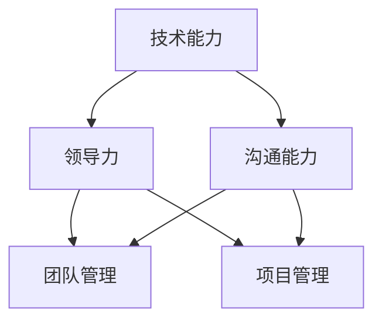

                 

# 《技术领导力：提升职场价值》

> **关键词：** 技术领导力、团队管理、项目管理、个人成长、职场价值、算法原理、数学模型、代码实战。

> **摘要：** 本文深入探讨技术领导力的核心概念、团队管理与项目管理技巧、持续学习与技术精进的方法、沟通与协作能力提升、领导力培养与个人魅力塑造，并通过具体案例和实战，展示如何提升职场价值。

### 《技术领导力：提升职场价值》目录大纲

#### 第一部分：技术领导力概述

##### 第1章：技术领导力的定义与重要性

- **1.1 技术领导力的核心概念**
  - 技术领导力的定义
  - 技术领导力的特征
- **1.2 技术领导力的重要性**
  - 对团队的影响
  - 对项目的影响
  - 对个人职业发展的影响
- **1.3 技术领导力的维度**
  - 技术能力
  - 领导力
  - 沟通能力

##### 第2章：技术领导力与团队管理

- **2.1 领导风格与团队发展**
  - 领导风格的分类
  - 风格对团队发展的影响
- **2.2 激励与绩效管理**
  - 激励理论
  - 绩效管理的原则和方法
- **2.3 冲突解决与团队沟通**
  - 冲突的类型
  - 冲突解决策略
  - 沟通技巧

#### 第二部分：技术领导力与项目管理

##### 第3章：项目计划与进度管理

- **3.1 项目计划的重要性**
  - 项目计划的作用
  - 项目计划的内容
- **3.2 进度管理的原则与方法**
  - 进度管理的原则
  - 进度管理的方法
- **3.3 风险管理与应对策略**
  - 风险管理的步骤
  - 应对策略

##### 第4章：资源分配与优化

- **4.1 人力资源的优化策略**
  - 人力资源的分配原则
  - 人力资源的优化方法
- **4.2 技术资源的合理配置**
  - 技术资源的类型
  - 技术资源的配置策略
- **4.3 资源利用效率的提升方法**
  - 提高资源利用效率的策略

##### 第5章：项目评估与改进

- **5.1 项目评估的指标与方法**
  - 项目评估的指标
  - 项目评估的方法
- **5.2 项目改进的策略与实践**
  - 改进策略
  - 实践案例
- **5.3 项目复盘与持续优化**
  - 项目复盘的方法
  - 持续优化的实践

#### 第三部分：技术领导力与个人成长

##### 第6章：持续学习与技术精进

- **6.1 技术趋势与前沿技术**
  - 技术趋势的分析
  - 前沿技术的应用
- **6.2 学习方法与时间管理**
  - 学习方法的选择
  - 时间管理的技巧
- **6.3 技能提升与职业规划**
  - 技能提升的策略
  - 职业规划的方法

##### 第7章：沟通与协作能力提升

- **7.1 有效沟通的技巧**
  - 沟通的障碍
  - 沟通技巧的提高
- **7.2 协作工具与平台的使用**
  - 协作工具的选择
  - 平台的使用技巧
- **7.3 团队协作与项目成功的保障**
  - 团队协作的原则
  - 项目成功的保障措施

##### 第8章：领导力提升与个人魅力

- **8.1 领导力的培养与提升**
  - 领导力的培养方法
  - 领导力的提升技巧
- **8.2 个人魅力的塑造**
  - 个人魅力的内涵
  - 个人魅力的塑造方法
- **8.3 影响力与个人品牌建设**
  - 个人影响力的提升
  - 个人品牌的建设策略

#### 附录

##### 附录A：技术领导力工具与资源

- **A.1 常用项目管理工具**
  - 项目管理工具的类型
  - 常用项目管理工具的使用
- **A.2 技术学习资源推荐**
  - 技术学习资源的类型
  - 推荐的学习资源
- **A.3 领导力发展资源**
  - 领导力发展资源的类型
  - 推荐的发展资源

### 核心概念联系

#### 技术领导力核心概念与联系



### 项目进度管理算法原理讲解

#### 伪代码：

```plaintext
function projectScheduleManagement(projects) {
    // 初始化进度表
    schedule = initializeSchedule(projects)

    // 迭代每个项目
    for (project in projects) {
        // 分配资源
        allocateResources(project)

        // 计算项目进度
        calculateProjectProgress(project)

        // 调整进度表
        adjustSchedule(schedule, project)
    }

    // 返回最终进度表
    return schedule
}
```

### 数学模型和数学公式

#### 项目评估指标

##### 数学模型：

$$
项目完成度 = \frac{已完成工作}{计划工作总量}
$$

##### 举例说明：

假设一个项目的计划工作总量为100小时，已完成工作量为70小时，则项目完成度：

$$
项目完成度 = \frac{70}{100} = 0.7
$$

### 项目实战

#### 实际项目案例分析

##### 开发环境搭建：

- 操作系统：Ubuntu 20.04
- 开发工具：Visual Studio Code
- 版本控制：Git

##### 源代码详细实现：

```python
# 示例：项目进度跟踪系统

class ProjectProgress:
    def __init__(self, project_name, total_hours, completed_hours):
        self.project_name = project_name
        self.total_hours = total_hours
        self.completed_hours = completed_hours

    def calculate_completion_ratio(self):
        return self.completed_hours / self.total_hours

# 源代码解读与分析：

# 定义项目进度类
class ProjectProgress:
    # 初始化方法
    def __init__(self, project_name, total_hours, completed_hours):
        # 项目名称
        self.project_name = project_name
        # 总工时
        self.total_hours = total_hours
        # 已完成工时
        self.completed_hours = completed_hours

    # 计算完成比方法
    def calculate_completion_ratio(self):
        # 计算完成比
        return self.completed_hours / self.total_hours

# 创建项目进度实例
project = ProjectProgress("项目A", 100, 70)

# 输出完成比
print("项目完成度：", project.calculate_completion_ratio())
```

### 总结

本文通过详细的目录大纲，为读者提供了一个全面的技术领导力提升方案。从技术领导力的定义、团队管理与项目管理，到个人成长与领导力培养，每个部分都涵盖了关键概念、算法原理、数学模型、实际项目案例分析，帮助读者深入理解技术领导力的核心要义。通过本文的学习和实践，读者可以提升自己的技术领导力，在职场中脱颖而出。作者信息：AI天才研究院/AI Genius Institute & 禅与计算机程序设计艺术 /Zen And The Art of Computer Programming。让我们继续深入每个章节，逐步探索技术领导力的奥秘。

