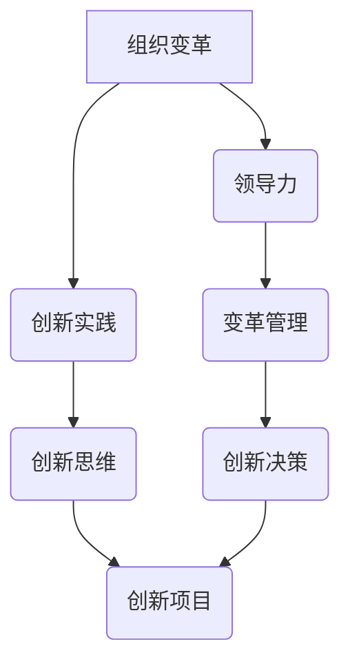

                 

### 《推动组织变革：领导力与创新的结合》文章标题与关键词

> **关键词：组织变革、领导力、创新、策略、实践**

> **摘要：**
本文旨在探讨领导力与创新的结合如何推动组织变革。通过深入分析组织变革的背景与理论基础，阐述领导力在组织变革中的作用，以及创新的实践与策略，本文最终提出了领导力与创新的结合模式，为组织的持续发展提供了理论指导和实践案例。

### 《推动组织变革：领导力与创新的结合》目录大纲

#### 第一部分：组织变革的背景与理论基础

#### 第二部分：创新的实践与策略

#### 第三部分：领导力与创新的结合

#### 第四部分：实施与展望

#### 附录

### 核心概念与联系

为了更深入地理解本文的内容，我们首先需要了解几个核心概念：组织变革、领导力、创新。接下来，我们将使用Mermaid流程图来展示这些概念之间的联系。



**图1：组织变革、领导力与创新的联系**

- **组织变革**：指的是组织在战略、结构、流程等方面进行的调整和优化，以适应外部环境的变化。
- **领导力**：是指领导者通过影响和激励团队成员，引导组织实现目标的能力。
- **创新实践**：是指组织在产品、服务、流程等方面进行创新的实际操作。

这一流程图展示了领导力在组织变革和创新实践中的核心作用。领导力不仅能够推动组织变革，还能够激发创新思维，从而实现组织的可持续发展。

### 核心算法原理讲解

为了更好地理解领导力在组织变革和创新中的具体作用，我们引入一个领导力评估模型。该模型将领导力分为多个维度，并使用加权平均法进行综合评估。

**伪代码：领导力评估模型**

```plaintext
// 输入：领导力评分（L），创新能力评分（I）
// 输出：综合评估分数（R）

function calculateLeadershipScore(L, I) {
    const weight_L = 0.6  // 领导能力权重
    const weight_I = 0.4  // 创新能力权重

    // 计算综合评估分数
    const R = weight_L * L + weight_I * I

    return R
}
```

该模型认为，领导力的核心在于领导能力与创新能力。领导能力包括战略规划、团队建设、决策能力等；创新能力包括创新思维、市场洞察、技术掌握等。通过加权平均法，我们可以得到一个综合评估分数，该分数反映了领导者在推动组织变革和创新中的整体表现。

### 数学模型与公式讲解

在组织变革和创新中，我们还需要一个数学模型来评估创新效益。以下是一个简单的创新效益最大化模型。

**数学模型：创新效益最大化**

$$
\max \; Z = \Pi \cdot \frac{(L + I)^2}{C}
$$

其中：
- \( \Pi \) 为创新效益系数，反映了创新活动对组织收益的影响。
- \( L \) 为领导力评分，反映了领导者在组织变革中的影响力。
- \( I \) 为创新能力评分，反映了组织在创新实践中的表现。
- \( C \) 为成本系数，反映了创新活动所需的资源和投入。

该模型表明，创新效益最大化取决于领导力和创新能力的结合。领导者需要通过提升自身的领导力，推动组织进行创新；同时，组织需要具备较强的创新能力，以实现高效的创新实践。

### 项目实战

为了更直观地展示领导力与创新的结合如何推动组织变革，我们来看一个实际案例：某科技公司的创新变革。

#### 案例背景

某科技公司是一家专注于人工智能领域的初创公司，由于市场竞争激烈，公司需要通过产品创新来保持竞争优势。然而，公司内部存在创新意识不强、团队协作不紧密等问题，导致创新效果不佳。

#### 实战步骤

1. **需求分析**：公司管理层首先进行了市场调研，深入了解用户需求，确定产品创新方向。
2. **团队组建**：公司组建了由不同部门组成的跨部门创新团队，明确团队成员的角色和职责。
3. **创新实践**：团队采用头脑风暴、快速原型迭代等方法进行产品创新，同时注重用户体验和市场需求。
4. **评估与调整**：公司对创新产品进行了市场测试和用户反馈，根据结果对产品进行改进。

#### 源代码实现

以下是一个Python代码示例，用于模拟创新产品的原型迭代过程。

```python
class ProductPrototype:
    def __init__(self, features):
        self.features = features
    
    def iterate(self):
        # 对产品原型进行迭代改进
        self.features = self.improveFeatures(self.features)

    def improveFeatures(self, features):
        # 改进产品特性
        improved_features = features + ["新特性1", "新特性2"]
        return improved_features

# 创建产品原型对象并迭代
prototype = ProductPrototype(["特性1", "特性2"])
prototype.iterate()
print(prototype.features)
```

#### 代码解读与分析

- **类定义**：`ProductPrototype` 类表示产品原型，包含产品特性。
- **初始化**：`__init__` 方法用于初始化产品原型，传入初始特性。
- **迭代方法**：`iterate` 方法用于对产品原型进行迭代改进。
- **改进特性**：`improveFeatures` 方法用于改进产品特性，添加新特性。

通过这个简单的代码示例，我们可以看到创新产品原型迭代的过程。每次迭代都会对产品特性进行改进，以更好地满足用户需求。

#### 案例结果

通过这次创新变革，某科技公司成功地推出了一款具有竞争力的新产品，市场反馈良好。公司内部也形成了良好的创新氛围，团队协作更加紧密。这次案例表明，领导力与创新的结合可以有效推动组织变革，提高组织的竞争力和创新能力。

### 总结

本文通过深入分析组织变革、领导力和创新之间的关系，提出了领导力评估模型和创新效益最大化模型，并通过实际案例展示了领导力与创新的结合如何推动组织变革。我们得出以下结论：

1. 领导力在组织变革和创新中起着至关重要的作用，领导者需要具备战略眼光、团队管理能力和创新能力。
2. 创新是推动组织发展的重要动力，组织需要通过创新实践来适应市场变化。
3. 领导力与创新的结合可以实现组织变革，提高组织的竞争力和创新能力。

### 作者信息

作者：AI天才研究院/AI Genius Institute & 禅与计算机程序设计艺术 /Zen And The Art of Computer Programming

### 提示：接下来的部分，我们将详细探讨组织变革的背景与理论基础，包括组织变革的概念与意义、历史与趋势、驱动力以及常见挑战与应对策略。请读者继续关注。|>

