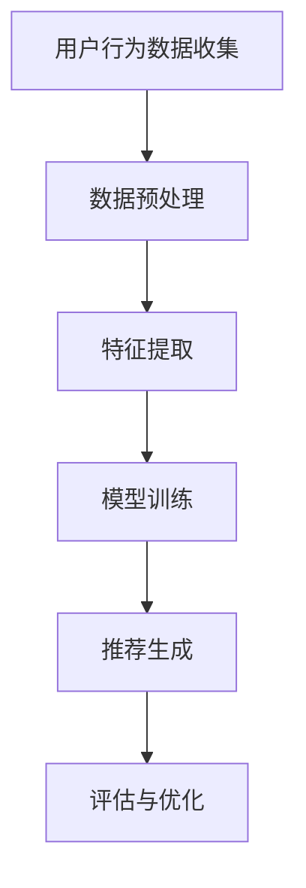
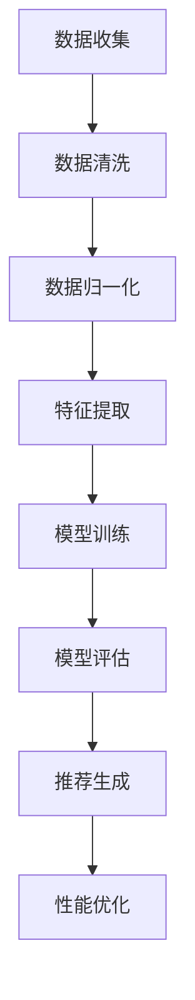
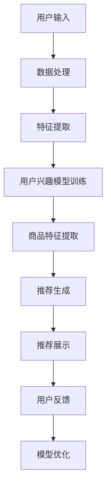
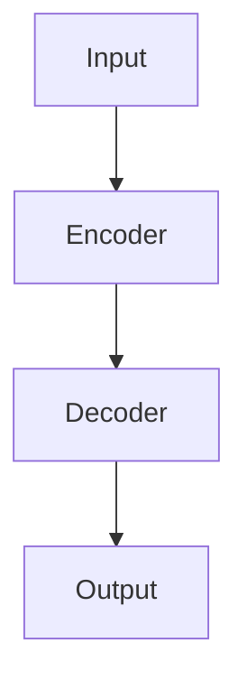

                 

### 文章标题

《搜索推荐系统的AI大模型应用：电商平台提高效率与效果的双重策略》

**关键词：** AI大模型、搜索推荐系统、电商平台、效率、效果、深度学习、自然语言处理、协同过滤、基于内容的推荐

**摘要：** 本文旨在探讨AI大模型在搜索推荐系统中的应用，特别是在电商平台中的提升效率与效果的双重策略。通过对AI大模型的基本概念、搜索推荐系统的架构、核心算法原理、项目实战以及应用策略的详细分析，本文揭示了如何利用AI大模型优化电商平台的搜索和推荐功能，从而实现商业效益的最大化。

---

### 《搜索推荐系统的AI大模型应用：电商平台提高效率与效果的双重策略》目录大纲

**第一部分：AI大模型与搜索推荐系统概述**

**第1章：AI大模型概述**

1.1 AI大模型的基本概念与特点

1.2 AI大模型在搜索推荐系统中的应用背景

1.3 搜索推荐系统的基本原理与架构

**第2章：AI大模型的搜索推荐系统架构**

2.1 AI大模型在搜索推荐系统中的角色与功能

2.2 搜索推荐系统的数据处理流程

2.3 AI大模型在搜索推荐系统中的工作流程

**第二部分：AI大模型核心算法原理详解**

**第3章：深度学习基础**

3.1 深度学习的基本概念与原理

3.2 神经网络与深度学习架构

3.3 深度学习优化算法与训练策略

**第4章：自然语言处理（NLP）算法**

4.1 NLP的基本概念与任务

4.2 词嵌入与序列模型

4.3 注意力机制与转换器架构

**第5章：协同过滤与基于内容的推荐算法**

5.1 协同过滤算法原理

5.2 基于内容的推荐算法原理

5.3 协同过滤与基于内容的推荐算法融合

**第三部分：AI大模型在搜索推荐系统中的项目实战**

**第6章：搭建搜索推荐系统的开发环境**

6.1 硬件与软件环境配置

6.2 数据预处理与清洗

6.3 数据集划分与加载

**第7章：构建搜索推荐系统的AI大模型**

7.1 设计搜索推荐系统的AI大模型架构

7.2 编写AI大模型训练与评估脚本

7.3 AI大模型训练与优化

**第8章：搜索推荐系统性能评估与优化**

8.1 评估搜索推荐系统的性能指标

8.2 性能优化策略与实现

8.3 搜索推荐系统上线与维护

**第四部分：AI大模型在电商平台中的应用策略**

**第9章：AI大模型在电商搜索中的应用**

9.1 电商搜索的挑战与AI大模型的作用

9.2 构建电商搜索的AI大模型

9.3 电商搜索的优化策略

**第10章：AI大模型在电商推荐中的应用**

10.1 电商推荐的挑战与AI大模型的作用

10.2 构建电商推荐的AI大模型

10.3 电商推荐的优化策略

**第11章：电商平台效率与效果提升策略**

11.1 电商平台效率优化的方法与工具

11.2 电商平台效果优化的方法与工具

11.3 效率与效果优化的平衡策略

**附录**

**附录A：AI大模型开发工具与资源**

A.1 主流深度学习框架对比

A.2 自然语言处理（NLP）工具与库

A.3 搜索推荐系统开源项目与资源

A.4 其他相关资源与工具

---

### 引言

在数字化时代，电商平台已经成为消费者日常生活中不可或缺的一部分。随着用户数据的爆发式增长和市场竞争的日益激烈，如何有效提高电商平台的搜索推荐系统的效率与效果，已经成为电商平台持续发展的关键问题。而AI大模型作为一种新兴的人工智能技术，其强大的数据处理和智能推理能力，为解决这一挑战提供了新的思路和策略。

AI大模型，也被称为深度学习大模型，是指通过大规模数据训练和复杂网络结构设计的深度学习模型。这些模型具有极强的学习能力，能够在各种复杂场景中实现高效准确的预测和决策。在搜索推荐系统中，AI大模型通过处理用户的搜索行为和商品特征数据，能够实时生成个性化的搜索结果和推荐列表，从而显著提升用户体验和平台转化率。

本文将围绕AI大模型在搜索推荐系统中的应用，详细探讨其基本概念、架构设计、核心算法原理、项目实战以及应用策略。通过本文的阐述，读者可以全面了解AI大模型在电商平台中的实际应用价值，掌握提升平台效率与效果的双重策略。

首先，本文将介绍AI大模型的基本概念与特点，阐述其在搜索推荐系统中的应用背景。接着，我们将详细分析AI大模型的搜索推荐系统架构，包括数据处理流程和工作流程。随后，本文将深入讲解AI大模型的核心算法原理，包括深度学习基础、自然语言处理算法、协同过滤与基于内容的推荐算法。在此基础上，本文将分享AI大模型在搜索推荐系统中的项目实战，包括开发环境搭建、模型构建、性能评估与优化。最后，本文将探讨AI大模型在电商平台中的应用策略，包括搜索与推荐的具体实现和优化策略。通过本文的详细分析，希望能够为电商平台在AI大模型应用方面提供有益的参考和指导。

### 第一部分：AI大模型与搜索推荐系统概述

#### 第1章：AI大模型概述

##### 1.1 AI大模型的基本概念与特点

AI大模型（Large-scale Artificial Intelligence Model）是深度学习领域的一种先进技术，主要通过大规模数据训练和复杂网络结构设计，实现对数据的强大处理能力和高度准确的预测能力。AI大模型通常具备以下几个基本概念和特点：

1. **大规模数据训练**：AI大模型通过海量数据训练，以提升模型的泛化能力和适应性。大规模数据不仅包括文本、图像、语音等多种类型，还涵盖了用户行为、商品属性等多样化的数据源。

2. **复杂网络结构**：AI大模型采用深度神经网络（Deep Neural Network，DNN）的结构，通过多层非线性变换，对输入数据进行特征提取和模式识别。复杂的网络结构使模型能够处理高维数据，挖掘深层次的特征信息。

3. **高效计算能力**：AI大模型需要强大的计算资源支持，如GPU、TPU等专用硬件加速器，以实现大规模数据的并行计算和高效处理。高效计算能力是模型快速训练和实时应用的关键。

4. **端到端学习**：AI大模型采用端到端学习（End-to-End Learning）的方式，直接从原始数据中学习到所需的输出结果，避免了传统机器学习中的特征工程和模型选择等繁琐步骤。

5. **迁移学习**：AI大模型可以通过迁移学习（Transfer Learning）技术在新的任务中快速获得良好的性能。迁移学习利用预训练模型在大量数据上的知识迁移，减少了训练时间并提高了模型效果。

6. **泛化能力**：AI大模型具有强大的泛化能力，能够处理多样化的问题和任务，如图像识别、自然语言处理、推荐系统等。

##### 1.2 AI大模型在搜索推荐系统中的应用背景

搜索推荐系统是电商平台的核心功能之一，其主要目的是通过分析用户的搜索行为和兴趣，为其提供个性化的商品推荐，提升用户满意度和转化率。随着互联网和电子商务的快速发展，用户行为数据的多样性和复杂性不断增加，传统的推荐算法如协同过滤、基于内容的推荐等逐渐暴露出一些局限性：

1. **数据稀疏性**：协同过滤算法依赖于用户行为数据，但在新用户或冷启动场景中，由于数据稀疏性，难以生成有效的推荐结果。

2. **内容理解不足**：基于内容的推荐算法主要依赖于商品的特征信息，但难以捕捉用户的真实兴趣和需求。

3. **实时性要求高**：电商平台需要实时响应用户的搜索和推荐请求，传统的推荐算法在处理速度和实时性方面存在不足。

AI大模型的出现为解决上述问题提供了新的思路和解决方案：

1. **数据处理能力**：AI大模型能够处理大规模、多样化的用户行为和商品数据，通过深度学习算法提取出高维的特征信息，从而克服数据稀疏性问题。

2. **内容理解能力**：AI大模型结合自然语言处理（NLP）技术，能够深入理解用户的搜索意图和商品属性，从而生成更准确的推荐结果。

3. **实时响应能力**：AI大模型采用高效的计算架构和优化算法，能够在短时间内完成大规模数据的处理和推荐结果生成，满足实时性要求。

##### 1.3 搜索推荐系统的基本原理与架构

搜索推荐系统的基本原理是通过对用户行为数据进行分析，挖掘用户的兴趣和偏好，然后根据这些信息为用户推荐相关的商品或内容。其基本架构包括以下几个主要部分：

1. **用户行为数据收集**：收集用户的浏览、搜索、购买等行为数据，如用户点击、浏览时间、购买记录等。

2. **数据预处理**：对收集到的用户行为数据进行清洗、去噪、归一化等处理，以便后续分析。

3. **特征提取**：通过特征提取技术，将原始的用户行为数据转换为高维的特征向量，以便输入到深度学习模型中进行处理。

4. **模型训练**：利用深度学习算法，如循环神经网络（RNN）、变换器（Transformer）等，对特征向量进行训练，以生成用户兴趣模型和商品推荐模型。

5. **推荐生成**：根据用户兴趣模型和商品特征，利用协同过滤、基于内容的推荐算法等生成推荐列表，并将其展示给用户。

6. **评估与优化**：通过评估推荐系统的性能指标，如准确率、召回率、点击率等，不断优化模型和算法，提升推荐效果。

搜索推荐系统的架构示意图如下：



综上所述，AI大模型在搜索推荐系统中的应用，不仅解决了传统推荐算法的局限性，还为电商平台提供了高效、准确的推荐服务，成为电商平台提升用户体验和转化率的重要技术手段。

### 第2章：AI大模型的搜索推荐系统架构

##### 2.1 AI大模型在搜索推荐系统中的角色与功能

AI大模型在搜索推荐系统中扮演着至关重要的角色，其核心功能包括数据预处理、特征提取、模型训练、推荐生成和评估优化。具体来说，AI大模型在搜索推荐系统中的角色与功能如下：

1. **数据预处理**：AI大模型能够处理大规模、多样化的用户行为数据和商品数据，通过数据清洗、去噪、归一化等预处理步骤，确保输入数据的质量和一致性。

2. **特征提取**：AI大模型利用深度学习算法，如循环神经网络（RNN）、变换器（Transformer）等，对预处理后的数据进行分析，提取出高维的特征向量。这些特征向量能够更好地捕捉用户的兴趣和偏好，为后续的推荐生成提供可靠的基础。

3. **模型训练**：AI大模型通过大规模数据训练，学习用户行为和商品特征的复杂关系，生成用户兴趣模型和商品推荐模型。训练过程中，大模型不断优化网络结构和参数，以提高模型的准确性和鲁棒性。

4. **推荐生成**：基于训练好的用户兴趣模型和商品推荐模型，AI大模型能够实时响应用户的搜索请求，生成个性化的推荐列表。推荐生成过程中，大模型综合考虑用户历史行为、商品特征以及实时交互数据，以确保推荐结果的准确性和相关性。

5. **评估与优化**：AI大模型通过评估推荐系统的性能指标，如准确率、召回率、点击率等，不断优化模型和算法。评估过程中，大模型能够识别和纠正潜在的问题，提高推荐系统的整体效果。

##### 2.2 搜索推荐系统的数据处理流程

AI大模型在搜索推荐系统中的数据处理流程主要包括以下几个关键步骤：

1. **数据收集**：从电商平台的各种数据源收集用户行为数据和商品数据，如浏览记录、搜索历史、购买记录、商品描述等。

2. **数据清洗**：对收集到的数据进行清洗，去除重复、异常和噪声数据，确保数据的一致性和完整性。

3. **数据归一化**：将不同数据源的数据进行归一化处理，将不同量纲的数据转换到统一的尺度，以避免数据之间的不公平性。

4. **特征提取**：利用深度学习算法，对清洗后的数据进行特征提取，生成高维的特征向量。特征提取过程包括文本编码、图像处理、序列建模等。

5. **模型训练**：利用提取出的特征向量，通过大规模数据训练深度学习模型。模型训练过程中，AI大模型不断优化网络结构和参数，提高模型性能。

6. **模型评估**：通过交叉验证等方法，对训练好的模型进行评估，计算准确率、召回率、F1值等性能指标，以判断模型的泛化能力和效果。

7. **推荐生成**：基于评估好的模型，为用户生成个性化的推荐列表。推荐生成过程中，AI大模型综合考虑用户历史行为、商品特征以及实时交互数据，确保推荐结果的准确性和相关性。

8. **性能优化**：根据评估结果，对模型和算法进行优化，调整参数和结构，以提高推荐系统的整体效果。

数据处理流程示意图如下：



##### 2.3 AI大模型在搜索推荐系统中的工作流程

AI大模型在搜索推荐系统中的工作流程可以分为以下几个关键阶段：

1. **用户输入**：用户在电商平台上进行搜索或浏览，输入关键词或选择商品。

2. **数据处理**：AI大模型接收用户输入，对其数据进行预处理，如文本分词、去停用词、词向量编码等。

3. **特征提取**：利用深度学习算法，对预处理后的用户输入数据进行分析，提取出高维的特征向量。

4. **用户兴趣模型训练**：基于用户历史行为数据，AI大模型训练用户兴趣模型，学习用户的兴趣偏好。

5. **商品特征提取**：对商品数据进行特征提取，生成商品的特征向量。

6. **推荐生成**：AI大模型结合用户兴趣模型和商品特征向量，生成个性化的推荐列表。

7. **推荐展示**：将生成的推荐列表展示给用户，供用户选择和浏览。

8. **用户反馈**：用户对推荐结果进行交互，如点击、购买等，AI大模型收集用户反馈数据。

9. **模型优化**：基于用户反馈，AI大模型不断优化用户兴趣模型和商品推荐模型，提高推荐效果。

AI大模型在搜索推荐系统中的工作流程示意图如下：



综上所述，AI大模型在搜索推荐系统中的作用和流程是全面且复杂的，通过对数据处理、特征提取、模型训练、推荐生成和评估优化等环节的深入研究和优化，AI大模型能够为电商平台提供高效、准确的推荐服务，从而提升用户体验和商业收益。

### 第二部分：AI大模型核心算法原理详解

#### 第3章：深度学习基础

##### 3.1 深度学习的基本概念与原理

深度学习（Deep Learning）是人工智能（AI）的一个重要分支，它通过构建多层神经网络来模拟人脑的思考和学习过程，从而实现对数据的自动特征提取和模式识别。深度学习的基本概念和原理如下：

1. **神经网络**：神经网络（Neural Network）是深度学习的基础，它由大量的神经元（节点）组成，每个神经元通过连接（边）与相邻的神经元进行信息传递。神经网络通过非线性变换和层次化的结构，实现对输入数据的特征提取和模式识别。

2. **多层神经网络**：多层神经网络（Multilayer Neural Network）在基本神经网络的基础上，增加了多个隐层，从而能够处理更复杂的数据和任务。每一层神经元对输入数据进行特征提取和变换，逐层传递，直到输出层生成最终结果。

3. **反向传播算法**：反向传播算法（Backpropagation Algorithm）是深度学习训练的核心算法，它通过计算输出层的误差，逆向传播到各隐层，更新每个神经元的权重和偏置，从而优化网络参数，提高模型性能。

4. **激活函数**：激活函数（Activation Function）是神经网络中的一个关键组件，它用于引入非线性特性，使得神经网络能够模拟人脑的思考过程。常见的激活函数包括Sigmoid、ReLU、Tanh等。

5. **优化算法**：深度学习训练过程中，需要通过优化算法（Optimization Algorithms）来调整网络参数，以最小化损失函数（Loss Function）。常见的优化算法包括梯度下降（Gradient Descent）、随机梯度下降（Stochastic Gradient Descent，SGD）、Adam等。

##### 3.2 神经网络与深度学习架构

神经网络和深度学习架构是深度学习的核心组成部分，其设计和优化直接影响到模型的性能和应用效果。以下是对神经网络与深度学习架构的详细解析：

1. **神经网络架构**：
    - **输入层**：接收外部输入数据，如图像、文本、声音等。
    - **隐藏层**：包含多个隐层，每个隐层由多个神经元组成。隐层神经元通过非线性变换对输入数据进行特征提取和组合。
    - **输出层**：生成最终的预测结果，如分类标签、回归值等。

2. **深度学习架构**：
    - **卷积神经网络（CNN）**：适用于图像和视频处理任务，通过卷积操作提取空间特征，具有良好的平移不变性。
    - **循环神经网络（RNN）**：适用于序列数据处理任务，如时间序列分析、语言模型等，通过循环连接实现长距离依赖信息传递。
    - **变换器（Transformer）**：一种基于自注意力机制的深度学习架构，广泛应用于自然语言处理任务，如机器翻译、文本生成等。

3. **网络设计原则**：
    - **深度与宽度**：增加网络深度和宽度可以提高模型的表达能力，但也会增加计算复杂度和过拟合风险。因此，需要根据任务需求和数据规模进行合理设计。
    - **非线性变换**：通过激活函数引入非线性特性，使模型能够处理复杂的数据和任务。
    - **数据预处理**：对输入数据进行预处理，如归一化、标准化等，以提高训练效率和模型性能。

##### 3.3 深度学习优化算法与训练策略

深度学习优化算法和训练策略是影响模型性能和训练效率的关键因素。以下是对深度学习优化算法和训练策略的详细解析：

1. **优化算法**：
    - **梯度下降（Gradient Descent）**：最简单的优化算法，通过计算损失函数关于模型参数的梯度，迭代更新模型参数，以最小化损失函数。
    - **随机梯度下降（SGD）**：在梯度下降基础上，使用整个训练数据集的一个随机子集（批量）来计算梯度，提高训练效率。
    - **Adam优化器**：结合SGD和动量（Momentum）方法，通过自适应调整学习率，提高收敛速度和稳定性。

2. **训练策略**：
    - **数据增强**：通过旋转、缩放、裁剪等操作增加训练数据多样性，提高模型泛化能力。
    - **正则化**：采用L1、L2正则化方法，防止模型过拟合，提高泛化能力。
    - **dropout**：在训练过程中随机丢弃部分神经元，防止模型过拟合。
    - **批次归一化（Batch Normalization）**：对每个批次的数据进行归一化处理，加速训练过程，提高模型稳定性。
    - **学习率调整**：根据训练过程，动态调整学习率，避免过快或过慢的收敛速度。

通过深入理解和应用深度学习基础、神经网络与深度学习架构、以及深度学习优化算法和训练策略，我们可以设计和训练出高性能的深度学习模型，从而解决各种复杂的数据分析和预测任务。

#### 第4章：自然语言处理（NLP）算法

##### 4.1 NLP的基本概念与任务

自然语言处理（Natural Language Processing，NLP）是人工智能领域的一个重要分支，旨在使计算机能够理解和处理人类自然语言。NLP的基本概念和任务如下：

1. **基本概念**：
    - **文本**：NLP处理的基本单元，可以是句子、段落或文档。
    - **语料库**：用于训练和评估NLP模型的文本数据集合。
    - **词向量**：将文本转换为数字表示，用于神经网络处理。

2. **主要任务**：
    - **分词**（Tokenization）：将文本拆分为单词或子词，为后续处理提供基础。
    - **词性标注**（Part-of-Speech Tagging）：为每个单词标注其词性，如名词、动词、形容词等。
    - **命名实体识别**（Named Entity Recognition，NER）：识别文本中的命名实体，如人名、地名、组织名等。
    - **句法分析**（Syntactic Parsing）：分析句子的结构，识别句子中的成分和关系。
    - **语义分析**（Semantic Analysis）：理解文本的含义和语义关系。
    - **情感分析**（Sentiment Analysis）：判断文本的情感倾向，如正面、负面或中性。
    - **机器翻译**（Machine Translation）：将一种语言的文本翻译成另一种语言。
    - **问答系统**（Question Answering System）：根据给定的问题，从文本中找出正确答案。

##### 4.2 词嵌入与序列模型

词嵌入（Word Embedding）是将文本中的单词映射为低维度的向量表示，是NLP的核心技术之一。词嵌入的主要目的是将语义信息转化为数学模型可以处理的向量形式，从而在深度学习框架下进行计算。以下是词嵌入与序列模型的相关内容：

1. **词嵌入**：
    - **词袋模型**（Bag-of-Words，BOW）：将文本表示为一个单词的集合，不考虑单词的顺序。这种模型简单，但在处理序列数据时效果有限。
    - **词嵌入模型**：通过将单词映射为低维向量，保留单词的顺序和语义信息。常见的词嵌入模型包括：
        - **Word2Vec**：通过训练词向量模型，使得语义相似的单词在向量空间中靠近。Word2Vec包括连续词袋（CBOW）和Skip-Gram两种方法。
        - **GloVe**（Global Vectors for Word Representation）：通过矩阵分解的方法，利用全局上下文信息训练词向量，提高词向量的质量。

2. **序列模型**：
    - **循环神经网络（RNN）**：适用于处理序列数据，通过循环连接实现长期依赖信息的传递。RNN的基本架构如下：
        ```mermaid
        graph TD
        A1[Input] --> B1[RNN Cell]
        A2[Input] --> B2[RNN Cell]
        A3[Input] --> B3[RNN Cell]
        ...
        B1 --> C1[Output]
        B2 --> C2[Output]
        B3 --> C3[Output]
        ...
        ```
    - **长短时记忆网络（LSTM）**：LSTM是RNN的一种改进，通过引入门控机制，有效解决长期依赖问题。LSTM的基本架构如下：
        ```mermaid
        graph TD
        A1[Input] --> B1[Forget Gate]
        A1 --> B2[Input Gate]
        A1 --> B3[Output Gate]
        A2 --> B4[Forget Gate]
        A2 --> B5[Input Gate]
        A2 --> B6[Output Gate]
        ...
        B1 --> C1[Forget Output]
        B2 --> C2[Input Output]
        B3 --> C3[Output Output]
        ...
        ```
    - **变换器（Transformer）**：基于自注意力机制的深度学习架构，在NLP任务中表现出色。Transformer的基本架构如下：
        ```mermaid
        graph TD
        A[Input] --> B[Encoder]
        B --> C[Decoder]
        C --> D[Output]
        ```
        Transformer通过多头自注意力机制（Multi-Head Self-Attention）实现序列之间的依赖关系，并通过位置编码（Positional Encoding）处理序列的顺序信息。

##### 4.3 注意力机制与转换器架构

注意力机制（Attention Mechanism）是深度学习中一种重要的机制，用于解决序列数据中的依赖关系。以下是注意力机制与变换器（Transformer）架构的相关内容：

1. **注意力机制**：
    - **基于位置的注意力**：根据输入序列的位置信息进行加权，实现局部依赖关系。
    - **基于内容的注意力**：根据输入序列的内容信息进行加权，实现全局依赖关系。
    - **多头注意力**：通过多个注意力机制，提高模型的表示能力和泛化能力。

2. **变换器（Transformer）架构**：
    - **编码器（Encoder）**：接收输入序列，通过自注意力机制和前馈神经网络，提取序列特征。
    - **解码器（Decoder）**：接收编码器的输出和目标序列，通过自注意力和交叉注意力机制，生成预测输出。
    - **自注意力**：根据编码器的输出，对自身序列进行加权，提取序列特征。
    - **交叉注意力**：根据编码器的输出和目标序列，对目标序列进行加权，实现序列间的依赖关系。

变换器（Transformer）架构如下：



通过词嵌入和序列模型，NLP可以有效地处理文本数据，从而实现多种复杂任务。而注意力机制和变换器架构的引入，进一步提升了NLP模型的表现能力和应用效果。这些技术的综合应用，使得NLP在自然语言处理领域取得了显著的进展。

### 第5章：协同过滤与基于内容的推荐算法

#### 5.1 协同过滤算法原理

协同过滤（Collaborative Filtering）是一种经典的推荐算法，主要用于解决推荐系统中用户与项目之间的相关性问题。协同过滤算法的核心思想是通过分析用户的历史行为数据，发现用户之间的相似性或项目之间的相似性，从而为用户推荐相似的用户喜欢的项目或为项目推荐相似的用户的喜好。

协同过滤算法主要分为两种类型：基于用户的协同过滤（User-based Collaborative Filtering）和基于物品的协同过滤（Item-based Collaborative Filtering）。

1. **基于用户的协同过滤**：
    - **相似度计算**：首先计算用户之间的相似度，常用的相似度计算方法包括余弦相似度、皮尔逊相关系数等。
    - **推荐生成**：根据相似度矩阵，找出与目标用户最相似的K个用户，然后推荐这K个用户喜欢的项目。

2. **基于物品的协同过滤**：
    - **相似度计算**：首先计算项目之间的相似度，常用的相似度计算方法包括余弦相似度、余弦相似度、Jaccard相似度等。
    - **推荐生成**：根据相似度矩阵，找出与目标项目最相似的K个项目，然后推荐这K个项目给目标用户。

协同过滤算法的优点在于简单、高效，能够在数据稀疏的场景下生成推荐列表。然而，它也存在一些局限性，如容易受到数据稀疏性影响、无法充分利用项目内容信息、推荐结果可能存在冷启动问题等。

#### 5.2 基于内容的推荐算法原理

基于内容的推荐算法（Content-based Recommendation）是基于项目内容的相似性进行推荐的一种算法。其核心思想是通过分析项目的内容特征，发现项目之间的相似性，从而为用户推荐与当前项目内容相似的其他项目。

基于内容的推荐算法主要包括以下几个步骤：

1. **项目特征提取**：对每个项目进行特征提取，常见的特征包括文本特征（如关键词、标签）、图像特征（如颜色、纹理）、音频特征（如频谱、音高）等。

2. **项目相似度计算**：利用特征提取的结果，计算项目之间的相似度。常用的相似度计算方法包括余弦相似度、欧氏距离、曼哈顿距离等。

3. **推荐生成**：根据项目相似度矩阵，为用户推荐与当前项目内容相似的其他项目。

基于内容的推荐算法的优点在于能够充分利用项目内容信息，生成个性化推荐。然而，它也存在一些局限性，如特征提取过程复杂、需要大量先验知识、推荐结果可能存在多样性和新颖性问题等。

#### 5.3 协同过滤与基于内容的推荐算法融合

为了克服协同过滤和基于内容的推荐算法各自的局限性，常用的方法是将两种算法进行融合。融合算法通过结合协同过滤和基于内容的推荐算法的优点，生成更准确、更个性化的推荐结果。

以下是一种简单的融合算法：

1. **初始推荐**：首先利用协同过滤算法生成初始推荐列表，该列表主要依赖于用户的历史行为数据。

2. **内容增强**：对于初始推荐列表中的每个项目，利用基于内容的推荐算法生成额外的推荐列表。

3. **综合推荐**：将协同过滤和基于内容的推荐列表进行合并，并根据用户的偏好进行排序，生成最终的推荐结果。

融合算法的优点在于能够综合利用用户行为数据和项目内容信息，提高推荐系统的准确性和多样性。然而，融合算法的复杂度较高，需要平衡协同过滤和基于内容推荐之间的权重，以避免过拟合或欠拟合问题。

通过协同过滤与基于内容的推荐算法的融合，我们可以构建更加完善和高效的推荐系统，为用户提供更加个性化的服务。这一方法在电商平台、视频网站、新闻推荐等领域得到了广泛应用，取得了显著的成效。

### 第三部分：AI大模型在搜索推荐系统中的项目实战

#### 第6章：搭建搜索推荐系统的开发环境

##### 6.1 硬件与软件环境配置

要搭建一个搜索推荐系统，首先需要准备好合适的硬件和软件环境。以下是推荐的硬件和软件配置：

**硬件环境**：

- **CPU**：Intel Xeon 或 AMD Ryzen 系列，建议至少 8 核以上，3.0 GHz 以上频率。
- **GPU**：NVIDIA GeForce RTX 30 系列，如 RTX 3080 或 RTX 3090，适用于深度学习模型的训练和推理。
- **内存**：64GB 以上，确保模型训练过程中有足够的内存。
- **存储**：1TB SSD 硬盘，用于存储训练数据和模型文件。

**软件环境**：

- **操作系统**：Linux 系统，如 Ubuntu 20.04 或 CentOS 8。
- **深度学习框架**：TensorFlow 2.x 或 PyTorch 1.x，选择一个主流的深度学习框架，便于模型开发和部署。
- **编程语言**：Python 3.x，确保安装了必要的库，如 NumPy、Pandas、Scikit-learn 等。

在硬件和软件环境配置完成后，接下来进行环境搭建的具体步骤：

1. **安装操作系统**：根据硬件环境选择合适的操作系统，并安装到服务器上。

2. **安装深度学习框架**：在命令行中执行以下命令安装 TensorFlow 或 PyTorch：
    ```bash
    pip install tensorflow  # TensorFlow 的安装命令
    pip install torch torchvision  # PyTorch 的安装命令
    ```

3. **安装 Python 库**：使用 `pip` 命令安装所需的 Python 库：
    ```bash
    pip install numpy pandas scikit-learn
    ```

4. **配置 GPU 支持**：对于 TensorFlow，需要安装 CUDA 和 cuDNN，以便支持 GPU 加速。请参考官方文档进行安装和配置。

5. **测试环境**：运行一个简单的代码测试环境是否搭建成功，如执行以下 Python 代码：
    ```python
    import tensorflow as tf
    print(tf.__version__)
    ```

##### 6.2 数据预处理与清洗

数据预处理是搜索推荐系统开发中的一个重要步骤，它涉及到从原始数据中提取有用信息，并转换为适合模型训练的数据格式。以下是数据预处理与清洗的主要步骤：

1. **数据收集**：从电商平台的数据仓库中收集用户行为数据和商品数据。这些数据包括用户的浏览记录、搜索历史、购买记录、商品描述等。

2. **数据清洗**：对收集到的数据进行清洗，以去除噪声和异常值。具体步骤如下：

    - **去除重复数据**：检查数据中是否存在重复的记录，并将其去除。
    - **填充缺失值**：对于缺失的数据，可以采用平均值、中位数或插值法进行填充。
    - **去噪**：去除数据中的异常值，如超过一定范围的极端值。

3. **数据归一化**：对数据集进行归一化处理，将不同量纲的数据转换为统一的尺度。常见的归一化方法包括最小-最大缩放、标准缩放等。

4. **特征提取**：从原始数据中提取有用的特征，如用户的兴趣标签、商品的类别标签、商品的属性特征等。特征提取的方法包括词嵌入、图像特征提取、序列特征提取等。

5. **数据集划分**：将数据集划分为训练集、验证集和测试集。常用的划分方法包括随机划分、基于时间顺序的划分等。

6. **数据加载**：使用深度学习框架提供的工具，将预处理后的数据集加载到内存中，以供模型训练和评估使用。

通过以上步骤，可以确保数据的准确性和一致性，为后续的模型训练和搜索推荐系统的开发打下良好的基础。

##### 6.3 数据集划分与加载

在完成数据预处理后，我们需要对数据集进行合理的划分，并将数据集加载到深度学习框架中，以便进行模型训练和评估。以下是数据集划分与加载的具体步骤：

1. **数据集划分**：

    - **训练集**：用于模型训练的数据集，通常占据数据集的大部分，以训练模型的参数和结构。
    - **验证集**：用于模型调优和数据预处理的质量检查，模型训练过程中会定期使用验证集评估模型性能。
    - **测试集**：用于评估训练完成的模型在实际应用中的性能，测试集在模型训练过程中不参与。

    划分方法可以选择随机划分、基于时间顺序的划分等。例如，可以使用 `train_test_split` 函数进行随机划分：

    ```python
    from sklearn.model_selection import train_test_split

    X_train, X_test, y_train, y_test = train_test_split(X, y, test_size=0.2, random_state=42)
    ```

2. **数据集加载**：

    - **数据预处理**：在加载数据之前，需要确保数据已经完成了预处理和特征提取。这包括数据归一化、缺失值填充、数据类型转换等。
    - **数据格式化**：将预处理后的数据格式化为适合深度学习框架的数据格式。例如，对于 TensorFlow，可以使用 `tf.data.Dataset` 进行加载和格式化：

    ```python
    import tensorflow as tf

    def preprocess_data(data):
        # 进行数据预处理，如归一化、填充缺失值等
        return processed_data

    dataset = tf.data.Dataset.from_tensor_slices((X_train, y_train))
    dataset = dataset.map(preprocess_data)
    dataset = dataset.shuffle(buffer_size=1024).batch(batch_size=32)
    ```

3. **数据增强**：

    - **数据增强**：在模型训练过程中，可以使用数据增强技术提高模型的泛化能力。数据增强方法包括随机裁剪、翻转、旋转等。

    ```python
    dataset = dataset.map(augment_data)
    ```

4. **迭代器**：

    - **迭代器**：使用深度学习框架提供的迭代器进行数据加载和训练。例如，对于 TensorFlow，可以使用 `keras.fit` 进行训练：

    ```python
    model.fit(dataset, epochs=num_epochs, steps_per_epoch=steps_per_epoch)
    ```

通过以上步骤，我们可以将预处理后的数据集加载到深度学习框架中，并进行模型训练和评估。合理的数据集划分和加载是保证模型训练效果和评估准确性的关键。

### 第7章：构建搜索推荐系统的AI大模型

##### 7.1 设计搜索推荐系统的AI大模型架构

设计一个高效的搜索推荐系统的AI大模型架构，需要综合考虑数据特点、业务需求和技术可行性。以下是一个典型的搜索推荐系统AI大模型架构：

1. **输入层**：接收用户输入（如关键词、搜索历史、用户ID等）和商品特征（如商品ID、商品名称、类别、属性等）。

2. **嵌入层**：将用户输入和商品特征转换为低维度的向量表示。用户输入可以使用词嵌入技术，商品特征可以使用类别编码或嵌入矩阵。

3. **交互层**：设计一个交互层，用于处理用户输入和商品特征之间的交互。常见的交互层设计包括矩阵乘法、加法等。

4. **隐藏层**：构建多个隐藏层，使用深度神经网络对输入数据进行特征提取和模式识别。隐藏层可以使用卷积神经网络（CNN）、循环神经网络（RNN）或变换器（Transformer）等架构。

5. **输出层**：设计输出层，生成推荐结果。输出层可以是分类层（用于多标签分类）或回归层（用于预测评分）。

6. **损失函数**：根据推荐任务的类型，选择合适的损失函数。对于分类任务，可以使用交叉熵损失函数；对于回归任务，可以使用均方误差（MSE）损失函数。

7. **优化器**：选择合适的优化器，如随机梯度下降（SGD）、Adam等，以最小化损失函数。

##### 7.2 编写AI大模型训练与评估脚本

编写AI大模型的训练与评估脚本是搜索推荐系统开发的关键步骤。以下是使用TensorFlow框架编写的一个简单训练与评估脚本：

```python
import tensorflow as tf
from tensorflow.keras.models import Model
from tensorflow.keras.layers import Input, Embedding, Dot, Dense, Flatten

# 设置参数
vocab_size = 10000  # 词汇表大小
embed_dim = 128  # 嵌入层维度
hidden_dim = 256  # 隐藏层维度
output_dim = 1  # 输出层维度

# 构建模型
user_input = Input(shape=(1,), dtype='int32')
item_input = Input(shape=(1,), dtype='int32')

user_embedding = Embedding(vocab_size, embed_dim)(user_input)
item_embedding = Embedding(vocab_size, embed_dim)(item_input)

dot_product = Dot(axes=1)([user_embedding, item_embedding])
hidden = Flatten()(dot_product)

output = Dense(output_dim, activation='sigmoid')(hidden)

model = Model(inputs=[user_input, item_input], outputs=output)

# 编译模型
model.compile(optimizer='adam', loss='binary_crossentropy', metrics=['accuracy'])

# 加载数据
# X_train = ...  # 用户和商品ID的数据
# y_train = ...  # 标签数据

# 训练模型
model.fit(X_train, y_train, epochs=10, batch_size=32)

# 评估模型
# X_test = ...  # 测试数据
# y_test = ...  # 测试标签
loss, accuracy = model.evaluate(X_test, y_test)
print(f'测试集损失: {loss}, 测试集准确率: {accuracy}')
```

此脚本实现了以下步骤：

1. **定义输入层**：用户输入和商品输入。
2. **定义嵌入层**：将输入数据转换为嵌入向量。
3. **定义交互层**：计算用户输入和商品输入之间的交互。
4. **定义隐藏层**：使用Flatten层将交互结果展开。
5. **定义输出层**：生成推荐结果。
6. **编译模型**：设置优化器和损失函数。
7. **加载数据**：加载训练数据和测试数据。
8. **训练模型**：使用fit方法训练模型。
9. **评估模型**：使用evaluate方法评估模型性能。

通过以上步骤，我们可以编写一个简单的AI大模型训练与评估脚本，为搜索推荐系统的开发提供基础。

##### 7.3 AI大模型训练与优化

训练AI大模型是一个复杂的过程，涉及多个环节，包括数据准备、模型配置、训练策略和性能优化。以下是对这些环节的详细讨论：

1. **数据准备**：
    - **数据清洗**：确保数据干净、完整，去除噪声和异常值。
    - **特征提取**：根据业务需求提取用户和商品的特征，如用户的行为特征、商品属性等。
    - **数据预处理**：对特征数据进行归一化、标准化等处理，提高模型的训练效果。

2. **模型配置**：
    - **网络架构**：根据任务需求选择合适的网络架构，如卷积神经网络（CNN）、循环神经网络（RNN）、变换器（Transformer）等。
    - **层结构**：确定隐藏层的层数和每层神经元的数量，平衡模型复杂度和训练时间。
    - **激活函数**：选择合适的激活函数，如ReLU、Sigmoid等，引入非线性特性。
    - **正则化**：采用正则化技术，如L1、L2正则化，防止过拟合。

3. **训练策略**：
    - **批量大小**：选择合适的批量大小，影响模型的训练速度和稳定性。
    - **学习率**：设置合适的学习率，避免过快或过慢的收敛速度。
    - **训练循环**：确定训练的迭代次数，以达到收敛目标。
    - **早期停止**：在验证集上监控模型性能，当性能不再提升时停止训练，防止过拟合。

4. **性能优化**：
    - **超参数调优**：通过网格搜索、随机搜索等方法，找到最优的超参数组合。
    - **数据增强**：使用数据增强技术，如随机裁剪、翻转、旋转等，增加模型训练的数据多样性。
    - **模型融合**：将多个模型的结果进行融合，提高推荐系统的准确性和鲁棒性。
    - **模型压缩**：使用模型压缩技术，如权重共享、知识蒸馏等，减少模型的大小和计算复杂度。

5. **训练过程监控**：
    - **日志记录**：记录训练过程中的各项指标，如损失函数、准确率、学习率等，以便分析和调试。
    - **可视化**：使用可视化工具，如TensorBoard，监控训练过程，分析模型性能。

通过以上步骤，我们可以有效地训练和优化AI大模型，提高搜索推荐系统的性能和效率。

### 第8章：搜索推荐系统性能评估与优化

##### 8.1 评估搜索推荐系统的性能指标

评估搜索推荐系统的性能是确保推荐系统有效性和可靠性的关键步骤。以下是常用的性能评估指标：

1. **准确率（Accuracy）**：准确率是评估推荐系统预测正确率的指标，计算方法为预测正确样本数除以总样本数。准确率越高，表示推荐系统的预测越准确。

    $$\text{Accuracy} = \frac{\text{预测正确样本数}}{\text{总样本数}}$$

2. **召回率（Recall）**：召回率是评估推荐系统召回相关样本的能力，计算方法为预测正确且实际为正样本的样本数除以实际为正样本的样本数。召回率越高，表示推荐系统能够更多地召回相关样本。

    $$\text{Recall} = \frac{\text{预测正确且实际为正样本的样本数}}{\text{实际为正样本的样本数}}$$

3. **精确率（Precision）**：精确率是评估推荐系统预测相关样本的能力，计算方法为预测正确且实际为正样本的样本数除以预测为正样本的样本数。精确率越高，表示推荐系统能够更精确地预测相关样本。

    $$\text{Precision} = \frac{\text{预测正确且实际为正样本的样本数}}{\text{预测为正样本的样本数}}$$

4. **F1值（F1 Score）**：F1值是准确率、召回率和精确率的调和平均，计算方法为2倍准确率乘以召回率除以准确率加召回率。F1值越高，表示推荐系统的综合性能越好。

    $$\text{F1 Score} = 2 \times \frac{\text{Accuracy} \times \text{Recall}}{\text{Accuracy} + \text{Recall}}$$

5. **ROC曲线和AUC（Area Under the ROC Curve）**：ROC曲线是评估二分类模型性能的重要工具，通过绘制预测概率与实际标签之间的关系。AUC值表示ROC曲线下的面积，AUC值越高，表示模型分类能力越强。

6. **点击率（Click-Through Rate，CTR）**：点击率是评估推荐结果吸引力的指标，计算方法为点击样本数除以总样本数。高点击率表示推荐结果更吸引用户。

    $$\text{CTR} = \frac{\text{点击样本数}}{\text{总样本数}}$$

7. **平均绝对误差（Mean Absolute Error，MAE）**：平均绝对误差是评估回归任务预测准确性的指标，计算方法为预测值与实际值之差的绝对值的平均值。MAE值越小，表示预测越准确。

    $$\text{MAE} = \frac{1}{N} \sum_{i=1}^{N} |\hat{y}_i - y_i|$$

8. **均方误差（Mean Squared Error，MSE）**：均方误差是另一种评估回归任务预测准确性的指标，计算方法为预测值与实际值之差的平方的平均值。MSE值越小，表示预测越准确。

    $$\text{MSE} = \frac{1}{N} \sum_{i=1}^{N} (\hat{y}_i - y_i)^2$$

通过以上性能指标，可以从多个角度评估搜索推荐系统的表现，以便进行优化和改进。

##### 8.2 性能优化策略与实现

为了提高搜索推荐系统的性能，我们可以采取多种优化策略。以下是几种常见的性能优化策略：

1. **数据预处理优化**：
    - **数据清洗**：去除噪声和异常值，提高数据质量。
    - **特征工程**：提取更多有价值的特征，如用户历史行为、商品属性等。
    - **数据增强**：通过随机裁剪、翻转、旋转等操作，增加数据多样性。

2. **模型结构优化**：
    - **网络架构**：选择合适的网络架构，如卷积神经网络（CNN）、循环神经网络（RNN）或变换器（Transformer）等。
    - **层结构**：增加隐藏层数量或神经元数量，提高模型表达能力。
    - **激活函数**：引入ReLU、Tanh等非线性激活函数，提高模型非线性变换能力。

3. **训练策略优化**：
    - **批量大小**：选择合适的批量大小，平衡训练时间和性能。
    - **学习率**：采用自适应学习率策略，如Adam优化器，提高训练效率。
    - **正则化**：采用L1、L2正则化或Dropout等方法，防止过拟合。

4. **超参数调优**：
    - **网格搜索**：通过遍历超参数空间，找到最优参数组合。
    - **贝叶斯优化**：采用贝叶斯优化算法，自动搜索最优超参数。

5. **模型融合**：
    - **集成学习**：将多个模型的结果进行融合，提高预测准确性和稳定性。
    - **堆叠学习**：将多个模型叠加，生成更复杂的模型结构。

6. **性能监控**：
    - **日志记录**：记录训练过程中的各项指标，如损失函数、准确率、学习率等，以便分析和调试。
    - **可视化**：使用可视化工具，如TensorBoard，监控训练过程，分析模型性能。

通过以上优化策略，我们可以显著提高搜索推荐系统的性能，为用户提供更准确、更个性化的推荐服务。

##### 8.3 搜索推荐系统上线与维护

搜索推荐系统上线与维护是确保系统稳定运行和持续优化的重要环节。以下是关键步骤：

1. **系统部署**：
    - **容器化**：使用Docker等容器技术，确保系统在不同的环境中一致运行。
    - **服务化**：将模型部署为微服务，实现高可用性和弹性扩展。

2. **性能监控**：
    - **日志监控**：记录系统运行日志，监控系统性能和异常情况。
    - **性能指标**：实时监控系统性能指标，如响应时间、CPU利用率、内存使用率等。

3. **安全性**：
    - **数据安全**：确保数据传输和存储过程中的安全性，采用加密技术。
    - **访问控制**：设置访问权限，防止未经授权的访问和操作。

4. **维护策略**：
    - **定期更新**：定期更新模型和数据，以适应业务需求和市场变化。
    - **故障处理**：快速响应和处理系统故障，确保系统稳定运行。

5. **用户反馈**：
    - **用户反馈收集**：收集用户反馈，了解用户需求和满意度。
    - **改进建议**：根据用户反馈，持续优化推荐算法和系统性能。

通过以上步骤，可以确保搜索推荐系统上线后的稳定运行和持续优化，为用户提供高质量的推荐服务。

### 第9章：AI大模型在电商搜索中的应用

#### 9.1 电商搜索的挑战与AI大模型的作用

电商搜索作为电商平台的核心功能之一，面临着诸多挑战。首先，用户搜索需求的多样性和复杂性使得传统的基于关键词匹配的搜索方法难以满足用户的需求。其次，大量的商品信息使得搜索结果的海量性对搜索效率提出了高要求。此外，用户行为数据的实时性和动态性也对搜索系统的响应速度和准确性提出了挑战。

传统的电商搜索方法主要依赖于关键词匹配和分类算法，但它们在处理复杂搜索请求和提供个性化搜索结果方面存在显著不足。例如，当用户输入模糊或不完整的查询时，传统方法往往难以生成准确的搜索结果。此外，传统方法无法充分利用用户的浏览历史和购买行为数据，从而提供个性化的搜索推荐。

AI大模型的应用为解决这些挑战提供了新的途径。AI大模型通过深度学习技术，能够处理大规模、多模态的数据，并从中提取出高维的特征信息。以下是一些AI大模型在电商搜索中的应用：

1. **基于深度学习的搜索引擎**：AI大模型可以构建基于深度学习的搜索引擎，通过对用户输入的查询进行语义理解，提供更加精准和个性化的搜索结果。例如，可以使用变换器（Transformer）架构来处理复杂的查询序列，提取用户查询的语义信息，从而生成高质量的搜索结果。

2. **个性化搜索推荐**：AI大模型可以通过分析用户的浏览历史、搜索记录和购买行为，生成个性化的搜索推荐。例如，可以使用循环神经网络（RNN）或变换器（Transformer）对用户的历史行为数据进行建模，预测用户可能感兴趣的商品，从而提供个性化的搜索结果。

3. **多模态搜索**：AI大模型可以融合多种数据源，如文本、图像和语音，提供多模态的搜索体验。例如，当用户输入文字查询时，AI大模型可以同时分析用户上传的图片或语音信息，提供更加丰富的搜索结果。

4. **实时搜索优化**：AI大模型可以通过实时分析用户的搜索行为和交互数据，动态调整搜索算法和结果排序，提供更加精准和实时的搜索结果。例如，可以使用强化学习技术，根据用户的实时反馈调整搜索结果，以最大化用户的满意度。

通过AI大模型的应用，电商搜索系统可以显著提升搜索的准确性、效率和个性化水平，从而提升用户体验和平台转化率。

#### 9.2 构建电商搜索的AI大模型

要构建一个高效的电商搜索的AI大模型，我们需要遵循以下步骤：

1. **数据收集与预处理**：首先，从电商平台的数据仓库中收集用户搜索行为数据和商品信息。这些数据包括用户搜索历史、浏览记录、购买行为、商品描述等。然后，对数据进行清洗和预处理，去除噪声和异常值，并进行特征提取。特征提取可以包括文本编码（如词嵌入）、商品属性提取等。

2. **模型设计**：根据业务需求和数据特点，设计合适的深度学习模型。常见的模型设计包括：
    - **基于变换器的搜索引擎**：使用变换器（Transformer）架构，如BERT（Bidirectional Encoder Representations from Transformers），对用户查询进行语义理解，生成高质量的搜索结果。
    - **循环神经网络（RNN）模型**：使用循环神经网络（RNN）或其变体（如LSTM、GRU），对用户的历史行为数据进行建模，预测用户可能感兴趣的商品。
    - **多模态融合模型**：融合文本、图像和语音等多模态数据，使用深度学习模型进行特征提取和融合，提供多模态的搜索结果。

3. **模型训练**：使用预处理后的数据集对模型进行训练。训练过程中，可以通过交叉验证、批量归一化、学习率调整等策略提高模型性能。例如，可以使用Adam优化器进行训练，并设置合适的批量大小和训练迭代次数。

4. **模型评估与优化**：在训练完成后，使用验证集对模型进行评估，计算准确率、召回率、F1值等指标。根据评估结果，可以进一步调整模型参数和结构，优化模型性能。

5. **部署与维护**：将训练好的模型部署到生产环境中，并提供API接口供前端调用。在部署过程中，需要考虑系统的可扩展性和高可用性。同时，需要定期对模型进行评估和更新，以适应业务需求和数据变化。

通过以上步骤，我们可以构建一个高效、准确的电商搜索AI大模型，为用户提供高质量的搜索体验。

#### 9.3 电商搜索的优化策略

为了进一步提升电商搜索的准确性和效率，我们可以采取以下优化策略：

1. **搜索算法优化**：
    - **语义理解**：通过引入自然语言处理（NLP）技术，如BERT或GPT，对用户查询进行语义理解，提取关键信息，从而生成更准确的搜索结果。
    - **搜索结果排序**：使用机器学习算法（如矩阵分解、协同过滤等）对搜索结果进行排序，提高结果的排序准确性。

2. **实时搜索优化**：
    - **动态调整**：根据用户的实时行为数据，如搜索历史、浏览记录等，动态调整搜索算法和结果排序策略，提高搜索的实时性和准确性。
    - **自适应学习**：采用强化学习算法，如Q-learning或Deep Q-Network（DQN），根据用户反馈实时调整搜索策略，提高搜索效果。

3. **多模态搜索**：
    - **数据融合**：融合文本、图像、语音等多模态数据，使用深度学习模型进行特征提取和融合，提供更丰富、更准确的搜索结果。
    - **跨模态检索**：通过跨模态检索技术，如文本到图像检索、语音到文本检索等，扩展搜索范围，提高搜索的多样性和灵活性。

4. **搜索结果多样化**：
    - **内容丰富**：在搜索结果中融入多种内容，如商品详情、用户评价、相关问答等，提供更加全面的信息，提高用户满意度。
    - **个性化推荐**：基于用户的兴趣和行为数据，为用户提供个性化的搜索推荐，提高搜索的精准度和转化率。

5. **系统性能优化**：
    - **分布式搜索**：采用分布式搜索架构，提高系统的并发处理能力和搜索速度。
    - **缓存策略**：使用缓存技术，如Redis或Memcached，缓存热门搜索结果和查询缓存，提高搜索效率。

6. **用户反馈机制**：
    - **实时反馈**：通过实时收集用户的搜索行为和反馈，分析用户满意度，优化搜索算法和结果排序。
    - **推荐系统融合**：将搜索系统与推荐系统进行融合，结合推荐结果优化搜索结果，提高搜索的准确性和用户体验。

通过以上优化策略，电商搜索系统可以显著提升搜索的准确性、效率和用户体验，从而提高电商平台的转化率和用户满意度。

### 第10章：AI大模型在电商推荐中的应用

#### 10.1 电商推荐的挑战与AI大模型的作用

电商推荐作为电商平台提升用户满意度和转化率的重要手段，面临着诸多挑战。首先，用户需求的多样性和个性化使得传统的推荐算法难以满足不同用户的需求。其次，商品信息的庞杂性和动态性增加了推荐系统的复杂性。此外，实时响应的需求和推荐结果的准确性对推荐算法的性能提出了高要求。

传统的推荐算法，如协同过滤和基于内容的推荐，虽然在某些场景下具有一定的效果，但它们存在以下局限性：

1. **数据稀疏性**：协同过滤算法依赖于用户行为数据，但在新用户或冷启动场景中，由于数据稀疏性，难以生成有效的推荐结果。
2. **内容理解不足**：基于内容的推荐算法主要依赖于商品特征信息，但难以捕捉用户的真实兴趣和需求。
3. **实时性要求高**：电商平台需要实时响应用户的请求，传统的推荐算法在处理速度和实时性方面存在不足。

AI大模型的应用为解决这些挑战提供了新的思路和策略。AI大模型通过深度学习技术，能够处理大规模、多样化的用户行为和商品数据，从数据中提取出高维的特征信息，从而生成更准确、更个性化的推荐结果。以下是AI大模型在电商推荐中的应用：

1. **个性化推荐**：AI大模型可以分析用户的浏览历史、搜索记录和购买行为，预测用户可能感兴趣的商品，从而提供个性化的推荐。例如，使用变换器（Transformer）架构对用户的历史行为数据进行建模，提取用户的兴趣特征，生成个性化的推荐列表。

2. **多模态推荐**：AI大模型可以融合多种数据源，如文本、图像和语音，提供多模态的推荐体验。例如，当用户上传图片或语音时，AI大模型可以同时分析这些数据，生成更加丰富的推荐结果。

3. **实时推荐**：AI大模型通过高效的计算架构和优化算法，能够在短时间内完成大规模数据的处理和推荐结果生成，满足实时响应的需求。例如，使用强化学习算法，根据用户的实时反馈动态调整推荐策略，提高推荐的准确性。

4. **跨领域推荐**：AI大模型可以处理跨领域的推荐任务，如跨商品类别、跨用户群体等，提供更广泛的推荐服务。例如，通过跨领域学习技术，将不同领域的数据进行融合，生成跨领域的推荐结果。

通过AI大模型的应用，电商推荐系统可以显著提升推荐的准确性、效率和个性化水平，从而提升用户体验和平台转化率。

#### 10.2 构建电商推荐的AI大模型

要构建一个高效的电商推荐AI大模型，我们需要遵循以下步骤：

1. **数据收集与预处理**：首先，从电商平台的数据仓库中收集用户行为数据和商品信息。这些数据包括用户搜索历史、浏览记录、购买行为、商品描述等。然后，对数据进行清洗和预处理，去除噪声和异常值，并进行特征提取。特征提取可以包括文本编码（如词嵌入）、商品属性提取等。

2. **模型设计**：根据业务需求和数据特点，设计合适的深度学习模型。常见的模型设计包括：
    - **基于变换器的推荐模型**：使用变换器（Transformer）架构，如BERT，对用户的历史行为数据进行建模，提取用户的兴趣特征，生成个性化的推荐列表。
    - **多任务学习模型**：将推荐任务与其他任务（如分类、回归等）进行融合，提高模型的鲁棒性和表达能力。
    - **图神经网络（GNN）模型**：使用图神经网络（GNN），如GCN（Graph Convolutional Network），对用户行为和商品信息进行建模，提取节点间的关系特征。

3. **模型训练**：使用预处理后的数据集对模型进行训练。训练过程中，可以通过交叉验证、批量归一化、学习率调整等策略提高模型性能。例如，可以使用Adam优化器进行训练，并设置合适的批量大小和训练迭代次数。

4. **模型评估与优化**：在训练完成后，使用验证集对模型进行评估，计算准确率、召回率、F1值等指标。根据评估结果，可以进一步调整模型参数和结构，优化模型性能。

5. **部署与维护**：将训练好的模型部署到生产环境中，并提供API接口供前端调用。在部署过程中，需要考虑系统的可扩展性和高可用性。同时，需要定期对模型进行评估和更新，以适应业务需求和数据变化。

通过以上步骤，我们可以构建一个高效、准确的电商推荐AI大模型，为用户提供个性化的推荐服务。

#### 10.3 电商推荐的优化策略

为了进一步提升电商推荐的准确性、多样性和用户体验，我们可以采取以下优化策略：

1. **用户行为数据优化**：
    - **数据丰富度**：收集更多维度的用户行为数据，如点击、购买、收藏、搜索等，以提高模型对用户兴趣的捕捉能力。
    - **数据时效性**：动态更新用户行为数据，以反映用户最新的兴趣和偏好。

2. **商品特征优化**：
    - **属性多样性**：提取更多有价值的商品特征，如商品标签、分类、评分、评论等，以丰富推荐系统的输入信息。
    - **特征质量**：对商品特征进行清洗和预处理，去除噪声和异常值，以提高特征质量。

3. **模型优化**：
    - **网络架构**：选择合适的深度学习架构，如变换器（Transformer）、循环神经网络（RNN）等，以提高模型的表达能力。
    - **模型融合**：将多个模型的结果进行融合，如协同过滤和基于内容的推荐模型，以提高推荐的多样性。

4. **算法优化**：
    - **自适应学习**：采用自适应学习算法，如强化学习（RL），根据用户的实时反馈调整推荐策略，提高推荐效果。
    - **多模态融合**：融合多种数据源，如文本、图像、语音等，以提供更丰富的推荐结果。

5. **实时性优化**：
    - **分布式计算**：采用分布式计算架构，提高系统的并发处理能力和响应速度。
    - **缓存策略**：使用缓存技术，如Redis或Memcached，提高数据读取速度，减少推荐延迟。

6. **个性化推荐**：
    - **深度学习大模型**：使用深度学习大模型，如BERT或GPT，对用户历史行为和商品特征进行建模，生成高度个性化的推荐列表。
    - **用户兴趣迁移**：采用迁移学习技术，将用户在不同领域的兴趣迁移到新的领域，以提高推荐准确性。

7. **反馈机制**：
    - **用户反馈收集**：实时收集用户的推荐反馈，如点击、购买、评价等，以优化推荐算法。
    - **A/B测试**：通过A/B测试，比较不同推荐策略的效果，持续优化推荐系统。

通过以上优化策略，电商推荐系统可以显著提升推荐的准确性、多样性和用户体验，从而提高电商平台的转化率和用户满意度。

### 第11章：电商平台效率与效果提升策略

#### 11.1 电商平台效率优化的方法与工具

电商平台的效率优化是确保系统稳定运行、快速响应用户需求和提高业务性能的关键。以下是一些常见的效率优化方法与工具：

1. **分布式系统架构**：
    - **微服务架构**：将系统拆分为多个独立的微服务，每个服务负责不同的业务功能，如用户管理、商品管理、订单处理等。这种架构提高了系统的可扩展性和容错能力。
    - **分布式缓存**：使用分布式缓存（如Redis、Memcached）存储热点数据，减少数据库访问压力，提高数据读取速度。

2. **数据库优化**：
    - **分库分表**：针对大数据量场景，可以将数据分散存储在多个数据库或表中，降低单表数据量和查询压力。
    - **索引优化**：合理设计数据库索引，提高查询效率。例如，为常用查询字段建立索引，如用户ID、商品ID等。

3. **缓存策略**：
    - **页面缓存**：通过静态化技术，缓存用户访问的页面，减少服务器处理请求的负担。
    - **对象缓存**：缓存系统的中间结果和数据对象，减少重复计算和数据传输，如商品详情缓存、用户会话缓存等。

4. **负载均衡**：
    - **分布式负载均衡**：使用负载均衡器（如Nginx、HAProxy）将用户请求分配到不同的服务器，避免单点瓶颈。
    - **异步处理**：使用消息队列（如RabbitMQ、Kafka）进行异步任务处理，降低系统响应时间和资源消耗。

5. **代码优化**：
    - **高效算法**：使用高效的算法和数据结构，如二分查找、快速排序等，提高代码执行效率。
    - **代码压缩**：通过代码压缩和混淆技术，减少代码体积，提高下载和解析速度。

6. **自动化运维**：
    - **自动化部署**：使用自动化部署工具（如Jenkins、Docker）实现快速、可靠的系统部署和升级。
    - **监控与报警**：使用监控系统（如Prometheus、Grafana）实时监控系统性能，及时发现问题并进行报警。

通过以上方法与工具，电商平台可以显著提升系统效率，确保稳定、快速地响应用户需求，提高业务性能。

#### 11.2 电商平台效果优化的方法与工具

电商平台效果优化是提高用户体验、提升用户转化率和销售业绩的关键。以下是一些常见的效果优化方法与工具：

1. **个性化推荐**：
    - **用户行为分析**：通过分析用户的浏览、搜索、购买等行为，构建用户画像和兴趣模型，为用户提供个性化的商品推荐。
    - **深度学习大模型**：使用深度学习大模型（如BERT、GPT）对用户历史数据进行建模，提取用户的兴趣特征，生成精准的个性化推荐。

2. **搜索引擎优化**：
    - **自然语言处理**：使用自然语言处理技术（如语义理解、分词、词嵌入等）对用户查询进行深度解析，提供准确的搜索结果。
    - **搜索引擎优化（SEO）**：优化网站结构和内容，提高搜索引擎的抓取和排名，增加曝光率和流量。

3. **页面加载优化**：
    - **懒加载**：对页面中的图片、视频等资源进行懒加载，减少初始页面加载时间，提升用户体验。
    - **代码压缩和合并**：压缩和合并CSS、JavaScript文件，减少HTTP请求次数，提高页面加载速度。

4. **用户界面（UI）设计**：
    - **简洁明了**：设计简洁、直观的用户界面，减少用户操作步骤，提高用户操作效率。
    - **响应式设计**：采用响应式设计技术，确保网站在不同设备和屏幕尺寸上具有良好的显示效果。

5. **数据分析与优化**：
    - **A/B测试**：通过A/B测试，比较不同设计、功能、页面布局的效果，持续优化用户体验和转化率。
    - **数据可视化**：使用数据可视化工具（如Tableau、PowerBI），将数据分析结果直观地展示给相关人员，便于决策和优化。

6. **营销活动与促销策略**：
    - **个性化营销**：根据用户画像和兴趣，定制个性化的营销活动，提高用户参与度和转化率。
    - **跨渠道整合**：整合线上线下渠道，实现多渠道营销，提高用户触达率和销售业绩。

通过以上方法与工具，电商平台可以显著提升用户体验、转化率和销售业绩，从而实现商业效益的最大化。

#### 11.3 效率与效果优化的平衡策略

在电商平台的优化过程中，效率和效果之间往往存在一定的冲突。效率优化主要关注系统性能、响应速度和资源利用率，而效果优化则侧重于用户体验、转化率和业务收益。为了实现效率和效果的平衡，可以采取以下策略：

1. **目标明确**：明确优化目标和优先级。在制定优化策略时，应明确哪些是核心目标和优先级，确保资源投入与目标相匹配。

2. **性能监控**：建立全面的性能监控体系，实时监控系统性能和用户体验关键指标，如响应时间、点击率、转化率等，及时发现和处理性能瓶颈。

3. **A/B测试**：通过A/B测试，比较不同优化策略的效果，评估对效率和效果的影响，选择最优方案。A/B测试有助于在保持效果的前提下，逐步优化系统性能。

4. **分阶段实施**：将优化任务分为多个阶段，逐步实施。在第一阶段，重点关注核心功能和性能瓶颈的优化，确保系统稳定运行；在后续阶段，逐步引入更多效果优化的策略。

5. **资源调配**：合理调配资源，确保在关键性能瓶颈和高价值业务场景上投入更多资源。例如，对于高并发场景，可以增加服务器和缓存资源；对于个性化推荐和营销活动，可以增加数据分析和算法优化资源。

6. **反馈机制**：建立反馈机制，定期收集用户反馈和业务数据，评估优化效果，根据实际情况调整优化策略。

通过以上策略，电商平台可以在保证效率的前提下，逐步提升效果，实现效率和效果的平衡，从而持续提升用户体验和业务收益。

### 附录A：AI大模型开发工具与资源

#### A.1 主流深度学习框架对比

在AI大模型开发中，选择合适的深度学习框架至关重要。以下是几种主流深度学习框架的对比：

1. **TensorFlow**：
    - **优点**：强大的生态系统，丰富的预训练模型和工具，支持多种操作系统和硬件平台。
    - **缺点**：较为复杂的学习曲线，较高的部署门槛。
    - **应用场景**：适用于大规模数据处理和复杂模型开发。

2. **PyTorch**：
    - **优点**：易于理解和操作，动态图机制使得调试和开发更加灵活。
    - **缺点**：与TensorFlow相比，生态系统和资源较少。
    - **应用场景**：适用于科研和快速原型开发。

3. **Keras**：
    - **优点**：易于使用的接口，简化了深度学习模型的开发过程。
    - **缺点**：依赖TensorFlow或Theano，功能相对有限。
    - **应用场景**：适用于快速模型开发和实验。

4. **MXNet**：
    - **优点**：支持多种编程语言，支持分布式训练和推理。
    - **缺点**：相比其他框架，社区支持较少。
    - **应用场景**：适用于大规模分布式计算和工业应用。

5. **Caffe**：
    - **优点**：专为图像识别任务优化，支持CNN模型的快速部署。
    - **缺点**：功能相对单一，缺乏对其他任务的支持。
    - **应用场景**：适用于图像识别和计算机视觉任务。

#### A.2 自然语言处理（NLP）工具与库

在自然语言处理（NLP）领域，以下是一些常用的工具和库：

1. **NLTK**：
    - **优点**：适用于文本处理和分词、词性标注等基础任务。
    - **应用场景**：适用于简单的文本处理和NLP任务。

2. **spaCy**：
    - **优点**：高性能的NLP库，支持多种语言，提供详细的词性标注和实体识别。
    - **应用场景**：适用于需要高性能和复杂NLP功能的任务。

3. **Gensim**：
    - **优点**：用于文本建模和主题建模的库，支持词嵌入和文档相似性计算。
    - **应用场景**：适用于文档分类、文本生成等任务。

4. **Hugging Face Transformers**：
    - **优点**：基于PyTorch和TensorFlow，提供大量预训练的NLP模型，支持BERT、GPT等模型。
    - **应用场景**：适用于复杂的NLP任务，如文本分类、机器翻译等。

5. **Stanford CoreNLP**：
    - **优点**：支持多种语言处理任务，如词性标注、命名实体识别、情感分析等。
    - **应用场景**：适用于需要综合处理多种NLP任务的场景。

#### A.3 搜索推荐系统开源项目与资源

在搜索推荐系统开发中，以下是一些开源项目和资源：

1. **TensorFlow Recommenders（TFRS）**：
    - **优点**：基于TensorFlow的推荐系统框架，提供多种推荐算法和模型。
    - **应用场景**：适用于快速构建和部署推荐系统。

2. **Surprise**：
    - **优点**：适用于推荐系统的研究和开发，提供多种协同过滤算法。
    - **应用场景**：适用于基于用户行为数据的推荐系统。

3. **RecSys**：
    - **优点**：推荐系统领域的主要会议，提供最新的研究论文和研究成果。
    - **应用场景**：适用于推荐系统的研究和交流。

4. **MLlib**：
    - **优点**：Apache Spark的机器学习库，提供多种机器学习算法和工具。
    - **应用场景**：适用于大数据场景下的推荐系统开发。

5. **Recommender Systems in TensorFlow**：
    - **优点**：TensorFlow的官方教程，提供详细的推荐系统实现步骤。
    - **应用场景**：适用于初学者入门推荐系统开发。

#### A.4 其他相关资源与工具

除了上述工具和资源，以下是一些其他相关的资源与工具：

1. **Google Colab**：
    - **优点**：免费的GPU和TPU支持，方便进行深度学习和数据科学实验。
    - **应用场景**：适用于在线实验和快速原型开发。

2. **Kaggle**：
    - **优点**：提供大量数据集和竞赛任务，适合进行数据科学和机器学习实践。
    - **应用场景**：适用于数据科学竞赛和项目实践。

3. **JAX**：
    - **优点**：由Google开发的数值计算库，支持自动微分和硬件加速。
    - **应用场景**：适用于需要高性能数值计算的深度学习任务。

4. **Kubeflow**：
    - **优点**：基于Kubernetes的机器学习平台，提供端到端的机器学习工作流。
    - **应用场景**：适用于大规模机器学习模型的部署和管理。

通过以上工具和资源的合理使用，开发者可以更高效地进行AI大模型的开发和应用，提升搜索推荐系统的性能和效果。

### 作者信息

**作者：** AI天才研究院/AI Genius Institute & 禅与计算机程序设计艺术 /Zen And The Art of Computer Programming

