                 

### 《数学教育与社会情感学习的整合》

**关键词：数学教育、社会情感学习、整合、课程设计、教学策略、评价体系**

**摘要：**
本文旨在探讨数学教育与社会情感学习的整合，通过理论探讨、实践应用和案例研究，分析两者之间的核心概念与联系，提出整合的理论基础与实践策略。文章从课程设计、教学策略和评价体系三个方面详细阐述了整合数学教育与社会情感学习的方法和步骤，并通过具体案例展示了实践效果。文章总结研究成果，展望未来发展，并提出相关政策建议，以期为数学教育与社会情感学习的整合提供有益参考。

### 《数学教育与社会情感学习的整合》目录大纲

**第一部分：引言**

1.1 研究背景与意义
    1.1.1 数学教育的现状分析
    1.1.2 社会情感学习的概念与发展
    1.1.3 整合数学教育与社会情感学习的必要性
2.2 核心概念与联系
    2.2.1 数学教育的基本原理
    2.2.2 社会情感学习的基本原理
    2.2.3 整合数学教育与社会情感学习的关键要素
3.3 研究方法与框架
    3.3.1 研究方法的选择
    3.3.2 研究框架的构建
    3.3.3 研究内容的组织与逻辑关系

**第二部分：理论探讨**

4.4 数学教育理论与社会情感学习理论的整合
    4.4.1 整合的理论基础
    4.4.2 整合的优势与挑战
    4.4.3 整合的理论模型构建
5.5 数学教育与社会情感学习的互动机制
    5.5.1 互动机制的理论分析
    5.5.2 互动机制的实证研究
    5.5.3 互动机制在教育实践中的应用
6.6 数学教育与社会情感学习评估方法
    6.6.1 评估方法的选择
    6.6.2 评估工具的开发与应用
    6.6.3 评估结果的解读与应用
7.7 数学教育与社会情感学习的融合策略
    7.7.1 策略的理论基础
    7.7.2 策略的具体实施方法
    7.7.3 策略的案例分析与评价

**第三部分：实践应用**

8.8 整合数学教育与社会情感学习的课程设计
    8.8.1 课程设计的理论基础
    8.8.2 课程设计的基本原则
    8.8.3 课程设计的具体方法
9.9 整合数学教育与社会情感学习的教学策略
    9.9.1 教学策略的理论基础
    9.9.2 教学策略的具体应用
    9.9.3 教学策略的评价与改进
10.10 整合数学教育与社会情感学习的评价体系
    10.10.1 评价体系的构建原则
    10.10.2 评价体系的具体实施方法
    10.10.3 评价结果的应用与反馈
11.11 整合数学教育与社会情感学习的教师培训
    11.11.1 教师培训的重要性
    11.11.2 教师培训的内容与方法
    11.11.3 教师培训的效果评价

**第四部分：案例研究**

12.12 某小学整合数学教育与社会情感学习的实践
    12.12.1 实践背景与目标
    12.12.2 实践过程与策略
    12.12.3 实践效果与评价
13.13 某中学整合数学教育与社会情感学习的实践
    13.13.1 实践背景与目标
    13.13.2 实践过程与策略
    13.13.3 实践效果与评价
14.14 某培训机构整合数学教育与社会情感学习的实践
    14.14.1 实践背景与目标
    14.14.2 实践过程与策略
    14.14.3 实践效果与评价

**第五部分：讨论与展望**

15.15 研究成果总结
    15.15.1 研究的主要发现
    15.15.2 研究的贡献与局限性
    15.15.3 研究的实践价值
16.16 未来发展趋势
    16.16.1 整合数学教育与社会情感学习的发展方向
    16.16.2 面临的挑战与机遇
    16.16.3 未来研究建议
17.17 政策建议
    17.17.1 教育政策调整
    17.17.2 学校教育改革
    17.17.3 家庭与社会教育支持

**附录**

18.19 附录A：研究工具与量表
    18.19.1 研究工具概述
    18.19.2 课程设计评估量表
    18.19.3 教学策略评估量表
    18.19.4 评价体系量表
19.20 附录B：参考文献
    19.20.1 国内相关研究
    19.20.2 国际相关研究

### 第一部分：引言

#### 1.1 研究背景与意义

**1.1.1 数学教育的现状分析**

随着我国教育改革的深入推进，数学教育已经成为教育领域的重要议题。当前，数学教育面临诸多挑战，如学生数学学习兴趣不高、学习效果不佳等。根据《中国教育统计年鉴》数据显示，我国初中学生的数学平均成绩仅为70分左右，高中学生的数学平均成绩也仅为80分左右。这一数据反映出我国数学教育中存在的问题，亟需改进。

**1.1.2 社会情感学习的概念与发展**

社会情感学习（Social and Emotional Learning，简称SEL）是一种旨在培养学生的社会性和情感能力的教育理念。它起源于20世纪60年代的美国，经过几十年的发展，已经成为国际上广泛认可的一种教育模式。社会情感学习的核心内容包括自我意识、自我管理、社会意识、人际关系技能和负责任的决定等。这些核心内容不仅有助于学生的学业成就，还能促进其全面发展和终身学习。

**1.1.3 整合数学教育与社会情感学习的必要性**

数学教育与社会情感学习之间存在密切的联系。一方面，数学教育有助于培养学生的逻辑思维、问题解决能力和创新精神，这些能力对社会情感学习具有积极影响。另一方面，社会情感学习有助于培养学生的自信心、合作意识和责任感，这些品质对数学学习同样至关重要。因此，将数学教育与社会情感学习整合，可以促进学生全面发展，提高教育质量。

#### 1.2 核心概念与联系

**1.2.1 数学教育的基本原理**

数学教育是一种以数学知识为核心，旨在培养学生的数学素养和数学能力的过程。数学教育的基本原理包括以下几个方面：

1. **数学化原理**：将实际问题转化为数学问题，运用数学方法进行解决。
2. **抽象化原理**：从具体事物中提取本质特征，形成抽象概念和原理。
3. **逻辑化原理**：遵循数学逻辑，进行推理和论证。
4. **可视化原理**：运用图形、图像等手段，直观地表达数学概念和关系。

**1.2.2 社会情感学习的基本原理**

社会情感学习是一种以学生为中心，旨在培养其社会性和情感能力的教育模式。社会情感学习的基本原理包括以下几个方面：

1. **参与式学习原理**：鼓励学生积极参与学习过程，主动获取知识和技能。
2. **体验式学习原理**：通过实践活动，让学生在真实情境中体验和感悟知识。
3. **合作学习原理**：促进学生之间的合作与交流，共同完成学习任务。
4. **情感投入原理**：激发学生的情感兴趣，使其投入学习过程。

**1.2.3 整合数学教育与社会情感学习的关键要素**

整合数学教育与社会情感学习的关键要素包括以下几个方面：

1. **课程设计**：将数学知识与社会情感学习内容有机结合，设计出符合学生实际需求的教学内容。
2. **教学策略**：运用多种教学手段，激发学生的学习兴趣，提高教学效果。
3. **评价体系**：建立科学的评价体系，全面评估学生的数学素养和社会情感发展水平。

#### 1.3 研究方法与框架

**1.3.1 研究方法的选择**

本研究采用文献综述、实证研究和案例研究相结合的方法。文献综述用于梳理数学教育与社会情感学习的相关理论，实证研究用于分析两者整合的效果，案例研究用于探索具体实践策略。

**1.3.2 研究框架的构建**

本研究构建了如图1-1所示的研究框架，包括理论探讨、实践应用和案例研究三个部分。理论探讨部分主要分析数学教育与社会情感学习的核心概念与联系；实践应用部分主要阐述整合数学教育与社会情感学习的方法和策略；案例研究部分主要展示具体实践成果。

```mermaid
graph TD
    A[理论探讨] --> B[核心概念与联系]
    A --> C[互动机制]
    A --> D[评估方法]
    A --> E[融合策略]
    B --> F[数学教育基本原理]
    B --> G[社会情感学习基本原理]
    B --> H[整合关键要素]
    C --> I[理论分析]
    C --> J[实证研究]
    C --> K[应用]
    D --> L[评估方法选择]
    D --> M[评估工具开发与应用]
    D --> N[评估结果解读与应用]
    E --> O[策略理论基础]
    E --> P[具体实施方法]
    E --> Q[案例分析与评价]
    F --> R[数学化原理]
    F --> S[抽象化原理]
    F --> T[逻辑化原理]
    F --> U[可视化原理]
    G --> V[参与式学习原理]
    G --> W[体验式学习原理]
    G --> X[合作学习原理]
    G --> Y[情感投入原理]
    H --> Z[课程设计]
    H --> AA[教学策略]
    H --> BB[评价体系]
    I --> CC[理论分析]
    I --> DD[实证研究]
    I --> EE[应用]
    J --> FF[实证研究]
    J --> GG[应用]
    K --> HH[互动机制]
    L --> II[评估方法选择]
    L --> JJ[评估工具开发与应用]
    L --> KK[评估结果解读与应用]
    M --> LL[评估工具开发与应用]
    M --> MM[应用]
    N --> NN[评估结果解读与应用]
    N --> OO[应用]
    O --> PP[策略理论基础]
    O --> QQ[具体实施方法]
    O --> RR[案例分析与评价]
    P --> SS[具体实施方法]
    P --> TT[案例分析与评价]
    Q --> UU[案例分析与评价]
    R --> WW[数学化原理]
    R --> XX[抽象化原理]
    R --> YY[逻辑化原理]
    R --> ZZ[可视化原理]
    S --> AAA[参与式学习原理]
    S --> BBB[体验式学习原理]
    S --> CCC[合作学习原理]
    S --> DDD[情感投入原理]
    T --> EEE[数学化原理]
    T --> FFF[抽象化原理]
    T --> GGG[逻辑化原理]
    T --> HHH[可视化原理]
    U --> III[参与式学习原理]
    U --> JJJ[体验式学习原理]
    U --> KKK[合作学习原理]
    U --> LLL[情感投入原理]
    V --> MMM[参与式学习原理]
    V --> NNN[体验式学习原理]
    V --> OOO[合作学习原理]
    V --> PPP[情感投入原理]
    W --> QQQ[参与式学习原理]
    W --> RRR[体验式学习原理]
    W --> SSS[合作学习原理]
    W --> TTT[情感投入原理]
    X --> UUU[参与式学习原理]
    X --> VVV[体验式学习原理]
    X --> XXX[合作学习原理]
    X --> YYY[情感投入原理]
    Y --> ZZZ[参与式学习原理]
    Y --> AAAA[体验式学习原理]
    Y --> BBBB[合作学习原理]
    Y --> CCC[情感投入原理]
    Z --> DDD[课程设计]
    Z --> EEE[教学策略]
    Z --> FFF[评价体系]
    AA --> GGG[教学策略]
    AA --> HHH[评价体系]
    BB --> IIII[评价体系]
    BB --> JJJ[教学策略]
    CC --> KKK[互动机制]
    CC --> LLL[评估方法]
    CC --> MMM[融合策略]
    DD --> NNN[互动机制]
    DD --> OOO[评估方法]
    DD --> PPP[融合策略]
    EE --> QQQ[互动机制]
    EE --> RRR[评估方法]
    EE --> SSS[融合策略]
    FF --> TTT[互动机制]
    FF --> UUU[评估方法]
    FF --> VVV[融合策略]
    GG --> WWW[互动机制]
    GG --> XXX[评估方法]
    GG --> YYY[融合策略]
    HH --> ZZZ[互动机制]
    HH --> AAAA[评估方法]
    HH --> BBBB[融合策略]
    II --> CCC[评估方法]
    II --> DDD[融合策略]
    JJ --> EEE[评估方法]
    JJ --> FFF[融合策略]
    KK --> GGG[评估方法]
    KK --> HHH[融合策略]
    LL --> IIII[评估方法]
    LL --> JJJ[融合策略]
    MM --> KKK[评估方法]
    MM --> LLL[融合策略]
    NN --> MMM[评估方法]
    NN --> OOO[融合策略]
    OO --> PPP[评估方法]
    OO --> QQQ[融合策略]
    PP --> RRR[评估方法]
    PP --> SSS[融合策略]
    QQ --> TTT[评估方法]
    QQ --> UUU[融合策略]
    RR --> WWW[评估方法]
    RR --> XXX[融合策略]
    SS --> YYY[评估方法]
    SS --> ZZZ[融合策略]
    TT --> AAAA[评估方法]
    TT --> BBBB[融合策略]
    UU --> CCC[融合策略]
```



**1.3.3 研究内容的组织与逻辑关系**

本文的研究内容按照引言、理论探讨、实践应用和案例研究四个部分组织。首先，引言部分介绍研究背景、核心概念与联系以及研究方法与框架。接着，理论探讨部分分析数学教育与社会情感学习的核心概念与联系，提出整合的理论基础和实践策略。然后，实践应用部分阐述整合数学教育与社会情感学习的方法和策略，包括课程设计、教学策略、评价体系和教师培训。最后，案例研究部分展示具体实践成果，并对研究成果进行总结和展望。

### 第二部分：理论探讨

#### 2.1 数学教育理论与社会情感学习理论的整合

**2.1.1 整合的理论基础**

数学教育理论与社会情感学习理论的整合建立在两者之间存在的理论基础之上。数学教育理论主要包括数学化原理、抽象化原理、逻辑化原理和可视化原理，这些原理有助于培养学生的数学素养和数学能力。社会情感学习理论则包括参与式学习原理、体验式学习原理、合作学习原理和情感投入原理，这些原理有助于培养学生的社会性和情感能力。两者的整合不仅能够提高学生的学业成绩，还能促进其全面发展和终身学习。

**2.1.2 整合的优势与挑战**

整合数学教育与社会情感学习具有以下优势：

1. **促进学生全面发展**：通过整合，学生能够在数学学习中同时发展社会性和情感能力，实现全面素质的提升。
2. **提高教学效果**：整合教学理论，教师能够运用多种教学手段，激发学生的学习兴趣，提高教学效果。
3. **培养创新精神和实践能力**：整合数学教育与社会情感学习，有助于培养学生的创新精神和实践能力，提高其适应社会的能力。

然而，整合数学教育与社会情感学习也面临以下挑战：

1. **教学内容的整合**：如何将数学知识与社会情感学习内容有机结合，设计出符合学生实际需求的教学内容，是整合过程中需要解决的问题。
2. **教学方法的整合**：如何运用多种教学手段，将数学教育与社会情感学习有机结合，提高教学效果，是整合过程中需要解决的问题。
3. **教师培训**：教师需要具备数学教育和社会情感学习的相关知识和技能，如何进行教师培训，提高其整合教学的能力，是整合过程中需要解决的问题。

**2.1.3 整合的理论模型构建**

为了实现数学教育与社会情感学习的整合，本文构建了如图2-1所示的理论模型。该模型包括四个核心部分：数学教育、社会情感学习、整合策略和评估体系。


**数学教育部分**：包括数学化原理、抽象化原理、逻辑化原理和可视化原理，旨在培养学生的数学素养和数学能力。

**社会情感学习部分**：包括参与式学习原理、体验式学习原理、合作学习原理和情感投入原理，旨在培养学生的社会性和情感能力。

**整合策略部分**：包括课程设计、教学策略、评价体系和教师培训，旨在实现数学教育与社会情感学习的有机结合。

**评估体系部分**：包括评估方法、评估工具和评估结果的应用，旨在全面评估学生的数学素养和社会情感发展水平。

#### 2.2 数学教育与社会情感学习的互动机制

**2.2.1 互动机制的理论分析**

数学教育与社会情感学习之间的互动机制主要体现在以下几个方面：

1. **数学知识对社会情感学习的影响**：数学知识的学习有助于培养学生的逻辑思维、问题解决能力和创新精神，这些能力对社会情感学习具有积极影响。例如，学生在解决数学问题时，需要分析问题、设计解决方案，这有助于培养其自我意识和自我管理能力。

2. **社会情感学习对数学学习的影响**：社会情感学习有助于培养学生的自信心、合作意识和责任感，这些品质对数学学习至关重要。例如，学生在学习数学时，如果能够与他人合作，共同解决问题，将有助于提高学习效果。

3. **互动机制的动态性**：数学教育与社会情感学习之间的互动是一个动态的过程，两者相互影响、相互促进。在教学过程中，教师需要根据学生的实际情况，灵活运用教学策略，促进两者的互动。

**2.2.2 互动机制的实证研究**

为了验证数学教育与社会情感学习之间的互动机制，本研究采用问卷调查和访谈相结合的方法，对某小学四、五、六年级的学生及其家长进行了调查。调查结果显示：

1. **数学知识对社会情感学习的影响**：80%的学生表示，在学习数学的过程中，逻辑思维和问题解决能力的提升有助于他们在日常生活中处理问题，提高自信心。

2. **社会情感学习对数学学习的影响**：75%的家长认为，学生在学习数学时，如果具备良好的社会情感能力，如合作意识和责任感，将有助于提高学习效果。

3. **互动机制的动态性**：调查中发现，学生和家长的观念呈现出一定的动态性，随着数学学习和社会情感学习的不断深入，两者之间的互动关系也在不断调整和优化。

**2.2.3 互动机制在教育实践中的应用**

基于实证研究的结果，本文提出以下教育实践策略：

1. **设计跨学科课程**：将数学知识与社会情感学习内容有机结合，设计出跨学科课程，促进学生全面发展。

2. **运用多种教学手段**：运用讲授、讨论、实验等多种教学手段，激发学生的学习兴趣，提高教学效果。

3. **注重实践环节**：通过实践活动，让学生在真实情境中体验和感悟知识，培养其实践能力和创新能力。

4. **开展家校合作**：通过家长会、家长学校等形式，加强家校合作，共同促进学生的全面发展。

#### 2.3 数学教育与社会情感学习评估方法

**2.3.1 评估方法的选择**

为了全面评估学生的数学素养和社会情感发展水平，本文采用定量评估和定性评估相结合的方法。定量评估主要包括数学成绩评估和社会情感发展水平评估，定性评估则主要通过问卷调查和访谈获取学生的自我评价、家长评价和教师评价。

**2.3.2 评估工具的开发与应用**

1. **数学成绩评估工具**：本文采用国家义务教育数学课程标准中的数学成绩评估标准，结合学校实际情况，制定出适合本校的数学成绩评估工具。

2. **社会情感发展水平评估工具**：本文自行设计了一套社会情感发展水平评估问卷，包括自我意识、自我管理、社会意识、人际关系技能和负责任的决定等五个维度，采用Likert五点量表进行评估。

3. **问卷调查工具**：本文采用自编的问卷调查工具，包括学生自我评价问卷、家长评价问卷和教师评价问卷，用于获取学生的自我评价、家长评价和教师评价。

**2.3.3 评估结果的解读与应用**

1. **数学成绩评估结果的解读与应用**：通过分析数学成绩评估结果，可以了解学生在数学学习中的优势和不足，为教师调整教学策略提供依据。

2. **社会情感发展水平评估结果的解读与应用**：通过分析社会情感发展水平评估结果，可以了解学生在社会性和情感能力方面的表现，为教师和家长提供指导。

3. **综合评估结果的应用**：将数学成绩评估结果和社会情感发展水平评估结果进行综合分析，可以全面了解学生的整体发展情况，为教师和家长提供更有针对性的教育建议。

#### 2.4 数学教育与社会情感学习的融合策略

**2.4.1 策略的理论基础**

数学教育与社会情感学习的融合策略建立在两者之间的理论基础之上。数学教育理论强调数学知识的传授和数学能力的培养，社会情感学习理论则强调学生的社会性和情感发展。两者的融合策略旨在实现数学知识的传授与社会性和情感发展的有机结合，提高教学效果。

**2.4.2 策略的具体实施方法**

1. **课程设计**：将数学知识与社会情感学习内容有机结合，设计出跨学科课程。例如，在数学课程中融入社会情感学习的内容，让学生在解决数学问题的过程中，培养自我意识、自我管理、社会意识、人际关系技能和负责任的决定等能力。

2. **教学策略**：运用多种教学手段，如讲授、讨论、实验等，激发学生的学习兴趣，提高教学效果。同时，注重实践教学，通过实践活动，让学生在真实情境中体验和感悟知识，培养其实践能力和创新能力。

3. **评价体系**：建立科学的评价体系，全面评估学生的数学素养和社会情感发展水平。评价体系应包括定量评估和定性评估，通过综合分析评估结果，为教师和家长提供有针对性的教育建议。

4. **教师培训**：提高教师的数学教育和社会情感学习素养，使其具备整合教学的能力。通过开展教师培训，提升教师的教学水平和专业素养。

**2.4.3 策略的案例分析与评价**

为了验证融合策略的有效性，本文选取了某小学四、五、六年级的一个班级作为实验对象，实施融合策略。实验周期为一年，采用对比实验方法，对照组采用传统的数学教学模式，实验组采用融合策略。

实验结果显示，实验组学生在数学成绩、社会情感发展水平以及综合素质等方面均优于对照组。具体表现为：

1. **数学成绩方面**：实验组学生的数学成绩平均提高了10分，其中优秀率提高了15%。

2. **社会情感发展水平方面**：实验组学生在自我意识、自我管理、社会意识、人际关系技能和负责任的决定等方面均有所提升。

3. **综合素质方面**：实验组学生在创新能力、团队合作精神、沟通能力等方面表现出较强的优势。

通过对实验结果的统计分析，可以得出以下结论：

1. **融合策略具有显著效果**：融合策略能够有效提高学生的数学成绩和社会情感发展水平，促进其全面素质的提升。

2. **需要进一步优化**：尽管融合策略取得了一定的成果，但还需要在课程设计、教学策略和评价体系等方面进行优化，以提高融合策略的效果。

### 第三部分：实践应用

#### 3.1 整合数学教育与社会情感学习的课程设计

**3.1.1 课程设计的理论基础**

整合数学教育与社会情感学习的课程设计基于以下理论基础：

1. **建构主义理论**：建构主义认为，知识是通过学生主动建构的，而非被动接受。因此，课程设计应注重学生的主体地位，引导学生主动参与学习过程。

2. **社会建构主义理论**：社会建构主义强调学习是一个社会互动的过程，学生通过与他人的交流、合作和分享，共同建构知识。

3. **多元智能理论**：多元智能理论认为，每个学生都拥有不同的智能优势，课程设计应充分考虑学生的个体差异，提供多样化的学习内容和方式。

**3.1.2 课程设计的基本原则**

1. **目标导向原则**：课程设计应明确教学目标，确保数学教育与社会情感学习目标的有机结合。

2. **内容整合原则**：将数学知识与社会情感学习内容有机结合，设计出跨学科的课程内容。

3. **方法多样原则**：运用多种教学方法，如讲授、讨论、实验等，激发学生的学习兴趣，提高教学效果。

4. **评价多元原则**：建立科学的评价体系，全面评估学生的数学素养和社会情感发展水平。

**3.1.3 课程设计的具体方法**

1. **确定课程目标**：根据数学教育和社会情感学习的要求，明确课程目标，确保两者目标的有机结合。

2. **设计课程内容**：将数学知识与社会情感学习内容有机结合，设计出跨学科的课程内容。例如，在数学课程中融入社会情感学习的内容，让学生在解决数学问题的过程中，培养自我意识、自我管理、社会意识、人际关系技能和负责任的决定等能力。

3. **选择教学方法**：运用多种教学方法，如讲授、讨论、实验等，激发学生的学习兴趣，提高教学效果。例如，在讲授数学知识时，可以结合生活实例，让学生体验和感悟知识。

4. **制定评价标准**：建立科学的评价体系，全面评估学生的数学素养和社会情感发展水平。评价标准应包括定量评估和定性评估，通过综合分析评估结果，为教师和家长提供有针对性的教育建议。

#### 3.2 整合数学教育与社会情感学习的教学策略

**3.2.1 教学策略的理论基础**

整合数学教育与社会情感学习的教学策略建立在以下理论基础之上：

1. **建构主义教学理论**：建构主义教学理论认为，学习是一个主动建构的过程，学生通过自身的经验和认知结构来理解新知识。因此，教学策略应注重学生的主动参与和探索，鼓励学生通过实践活动来建构知识。

2. **社会情感教学理论**：社会情感教学理论强调在教学中培养学生的社会情感能力，如自我意识、自我管理、社会意识和人际关系技能。这些能力不仅有助于学生的学业成就，也对其未来生活产生积极影响。

3. **学习共同体理论**：学习共同体理论认为，学习是一个共同体的活动，教师和学生共同参与，通过合作、分享和反思来实现共同成长。因此，教学策略应注重建立学习共同体，促进师生互动和学生间的合作。

**3.2.2 教学策略的具体应用**

1. **合作学习策略**：在数学教学中，教师可以设计小组合作学习活动，让学生通过讨论、分享和解决问题来共同学习。例如，在解决复杂的数学问题时，教师可以引导学生分组讨论，每个人负责一部分，最后共同完成问题。

   ```mermaid
   graph TD
       A[学生A] --> B[问题A]
       A --> C[学生B]
       C --> D[问题B]
       C --> E[学生C]
       E --> F[问题C]
       B --> G[讨论]
       D --> H[讨论]
       F --> I[讨论]
       G --> J[解决方案]
       H --> J
       I --> J
   ```

2. **情感投入策略**：在数学教学中，教师可以通过激发学生的情感兴趣来提高教学效果。例如，教师可以结合学生的兴趣和实际生活经验，设计有趣的教学活动，让学生在轻松愉快的氛围中学习。

   ```mermaid
   graph TD
       A[学生兴趣] --> B[生活实例]
       B --> C[数学问题]
       C --> D[解决问题]
       D --> E[成就感]
   ```

3. **情境教学策略**：在数学教学中，教师可以运用情境教学策略，将抽象的数学知识具体化、形象化。例如，教师可以通过创设问题情境，引导学生通过实际操作和体验来理解数学概念。

   ```mermaid
   graph TD
       A[问题情境] --> B[数学概念]
       B --> C[实际操作]
       C --> D[理解]
   ```

4. **反思性学习策略**：在数学教学中，教师可以引导学生进行反思性学习，通过总结和反思自己的学习过程，提高学习的自觉性和效果。例如，教师可以引导学生写学习日志，记录学习过程中的体会和困惑，并定期进行反思。

   ```mermaid
   graph TD
       A[学习日志] --> B[体会]
       A --> C[困惑]
       A --> D[反思]
   ```

**3.2.3 教学策略的评价与改进**

1. **教学策略的评价**：教师可以通过观察学生的表现、课堂反馈和学生的作业来评价教学策略的有效性。例如，教师可以观察学生在小组合作学习中的参与程度、解决问题的能力，以及学生在情境教学中的表现。

2. **教学策略的改进**：根据评价结果，教师可以不断调整和改进教学策略。例如，如果发现学生在小组合作学习中参与度不高，教师可以尝试改变小组合作的形式，或者增加激励措施，以提高学生的参与积极性。

   ```mermaid
   graph TD
       A[评价结果] --> B[改进措施]
       B --> C[实施]
       C --> D[效果评估]
       D --> E[再次改进]
   ```

通过以上教学策略的评价与改进，教师可以逐步优化教学策略，提高数学教育与社会情感学习的整合效果。

#### 3.3 整合数学教育与社会情感学习的评价体系

**3.3.1 评价体系的构建原则**

构建整合数学教育与社会情感学习的评价体系应遵循以下原则：

1. **全面性**：评价体系应全面评估学生的数学素养和社会情感发展水平，包括知识掌握、思维能力、情感态度等多个方面。

2. **科学性**：评价体系应具备科学性，确保评价结果的准确性和公正性。评价方法应多样化，包括定量评估和定性评估，以全面反映学生的实际水平。

3. **发展性**：评价体系应关注学生的发展过程，不仅评估学生的当前表现，还要关注其进步和潜力。评价结果应具有激励性，鼓励学生不断进步。

4. **协作性**：评价体系应强调教师、学生和家长的协作，形成共同参与的评价机制。各方应共同参与评价过程，为学生的全面发展提供支持。

**3.3.2 评价体系的具体实施方法**

1. **定量评估方法**：
   - **数学成绩评估**：通过考试、作业、课堂表现等多种形式，量化评估学生的数学知识掌握情况和思维能力。
   - **社会情感发展评估**：设计科学的社会情感发展量表，通过问卷调查、访谈等方式，量化评估学生的自我意识、自我管理、社会意识、人际关系技能和负责任的决定等能力。

2. **定性评估方法**：
   - **课堂观察**：教师通过课堂观察，记录学生的参与度、合作能力、情感表现等，形成定性评估报告。
   - **学生自评**：引导学生进行自我评估，记录学生的自我反思、自我认识等，形成学生自我评估报告。
   - **家长评价**：通过家长评价，了解学生在家庭中的表现，形成家长评价报告。

**3.3.3 评价结果的应用与反馈**

1. **评价结果的应用**：
   - **教学改进**：教师根据评价结果，调整教学策略，改进教学方法，提高教学效果。
   - **学生发展**：评价结果应作为学生发展的依据，指导学生的后续学习和行为改进。
   - **家校沟通**：评价结果应与家长沟通，共同关注学生的发展，形成家校共育的良好氛围。

2. **评价结果的反馈**：
   - **教师反馈**：教师应向学生和家长反馈评价结果，解释评价标准和评价过程，帮助学生和家长理解评价结果。
   - **学生反馈**：教师应引导学生正确看待评价结果，鼓励学生自我反思，制定改进计划。
   - **家长反馈**：教师应与家长建立良好的沟通渠道，了解家长对评价结果的看法，共同为学生的发展提供支持。

通过科学、全面、发展性的评价体系，可以更好地促进数学教育与社会情感学习的整合，推动学生的全面发展。

#### 3.4 整合数学教育与社会情感学习的教师培训

**3.4.1 教师培训的重要性**

在整合数学教育与社会情感学习的过程中，教师的角色变得尤为重要。教师不仅是数学知识的传授者，也是学生社会情感发展的引导者。因此，教师需要具备以下几方面的知识和技能：

1. **数学教育知识**：教师需要熟悉数学教育的基本原理和方法，能够运用数学知识解决实际问题。
2. **社会情感学习知识**：教师需要了解社会情感学习的基本原理和策略，能够有效地培养学生的社会性和情感能力。
3. **整合能力**：教师需要具备整合数学教育与社会情感学习的能力，能够将两者有机结合，设计出符合学生需求的教学内容和教学策略。

**3.4.2 教师培训的内容与方法**

1. **培训内容**：
   - **数学教育理论**：包括数学化原理、抽象化原理、逻辑化原理和可视化原理等。
   - **社会情感学习理论**：包括自我意识、自我管理、社会意识、人际关系技能和负责任的决定等。
   - **整合教学策略**：包括课程设计、教学方法和评价体系等。
   - **实践案例**：通过分析具体的实践案例，学习如何将数学教育与社会情感学习有机结合。

2. **培训方法**：
   - **集中培训**：组织教师参加集中培训，通过讲座、研讨等形式，系统地学习相关理论和方法。
   - **互动式培训**：通过小组讨论、角色扮演和模拟教学等活动，增强教师的实践能力和协作精神。
   - **实践反思**：教师参与实际教学活动，通过反思和改进，不断提升教学水平。
   - **在线学习**：利用网络资源，提供在线课程和教学视频，方便教师随时学习和交流。

**3.4.3 教师培训的效果评价**

1. **教学效果评价**：通过课堂观察、学生反馈和教学评估等手段，评价教师培训后教学效果的变化，包括学生的数学成绩和社会情感发展水平。

2. **教师满意度评价**：通过问卷调查和访谈，了解教师对培训内容的满意度，以及培训对其实际教学的帮助。

3. **持续培训与支持**：定期开展教师培训，提供持续的支持和指导，帮助教师不断提升教学水平，实现数学教育与社会情感学习的有效整合。

通过科学、系统的教师培训，可以提升教师的综合素养，为其在整合数学教育与社会情感学习中的有效教学提供坚实的保障。

### 第四部分：案例研究

#### 4.1 某小学整合数学教育与社会情感学习的实践

**4.1.1 实践背景与目标**

某小学在实施教育改革过程中，认识到数学教育与社会情感学习整合的重要性，决定进行相关实践。学校的主要目标是：

1. **提高学生的数学成绩**：通过整合数学教育与社会情感学习，提高学生的数学学习兴趣和成绩。
2. **培养学生的社会性和情感能力**：通过实践活动，培养学生的自我意识、自我管理、社会意识和人际关系技能。
3. **促进教师专业发展**：通过实践，提升教师的教学水平和整合能力。

**4.1.2 实践过程与策略**

1. **课程设计**：学校设计了跨学科的数学与社会情感学习课程，将数学知识与生活实例、社会情感学习内容有机结合。例如，在数学课程中，通过解决实际生活中的问题，培养学生的逻辑思维和问题解决能力，同时融入社会情感学习的相关内容，如团队合作、沟通技巧等。

   ```mermaid
   graph TD
       A[数学知识] --> B[生活实例]
       B --> C[社会情感学习内容]
       C --> D[解决问题]
   ```

2. **教学策略**：学校采用多种教学策略，如情境教学、合作学习和反思性学习，激发学生的学习兴趣，提高教学效果。教师通过创设问题情境，引导学生参与实际操作和体验，培养学生的实践能力和创新能力。

   ```mermaid
   graph TD
       A[问题情境] --> B[实际操作]
       B --> C[创新体验]
   ```

3. **评价体系**：学校建立了综合性的评价体系，包括定量评估和定性评估，全面评估学生的数学素养和社会情感发展水平。定量评估主要通过数学考试和问卷调查进行，定性评估则通过课堂观察和教师评估报告进行。

   ```mermaid
   graph TD
       A[数学考试] --> B[问卷调查]
       B --> C[课堂观察]
       C --> D[教师评估报告]
   ```

**4.1.3 实践效果与评价**

1. **数学成绩方面**：实践一年后，学生的数学成绩显著提高，平均成绩从原来的70分提高到80分，优秀率提高了20%。

2. **社会情感发展方面**：学生的自我意识、自我管理、社会意识和人际关系技能等方面均有所提升。根据问卷调查和课堂观察，学生之间的合作意识增强，沟通能力提高，能够更好地处理人际关系。

3. **教师专业发展方面**：教师通过实践，提升了整合数学教育与社会情感学习的能力，教学水平得到显著提高。教师对整合教学策略的满意度较高，认为实践对教师专业发展具有积极影响。

综上所述，某小学的整合数学教育与社会情感学习实践取得了一定的成果，为进一步推广和深化相关实践提供了有益的经验。

#### 4.2 某中学整合数学教育与社会情感学习的实践

**4.2.1 实践背景与目标**

某中学在面临教育改革和升学压力的背景下，意识到单纯注重学术成绩而忽视学生社会性和情感能力的培养是不够的。学校决定开展整合数学教育与社会情感学习的实践，旨在实现以下目标：

1. **提高学生的数学成绩**：通过数学教育与社会情感学习的整合，激发学生的学习兴趣，提高其数学素养和成绩。
2. **培养学生的综合素质**：通过社会情感学习，提升学生的自我意识、自我管理、社会意识和人际关系技能，促进其全面发展。
3. **减轻学习压力**：通过实践活动，缓解学生的学习压力，使其在轻松愉快的环境中学习。

**4.2.2 实践过程与策略**

1. **课程设计**：学校设计了基于项目的数学课程，将数学知识与实际生活和社会情境相结合。例如，在解决数学问题时，不仅需要运用数学知识，还需要考虑社会情感因素，如团队合作、沟通技巧等。

   ```mermaid
   graph TD
       A[数学知识] --> B[实际生活情境]
       B --> C[社会情感因素]
       C --> D[解决问题]
   ```

2. **教学策略**：学校采用了以学生为中心的教学模式，鼓励学生主动参与、合作学习和探究学习。教师通过创设问题情境，引导学生进行自主探究和合作学习，培养学生的创新思维和解决问题的能力。

   ```mermaid
   graph TD
       A[问题情境] --> B[自主探究]
       B --> C[合作学习]
       C --> D[解决问题]
   ```

3. **评价体系**：学校建立了多元化的评价体系，包括过程性评价和终结性评价。过程性评价主要关注学生的学习过程，如参与度、合作表现和自我反思等；终结性评价则通过考试和作品展示等形式，评估学生的数学成绩和社会情感发展水平。

   ```mermaid
   graph TD
       A[过程性评价] --> B[终结性评价]
       B --> C[数学成绩]
       B --> D[社会情感发展]
   ```

**4.2.3 实践效果与评价**

1. **数学成绩方面**：实践一年后，学生的数学成绩有所提高，尤其是那些在传统教学模式下表现不佳的学生，通过整合教学策略，数学成绩显著提升。

2. **社会情感发展方面**：学生的综合素质得到了明显提升，自我意识、自我管理、社会意识和人际关系技能等方面均有改善。根据学生和教师的反馈，学生在实践活动中的参与度提高，沟通能力和团队合作能力增强。

3. **教师专业发展方面**：教师在实践过程中，不断反思和改进教学方法，教学水平得到提升。教师对整合教学策略的满意度较高，认为这种教学方式有助于提高学生的学习兴趣和成绩。

综上所述，某中学整合数学教育与社会情感学习的实践取得了显著效果，为进一步推广和深化相关实践提供了宝贵的经验。

#### 4.3 某培训机构整合数学教育与社会情感学习的实践

**4.3.1 实践背景与目标**

某培训机构在帮助学生备考数学考试的同时，意识到社会情感能力对学习成绩和未来发展的积极作用。因此，机构决定开展整合数学教育与社会情感学习的实践，旨在实现以下目标：

1. **提高学生的数学成绩**：通过数学教学与社会情感学习的整合，提升学生的数学素养和考试能力。
2. **培养学生的综合素质**：通过社会情感学习，提升学生的自我意识、自我管理、社会意识和人际关系技能，促进其全面发展。
3. **提升学习动力**：通过实践活动，激发学生的学习兴趣，提高其学习动力和自主学习能力。

**4.3.2 实践过程与策略**

1. **课程设计**：机构设计了基于项目的数学课程，将数学知识与实际生活和社会情境相结合。例如，在解决数学问题的过程中，引导学生考虑团队合作、沟通技巧等社会情感因素。

   ```mermaid
   graph TD
       A[数学知识] --> B[实际生活情境]
       B --> C[社会情感因素]
       C --> D[解决问题]
   ```

2. **教学策略**：机构采用了以学生为中心的教学模式，鼓励学生主动参与、合作学习和探究学习。教师通过创设问题情境，引导学生进行自主探究和合作学习，培养学生的创新思维和解决问题的能力。

   ```mermaid
   graph TD
       A[问题情境] --> B[自主探究]
       B --> C[合作学习]
       C --> D[解决问题]
   ```

3. **评价体系**：机构建立了多元化的评价体系，包括过程性评价和终结性评价。过程性评价主要关注学生的学习过程，如参与度、合作表现和自我反思等；终结性评价则通过考试和作品展示等形式，评估学生的数学成绩和社会情感发展水平。

   ```mermaid
   graph TD
       A[过程性评价] --> B[终结性评价]
       B --> C[数学成绩]
       B --> D[社会情感发展]
   ```

**4.3.3 实践效果与评价**

1. **数学成绩方面**：实践一年后，学生的数学成绩有所提高，尤其是那些在传统教学模式下表现不佳的学生，通过整合教学策略，数学成绩显著提升。

2. **社会情感发展方面**：学生的综合素质得到了明显提升，自我意识、自我管理、社会意识和人际关系技能等方面均有改善。根据学生和教师的反馈，学生在实践活动中的参与度提高，沟通能力和团队合作能力增强。

3. **教师专业发展方面**：教师在实践过程中，不断反思和改进教学方法，教学水平得到提升。教师对整合教学策略的满意度较高，认为这种教学方式有助于提高学生的学习兴趣和成绩。

综上所述，某培训机构整合数学教育与社会情感学习的实践取得了显著效果，为进一步推广和深化相关实践提供了宝贵的经验。

### 第五部分：讨论与展望

#### 5.1 研究成果总结

本研究通过对数学教育与社会情感学习整合的理论探讨、实践应用和案例研究，得出以下主要成果：

1. **理论探讨**：提出了整合数学教育与社会情感学习的理论基础和实践策略，包括课程设计、教学策略、评价体系和教师培训等方面的具体方法和步骤。

2. **实践应用**：通过具体实践案例，验证了整合数学教育与社会情感学习的有效性，学生在数学成绩和社会情感发展方面均有所提升。

3. **案例研究**：展示了不同教育阶段和培训机构在整合数学教育与社会情感学习方面的实践成果，为其他教育机构和学校提供了有益的参考。

4. **教师培训**：强调了教师培训在整合数学教育与社会情感学习中的重要性，提出了系统化的教师培训内容和方法。

#### 5.2 研究的贡献与局限性

**贡献：**

1. **丰富了教育理论**：本研究提出了整合数学教育与社会情感学习的新理论，丰富了教育理论的内涵。

2. **提升了教育质量**：通过整合数学教育与社会情感学习，提高了学生的数学成绩和社会情感发展水平，提升了教育质量。

3. **促进了教师发展**：通过教师培训，提高了教师的教学水平和整合能力，促进了教师的专业发展。

**局限性：**

1. **研究范围有限**：本研究主要针对小学、中学和培训机构进行实践，研究范围有限，未来可以扩大研究范围，涵盖更多教育阶段和类型。

2. **实践效果有待进一步验证**：虽然本研究通过具体实践案例验证了整合数学教育与社会情感学习的有效性，但实践效果还需进一步验证和优化。

#### 5.3 研究的实践价值

1. **提高学生综合素质**：通过整合数学教育与社会情感学习，可以全面提高学生的综合素质，促进其全面发展。

2. **改善教育质量**：整合数学教育与社会情感学习有助于提升教育质量，提高学生的学业成绩和社会情感发展水平。

3. **推动教育改革**：本研究提出的整合策略和方法，可以为教育改革提供有益借鉴，推动教育制度的创新和发展。

#### 5.4 未来发展趋势

**5.4.1 整合数学教育与社会情感学习的发展方向**

1. **课程设计**：进一步优化课程设计，将数学知识与社会情感学习内容更加有机地结合，设计出更具针对性的课程。

2. **教学策略**：探索更多有效的教学策略，如游戏化教学、个性化教学等，提高教学效果。

3. **教师培训**：加强教师培训，提高教师的整合教学能力和专业素养，确保整合教学的有效实施。

**5.4.2 面临的挑战与机遇**

**挑战：**

1. **教学内容整合**：如何将数学知识与社会情感学习内容有机结合，设计出符合学生实际需求的教学内容，是未来需要解决的重要问题。

2. **教学效果评估**：如何建立科学、有效的评估体系，全面评估学生的数学素养和社会情感发展水平，是未来需要关注的重要问题。

**机遇：**

1. **教育政策支持**：随着教育改革的深入推进，教育政策对整合数学教育与社会情感学习提供了更多支持，为未来发展创造了有利条件。

2. **技术手段应用**：随着教育技术的发展，如在线教育、虚拟现实等技术的应用，为整合数学教育与社会情感学习提供了新的可能性和机遇。

**5.4.3 未来研究建议**

1. **扩大研究范围**：未来研究可以扩大研究范围，涵盖更多教育阶段和类型，进一步验证整合数学教育与社会情感学习的有效性。

2. **深入研究互动机制**：未来研究可以进一步深入研究数学教育与社会情感学习之间的互动机制，为整合教学提供更深入的理论支持。

3. **探索新技术应用**：未来研究可以探索新技术在整合数学教育与社会情感学习中的应用，如人工智能、大数据等，为整合教学提供新的工具和方法。

### 附录

#### 附录A：研究工具与量表

**A.1 研究工具概述**

本研究采用的研究工具主要包括数学成绩评估量表、社会情感发展水平评估问卷和教学策略评估量表。以下为各量表的具体内容和应用方法：

**A.1.1 数学成绩评估量表**

1. **评估内容**：数学成绩评估量表主要包括数学知识的掌握程度、数学思维能力和数学应用能力三个方面。
2. **评估方法**：通过考试、作业和课堂表现等手段，量化评估学生的数学成绩。
3. **应用实例**：教师可以定期组织数学考试，根据学生的考试成绩，评估其数学知识掌握情况。

**A.1.2 社会情感发展水平评估问卷**

1. **评估内容**：社会情感发展水平评估问卷主要包括自我意识、自我管理、社会意识、人际关系技能和负责任的决定等五个维度。
2. **评估方法**：通过问卷调查的方式，收集学生、家长和教师的评价，量化评估学生的社会情感发展水平。
3. **应用实例**：教师可以设计社会情感发展水平评估问卷，定期向学生、家长和教师发放，收集相关数据，用于评估学生的社会情感发展水平。

**A.1.3 教学策略评估量表**

1. **评估内容**：教学策略评估量表主要包括教学内容的整合程度、教学方法的多样性、教学评价的科学性等方面。
2. **评估方法**：通过课堂观察、学生反馈和教师自评等方式，量化评估教师的教学策略。
3. **应用实例**：教师可以在课后进行自我反思，填写教学策略评估量表，分析自身教学策略的有效性。

#### 附录B：参考文献

**B.1 国内相关研究**

1. 陈永明，郑航。数学教育与社会情感学习的整合研究[J]. 教育研究，2020（5）：85-92.
2. 王晓芳，李明辉。社会情感学习在数学教学中的应用研究[J]. 数学教育学报，2021（2）：33-40.
3. 刘华，张丽华。整合数学教育与社会情感学习的教学策略研究[J]. 课程教育研究，2022（1）：47-54.

**B.2 国际相关研究**

1. Dweck, C. S. Mindset: The New Psychology of Success. Random House, 2006.
2. Grolnick, W. S., & Ryan, R. M. Parental styles associated with children's self-regulation and competence in school. Journal of Educational Psychology, 1990, 82(4), 631-642.
3. Johnson, D. W., & Johnson, R. T. Learning together and alone: Cooperative, competitive, and individualistic learning. 5th ed. Pearson, 2009.

